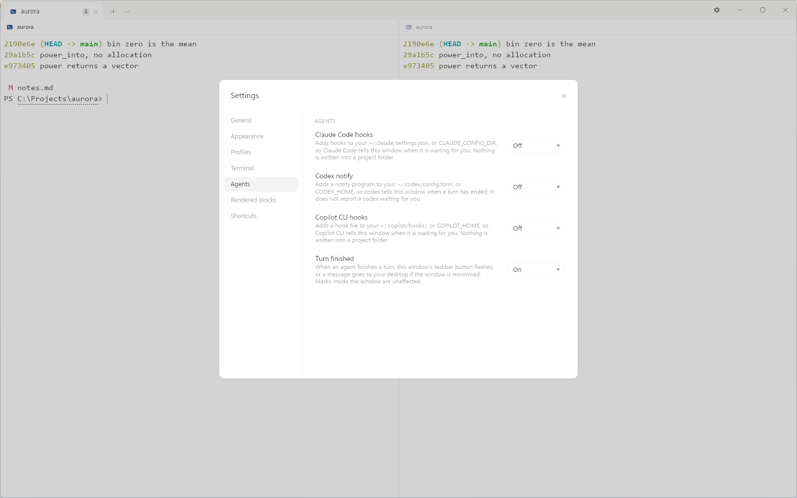
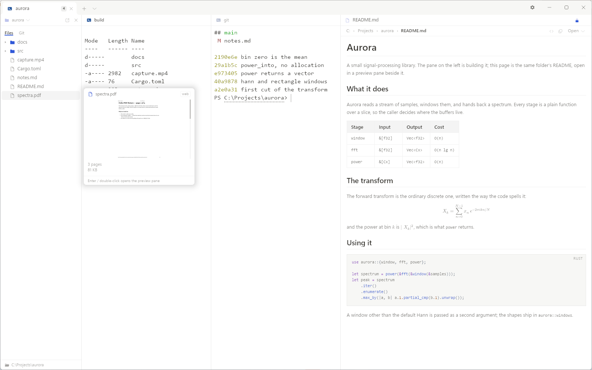
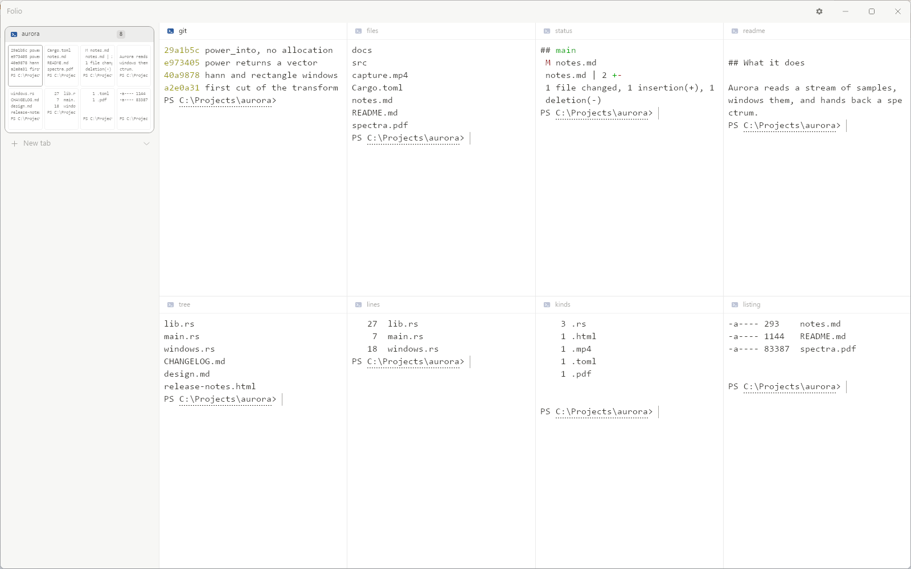
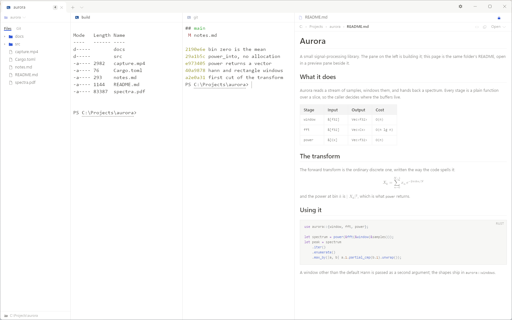

<picture>
  <source media="(prefers-color-scheme: dark)"
          srcset="assets/readme/hero-dark.svg">
  
</picture>

Folio is a Windows terminal: formulas are typeset where a command prints them,
files preview beside the prompt, and an agent that is waiting for you says so.

[中文说明](README.zh-CN.md) · [Shortcuts](docs/shortcuts.md) ·
[Security](SECURITY.md) · [Changes](CHANGELOG.md)

> **Preview.** 0.1.0 is the first public build, and it is not code-signed — see
> [SmartScreen](#smartscreen) below.

---

## Features

### LaTeX rendering in the terminal

The LaTeX a command prints is typeset where it was printed.

<picture>
  <source media="(prefers-color-scheme: dark)"
          srcset="docs/screenshots/terminal-math-dark.png">
  
</picture>

- `$…$` and `$$…$$` in command output are set in the line the command printed
  them on.
- The preview pane takes those, plus `\(…\)`, `\[…\]` and the bare `amsmath`
  environments.
- One typesetter serves both — LaTeX through MiTeX into Typst. What it cannot set
  is shown as it was printed.
- Inline `$…$` is told from a shell variable by the PowerShell integration below.
  Without it inline formulas stay as source, and `$$…$$` blocks still typeset.

### Made for agents

The agent that is waiting for you is marked on its tab, so there is nothing to go and check.

<picture>
  <source media="(prefers-color-scheme: dark)"
          srcset="docs/screenshots/settings-agents-dark.png">
  
</picture>

- A waiting agent lights a dot on its tab, flashes the taskbar if another program
  has the focus, and raises a Windows notification if the window is minimised or
  on another desktop.
- One request interrupts at most once, and the dot clears when you answer in that
  pane or the program withdraws the request. `Ctrl+Shift+A` jumps to the longest
  wait.
- Claude Code, Codex and GitHub Copilot CLI each have a switch on the Agent page
  in Settings that writes one notification hook into that tool's own configuration
  file and takes it back out again. Nothing is installed by default.
- Seven profiles start an agent — Claude Code, Codex, Copilot CLI, Kimi Code, pi,
  Hermes, OpenCode — found on the Windows path; one installed inside WSL is run
  from the WSL profile. Any program that writes `OSC 1337;RequestAttention=yes` is
  heard with nothing installed at all.

### Preview beside the prompt: files, PDF, video, web

What is in a file is readable beside the prompt, without opening another
application.

<picture>
  <source media="(prefers-color-scheme: dark)"
          srcset="docs/screenshots/preview-pdf-dark.png">
  
</picture>

- A card comes up under the pointer when it rests on a name in the files column:
  the PDF page by page, the video playing, the first lines of the text, the image
  itself.
- The preview pane opens the file beside the prompt — markdown typeset, PDF page
  by page, video playing, a web page with an address field and Back.
- A path the terminal printed opens in the preview pane on a click, and goes to
  the machine's own application on `Ctrl`+click. Paths nobody marked up are found
  too, once the file is confirmed to exist.
- A web address follows the same rule: a click opens it in the preview pane,
  `Ctrl`+click hands it to the browser.

<picture>
  <source media="(prefers-color-scheme: dark)"
          srcset="assets/readme/surfaces-dark.png">
  
</picture>

### Panes, tabs and windows that move

The layout changes while the sessions inside it keep running, and all of them can
be seen at once.

<picture>
  <source media="(prefers-color-scheme: dark)"
          srcset="docs/screenshots/cards-dark.png">
  
</picture>

- `Alt+Shift+-` splits a pane across, `Alt+Shift+=` splits it down. A tab or a
  single pane can be dragged out into a window of its own, and the panes it did
  not touch keep their widths.
- `Ctrl+Shift+Z` turns the tab strip into a column of cards, one per tab, each
  drawing that tab's own panes in the layout they have.
- `Ctrl+Shift+G` turns the files column into a Git panel: branch, working tree,
  staged and unstaged files, the commit graph, and a selected file's diff in the
  preview.
- `Ctrl+Shift+↑` and `Ctrl+Shift+↓` step between commands in the scrollback, and
  a command that failed is marked as having failed.

### Windows integration

<picture>
  <source media="(prefers-color-scheme: dark)"
          srcset="docs/screenshots/main-window-dark.png">
  
</picture>

- "Open Folio here" is in the Explorer context menu, under "Show more options".
- Windows PowerShell 5.1 ships PSReadLine 2.0.0, which misplaces the input line
  after the window is resized. Folio carries a patched 2.4.6 and installs it into
  your module path on request. On a machine whose execution policy is still the
  stock `Restricted`, the switch says so and hands you the `Set-ExecutionPolicy`
  command that lets the module load.

---

## Download

Take `folio-0.1.0-windows-x64.zip` from the releases page, unpack it wherever you
keep programs, and run `folio.exe`. There is no installer, and nothing is written
outside that folder until you run it. `SHA256SUMS.txt` is the hash of what you
downloaded. Needs **Windows 10 1809 or newer, or Windows 11, 64-bit**.

The web preview needs the **WebView2 Runtime**. Windows 11 has it; Windows 10
usually does, and if it does not, the Evergreen Runtime is
[here](https://developer.microsoft.com/microsoft-edge/webview2/). Without it
everything except the web preview works, and the preview says what is missing.

## SmartScreen

0.1.0 is not code-signed, so the first run may raise **"Windows protected your
PC"**. Click **"More info"**, check the app named there is `folio.exe`, and click
**"Run anyway"**. Do not switch SmartScreen off for this.

## First run

The first tab opens the first shell your machine actually has. The five shipped
profiles are looked for in order — PowerShell 7, Windows PowerShell, WSL, Git
Bash, Command Prompt — and one whose program is not installed is greyed out in the
picker rather than hidden. The seven agent profiles are found the same way, on the
Windows path.

The first time a PowerShell pane prints something, a strip says the PowerShell
integration is not installed. **Add to `$PROFILE`** appends one line —
`. "$env:APPDATA\Folio\shell-integration\folio.ps1"` — after copying the file as
it stood to a dated backup beside itself; delete that line to undo it. **Don't
show again** ends the asking, and closing the strip decides nothing, so the next
PowerShell asks once more. Command marks and inline `$…$` formulas run on that
integration. Git Bash and WSL need none of it and leave nothing on disk.

The three rows on the Agent page **install nothing by default**, and they are not
defaults that happen to be off: each reads the tool's own configuration file and
reports what is in it. On a new machine all three files are absent, so all three
read Off.

---

## Privacy

Folio sends nothing anywhere: no telemetry, no analytics, no crash reporting, no
update check, and no network client of its own. There is no model and no API key
in it; it serves the agents you already run. The only thing that reaches the
network is a page you open in the web preview.

What it remembers lives in two directories: `%APPDATA%\Folio` for settings,
profiles, schemes and the session, and `%LOCALAPPDATA%\Folio\WebView2` for the web
preview's cookies and cache. Delete the first and Folio starts as it did new.

```powershell
Remove-Item -Recurse -Force "$env:APPDATA\Folio"
Remove-Item -Recurse -Force "$env:LOCALAPPDATA\Folio\WebView2"
```

What is in each file, and why a full address ends up in `session.json`, is in
[`docs/PRIVACY.md`](docs/PRIVACY.md).

## Known issues

- **Not signed.** See [SmartScreen](#smartscreen) above.
- **A window was once reported drawing its top half black** after a move to a
  second monitor, unreproduced. Attach `%APPDATA%\Folio\diagnostics.log` if you
  hit it.
- **"Open Folio here" is not on the first page** of the Windows 11 context menu.
  That page needs a signed, packaged application, so it waits on signing.
- **`.webm` needs the VP9 or AV1 Video Extension** from the Microsoft Store. A
  stock Windows has neither, and without one there is no still and no playback.
- The rest are in [`CHANGELOG.md`](CHANGELOG.md).

## Licence

MIT or Apache-2.0, at your option. Every dependency's licence and the notices they
require are in [`THIRD-PARTY-NOTICES.md`](THIRD-PARTY-NOTICES.md).

The two licences grant copyright and patent permissions and nothing else. The
Folio name and the marks are not covered — [`TRADEMARK.md`](TRADEMARK.md) says
what that means for a modified distribution.

## Building and contributing

Building from source is in [`docs/BUILDING.md`](docs/BUILDING.md);
[`CONTRIBUTING.md`](CONTRIBUTING.md) is how a change gets made; security reports
go through the private channel in [`SECURITY.md`](SECURITY.md), not an issue.

## What's next

- A terminal on a hotkey.
- Markdown editing in the preview pane.
- macOS and Linux.
- The terminal from a phone.

These are directions, not dates.
