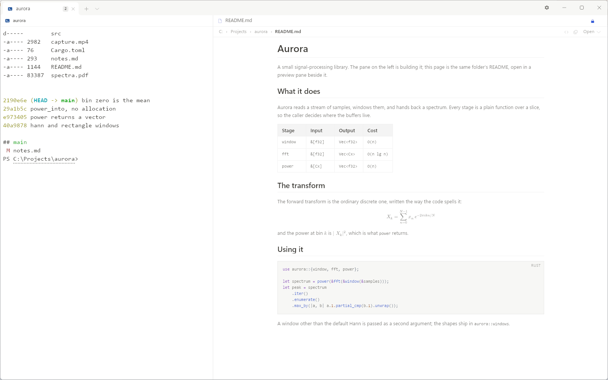

<picture>
  <source media="(prefers-color-scheme: dark)"
          srcset="assets/readme/hero-dark.svg">
  
</picture>

A Windows terminal for people who keep several coding agents running at once. It
says which one is waiting for you, and it keeps files, previews, formulas and git
in the same window.

[中文说明](README.zh-CN.md) · [Shortcuts](docs/shortcuts.md) ·
[Security](SECURITY.md) · [Changes](CHANGELOG.md)

> **Preview.** 0.1.0 is the first public build, and it is not code-signed — see
> [SmartScreen](#smartscreen) below.

---

## Which agent is waiting

With three or four agents running, the expensive part is not the work — it is the
moment one of them stops to ask you something, because nothing says which one did
and you end up clicking through tabs to find out.

Folio takes that over. When an agent in a pane stops and waits, its tab lights a
dot. If you are off in another program, the taskbar button flashes. If the window
is minimised or on another virtual desktop — and only then — a real Windows
notification goes up, carrying the program's own words. One request interrupts you
at most once. `Ctrl+Shift+A` goes straight to the pane that has been waiting
longest.

The dot does not clear because you glanced at it. It clears when you answer in
that pane, or when the program withdraws the request. Anything less and switching
tabs would quietly erase the fact that something is still waiting.

<picture>
  <source media="(prefers-color-scheme: dark)"
          srcset="docs/screenshots/cards-dark.png">
  
</picture>

Once there are more sessions than the tab strip has room to name, `Ctrl+Shift+Z`
turns it into a column of cards instead: one card per tab, each drawing that
tab's own panes in the layout they actually have. You can read what is happening
inside a tab without going into it. The same key puts the strip back.

Claude Code, Codex and GitHub Copilot CLI each have a switch on the Agents page in
Settings. Switching one on writes a notification hook into that tool's own
configuration file — `~/.claude/settings.json`, `~/.codex/config.toml`,
`~/.copilot/hooks/` — and switching it off takes exactly that back out. A dated
copy of the file is kept first, and nothing is written until you press the row.
Claude Code and Copilot CLI report that they are waiting for you; Codex reports
the end of a turn, which is all it offers to say.

You need none of the three. Any program that writes
`OSC 1337;RequestAttention=yes` is heard with nothing installed at all.

## It started with wanting to see a formula

This began as a small wish: when a command prints a formula, I wanted to see the
formula, not `\frac{1}{2}` spelled out.

<picture>
  <source media="(prefers-color-scheme: dark)"
          srcset="docs/screenshots/preview-markdown-dark.png">
  
</picture>

Mathematics printed into command output is now typeset where it stands, and shown
as it was printed when it cannot be. The markdown preview reads `$…$`, `\(…\)`,
`\[…\]` and the bare `amsmath` environments through the same typesetter — LaTeX
through MiTeX into Typst — so one formula looks the same in the terminal and in
the document.

The wish grew into the rest of the window. If a formula can open beside the
prompt, so can the document around it: markdown with its headings, tables and
code; a PDF page by page; images at their own pixels or fitted; `.mp4`, `.m4v`
and `.webm` playing in the pane; web pages hosted by the WebView2 engine Windows
provides, with an address field, a back stack and a source view for local files.
The files column on the left follows the pane's directory and watches it, so a
file a command has just written appears without a refresh — and `Ctrl+Shift+G`
turns that same column into a git panel: branch, working tree, staged and
unstaged files, the commit graph, and a selected file's diff in the preview.

The part that gets used most: a file path printed in the terminal opens beside it
when you click it, and goes to the machine's own application when you hold `Ctrl`.
Paths nobody marked up are found too, once the file is confirmed to exist. A URL
follows the same rule — a click keeps it in the window, `Ctrl`-click hands it
over.

<picture>
  <source media="(prefers-color-scheme: dark)"
          srcset="assets/readme/surfaces-dark.png">
  
</picture>

## Native, fast, careful with CJK

<picture>
  <source media="(prefers-color-scheme: dark)"
          srcset="docs/screenshots/main-window-dark.png">
  
</picture>

Rust, with text shaped and drawn on the GPU. The terminal is not a web page and
there is no browser engine underneath it; WebView2 appears in exactly one place,
the web preview, and it is the one Windows already has.

Wide characters are not an afterthought here. How many columns a character
occupies, where the cursor may land, where a selection may cut — that is the
oldest work in this repository, and a recorded corpus of width cases holds it byte
by byte. Three Chinese input methods were driven by hand on real hardware:
Microsoft Pinyin, WeType and Sogou. Sogou has a known temper — it never reports
the syllables you are still typing, so it draws them in its own candidate window
and only the committed text arrives. That text is correct.

Windows PowerShell 5.1 still ships PSReadLine 2.0.0, which takes its edit anchor
from a cell count made before the resize: narrow the window and the input line is
redrawn where it used to be, over text that has since moved. That is an upstream
defect, and other terminals hit it too. Folio carries a patched 2.4.6 compiled
into the executable and installs it into your own module path if you ask it to.

Installing it is a folder. Unpack, run — no installer, no telemetry, no network
client of its own.

## Everything else

Every shortcut is rebindable, colour schemes are files in a folder you can add to,
and five shell profiles ship, each overridable field by field. One process holds
many windows, and a tab or a single pane drags out into a window of its own and
back again — moved, not closed and re-opened, so the panes it did not touch keep
their widths to the pixel. Settings are in English or Chinese, switched without a
restart.

---

## Getting started

### Download

Take `folio-0.1.0-windows-x64.zip` from the releases page, unpack it wherever you
keep programs, and run `folio.exe`. There is no installer, and nothing is written
outside that folder until you run it. `SHA256SUMS.txt` is the hash of what you
downloaded. Needs **Windows 10 1809 or newer, or Windows 11, 64-bit**.

The web preview needs the **WebView2 Runtime**. Windows 11 has it; Windows 10
usually does, and if it does not, the Evergreen Runtime is
[here](https://developer.microsoft.com/microsoft-edge/webview2/). Without it
everything except the web preview works, and the preview says what is missing.

### SmartScreen

0.1.0 is not code-signed, so the first run may raise **"Windows protected your
PC"**. Click **"More info"**, check the app named there is `folio.exe`, and click
**"Run anyway"**. Do not switch SmartScreen off for this.

### First run

The first tab opens the first shell your machine actually has. The five shipped
profiles are looked for in order — PowerShell 7, Windows PowerShell, WSL, Git
Bash, Command Prompt — and a profile whose program is not installed is greyed out
in the picker rather than hidden.

The first time a PowerShell pane prints something, a strip says the PowerShell
integration is not installed. **Add to `$PROFILE`** appends one line —
`. "$env:APPDATA\Folio\shell-integration\folio.ps1"` — after copying the file as
it stood to a dated backup beside itself; delete that line to undo it, and nothing
else in the file has been touched. **Don't show again** ends the asking, and
closing the strip decides nothing, so the next PowerShell asks once more. The
integration is what command marks run on: `Ctrl+Shift+↑` and `Ctrl+Shift+↓` step
between commands, and a command that failed is marked as having failed. Git Bash
and WSL need none of this and leave nothing on disk.

The three rows on the Agents page **install nothing by default**, and they are not
defaults that happen to be off: each one reads the tool's own configuration file
and reports what is in it. On a new machine all three files are absent, so all
three read Off.

---

## What you should know

### Privacy

Folio sends nothing anywhere: no telemetry, no analytics, no crash reporting, no
update check, and no network client of its own. The only thing that reaches the
network is a page you open in the web preview.

What it remembers lives in two directories. `%APPDATA%\Folio` holds settings,
profiles, schemes and the session; `%LOCALAPPDATA%\Folio\WebView2` is the web
preview's own profile, with its cookies and cache. Delete the first and Folio
starts as it did the first time.

```powershell
Remove-Item -Recurse -Force "$env:APPDATA\Folio"
Remove-Item -Recurse -Force "$env:LOCALAPPDATA\Folio\WebView2"
```

What is in each file, and why a full address ends up in `session.json`, is in
[`docs/PRIVACY.md`](docs/PRIVACY.md).

### Known issues

- **Not signed.** See [SmartScreen](#smartscreen) above.
- **`.mov` does not play.** It gets a first frame, a length and a size, and the
  pane says why there is no play button. `.mkv` and `.avi` get no preview at all.
- **A window was once reported drawing its top half black** after a move to a
  second monitor, and it has not been reproduced; two monitors at different scales
  are otherwise measured on real hardware. If you hit it, attach
  `%APPDATA%\Folio\diagnostics.log`.
- **"Open Folio here" in Explorer is under "Show more options"**, not on the first
  page of the Windows 11 context menu. That page needs a signed, packaged
  application, so it waits on signing.
- **A `.webm` card can be blank on a stock Windows**, which may have no VP9 or AV1
  decoder for the still. Length, size and playback are unaffected.
- The rest are in [`CHANGELOG.md`](CHANGELOG.md).

### Licence

MIT or Apache-2.0, at your option. Every dependency's licence and the notices they
require are in [`THIRD-PARTY-NOTICES.md`](THIRD-PARTY-NOTICES.md).

Building from source is in [`docs/BUILDING.md`](docs/BUILDING.md);
[`CONTRIBUTING.md`](CONTRIBUTING.md) is how a change gets made; security reports
go through the private channel in [`SECURITY.md`](SECURITY.md), not an issue.
