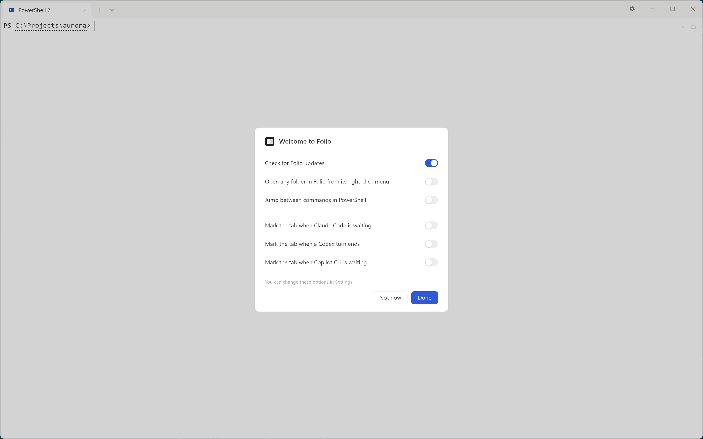
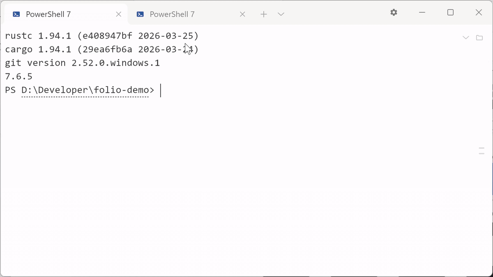
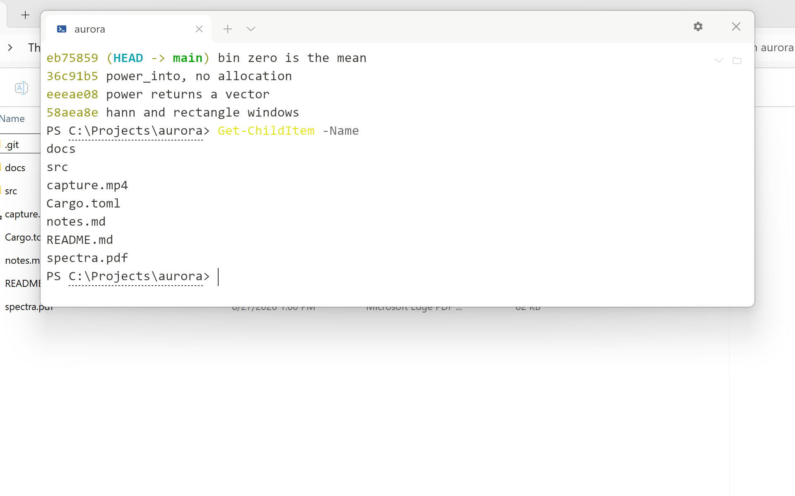
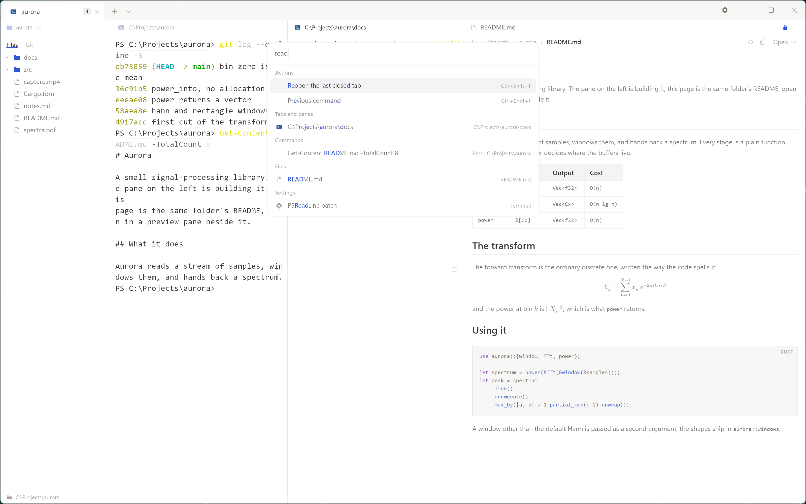

<picture>
  <source media="(prefers-color-scheme: dark)"
          srcset="assets/readme/hero-dark.svg">
  
</picture>

Folio 是一款 Windows 终端：命令输出的公式在其打印位置排版，命令提及的文件在提示符旁预览，等待用户响应的 agent 有明确标示。

[English](README.md) · [快捷键](docs/shortcuts.md) · [安全](SECURITY.md) · [更新记录](CHANGELOG.md)

> **预览版。** 0.2.2 为预览版本，已由 Weiyi Shi 签名，详见下方 [下载](#下载)。

---

## 下载

从 [releases 页面](https://github.com/lulu-loopp/folio-terminal/releases) 下载 [`folio-0.2.2-windows-x64.zip`](https://github.com/lulu-loopp/folio-terminal/releases/download/v0.2.2-preview/folio-0.2.2-windows-x64.zip)，解压到存放程序的目录，然后运行 `folio.exe`。无安装程序；运行之前，解压目录之外不会写入任何内容。`SHA256SUMS.txt` 为所下载文件的哈希值。需 **Windows 10 1809 或更高版本，或 Windows 11，64 位**。

`folio.exe` 和 `folio.msix` 带有数字签名，签名者为 **Weiyi Shi**，证书来自 Microsoft 的 Artifact Signing 服务。首次运行 `folio.exe` 时，如果 Windows 显示「Windows 已保护你的电脑」对话框，点击「更多信息」，然后点击「仍要运行」；对话框中显示的发布者为 **Weiyi Shi**。

压缩包内为同一目录下的九个文件，它们须放在一起：`folio.exe`，以及缺之则无法启动 shell 的 `conpty.dll` 与 `OpenConsole.exe`；`folio.msix`——资源管理器菜单第一页注册用的几 KB 包，它指向自身被解压到的目录；供 VS Code 使用的 `folio-here.cmd`；再加上两份许可、第三方声明与商标说明。

网页预览需 **WebView2 运行时**。Windows 11 自带该运行时；Windows 10 通常亦已安装，若未安装，可从此处获取 [Evergreen 运行时](https://developer.microsoft.com/microsoft-edge/webview2/)。缺少该运行时，除网页预览外的所有功能均正常，预览窗格会说明缺失项。

## 第一次运行

从未运行过 Folio 的机器只会收到一张卡，仅此一次。卡标题为**欢迎使用 Folio**，并询问六个问题，答案会分别写入 `%APPDATA%\Folio` 之外的文件，一行一项：是否在有新版本时提醒（这是唯一一项默认打开的）；是否在右键菜单中用 Folio 打开文件夹；是否启用 PowerShell 整合；以及本机实际装有的 Claude Code、Codex、Copilot CLI 各一行，开着的话，它们等待（Codex 是一回合结束）时其所在标签页会高亮。主题、字体、字号、语言或布局均不涉及——这些设置只需一次点击即可更改，且在设置得不对的那段时间里也不产生任何代价。

<picture>
  <source media="(prefers-color-scheme: dark)"
          srcset="docs/screenshots/first-run-dark.png">
  
</picture>

**将指针悬停在某一项上，会显示该项的说明**——包括该开关会写入用户的哪个文件，以及写入前会先将原文件复制为带日期的备份。卡上别的东西不必自我解释，因为它们不会往任何没预先说明的位置写入。

**卡上的所有选项都可在设置中更改**，因此卡上的任何决定都不是最后一次机会。**完成**应用当前开启的选项；**暂不**与 `Esc` 关闭卡并保留出厂值——更新检查开启，其余关闭——且不更改任何设置。无论选哪种方式，卡都不会再次出现，而其后的 shell 一直在运行。如果用户在此版本之前已使用过 Folio，则不会看到此卡：用户的 `settings.json` 已表明这一点。

第一个标签页会打开机器上实际存在的第一个 shell。五条内置配置按顺序查找——PowerShell 7、Windows PowerShell、WSL、Git Bash、命令提示符——未安装相应程序的配置不会出现在启动 shell 的菜单中；该配置仍保留在设置中的配置文件页，呈灰色并标明所查找的程序名称。七条 agent 配置以同样方式在 Windows PATH 中查找，卡上 agent 相关选项使用的也是同一查找逻辑。

PowerShell 整合会向 PowerShell 自行命名的 `$PROFILE` 文件添加一行——`. "$env:APPDATA\Folio\shell-integration\folio.ps1"`——添加前先将原文件复制为同目录下带日期的备份；删除该行即可撤销。该文件的位置由 shell 决定，因此若在回答卡问题时该选项处于开启状态，则下次启动的 PowerShell 会加载该行，设置 > 终端会一直显示此状态直到加载完成。若卡上未询问此选项，则首次有 PowerShell 窗格输出内容时，提示条会提供相同选项：**加进 `$PROFILE`** 执行添加，**不再提示**结束询问，关闭提示条则不做出任何决定，下次启动 PowerShell 时会再次询问。命令标记与行内 `$…$` 公式依赖该整合运行。Git Bash 与 WSL 均无需此整合，也不会在磁盘上留下任何内容。

设置的 Agent 页上的三行**默认不安装任何内容**，它们并非恰好关闭的默认项：每行都会读取对应工具自身的配置文件并报告其中内容。在新机器上这三个文件均不存在，因此三行均显示为关闭。

---

## 主要功能

### 命令输出中的 LaTeX 排版

命令输出的 LaTeX 在其打印位置完成排版。

<picture>
  <source media="(prefers-color-scheme: dark)"
          srcset="docs/screenshots/terminal-math-dark.png">
  
</picture>

- 命令输出中的 `$…$` 与 `$$…$$` 在对应打印行内完成排版。
- 预览窗格除上述两种写法外，还支持 `\(…\)`、`\[…\]` 及不带包裹的 amsmath 环境。
- 两处共用同一排版引擎：LaTeX 经 MiTeX 转换至 Typst；无法排版的内容按其打印原样显示。
- 行内 `$…$` 依赖 PowerShell 整合与 shell 变量进行区分；未安装整合时，行内公式保持源码原样，`$$…$$` 块仍照常排版。

### agent 的提醒与配置

等待响应的 agent 在其标签页上标记，无需逐个查看标签页。

<picture>
  <source media="(prefers-color-scheme: dark)"
          srcset="docs/screenshots/settings-agents-dark.png">
  
</picture>

- 等待响应的 agent 在其标签页显示一个圆点；焦点位于其他程序时，任务栏闪烁；窗口最小化或位于其他桌面时，发出 Windows 通知。
- 一次请求最多中断一次；圆点仅在用户于对应窗格内回复或该程序撤回请求后清除。`Ctrl+Shift+A` 可跳转至等待时间最长的一项。
- 设置的 Agent 页中，Claude Code、Codex 与 GitHub Copilot CLI 各有一行开关：开启时向对应工具自身的配置文件写入一个通知 hook，关闭时将其撤回。默认不安装任何内容。
- 七条配置可直接启动 agent：Claude Code、Codex、Copilot CLI、Kimi Code、pi、Hermes、OpenCode，均在 Windows PATH 中查找；安装于 WSL 内的 agent 从 WSL 配置启动。任何向终端写入 `OSC 1337;RequestAttention=yes` 的程序，无需安装任何内容，Folio 也能收到。

### 文件、PDF、视频与网页的预览

文件内容可在提示符旁直接阅读，无需打开其他应用程序。

<picture>
  <source media="(prefers-color-scheme: dark)"
          srcset="docs/screenshots/preview-pdf-dark.png">
  
</picture>

- 指针悬停于文件列中的文件名上时，弹出卡片：PDF 可逐页翻看，视频可播放，文本显示开头数行，图片显示图片本身。
- 文件在提示符旁的预览窗格中打开：markdown 完成排版，PDF 逐页显示，视频可播放，网页带有地址栏与后退功能。
- 终端输出的路径可单击打开至预览窗格；按住 `Ctrl` 并单击交由系统默认程序处理。未作标记的裸路径在确认文件存在后亦可识别。
- 网页地址遵循相同规则：单击在预览窗格中打开，`Ctrl`+单击交予浏览器处理。
- 窗口中同时可容纳的页面数与预览窗格数相同。第二个页面会在新窗格中打开，而不会让第一个窗格跳转到新地址，因此可将一个页面锁定，再在旁侧打开另一个页面；拖放到某个窗格上的页面会在该窗格中打开。

<picture>
  <source media="(prefers-color-scheme: dark)"
          srcset="assets/readme/surfaces-dark.png">
  
</picture>

### 标签页、窗格与窗口的排布

布局可随时调整，会话不中断，所有会话均可同时查看。

<picture>
  <source media="(prefers-color-scheme: dark)"
          srcset="docs/screenshots/tab-into-pane-dark.gif">
  
</picture>

<picture>
  <source media="(prefers-color-scheme: dark)"
          srcset="docs/screenshots/cards-dark.png">
  
</picture>

- `Alt+Shift+-` 横向分屏，`Alt+Shift+=` 纵向分屏。标签页或单个窗格可拖出并独立成窗，未触及的窗格宽度保持不变。
- 拖放到两个标签页接缝处的窗格会成为*介于两者之间*的标签页：标签页列表让出一个空位，窗格以占位形式站入其中，松手后即落在该位置。直接拖放到某个标签页上则会并入该标签页的布局。横排标签条、竖排标签栏与卡片列均以相同方式识别接缝。
- `Ctrl+Shift+Z` 将标签条切换为一列卡片，一张卡片对应一个标签页，卡片内按该标签页自身的布局绘出全部窗格。
- `Ctrl+Shift+G` 将文件列切换为 git 面板：显示分支、工作区、暂存与未暂存文件、提交图；选中文件后，其差异显示于预览窗格。
- `Ctrl+Shift+↑` 与 `Ctrl+Shift+↓` 可在历史输出的命令之间跳转，执行失败的命令标记为失败。
- 文件列上方的文件夹按钮列出各 shell 所在的目录，其后是最近指向过的五个文件夹，每个标记 `recent`。

### 快捷键呼出的终端

一个快捷键将终端呼出至当前画面之上，再按一次将其收起。

<picture>
  <source media="(prefers-color-scheme: dark)"
          srcset="docs/screenshots/quake-dark.png">
  
</picture>

- ``Win+` `` 将终端下拉至指针所在显示器的顶部，覆盖其下原有的画面；再按一次收起窗口，键盘交还给它覆盖前的程序。
- 它就是同一个 Folio：标签页、窗格、文件列、预览与全部快捷键均在，两次呼出之间 shell 与历史输出保持不变。
- 用户手动移动或调整后的矩形按显示器分别记录，下次在该显示器上呼出时落在上次的位置。
- 它与 Folio 同生同死：没有独立图标，键后也不留驻留进程；关闭最后一扇可见窗口即结束本次运行。
- **设置 > 快捷终端** 中可设置呼出键、新标签页使用的配置、窗口高度与宽度、距屏幕上沿的间距、失去键盘焦点时是否收起，以及每次运行首次呼出时执行的命令。
- 下次启动时，钉住的标签页可将上次运行的命令填回提示符——只填入，不执行。

### 一处搜索全部内容

一个面板同时回答五个问题，回车直达目标。

<picture>
  <source media="(prefers-color-scheme: dark)"
          srcset="docs/screenshots/palette-dark.png">
  
</picture>

- `Ctrl+Shift+P` 在窗口上方弹出面板，分五段且互不混排：Folio 可执行的动作、本窗已打开的窗格与标签页、本窗运行过的命令、文件列所在目录下的文件，以及设置项。
- 输入内容同时收窄五段，方向键在其中移动。回车落在窗格上即切至该窗格，落在文件上即在预览窗格中打开，落在设置项上即打开设置并定位到该行，落在动作上即执行该动作。
- 命令仍在运行时，Folio 在其所在窗格周围画出一圈提示，而非滚动到一条已经翻过去的行。
- 文件一段取自文件列所在目录的索引，该索引在窗口线程之外建立，目录层级较深时面板不必等待。

### 与 Windows 的集成

<picture>
  <source media="(prefers-color-scheme: dark)"
          srcset="docs/screenshots/main-window-dark.png">
  
</picture>

- **设置 > General > 资源管理器菜单**：打开时写入两个注册表键到 `HKEY_CURRENT_USER\Software\Classes`，加入「在 Folio 中打开」。在 Windows 11 上这项在「显示更多选项」页；在 Windows 10 上它在唯一的菜单中。如果 Windows 11 的文件夹里有 `folio.msix`，则同时注册该包到当前账户，使菜单项出现在第一页。无需管理员。关闭时移除已注册的项。
- Windows PowerShell 5.1 自带 PSReadLine 2.0.0，该版本在窗口改变大小后会错放输入行。Folio 内置一份已修补的 2.4.6 版本，用户可按需将其安装至模块目录。当机器的执行策略仍为出厂默认的 `Restricted` 时，开关会说明原因，并提供 `Set-ExecutionPolicy -Scope CurrentUser RemoteSigned` 命令。

### 与 Visual Studio Code 的配合

压缩包内 `folio.exe` 旁附带 `folio-here.cmd`，内容为一行：

```bat
@"%~dp0folio.exe" --cwd "%CD%"
```

在 VS Code 的设置界面或 `settings.json` 中将外部终端指向该文件：

```json
"terminal.external.windowsExec": "C:\\Tools\\folio\\folio-here.cmd"
```

此后 **终端 > 在外部终端中打开**（`Ctrl+Shift+C`）即在编辑器当前所在目录打开 Folio。之所以需要这个 `.cmd`，是因为该设置执行命令时不附带参数，而 Folio 由 `--cwd` 得知起始目录。

---

## 隐私

Folio 不向任何位置发送与用户有关的数据：无遥测、无统计、无崩溃上报。Folio 内不含模型或 API key，其服务对象为用户已运行的 agent。联网行为共两项：用户在网页预览中打开的页面，以及更新检查。

更新检查为对 `https://api.github.com/repos/lulu-loopp/folio-terminal/releases` 的一次 `GET`，本机所有窗口合计每天至多一次，只携带 `User-Agent: Folio`，不含版本号、标识符与 query。对返回结果，Folio 只做两件事：在设置齿轮上画一个标记，在设置中显示一行；不下载任何内容，也不替换任何文件。关闭方式为设置 > General > **检查新版**，或在 `settings.json` 中写 `"update_check": false`。

其保存的数据位于两个目录：`%APPDATA%\Folio` 存放设置、配置文件、配色与会话，`%LOCALAPPDATA%\Folio\WebView2` 存放网页预览的 cookie 与缓存。删除前者后，Folio 恢复至首次启动状态。

```powershell
Remove-Item -Recurse -Force "$env:APPDATA\Folio"
Remove-Item -Recurse -Force "$env:LOCALAPPDATA\Folio\WebView2"
```

各文件所存内容及 `session.json` 中完整地址的形成原因，详见 [`docs/PRIVACY.md`](docs/PRIVACY.md)。

## 已知问题

- **曾有窗口移至第二显示器后上半部分显示为黑色的报告，未能复现。** 如遇此问题，请附上 `%APPDATA%\Folio\diagnostics.log`。
- **`.webm` 需要 Microsoft Store 的 VP9 或 AV1 视频扩展。** 出厂 Windows 两者均未安装；缺少扩展时，首帧与播放均不可用。
- 其余问题见 [`CHANGELOG.md`](CHANGELOG.md)。

## 许可

MIT 或 Apache-2.0，任选其一。各依赖项的许可及其要求的声明，均列于 [`THIRD-PARTY-NOTICES.md`](THIRD-PARTY-NOTICES.md)。

两份许可仅授予版权与专利许可，不包含其他内容。Folio 名称及标识不在许可范围内，[`TRADEMARK.md`](TRADEMARK.md) 说明了这对修改后分发的影响。

## 构建与参与

从源码构建见 [`docs/BUILDING.md`](docs/BUILDING.md)；变更流程见 [`CONTRIBUTING.md`](CONTRIBUTING.md)；安全报告请通过 [`SECURITY.md`](SECURITY.md) 中的私密渠道提交，勿以公开 issue 形式提出。

## 后续方向

- 预览窗格中的 markdown 编辑
- macOS 与 Linux
- 在手机上远程使用终端

以上为方向，非时间承诺。
