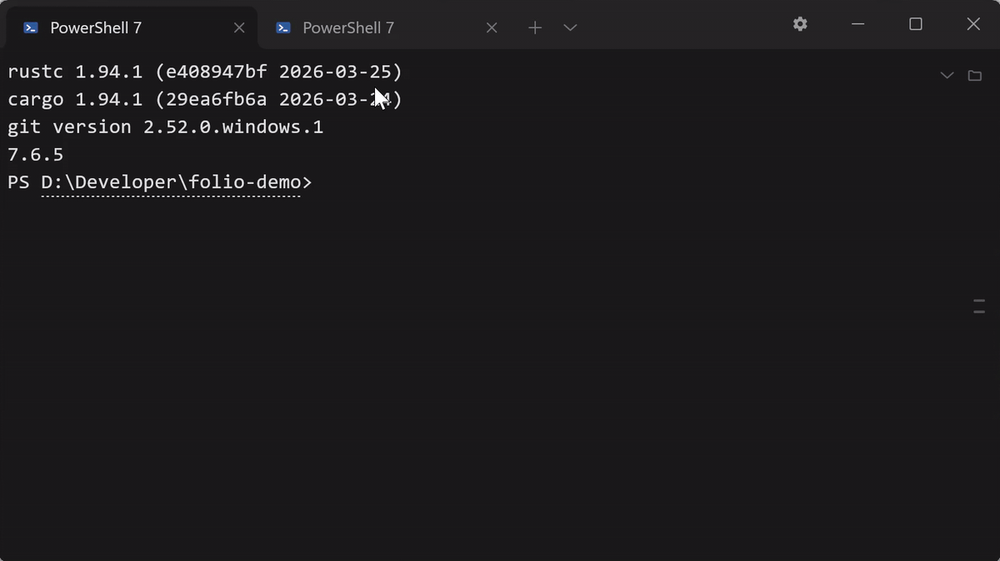

<picture>
  <source media="(prefers-color-scheme: dark)"
          srcset="assets/readme/hero-dark.svg">
  
</picture>

Folio 是一款 Windows 终端：命令输出的公式在其打印位置排版，命令提及的文件在提示符旁预览，等待用户响应的 agent 有明确标示。

[English](README.md) · [快捷键](docs/shortcuts.md) · [安全](SECURITY.md) · [更新记录](CHANGELOG.md)

> **预览版。** 0.1.0 为第一个公开版本，未进行代码签名，详见下方 [SmartScreen](#smartscreen)。

---

## 主要功能

### 命令输出中的 LaTeX 排版

命令输出的 LaTeX 在其打印位置完成排版。

<picture>
  <source media="(prefers-color-scheme: dark)"
          srcset="docs/screenshots/terminal-math-dark.png">
  
</picture>

- 命令输出中的 `$…$` 与 `$$…$$` 在对应打印行内完成排版。
- 预览窗格除上述两种写法外，还支持 `\(…\)`、`\[…\]` 及不带包裹的 amsmath 环境。
- 两处共用同一排版引擎：LaTeX 经 MiTeX 转换至 Typst；无法排版的内容按其打印原样显示。
- 行内 `$…$` 依赖 PowerShell 整合与 shell 变量进行区分；未安装整合时，行内公式保持源码原样，`$$…$$` 块仍照常排版。

### agent 的提醒与配置

等待响应的 agent 在其标签页上标记，无需逐个查看标签页。

<picture>
  <source media="(prefers-color-scheme: dark)"
          srcset="docs/screenshots/settings-agents-dark.png">
  
</picture>

- 等待响应的 agent 在其标签页显示一个圆点；焦点位于其他程序时，任务栏闪烁；窗口最小化或位于其他桌面时，发出 Windows 通知。
- 一次请求最多中断一次；圆点仅在用户于对应窗格内回复或该程序撤回请求后清除。`Ctrl+Shift+A` 可跳转至等待时间最长的一项。
- 设置的 Agent 页中，Claude Code、Codex 与 GitHub Copilot CLI 各有一行开关：开启时向对应工具自身的配置文件写入一个通知 hook，关闭时将其撤回。默认不安装任何内容。
- 七条配置可直接启动 agent：Claude Code、Codex、Copilot CLI、Kimi Code、pi、Hermes、OpenCode，均在 Windows PATH 中查找；安装于 WSL 内的 agent 从 WSL 配置启动。任何向终端写入 `OSC 1337;RequestAttention=yes` 的程序，无需安装任何内容，Folio 也能收到。

### 文件、PDF、视频与网页的预览

文件内容可在提示符旁直接阅读，无需打开其他应用程序。

<picture>
  <source media="(prefers-color-scheme: dark)"
          srcset="docs/screenshots/preview-pdf-dark.png">
  
</picture>

- 指针悬停于文件列中的文件名上时，弹出卡片：PDF 可逐页翻看，视频可播放，文本显示开头数行，图片显示图片本身。
- 文件在提示符旁的预览窗格中打开：markdown 完成排版，PDF 逐页显示，视频可播放，网页带有地址栏与后退功能。
- 终端输出的路径可单击打开至预览窗格；按住 `Ctrl` 并单击交由系统默认程序处理。未作标记的裸路径在确认文件存在后亦可识别。
- 网页地址遵循相同规则：单击在预览窗格中打开，`Ctrl`+单击交予浏览器处理。

<picture>
  <source media="(prefers-color-scheme: dark)"
          srcset="assets/readme/surfaces-dark.png">
  
</picture>

### 标签页、窗格与窗口的排布

布局可随时调整，会话不中断，所有会话均可同时查看。



<picture>
  <source media="(prefers-color-scheme: dark)"
          srcset="docs/screenshots/cards-dark.png">
  
</picture>

- `Alt+Shift+-` 横向分屏，`Alt+Shift+=` 纵向分屏。标签页或单个窗格可拖出并独立成窗，未触及的窗格宽度保持不变。
- `Ctrl+Shift+Z` 将标签条切换为一列卡片，一张卡片对应一个标签页，卡片内按该标签页自身的布局绘出全部窗格。
- `Ctrl+Shift+G` 将文件列切换为 git 面板：显示分支、工作区、暂存与未暂存文件、提交图；选中文件后，其差异显示于预览窗格。
- `Ctrl+Shift+↑` 与 `Ctrl+Shift+↓` 可在历史输出的命令之间跳转，执行失败的命令标记为失败。

### 与 Windows 的集成

<picture>
  <source media="(prefers-color-scheme: dark)"
          srcset="docs/screenshots/main-window-dark.png">
  
</picture>

- 「在此处打开 Folio」位于资源管理器右键菜单的「显示更多选项」之下。
- Windows PowerShell 5.1 自带 PSReadLine 2.0.0，该版本在窗口改变大小后会错放输入行。Folio 内置一份已修补的 2.4.6 版本，用户可按需将其安装至模块目录。当机器的执行策略仍为出厂默认的 `Restricted` 时，开关会说明原因，并提供 `Set-ExecutionPolicy -Scope CurrentUser RemoteSigned` 命令。

---

## 下载

从 releases 页面获取 `folio-0.1.0-windows-x64.zip`，解压至存放程序的目录，运行 `folio.exe`。无安装程序；运行之前，解压目录之外不会写入任何内容。`SHA256SUMS.txt` 为所下载文件的哈希值。需 **Windows 10 1809 或更高版本，或 Windows 11，64 位**。

网页预览需 **WebView2 运行时**。Windows 11 自带该运行时；Windows 10 通常亦已安装，若未安装，可从此处获取 [Evergreen 运行时](https://developer.microsoft.com/microsoft-edge/webview2/)。缺少该运行时，除网页预览外的所有功能均正常，预览窗格会说明缺失项。

## SmartScreen

0.1.0 未进行代码签名，首次运行时可能出现「Windows 已保护你的电脑」提示。请点击「更多信息」，确认所列程序名为 `folio.exe`，再点击「仍要运行」。请勿为此关闭 SmartScreen。

## 第一次运行

第一个标签页打开系统中排在最前的 shell。五条内置 shell 配置按 PowerShell 7、Windows PowerShell、WSL、Git Bash、命令提示符的顺序查找；未安装对应程序的配置在选择器中显示为灰色而非隐藏。七条 agent 配置以同样方式在 Windows PATH 中查找。

第一个 PowerShell 窗格输出内容后，显示提示条，说明 PowerShell 整合尚未安装。**加进 `$PROFILE`** 在 PowerShell 配置文件末尾追加一行 `. "$env:APPDATA\Folio\shell-integration\folio.ps1"`，追加前先将原文件按日期另存为备份；删除该行可撤销。**不再提示** 终止询问；直接关闭提示条不构成决定，下一个 PowerShell 窗格会再次询问。命令标记与行内 `$…$` 公式依赖该整合。Git Bash 与 WSL 无需安装任何内容，亦不在磁盘上留下痕迹。

设置的 Agent 页中三行**默认不安装任何内容**，且并非「默认关闭」的开关：每行均读取对应工具自身的配置文件并如实显示其中内容。新机器上三个文件均不存在，因此三行均显示为关闭。

---

## 隐私

Folio 不向任何位置发送数据：无遥测、无统计、无崩溃上报、无更新检查，亦无自有网络客户端。唯一联网行为为用户在网页预览中打开的页面。Folio 内不含模型或 API key，其服务对象为用户已运行的 agent。

其保存的数据位于两个目录：`%APPDATA%\Folio` 存放设置、配置文件、配色与会话，`%LOCALAPPDATA%\Folio\WebView2` 存放网页预览的 cookie 与缓存。删除前者后，Folio 恢复至首次启动状态。

```powershell
Remove-Item -Recurse -Force "$env:APPDATA\Folio"
Remove-Item -Recurse -Force "$env:LOCALAPPDATA\Folio\WebView2"
```

各文件所存内容及 `session.json` 中完整地址的形成原因，详见 [`docs/PRIVACY.md`](docs/PRIVACY.md)。

## 已知问题

- **未签名。** 见上方 [SmartScreen](#smartscreen)。
- **曾有窗口移至第二显示器后上半部分显示为黑色的报告，未能复现。** 如遇此问题，请附上 `%APPDATA%\Folio\diagnostics.log`。
- **「在此处打开 Folio」不在 Windows 11 右键菜单的首层。** 首层菜单要求程序已完成签名并打包，该功能待签名后实现。
- **`.webm` 需要 Microsoft Store 的 VP9 或 AV1 视频扩展。** 出厂 Windows 两者均未安装；缺少扩展时，首帧与播放均不可用。
- 其余问题见 [`CHANGELOG.md`](CHANGELOG.md)。

## 许可

MIT 或 Apache-2.0，任选其一。各依赖项的许可及其要求的声明，均列于 [`THIRD-PARTY-NOTICES.md`](THIRD-PARTY-NOTICES.md)。

两份许可仅授予版权与专利许可，不包含其他内容。Folio 名称及标识不在许可范围内，[`TRADEMARK.md`](TRADEMARK.md) 说明了这对修改后分发的影响。

## 构建与参与

从源码构建见 [`docs/BUILDING.md`](docs/BUILDING.md)；变更流程见 [`CONTRIBUTING.md`](CONTRIBUTING.md)；安全报告请通过 [`SECURITY.md`](SECURITY.md) 中的私密渠道提交，勿以公开 issue 形式提出。

## 后续方向

- 快捷键呼出的临时终端
- 预览窗格中的 markdown 编辑
- macOS 与 Linux
- 在手机上远程使用终端

以上为方向，非时间承诺。
