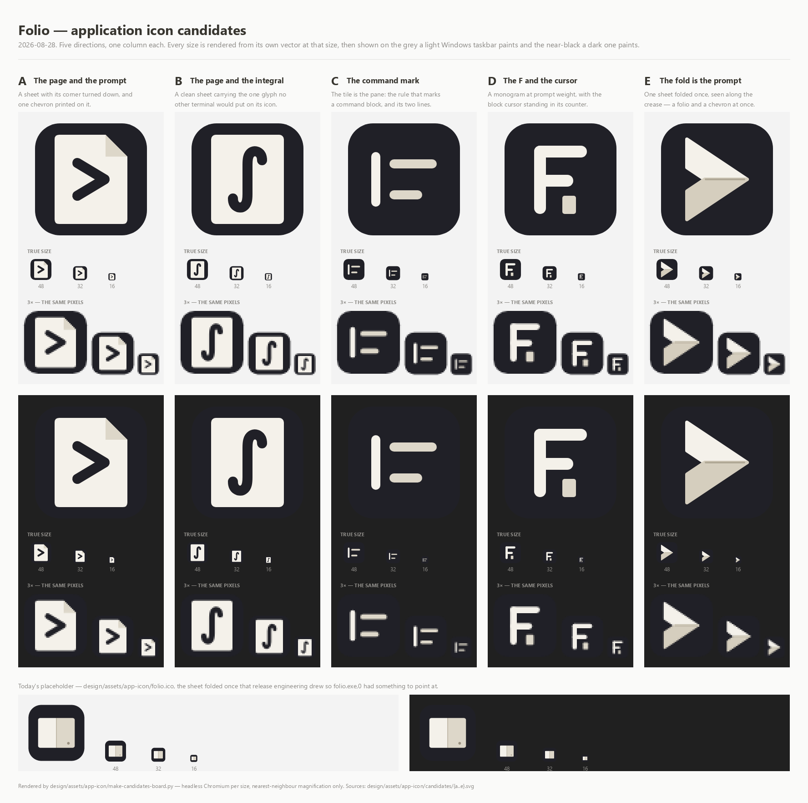

# The application icon

What `folio.exe` wears in the taskbar, in Alt-Tab, on the desktop and in the
Start menu. One file is shipped — `folio.ico` — and everything else here exists
to draw it or to argue about it.

| File | What it is |
| --- | --- |
| `folio.ico` | The icon in the binary. **Still the placeholder**: a sheet folded once, drawn so `folio.exe,0` had something to point at. |
| `make-folio-ico.py` | How that placeholder is drawn — geometry in code, no input file. |
| `candidates/{a..e}.svg` | Five directions for the real mark, hand-set in plain SVG. |
| `candidates/{a..e}.ico` | Each of those five built out to all nine sizes, ready to drop in. |
| `candidates-2026-08-28.png` | The contact sheet the choice is made from. |
| `make-ico.py` | One SVG in, one nine-size `.ico` out. |
| `make-candidates-board.py` | Redraws the contact sheet from the five SVGs. |

## The five



**A — the page and the prompt.** A sheet with its top-right corner turned down,
and one chevron printed on it. It is the two halves of the name said literally
and at the same time: a page, and the character a terminal puts in front of you.
The chevron is knocked out of the paper rather than laid on it, so there is one
ink and one paper in the whole drawing and no third colour to defend.

**B — the page and the integral.** The same sheet, clean, carrying the one glyph
no other terminal would put on its icon. This is the only candidate that says
what Folio does rather than what it is: the integral is the hero's own motif
(`assets/readme/hero-light.svg` sets the Gaussian integral in the output of a
command), redrawn at icon weight — the stroke is about three times heavier than
a typeset `∫`, because a typeset one is invisible below 48 pixels.

**C — the command mark.** The tile itself is the pane; inside it, the rule that
marks a command block down its left margin and two lines of output beside it.
This is the one candidate built from something already in the window rather than
from something about the name, and it is also the most generic: at small sizes
it is a bar and two dashes, which is what a hundred list icons look like. It is
on the sheet because it is the honest test of whether the window's own motif can
carry the door.

**D — the F and the cursor.** A monogram at prompt weight — three strokes of one
pen — with the block cursor standing in the letter's lower counter, on the same
baseline as its foot. The counter of an F is exactly the shape of a line waiting
for input, so the cursor is not an ornament stuck beside the letter; it is
sitting in the place the letter already left empty.

**E — the fold is the prompt.** One sheet folded once and seen along the crease,
so that the two half-pages make the shape of a chevron. A folio *is* a sheet
folded once; a prompt *is* a chevron; this is the one drawing where those are
not two ideas next to each other but the same shape read twice. The half turned
away from the light is the darker paper, as in the placeholder, and the fold
runs out to the point.

## What the colours are, and why there are so few

Two papers and a graphite, taken from the placeholder and from the hero:
`#F4F1EA` for the half facing the light, `#DDD7C9` (E: `#D5CEBE`) for the half
turned away, `#202027` for the tile. **No accent colour anywhere**, which is the
standing decision from the wordmark study (`design/assets/wordmark-r2/DECISION.md`):
in every option tried there, the cobalt was the first stroke that looked
borrowed. A tile that is graphite in all five is not a lack of imagination
either — it is what guarantees the mark survives a light taskbar, where a
cream-on-cream icon disappears.

## What 16 pixels costs, candidate by candidate

The contact sheet shows every size rendered from its own vector at that size,
and then the same pixels blown up 3× with no smoothing. That second strip is the
one to read: it is the icon's actual grid, not a smooth restatement of the
drawing.

* **A** keeps its silhouette and loses its corner. At 16 the turned-down corner
  is one lighter pixel; what survives is *page with a dark wedge in it*, which
  is still the right sentence. The cost is that a dark glyph inside a light
  shape has to be small — the chevron is about four pixels wide at 16 — so A is
  the weakest of the five in a busy taskbar and one of the strongest at 48.
* **B** pays the most. An integral is a modulated S, and at 16 pixels the two
  hooks close up into a vertical smudge; it reads as *page with something
  written on it*, which is arguably still true but is no longer the integral.
  B is a 32-and-up drawing.
* **C** is the most robust of the nested drawings, because nothing is nested:
  the bar and the two lines sit straight on the tile, so each gets a clean pixel
  and a clean gap. It costs distinctiveness instead — at 16 it is indistinguishable
  from an alignment or list icon.
* **D** survives as a letter and loses the cursor. At 16 the block merges into
  the counter and the mark reads as a solid F, which is not wrong, only quieter
  than intended. The stem and both arms hold at roughly a pixel and a half.
* **E** is the only candidate that is *better* small than large, because it is
  made of filled shapes and not of a glyph inside a frame: at 16 it is a
  two-tone wedge with both tones still legible, and nothing about it has
  degraded. Its risk is the opposite one, and it should be said plainly: a
  right-pointing wedge is also what a send button and a play button look like.

**A note on A's corner.** The wordmark study put the turned-down corner out of
bounds for the signature mark — it is the shape every document icon in the world
already uses. A is on the sheet anyway, because the brief for these five asked
for it and because the question is worth putting to the eye rather than settling
from the record. If A wins, that earlier call is the thing to revisit first.

## Building an `.ico` from one of these

```
python design/assets/app-icon/make-ico.py design/assets/app-icon/candidates/e.svg
```

Writes `e.ico` beside the SVG. Give it a second path to write somewhere else,
and `--browser` to name the renderer:

```
python design/assets/app-icon/make-ico.py candidates/e.svg folio.ico
python design/assets/app-icon/make-ico.py candidates/e.svg --browser "C:\Program Files\Google\Chrome\Application\chrome.exe"
```

It needs Pillow and a Chromium-family browser; it finds Chrome or Edge on its
own if one is installed in the usual place. Nine sizes — 16, 20, 24, 32, 40, 48,
64, 128, 256 — every one of them **rendered from the vector at that size** and
not shrunk from the 256, because Windows picks the nearest entry upward and
scales down whatever it finds, so an icon assembled from one bitmap arrives at
16 pixels having been resampled twice. The entries below 128 are stored as
classic DIB and 128 and 256 as PNG, which is the split every consumer of the
format expects.

Redraw the contact sheet after editing any of the five:

```
python design/assets/app-icon/make-candidates-board.py
```

## Putting the chosen one in the binary

`crates/bt-app/build.rs` reads exactly one path —
`design/assets/app-icon/folio.ico` — turns it into the `.res` file that carries
the icon and the version block, and hands that to the linker. It also declares
that path as a rebuild trigger, so replacing the file is the whole change:

```
python design/assets/app-icon/make-ico.py design/assets/app-icon/candidates/e.svg design/assets/app-icon/folio.ico
cargo build -p bt-app
```

Two things to know about the swap:

* **The icon group must stay group 1.** `build.rs` writes it as group one
  because Explorer draws an executable with its lowest-numbered group, and
  `bt_platform::context_menu_shape` registers `folio.exe,0` meaning that one.
  Nothing here changes that; it is only a reason not to add a second group later.
* **Windows caches icons per file path.** After a rebuild, Explorer and the
  taskbar can keep showing the old drawing for a while. `ie4uinit.exe -show`
  clears the shell's cache; a fresh `folio.exe` in a fresh directory always
  shows the truth.

Once a candidate is chosen, its SVG becomes the source of record: keep it in
`candidates/`, or move it beside `folio.ico` and retire `make-folio-ico.py`,
which draws the placeholder and nothing else.
