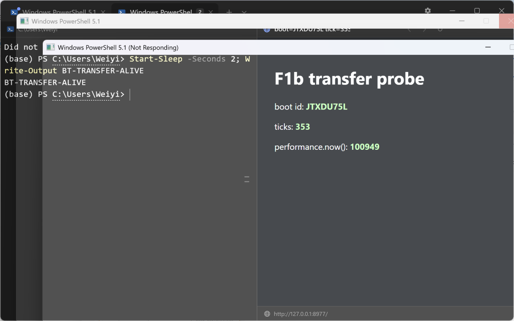
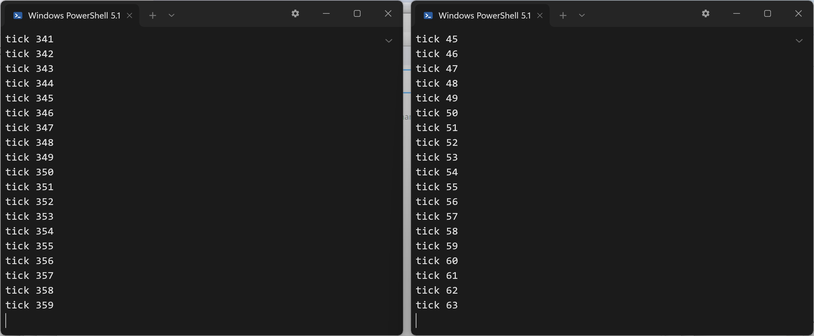
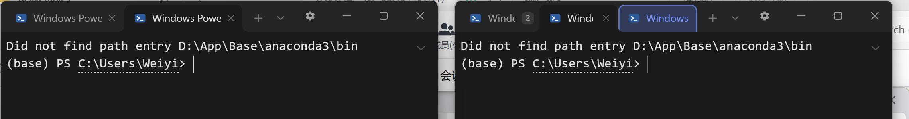
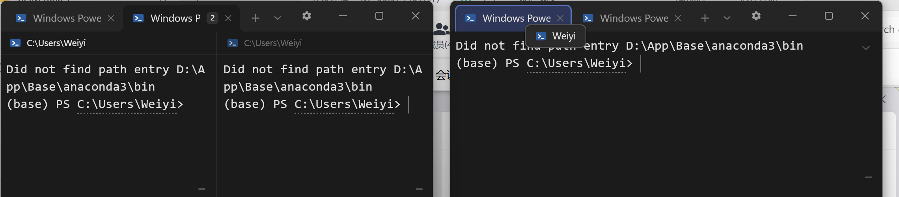
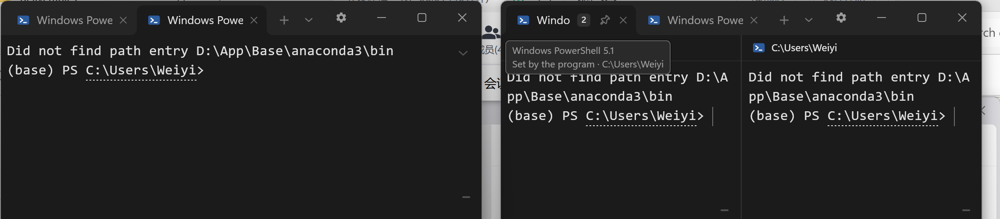
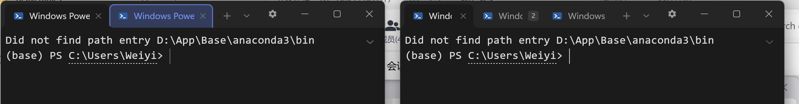
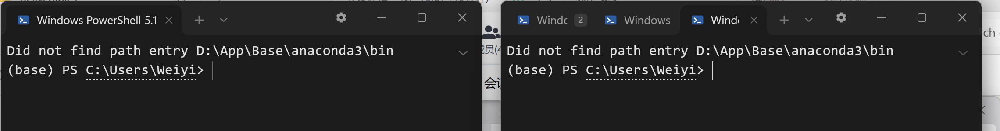
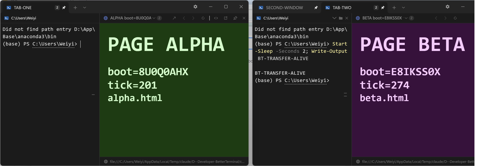
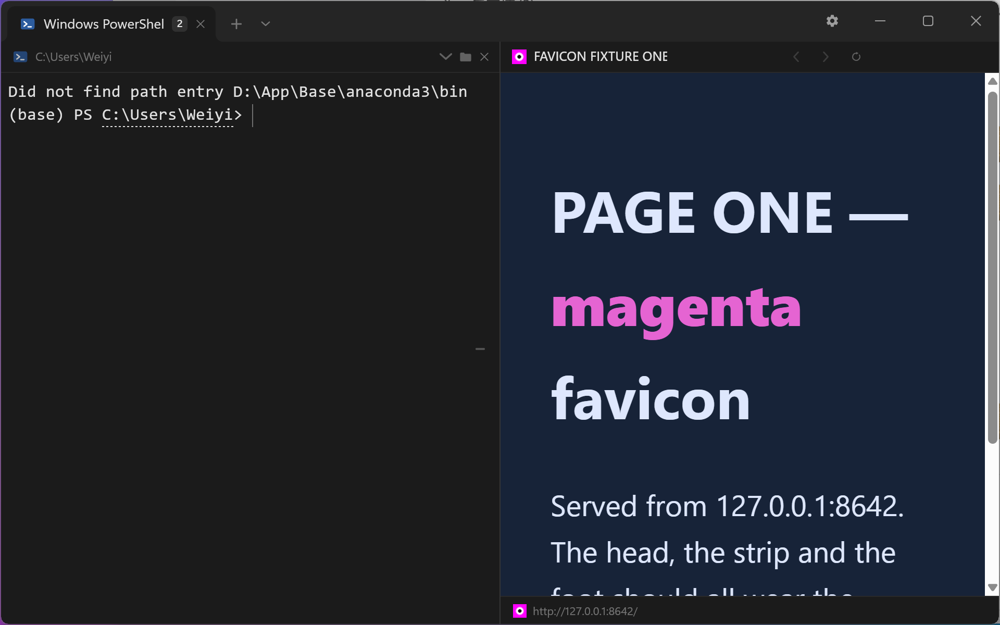
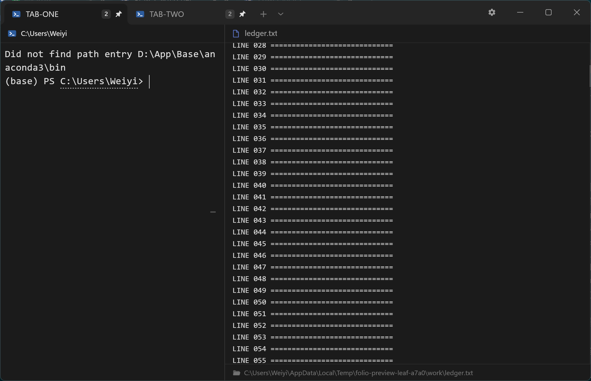

# BetterTerminal 技术方案 v3.7（M1.7 resize 单一所有权修订）

> Resize-staging 可达性修订（2026-08-07）：vendor native history 仍负责每次原生 reflow，
> 但不再在两次 actor 操作之间成为不可投影的私有尾部。每次 local resize / PTY feed / ConPTY
> reconcile 完成后，history 整批原子转交 `TranscriptStore` 的 reversible resize staging，立即进入
> `frozen + staging + live` 连续视口；下一次原生操作前整批交回 vendor escrow。转交期间 vendor
> history 为空，vendor 只保留不可呈现的原样 escrow，因此没有并行 mutable owner、文本去重或
> Frozen thaw。最终静默边界仍走一次正常 harvest/finalize，录制的 PTY 字节语义不变。

> M1.8-r4（2026-07-18）活动逻辑行修订：harvest 批尾若仍以 `WRAPLINE` 因果连续到
> live 第 0 行，则它不是可定稿历史，而是唯一的可变 staging candidate。下一次 resize 事务
> 开始时，该 candidate 原样交还 vendor native history，由 vendor 将整条活动行与 live 共同
> reflow。这个有界 reverse-harvest 不触碰任何 Frozen/History 行，因而不构成 thaw。失焦窗口
> 保留空心 cursor，聚焦恢复实心 cursor；DEC `SHOW_CURSOR` 可见性与窗口焦点呈现相互独立。
>
> M1.8（2026-07-18）补充视觉稳定性边界：viewport 滚动态只有 `Bottom` 与语义
> `Anchored(logical source, in-source offset)`；resize 只重投影、不创建或改写用户滚动锚。
> `Resized` 回调只允许“新 swapchain 几何 + 新投影 frame”一次呈现，回调前由 DWM 保持上一张
> 完整 back buffer。一次 vendor harvest 内的 WRAPLINE 是同一网格的因果事实，允许重接；已闭合
> 批尾仍强制 `wrap-split`，活动批尾按上面的 M1.8-r4 规则保留。详见
> `docs/M1.8-resize-visual-stability.md`。
>
> v3.7（M1.7 六轮、用户裁决）：撤销 v3.5/v3.6 的「resize 历史严格净零」产品承诺。
> ConPTY 的公开 resize 面没有 repaint begin/end、request ID 或输出批次身份；逐 cell 完全相同的
> 真输出与 repaint 在 VT 事实层不可区分，因此「repaint 全去除 + 真输出零丢失 + 真重复保留」
> 信息论上不能同时保证。新硬边界是：**不崩、不焊接、不静默丢真实输出**。接受 WT 级结果：
> 一次快速拖拽结束后可残留 0～几行由 vendor 原生 reflow 排整齐的干净内容副本。
>
> v3.7 采用单一所有权：resize 事务期间 vendor 原生 scrollback 独占完整可变尾部，事务结束
> 一次性收割进转录；删除 v3.5/v3.6 的 reversible resize staging、settlement 与内容去重账本。
> 本地 surface/live grid 逐个窗口事件跟随；winit 0.30.13 没有 enter/exit-size-move 事件，故以
> 200ms `Resized` 静默提交唯一最终 ConPTY 尺寸，再等 PTY 输出静默 200ms 后收割。
>
> **扣留政策位已退役（2026-08-16）。** 2026-08-04 为 PSReadLine 陈旧渲染锚点加过一台「输入行有字
> 就扣住 resize」的机器（`TYPED_INPUT_RESIZE_DEFERRAL` + confirm-then-release 空行确认窗），用户
> 2026-08-06 当场否决（「冻结然后裁剪」比它挡下的残影更难受），机器留作**默认关**的政策位并立项
> 自修根因。根因已治、补丁版 PSReadLine 已发（集成脚本 ≥2.4.6 免走反射），该裁决的末句「修好后
> 扣留政策位永久退役」于此兑现：常量、`typed_input_defers_resize`、`sample_typed_input_gate`、
> `PendingPtyResize::blank_since` 与只为它存在的四条 policy=true 红门一并删除。**resize 路径现在
> 只剩一条**：本地网格逐事件跟随，ConPTY 只在 200ms 静默边界听一次。钉死在 `false` 的政策位不是
> 产品的一个选项，而是一条没有任何在跑的测试覆盖的第二读法。

> v3.6（M1.7 四轮返工，**已被 v3.7 推翻，保留演进史**）：本地 PTY resize 打开静默事务；最后一次 resize 后 1200ms
> 且最后一批输出后 200ms 才结算。事务内 full-screen scroll 不定稿；结算按逻辑行将
> 待定稿尾部与 live 顶部去重，真输出保序入历史。补齐 clear 行位置过滤与 reflow 可证上界。

> v3.5（M1.7 用户实测返工，**已被 v3.7 推翻，保留演进史**）：resize 驱逐改为可逆 staging；grow 从 staging 拉回
> live，稳态 shrink-grow 不再冻结历史。resize staging 与 live 由 vendor 的原生 grid
> reflow 联合重排，WRAPLINE 边界空格保留；空白几何行丢弃；resize 行数变化不参与
> viewport 的“新内容到达”offset 补偿。冻结历史仍严格单向，不发生 History→Live thaw。

> v3.3（回应第五轮）：消除三处规格矛盾——① 删除"冻结历史占据新增视觉空间"的残留表述
> （变高=live 屏自身变大，可见历史量不变）；② 变矮的淘汰顺序以 alacritty 实际报告为准并给出
> oracle；③ 锚点迁移统一为两步（捕获时 Live→Staging，定稿时 Staging→History）。

> 前置：`docs/PROBLEM-LIST.md`、`docs/RESEARCH-SUMMARY.md`、`docs/research/`。
> 审核记录：`docs/reviews/codex-review-design-v1.md` ~ `-v4.md`。
> v3.1 要点：scrollback 所有权落定（alacritty=0，转录层唯一）、删除 thaw、ContentAnchor
> 全序/affinity/降级、DetectionRevision 独立、背压容量契约、BlockSource 快照策略。
> v3.2 修订要点（回应第四轮；其中 resize-grow 决策已由 v3.5 用户实测推翻）：① resize-grow 当时落定为不回填历史，live 屏底部加
> 空行（alacritty 无历史语义，**不是 tmux 语义**，v3.1 表述有误）；回填/thaw 作为 post-M0
> 可选增强单独立项；② staging 补 StagingId/跨界 resize 强制拆分/超限强制定稿；③ ContentAnchor
> 增 Staging 变体、按 Screen 分命名空间的全序；④ worker 溢出/最低份额/按数量限流；⑤ G1/G3 补 oracle。

## 1. 总体架构

### 1.1 核心设计不变量

1. **Canonical Transcript 是真相（对已冻结内容）**：冻结时构建规范转录（逻辑行文本 + soft-wrap 层次 + 样式/超链接 span + generation）。富内容是转录区间上的可撤销**装饰**。活动网格内容的真相是 grid 本身——两者由统一 `ContentAnchor` 桥接（§3.2）。
2. **双平面 + 单向冻结 + 可变尾部单一所有者**：稳态 alacritty scrollback=**0**，正常上滚由转录 staging/冻结历史拥有；resize 事务开始时，普通 normal staging 以 `wrap-split` 冻结，但上次 harvest 留下的唯一活动候选先交还 primary native history。每次原生 resize/output 操作期间 vendor history 独占可变尾部；操作返回 actor 后，完整 history 原子转交 reversible resize staging，成为三层连续视口中可滚动的 staging 平面。下一次原生操作前 staging 整批交回 vendor 原样 escrow。任一时刻只有一个可呈现 mutable owner，Frozen 仍严格 Live→Frozen、无 thaw，且始终是已冻结历史的唯一所有者/配额权威。**不变量拆分(用户裁决 2026-07-19,经独立设计咨询)**:原「活动平面固定行高、只允许等高装饰(§4.3)」把**两条不同的不变量焊在了一起**,现正式拆开——**① 终端坐标不变量(不可动摇)**:ConPTY/vendor 永远持有固定 N×M 网格,应用按行列绝对重绘,富内容**绝不触发 PTY resize**、绝不改变逻辑行列语义;**② 投影布局不变量(可放宽)**:视口如何把逻辑行映射到像素是**我们的**事,因此 live 行**可以**像转录行一样拥有自由像素高度。放宽 ② 的护栏:公式撑高使总高超出窗口时**底部保底可见**(光标/输入/状态栏永不被顶出),溢出发生在**顶部**由滚动承接 + 网格外 `N rows above` 覆盖层承接；选择公式时不设固定额外行数预算，而是保留至少 `LIVE_MIN_VISIBLE_TEXT_ROWS=8` 行普通文本，超限稳定地优先保留靠近底部的新块。收益:live 与冻结**同一套 display 排版、同一张 alpha 紧盒栅格、1000‰ 不缩放**,滚出定稿复用同一 artifact 而非重排；冻结投影保持每侧 8px，live 每侧只用 cell height 的 12.5% 呼吸值。块可向上下真空白行合计借最多 2 行，先借后撑高，借用行进入内容/revision 依赖且不得与既有块行带重叠。**排版模式由定界符决定,绝不由生命周期决定**(`$$` 两侧皆 display;将来的 `$` 两侧皆 inline;math mode 进 render/cache key)。被否方案备查:向 ConPTY 少报行数(动态振荡)、冻结侧改适配(废掉转录自由高度这一最大结构优势且仍不满足直接渲染)、live 单行改 inline(非 LaTeX 语义,仅可作短期止痛)。
3. **文档与投影分离**：`HistoryDocument`（转录+语义块+装饰意图，无布局）；每视口一份 `ViewportProjection`（布局、每视口高度树、滚动锚、选区、折叠）。
4. **核心逻辑与 GUI 解耦**：纯 crate + 语料回放；核心只持 `ArtifactKey` 与测量值。
5. **Damage 驱动调度，完整帧合成**：同 v3（present mode 探测、全事件源触发、`desired_maximum_frame_latency`）。

### 1.2 Workspace 划分

同 v3（bt-pty / bt-term / bt-transcript / bt-doc / bt-viewport / bt-detect / bt-richrender / bt-render / bt-session / bt-shellint / bt-config / bt-app）。bt-term 职责更新：**捕获上滚移出行**（alacritty scrollback=0 下的适配层钩子，必要时 vendor 补丁——R1 的具体化）+ 冻结管线 + 生命周期事件表。

### 1.3 线程与资源模型（v3.1 补契约）

- **会话串行保证**：每个会话绑定唯一的 per-session actor（Term 状态只被该 actor 触碰），多会话在线程池上调度但**同一会话的 VT 处理严格串行**。
- **容量契约（默认值，M-1 实测调优）**：PTY→Term 每会话 1 MiB 环形缓冲，满则阻塞 read（背压传导子进程）；Term→UI 每会话单槽 latest-state 快照（新覆盖旧）。**Worker 队列策略（v3.2 明确）**：每会话 64 任务；同一 span 的新任务**替换**队列中被取代的旧任务（派生工作幂等）；替换后仍满 → 拒绝入队并给块打 `retry-on-idle` 标记（装饰保持 Plain，空闲时重试），**永不阻塞 Term actor**。调度 = 会话轮转 × 可见性加权，不可见会话保底 **1/8 份额**（防饿死）。解析 quantum = 每轮每会话 256 KiB；**渲染类任务按数量限流**（每会话并发 ≤2、全局 ≤8），不适用字节 quantum。
- **quantum 是每轮一份，不是每轮一直取到空（用户报告，2026-08-24，已修）**：上面那句「解析 quantum = 每轮每会话 256 KiB」写了很久，代码却没照做——`drain_leaf_pty` 把 `read_output()` 放在 `loop { … if empty { break } }` 里，而它唯一的出口是「环此刻是空的」。环是 1 MiB，**由读线程边跑边填**，所以只要子进程打印得不比 `feed_at` 吃得慢，那一刻就永远不来：循环不返回，窗口线程回不到消息泵，Windows 判「未响应」。**红证（813fa7d release 实测）**：一个 pane 跑 `for(;;){ [Console]::Out.WriteLine('x'*4000) }`，没有第二个 pane、没有网页、没有人碰窗框——启动后 **2 秒** `Responding=False` 并且再没回来，一个核烧满，内存每秒涨约 35 MB，`IsHungAppWindow` 为真而窗口线程状态是 `Running`：它不是卡在等谁，它就是永远不回来。用户是从它的放大器撞上的——托着 `ui-mockup.html` 把一帧从 26 ms 拉到 50 ms（`BT_PERF_TRACE present`，同一段拖拽 A/B：73 帧 vs 93 帧，`event_to_present_us` 中位 26 267 vs 16 299），于是静止时刚好跟得上的 pane 在拖窗时跟不上了，一跟不上循环就不再终止。**修法**：一轮只取一个 quantum 就回消息泵，剩下多少问环自己（`PtySession::ring_stats().current_bytes`）而不是猜 chunk 长度，把「还有」报成 `DrainOutcome::pending`，由 `Runtime::drain_pty` 抬 `PtyWakeSignal::raise()` 换下一轮。**不能交给读线程去抬**：环满时读线程正阻塞在 `OutputRing::push` 里，等的就是它本该去要的那次 drain。不丢字节、不设超时；追不上的 pane 由环与它背后的管道背压回去，那正是这条容量契约本来的用意。
- **冻结历史有两个限额，先到的那个说话（用户报告，2026-08-24，已修）**：每个 pane 的冻结转录除读者选的 `Scrollback` 行数外，还受一个**由该行数推导**的内存顶——`scrollback_lines × FROZEN_BYTES_PER_LINE`（2 KiB），出厂 100,000 行即 195.3 MiB。超出时从最老一端按行淘汰，走的正是行数溢出那一条 `evict_oldest`（**不造第二套淘汰**），且**永不淘汰最新那一行**。设置面不因此多一行：行数是读者的答案，字节是工程的护栏。理由、算术与红证见 §7.1.6g ③。
- **每一次 ConPTY 通知都过同一扇 200 ms 静默门，包括没拿键盘的那些 pane（窗口线程无界调用清缴，2026-08-24，已修）**：焦点叶从来就有 `WINDOW_RESIZE_QUIET` 合流，兄弟叶一个都没有——`resize_leaves_to_layout` 对每个非焦点 pane、每个 `Resized` 直接调 `ResizePseudoConsole`，不合并。四分屏拖一秒窗 = 3×60 次同步进 conhost，每一次都重排子进程的屏幕缓冲、作废一次 PSReadLine 锚点，全发生在窗口线程上；「兄弟没有拖拽可合流」这句旧注释根本不成立，被拖的是**窗口**，它一次移动每个 pane 的矩形。**修法**：`schedule_leaf_grid_change` 是每个叶唯一的入口（焦点叶经 `schedule_grid_change` 走同一个），`plan_grid_change` 照旧一句话分两半，`flush_pending_pty_resize` 从「只问拿键盘那个叶」改成走每 tab 每叶、取最早的醒来时刻——队列本来就长在 `LeafSession` 上，缺的只是有人去抽。**被去抖的是通知，不是画面**（用户裁决 2026-08-06「实时放行 resize」）：`leaf.grid` 当轮就动，玻璃跟着手；`conpty_grid` 到静默边界才动。红证：`a_pane_without_the_keyboard_coalesces_a_drag_into_one_conpty_notification`——把入口换回立即提交，六十个事件里第一个就把 `conpty_grid` 推到 41 列（应当仍是 40），结构钉 `the_only_road_from_a_solved_rectangle_to_conpty_is_the_quiet_window` 同时红。**明账**：这条封的是**频率**不是**时长**——`ResizePseudoConsole` 本身仍是窗口线程上一次同步进 conhost 的往返，现在每 pane 每 200 ms 至多一次；它自己有没有上限还没有人量过，要清就得像写侧那样把它也搬到线程上，那是另一张单子。
- **写侧也要有界，而且界在环上、等在线程上（窗口线程无界调用清缴，2026-08-24，已修）**：读侧一直是「1 MiB 环 + 读线程满则阻塞」，写侧却**连线程都没有**——`PtySession::write` 就是往 ConPTY 输入管道上 `write_all` + `flush`，而每一次按键、鼠标上报、IME 提交、终端应答（DA/DSR）、粘贴、PSReadLine 重锚和弦，全都是窗口线程直接调它。管道满时这一句就阻塞，而管道满恰恰是「conhost 不抽」的时候：洪水 pane 让我们的读线程睡在满 `OutputRing` 上等窗口线程来抽，conhost 的输入泵等的是它自己输出线程持着的 console 锁，而那个输出线程正堵在我们的输出管道上——**这是一个圈，圈里没有界**。**修法**：加 `bt_pty::InputRing`（读侧 `OutputRing` 的镜像）+ 每会话一条写线程，等改由写线程去等；`PtySession::write` 改成 `&self`，只进一次锁就返回。两条边界规矩：①**一次写要么整笔进要么一个字节都不进**（`PtyError::InputRefused` 报出 offered/queued/capacity），②**给一笔留门、给累积设顶**——队列为空时任意大小的单笔都收（一次粘贴是读者明确要的一件事，剪贴板再大也不许被切成半条命令行），顶 `PTY_INPUT_RING_BYTES` = 1 MiB 只挡**累积**（比如程序自己刷 `CSI 6 n` 又不读回答）。窗口线程这侧收敛到唯一入口 `write_pty_input`：**拒绝不是本窗的错误**，`?` 出去会走到 `App::fail`，为一个卡死的 shell 陪葬整扇窗，所以它就地报告、窗口照常。粘贴不再切 16 KiB——切块的旧理由（让同步写分段承压）随着等待搬走而消失，而切块反倒给了子进程在两块之间停读的机会。红证：`a_write_returns_to_the_caller_even_though_nothing_is_taking_it`——把 `try_push` 的拒绝换回条件变量 `wait`，180 秒天花板到点、第五笔写再没回来。
- **常规自动存盘的 fsync 不许在窗口线程上（同一批，已修）**：`SessionStore::flush_if_due` 每轮事件循环跑一次，里面是 `File::create`+`write_all`+**`sync_all`**+`rename`，落在 `%APPDATA%` 下——而那个路径用户完全可以重定向到网络盘或云同步目录，那里的一次 `fsync` 是本进程无法陈述上限的往返。**修法**：判决与序列化仍在 UI 线程（`session_document()` 读窗口树、`bt_persist::serialize_session` 出字节，所以文件永远是某一个一致瞬间的快照），落盘与 fsync 交给 `SessionWriter`——一条 `BelowNormal` 的写线程，**全进程唯一写 `session.json` 的地方**，单线程按序取通道，所以「最后决定的文档就是最后落盘的文档」不需要比时间戳。回执带 generation：比最新一笔旧的回执一律丢弃（旧的成功会替没人写过的字节报平安，旧的失败会给已被取代的文档排重试）；失败的最新回执把文档重新标脏，等下一个静默窗重试。**E2 Quit 的可判写仍然等**——它照样走这条唯一通道，只是它等自己那一笔的回执，那是明知要等的一次等待；`close()` 先冲、再关写线程（join）、最后才摘 sentinel，因为 sentinel 的缺席是本次运行「干净退出」的唯一凭据。红证：`the_autosave_hands_the_document_over_and_hears_the_verdict_later`——把同步写放回 `hand_over`，`flush_if_due` 返回时 store 已经又是脏的，那正是「fsync 发生在这条线程上」的可观测形状。**明账**：`settings.json` / `keybindings.json` / `profiles.json` / `pins.json` 仍然在窗口线程上同步写。它们和 session 不是一回事——§1.1 明写「设置改动应立即落盘」，而且它们的触发是人点一下对话框里的一行，不可能像分割线拖拽那样成批到达，所以没有可合并的东西；但**同一个 `%APPDATA%` 重定向照样能让那一下卡住**，只是卡在一次点击上而不是每 1.5 秒一次。要不要一并搬，是一次产品裁决（「点了设置要不要等它落盘」），不是这张单子能替着定的。
- shutdown/cancel 走独立控制通道；解析线程数 `clamp(物理核-2, 1, N)`。
- **超时即抢占**：数学/SVG 渲染在可终止隔离单元（首选 worker 进程 + Job Object 限时限内存，超时 kill）。
- 预算硬上限与不可信输入防护同 v3。

### 1.4 CPU 饥饿下的韧性（perf-resilience 片，2026-08-17，已落地）

用户报告：一台 24 核机器被并行 `cargo` 占满时，Folio「滚动几乎滚不动」。裁决是**机器的锅，但终端要更抗饿**——不是免疫，是在拿不到机器的时候**别把拿到的那点机器浪费掉**，并且**把它先给帧**。

**测量口径。** `BT_PERF_TRACE` 新增一行 `present`：`event_to_present_us`（触发→提交给合成器）、`since_previous_us`（**两帧之间的间隔**——profiler 量的是一帧多贵，手感到的是两帧隔多远，饿的时候这两个数不再是一回事）、`composed`/`slot_overwrites`（排版了多少帧、其中多少帧被丢进只装一帧的槽里覆盖掉）、`wheel_events`/`wheel_routings`（平台给了多少格滚轮、真正走了几次路由）。载荷 = 在一个丢弃用的 `CARGO_TARGET_DIR` 里跑冷启动 `cargo build --release --workspace`（24 并发），窗口里先灌 6 万行输出、再以 6ms 一格注入 480 格滚轮（`scripts/dev/ui-probe.ps1` 同款 SendInput 路径）。

**三处真问题（都不是「加缓存」，都是「别做白工」）。**

1. **PTY 的唤醒是一个信号，不是一条队列**（`PtyWakeSignal`）。读线程每读到一块就 `send_event(PtyOutput)`，洪水时就是几千条投递消息；而 Win32 的 `WM_PAINT` **只在消息队列空了才合成**，于是读线程填队列比循环排空还快 → **present 被饿死**。改成一个原子位：抬起时才投一条，`drain_pty` 在开头放下它。不丢唤醒——`about_to_wait` 本来每一轮都排空所有 shell，那条消息唯一的职责就是打断 `Wait`。
2. **`AppEvent::PtyOutput` 这条臂什么也不做**（与同文件 `GitChanged` 同款）。既然 `about_to_wait` 每轮都 drain，在 `user_event` 里再 drain 一次就是**一轮两次排版**，中间落进来的字节让第一帧必然被覆盖。
3. **一轮循环只花一格滚轮**（`WheelBurst`）。滚轮按格到达，自由轮或饿住的循环会让好几格挤在一轮里；每格都排一整帧进只装一帧的槽 = N 次排版 1 次上屏。求和是**精确**的：所有路由对 delta 都是线性的，唯一非线性的图片缩放是 `s^a·s^b = s^(a+b)`。两种货币（行/像素）不相加，换货币时先把手里的花掉。

**线程分三档**（`bt_platform::ThreadPriority` + `spawn_at_priority`，唯一的 `unsafe` 边界）：事件循环=渲染线程 `ABOVE_NORMAL`；PTY 读线程 `NORMAL`；**所有 worker `BELOW_NORMAL`**——files / git（连它自己起的两条管道线程，**线程不继承父线程优先级**）/ preview / math / image-scale / psreadline 探针 / wsl 探针。优先级在**新线程内部第一句**设置，不是 spawn 之后在 `JoinHandle` 上设——中间那段正是 worker 最忙的那几毫秒。**没有用 MMCSS**：`AvSetMmThreadCharacteristicsW("Window Manager")` 要多一个 `avrt.dll` 和一个必须配对的 revert，它给的提升远不止一档、会让循环在同样的饱和下饿死**本进程自己的** PTY 读线程与 worker，而且 MMCSS 自带 `SystemResponsiveness` 节流，可能反而加延迟。加一档是能回答这个抱怨的最小改动。

**数字**（同一台机器、同一套注入；`before` = 39eba41 + 仅埋点，`after` = 本片全部）：

| | idle before | idle after | 24 路 `cargo` before | 24 路 `cargo` after |
|---|---|---|---|---|
| 排版后被丢弃的帧 | 208/392 = **53.1%** | 3/269 = **1.1%** | 1209/1932 = **62.6%**（另一次 33.8%） | **1/765 = 0.1%** |
| 7.5s 滚轮期间上屏帧数 | 168 | **231** | 151 / 233 | **243** |
| 滚动时两帧间隔 p50 | 44.6ms | **32.0ms** | 48.0 / 43.9ms | **33.9ms** |
| 滚动时两帧间隔 p95 | 65.2ms | **37.9ms** | 95.0 / 57.9ms | 113.0ms |
| 滚动时两帧间隔 max | 92.0ms | **46.5ms** | **1254.5ms** | **201.3ms** |
| 洪水期一帧从排好到上屏 max | — | — | **6.1s** | 0.19s |

**诚实的留白**：冷启动 `cargo build` 不是平稳负载（早期几十个小 crate、后期几个大 crate），所以载荷下的 p95/p99 在**同一个二进制的两次运行之间**的差别，比两个二进制之间的差别还大——载荷下真正稳的结论是三个：白做的排版从 ~60% 掉到 ~0%、同一次手势上屏的帧数多六成、以及**「排好的一帧几秒钟上不了屏」这个病消失了**。24 个 PowerShell 空转进程复现不出用户报告的严重程度（前台线程有系统自带的 boost，且空转不抢内存带宽），必须用真实的 `cargo` 才复现得出来。

### 1.5 挂死自己留证据：常驻心跳 + 看门狗（挂死常驻自报器，2026-08-25，已落地；`crates/bt-platform/src/hang.rs`(新)、`crates/bt-app/src/hang_watch.rs`(新)、`crates/bt-app/src/{main,persist}.rs`、`crates/bt-render/src/lib.rs`）

§1.3 里那两条窗口线程挂死（`drain_leaf_pty` 的循环唯一出口是「环此刻是空的」、写侧无界）都是**有人正好在机器前、手里握着 `hangprobe.ps1`** 才抓到的。修完之后用户在 `dist\folio-next5.exe`（`fa547ec`）上**仍然偶发** Not Responding 白框——间歇、难复现。结论只能是：剩下那个故障还没有名字，而它出现的时刻**没有人在看**。所以让程序自己看着自己。**不是调试开关**：一个必须先打开才生效的开关，在 bug 每一次发生时都是关着的。

> **判据已被 §1.5a 取代(2026-08-25)。** 下面「只问两件事:轮次动了没有、停了多久」是这套facility 上线当天的判据,它把事件驱动 GUI 的合法空闲读成了挂死,头 205 份报告里有 200 份是这么来的。机制的其余部分——心跳、站点、suspend 两次内核调用抄栈、只报案不干预、启动宽限、报告封顶——原样有效,读的时候把「轮次动了没有」换成 §1.5a 的「该醒没醒 + 答不答话」。

**机制三句话。** 窗口线程在 `about_to_wait` 每轮打一次心跳（时间戳 + **轮次计数**），并在它会做的每一段长调用门口留一个**站点标签**（一个字节、一次 relaxed store）。看门狗线程每 2s 醒一次，只问两件事：轮次动了没有；没动的话停了多久。越过阈值时它把窗口线程 suspend **恰好两次内核调用**的时间，抄走寄存器与裸栈（`bt_platform::hang`），resume，然后把**站点、静默时长、栈、本次运行的计数器**写进 `%APPDATA%\Folio\hang-reports\<UTC 时间戳>.txt`。

**只报案，不干预。** 不杀、不重启、不解锁、不弹窗。一个会动手的看门狗一定会在某天对一个只是慢了的进程动手，而代价是别人的 scrollback。寄存器抄完立刻 resume；如果泵后来活了，**同一个文件**尾部补一行 `healed: the pump came back after Ns`。**一份没有 healed 行的报告就是一次再没醒过来的挂死**——那个缺席本身就是结论。

**活性是轮次，不是时钟。** 停住的线程时间戳是个完全稳定的值，而自旋的循环照样在读时钟；只有「泵真的转过来了」这件事才让计数器 +1。心跳三个字用 Release/Acquire 配对写读（时间戳、站点先 relaxed 写，轮次最后 Release 写；读先 Acquire 读轮次）——否则看门狗可能看见新轮次配旧时间戳，在 2s 轮询对 5s 阈值的尺度上，那就是「安静」与「一份报告」的差别。

**站点是证据的地板。** 九个站点：`about_to_wait` / `window_event` / `drain_pty` / `flush_pending_pty_resize` / `publish_frame_inner` / `flush_wheel` / `advance_web_page` / session `flush_if_due` / `BT_HANG_SELFTEST`。插桩只在函数入口一行。语义**精确地是「最后进入过的站点」而不是「此刻正在的站点」**——进了 `Drain`、返回了、然后在两个站点之间某段没打标的代码里卡住，报告仍然说 `drain_pty`。这是诚实的（那是已知的最后一件事），也正是为什么还要抓栈。项目至今真实发生过的三次挂死，**光凭这个标签就能点名**。

**为什么是扫栈不是走栈**（`bt-platform/src/hang.rs`）。`RtlCaptureStackBackTrace` 只能采**调用者自己**这条线程，指不到别人身上；`StackWalk64` 能，但它在 `dbghelp.dll` 里、契约上单线程、要这份构建不发布的符号，而且是那种**最不该在本进程另一条线程被挂起时去调**的机器。剩下的就是调试器在没有 unwind 信息时干的事：取 `rip`，然后**读裸栈、留下每一个落在已加载模块里的 qword**。它会多报（已经返回的返回地址在被覆盖前一直躺在栈上），而且**故意不过滤**——聪明到能滤掉陈旧项的过滤器，也聪明到能滤掉那个唯一有用的。读者拿到精确的 `rip` 加一串按深度排序的候选，而光是模块名就回答了这件事的核心问题：*终端自己的代码、ConPTY、WebView2，还是内核？*

**操作顺序就是全部设计。** 在同一个进程里采一条被自己挂起的线程，是一句写歪就死锁的事——被挂起的那条线程正握着采样方马上要用的锁。有两把要命：**① loader 锁**，`EnumProcessModulesEx` 走模块表；窗口线程完全可能正挂在 `LoadLibrary` 里（WebView2 调用就会），那样枚举会在看门狗线程上永远阻塞，而 UI 线程还是挂起状态——**一份制造永久挂死的挂死报告**。**② 堆锁**，任何一次分配都可能撞上被挂起线程持有的 CRT 堆。所以模块表和 128 KiB 栈缓冲**都在 suspend 之前**准备好；suspend 与 resume 之间只有 `GetThreadContext` 与 `ReadProcessMemory` 两次内核调用，**零分配、零格式化、零用户态锁**。符号化和排版全在 resume 之后。另：读栈用 `ReadProcessMemory`（对自己进程）而不是裸解引用——线程栈尽头是 guard page，一次走进去的解引用就是**诊断工具自己产生的 AV**；它整段失败而不是部分成功，所以长度从 128 KiB 折半重试。

**空转的账。** 每个站点 = 一次 relaxed `u8` store（x86-64 上一条 `mov`，无栅栏、无分支、无时钟、无分配）；每轮循环 = 一次 `Instant::now()`（`about_to_wait` 本来就要读）加三次 store；**每 2 秒 = 一次时钟读 + 三次原子读 + 一次比较，零分配**——不碰堆、不开文件、**连 `hang-reports` 目录都不建**，一次不挂的运行在磁盘上什么都不留。只有真出报告时才有模块枚举、128 KiB 读和一次写盘，全在看门狗线程上，**窗口线程永远不写盘**。看门狗和所有 worker 一样在 `BelowNormal` 档（§1.4）：这里的挂死是一条**被阻塞**的线程，不是一台没核可用的机器，而一个优先级高过帧的诊断，是在拿它要保护的东西给自己付账。报告数封顶 16 份，写新的之前按文件名（UTC 时间戳，字典序即时序）淘汰最老的，**只删自己的 `hang-*.txt`**。

**启动有它自己的宽限（实机第一次跑就撞上）。** 第一版对启动也用 5s，结果第一次真机运行就给一次**正常**的冷启动开了罚单：debug 构建花了 8 秒才第一次跑到 `about_to_wait`（建事件循环、建 GPU device、起第一个 shell），报告站点 `starting`。**一个泵从来没转过，就不能说它「停了」**——那是另一种故障、另一个时间尺度。所以：见过一次轮次之前用 30s，见过之后永远用 5s。**不是装瞎**：一个永远走不完的启动正是「我双击了它什么也没发生」的形状，照样出报告，只是要走到那条更长的线；报告里写的阈值是**实际越过的那一条**，不是常数 5s。

**`handle_surface_failure` 从此有数**（`bt-render`）。四种 acquire 失败里三种是被吞掉的（跳过这一帧、重配 swapchain），完全无痕——一次「DXGI 连续十秒每帧都 `Outdated`」的运行，从外面看和什么都没发生一模一样。**每帧沉默是对的**（resize 时每次都打印一行的终端没法用），**整轮运行沉默是错的**。四个 relaxed 计数器，进报告尾部的运行计数区：「泵停了，顺带一提这个进程已经吞了四万次 `Outdated`」和「泵停了，swapchain 一整天都好好的」是两场不同的调查。致命的 `Validation` 也在判决之前先计数。

**`BT_HANG_SELFTEST`——只在 debug 构建生效，release 根本不读这个变量。** 一个能被环境变量卡死十秒的 `folio.exe` 是一份带说明书的拒绝服务。它在运行开始 3 秒后的第一轮**只触发一次**，把窗口线程按住 N 秒。实机验证原文（debug、隔离 `APPDATA`、`BT_PTY_DUMP=<文件>`）：

```
written        : 2026-08-25T04:52:24.778Z (UTC)
process        : pid 90176, ui thread 11644
uptime         : 10.002s
pump silent for: 5.835s (threshold 5.000s)
last station   : BT_HANG_SELFTEST (the last one entered, not necessarily the one it is in)
loop turns     : 1

ui thread stack
  rip    : ntdll.dll+0x160404 (0x00007ff97f140404)
  rsp    : 0x000000fda4cfc3b8
  read   : 8192 bytes of stack, 83 modules mapped
  [+0x00000] KERNELBASE.dll+0x1c11f  …  [+0x00020] folio.exe+0x7d0b410  …（91 条）

run counters
  surface acquires: clean — nothing has failed in this run

healed         : the pump came back after 11.679s at BT_HANG_SELFTEST
```

`ntdll+0x160404` 就是 `NtDelayExecution`——那次 sleep 本身，站点直指那一行。**对照组**：同一个 debug 二进制、不设 `BT_HANG_SELFTEST`、活 30 秒——`no hang-reports directory: clean`，30 秒 CPU 2.27s（全是 debug 构建的窗口/GPU 初始化，看门狗在其中量不出来）。

**明账**：`folio.exe+0x…` 是偏移不是函数名，要读得对着同一次构建的 PDB 反查；报告不打包符号，因为模块名这一级已经回答了「是谁」。栈扫描一次只取 rsp 往上能读到的那一段（实测 8 KiB，再往上是未提交页），足以穿过消息泵。

### 1.5a 活性是「该醒没醒」与「答不答话」,不是「忙不忙」(泊车语义修正,2026-08-25,已落地;`crates/bt-app/src/hang_watch.rs`、`crates/bt-app/src/main.rs`、`crates/bt-platform/src/hang.rs`)

**§1.5 的判据是错的,而且错得很响。** 用户在 Folio 的 pane 里跑 Claude Code,输入框里每隔约八秒闪出一行 `Folio's window thread has not answered for 5.748s; last station flush_pending_pty_resize`。把攒下的 205 份报告符号化之后,**200 份的 `rip` 是同一个地址**——`win32u!NtUserMsgWaitForMultipleObjectsEx+0x14`,也就是窗口线程**合法地泊在** `ControlFlow::Wait` 里;静默时长全部聚集在 5.700–5.702s(5s 阈值 + 2s 轮询)。被点名的 `flush_pending_pty_resize` 在那一圈早就正常返回了,它只是**那圈最后一个挂过牌的函数**。

病根一句话:**「循环转圈」不是活性的地面真值。** 事件驱动的 GUI 没事做的时候本来就不转圈,而一个把「不转圈」读成「停了」的看门狗,会在程序工作得最正常的时候稳定量产报告。

**改成两个双方都可被追责的事实。**

**① 它该回来了吗。** 窗口线程把控制权交还平台**之前**,除心跳外还记下**它打算泊到什么时候**:`ControlFlow::Wait` 记「无限期」,`ControlFlow::WaitUntil(t)` 记 `t`(换算到心跳自己的时钟),`ControlFlow::Poll` 记「没泊」。**无限期泊车里的静默永远不是 hang**——什么都没欠。**过了 deadline 还不醒**才是:那是平台答应过的一次唤醒。而且怀疑是**从 deadline 起算**而不是从上一圈起算——一扇窗要睡一分钟然后真睡了一分钟,若把整段静默都算到故障头上,报告会说它挂了五十五秒。

**② 它还答话吗。** **怀疑不是定罪。** 写报告之前先问一句:`SendMessageTimeout(hwnd, WM_NULL, …, SMTO_ABORTIFHUNG|SMTO_BLOCK, 1s)`(`bt_platform::hang::ask_thread_to_answer`,窗口用 `EnumThreadWindows` 现找,因为线程的窗口是会生灭的)。**答了就是活的**,不管它自己的循环在干什么——这同时把 USER32 模态循环(拖窗口边、跟踪菜单)从「勉强容忍」变成「本来就对」:那时应用真的没在转 winit 的圈,也真的没挂。`WM_NULL` 是「什么也不做」的那条消息,所以这一问不会改变它测量的东西;`SendMessageTimeout` 而不是 `SendMessage`,因为界限就是全部价值——一条被卡死线程拖住的看门狗是看门狗唯一不许犯的错。三种答案分开记:`Answered` / `Silent` / `NoWindow`,而**「问不出去」不等于「答了」**——一扇永远不出现的窗正是最响的那种挂死,也正是没有 `HWND` 可问的那一种。

**新增两个站点。** `Parked`(把控制权交还平台)与 `Woken`(平台送来唤醒、还没走到任何具名调用)。`Parked` 是那 200 份误报的直接解药:空闲报告从此说 `parked`,再也不会把安静栽给上一圈最后一个长调用。不变式是**「到了任何具名站点就等于握着控制权」**——`at()` 与 `beat()` 都清泊车状态,否则一次唤醒走到 `window_event` 里卡住,身上还挂着上一圈的 deadline,会被一个跟它无关的承诺赦免。`park()` 打在 `about_to_wait` 的**包装层最后一行**,取的是 `event_loop.control_flow()`,因为那个方法体有六条提前返回的路,任何一条都会留下一个平台马上要执行的 `ControlFlow`;泊车记在体内就只记在其中一条路上。

**真卡还是抓得到,而且站点是真站点。** 一次真 wedge 两问都答错的方向:它根本没走到交还控制权那一步(所以「没泊车」、站点是它卡住的那个调用),而且它不 pump(所以不答话)。实测原文(debug、隔离 `APPDATA`、`BT_PTY_DUMP`、`BT_HANG_SELFTEST=12`):

```
pump silent for: 5.627s (threshold 5.000s)
parking        : it was holding control, not parked
when asked     : the window was asked and did not answer
last station   : BT_HANG_SELFTEST (the last one entered, not necessarily the one it is in)
loop turns     : 1
…
healed         : the pump came back after 13.120s at BT_HANG_SELFTEST
```

**对照组**:同一个二进制、不设 `BT_HANG_SELFTEST`、开着窗空转 95 秒——**`hang-reports` 目录根本没被创建**。改之前,这 95 秒该出十一二份。

**`healed` 的语义随之收紧**:它只会跟在一份真写出去的报告后面。从泊车里被消息唤醒不叫痊愈,那从来就不是病。

**空转的账多了一条。** 每圈多一次 relaxed `u64` store(泊车),每 2 秒多读一个原子。**那一问只在算术已经用尽全部无辜解释之后才发生**,所以一扇空闲的窗永远不会给自己发消息。

### 1.5b 通道分界:同步回答归控制台,常驻诊断归日志(2026-08-25,已落地;`crates/bt-app/src/diagnostics.rs`(新)、`crates/bt-app/src/main.rs`、`crates/bt-platform/src/lib.rs`)

上面那行看门狗误报**为什么会出现在别人的输入框里**,是另一个独立的缺陷。`folio.exe` 是 windows-subsystem 二进制(`main.rs` 第一行),`main()` 第一句 `bt_platform::adopt_parent_console()` 借来启动它的那个控制台,把空的 `stdout`/`stderr` 槽指过去。动机是对的、现在也仍然对:`--help` 得回到敲命令的人那里,参数拒绝得说明理由,从 shell 里设了 `BT_STARTUP_TRACE` 的开发者得在那个 shell 里看见(用户报告 2026-08-18)。

**错的是生命期。** 那次借用是**终身**的,而一个 Folio 借到的控制台**非常经常就是另一个 Folio 里的一个 pane**。于是全仓库两百四十多处 `eprintln!` 全都落进了别人的 shell 会话中间。

**这条线**:

> **对刚敲的那条命令的同步回答归控制台;常驻的异步诊断归日志文件。**

这是关于**什么时候**而不是关于**什么**的判断——同一句 `eprintln!` 在前门是对的,一秒之后落在同一个地方就是错的。所以控制台留给前门(cli 解析、拒绝、`--help`),`diagnostics::enter_resident_run` 在进程决定要跑下去的那一刻把 `stdout`/`stderr` 搬到 `%APPDATA%\Folio\diagnostics.log`,并把控制台还回去。

**落点是通道而不是调用点。** `SetStdHandle` 而不是包一层 Rust writer:Windows 上 Rust 的 `Stdout`/`Stderr` **每次写都重新 `GetStdHandle`**,所以搬一次槽就把两百四十处一起搬走,没有一处调用点需要知道它被搬了。文件用 `FILE_APPEND_DATA`(不带 `FILE_WRITE_DATA`),那是内核替你做的追加:哪条线程写都落在末尾,没有自己的 seek 可竞争;句柄故意永不关闭,它就是这个进程的诊断流。

**打不开就落空,绝不回控制台。** `redirect_std_streams_to_file` 失败时走 `silence_std_streams()`——把两个槽置成 NULL 句柄,也就是 windows-subsystem 进程出生时的状态。实测过这条退路是丢弃而不是 panic(一个把 `STD_ERROR_HANDLE` 置 NULL 再 `eprintln!` 的程序退出码 0)。**「文件打不开」不是「开始往别人屏幕上写」的理由。**

**上限策略:启动时按大小轮替一次。** 日志到 4 MiB 就改名成 `diagnostics.prev.log`(先删旧的再 rename),然后追加。磁盘占用是两个文件;**明账**:单次运行内部的增长不设界——要设就得在 `eprintln!` 和句柄之间插一个计数的 writer,而「中间什么都没有」正是这套设计的全部。保留上一代而不是启动即截断,因为你在查的那次崩溃,证据往往在**上一次**运行里。

**例外是运行自己点名要控制台的时候**,那就是 trace 家族:`BT_STARTUP_TRACE`、`BT_MOUSE_TRACE`、`BT_WEB_TRACE_V` 等等,存在的意义就是被人从 shell 里盯着看。判据写成**形状而不是清单**——环境里任何 `BT_…TRACE…`——因为清单是下一个 trace 变量会被漏掉的地方。**`BT_PTY_DUMP` 故意不算**:它自带文件、不要求任何屏幕输出,而且它是本项目测试窗口**必带**的那一个(见 memory `测试窗口必带录制`),把它算进去等于在报告这个缺陷的那个场景里原样复活缺陷。

**顺带修掉的第二件事:CTRL 事件。** `AttachConsole` 不只是开了块屏幕,它把本进程放进那个控制台的**进程组**——`CTRL_C_EVENT` 和 `CTRL_CLOSE_EVENT` 就是投给这个组的,而两者的默认处理都是终止。**一个因为别人关掉了启动它的 shell 就死掉的终端模拟器,和自己的父进程有一种致命关系。** 根治是 `FreeConsole`(不再是组员),`SetConsoleCtrlHandler` 覆盖它之前的那个窗口、以及整段刻意留着控制台的运行:`CTRL_C`/`CTRL_BREAK` 一律吃掉(Folio 自己的 pane 通过自己的 pseudoconsole 给自己的子进程送中断,投给借来那个控制台的那一下是冲着别的东西去的),`CTRL_CLOSE` 也认领(至少不走默认的立即 `ExitProcess`,虽然认领只买到系统的关闭超时——所以真正的答案是 `FreeConsole` 而不是它),注销和关机放行:一台正在关的机器不是终端该跟它争的东西。

**实机验证原文**(两条路各一次,`cmd /k folio.exe` 起窗,外部 helper `AttachConsole` 到那个控制台后念 `GetConsoleProcessList`):

```
=== A: 默认通道(控制台已还回去) ===
folio pid         : 124864
  attached pids: 129228, 124900          # helper 与 cmd,没有 folio
folio is in that console's process group : False
folio alive at the end                   : True
A: diagnostics.log 1419 bytes, 没有 hang-reports

=== B: BT_STARTUP_TRACE 留着控制台,并对该组发一次真的 CTRL_C_EVENT ===
folio pid         : 103092
  attached pids: 117104, 103092, 129300  # folio 在组里,因为这次运行点名要
  CTRL_C_EVENT sent to the group: True
  after ctrl+c, attached pids: 117104, 103092, 129300
folio alive at the end                   : True
B: 根本没建 diagnostics.log——这次运行要的就是控制台
```

A 那一路的意义是**根治**:folio 压根不在那个组里,`CTRL_CLOSE_EVENT` 送不到它。B 那一路的意义是**兜底**:它在组里(因为运行自己要求的),收到了一次真的 Ctrl+C,而它活着——没有 `SetConsoleCtrlHandler`,默认处理会把它终止。


## 2. 渲染管线

同 v3（cell 宽度权威在 bt-term；延迟指标事件→present 提交，60/120/144Hz 分测，洪水注入法；M-1 做一次光子侧基线校准）。

### 2.1 Unicode cell 宽度（M1 裁决）

- **单一 oracle**：字符、extended grapheme cluster 与 IME preedit 的 cell 宽度全部由 `bt-unicode` 判定；renderer 对 committed 内容只消费 grid 的 `WIDE_CHAR` lead + spacer，不重算宽度。East Asian Ambiguous 默认窄；P2-7 若公开配置，只能切换同一 oracle 的 policy，禁止复制表或另起算法。
- **聚类模式**：DEC private mode 2027 开启 UAX #29 extended grapheme clustering（`DECSET 2027`），`DECRST 2027` 恢复逐 scalar 兼容档，`DECRQM CSI ? 2027 $ p` 按标准分别回报 set/reset。单簇宽度由 `unicode-width 0.2` 的字符串规则判定并钳制到最多 2 cells；VS15/VS16、emoji modifier、ZWJ 与 regional-indicator 序列走同一路径。
- **默认档（ConPTY 实测裁决，2026-07-17）**：默认关闭 2027。Windows 10.0.26200.8875 / system ConPTY 的原始 UTF-8 转发完整，但 Console cursor 簿记对 family ZWJ 为 11、skin tone 为 4、combining 为 2、flag 为 4；发送 2027 后簿记不变，同时 `CSI ? 2027 h/l` 会原样转发。因此 BetterTerminal 保持 legacy 默认，协商成功的程序显式开启聚类，避免未协商程序与 ConPTY 再增加一种默认差异。证据与复现见 `docs/M1-width-correctness.md`。
- **兼容档里的 emoji presentation（2026-08-17 裁决，修正原「VS 一律零宽」）**：legacy 档（未开 2027）下 U+FE0F 不再只是零宽标记。VS16 落到某个**窄**格上时，把该格已有文本连同 VS16 交给同一个 `bt-unicode` oracle；判为 2 cells 就地变宽——`WIDE_CHAR` + spacer、光标多进一格、行尾按 DECAWM 换行搬走整簇或（DECAWM 关）保持窄格并附上选择符，与 2027 档的晚到变宽复用同一条 `rewrite_grapheme_width`，因此这里没有第二张 emoji 表。理由是记账分歧的方向：`↔️`、`⏱️`、`❤️` 这类 emoji-presentation 序列，写它们的程序（`string-width` / 带 emoji 的 `wcwidth`，Claude Code/ink 在内）与所有现代终端（Windows Terminal、kitty、WezTerm、foot）都按 2 记，只有逐 scalar 的我们按 1，于是应用把后一个字排在我们的第二列上、彩色方块压住左右邻居；ConPTY 自己对 umbrella+VS16 也记 2（见 `docs/M1-width-correctness.md` 的表），这一步是向它靠拢而不是背离。**反向不做**：VS15（U+FE0E）不把已经宽的默认 emoji 收窄——ConPTY 与应用侧的 string-width 都仍按 2 记，收窄会同时背离两边；2027 档由 oracle 掌管整簇，那里仍然收窄。上游 alacritty 0.26.0 两个方向都不做，任何变体选择符都只是零宽标记。
- **彩色 emoji 的尺寸（2026-08-17 裁决，取代原「按行高、可溢出相邻格」）**：网格里的彩色 emoji 是一个方块，边长 = `min(cell_height, 所占格数 × cell_width)`，并在**它所拥有的格子里居中，绝不越出**。16px Consolas 下一格 8.8px、行高 22px：两格的 emoji 是 17.6px 方块，一格的是 8.8px。边长按**实测墨迹**拟合而不是按字面的 em——Segoe UI Emoji 的 COLR 轮廓略越 em 框、内嵌 Noto 是位图 strike，墨迹比它声明的 advance 大约四分之一，只有量墨迹才能让两张面画出同一个方块。走哪张面（Segoe 优先、缺簇退内嵌 Noto）仍由原来的候选 shape 决定，与尺寸是两个问题：候选按它自己的 em 方框判定，尺寸另行拟合。一格与两格走同一条规则，`no_color_emoji_glyph_box_leaves_the_cells_it_owns` 逐 DPI 钉死。

### 2.2 渲染器的两层：device 层与 window 层（多窗块 片 A1，2026-08-16，已落地）

**`bt_render::Renderer` 拆成 `GpuContext` 与 `WindowRenderer` 两个真类型。** 依据是多窗 spike（`docs/spikes/spike-multiwindow.md` Q2 的共享边界表、Q3 的 DPI 结论）：第二个 OS 窗口是第二个 `wgpu::Surface`，不是第二个渲染器，而**这两个东西今天挤在同一个 struct 里**，所以在拆开之前，「多开一个窗」这句话在类型上讲不出来。

- **`GpuContext`（进程一份）**：`instance`、`adapter`、`device`、`queue`、`format`、设备上限、`FontSystem`、`SwashCache`、glyphon `Cache`、`TextAtlas`、`rect_pipeline`、`math_pipeline` 与其 bind group layout/sampler、内容键的 `math_textures` LRU、`chrome_cap_height_ratio`。`instance`/`adapter` 是 spike 对生产代码唯一的实质要求：第二个 surface 必须由**同一个 instance** 建、格式必须问**同一个 adapter**，而旧的 `Renderer::new` 把这两个当局部变量丢掉了。共享 `FontSystem` 是这一片最实在的收益，而且不在 GPU 上——`terminal_font_system()` 每调一次就从磁盘重读十三个字体文件，每窗一个渲染器就是每开一个窗再读一遍。
- **`WindowRenderer`（每 surface 一份）**：`surface`/`config`/`configured_size`、每 seat 的 `Viewport` 与 `TextRenderer`、chrome viewport 与它的三个 text renderer、`CellMetrics`、`composed_row_cache`、宽/窄 shaping cache、`font_revision`、`seat`，以及那一窗自己的 chrome/overlay/peek/preview 状态与帧计数。

**三条硬约束写进类型，不是写进注释：**

1. **格式相等才可共享。** atlas 与两条 pipeline 都把 surface 的 `TextureFormat` 烤了进去，所以格式不等**是错误不是退化**：唯一的窗口构造门 `GpuContext::accept_format` 返回 `RenderError::FormatMismatch { context, surface }`，绝不悄悄再配一份 atlas。
2. **prepare→render 必须成对完成在同一窗的同一帧内。** atlas 是共享的，一次 prepare 可能让它增长并挪动**别的**窗已经拿到坐标的字形；glyphon 0.12 不导出任何 atlas 占用/变更计数（`RenderProbeSample` 里那几个 `Option` 常年是 `None`），破了这条不会有指标报警，只会看见另一个窗的字花掉。所以对外**只有一个** `WindowRenderer::present_frame`，没有可以被调用者攥在手里的 `prepare`。
3. **按像素字号 key 的缓存跟着窗走，不跟着设备走。** 1.5x 与 2.0x 两块屏同时成立时是两套像素字号，一套缓存装两套就是互相驱逐或互相污染。
   例外只有一处并已记账：`update_scale_factor` 仍清空**共享的** `math_textures`，第二个窗因此多付一次重传（画不错任何东西）；把它收窄成"只清本窗的键"需要给键加窗标识，属于开第二个窗的那一片。
4. **atlas 的 trim 由「准备过的帧」欠着，不由「呈现成功的帧」欠着**（2026-08-23 查因补记）。glyphon 只在 `TextAtlas::trim` 里清空 `glyphs_in_use`，而在这个集合里的字形是 `InnerAtlas::try_allocate` **拒绝驱逐**的：找不到位置它改为让 atlas 翻倍，翻到 `max_texture_dimension_2d` 就返回 `AtlasFull`。所以 trim 一旦漏掉，漏掉的那一帧的整套字形**终身受保护**。原来的 trim 写在帧体最后，它上面有三个真机会走的出口——`configure_surface_if_needed(gpu)?`、`Suboptimal` 分支里的 `configure_surface(gpu)?`、以及整个 `handle_surface_failure`（`Timeout`/`Occluded`/`Outdated`/`Lost` 都从这里返回）——每走一次就漏一次，集合只增不减，于是一扇跳过足够多帧的窗把共享 atlas 顶到设备上限，接下来第一个要新字形的 seat 就吃 `AtlasFull`：**格背景、程序化制表符线、chrome 文字照画，格内一个字不画**。现在 `present_frame` 只是一层外壳，它调 `compose_frame` 拿结果、**无条件** `gpu.atlas.trim()` 再返回；壳里不许有 `?`、不许有早返（`no_exit_from_a_frame_may_skip_the_atlas_trim` 守着）。
   收敛论证不是希望而是算术：**一帧受保护的字形就是一扇窗的墨**，被窗口面积卡住——1920x1200 实测满屏互不相同的汉字 <2.5 Mpx²，字号再大只是格子更少——而 `max_texture_dimension_2d`=8192 的 atlas 是 67 Mpx²，二十多屏。每帧都 trim 就填不满；漏 trim 只是时间问题。
   还有三条同源的账在同一处结清：**①** 失败的那个 seat 原来会就地 `gpu.atlas.trim()` 给后面的 seat 腾地方，那正是本节第 2 条警告的事——它把**本帧**前面 seat 已经拿到坐标、还没画的字形解除保护；现在不 trim。**②** `PresentWithoutText` 说的「下一帧重试」原来没有钟：没人请求下一帧，于是一个安静的 pane（停在提示符的 TUI）会一直挂着这张无字的画。现在它是 `PresentOutcome::PresentedWithoutText`，与 `Skipped`/`Reconfigure` 同一条臂——帧回槽、`request_redraw()`，并且**不**记进 `presented_picture_revision`（否则动画路径会拿这张缺字的玻璃当"最新画面"复用）。**③** 帧里另外四处 text prepare（chrome、preview 正文、每层 overlay）原来一律以 `.is_ok()` 收尾——批次不画且**没人知道**，于是一个 chrome 标签或一页渲染好的 md 可以和 pane 一样掉字、且同样没有下一帧；现在五处走同一个 `accept_text_prepare`，一条规则一份实现（`every_text_prepare_in_a_frame_is_folded_into_the_frames_answer` 守着）。

**`Renderer` 保留为薄门面**（一个 `GpuContext` + 一个 `WindowRenderer`），所以 `bt-app` 的几百处 `renderer.…` 在这一片里一行未改；第二个窗的开法是 `Renderer::split()` 取出 `GpuContext` 交给 `WindowRenderer::new`，而不是再造一个 `Renderer`。**`HeadlessRenderProbe` 折回这两层**——它本来就是 spike 说的"没有 surface 的 device 层"的现成样板，现在是 `GpuContext` + 一个 target 为纹理的 `WindowRenderer`，于是 `bt-replay` 量到的 shaping/atlas/encode 路径**就是**生产路径，而不是靠人手与生产路径保持一致的第二份实现。

**顺手收拢的两笔小账（spike Q5）：** ① 标题栏几何的两份副本收成一处——`bt-platform` 私有的 `TITLE_BAR_LOGICAL_PX`/`CAPTION_BUTTON_LOGICAL_PX` 删除，改由 `CustomWindowFrame::install(hwnd, CustomFrameGeometry { … })` 从 `bt-render` 的 `WINDOW_TITLE_BAR_LOGICAL_PX`/`WINDOW_CAPTION_BUTTON_LOGICAL_PX` 传入：**画的和点的必须是同一个数**，而这个数属于画它的那一侧。② 新窗必须走 `set_window_outer_rect` 重述几何（否则每开一次大一圈），本片只在建窗处留注，实现留给开第二个窗的那一片。

### 2.3 窗口经由 DirectComposition visual 呈现（多窗块 片 A2 = Web 预览块 片 1，2026-08-17，已落地）

**每个窗口的 swapchain 不再挂在 HWND 上，而是挂在一棵我们自己持有的 DirectComposition 视觉树上。** 依据是 WebView2 spike（`docs/spikes/spike-webview2.md` 结论段与切片建议 item 1）量到的一条硬事实：wgpu 的 dx12 后端**只对 visual 目标提供 `PreMultiplied`**，对 HWND 目标只给 `vec![Opaque]`（`wgpu-hal-30.0.0/src/dx12/adapter.rs:1364`）。座位处不落笔、让网页从洞里透上来，前提就是这一个 alpha 模式；它拿不到，后面整条预览块都无从谈起。所以地基先动，且**只动地基**：这一片不碰 WebView2，画的东西一个像素都不变。

**树的形状**（`bt_platform::Compositor`，全树唯一的 unsafe 边界）：

```
target  ← CreateTargetForHwnd(hwnd, topmost = true)
 └─ root                 ← IDCompositionTarget::SetRoot
     └─ gpu              ← wgpu 的 swapchain（SetContent），偏移物理像素
```

`topmost = true` 有实际作用：整棵树composite 在窗口自身绘制**之上**，于是两个 visual 没覆盖到的地方露出的仍是窗口类背景刷（`install_window_class_background`）而不是桌面——与 swapchain 直接挂在 HWND 上时看到的是同一块底色。预览块自己的 visual 将来是 `root` 的第二个子节点，形状已经就位。

**谁 commit：我们，每帧一次。** wgpu 建/改 swapchain 时只对我们的 visual 调 `SetContent`，**不调 `Commit`**（`wgpu-hal-30.0.0/src/dx12/mod.rs:1619` 的 `SurfaceTarget::Visual` 分支，与它上面自建设备的 `VisualFromWndHandle` 分支正好相反）。持有 DComp device 的人负责 commit，漏掉不是掉帧而是**画面永远不动**，同时所有 trace 照常报告"帧已呈现"。所以 app 侧只留一个漏斗：`Runtime::present_seats_and_commit`（`crates/bt-app/src/main.rs`）是全程序**唯一**调用 `Renderer::present_seats` 的地方，commit 就是它的下一条语句；`redraw` 与 `present_retained_picture` 两条路都从这里过，resize 的呈现是 `redraw` 而不是第三条路。

**alpha 是断言不是偏好。** `bt_render::WindowTarget::{Hwnd, CompositionVisual}` 两扇门各自只有一个正确答案——HWND 是 `Opaque`（dx12 只给这一个），visual 是 `PreMultiplied`——由纯函数 `choose_alpha_mode` 判定，adapter 给不出就是 `RenderError::AlphaModeUnavailable { target, required, offered }`。**不允许替代**：一个被悄悄配成 `Opaque` 的 visual surface 今天的画面完全正确，而这一片存在的唯一理由已经被抹掉，且要等到预览块的洞画出来是黑的才会发现。清屏色**当时**仍是不透明（`a: 1.0`）——挖洞是下一片的事；**2026-08-17 §7.1.6c-4b 兑现了它**，清屏现在是 `premultiplied_clear(线性背景, 地面 alpha)`，而这一片建立的预乘语义正是它唯一能成立的前提。`BT_STARTUP_TRACE` 打印 offered 与 chosen 两行，与 spike 的输出格式一致。

**没有退回 HWND swapchain 的路。** DirectComposition 在本产品支持的每一版 Windows 上都在；留一条"以防万一"的旧路等于永久背着两套 alpha 语义、两套 resize 行为、两份要拍照验收的表面，去防一个不存在的失败模式。建不出 visual surface 就是开窗失败并说明原因。

**验收是逐像素的。** 同一台机器、同一块桌面矩形、指针停在窗外、每个状态各拍五帧（用于剔除自己会动的光标），A2 与 main 的 release 版对比：start / dir / 文件列 / 设置 / 缩小 / 还原六个画面，窗口内部**差异像素 0、最大通道差 0**；只有窗口自己那圈两像素 DWM 边框与圆角在变，而它在**同一个构建**的两次运行之间同样在变（main×2 = 906px，A2×2 = 10652px），因为那里合成的是窗口背后的桌面。**白底也照拍**（`BT_BG=#FFFFFF`——预乘 alpha 出错时深色底看不出来、白底一眼看得出）：start / dir / 设置三帧内部同样 0 像素差，白到屏幕上正好是 (255,255,255)。resize 期二十步逐帧对比：两个构建都没有黑带、没有撕裂、没有未画到的带；main 有一帧是 DWM 把上一帧拉伸后的画面，A2 一帧都没有——它呈现的始终是刚好那么大的真帧。

### 2.4 运行时的两层：App 层与 Window 层（多窗块 片 B，2026-08-19，已落地）

**`Runtime` 的 195 个字段按同一个问题分成两个真类型**：这是一件关于**这个程序**的事，还是关于**一扇窗**的事？依据是多窗 spike（`docs/spikes/spike-multiwindow.md` 片 B）的 Q4 两张表——"天生 per-window 的字段"和"其实是 per-app、不升上去就会分叉出 N 份互相不同意的副本的字段"。片 A1 把渲染器分成了 device 层与 window 层（§2.2），这一片对状态做同一件事；两片合起来，"多开一个窗"才在类型上讲得出来。

- **`App`（进程一份，38 个字段）**：四个磁盘文件的 store（`session_store` / `settings_store` / `keybindings_store` / `profiles_store`）与它们各自欠下的那句话（`keybindings_fault` / `profiles_fault`）、`recent`（pin / Recent / 撤销关闭三扇门读的同一个库）、`shortcuts`（这一版的默认表叠上用户的 `keybindings.json`，**一张表**而不是每窗一张）、`profile_programs`（一次文件系统探测）、`theme_mode`、四条 worker 线路（math / files / preview / git，各带 running 与 notice 两个位）、两个 watcher（`git_watch` / `scheme_watch`）与配色的两笔账（`scheme_fault` / `scheme_source`）、PSReadLine 的两个磁盘事实（`psreadline_documents` / `psreadline_installed`）、命令行留下的两笔（`cli_refusals` / `cli_preview`）、读一次就不会变的系统事实（`motion`、`acrylic_available`）、五个 trace 开关与 `startup_started`、`event_proxy`。
- **`WindowRuntime`（每窗一份，157 个字段）**：surface 与句柄（`renderer`、`window`、`compositor`、`custom_window_frame`，以及 `MathContextMenu` / `FolderPicker` / `ImagePicker` / `ImeSystemCaret` 四座 Win32 桥）、`tabs` / `active_tab` / `next_tab_id`、输入现场（modifier、指针、四个滚轮余量、preedit）、悬停、手势、窗级 UI（float / rail / 各菜单 / 设置 / 搜索 / toast / tooltip / 重命名）、几何（`seat_viewport` / `work_area` / `size_policy` / `lawful_client_size` / `window_min_inner_size`），以及所有按像素字号或按 seat 做 key 的缓存和"上一帧画了什么"的账。
- **`Runtime` 保留为门面**，所以片 B **没有改动任何一个方法签名**：全文件的方法照旧 `impl Runtime`，动的只是所有权。片 C 把门面从**拥有**两层改成**借用**两层（`Runtime<'a> { app: &'a mut App, window: &'a mut WindowRuntime }`），于是同一批签名一个字没动，而 `self` 的意思变了——见 §2.5。一句 `const _: fn(Runtime<'_>) = |Runtime { app: _, window: _ }| ();` 钉住"门面只有两层"——不带 `..` 的穷尽解构，加第三个字段就编译不过，而那正是"这属于哪一层"还有人回答得出的最后一刻。

**三条判定规则，各自带判例：**

1. **worker 是进程的，cache 是它所在那一层的。** 四条 worker 与两个 watcher 升到 `App`：地址写在请求上，第二个窗再来一套线程买到的只是第二种乱序的可能；而它们喂的缓存（`git_trees`、`file_trees`、`peek_cache`、`command_rails`……）留在 tab 或窗上，因为一份缓存是"某块玻璃上现在有什么"的函数。`GitWatch` 的原注释写着"在窗上而不是在 tab 上，因为它跟随的集合只有窗知道"——升上去以后那句话仍然成立，只是集合成了所有窗的并集，而今天只有一个窗，并集就是它自己。
2. **诚实是进程级的 static 留在原地。** `profiles::profile_revision()` 背后的表、`bt-render` 的 `THEME` / `CURSOR_STYLE`、`bt-platform` 的 `WINDOW_CLASS_BACKGROUND`、PSReadLine 探针的那几个 static，都**没有**为了结构上的整齐被搬进 `App`：它们本来就是进程一份，搬进结构体不会让它们更共享一点，只会多一条取用路径和一次要维护的搬运。哪几个应该变成 `App` 的字段是片 E 的裁决（要 per-window 主题就得给每个窗注册自己的窗口类，那是它自己的工单）。
3. **窗有几个就该有几份的留在窗上，即使驱动它的是应用级设置。** `dwm_dark_mode`、`translucency_available`、置顶与透明度都是"这扇窗现在穿着什么"：设置改的是所有窗，但**说给 DWM 听的那句话是一扇窗一句**，而 `translucency_available` 干脆是从那一窗自己的 `alpha_report` 上读出来的。

**一处 deref 陷阱值得写下来，因为它不报错。** `Runtime: Deref<Target = TabState>`，而 `TabState: Deref<Target = LeafSession>`。一个字段从 `Runtime` 挪走之后，若这条链下游存在同名字段，`self.x` **不会编译失败**，而是**悄悄换成另一个东西**。全表比对下来只有一处：`last_presented_frame` 既是 `WindowRuntime` 的（窗级镜像）又是 `LeafSession` 的（那一格自己的），两个 `impl Runtime` 块里的 13 处因此是手改的，不是编译器指出来的。**任何后续切分都要先做这张同名表**，否则这一类改动的失败模式是"编译通过、测试通过、画面偶尔是另一格的"。

本片不改任何用户可见行为：全套测试（含 vendor ref 45/45）绿，clippy `-D warnings` 与 `fmt --check` 干净，release 版逐画面复核与一次滚轮 `BT_PERF_TRACE` 与 main 无差别。

**规则 1 的后半句欠了一句话，第二扇窗替它还的（用户报告 2026-08-23，已修）。** 「地址写在请求上」当时只写到 tab 这一级，而**`TabId` 是每扇窗自己的计数器发的**（`WindowRuntime::next_tab_id`，float 的 epoch 与 `LeafId` 同理），于是 `TabId(1)` 在每一扇窗里都存在。四条 worker 的答案通道是**进程一条**，而当时是**每扇窗各自 `try_recv` 一遍**——开得最早的那扇窗因此把所有待取的答案**全部取走**，把其中属于别人的那些拿去和自己那个同号的 tab 比对，找不到列、找不到缓冲、找不到 session，就地丢掉。没有人会再问第二遍（head read 已经花掉 `claim_head_read`，目录已经 `mark_pending`），所以**除第一扇窗以外的每一扇窗**：files 列永远是空的、打印出来的路径永远不会被验证（`VerifyPath` 走的是同一台 worker）、而一个 markdown 文件开进预览席，画出来的就是**头、脚、和它们之间那两条发丝线**——正是那两次报告里的那张图。实机拍下：同一个进程的两扇窗，同一秒，第一扇的列满了，第二扇的空着。

**改法是把那句话说完：答案带着「问它的那扇窗」一起回来，通道由 `App` 抽一次，每扇窗只取写着自己名字的那些、把别人的留在原地。** 四条 lane 的 request/response 各多一个 `window: WindowId`（math/scale 那两条是 `ShellAddress { window, leaf }`——`LeafId` 说「seat 只在 tab 内唯一」，这是同一段话的下一句），newest-per-target 的合并键也把它算进去（否则两扇窗问同一个文件，一句会顶掉另一句，被顶掉的那扇窗等一个永远不来的答案）。`Runtime::apply_*_results` 不再持有任何 receiver——`layer_shape_tests::no_window_drains_a_shared_worker_answer_queue` 逐个函数读源码钉着这一条。取完还剩下的，是写给一扇已经关掉的窗的，与「tab 关了」是同一种取消，照旧丢弃。

### 2.5 一个进程，多扇窗：路由与生命周期（多窗块 片 C，2026-08-19，已落地）

**`FolioApp` 持有一个 `App` 和一张 `Windows<WindowId, WindowRuntime>`，事件循环按 winit 事件自带的 `WindowId` 查表。** 片 A1 把渲染器分成 device 层与 window 层（§2.2），片 B 把状态分成 App 层与 Window 层（§2.4）；这一片是那两句话第一次同时为真的地方——`window_event` 不再拿 id 去跟"唯一那扇窗"比对然后丢弃不等的，而是查表，查不到就是那扇窗已经关了，这是平台有权发生的时序而不是缺陷。

**门面从拥有变成借用，这是本片让所有签名不动的全部机制。** `Runtime` 现在是 `{ app: &'a mut App, window: &'a mut WindowRuntime }`——**这个应用，替它的某一扇窗做一件事**。它只在 `FolioApp::runtime(id)` 一处被造出来，所以"替哪扇窗"这个问题在事件循环的门口被回答一次，之后 70000 行里的每一个 `self.window.x` / `self.app.y` 都仍然是它本来的字面意思。两个 `&mut` 指向 `self` 的两个不相交字段，借用检查器因此照旧允许 `self.window.renderer.measure_chrome_text(&mut self.app.gpu, …)` 这种一手窗一手设备的写法。

**渲染器的两层在这一片才真的分居两处。** §2.2 说 `GpuContext` 是进程一份、`WindowRenderer` 是每 surface 一份，但当时没有 `App` 可以放，只能让第一扇窗替所有窗拿着设备；本片把 `GpuContext` 升进 `App`、`WindowRenderer` 留在 `WindowRuntime`，`Renderer` 那层薄门面随之删除（它的 doc 自己写着"为片 A1 保留"）。共享 device、共享 atlas、共享 `FontSystem` 是 §2.2 的裁决，本片只是兑现它：新窗走 `WindowRenderer::new(&mut app.gpu, …)`，surface 由建了 device 的那个 instance 创建、格式问同一个 adapter，十三个字体文件一个进程只读一次。`WindowRenderer` 顺手记下 `max_texture_dimension_2d`——那是它建立时所在设备的极限，一扇窗不会迁移到别的设备上，于是 `presentation_geometry()` 重新变成一个只关于这扇窗的问题。

**第二扇窗的门是 `Ctrl+Shift+M`，而且它是个明写理由的占位。** 这个动词想要的键是 `Ctrl+Shift+N`——Windows Terminal / WezTerm / Alacritty / kitty / VS Code 全都用它开新窗——但 2026-08-10 的快捷键审计把 `Ctrl+Shift+N` 判给了新建 tab、`Ctrl+Shift+T` 判给了撤销关闭，两条都是"当时只有一扇窗"时下的。为一个用户还没被问过的问题去搬走一个已经长在手指上的键，不是这一片该做的事，所以**裁决保留、本行取一个空键**，真正该用哪个键留给键盘的主人裁。**不是 `Ctrl+Shift+Enter`**：那是第一版的选择，实机量下来它根本不到达——中文 IME 与 US 布局下各试一次，`Ctrl+Shift+Enter` 完全没有派发，而同一扇窗上的 `Ctrl+Shift+N` 正常开出 tab。所以在弄清 Windows 与 winit 对带修饰的 `Enter` 到底做了什么之前，这张表里不许再有任何一行钉在带修饰的 `Enter` 上。

**新窗的种子 = 默认 profile 的一个 tab**，与冷启动无会话可恢复时同一颗种子、与 `New tab` 同一颗种子：一句话说清"新"是什么意思，而不是三句。新窗**必须**走 `set_window_outer_rect` 重述几何（spike Q5 第 3 条），这是片 A1 只留了注的那一行终于有地方写——`WM_NCCALCSIZE` 之后 client 就是整个外框，不重述就每开一次大一圈；spike 自己的第二扇窗要 720x420 拿到 1466x911 就是证据。

**关窗的语义写死成两句。** 关**非最后一扇** = 只关那扇：提交它的重命名、还回它借给 IME 的光标、关掉它自己的 shell，别的窗一个字节不动。关**最后一扇** = 进程退出，`App::finish` 落一次运行哨兵（§5.5 的干净退出信号），这是本产品一直以来的语义，只是从"循环里只可能有一扇窗"的假设变成了一句写下来的话。`shutdown()` 因此拆成窗级的 `Runtime::close_window` 与应用级的 `App::finish`。

**`session.json` 是**某一扇**窗的照片，而且文件自己说是哪一扇（**本段已被 §2.7 取代，留作判例**）。** 它的 schema 当时只装得下一扇窗（一个 `WindowStateV1`、一列 tabs、一个 active）。在 `windows[]` 到来之前只有两个不诚实的答案和一个诚实的：让每扇窗都写，等于最后动的那扇覆盖掉别人的 tabs——开一扇草稿窗再关掉就毁掉了用户真正的会话；让谁都不写，等于每一次单窗启动都不再记得任何事。所以**文件归进程开的那扇窗**（`App::session_window`，只在开窗处写一次），后开的窗从不写它、关掉时也什么都不带走——**它的会话随它一起死**，这句话可以照实说给用户听，而"你的 tabs 被你刚关掉的那扇窗换掉了"不能。片 D 用 schema v9 让文件装得下每一扇窗，这条临时规则随之退役；它留在这里，因为**"两窗各写各的文件"仍然是错的**，片 D 的答案不是放开写权而是把写者升到 `App`——见 §2.7。

**应用级的钟一转，窗级的钟每扇窗各转一次。** 四条 worker 与两个 watcher 是进程的（§2.4 规则 1），所以三个 watch 的 debounce 与 session 的 debounce **由开得最早的那扇窗代表整个进程转一次**（`Runtime::turn(now, application_clocks)`），否则一个文件夹会被读 N 遍、一个 debounce 会响 N 次。窗自己的三十几个钟——光标闪、tooltip、toast、rail、缩略滚动条、float、peek——每扇窗各读各的，事件循环取所有窗要求的最早那一刻作为 `ControlFlow::WaitUntil`。**一扇窗的钟不该由另一扇窗的事件来推**，这是"两窗互不扰"里最容易漏的一条。

**进程级 static 改变了的东西，欠每一扇窗一次重新求解。** 三样：grid 的字体（`GpuContext::set_terminal_font` 动的是共享的 `FontSystem`，它的 doc 一直写着"调用方必须对设备上的每一扇窗跟一次 `apply_font_change`"）、配色与主题（`bt-render` 的 `THEME`）、语言（`i18n::install`）。改动作发生在某一扇窗里，那扇窗当场付清；`App::pending_application_change` 记下"改了什么、谁已经付过"，事件循环在同一轮里把同一笔账交给其余的窗——**是同一次付款再付一次，不是第二份"一次改动值多少钱"的清单**。两个位而不是一个：换字体要重量每一格并重设每个 shell 的列数，换配色只是重画，一扇窗只欠后者时绝不能让它去发一次多余的 PTY resize。

**不做的三样，本片明确留给后面。** ① 撕 tab 出来成窗（片 F）；② per-window 持久化（片 D 的 `windows[]` schema 与按窗恢复——**已由 §2.7 兑现**）；③ 进程级 static 升进 `App`（片 E）——`profile_revision` 背后的表、`THEME` / `CURSOR_STYLE`、`WINDOW_CLASS_BACKGROUND` 与探针的 static 一律留在原地，本片只在它们改变时把账记下来发给每扇窗，没有搬动任何一个。

**同名成员表（片 B 留下的铁律）。** 动手前先比对四层的字段名：`App`(43) × `WindowRuntime`(159) × `TabState`(44) × `LeafSession`(15)，六对里只有 `WindowRuntime` × `LeafSession` 的 `last_presented_frame` 一处同名，与片 B 记下的那一处完全相同——因为本片**没有把任何一个字段在两层之间搬动**（`App` 新增的三个 `gpu` / `session_window` / `pending_application_change` 都是新名字）。deref 链的静默遮蔽因此在本片没有新的接触面，但这张表仍然是下一片动手前的第一件事。

**验收。** 全套测试绿（bt-app 1730，vendor ref 45/45），clippy `-D warnings` 与 `fmt --check` 干净。实机（隔离 `APPDATA` + `BT_PTY_DUMP`，release 版）：`Ctrl+Shift+M` 开出第二扇真窗；A 窗里 `echo AAA-WINDOW-A`、B 窗里 `echo BBB-WINDOW-B`，两窗同屏各自显示各自的行；只把 B 拉成 1200x900，B 自己重排而 A 的 1920x1200 与内容不动；关掉 B，进程仍活、A 完好；关掉 A，进程退出且 `session.lock` 被摘掉（干净退出走通），`session.json` 里是 A 的一个 tab 与 A 的几何——B 的 1200x900 没有覆盖它。

### 2.6 最小对比度（minimum-contrast 小单，2026-08-19，已落地；`crates/bt-render/src/contrast.rs`、`crates/bt-render/src/lib.rs`、`crates/bt-persist/src/{settings,migrate}.rs`、`crates/bt-app/src/{settings,i18n,main}.rs`）

**这不是配色审美问题，是一行字根本没被画出来。** 用户报「Solarized 下参数颜色隐形」，查下去发现的比预期更硬：`assets/schemes/solarized-dark.json` 里 `"black": "#002B36"`,`"background": "#002B36"`——**同一个二十四位**。程序用 ANSI 0 打的每一个字符,都是用纸自己的颜色画在纸上,对比度 **1.00:1**。挨着它的 `brightBlack`(`#073642`)是 **1.16:1**,同一件事加了个舍入误差。提示词的路径段、`git status` 的次要行、diff 的上下文、参数列表——凡是伸手去拿这两个索引来画「一行里安静的那半」的程序,写出来的字就是没有。这一片给它一个下限。

**落点是一个函数,不是九个调用点。** `bt_render::resolve_colors` 是 `CellStyle` 变成两个字节三元组的唯一处所——九个绘制路径(字形、下划线、点线下划线、程序化制表几何)全从它取色。下限就加在那里,顺序是规格本身:先 `DIM`(`SGR 2` 是程序在要**另一个颜色**,下限问的是真正会被画出来的那个),再 `INVERSE`(`SGR 7` 是程序用手上两个颜色声明背景,交换后 `foreground` 才是墨、`background` 才是纸),最后才是下限,只动 `foreground`,永不动 `background`。

**只动墨,不动纸,不动房子。** 纸是程序声明的事实,动它会把共用一块底的一整段格子撕成补丁,还会改变**选区**盖在什么上面。配色也不动:重新配色会修好撞上的那一对、弄坏所有没撞的对——一套 scheme 是二十一个颜色互相挑出来的,而这个下限一次只看见两个。网格以外一律不碰:chrome 的一百三十九个颜色早就由 `ChromePalette::derive` 各自对着对比度底线敲过,窗后的图片就是图片。

**四档 Off / 2:1 / 3:1 / 4.5:1,而且没有任何一个上游正好是这四档——这条要写下来,因为立案时的引证是错的。** 立案说「Windows Terminal 同名同档同语义」,查证结果是 WT 根本没有这个设置:它的 `adjustIndistinguishableColors` 不是对比度,是 Oklab 里的 **ΔEOK 距离**微调,阈值写死(正文 `0.5²`、光标 `0.25²`),四个值 `never`/`indexed`/`always`/`automatic` 说的是**什么时候调**而不是**调到哪**。真正同名同语义的是 **VS Code / xterm.js 的 `terminal.integrated.minimumContrastRatio`**:同一套 WCAG 相对亮度算术,但声明成自由 `number`、默认 4.5。所以这一片的分工是:**比例取 VS Code 的算术,色彩空间取 WT 的 Oklab,梯子是本产品自己的**——`Off` 打头(默认,也是此前每一版的行为),然后 2:1「仅仅看得见」、3:1(WCAG AA 大字与非文本)、4.5:1(WCAG AA 正文)。**WCAG AAA 的 7:1 故意不给**:它从中间调背景出发**两个方向都够不着**(见下面的 √21),那一档会在有些配色上悄悄变成「这块底能给多少给多少」、在另一些上是真 7:1,一档两义。

**算术:WCAG 相对亮度,调整走 Oklab 里通往白/黑的直线。** 对比度是 `(L₁+0.05)/(L₂+0.05)`,与 `theme.rs` 里那些配色钉子用的是同一个公式(此前只活在测试里,现在是 `contrast::relative_luminance` 一处定义)。调整把墨在 Oklab 里沿直线推向白或推向黑,选这条线而不是「定住 chroma 搜 L」,是因为它同时给出三条这件事需要的性质:① **色相逐字保住**——两端 `a=b=0`,所以沿线 `a`、`b` 同乘 `1−t`,`atan2(b,a)` 恒定,该是蓝的推亮之后还是蓝的;② **亮度对 `t` 严格单调**——`l′,m′,s′` 各自线性趋向端点再取立方,亮度是它们的正组合,于是二分是在单调函数上二分而不是瞎找;③ **两端恰是纯白与纯黑**,于是每个方向能到的最大对比度有闭式,函数因此是**全函数**而不是带失败分支。代价是 **chroma 按 `1−t` 衰减**——一个颜色不交出一点彩度就没法推出自己的色域。定住 chroma 能给这一片主要修的低彩度近灰保住更多,但那要把搜索塞进一个色域映射循环,单调性不可证、端点不是白黑,②③ 两条一起赔掉。这笔交易是明知故做的,断言写的就是保住的那部分:色相精确、chroma 只减不增、只有明度被瞄准。

**方向:两边都够得着时,推明度走得更近的那一边。** 这是裁决的原话。够不够得着先用算术回答:推到白买到 `1.05/(Y+0.05)`,推到黑买到 `(Y+0.05)/0.05`,**两者之积对任意 `Y` 恒等于 21**,所以只有当 `T² > 21` 时两边才可能同时够不着——`√21 ≈ 4.5826` 就是梯子停在 4.5 的原因,写成 `ALWAYS_REACHABLE_RATIO_LIMIT` 并有测试钉住每一档都在它之下。这条规则与两个上游在寻常情形下同答(xterm.js 与 WT 都是「留在墨已经在的那一侧,够不着再翻面」,而从自己那一侧出发通常就是更近的那一侧),只在算术判定远侧确实更近时才分道。**量化朝背离背景的方向取整**(推亮取 `ceil`、压暗取 `floor`),不是四舍五入:二分落在恰好压线的连续解上,取近侧会有一半时间掉到线下最多一个字节,那样的红不是 bug 而是算术。

**选区 / 搜索命中 / 光标下的字:下限一律不参与,而且是结构上不参与。** 这一问两个上游给的答案不同——WT 里选区与搜索**完全绕过**这个设置(各有一套永远开着的配色规则覆盖属性色),光标则跑一次**关不掉**的 ΔEOK 微调;xterm.js 反过来,选中与被装饰的格子照样过下限,而且是**对着选区自己的底**重算比例。**Folio 给的是 WT 的答案,并且不是靠一个分支给的**:`rectangles` 早有的「内容 vs 状态」裁决已经把选区、两种搜索底、光标划到格子颜色的另一侧——它们是画在网格**之上**的不透明记号,根本不进 `resolve_colors`。所以下限加在那个咽喉处,**构造上**就只是「格子的墨对格子的纸」这两个程序指名的颜色,记号在它之外。当前搜索命中的墨确实被覆盖,但那是绘制时的事后覆盖,那条覆盖照旧生效。光标是两者唯一实质分歧处,Folio 站自己的配色:这里的光标是二十一色里有名有姓的一个,由 `ChromePalette::derive` 对着它的画布敲过,不是这个下限能问的一对。

**热切,一条 revision 通道。** `bt_render::set_minimum_contrast` 在真的改变时自己推进 `theme_revision`——这是 `bump_theme_revision` 自己那条裁决(背景图与地面 alpha 之所以搭这一条通道,是因为它们作废的东西与换配色作废的东西完全一样)第二次适用:composed row cache 就是拿 `theme_revision` 当 key 的,它手上每一行都是用旧下限的墨排出来的。把这个 bump 留给调用方,就是留给一个迟早会忘的调用方,症状会是「设置里点了没反应,滚一下才变」。

**逐格调用要有记忆。** 下限是**每格**读的,一屏几万次,两次 Oklab 二分在那个频率上是毫秒级帧时间在回答同一小撮问题。所以 `raise_against` 前面挂一张**每线程直接映射的 memo**(512 槽,key 是 `fg|bg|档位`),它是 memo 不是捷径:`raise_against` 是三个参数的纯函数,命中给出的就是未命中会算出的那个字节——`the_memo_never_changes_an_answer` 用 432 个问题冲 512 个槽反复撞,证明的就是这一条。xterm.js 也缓存(`ColorContrastCache`),同一个理由。

**持久化 `settings.json` v15 → v16,单键 `minimum_contrast`,迁移写 `Off`。** 这是这张迁移表里最强的一次「把既有行为带过去」:`focus_mode` 那一步只要避免开出一扇不一样的窗,这一步要避免**给读者已经读过的输出重新上墨**——每一档 `Off` 以上都在覆盖程序指名的颜色,而配色是读者自己挑的。设置行落在 `Appearance ▸ Advanced` 的末尾:在 Appearance 因为它改的是网格的样子,在 Advanced 因为它是这个对话框里**唯一**会覆盖程序颜色的一行(没去找它的人不该撞见它),在末尾因为它是施加**于**配色之上的修补,读在挑配色那一行之后而不是之前。

**结构钉:`Off` 逐字节等于没有这个功能的渲染器。** `the_floor_off_is_byte_for_byte_the_renderer_that_had_no_floor` 把加下限之前的 `resolve_colors` 函数体**原样抄**在测试里(不是抽公共函数——共享的辅助会跟着被测代码一起漂,钉子会一边全绿一边两头一起走偏),对 14 色 × 14 色 × 4 组 flag 的全交叉断言两者逐字节相等。后半截证明这颗钉子会红:把下限抬到 4.5:1,同一趟必须发散,而且**只在前景发散**——纸动了就是 §2.6 承诺永不发生的那件事。

**实机验收(隔离 `APPDATA` + `BT_PTY_DUMP`,release,Solarized Dark,1920×1200)。** 同一份 `BT_PROBE_INPUT` 字节喂两次,只改 `minimum_contrast`,逐行取样(纸取右侧空白的众数,墨取该行离纸最远的像素):

| 行 | 纸 Off | 纸 4.5 | 墨 Off | 墨 4.5 | 对比 Off | 对比 4.5 |
|---|---|---|---|---|---|---|
| ANSI 0 `#002B36` | `(0,43,54)` | `(0,43,54)` | `(0,43,54)` | `(125,144,151)` | 1.00 | 4.51 |
| ANSI 8 `#073642` | `(0,43,54)` | `(0,43,54)` | `(7,54,66)` | `(123,145,152)` | 1.15 | 4.54 |
| ANSI 10 `#586E75` | `(0,43,54)` | `(0,43,54)` | `(88,110,117)` | `(127,144,150)` | 2.79 | 4.53 |
| ANSI 11 `#657B83` | `(0,43,54)` | `(0,43,54)` | `(101,123,131)` | `(126,144,151)` | 3.37 | 4.52 |
| ANSI 4 blue | `(0,43,54)` | `(0,43,54)` | `(38,139,210)` | `(59,147,214)` | 4.08 | 4.53 |
| ANSI 1 red | `(0,43,54)` | `(0,43,54)` | `(220,50,47)` | `(232,98,88)` | 3.25 | 4.52 |
| ANSI 7 white | `(0,43,54)` | `(0,43,54)` | `(238,232,213)` | `(238,232,213)` | 12.25 | 12.25 |
| 默认前景 | `(0,43,54)` | `(0,43,54)` | `(131,148,150)` | `(131,148,150)` | 4.75 | 4.75 |

**八行的纸逐字节相同**;已经达标的两行(white 12.25、默认前景 4.75)**墨也逐字节相同**,没被碰;不达标的六行全部落在 4.51–4.54,那点溢出正是背离背景取整留下的一个字节;蓝还是蓝、红还是红(色相守住)。标题栏与窗口 chrome 五处取样点两张图逐字节相同。Off 那张图里 ANSI 0 那一行**整行是空的**——这就是用户看见的东西。

**欠账两笔,都记在这里而不是悄悄做掉。** ① `design/ui-mockup.html` 欠这一行的小样(本单不许动该文件)——**2026-08-20 已清**(小样欠账清偿单):该行画在 `Appearance ▸ Advanced` 的末尾,Off / 2:1 / 3:1 / 4.5:1 四档默认 `Off`,行边的注释写下的是本节的分工(比例取 VS Code 的算术、色彩空间取 WT 的 Oklab、梯子是本产品自己的)与梯子停在 4.5 的那道算术,而不是立案时那句被翻过案的 WT 引证;② **powerline / 制表字形没有豁免**。xterm.js 对 `treatGlyphAsBackgroundColor` 的字形无条件跳过下限(VS Code 文档里点名的 issue #146406),理由很实在:powerline 分隔符 `` 的颜色是**故意**配成邻段底色的,抬它的对比度会把提示词画坏。Folio 没做这条豁免,因为 `resolve_colors` 手上没有格子的文字,要它就得改签名、扩大接触面,与本单「交叠面最小」相冲。影响面有界(只在读者主动开启下限时出现),但这是一条真实的偏离,等一次裁决。

### 2.7 一份文件，许多扇窗：`windows[]` 与按窗恢复（多窗块 片 D，2026-08-20，已落地；`crates/bt-persist/src/{session,migrate,lib}.rs`、`crates/bt-app/src/{main,seed,profiles,restore,i18n}.rs`）

**schema v8 → v9：`window` 升格为 `windows[]`。** `docs/M2-persistence-schema-v1.md` §3.1 从 v1 起就把这张欠条写在纸上（"多窗口落地时用 `schema_version` bump 把 `window` 升格为 `windows[]`，现在不为假想中的形状买单"），本片是兑现它的那一天。顶层留下的三样是**进程**的事实——`theme` 与 `cursor_style` 是 `bt-render` 的 static，一个进程只有一份；`recent` 是 `App::recent`，pin / Recent / 撤销关闭三扇门读的同一个库。挪进 `SessionWindowV1` 的五个键是**一扇窗**的事实：`placement`（原 `window`：矩形、DPI、posture、monitor）、`tab_layout`、`sidebar_mode`、`tabs`、`active_tab`。

**窗级事实的判定，是 §2.4 那一问再加一问。** §2.4 问"这是关于这个程序的事，还是关于一扇窗的事"；这里对 `WindowRuntime` 的 157 个字段先问"它**耐久**吗"，再问那一问，两问都答"是"的才进文件。逐个裁下来只有五样：几何、tab 树、活动 tab、以及 rail 的两半。悬停、手势、菜单、重命名、每一份按字号或按 seat 做 key 的缓存、"上一帧画了什么"的账——全部答不出第一问。`renderer` / `compositor` / 四座 Win32 桥答不出第一问（句柄不耐久）。而 `theme_mode`、`shortcuts`、四条 worker、两个 watcher 答不出第二问。**`tab_layout` / `sidebar_mode` 是本片唯一改判的两个**：它们原先在文件顶层，因为文件只装得下一扇窗；两扇窗可以真的穿着两种不同的条与栏，顶层写下其中一个就是把另一个写成了谎。改判之后"新窗穿什么"必须有答案，答案是**穿开它的那扇窗的**（`NewWindowPlan::like`）——§2.4 规则 3 仍然成立（设置一次改所有窗，但说给 DWM 听的那句话一扇窗一句），只是"一次一扇"现在不止一个答案。

**单写者在 `App`，不在窗上。** 每扇窗仍然只会说自己那一段（`Runtime::window_snapshot` → `SessionWindowV1`），交给 `App::record_window`；整份文件只在 `App::session_document` 一处被组装，`session_store.record` 全文件只有一次调用，并有一条钉子数着它。**这不是把写权放开了，恰恰相反**：片 C 禁止第二扇窗写，是因为它只能整份覆盖；本片让每扇窗都能写，是因为它们写的不再是整份。两扇窗在同一帧各改一样东西，因此是一次 debounce、一次原子写，而不是两次 `rename` 抢同一个路径。

**恢复：全部窗，一次提问（用户裁决 ①）。** 冷启动读 `windows[]`，`plan_windows` 把它们分成三堆——**开**（第一扇有 pinned tab 的窗，进程用它开场）、**跟着开**（其余带 pinned tab 的窗，走 `Ctrl+Shift+M` 同一扇门，由 `App::pending_new_windows` 在循环门口排出来）、**等**（一个 pinned 都没有的窗，`App::pending_restore_windows`）。§7.1.4 关于 tab 的那条规则——pinned 是已经给过的答案，其余是问题——在这里原样读给窗听。**恢复卡整进程只出一次**：只有进程开场的那扇窗 `raise_restore_prompt`，卡上列的是 `App::restore_question`（每扇开着的窗欠的 + 每扇没开的窗的全部），答案由 `FolioApp::settle_restore_answer` 一次发给所有窗——每一行回到它自己那扇窗（`WindowRuntime::pending_restore`），没开的窗整扇开出来。**拒绝**不是丢弃：开着的窗按老规矩把被拒的 tab 一条条记进 Recent，没开的窗**整扇记成一颗窗口种子**——与关掉它得到的完全是同一行。一个 pinned 都没有时仍然有一扇窗开出来（占位 shell 那条规则读给窗听：没有窗就没有地方问这个问题）。

**关窗：`ending` 一个布尔就是全部语义（用户裁决 ②）。** 关**非最后一扇** = 用户关掉了一扇窗：它离开文件，它的种子进 Recent，不弹任何提示（`Runtime::close_window(false)` → `vault_this_window` + `App::forget_window`，一次写落两件事）。关**最后一扇** = 进程退出，它的照片留在文件里——这正是下次启动能开出你留下的东西的原因。`FolioApp::fail` 与 `exiting` 走 `ending = true`：循环停了是进程停了，不是有人关了五扇窗。**它还带走它欠的问题**：一扇窗关掉时如果恢复卡还没答，那些 tab 的种子一并进那颗窗口种子——对开着的窗，"未答复不算否"由 `window_snapshot` 把它们折回文件来兑现（§7.1.4），而这扇窗正在离开文件，于是只剩这一条路。

**窗口种子是 Recent 的第四种形状。** `RecentSeedV1::Window { seeds }` / `seed::Seed::Window { seeds }`：**它装的是它那些 tab 的种子，别的什么都不装**——没有矩形、没有 rail、没有树。这是 Recent 一直以来那句话（"restores the places you were, not a layout"，也正是关掉的 files tab 会忘掉列宽的原因）说给一个更大的对象听。去重键开第**四**个槽（`|||…`，里面是子键用换行拼起来——换行是 Windows 路径不可能含有的字符），所以一扇窗永远不可能挤掉一个 tab 的行。行上的**字**是它开场那个 tab 的名字（一行只有一行的宽度），**图标**是 `#i-max`——本产品用来表示"一扇窗"的那张画；"窗口 · N 个标签页"在 tip 里，那本来就是这张列表放细节的地方。点它 = `NewWindowPlan::revived`：种子写回文件的词汇（`seeded_tab`），于是这扇窗仍然由 `revive_plan` 复活——启动时的 pinned tab、Restore、Recent 行、`Ctrl+Shift+T` 走的还是同一扇门。反向的 `restore_row_seed` 顺手补上了第三种形状：它现在收整个 `TabV1` 而不是一棵树，因为"这个 pane 在看哪个文件"是内容、按红线 L1 待在树**旁边**，只拿到树的走查器只能答 `Files { root: "" }`——正是 M175 立下的那条"绝不画无名的行"，在另一种叶子上又犯了一次。

**一处裁决冲突，记在这里而不是绕过去。** 工单的实机脚本要求"开两窗→正常退出→重启两窗原位原内容"，而裁决 ② 说关非最后一扇窗 = 该窗离开 session。这两句在**今天的产品里不能同时为真**：本产品没有"退出"这个动词，关掉最后一扇窗就是退出，所以两扇窗只能一扇一扇地关，先关的那扇按 ② 已经进了 Recent。本片按 ② 的字面实现（红测与实机都按 ② 验），多窗恢复因此走的是"进程带着两扇窗结束"的那条路——`exiting` / 崩溃后的下一次启动，以及任何时刻文件里就是两扇窗。**要让脚本里那句话成立，需要一个 Quit 动词**（Firefox / Chrome 正是这个模型：关一扇窗进「最近关闭的窗口」，退出应用则整套恢复），而给它配哪个键归快捷键审计裁，本片不擅自加。**挂账一条，等裁决。**

**欠账已清（2026-08-20，小样欠账清偿单）。** `design/ui-mockup.html` 里 Recent 现在画得出这第四种形状：`#i-max` 的记号、开场那个 tab 的名字、tip 里的「Window · N tabs」，去重键也开了第四个槽（子键以换行相接）。原型只有一扇窗，所以按下它把那些种子当 tab 放回本窗，这处偏离写在那一段的注释里。

**验收。** 全套测试绿（bt-app 1808，bt-persist 94 + 35 + 6 + 5 + 3，vendor ref 45/45），clippy `-D warnings` 与 `fmt --check` 干净。红测先红后绿逐条验过：v8→v9 迁移少搬一个键 → 两条迁移断言变红；`degrade_in_place` 只走第一扇窗 → 计数 1≠2；`plan_windows` 不排队第二扇窗 → 队列为空；窗口种子的键不开第四槽 → 与 tab 键相撞。

### 2.8 一个进程一个主题、一个光标形状（多窗块 片 E1，2026-08-23，已落地；`crates/bt-render/src/theme.rs`、`crates/bt-platform/src/lib.rs`、`crates/bt-app/src/main.rs`）

**裁决：全进程一个主题，三个进程级 static 不搬。** §2.5 末尾把「进程级 static 升进 `App`」记成片 E 的欠条，本片是那张欠条的答复，而答复是**不搬**——`bt-render` 的 `THEME` 与 `CURSOR_STYLE`、`bt-platform` 的 `WINDOW_CLASS_BACKGROUND` 一律留在原地，各自补一条注指向本节。三条理由：**① 窗口类画刷天生按类共享**——winit 给一个进程的所有窗只注册一个窗口类，窗口背景是**类**状态（spike Q5 第 1 条点名的那面墙），所以第二套主题的第一件事不是多一个字段而是多注册一个窗口类；**② 设置是应用的**——主题从 `settings.json` 来，那是这个程序的文件，不是某一扇窗的（§2.7 把 `theme` 与 `cursor_style` 留在文件顶层，正是同一句话的持久化那一半）；**③ atlas 共享下 per-theme 缓存翻倍是纯付费**——字形 atlas 与 composed row cache 一个进程一份且以 `theme_revision` 为 key（§2.2、§2.6），per-window 主题要么让它们各存一份，要么让两扇窗互相作废对方的缓存，而买单的是每一个进程，包括绝大多数只想要一种主题的。

**这张欠条只清掉主题这一段。** §2.5 的 ③ 同时点名了 `profile_revision` 背后的表与探针的 static；它们不是主题状态，也没有窗口类那一层的约束，本裁决不覆盖它们，本片也一个字没动——它们仍旧留在原地，理由各自另说。

**被否的方案写在这里，不是被忘掉：per-window 主题。** 它要的是每窗一个注册窗口类、每窗一把类刷、两份按主题分开的缓存，以及「这扇窗是什么颜色」这个问题在七万行里每一处 `current_theme()` 上重新被问一遍。没有需求在等它——用户没提过，两扇窗穿两种颜色也不是任何一条已定裁决的前提（片 D 改判 `tab_layout` / `sidebar_mode` 时，改判的理由是「两扇窗**可以真的**穿着两种不同的条与栏」，主题没有这样的场景）。所以它是**另一片自己的工单**，而不是本片省下的工作；哪天有人写它，这三条注就是它的第一页。

**光标形状同权：它是应用的第三件事，走同一条通道。** `CURSOR_STYLE` 和 `THEME` 一样是一个进程一份，可 `apply_cursor_style` 此前只给**发起窗**发一帧——按下 Appearance 里那一行的窗当场换形状，别的窗还画着旧形状，直到有别的事情碰它才改。这不是渲染 bug，是一个动作只付了 N 分之一的账：§2.5 那条「进程级 static 改变了的东西，欠每一扇窗一次重新求解」当时列了三样（字体、配色与主题、语言），光标形状是第四样，只是漏了。本片把它接上 `App::pending_application_change`——发起窗当场付清，事件循环在同一轮里把同一笔账交给其余的窗，与换字体、换配色、换语言一个字不差的路径。

**第三个位，不是复用 `look`。** `ApplicationChange` 从两个 flag 变三个，因为三者的代价不同：换脸要重量每一格并重设每个 shell 的列数，换配色要重建 chrome、重刷 rail 缓存、重推 math layout key，换光标形状**只要一帧**——形状是绘制时从 static 上读的（`cursor_pixel_bounds_for_style`），所以别的窗欠的就是画一张新图，别的什么都不欠。把它折进 `look` 就是让每一次换光标形状把每一扇窗的公式栅格全部作废，去画四个不一样的像素。**唯一一处 flag 之间的互动写死并注明**：`caret` 与 `font` / `look` 同时欠时不再单独发帧——上面两条分支各自以一次 publish 收尾，而那张图里已经有新形状了；这条依赖被写成一句注，而不是留给下一个改动的人去发现。

**「同帧」是平台给不了的，所以合同写成「同一轮」。** 可验的那半：同一次事件循环轮次内，每扇欠账的窗都从同一个 static 快照重新求解并各自排入 redraw，`about_to_wait` 在算下一次唤醒之前把这笔账结清，所以**返回 `ControlFlow::Wait` 前没有一扇窗还持着旧状态**。不可验的那半明写不承诺：两扇窗有两条 swapchain，Windows 没有给跨 swapchain 的原子 present，所以本节不写「两扇窗在同一帧翻面」这种话，测试里也没有断言它——**平台没给的同步语义不钉**（片 E 方案 v2 #6 采纳的原话）。

**账本不写两遍。** `mark_session_dirty` 只留在发起窗那一次调用里：光标形状是 `session.json` 的**顶层**键（§2.7 的「顶层留下的三样是进程的事实」），一次改动落一次写，不因为有几扇窗跟着重画就变成几次。

**片 A1 的小账复核（spike Q5 第 2 条）。** 标题栏几何的两份副本**已经收成一处**，A1 落地时就做掉了（`2ea208f`）：`bt-platform` 不再自己藏 `TITLE_BAR_LOGICAL_PX` / `CAPTION_BUTTON_LOGICAL_PX`，`CustomWindowFrame::install` 收一个 `CustomFrameGeometry`，两个数由 `bt-render` 的 `WINDOW_TITLE_BAR_LOGICAL_PX` / `WINDOW_CAPTION_BUTTON_LOGICAL_PX` 一路传进去——命中测试用的和绘制用的现在字面上是同一个数。开第一扇窗与开第二扇窗两处都传同一对常量，所以多窗没有让它复活。**本片无事可做，核对结果记在这里。**

**验收。** 全套测试绿（bt-app 2117），clippy `-D warnings` 与 `fmt --check` 干净。红测先红后绿：`every_verb_that_moves_a_process_static_hands_it_to_the_other_windows`（`apply_cursor_style` 动了进程 static 却不进通道 → 红）、`the_sweep_spends_every_flag_the_record_can_carry`（flag 名单从 `ApplicationChange` 的声明上读，`adopt_application_change` 不读 `change.caret` → 红）；另两条钉住本来就对的那一半：`a_theme_switch_is_owed_to_the_window_that_did_not_flip_it`、`no_window_is_left_holding_yesterday_when_the_loop_goes_to_sleep`（settle 排在算唤醒时刻之前）。实机（自建 debug、隔离 `APPDATA`、`BT_PTY_DUMP`）：`Ctrl+Shift+M` 开第二扇窗并排放置，在 A 窗的 Appearance 里把光标形状从 Bar 改成 Block，**B 窗同一轮换成空心方块**（B 窗失焦，而「失焦窗口保留空心 cursor」是 M1.8-r4 的既有规则，见本文开头的修订记录）；再把主题从 Dark 切到 Light，两窗同变；stderr 无异常。
### 2.9 退出这个程序：`Ctrl+Shift+Q` 与四阶段事务（多窗块 片 E2，2026-08-23，已落地；`crates/bt-app/src/{quit,main,restore,preview,persist,shortcuts,i18n,webhost}.rs`）

**§2.7 挂的那条账在这里清掉。** 片 D 记下的冲突是真的：本产品此前没有"退出"这个动词，关掉最后一扇窗就是退出，于是两扇窗只能一扇一扇地关，先关的那扇按裁决 ② 已经进了 Recent——"开两窗→退出→重启两窗回来"在当时的产品里不能同时为真。用户 2026-08-20 裁下这个动词，语义写死成一句：**退出 = 所有窗口作为整体写进会话文件再退出，下次启动按既定恢复策略全部回来**；与逐扇关的分野也是一句：**一颗种子都不进 Recent**。这正是 Firefox / Chrome 的模型——关一扇窗进「最近关闭的窗口」，退出应用则整套恢复。

**键是 `Ctrl+Shift+Q`，而且它不欠任何理由。** 片 C 的 `Ctrl+Shift+M` 是一个明写理由的占位（它想要的 `Ctrl+Shift+N` 早判给了新建 tab），这一行不是：`Q` 在这张表里没有任何行认领，Windows Terminal / iTerm2 / VS Code 退出用的都是它，而裸 `Ctrl+Q` 会拿走的 `^Q` 是 XON/XOFF 的 resume，照 A 案纪律留给终端。行作用域是窗口级——**键由拿着键盘的那扇窗回答，它启动的事情属于进程**，这两句不冲突。表因此是 38 行。

**为什么不复用 `exiting`。** `exiting` 是 winit 在循环**已经停下之后**的兜底回调，它的函数体是 `for_each_window(|runtime| runtime.close_window(true))`，三处都不适用，而且每一处都是缺陷不是口味：① `for_each_window` 自己的 doc 写着"oldest first, **stopping at the first failure**"，一扇窗的子进程不肯死就会让它后面的窗根本没被拍照；② `close_window` 把**照片与 teardown 交错**——每扇窗依次是"记一次会话、关 controller、关 shell"，于是第三扇窗是在第一扇窗的浏览器已经被通知走人之后才拍的照；③ 循环已经停了，什么都不再被 pump，`WebSeat::tick` 不再转、`WebOutcome::Gone` 永远不来，片① 那道 UDF 超时门在 `exit()` 之后是空话。所以 Quit 另立一套应用级事务，`exiting` 一个字不动——它是"循环被**不是关窗也不是退出**的东西停掉"时的兜底，对那件事它的形状是对的。

**四个阶段，顺序由类型保证而不是由注释保证。** 事务是 `crate::quit::Quit` 这个值，循环推进它：`Quit::step()` 说现在欠什么，驱动方做完一件事就回报一次，**从不自己决定下一步**。于是"所有窗先拍完照，才开始任何 teardown"是这一个文件的性质，可以在没有 GPU 的地方被测试，而不是七万行里需要有人一直记得的一条顺序。

1. **应用级脏门，一次。** 扫每扇窗每个 tab 的脏预览缓冲，加上每扇窗那个"改了但没提交"的编辑器；有内容就升起**一张**汇总卡（保存 / 丢弃 / 取消），没有就直接跳过——「对可逆动作不加确认仪式」这半论证只在这里成立，一个干净的应用被问「确定退出?」是在问一个两个答案都不丢东西的问题。名单是**升起那一刻收一次**，不像脏门那样每帧从 pool 重新求：卡跨所有窗，而这程序里没有任何一个借用同时握着所有窗和一个渲染器；这也是诚实的读法——问的就是问的那一刻脏的东西。
2. **只读拍照。** 每扇窗 `window_snapshot` → `App::session_document` 组装成一份 `SessionV1`。**这里不做任何 teardown**，这是它与 `close_window` 唯一的区别，也是验收门第 2 条。
3. **原子写，失败可判。** `SessionStore::flush_judged` 是 `flush` 的可判版本，只为这一个调用方存在：一扇窗被藏起来、而它的文件从来没落地，就是会话没了。写不下去 = **不退出、窗口原样、每扇窗一张告警卡**，`session.lock` 留在原地——那不是伪装，那是这次运行如实报告自己没有走到干净退出。
4. **`Quitting` 阶段再退出。** 窗口隐藏但事件循环**继续 pump**：`about_to_wait` 在这个阶段只转一件事——浏览器退出的那个等待（`advance_retirement`），因为一扇 shell 已经关掉、已经离开屏幕的窗，`turn` 里那三十个钟没有任何东西可读。等到每扇窗的 `window.web` 都空，或者总超时 6 秒到点（`quit::PAGE_TEARDOWN_DEADLINE`，比单座位的 `BROWSER_EXIT_DEADLINE` 长，因为多个座位并行退、最后一个才开始自己的钟），才 `event_loop.exit()`。超时走人的那一次在 stderr 上说出来：照片早已安全，而"浏览器活过了这个界"是关于这台机器的事实。

**「保存」逐项，而且全成才走。** 每个脏缓冲走 `PreviewPool::save_dirty` → `PreviewBuffer::save`，也就是 `Ctrl+S` 用的那一次冲突检测（比 mtime）与那一次原子写，一个字都不是第二种写法。**每一个都试**，包括失败之后的那些：停在第一个拒绝上会交给用户一份没法处理的名单——一半存了、一半根本没试过，而且分不出是哪一半。任一项失败/冲突 → **不退出、不藏窗、失败项列名**（每扇窗在自己身上升起自己那张卡，通知出现在注意力已经在的地方）；**已保存的诚实变干净**，不为了让句子好听而回滚——「整次零变化」这句话只属于「取消」。冲突在这里算失败，尽管它在 pane 上不算：区别在于接下来会发生什么——在 pane 上缓冲还在、人还能去看，在退出这里进程本来就要走了，走掉就把它带走。

**非文件缓冲逐类写死。** 「保存」= commit 该编辑（与 Enter 同义），「丢弃」= 放弃草稿（与 Escape 同义），「取消」= 编辑器原样开着。上卡的两类是**提交之后会活过这次退出**的那两类：tab 的手动名（写进 `session.json`，下次启动还在）、预览头上的文件名（磁盘上真的搬家；文件系统拒绝时它自己升卡，不拖住退出）。**页面地址栏那一类故意不上卡**——它 commit 的动作是**导航**，而要导航的那张页正是这次退出要关掉的，所以它没有什么可失去的，列上去等于给一个不可能发生的损失命名；它仍然跟着答案一起结清，因为被「丢弃」放弃掉的草稿不该在门口又被提交一次。草稿与已提交值相同的编辑器**不算编辑**：打开它、改了主意、点到别处去是这个编辑器最常见的出路，为一次没人敲过的键升起一张卡是在问一个不存在的问题。没有升卡的那一次，编辑器照 §7.1.4 的 blur 语义在拍照前提交，与 `close_window` 一模一样。

**卡的形制照脏门那张，差两处，两处都是它为什么不是第五个 `GateRequest` 的原因。** 三个按钮而不是两个（脏门的肯定答案**就是**丢弃，这里还有第三件读者可以诚实想要的事：保住工作，仍然离开），以及它是**应用的**问题而不是某一扇窗的（所以名单跨窗收一次）。三个按钮里**没有一个画成 accent**，`Save` 也没有：accent 是这扇窗在推荐一个，而它会推荐的那个是"在一次读者也许本来就想放弃的会话末尾往磁盘写东西"。Enter 按 `Cancel`、Esc 按 `Cancel`，与脏门一致。位置上 `Discard` 仍在最右、`Cancel` 仍在它左边（脏门教给读者的位置一个像素没动），`Save` 加在两者左侧——为第三个答案付的代价不该由第二个答案来付。**【2026-08-25 B1 推翻这一段的排法，见 §7.17 ②】**：三枚按钮改成 Windows 惯例的 `Save all｜Discard all｜Cancel`（肯定动作在左），而这一段真正在论证的两件事一件没丢——`Discard` 仍不是 Enter 按的那枚、仍不画 accent，把破坏性答案挡在默认位之外的从来是这两条规矩而不是那个座位。名单也不再是一句跑长的话，改成**一行一个文件**。卡**每扇窗都画**：一个问题、一份名单、一个答案，而画在每扇窗上是"没有哪扇窗还在收键"的说法（`a_modal_covers_the_window` 与 `keyboard_owner` 都把它排在脏门之上）。

**逐扇关那条路一个字没改。** `close_window` 现在分成"决定这扇窗的**记录**去哪"与"把这扇窗握着的东西**放掉**"两半（`let_go_of_this_window`），退出只花后半——照片已经拍完、文件已经落地，在这里再拍一次就是在前面几扇窗的 teardown 已经开始之后重新记账，正是本节要禁的交错，还会在这次退出已经判过的那次写之后再交一份文档给 store。放掉那一半顺手修了一处：**每个子进程都被通知，不管前一个答了什么**，第一个拒绝作为返回值——一个在没人看得见的窗后面还跑着的 shell，比一个错误更坏（`fail` 自己的注释对窗口说的就是这句）。退出进行中，`FolioApp::close` 整个不应答：非最后一扇窗的关闭会把 tab 记进 Recent，而那正是退出必须不做的事。

**验收。** 全套测试绿（bt-app 2129，workspace 全绿），clippy `-D warnings` 与 `fmt --check` 干净。红测先红后绿逐条验过（红证记在片单里）：`answer(Discard)` 直接进 `Retiring` → 拍照步骤从走查里消失；`written` 忽略参数 → 写不下去也照样藏窗；`deadline` 返回 `None` → 浏览器不报到就永远等下去；`save_dirty` 停在第一个失败 → 名单短一项；`session_windows` 丢掉未答复的那一半 → 没人拒绝过的窗不见了；`retire_window` 里加一句 `vault_this_window` → 金库的门从一个变成两个；`flush_judged` 恒返回 `Ok` → 退出无从得知文档没落地；三个按钮的矩形互换 → 位置断言变红。

**实机（debug 版，`APPDATA` + `LOCALAPPDATA` 隔离，`BT_PTY_DUMP`，本地静态服务不出外网）。** 三窗（`Ctrl+Shift+M` 开出两扇），一窗挂 `BT_WEB_DEV` 的本地页面 —— `Ctrl+Shift+Q` → 进程退、`session.json` 里 `windows` = **3**、`recent` = **0**、`session.lock` 被摘掉；重启后恢复卡列出另外两扇窗的 tab，按 Restore 三窗按各自的矩形（98/246/294）全部回来，第三扇顶着它被 blur 提交的手动名。带一份脏预览再来一次：卡画在**每一扇**窗上，写着 `Save changes before quitting?` / `Unsaved: notes.txt`，三个按钮 `Save｜Cancel｜Discard`；Esc **取消** → 卡消失、三窗一扇没动、脏点还在、磁盘原样、恢复卡回到原位继续问；再 `Ctrl+Shift+Q` 按 **Discard** → 进程退、磁盘上的 `notes.txt` 一个字节没变、`windows` = **5**（三扇开着的 + 两扇没人答复的，「未答复不算否」照钉活着）、`recent` 仍是 **0**；同一路按 **Save** → 进程退、`notes.txt` 在磁盘上真的带上了刚才敲进去的字。收尾：属于本次运行的 `msedgewebview2` **0 个**。**探针教训一条**：`tasklist` 与 `Win32_Process` 会把已经退出、但句柄还被别人握着的进程照常列出来（连内存数字一起），`Process.GetProcessById` 才是权威 —— 差点据此误报一次「退出挂死」。

### 2.10 一个 tab 换一扇窗：App 级身份与移交事务（多窗块 片 F1b，2026-08-23，已落地；`crates/bt-app/src/{main,files,git,preview,web_thumb}.rs`、`crates/bt-term/src/session.rs`）

**`TabId` 由 App 铸号,进程内永不复用;`SeatId` 保持 tab 内局部。** 方案的 A 案原样落地(`plan.md` v3 增补「身份 A 案」)。此前 `TabId` 来自 `WindowRuntime::next_tab_id`——**每扇窗一个从 1 开始的计数器**,于是 `TabId(1)` 在每扇窗里都存在;这在"tab 不能离开它出生的那扇窗"成立时是够用的,F1b 让它不成立。改法是把计数器升一层(`App::tab_ids: TabIds`),八扇门(进程首窗、`open_window`、新 tab、撤销关闭/Recent、恢复卡的"是"、合并顶出、跨 tab 移动顶出、抽叶升格)全部向它要号。**永不复用是一条比唯一更贵的性质**:一个发给了随后被放弃的 tab 的号(合并没顶出任何东西、布局拒绝了抽叶)**作废而不回收**——号段留个洞不花钱,而一个发出去两次的号是一条还在飞的回执落进另一个 tab。`TabIds` 因此**没有归还的门**,这个缺席就是那条规则本身。

**「谁是权威」写死:tab 站在哪扇窗的 strip 里,就是那扇窗的。** 这一片要把两条线收敛成一套。`6932e5a` 把四条 worker 答案通道改成「App 抽一次 + 答案自带 `window: WindowId`,每扇窗按它取件」;方案 v4 ① 要的是「App 抽一次 + 按全局 `TabId` 找唯一 owner 投递」。冲突点是**在途回执**:请求上写的窗是**问题从哪里来**,而 tab 可以在问与答之间被搬走,那时候那扇窗恰恰是答案**不该**去的那一扇。所以裁决是——

- **权威 = strip**。`Runtime::owns` 直接问"这个 tab 在我这儿吗",而 strip 是唯一写这件事的东西(开 tab、关 tab、移交)。`FolioApp::owner_of` 是它的 App 侧读法,**线性扫描而不是一张 `HashMap<TabId, WindowId>`**:一张表是同一个事实的第二个作者,要靠每一个动词记得同步,而它错的那一天不会有人发现。
- **派生 = 回执上的 `window`**。它不再对任何"属于某个 tab"的答案有发言权。
- 但它没有被删掉,因为**不是每个答案都属于一个 tab**。`AnswerOwner` 因此有两支:`Tab(TabId)` 与 `Window(WindowId)`。走 `Window` 的三样各有同一个理由——**它们落进去的东西不跟着 tab 走**:浮窗的 epoch 由开它的那扇窗铸、按裁决横跨该窗的所有 tab(§7.1.2),所以没有哪个 tab 能被问"你还在吗"(这正是窄复核「浮窗等不以 tab 为 owner 的 host 必须保持既有 epoch/窗口路由」的字面执行);hover 的 peek cache 与飞出卡的待答账本挂在 `WindowRuntime` 上,tab 走了它们不走,答案跑去别处等于留下一条永远 `Pending`,而一个问题永远悬着的图片就是一张永远不会到的图片。

**在途回执的三条合同,各自一条钉。**

1. **整 tab 跨窗:回执随 tab 到新窗。** 由上面那条权威直接给出——`answers_for` 现在问的是「这是我的吗」而不是「这写的是我吗」。钉:`an_answer_follows_the_tab_that_asked_it_into_another_window`。
2. **dead `LeafId` 的旧回执丢弃。** 号不回收,所以「没有任何 strip 认领」只有一种读法:那个 tab 关了。丢弃就是关 tab 一直以来的取消,以一条掉在地上的结果的形式到达。钉:`an_answer_for_a_tab_that_has_closed_is_claimed_by_nobody`。
3. **pane 升格换号:旧的丢 + pending 清 + 以新 `LeafId` 重发。** v3 说"旧号的在途回执随源 tab 之死自然失配",而**源 tab 通常没有死**——一个 pane 只有在它的 tab 还有别的 pane 时才升得了格,所以那句话作废(窄复核 §2 点破)。安全那一半仍然由构造给出:旧 tab 已经没有那个 seat。**活性那一半是这一片补的**:说「已经问过了」的四本账全都跟着 pane 走——目录缓存里的 `DirNode::Pending`、git 缓存里的 `GitSlot::Pending`、buffer 上已花掉的 `claim_head_read`、session 自己的在途集合——一本活过一个永远不来的答案的账,就是一列永远停在「Loading …」的文件列。`forget_work_in_flight_for_seat` 在 leaf 换号的那一刻(`move_seat_content` 与 `pane_into_new_tab` 两处,都用**落地后**的 seat)把四本账清掉,寻常的每帧提问于是用新名字重新问一遍。**只清 pending,不清已有的答案**:一个只是换了 tab 的列不该闪回「Loading …」再重跑一次 `git status`。钉:`a_pane_promoted_into_its_own_tab_asks_its_outstanding_questions_again`。

**移交本体 = App 级事务,三段,只有中间那段能半途而废。** `FolioApp::transfer_tab(tab, into)` 是那扇门,而且刻意是一个只收两个 id 的普通函数:手势不是这一片的(菜单动词是 F1c 的,见 §2.11;跨窗拖拽是 F2 的),测试与它们从同一扇门进。**源窗不是参数**——`owner_of` 是它唯一的权威,让调用方说等于请来第二个。

- **prepare** 回答一切不必触碰任何东西就能回答的问题:tab 在不在、目标窗在不在、是不是已经在那儿、以及**每一张页在两侧都叫不叫得出名字**(见下)。这里的拒绝什么都没改。
- **平台交接**是逐座位的 `WebSeat::rehost`(F1a 的窄合同,这一片是它写明在案的调用方),也是唯一一段动了东西之后还能失败的。引擎拒绝交出的那张页由平台自己的补偿放回源窗(`RehostReport::SourceKept`),然后**本函数把已经过去的那几张按相反顺序送回来**,再拒绝。`Rebuilding` 不算失败:页内状态确实没了、报告如实说了,但地址已经是目标窗的,tab 必须跟着它走。
- **model commit** 之后没有任何可失败的一步:剪 strip、搬两张按 pane 存放的窗级活状态(引擎与它们的最后一帧)、重绑唤醒、丢掉队列位置、一次记账。

**七张表不用搬,因为 tab 就是那个结构体。** shell、文件列、读过的目录、仓库、Git 滚动位置、提交图、整个预览视图全都是 `TabState` 的字段,`Vec<TabState>` 一挪它们就到了。**预览 watcher 也不用安排**:`watched_preview_files` 走的是自己那扇窗的每一个 tab,所以目标窗下一轮自己把文件收进来、源窗自己把它们放掉——验证而不是安排,这是更好的那一种。**files 列的 watcher(§7.24)同理**,只是它走的是自己那扇窗**屏上那个 tab**:源窗下一轮不再报出这些文件夹、句柄当场落地,目标窗把它们当作新挂上的来挂,于是那几个目录还欠一次重读——这正是 §7.24 ⑤ 那条规矩,它不知道有过一次移交,也不需要知道。**注意力券丢掉而不是带走**:一张券是**某一扇窗**队列里的位置,由那扇窗的序号铸出、意思是"在这里,它等了你多久";带进另一扇窗它就是一个比那扇窗发过的任何号都老的序号,会插到它刚加入的队伍前面去。响铃本身没动,所以还在等的 pane 下一轮由目标窗自己的计数器发一张新的——这是同一句"你还没答复它",用新窗自己的话说。

**PTY 唤醒重绑,而失败模式是沉默不是错画(审阅 #9)。** reader 线程在 spawn 那一刻拿到它的 `OutputWake` 并终生持有;此前那是某一扇窗 `PtyWakeSignal` 的克隆。信号是一个位,由 drain 放下;一个 tab 已经搬进 B 窗的 shell 仍然举 A 窗的位,**而抽走最后一个 tab 的移交会把 A 窗关掉,一个关掉的窗再没有人替它放下那个位**——于是那之后第一次举起发出一条消息、之后每一次都在 `swap` 处返回,循环没有别的事可做就坐在 `ControlFlow::Wait` 里,而 B 窗里的 shell 正往一个没人读的环里打字。所以指向多加一层,粒度是**每片叶**(叶才是会动的东西:升格成 tab、移进别的 tab、随 tab 换窗):`LeafWake` 是 reader 线程闭包与 `LeafSession` 共同指名的那个格子,`rebind` 是它唯一的写者,跑在不许失败的 model commit 里。`PtyWakeSignal` 也因此不再发闭包——**一个 shell 劝不动的唤醒,正是让搬走的 shell 继续叫一扇它已经离开的窗的那个东西**。

**这一片停在一件事上,写在这里而不是抹平。** 窗级的两样按 pane 存放的活状态——`web`(一个座位一个引擎)与 `web_thumbs`(一个座位一帧)——是拿**裸 `SeatId`** 做键的,而 `SeatId` 只在它的 tab 内唯一:每一个被抽出来成 tab 的 pane 都从 `SeatId(1)` 重新起号(`seats::Seats::lone_seat`)。所以一扇窗的两个 tab 可以各有一个 `SeatId(1)`,而那张 map 只装得下一个。**这是今天就活着的缺陷,不是移交引入的**:把一个 `.html` 开进独立 tab 两次,第二个 tab 的地址会去导航**第一个** tab 的页——因为 `open_web_page_on` 复查的是 `window.web.contains_key(&seat)`,旁边没有 tab。修法是把这两张表、以及它们下面 compositor 的 visual 表一起改成按 `LeafId` 做键,那是**网页块**的改动而不是这条事务的。F1b 不把它悄悄弄得更糟:一次叫不出名字的移交**被拒绝**(`TransferRefusal::AmbiguousPage`),拒绝本身就是那笔前置欠账的说明。

> **2026-08-23 结清:§7.12 把三张表都按 `LeafId` 做了键,这条拒绝随之撤销。** `TransferRefusal::AmbiguousPage` 与纯函数 `page_key_collision` 一起删掉了——不是留成一道打不响的门,而是因为「叫得出名字」现在是**键的性质**而不是这条事务能测的一件事:`TabId` 由进程铸一次且永不回收(`TabIds`),`LeafId` 两半都相等才相等,而一张 tab 只站在一扇窗的 strip 里。所以一张要搬的 tab 的每一片叶,与源窗其余 tab 的叶、与目标窗的叶,都不可能重名,无论座位号怎么排。原来的钉 `a_page_that_cannot_be_named_refuses_the_move` 翻成正断言 `every_page_of_a_moving_tab_can_be_named`(三张 tab 各把自己的座位从 1 起号、三张都挂着页,两窗的 map 各自成立、搬进去谁也没顶掉谁),`transfer_tab` 的形状钉相应改问 `let moving: BTreeSet<LeafId>`。

**红测与钉。** 窄复核 §2 钉死的那条 drain 红测(结果排成「窗 B、窗 A、窗 B」,App 一次 drain 后三项各落唯一 owner,窗口遍历序反转结果不变)**写下来时就是绿的——它已被 routing 线(`6932e5a`)提前偿付**,如实记档而不造假红;钉子照收(`three_answers_in_b_a_b_order_each_land_with_their_one_owner`),并且用它自己写下的 MUTATION 验过会红(让 `answers_for` 整队取走 → 先被遍历的窗拿到三项、另一扇拿到零项,两个方向都是)。真红的三条:身份簇(`TabIds` 不存在的编译错误)、pane 升格活性(`wanted` 是 `[]` 而应为 `[""]`)、事务形状(`transfer_tab` 不存在)。

**验收。** 全套测试绿(workspace `--no-fail-fast` 全绿,bt-app 2158),clippy `-D warnings` 与 `fmt --check` 干净。**实机(debug 版,`APPDATA`/`LOCALAPPDATA`/UDF 全隔离到临时目录,`BT_PTY_DUMP`,本地静态服务不出外网,`BT_TRANSFER_DEV` 脚本一次移交)**:A 窗一个 tab、终端 + 一张活页(`boot=JTXDU75L tick=6`),B 窗一个 tab;移交后 `Moved(TabTransfer { pages: [(SeatId(2), Moved)], source_emptied: true })`——**页是 `Moved` 而不是重建**,而 `boot id` 跨越移交**一字未变**(重建会换一个,这是 F1a 立的取证法);移交后进程只剩一扇窗(相机自己作证:`two-window-shot.ps1` 拒绝拍照,理由是"pid 只有 1 扇真窗");搬过去的 shell 的唤醒在三个取样点都指着它当下所在的那扇窗;drain 计数 5 → 5 → **36**,即源窗已经不在之后那个 shell 仍被抽了三十一次,`BT_PTY_DUMP` 里 `BT-TRANSFER-ALIVE` 与随后的提示符都在。照片是移交之后的目标窗:strip 上两个 tab,左边是搬过来的终端(命令与它的输出),右边是同一张页,`boot id` 仍是 `JTXDU75L`、`ticks` 353、`performance.now()` 100949(**没有归零**)。收尾:属于本次运行的 `folio` 与 `msedgewebview2` **各 0 个**。



**欠账三笔,都记在这里。** ① ~~上面那条 `web` / `web_thumbs` 按 `LeafId` 重新做键的前置改动(网页块的单),在它清掉之前,同号页的移交是拒绝而不是搬运~~ —— **2026-08-23 由 §7.12 结清**,同号页的移交现在照搬;② 一张**首次解码**还在飞的内嵌图片,在 pane 升格时不会被重新索取——装它的队列没有自己的在途账本可清,字节随任务走了,图片要等源码重印才回来(`DualPlaneSession::forget_work_in_flight` 的 doc 写着这一条);③ `BT_TRANSFER_DEV` 这道验收门是这一片的脚手架,F1c 把真手势接上以后它该退役。

### 2.11 `Move pane to new window`——把移交接上动词面(多窗块 片 F1c,2026-08-23,已落地;`crates/bt-app/src/{main,profiles,i18n}.rs`)

**这一行是方案 F1c 的原话落地。** `plan.md` F1c 只写死一件事:「`Move pane to new window` 加进 pane 菜单」,并且驳回了「独 pane 没有 `⌄` 可按」的前提——§7.1.6i 的角落幽灵 `⌄` 就是独 pane 的门。所以这一片交付的是**一行、三扇门**:pane 头的 `⌄`、独 pane 的角落幽灵 `⌄`、以及 §7.1.6i 那段右键动词段(`TERM_MENU_LONE_PANE_ROWS`)。三扇门开的是同一张菜单、走的是同一个 `Runtime::run_pane_verb`,§7.1.6e 的「一个动词两扇门,永不两套实现」在这里一个字都没破。

**§7.1.6i 自己点名的那位兄弟到了。** 那一节把 `Move pane to new tab` 从右键段里裁掉时写下的理由是「独 pane 已经**就是**整个 tab,没有东西可搬、也没有地方可搬」,紧接着写「它在这个布局里诚实的兄弟是 `Move pane to new window`,那是多窗 F 要交付的」。F 交付了,右键段因此从三行变四行——**这是这张菜单里独 pane 唯一花得出去的那个动词**:这扇窗不是全部。

**一次旅程两个长度,第二个由第一个组成。** 新行紧挨在 `Move pane to new tab` 下面,因为它就是那一行再走一步:pane 先经**同一个** `extract_pane_into_new_tab` 升格成 tab(拖到 tab 条那条路、菜单那条路,和这一行,是同一个函数),再由 `FolioApp::transfer_tab` 换窗——方案原话「先按 `StripExtract` 升格成 tab 再成窗,一条路」。**独 pane 跳过前半段而不是失败在前半段**:`close_seat` 不肯掏空一棵树,所以对没有兄弟的 pane 撕出答 `None`,而那枚 pane 本来就是整个 tab,于是搬的就是它站着的那个 tab。`extract_pane_into_new_tab` 因此改成把新 `TabId` 交回来——「有没有搬动」是拖放的回执,「搬出来的是哪个 tab」是这一行的下半程要的东西。

**窗要先存在,所以动词记一笔账、循环的门去花。** 只有 `ActiveEventLoop` 能开窗,而动词跑在一个从来不握它的 `Runtime` 里(`App::pending_new_windows` 一直是这个形状,理由也一直是这个)。`NewWindowPlan::receiving` 多带一件 `TearOut{tab, from, promoted}`,`FolioApp::open_pending_window` 在**同一轮、任何一帧之前**把它花掉:开窗 → `transfer_tab` → 收脚手架。

**新窗是顶着一枚脚手架 tab 出生的,而它当场退役。** 窗不能空着造出来——`open_window` 里每一次求解都要穿过 `tabs[active_tab]`——所以它照常顶着默认档案那一个 tab 开出来,tab 一到就把脚手架撤掉、连它的 shell 一起关掉。这不是新发明:启动时「什么都没钉住」开出来的那枚 `placeholder_tab` 就是同一句话(「一个我们还没有答案时的替身」),恢复被接受时它被同样地撤掉。**撤在同一轮里**,所以那扇窗从没画过带两个 tab 的一帧。

**移交被拒时,那扇窗从来就不是一扇窗。** 拒绝路径先把脚手架清空再走 `close_window(false)`——`vault_this_window` 对没有 tab 的窗一个种子也不记,这正是被搬空的**源**窗走的那条规矩,不是为这扇门另写的第二条。

**拒绝必须看得见(M147)。** `TransferRefusal` 的每一支都有一句话(`TransferRefusal::notice`),由 `Runtime::report_move_refusal` 升成一张 error 卡。**不报座位号**:`SeatId` 是这程序对布局树里一个位置的叫法,读者从没见过它。`NoSuchTab` 与 `NoSuchWindow` 共用一句「它在移动之前已经关了」——对刚看着它关掉的人来说这是同一个事实,分开说是在回答没人问的问题。**卡落在窗角而不是某枚 pane 上**(`ToastAnchor::Window` 那条明写的兜底):这张卡说的是一个 **tab**,而且一半的情况下它不在屏幕上——升格出来的 tab 按 N157 不抢活动位。**升格过的拒绝要说两句**:`Move pane to new window` 是两步,只有第二步会被拒,被拒时第一步已经发生,只报「没搬成」会让读者去找一枚已经变成 tab 的 pane(`i18n::move_refusal_notice`)。

**今天这扇门撞不上 `AmbiguousPage`,如实记在这里。** pane 菜单只长在**终端**头上(`pane_head_geometry` 的 `chevron` 只对 `SeatKind::Terminal` 给盒子),所以这一行搬走的永远是一枚终端叶升格成的 tab,它身上不挂页;§2.10 那条同号页拒绝需要**在搬的那个号上挂着页**才成立。于是拒绝的接线由单测钉住(五支各一句、升格那句要接上),而机器上跑不出来——**整 tab 带着活页出窗的门是 tab 拖出与 F2**,不是这一行。`BT_TRANSFER_DEV` 随本片退役,所以在 F2 到来之前,带页移交没有可按的门:§2.10 那张照片是它现有的证据。

**验收。** 全套测试绿(bt-app 2172),clippy `-D warnings` 与 `fmt --check` 干净。红测五条(MUTATION 各自验过会红):菜单行只花两个既有动词、只有接收窗带差事、五支拒绝各说一句、升格过的拒绝说两句、脚手架环境变量已不在源码里;`profiles.rs` 三条既有钉子随行改判(菜单是选择器加六个动词、独 pane 右键段四行、键盘走到段末新的那一行)。

**实机(debug 版,`APPDATA`/`LOCALAPPDATA` 隔离到临时目录,`BT_PTY_DUMP` + `BT_MOUSE_TRACE`,不出外网)。** 档案改成一枚每秒报数的 shell,「同一个 shell」因此是画面上可读的事实。① 独 pane:角落幽灵 `⌄` 开出菜单——六行、`Move pane to new window` 在 `Move pane to new tab` 下面、分隔线仍在 `Close pane` 之上;按下 → 整 tab 进新窗、源窗(被搬空)当场关掉,进程只剩**一扇**窗、strip 上**一个** tab(脚手架已退役),报数从 238 连到 256 一个都没断——那枚 shell 在一扇它不是在其中出生的窗里被唤醒、被抽干。② 有兄弟的 pane:`Duplicate pane` 分出第二枚,pane 头的 `⌄` 开的是同一张菜单,按下 → 两扇窗并排,左窗留着原来那枚(报数 341→359 continuing),右窗是升格搬过去的那枚(45→63 continuing),两扇窗**各一个 tab**。③ 右键那扇门:独 pane 的终端右键菜单末行正是 `Move pane to new window`。收尾:`session.json` `windows` = 2、`recent` = **0**(脚手架与被搬空的窗都没往 Recent 里塞种子),两扇窗关掉后属于本次运行的 `folio` 与 `powershell` **各 0 个**,stderr 上除了 `BT_DPI`/`BT_PTY_DUMP` 没有别的。**探针教训一条**:这台机器当时的前台被别的会话一个挂死窗的 ghost 占着,`SetCursorPos` 完全无效(连测五次指针一动不动)、`SetForegroundWindow` 一概被拒,所以按键改成**向那一个 HWND `PostMessage`**——它比像素归属律更严(投递不到别的进程的窗)。两条必须写下来的坑:**winit 会丢掉与上一条位置相同的 `WM_MOUSEMOVE`**,所以每次按下前要先移一像素再移到目标,否则 app 那边是 `pointer=none`;**投递来的 `WM_MOUSEMOVE` 会让 winit 调 `TrackMouseEvent`,而真指针不在窗上,Windows 立刻回一条 `WM_MOUSELEAVE`**,§7.1.6e 的 150ms 收菜单闸于是把菜单在任何相机举起来之前就收掉了——所以拍菜单要每 30ms 补一次移动,那正是一只手停在菜单上的样子。




**欠账两笔。** ① **「移到某一扇已经开着的窗」在菜单上还没有门**:方案给的是 F2 的拖拽(拖到另一扇窗的 tab 条),而一张列出各扇窗的子菜单需要先回答「一扇窗在列表里叫什么名字」——这个产品至今没有给窗起过名字,那是一次产品裁决而不是一次实现,不由本片替用户定。**手势那一半已于同日到货(§2.12),菜单那一半原样欠着**,而这正是它欠着的形状:门有了,名字还没有。② **tab 级的动词面(tab 的右键/`⌄`)仍不存在**,DESIGN 1134 记的那一单原样挂着;整 tab(可能带着页)出窗因此仍只有 F1 拖出与 F2 收养两条路——**两条都由 §2.12 交付**。

### 2.12 一个 tab、一枚 pane 拖出这扇窗:App 级 drag broker(多窗块 片 F2/F4,2026-08-23,已落地;`crates/bt-app/src/main.rs`、`crates/bt-platform/src/lib.rs`、`scripts/dev/f2-drag-probe.ps1`(新))

**为什么需要一个 broker,而不是「让目标窗自己看」。** winit 在按下那一刻取走 Win32 鼠标 capture,于是**源窗**在指针走到哪里都继续收到 motion、并且保证收得到那一记抬起——这对 F1「拖出去」刚好够,对 F2「拖进来」**一个字都不够**:被拖进的那扇窗**什么都收不到**,没有 motion、没有 enter、没有 leave。它的 tab 条因此点不亮、弹簧上不了弦、替身画不出来——不是因为规则没写,而是因为**那扇窗听不见**。所以这一片交付的不是一条规则,是一个**指针的中间人**:源窗把指针发布成屏幕坐标,App 问窗口管理器那个点上是谁的玻璃,目标窗按**自己的**客户区像素、**自己的**缩放、**自己的** `TabRun` 回答它给什么,答案再作为一件 `ForeignDrag` 投回那扇窗去画。每轮一次几何读数,每个高亮一个作者。

**「谁的玻璃」由窗口管理器答,不由矩形算。** 两扇 Folio 窗天天互相压着:指针停在 B 的 tab 条上,只要 B 压在 A 上面,那个点**就在 A 的客户矩形里**——一个自己算矩形的源窗会在 A 里点亮一个槽、在手松开时把载荷交给 A,而读者一直看着的是 B。z-order、最小化、别人家的全屏窗都在决定这个答案,而这三样从我们自己的窗口表里一个也看不见。`bt_platform::top_level_window_at` 就是 `WindowFromPoint` + `GA_ROOT`——**由唯一有资格作这个决定的那一方作出**,而探针问的是同一句话,所以探针和被探的东西对「在上面」的含义要么一致要么当场失败。`Runtime::pointer_is_on_our_own_glass` 因此排在 survey 之前而不是从 survey 里过滤:这根本不是几何问题。**问不出答案时答 `true`**——没有答案就是那扇正握着载荷的窗的寻常手势,这是保守的那一半。

**四个落点,四个判决,写在一张表里(`broker_verdict`)。** 方案 F2+F4 点名要求逐条写下来的正是这张表(*"要定义:拖到目标窗正文(= 无落点)、目标窗悬停中被关闭、源窗失焦、Esc、显示器/DPI 变化"*):

- **在出发的那扇窗上** = `Local`,那扇窗自己的 `release_verdict` 说了算,broker 一个字也不插嘴;
- **在另一扇窗的 tab 条上** = `Into`,按那扇窗当时正在画的那个落点;
- **在另一扇窗的正文上** = `Nothing`,J120 的干干净净的什么都没有。**不回落成撕新窗**,理由与「装不下不回落到撕出」逐字相同:一枚指针的含义取决于底下碰巧是哪扇窗,是一种没人看得见的算术;
- **不在我们任何一扇窗上** = `NewWindow`,方案原话「拖到无窗处=撕成新窗」。桌面、别人的程序、被压住或最小化的我们自己的窗,对这个手势是**同一件事**——「手底下没有我们的东西」——所以是一个答案而不是三个。

**tab 条是整扇门,正文不给落点。** 这是 F2 自己的形状(「拖到另一扇 Folio 窗的 tab 条 = 移入」)。目标窗问的是**同一张表**:run 自己的 `PaneOffers`、run 自己的 `slot_at`、以及 `pane_strip_landing` 这个自由函数——一列拒绝撕出的卡片列对客人照样拒绝,而它**不必知道这一片发生过**。一枚 tab 到达读作 `DropLanding::StripExtract`,那是复用而不是双关:这个落点从来就叫「这条 run 在这个槽位上多一个条目」,画法是读者马上要看着它变成 tab 的那个替身;不同的只是谁来执行,而**任何一个跨窗落点都不会被交给 `release_verdict`**。

**独 pane 过得了窗界,尽管它在原地撕不出来。** G84 不许清空一棵树,所以 `tear_out_is_hostable` 在家里对独 pane 说不;到了另一扇窗上没有什么可清空的,因为它就是的那整个 tab 跟着它走。这是 F1c 那句「独 pane 跳过升格那半段」换一个表面再说一遍。

**弹簧是一口 App 级的钟,而这正是它必须是钟的理由。** §7.1.6k 的 250ms 要在**手已经停住**时到点,而跨过窗界「停住」不是修辞:目标窗此后不会再收到任何一个事件,一口只由指针移动驱动的钟在那里**永远**不会响。所以 broker 有 `next_deadline`,`about_to_wait` 把它折进每一扇窗的时钟折进的同一个 `ControlFlow::WaitUntil`;常量仍是 `profiles::CHEVRON_HOVER_OPEN`——一个数,三口钟。**只有交接(`StripAdopt`)上弦**:撕出的替身已经把「松手会怎样」整个画出来了,没有什么是切过去才看得见的;交接许的是一棵不在屏幕上的树,切过去正是去看它。弹簧被告知的是**survey 的答案**而不是指针的坐标——§7.1.6k 的纪律原样过界,于是目标窗的卡片列拒绝交接时,这条拒绝不必被说第二遍。

**一枚守卫,三种被夺走的方式(`DragGuard`)。** 方案列的是 Win32 capture lost、锁屏、显示配置突变,并给三者**同一个结果**(「取消预览、清高亮、载荷归源」)。其中两者是**同一个事实**:系统拖拽与安全桌面都会夺走 capture,而 capture 正是让窗外的指针流到得了的那样东西。第三者不碰 capture,但会让这个手势手里的每一个屏幕矩形作废——包括它正要开一扇窗的那一个——所以监视的是**会变的那样东西**:所有显示器合起来的外接矩形。**是采样而不是订阅**,这是论证不是省事:winit 既不上报 `WM_CAPTURECHANGED` 也不上报 `WM_DISPLAYCHANGE`,订阅意味着一个窗口子类,而它的消息到达时刻不由这台状态机决定;两次只读查询,只在真的有手势在飞的那些轮次上跑,在唯一有人问的那一刻回答同一个问题。方案清单上的第四条(源窗拖动中被关)不在这里采样,因为它不是平台事实:一扇没了的窗是 `FolioApp::windows` 里没有的窗。**目标窗被关**由重算自己解决——下一轮 `WindowFromPoint` 答的是别人,aim 变、钟撤、高亮由那一轮的 mailbox 收走。**Esc 与源窗失焦**走的是既有那条:`cancel_drag` → `finish_drag`,而 `finish_drag` 顺手埋掉 broker,所以**每一个出口只有一座坟**。

**画法一个新词都没造。** 被瞄准的 tab 穿的是 `TabContent::landing` 这个既有字段(`.drop-preview` 与 `@keyframes tab-land` 的 `from`:9% 强调色底 + 45% 强调色内描边),替身是 `strip_stand_in` 这个既有函数多长的一条臂,幽灵是 `drag_ghost_layer` 多长的一条臂。跨界的只有**标签说什么**(`GhostFace`:一个 mark、它的字号、颜色、一行字),**它坐在哪儿是每扇窗自己的算术**——这正是方案的「混合 DPI 下幽灵尺寸随所在窗」:一枚从 100% 屏拖到 200% 屏的标签在越界时长大,而不是保持它离开的那扇窗的尺寸。`WindowRuntime::foreign` 是**信箱不是副本**:只由 `FolioApp::drive_drag_broker` 写,而且每轮从 broker 重建而不是靠每个可能改动它的地方记得同步——没有什么会被落下,因为没有什么被记住。

**松手是既有动词的复合,一个新的也没加。** 方案 F0 的原话是「pane 拖出窗界 = 先按 `StripExtract` 升格成 tab 再成窗,一条路」,F2 的是「松手=`transfer_tab`(或 pane 先升格再移交的既有组合)」,于是:pane 经 `extract_pane_into_new_tab` 升格(菜单行、拖到本窗 tab 条、这一条,同一个函数);tab 经 `FolioApp::transfer_tab` 换窗(这程序里唯一会移动 tab 的东西,因此也是唯一会拒绝一张叫不出名字的页的地方);交接那一支在 tab 到达之后跑**目标窗自己的** `move_pane_across_tabs`——两个 tab 此刻在同一扇窗里,那正是 §7.1.6k 已经回答过的局面,而它自己的规矩会把空掉的那个条目从 run 里取走;撕新窗那一支走 F1c 原样的 `NewWindowPlan::receiving`,由同一轮稍后的 `open_pending_window` 花掉。**拒绝在载荷仍在的那扇窗里说它那一句**(M147),升格过的说两句——`report_move_refusal` 那对既有事实一字未改。

**新窗站在手松开的地方(F5)。** 「屏幕命中与 work-area 一律物理坐标;期望尺寸 = 源窗**逻辑**外框换算到目标显示器 DPI;保持抓握点相对 tab 的 offset 再做 work-area clamp;走 `set_window_outer_rect`」逐字落成 `tear_out_rect` 这个纯函数。dpi 与 work area 都问**那个点**而不是问新窗(`bt_platform::dpi_at` / `work_area_at`):窗是在它将要站的地方之外被造出来的,而决定尺寸与夹持的是指针底下那块屏。**先移动后缩放**,只有装不进那块屏的窗才缩:被推开一寸的窗还是读者撕下来的那扇,被悄悄缩小到刚好的不是。抓握点与外框尺寸都是**逻辑**的、都在按下那一刻读一次——抓握点是「手在窗上哪里合拢的」,它不因为 tab 条滚了而移动。菜单行(F1c)不带地点:按下一个**动词**的读者没有指过任何地方,那扇窗照常在每扇新窗开的地方开。

**`BT_TEAR_OUT` 一行,和 `BT_DPI` 同样的道理。** 一扇窗开错地方的照片说不出四个输入里哪一个错了,所以放窗的那一刻把四个输入和结果一起打出来。只在真的放窗时打,一次撕出一行。

**红测与钉(`cross_window_drag_tests`)。** 先红后绿,红证是七个名字不存在导致整个 crate 编译失败(`BrokerAim`/`BrokerRelease`/`DragBroker`/`DragGuard`/`TearGrip`/`broker_verdict`/`tear_out_rect`)。七条:① 跨窗弹簧零 motion 到点,并且 `about_to_wait` 在窗口们之前转 broker、把它们的时钟折**到** broker 的答案上;② 四个落点各一个判决;③ 撕出矩形按目标 dpi 换算、保持抓握、并被 work area 夹住(100% 与 200% 两遍,外加一次真的缩小);④ 一枚守卫答三种夺走;⑤ 源窗在别人的玻璃上什么都不给(形状钉:`drive_drag` 问 `pointer_is_on_our_own_glass`;`drive_drag_broker` 重采守卫、写 `foreign`、到点切目标窗的视图);⑥ 松手只花既有动词(`settle_drag_handover` + `settle_arrival` 两半一起读);⑦ 客人的落点用主人 tab 条自己的词画(钉的是 `self.window.foreign` 这个**读**而不是「foreign」这个词——一条还提着客人却不再问窗有没有客人的臂,正是这枚钉子要抓的变异)。⑤⑦ 各自用 MUTATION 验过会红(把 `pointer_is_on_our_own_glass` 换成 `true`、把两处 `foreign` 读成 `None::<&ForeignDrag>`、把 `runtime.window.foreign = visit` 换成丢弃——对应的三条各自变红,别的不动)。

**三门。** workspace 全绿(bt-app 2181),clippy `-D warnings` 与 fmt `--check` 干净。

**实机(debug 版,`APPDATA`/`LOCALAPPDATA`/UDF 全隔离到临时目录,`BT_PTY_DUMP`,不出外网;两扇窗并排各 1100×820 @200%)。** 探针是新写的 `scripts/dev/f2-drag-probe.ps1`:真输入(`SetCursorPos` + `mouse_event`),**像素归属律按travel 的两端各说一遍**——按下必须落在它点名的那扇窗上,松手必须落在这一跑说的地方(另一扇我们的窗,或者**不是我们的任何一扇**),两端都用 `WindowFromPoint` 问,也就是被测的程序问自己的那同一句话。`ui-probe.ps1` 够不着这个手势,因为它拒绝任何不在目标 pid 上的点,而**撕出恰恰结束在我们一扇窗都没有的地方**;`post-probe.ps1` 够得着任何窗但只会按,而投递来的一串移动跳过了 Windows 自己的命中测试,那正是 F2 全部的争点。

- **整 tab 跨窗**:B 窗的一枚 tab 拖到 A 窗的 tab 条——手还举着时 A 的条上就多出第三个条目,穿着 `tab-land` 的底与环、写着那枚 tab 的名字(下图一);松手后 A 三个 tab、B 一个,源窗留下的次序没有半个 reorder 的残迹。
- **跨窗弹簧 + 交接**:A 窗一枚 pane 的头拖到 B 窗**第一个** tab 上,停住 1.4 秒**一次移动都不发**——B 的第一个 tab 亮起 `tab-land` 的底与环,幽灵(`▣ Weiyi`)吊在指针下**由 B 画、按 B 的缩放**(下图二);松手后 B 切到那个 tab 且它的徽章变成 `2`、舞台上两枚 pane 并排,A 窗回到一枚 pane(下图三)。这条同时是弹簧「零 motion 到点」的实机证据:那 1.4 秒里探针一个像素都没动。
- **撕成新窗**:A 窗一枚 tab 拖到桌面上的 `(2000,1400)`(探针先向 `WindowFromPoint` 证明那里不是我们的窗),松手后进程多一扇窗,`BT_TEAR_OUT pointer=2000,1400 grab=(255.0, 45.0) size=(550.0, 410.0) dpi=192 work=0,0 2880x1800 rect=1490,980 1100x820`,而窗表里那扇新窗正是 `rect=1490,980 1100x820`——横向是抓握点原样跟手(2000 − 255×2 = 1490),纵向被 work area 的下沿夹住(1400 − 45×2 = 1310 会让窗脚落到 2130,而 work area 到 1800,于是 980)。
- **Esc 撤防**:拖着 B 的一枚 tab 停在 A 的条上(A 条上替身已经站着,下图四),**按住不放按 Esc**——替身当场消失、A 回到原来的一个 tab,松手后 B 的三个 tab 次序一字未动(下图五)。
- **收尾**:两扇窗关掉后属于本次运行的 `folio` **0 个**(同时在跑的另外两个 `folio` 属于另一条工作树的会话,按纪律没有动它们),stderr 上除 `BT_DPI`/`BT_PTY_DUMP`/`BT_TEAR_OUT` 没有别的,`session.json` 记下最后那扇窗的三个 tab。











**欠账四笔,都记在这里。** ① **同号页的拒绝随那笔前置欠账一起走。** 这一片开工时 `web`/`web_thumbs` 还是按裸 `SeatId` 做键的(§2.10 欠账 ①),所以带着一张同号页的跨窗拖拽和菜单行一样,得到的是 `AmbiguousPage` 那句可见的拒绝;**网页块那条线已在同日把两张表连同 compositor 的 visual 表一起改成按 `LeafId` 做键,并把 `AmbiguousPage` 这一支整个退役**,这一片合进去时那条拒绝自然不在。**两边都不必为此改一行**:两扇门走的是同一个 `transfer_tab`,拒绝从头到尾只有一处,所以那条线撤掉它就是撤掉了全部——这正是「一个动词一处实现」买到的东西。带页跨窗的实机证据因此欠在这一片而不欠在那一片。② **缩略图那条规则是被验证的而不是被安排的**:`web_thumb` 的 `due` 从落地那天起就写着「一枚换了形状的座位当场欠一张新的」,而 `transfer_tab` 的 commit 搬的是整条 entry,所以「live 重挂且页面/viewport 未变 → 最后一帧随座位重址;目标 DPI/卡尺寸变 → 旧帧作占位并当场欠一张」在这两件既有的事实之下是**构造上成立**的,本片没有为它写第二套判断。③ **一扇只有一个 tab 的窗把那个 tab 拖到桌面上,会把窗关掉再开一扇新的**——`transfer_tab` 搬空源窗就关它,这与 F1c 的独 pane 走的是同一条规矩(§2.11),画面上是「这扇窗搬到了手松开的地方」,如实记着而不是另立一条拒绝。④ **拖到另一扇窗的正文上目前什么都不给**;方案在这一片明确要求把它定义下来,定义就是「没有落点」,而「跨窗把一枚 pane 落到另一扇窗的舞台上挑位置」是 §7.1.6k′ 在一扇窗内已经开掉的那扇门的跨窗版本——**未做,不是做不了**。

**2026-08-27 用户实证两条,一条是真的,一条不是,两条都记在这里。**

**① 撕出去的那扇新窗是「先开错、再改对」——三个缺陷共用一个次序(已修)。** 报的是「把 tab 拖出去成新窗时渲染会卡」,附图里那扇新窗停在半成品上:terminal pane 只画了一半、一条黑竖带、chrome 局部缺。逐条量出来的次序是这样的(隔离 `APPDATA`、`BT_PTY_DUMP`、`BT_DPI`、真输入走 `f2-drag-probe.ps1`):

```
BT_DPI stage=show          rect=147,147,2067,1347  swapchain_size=1920x1200
BT_DPI stage=first-present rect=147,147,2067,1347  swapchain_size=1920x1200
BT_TEAR_OUT pointer=1200,1400 ... rect=1008,980 1100x820
BT_DPI stage=resized       rect=1008,980,2108,1800 swapchain_size=1100x820
BT_TEAR_OUT_MS transfer=28.3 retire=2922.2
BT_TEAR_OUT_MS door=185.6  settle=2960.9
```

- **窗先站在别处,再挪到手松开的地方。** `open_window` 只在**文件**点名这扇窗时才读保存的矩形,而撕出去的窗 `like` 总是有值,于是它拿产品默认尺寸、开在 winit 的默认角上——正压在读者刚拖出来的那扇窗上——被 `dress`、被 `show`、**被 present 两次**,然后才由 `settle_tear_out` 的 `set_window_outer_rect` 挪走。附图里那三样于是全是这一条的后果:落进新矩形的那一帧是照**旧**矩形解的,所以 pane 只画到旧宽度;新矩形比旧的大时,窗减去 swapchain 的那个 L 由 §7.1.6c-4b 的裙边按地面色补上——**那条「黑竖带」就是裙边**,它做的正是它该做的事,只是没人该让它在这里出现。
- **`open_pending_window` 那句注释从写下那天起就是假的。** 它写着「窗站着且还没画过一帧,所以它开着时手里那个替身没人看得见」;`show_new_window` 在 28756/28776 present 了两次、中间 `set_visible(true)`,所以替身**每次**都被看见。
- **替身是一台马上要被杀掉的 shell,那三秒就是它。** 收窗的 `retire_the_stand_in` 走 `shutdown_all_shells` → `PtySession::shutdown` → `child.kill()` + `child.wait()` + `reader.join()`,全在窗口线程上,对着一台两百毫秒前才 `CreateProcess` 出来、一眼都没被看过的 PowerShell。量到 **2922.2ms**。`PtySession::shutdown` 自己那段注释早就为 writer 线程写下了同一条论证(「一次 join 会把无界等待放回窗口线程,而那正是一扇窗最付不起的时刻」),只是 `child.wait()` 与 `reader.join()` 没跟着走。

**修法三条,都是把次序摆正,一处 sleep 一处重试都没有加。**

- **矩形是这扇窗的*开窗*矩形。** `tear_out_rect` 挪进 `open_window`,在 compositor 与 swapchain 之前落。窗此刻还是 `with_visible(false)` 的,所以 swapchain 从第一次配置起就是最终尺寸——**没有 resize,没有 L,没有裙边要盖的东西**。dpi 与 work area 照旧问**那个点**而不是问这扇窗(F5 原文),现在这条更是绕不过去了:窗还站在 winit 放它的地方。
- **要接 tab 的窗不开 shell。** 替身改成一枚 `SeatKind::Placeholder`——这程序自己给「里面什么都没有的叶」起的名字(`LeafNodeV1::Unknown`)。`create_tab_state` 只对 `seats.terminals()` 开 session,占位不是其中之一,于是这个 tab **建它不要钱、拆它也不要钱**。`retire_the_stand_in` 里那句 `shutdown_all_shells` 留着:它管的是「任何一个被移走的 tab 都不许留下没人看得见的子进程」,对一支空舰队走一趟正是「没有什么要关」的诚实说法。**只有接 tab 那扇门这么开**,别的门开的窗读者是要在里面干活的。
- **窗要等它的 tab 到了才亮相。** `show_new_window` 与 `revive_all_web_pages` 从 `open_window` 里退到 `settle_tear_out` 的 `Moved` 一支。中间那段窗一直是隐藏的,也就是 `with_visible(false)` 本来就把它放在的那个状态;而**被拒绝**的移交现在把窗关掉时,它一帧都没上过玻璃(以前是先亮出来再关)。

修后同一台机器、同一条命令:

```
BT_TEAR_OUT pointer=2521,404 ... rect=1421,0 1100x820
BT_DPI stage=show          rect=1421,0,2521,820 swapchain_size=1100x820
BT_DPI stage=first-present rect=1421,0,2521,820 swapchain_size=1100x820
BT_TEAR_OUT_MS door=84.1 settle=83.4
```

`BT_TEAR_OUT` 排在 `stage=show` **之前**,两者说的是同一个矩形,中间没有 `stage=resized`;整趟 **3146ms → 167ms**,那三秒的僵死没有了。截图里那扇新窗是完整的一扇:一个 tab、活的 shell、chrome 齐全、就站在手松开的地方。

**`BT_TEAR_OUT_MS` 一行,和 `BT_TEAR_OUT` 同样的道理。** 一次卡顿的照片说不出是开窗那半段还是 tab 那半段停的钟,而这个答案已经搬过一次家了。只在真的撕出一扇窗时打,一次一行。

**② 「跨窗落点恒为末尾」复现不出来,补上的是测试而不是修法。** 报的是「跨窗拖 tab 回到另一个窗的 tab 条,落点恒为末尾,不能落到任意位置」,并给出了修法(「跨窗 drop 复用同窗 strip 的落点判定,`DragHandover`/`transfer_tab` 带上目标索引」)——**那正是这一片当初落的东西**。实机四跑,横条与纵栏各两跑,`BT_MOUSE_TRACE` 上新加的三站(`foreign_strip_landing` 的 mids/raw/slot、`hand_over_across_windows` 的 verdict、`settle_arrival` 的 arrived_at/slot/to)逐跑对上:

```
foreign_strip_landing at=slot client=(230.0,45.0) axis=230.0 mids=[112.3, 311.0, 509.7] tabs=3 raw=1 slot=1
hand_over_across_windows verdict=Into { window: .., landing: StripExtract { slot: 1 } }
settle_arrival at=strip-extract arrived_at=3 slot=1 to=1 tabs=4
```

```
foreign_strip_landing at=slot client=(200.0,152.0) axis=152.0 mids=[170.0, 232.0, 294.0] tabs=3 raw=0 slot=0
hand_over_across_windows verdict=Into { window: .., landing: StripExtract { slot: 0 } }
settle_arrival at=strip-extract arrived_at=3 slot=0 to=0 tabs=4
```

手还举着时替身就站在那个槽里(纵栏那跑的照片:替身在第一格,穿着 `tab-land` 的底与环),松手后 tab 就在那个槽里。**首位与中位两条边界、strip 与 rail 两张面,四跑全中。**

**所以欠的是钉子。** 这个号从 `foreign_strip_landing` 铸出、搭 `BrokerAim` 与 `DragHandover` 过界、由 `settle_arrival` 花掉,三跳没有一跳有过一条算术测试——三条**形状钉**会在数字本身错掉时照样过。`a_tab_handed_to_another_window_lands_where_the_hand_named_on_either_axis` 把三跳的算术连起来走一遍(`insert_index_at` → `strip_insert_slot` → `partition_clamped`),两根轴各四个落点,外加 N158 那条唯一允许强扭手势的钳(钉住的正是「恒为末尾」的反面:钉子用 MUTATION 验过——把 `settle_arrival` 改成追加,每根轴上除末位以外全红)。**报告里的现象若还在,它一定不在这条算术上**,请把 `BT_MOUSE_TRACE` 的这三行带回来。

**三门。** workspace 全绿,clippy `-D warnings` 与 fmt `--check` 干净。


## 3. 内容模型

### 3.1 内容生命周期事件表（v3.7：单一所有权版）

稳态冻结路径不变：primary full-screen normal scroll 把物理行交给 bt-transcript 的 normal
staging；soft-wrap 铭完整后定稿，4K staging 配额超限时最老候选以 `wrap-split` 强制定稿。
改变的是 resize 期间的可变段归属：**同一可变物理行任何时刻只能有一个可呈现 owner**。

**事务开始**：第一次实际 grid 尺寸变化清除 mutable selection；若存在上一 harvest 的唯一活动
candidate，先从 staging 取回并恢复到 vendor history；其余 normal staging 以 `wrap-split` 冻结，
随后打开 primary vendor grid 的原生 history（惰性增长；上限取原生
`Line=i32` 可寻址上限）。每次原生操作内，resize 驱逐和 full-screen output scroll 只留在
vendor history；操作结束即把完整批次移交 transcript resize staging，使它可由连续视口上滚。
下一次操作前该批次整批交回 vendor escrow 后才允许 reflow。escrow 不参与 frame/selection/copy，
resize staging 才是此时唯一可呈现 owner；不做内容相等匹配。alt screen 活跃时同样只投影停放的
primary staging，alternate frame 不混入它。

**窗口/ConPTY coalescing**：winit 0.30.13 只提供 `WindowEvent::Resized`，没有 Win32
`WM_ENTERSIZEMOVE/WM_EXITSIZEMOVE` 等价的公开事件。每个事件都立即 resize swapchain 与本地
Term grid，保证 surface/live 视觉跟随；App 仅保存最后 `(cols, rows, pixels)`。连续 200ms
没有新 `Resized` 后才向 ConPTY 发这一个最终尺寸。若提交前又来事件，deadline 与最终值一起
覆盖。§3.3 pane divider 的 debounce 由此推广到窗口级。

**事务结束与收割**：最终 ConPTY 请求发出后，最后一批非空 PTY chunk 再静默 200ms 才结束；
新 resize 会撤销“已到最终请求”状态并继续同一 owner 事务。结束时按 oldest→newest 一次性取出
vendor history、恢复 history limit=0，再移交 normal transcript 管线。同一个 harvest 批次来自
同一份 vendor 网格，批内 WRAPLINE 因而是有序的因果延续，按 normal capture 重接。已闭合批尾
照常定稿；若批尾仍以 WRAPLINE 连续到 live 第 0 行，则整条批尾逻辑行保持为唯一 staging
candidate，下一 resize 事务按原生 row 顺序恢复进 vendor history。该 reverse-harvest 仅作用于
尚未 Frozen 的 candidate；所有已定稿行仍严格单向。全程不做
文本/样式/时间去重，因此真实重复输出必保留，repaint 也可能形成 0～几行干净重复副本。

**三条发布硬不变量**：

1. frame builder 对 history、normal staging、live、padding 每一平面检查 `row.cells == columns`
   且最终检查 `layout.width == columns`、`cells.len == anchors.len == columns*rows`；异宽行以
   `FrameProjectionError` 排除。
2. mutable row 的 owner 只能在 `transcript normal staging ↔ vendor native history` 边界转移，
   禁止 backing/snapshot/settlement 并存。
3. `LatestFrameSlot::publish`、IME composition、renderer `prepare_text_rows`、anchor/word/line
   selection 都先校验矩形并返回可恢复错误；禁止用 slice panic 表达坏输入。

**Trace/oracle**：每个事务按 ordinal + monotonic offset 记录 begin、本地 resize、最终 ConPTY
request、PTY chunk、adapter 行原因与物理宽度、vendor tail 行数、harvest 的宽度/WRAPLINE、每次
publish 的 `columns/rows/layout_columns/cells/anchors/viewport state/offset/cursor`、end。确定性回放必须逐事件相等，并覆盖“多轮模态拖拽 → 最终 repaint
scroll → 收割 → 滚轮上翻 → frame/selection/renderer 边界”。

| 事件 | v3.7 动作 |
|---|---|
| 稳态 full-screen normal scroll | 捕获到 normal staging；逻辑行闭合定稿，未闭合片段保持可变；4K 超限 `wrap-split` |
| resize 事务开始 | 上一批唯一活动 candidate 交还 vendor；其余 normal staging 冻结；vendor primary native history 在原生操作期间接管可变尾部 |
| 事务中的 local resize | resize surface/Term；操作结束把 native history 整批转入 reversible resize staging，立刻可上滚；下一操作前整批交回 vendor reflow |
| `Resized` 静默 200ms | 只向 ConPTY 提交最后尺寸，并开始等待输出静默 |
| 事务中的 full-screen output scroll | vendor history 保存真实终端事实；adapter event 只重定位 live anchor |
| 最终请求及 PTY 输出静默 200ms | 一次收割 vendor history；批内按 WRAPLINE 重接；闭合批尾定稿，连续到 live 顶部的活动批尾保持 staging；恢复 vendor scrollback=0 |
| 快速 shrink→grow 同一事务 | vendor 可从自身 history 拉回并重排；若最终 history 空则收割为空 |
| 多次独立手势/ConPTY repaint | 不承诺历史净零；允许每手势 0～几行干净重复，断言无跨行焊接、无字符丢失 |
| 滚动区域 IL/DL/局部上滚、alt screen scroll | 不进入 canonical primary history |
| 用户滚轮上翻 | 只动 viewport；frame/selection/render 三层都执行矩形门禁 |
| ED3 | 清 frozen + normal staging + 事务 vendor history；块/索引/缓存/锚点走同一删除降级管线 |
| RIS / DECCOLM | 清 normal staging 与事务 vendor history；已冻结历史按既定配置保留 |
| 配额淘汰 | 只由转录层执行，与 ED3 共用 tombstone/anchor 降级管线 |
| 无换行的最后一行 | 稳态留 live；事务期随 vendor tail；不凭 resize 猜测定稿 |

### 3.2 统一坐标：ContentAnchor（v3.2 补全）

```rust
enum ContentAnchor {
    History { id: TranscriptId, offset: GraphemeOffset, bias: Bias, gen: SourceGeneration },
    Staging { id: StagingId,    offset: GraphemeOffset, bias: Bias, gen: SourceGeneration },
    Live    { screen: ScreenId, point: GridPoint,       bias: Bias, gen: GridGeneration },
}
```

- **命名空间与全序（v3.2 修订）**：锚点按 Screen 分命名空间——只有 **primary screen** 参与文档全序：`History（转录文档序）< Staging（StagingId 捕获序）< Live(primary)（row, col）`；alt screen 的 Live 锚是独立命名空间，**不与文档序可比**（选区/搜索不跨 primary/alt）。跨平面比较即按此序。staging 定稿时 Staging 锚随映射表迁移为 History 锚（与持久锚点原子迁移同一事务）。
- **Affinity**：边界锚带 `Bias::Before | After`（行尾/块边界的粘性），选区端点、滚动锚均携带。
- **原子迁移：两步事务（v3.3 统一）**：**捕获时** Term actor 在捕获事务内重写持久锚点 Live→Staging；**定稿时**在定稿事务内重写 Staging→History（携带 §3.1 的映射表）。持久锚点 = 选区端点、滚动锚、无障碍节点、书签。**运行中的 worker 任务不重写**——任务携带 generation，完成时校验不匹配即丢弃（唯一机制，无同步重写承诺）。
- **resize 事务 staging（2026-08-07 修订）**：原生操作返回后，vendor-owned tail 整批取得临时 `StagingId` 并进入连续视口；下一原生操作前这些 id 随整批转交失效，vendor 才恢复 native history。最终 harvest 再沿正常定稿映射迁入 `History`。vendor escrow 从不参与投影，因此不会暗中构造第二份可呈现 mutable owner。
- **删除降级规则**：锚点所在区间被删（ED3/淘汰）→ 迁至**文档序上最近的后继**锚位（`bias=Before`）；无后继 → live screen 原点 `(0,0, Before)`。选区两端同时被删 → 选区清空。
- 转录规范化同 v3（trailing blank 截断、wide spacer、grapheme 边界表、OSC 8/shell mark 随冻结保留、逻辑行→物理片段层次）。

### 3.3 文档与视口投影

同 v3，一处修订（第三轮 MAJOR）：

```rust
LayoutKey   = (width, dpi, font_rev, theme_rev)          // 只管布局失效
DetectionRevision                                        // 解析器/检测器版本：变化触发“重检测”，
                                                         // 使装饰意图（DecorationLifecycle）失效重建，
                                                         // 而不仅是清布局缓存
LayoutCache 键控 (span, source_gen, detection_rev, LayoutKey)
```

Pane/PTY 所有权同 v3：一 session 一可输入 live viewport（owner 决定 ConPTY 尺寸），其余投影只读；IME/鼠标/焦点/damage 按 ViewportId 归属；`PaneContent = TerminalViewport | NativeHostedPanel` day-1 预留。pane divider 与 OS 窗口 resize 共用 §3.1 的语义：本地投影逐帧跟随，ConPTY 只在 200ms 静默边界接收最终尺寸；新事件覆盖待发送值与 deadline。

### 3.4 块来源抽象（v3.1 定策略）

```rust
enum BlockSource { Transcript(TranscriptSpan), Attachment { id, uri, content_rev } }
```

- Attachment 预览 = **打开时快照 + 显式刷新**：文件变更只点亮"已变更"徽标，用户点击才重渲染（消除 TOCTOU 与抖动的矛盾）；删除 → 占位卡片。
- 搜索语义：Attachment 块不进入文本搜索；复制返回文件路径。
- 网络路径（UNC/映射盘）默认不自动预览（显式确认）；解码资源上限同 v3。

## 4. 检测与装饰

### 4.1 双状态机 + 四版本（v3.1 修订状态图）

```
SourceLifecycle:     Live(含 staging) → Frozen → Tombstoned          // 单向，无 thaw
DecorationLifecycle: None → Pending → Ready | Failed | Suppressed
版本：SourceGeneration（内容/清除）· DetectionRevision（检测器版本→重检测）
      · LayoutKey（宽/DPI/字体/主题→重布局）· ViewGeneration（pane 投影）
```

- 撤销公式 = Suppressed（源码仍 Frozen）；reflow 只作废布局；检测器升级只作废装饰意图；均不触碰 SourceGeneration。
- 任务携带全部相关版本，完成校验不匹配即丢弃。

### 4.2 识别策略 / 4.3 等高 overlay 合成 / 4.4 测试策略

同 v3（LaTeX 默认块级强定界；CommonMark 真解析；overlay 裁剪+pointer-transparent+相交让位原文+无障碍暴露原文）。测试新增：反复 resize 抖动与人类节奏多手势 coalescing、vendor-tail 单 owner、收割 hard boundary、无焊接/无真实输出丢失/每手势有界干净重复、全平面矩形门禁、坏 frame 的 publish/selection/render 可恢复错误、trace 确定性回放、收割后滚轮上翻直达 renderer，以及配额淘汰、RIS/DECCOLM、alt、最后一行等生命周期矩阵项（对齐 G1）。

#### 4.4a 墙钟不是代价：确定性代价钉（清尾束 2026-08-26 立规，视频/转录两只 2026-08-27 续记）

**一条规矩：一颗钉子断言的必须是一件在任何机器上都一样的事。** 这台机器有 24 个核、常有三四个 worktree 同时在编译或跑测试，而一条被并行兄弟测试挤过的墙钟量的是**调度器**，不是被测的代码。清尾束（`e2233419`）已经按这条把四只改掉：`dir_watch` 的浅监听改数发给 `ReadDirectoryChangesW` 的读次数、`a_pathological_dollar_screen…` 改数武装问题（`arming_ledger`）、`g1_primary_tui_explicit_scroll_repaint…` 改数分配（`#[global_allocator]`）、跑不完的 git 子进程改成一条**永远不结束**的 ping。**墙钟仍然印，只是不再由它下结论**——它是人想知道「这东西是不是变慢了」时读的那一行。

**续记两只（2026-08-27）。**

| 钉 | 原来断言什么 | 现在断言什么 | 红证 |
|---|---|---|---|
| `bt-term` `session::tests::finalized_line_ingest_stays_linear_without_live_handoffs` | 32k 与 1k 两条墙钟相除 ≤ 64×（「32× 真实增长 + 2× 主机抖动」） | 每冻结一行的**堆账**：1k / 16k / 32k 三条臂逐字相同的 **15 次分配、3,501–3,506 字节**，加两条绝对预算（各约 12% 余量） | 满载（`cargo test --workspace` + 十几份同一测试二进制并跑）下十次比值 27.1–57.0，第十一次 **89.93 翻红**：`32k/1k finalized ingest ratio 89.93 exceeds the 64x linearity ceiling: [14.7672ms, 592.4654ms, 1.3280579s]`。空载同一探针 13–47 |
| `bt-platform` `video::tests::the_shipped_fixture_gives_up_a_frame` | 一次真解码要在 `FIRST_FRAME_BUDGET = 3s` 的**超时**里跑完（钟藏在被测函数里） | 改调不带钟的 `decode_first_frame`：**断言一张图，不断言一个时长**；超时另立一钉 `a_question_that_cannot_finish_is_given_up_on`，喂 `within_budget` 一份做不完的活 | 同一条测试单跑，空载 0.16–0.26 s、满载 1.86 s（进程墙钟 0.38 s → 4.25 s），**同一份代码十一倍散布**，而门是 3 s。今日 40 次未真红——它是一枚还没掷到的硬币，不是一条稳的界 |

**这一条与 §1b「先看堆账再看墙钟」是同一条规矩的两个方向**：那边是量新东西时的次序，这边是老钉子该用什么货币。两只的具体数字与 RED GATE 都写在各自的测试头上（`crates/bt-term/src/session.rs`、`crates/bt-platform/src/video.rs`），`bt-term` 那只的计数器 `session::heap_ledger` 是 `#[cfg(test)]` 的第二本账，与 `arming_ledger` 并排——一个数一种问题，一个数全部分配，因为它服务的断言是一个**形状**而不是一次调用。

### 4.5 Markdown 表格块（md-tables 片，2026-08-18，已落地）

**一条管线,两个渲染器,只有一个字段不同。** Claude Code 一天写几十张 GFM 管道表,它们此前是几十行竖线。这一片让它们变成块——**不是第二套装饰机制**:检测记录、双状态机四版本、`Maximum height` 封顶与内部滚动、occlusion 清行、选择/拷贝、alt 屏规则,全部原样复用。新增的只有 `bt_doc::BlockKind { Math, Table }`,挂在 `MathOccurrence` 与 `PlaceholderArtifact` 上,worker 分派与两个开关各读一次。表格刻意携带 `MathMode::Display` 而不是自己的 mode,因为「display」问的是**呈现**问题(独占若干行,而不是行内一段),表格的答案与 `$$` 一致——于是每一条已经写成 `mode == Display` 的规则,表格是**构造上**遵守而不是靠第二个 match 分支遵守。

**触发条件严格,且每一条都写出它的出处(`crates/bt-detect/src/table.rs` 模块文档)。** GFM 规范 §4.10:表头行 + 紧随其后的分隔行(`|---|:--:|`,连字符+可选冒号)+ 零到多行表体;首尾竖线可选;**表头与分隔行的单元格数必须相等,否则整块不成立**。三条**比 GFM 更严**的规则,因为输入是终端而不是文档,且都是明写的规则而不是启发式:① 表头行与分隔行**都必须含一个未转义的 `|`**——GFM 里无竖线的单列表格只在 CommonMark 把 `abc` / `---` 判为 setext 标题的地方才被绕开,而终端每天打印无数条 `---`;② **单元格数不同的表体行终止表格**,而不是像 GFM 那样补空/截断——文档后面还是文档,终端后面是任意程序输出;③ **表头行本身若是分隔行则不算表头**(`|---|---|` 叠两行是有人在画框)。红线样本:box-drawing、`||` 逻辑、`+---+---+` ASCII 框、锯齿行、分隔行里有字母、`---` 单独一行,全部不触发。

**用户送来的「畸形」样本 `| | 计划发卡 β 峰 | 时间 |` + `|---|---|---|` + 三列行,GFM 的答案是:这是一张合法的表。** §4.10 只约束表头行单元格的**数量**,从不约束其**内容**;空的首格是三格中的一格,与分隔行的三格相等,于是成立。我们照 GFM 自己的答案渲染它——空的表头就是「不说话的表头」,而那正是行标签列上方那一格的用途。

**版式复用预览面,不另起一套。** 列宽 = 该列最宽单元格 + chrome,下限四个字符(`markdown_table_columns`);**单元格不折行**(用户裁决 2026-08-13:「表格宽到哪里就是哪里,让面去滚动它」),因此行高统一;表头行有自己的底色与墨色;`border-collapse` 的发丝线;分隔行的冒号第一次真正落地成 `align_center`/`align_right`——**预览面此前解析了冒号又丢掉它**,这一片把 `MarkdownBlock::Table` 补上 `alignments`,于是两个表面共用一个 `:--:` 解析器(`bt_detect::table::delimiter_row`)。字号取终端自己的字号(`preview_markdown_metrics(terminal_font_px / 13)`),其余全是它的 em 比例。

**表格块没有像素,这是它与公式唯一的形态差异。** 公式由一台不认识这扇窗的引擎排版,只能交出 RGBA;表格是**本窗自己的文字**——同一套字体链(含 CJK 回退)、同一台 shaper。把它光栅化就意味着在另一条线程上用第二套字体栈再排一次,而第一件出错的就会是列宽。所以 `RgbaArtifactKind::Table` 的 artifact `rgba` 为空,worker 只做**证明**(`resolve_detection_task`),`bt-app` 在主线程量出版面并交给渲染器一张 `TableBlockPaint`(块局部坐标的 quads + paragraphs,按 artifact 的 `source` 索引);`bt-render` 用与公式贴图**完全相同**的几何(`math_block_geometry` + `prepare_math_draws` 的原点算术)把它平移到块的角上,并入 preview-body 那条通道绘制。因此贴图缓存跳过表格(`math_block_admits_texture`),而占行、裁剪、封顶、内部滚动、清行、选择全部不变。

**过宽的表格不缩放,只滚动。** 公式过宽会被缩到 500‰ 底线再滚,因为一个表达式是一个整体;表格是逐列读的,缩小换不到任何东西,只会让字变小——`MathBand::fit_scale_milli` 因此对 `BlockKind::Table` 直接返回原比例,余下的交给水平偏移,与预览面同一条裁决。

**扫描窗口多了一个起点。** `$$` 的窗口锚在「已认证中立前沿」;表格没有这种跨行相位可携带,它由相邻两行证明、由其后每一行延长,所以窗口必须够到**本候选所在的那一段行的顶端**(`frozen_table_window_start`:向上走到第一条不像行的行为止,受同一个字节上限约束)。两者互不包含——竖线行对 display 解析器完全中立,前沿会径直穿过一张表——所以取两者更靠前的那个。

**Arming 是一个两行的问题。** 单独一行既不能成为表,也不能被单独排除,所以判据就是「本行是行,且上一行也是行」(`may_arm_table`)。它**不由「Tables」开关把守**——与 `display_formulas` 同一条裁决,开关是呈现,关掉时检测照常跑,重新打开只花一帧。代价是两条相邻的带竖线日志会各排一次空扫,这是两行问题的诚实成本,有界于一次已经有界的窗口扫描。

**Live 平面的地板同样适用，而且看得见。** `bt-viewport` 对一个 live 块的高度上限是 `(live_rows - LIVE_MIN_VISIBLE_TEXT_ROWS) * cell_height`（§1 放宽 ② 的护栏），超过就回退到源码。真机实测（1500×1200 窗、字号 16）：8 行的表格画出来，12 行的回退到竖线原文——这是公式一直在遵的那条规则，不是表格的新行为。滚进历史后没有这道地板，任意高度都成块。

**设置:`Rendered blocks` 页第三行 `Tables`,默认 On,与两行公式开关并列**,文案只陈述事实(「Draw markdown tables in output; off shows the pipe text」/「绘制输出里的 markdown 表格；关闭则显示管道符原文」),中英双语。热切与 Display formulas 逐字一致:`set_table_bands` 只在「已完成记录变成视口 artifact」的那两个点被读(冻结面与 live 面各一),关掉即下一帧回到竖线原文,打开即从内存重新武装,不重扫不重排。持久化 `settings.json` v11 → v12,单键 `tables`;迁移**把既有行为带过去**而不是选一个新默认——v11 的档案从未被问过这个问题,沉默的诚实读法是产品自己的答案 `true`。


## 5. 数学渲染管线（M-1 spike）

同 v3（三路径、300+ 样本含恶意输入、进程隔离开销验证、缓存键含 detection_rev + LayoutKey）。

## 6. 会话与 agent 状态

同 v3（显式 side-channel 优先；任务栏聚合 = 窗口内最高注意力状态）。

## 7. UX 骨架

同 v3（布局三档手动固定 + 渐进披露默认；分屏 = 多投影 + 单 owner；egui/AccessKit/M2 去留门）。WebView2 补充（第三轮 MAJOR）：**external protocol 一律禁用**（`msteams:` 等弹确认都不给，直接拦截）；**web message bridge 默认关闭**（预览面板与终端无 JS 通信通道）；~~导航白名单默认仅 `http://localhost:*` 与 `http://127.0.0.1:*`，跳转其他 origin 需显式确认~~（**被 2026-08-19 Web 预览块裁决取代**：任意 http/https URL 皆可通用浏览——保留下来的是入口的默认去向（localhost 点击进预览、外部点击交系统浏览器，均可动词改道）与 scheme 安全政策（javascript:/file:/data: 等 allowlist 拒绝、NavigationStarting 二次检查），不再是 origin 白名单；全案与 Codex 三轮审阅见 `docs/plans/web-preview/`——形态 C-精简、户口预览 pane、历史=切换器、收藏=钉（pins.json）、visual hosting 三像素通道合同、W0′ 十扇门 → W1 设计 → W2 六片，排 Windows 落地块之后）；下载/新窗口/权限请求默认拦截（下载细化为「取消并外开可重放 GET」，非用户触发 popup 取消）。

### 7.0 内容 × 形态模型（2026-07-17 用户提出并共同定稿——本节是 §7.1 全部碎片裁决的总纲）

**两条正交的轴。轴一:内容(是什么),三类一等公民,彼此平级**——**会话** Session(身份=profile+cwd+进程;状态=转录/live 网格/输入行)、**缓冲** Buffer(身份=文件路径 **或 无题(转录锚点)**——流式创生、尚无路径的内容即无题缓冲,「保存」=授予路径,同编辑器 untitled 传统;状态=内容/脏标/视图位置;含文本与图片,**终端里渲染的图片与预览里的同路径图片是同一份缓冲**,用户裁决勘误:不设独立"工件"类,内联是形态不是内容)、**场所** Folder(身份=root;状态=展开/选中/滚动)。**轴二:形态(装在哪),七级容器,彼此平级,按承诺递增**:瞬态面(hover)→ **内联锚定**(转录输出流里,跟随滚动;由输出流创生,不可拖入)→ 小窗(同窗口浮层,§7.1.2 模型)→ pane(树上座位)→ tab(工作区)→ 卡片(聚焦态待命密度)→ OS 窗口(M2+ 平台项)。

**三条法则(对所有内容×形态成立)**:① **状态属于内容,随行不分叉**——容器不持有状态(缓冲池/待命池/flyout 携带全套状态,皆此法则实例);② **拖拽换容器,落点定容器**——载荷=内容身份;边缘=pane、标签条=tab、拖出主窗=OS 窗(M2)、文件夹=存副本(即授予/复制路径);③ **一切限制是政策不是结构**——任何内容进任何形态在模型上可行,不开放的组合是显式政策记录(可翻案)。当前政策位:**会话的小窗形态默认关**(用户裁决;开启场景=P1-9 Quake、盯 agent 置顶小窗),缓冲/无题缓冲的小窗形态为**已知缺口待补**。**场所与缓冲的 tab 形态于 2026-08-20 开通**（§7.1.6h）：两者在模型上一直可行，实现上却被一条「tab 必含终端会话」的结构假设拦了一年——那正是本节法则③所说的「不开放的组合应当是显式政策而不是结构」被违反的一例，因此它的修复是拆墙而不是翻案;会话恒只有一个可输入视图(§3.3),多投影只读。flyout 的 peek→pin→dock 三级 = 形态梯度「瞬态→小窗→pane」的通用晋升路径,非 files 专利。特有性质:会话——输入所有权/IME/进程生死/注意力;缓冲——脏与保存生命周期、一 tab 一文件一份、干净逐出;场所——无保存概念。

**压测补遗(2026-07-17 二轮,网页/视频/未来物候压测)**。分类判据一句话:**会吃输入、自己会动的=会话族;不吃输入、被动被看的=缓冲;用来找别的东西的=场所**。① **会话是族不是单类**:shell 会话、web 会话(活 WebView,受 v3.1 三禁约束)、AI 对话(P1-14)、直播/摄像头流皆族员,共享输入所有权/注意力/生命周期/卡片活内容;网页静态快照与 reader 渲染=缓冲(身份=URL);**视频文件=只读媒体缓冲,播放进度是内容状态随行不归零**(换形态接着放;同缓冲双视图=同一播放),直播流=会话族。② **所有权三层级**:内容属于 tab(现状,池随 tab)之上预留 **app 级全局宿主**(全局池)——AI 助手对话跨 tab 跟人走的归宿,P1-14 落地时拨开关不改架构。③ 总览/命令面板/通知中心**不是内容**,是观察模型本身的 chrome,不进矩阵(分界而非漏洞)。④ **界外清单(已知装不下,记档不设计)**:复合视图(diff 双缓冲一视图,元组身份破"一座位一内容")、内联交互组件(输出流里的可点组件使会话反成容器,内容套内容递归)、外部 HWND 嵌入(模型可算外来宿主会话,平台深水区)、多输入广播(跨内容动词,动词集无位)。

### 7.1 UI 状态与交互规格（v3.4 新增，原型已验证）

来源：`design/ui-mockup.html` 高保真原型 + 实现者视角审核（`docs/reviews/ui-mockup-review-2026-07-16.md`）+ 27 项逻辑排雷（`docs/reviews/ui-mockup-bughunt-2026-07-16.md`）。**本节是权威；原型是非规范性示例，两者有差异时以本节为准。** 所有数值为 DPI 无关逻辑像素（divider 视觉线为 1 逻辑像素,允许实现取整到物理像素以保锐利）。四条贯穿性纪律，写成行为不变量而非浏览器机制（每条都是原型里真实 bug 的墓志铭）：① **预览与提交共用同一个布局求解器**——蓝框展示的必须是松手后的真实矩形，两套几何必然漂移；② **手势期间命中目标保持身份、未变化的状态不得丢失**（选中/重命名/滚动位置不因无关重绘蒸发）；③ **弹出浮层由集中控制器互斥**——由打开方负责关闭其余，不依赖任何事件路由巧合；④ **实现为独立纯布局求解器,不模拟 CSS flex**（输入树+可用矩形+DPI+最小尺寸,输出叶子矩形）。指针流异常终止（pointer-cancel、失焦）时，进行中的拖拽/divider 调整必须无副作用回滚。⑤ **hover 原则**（用户裁决 2026-07-17,同日二次升格为产品核心差异点）：hover 不只是加速器,是本产品效率身份的一部分——多窗人人都有,把高频信息挂上滑动路径没人做。理论依据(KLM):交互成本的大头是操作**类型切换**处的心理准备(M≈1.35s),不是点击本身;hover 查询是单一动作块零边界,且**查询免提交**(无状态变更、无撤销负担,移开即散)故可自由探索。两条可执行细则:**a. 查询 hover 化、提交必点击**——一切"看"(预览/状态/布局示意)尽量 hover 可达,一切"改"(关闭/保存/换位)必须显式点击,提交摩擦是特性;**b. 交互成本预算**——高频任务 ≤ 2 次滑动 + 2 次点击,滑动/点击模式交替 ≤ 1 次,新功能入规格须自报预算账。约束不变:hover 无法被键盘替代,**任何信息或操作不得只经 hover 可达**,每个 hover 面必须有点击/键盘等价路径;hover 面自身守「意图延迟 + 不可交互 + 离开即散」。

**7.1.1 分屏布局。** 二叉树 `split{dir,ratio}|leaf`。常数：`MIN_PANE_W=260`、`MIN_PANE_H=120`、`FILES_W=240`、`FILES_W_MIN=170`、divider 视觉 1px/命中 7px、根 rim 48px、pane 边缘区 35%。**固定列语义**：files 叶按像素宽参与布局（不占比例份额）；row 内全固定子树 = 宽度求和+divider；**col 内全固定子树 = 成员最大宽**（纵向堆叠不丢固定性）；双固定 row 的尾侧吸收盈余（消灭死白，与预览同语义）。**Files 可拖到任意方向**（用户裁决）：处于 col 切分的纵向槽位时占满该槽全宽，固定宽只在 row 轴成立。divider 拖拽的夹取下限 = 两侧**子树需求**（同向求和+divider、异向取 max），不是单 pane 最小值。run 加入/离开成员时按 demand 重新均分（i3/Zellij 语义，如实承认覆盖手拖比例），**但「重放」既不是加入也不是离开**——把已经在这棵树里的 pane 拖起来重新放下是一条 `MoveSeat` 编辑而非「关闭+裂出」两条，**结转份额不做均分**（§7.14d，用户裁决 2026-08-25）。**均分只数拿份额的列**：固定列按像素先扣掉，不参与被分的那几方。中心 drop：pane 拖拽 = 双向 swap、tab 拖拽 = replace（被替者回标签条），**蓝框内显示文字「Swap panes / Replace pane」**；整 tab 拖拽的预览画整棵子树的真实脚印。不可满足让步顺序：files 240→170 → 窗口最小宽由布局树需求决定 → OS 强制更小时保 focused pane、其余折叠占位，不静默销毁树。**文件拖出**（用户裁决 2026-07-17 两轮定稿,原型已验证）:文件树/浮窗的文件行是拖拽源,**载荷=文件身份(路径),内部拖拽只讲「视图」动词**——任意 pane 边缘/根 rim=按既有 split 语义裂出预览 pane(共享池缓冲,已开文件带着未保存修改到达,绝不分叉);预览 pane 中心=在该 pane 打开;**其余中心(含终端)一律诚实拒绝**。首版曾做「终端中心=插路径」,用户裁决砍除:pane/tab 拖拽的语言是「中心=此位置内容变化」,文本动词混进来使同一手势语义分叉。**插路径改由文件行右键菜单承载**(Open preview / Copy path / Insert path into terminal——插入带引号路径到焦点终端输入),显式、可发现、可键盘化。OS 资源管理器**外部拖入**终端时保留业界约定的插路径(与内部拖拽语言不冲突,M2+ 平台项,OLE 拖出同记);P1-14 AI 助手面是第三落点(**附内容**,如 Claude Code 粘图之于模型通道——PTY 只载文本,模型通道载内容,用户裁决确认 agent 时代必须有)。Esc 中途取消零副作用。**目录动词矩阵已裁决(用户 2026-07-18,原型已实证)**:目录行是拖拽源,载荷=**场所身份(root)**——任意 pane 边缘/根缘=裂出新 files pane 根在该目录;拖到标签条=新 files tab(即刻激活);**files pane 中心=把该 pane 重新扎根到此目录**(与"文件中心落预览=在此打开"对称,视图动词家族;展开集/选中清空,列宽保留);其余中心诚实拒绝;聚焦态下卡片列拒收(场所无卡席)、舞台照既有空间动词拒收。**预览固定右席(用户裁决 2026-07-18)**:预览 pane 默认创建(点开文件、小窗落 Dock)一律落 **root 级最右列**——单例内容配固定住址,不再贴着来源文件树;显式瞄准边缘的拖拽仍落所指。**两条补充裁决(2026-07-17 用户实测追加)**:① 文件/图片拖到**标签条 = 成为新 tab**(新工作区含单个预览 pane,缓冲生于新 tab 自己的池,插位钳在 pinned 分区之后);② 终端来源的拖拽有**「原地」取消区**——指针悬回来源图片的矩形时不出任何分屏 zone,松手即放回(否则源 pane 自己的边缘会截胡"算了"的松手)。**终端内联图片**(媒体交互原型,用户需求 2026-07-17):终端输出里的图片是**带路径身份的工件**——点击=开预览(入共享池);拖出=与文件行同一套视图动词,**另加一个动词:files pane 中心=「存入该文件夹」**(仍是空间动词,不破坏"中心=内容变化"语言);右键=文件菜单+Save as…。原生图片协议片(排在滚动/复制之后)照此交互规格实现,图片锚定在转录行上随内容滚动。

**7.1.2 文件树浮层（三级升级）。** hover 瞬态 peek（intent 180ms；离开宽限 220ms、左侧 420ms；命中容差 8px；触发器→浮层间距 6px；视口安全边距 8px；不抢键盘焦点、不切 tab、自动消散）→ 点击撕下为 pinned 浮窗（可拖拽/缩放，最小 200×150，默认宽 264 × 高 min(主窗口可用内容高的 62%, 460)；**只被 ×/Esc(顶层时)/Dock/再点触发器关闭**，切 tab、关无关 tab、新建 tab 均不动它；主窗口缩小自动重钳位——平移回视口、尺寸不变，与最小尺寸冲突时允许临时小于 200×150）→ Dock 成面板。**全窗口单例**：同时至多一个浮层；对另一触发器的操作重定向既有浮层。root 在召出时从**该触发器所属终端的 cwd** 捕获；撕下后浮窗与来源叶完全独立（来源 pane/tab 消失不影响它）。**Dock 落当前正在看的 tab**（用户裁决 2026-07-17：浮窗悬在哪就落哪，不跳回出生 tab）。Dock/pop-out 双向携带 root/展开集/选中/列宽/**滚动位置**。**首版窗口模型 = 同窗口合成层**，不出主窗口边界；系统子窗口留待真实需求证明。进出动画 120ms，reduced-motion 下关闭。

**预览浮窗（小窗的第二租客；本节前文写的全是 files 浮层，此段补 preview 浮窗的形态差异，2026-08-13 落地）。** §7.0 已裁「小窗是一个形态，骨架只有一份」：preview 浮窗与 files 浮层**共用同一套 chrome**——头、DOCK 钮、×、脚（全路径 + 点击 Reveal）、右下 grip、按头拖拽、视口 8px 钳位、主窗口 resize 后重钳位、Esc 分层，全部继承，**只有身子和脏点是它自己的**（用户报告「两个小窗一看就不是一套」正是这条的由来）。差异是下面九条，逐条对表，不得默认「共用底盘 = 全同」：① **出生即 pinned，没有 peek 态**——它由 pop-out 这个显式动词产生而非由 hover 产生，所以三级阶梯对它只剩一级，hover intent 180ms / 离开宽限 220ms / 左侧 420ms 全不适用；② 默认 **430 × min(可用内容高的 64%, 520)**（files 是 264 × min(62%, 460)）；③ 缩放下限 **260×200**（files 是 200×150）；④ **Dock 落右**（files 落左）——图标侧向诚实，实心面板画在 pane 将要落地的那一侧；⑤ 头**不大写**（files 头把 root 喊成大写是它的身份，文件名必须保留大小写）；⑥ **无进出动画、无 closing 态**（没有 peek 要淡出，撕下与关闭都是瞬时的）；⑦ Esc 分层里排在 files 浮窗**之前**（更上层）；⑧ pinned 永远重钳位、永不消散（transient 才消散，而它没有 transient 态）；⑨ **级联出生**（用户裁决 2026-08-12）：新浮窗原点与既有浮窗重合时向右下偏移一级出生，同一来源连点 N 次不再像素级叠合；某一轴没有余量时诚实拒绝该轴的偏移。**pop-out / Dock 的语义**：pop-out 把缓冲的**呈现**从 pane 移到浮窗，缓冲本身留在它所属 tab 的池里——什么都没丢，所以脏门不触发；关闭浮窗同样把缓冲留在池里，由 §7.1.3 的三道脏门看守；Dock **落当前正在看的 tab**（与 files 浮层同裁决），缓冲对象随迁，同路径撞车时**脏者胜**。pop-out 时若来源 tab 只剩这一个 pane，**先立一个替身 shell 顶上再动原 pane**——撕下一个页面绝不杀掉一个 tab。

**7.1.3 文件树。** root 在打开时显式捕获，此后绝不自动跟随 cwd（生态共识：自动重根是最惊吓的行为）。键盘 = VS Code tree 契约（↑↓ 移动、→ 展开/进入、← 折叠/回父、Enter/Space 动作）。**文件上 Enter/双击 = 打开预览**（用户裁决）；预览的最小契约先钉死：**tab 内单实例 preview pane 复用**（再开另一文件换内容不增殖）、打开时键盘焦点不离开树（浏览连续性）、二进制/超大文件/网络路径显示「无预览」卡片而非尝试加载（网络路径默认不自动预览,同 §3.4 的附件纪律）。**文本类预览可就地轻编辑**（用户裁决 2026-07-17）：定位 = quick edit,**不是 IDE**——纯文本编辑、显式保存（Ctrl+S/按钮,原子写）、脏标记;不做 LSP/多光标/跨文件操作,复杂编辑走「在外部编辑器打开」;产品端需处理磁盘并发修改（编辑期间文件被改 → 提示）与超大文件只读降级。**多文件模型 = tab 级共享缓冲池,pane 是视图**（用户裁决 2026-07-17,推翻同日早先的「编辑即转正」,并把缓冲归属从 pane 上移到 tab）：**缓冲属于文件**——每个 tab 一个池,一个文件恰好一份缓冲;所有预览 pane 的文件名切换器（下拉,带各自脏点与开合箭头）列出同一份历史;**同一文件在两个 pane 打开即同一份缓冲**,编辑不可能分叉;未保存修改跨切换保留、**切换零提示零打断**。池是「带活缓冲的历史」而非第二套标签系统:干净且未被任何 pane 显示的缓冲有上限（原型 8）自动逐出、按需再生,脏缓冲与在显缓冲永不逐出。**pane 增殖只经显式图钉**（编辑不改变 pane 生命周期）。**hover 一瞥卡**（用户裁决 2026-07-17,原型已验证）:悬停文件行 350ms(与 tab hover 同常数)出只读一瞥卡——**构造上不可交互**(pointer-events 穿透,杜绝闪烁与指针劫持;想交互 = Enter/双击进真预览 pane 的信号);类型判定与拒绝规则**完全复用预览 pane**(unknown/二进制出「无预览」、网络路径不读);**文件已在共享池中打开时显示池缓冲**(含未保存修改+脏点——一瞥不说谎);离开/按下/滚动/拖拽即散,视口 8px 钳位、右侧放不下翻左侧;产品端 = 异步可取消的 ≤64KB 头部读取。目录行不弹。键盘入口(选中按 Space peek)**暂不做**——现行 Space 已绑打开动作,改绑需动已决项,留待裁决。**脏缓冲的三道确认门**:关闭 tab 内最后一个预览 pane、关闭 tab、关闭应用,均按名列出全部脏缓冲确认——隐藏状态不得无声蒸发。跨 tab 移动:pane 拆出/被顶出时携带其当前缓冲（同一对象）,若是原 tab 最后一个预览 pane 则整池随行;整 tab 合并时两池按「一文件一缓冲、脏者胜」归并。共享范围到 tab 为止,同文件跨 tab 的并发编辑留给产品端磁盘冲突检测。原生实现：虚拟化扁平列表从第一版就上（无阈值切换双实现）、目录枚举异步可取消（loading/permission-denied/已删除/root 不可达四种状态都有对应显示）、节点稳定 ID（重命名/目录删除后选中与展开按 ID 尽力恢复,失败则就近降级）、watcher 溢出重扫、UNC 枚举有超时。

**7.1.3h 预览的语法高亮（阅读级；用户裁决 2026-08-16，ticket #49）。** ① **阅读级不是编辑级**——只着七类语义（keyword / string / comment / number / type / function / punctuation），其余一切（标识符、运算符、围栏里的散文、表里没写的 scope）**一律落回该表面自己的正文墨色**。默认态即「未高亮」，颜色只做加法；一段代码要读得像一段文字，不是一块马赛克。② **引擎 = syntect，颜色不是它的**：`default-features = false` + `parsing / default-syntaxes / regex-fancy`（纯 Rust 正则后端，不引 onig 那条 C 工具链），**只问 scope，一个配色主题都不用**——本窗的每一滴墨都出自 `ChromePalette`。新增七个字段 `hl_keyword / hl_string / hl_comment / hl_number / hl_type / hl_function / hl_punct_muted`，明暗两套各自成值，对**正文底 `--termbg` 与围栏底 `--panel` 双双 ≥ 4.5:1**（文本对比线，不是图形的 3:1；`--ink3` 在暗色只有 3.58、亮色只有 2.49，过不了线，所以注释与标点取「过线的最静一档墨」而非 ink3 本身，两者共值，日后回调只改一处），theme.rs 有一条测试把七色两主题全钉住。scope→token 用固定前缀表（`storage` 归 keyword——`fn`/`int`/`func` 在读者眼里是关键字不是类名；`constant.character.escape` 归 string），**从 scope 栈底往上取第一个命中**，字符串自己的引号因此还是字符串的颜色而不是标点灰。③ **语言判定**：文件先按名（整名 → 最后一个点之后）、再按首行（shebang / `<?xml`）；markdown 围栏按 info string（```rust）。认不出就不高亮——这正是今天的行为。语法集 = Sublime 默认 **+ bat 的扩展集（`two-face`，typst 已带入本树、同一正则后端，零新增包）**——首版曾把 TOML 与 TypeScript 留白，用户 2026-08-16 裁决捆入；扩展语法各带自身 licence（`two_face::acknowledgement`），关于页存在之日欠它一行。④ **何时跑**：与解析同侧，挂在 `PreviewParseKey`（内容 + revision，不含宽度）上——**滚动一格、拖窗一像素都不重跑一次语法**，只有编辑改了 revision 才重走，这与 2026-08-13「拖窗口边时 md 预览明显卡」的那笔账是同一条纪律。上限 **2 MB / 20000 行**，超线**整篇**降级为一行一段的素色（不做半篇高亮——停在第 200 行的文件看起来是坏的）。实测 5000 行 Rust 走一遍约 0.35 秒，一份文档一次。⑤ **范围**：源文件预览体 + 被认出的 markdown 围栏；**diff 视图与终端不在内**（补丁那三色墨与语法高亮是两件事，高亮的 diff 留待后议）。一份 `PreviewDocument` 上挂着的高亮为 pane / 预览浮窗 / 一瞥卡三个表面共用，所以卡片的高亮是**因为共用同一份文档**而不是因为第二条路径也学会了同一件事。

**7.1.3i markdown 排版度量（用户报告 2026-08-16「可读性不强,去学一下 Typora 是怎么排版的」;对照 Typora 默认 GitHub 主题 github.css）。** 用户拿一份长中英混排技术 `.md` 与 Typora 对读,结论是本窗**密**:行距紧、段落相贴、行长跑满整个 pane、标题黏在上一段、引用与列表逼仄、行内 code 与正文同号。判定:**病在度量不在机器**——解析、测量、绘制三趟与横向滚动的裁决全部不动,只把 github.css 的**比例**搬进来,并且**按本窗自己的正文字号换算**(Typora 的 body 是窗口里的 16px,本窗的 `.pv-md` 是三层深的 pane 里的 13px,旁边还站着 12.5px 的终端网格;报告说的是「密」不是「小」,所以搬比例、不搬像素)。每个数字都是 `preview.rs` 里一个具名常量,doc 注释里写着它对应的 github.css 那一条;度量本体也在这一刀里**从 `seats.rs` 搬进 `preview.rs`**——标题级差与引用内槽是**文档的事实**而不是座位几何,pane、预览浮窗、hover 一瞥卡设的是同一页。① **行长(本条是报告的正题)**:正文栏获得最大宽度 `PREVIEW_PROSE_MEASURE_EM = 54em`(860/16),pane 宽于「measure + 两侧 padding」时**整栏居中**、余量左右均分(`#write { max-width: 860px; margin: 0 auto }`),窄于它则一切照旧折到 pane——对 400px 的 pane 强加 measure 只会得到一条空带。围栏、表格、图片同受此框约束,它们**在框内**沿用既有的 block-inner 横向滚动(§7.1.3 的「页面没有横轴、宽块各自带轴」不受影响)。**只对 markdown 生效**:源码/diff/csv 是 `pre`,断行是作者的,对它们施加 measure 等于替文档说它没说过的话。② **纵向节奏**:正文行高 1.4→**1.6**(旧值是 chrome 的 `CHROME_LINE_HEIGHT`,那是标签与行的数,散文不适用);段距 1em(13px,未动);标题级差 `1.45/1.28/1.14/1.05/1.00/0.92`→**`2/1.5/1.25/1/.875/.85`**(2026-08-13 那道自选的压缩级差正是「结构看不出来」的成因),标题行高 1.4→**1.25**,权重 600 不变;标题边距 `2px/2px`(对称)→**上 1.5em(20px)/下 1em(13px)**——不对称才是「标题黏在上一段」的解药;**h1/h2 下加一道 1px `--border` 横线**,线与末行之间留标题自身字号的 .3em;**文首块与「标题紧跟标题」上边距归零**(github.css 的两条 `:first-child`)。③ **列表**:缩进 20px→**1.875em(24px)**(`ul, ol { padding-left: 30px }`),项间距 0→**.25em(3px)**(`li + li`),间距记在第二项起每一行的**行高顶部**,量与画同源;bullet 形状不动。④ **引用**:竖条 3px **不动**(`border-left: 4px` 在 16px 上等于 .25em,在 13px 上四舍五入正是 3px——2026-08-13 自选的 3px 与主题从两头走到同一像素);内距 `条+10px`→**`条+.9375em`(15px)**;正文墨由 `--ink2` 退到 **`--ink3`**(引用是别人在说话),竖条仍是 accent。⑤ **代码**:行内 code 与围栏一律 **85%**(`code, pre { font-size: 85% }`——等号字宽的面在同号 sans 旁边看着就是大一号),围栏行高 **1.45**、四边内距 **1em(13px)**、外边距 6px→**1em(13px)**。⑥ **分隔线与表**:`hr` 厚度**仍取一个设备像素**(github.css 写 `.25em`,但本窗每一道分隔都是 `--border` 的发丝线,文档中央来一条 4px 会是整页最重的一笔——只留主题的**边距** 1.5em(20px)、不要它的重量,此为记录在案的偏离);表格单元内距由 csv 网格借来的 `10px/4px` 改为 **`.8125em/.375em`(11px/5px)**(`th, td { padding: 6px 13px }`),两处相差各一像素,csv 网格自身设在 12px,两张表仍在一像素内看着像一张表;1px 网格线与表头 600 权重照旧。⑦ **本刀明确没动的**:字体家族、正文字号 13px、bullet 与序号形状、页面自身的 `12px 16px` padding、围栏语言角标、`.md-code` 的 7px 圆角(填充趟仍未长出圆角)、以及**行内 code 的底色药丸**(`padding:.2em .4em; border-radius:3px; background:subtle`)——药丸要求在**排版之后**回头量每个 run 落在哪里再补矩形,那是新机器不是新度量,且散文里行内 code 极密,等于每帧把可见段落全部重排一遍,与 2026-08-13「拖窗口边时 md 预览明显卡」那笔账正面冲突;字号已经到位,底色留待有需要时单独立项。⑧ 度量表与 `preview.rs` 的常量、`crates/bt-app/src/preview.rs` 的 `the_rendered_page_carries_typoras_ratios_of_the_houses_own_body_size` 一一对应——三者任一处改动而另两处不改,测试即红。

**7.1.3i′ markdown 预览里的公式(用户报告 2026-08-25「md 里的公式在预览 pane 里是原样文字」;`crates/bt-app/src/{preview,main,table_block}.rs`、`crates/bt-render/src/lib.rs`、`crates/bt-math/src/lib.rs`、`crates/bt-detect/src/lib.rs`)。** 报告属实:预览道把 `$…$` 与 `$$…$$` 当普通散文画出来。**病不在引擎——引擎早就有**(§5 / `bt-math`,MiTeX → Typst → SVG → resvg,终端道用了整条 M1.9 战线),病在**md 道从来没有接过它**。所以这一片一行新依赖都没有引,连 KaTeX 都没有(那是 M-1 spike 里被否掉的 C 路,只会吐 HTML,`spikes/03-math-engine/assets/katex.min.js` 至今只为跑分而存在)。

**① 分隔符的判据是 Pandoc 的 `tex_math_dollars`,而不是终端那套门。** 两处不同,不同的是**权威**而非口味。终端里一个孤零零的 `$` 是别人输出里的一个字节,所以 `bt_detect::detect_inline_math` 要问站位、问完整性、问是不是散文——「一个把你的字面文字画成数学的终端已经不是终端了」。而 md 道读的是**作者自己敲进这个文件的标记**,再去追问他是不是当真,就是渲染器替文档说它没说过的话。落下来是四条写得出处的规矩:`\$` 是字面美元(与终端**共用同一个** `bt_detect::delimiter_is_escaped`,奇偶计数,一个定义两处用);开分隔符后面不许是空白;闭分隔符前面不许是空白、**后面不许是 ASCII 数字**;`$$` 永远不当两个行内分隔符读。第三条那半句「不许是数字」是唯一在真散文上救命的一条——`$5 and $10` 的闭分隔符过得了别的每一关,而它后面跟着 `1`,那是第二个价格的样子,不是公式结尾的样子。**代价照直说**:散文里裸写 `PATH=$HOME/bin:$PATH`(不加反引号)会被读成公式,Pandoc 与 GitHub 同样如此;`$5 那件 $10` 一类中文价目表由数字那条挡住。

**② 「代码里的 `$` 不是公式」不是一条规矩,是一个次序。** `parse_inline` 从三趟变四趟:**反引号 → 美元 → 链接 → 星号**。围栏在 `parse_markdown` 里根本走不到 `parse_inline`,行内 code 在美元趟开跑之前就已经被反引号趟认领——所以本片没有第二张「看起来像 shell」的名单,也不需要一张。美元趟排在链接与星号**之前**,是为了让 `$a * b$` 里的星号是公式的而不是渲染器的。

**③ 块级 `$$` 与围栏同形。** `MarkdownBlock::Math { source }` 排在围栏臂之后、表格臂之前,一行 `$$E = mc^2$$` 与独占行的 `$$`…`$$` 是同一条臂的两半,没人关的块照样画(与「没关的围栏照样画」同一条裁决)。**分隔符留在行内 span 上、从块上丢掉**,这个不对称有它的理由:块在等图的时候把源码分几行摊开,再给它补一对 `$$` 是渲染器复述自己已经知道的事;而行内跑在句子中间,那两个美元是唯一能告诉读者「旁边这几个字母不是散文」的东西——也正是引擎拒稿时要一字不差还回去的那份原文。

**④ 图没到之前站在自己的源码上,图到了就地换,并且**重排**。** 这是本片唯一真正的机器:一张图的高宽只有引擎知道,而引擎在另一条线程上、要花几十毫秒。所以 `PreviewDocumentKey` 长出 `math_generation`(每落一张图 +1)与 `body_ink`,**都落在宽度那一半而不是解析那一半**——一张图到达,文档一个字节没变,变的只是某个块现在多高,那正是「resize 只重排不重解析」那条裁决里的**重排**。`body_ink` 在场是因为**栅格的颜色是烤进像素的**:满屋每一个 run 都随调色板免费换色,只有这张图不会,换主题就是另一张图。表格是唯一一个连 intrinsic 都要重量的块(一格里的公式有多宽 = 那一列有多宽),所以重排臂在 `math_changed` 时补一趟 `measure_markdown_intrinsics`——一张图一趟,不是一像素一趟。

**⑤ 行内公式是一个**盒子**,位置由排版器回答。** 散文要折到 pane,所以「把图放进句子」的唯一诚实做法是让句子给它留出正好那么宽的一个洞,再问排版器洞落在哪。`bt_render::PreviewRun::inline_box_px` = 一个原子盒:占宽、内部不断行、不画任何东西;`PreviewRunBox` 多带一个 `baseline_px`,因为图要**坐在句子的基线上**(在行高里居中会让它在一行有下伸部时偏高、没有时偏低)。**实现用的是字距而不是字号**:一枚 `U+00A0`(不断行、任何字面里都无墨)配一份按本面本重量**实测**出来的 em 宽,补上差额;换成缩放字号会把这一行的 ascent 一起拽高,让带公式的那一行比邻行高——`an_inline_box_advances_exactly_the_width_it_asked_for` 两句断言各钉一半,红门证过(不减实测宽度那一项,7.5px 的盒子多出 4.1px)。

**⑥ 图走的是本屋已经有的那条贴图道,不是第四条。** `PreviewBody::rasters` / `PreviewBlock::rasters` 装的就是 `ChromeIcon`——「一块按整窗像素摆放、带自己裁剪框的贴图」本来就是那个类型,而 `prepare_chrome_icon_draws` 已经会上传它、会记 LRU、会切片超限纹理;第二个一模一样的结构 = 第二处会漂移的 LRU 记账,这正是那个函数当初写成「收一份名单」而不是「读一个字段」的理由。画在预览正文的**填充与文字之后**、网页的洞之前——公式既不在页面的地之下,也不在窗口的家具之上,**它就是这一页**。过宽的块照 §7.1.3 的老规矩在自己的块里横向滚动(display 图窄于 measure 时居中,宽于它则靠左,因为读一个公式是从头读的)。

**⑥′ 一条公式的大小是它所在那个块的大小。** 缓存键里的 em 不是整页一个数：`document_formulas` 走页面时就给每一处公式带上它站的那个块的字号（标题取 `heading_font(level)`，其余取正文字号），`DocumentMath` 因此是「模式 → 尺寸 → 源码」三层（也因此可以用 `&str` 去问，不必为一次查找铸一个 `String`）。**实机拍到过它的反面**：`### 标题里的 $\Sigma$` 的求和号按正文字号画出来，在一行放大的字中间像一个走错了地方的脚注（证据 `formula-02.png`）。红门在 `an_inline_formula_is_a_gap_the_width_of_its_picture_or_the_text_it_was` 的尾巴：正文尺寸的那张图不得替标题回答。

**⑦ 尺寸用设备像素说话。** `bt_math::key_for_em_px` 让调用方直说「这个 em 我要多少设备像素」,内部反解 `device_px_per_pt`——而 `device_px_per_pt` 与 `svg_scale` 现在是**同一个 96/72 写一次**、光栅化与调用方共用。这条是被历史推出来的:那两个因子当初只写在一处、用在两处,基线因此长期少算了 4/3(见 `rasterize_svg` 的注释)。红门 `a_key_asked_for_an_em_in_device_pixels_sets_that_em`:恒等式那半只反解一个因子就红,比例那半证明这把钥匙真的走到了栅格上。

**⑧ 缓存是**窗口的**、按内容记、按字节封顶。** `PreviewMathCache` 的键只有内容 / 模式 / em / 墨色——**没有 pane、没有 tab、没有路径**:两个 pane 看同一句 `$E = mc^2$` 看的是同一张图。答案因此是**窗口的**(`AnswerOwner::Window`,与 hover 两条同席),一个 pane 在图飞在路上时关掉,图照样到家。封顶按**字节**(`PREVIEW_MATH_CACHE_BUDGET_BYTES` = 48 MiB)、按最近使用逐出:按条数封不行(一条 200% 的 `aligned` 抵一百个 `$x$`),按「在不在屏上」封更不行(公式滚出去再滚回来就要重新排版,几十毫秒一次,一页公式滚起来就是一路卡)。**在飞的条目永不逐出**——它已经没人可以再问一遍了,而且它一个像素也不占。逐出与到达同样 +1 `math_generation`,因为块的高度往两个方向变都要重排。

**⑨ 终端的表格块明确不吃这条。** `table_block::build` 传的是一份空 `DocumentMath`,注释写明理由:打印出来的表格里那些美元是别人的输出,该由 `bt_detect` 的门管,不由「作者的 `$` 是标记」这条管。

**⑩ 引擎拒稿 = 原文站住,不加任何记号。** 一份排不出来的公式仍然是一份读得懂的文档,而作者写的就是作者写的;给它贴一个错误标记,是这扇窗替读者判定他看不懂自己写的东西。

**⑪ 分隔符不止美元:`\[…\]`、`\(…\)` 与裸数学环境(用户实测 `test-assets/latex-render-check.md`,2026-08-25:§2 与 §5–§7 整两族原样立着)。** 上一片只认 Pandoc 的 `tex_math_dollars`,而作者手上真正会敲的还有另外三样,GitHub 自 2022 年起三样全认,LaTeX 认了更久。**`\(…\)` 是行内**,与 `$…$` 同席,并且由**同一趟**按**出现次序**认领——`\(x\) and $y$` 是按写下来的顺序排的两条公式,而不是一种写法扫完再轮到另一种。美元那四条规矩(开分隔符后不许空白、闭分隔符前不许空白后不许跟数字、`$$` 不当两个行内分隔符)一条也不搬过来:它们存在的理由是「`$` 同时还是价格、还是 shell 变量」,而 `\(` 两样都不是,再去追问作者是不是当真,就成了渲染器替文档说它没说过的话。**`\[…\]` 只在块级**,与 `$$` 同形——开分隔符是行首第一个字符、闭分隔符是行尾最后一个字符。它不下沉到行内是有原因的:`\[` 在 CommonMark 里**同时是**「字面左方括号」的转义写法,一个把句子里每个 `\[` 都读成数学的渲染器,在讲 markdown 的散文里错的次数远多于在讲物理的散文里对的次数。**裸 `\begin{env}…\end{env}` 整段就是公式**,`\begin` 与 `\end` **留在源码里**——它们不是公式外面的一层分隔符,它们就是公式,作者要的那套对齐正写在里面;行首开的当块,句子里出现的当行内(从 `\begin{` 数到配平的同名 `\end{}`,同名嵌套按深度计数,`\end{aligned}` 不是 `\end{align}`)。

**⑪′ 三条护栏,一条也不是「看起来像」。** ① **围栏与行内 code 照旧免疫**,靠的仍是次序不是名单(见②):`\[`、`\(`、`\begin{` 与美元在同一趟里读,而反引号趟早已把它们认领走了——本片同样没有第二张「看起来像 LaTeX」的名单。② **`\\[2pt]` 不是开分隔符**:`\\` 是换行,后面那个 `[` 是换行自己的可选参数;判据是与美元趟、与终端道**共用的同一个** `bt_detect::delimiter_is_escaped` 奇偶计数——一个定义,三处调用,没有第二条规则。③ **扫描有界**,这是本片唯一与 `$$` 分道的地方。没关的 `$$` 会把文档余下全部吞进去照画(与「没关的围栏照样画」同一条裁决),因为行首一个 `$$` 不是散文会误撞出来的东西;`\[` 是——理由就是上面那条 CommonMark 转义。所以 `\[` 与 `\begin{}` 的伙伴必须在**本段落的空行之前**出现,找不到就整段是散文,一个字节都不吞。代价是零:中间夹着空行的公式,TeX 自己也排不出来。

**⑪″ 环境名是一张写下来的表,不是「凡 `\begin{` 皆数学」。** `preview.rs` 的 `MATH_ENVIRONMENTS` 收 amsmath 的 23 个名字(星号在判定时剥掉,`align*` 与 `align` 是同一个),`\begin{itemize}` 与 `\begin{verbatim}` 不在其中——把这两样递给公式引擎,得到的不是一句拒绝,而是一张「本来就不是公式」的图,那比原样立着更坏。表里有一半(矩阵族、`cases`、`aligned`、`array`、`subarray`)在真 LaTeX 里只在数学模式内合法,收进来是因为**一份 markdown 不是一份 LaTeX**:GitHub 与 MathJax 都让它们独立成段,用户的语料 §6/§7 正是这么写的,MiTeX 也正是这么排的。**认得出 ≠ 排得出**:`alignat`、`multline`、`gather*`、`eqnarray` 是 MiTeX 谱里没有的名字,`Vmatrix` 转出来的 `mat` 定界符 Typst 不收——五个照收进表,因为「这是不是数学」是关于文档语言的问题,排不出来时走 ⑩(原文站住,不加记号)。`crates/bt-math/tests/bare_environments.rs` 把「排得出的那些确实排得出」钉住,并把这五处拒稿写在文件头,免得下一个人当成回归去挖。

**验收语料 `test-assets/md-formula-check.md`**(正向九节 + 负向四节:围栏与行内 code 里的美元、转义、价格、落单的美元)**与 `test-assets/latex-render-check.md`**(⑪ 那片的语料:§2 的 `\[…\]`、§5 的裸 `\begin{align}`、§6 的矩阵族、§7 的 `cases`,实机在预览 pane 里逐节出画)。红证与门:`preview.rs` 四条解析门(`display_dollars_open_a_block_of_mathematics` / `a_dollar_inside_code_is_a_dollar` / `inline_dollars_delimit_mathematics_inside_prose` / `a_price_and_an_escaped_dollar_are_not_mathematics`)、`main.rs` 四条排版与绘制门(块高=图高、居中且不再印源码、行内盒宽=图宽、每一处站位的公式都问得到引擎)、`bt-render` 与 `bt-math` 各一条;⑪ 那片再加 `preview.rs` 三条正向门(`backslash_brackets_open_a_block_of_mathematics` / `a_bare_mathematics_environment_is_a_block` / `backslash_parentheses_delimit_mathematics_inside_prose`)与一条把六种误伤一次钉死的负向门(`a_backslash_inside_code_and_an_unclosed_one_are_not_mathematics`:围栏、行内 code、没关的 `\[`、没关的 `\begin{}`、`\\[2pt]` 与被转义的 `\\(…\\)`、`\begin{itemize}`),外加 `bt-math` 的 `bare_environments`。


**7.1.3i″ 强调是一行的事,不是一段切片的事——CommonMark §6.2 的 flanking 规则落地(用户实证 2026-08-28:`docs/plans/release/clean-vm.md` 里一段 GitHub 渲染为粗体的话,在本窗的 md 预览里把两个 `**` 原样印了出来;`crates/bt-app/src/preview.rs` `parse_inline` / `Piece` / `Delimiter` / `resolve_emphasis`)。** 报告属实。**定因不是标点表,是切片。** 7.1.3i′ ② 那条次序(反引号 → 美元 → 链接 → 星号)本身没错,错在四趟是**串联的四个局部**:前三趟各自把认领剩下的**切片**交给下一趟,而星号趟就在那一片切片里 `find("**")`。出事的那一行是 `**……没有改 \`.gitignore\`、……任何 \`.rs\`。** 虚机由用户建`——开分隔符落在第一片、闭分隔符落在第三片,**两片各自都看不见一对**,于是两处都当成文字印出来。换句话说:**强调不是切片的属性,是行的属性**,规范也正是这么写的(§6.2:分隔符栈在扫描期间**建**、扫描结束之后**处理**)。所以四趟改成「四趟扫描 + 一次裁决」:三趟认领的东西与星号趟切出的分隔符**一起投进同一张 `Vec<Piece>`**(`Piece::Claimed` / `Piece::Text` / `Piece::Delimiter`),`resolve_emphasis` 在末尾对整行跑一次。① **flanking 判据按规范原文写,标点取 Unicode P ∪ S 两个通用类别**(`unicode-properties` 的 `general_category_group`,该 crate 早在锁里,`bt-render` 用它问 emoji,这里只是多开一张表)——**这是中文文档的生死线**:`。`、`、`、`（）`、`「」` 对规范是标点、对 `is_ascii_punctuation` 是「不认识」,只认 ASCII 的判据会把中文散文**两个方向**都读错。空白用 `char::is_whitespace`,行首行尾算空白。② **`*` 与 `_` 的分野只有一条**:`_` 加词内限制(左侧要开必须不是右 flanking 或前面是标点,右侧对称),所以 `snake_case_name` 是名字而不是带强调的名字,而 `foo*bar*` 是强调。③ **multiple-of-3 规则(规则 9、10)照写**,它是 `*foo**bar*` 只出一层强调、中间那对 `**` 留成文字的原因。④ **一个 delimiter run 是整段连写而不是一个字符**,`length` 记原长(两条 3 的倍数规则读它)、`unspent` 记还剩几个(没花掉的就是文字),配对时两边都还有 ≥2 就花 2、否则花 1;被一对括进去的分隔符当场划掉,它剩下的字符变成文字。`openers_bottom` 按「标记 × 闭合 run 长度 mod 3 × 该 run 是否也能开」分三类记底,回溯因此不重走已经走过的地。⑤ **转义与美元同律**:`*` 前面的反斜杠按 `bt_detect::delimiter_is_escaped` 数奇偶,奇数即作者自己的星号、永不是分隔符(反斜杠本身仍然留在页面上,与 `\$` 今天的答案一致——本窗还没有做 §6.1 的反斜杠转义,那是另一片)。⑥ **强调分两层落地——`*a*` 斜体、`**a**` 粗体、`***a***` 粗斜(2026-08-28 推翻本条旧裁)**:`bt_render::PreviewRun` 增了一位 `italic: bool`,`resolve_emphasis` 按一对分隔符**花掉几个**分层——花两个是 strong emphasis 出粗体、花一个是 emphasis 出斜体、`***a***` 是 em 嵌在 strong 里(外层花二、内层花一),于是同一个字既粗又斜。`close_emphasis` 把两位标志 `|=` 上去,嵌套因此叠加而不是互相覆盖。斜体**优先用字族自带的真斜体**:向 cosmic-text 要 `Style::Italic`,它认得真斜体面就用真斜体、认不得就把直立字形按 14° 错切当合成倾斜(`FAKE_ITALIC`,略大于裁决建议的 ~12°,确切角度归 shaper 定)。本窗预览正文的 sans 是 Segoe UI,这一版只装了直立面、没装斜体面(`CHROME_SANS_FONT_FILES` 只有 `SegUIVar.ttf`/`segoeui.ttf`),所以正文强调走的是**合成倾斜**。**这是回退不是真斜体**——哪天字族换成带斜体面的,一行代码不改就自动落到真斜体;等宽面(源码预览的 Consolas)倒是带真斜体,但 markdown 的强调永远到不了等宽面(code span 是字面、md 里 code 内不解析强调),所以读者看到的就是正文那支合成倾斜。在此之前每一层强调都出粗体,那是**面的欠缺不是规则的欠缺**:分隔符栈一直知道自己配的是哪一层,斜体面一到位两种读法当场就分开了。旧路子对 `*a*` 的答案是把两个星号印给读者看,那是在作者写了强调的地方给读者看标记,是两种损失里更重的一种,现在两种损失都不必付。⑦ **规范怎么答本窗就怎么答,包括读者可能不喜欢的那一处**:`他说**「是」**,然后走了` 的开分隔符前面是汉字、后面是 `「`,不是 left-flanking,所以整行没有粗体——GitHub 同因同果,一个自己「修好」它的渲染器是在和所有其他渲染器争论这份文档说了什么。⑧ 红测 `a_bold_run_closes_across_the_code_spans_it_contains` 钉用户那一行原文;表驱动的 `emphasis_is_matched_by_the_specifications_flanking_rules` 把规范 §6.2 的例子与六条中文自造例并排,比的是**结构**(`<em>`=`SpanStyle::Italic`、`<strong>`=`SpanStyle::Bold`、`<em>` 嵌 `<strong>`=`SpanStyle::BoldItalic`,2026-08-28 前这里三者都折进 `Bold`,测试头已写明这条被推翻的原因)而不是 HTML 字串;`emphasis_reaches_across_the_runs_the_other_passes_claimed` 钉跨 code / 公式 / 链接的那四种形状。新增 `a_single_star_run_is_italic_and_a_double_star_run_is_bold`,对 `*a* **b** ***c***` 断言 italic / bold / both 三态;渲染层 `the_slant_of_a_face_without_an_italic_is_synthesised`,直立 H 与要斜体的 H 在同一支 sans 里上墨,后者墨盒更宽即错切被施加。

**7.1.3j 图片预览会缩放与平移(ticket #60,用户裁决 2026-08-16;`ImageZoom` / `image_destination` / `zoom_about`)。** 首版的图片面是**死的**:一律 fit 到 body,一像素都不能改。一张终端截图、一张架构图、一张里面写着小字的照片,全部意义就在那些像素上,而「整张都在这儿,可惜太小」正是桌面上每一个看图器 1995 年前后就不再说的话。所以图片面长出图片本该有的两个动词:一个倍率,一个站位。**状态是视图的,不是文件的**:`ImageZoom{mode: Fit|Scale(f32), pan:[f32;2]}` 挂在 `PreviewPane` 上、紧挨着 `scroll`,**按表面**(所以同一张图开在两个 pane 里各看各的,正是 8⑧ 那条裁决用在像素上)、**不上缓冲**、**不入盘**(倍率是「刚才在看哪儿」,不是文件的属性)。**Fit 是一个模式而不是一个存下来的倍率**——这条是整个设计的枢纽:pane 拖宽必须重新 fit,而把 fit 记成「0.43」就是把旧 pane 的答案留在新 pane 的身体里;反过来 `Scale` 是用户点名要的数,resize 一律不动,只把 pan 重新钳一次。**手势**:①**滚轮 = 以指针为轴缩放**,不需要 `Ctrl`、按着 `Ctrl` 也一模一样(浏览器里那个 `Ctrl` 只是因为底下的页面会滚,而一张图的 body 没有第二根轴可花——把滚轮给缩放不是抢手势,是**还**一个手势),每一格 ×1.25 / ÷1.25(倍增而非加法:加法在 800% 是爬、在 10% 是跳),钳在原生像素的 **10%–800%**,指针底下那一点始终在指针底下(`zoom_about`,一行代数:`pan′ = point − (point − pan)·new/old`);②**拖拽 = 平移**,只在该轴上图比 body 大时有得走,钳法与滚动条同律——图自己的边永远不会退到 body 之内,不会在任何一边留白;可拖时指针换 `grab`/拖着时 `grabbing`,借的就是浮窗头 K113 那两个形状,因为那是同一个动作;③**双击 = Fit ↔ 100% 来回**,而且 **100% 落在正中而不是以指针为轴**(裁决理由写进代码注释:双击是**两**次点击,指针在两半之间已经动了几像素,把一次最多 8× 的跳跃锚在一个中途移动过的点上,图会落在手没要过的地方;滚轮是**一**个事件对准**一**个点,所以它保留锚点,而一条命令落在正中);④**键盘**(预览座持键时)`+`/`=` 与 `-` 以 body 正中为轴走同一格、`0` = Fit、`1` = 100%。**脚**:`.pv-meta` 那句「1280 × 800 · PNG · 214 KB」末尾多一节 ` · Fit` 或 ` · 150%`(整数百分比,同一墨色)——它排在最后,因为前三节是**这个文件**的事实(换台机器也成立),这一节是**这一格此刻**的事实。**一瞥卡只镜像、永远 Fit**:它有自己的 `PreviewPane`,`surface_takes_image_zoom` 一条谓词同时管住读(对卡片一律答 Fit)与写(对卡片一律不写),说一次而不是在五个手势里各写一遍条件。**落地纪律两条**:(a) 目的矩形由**一个**纯函数 `image_destination(body, image_px, zoom)` 给出,画家、重采样目标、脚的算术、每一次钳位全走它,所以四者不可能互相不同意;(b) **CPU 永不上采样**——100% 以上重采样目标停在解码自己的像素上,放大交给采样器(`display_*_px` 与纹理尺寸从此长期不等,这是有意的),否则一张 8× 的 RGBA 就是几十 MB 换一批并不存在的像素;(c) **常驻栅格按面积封顶在共享纹理预算的一半**(`image_raster_cap`)——放大到 100% 要的就是解码自己的像素,而 6000×4000 的照片是 91 MiB 对 64 MiB 的共享预算,`ByteLru` 对「一张比整个预算还大的纹理」的回答是**直接拒收**,那就等于图在被放大的那一刻凭空消失;封顶之后超出的倍率交给采样器,用户看到的是超大图在高倍下发软(没有做分块解码的看图器都是这样),而不是不见,而「一半」是因为预算是**共享**的,公式带、图标、一瞥缩略图都住在里面。**(c′) 封顶留 20% 的余量,压线不封(用户裁 2026-08-25;`PREVIEW_IMAGE_TEXTURE_SLACK = 1.2`)。** 封顶保比例,所以一张超出配额 `k` 倍的解码回来时每条边乘 `1/√k`:`k = 1.2` 时是 0.913——为了省下一份它本来就没逼近的预算的不到一成七,把图的每条边削掉不到一成,还要付一趟 Lanczos3 的钱(一张壁纸大小的解码上是零点几秒)。**压线封顶全是成本没有收益**,而近 100% 倍率正是天天撞到它的地方。**1.2 是余量不再免费的那一点**:封顶真正要尊重的数是**整份**共享预算(`ByteLru` 拒收的是比整份预算还大的那一张),配额是一半,所以真边界在 `k = 2.0`;放行到 `0.5 × 1.2 = 0.6` 份预算离它还很远,也给公式带、图标、一瞥缩略图留下了另外四成。过了 1.2 那一趟就开始值回票价——超出两倍的解码每条边乘 0.707,那是真的把字节砍半而不是把它四舍五入。**一旦决定要封,就封到配额本身**(而不是只封到余量线):那一趟已经付过了,没有理由停在半路。**同机同形量到的那一趟**(release,本机):一张 3000×2900 的解码(33.2 MiB 对 32 MiB 的配额)在裁决前被封到 2945×2847,那一趟单线程 **0.198 秒**(并行化之后仍要 0.029 秒);裁决之后 `display == native == cap`,`scale_inline_image` 走恒等臂,**一趟都不跑、一个字节都不拷**,而且 100% 看到的是文件自己的像素。红测 `a_decode_inside_the_slack_keeps_its_own_pixels_rather_than_paying_for_a_pass`。**已知留白**:采样器全屋只有一支 `Linear`,所以 400% 以上没有换 `Nearest` 的门(要换得动 bind group layout,不是本片的事);放大后 meta 那一行会压在图上(钳进 body 底边),这与桌面上带信息条的看图器同款,唯一的替代是让它整个消失。**(d) 倍率变了 = 这张图还在落定,与 resize 共用同一条静默边界**(2026-08-23,`image_zoom_settles` / `PreviewImageState::scale_settle_deadline`;此前只有 resize 挂这条线,滚轮没挂)。精确尺寸的重采样问的是「这张图**停在**多大」,而滚轮是一串格,所以每格问一次就是在问手还在路过的尺寸。实测(4000×3000 PNG、1920×1200 窗、10 格滚进):旧路子**每格一问共 10 问**,重采样道来得及跑完其中 2–9 趟,每趟 Lanczos3 **0.21–0.78 秒**、单次手势合计 **1.46–4.93 秒**;更要命的是那些趟**跑完就换纹理**,于是一次手势里屏幕上的栅格依次换成 400×300 → 500×375 → 781×585 → 1525×1144 → 2980×2235 → 3344×2508 —— **「zoom 后闪一下」不是一下,是最多六级台阶**,而且每一级都是**更旧**的尺寸而非更清晰的图。挂上边界后:**一次手势一问一趟**(`asks` 10→1、`passes` 2–9→0–1、道上耗时 →0–0.62 秒),中途零次换装;而且事件线程的每格开销从 `layout_us` **1398–2898 µs 掉到 26–29 µs**(约 50–100×;那 1.4–2.9 ms 是重采样道满速跑时抢走的内存带宽,不是排版本身变贵),每格总开销 **2.0–3.8 ms → 0.55–0.72 ms**。**平移不挂这条线**,这条不对称就是整条规矩本身:pan 只挪图在 body 里的站位、不改画出来的像素数,手上已经有的栅格仍然是**恰好正确**的那一张,所以一次拖拽(几十个 move)问道零次。**注意这不是「延迟 N 毫秒」的兜底**:被推迟的只有「精确尺寸的栅格」这一个问题,几何、pan 钳位、脚上的百分比、采样器的拉伸全部照旧每个事件跟手——手势期间看到的是与从前**一模一样**的那张被拉伸的旧栅格(旧路子那 10 问在手势结束前也一张都没换上来,`held=` 全程 400×300 可证),省掉的纯粹是注定作废的活。

**(e) 那一趟本身现在跑在整台机器上(用户裁 2026-08-25;`bt_term::inline_image::resize_lanczos3_rgba8`,引 `rayon`)。** (d) 把一次手势的十趟压成一趟,剩下的那一趟仍是 0.2–0.8 秒的单线程 Lanczos3——而这道算术**按输出行是天然可分的**,它之前是串行的唯一原因是 `image::imageops::resize` 正好那么写。落地是两趟可分离重采样自己重写一遍:先竖(u8 → f32,宽不变、高变)再横(f32 → u8,高不变、宽变),两趟都是**每条输出行独立**,`par_chunks_mut` 把目标切成互不相交的片。**逐位与 `image::imageops::resize` 相同**,这不是客气话:f32 加法不满足结合律,一个换了求和顺序的重采样器会让整张图这里那里差一个单位,于是纹理键、golden 缓冲、截图三样东西没有一样能跨这次改动比较。做法是把窗口权重**提前解出来**(它只依赖两条边长),每个输出样本内部的累加顺序一个字没动;钉在 `the_parallel_pass_lands_on_the_same_bits_the_serial_one_did`(升采样、降采样、两轴反向、单像素、非二次幂,以及空输入)。

**同机同形前后测量**(release,本机 24 核,4000×3000 解码,三轮取最小值,量的是落地后的代码):→400×300 **0.066 → 0.017 秒(3.9×)**(这一档目标只有 480 KB,靠的是**源**那 1200 万像素越过门槛;倍数偏低是因为它的横趟本来就没多少活可分)、→1525×1144 **0.101 → 0.020 秒(5.1×)**、→2980×2235 **0.194 → 0.033 秒(5.8×)**、→3344×2508 **0.234 → 0.033 秒(7.1×)**。**低于预期的 8–12×,而理由是可说清楚的**:两趟之间那张 f32 中间图是 `src_width × dst_height × 16` 字节(4000×2508 那一档就是 160 MB 写一遍读一遍),这道活到后半段是**内存带宽**受限而不是算力受限,核数再多也买不到更多带宽。这条事实后面还会再用到一次——见下面那条被撞出来的既有测试。

**池子是这条道自己的,站在背景带里**(`resample_pool`)。这条道从存在那天起就跑在 `BelowNormal` 上,为的正是一趟壁纸大小的重采样抢不走窗口线程的核;把它摊到每一个核上、却让帮手跑在**普通**优先级,等于在给它提速的同一动作里把这条纪律作废。Windows 给新线程一律 `Normal`、与创建者无关,所以这句话只能由**造线程的那个人**来说;而 rayon 的全局池属于整个进程(本程序里还住着 typst 的排版),所以这条道自己造一个。为此 `bt-term` 新增一条对 `bt-platform` 的依赖,只用它一个函数 `set_current_thread_priority`——**改动面里最值得写下来的一条**。池子懒建,只在第一趟大到值得的活上建(见下),所以从不重采样大图的进程根本不起这些线程;造不出池子不值得为此拒绝一张图,那就在调用线程上跑完,也就是本裁决之前的行为。

**顺带撞出并修好的一条既有测试**。本 crate 里 `a_pathological_dollar_screen_arms_nothing_where_the_site_can_never_answer_yes` 在二十条测试并行时量一个亚毫秒窗口,再拿两次测量作比、断言 `ratio <= 1.5`。这条道学会摊到整台机器之后,它**十二次里红了三到四次**,而同一套测试在 main 上同时段连跑二十次全绿。排查留档,因为结论反直觉:**换优先级带没有用**——把池子从全局的普通优先级换成本道自己的 `BelowNormal`,红的次数一次没少(12 次里 3 次)。原因是这条重采样道到后半段是**内存带宽**受限而不是算力受限(所以并行加速只有 5–7× 而不是 24×),而带宽不分优先级:兄弟测试里一阵内存流量,任何优先级带都挡不住。**同理,门槛也不是解**:把门槛调到让全 crate 没有一趟走并行,仍旧红了 1/12。真正的修法在那条测试的**测量法**上:两个都被干扰的数相除是抛硬币,一个内存大户落进 `off` 而没落进 `on` 就足以把比值倒过来。所以每个配置量三次取**最小值**——受干扰最小的那一次量的是这块屏而不是这台机器。**断言一点没松**:一个真的贵五成的预筛在每一次里都贵五成,最小值里也贵。

**小趟走串行,而且是真串行**(`worth_the_machine`:源像素 + 目标像素 < 256 K 就不碰池子)。「太小」必须意味着**不碰池子**而不只是「不拆」:rayon 的每一个 `ParallelIterator` 即使最后只跑成一份活,也会 install 进池子,而 install 正是把线程拉起来的那一步。所以这是一个**分支**,门槛之下这条道就是本裁决之前那段代码——一根线程,一趟。**门槛量的是活,不是出来的那张图**:可分离重采样竖趟读约 `src_w × src_h` 个样本、横趟写约 `dst_w × dst_h` 个,所以一张 4000×3000 的照片塞进 400×300 的角落是一趟**大**活配一个小目标——实测 74 ms,而这正是 pane 一改尺寸就发生的事;只看目标字节的门槛会把它送上慢路。门槛之上再按 `parallel_grain_rows` 分粒度(64 KiB 一份任务)。两条道**逐位相同**由 `the_parallel_pass_lands_on_the_same_bits_the_serial_one_did` 钉住——它对每一组尺寸把 `across` 两个取值都跑一遍,因为一个能改变画面的门槛,对任何只站在它一侧的测试都是隐形的。

**改动面**:重采样函数住在 `bt-term`,所以这条道**全屋共用**——终端内联图、一瞥缩略图、预览图三条线同时受益,而三条线的**输出一个字节都没变**(上面那条逐位测试正是为此)。`rayon` 之前已经在 lock 文件里(typst 拉进来的),所以是一个直接依赖而不是一个新包。**线程优先级说在了该说的地方**:`folio.exe` 启动时用 `install_background_thread_pool` 把 rayon 全局池的线程一律放进 `BelowNormal`——这个池在本程序里只有两个用户(这条重采样道、math worker 上的 typst 排版),两个都是背景活,而 Windows 给新线程的一律是 `Normal` 与创建者无关,所以这件事只能明说;否则一次为了「zoom 别卡」做的改动会把那次 zoom 期间的帧变得更糟。

**(f) `BT_PTY_DUMP=` 空串 = 关(用户裁 2026-08-25;`bt_pty::pty_dump_path`)。** 本程序每一个诊断变量都把空串读成「没设」——`BT_MOUSE_TRACE`、`BT_ATTENTION_TRACE`、`BT_GIT_TRACE`、`BT_PERF_TRACE` 全是这一条;只有这一个把空串当成路径往下传,而对 `""` 做截断创建会失败,于是 `BT_PTY_DUMP=` 不是把录音关掉,是**让 pane 起不来**。那正是一个 shell 清空变量(而不是删掉它)之后留下的形状,所以这个失败精确地落在「以为自己已经把诊断关掉了」的那批人身上。**空白不裁掉**:`" "` 在 Windows 的规矩下是一个古怪但真实的相对文件名,一个会偷偷改写你给它的路径的诊断,是同一类惊吓的另一个方向。红测 `an_emptied_dump_variable_is_off_and_not_a_nameless_file`。

**(f′) 同一条规矩收进一个函数,并把还在犯规的读取点一并归位(用户报 2026-08-25:`Folio stopped: read BT_PROBE_INPUT : The system cannot find the path specified. (os error 3)`)。** 上面那条裁的是录音,而**同一个洞在 `BT_PROBE_INPUT` 上是致命的**:`load_probe_input` 把值直接做成 `PathBuf` 去 `fs::read`,于是 `BT_PROBE_INPUT=` 不是「这一趟不喂字节」,是**窗口根本不开**——报文原样如上。原因与录音那条逐字相同,所以答案不再是第二处 `filter`,而是**一个有名字的读法**:`bt_app::diagnostics::named_file`(命名一个文件的变量)与 `switched_on`(不带路径的开关),空串一律读成「没设」,空白照旧不裁。红测 `an_emptied_variable_names_no_file`、`an_emptied_switch_is_off`、`an_emptied_probe_variable_is_off_and_not_a_nameless_file`(红文即上面那句报错原文)。

**归位清单(逐个查过,`crates/` 全域)。** 把空串当路径/值硬用的:`BT_PROBE_INPUT`(致命,`bt-app`/`bt-term` 探针各一处)、`BT_CHROME_DUMP`(两处)、`BT_FOCUS_THUMB_DUMP`、`BT_IME_TRACE`、`BT_DECOR_TRACE`、`BT_PROBE_CHUNKS`、`BT_PROBE_ANNOTATIONS`、`BT_REPLAY_PRIVATE_CORPUS`、`BT_PSREADLINE_MODULE_PATH`(空串会把 `PSModulePath=` 声明给子进程,比「没设」更强的一句话)。只问「设没设」而把空串读成开的:`BT_STARTUP_TRACE`、`BT_RESIZE_TRACE`、`BT_LAYOUT_EVENTS`、`BT_PERF_TRACE`(`bt-term`/`bt-render`/`bt-viewport` 三处,`bt-app` 早就是对的)、`BT_SEMANTIC_TRACE`——**folio.exe 里的每一个现在都读值不读在场**,于是上一段那句「本程序每一个诊断变量都把空串读成没设」从一句愿望变成一句事实。本来就对的不动:`BT_PTY_DUMP`、`BT_SHELL`、`BT_WEB_DEV`、`BT_GIT_TRACE`、`BT_POWERSHELL_PROFILE`、`BT_PSREADLINE_DOCUMENTS`、`BT_HANG_SELFTEST`、`BT_MOUSE_TRACE` 一族(`trace::Trace::from_environment` 一处管全家)。**离线 oracle 自己的在场开关不动**(`bt-repaint-oracle` 的 `BT_PROBE_*` 审计位、`bt-zoom-perf`、`bt-pty` 测试里的 ConPTY 探针):它们不在 `folio.exe` 里,没有人靠清空它们来关掉什么,而它们的**路径**变量已经在上面那张单子里。

**7.1.3j′ 滚轮碎报文对图片缩放不丢余量(2026-08-23 复核,推翻 `docs/HANDOFF-2026-08-21.md` §5 ⑮/⑳)。** 那两条挂账说图片缩放「与瞄准共用 `wheel_zoom_notches`,精密滚轮同样滑好久才动一档」,并推荐给它开跨事件累积。**复核结论:症状不存在,推荐不应执行。** 那是从聚焦卡的瞄准**类比**来的,没有实测:瞄准花的是**整行**,所以它 `trunc()`、也因此才必须长出 `CardAim` 把余数背过去;而图片的倍率**在格数上是连续的**——`IMAGE_ZOOM_STEP.powf(notches)`,且 `s^a · s^b = s^(a+b)`,所以高分辨率滚轮/精密触控板一档拆成的六个 20 单位报文,复合起来与鼠标的一个 120 报文**恰好等于同一个 125%**,不需要背余数也没有余数可丢。实机取证(`ui-probe wheel -Step 20`,六报文):0.9832 → 1.0204 → 1.0591 → 1.0992 → 1.1409 → 1.1841 → 1.2290,末项 ÷ 首项 = 1.2500,且**每一个报文都动了图**。已钉红测 `a_detent_delivered_in_pieces_zooms_exactly_as_one_detent`(把 `powf(notches)` 改成 `powf(notches.trunc())` 即红,红文正是挂账描述的那句「六格动零格」)。**若真给它加了累积,反而会把今天正确的连续缩放改坏成量化的一档一跳。**

**7.1.3k 文件类型图标（ticket #46；设计中，三变体待用户选型。本节是记账，不是规格；选定之日改写为裁决）。** 立项由头是用户想要类型图标，而随它一同说出口的担忧才是真命题：**要好看、不拥挤、不眼花缭乱**。所以这一单不是「画图标」，是「量一下这条 240px 的列在变吵之前能装多少图标」。小样（`design/ui-mockup.html`）用临时读取器 `?icons=a|b|c` 同时养着三个变体，默认 `a` 即现状；截图在 `design/assets/file-icons-r3/`。**选定之日两个落选块与读取器一并删掉**（同 Advanced 头三变体的纪律）。

**调研结论（五家成熟先例，收敛得比预期硬）**。① **VS Code** 自己不带图标主题；Seti / Material Icon Theme 按扩展名发饱和色，而最常被提的投诉不是「丑」是「挤掉別人」——microsoft/vscode#75102开宗明义：*"I like using monochrome icon themes, because otherwise the abundance of colours becomes too distracting"*，而它真正要的是 **git 状态色能再被看见**。Material Icon Theme 自带 `saturation`（0 = 灰）与 `opacity` 两个旋钮，证明「太色」是连续量不是布尔量；vscode-icons#3698 则是单个图标版的同一病（*"highly contrasted, distracting"*）。② **JetBrains** 把规矩写下来了：动作图标封顶五色且每色绑定一个**语义**（灰/绿/红/蓝/黄），明禁「颜色作为唯一区分项」，并且直接写着：*"Use grey color for tool window icons. Icons are placed on the perimeter of the IDE, so they should not attract too much attention and distract users."* —— files 列就是 perimeter。③ **Finder / 资源管理器** 两家同一策略：**给容器上色，给内容留灰**（一个蓝/黄文件夹 + 一张几乎无色的素纸，颜色只以小徒章形式出现）；Fluent 2 直说 *"Adding color to an icon may disrupt its visual balance... only use one color"*，Segoe Fluent Icons 是单笔画 monoline。④ **GitHub 网页文件列表**是最静的一家也是最极端的一家：所有扩展名共用同一个灰 Octicon，只有目录不同，而且不同在**形**不在**色**；Primer 的规则是用 functional foreground 色令、颜色只给状态（success/danger/attention）、图标 *"supplement text, rather than replacing it"*、且不得缩放。⑤ **终端界**（Nerd Fonts / eza / lsd）既是反例也是校验：eza 得到的赞美恰恰是克制——*"sane, readable default colors and file-type icons that do not look like a clown car... not the eye-searing rainbow some tools ship"*，而它仍然备了 `EZA_COLORS="reset"` 让人把整张映射拆掉重建；Nerd Fonts 还必须装 Mono 变体，否则字形宽度撞碎等宽栏位。源：https://github.com/microsoft/vscode/issues/75102 ・ https://plugins.jetbrains.com/docs/intellij/icons-style.html ・ https://fluent2.microsoft.design/iconography ・ https://primer.style/octicons/usage-guidelines/ ・ https://jpk.io/dev-tools/eza-ls-replacement-review/

**「挤」的六个成因，只有后两条关乎图标本身**：① 每行一块高饱和色，堆起来就是列左缘一道彩虹条，眼睛读条不读名；② 色相过多，而它们挡的正是 git 状态/搜索命中/脏点要用的那个通道；③ 图标比它标注的文字还响，主宾倒置；④ 真信号输给了假信号（今天真变了的那一行，输给一个三月份就是 `.rs` 的事实）；⑤ 行高越矮放大越狠（本列 24px）；⑥ 字形光学质量不齐，一个填满页面、一个浮在页面里，就是两家人。**对应手法**（三变体共同遵守）：单色化、图标比文字低一级墨（`--ink3` vs `--ink2`）、只给容器上 accent、色数封顶、形状承载区分而颜色只是外快、亮度固定而只动色相、**提亮来自状态而不来自身份**（hover / 选中才抬墨）。

**三个变体，每次只动一个变量**（A↔B 只动**类型区分**，B↔C 只动**颜色**；两张截图之间变了别的东西就是 bug）。**A 极简**：只有文件夹与文件两个形，即现状，也就是 GitHub 的答案——它作为**真候选**而不是基线入场，因为「最静的那个已经在屏幕上」是一个合法裁决。**B 克制类型**：六个剥影（文件夹/图片/文稿/代码/配置数据/表格）全部站在同一个 `--ink3` 上，类型完全由**形**承载，列的颜色预算分毫未动。**C 点缀色**：B 的剥影里挑三个上色（代码/文稿/图片），写成 `oklch(L C H)` 且 **L 与 C 全锁、只动 H**：L 是量出来的（`--ink3` 合成在 `--termbg` 上，亮色 #A5A4A1 = 70%、暗色 #727271 = 54%），所以上了色的页与没上色的页**一样响**，一列混排里根本没有亮度条；C = .11，低于状态调色盘的 .145（`--warn` #d9822b = oklch 70% .145 60），因此一个类型色永远压不过隔壁一页的 git 徒章。**不给 markdown 蓝**：蓝是文件夹的，且只是文件夹的，否则那一个颜色就同时意味「容器」与「散文」；改用紫。色数封顶五而 C 只花三 + accent，**第五个名额故意不花**。

**三变体一律不做的三件事**（已写进小样注释，选型后应直接转正）：① **Git 页一个图标不进**——变更行已经以 M/A/D 徒章开头，那是**信号**且信号压身份；再摆一个类型标就是每行两个领头标记，而第二个回答的是那一页没在问的问题。② **聚焦卡的 mini 行不给类型标**——那里画在 11px，而上一轮量出的律是徒章需要 15px 页面的那条净带；认不出的标不是更小的标，是更脏的行。③ **行的几何一字不改**——行高 24、图标 15、间距 6、每级缩进 14、展开三角 10px 在最前，A/B/C 完全一致；图标列本来就在，本单只换里面画什么。**预览 pane 头取形不取色**：B/C 里头上的标用该文件的类型页，但颜色三变体都是 `--accent`——本窗每个 pane 头的标都穿 accent，而且本单要防的拥挤是**一列**标记的性质，一个标孤零零站在一份文档上方，无人可挤。

**形不是新画的，是上一轮量出来的**。B/C 的六个页直接用 `design/assets/file-icons-r2/options.html` 的 **V1（呼吸带）**：轮廓 1.15 → .95、折角 3.8 → 3.1、徒章移到净带正中约占带高 60%。那份小样把每个徒章真的栅格化到 15×15 物理像素再放大七倍逐格判过，三件事值得带进产品：**markdown 箭头的头必须 4.2 单位宽**（3.3 在 1× 下与竖杆糊成一个加号）、**15px 的页内画得下的是 2×3 不是 3×3**（这是那一轮付钱买到的唯一一条律）、**尖括号是全套最弱的一格**（臂长 2.2px、空隙 1.4px，必须把整条带的宽度都给它）。因此本单笔画取 .95/1.05 而不是简报里写的 ~1.5：15px 下 1.5 就是 1.4 物理像素，一张用 1.4px 画的页内部已经没地方放东西了。**第七类不盖章**：徒章是一个主张，而对一个本构没听说过的扩展名，诚实的主张是没有。

**类型表与 `previewFtype` 是两张表，不得合并**。后者回答「本构能不能渲染它」，能力到头就落 `unknown`；前者回答「它是什么东西」，对永远不会被预览的扩展名也答得出。合并的那一天，就是某个渲染器落地而图标跟着变了的那一天。

**挂账**：① 本轮只量了 1×（100% 缩放）；高 DPI 下六个徒章都更宽裕，不影响选型，但落地时 `marks.rs` 需按物理像素重新校一遍。② 浮层树与停靠的 files 列共用 `filesTreeBody`，所以选型自动同步；卡片 mini 行是另一条模板，已刷确定不跟。③ 图标能不能关——若选 B 或 C，“File icons” 应否成为 Settings 的一行（候选项就是 A/B/C），本单不裁，留给选型后同一张单。


**7.1.3g Git 页（Files 列的第二页；用户方向 2026-07-18,规格补写 2026-08-16 —— 本节此前是规格书的一个整块空洞,四个表面只活在小样与 PROBLEM-LIST 里）。** 立项依据:PROBLEM-LIST「待定」里「交互式 git UI 不是非目标,是**不是第一版**」一条,**用户 2026-08-13 追认升格**,第一版范围 = 小样画的全部(R30)。

**① 形态:不是第四种叶,是 files 叶的第二个 body。** 小样块注释的原话:*a files pane is a PLACE's view; the repo status is the same place seen another way — one chassis, a segmented switch, no metadata scattered into tooltips*。所以 Git 页白拿 files 列的**全部底盘**:头、宽度、拖拽、停靠、卡片、脚(脚永远说「地方」,与看的是哪一页无关)。切换器 = **文字 + 2px accent 下划线**的分段控件(小样已否决药丸 chip 形态),`Files | Git`,**per-leaf**、进 schema(R1,见 §7.1.4 的 `view` 字段)。快捷键 `Ctrl+Shift+G`(R28)。浮窗树不给切换器(R2,挂账观察)。

**② 读仓边界(R31)—— 本节最硬的一条。** PROBLEM-LIST P1-3/P3-9 三处重申「**不要轮询仓库**」,小样注释却写「the native line reads the real repo」。两条都对,管两件事:**标签/pane 头上的分支名走 shell 集成(OSC 7/133),零读仓**;**面板/图/diff 只能自己读**——没有任何 shell 会主动报暂存区。落地的门是**两个条件而不是一个**:总开关开 **且** 某一列正**站在**它的 Git 页。仅仅"根目录恰好是个仓库"、仅仅"面板存在"、任何定时器,都**不发问**。一个停在树上的列,花费与 Git 面板不存在时**完全相同**:一个进程都不起。**总开关**(设置里的 `git_panel`)关闭时不止停止发问,还**丢掉已经读到的**——一个只停手不忘事的开关仍然握着用户刚说不想要它握的东西;列自己记住的页不动(开关管可达性,列记住选择)。

**第三个失效时刻(用户裁决 2026-08-17)。** 在此之前面板只在三件事上重读:列换根、Folio 自己的写动词回执(`GitCache::refresh`)、图工具条上的 refresh(`GitCache::begin_reread`)。于是在旁边那个 pane 里 `touch newfile`、或者在外面的编辑器里改一个文件,面板一个字都不知道——而停靠的面板连一个 refresh 都没有。R31 第二句里的「或者有东西要求刷新」现在把「有东西」说出名字来:**三个自动时刻加一个按钮**(A 命令结束、B 窗口重获焦点、D 内核变更通知、C 面板自己的 refresh),**每一个都是「有人或有东西真的动了它」而不是「时间过去了」**。A/B/C 于 2026-08-17 定案并落地,D 当日先被否决、同日带三条规则追准。

**A. 命令结束即重读。** 一个 pane 的 shell 集成报了 `OSC 133;D`(`command_marks` 台账里 `finished` 的条数变多),且它的 OSC 7 cwd **站在**同一 tab 里某个正在显示 Git 页的列、或某个正在显示的图座的仓库根**之内**时,给那些 cache 发 `begin_reread`——**不是** `refresh`:屏上那份还是真的,只是可能旧了,为一次「看看」把整页打成 `Reading the repository…` 是这一页在惩罚读者提问;图连泳道一起 `invalidate()`,被重写过的历史不是泳道能续着走的那一段。「站在之内」按**路径分量**判(`git::stands_inside`),不按字符串前缀:`C:c` 的字符确实以 `C:` 开头而它不在里面,Windows 上分量间不分大小写(`git::same_step`,与 `repo_prefix` 同一处判据)。**合流是硬要求**:一次粘十条命令就结束十次,所以两个自动时刻都走 `begin_reread_unless_owed`——只要还欠着答案(`GitCache::reading()`:重读计数非零,或 status/refs/log 任一 `Pending`)就一句都不问;否则是三十个子进程去问头三个已经在路上的答案,那正是 R31 禁的轮询换了个门进来。**没有 shell 集成的 pane 一个 `133;D` 都不发**(裸 Windows PowerShell 5.1 就是这样),它们由 B 和 C 兜着——这里**不猜**提示符形状的行,理由与 `command_marks.rs` 开头写的完全相同。只听**屏上那个 tab**:一个没人在看的 tab 里的 Git 页不是「正在看着仓库的表面」,而它被切到前台的第一帧本来就会自己发问。

**B. 窗口重获焦点即重读。** `WindowEvent::Focused(true)` 的**跃迁**(不是每一次事件——判据取 `set_cursor_focus` 写入 `window_focused` 之前的那一份),给活动 tab 上每一个正在显示的 Git 页与图发同一条 `begin_reread`,同样不许叠。它管的正是 A 看不见的那一半:窗口不在前台时发生的事发生在**别的进程**里,没有 cwd 也没有 marker 可比,所以这一条不带「站在之内」的条件。除跃迁判据外**没有别的 debounce**——没有观测到的焦点抖动,而为一个没见过的抖动装一台定时器,正是这条规则本身反对的那台机器。

**C. 停靠面板长出自己的 refresh。** masthead 右端两枚常驻按钮,**refresh 占最外沿、graph 门在它里面**(`MASTHEAD_ACTS`),与图工具条同一个次序、同一枚 `ChromeMark::Refresh`、同一句 tooltip(`GIT_REFRESH_TOOLTIP`,一处写两处读)——在一个面上学会了「再读一次」在哪个角,到另一个面上就该在同一个角。按下走 `begin_reread`(显式手势,每按每答,与图的按钮一致)。在途反馈与图同一条:任一问在途中时分支名转 `git_head_muted`,答完回墨;判据 `GitCache::reading()` 从图里搬到 cache 上,两个面不可能对「还欠不欠」有两种说法。画、命中、tooltip 仍只有 `act_boxes` 一处推导,`pill_boxes` 与 masthead 的分支名也改从同一处取按钮的左沿(此前那份「一枚按钮宽加一个间隙」的手算,在第二枚按钮出现的那一刻就错了)。顺手补上一处一直缺的:masthead 那一行在 tooltip 循环里画完药丸就 `continue`,所以 G24 起那扇 graph 门被画着、亮着、能按,却一句话都没有。

**D. 内核变更通知（先缓后准，用户裁决 2026-08-17）。** 这一条当天先被否决（理由记在下面），同日追问后带三条硬规则批准。它不是轮询：`ReadDirectoryChangesW` 是**内核主动说话**，一个打开着但无人改动的仓库不会让这里多跑一个定时器、多醒一次循环、多起一个子进程——而那正是 R31 真正要的性质，也是轮询无论间隔多长都拿不到的性质。实现在 `bt-platform`（本仓唯一允许 `unsafe` 的 crate）的 `DirWatch`：一个 overlapped 读 + 一条自己的线程，同时等完成事件与 stop 事件，`drop` = `SetEvent` + join + 关句柄（而不是一个“下次有变化时才会被看到”的标志位，对一个没人写的目录而言那就是永远）。**`start` 返回即已在听**（2026-08-21 修）：第一次 overlapped 读由监视线程发出、**发出之后才回话**，`start` 阻塞到那句话为止，发不出去就以 `Err` 从 `start` 返回而不是让线程私下退场。这不是措辞讲究——Windows 不为“当时还没人在听”的那一段补发通知，而每一个调用方紧接着要做的事，恰恰就是去动、或者去列它刚刚武装的那个目录（files 列打开一个文件夹的下一步就是列它）；此前 `start` 在 `thread::spawn` 成功那一刻就返回，那条线程被调度之前的所有改动**永远**到不了任何人手里。**不解析**内核写回的 `FILE_NOTIFY_INFORMATION`：下一步就是问 `git status`，而那才是能回答“变化意味着什么”的那一个。三条规则：

**D-1 同受 R31 两个条件的门。** watch 只在“总开关开 **且** 屏上某个列/图座正在显示这个仓库的 Git 页”时存在；离开页、切走 tab、关总开关，句柄就在那一刻被 drop（`GitWatch::sync` 拿到的那个集合**就是**这扇门，没有第二处判断）。按仓库根**递归**监听一次，同一个根上的两列一图共用同一个 watcher；`.git` 在普通 clone 里就是这棵树的子目录，递归监听已经盖住。**例外是 linked worktree**：它的 `.git` 是一个写着 `gitdir: <path>` 的**文件**，`HEAD` 与 index 在那个别处的目录里，所以多开一个句柄监听解析后的 gitdir（`git_watch::linked_gitdir`）——否则在 worktree 里用别的工具 commit，第一个 watch 一个字都看不见。

**D-2 合流。** 最后一条通知之后安静 `GIT_WATCH_QUIET`（300ms）才发**一次** `begin_reread`，对那个根上的**每一个** cache 各一次，且同样走 A/B 的不准叠规则（`begin_reread_unless_owed`）。风暴期（`cargo build` 向 `target/` 写上万个文件）最多每 `GIT_WATCH_FLOOR`（2s）读一次。它是一个三项式（`WatchClock::due_at`）：`last_event+QUIET` 等安静、`first_pending+FLOOR` 封顶（否则一场从不安静的构建会让面板一直不说话）、`last_reread+FLOOR` 掰底。**不做 gitignore 匹配**：通知只说“有东西变了”，能回答“变的那东西 git 管不管”的是 `git status` 本人（还涉及 `core.excludesFile`、`.git/info/exclude`、嵌套 `.gitignore`），在这里再写一份就是对同一个问题的第二个、更差的答案，而它的错看起来会像面板在胡说。这里的定时器是**被事件喂养的防抖**而不是轮询：没东西变就一次都不响，`GitWatch::deadline()` 在没欠着回答时返回 `None`，循环不为它醒。

**D-3 缓冲区溢出 = “变了”。** 零长度完成（`ERROR_NOTIFY_ENUM_DIR` 的那个意思）与任何其他通知走**同一条路**，因为它携带的信息恰好就是这个机制唯一会用的那一句：有东西变了。**监听建不起来就安静地没有**（网络共享、`\\wsl$`、UNC、无权限）：条目仍然建立、只是不持句柄，因此**每次开页只试一次**而不是每帧重试——按节奏重试就是定时器。不抬 toast（这不是读者能做任何事的事，而 B 与 C 仍然兼顶），只在 `BT_GIT_TRACE` 非空时写一行诊断。

**A 不因 D 而退休。** D 上线后 A 确实部分冗余（自己 pane 里的 `git add` 两边都听得见），但两者的失效方式不同：通知在网络卷、映射驱动器、某些容器挂载上不可靠或根本拿不到，而 `OSC 133;D` 只要 shell 集成装了就一定到；反过来，裸 PowerShell 5.1 不发 marker 而 D 照听不误。两条路的交集是重复，并集才是覆盖，而重复的代价已经被同一条不准叠规则吃掉了。

**E. 重读的两条画面律(用户实机报告 2026-08-19)。** 上面四个时刻决定**什么时候读**;这两条决定**读完怎么换画面**,因为在一台旁边有别的进程不停 merge/build 的机器上,D 每两秒就说一次话,而画面每次都在闪。**其一,同数据零重画:** 重读回来的答案与屏上那份是同一段历史时,一根泳道都不许动。判据不是"长度变了没有"而是"行还是当初铺的那些提交吗"——`LaneWalker` 记住它走过的 hash 序列,`LaneWalker::resumes` 拿新列表比对前缀,只有前缀变了或行数掉了才 `reset()` 重走(amend 与 rebase 换掉整页而长度不变,旧的长度判据整个漏过去,这正是每个可能引发重写的调用方都要**预先**把图扔掉的原因)。**其二,换画是原子的:** 谁都不许在答案到达之前 `invalidate()`。此前 `reread_git_origin` 就是这么做的,于是在一次 `git log` 的进程时间里整张图的每个点都掉回 0 号泳道、一条线都不画、Uncommitted Changes 行消失把下面每一行顶上去一格,然后再把一模一样的画面画回来——这就是"整张图一闪一闪"的全部。**附带一条同源的:重读按屏上的深度问历史**(`GitCache::reread_depth`)。`skip: 0` 的答案是**替换**整份 log,所以只问一页的重读会把读者翻出来的五百行砍回五十行、把滚动位置夹到短列表的底、再由自动分页一页页爬回去;深度取当前已加载的条数,答案就是一次到位的整体替换。

**F. 泳道跨窗行为。** 一条弧的合并点在已加载窗口里、分叉点在窗外时,那条泳道**画到已加载窗口的底缘**——最后一行的 `lower` 仍然含着它,线从行中点画到行的下边缘为止,而不是停在半空。这是**正确**的画面而不是缺陷:路确实还在往下走,只是还没读到。`Load more` 之后它在同一条泳道里接上,并在两条路真正相遇的那一行 `close` 收掉。连续性由一条可断言的定律保证:对任意相邻两行,`lower(i) == upper(i+1) ∪ close(i+1)`——上一行往下画的每一根,下一行要么让它穿过去、要么把它弯进自己的点里,没有第三种可能,所以不存在"有起无终"的线。用户看到的悬空弧远多于现存分支,是因为本仓每单一分支、合并即删,历史里的弧本来就远多于现存引用;而当时看到的那种**大量**悬空,是上面 E 的深度截断把窗口砍到五十行造成的。

**⑤bis 动词的门规:三档(用户裁决 2026-08-19,对齐 VSCode 一系惯例)。** ⑤ 说面板只做轻动词;这一条说**已有的动词各自欠一句什么话**。**第一档,确认门(不可逆或吃掉工作):** `reset --hard`、丢弃未提交改动、删未合并分支、drop stash、force push、clean,以及**工作区脏时的任何 checkout/switch**。用产品既有的确认门(`restore::GateRequest`,与 clear scrollback、删 tag 同一台机器、同一套措辞),不新造样式。**第二档,不弹窗但响亮 + 一键回头(可逆但换地方):** 干净树切**分支**不弹窗——它是这一页整个围绕的那个动词,masthead 会说你落在哪儿,撤销就是同一个动词再来一次;落地后一张 `Info` 卡说明切到了哪(`checkout_notice`),卡上一枚 `Back to <原分支>` 一键回去(`checkout_from` 在**发问的那一刻**记下要离开的分支,因为等答案回来时这件事只在 reflog 里而这个窗口不读 reflog)。**checkout 到具体提交/标签(进 detached HEAD)给一档轻门**:一句"HEAD 将不再站在任何分支上"的确认,不谎称有东西会丢。**第三档,零门(纯记账):** 建分支、fetch、stage/unstage、展开一行、过滤。这三档是**政策**而不是造动词的清单:面板里不存在的动词(reset/stash/push/clean)照这张表在**出生时**执行。**而政策写在一处而不是各门自述**(`restore::checkout_needs_gate`,手势审计 2026-08-19):门一多,漏的那扇就不是被写错的那扇而是**没人想起它是一扇门**的那扇——`Checkout tracking` 的 git 命令拼作 `checkout -b <local> --track <remote>`,于是它走的是写 ref 的那条路(`issue_git_write`),那条路不问脏树也不发落地卡;同一行菜单在本地分支已存在时反而**是**过门的,于是"要不要警告你手上的活"取决于一件与危险无关的仓库事实。现在三种拼法都从 `Runtime::checkout_at` 一处发出、都由 `Runtime::ask_to_checkout` 一处发问,这条由 `every_verb_that_moves_head_is_issued_from_the_one_place_that_asks_first` 按源码盯着——盯的是**形状**不是那一个实例,因为下一次漏的会是第七扇门。

**detached HEAD 是一枚徽标,不是一句灰字(用户裁决 2026-08-19)。** 仓库可以被这个窗口从没看见的东西弄成游离头——旁边终端里的一句 `git checkout <sha>`、别的工具、一个脚本——所以 masthead 里"HEAD 站在没有分支的地方"这件事必须自己会喊:`GitHead::detached` 是独立于 `named` 的一位(`named: false` 同时也是 `Reading the repository…` 和未出生分支穿的那件衣服,合成一位就是把这一行上唯一的**警告**画成了"还没读完"的灰),文字走 `status_warn` 的琥珀色、`600` 字重,外面套一圈同色的 pill。旁边是**回门**:图工具条上的 `Back to <branch>`(`GraphTool::LeaveDetached`),只在游离时画,站在 masthead 与过滤按钮之间——它是那句话的答案而不是又一个管列表的控件。回到哪条分支按一条写下来的规则挑而不是猜(`leave_detached_branch`):先 `main`、再 `master`、再"只有一条本地分支时就是它",几条分支里没有 trunk 就**不画门**——一扇会猜的门推的是工作区。刻意不用"你上次在的分支":那件事不在仓库里而在 `HEAD` 的 reflog 里,而这扇门存在的场景恰恰是被这个窗口之外的东西弄游离的,那条分支这个窗口从没见过。

**图里的行没有第二击动词(用户实机报告 2026-08-19)。** R23 曾给提交行的双击一个 detached checkout。它被**撤销**了,理由是它重载的那个手势:这一对里的第一击**把行翻开**,所以一个照着这个窗口里其他地方的习惯、双击一行想看看里面的读者,拿到的是一个游离的 `HEAD`——而这正是一位读者浏览提交图时把工作副本弄到历史中间某个提交上的路径。checkout 仍然在行的右键菜单里,是一个人读过才按的词,并且按上面的三档过门。

**焦点跟随可见视图(用户实机报告 2026-08-19,`main.rs::column_keyboard` / `git_panel::panel_key`)。** D47 把键盘借给的是**一列**,而这一列有两个 body;此前键盘路由只问「这个座位是不是 files 列」,问完把每一个键都交给**树**——于是一列站在 Git 页上时,方向键走的是一棵谁都看不见的树:选中与滚动在暗处变化,`Enter` 打开一份读者从没选过、也指不到的文件的预览。什么都没到 shell(所以它是安静的),状态却在用户脚下被改了(所以它是缺陷)。裁决:**键盘属于这一列此刻画在玻璃上的那一页**,判据取**画出来的**那张页(`git_pages_shown`)而不是 `state.view`——总开关关着、列被折叠、没进布局的列,画的是树,键就是树的,与画笔/滚轮/命中测试同读一个事实。判定写在路由处一次,不在每个键上打补丁;Git 页因此长出自己的行选中(`FilesLeafState::git_sel`,不过盘,理由与 `git_expanded` 同族但更硬:它是一个每帧重建的列表里的**下标**),并且**共用图那一套词汇**——`GraphKey`/`GraphKeyAction` 同一对枚举、走位算术就是 `git_graph::list_travel` 本身。两处差别只在这一页**有什么**:不给比较(`Ctrl+Enter` 什么都不做,即上文「面板不给比较」的代码形态)、没有 detail 块要跨、`Esc` 比图多一档——先合上展开的提交,没有可合的才 `Pass`,而 `Pass` 在这里由列自己接住(把键盘还给 shell),永远不落到孩子身上。九种行**每一种都是一个落点**,所以选中底色由一处统一画,不再是六个 arm 各画各的(masthead、组标题、通知此前根本没有底色可穿)。

**分组标题是一行字,不是一张卡(用户实机报告 2026-08-25,`git_panel::GitRow::is_furniture`)。** 侧栏 Git 页把 `BRANCHES (13)` / `COMMITS (50)` 画成**整宽填充圆角块**——那正是这一页给「你选中的那一行」用的那张图——于是标题读起来像一张被选中的、可点的卡片;标题上还挂着一句 tooltip(「Local branches, current one first — click one to check it out」),浮在它正在描述的那张列表上。裁决:**标题=纯文字标签**,与设置页那一族组标题同一条路数(`.glabel` 语法本来就是 9.5px / .09em / `git_head_muted`),计数留在字里,**没有底色、没有 hover 高亮、不吃按下、不挂 tooltip**。落点是**一条谓词而不是三处补丁**:masthead、四个组标题、通知这三类是这一页的**家具**(`GitRow::is_furniture`),画笔(`ground_lit`)、键盘(`panel_key` / `clamp_git_selection`)、tooltip 表(`row_tooltip`)和两个宿主的按下处理都读同一句话——报告里那块底色有**两个**来源(指针的 hover 与键盘的选中),只堵一个等于没堵。这一条**覆盖**了 2026-08-19 那句「九种行每一种都是一个落点」:那半句是为了「选中不能是看不见的」才给三类家具补上底色,而这一条说这三类根本不该有底色,两者只有一种调和法——**键盘不去那里**;这也是更诚实的读法,因为这三类对 `Enter` 一个字都答不出来,停在它们身上的每一步都是死步(`nearest_place` 按行进方向推过去,`Home`/`End` 从它们指名的那一端往里找)。**命中测试仍旧把家具那一行的下标交出来,而且必须交**:手停在 `STAGED` 里才让角上的 `+` 现身(R12 的显形档),而动词在行之前作答——所以拒绝写在**按下**处,不写在命中处;两个宿主各自写一次同一句拒绝,因为浮窗的命中走的是 `FloatPart` 而不是 `ChromeTarget`。**那些教学句去了哪儿**:BRANCHES 承诺的动词早就在每一行上(`Check out side` / `main - the branch you are on` / `origin/main - a branch on a remote`);COMMITS 那句里唯一读者读不出来的事(弧线=一次合并)在合并行自己 tip 的第一行;三个状态组的教学句挪到**行**上,用分支行同一套语法(`路径 \n 这一组是什么`)——同一个路径同时站在 STAGED 和 CHANGES 里是两句不同的话(R11),而这正是这一页现在说清「指针在哪一句上」的地方。`GitBranchesTip` / `GitCommitsTip` 两条串因此退场,`Text::ALL` 490→488。

**浮窗保住撕下那一刻的那一页(同日同一份报告,`float::FloatFiles::git` / `Runtime::float_shows_git_page`)。** R2 原文说浮窗没有 Git 页(「小窗从来没给过那条开关」),画笔照此**无条件画树**——于是一列**正站在** Git 页上按 undock,窗子一声不响地把读者丢回文件树。撕下是一次**搬家**,搬家改变你正在看的东西就不是搬家,所以:页跟着窗走,窗自己拿一份仓库缓存(`GitHost::Float`,按 epoch 认领,与 `FilesHost::Float` 同一套;只有「答案是文档」时才用它随身带的 tab,因为 buffer 池归 tab),R31 的两个条件原样搬过来(总开关开 **且** 这扇窗正站在它的 Git 页;总开关关掉时窗里那份缓存也一并丢掉),`DOCK` 回去连页带缓存一起还原——不重读,页也不会在回程闪一次「Reading the repository…」。窗里的行与动词、滚轮、内核通知重读都与停靠时同一条路;右键菜单与浮窗键盘仍是挂账(浮窗至今对**两页**都不接键,是同一张台账上的旧账,而「接哪一页」已经由 `float_git_page_shown` 定好)。**这条同样管 git 图文档(用户报告 2026-08-20,`Runtime::build_git_graph` / `Runtime::push_float_graph`)**——上一段说的是 files 列的第二页,而 git 图是**另一条路**:它是预览池里的一份文档(`PreviewSource::GitGraph`),被 pop-out 撕进 preview 浮窗。同一个病换一件衣服:图的身子不是 `PreviewBody` 而是**画进 body 矩形的 chrome**(§7.1.3g ⑦ 的 `push_graph`),文档那一份**按设计就是空的**,于是只认得「文档管线」与「图片通道」两台机器的浮窗把头和脚画全、中间一片空白,而且**每一台它认得的机器都正常干完了活**,所以它一句话都报不出来。裁决与上一段逐字同形:**图跟着窗走**,`git_graph_view` 因此改按 `PreviewSurface` 记账(它本就住在 tab 的 content 面里,与 `FloatPreview` 自己的注释同一句话),浮窗与 pane 走**同一个** `build_git_graph`,masthead / 分支过滤 / 搜索 / 图 / 提交列表 / 滚轮 / 六个键全部同一条路,`DOCK` 回去连滚动位置、展开的那一个 commit、选中行与仓库缓存一起还原(跨 tab 时缓存跟着搬,理由与上一段的「回程不闪一次 Reading the repository…」同一条)。命中顺序(工具条先于列表、明细块的部件先于它占的行)从两份抄写收成 `git_graph::graph_hit` 一份,两个宿主只负责给答案起名。**并且分派改成穷尽 match**:浮窗的身子现在按 `PreviewView::chrome()` 的三个值分派(`Document` / `Picture` / `Graph`),下一种内容(网页块)漏接臂时是**编译错**而不是又一扇空白的窗——本条正是「靠 if 阶梯攒机器」攒出来的那一次。


**当日否决 D 的理由，保留备查（已被上面三条规则回答）。** 当时的担心是：监视器监的是磁盘而不是读者，一次 `cargo build` 能刷出上万条通知、每一条都想变成一次 `git status`，于是必须再加一层去抖，而去抖器就是定时器。答案是 D-2：去抖器确实存在，但它**只在有消息欠着回答时存在**，这与“无论有没有事都到点问一声”是两种东西而不是同一种的两个参数。R31 的句子因此改写为：**不轮询、不计时；内核变更通知只在一个 Git 页正在显示时被持有**。

**③ 后端:CLI(`git.exe` 子进程),已裁决(2026-08-14),不引 gix/git2。** 三句话:(1)**同屏一致性**——面板长在离终端三英寸的地方,任何库在 `.gitignore` 边角、`safe.directory`、`includeIf`、worktree、submodule、sparse-checkout、`dubious ownership` 上与 git 的分歧,都会在同一块屏幕上同时显示两个答案,而这不是小概率,是用户按一个键就能复现;CLI 的这项成本恒等于 0,因为它**就是 git**。(2)**唯一有量级意义的性能杠杆是 `core.fsmonitor`,而只有 CLI 拿得到**——5 万文件仓 `git status` 约 3.2s → 约 0.15s(**20 倍**),gix 与 libgit2 **都没有实现 fsmonitor 协议**;相比之下三条路线的实现差只有 3%–23%,而 Windows `CreateProcess` 的数十毫秒在一个 debounce+合并的后台 worker 里根本不进预算(用户感知的是"改完文件多久后面板更新",那个数被 debounce 支配而不是被 spawn)。(3)**依赖成本悬殊,而 CLI 那份账我们已经付过**——0 个新 crate、0 个 C 工具链,`git.exe` 定位器早已写好并 PIN 测过,测试套件本就依赖开发机装有 Git for Windows;gix ≈ 40–50 个 crate,libgit2 要 CMake。**改判触发条件**(不靠记忆,写在代码注释里):当图的 `git log` 单次调用在真实大仓上超过 200ms、或 stage/unstage 往返被用户觉察时,**先量**,再考虑只把**图那一条问题**换掉;status 与 diff 无论如何留给 CLI。worker 照抄 files worker 范式(命名线程、双 mpsc、newest-per-target 合并、线程死掉是单向降级);万文件仓照抄 `DIR_ENTRY_CAP` 的投降形状——读全、显前 N、**用一行自己说出来**(R33)。

**④ 三个表面,三种语义。** **面板**(在列里)= 分支头 masthead + 分支列表 + Staged/Changes/Untracked 三组变更 + 提交列表与迷你图;untracked **自成一组**(R6);porcelain 的 `XY` 双字母 = **两个徽记并排**,同一文件既暂存又改动就诚实地在两组各有一行(R11);每个组标题都带计数(R7)。**图**(在 preview 座,`GitGraph` 内容类)= 从真实 DAG 算出的泳道、**8 色轮**(小样只有 3 色且泳道数硬编码 2,是缺陷不是规格)、虚拟滚动、ref 药丸;第一版 ref 只有 local + HEAD(remote/tag 是**不同种类的断言**,给同一种药丸就是说它们是一回事,挂账 v2)。**diff**(在 preview 座,`GitDiff` 内容类)= 现成的 unified diff 视图;**staged 行 → `--cached`** 是唯一合理的映射(R25);重命名必须把**两个名字**都交给 git,只给一个 git 会把它读成新建。三者的身份都走 `PreviewSource` 枚举而**不是往 `PathBuf` 里塞伪路径**(R26,G-0 已还债):`git:{root}:{path}` 在 Windows 上自带歧义,root 里就有一个冒号。**列序统一**(R21,改判 2026-08-16;v2 ① 补作者列 2026-08-16):面板与图的提交行都是**图 / refs 药丸 / 消息 / 时间 / 短哈希**,图在 v2 ① 之后是**图 / refs 药丸 / 消息 / 作者 / 时间 / 短哈希**——消息是读者在扫的东西,定宽哈希站在它前面等于把每一行都缩进七个没人读的字符;右对齐在最外缘,要看时是一列,不看时不挡路。**作者只进图不进面板**:R16 那条「作者进 tooltip 不进行」管的是 240px 的列,那条件在面板里没变;图有地方,而「谁写的」正是读者带到一张图前面、图却答不上来的那个问题。

**⑤ 动词边界:面板只做轻动词。** 小样布线注释即立法:*panel verbs are LIGHT (see + toggle); heavy verbs (commit/merge/rebase) belong to the terminal beside it*。所以有:单文件与整组 stage/unstage、discard(**过确认门**,丢工作 = 脏门级)、checkout、开 diff、展开提交。**没有** commit 输入框、merge、rebase、push、pull,将来也不会有。写操作**等回执**(R13,悲观):操作中的行淡化且不答任何动词,失败**照抄 git 原话**、走 §7.1.6d 的瞬时通知(2026-08-16 用户裁决推翻了原本的「一行红色横幅」——横幅是给一件已经发生完的事付永久像素);乐观搬运在 `git add` 那八十毫秒里显示的是"已暂存",而如果 index 被锁,显示的就是一个并没有被暂存的已暂存文件,且没有任何一刻会说出来。**checkout 无门、无 stash、无 force**(R10,写进代码):切分支毁不掉东西,唯一会毁的情形——工作区改动会被覆盖——**由 git 自己拒绝**,面板照抄它的拒绝原话(同样走 §7.1.6d 的通知,而不是横幅);绕过拒绝的两条路(`--force` 扔掉工作、stash 藏到面板不显示的地方)都是重动词,归旁边的终端。

**⑥ 文件树行内 git 角标(R32;PROBLEM-LIST P3-6 承诺过、小样从未画过)。** 文件行在**右侧空白**里戴状态字母(与面板**同一套**徽记字母表与四色墨:added 绿 / changed accent / gone 红 / untracked 灰),目录行戴一个**聚合小点**——git 对目录不作任何断言,唯一为真的是"下面有东西变了",字母会是这一页替 git 发明一个它没说过的声明。**角标从属面板**:仅当本 tab 有某一列**正站在**它的 Git 页(status 数据已在、且正被保持为真)时才画,面板一关角标全褪,**零额外读仓**——它消费的是别人那次已经付过账的读。列的 root 可能是仓库的子目录,仓库相对路径与树行 id 的前缀换算**只做一次**,在建表时。

**⑦ v2 ①:图变成一张表(用户裁决 2026-08-16「Git Graph 化」,穷举清单 V1–V5/V8/V14)。** 第一版的图是「一列泳道加四段文字」,v2 ① 让它读起来是一张表。**列**:图 / refs 药丸 / 消息 / **作者** / 时间 / 短哈希;右手三列是**定宽保留列**而不是按各行文字量右对齐——定宽是表与「五段恰好对齐的文字」的全部区别,只有定宽才谈得上列头站在列上、`3 days ago` 与 `now` 从同一处起排。作者 11px `--ink3`,超宽在**建帧时**省略号截断(截断要字体,建帧是这个模块唯一握着字体的地方);邮箱只进 tooltip(`Name <email>`,与面板共用同一句),`git log` 的 `%ae` 与 `%an` 同记录到达——为一个已经在屏上的 commit 再读一次仓库正是 R31 反对的那件事。**窄座折叠阶梯**:作者→日期→哈希,三个具名阈值,**消息永不折叠**(每一次折叠都把像素交给消息);阶梯性质本身有测试,不存在「日期没了作者还在」的宽度。**列头**一行,`.glabel` 语法(9.5px / .09em / `git_head_muted`,与 Git 页每一个组标题同一支墨,不另立 token),坐在 masthead 之下、虚拟窗**之上**——它是一条固定条带而不是第 0 行:不随滚动走、不占索引、不接命中测试,行算术里根本没有它。列被折叠时列头随之消失,这是布局的结果而不是另一处判断。**Uncommitted Changes 虚拟顶行**(V5):工作区非空(staged / changes / untracked 任一)时,列表第一行是它,`(N)` = **不同路径数**(既暂存又改动的文件算一个路径、列两行,与 R11 同一条诚实);空心结点、借 HEAD 的泳道色、日期写 `now`、哈希写 `*`、作者栏空着。**road 是走出来的不是画出来的**:`LaneWalker` 先吃一个「无哈希、单亲是 HEAD」的合成提交,于是 HEAD 那一行自己算出「线从上面来」——手画的那条线会在 HEAD 不在 0 号泳道的那天说谎。工作区脏/净的翻转会**重走**整幅图(那是从第一行起就不同的图,不是可以追加的页),干净↔脏的跨越很少而 `git status` 的回答很多,所以比较的是跨越而不是回答。展开它=列出 staged / changes / untracked 三组(徽记复用 `badges_of`),点文件开**工作区 diff**(staged 行走 `--cached`,R25);**它一个子进程都不花**——文件就是这个 cache 早已握着的 status,这也是它得以存在于 R31 双条件门之下的全部理由。**选中行**(V8):`git_row_selected` 新令牌,与 files 树选中行同值(图的行和树的行站在同一块 `--termbg` 上,「你在的那一行」不能有两种灰);选中**盖过** hover——选中是键盘在哪儿,指针路过不该让它褪色。**键盘**(V14):座拿到键盘的方式与任何 preview 座相同(点进去即聚焦),↑↓ 走行并滚动到可见、Home/End 首末、Enter 翻开选中行(走**行自己那扇门**,所以文件行开文档、提交行翻开)、Esc 收起;**没东西可收时 Esc 不吞**——它下面还有浮窗消散和一个在跑的 `vim`。↓ 走到最后一行触发追页是**复用 R23**(选中被滚动到可见,下一帧的窗口自然落进预取距离内),而不是给键盘另写一条分页规则。这六个键**不进 `shortcuts::BINDINGS`**:那张表是和 shell 抢和弦的登记簿,每一行都带修饰键;这六个是裸键、只在图握着键盘时存在、且是这个平台上每一个列表都答的六个键——文件列的方向键早已按同一条理由不在表里,两家只进一家才是审计自相矛盾。

**⑧ v2 ②:打开的那一行把话说完,两行之间可以比较(穷举清单 D1–D7/D9,2026-08-16)。** **完整消息**(D1):`git log` 的记录多带 `%cn %ce %b`——十一个字段一条,`%b` 排在**最后**,因为它是唯一能含换行的字段,把它放在末尾,前面每一个分隔符都还是 git 自己写的 NUL、后面那一个是 `-z` 自己的终止符,步长仍是算术(commit message 不允许含 NUL,git 自己拒绝,所以没有任何正文能开出一个这个解析会数进去的字段)。展开区第一段是**正文**:不重复 subject(它就是被点开的那一行),按**描述列的宽度**折行(复用 `tooltip::wrap`——它是本产品所有多行 chrome 文字已经在用的那一支,把 `\n` 当硬断行,正好就是「保留正文自己的段落」的意思;preview 的 `WrapLayout` 是折**文档**的,带字节偏移、光标、选区和回到缓冲区的映射,列表里的一行散文一样都不需要),12px 用**行文本墨**而不是静墨(正文是这个 commit 在**说话**,和 subject 同一种东西,染成日期和路径的灰就是把这一页上唯一一段写作归进家具),**上限 12 行**、第 12 行以 `…` 收尾(完整正文离一次 Ctrl+click 复制只有一步,D7;列表就是列表,读整篇文档的是旁边那个文档面)。空正文=没有这一段,而不是一段空的。**元信息行**(D2):`Name <email> · YYYY-MM-DD HH:mm · parents: abc1234 def5678`——**绝对时间**而不是相对时间,因为被打开的一行是在被**读**而不是被扫;committer **只在与 author 不同时**才出现(按「姓名+地址」这一对比较,rebase 会留下姓名换掉地址),写作第二个从句 `committed by …`;父哈希**可点**,点了就滚到那一行并选中,不在已载入的页里就**一页一页地找**(复用 R23 的追页机器,一个 `GraphSeek{hash,pages}` 状态机),**上限 20 页**、到顶就出一条 `Info` 通知「Commit abc1234 is further back than the loaded history」——这是关于**读了多少**的事实,不是任何东西出了错。找页由**答案驱动而不是由帧驱动**:每一页都是对这个问题的一个回答,能决定下一问的时刻正是上一答落地的时刻,按帧跑的版本就是一个加了步骤的定时器。**文件行**(D4):每行带状态字母徽记(与工作区行共用 `GitBadgeInk`,因为它们是同一批意思;一个 commit 是一个点、对每个文件只有一种说法,所以是**一枚**徽记而不是两枚)+ `+N`(`status_ok`)`−M`(`status_err`),10.5px tabular,**站在 DATE / COMMIT 两列自己的位置上**——保留列宽的全部意义就在这里,数字沿页面竖着对齐是因为那两列就在那儿;二进制文件写破折号,因为 git 说的是 `-\t-`「这里没有行可数」,而不是「零行变了」。**一次进程读两块**:`--name-status` 与 `--numstat` 是**同一个设置的两个值**,git 无论给的先后都只印前者(2026-08-16 真机验证,带不带 `-z` 都一样),而 `--raw` 与 `--numstat` 能共存并先后印出两块——所以问句改成 `git show --raw --numstat -z --format=`,代价是每个文件多一个 `:`,省下的是每次展开多一个子进程,正是 R31 管的那件事。**比较**(D6):一行已展开时 `Ctrl`+点第二行(或键盘选中另一行按 `Ctrl+Enter`)进入比较态,两行**同时**穿选中底(这一对才是下面那块讲的东西,只亮一行等于要读者自己记住另一行);展开区被换成比较块,头写 `Comparing abc1234 → def5678`(**旧→新,按图自己的次序**,不按手势次序——箭头指的是历史流的方向),右端一个 `×`,`Esc` 也退出(比较先于手风琴退出,和这个平台上每一个可消散的东西同一条阶梯);文件列表 = `git diff --raw --numstat -z <older> [<newer>]`,`GitQuestion::CompareFiles{a,b}`;块挂在**两行中较旧的那一行**下面(挂在自己的一端之上就会读成属于它上面那一行)。与工作区比较 = `Ctrl`+点 Uncommitted 行,`b` 缺席——那是 git 自己表达「对着磁盘上的东西」的写法,`<a> HEAD` 是另一个问题。文件点开 `PreviewSource::GitDiffRange{root,a,b:Option,path}`:**一个变体带一个 `Option`** 而不是两个变体,因为这样每一处 `match PreviewSource` 只多**一条**臂而不是两条,而唯一在乎远端怎么写的地方只有交给 git 的那串参数。比较的问句由**推导发出而不是由手势发出**(远端可能要等某一页到了才第一次可解),一对一次的保证放在 `GitCache::begin_compare_files` 里——「我问过了吗」应当由握着答案的那个东西回答。**复制动词**(D7):元信息行右端两个 `.pv-tool` 三级显隐小钮,复制完整哈希(`Code` 记号)与复制 subject(`Copy` 记号)——两个都是复制,只画一个「复制」记号就要读者猜哪个是哪个,区别在**放进剪贴板的是什么**:一个十六进制的名字,还是那句话;复制是看不见的,所以抬起本窗口第一条 `ToastKind::Ok`「Copied abc1234」,锚在 `PreviewSeat`(`Info` 的第一位调用者是上面那条找页放弃的通知——预留这两种的那条注释所等的日子,各花一个调用点)。**块占整数行**:图的几何从 `row_rect` 到 `reveal` 到滚动条都是「一个行高乘一个索引」,把一块任意高度的东西塞进列表中间会把这些全变成迟早有人写错的三分支算术;所以块向上取整占若干**列表行**,末尾余下的一条空隙读作留白。那些行不接任何按压,所以**方向键跨过整块**——按一下 `↓` 要按六下才走出自己的提交信息,那是方向键在量像素而不是在走行,正是 V14 禁的那件事。**一次只开一行**(D9)不变,比较是**已展开那一行的属性**:翻开别的行、或普通点击任何地方,比较即结束。

**⑨ v2 ③:图长出一条工具条,每一个名字都说出自己是哪一种(穷举清单 T1–T7/T9,2026-08-16)。** **一次问句问完所有的名字**(T6):`GitQuestion::Branches` 退役,换成 `Refs` —— 一次 `git for-each-ref refs/heads refs/remotes refs/tags`,格式是 NUL 分隔的六个字段(`%(refname)` `%(objectname)` `%(upstream:short)` `%(upstream:track)` `%(HEAD)` `%(committerdate:iso-strict)`)。**取全名而不是 `%(refname:short)`**,理由与 `--decorate=full` 完全相同:真的存在一个叫 `origin/main` 的本地分支,也真的存在一个叫 `main` 的 tag,能把这三者分开的只有 git 自己的全名——短名是 `split_ref_name` 在**留住种类之后**才切下来的。**不要 `--sort`**:这张表要的次序是「你站着的那一支,然后其余本地按最近提交倒序,然后远端,然后 tag」,git 没有这个键的名字,`--sort=-committerdate` 会把一条陈旧的本地分支排到一个新鲜的 tag 底下,`--sort=refname` 又把这张表唯一被读的那个事实(新近)丢掉——所以排序在 `parse_refs` 里、在解析旁边做一次,组内**稳定**,远端与 tag 保留 git 自己的字母序。`refs/remotes/<remote>/HEAD` 丢掉:它是一个**指向这张表已有的某一行**的符号引用,画成一行就是 `origin/HEAD` 坐在 `origin/main` 旁边冒充第二条分支。图这一侧也开始问 Refs 了——原先那条「图上没有分支表,问了也没人画」的注释在筛选菜单出现之后不再成立,R31 管的是「有人画才问」,不是「图按习惯省」。**面板加一个折叠的 REMOTES 子组**(T9):BRANCHES 底下一行 `REMOTES (N)`,自带披露三角(与文件树同一枚字形,因为「这个能展开」在本窗口只有一种画法),点开才列 `origin/main` 这样的行,行文用 `git_row_muted`、**不接任何按压**——按 `origin/main` 的意思是「给我一条跟踪它的本地分支」,那是一个带自己拒绝规则和命名规则的**写**动词,归 v2 ④(M10);照本地行那样 checkout 过去会把读者丢在一个没人说过的 detached HEAD 上。默认折叠,因为一个 fetch 过的仓库里别人的分支比自己的多,240 像素宽的列开屏就是别人的工作。子组的开合与 `view` 同级**过盘**(`FilesLeafV1::remotes_open`):它是列的形状而不是内容(红线 L1 让它进来),一个整个上午对着 fork 工作、每次开窗都发现远端又折起来的读者,读到的是「这个产品没注意到」。**Tag 不进面板**:v2 保持这一列紧凑,而 tag 是这一页没有任何动词可给的名字;它画在它有意义的地方,也就是图里它站着的那一行上。**三种药丸,三种形状**(T7):`%D` 的解析不再丢掉远端与 tag,`GitRef` 多带一个 `kind`,一行上的次序是 HEAD 的本地、其余本地、远端、tag(解析里排一次,`build` 里再排一次——次序是**图**的事实,所以图必须自己坚持,不能只靠上游给)。本地=今天这枚实心药丸;**远端=空心**——底完全不画,只留 `GRAPH_REF_EDGE_ALPHA` 的边;tag=药丸里名字前面一枚 `ChromeMark::Tag`(为本产品新刻,几何画的,不是字体字形——字形是「装了哪套字」的事实)。**「空心」是对「虚线」的一处自觉偏离**:设计语言里「别处的副本」是虚线框,而本产品的记号栅格化只走一条描边,虚线药丸要给 `control_pill_path` 加一个只有一个调用者的 dash 参数、还要给缓存记号加一维键;画成空心是同一句话的另一半(这不是你仓库里的名字),用的是手边已有的工具。哪天有人真要那圈虚线,读到这一行就知道当初是**选的**而不是漏的。`main` 与 `origin/main` 同处一个 commit 时画**两枚**,老老实实的:它们是关于同一个 commit 的两种不同主张。**三种形状而不是三种颜色**,因为颜色已经被泳道占着(它说的是「这个 commit 在哪条路上」),一个通道里塞两个事实等于丢一个。**工具条**(T1):图的座位体顶上一条固定带,与列头一样切出来、`viewport` 的算术一个字不动——原先的 masthead **并进这条带**,所以是两条带(工具条+列头)而不是三条,一个文档头四十像素什么都不说是不行的。左边:仓库名(12.5px/500,取仓库根自己的最后一段,不取读者恰好站着的那个子目录)、然后是分支(还是 `GitHead`,R20 的同一句话)。右边从右往左:refresh(方形按钮,`ChromeMark::Refresh`)、search(约 180px,`.pv-tool` 三级显隐的 `×`)、branch filter(标签 + chevron)。**窄下来的次序是裁决**:search 先走(它是个**去处**,座位拉宽它就回来了),然后 filter 只剩 chevron(按钮还得找得到,它得说出这张图现在是关于什么的),refresh **永不走**——一个再也读不了仓库的读者,连「它变了」都无从得知。**左边身份段的让位次序也是裁决(用户实机报告 2026-08-20,`git_graph::graph_head_rects` / `git_panel::masthead_rects`)**:右边这组控件是动词,任何宽度下都完整保留自己的盒子,剩下的才是身份段的;段内按序让位——**先截仓库名**(它是外层事实,还看得见分支的读者至少知道自己站在哪儿),再截分支名,再不够则**整个「⑂ 分支名」段连徽标带药丸一起隐去**:⑂ 是那个名字自己的字形,单独留着一句话都不说,而它占的像素正是旁边控件要画的地方。截断的下限是一处常量(`GIT_HEAD_NAME_MIN_LOGICAL_PX`,一个省略号加三四个字母),且**名字本来就比它短时不会被撑到它**——那是截断的下限,不是预留。此前这段算术散在画笔里:仓库名先拿光,分支段拿到一个零宽、且起点已越过右缘的矩形,而 ⑂ 无论矩形是什么都照着 `rect[0]` 画——读者看到的就是过滤按钮里的 `All` 上压着一个 ⑂。现在停靠面板与浮窗的图共用同一处推导(masthead 只有一份),两处唯一的差别是这段矩形里**有没有自己的按钮**:面板尾角常驻 `MASTHEAD_ACTS` 两枚,图的 refresh 在工具条上、根本不在这个矩形里,所以图不该为不存在的按钮让出四十像素。红线钉在阶梯上(150/200/280/360/500/900,detached 与否各走一遍):逐对矩形不相交、控件组盒子完整右对齐、⑂ 不孤立出现、宽度充裕时逐字段与旧算术相同。**筛选菜单**(T2/T3):挂在按钮底下(不是指针处),用 `profiles` 里那一族菜单的皮和 `push_row` 的行,进 E61 互斥链;行是 radio「All branches」、每条本地分支一个勾选框、一条分隔线、`Show remote branches` 与 `Show tags`。这是本窗口第一个**行上带状态**的菜单,`Row::mark` 因此变成 `Option<ChromeMark>`:没勾的勾选框画**空白**——空心方框会变成第二种容器语汇,和 radio 已经在用的那个圆在菜单行的十四像素上分不开。它也是唯一**选完不关**的菜单:那四个是动词表,选一个就发生了;这一个是设置表,选两条分支的意思是选一条再选一条。**`--all` 与 `--branches` 的分界**:`GitQuestion::Log` 多带 `refs: Vec<String>`,**空 = `HEAD`**(git 自己的默认,也是这个问句一直以来的意思),图今天问的正是 HEAD-only,所以「All branches」是**新的、显式的 `--all`**。手点的分支原样传下去;All + 两个勾选框都开 = `--all`(git 自己那个「所有 ref,含 HEAD」的词,detached 时也只有它是对的);All 而**藏起了什么** = 拆开写 `--branches`(+`--tags`/+`--remotes`)+ `HEAD` —— **藏起来就是不走**,这是老实的读法而不是便宜的那个:一个关掉了远端却还看得见只存在于 `origin/feature` 上的 commit 的读者,看见的是自己说过不要的分支,而那一行上没有任何东西能说明它从哪来;`HEAD` 要补上,否则 `--branches` 不含它,detached 时走的就是读者不站着的那段历史。两个勾选框**总是**过滤药丸(取消 tag 的意思是「别在我的行上贴 v1.0」,不是「假装那个 commit 在别处」),只有在原本是 `--all` 时才顺带收窄走法。筛选换了就**扔掉历史重问**(`GitCache::set_log_refs`):没走过的分支手上一个 commit 都没有,不存在「在已载入的东西里筛」这回事;`log_refs` 存在 cache 上而不是视图上,因为一次历史的每一页都必须用同一组 revision 问(`pending_questions` 与 `more_commits` 两处都要),放视图上就是把它交给两个调用点、两次机会拿到刚变过的那份。筛选**过盘**,写在 tab 的 preview 段里(`PreviewPaneV1::graph`,加性、默认缺席),而不是写在布局树的 preview 叶上——红线 L1 让树只装几何,筛选是这个面**在看什么**,是内容;两个勾选框的 serde 默认必须是 `true`,`#[serde(default)]` 给的 `false` 会把每一份旧文档读成两个勾都被取消过。图的其他状态(滚动、展开、比较)照旧**不过盘**:那些是对一段可能已经变过的历史的一瞥,而「给我看这几条分支」是关于仓库的问题,重启之后一样成立。文档本身不恢复(session 没有 git 缓冲区的词汇),但面还在,读者再打开图时应当见到自己留下的筛选而不是一整页所有分支。**搜索**(T4):`GitQuestion::Search` 是本模块**唯一**一个不止一个进程的问句,因为 **git 没有 OR**——`git log --grep=Q --author=Q` 是**且**(消息匹配**并且**作者匹配,几乎等于没有),`--all-match` 只会更严。所以三条命令:先 `git rev-parse --verify --quiet Q^{commit}`(粘一个哈希是**跳转**不是搜索,`^{commit}` 让分支名/tag/`HEAD` 也能解析到它们的 tip,而解析不到就是安静的常态而非失败),再 `git rev-list --all -i --grep=Q` 与 `--author=Q` 两趟,在这里并集(消息在前,因为搜索框通常是为它用的),上限 `GIT_SEARCH_CAP=1000`——一个字母的查询在十万条历史里匹配大半,而按 `Enter` 走到第一千条的读者不存在。命中行穿 `git_row_match` 底(新 token,两个主题都有;它是**面体到选中底的中点**——一次搜索能点亮十七行,穿和选中一样的灰就是这一页在说有十七个光标;选中与悬停都压过它,因为那两个才是「你在这里」),字段右端写 `3 of 17`(还没按过 Enter 时**什么都不写**,那不等于「零匹配」;匹配到了但还没走进去时只写总数,因为 `0 of 17` 指的是一个不存在的匹配),`Enter`/`Shift+Enter` 前后走(`search_step`,**环形**,首按正向落第一条、反向落最后一条),不在已载入页里的匹配**复用 D2 的追页机器**(`git rev-list --all` 看得见整段历史而图只读了五十条,这正是那台机器写出来的场合),`Esc` 清空并把键盘还给图。**输入框自成一个模块**(`text_field.rs`):本窗口在图开口要第三个单行编辑器之前已经有两个(tab 改名、preview 的编辑面),两个都是就地长出来的光标算术,再来一个就是三份「`Ctrl+←` 在词首做什么」的答案、其中两份会以不同的方式错。所以 `TextField` 只握一个 `String`、一个光标、一个选区锚和一段 IME 组合,不知道自己在什么里面:字节下标(永远落在字符边界上,因为每一次移动都由 `char_indices` 算出来)、选区、插入/删除/Home/End/按词跳、组合串**不进正文**(未提交的文字,Esc 一按就该消失,揉进缓冲区就得在取消时反打回去——这是每一个手搓 IME 输入框的老 bug)。`ImeOwner` 加一档 `GraphSearch`,**排在 `Preview` 之上**:字段长在 preview 座位上,只按 `preview` 分派的组合会落进那个座位自己的编辑面(或在只读体上被吞掉),而读者正看着工具条里的光标。**tab 改名日后应当迁到这个类型上**,本片**故意不迁**:那是一个有自己的测试和自己的 IME 路径的表面,和引入这个类型同一口气做,等于让这个类型的第一份证明是一次重构而不是一个功能——记在这里,而不是留一条没人会找到的注释。**refresh**(T5):按钮重问这张图的 Refs/Status/Log **三问,各一次**(显式手势,R31 的读边界管的是「不因为时间过去而读」),并 `invalidate()` 泳道(被重写过的历史不是泳道能续着走的那一段);不要转圈——任何一问在途中时**分支名转 `git_head_muted`**、答完回墨,写成「有没有还没回来的」而不是「refresh 按过没有」,否则读者会以为另外两问早就回来了。

**⑩ v2 ④:右键菜单——一台菜单机器,内容由「按到了什么」决定(用户裁决 2026-08-16)。** 这一片把面板与图上所有「看得见却按不到」的东西接上动词,而它的第一条规矩是**边界**:**用户裁决——只做读/导航动词,与「一条命令可撤销」的本地写**;`merge`/`rebase`/`reset`/`cherry-pick`/`revert`/`push`/`pull`/`fetch`/`-D`/`--force` **永不出现**。这不是一句承诺,是 `git::GIT_NEVER_WORDS` 加一个枚举每一个 `GitWriteVerb`、取出它**真实的参数向量**逐词比对的测试:命令行由 `write_arguments` 一处造出,worker 跑的就是测试读的那一个 `Vec`,所以加第七个动词而忘了这条边界会**红在词上**,而不是红在评审员的记忆里。

**六个目标,一张表。** `GitMenuTarget` 有六个变体,`git_menu(&target)` 说它给哪几行,`git_menu_row_available` 说哪几行**画而不给**——两个函数,不是六份菜单:同一个 `Copy name` 在分支上和 tag 上是同一个值、同一条代码路径。表:**commit**(图 + 面板 COMMITS 两处)= Checkout(detached)／Create branch here…／Add tag here… ‖ Copy hash／Copy subject／(Compare with selected)／Compare with working tree;**本地分支**(面板 BRANCHES 行 + 图上实心药丸)= Checkout／Rename…／Delete ‖ Copy name;**远端**(REMOTES 行 + 空心药丸)= Checkout as local branch ‖ Copy name,**就这两行**——fetch/pull/删远端分支各自越界(M10);**tag 药丸** = Checkout(在 tag 上 detached)／Delete tag ‖ Copy name;**改动行**(STAGED/CHANGES/UNTRACKED)= Stage 或 Unstage(按行所属的组,不按文件状态——一个文件同时在两组里就有两行,每行说自己那顶标题的意思)／Discard ‖ Open diff／Reveal in Explorer／Copy path;**Uncommitted Changes 行**只有 Compare with selected,**且只在有一个 commit 展开时**——没有近端就没有可比的东西,所以**菜单是空的,右键什么也不发生**,而不是弹出一行灰字来说自己没话讲。**分隔线只有一条,而且是算出来的**:`GitMenuRow::writes()` 说这一行改不改仓库,规则是「改的在上、只读的在下」,写在行上而不是写在每张表里,所以往错的位置加一行会被测试逮住而不是被画出来。**站着的那支分支**两行不给:`Checkout` 没有意义(你已经在那儿),`Delete` git 一定拒绝——两行仍然**画出来**并置灰,因为一张随 HEAD 改变形状的菜单是学不会的菜单;键盘走位跨过它们。

**面板不给比较,是裁决不是缺口。** D6 的比较模式是**图**的视图状态——两行点亮、中间一块 detail、下面一列文件——240 像素的列没有这套家具,所以面板的 commit 菜单连 `Compare with working tree` 一起不给:一行按下去进入一个本表面画不出来的模式,就是一个看起来什么也没做的动词。

**菜单变成提示框(prompt)。** 三个以 `…` 结尾的行——Create branch here…／Add tag here…／Rename…——按下**不关菜单**:菜单保留自己的锚点、目标与来源,只是把行换成一行 caption + 一个单行 `TextField`(③ 的那一个,`text_field.rs`)。Enter 落名,Esc **退一层**(收起字段、动词回来;再一次 Esc 才关菜单),这是 §7.1.5 那把梯子在一个 popup 内部的读法,与 pane 菜单的子菜单同一条。**名字在本地判**:`git check-ref-format --branch` 的规则由 `git::ref_name_fault` 就地回答——空/空白/`..`/`~^:?*[\`/前导 `-`/尾随 `.lock`/空路径段/前后置点/`@{`/控制字符——因为答案必须**跟着这一次按键到达**,一次子进程一个按键既是进程池的浪费,又会把提示晚一个字母;而且 `check-ref-format` 只用退出码回答,**没有 git 自己的句子可引**(这与被拒绝的写不同,那种一律照抄 git 的原话)。**不合法就在字段下面长出一行红字,不是卡片**:名字不对是关于「你正在打字的那个字段」的事实,窗口角落的卡片是把答案送到了问题以外的地方。空字段是**打开时的状态**,所以只有在空字段上按了 Enter 才说「A name is needed.」。`ImeOwner` 加一级 `GitPrompt`,**在 `Modal` 之上**——popup 吞掉每一个字符键,这对一张全是动词的菜单是对的,对一张正在打分支名的菜单是错的。

**写的那一半。** 六个新动词进 `GitWriteVerb`(`CreateBranch`/`CreateTag`/`RenameBranch`/`DeleteBranch`/`DeleteTag`/`CheckoutTracking`),走**同一条悲观写路径**:一次按下一个进程,行在收到 git 的回执之前一直暗着,被拒绝就把 **git 自己的句子**抬成一张红卡片(`git_answer_notice`,与 stage/discard/checkout 同一处),成功则整仓重读。这里有两个决定值得写下来。其一,**它们不是 pathspec 动词**:`GitQuestion::Checkout` 早就说过「一个叫 `paths` 的字段里装分支名是类型系统会帮着说的谎」,所以带名字的动词把名字**装在自己身上**,`GitWriteVerb` 因此不再是 `Copy`;挂起集也是两个而不是一个(`pending_writes` 装路径、`pending_refs` 装 ref)——仓库里完全可以有个文件叫 `main`,一个集合会让「删分支」把那个文件的行也弄暗。其二,**`moves_refs()`**:ref 类的写改变的是分支列表与每一行历史上的药丸(tracking checkout 还搬了 HEAD),所以它和 checkout 一样让**这个仓库上的每一个表面**重读——一个面板画着旧名字、旁边一张图画着新名字,正是这整个子系统建起来要防的那种自相矛盾。`Delete`/`Delete tag` 走**脏门**(`GateRequest::GitDeleteBranch`/`GitDeleteTag`,`GitDiscard` 的同胞),按 **root** 而不是按座位键——分支是关于仓库的事实,而这张菜单可以从图上抬起来,图是按 root 编址的文档、不属于任何一列;门上的按钮说 `Delete` 而不是 `Discard`(标题问「Delete this branch?」而按钮说 `Discard`,是一件事两个词),句子照实说 `-d` 会拒绝未合并的分支——不承诺自己控制不了的结果。**`Checkout as local branch` 先问再造**:同名本地分支已经在了,`git checkout -b` 只会被拒绝,而按这一行的人的意思是「让我站到那支上去」,所以 `has_local_branch` 为真时发的是普通 checkout;本地名是 `tracking_local_name` 对远端 ref 的读法,也就是 git 自己 DWIM 的那一套。

**药丸变成可按的东西。** 图上一行的 ref 药丸此前只是画出来的:它们的矩形活在画笔的循环里。这一片把那段算术抽成 `graph_ref_pill_run`(带 `graph_lane_column_right`),画笔与命中测试**读同一次布局**——两份会同意到有一天其中一份被改动为止,而这里的症状会是「看得见的药丸按不到,或者按下去是左边那一颗的菜单」。药丸比它所在的行更具体,所以右键先问药丸、再落到 commit。

**菜单之间。** 新的 popup 进 `Popup::ALL`(现在七个),彼此互斥;Esc 关;键盘走位与文件菜单同一套(↑↓ 走、Enter/Space 按、其余吞掉),只是**跳过给不了的行**;在已经开着菜单的行上再右键就是把菜单搬过去(菜单外的按下先把它收起来,然后照旧继续做它本来要做的事)。菜单钳在窗口里,两个轴都钳——这张菜单常常从一张占满 pane 的图的最后一行抬起来,那正是右下角。

**⑪ v2 ⑤:五份用户报告,五条边界(2026-08-17)。** 同一天送来的五张截图指着同一件事的五个面:面板与它旁边那张 diff **对「一行有多宽、一句话对着谁说、一只手停在哪里」这三个问题各答了两次**。逐条落地如下。

**(1) 动词悬停才现,而且不预留位置(替代小样 1642-1648 的裁决)。** 小样在 `.gact` 边上写着 *reserved width: appearing must not nudge the row (user report)*,落地照办:每一行的尾部**永远**空着两个按钮宽。代价是**每一行在没有手的时候都短了三十八像素**,而没有手是它们绝大多数时刻的状态——为了一行不跳,让所有行永远窄。改判取本屋自己的先例:pane 头的 `×`(`.pane:hover .pane-close`)——**手不在这一行,按钮就整个不在**,那几个像素归行自己的内容。什么都不会「跳」,因为路径是左对齐的、它不动,动的是**裁切的位置**。落地上这不是画笔里的一个 `if`:`act_boxes(row, rect, scale, revealed)` 现在**直接不把没画的动词放进名单**,所以命中测试、tooltip 锚点与按下三者同时失去它——一个看不见的 `+` 不可能被按到,而不是「按到了但我们决定忽略」。`push_change` 拿到的就是这份名单,名字的右边界 = **最左那个按钮的左边**(留一个行自己的 8px gap),名单空则一路到行的 padding;`reserved_act_width` 随之退役。masthead 的 `Graph` 是唯一豁免(R12 的 `rests_visible`:它是**门**不是动词),`Load more` 也豁免——整行就是按钮,它的句子本来就一直画着。**键盘不参与这条**:窗口标签条的 `×` 不随键盘焦点现身(它按宽度档位在与不在),本屋没有第二种「焦点即显形」的先例,面板行也没有键盘焦点。

**(2) meta 栏被裁掉半个字,病在**度量没有穿它要画的那身衣服**。** 截图:485px 暗色面板里 `main 1h` 的 `h` 缺一半、`14h` 缺、`Aug 10` 成了 `Aug 1(`、`8c56194` 顶着卡片右边被切。几何是对的——行的右边缘离卡片内缘还有 11px。真正的原因在 `bt-render` 的 `measure_chrome_label`:它**故意**不接 `tabular_numerals`,理由写在注释里——「等宽数字只会让字符串更窄」。这句话是反的:`tnum` 把**每一个**数字都撑到最宽那个数字的步进,所以带 `1` 的串画出来比量出来**更宽**(实测 12.5px 下 `1h` 量得 9.45、画出 11.05)。右对齐的标签于是被 `shape_chrome_labels` 把左边缘钳在盒子左边,墨溢出右边,被 clip 切掉最后半个字。修法是**度量必须穿画笔那身衣服**——这正是浮窗 `DOCK` 那笔账(权重与字距)的第三项,当时漏了字形。`measure_chrome_label` 长出第三个参数;面板侧新增 `git_panel::MeasureFace{weight, letter_spacing_em, tabular_numerals}`(与 `chrome_label_attrs` 的三个参数一一对应,所以不存在第四种标签能带、度量会漏的属性),`Measure` 闭包改带它。顺带查出同类错配七处:masthead 的分支名(画 600 量 Regular)、图工具条的仓库名(画 500)、面板与图两处 ref 药丸(画 600)、masthead 与 branch 行的计数药丸、图的搜索计数、图的父提交短哈希。**两条钉子**:`bt-render` 那条量-画一致的 PIN 补进三行 tabular 用例(先红后绿),`git_panel` 那条走遍 40–520 每一个像素宽度,断言每个右对齐标签的右边缘 ≤ 卡片内缘、且它的 clip 不比它自己窄。

**(3) 未跟踪文件的 diff 不是空的,是「整份文件对着空无」。** 报告:点 Changes 下的一行,预览说 *No changes to show*。`PreviewSource::GitDiff` 只有 `staged: bool`,而**第三种状态不是前两种的一个色阶**:已暂存问的是 index 对 HEAD,已改动问的是工作区对 index,而未跟踪的文件**两边都没有** ——`git diff -- <path>` 的 pathspec 匹配不到任何东西,于是空输出、退出 0,页面照着这个「成功」印出那句话,对着一份从头到尾都是新内容的文件。改成三态 `GitDiffAgainst{Index, WorkingTree, Nothing}`,`GitGroup::diff_against` 是**唯一**的映射(面板、图的工作区行、右键菜单此前各自写了一遍 `group == Staged`,这正是三处里错两处的形状)。`Nothing` 走 `git diff --no-color --no-index -- /dev/null <path>`:`--no-index` 是唯一能问「文件对空无」的门(`git diff` 走的是 index),`/dev/null` 是 `diff-no-index.c` 里的一次字符串比较而不是一条真实路径,所以 Windows 上一样成立。**它的退出码是判决不是失败**——`--no-index` 像 `cmp` 一样用 0/1 报「同/不同」,而对着 `/dev/null` 的文件永远不同,所以 `GitRun` 带上退出码,只有这一读法允许 1 落地,其余一律仍是故障、仍抬 git 自己的话。命令行从 `answer` 里抽成 `diff_arguments`(`write_arguments` 的读侧同款,好让一条不起进程的测试直接读它);路径永远是**一个**参数、在 `--` 之后、不经任何 shell,加上 `git_command` 里全局的 `core.quotepath=false`,所以带空格、带子目录、带汉字的名字既不用转义也不会被转义——真仓测试把这三种名字各跑了一遍。

**(4) git 行也有一瞥卡。** Files 页的文件行停 350ms 出只读一瞥卡(§7.1.3),Git 页是**同一列看同一个地方的另一页**(本节 ①),此前却什么都不给。现在 Changes / Staged / Untracked 的行与展开提交下的文件行都给,同一个 `PEEK_INTENT_MS`、同一套走廊与停留规则、同一张卡。**卡的身份从路径改成文档**:`FilePeek` 里那个 `PathBuf` 换成 `PreviewSource`——这本来就是它一行之后被转换成的东西,而正是这层转换挡住了 Git 页,因为**提交下的那个文件不在任何磁盘上**。两种行两种文档:工作区的行给**文件本身**(手停在一行上想看的是文件,不是补丁——按下才是补丁,一按一停是两个问题),提交下的行给**那个提交对它的读法**,即行自己会打开的那一份 `GitShow`,所以卡与 pane 是同一个 buffer、第二次不起进程。`RowHost` 长出第三个 `Git(seat)`(不是 `Column` 上的一个 flag:两页的行、几何与文档都不同,这个枚举存在的意义就是不让它们互相冒充)。**整行的字母都说文件已经没了的行不给卡**——那个路径下没有东西可看,而一张写着「无预览」的卡说的是这扇窗坏了,不是文件不在;它守目录行守的那份沉默。行的 key 带上组,因为 R11 让一个文件同时站在两组里,两行共用一个 key 会把卡在两者之间来回递。git 的回答按 head read 的老规矩找到卡自己那个池外槽位。**图不在本片内**——它住在 preview 座、有自己的一套命中测试与几何,而且它的行本来就把文件列表摊在原地;一张卡横在一行九百像素宽的图上是家具压着它要说明的东西。挂账,等图上真的有人报告再说。

**(5) diff 面的横轴。** 报告:长的 `+# …` 被切在 pane 右缘,没有滚动条。**范围算得一直是对的**(`max_columns` → `preview_content_extent` → `preview_document_max_scroll` 的 Diff 臂),`Shift`+滚轮也一直到得了;缺的是**那幅画**——`preview_body_bar` 把轴钉死成 `Vertical`,于是本窗唯一有横向范围的 body 类型没有轨、没有滑块、没有可以放手的地方。而「一页能滚而看不出还有多长,就是一页必须靠滚才能找到尽头」正是这条 bar 当初立项的那句话,它此前只对两根轴里的一根成立。轴改成参数,`preview::scroll_bar` 本来就是两轴一份算术,所以补丁长出来的是**卡片与 pane 已经在戴的那条 bar 立起来**:同样的厚度、同样的抓取容差、同样从滑块到偏移的线性映射、同一条 lane 常量。内容宽度不另量一次,取 `page + max_scroll[0]`——四种几何里 `max_scroll` 都是 `content - page`,所以这个反解是精确的,而第二次测量就是「滑块停的地方和滚轮停的地方不一样」。拖拽带上轴(`PreviewBodyDrag.axis`),hover 也带(一个表面可以同时戴两条,只有手下的那条亮)。**两条 bar 相交的那个角判给竖的**:手伸向滚动条时想的几乎总是上下,而把角判给「先被问到的那条」就是把它变成掷硬币。一瞥卡只戴竖的一条——三百像素的镜子底下再来一条横杠是家具在跟它照的东西吵架。文本面(未折行时)因此也一并长出横向 bar:这不是给 diff 开的特例,是这条 bar 本来就该有的第二根轴,折行的正文与 markdown 的横向范围仍然是零、于是仍然什么都不画。

**7.1.4 会话生命周期与持久化。** 恢复 = 位置+布局，**不存输出、不恢复进程**。序列化面（原型已验证对称性）：split{dir,ratio}（id 复活时重铸）、term 叶 seed{**稳定 profile_id**（不是标题、不是展示对象）,cwd,手动名}、files 叶{root,open,sel,width,**view**}、**preview 叶{pinned}**、pinned、**active tab、focusIndex**；（`view` = `Files|Git`,R1 裁决 2026-08-15:一个列是**场所的视图**,你在用哪一种方式看它与哪些文件夹展开着是同一类事实——列的形状,不是它的内容,红线 L1 正是按这条放行的;它**不**受 Git 总开关约束,写下的永远是用户最后选的那一页,开关关着时显示树,重新打开时那一页回来。）**未提交的重命名在序列化前提交**（blur 语义,输入到一半关窗不丢新名字）。**preview 的内容身份走 tab 级 content 段,不进布局树**（裁决 11,2026-08-12,落地 2026-08-13）：红线 L1 规定布局树只载几何,preview 叶身上唯一的几何是 `pinned`（它决定下一个文件是复用这个座还是在旁边开一个）;**「这个 pane 正在看哪个文件」与「这个 tab 的池里有哪些缓冲」都是内容**,所以它们并列在树旁边——`tab.preview = { panes:[{leaf,cur}], pool:[{path,name}] }`,`leaf` 用与 `focusIndex` 同一套 `leaf-N` 位置令牌指进树里（树外的段没有位置可读,而磁盘上不该出现运行时座位 id）。**只存路径与名,不存正文、不存脏位**（与「不存输出历史」同一条诚实）:恢复出来的 pane 显示磁盘上的现状,绝不假装什么都没发生过;未保存的编辑不会无声消失,§7.1.3 的三道脏门在关闭前逐个点名。恢复语义：**池先复活**（全新、无正文、无脏,worker 按需重读）,各 preview 叶再按自己的 `cur` 指进池里,`cur` 在池里找不到就现造一份补进去;**浮窗不落盘**——浮窗是一个手势的产物而不是一个场所,它的 pane 在树里、它的缓冲在池里,丢的只是「撕下来过」这件事。字段是 additive 的,写在它之前的每一份 session 文件照读不误,`schema_version` 不因它 bump。Recent 条目 = 终端 seed **或 files 场所**（关闭纯 files tab 同样可撤销）,**去重键 = profile_id+cwd+手动名**（同位置不同名的 agent 保持独立条目）,含时间戳（P1-13 的 "N 分钟前"）;**条目另带它那个 tab 的 preview 页面清单**（裁决 10,2026-08-12）——不带的话,关掉的 tab 经 shut→restore 能带着预览回来、经 Ctrl+Shift+T 却不能,正是「两扇门一坏一好」在同一个库里第二次发生;只存路径,不存池也不存图钉,因为 Recent 恢复的是**你去过的地方而不是一套布局**。三扇门一个库：pin 自动回、unpinned 进 restore 提示（非模态、不倒计时自动恢复、窗口先可用）、Ctrl+Shift+T 撤销关闭。**restore 提示未答复时再关窗：未答复计划并回 lastSession**，不得丢失。**Pin 随内容迁移三规则**（P1-11 原文入格）：src 并入 tgt → tgt 继承 pin；pane 被中心 drop 顶回标签条 → 顶出者保留原 tab 的 pin 覆盖；**显式拖出成新 tab → 不继承**（新 tab 未被许诺过）。最后一个 pane 关闭 = 关闭该 tab；最后一个 tab 拒绝关闭（窗口关闭走 shut 流程）；无 pinned 可恢复时以默认 profile 的占位 shell 起步,restore 接受后占位（未被使用时）移除；纯 files tab pop-out 且它是最后一个 tab 时同样以占位 shell 补位。Restart shell（右键菜单）：杀进程原地重启（先温和退出、超时强杀整棵进程树,阈值实现定并写明）,保**最后一次可信上报的 cwd**（OSC 7;无上报则初始 cwd,再退 HOME——不承诺读活进程的真实 cwd）与手动名；busy 判定无 OSC 133 时保守视为 busy；**新进程环境按 P2-12 在 spawn 前从注册表重建**,不继承终端启动时的旧环境块;旧进程的挂起输出以 generation token 作废;重启前的转录保留、插入一条重启边界记录。「↑ 历史不丢」的 UI 文案**仅限检测到 PSReadLine 且其持久历史启用的 profile**,对 cmd/bash 不许诺。原生补充：版本化 schema、临时文件+原子替换、**写盘失败显式告警**（不假装 pin 成功）、正常退出/崩溃/系统关机三条路径区分（崩溃恢复的提示措辞不暗示进程还活着）、**逐叶降级**（未知 profile→默认；无效 cwd→HOME+提示；未知 leaf kind→占位 pane；非法 ratio→clamp；整树不因单叶损坏而丢）。

**7.1.4a Recent 的 cwd 与「在文件夹里新建终端」（2026-08-20 落地/裁决）。** 上一段关于 Restart shell 的那条阶梯——**保最后一次可信上报的 cwd（OSC 7；无上报则初始 cwd，再退 HOME）**——现在 **Recent 走的是同一条**。此前金库只实现了第一级：`TabState::term_leaf` 的 cwd 只读 OSC 7，没上报就写空串，于是每一个 `cmd.exe`、每一个没装集成脚本的 shell、每一个开出来一秒内就关掉的 tab，在 `RECENTLY OPENED` 里都是**一行没有字的行**——一个「把它拿回来」的邀请，却说不出拿的是什么。第二、三级现在由 `LeafSession::spawn_place` 一次答完（`profiles::SpawnPlace::directory`，spawn 当场算好、随叶迁移、**只在运行时、不落盘**，HOME 的兜底本来就在 `place_for` 里面），所以读的一端只查一次而不是把阶梯抄第二遍。**第二道保险在金库门口**：`Seed::names_itself` 是唯一的判据，`SeedVault::record`（这一次关掉的）与 `from_persisted`（更早的盘上留下的）都问它，说不出自己是什么的种子**不进库**，而不是进库以后画成空行——判在门口而不是判在画笔，是因为 `MenuRow::Recent` 拿的就是金库自己的下标，菜单藏了一行而库里还留着就会点甲复活乙。窗口种子按 `first_tab` **取第一颗说得出名字的 tab** 作标题：跳过不等于丢弃，那颗 tab 仍在 `seeds` 里、仍随窗口回来，只是不拿它当窗口的名字（与 `recent_is_available` 的 `any` 同一读法）。

**新标签菜单中段多一行：`New terminal in folder…`（用户裁决 2026-08-20）。** 位置在 `Files pane` 之下、`RECENTLY OPENED` 之上——那一段现在是「关于**文件夹**的两行」：一行给这个 tab 加一列文件树，一行在你指定的文件夹里开一个终端。**理由是 Recent 答不了这个问题**：Recent 是**关闭金库不是足迹史**，一个还开着的 tab 不在里面，所以「我要在这个（或那个）文件夹里再开一个终端」在此之前没有门。它开的是**默认 profile**——上面四行是选 shell 的地方，这一行是选**地方**的地方；省略号是这扇窗对「按下去会先问你」的承诺。走的是 pane 头 `⌄` 菜单同一条投递式路径桥（`IFileDialog::Show` 会起嵌套消息循环，只能投递不能同步弹），`FolderPick::NewTabIn` 记下是谁问的；对话框的起点 = 当前活动 pane 的 OSC 7 上报，没有则默认 profile 的 spawn place（问 profile 而不是问本进程：装出来的快捷方式起的 Folio 站在 `C:\WINDOWS\system32`）。**选出来的文件夹压过继承**（`new_tab_cwd`）：它是有人指着说出来的，不能被恰好在菜单底下的那个 pane 改口；跨命名空间的翻译在这扇门做（对话框说 Windows 话，profile 未必），说不出这个文件夹的 profile 什么都不继承、退到它自己的起点。**零新字符串**：复用 `Text::PaneMenuNewInFolder`，`Text::ALL` 仍是 419。

**7.1.5 焦点与命令路由。** 窗口级键盘焦点有唯一 `InputOwner = Terminal(viewport)|FilesTree|Rename|Menu|Dialog|None`（P2-5;Menu 涵盖右键/弹出菜单/combo,Dialog 涵盖设置/确认框/restore 提示）,不是全局键盘钩子+豁免表。**它与 §3.3 的「session 可输入投影 owner」是两个概念**：前者答「窗口里谁收键盘」,后者答「一个 session 的多个投影里哪个可输入」;字符只有在前者=Terminal 时才进入后者指定的投影。**Owner 迁移规则**：新建/恢复/合并产生的终端立即成为 owner（P2-5 的本体）;关闭 owner 所在 pane/tab → owner 移交给新的 focused pane;Menu/Dialog 打开即接管、关闭即归还打开前的 owner;Rename 提交/取消同理;窗口失焦不改 owner(回焦即恢复)。**IME 只绑定 owner=Terminal 时的可输入 viewport**。**Esc 分层路由，每按一次只处理最上一层**：进行中的拖拽/divider（取消，不提交 drop）→ Menu → Dialog → pinned 浮窗 → **owner=Terminal 时**原样透传 PTY（vim/fzf 不可破坏）;owner 为 FilesTree/Rename/None 时 Esc 由该 owner 消费或忽略,**绝不进 PTY**。菜单开启期间拥有键盘（字符不得漏进终端）；模态遮罩 z-order 高于一切弹出层与浮窗,且模态期间布局快捷键失效。快捷键绑定（含 Ctrl+B 与 tmux 前缀冲突）**留待统一快捷键审计**（P2-7,按 profile 可覆盖）——**已于 2026-08-10 结案,见 §7.1.5e**。
**7.1.5a′ 一枚弹窗拿走了键盘，就必须拿走那一下键（用户报告 2026-08-25；`crates/bt-app/src/main.rs`）。** 报告是「某一个 tab 里光标能输入但恒亮不闪」。光标的冻结与褪色都只读一条谓词（`keyboard_owner_is_a_shell`，2026-08-13 裁决「闪烁只意味着『字落在这里』」），所以一枚不闪的光标就是这扇窗在说「键盘不在任何 shell 手里」。而它确实不在：`KeyboardOwner::menu_or_dialog` 数的是 `Popup::ALL` 那**八**枚，`keyboard_input` 的梯子只写了**六**档——漏掉的两枚是 files 列的 root 菜单与提交图的分支过滤器。于是这两枚菜单开着时，光标被判为「不是键盘的」而停掉相位、改画淡墨，**每一个字却照旧落进 shell**——正好是那条裁决的反面。修法不是补两档，是**把两个问题合成一个回答**：`PopupsUp` 把八枚弹窗一次性从窗口上读下来，`popup_takes_the_key` 同时是键梯子的那一档与 `menu_or_dialog` 的那一项（`hover_float_is_up` 这第三份手抄名单一并废除）；`PopupsUp::holds` 是对 `Popup` 的穷举 `match`，所以**第九枚弹窗不回答这里就编不过**。这与 `ime_owner` / `keyboard_owner_is_a_shell` 共用一个谓词是同一句话往下再说一层。**一枚你看不见的菜单不得拿任何东西（同时裁，否则上一条反而更坏）。** P137 早就对预览切换器说过这句话（「不在前面那个 tab 上的切换器不是你看得见的菜单，它一笔不画，就一键不该吞」），而那句话从来不是关于切换器的。root 菜单与分支过滤器同样挂在一个 pane 上，`root_menu_layout` / `graph_filter_menu_layout` 一离开那个 tab 就折成 `None`——却没有任何作用域。不补这一半，上一条只是把「字落进 shell、光标说谎」换成「整扇窗敲下去静静地没有任何事发生」。现在两枚都只在**能被看见的时候**计数（seat 在当前 layout 里且是 files 列；surface 在本窗看得见的预览面里）。**给用户的一句诊断**：如果再遇到「能输入但不闪」，先在那个 tab 里敲一下 Esc——Esc 是关掉这两枚菜单的那扇门，光标因此重新闪起来就坐实了是这一条。

红测：`a_popup_that_takes_the_keyboard_takes_the_keystroke_too`（按旧梯子转写时 `Root` 与 `GraphFilter` 两变体变红）。**顺带查实并排除的一条**：本窗**根本不读 DECSCUSR（`CSI Ps SP q`）与 att610（`CSI ?12h/l`）**——vendor 解了也存了，`CaptureListener` 把 `CursorBlinkingChange` 丢在 `_ => {}` 里，`TerminalCursor` 只带 DECTCEM 一位，光标形状恒由设置决定；实机喂 `\e[2 q` 与 `\e[?12l` 后光标仍是竖条、仍在闪。所以「某个程序退出时没恢复光标」这条嫌疑链在本窗上不成立，「离开 alt 屏时要不要替它恢复形状」也因此是一个现在**不存在的**问题（有一天真去诚实转发 DECSCUSR 了，它才诞生）。


**7.1.5b 会话状态分类学(用户裁决 2026-07-18,原型已实证)。** 状态属于**会话**,tab 聚合、卡片各显其own,三个面(横 tab/竖 tab/卡片/监视卡)共用同一 stateIcon 组件。七态:**busy**(图标呼吸,自有通道)| **进度**(图标外圈进度环,OSC 9;4 四相:normal 靛蓝/error 红/paused 黄/indeterminate 旋转虚线;百分比进 tooltip;WT 同款,winget/PS7.4+ 即发)| **未读·完成**(蓝点,OSC 133 退出码 0)| **未读·失败**(红点,退出码非 0——agent 时代"跑完了 vs 跑炸了"必须一眼可辨)| **等你回答**(橙点脉动,agent 阻塞在交互;~~bt-shellint 检测~~——**那个 crate 从来不存在,真信号源是 A1 的 `OSC 1337;RequestAttention` 与 A3 的管道,2026-08-25 由 §7.1.5n 接上**;P1-8 注意力队列本体;卡片同时橙框)| **bell**(橙点不脉动,BEL)| **dead**(图标变暗去色,tooltip 退出码)。**一点一断言**:点位冲突按严重度取一——等你回答 > 未读·失败 > bell > 未读·完成;进度环与呼吸/点共存(环是独立通道)。呼吸不带色、点才带色的既有纪律保持(running 与 finished-unread 是不同断言,不得同色抵达)。进度 tick 走定向刷新(per-session 更新所有已渲染 stateIcon),不触发全量 render,拖拽中不受扰;reduced-motion 关脉动与旋转。原生映射:OSC 9;4(进度)、BEL、OSC 133(退出码/busy 边界)、shellint 交互检测;聚合规则=tab 取成员最高严重度(原型先用 identity 会话+未读聚合近似,原生实现完整聚合)。**进程分层与 dead 策略(用户裁决 2026-07-18)**:一个 pane = 一棵进程树——**根进程**由 profile 决定(powershell/wsl/ssh/python REPL/直启 agent 皆可),**dead 态只看根**;shell 内跑的一切(python/cargo/claude)是**子进程**,其退出走 busy→未读·完成/失败(OSC 133 退出码),pane 不死。**closeOnExit 可配**(always/graceful/never,默认 graceful):干净退出(0)关 pane;非零/崩溃 → dead 停尸态(图标暗、tooltip 退出码、**转录原样保留**供验尸,右键 Restart 原地复活)。推论:agent 从 shell 启动(子进程,退出留 shell 现场)为推荐形态;直启 agent profile(根进程)合法但 agent 死即 pane dead;**无 shell 根进程没有 OSC 133**——busy/成败检测降级为输出流启发式+根退出码,状态机必须有此降级路径;Restart/关 pane 杀整棵进程树(Job Object),不留孤儿。进度环几何:25px(15px 方形 mark 对角半径 ~10.6px,环必须清出 12.5px 否则穿角——方图标实测勘误)。**注意力队列第一期(P1-8,用户批准+三轮勘误 2026-07-18,原型已实证)**:标题栏齿轮左侧一枚**安静小徽章**(5px 橙点+「N waiting」,21px 药丸,次级墨色 hover 升满;零等待=零占位卸载)。队列语义:**先到先服务**(等最久者最该被回答;时间戳用单调序号,mock 可确定重放)、**回答才消费**(~~在该会话按 Enter~~ → **2026-08-25 用户复议 Q2b 后扩为「在该会话里的一次带来源的用户动作」**,见 §7.1.5n;看一眼阻塞的 agent 不解除阻塞,这半句一个字不动)。动词:点徽章或 Ctrl+Shift+A(临时键位,归 P2-7)跳到等最久的会话,已在队列中的会话上再按=走到下一个,循环遍历;**聚焦态下跳转=换上舞台**(与点待命卡同一交易,uid 对调;舞台非终端席则落 tab 由卡片橙框指路)。设置「Waiting badge」**只关 UI 不关能力**(用户勘误:药丸令人心慌,但队列本身要留——关掉后 Ctrl+Shift+A 照常)。实现教训入册:`.attn-chip{display:flex}` 压过 UA 的 `[hidden]` 规则,显隐类断言必须验 getComputedStyle 而非属性(用户实测抓获)。**入队也要过「看着就算消费」这道门(2026-08-21,Claude 定,用户可否决)。** 由头是用户的实机截图:聚焦模式第一张卡(tab「接下来的计划」,三个座位 = files 列 + 两个 Claude Code pane,**正是用户手上有焦点的活动 tab**)橙圈长亮不灭,在里面工作、按过无数次 Enter 都不退。`preferredNotifChannel: terminal_bell` 让 Claude Code 每轮结束都响一声 BEL,所以这不是边角而是常态。追下去是两条路通向同一个洞:入队只读 `bell_latched` 这一个位,**不问这声铃响在哪儿**——①铃响在你正看着的 tab 里,同一帧「看着就算消费」把闩退掉、号却已经发出去了(旧代码还专门写了一段注释,说「先发号、后退闩」这个顺序**就是机制**——那句话把因果说反了,它正是这个 bug);②三座位 tab 里 B pane 响铃、你在 A pane 里按 Enter,而出队只退焦点所在 seat 的号,B 的号永远没人答。**裁决落在入队,不落在出队。** 入队门从此是 `attention_is_asked` = `bell_latched && !attention_is_consumed(tab 活动, 窗口有焦点)`,即「看着就算消费」**同一道门从另一面读**:你正看着的终端不需要一枚徽章告诉你看它,号只发给**你没在看的地方**响的那声铃。`attention_is_consumed` 的第二个分句原样继承,而且它是这条改动的安全绳——**后台窗口不消费任何东西**,所以你去了别的程序、agent 停下来问你话,那声铃照样发号,哪怕它响在屏幕上那个 tab 里(那正是队列存在的那一刻)。**出队一个字不改**:仍然只有「在那个会话里按 Enter」这一扇门,兄弟 pane 的 Enter 不算,切过去看一眼也不算——§7.1.5b 原话「看一眼阻塞的 agent 不解除阻塞」原样成立。所以②那条路径的正解是入队而不是出队:B 响铃时 tab 活动且窗口有焦点,按新门根本不发号;只有「你不在看的 tab 里响了铃、你切过去看了、没在那个 pane 里按 Enter」才会留号,而那是设计要的。**顺带把顺序这件事整个取消掉**:两趟(先入队、后退闩)并成一趟,每个 leaf 的两个决定取自同一对事实、写在同一处,于是「哪一趟先跑」不再是任何人需要重建的知识(`settle_attention`)。**橙圈、橙点与标题栏药丸(本 build 仍无)都只是 `StatusClaim::Awaiting` 的投影,一处未动。** 新增诊断 `BT_ATTENTION_TRACE=<文件>`(登记在 HANDOFF §2),**按「决定」写行而不按「看见」写行**——`admit` / `refuse …reason=watched` / `look …kept=1` / `answer …door=enter` / `jump` / `claim` 六种,什么也没决定的一帧一行不写:一枚长驻的闩若按「看见」写,会每秒写六十行同一句话。 **本段的入队门与出队门已于 2026-08-25 被 §7.1.5n(片 A2)整段接替,以那一节为准;本段留档,因为它记着这个 bug 的现场与「病在入队不在出队」那条教训,而 A2 的裁决是它更前面的一句——**这个号本来就不该发**。** `attention_is_asked` / `attention_ticket` 两个函数、`LeafSession::attention_ticket` 这个字段与 `look …kept=1` 这一站都随之退役;`attention_is_consumed`(闩的那一半)原样留着。 **busy 通道也遵守「alt-screen 一律不记」(2026-08-20,用户报告)。** 呼吸的**判据不改**——UI-UX 第八节那条「运行中 = OSC 133 `C` 来了、`D` 还没来」原样留着;改的是**这句话在备用屏上不携带信息**:一个长驻的全屏 TUI 按那条判据从启动到退出就是「一条命令」,于是「有命令没结束」恒真,而恒真的指示灯不是指示灯。实机:pwsh 里跑 Claude Code,tab 图标呼吸了一整天,并且一整天在向事件循环要帧(`mark_is_animating`)。落地是两处,不是新裁决,是把 7.1.5c 早就写下的「alt-screen 一律不记」贯彻到第三个通道:① `SessionStatus` 长出 `alternate_screen`(每次快照从 vendor 的 DECSET 1049 现读,不另存一份、不用迁移),`TabState::fleet_working` 与 peek 示意图的每一行都改走同一个谓词 `session_is_breathing` = `working && !alternate_screen`——写成一个函数而不是两处 `&&`,因为条上的标与示意图上的行是同一读数的两个面,一个呼吸一个不呼吸就是对同一个 shell 说了两句话;② `working` 的**赋值本身**补上 `screen == ScreenId::Primary` 守卫,与同一函数里 `A`/`B` 和刻度轨早就有的守卫对齐,alt screen 上 TUI 自己发的 `C`/`D` 不再污染会话级 busy。**豁免只给呼吸**:环(OSC 9;4)与点(BEL、未读)是全屏程序**故意**要够到的通道——全屏安装器报进度、agent 响铃求答——一个字不动,这个不对称正是要点:三个通道里只有呼吸的**全部内容**就是那条被备用屏作废的命令边界。**边角取舍(`D` 只在 primary 认)**:一条交给全屏程序的命令跨过该程序自己发的 `D` 仍然挂着 working,由 shell 回到主屏后那声真的 `D` 收掉。反过来若认 alt 的 `D`,任何会说 shell 集成的 TUI 都能替 shell 关掉一条它没开的命令,而 shell 随后真的 `D` 会落在一个已经放下的标志上、从此这条命令再没人说过话——「多挂一会儿的 busy」可恢复,「被陌生人宣告结束」不可恢复。**顺带说清 Claude Code 本该亮的是哪一态**:是「等你回答」,不是呼吸。那条真信号源这个 build 里还没有——`admit_to_attention_queue` 自陈队列只收 BEL 那一半,`bt-shellint` 不存在——补上它是另一单。**7.1.5c 命令标记轨(用户批准 2026-07-18,同日二轮勘误后定稿,原型已实证;minimap 第一期)。** 终端 pane **右缘垂直居中**一列**序数等距**刻度(Codex 同款:位置载序不载滚动几何,"是哪条"由一瞥卡回答),每条历史命令一个;**平滑峰效应**(用户四轮勘误定稿,含一次"高/宽"术语乌龙——横躺的条,用户的「高」=长轴):**粗细恒定 2px**,**长度**沿指针邻域呈平滑钟形峰(9→27px,峰值 3×,±3 刻度余弦衰减;右对齐列宽度只向左生长,纵向布局零位移零抖动),**被指的刻度颜色最深**(全不透明+accent 混 **14%** 黑加深（2026-08-16 勘误：小样 `color-mix(in srgb, var(--accent) 86%, #000)` 即 14%，本文此前写 12% 是同日第二轮勘误的中间态；**以小样为准**，原生常量 `ChromePalette::command_tick_crest` 按 86% 混，`the_command_ticks_wear_the_mock_ups_own_three_mixes` 钉住）)并携带一瞥卡,条上任意处点击跳最近刻度;**峰是选中序号的函数,不是指针像素的函数**(用户五轮勘误定稿:先定最近刻度,再按整数序号距离算钟形——任何时刻恰有一个明确的峰,指针跨中点时峰整刻度切换,宽度过渡使切换读作运动;指针停在两条之间不出现并列半高的含糊态)。**满轨降级(用户提问 2026-07-18,①已实证,②待用户拍)**:①密度压缩——间距随条数从 9px 收缩到 4px 地板(最近刻度数学不依赖命中 2px 小条,任意密度可操作);超地板后暂显最近容量条+溢出提示 tooltip;②**已裁定 A 并实证**(归并采样+鱼眼展开):超地板后每刻度=一段命令(k=⌈N/容量⌉),段内含失败常驻红(原生按退出码);**指向某段即原位展开为独立子刻度**(子刻度**与主刻度同宽**（2026-08-16 勘误：小样 1377-1381 明写 *"never shorter than the crest — one width base for everyone"*，展开组靠 `margin-right: 4px` **左移出列**来读作"打开了"，不是靠变细；本文此前的"细一档 7px"被同日晚些的小样推翻，**以小样为准**）,组内滞回——悬在展开区内不折叠,移到别段换组,离开轨折回),峰落在子刻度上、一瞥与点击精确到单条;未展开段一瞥示「k commands · latest: …」、点击跳段内最新。B(最近窗口)弃;③铁律:Ctrl+Alt+↑/↓ 键盘遍历永远逐条全量,不受轨显示策略影响。**静止灰、hover 条区着色、错误刻度常驻红**(查询灰、信号红,与状态点哲学一致)。**幽灵蓝点结案(2026-07-18 三轮追凶)**:元凶=`.peek-list span` 通配规则特异性压过 `.unreaddot{display:none}`,示意图里无状态的点被强制显示——收窄为直接子代选择器;并补语义门:**progress 活跃 = 工作未完,不产生未读点**(下载完才谈未读,tabDotClass/stateDotClass 双处封门)。hover 刻度 → **一瞥卡**(命令单行等宽字,构造上不可交互,离开即散);点击 → 跳转至该命令行(平滑滚动+0.95s 高亮闪);**Ctrl+Alt+↑/↓ 键盘走刻度**(hover 铁律)。**布局示意图(tab peek)勘误之勘误(用户裁决)**:peek 名单**恢复 status**(每 pane 显示自己的活状态)——此前的错不在 peek 显示状态,而在 **tab 聚合说得比 pane 少**(pane 有点、tab 无点);修复=tab 点位取**成员严重度最大值**(tabDotClass:等你>失败>bell>未读,逐成员按各自 busy 门控),tab 永远不比 peek 沉默。原生映射:刻度=OSC 133 命令边界+转录逻辑行锚(G3),错误红=退出码非 0;跳转=Anchored(逻辑行);先轨后搜,搜索复用其跳转机制。**S1-data 落地(2026-08-16,`crates/bt-term/src/command_marks.rs`)。** 轨的数据底座已成:`CommandMarkLedger` 按 OSC 133 的 `A/B/C/D` 逐条记账,每条命令一份 `CommandMark { prompt(A,**可空**——`B` 无 `A` 是 shell 真实行为,给它造一个锚就是 C13 禁的那种 fallback), start(B), executed(C), finished(D), command_text, exit_code }`;`finished: None` 即**在飞**(刻度照画,只是没有成败可上色),`exit_code != 0` 即 `.cmdtick.fail` 的判据——**在此之前全会话只有一个被逐命令覆写的 `failure_exit_code` 标量,轨根本无从知道该红哪一条**。四个坐标全部经 `HistoryDocument::register_anchor` 注册,`B` 更是**直接复用该命令 `SemanticInputRegion` 的那一个注册**——于是 Live→Staging→History 迁移、驱逐降级、以及 resize 的内容 witness 重锚(`semantic_witness_rematch`)全部白拿,轨里没有第二套迁移代码。`command_text` 取输入区闭合时的 witness 并 trim;**唯一取不到的情形**:同一次 PTY 读里既带 `C` 又带足以把提示符行滚出网格的输出(会话是在整个 parse quantum 被 vendor 消费完之后才施加指令的),此时诚实地留空——一瞥卡什么都不说,好过说错一条命令。**失效**只发生在 `delete_history` 这一个漏斗里(ED3/`Clear-Host` 的 `ClearHistoryAndStaging`、frozen 配额驱逐、`InvalidateStaging`),判据与 inline image 逐字相同(被删 id 集合里的 History 锚去、清 staging 时 Staging 锚去、Live 锚留),且**必须在 `delete_transaction` 之前读**——它把被删锚降级到后继行而不是移除,事后再问会得到一个理直气壮的错答案。转录的 frozen 配额因此就是账本的上限,不另立第二个配额。**alt-screen 一律不记**(§3.2 隔离命名空间:全屏 TUI 自己的 `A/B/C/D` 描述的是它的画布,不是本会话的命令史);切去 alt 再切回来,primary 的刻度原样在。**诚实**:cmd.exe 不发 OSC 133 → 零刻度;未装集成的 PowerShell → 零刻度;没有"像提示符的行"这类启发式(C13:轨什么都不画,也不报错)。API:`command_marks()`(旧→新)、`command_mark(id)`、`command_marks_revision()`(只随账本变动而动,不随帧动——给画笔当缓存键)、`command_mark_anchor(id)`(锚只能现问现答,不许拿走一份会过期的副本)、`command_mark_at_or_before(&ContentAnchor)`(视口在看哪条命令;入参是 `ContentAnchor` 因为 `ScrollAnchor.source` 就是它,序用 §3.2 的 `compare_anchors`,alt-screen 坐标不可比故答 `None`)。**重画的提示符不是第二条命令(#61,2026-08-19,`CommandMarkLedger::open_command`)。** PSReadLine 的 `InvokePrompt`——本产品自己在每次 resize 后用私有 chord 求来的那一个,别的行编辑器也各有等价物——会**重跑 prompt 函数**,于是窗口在打字期间被拖动时,每一次重画都把 `A`/`B` 再发一遍。逐 `B` 开一条账的账本因此每重画一次就多一张**永远填不满的空卡**:这一行最终只会有一个 `C` 和一个 `D`,而它们落在**最后一次**重画开的那条上,先前几条既没有命令文本也没有退出码,并且再也不会有。所以 `B` 到达时,若台账最后一条**什么都还没被告知**(无 `C`、无 `D`、`command_text` 为空),就**认领**它而不是新开一条:`id` 不变(握着它的刻度与画笔缓存握的还是同一条命令),`prompt`/`start` 换成这次重画报的新坐标——旧的那两个名的是被擦掉的格子。**判据是「账上已经记了什么」而不是「shell 想干什么」**:OSC 133 不说自己在重画,也没有哪个 shell 能被指望说;而在提示符上被 Ctrl+C 掉的那一行**记着一件事**——读者亲手打的文本,所以它保住自己那条账(`a_command_abandoned_at_the_prompt_is_not_reclaimed_by_the_next_one`),空账则从来就不是一条命令。**不做成显示层过滤**:过滤得一帧一帧重新判断某条是否还值得藏,而被藏起来的条目照样会被 `Ctrl+Alt+↑/↓` 数到、走到、跳到——一条命令就该只有一条账。**脚本侧压 `A`/`B` 的那条路没走**,两个理由各自够用:重画时的 `A` 是唯一能关掉旧输入区、让随后的 `B` 在新坐标重开的信号(`CommandStart` 见到已开的输入区会把 `B` 当重复直接返回),压掉它等于连 resize 自愈赖以重锚的那对标记一起压掉;何况那只修 PowerShell 一家,bash/zsh 与任何第三方集成的重画照样漏。`a_prompt_redrawn_over_the_line_it_is_reading_keeps_one_mark` 钉住三次重画后仍只有一条、且文本与退出码归属正确;`a_prompt_after_a_command_that_ran_opens_its_own_mark` 钉住下一条命令照常开新账。 **S1-UI 落地(2026-08-16,`crates/bt-app/src/cmdrail.rs`)。** 轨、跳转与键位三件一起落地,静态轨为止。**滚动条车道先立**(D-14 裁决):`bt_render::TERMINAL_SCROLL_LANE_LOGICAL_PX = 8.0` —— 终端 pane 今天没有滚动条(preview 只有 2px 的"画出来的规",不是预留车道),但 2026-07-18 的事故报告("ticks sat on top of the thumb")是**几何**事故,不先立常量就一定在滚动条落地那天重演;轨的右内缩 = 车道 + 3px 间隙 + 轨自身 `padding: 3px`,一个数一动两件乐器同时动。**几何**逐条照小样 4640-4670:`avail = max(60, paneH×0.8)`、`pitch = clamp(avail/N, 4, 9)`、`gap = max(2, pitch-2)`、整块垂直居中、最老在上、厚度恒 2px、圆角 2px。**tier ① 本期 = 归并采样**(`capacity = max(4, ⌊avail/4⌋)`、`k = ⌈N/capacity⌉`,一桶一刻度,`data-line` 取桶内最新一条),桶的信号取**最强成员**(含失败即红,与 tab 点最大值同规则);鱼眼展开、平滑钟形峰、一瞥卡全部归 S2。**已知偏差(有意保留)**:小样自身算术不自洽 —— `pitch` 用未聚合的 N 算而实际画 `⌈N/k⌉` 个刻度,超地板后轨比 `avail` 短;照抄是因为"按桶数重算 pitch"会改变轨读起来的**密度**,而密度正是 tier ② 归 S2 的那个问题,在这里自作主张等于回答一个还没被问的问题(块居中不受影响,所以错法读作"偏短"而永远不是"偏位")。**颜色**:静息 `--ink3`/0.45(新增 `ChromePalette::command_tick`,与 `pane_title` 同值不同声明),`.fail` 直接用 `status_err`/0.6 —— "signals earn permanent colour"意味着错误刻度穿全窗的错误红而不是自备一支;指针下那一条(crest)`command_tick_crest`(accent 混 14% 黑)/全不透明/长 27px,失败的用 `command_tick_fail_crest`(`--err-deep`);**只长不动**(右缘不动、只向左生长),邻居不参与 —— 钟形归 S2。**指针面是轨不是刻度**(小样 8404-8409):2px 的条不是手能落上去的目标,所以整条带子接指针、**最近序数**答话(先定序数再谈曲线,恰有一个峰);带子取"crest 也放得下"的**固定宽度**而不像 CSS 那样随最宽子元素伸缩 —— 会随被指而改变大小的目标能把刚接住的 hover 抖掉。**跳转 = `ViewportProjection::set_scroll_anchor` 的第一个消费者**:`ScrollAnchor { source: 该命令 B 锚的现值, local_offset: -8px }`(`scroll_y = anchor_y + local_offset`,负值把视口顶抬到行上方 8px = 小样的 `offsetTop - 8`)。**是位置不是动作**:换成行号则下一帧 shell 每打一行就偏一行,锚点则每帧对文档重投影,输出、回流、resize、驱逐都不改它指的是哪条(§7.1.5c 原文"跳转=Anchored(逻辑行)")。锚已消失的刻度**什么都不做** —— 滚到"它大概在的地方"正是本块拒绝的那类猜测。落地后目标行走 **950ms 整行闪**(accent 22% → 透明,house `EASE`,圆角 4px,欠帧走既有 deadline 机制,与提示条淡出同一条路);闪的坐标存 `ContentAnchor` 而非行号,所以边闪边出输出时它跟着**自己那一行**上移。闪不设 reduced-motion 分支:小样对 `.cmdflash` 恰恰没写那五条 `prefers-reduced-motion` 覆盖中的任何一条,而且它承载的是**读数**(跳到哪儿了)不是修饰。**键位**:`Ctrl+Shift+↑/↓`(D-1 裁决,`Ctrl+Alt` 全族是 AltGr 禁区)进 `shortcuts.rs` BINDINGS,**新增第三种 `Scope::TerminalPrimary`** —— 只在"终端持键盘且在 primary 屏"生效,于是 **alt-screen 下该行根本不在表里、按键原样透传给全屏程序**(表达成 scope 而不是 dispatch 处的早返回:早返回会"占了再丢",而占了再丢正是让子进程哑掉的那一种)。遍历**逐条走全量历史**不受聚合影响(③铁律),相对**视口正在看的那条**算(`command_mark_at_or_before(视口锚)`;视口停在活底则从最新一条起),**两端不回绕**(与搜索的环相反:轨是有头有尾的历史)。**空轨诚实**:cmd.exe / 未装集成的 PowerShell → 零刻度、零报错、零占位(C13)。**缓存**:每 pane 一份,键 = (命令账本 revision, pane body rect, scale) 三者,**不含滚动偏移**(序数栈不随页动)、**不含指针**(crest 是画在静息层之上的一枚不透明 quad,完整盖住它替换的那条),主题切换处显式 `clear()`(调色板不是 pane 的属性,故不在键里)。z 序新开 `OverlayStack::command_rail`,紧挨 preview 的滚动条:它**属于**某个 pane 而不是浮在窗上,其上每一层都有权盖住它。**本期不做(明确记账)**:轨级 `hot` 上色、鱼眼与滞回、`#cmd-peek` 一瞥卡、刻度 tooltip「Jump to this command」(全 S2);搜索接管与 `srch-mode` 配色(S3/S4);终端右键菜单的「Find…」(S3);小样 `.aggregated` 类无 CSS,不实现(D-10)。**S2 落地(2026-08-16,`cmdrail.rs` + `tooltip.rs` + `main.rs`)。** 指针的四件事一起落地——它们是**同一个手势**:`hot` 轨级上色、最近序数的钟形峰、鱼眼展开与滞回、一瞥卡。**`hot` 是轨的类不是刻度的类**(小样 1371):指针一上带子,整列从 `--ink3`/.45 走到 `--accent`/.55(失败刻度只走透明度 .6→.65,红是它挣来的常驻色不因被指而改换),峰再从那里深到 `command_tick_crest`/全不透明。**峰**:`curve_length(Δi)` 逐字照小样 8453-8455(`u=min(|Δi|/3,1)`、`w=9·(1+2cos²(u·π/2))`),入参是**整数序号距离**——这一句就是「先定序数再谈曲线」的签名:指针跨两刻度中点时答案整条切换而不滑移,恰有一个峰,中点上答**较老**的那条(有测试逐对钉住)。**D-17 中间路径(本期裁决)**:静息带宽仍是小样的静息盒(9+3×2=15px),**只在 hot 时**长到峰的宽度(27+4+3×2=37px)。S1 拒绝 CSS flex「被指才变宽」的理由(每个 pane 右缘 33px 里超链接不再下划线、Ctrl+click 不再打开)只对**静息**成立,而 S1 自己记下的代价(峰画在带子左侧 12px 外,手走上峰就掉出轨)只对 **hot** 成立——两个代价属于两个状态,于是两个状态各取各的带子。**不会抖**:变宽只发生在进入时,收窄只发生在离开**更大**那个盒之后,两个阈值永远不是同一列像素。**B15 勘误(有意修正 S1 的照抄)**:`pitch` 改**按实际画出的刻度数**算而不是按 N 算——小样的算术自身不自洽,200 条命令/800px pane 下画 100 个刻度却按 200 算步距,轨只填 `avail` 的 398/640(62%),读起来像一段中途停掉的历史;改后填 635.6/640(99%),聚合读作「刻度挨得更近」而不是「轨缩短了」。密度本就是 tier ② 的问题,S1 把它挂到 S2 正是为此。**鱼眼**:指向折叠桶即原位展开为成员刻度,成员**与主刻度同宽**、靠 `margin-right: 4px` 左移出列(小样 1377-1381 的 *"one width base for everyone"*,推翻文档旧稿的「细一档 7px」),**邻居压缩**——`gap` 按展开后的刻度数重算并钉住折叠时的块高,于是打开一桶不推动轨的外缘;压到 2px 地板后块才对称长出。**滞回按不动点写,不按递归上限写**:小样的规则把自己的输出喂回输入,才需要 `depth < 2`;这里**开**的条件问的是**折叠几何**(与当前展开无关的纯 y 函数),**留**的条件问的是**展开几何**里那一组的辖区(首尾成员各外扩半个 gap)——两个条件不对称且第二个只作用于已开的组,于是一次重排必到不动点,`FISHEYE_RELAYOUT_CAP = 2` 作为硬上限保留(裁决点名了它),测试把指针停在组的两条边界及中点上连跑四帧断言几何逐位不变。防递归不是滞回:它限的是每帧的工作量,留下的正是帧间的翻转,也就是裁决要消掉的那个闪。**一瞥卡 = tooltip 的第二张脸(D-19;2026-08-19 长出第七件)**:`TipFace::{Chrome, Peek{muted}, Swatch{rgba}}` 承载**不同**的七件事(字号 12、行高 1.5、内距 10/5、圆角 8、上限 460、不折行而省略,**以及等多久**),**相同**的一切(90ms 淡入、`TooltipAnchors`/`TooltipHost`、卡面与投影)保持一份实现——**没有第二个钟**,一个指针上两个钟正是同时冒出两个盒子的走法。**延时归脸(用户报告 2026-08-19)**:`#cmd-peek` 此前照 D-19 复用 chrome tip 的 380ms,用户实测报告卡片「慢」。错不在实现而在那句「相同」本身:两张脸回答的是**两种指针叙事**——chrome 控件是**路过**的(窗的控件就长在指针去别处的路上,380ms 正是用来把「路过」与「在问」分开的过境闸),而轨的刻度是**专程去的**(2px 的一列站在 pane 右缘,没有任何东西「在去它的路上」,手到那儿是放下手头的事横穿 pane 过去的)——专程抵达时问题已经问完了,剩下的过境闸就是纯等待,也就是用户报告的那段。于是延时成为 `TipFace` 的第七件事:`TOOLTIP_DELAY = 380ms` 归 chrome(色卡 `Swatch` 同用——文档里的六个字符是被路过撞见的,它借的是卡片的**字**不是卡片的**钟**),新立 `PEEK_INTENT_DELAY = 120ms` 归一瞥卡。**不是零**:带子答的是**最近序数**,手沿轨走每几像素就换一次主语,零延时会让卡片把路过的每条命令都闪一遍;120 就是这段安定期的长度,与 `cmdrail::TICK_OPACITY_TRANSITION` 的 120(那是变色的 transition,不是等)、与 `file_peek::PEEK_INTENT_MS` 的 350(文件行是指针顺着往下捋的一列行,仍是「路过」)都不是同一个数。**共享的仍是那一个钟**:`TooltipHost` 只有一个 settling、一个 showing、一处武装截止时刻的地方,脸只回答「多久」不回答「几个」;`observe` 因此改收 `(锚, 脸)`,而一瞥卡在指针路径上的身份与它的卡面收敛成 `command_tick_card()` 一处推导(此前锚建了两遍,只有一遍知道 muted)。**等宽字走 `OverlayLayer::body` 的 `PreviewRun { mono: true }`**,不给 `ChromeLabel` 加字段:后者全工程 107 处结构体字面量构造,每一处都得写一句「我还是无衬线」才能维持原意;而层内 body 本就画在该层自己的面之上,z 序天然对。省略号按**二分**在字符边界上找「连省略号一起量还放得下」的最长前缀(先切后拼会恰好超出一个省略号的宽),CJK 不切在簇中。定位是卡片自己的规则(刻度左 12px、上 8px,四边离窗至少 6px)——小样只夹近边,这里两边都夹。**四态文案**:折叠桶 `k commands · latest: …`(名词在 S4 随搜索态变 `lines`)、在飞的命令 `running · …`、账本诚实为空时一个 `command` 并降到 `--ink3`(卡片什么都不说会读作卡片坏了,而缺口是账本的)、其余原样。**刻度不另配「Jump to this command」tooltip**:卡片**就是**那条提示,再加一个是拿一个盒子解释另一个盒子。**A10 的三条 transition 是 `.cmdtick` 自己的三条**(`width .1s` / `background .14s` / `opacity .12s`)——`#cmd-peek` 根本没有 transition,它是 `display:none/block`;D-11「三条都做」照此落地:轨级暖度两条(色 .14s、透明度 .12s)、每刻度峰度两条(同样两档)、每刻度长度一条(.1s),欠帧走既有 deadline 与 `advance_*` 机制,与跳转闪同一条路;卡片的到场用的是 tooltip 那 90ms 淡入,前面的等待自 2026-08-19 起是它自己的 120ms(见本节「延时归脸」)。**补间的向量形态**:`RevealTween` 是标量,轨要的是**每刻度一个值**(峰一动全体宽度都动),于是 `VecTween` 一把钟带一列数——每刻度一个钟会让它们对 `now` 各执一词,而「只补间指针位置再套公式」会把峰放到两个序数之间,正是裁决禁掉的含糊态。刻度数一变(桶开合、账本增长、pane 变形)就**以静息值重新播种**而不是接着补:接着补等于把第 4 条的宽度补向如今第 7 条的,而静息正是 `install` 刚画出来的那张图。**缓存**:`RailKey` 新增 `expanded`(鱼眼真的挪刻度,是几何;峰只是长在既定矩形上的宽度,不是),轨级 `hot` 与动画期间每帧现画,冷且静止时才交出缓存层。**光标**:hot 带内一律 `pointer`(S1 已按刻度给,本期随带子长到峰)。**同一时刻只有一条轨 hot**(小样 8478-8487):指针不在其上的每条轨都降温并收起鱼眼,`pointer_left` 用同一条路径给全部降温。**本期不做**:搜索胶囊与引擎(S3)、结果轨接管与 `srch-mode` 配色/点击分叉(S4——已于 2026-08-16 落地,见下 §7.1.5d 的 S4 记:同一套密度/鱼眼/一瞥/跳转改问 `Entry` 而非命令,轨本身一行未改地成了结果轨)。**S5 落地(2026-08-18,`adapter.rs` + `session.rs` + `cmdrail.rs`)。** 两件:一瞥卡的**缺口补上**,卡面**长出事实**。①**「唯一取不到的情形」被证伪并根治**(用户实测报告:Claude Code pane 里成片的灰 `command`)。上一版把它记成罕见——「带 `C` 的那次读不可能同时带上命令还没产出的输出」——**实测反证**:真 PowerShell + 真 ConPTY,每分钟一条 flooding 命令跑一分钟,**15 次里有 12 次**的 `OSC 133;C` 与超过一屏的自身输出同在一次读里(`TERM_READ_QUANTUM` 满打满 256 KiB),窗口内**5 条完成的命令 5 条全灰**。更糟的一半:witness 有时不是空的而是**错的**——起点锚停在原地而那格已被滚上来的输出占据,卡片曾读出 `amp line 224` 当成命令。②**量过了才知道 quantum 不是杠杆**:把每次读切成 4 KiB、再切成 256 B 喂进会话,5/5 依旧全灰(一屏 `amp line N` 才 ~400 字节,任何还带得下一屏输出的切片都照丢),所以**不改 quantum**(裁决:降 quantum 只买到吞吐损失)。③**根治 = 把事实读在它发生的那一刻**:`TerminalAdapter::feed` 在**每一个 shell-integration marker 处暂停自己的动作流**(`pending_stream`/`stream_paused`/`resume_stream`),`feed_at` 把已到手的指令先施加完再 `resume`;于是 `B`/`C` 这类**「意义就是当下这张网格」**的 marker 永远对着 shell 当时描述的那张网格结算,与同一次读里还有多少输出无关。**这是关于「事实何时被读」的通则,不是对 flood 的特判**——marker 一命令周期只有四个,洪水感觉不到这个切分。同一改动顺带把 `B` 的锚也钉正(此前它注册在一个可能已经滚走的 `grid_generation` 上)。④**剩下的诚实缺口**只有一种:命令**在被打字的时候**就已经把自己的提示符行顶出屏幕(比屏幕还高的粘贴)——任何 quantum 下都没有更早的时刻可读,卡片仍说 `command` 并降到 `--ink3`。三条测试分别钉住合并读、10k 行洪水、以及这条残留。⑤**卡面长出事实**(用户裁决 2026-08-18):完成的命令读作 `cargo test · 42s · exit 1`,分隔符沿用 `NAME_PLACE_SEPARATOR`;**时长**取 `C..D`(不是 `B..D`——`B..C` 是人在想事情,把午饭算进 `ls` 的耗时就是撒谎),`Instant` 单调时钟存在 `CommandMark.executed_at/finished_at`,阶梯是 git 面板 relative_time 砍掉日历那一半:**不足 1 秒不说**(`0s` 拿三分之一卡宽告诉读者什么都没发生)、`{n}s`/`{n}m`/`{n}h`,截断不进位;**`exit 0` 不写**——零退出是「没有新闻」,轨已经用「刻度不红」在更便宜的地方说过了,而且 `D` 可以完全不带状态参数(`exit_code: None`),那种**真的不知道**必须是沉默,所以沉默不能同时被指派去表示零。⑥**失败的命令多一行**:卡片第二行引用它**自己输出的最后一条非空行**(错误几乎总在那里),取自 `DualPlaneSession::command_output_last_line(id)` —— span 就是这条 mark 自己的 `[C, D)`,逐 cell 而非逐行地取(`C` 落在回显命令那一行的行尾,整行取会把提示符当成命令的输出念给读者听),末尾空行不算答案,没有输出就没有这一行而不是空字符串。**成功的卡片仍是一行**;只对失败的 mark 去走这趟转录,所以一屏成功命令永远不付这个钱。卡片文本是**转录的字**不是 chrome 的词,因此不进 i18n 表。多行命令(here-string / PowerShell 续行)在卡里把行边界压成空格——第二行留给引用的错误。⑦tip 的省略号改为**逐行**施加(盒子两面都是 `white-space: pre-line`,整串当一行切会把第二行吞进第一行的省略号里)。⑧**第二个根因(同日,靠回放真 dump 抓到)**:光修适配器后真机上仍有三分之一的卡片是灰的。`PSConsoleHostReadLine` 是在 PSReadLine **打完换行之后**才写 `C` 的,于是在没有余量的屏幕上,两者之间网格已经滚了一行;而滚动正是 `retire_semantic_input_writes` 用来作废 `written_rows` 的那个 `grid_generation` 跳变。`semantic_input_end_point` 的回退因此找不到本代的写记录,落到 `.unwrap_or(*start)` —— **区间塌成零宽**,witness 空,卡片说 `command`,而那一行明明还在屏幕上,只是高了一行。**忙碌的 pane 永远是满的**,所以这不是角落,它就是「洪水那条有字、下一条没字」的原因。修法与①同源:`B` 到闭合点之间的行**按构造**就是这个区间的(半开 `[B, C)` 的含义),所以记录被作废时改问网格自己 —— 同一个问题,换一种滚动作废不掉的问法;记录仍排在前面(它更具体:它知道是**这个**区间写的),也仍然不做重基,因为它的另一个读者`typed_writes_precede_the_cursor` 要的正是那份保守读数。真机回放证据:同一份 dump,修前 `text=""`,修后 `text="cmd /c fail.cmd"`。⑨**第三个根因,在窗口而不在账本**:安静的 pane 上一瞥卡**根本不出现**——`drive_command_rail_hover` 在峰移动时只刷 overlay,而**可被提示的清单是 chrome 构建的产物**(`rebuild_tooltip_anchors`:「strip 画什么就能提示什么,两件事一起定或都不定」);于是 tooltip 熬完 380ms、去找它被许诺的那个 `CommandTick` 锚,拿到的却是指针到来之前那份清单,一张卡也画不出。改为刷 chrome。**7.1.5d 会话内搜索(用户批准 2026-07-18,原型已实证)。** Ctrl+F 在焦点终端 pane 右上角出**驻留胶囊条**(搜索是停留态,占角不占台——与命令面板式大浮层相对):查询框、计数 n/N、Aa/ab/.* 三开关(大小写/整词/正则;非法正则就地红字+计数「—」,错误说在打字处)。Enter/Shift+Enter 走匹配(环回),F3/Shift+F3 在键盘还给终端的姿态下仍可走(Enter 归 shell,不可征用),Esc 关闭且视口留在原地;重开保留上次查询并全选(打字即换、Enter 即续)。当前命中 accent 实心(文字用 --termbg 反衬——两主题各自的终端底色恰是与自家 accent 对比的墨色,零新增主题令牌),其余命中 30% 半透明;**命中在屏内则打字不拽视口**,只有落屏外才滚动(1/3 视口处落位)。**结果轨 = 标记轨的第二内容源**(一轨两源,§7.1.5c 机制可复用性的实证):搜索激活期间匹配行以 accent 刻度**并入同一序数栈**(与命令刻度按行序归并),命令刻度退灰但保点击跳转,当前命中刻度不 hover 也常驻深色;聚合桶携最强成员信号(含匹配则亮、含当前则深——与 tab 点最大值同规则),密度压缩/鱼眼/一瞥/点击全套照用;**点匹配刻度 = 选中该命中**(计数随动),点命令刻度仍是跳命令。关闭即还轨,零残留。范围分层(用户裁决):第一期=会话内(回滚缓冲);跨会话全局搜索待原生转录索引(§3.1 canonical transcript,UI-UX §九),Clear scrollback 的 ED3 管线语义已为其预留。原型双限已注记(原生索引器不共享):跨样式 span 的命中不高亮(逐文本节点匹配)、整词=\b(ASCII 词界,CJK 整词需真分词);原生按逻辑行索引而非折行行。搜索开启期间 render 全量重建后胶囊/命中/结果轨原位重挂(焦点与光标走 pv-edit 同款保全契约)。快捷键最终归 P2-7 审计。**S1-data 引擎落地(2026-08-16,`crates/bt-transcript/src/search.rs`)。** 匹配引擎先于 UI 写好,是纯函数、不认识胶囊——P2-11/P1-2/P3-4 都是它的消费者,否则模式匹配会被各写一遍再拆掉重做。`SearchQuery { text, case_sensitive, whole_word, regex }` → `compile()` → `CompiledSearch`,三态与小样逐字对齐:空查询 `SearchError::Empty`(计数 `""`)、非法模式 `SearchError::Pattern(msg)`(计数「—」+就地红字)、成功即引擎。字面量模式走 `regex::escape`(搜 `C:\Users\` 搜到的就是它自己);整词包 `\b(?:…)\b`,**非捕获组不可省**(`\bfoo|bar\b` 会被读成「`\bfoo` 或 `bar\b`」)。跑在 **`regex` crate** 上而非树里已有的 `fancy-regex`:搜索不需要反向引用,需要的是有限自动机的线性时间保证——`(a+)+b` 打进查找框不许挂窗(R1)。**零宽保护**:能匹配空串的模式(`a*`/`^`/`\b`)既不自旋也不产出命中,跳过空匹配并**按字符**前进(按字节会落进多字节标量中间而 panic)。重叠按正则语义计一次(`aa` 在 `aaa` 里 = 1),八个 m 计八个(2026-07-18 用户 bug 的钉子)。`byte_range_to_columns` 经 `bt-unicode`(全工程唯一宽度神谕)把字节区间换成单元格列区间,CJK 一字两格;边界落在簇内则向外张到整簇——半个字形没有列。`TranscriptStore::logical_lines()` 给出 `(LineId, &str)` 的冻结逻辑行,**且只有冻结**:staged 行还是 cells、live 网格根本不在转录里,那两个平面的文本必须由调用方按 §3.2 的 `History < Staging < Live` 顺序补上(在转录里现造会是 `normalize` 折行/补白规则的第二份实现)。**`\b` 的 CJK 限**照旧,但与小样不同源:小样跑在 JS 上,它的 `\b` 只认 ASCII 词字符,于是每个汉字意外地各成一词、`\b中\b` 能命中;`regex` 的 `\w` 是 Unicode 的,`\b中\b` 在 `中文` 里**不**命中。两者都不是分词,取后者是因为它与同一模式里 `\w` 的含义一致。真整词仍需分词。实测(100k 逻辑行 / 6.7 MB):三字符字面量 11.9 ms,`a*` 221 ms——R1 的缓解顺序(先 ①regex crate,再看是否需要 ②memmem/④惰性化)由此有了数字而不是猜测。**7.1.6 菜单与杂项。** **tab 溢出**(用户报 2026-07-18 两轮):横条窄档分两级(均为测量事实非数量启发式)——**tight(<140px)**:hover 控件(pin/files)退场、close 仅活动 tab,标题保住地盘(否则一 hover 三控件把标题挤成 0 宽,图标泄露);**常规宽度下 hover 控件静止时零占位**(用户三轮勘误 2026-07-18,推翻同日的 order 换位方案):DOM/阅读顺序保持 标题·徽标·files·pin·×,隐藏控件宽度收为 0(徽标自然贴 ×,无死空隙),hover 时按宽度动画滑入、徽标被连续推开(.16s ease,reduced-motion 关);pin.on(钉住态)常驻不收;**squeezed(<90px)**:收拢为居中图标;到 46px 地板后**条内横向滚动**,永不侵入标题栏按钮。竖栏 tab 行高**定死 30px flex:none**(列表滚动,行永不压缩——flex-shrink 默认值曾让行先被压矮到极限才轮到滚动),「New tab」行 sticky 钉底随时可及;卡片迷你体 pointer-events:none(嵌入内容的 tooltip/点击不得外泄——卡片是表面不是文档)。**tab 激活时机 = 按下即激活,带 ~180ms 宽限**(用户裁决 2026-07-18 两轮,Edge 同款+勘误,原型已验证):左键按下后 180ms 落定切换;宽限内拖出条外去分屏则**全程不切页**(旧的立即切换让瞄准目标闪失一瞬);按住不动或条内重排即提交激活(重排=对条上下文的承诺,无论计时器是否已到);快速点击松手即切,无感知损失。两条配套规则:**a. 离栏回切**——拖着已激活的 tab 离开标签条去瞄准布局时,视图切回出发时所在的 tab(按下说「选 A」,离栏说「把 A 放进我刚才那个布局」),合屏/替换手势因此保住目标;回栏再切回、取消拖拽守按下的承诺(激活停在被按的 tab)。**b. 聚焦态例外**——聚焦态中侧栏 tab 按下不激活(按下可能是入组拖拽的起手,先切走会拆掉它要瞄准的舞台),松手不拖才是点击切换。终端右键菜单序：Copy、Paste、Select all、──、Clear screen、Clear scrollback…、Restart shell…（高频无害在前,破坏性沉底带省略号）。**Clear screen ≠ Clear scrollback**：前者 = **终端本地执行 ED2+光标归位**（不向 PTY 注入任何输入、不触碰转录与 staging、清除 live 选区——被清的行走正常 scroll-out 进转录,之后仍可上滚/搜索）；后者 = **完整的 §3.1 ED3 删除管线**（转录、staging、块、索引、缓存、锚点降级、tombstone,一个都不少）,影响全局搜索,需确认。**终端右键菜单落地记(ticket #62,2026-08-16;`profiles::term_menu_*` / `Runtime::run_term_menu_row`)。** 行序照上一句逐字,只多一行:**`Find…` 站在 `Select all` 之下、分隔线之上**(§7.1.5d S3 记的 D-3 欠账,那一片只差这扇可发现的门)。所以是七行:分隔线之上四行动的是本窗自己的东西(剪贴板、选区、一个查找框),之下三行动的是这个 pane 里真实存在的东西——Copy / Paste / Select all / Find… / ── / Clear screen / Clear scrollback… / Restart shell…。**谁触发**:pane 正文上的右键;**程序在追鼠标时(1000/1002/1003,含 alt-screen)那一按是程序的,菜单改由 `Shift`+右键呼出**(WT/VS Code 同款;`Shift` 本来就是本窗「这一按是我的」那个修饰键——它同时是把选区从追踪程序手里要回来的那一枚,所以没有第二条规矩要学)。这条只写在这里:tooltip 没有地方说它,而 `right_press_raises_terminal_menu` 与 `route_forwarded_mouse_button` 对右键**互为补集**由测试钉住——一次右键要么开菜单要么进 PTY,不会两个都不是。**每一行调的都是既有的门**:Copy 走 copy-on-select 那扇(同样的字节,且**选区留着**——行是用指针指着高亮点到的,点完高亮就没了是拿使用当惩罚;`Ctrl+C` 那扇仍旧清选区),Paste 走键盘那扇(同样的 bracketed/分块/回底,`paste_from_clipboard_into` 只是多收一个 seat,因为右键**不移焦点**),Find… 走 `Runtime::open_search(seat)`。**Select all 三面都选**(冻结历史+staging+live,与复制走同一张行表 `copyable_rows`——两张表就是两种「转录从哪开始」的意见);alt-screen 上「全部」就是程序画的那一屏(§3.2 命名空间隔离)。**两个 clear 逐字落到上一句的裁决**:Clear screen = 本地 feed `ESC [ 2 J` + `ESC [ H`(不向 PTY 注入,行照常 scroll-out 进转录),Clear scrollback = 本地 feed `ESC [ 3 J`(整条 §3.1 管线,marks 随账本一起走);**确认门用既有的 dirty gate**(`GateRequest::ClearScrollback`),标题照小样「Clear scrollback?」、按钮是行自己的动词 `Clear`、句子按**行数**报损(转录没有名字,而「按名字说」这条规矩的本意是不许让人猜自己要失去什么);**空转录不问**(`gate_dirty_names` 为空即放行——没有可失去的东西时,问句只有一个诚实答案)。**Restart shell… 兑现 `docs/M2-restart-shell-contract.md` §1.1 的三样**:seat 自己的 profile(不是当前默认)、最后一次可信 OSC 7 的 cwd(不去问将死的进程)、手动名原样(它是 tab 的,本路径不碰 tab);树不重建,只换叶子背后的运行时,新 PTY **先起再换**,所以起不来时 pane 原样不动。**已知未落并写在这里**:§1.3 的重启边界记录与转录承接、§1.2 的 Job Object 整树杀、§1.6 的 busy 确认——最后一条卡在 §7.1.5b 的七态状态机尚未实现,一个靠猜的确认框比没有更坏。**行可用性**:Copy 无选区即灰、Find… 在 alt-screen 上即灰(D-5/R3:那块屏的锚点自成命名空间,搜索无处可寻址;灰行与 open_search 的拒绝共用 seat_can_search 这一句话,两边不会各说各的)、Restart 重启在飞即灰(`restarting` 字段,今天的拆-建同轮完成,规矩写在将来那个超时等待要落的地方);**Paste 恒亮**——`bt-platform` 只包了 `clipboard_text` 这一趟开-读-关的完整事务,为了灰一行而每次开菜单都去跟别的进程抢剪贴板不值,`IsClipboardFormatAvailable` 那句便宜的问话还没人包。菜单本体照旧:进 `Popup::ALL`(第八位)、Esc 收、上下键走(跳过灰行、两端夹住)、角落里升起时两轴都被拽回窗内。pinned tab 防误关是特性（先 unpin 再关）,可发现性靠图钉 tooltip 与右键菜单文案,且 pin/unpin/close 须有纯键盘入口（命令面板/快捷键,不能只活在 hover 上）。tab hover 350ms 出**布局示意图**（按 ratio 画的结构示意,明确非实时终端快照——无离屏纹理、无隐私泄漏）,在指针离开/拖拽开始/该 tab 关闭/窗口失焦时消散。拖拽预览的 refused 态（虚线灰框）表示布局放不下,drop 无副作用。主题 System/Light/Dark 跟随系统,高对比度模式跟随系统调色,首版不做整窗主题切换动画。**命令面板(P1-9 第一期,用户批准 2026-07-18,原型已实证)**:Ctrl+Shift+P(WT 同键,终端命令面板的事实标准;纯 Ctrl+P 属 readline 永不占用)呼出**无遮罩浮框**(上三分之一,世界保持可见——瞄准不是开模态),一张平列表两类源:**会话**(名字模糊匹配→直达,聚焦态走换舞台)+**动作**(新建各 profile/pin/关标签/重启 shell/查找/跳等待/主题/布局/聚焦/设置)。子序列模糊打分(连续命中与词首加分,命中字符 accent 高亮),↑↓ 环回、Enter 执行、Esc 走分层路由顶层、点外即关;面板改主题/布局与设置 combo 双向同步;聚焦项带 >4 终端 pane 资格门。**键位哲学(用户裁决)**:面板搜**意图**不搜内容(内容归 Ctrl+F/全局搜索);低频动作(pin/restart 等)**默认不发专属键**——终端键位稀缺且必须避让 TUI 程序,动作生在面板里,高频者经 P2-7 审计"毕业"成专属键,且键位 per-profile 可配。未来源(框不变源渐增):recent 会话(P1-13)、文件模糊路径、跨会话命令历史(待转录索引)、命令标记直跳。**7.1.5d S3 落地记(2026-08-16,`crates/bt-app/src/search.rs`)。** 引擎在 `bt-transcript::search`(线性时间的 `regex`,零宽保护,`\b` 整词——CJK 已知不可用,D-6),状态机与胶囊在 `bt-app/src/search.rs`,命中经 `ViewportProjection::set_search_highlights` 变成帧上的 `search_spans` / `current_search_spans`,与选区走同一条投影路(锚点→跨度→矩形),**绝不经单元格属性**。**三面都搜**(R7):冻结历史按逻辑行(跨折行透明)、staging 与活动屏按物理行——后两者尚无逻辑行,在此造一个就等于本模块私藏一份「行在哪」的意见,而它绘制所依赖的锚点并不同意;行一冻结,下一次扫描即按整行找到它。**增量按面分**:冻结面只在(行数,首尾 id,generation)四元组变动时重扫(100k 行实测 24ms),两个易变面每帧重扫(40 行实测 31µs)——**不做任何 debounce**,一次击键的结果必须落在下一帧。**计数四态逐字**:空查询 `""` / 坏正则 `—`(输入文字本身变红,不弹卡片) / 有命中 `k/n` / 无命中 `0/0`(**不是 "No results"**——与旁边的答案同形,读作一对归零的数字而不是换了种说法的盒子)。**当前命中按身份跨重建存活**(同一行的同一区间),行被驱逐则前移到其后最近的一条;**只在命中离屏时滚**,落在视口 1/3 处(与刻度轨跳转落顶的差别:命令是往下读的起点,命中是要读其周围的一点);**关闭不回滚**(B63),且**查询词与三开关保留**(进程内,不进 persist schema——D-4;`nothing_about_the_search_is_written_to_the_session_file` 钉住)。**换 tab 关闭胶囊、保留查询**(D-8);**程序切到 alt-screen 亦然**(D-5/R3:§3.2 两屏锚点命名空间隔离,无从把 primary 的命中摆到 vim 画的东西上;一个永远读 `0/0` 的胶囊是 R3 点名的失败)。**键**:`Ctrl+F` 与其别名 `Ctrl+Shift+F` 进 `shortcuts.rs` 表,scope=`TerminalPrimary`(见下 §7.1.5e 的显式例外);`Enter`/`↓` 下一条、`Shift+Enter`/`↑` 上一条(单行框,纵向箭头空出来给了它,B71);三个开关的键 `Alt+C`/`Alt+W`/`Alt+R` 取 VS Code(小样只给了开关一次点击、没给键,B74,此处唯有参照物可依),**只在框持有键盘时存在,因而不进 `shortcuts.rs` 表**——与 `graph_key_of` 的六个裸键、文件列的方向键同一条理由:表里每一行都是本窗**从 shell 手里认领**的和弦,而这三个谁也没从中认领(框拿着键盘时没有 shell 在听);翻译住在读 winit 的那一侧,规则本身是 `search::toggle_for_letter`,不带键盘也能断言。（实机验收 2026-08-16:`Alt+C`/`Alt+W` 当场生效并可拍照,`Alt+R` 在本机被机器级热键截走、从未到达窗口——同一条 `match` 的三个分支,非本片缺陷,已记账。）`F3`/`Shift+F3` 是**搜索开着但键盘还在终端**那第二种姿势的门(新 scope=`SearchOpen`,无胶囊时 `F3` 仍归 shell——cmd.exe 用它调历史);`Esc` 在 §7.1.5 梯子里的位置照 B83 逐字:pv-float → flyout → **搜索** → focus-mode,且**无论焦点在不在框里都答**。**IME 得自己一档**(D-7):`KeyboardOwner.search` / `ImeOwner::Search`,在 `Preview` 之下、`Shell` 之上——中文查询若落到下面那档就会出现在别人的提示符上;preedit 不并进查询,只在 commit 时重搜。**候选窗跟着握键盘的那一档的插入点走,只有一处发布**(D-7 补,用户报告 2026-08-17):开着胶囊用中文打字,`mi'na'l` 正确地画在框里,候选窗却停在窗口右下角——`set_ime_cursor_area` 自 `Ime::Enabled` 把节流器复位后再没被调用过:全窗只有两处会发布插入点矩形(网格在 `publish_frame_inner` 里从刚合成的帧里取,预览从自己的正文取),其余六档一处也没。改成**一条规则**:`ime_caret_source` 是一张对 `ImeOwner` 全备的表,每一档只答三种之一——`TerminalCursor`(网格的光标,只有一帧能算出来)、`Field`(窗口自己留着的布局能量出来的插入点:胶囊、图的工具条、分支提示框、标签改名、预览正文)、`Nowhere`(`Modal`/`FilesTree` 本就吞掉组合,没有插入点可跟,候选窗就地不动而不是被拖到一个没人打字的地方)。发布只在 `Runtime::offer_ime_caret` 一处,由事件循环的尾巴每一趟调一次——打字、滚动、改窗、胶囊重排都会唤醒这条循环,所以「插入点会动的每一帧」不需要枚举它会怎么动;网格那一档由 `publish_frame_inner` 带着刚合成的帧再调一次,因为那是它唯一存在的时刻。`ImeCursorThrottle` 把没动的矩形变成零次调用、把连动的压到 60Hz。**交上去的是行盒而不是那道竖线**:`set_ime_cursor_area` 把候选窗放在 `position + size` 之外,交给它插入点自己那条上下各缩四像素的细线,候选窗就压在框上——所以 x 取竖线的,y 与高取字段自己的行盒,候选窗落在框**底下**。**每一档读的是画它的那处几何**:`search::Capsule::caret_line`、`git_graph::graph_search_field`、`GitPromptRects::caret_line` 同时被画笔和这里读(画笔把它们内缩成看得见的那道竖线),标签改名是唯一的例外——它的框是一次条带求解的份额,活不过一次 chrome 构建,所以由画的那处把矩形留下(`Runtime::rename_caret_line`)。**配色零新令牌**:普通命中 = accent 30% 预合成于 `--termbg`,当前命中 = 实心 accent + `--termbg` 作字色(小样 1526-1529 的裁决逐字),圆角 3px 走 `rounded_rect_coverage`(D-16)。**胶囊几何两处派生而非照抄**:戴头时的 top 取 `pane_head_geometry().content_bottom + 8`(不写死 38),right 由 `TERMINAL_SCROLL_LANE_LOGICAL_PX` + 轨的自有常量加出来(不写死 28)——2026-07-18 「刻度压在 thumb 上」那份事故报告的第三件乐器。**z-index 30**:在 ground(24/25)之上、layout-peek(35)之下,即 `OverlayStack::search` 那一格。**D-3 的「Find…」右键菜单行已于 2026-08-16 随 ticket #62 落地**(见 §7.1.6 的终端右键菜单一段):`#term-menu` 是本窗第八个 `Popup`,`Find…` 站在 `Select all` 之下、分隔线之上,调的正是 `Runtime::open_search`。**仍未落地并已上报**:命令面板的「Find in terminal」(B85)——`Action::CommandPalette` 今天派发到显式空操作,那扇门要调的动词同样已是 `Runtime::open_search`,只等面板本体。**7.1.5d S4 落地记「一轨两源」(2026-08-16,`crates/bt-app/src/cmdrail.rs`)。** 胶囊开着**且框里有字**时,标记轨的序数栈是命令账本与命中行的**归并**——小样的 `[...new Set([...cmdLines, ...sSet])].sort()` 逐字,含**跨源按行去重**:一条行既是提示符行又被命中,只出一个刻度(轨数行、计数数命中,B56 的这条不对称是 `grep` 全行命中时轨仍可读的唯一理由)。原生的两侧本不在同一行空间——命令带 `ContentAnchor`、命中带 `SearchLine`——统一由 `bt_viewport::search_address` 完成(高亮器早就在用的那个翻译,不另造第二份「行在哪」的意见);归并写成**双指针**而非 `sort`,因为**锚点已失效的命令没有行可排**,它保持账本里的位次而不是被丢掉(丢一条刻度,还轨那一刻的逐位相同就已经破了,而那时没人在看)。密度分桶、鱼眼、余弦裙、跳转、一瞥卡**整套原样复用**:它们问的是 `Entry` 而不是命令,命令只是从前唯一的那一种 `Entry`——这正是 §7.1.5c 结句「先轨后搜,搜索复用其跳转机制」要兑现的那句话。**三处变**:①**墨**——`.cmdrail.srch-mode` 把命令刻度退到 `--ink3` .22/.35、crest 退成 `--ink2` .9(accent 已归匹配所有,命令的 crest 再借就会读作「这是命中」),匹配 .6/.75 静息即亮,当前命中静息即是深 accent 满不透明;一格刻度携**四级信号的最大值**(`current > fail > match > command`,与 tab 点同一条 max-wins,B19/B56),`Signal` 的 `Ord` 就是这条规则本身,没有第二张表可与样式表走散。②**点击分叉**(B40-B41)——匹配刻度**选中**该命中(`SearchState::set_current` → S3 的落位:离屏才滚、落 1/3、计数跟上),命令刻度照旧跳转+闪行;两个动词一个比 S1 老一个比 S3 老,所以接管只花一个 `match`,而「是哪一种」在造刻度时就定了(`Entry::target`:**命中优先**,因为读者手里握着查询词)。③**一瞥卡的名词**(B36)——纯命令桶 `k commands`、纯行桶 `k lines`、**两者兼有的桶 `k lines, m commands`**(小样没有这一格:它的桶恰好同质);两个计数之和可以超过成员数,因为「既是提示符行又是命中」的那一条两边都算,它确实两样都是。**D-9(对小样的有意偏离)**:`.cmdtick.fail`(0,2,0)特异度低于 `.cmdrail.srch-mode .cmdtick`(0,3,0),且样式表里没有任何 `srch-mode` 下的 `.fail` 规则,所以**小样会把失败红吞成灰**——这是级联的事故而非裁决(同一份样式表自己写着「signals earn permanent colour」,引入结果轨的那句话还把 `.fail` 认作匹配刻度所遵循的教条)。红留下,并且**压过 match**:一条既失败又命中的行是红的,因为「这条命令炸了」是两件事里更罕见、更要紧的那件。色由 max-wins 决定、动词由「是否命中」决定,两者被允许不一致——墨说这条行**是什么**,按下说读者**在做什么**。**还轨零残留**(B62,验收锚):关闭(Esc/×/换 tab/进 alt-screen)后刻度数、颜色、点击目标与开搜前**逐位相同**——由 `RailKey.search: Option<RailSearch>` 直接说出来:`None` 就是那条素轨,键回到 `None` 即回到开搜前的那把键;模式一翻就收鱼眼(小样 `srchRail()`/`closeSearch()` 都先 `__expanded = null`——开着的桶是关于**这批**条目在**这些**高度上的断言,而换模式换掉了每一条)。**缓存键**加三个数:`query`(= `Runtime::search_revision`,击键与开关各一次)、`hits`(= `SearchState::revision`,命中集每次替换一次——这就是「搜索开着时新输出进来,轨自动重并」的全部机械,R2/R6)、`current`(索引而非命中本体:Enter 从一条走到另一条同样的行,`.cur` 也得动);**空查询不算搜索**——小样一开胶囊就上 `srch-mode`,于是 `Ctrl+F` 尚未打字命令史就先退成两成不透明,读作「我的历史没了」;这里的接管从第一个字符开始(`rail_is_searching`)。**键盘不跨界**:`Ctrl+Shift+↑/↓` 走的是 `session.command_marks()` 的下标,与轨上的刻度下标在归并后**本就不是同一套**(同一个序数在两种栈里是两个不同的东西),所以那对键永远只走命令;搜索的 Enter/F3 只走命中。**本块切片账**:S1-data / S1-UI / S2 / S3 / S4 **全部落地**;两扇欠着的门去掉一扇——D-3 的「Find…」已随 ticket #62 的终端右键菜单到位(2026-08-16),只剩 B85 的命令面板「Find in terminal」等面板本体,要调的动词仍是 `Runtime::open_search`。**S5 补记(2026-08-18)。** 归并桶的 `latest:` 体**继承单条卡的新形态**(`k commands · latest: cargo test · 42s · exit 1`),但**不继承第二行**:桶是一个**计数**,每折一层就长一行会让它不再是计数。引用行只属于单条失败刻度。**S5 补记之二(2026-08-18)**:失败卡的第二行取的是**最后一条非空输出行**,因此一条被折行的错误消息引到的是它的**续行**(实测:`'fail.cmd' is not recognized…` / `operable program or batch file.` 引后者)——这是规则的忠实结果而不是缺陷:卡片是一行的宽度,「最后一条非空行」是唯一不需要猜哪行才是「真正的错误」的定义。

**7.1.5e 快捷键审计结案(P2-7,用户拍板 A 案 2026-08-10,已落地)。** **实现形状是一张数据表,不是散装事件分发**——`crates/bt-app/src/shortcuts.rs` 用一张常量表把 `Action` 映射到默认 `Chord`,事件分发是对它的一次查表;**将来 Settings 扩展块里的快捷键自定义面板 = 这张表的编辑器**,因此「写不成一行表」的绑定就是面板永远给不出的绑定,这条约束是形状本身的理由(N149 的可配置槽位)。默认表十四行:新建 tab `Ctrl+Shift+N`(默认档案,I86 语义)| 关闭 pane `Ctrl+Shift+W`(**I103 连锁**:最后 pane 关 tab、最后 tab 交回窗口的 shut 流程)| 下/上一个 tab `Ctrl+Tab`/`Ctrl+Shift+Tab`(两端环回)| 跳第 N 个 tab `Ctrl+Shift+1..9`(**越界忽略而非钳到末尾**——「第九个」在只有三个 tab 的窗口里没有答案,钳位是答了另一个问题)| 撤销关闭 `Ctrl+Shift+T`(N143,原有键照旧,由散装谓词迁入表)| 跳最久等待 `Ctrl+Shift+A`(P1-8)| 命令面板 `Ctrl+Shift+P`(P1-9)| 分窗横/竖 `Alt+Shift+-`/`Alt+Shift+=`(WT 同款:减号画的是横线,新 shell 开在下方;等号立的是竖线,新 shell 开在右侧;cwd 按 OSC 7 继承,走 U12 的 `split_terminal`)| 复制 pane 分窗 `Ctrl+Shift+D`(**沿长边切**,即 WT `duplicatePane` 的 `split:"auto"`,量的是求解器给出的矩形而非猜测,宽 pane 不会被切成两条细缝;**2026-08-16 起这一行受设置 `Split direction` 管辖**——它是表里唯一「键名不含方向」的分窗行,因此也是唯一会问那个设置的:`Auto` 仍是长边,选了 `Right`/`Down` 就是它。上一行那两个键各自画自己的线,永不受影响,见 §7.1.6e)| pane 焦点导航 `Alt+方向键`、pane 大小调整 `Alt+Shift+方向键`(**本期挂账未落**,理由见下)| Tab layout 切换**无默认键**(设置面板的 combo 就是它的门)| 打开设置 `Ctrl+,`;**Files pane `Ctrl+Shift+B`**(Files 块 P1 补入,§7.1 的 files 列开关,toggle 语义:本 tab 已有则关掉)。**这一行是审计当日的漏项而非改判**:§7.1.5 早已把「`Ctrl+B` 与 tmux 前缀冲突」挂到 P2-7,而结案表里没有它,于是小样写的裸 `Ctrl+B`(6126-6134)从来没有被裁过——它正是纪律①禁的那类键(`^B` = readline 向左一字符 / tmux 默认前缀),所以补进来时戴 Shift,与其余窗口动作同穿。**两条不可破的纪律**:① 裸 `Ctrl+字母` 是 shell 的控制码字母表,永不征用——这就是上面每个窗口动作都戴 Shift 的原因;② **`Ctrl+Alt` 全族是 AltGr 禁区**,Windows 把 AltGr 上报为这一对,德/法/波/葡键盘打一个 `@` 或 `{` 就能撞上。**存根行是真实的行**:`JumpAttention` 与 `CommandPalette` 已定键、已在表内、分发处走显式 no-op——动作已裁定而机器未到(与 Inline 公式开关同款裁量边界),键位既被我们占住,就不许别人认领,也不许在此期间漏一个字节给 shell。**退役删除**:dev 键 `Ctrl+Alt+Shift+D`/`E`(由 `Alt+Shift+-`/`=` 接手)与 `Ctrl+Shift+F9`(rail 循环,真门是设置里的 Tab layout/Sidebar 两个 combo);`Ctrl+Alt+Shift+P`(preview seat)**已随 N25 一并退役**——本句原写「保留,因为它是该功能目前唯一的入口」,而 N25 落地那天预览席位的每一扇真门都已存在(文件行 Enter/双击、行右键菜单、拖到 pane 边/中、点内联图、pane 自己的 `×`),这个和弦于是变成「同一状态的第二条路」,并且它戴着 Alt——正是纪律②划出的 AltGr 禁区。**句子比事实活得久**(与 Theme 行那句 `Light or dark` 同款腐败),2026-08-17 订正。因此本片并没有「把它迁出禁区」这件事可做:禁区本来就是空的,本片欠的是**证明它再也进不去**——`no_row_of_the_table_can_ever_be_in_the_altgr_forbidden_zone` 两头堵死:表里任何一行不得含 `Ctrl+Alt`,手编 `keybindings.json` 写进这一族的行会被 `apply_overrides` 原样拒绝并报出原因。**键盘布局差异**:`Ctrl+Shift+1` 在美式键盘上产出 `!`、无修饰值是 `1`,而把数字放在 Shift 后的布局(AZERTY 等)恰好相反;`Alt+Shift+-`/`=` 同理(美式 Shift 后是 `_`/`+`)。查表因此**同时比对 winit 的 `logical_key` 与 Windows 平台的 `key_without_modifiers()`**,任一端命中即绑定——这样绑住的是键帽上印的那个字符,两族布局都成立,不靠硬编码某一种布局。**挂账(未落,非遗漏)**:`Alt+方向键` 本身就是终端序列(readline 读作按词移动),征用它需要单独裁定「子进程失去什么」,审计当日未作此裁定,故表中列出、代码未接。**纪律①的唯一显式例外:`Ctrl+F`(用户裁决 2026-08-16,清单 D-2)。** 同一次审计因纪律①把 `Ctrl+B` 戴上了 Shift,而这里裁定放行,理由被明确写下:①保护的是**有主人的控制码**,而 `^F` 在 Windows 终端上没有重量级主人(readline 的「前进一字符」与 `→` 同义,没人按它);②本行业参照物(VS Code 集成终端)就用 `Ctrl+F` 开这只盒子;③**本行是 scoped 的**——alt-screen 上整行不在表里,`less` 的翻页、`vim` 的滚屏原样透传。第三条才是承重的:这与 `Ctrl+S` 归 preview(裁决 9)同型——纪律①禁的是**从终端**手里拿走裸控制字母,而这里只在「搜索要读的回滚缓冲确实存在」的地方拿。别名 `Ctrl+Shift+F` 同绑,写成第二行而不是匹配器里的特例,因为未来那张快捷键编辑面板能显示的、能删的,只有表行。`F3`/`Shift+F3` 不违反任何纪律(功能键不是控制码),但戴 scope=`SearchOpen`,以便没有搜索可走时把键还给 shell。

**表在 2026-08-17 长成可编辑的(Settings 扩展块 slice 2)。** 三件事同时发生,合起来才是「面板 = 这张表的编辑器」这句话的兑现:① **每行有了稳定 id 字符串**(`new-tab` / `goto-tab-9` / `open-search-alias` / `summon-pip-1`),不是序号——表在版本之间增删行,写进用户磁盘的序号会在有人往上插一行的那天悄悄改指另一个动词(与 `settings.json` 的 `default_profile` 同一条纪律)。`OpenSearch` 的别名行因此有自己的 id 与**自己的名字**(`Find in the terminal (second chord)`):一个动作两行,两行同名读者就选不了。**——这一行 2026-08-18 退休,见 §7.1.6c-7 裁决四**;id 不回收,一份还写着它的 `keybindings.json` 照旧加载并把那一行按 id 报出来,所以上面这一整套论证仍然是这张表的规矩,只是它举的例子已经不在表里了。② **`chord` 变成 `Option`**,`None` 是真状态不是缺值——「本版就没给默认」与「用户明确取消了绑定」是同一句话的两端,文件里都写 `"chord": null`。③ **`BINDINGS` 是默认表,`Shortcuts` 是生效表**(`defaults()` + `apply_overrides()`),分发只读生效表,所以刚录的键**下一次按下就生效**,不需要重启。

**表里新增四行:PiP 召唤槽位 `SummonPip(1..=4)`,四行全部无默认键。** 槽位是动作的一个维度而不是窗口的一个字段——小样 6104-6106 的原话是「Ctrl+` 在用户机器上被占了(2026-07-18),**这才是真正的教训:召唤键必须按槽位可配(P2-7)**,F9 只是原型的默认」,而一个全局 `SummonPip` 只能给出一个和弦,教训恰恰是一个不够。**原型的 `F9` 没有被搬过来**,理由是本表自己两行之前刚讲过的:裸功能键是 `cmd.exe` 用 `F3` 取历史那一类键,本表只在能用 scope 把它立刻还回去的地方拿(`F3` 戴 `SearchOpen`),而召唤键**没法戴 scope**——它存在的全部意义就是「被召唤的东西不在屏幕上时也要好使」。所以本片交付的是裁决本身而不是对裁决的一次猜测:四个具名槽位、`keybindings.json` 里四行、一个面板去填。它们与 `JumpAttention`/`CommandPalette` 同属「存根行是真实的行」,只是更外一档——**既被占住又未赋值**,所以在机器到来之前根本没有按键会走到分发处。

**Alt+方向键两族:列而灰(Q8 ①,用户裁决 2026-08-17)。** 小样审计块的原话是「这两行列在这里,是为了让这张表仍然是完整的裁决」,而面板是这张表的编辑器,所以面板也列。它们**不是 `chord: None` 的表行**而是另一张 `RESERVED_ROWS` 常量:未赋值的 PiP 槽位是**等一个用户**的和弦,这两族是审计**决定不去要**的和弦——征用 `Alt+方向键` 需要单独裁定「子进程失去什么」,那次裁定至今没做。面板把它们画在真行之后、整行走次级墨、不给 Record 按钮。

**录键期三条拒绝,一处判定两扇门。** `chord_verdict` 是唯一判据:① `Ctrl+Alt` 全族(Windows 把 AltGr 上报为这一对);② 裸 `Ctrl+字母`(shell 的控制码字母表);③ 已被另一行占用——用的正是红门 `the_table_holds_exactly_the_ruled_rows_and_no_chord_is_claimed_twice` 那同一个 `conflicts_with` 谓词(含 scope 重叠判断),否则面板能拼出一张测试禁止的表。录键器与 `apply_overrides`(手编文件)问同一个函数:一份文件若能替德语键盘同意 `Ctrl+Alt+P`,就是一个问题有了两个答案。**`Ctrl+F` 的例外不被继承**——那次裁决是关于一个和弦、一个表面、三条写下来的理由,录键器若把它读成「裸控制字母现在可以了」,就把一条据理力争的例外变成了没人做过的政策。**不提供交换**:「拿过来、从那边撤掉」会在用户已经把视线移开的对话框背后悄悄解绑另一行,拒绝时点名占用它的那一行,才是用户去清理所需要的东西。

**7.1.5e′ 长按修饰键出快捷键提示层(用户提议,Claude 定形 2026-08-25;`crates/bt-app/src/keyhint.rs`)。** 上一节的表有三十九行,而它只有一扇门:设置里一个你得先猜到它存在的页。这个窗口其余的本事都在手所在的地方自报家门——菜单从它所属的头里掉下来,tip 解释指针底下的那个按钮——只有键盘没有这么一份要约。把 `Ctrl` 按下去然后**停住**的手是一只忘了事的手,而停住是它给出的唯一信号。

**触发:800ms,并且量的是两只手的差别而不是口味。** 知道自己要按什么的手,两个修饰键加字母不过两百毫秒;停下来的手就是停下来了。低于半秒会把卡片摄到每一次干脆利落的 `Ctrl+Shift+N` 前面,而这个表面只有一条铁律:永不碍事。它是 tip 那 380ms 的两倍以上,因为 tip 由一只**歇着的**指针召唤(指针平常就歇着),而这张卡由正按着键的手指召唤——一个没人会无意中保持的姿势,这份代价正是长等待买得起的原因。消散有两个口子:松掉全部修饰键(**这也是重新开放提议的唯一事件**),或者**手给出了任何一个回答**。后者把这次「按住」**花掉**:刚按完 `Ctrl+Shift+N`、手还搭在 `Ctrl+Shift` 上的人,不会被再问一遍他刚回答过的问题。「花掉」的前提是那一刻真有修饰键按着:空手打字什么也不花,否则一串输入后紧接着按下的 `Ctrl` 就永远等不到回答(`typing_with_no_modifiers_down_leaves_the_next_hold_answerable`)。

**「任何一个回答」在 2026-08-25 被用户裁成字面的:滚轮与鼠标按下同样花掉这次按住。** 卡出生时只认键盘,由头是一次实测——按住 `Ctrl` 停够 800ms 出卡,然后 `Ctrl`+滚轮缩放网页:页在缩,卡在挂,一格一格地缩下去,那张卡从头到尾杵在那里坚持说这只手忘了事。**这只手正在回答,而且回答了十几遍。** 裁决因此把「按下任何一个不是修饰键的键」推广成「手给出了任何一个回答」:一格滚轮、一次鼠标按下,与一个非修饰键完全同格,都把这次按住花掉、卡当场收起、并且和键盘那头一样**要等松开全部修饰键才重新开放提议**(缩放本来就是一串按住 `Ctrl` 的手势,收了又起才是真碍事)。**抬起不算**:一个按键弹回来是一个已经给过的回答的结尾,而修饰键这时十有八九还按着。**修饰键自己的按放照旧不算**——它不是回答,它是问题本身。

**三扇门一个函数(`Runtime::spend_key_hint`),而修饰键豁免只写在键盘那扇。** 「什么花掉一次按住」是一句话,抄三份就是下一个手势被加进其中两份的三个机会;而豁免留在 `keyboard_input` 里,是因为**只有键盘这扇门上,修饰键本身可能就是那个手势**——滚轮和鼠标键永远不是,在那两处重复一道永不成立的守卫,只会让读者去想它为什么在那里。花掉照旧**不吃事件**:`spend_key_hint` 不返回任何「已处理」,也没有任何一条路径能从它那里阻断一次滚动或一次按下,所以「提示层永不吃手势」在鼠标上同样是结构上的而不是记得的。红测 `key_hint_spend_tests::the_wheel_and_the_button_spend_a_raised_hold_the_way_a_key_does`——源码钉,钉两件事:两扇门都花,且花在**第一个 `return` 之前**(每一个 `return` 都是某个表面把这次手势收走回家了)。写下当天两扇门里连 `key_hint` 三个字都没有。

**提示层永不吃键,这是结构上的而不是记得的。** 花掉发生在 `keyboard_input` 的第一段,它不返回任何「已处理」,也没有任何一条路径能从那里阻断一个事件;那个和弦落到的,是它在没有卡片时会落到的同一行。

**内容:生效表、精确匹配修饰组合、按 scope 可达性过滤。** 读的是 `Shortcuts::rows()`(生效表)而不是 `BINDINGS`,理由同 `webhost::claimable_chords`:重绑后还显示出厂和弦的卡片就是第二个答案。**修饰组合要精确相等(Claude 裁定,与单子字面的「以…开头」有出入)**:卡片回答的是「我现在按着的这只手能干什么」,而只按着 `Ctrl` 的手不可能不先按 `Shift` 就按出 `Ctrl+Shift+N`——那一按下去,卡片**不再等第二个 800ms** 就换了内容。所以外层的行一行都没丢,只是晚一个键到;而把它们列在裸 `Ctrl` 底下,会把这只手真正要的四行埋在它不要的二十一行下面——而那堵墙正是 800ms 等待存在的理由。scope 问的是 `Scope::holds`,就是 `lookup` 问的那一个:不在 scope 里的行对这次按键根本不在表里,列它就是卡片在承诺下一行 `lookup` 马上会拒绝的事。

**存根行不进卡片(Claude 裁定)。** §7.1.5e 的「存根行是真实的行」说的是和弦被**占住**——别人不得认领、一个字节不漏给 shell——快捷键页也用一根带注的线明说了。这张卡没有那根线,也没在做那个声明:它列的是按下去**会发生什么**,而分发到显式 no-op 的行什么也不发生。同理,`chord: None` 的行不入列。**一族折成一行**,折法与 `editor_rows` 同源(都从 `family` 推),理由也同:九行同一个动词会把其余十几个动词埋掉。但**只在整族全员在列且成段时才折**:被用户拆过的族逐行列,因为八个数字上写 `1 – 9` 是在声称一个没人按得出来的键。

**「这次按住什么也说不出来」不是画的时候才发现的,是根本不武装。** 判据 `Runtime::key_hints_offered(modifiers)` 有三句话:设置开着、没有别的东西持有键盘、**并且这一次按住在当前 scope 下确实有行**。第三句在这里而不是留给 `keyhint::place` 的空表分支,理由不是整洁:一次武装了、到点了、却什么也没画的按住,会让 host 报告一张画笔从未记录过的卡,帧债永远结不掉,`ControlFlow::WaitUntil` 每一轮都被喂一个已经过去的时刻——那正是钉子里写的「永不睡觉的循环」。什么也说不出来的按住从不武装,因此一次唤醒都不花。同理,卡在场时键盘挪到了它说不出话的地方(比如点进一张网页),下一轮 `note_key_hint` 就把它撤掉——这也是 `note_key_hint` 每一轮都问一遍而不只在 `ModifiersChanged` 时问的原因:提议会在没有任何键盘事件的情况下改变(菜单关掉、设置那一行被按)。

**画法:窗底居中一张浮层卡。** 它锚定在**窗口**而不是任何内部表面(和弦是窗口自己的),而窗底是这个产品里唯一什么也不被点的那条边:标签条在顶上,面板占满中间,而居中的卡会挡住读者正在看的正文。框、圆角、发丝、阴影走 `push_float_window`(tip、toast、float 都走的那一扇),键帽走从 `push_caps` 里提出来的 `push_cap`——一个键帽在两处各画一遍,就是两个键帽。头部把按着的修饰键画成灰帽子(「这些已经按下了」),下面每行一顶亮帽子加动词名(「接下来按这个」);头部同时是卡宽的下限,否则一列窄行的卡会把第二顶帽子印到自己框外。行数多就分列,每列能装多少行由**窗高的 45%** 除以行高得出——不是拍一个行数,因为同样十六行在全屏窗里是两列、在半高窗里是一堵墙。装不下的那几行**写出个数**,不默默删掉。reduced-motion 零动画(第一帧满强度、不要帧),主题热切自然跟随:卡片每帧从调色板重建,没有缓存。新串只有两个(设置行的名字和句子)加一个计数句式,卡片正文**一个字也没新造**——每一行都是快捷键表里那个动词自己的名字。

**z-order:`OverlayStack` 里紧贴在 `toast` 之上、`tooltip` 之下。** 在 toast 之上,因为读者**召唤**来的卡站在窗口**自己递上来**的卡前面;两者确实可以同时在场(通知还站着时手停在了 `Ctrl` 上),而通知的钟会在指针下停住、这张卡则一动手指就没了。在 tip 之下,因为 tip 那一层存在的理由就是「解释它底下那个东西的表面永不被遮」,而这张卡解释的是**手底下**的东西——另一个问题,不构成遮住第一个答案的理由。**它与菜单、模态族的先后是记账,而这是一句声明而非一处遗漏**:只要它们中的任何一个持有键盘,卡根本不起(上一段的判据,问的是窗口已有的 `keyboard_owner`)——那些状态下 `keyboard_input` 早在 `Shortcuts::lookup` 被问到之前就已经给了答案,卡会列出的每一个和弦都不会生效,而一张列着不会生效的动词的单子正是这个表面绝不能变成的东西。

**`Alt` 单按不受影响,并且是自然不受影响。** 本表没有任何一行绑在裸 `Alt` 上,所以精确匹配下它什么也列不出来,卡不会升起;它也不改变裸 `Alt` 在本产品里既有的行为(它只更新 `window.modifiers`,`input::keyboard_bytes` 对它返回 `None`,并不产生 PTY 字节,Windows 菜单键语义由 winit 默认窗口过程原样处理)。同理,Windows 键:本表没有任何一行戴 `Super`,所以带它的任何组合都列不出东西——不需要特例,精确匹配已经回答了。

**可关:General 页 `Shortcut hints` 一行,默认 On(schema v22)。** 不在 Appearance,因为它决定的是窗口**做**不做这个提议而不是它**长**什么样;也不在 Shortcuts 页,因为那页压根不是 `SettingsRow` 的列表(它是绑定表的编辑器,由三个特例化的块布局和命中)。紧贴 `Language` 之下:这两行是本页关于窗口**对你说什么**的一对,它们下面三行是关于它拿你的机器做什么。关掉不改变任何一个和弦的绑定、生效范围或分发,它只决定窗口会不会主动**说出来**。

**7.1.5f 被本窗认出的目标先于程序的鼠标追踪(ticket #59,用户裁决 2026-08-16;`route_forwarded_mouse_button` / `PressedCellTarget`)。** 立项由头是一次实测:Claude Code 在**主屏**开着 1000/1002/1003/1006,同时不停往主屏打印文件路径——指针扫过那条路径,本窗的实心下划线照常亮起、hover 一瞥也照常出图,可是**点下去什么都不会发生**:每一次左键按下都按「pane 报了鼠标追踪」直接转发给子进程了。**下划线是一句承诺**,一个只答 hover 不答 click 的记号,等于本窗在对自己画的东西说谎。裁决因此把「这一格归谁」交给记号自己:**按下的那一格上若有本窗自己验证过的目标,这一对按下/抬起就是本窗的,一个字节都不转发**;其余一切照旧。三道闸门各是裁决的原话:①**「验证过的」不是「看起来像路径」**——用的正是画下划线那一位 `verified`(装饰 worker 真的打开并解过码,或一瞥缓存里已有该文件),所以承诺与动词是**同一件事实**而不是两张清单碰巧一致;②**只有左键**——右键中键上本来就没有本地动词,替它们在程序的鼠标上开洞是白开;③**只在主屏**(**已于 2026-08-20 被用户推翻,下段就是它自己预告的那一片;原文保留为演进史**)——vim / yazi / lazygit 活在 alt 屏,鼠标要整份给它们,而且 alt 屏上本来也没有检测可争(没有任何东西去扫 alt 屏的图片引用);这一条**写出来而不是让它从"反正也没有"里自然掉出来**,因为「没有」不是裁决,下一片教会扫描器认 alt 屏时会把它无声废掉。`Shift` 站在这三条之上不动:它一直是「这一次按下是本窗的」,现在在每一格、两块屏上仍然是。拖拽、滚轮、右/中键、普通格子上的按下、alt 屏——全部原封不动。

**闸门 ③ 被推翻:本窗验证过的目标在 alt 屏上同样先于程序的鼠标追踪(用户裁决 2026-08-20)。** 由头是一份 `BT_MOUSE_TRACE` 日志:用户在 Claude Code(alt 屏,1000/1002/1003/1006 全开)里点一条裸 URL 和一条 OSC 8 文件链接,两行就把话说完了:`pane_press seat=SeatId(2) cell=18,38 pressed_target=Ours link=Some(HyperlinkHit { uri: "https://raw.githubusercontent.com/rust-lang/rust/master/README.md", … start: Live { screen: Alternate, … } })`,紧接着 `pane_press forwarded=1 bytes=11 route=forward`。**本窗认出了链接(`pressed_target=Ours`),然后把这一下整份转发给了程序**;整份日志没有一次到达 `activate_hyperlink` / `preview_landing_surface`。(同一份日志全程 `scale=2`,因此「跨屏 DPI 变化令座位落地静默失败」那条嫌疑**已被撤销**,与本片无关。)**当初那条闸门的前提死了。** ③ 的理由从来不是「alt 屏归 vim」这一句而已,而是「**alt 屏上本来也没有检测可争**」;它当时写下自己而不是从「反正也没有」里自然掉出来,就是因为它预告了自己会被废:「下一片教会扫描器认 alt 屏时会把它无声废掉」。那一天到了:OSC 8 与裸 URL 现在在 alt 屏上认得出、画了下划线,于是 7.1.5f 自己的核心论证——**下划线是一句承诺,一个只答 hover 不答 click 的记号等于本窗在说谎**——在 alt 屏上成立了。**新规矩:按下的那一格上若有本窗自己验证过的目标(verified 图片引用 / OSC 8 / 裸 URL 命中),这一对左键按下/抬起就是本窗的,无论主屏还是 alt 屏,一个字节都不转发**。闸门 ①(验证过的才算)与 ②(只有左键)原样,它们是现在仅剩的两道;普通格子上的按下、拖拽、滚轮、右/中键在 alt 屏照旧整份给程序,`Shift` 照旧是「这一次按下归本窗」。**代价写在这里,而不是留给下一个人发现:**alt 屏程序收不到压在链接上的那一下;而且 `Shift` **反向无解**——它只能把一次按下从程序手里要回来,不能把一次按下送过去。用户知情并接受,理由是 **Claude Code 是主场景**:它在 alt 屏上不停地印链接,而它对一个压在链接上的左键本来也没有什么非干不可的事。**实现上这是一个参数的消失而不是一个分支的取反**:`press_belongs_to_the_window` 不再收 `TerminalModes`,因为屏幕不再是它的问题——一个还能读到 `alternate_screen` 的版本根本编译不过,这是比任何断言都硬的钉子。

**7.1.5g 链接激活:Ctrl+点击,与一张五臂路由表(用户实机报告 + 裁决 2026-08-20;`hyperlink_activation` / `bt_platform::file_uri_to_path`)。** 由头是 7.1.5f 的同一句抱怨换了一种内容:Claude Code 往终端打 OSC 8 超链接(`[file] phd-application-timeline.html`,载荷是 `file://` URI),本窗的虚线/实线下划线照常亮起,**点下去什么都不会发生**。7.1.5f 已经把这一格的按下从子进程手里要了回来(`pressed_cell_target` 认 OSC 8 与图片引用两种记号),按下确实到了——**站住的是路由表**:它只放行 `http`/`https`,`file:` 与其余 scheme 一律归 `Blocked`。**下划线仍然是一句承诺**,一个只答 hover 不答 click 的记号仍然是本窗在对自己画的东西说谎;这一片补的是承诺后面那半句。

**惯例照抄,不自创。** **Ctrl+点击 = 激活指针下的那条链接 run**;**普通点击一字不动**,仍然是选区的。VSCode 终端与 Windows Terminal 都是这样,而这条惯例的全部意义就在后半句:终端里一段带链接的文字首先是**文字**,能被划中、被复制,把普通点击征用成「打开」会让每一次想选一段路径的手都开出一个窗口。**手型光标只在 Ctrl 按住时出现**,而下划线不带任何前提——这是两句不同的话:下划线说「这里有一条链接」(关于输出的事实),手型说「**这一次**按下会去那里」(关于这次手势的事实)。`ModifiersChanged` 上重算光标而不只在指针移动时算:Ctrl 会在指针不动时按下,只在移动时追平等于**手已经决定要不要按之后**才改形状。

**五臂路由表。** ① `http` / `https`(须 `//` 开头、无控制符与空白)→ 交系统默认浏览器(`bt_platform::shell_execute`,既有原语,scheme 允许名单归调用方是它写在文档里的分工)。② `file:` 且解码得出**本机文件** → **走 files 列双击的同一扇门**(`open_preview`):图片进解码道,其余进 tab 的缓冲池,连预览也读不了的落「no preview」卡,那张卡自己有一颗「Open in default app」按钮。③ `file:` 且是**目录** → 资源管理器(`reveal_in_explorer`,目录开进去、文件才 `/select`,沿用 2026-08-13 的三足同门裁决)。④ `file:` 且是 **UNC / 网络路径** → 仍走 ②,于是撞上 §7.1.3 自己的拒绝卡「No preview — network paths are not read automatically」——**同款卡片、同一句话,不新造文案**;并且**不问磁盘**:`is_network_path` 只看路径前缀,而向一台冷的 `\\server` 打听「这是不是目录」会为一个已经有答案的问题把事件循环停在那里。⑤ 其余 scheme(`mailto:` / `javascript:` / 自定义)→ **惰性**:不激活、不报错,悬停行照旧写出真实目标并缀一句 `· blocked`。**这是刻意的,与 WebView 面的 external 全拦裁决同向**(§7.1.1「external protocol 一律禁用」):把任意 scheme 交给 shell 就是把这台机器为那个 scheme 注册的任何东西交出去,而「什么都没发生」比一个确认框更诚实——用户要的信息(这条链接指向哪里、本窗不去)悬停行已经在说了。

**平点 = 留在窗内,Ctrl+点 = 交出去(用户裁决 2026-08-20;`ClickIntent`)。** 这条不是新发明,是把房子里**早就写下来的那条**推到超链接上。终端里有两种可点引用:内联图片引用与 OSC 8 超链接。图片引用那条从第一天起就是 `local_image_activation` 里的两行——**平点开预览席(留在这扇窗里)、Ctrl+点交系统看图器(交出去)**;而超链接当初写成了相反的门:**不按 Ctrl 什么也不做,按了 Ctrl 反而是把它交出去**。同一个终端、两种可点的东西、两套规矩,这是本产品自己前后不一致,不是设计。裁决把它收成一句话:**平点激活的是「在这扇窗里发生」的那个目的地;Ctrl+点的意思是「改成交给系统」。** 落地上不是把两处 `if control` 各改对一次,而是**只留一处**:`ClickIntent::of(control)`,两条臂都问它——一条写了两遍的规矩就是一条迟早会变成两条的规矩,上面这次走偏就是证据。

**于是路由表的每一行都分成两半:**

| 目标 | 平点 | Ctrl+点 |
|---|---|---|
| `file:` 可预览/不可预览的本机文件 | 预览席(`open_preview`,不可预览者落它自己那张 no preview 卡) | 系统默认处理器(`open_local_path`) |
| `file:` 本机 `.html` / `.htm` | **无动作** | 系统默认处理器 = 这台机器的浏览器 |
| `http` / `https` | **无动作** | 系统浏览器(`shell_execute`) |
| `file:` 目录 | **files 列打开这个目录**(`show_folder_in_files_column`) | 资源管理器(`reveal_in_explorer`) |
| `file:` UNC / 网络路径 | §7.1.3 网络拒绝卡 | **同左** |
| 其余 scheme | **无动作** | 惰性,悬停行缀 `· blocked` |

**为什么「离开窗口」那几行的平点是空的,而不是直接开。** 这不是「暂时这样」,是与图片引用那条同一个判断:**平点绝不该启动一个外部程序**。一次误触开出的若是本窗里的一个 pane,读者抬眼就看见、一下就关掉;开出的若是一个浏览器窗口、一个资源管理器窗口、一个注册给某类文件的程序,那是把人从他正在读的这一屏里整个搬走。图片引用把 `External` 留给 Ctrl 正是这个理由,现在这条理由照原样管着 http 与页面这两行。**Ctrl 是用户说「离开」的那一下**,不是他忘了按的那一下。**目录那一行 2026-08-21 从这份名单里退出了**——不是这条理由松了,是那一行原来就不该在名单上,见下一段。

**目录的平点 = 在 files 列打开它(用户裁决 2026-08-21;`show_folder_in_files_column`)。** 由头是 §7.1.5j 落地的第二天:裸路径识别一上线,提示符自己的 cwd(`(base) PS D:\Developer\BetterTerminal>` 里的那一段)就成了一条**磁盘上真实存在**的路径,于是按 §7.1.5j ③ 它 `verified`、它有静息虚线。**每一个提示符都挂着一条虚线,而这条虚线点不动。** 这正是 7.1.5f 立下、7.1.5g 抄了一遍的那句话——**记号是一句承诺,一个只答 hover 不答 click 的记号等于本窗在对自己画的东西说谎**——只是它这次落在了本来没人去看的那一行上。**裁决:目录的平点臂从 `None` 改成「把 files 列指到这个目录」;`Ctrl+点` = 资源管理器,一个字不动。**

**这不是给「平点绝不启动外部程序」开的口子,而是把一行放回它本来的位置。** 上一段那条纪律的主语从来不是「Ctrl 那一半是个程序」,而是「**这一行在本窗里没有去处**」——http 与页面确实没有(在 W2 之前),而**目录一直有**:这扇窗本来就是靠 files 列过日子的,**展示一个目录**是它天生会做的事。目录当初被写进空名单,唯一的原因是那时**没有东西会印出一个目录**——OSC 8 的文件链接指的是文件,图片引用指的是图片,于是那一行只在理论上存在,写成 `None` 没有人会撞上。§7.1.5j 让每一屏都印出目录之后,这条理由就到期了。于是全表回到一句话上,没有例外:**平点 = 在这扇窗里发生的那个目的地;Ctrl+点 = 改成交给系统**(`ClickIntent`,同 §7.1.5g「平点 = 留在窗内」那一段)。

**落地是接线而不是造路:两条既有的动词,一句话选一条。** `show_folder_in_files_column` 只做一次选择。**这个 tab 已经有 files 座位** → `reroot_files_column` 换根——就是根菜单的行、`Browse…` 与「把一个文件夹拖到列上」(§7.1.3 内容动词 L142)走的同一扇门,连带**清展开集、保住列宽(E56)、丢掉按旧 root 记键的读缓存与 git 缓存**全部照抄,一次都不重记。**没有座位** → `seat_a_files_column`,即 `Ctrl+Shift+B` 开列的那段代码原样抽出来:**root rim 的前导侧、该种类自己的开列宽度(F62 的 240)**,唯一由调用方说的东西是 root(chord 说的是聚焦 shell 的 cwd,这一片说的是被点的那个目录)。**换根而不是再开一列**,理由就是 `Seats::files_seat()` 一直以来的那条:chord 开关的是**那一列**,一扇用叠第二列来回答点击的窗会交给用户一个「`Ctrl+Shift+B` 关掉的是我没在看的那列」的 tab;一个 tab 仍然**可以**有两列(存档恢复出来的布局有,浮层 dock 回来也有),而回答点击的永远是座位序里的第一列——也就是这份文件里其它每一扇门说「files 列」时指的同一列。**键盘不动**:开一列与把键盘给一列是两件事(`toggle_files_pane` 的老规矩),而一次正在读正文的点击并没有说它要停止读。

**手型跟着一起变,而且是自动的。** `terminal_link_answers_a_press` 问的就是这张表,所以目录这一行的平点手型**没有第二处代码要改**——悬停一个印出来的目录、不按 Ctrl 就是手型,因为平点真的会开。这正是「一处表达式而不是两处互相同意的表达式」当初买下的东西。

**UNC 两半同答一张卡,并且 Ctrl 也不买路。** 表里唯一左右相同的一行。理由不是「懒得分」:`ShellExecuteW` 是在事件线程上**同步**返回的,把一台冷的 `\\server` 交给 shell,等于本窗把自己刚刚拒绝去打的那趟网络往返原样吞下去——这与「不问磁盘」是同一条纪律的两面。

**光标跟着同一处读数走(纪律不变,那个 bit 的定义变了)。** `terminal_link_answers_a_press` 不再是 `control && over_hyperlink`,而是**直接问路由表**:「在当前修饰键状态下,这一格按下去有事发生吗」。于是悬停一条指向可读文件的链接、不按 Ctrl 也是手型(平点真的会开);悬停 http / 页面不按 Ctrl 是箭头,**按住 Ctrl 它们自己亮起来**(目录 2026-08-21 起与可读文件同列:平点也是手型)——规矩因此是可被发现的,而不是要去文档里查的。一处表达式而不是两处互相同意的表达式,理由是 7.1.5f 写过的那句:指针许下一个释放会拒绝的承诺,就是本窗在对自己画的东西说谎。`ModifiersChanged` 上重算光标那一条照旧,**但它不再够用,这是实机量出来的**:在此之前,手型只与 `Ctrl` 有关,于是「修饰键一变就重算」恰好覆盖了它全部可能变化的时刻,而正文里挪指针时**根本没有人重算形状**——另一处调用挂在 `update_chrome_hover_target_in_pane` 的相等判断之后,一次留在同一个 pane 里的移动从不触发它。裁决把手型改成「这一格按下去有事发生吗」之后,它就成了一个**随指针下面那条链接而变**的事实,于是重算被放进 `HyperlinkHover::observe` 自己的那个「变了」的答案里:同一条 run 内部移动、两条 run 之间掠过空白,都不产生任何新工作,而那个答案本来就已经是本窗要重绘的那一帧。实机四行(GetCursorInfo 直读):`.md` 平点手型/Ctrl 手型、`https` 箭头/手型、`.html` 箭头/手型、空白箭头/箭头。**拖拽仍然只是选区**:`click_no_drag` 对超链接与图片引用一样成立,两种修饰键状态下都成立——想选一段路径是对着一条打印出来的路径最常做的事。

**②′ 本机 `.html` / `.htm`:平点无动作、Ctrl 开页(用户裁决 2026-08-20;`names_an_html_page`)。** 由头仍是实机:`html` 在 `preview::TEXT_EXTENSIONS` 里,于是 ② 臂刚开通,一条指向本机页面的 `file:` 链接按下去开出来的是**那一页的源码**——而用户按的是**一条指向页面的链接**,他要看的是那一页。裁决:**W2 落地前,本机 `.html` 交系统浏览器**。与同日那条「平点/Ctrl」裁决合在一起,页面的特殊之处**只剩平点这一半**:本窗对一个页面**没有自己的答案**(预览席只拿得出源码,而源码正是这次按下**不**想要的东西),所以平点无动作;Ctrl 那一半页面与别的文件同路——**交给这台机器为它注册的处理器**(`open_local_path`,files 列那扇「不启动程序」的出门,也是 no preview 卡上那颗按钮走的路),而 `.html` 的注册处理器**就是浏览器**。于是「交系统浏览器」与「交系统默认处理器」是同一次调用而不是两次:若给页面单开一条 `shell_execute` 的路,同一个 Ctrl 手势就会对 `.md` 和 `.html` 用两座桥,那正是「不新开第二条打开方式」要防的东西。桥收到的是**解码后的路径**而不是那条 URI 文本:URI 交给 shell 等于让第二个解析器再读一遍,而路径已经在 `file_uri_to_path` 里被读过一次了;`open_local_path` 顺带把「不许启动程序」这条也带上,而终端文本正是最需要它的来源。**扩展名比的是真扩展名**(`Path::extension`,大小写不敏感),不是子串:`index.htmlx` 是模板方言、`report.html.txt` 是文本文件,两者照旧归预览席;`.htm` 与 `.html` 并列,是因为 Windows 把这两种拼法注册给同一个处理器,本窗没有理由对同一个对象做两件事。**问目录在问页面之前**——目录可以叫 `site.html`,而 ③ 臂是上一片就定下的,新分支不许抢走它。**网络路径整段绕开**:UNC 上的 `.html` 仍落 ② 臂、仍撞 §7.1.3 那张网络拒绝卡,`is_network_path` 依旧只看前缀,不问磁盘。  **【2026-08-23 改判,见 §7.10 ⑥】平点那一半不再空着**:`.html`/`.htm`/`.pdf` 的平点 = 在这扇窗里开出那一页(预览席现在画的是页面,不是源码),Ctrl 那一半一个字不动。本段其余每一句——真扩展名而非子串、`htm` 与 `html` 是同一个对象、目录问在页面之前、UNC 整段绕开——原样成立,因为它们说的从来不是「平点做什么」,而是「哪些名字是页面」。

**为什么 files 列不跟着改——这是裁决,不是疏漏。** 同一个 `.html`,从 files 列双击进来照旧是**预览显示源码**,从终端里一条 `file:` URI 按进来则是**平点什么也不发生、Ctrl 开出那一页**。两者分歧的根据是**这条路径是谁给的**:一条 `file:` URI 是别人**写在输出里的引用**,是「某处有那么一页」这句话的载体,把这类对象交给操作系统注册的处理器是它一贯的归宿——`http` 那一臂本来就是这么办的,本机页面只是同一句话的本地拼法。而 files 列的一行,是用户在**本产品自己的树**里、自己选的根下面、由本进程枚举出来、亲手点中的一个文件;那扇门通向预览席,预览席就是「让我看看里面是什么」的那个回答。**`open_preview` 文档里那句「两条通道不许对同一个 `.png` 说两种话」说的是它下面的两条内容道**(图片解码道 / 文本缓冲池),而不是「所有能开一个文件的手势必须走同一扇门」;URI 激活是一次**外来引用的兑现**,从来就不在那句话管辖的两条通道里。后来的人若读到这处分歧,读到的应当是这两段,而不是一次忘记同步。  **【2026-08-23 改判,见 §7.10 ⑥】这条分歧结束了**:预览席学会画页面之后,两条路给出的是同一个答案(都开出那一页),所以再没有两句话要互相解释。本段留在这里,是因为它记着**当时**为什么可以不一致——那时预览席拿得出的只有源码。

**②″ 一份已经打开在预览席里的 `.html`,头上有一枚 ↗「交给浏览器」(用户裁决 2026-08-20;`preview_page_hand_off` / `ChromeTarget::PreviewBrowser` / `ChromeMark::External`)。** 裁决原文:「**预览 `.html` 的 pane 头加一枚 ↗「交给浏览器」**,照 Codex 地址栏右侧那枚,与 W1 三钮同位,走 `open_local_path`;先小样后原生。」由头是 ②′ 自己留下的洞:②′ 把「一条指向页面的引用怎么兑现」答完了——平点无动作、Ctrl 交给这台机器的浏览器——**而它答的是一条链接**。可这扇窗里的 `.html` 不止从链接来:files 列双击一行 `.html`(§7.1.5g 上一段那条裁决明说过 files 列不跟着改)、切换器里挑一份、会话恢复时它自己回到座位上——这几条路进来的页面**坐在预览席里显示源码,而屏幕上没有任何一条链接可以 Ctrl+点**。②′ 那句「本窗对一个页面没有自己的答案」在这里变成了「本窗对一个页面没有**任何**答案」,而这不是同一句话:一个只有源码可看、连去看真页面的门都没有的座位,是这扇窗把读者关在了页面的背面。**所以这个动词要有一枚自己的钮**——它不是 Ctrl 的第二种拼法,它是 Ctrl 够不着的那些次。  **【2026-08-23 见 §7.10 ⑥】这枚钮的理由今天反过来仍然成立**:座位画的是页面,没有别的门通向源码与真浏览器,所以 ↗ 现在也认一张正在被渲染的本机 `file:` 页面(`preview_page_hand_off` 多了一条 `web_url` 臂),而看源码那条路是头上的 `</>`(DevTools)。

**判据是既有的那一个,不是第二张扩展名表。** `preview_page_hand_off` = `PreviewSource::file_path`(每一个「只有文件才有」的能力都从这扇门问)套上 `names_an_html_page`(§7.1.5g ②′ 自己那条读法:**真扩展名**,`index.htmlx` 与 `report.html.txt` 都不是页面,`htm` 与 `html` 是同一个对象)。**一个断言同时回答这枚钮的两半**——画不画它,以及按下去把哪条路径交出去——因为两半本来就是同一个问题:写成两处,总有一天会出现一枚亮在它开不了的文件上的钮(`PreviewHeadTools` 那段注释里 D4 反复在说的那一类),或者一枚交出去的是**当前有焦点的**座位而不是它自己站着的那个座位的钮(两个预览 pane 时它交的就是另一个)。仓库自己合成的文档(git diff / show / graph)因此天然没有这枚钮:它没有文件,所以它不是页面,哪怕它在仓库里的路径正好叫 `design/ui-mockup.html`。  **【2026-08-23 改判,见 §7.10 ⑥】「既有的那一个」换人了**:判据从 `names_an_html_page`(只认 `html`/`htm`)改成 `path_opens_as_a_page`(页面类 `html`/`htm`/`pdf`)。本段每一句话原样成立——**一个断言回答这枚钮的两半**、**不许第二张扩展名表**、**真扩展名而非子串**、**没有文件就不是页面**——改的不是这几条纪律,恰恰是照这几条纪律办:同日上午页面类多了 `.pdf`,而这枚钮还在读那张更窄的表,于是「第二张表」这件事自己发生了一次(一个类、两种头:本机 `.html` 有 ↗、本机 `.pdf` 没有)。所以它改问页面类唯一写下来的那个谓词。

**位置是「本类动词槽」,与 W1 三钮同位。**(**落点被 2026-08-24 用户裁决改判,见 §7.7 ⑩**:这枚 ↗ 与三钮一起搬到了头下那一行——页面的那枚站在地址右侧、就叫「在浏览器打开」,文件的那枚化进面包屑行的 `Open ⌄ → 用系统默认程序打开`,都还是 `open_local_path` / 外交那一扇门。下面这段讲的「为什么它和 `Save` 同族、不和 pop-out 同族」原样成立,只是那一族整族换了行。) 小样把话说死在头上:每一个有自己动词的内容类,动词都坐在同一格——**工具行的最前面,在每个 pane 都有的那三枚(pop out / pin / close)之前**;`Save` 坐那里、`Edit source` 坐那里、W1 的 `[后退][前进][刷新]` 坐那里(§7.7 ②)。页面只有一个动词,它也坐那里。DOM 序因此是 `.pv-save`、`.pv-md-flip`、`.pv-browser`、`.pv-popout`、`.pv-pin`、`.pane-close`,几何仍从右往左取,所以头挤窄时先掉的仍是这一格里的东西、`×` 仍是最后一个走的。**显隐照 `.pv-tool` 那把梯子**:pane 没被指着就一枚都不画,指着了淡入到静息档,指在自己身上满档——这枚钮不是例外,它没有资格是例外。

**画的是一枚裸 ↗,不是 `#i-float` 那枚带框的。** 两枚就画在彼此旁边,而它们说的是两件事:**带框的说「这个 pane 离开这棵树」,裸的说「这份内容离开这扇窗」**。并排两枚带框箭头等于一张图被要求同时表示两种「离开」,在十三个像素上没有人能分开——所以裸的那枚借的正是 `#i-float` 自己那支箭(同 1.2 描边、同圆头、同四十五度),只是把框去掉、把箭放大到一个没有框的字形该有的大小。**它也是预览头上唯一一枚挂 tooltip 的工具**,理由与 `PaneChevron` 那条一字不差而不是与它相反:`×`、文件夹、图钉、软盘都是本产品在别处教过的成语,**一枚带框的离框箭头也是**——这恰恰是麻烦所在,一枚**裸**箭头站在它旁边,必须有人说出它是哪一种离开,而画面里没有东西能说。串是 `Text::PreviewOpenInBrowser`(`Open in browser` / `在浏览器中打开`),只陈述事实、不点名任何一个浏览器——哪个浏览器答话是这台机器的事,`Text::ALL` 因此从 426 变成 **427**。

**按下不印确认。** 卡片那枚 `Open in default app` 印 `Opened ✓`,是因为卡片还在屏幕上、除此之外无话可说;脚上那条印 `Revealed`,是因为资源管理器可能开在你背后。**而一个接下了页面的浏览器会走到前面来**——一扇刚刚失去前台的窗,没有读者可以对他印字。走的门仍是 `open_local_path`,本窗对「有人指着的一条路径」一贯的那扇门,因此 `bt_platform` 拒可执行那条纪律原样罩着这条路(这条路其实够不着它——可执行名单上没有叫 `.html` 的——但纪律属于门,不属于来敲门的人)。

**一处已知的重叠,记在这里。** `preview_ftype` 的文本扩展名表里有 `html` 而**没有** `htm`,于是一份 `.htm` 落的是「No preview for this file type」卡、卡上自带一枚 `Open in default app`,而头上这枚 ↗ 按同一个 `names_an_html_page` 也会出现——同一扇门,一个 pane 里两枚钮。这不是本片长出来的第二条规矩,是 `names_an_html_page`(两种拼法同一个对象)与 `preview_ftype`(只认一种拼法)之间**早就存在**的那道缝,本片照裁决用了前者。补法是把 `htm` 补进那张文本表,与小样 `previewFtype` 同步——挂账,不在本片。

**7.1.5h 一条链接折了行,还是一条(用户实机报告 + 裁决 2026-08-20;`implicit_hyperlinks` / `ViewportFrame::link_span` / `rejoined_across_break`)。** 用户在窄 pane 里报了同一件事的两个样子:Claude Code 页脚里跨行的网址,hover 只有指针那一行变实线;以及在 PowerShell 提示行上手打的一条长网址,折行之后**第一行实线、第二行连点线都没有**。后一个不是画面缺陷:**活屏这条路上,裸网址是逐视觉行认的**,于是 `…> https://support.clau` 这一行自己就是一条语法完好的网址,它成了一条**指向别人域名**的链接并且真的能点开,而 `de.com/en/articles/15363606` 没有 scheme,压根不是链接。冻结行那条路从来没有这个毛病(`layout_frozen_line` 读的是整条 `FrozenLine::text`),所以这是**同一件事在两个平面上有两个答案**,而活屏那个答案会把用户送到他没有打过的地址去。

**① 裸网址按逻辑行认,不按视觉行。** 分组依据是 `CapturedRow::continues`——终端自己记下的「这两行是一行」,与冻结平面按构造知道的是同一件事实,**是读来的不是猜来的**。识别跑在**完整的行序列**上而不是即将裁出的那一窗:一条尾巴掉在视口下沿的网址,若只认可见的那半,得到的又是那个短一截的错地址。staging 与活屏**接起来当一条序列读**,因为一条逻辑行确实可以头在 staging、尾还在活屏(`FreezeCandidate::live_tail`)。「静息不加记号」的纪律原样保留:`mark_osc_8_dotted` 先跑,只认 OSC 8 自己声明的那些格,推断出来的网址仍然一个记号都不带。

**② 应用自己打的换行:两段拼起来正好是目标,才算一条。** 全屏应用自己排版、按自己算出的宽度折行,于是一条太长的链接是**两次 OSC 8 emission 中间夹一个真换行**:`continues` 为假,而且两段**连 id 都不必相同**——vendor 对没带 id 的 emission 每次现编一个。**裁决:不以 id 为准,以字面为准。** id 早已被本仓判定不足以说「同一处」(2026-08-18,`link_group_run`:眼前这些应用把同一个 URL 的**每一次出现**都盖同一个 id,信它就会让一整屏文件列表一起亮)。可信的是标签:**当两段印出来的字接起来正好、完整地拼成这条链接自己的目标时,它们只可能是被打断的一条**;两处无关的同名链接各自都印全了那个地址,拼起来必然是两份,永远对不上;而标签本来就不是目标的链接(`[img] photo.png`)拿不出这份证据,就仍然按它看上去的样子——两段——处理。几何仍要成立:相邻两行、之间只有空白格,所以行内还有别的字跟在后面的那一处,不是任何东西的半截。**这条 rejoin 只改「哪些格穿实线」和「一次 hover 是不是同一件东西」,不改静息态、不改源字节。**

**③ 有 id 与无 id 两条路合成一条。** `hyperlink_at` / `underline_hyperlink` 过去各走各的:有 id 的走 `link_group_run`,无 id 的走一条纯粹按 flat 相邻扫 uri 的老路——那条老路根本不看行缝,于是**两条互不相干、各自占满一整行的同名网址会被并成一条**(本片红测在旧实现上正是这么红的)。现在两者都由 `link_span` 回答:同一段 = 同一目标的、几何上连续的那一段,加上 ② 那一条。`HyperlinkHit::id` 随之改为**取该段第一格的 id**而不是指针底下那一格的——一条链接必须是一次 hover,而 app 那边是拿整个 hit 比对来判断「指针还在同一样东西上」的。**被点亮的那些格只从一处派生**:`hyperlink_cells` 交出这一段的 flat cell 下标,`underline_hyperlink` 就是它加一句改 flag——想在这些格上放东西的表面(悬停 chip)读同一个答案,不要去反扫下划线位,那会把邻居的记号一起读进来;并且**一段不是一个矩形**,它可以横跨两行,拿到的是每行一段。

**④ 拒绝的权力在 label,不在几何;而一个 `file:` 目标有两种拼法(用户实机报告 + 裁决 2026-08-20,同日修订 ②;`file_uri_printed_form` / `run_across_break`)。** ② 刚落地就撞上了 TUI 的表格形状:Claude Code 打出一列 `[image]` 引用,每行一个本地 png 的 OSC 8 链接,被**应用自己**按列宽折成三段,而每段**后面还印着文件大小那一列**(`… (25.4K` / `…B)` / `png`)。静息虚线三行都有——那是逐格涂的,它从不表态两段是不是一段——hover 却只点亮指针那一行。② 的两道前提在这里同时不成立,而两道**都是拿几何在做判断**:接缝要求纯空白,于是「行尾还有别的墨」被读成「这一段不是任何东西的碎片」;label 证据比的是 URI 原文,而应用印在链接上的从来是**路径**(`D:\shots\a b.png`)而不是 URI(`file:///D:/shots/a%20b.png`),三重不等(`file://` 前缀、斜杠方向、百分号编码)让 `file:` 链接**永远接不起来**。裁决两句:**(a) 接缝只剩「必须是相邻两行」这一条几何要求**,缝里站着别的文字不再是拒绝的理由——本来也不该是,两段按构造就是同一目标的相邻两次出现,夹在中间的一定是外来的墨;**拒绝的权力全部交给 label**,它一格没松:三段拼起来必须**正好**拼出目标,同一地址在相邻两行各印全一遍拼出来的是两遍,两遍不是一遍(守门红测在放宽后照常绿)。**(b) 一个目标有两种拼法,两种都是字面证据**:URI 自己那一种,以及 `file:` 才有的「应用印出来的路径」那一种——`file_uri_printed_form` 去 `file://`、把空 host 与 `localhost` 同等看待(RFC 8089)、UNC 的 host 变回 `\\server\share`、百分号先解成字节再验 UTF-8、`/` 换 `\`、盘符统一成大写(只有盘符,路径其余部分是应用自己的拼写,比对必须仍是精确比对)。**这处解码住在 bt-viewport 而不是复用 bt-platform / bt-term 的那两个**:依赖方向是反的(bt-viewport 不依赖它们),而且那两个是**门**——它们拒绝远程共享、要求 rooted 路径、还带扩展名白名单,因为它们回答的是「这台机器能不能读这个文件」;这里回答的只是「这个目标写成路径长什么样」,是一个关于文字的问题。**扫描的上界随之取两种拼法长度的较大者**——能被接受的拼法有两种,上界就该是它们中最长的那一个;按其中较短的那一种收工,一条比它长的拼法会在还差一段时就被判为已经拼够。

**`file:` URI 的解码是一处纯函数,住在 bt-platform**(`file_uri_to_path`,与 `reveal_arguments` 同一节、同一个理由:这里唯一能错的东西就是那个字符串)。规矩写死:百分号转义先成字节再验 UTF-8(`%E4%B8%AD` 是**一个**字而不是三个坏字),孤立的 `%` 让整条 URI 不可读而不是当字面量(文件名里真有百分号时 URI 里写的是 `%25`,把畸形当文本正是解码器开始打开没人写过的文件的那一步),空主机与 `localhost` 是本机、其他主机是它明写的 `\\host\share`,正斜杠转反斜杠、盘符前的那一道斜杠去掉、盘符大小写**原样保留**(Windows 不在乎,改写会让本窗显示的路径与被打印的那条不一样),片段 `#` 与查询 `?` 剪掉,结果必须**盘符根或 UNC**——`file:///etc/passwd` 在这台机器上什么都不叫,拒绝它,而不是变成一条会对着进程当前目录求值的相对路径。

**归属以内容坐标为准,折行续段是同一条 run。** `HyperlinkHit` 携带的是 `ContentAnchor` 而不是行列,`link_group_run` 用 `FrameVisualRow::continues` 把软折行的两段接成一条(2026-08-18 那次「同一 id 盖满整屏」的收窄仍然成立:亮的是指针真正站着的那一段),于是**折行的两段点哪一段都开同一个 URI**。这一条写出来而不是让它从「反正现在网格是稠密的」里自然掉出来:横滚方案已立此约束,片段化投影落地之后,判归属的仍然是内容坐标,不是被裁剪后的可见列。

**⑤ 一条裸网址止于第一个不可能属于它的字节,非 ASCII 字节就是这样的字节(用户实机报告 + 裁决 2026-08-20;`is_url_terminator` / `bare_http_url_is_valid`)。** 用户在 Claude Code 的输出里看到连着的三条裸网址,前两条后面是换行,hover 亮下划线、能点;第三条后面紧跟一个全角左括号与中文(`…/README.md（带图片和表格，内容更复杂）`),**整条一个字节都不亮**。根因是两处对「一条候选到哪里为止」说了两句不同的话:扫描只把 ASCII 空白与 `" ' ` < >` 当终止符,于是一路吃进后面的中文直到行尾;校验器再看一眼 `!candidate.is_ascii()`,把整个候选连同里面那条网址一起判废。**裁决:终止符与校验器说同一句话。** 本产品愿意认的地址本来就只能是纯 ASCII(host 的合法拼法里没有非 ASCII 这回事),所以任何 `>= 0x80` 的字节都不可能属于它,它就是终止符,和空白一样——**这是一条通则,不是一张全角标点清单**:列清单意味着每遇一种新文字就要再补一次,而补的每一条都只是在重说校验器早已说过的那句话。既有的尾部修剪(`) . , ; : ! ?`)照旧,在终止之后跑;前导边界也不动:`中文https://…` 仍然不是链接,因为读不出来的边界不算边界。推论两条:扫描是从 ASCII 走到那个字节的,所以它必是一个 UTF-8 首字节,切片永远落在字符边界上;而 `bare_http_url_is_valid` 里那道 `!candidate.is_ascii()` 从此永远为假——它只有一个调用者,拿到的就是这趟扫描的结果——所以**删掉,而不是留一道永远不会真的死检查**。

**W2 衔接。** `http://localhost:*` 现在与任何 http 一样交系统浏览器。Web 预览块的裁决(2026-08-19)是「localhost 点击进预览、外部点击交系统浏览器,均可动词改道」——那条改道**属于 W2**,本片不做;W2 落地时,改的是这张表的第 ① 臂,而不是再开一条平行的路。

**②′ 的接续也挂在 W2 上,并且到那时这条特例消失。** 本机 `.html` 交系统浏览器是一条**有期限的裁决**:它存在的唯一理由是本产品此刻还没有能渲染一页的席位,而不是「页面本该出门」。W2 落地后,②′ 的**平点那一半不再是空的**:本机页面在本窗里有了目的地,于是它自动回到「平点 = 留在窗内」那条总规矩下——一条指向本机页面的 `file:` 链接**平点就开进渲染预览席**,Ctrl 仍然是交给系统。`names_an_html_page` 这个谓词届时**留名改职**:从「本窗对它没有答案」的判据,变成「进哪条内容道」的判据;files 列与 URI 激活对同一个 `.html` 重新说同一句话,本节那两段「分歧的理由」随之作废。改的仍然是这张表的臂,不是再开一条平行的路——与 ① 臂同一条纪律。

**偏离申请(已裁,记账)。** 单据原文分两句:「产品能预览的类型 → 预览 pane;其余类型与目录 → 系统默认打开」与「走预览单例既有规则,和 files 列双击文件同一条路」。两句在**非可预览文件**上互相矛盾,实现取后者。理由:那条「两扇门」正是 files 列自己关掉的门(`RowActivation` 的注释逐字记着「There used to be two … So the door closed」),而终端输出的可信度**低于**用户自己选根、本进程枚举出来的一行——为终端文本重开一扇「任意类型直接交给系统处理器」的门,会得到一个比 files 列更宽的表面。系统处理器没有消失,它是「no preview」卡上那颗按钮:**一个你选择的出口,而不是一条你掉下去的岔路**。目录不是文件,仍按 ③ 归资源管理器。

**挂账(待裁,本片只记不做)。** files 列里预览一个 `.html`、看着它的源码时,那张预览要不要一枚「在浏览器里打开」的动词?按上一段的话,它会是**又一个你选择的出口**,而不是一条岔路,所以方向上并不与 files 列那扇门冲突;但它是**一处新表面**——一颗新按钮的位置、图标、文案、是否只对 `.html` 出现、与「no preview」卡上那颗按钮是不是同一颗——归小样定妆,不在本片的落点里。W2 落地后这个问题会换一副样子(那时预览席自己就能渲染,动词变成「用系统浏览器打开」而不是「去看那一页」),所以它也**不宜赶在 W2 之前**定死。

**7.1.5i 提示符起点关掉死程序留下的鼠标上报(用户实机报告两次 + Claude 定 2026-08-21,焦点上报当天进过名单又被用户撤出,见末段;`TerminalAdapter::retire_program_input_modes` / `DualPlaneSession::handle_shell_integration_marker`)。** 由头是同一件事发生了第二次,第二次带着截图:Claude Code 在「Waiting for 7 background agents to finish」上被结束,`1000`/`1002`/`1003`/`1006` 全开着而它的退出路径没走到复位那一步,窗口回到 `(base) PS D:\Developer\BetterTerminal>`,此后**每动一下鼠标**都往输入行里灌一串 `[<35;16;38M[<35;17;39M…`(SGR 1006 编码,button 35 = 无键移动报告),PSReadLine 把它们当按键回显,窗口没法用,用户只能关窗。**鼠标上报是程序开的模式,程序死了没人替它关**——ConPTY/conhost 在子进程退出时不会代发 `?1003l`,协议里也没有第三方能代发——**于是这个模式比它的主人活得久,而这时站在前台的是 shell,shell 从不用鼠标上报。**

**规矩:提示符起点(OSC 133 `A`)= shell 在说话;shell 用不着的那几个程序态模式,到这一刻还开着的,一律是死程序的遗物,当场关掉。** 判据只有一条:**这个模式 shell 自己会不会用**。会用的不动,不会用的在 `133 A` 归零;**不做任何「看起来像乱码就吞掉」的启发式**——那不是规矩是补丁,而这里有一条协议事实可依。**关的名单**:鼠标追踪三档 `1000`/`1002`/`1003`、鼠标编码 `1005`/`1006`。`1015` 不在名单里不是漏项:vendor 的 `NamedPrivateMode` 根本没有它,这台终端进不去那个态,也就没有那个态可关。**不碰的名单各有各的理由**:`2004` 括号粘贴是 PSReadLine 自己开的,是 shell 的,关掉就是把提示符上的粘贴弄坏;`1049` 备用屏属于把它立起来的那一位,一个提示符不是它走了的证据;`1007` alternate scroll 只在备用屏上有意义,留在提示符上无害;`DECCKM` 一族键盘模式行编辑器自己会设;**焦点上报 `1004` 也在这份名单里,而且它是唯一一条进过「关的名单」又被撤回来的**(用户裁决 2026-08-21,证据在本节末段):ConPTY 在每个会话开头、任何程序跑起来之前就自己发 `\e[?1004h`,所以「提示符时 1004 还开着」不指向任何死程序——按上面那条唯一的判据,用它的是 shell 底下的 pty 层,在提示符上关掉它就是这台终端撤自己传输层的令。**只在主屏**:规矩的前提是「提示符 = shell 在说话」,而备用屏上能写字的只有那个全屏程序本身,真有程序一边追着鼠标一边发自己的 `133;A`——在那里关掉它的鼠标,是这扇窗弄坏一个活得好好的程序,与本片的抱怨正好相反;这与 §7.1.5b 早就有的「alt-screen 一律不记」是同一条,同一个理由。**只在 `A`**:`B` 是正在敲的命令行,`C` 是命令开始——恰恰是程序最可能正要开鼠标的那一刻,`D` 是命令结束,它不说下一个人想要什么。

**落地形状。** 关模式走 vendor 自己的 `Handler::unset_private_mode`,不是去改模式位,所以这与那串转义序列本来会造成的状态变化一字不差(连 `MouseCursorDirty` 都照发);resize 影子终端同步走一遍,理由与它同步走每一个字节的理由相同——一个在模式上与本体不一致的影子,回答 resize 时就是另一台终端。**窗口那一侧不需要新管道**:`route_forwarded_mouse_button` 一直是每次按下现问 `session.terminal_modes()`,模式在 `bt-term` 里灭掉本身就是投递。**抬起用按下时的编码答(2026-08-21 落地,原是本片的一条记账)**:按下已转发、抬起还没来的那一瞬间模式若正好被清,`Released` 臂认的是那个 `MouseRoute::Forward` 闩而不是模式,所以闩一定会开、不会卡死;但**抬起该用哪一种编码**,当初是现问模式的——`1006` 那时已经关掉,于是一次 SGR 的按下会收到一个 X10 的抬起,一次点击被劈成两种协议,程序手里那个按下配不上任何东西。**闩现在带着编码**:`MouseRoute::Forward { button, sgr }` 在按下当场记下这次是怎么发出去的,抬起照着答,一个被物理按住跨过提示符的键仍以 `\e[<0;3;2m` 收尾。这不是为提示符开的特例,反向同样成立:程序在按住期间才打开 `1006`,那次抬起仍是 X10——**抬起回答的是那次按下,不是此刻的模式**;半开的按键比本节要治的遗留更坏。**移动当初判在此列之外,2026-08-23 翻案:按住期间的移动也照按下时的编码答。** 原来的理由是「移动那条路先问 `mouse_tracking`,归零之后它一个字节都不发」——这句话对提示符起点的清零成立(那次连三档追踪一起关),对一般情形不成立:`1006` 是它自己的一个模式,程序可以只发 `\e[?1006l` 而把 `1002` 留着,于是同一次拖拽发给子程序的是「SGR 的按下 + 一串 X10 六字节的移动 + SGR 的抬起」,一次手势劈成两种协议,而移动那一半正是程序手里那个按下配不上的。**闩本来就带着编码,移动照读即可**:`route_forwarded_mouse_motion` 从 `MouseRoute::Forward` 读 `sgr` 与 `button`,反向同样成立(按住期间才开 `1006`,移动仍是 X10)。**没有按下在飞的移动仍现问模式**——那时没有哪一次按下要被回答,模式变更本来就只对下一次按下生效。

**实机取证顺手翻出一件必须记下来的事:`1004` 在这个平台上不是遗物,是 ConPTY 自己开的(2026-08-21,真 `pwsh 7.6.5` 走真 ConPTY 的 A/B)。** 探针把同一串字节、同一个提示符跑两遍,唯一的差别是有没有 `. folio.ps1`:**没有整合时,提示符落地后仍然是 `tracking=Motion sgr=true focus=true`——病在真机上原样复现**;有整合时 `\e]133;A\a` 就在提示符前一格到达,随后是 `tracking=Off sgr=false focus=false`,而 `alt` 两边都是 false(备用屏是程序自己 `1049l` 退的,不是这条规矩退的)。同一份字节流还照出另一件事:**每一个会话在任何程序跑起来之前就已经收到 `\e[?1004h`**,紧跟在 ConPTY 的 `\e[1t` / `\e[c` 握手与 `\e[?9001h` 后面——那是 ConPTY 要的焦点事件,不是谁留下的。于是在这台平台上,**「提示符时 1004 还开着」不携带任何信息,因为它从会话第一个字节起就一直开着**;按本节自己的判据(「这个模式 shell 自己会不会用」),它本不该在名单里。**用户 2026-08-21 按推荐裁了:`1004` 撤出名单。** 合入当天关掉它一个字节都不改——`bt-app` 至今没有任何一处发 `\e[I`/`\e[O`(判据:全仓 `grep` 零命中),所以「遗留的 1004 把 `\e[I`/`\e[O` 打进提示符」这个症状在这个 build 里根本发生不了,而 ConPTY 之所以要 1004,正是因为它自己吃掉那两串、翻成 `FOCUS_EVENT` 给控制台程序,不会让它们变成提示符上的字。但**一条零信息量的清零不会一直无害**:焦点上报一旦实现,在提示符上关掉 ConPTY 要的那个 1004 就成了活的错误,而它今天什么都不改这件事,只是让这个错误暂时看不见。**撤的是名单,不是状态**:`TerminalModes::focus_reporting` 这一位保留,它是真的模式,焦点上报做出来那天要读的就是它。测试没有删,是**原地反转**的——`a_prompt_start_leaves_focus_reporting_alone_because_conpty_asked_for_it` 就是当初那条「提示符关掉 1004」,断言掉了个头、理由换成本段的字节流,留在同一处,好让这次翻案在一个地方读得完。

**那个手跑的 A/B 现在是常驻测试(2026-08-23;`crates/bt-pty/tests/shell_integration_osc133.rs`)。** 上一段那次探针跑完就没了——一行代码都没进仓,证据只剩本段这几句散文,于是「PowerShell 到底还发不发 `133 A`」这个问题在下一次问起时又得从头搭一次台子。现在它是三门里的两条:同一个 shell、同一个提示符 `BTOSC133> `、同一条命令跑两遍,唯一的差别仍然是有没有 `. folio.ps1`。**裸的那一遍是常驻的红形**,断言一个 `\e]133;` 都不来(先断言那条命令真的跑过了,否则一句「什么都没来」也可能是一个根本没起来的 shell 说的);装上的那一遍断言 `133;A` 与 `133;B` 都到了 pty、**数目相等**(A 开提示符、B 开它要的那段输入,是一句话的两半)、A 在 B 前。走真 `PtySession`(真 ConPTY、真控制台宿主、真 PSReadLine)而不是像 `bt-term/tests/shell_integration_script.rs` 那样手调 `prompt` 读返回值——那条量的是**脚本的算术**,这条量的是**记号过不过得来**,而中间那三层任一停止携带,脚本一个字节都不用改就能把标记弄丢。`powershell.exe` 不许跳过(它是操作系统的一部分,一道主语缺席就自动放行的门不是门);`pwsh.exe` 是真选配,走产品自己的 `resolve_powershell_seven` **问机器**、没有就跳过并在 stderr 写明——同 §7.1.6j 那条「有没有装 X 问那个程序自己」。等待一律按输出内容(提示符上屏、命令回声之外的输出标记、child 静默 100ms),超时是 30s **静默**预算而非墙钟总额,与 `bt-pty` 的 `PROBE_SILENCE_BUDGET`、`bt-app` 的 `real_powershell_input_reaches_a_viewport_owned_frame` 同一个数同一个理由。隔离靠 `-NoProfile` + 参数注入:用户真实的 `$PROFILE` 既不读也不写(PowerShell 没有 `--init-file`,唯一的自动注入手段就是改用户的文件,而那正是 §7.1.6j 拒绝做的事),PSReadLine 再交代 `SaveNothing` 不碰用户的历史文件。**顺手记一条本次现场逼出来的**:脚本路径**不能 `canonicalize`**——`canonicalize` 在 Windows 上返回 `\\?\D:\…`,而 PowerShell 的执行策略把 `\\` 开头当**远程**路径,RemoteSigned 下这份没签名的脚本当场被拒;报错是普通文字、提示符照出、只有记号不来,**正是本测试要抓的那种病,由测试自己制造出来**。

**7.1.5j 终端正文里的裸文件路径,认出来、画下划线、能点——扩到全部文件(P3-8;用户实机报告 + 裁决 2026-08-20;`bt_transcript::paths` / `PrintedPathLinks` / `SessionDecorationTask::VerifyPath`)。** 由头是 7.1.5g 那句抱怨的第三种内容:Claude Code 往终端打 `D:\Developer\BetterTerminal\README.md`、`file:///D:/Developer/BetterTerminal/test.md`、`./test.md`、`docs/HANDOFF-2026-08-20.md`,**指针扫过去没有下划线、点下去什么都不会发生**;而同一屏上它自己带 OSC 8 的 `[file] test.md` 那一行能点。此前裸文本里只扫两样东西:`http(s)://`(`detect_http_urls`)和**图片**路径(扩展名限 png/jpg/jpeg/webp/gif/svg)。于是这扇窗对着同一种对象说了两句话:一条印出来的 `a.png` 是本窗认得的东西,一条印出来的 `a.md` 不是——而它们之间的区别与「这行字是不是一个文件的名字」毫无关系,只与「本窗会不会画它」有关。**裁决:裸文件路径识别照图片那套纪律扩到全部文件。**

**① 命中折成一个 `file:` 目标,喂进已经有的那张路由表。** 这是本片最要紧的一条,也是它几乎不用改代码就能成立的原因:一条被认出来的裸路径,变成的不是第三种记号,而是**应用本来会用 OSC 8 声明的那个对象**——`CellHyperlink::implicit("file:///…")` 写在那一格自己的 `hyperlink` 字段上。于是 `hyperlink_at` / `link_span` / `underline_hyperlink` / `hyperlink_cells` / `pressed_cell_target` / §7.1.5g 的五臂路由**一行都不改**,也**没有第二张清单要跟第一张保持一致**:平点可预览文件进预览席、`.html` 平点开出那一页(**2026-08-23 改判**,原为「无动作」,见 §7.10 ⑥)、`Ctrl+点`交系统(`open_local_path` / `reveal_in_explorer`)、UNC 撞 §7.1.3 的网络拒绝卡,全部因为它就是一条 `file:` 链接而自动成立。**目录那一行 2026-08-21 被这一片自己改掉了**:裸路径一上线,提示符的 cwd 就是一条 verified 的目录、就带静息虚线,而它当时的平点臂是 `None`——一条点不动的虚线是半句谎。裁决把那一格的平点改成「在 files 列打开这个目录」(§7.1.5g 表内那一行,`show_folder_in_files_column`);`Ctrl+点` 仍是资源管理器。**这仍然是「一条命中喂进那张已有的表」在生效**,不是这一片长出了第二张清单:改的是表里的一格,而不是裸路径这条线上的任何一行代码。折行同理:§7.1.5h ④(b) 的 `file_uri_printed_form` 当初正是为「应用印出来的是路径、链接载的是 URI」写的,裸路径的两种拼法与它一字不差,所以一条被终端软折行的绝对路径**天然是一条链接**,两半点哪一半都开同一个文件。

**② 走投影层而不是走帧后扫描(两条管道里选一条)。** 图片引用那条线是「帧派生」的:`frame_image_references` 扫本帧画出来的格子。裸路径**没有**走那条,走的是裸 URL 那条——`implicit_hyperlinks` / `layout_frozen_line`,与 `detect_http_urls` 同一个接缝。理由有三条,都不是风格问题:**(a) 那一层按逻辑行读,不按视觉行**,§7.1.5h ① 已经写明活屏裸网址逐视觉行认会把人送到别人的域名去;路径上同一个毛病是「`D:\Developer\BetterTerminal\README.md` 被视口下沿切成 `D:\Developer\BetterTerminal`,而那是一个真实存在的目录」——切出来的半截会**验证通过**,于是承诺一个用户没有指的地方。投影层扫的是完整逻辑行(活屏读整段 `continues` 序列、冻结行读整条 `FrozenLine::text`),这个毛病**不存在**,不是被防住的。**(b) 它已经在 alt 屏上跑了**——裸 URL 早就在 alt 屏认得出,所以 §7.1.5f 闸门 ③ 那句「alt 屏上本来也没有检测可争」在这一片之前就已经不成立;裸路径搭同一趟车,alt 屏是**零新增决策**。**(c) 记号的归属由那一层决定**:`mark_osc_8_dotted` 先跑、推断出来的链接后铺,所以静息态是谁的、由谁定,是一处而不是两处。

**③ `verified` 的定义,与它为什么必须是磁盘。** **磁盘上真实存在才 `verified`,才画下划线,才能点**——不靠扩展名猜,不靠形状猜。目录也算:五臂路由本来就有一条目录臂,「在不在」与「是什么」是两个问题,这里只问第一个(`bt_term::path_exists`,`fs::metadata`,跟符号链接;链到空处的名字答 `false`,因为一个打不开的名字不是本窗可以许诺去打开的名字)。**这条 I/O 永远不在事件线程上**:它是 `SessionDecorationTask::VerifyPath`,与图片解码、公式渲染同一台 worker、同一条队列,末位优先级(有人正在等的解码压过它)。节奏因此是**两帧**:第一帧画出名字并把不认识的名字记下来,worker 去问磁盘,第二帧画上记号——与一张图片从出现到长出下划线是同一种节奏。答案**两种都记**(在与不在),因为「不在」也是答案,每帧重问一遍才是那个会把一屏散文变成一屏 syscall 的做法。**明写的代价**:一条判决在被淘汰之前一直成立,所以**问过之后才被创建的文件不会自己亮起来**;这与图片账本的诚实与局限完全一样,不为它开特例(见「不做的」)。

**④ 相对路径的基准 = §7.1.4 那把梯子,读一次。** `DualPlaneSession::reference_directory()`:**OSC 7 最后一次可信上报 → `LeafSession::spawn_place`(`profiles::spawn_place` 里已经折进 HOME)**。第二级由 app 在 spawn 当场推给 session(`set_spawn_directory`),理由与 §7.1.4a 把它放在 `spawn_place` 上是同一条:那是只有 spawn 知道的答案,把梯子抄第二遍就是让一个 tab 对「我站在哪」有两个说法。**两级都够不着时是 `None`,而 `None` 时相对路径不认——不是找不到文件,是压根不成为候选,连一个问题都不产生。** 这条是裁决不是缺口:没有权威目录的相对路径是一次猜测。图片引用那条线**同时**改读这把梯子(此前只读第一级),因为「这个 pane 站在哪」只该有一个答案。

**⑤ 边界表(每一行都有一条测试)。** 扫描分三种拼法,同一行里三者永不争同一段文字:URI 内嵌的 `D:/…` 与原生路径里的 `\.\` 前面都是路径字符(`is_path_tail_char` 拒绝作为开头),而相对形态自带「不含 `:`」的拒绝。**这条拒绝问的是路径那一半**(`split_printed_location` 已经把 `:line[:col]` 切走了),写清楚是因为它被误读过:`docs/a.md:12:3` 到达它时是 `docs/a.md`,过得去(第 18 行);`docs/a.md:abc` 整条到达,照旧被拒(第 21 行)。**盘符的冒号与行号的冒号也因此永不是同一个冒号**:盘符要求冒号后面紧跟分隔符(`is_drive_prefix_at`),行号要求冒号后面只有十进制正整数,一个冒号不可能两样都是,所以两套扫描也不会同时认领同一条引用(`a_drive_letter_and_a_line_number_cannot_be_the_same_colon`)。

| # | 行上的文字 | 认出来的一段 | 为什么 |
|---|---|---|---|
| 1 | `D:\Developer\BetterTerminal\README.md` | 整条 | 盘符开头的绝对路径 |
| 2 | `D:/Developer/BetterTerminal/README.md` | 整条 | 正斜杠是同一种绝对拼法 |
| 3 | `"D:\a b\c.md"` | 引号里的 `D:\a b\c.md` | **Windows 路径里的空格只在引号内认**;引号是一次关于边界的声明 |
| 4 | `D:\a b\c.md`(无引号) | `D:\a` 与 `b\c.md` **两条** | 空格终止了无引号 token,后半截自己是一个合法的相对名;两条都不存在,所以两条都不画 |
| 5 | `(D:\x\a.md)`、`[D:\x\a.md]` | `D:\x\a.md` | 闭合括号是终止符(Unicode Pe) |
| 6 | `（D:\x\a.md）` | `D:\x\a.md` | 全角闭合括号同理,是**类别**不是清单 |
| 7 | `路径：D:\x\a.md` | `D:\x\a.md` | CJK 标点开得了路径:路径在中文散文里仍是路径 |
| 8 | `中文D:\x\a.md` | **什么都不认** | 前导是字(任何文字的字母数字)= token 的尾巴,读不出来的边界不算边界 |
| 9 | `README`、`Cargo`、`Cargo.toml` | **什么都不认** | 无分隔符的裸词不做(见「不做的」) |
| 10 | `docs/HANDOFF-2026-08-20.md`、`docs\HANDOFF-2026-08-20.md` | 整条 | 带分隔符的裸相对名 |
| 11 | `./test.md`、`..\a\b.md` | 整条 | `./`、`../` 是记号不是散文,在哪儿都能开 |
| 12 | `https://host:8080/img/x.png` | 相对形态**什么都不认** | `//host` 以分隔符开头;`8080/…` 前面是 `:`,冒号向左绑定 |
| 13 | `file:///D:/Developer/BetterTerminal/test.md` | 整条(URI 拼法) | 裸文本的 `file://`;跨度是**要 hover 的那段 URI**,不是路径 |
| 14 | `file://server/share/a.md`、`file:///etc/passwd` | **什么都不认** | 别人的机器;这台机器上没有名字的根 |
| 15 | `file://localhost/D:/x/a.md` | 整条 | 空 host 与 `localhost` 是本机的两种拼法(RFC 8089) |
| 16 | 行尾紧跟 ASCII `.`(`见 D:\x\a.md.`) | 连那个点一起认 | `.` 是路径字符,token 不在那里断;而 Windows 把结尾的点吃掉,**同一个文件**,所以链接照样成立,只是下划线多盖一格 |
| 17 | 行尾紧跟 `。`、`，`、`》` 等非闭合全角标点 | 认到标点为止(`见 D:\x\a.md。` 认出 `D:\x\a.md`) | **尾部的非 ASCII 标点是散文不是名字**,一律释放;这是一条**类**而不是一张清单(同 §7.1.5h ⑤ 对裸网址那条),而 ASCII 一个字都不动,所以第 16 行毫发无伤 |
| 18 | `docs/a.md:13`、`D:\a\b.md:12:3`、`file:///D:/x/a.md:9` | **整条**,行号在内 | 三种拼法后面都可以跟 `:line` 或 `:line:col`;那一整串是**一个东西的名字**,用户要点的是「这个文件的这一行」 |
| 19 | `见 D:\x\a.md，然后` | **什么都不认** | 修剪只修**尾巴**:标点后面还有字,字就留在 token 里,而字正是文件名的材料;这是第 17 行那条规矩的边界,写下来而不是被撞见 |
| 20 | `C:\12`、`C:/12` | 整条,**没有行号** | 盘符的冒号**够不着**:行号是尾部那段「数字与冒号」的连续串,而盘符路径第三个字节必是 `\` 或 `/`,串在那里就停了 |
| 21 | `docs/a.md:abc`、`D:\x\a.md:0` | 按旧状(相对**什么都不认**;绝对整条去问磁盘、答「不在」) | 冒号后面不是**十进制正整数**就不是行号,候选原样交回各拼法自己的形态门,与本片之前一字不差 |
| 22 | `方案写完（docs/plans/x/plan.md）。` | `docs/plans/x/plan.md` | **全角前导对相对形态同样开路**,理由与第 7 行一字不差:`（` 不是路径字符,所以它是边界而不是 token 的尾巴。前导边界只有**一套**词法(`candidate_start_boundary`),绝对与相对共用——2026-08-23 那条报告一度怀疑相对形态的前导集更窄,**测下来不是**,这一行是那条嫌疑的排除证据 |
| 23 | 行首缩进两格后的 `docs/plans/x/plan.md` | 整条 | 空白一向开路径;缩进不是散文的一部分。同上,这一行也是排除证据——它与第 22 行**都能认出候选**,所以同屏三种拼法有的亮有的不亮,病不在词法而在**谁去问了磁盘**(见 ⑥) |

**2026-08-27 再多一根:seam(见 §7.30)。** 一个候选词里,凡「ASCII 分隔标点(`,` `;` `:` `!` `?`)紧跟一个非 ASCII 字符」的位置都是一道接缝,每道接缝产出一种**更短的读法**;几种读法**从长到短**去问磁盘,第一个在的算数,整串在则整串赢。本表 23 行的字面判决**一行没改**——第 16 行(ASCII 句点)与第 17、19 行(非 ASCII 标点)恰恰是接缝**不**成立的那两侧,而第 18 行的行号与接缝共用一个冒号却永不同时成立。新增六行(40–45)在 §7.30。

**这 23 行现在多一根轴:placement(2026-08-23,见 §7.1.5k)。** 每一行的字面判决一字不改,但每一行都被问两遍——引用**在行内**时答案与本表一字不差,引用**自己的最后一格就是物理行的最后一格**时,由末列截断门压住不画。哪些行在行末形态下改判、双物理行重接组与分号组三张新表,都在 §7.1.5k。

**⑥ alt 屏的预算,数字与测法。** 代价分两半,两半分开算。**扫描那一半**:它跑在投影层,而投影层**本来就为裸 URL 逐行走过同一段文字**,所以新增的是同一趟遍历上的三次词法扫(绝对 / 相对 / URI)。先有一道**可证等价的短路**:三种拼法都必须含 `/` 或 `\`(绝对靠 `X:\`、相对按定义、URI 靠 scheme),所以一行里两种斜杠都没有就整行跳过——一屏散文因此几乎不花钱。实测(release,`bt_transcript::paths` 的 `a_full_screenful_is_scanned_in_a_time_worth_printing`,本机 2026-08-21):**60 行 × 126 字节、每帧 60 条命中的「密」屏 = 113 µs/帧;60 行 × 74 字节的普通散文屏 = 1.7 µs/帧**。60 fps 的一帧是 16.6 ms,密屏那一档占 0.7%。**磁盘那一半是零**:账本记住两种答案,所以一个全屏程序把同一屏重画多少次都只在**第一帧**问那几个名字——`a_repainting_screen_asks_the_disk_nothing_after_the_first_frame` 数的是任务条数而不是墙钟(负载机上的墙钟量的是机器):60 帧里第一帧问 2 次,其余 59 帧各 0 次。两道闸把最坏情况也关住:一帧最多攒 256 个待问的名字(`MAX_PRINTED_PATH_PROBES`),一个 pane 最多同时压 512 个问题(超出丢**最旧**的,因为还在屏上的那些更值得问),账本上限 4096 条判决(FIFO 淘汰)。**验证的 I/O 一次都不在渲染线程上。**

**这两道闸各自饿死过一条真引用(用户实机报告 + 修复 2026-08-23;`a_real_file_low_on_a_crowded_screen_is_still_asked_about` / `a_screen_that_has_stopped_printing_still_finishes_asking`)。** 由头是同一屏上同一个文件的三种拼法,有的亮虚线有的不亮,而且**同一种拼法时好时坏**——三条都解析成同一个 `PathBuf`,所以任何词法解释都不成立(第 22、23 行是那条嫌疑的排除证据)。真因是两条,都在**谁排得上问磁盘**这一侧,都不是把常数调大能解决的。

- **(一) 账本只带「是」,于是「否」永远在重问。** `PrintedPathLinks` 从前只收 `verified` 那一半,投影层因此**分不清「没人看过」与「磁盘已经答过不在」**:一个答过「不在」的名字每一帧都被当成新问题报一次,而一帧只报得下 256 个。Claude Code 那种屏上路径形状的词极密(散文里的 `and/or`、别的仓库的 `src/x.rs`、被省略号截断的残名),预算就整帧花在这些**已经有答案**的死名字上,按**行序**从上往下填满,屏幕下半截的真文件**一次都没排上**,重画多少帧都一样——这正是「同一拼法时好时坏」的样子:屏上内容一动,谁挤进前 256 就变了。**修法:账本改成带两种答案的 `BTreeMap<PathBuf, bool>`,`links_in` 只把「一条判决都没有」的名字报成问题。** ⑥ 开头那句「账本记住两种答案、重画不再问磁盘」从此对**投影层**也成立,而不只是对 session 的去重门成立。
- **(二) 一帧问不完的,没人替它要下一帧。** 修完 (一) 之后静止的 alt 屏仍不亮:整场对话**只由「是」推动**——`complete_path_verification` 答 `true` 时 app 才重投一帧——所以一屏的头 256 个名字若**全答「不在」**,没有任何东西请求下一帧,投影层再也不跑,剩下的名字连同真文件一起永远问不出口。这就是本仓见过三次的「异步落地无人补帧」那一族。**修法:投影层记下「这一帧把预算填满了」(`printed_path_probes_filled_budget`),session 把它记成「欠一帧」,于是下一条判决**(哪怕是「不在」)**也值一帧。** 不会空转:每一轮都答掉自己问的那批,而答过的名字不再上报(靠 (一)),所以填满一次就少一批,必然收敛;最坏多花一帧。
- **预算纪律一个字没动**:I/O 仍然只在 worker 上,一帧问的名字仍以 256 为上限,512 与 4096 两个常数原样保留。改的是**问题怎么排队**,不是允许问多少。

**⑦ 不做的,与为什么。** **(a) 无扩展名又无分隔符的裸词**(`README`、`Cargo`)——误报太多,而分隔符是一条裸引用身上唯一一个散文没有的记号,它就是那条边界。**(b) `path:12:3` 这类 `file:line` 引用**——**2026-08-21 认对了,见 ⑨**,连同第 17 行那条尾部修剪的欠账一起兑现;此处只留一句指路,理由与落地都在下面那一段。**(c) UNC / 网络路径不进候选**:形态门只认盘符根,所以本片一次都不会去问一台冷的 `\\server`——与 §7.1.5g「不问磁盘」是同一条纪律。**(d) 判决不过期**:问过之后才出现的文件不会自己亮起来,与图片账本同一条局限,不为它加时钟。**(e) 无扩展名的 `.html` 特例不变**:`names_an_html_page` 照旧管着平点那一半,W2 落地时改的仍是那张表的臂。**2026-08-23 兑现**:那一臂改了(平点 = 开出那一页,§7.10 ⑥),而「整个名字就叫 `.html` 的那种文件不算页面」这条特例连 `preview_ftype` 也跟着守了。

**⑨ 一条引用可以指到行:`path:line[:col]`(P3-8 续片,用户实机报告 + 裁决 2026-08-21;`PrintedPathLocation` / `split_printed_location` / `HyperlinkActivation::Preview`)。** 由头是 agent 时代最常见的那一种引用形状:`crates/bt-app/src/main.rs:8101:12`、`docs/DESIGN.md:573`——Claude Code、编译器、linter、`grep -n` 全都这么印。上一片把它明写成欠账(见 ⑦(b)),现在兑现。**三种拼法一起认,相对形态不例外**(边界表第 18 行;`group_a` 第 11 行 `--> src/main.rs:12:5` 与 `group_g` 第 18 行从落地当天起就守着它),它与 §7.1.5k 四道新门的组合矩阵见那一节的「行号与四道新门的组合组」(第 34–39 行)。

- **跨度含行号,因为那一整串是一个东西的名字。** `docs/a.md:12:3` 不是「`docs/a.md` 是链接、`:12:3` 是散文」,用户要点的是**这个文件的这一行**;所以 hover 要盖到、下划线要盖到、点在 `12` 上也算点在这条引用上。候选因此长出两个端点:`path_byte_end`(文件自己的名字到哪儿为止,拿去解析与验证)与 `byte_end`(整条引用,拿去画)。
- **盘符的冒号够不着行号的冒号,这是构造而不是特例。** 行号是候选**尾部**那段「数字与冒号」的极大连续串,而一条盘符路径的第三个字节必是 `\` 或 `/`(`is_drive_prefix_at` 就是这么要求的),串扫到那里必停,永远到不了 `D:` 的冒号。`C:\12` 因此整条是名字,`C:\a\b.md:12` 的 `12` 才是行。串里**最左**的冒号优先,所以 `a.md:12:3` 是「12 行 3 列」而不是「文件 `a.md:12` 的第 3 行」。冒号后面不是十进制正整数(`:abc`、`:0`、溢出)就不是行号,候选原样交回各拼法自己的形态门——`docs/a.md:abc` 仍被相对形态的「不含 `:`」拒掉,与本片之前一字不差。
- **`verified` 不看行号。** 磁盘只被问文件在不在:一条指向第 9999 行的引用仍然是一个**真文件**的真引用。这条不是宽松是必须——把 `:9999` 带进探针,问的就是一个任何文件系统都不持有的名字,于是永远答「不在」、永远不亮,而账本还白记一条。
- **行号住在目标的 fragment 里:`file:///D:/src/a.md#L13C5`。** 理由就是 ① 那条:一条被认出来的裸路径变成的是**应用本来会用 OSC 8 声明的那个对象**,而那个对象只有一个字符串。fragment 是 URI 里唯一一段「不是文件的名字」的东西,而行号正是这样一段。**其余四臂因此一个字都不用改**:`bt_platform::file_uri_to_path` 与 `decode_file_uri` 早就先剪 `#` 再看名字,所以资源管理器、系统处理器、files 列拿到的仍是它们一向拿到的那个文件。拼法照抄地址栏与代码托管站的那一种(`L13`、`L13C5`),不自创。
- **落点:只有预览臂收行号。** `HyperlinkActivation::Preview` 多带一个 `Option<PrintedPathLocation>`,别的臂连参数都没有——本窗没有办法告诉资源管理器把光标放在哪儿。图片臂也不收:一张图没有行,`sunset.png:12` 开的是那张图。**列只作数不落点**:预览席只有一个 caret,而一条 `file:line:col` 的**印它的人**很少真有列那一级的把握;落到行上是每个编辑器的 `+N` 做的事,也是读者要的那件事。
- **落在源码面,因为行号是字节里的坐标。** 渲染后的 markdown 没有第 573 行——它的块不带源行号,一个段落本来就是好几行拼起来的。所以带行号的引用把这一面翻成 source(`md_source`,那是**视图**自己的开关,裁决 8⑧ 2026-08-13,所以只动这一个 surface,不动 buffer、不动同一文件的另一个 surface)。
- **滚动是**「这一行到顶」**而不是最小移动。** 刚开的一扇预览没有阅读位置可打扰,而读者要的是那一行连着它下面的正文。落地上行号是一个**意图**而不是一个数字:正文是从 worker 读回来的,开文件那一帧只知道文件名、不知道它有几行,直接写进 `scroll` 会被按空文档钳成 0。**行号够不着预览席读不到的地方,这是预览席自己的边界不是本片的**:一次预览只读文件的**头**(`PREVIEW_HEAD_BYTES`),所以一条指向大文件深处的引用落在读到的最后一行上(`offset_at` 本来就这么钳)。实机量到过:`docs/DESIGN.md:573` 落在头部末尾,`docs/DESIGN.md:13` 正正落在第 13 行。要让前者也落准,该改的是预览席读多少,不是行号怎么走。 意图停在 pane 上(`goto_line`,与重采样账本同一个理由:它跟着 pane 走进撕出去的窗),`settle_preview_goto` 在有东西可量的那一刻花掉它——池里已有这个文件时就是当帧,没有时就是正文落地的那一帧。

- **写下 `scroll` 的每一处都要把 body 重造一遍,因为 body 是从 `scroll` 造出来的(2026-08-23 补齐)。** `settle_preview_goto` 一直是这么收尾的,`refresh_preview_for_layout` 里排在它后面的 `heal_preview_scroll` 却不是:那一趟的次序是「造 body → 花掉行号 → 钳滚动」,于是**任何真的钳动了一下的帧**,渲染器手上那张图就是按钳之前那个偏移造的——pane 变高了、文档变短了、换了个更短的文件,画面上是一片空白的正文,而**下一个不相干的事件**(最典型的就是一格滚轮)重造之后它就永远好了。这正是那两条报告里「往下滚一段就恢复」的那一半。改法与 goto 同一句:`heal_preview_scroll` 报告自己动没动过,动过的那一帧再造一次 body;没动的帧一分钱不花。

**两处改动都落在 ⑧ 那一处词法上,所以图片那条线一起变了,这是查清楚之后的选择而不是副作用。** 尾部修剪与行号切分都住在候选生成里,`inline_image.rs` 的三个 detect 委托的正是它们:于是`见 D:\shots\a.png。` 从此是一张图(此前那个句号进了名字,扩展名读成 `png。`),而 `a.png:12` 名的是 `a.png`——扩展名这个问题现在问的是**路径**那一半。放在这里而不是只放在非图片那条路上,理由就是 ⑧ 自己:「指针底下这段字到哪儿为止」只能有一个说法,为了让图片那条线保持旧样而给它留一份旧边界,就是再造一个第二读者。钉子:`the_image_lane_reads_the_boundary_rules_the_one_lexicon_holds`,连同「ASCII 结尾的点仍在名字里、于是 `a.png.` 仍过不了扩展名白名单」一起钉住。

**⑩ 终端软折行下,一条引用仍是一条(2026-08-21 用户报告的复查,结论:此路本来就通,病在别处)。** 用户报了「pane 变窄、这一行被终端折了之后整条不再是链接」。复查把这件事按平面拆开钉了五条测试,**全部原样通过**:活屏软折(`a_printed_path_the_terminal_wrapped_is_still_one_link`)、**把 pane 从宽窄回去**的那次真 reflow(`narrowing_a_pane_under_a_printed_path_keeps_it_one_link`)、冻结进 history 之后由投影层折的(`a_frozen_printed_path_wrapped_by_the_projection_is_still_one_link`)、alt 屏上折的(`a_wrapped_printed_path_on_the_alternate_screen_is_one_link`)、以及报告那一行的形状——CJK 散文里的相对引用被折开(`a_wrapped_relative_reference_in_cjk_prose_is_one_link`);都是真 vendor 网格、真 `WRAPLINE`、真磁盘。理由早就写在 ② (a) 与 §7.1.5h ①:**识别按逻辑行读**(活屏读整段 `continues` 序列、冻结行读整条 `FrozenLine::text`),所以终端折在哪儿都不改变读到的那一串字。带行号的引用搭同一趟车,折在 `:` 前后都成立(`a_wrapped_printed_path_is_one_link_on_both_halves`)。

**于是剩下的唯一解释是折它的不是终端而是程序**(§7.1.5h ② 说的那一种:两行之间是一个**真换行**,`continues` 为假)。那一种目前**认不出来,并且这是缺口不是裁决**:§7.1.5h ② 的重接靠的是**标签证据**——两段拼起来必须正好拼出链接自己声明的目标——而一条推断出来的引用**没有人声明过目标**,拼出来的东西就是它自己的结论,没有第二个证人。唯一可用的证人是磁盘(「这两半拼起来的名字真的存在」),但那会让本窗**主动去问一个没人印全过的名字**,并且一旦命中就是把两段互不相干的文字连成一条**指错地方**的链接——§7.1.5h ① 说得很清楚,指错比不认严重。**裸网址在同一处有一模一样的缺口**(应用自己折断的裸网址同样接不起来),所以只给路径开这条路就是让两种推断引用各说一套,正是 ⑧ 要防的东西。**待裁**:要不要给「推断引用」引入一条以磁盘为证人的跨行重接,并且同日给裸网址一份。

**⑧ 一处词法,不是两处。** 落地时把图片那条线**自己那份**边界规则整体搬到 `bt_transcript::paths`(`is_path_tail_char`、闭合分隔符表、`token_end`、`candidate_start_boundary`、`is_relative_prefix_at`、`bare_candidate_opens_at`、`decode_file_uri` 与它的两个策略枚举),`inline_image.rs` 的三个 detect 只剩下**它自己那一个问题**——哪些名字可以变成图片(扩展名白名单)。这不是顺手整理:两份边界规则就是两个关于「指针底下这段字到哪儿为止」的说法,而本片正是把同一段文字交给第二个读者。扩展名是**扫描的参数而不是结果上的过滤**(`detect_relative_path_candidates(text, accepted)`),因为准入决定游标走多远——一个被拒的候选只让一个字符,好让引用可以在同一个 token 里晚一个字符开始;过滤在后面做会让读得窄的那个调用方丢掉候选。改完 bt-term 全套 341 条测试原样通过,这是等价性的证据而不是承诺。

**7.1.5k 划线体系化加固:末列截断门、五道闸重接、path-list 模式、对抗矩阵(P3-8 收官片;用户裁决 2026-08-23,采纳 `docs/plans/underline-hardening/codex-scenarios.md` 全部裁断;`LineEndCell` / `inferred_url_ranges` / `rejoin_across_newline` / `detect_path_list_candidates` / `is_promisable`)。** 由头是用户的一句总裁:裸路径识别分五批长成,每批修一个现场,**不再一案一修,把形态×情境考虑清楚一次完善**。最重的一条是「指错」——`C:\WINDOWS\system32\...\Modules` 被应用硬折在 `system|32`,前半截 `C:\WINDOWS\system` 是真目录,于是通过 verified 门亮起下划线,点开的是**没人指的地方**。下划线是一句承诺,画错地方比不画严重得多。

**① 末列截断门:候选触到物理行最后一个 visual cell = `edge-suspect`,压住不画。** 一条止于行末最后一格的候选,可能是「刚好写满一行的完整引用」,也可能是「被程序切成两半的前半截」;**在一行之内这两者是同一张图**,而被切开的路径前缀恰恰正是磁盘上存在的那种名字。所以这道门不去分辨它们,它拒绝为任一种承诺。三条落实:

- **门站在账本前面,也站在提问前面。** 一个 `edge-suspect` 的跨度既不会被账本里的旧 `yes` 点亮,也不会被这一帧拿去问磁盘——否则 `PathBuf -> bool` 这一张按名字记的账,就会替一段它从没看过的屏幕文字做主(对抗清单 67)。
- **「恰好写满一行」同压,不拿存在放行。** 完整目标存在不是证据,因为截断前缀同样存在(对抗清单 53);行内一格之隔的同一串文字照常是链接(54)。
- **URL 一起受门,而且更急。** 一条被切短的地址是一条**能用的、指向别人主机的**链接,而路径至少通常不存在。`inferred_url_ranges` 因此与路径共用同一道门(对抗清单 61、边界表第 12 行)。**OSC 8 不受门**:应用声明过的目标是它自己整条声明的,没有任何格子几何能推翻它。

**末列的定义与失效。** 「末列」= 该逻辑行**最后一个物理行**的最后一个 visual cell,按 terminal cell 数,不按 UTF-8 字节、Unicode scalar 或 grapheme;宽字形占最后两格时,它的 spacer 与本体是同一格(对抗清单 81 那条 off-by-one)。**DEC 软折行不进这道门**——软折早已由 `continues`(实时面)与构造(冻结面)重组成一条逻辑行,新门只收「真实行边界 + visual 末列」的候选(对抗清单 62)。resize / reflow / 行内容变动之后,几何重算、门重判,这不是缓存失效而是**每一帧本来就重新推导**。**重新推导的是哪一把尺子,2026-08-24 分了平面(见 §7.1.6g「G4(a)」)**:实时面上应用此刻正在这个宽度上写字,行的几何就是当前网格,所以 80 列下压住的那一条 120 列下就是普通链接(对抗清单 63);冻结面上应用**当时**在哪个宽度上写完这一行,是 `PhysicalFragment::captured_columns` 记下的不可变 provenance,窗口再怎么拉都不会改变它——此前冻结面也按当前 pane 宽重放折行,于是同一条历史行的判决随窗口来回变,那是把窗口的事说成了应用的事。

**② 五道闸重接:程序硬换行切开的推断引用,可以拼回去,但要证明五次。** 终端软折自己留了记录,程序换行**什么记录都不留**,所以这里一条都不读来路,五条全读证据:①上半截触到行末最后一格;②下半截从 visual 第 0 列起——**不是「与上一行同缩进」**,同缩进是两条 stack frame、两条诊断、两个目录项的常态,是 peer 行的样子而不是续行的样子(对抗清单 58、76);③拼接文本交回**同一套词法器**,得到**恰好一个覆盖全部字符的候选**,不是「其中出现一个候选」——否则 query、尾标点或第二条引用会被静默丢掉,而承诺却盖住了它没读的那段字;④磁盘上有词法**拆出来的那个目标**,不是带 `:line:col` 的显示串;⑤两半各自单独都不是已验证引用。

**第⑤闸不为案例 A 放宽,A 的终局是不画线。** `D:\WINDOWS\system` + `32\...\Modules` 两半都在磁盘上——而磁盘同时握着两半**不能证明作者的原意**;放宽它就等于允许「两条真实相邻的日志行碰巧拼成第三条真实路径」(对抗清单 56、59、77)。**「修好指错」不等于必须恢复点击**:一片诚实的空白就是正确结果。下半截若自己已是一条有效引用,也拒绝重拼——宁可留下那一条正确的,不制造第三个目标(对抗清单 60、78)。

**裸网址不重拼,而且不可能重拼。** 第④闸是**本机磁盘上的证人**,一个主机名没有这样的证人;两条无关的日志行拼起来还可能凑成第三个合法地址。所以上半截由 ① 压住、下半截按自己的规矩另判,中间不生成任何跨行链接(对抗清单 50、61)。

**回执带着它是从什么拼出来的。** `RejoinedReference` = 两段 span + 词法拆出的目标 + 相对半截的 resolution base + 折进 fragment 的位置。投影层每一趟都从**当下的几何**重建它,所以 resize、reflow、滚动换了邻居、工作目录移动,都不会留下一张过期回执——下一趟要么产出另一张,要么一张都没有。

**③ path-list 模式:只在字段说了「这是搜索路径」的地方拆分号。** 分号是 Windows 文件名里的合法字符:`"D:\case\real;D:\case\missing"` 可能是**一个不存在的名字**,而第一段碰巧存在;因为整串没找到就按分号拆开、把第一段画上线,是把「这里没有」升级成一句指向别处的承诺(对抗清单 48、73、114)。所以**不做全局 `;` 拆,也不把 `;` 变成引号内的终止符**(那会破坏合法分号文件名、URL 的 path parameter 与 query,还会推翻「引号是一次关于边界的声明」这条既有裁决)。

新增的是一个**显式的 path-list 模式**:只有 `PATH=` / `PSModulePath=` 这类明确标签、且值语法完整(引号成对)时,值才按 Windows 列表语法逐段读——段级独立引号、独立解析、独立探测、独立画线,**分号本身永不画,外层引号也不画**。整个值的范围由列表模式独占,普通 token 的读法在那一段里不是第二种意见而是错的那一种。首版**只认字面盘符根路径段**:空段是 Windows 拼「当前目录」的写法,`%VAR%` 段是**打印进程**的环境而不是本窗的,相对段的基准没人报过——三种不同的未知,一个名字都担不起(对抗清单 50、117)。

**④ 对抗矩阵:oracle 断言的不是「有没有线」。** 每一格同时断言**显示 span + 归一前的打印目标 + 解析后的 `PathBuf`/URL + 位置 + resolution base + 提问集合**;只断言「有下划线」会让「有线但指错」被绿色测试掩盖(对抗清单 123)。矩阵大部分行跑在一块**「问什么都答有」的磁盘**上:一条只因为危险前缀碰巧不存在而成立的拒绝不是拒绝,是运气,这块 fixture 让运气不可能发生。维度按 codex-scenarios.md:fixture×3(完整目标存在 / 仅危险前缀存在 / 两者都存在)、状态维(unknown→pending→yes/no、晚到回执、cwd 变、resize、scrollback 再现)、所有权维(HTTP URL / file URI / OSC 8 / 裸路径四种 span 互斥)、cell 维(末列 / 倒数列 / 候选后闭括 / 全角 / 宽字占末两格 / 80→120 / soft-wrap vs CRLF)。

**边界表的 placement 轴:23 行一个字不改,但每一行现在被问两遍。** 一遍把引用放在行内,答案与从前一字不差;一遍让引用**自己的最后一格就是行的最后一格**,由 ① 压住。因此:

- **行末形态下条件改判为「压住不画」:第 1、2、10、11、12、13、15、16、18、20、23 行。** 它们的候选本来就能一直延伸到行尾,一旦又恰好占满 viewport,就必须由第一门压住;移回行内恢复原判。**第 12 行的 HTTP URL 一并改判**,不改它就等于把已知的「错误短地址」漏洞原样留着。
- **第 3、5、6、17、22 行两种 placement 同判。** 第 3 行有闭引号证明范围完整,其余各行候选之后还站着右括号、全角括号或中文句号——**末列属于散文而不属于候选**,那是「引用完整」的证据而不是「引用被切」的证据(对抗清单 70、71、72)。
- **第 4、8、9、14、19、21 行不改。** 它们本来就没有链接,而一道压候选的门不会把「什么都不认」变成一条链接。
- **第 7 行的脚注。** 它的字面文本(`路径：D:\x\a.md`)候选就落在行尾,所以在 `edge` placement 下它与上面那 11 行一样被压住;这一行的**裁决**(全角标点开得了路径)说的是**前导边界**,与 placement 轴正交,两件事不冲突。

**表后新增:双物理行组。**

| # | 上行 / 下行 | 判决 | 为什么 |
|---|---|---|---|
| 24 | `D:\case\very\long\pa` / `th\file.rs:12:3` | 一条跨两行的引用,目标是完整文件第 12 行第 3 列 | 五闸全过的正例 |
| 25 | `D:\WINDOWS\system` / `32\...\Modules` | **两行都不画,也不重拼** | 第⑤闸拒绝已验证的上半截,第①门消除错误前缀 |
| 26 | `D:\case\src` / `\main.rs`(两半都在磁盘上) | **不重拼** | 磁盘同时存在不能替代作者意图 |
| 27 | `    D:\case\very\long\pa` / `    th\file.rs` | **不重拼** | 同缩进是 peer 行常态,不是续行证据 |
| 28 | `D:\case\pre` / `fix/main.rs`(下半自己已验证) | **不重拼**,下半保留自己的链接 | 不制造第三个目标 |
| 29 | 一次 DEC 软折行的同一条引用 | 照常一条链接 | 软折已由逻辑行重组,不进重拼,也不进末列门 |
| 30 | `https://host/api/us` / `ers?id=7` | 上行不画,两行不拼,下行自判 | 地址没有磁盘证人 |

**表后新增:分号三行组。**

| # | 行上的文字 | 认出来的一段 | 为什么 |
|---|---|---|---|
| 31 | `"D:\case\real;D:\case\missing"`(无列表上下文) | **什么都不认** | 分号是合法文件名字符,整串是一个名字 |
| 32 | `PSModulePath="D:\mods\A;D:\mods\B"` | `D:\mods\A` 与 `D:\mods\B` **两段** | 字段声明了这是搜索路径;分号与引号都不画 |
| 33 | `PATH=D:\bin;;%SystemRoot%\System32;.\tools` | 只认 `D:\bin` | 空段 / 变量段 / 相对段各有各的未知 |

**表后新增:所有权与形状的六条拒绝(与词法在哪儿停无关,所以 23 行毫发无伤)。** (a) 一个 `http(s)://` token **整段归 scheme 所有**,哪怕这条地址本窗自己拒绝——`http://localhost:3000/?file=D:\case\a.txt` 里的盘符子串是别人服务器的 query 参数,不是本机的文件(对抗清单 18、19、44、45);(b) 地址可以闭上**自己开的**括号,句子的最后一个右括号才释放,否则 `see (https://host/a_(b)?x=(c)).` 会变成一条能用的、更短的错地址(对抗清单 20、48);(c) `{"file":"D:\case\src\main.rs"}` 是序列化文本,重复分隔符是 API 的巧合而不是屏幕上说的话,一次反转义是猜(对抗清单 6);(d) `$HOME/docs/a.md` 的尾片段形状与裸相对名一模一样,把它接到本窗的工作目录上是**发明一个没人指的地点**(对抗清单 27);(e) 一条在**开引号内被空格切断**的候选没有走到被引起来的那一头——`'D:\Program Files\Tool\run.ps1'` 里的 `D:\Program` 因此不画,而走到自己闭引号的 `“D:\x\a.md”` 照常(对抗清单 3、4);(f) git 的 `a/`、`b/` 是 diff 名字空间,DOS 设备名(`CON`、`NUL.txt`)不是文件——metadata 会成功,而最后打开它的那一端可能拿到完全另一类对象(对抗清单 41、42、43)。

**表后新增:行号与四道新门的组合组(2026-08-23)。** 起因是一张待办把「相对形态 `docs/a.md:12:3` 整条被拒」记成了现状。**核验下来不是**:§7.1.5j ⑨ 落地那天三种拼法就是一起认的,`is_relative_reference` 的「不含 `:`」问的从来是切掉 `:line[:col]` 之后的路径那一半(⑤ 开头那段现在把这句写死了),而且这件事一直有两条既有测试在守——`group_a` 第 11 行与 `group_g` 第 18 行;把那半行代码改回「问整条」,九条测试立刻变红。**所以这一次要补的不是词法,是组合**:⑨ 与本节四道新门交叉的那几格此前一条测试都没有,现在每一格一条。

| # | 形状 | 判决 | 为什么 |
|---|---|---|---|
| 34 | `docs/a.md:12:3`、`./docs/a.md:12:3`、`..\case\docs\a.md:12`、`docs\a.md:12`,以及被 CJK 句号 / 括号 / 引号围住的同一条 | 整条含行号,目标 `…#L12C3`;**问磁盘的只有 `docs/a.md`** | 相对与绝对走同一套后缀词法,没有第二份;行号从不进探针 |
| 35 | 第 34 行的形状,但**引用自己的最后一格就是物理行的最后一格** | ① 压住,不画也不问 | 行末的 `:12:3` 可能是 `:12:34` 的前半截,而文件名那一半是完整的、磁盘会答「在」——这正是①拒绝拿「存在」当执照的那种情形 |
| 36 | `very/long/pa` / `th/file.rs:12:3` | 一条跨两行的相对引用,目标第 12 行第 3 列,**回执带 base = 那一刻的 cwd** | 五闸全过的相对版正例;相对重接只对它被拼进去的那个工作目录成立,所以 base 必须写在回执上、每帧重造 |
| 37 | `docs/a.md:1` / `2:3`(切口落在**行号中间**) | **两行都不画,也不重拼** | 第⑤闸:上半截已经是一条自足的已验证引用(`docs/a.md` 第 1 行);第①门随后不让它以「第 1 行」的身份画出来。空白是诚实的结局,与 `D:\WINDOWS\system` 同一条 |
| 38 | `PATH=docs/a.md:12;D:\bin` | 只认 `D:\bin` | ③ 的整值独占;一个 `:12` 不会给相对段补上它本来就没有的基准(同第 33 行) |
| 39 | `$HOME/docs/a.md:12`、`--- a/docs/a.md:12`、`+++ b/docs/a.md:12`、`docs//a.md:12`、`docs/NUL:12`、`http://localhost:3000/?file=docs/a.md:12` | 全部**什么都不认** | ④ 那六条问的是**这段文字归谁、被什么展开过**,名字后面跟不跟行号与它们无关。整组跑在「问什么都答有」的磁盘上,所以没有一条拒绝是运气 |

**指错比不认严重,所以这一组的另一半是散文。** `时间 12:30`、`比分 3:2`、`Elapsed 1:23:45` 一个候选都不产生:裸相对引用必须带分隔符,而这条要求问的同样是路径那一半,行号一点没松动它。带分隔符的那一种(`2026/08/23:14`)**是**候选——它没有行号时本来就一直是——**而拒绝它的是磁盘证人**:一个被答过「不在」的名字不会因为后面印了个行号就改判(`a_number_behind_a_colon_in_prose_is_not_a_reference`)。

**预算纪律一个字没动。** I/O 仍然只在 worker 上,一帧问的名字仍以 256 为上限,512 与 4096 两个常数原样。新门做的全部是**减少**提问:一个被压住的跨度连问都不问。

**三条冲突,写下来而不是绕过去(测试在册,标 `#[ignore]` 并带理由)。**

- **(甲) 无引号空格切断的前缀仍会指错。** `At D:\Program Files\Tool\run.ps1:12 char:3` 与 `npm ERR! path D:\Program Files\...` 会在 `D:\Program` 处切开,而它在很多机器上是真目录(对抗清单 1、2)。修不了的原因是每一条能修它的**词法**规则都与本模块已有的裁决冲突:边界表第 4 行已经裁定「无引号空格终止 token,后半截自己是一条引用」,所以「候选后跟空格再跟路径形状的字就可疑」会把每一条并排打印两个真路径的 `ls` 式输出一起弄黑。真正有分辨力的事实是**语义**的——`D:\Program` 是**目录**而引用还在往里走——读它意味着把更长的候选也拿去探盘,而这一片明确不许加磁盘工作(⑥ 的预算纪律)。同组的第 3、4 行**已修**,因为开引号是一次关于边界的声明,给得出空格给不出的证据。
- **(乙) scrollback 里的相对引用会跟着 cwd 改绑。** `PrintedPathLinks` 只带**一个**工作目录——最后一次上报的那个——整屏每一行都从它量起,所以 `cd` 之后旧行会改指(对抗清单 64、87)。按行携带 resolution base 意味着 transcript 记下每一行是在哪个目录下打印的,那是**改「一行是什么」**而不是改「一行怎么读」。
- **(丙) 否定判决的永久性与「稍后构建出来」相冲——已裁,已修(用户裁 2026-08-25;`DualPlaneSession::expire_denied_paths`)。** ~~「磁盘答过不在的名字永不再问」正是 2026-08-23 那条让拥挤 alt 屏还问得动真文件的裁决(⑥ (一));对抗清单 65 要的正相反。两者不能同时为真于一张只按 `PathBuf` 记的账,调和它要给否定答案一个 generation 或有效期,那是账本的合同变更。~~ 账本的合同确实变了,变的正好是那一句:**「否」判决在该 pane 的下一条 `OSC 133 D`(主屏)失效**。**边界是一条命令,不是一个时钟也不是一帧**——「这个否可能过期了」的充要条件是磁盘可能动过,而本窗对此唯一知道的事实就是自己哪条命令跑完了;于是一个名字**每条命令重问一次**而不是每帧重问一次,256 / 512 / 4096 三个预算因此一个字没动,没人在跑东西的那块屏的稳态照旧免费。**只撤「否」**:一个「是」不重问(一份看见过的文件已经是链接,而链接指向的东西后来没了由点击那一刻的复核回答,那正是 (丁)),重问「是」是把流量翻倍去买零。**主屏才算**:一个全屏程序自己发的 `D` 不是这个 shell 的命令边界,这与它旁边 `working` 那面旗的规矩逐字相同。**没有 shell 整合的 pane 永远留着它的「否」,这是裁决不是缺口**(§7.1.5b 的降级路径):一个不报告自己命令的根进程从不告诉本窗一条命令结束了,而诚实的替代品全都比这条限制更糟——一个定时器会在没人碰的 pane 上把一屏死名字重问一遍,从输出的形状去猜边界则会在一次构建的中途开火,和在它结尾开火一样容易。所以这种 pane 的行为与本裁决之前的每一个 pane 完全相同,出路是装 shell 整合——这和 §7.1.5b 对 busy 检测给的是同一个答案、同一个理由。**实机复现并转绿(2026-08-25,debug,全隔离,`BT_PTY_DUMP`,PowerShell + shell 整合)**:在一根真 pane 里先 `Write-Output "writing C:\…\built.txt"`——那条印出来的路径**没有下划线**(磁盘答不在);再 `Set-Content -Path "C:\…\built.txt" -Value hi`,这条命令的 `D` 一到,**上面那条路径当场连着两行折行整条亮起**。正是 (丙) 那张照片的形状,方向反过来。(探针坑一条:这台机器的中文 IME 会改写注入的 Unicode——`\` 变成 `、`、空格被吞;走剪贴板 `Set-Clipboard` + `Ctrl+V` 绕过 IME 才打得进去,而且要先点一下终端 pane,否则键都进了那个握着键盘的预览座。)三条测试:`a_no_is_asked_again_once_the_command_that_could_have_created_the_file_ends`、`expiring_the_noes_keeps_the_yeses_and_ignores_an_alt_screens_own_command`、`a_pane_without_shell_integration_keeps_every_verdict_it_has`;`crates/bt-transcript` 里那条 `#[ignore]` 的 `a_file_built_after_its_first_mention_can_still_become_a_link` **转正**。**(甲) 与 (乙) 原样挂着**:前者要的词法规则与边界表第 4 行既有裁决冲突、且要加磁盘工作,后者要 transcript 按行记 resolution base——两条都不是账本能修的,本裁决没有碰它们,`#[ignore]` 留在原处。另有一条 (丁) 记在欠账里:**点击前复核存在性/类型**(对抗清单 66、90)属于五臂路由那一层,本片没有动它;还有一条:新增的六条形状拒绝住在**链接层**(`PrintedPathLinks::candidates_in`),内联图片那条线共用词法但还没有共用它们;以及**重接只装在实时面**(`implicit_hyperlinks` 一眼看得见相邻的两条逻辑行),冻结面 `layout_frozen_line` 一次只拿到一条逻辑行,冻进 scrollback 的那一对暂时只有第①门管着——结果是**不认**而不是指错,方向安全,补齐要给冻结面一条「下一行是谁」的入口。

**表后新增:应用自排版的双列组(用户实机三案 2026-08-25;`an_application_column_layout_infers_no_reference_from_its_fragments` / `a_wrapped_file_link_behind_the_applications_own_gutter_is_still_one_link`)。** 由头是同一屏上的三张截图:Claude Code 的 `[file]` 卡片把一条 135 字符的路径按 58 列拆成三行,**每一行前面有一列装订线**(`›` / `[file]` / 空)、**后面还压着一列尺寸标注**(`(58.2K` / `B)`),于是屏幕上出现了 `scratchpadB)` 这样一段路径字与标注字同格不同义的文字。此前边界表的双物理行组(24–30 行)只见过「续行从第 0 列起」与「续行同缩进」两种,**两侧同时有外来墨的形状是新的**。**实机复现取证(`BT_PROBE_INPUT` 喂同形字节 + `BT_MOUSE_TRACE`)把链接层整条走了一遍,结论是链接层没有缺陷**:声明版重接成一条,`pane_press … pressed_target=Ours link=Some(HyperlinkHit { uri: "file:///C:/…/scratchpad/folio-pdf-test.pdf" … start: row 1 column 7 … end: row 3 column 25 })`,`activate_hyperlink … path=C:\…\folio-pdf-test.pdf exists=1 dir=0`——**span 只盖路径列,URI 与打印目标逐字相同**;推断版一个字都不画。

| # | 屏上的样子 | 判决 | 为什么 |
|---|---|---|---|
| 40 | `>      C:\…\D--Developer-Bett (58.2K` / `[file] erTerminal\…\scratchpad`,**没有 OSC 8** | **三行都不画,也不重拼** | 有空格时标注列终止了上半截的 token,它够不到末列(闸①:应用有地方写却停了,那不是切);没有空格时 `(` 开了一对没人闭的括号,标注整个进了 token,拼出来的是**两个**候选而不是一个覆盖全部(闸③,而且它站在磁盘前面,连问都不问);下半截从装订线之后才开始,不是 visual 第 0 列(闸②) |
| 41 | 第 40 行同一张图,但应用**用 OSC 8 声明了目标** | **一条链接**,跨三行,span 只盖路径列 | 目标是应用自己声明的,§7.1.5h 按**标签**重接,几何一句话都不说;装订线与标注列都不是链接格,`run_label` 只读链接格,所以 `B)` 从来不在承诺里 |
| 42 | `␣␣C:\…\D--Developer-Bett` / `␣␣erTerminal\…\folio-pdf-test.pdf`(同缩进,磁盘上确有拼出来的目标) | **不重拼** | 第 27 行的实机形态。这一张最容易被当成缺陷来报,所以单独记档:一片诚实的空白就是正确结果 |

**同批两件事不在这一层,写在这里免得下一个人再查一遍。** 其一,同屏一条**朴素**绝对路径(`  D:\Developer\BetterTerminal\test-assets\folio-pdf-test.pdf`,缩进两格、文件确在)不亮——新开一扇窗喂同一行**立刻亮**,所以词法与几何都没有意见,**refuse 它的是上面 (丙) 那条**:几分钟前同一块屏印过这条路径,印在**正要创建这个文件的那条命令里**(`--print-to-pdf="D:\…\test-assets\folio-pdf-test.pdf"`),那一刻磁盘答「不在」,而否判是永久的。(丙) 因此从「对抗清单要的相反」升级为**实机可复现**,任何「先印出要写到哪儿、再写」的程序都会撞上它。其二,这条链接点开之后**页道**给的是 `ERR_FILE_NOT_FOUND`——与 URI 无关:同一条 `file:` URL 交给系统 Edge 正常打开,同一个预览席里同目录的 `.html` 也正常渲染,换一条短路径的 `.pdf` 同样失败,`--allow-file-access-from-files`、`--allow-file-access`、`--disable-features=PdfOopif` 三个开关经 `WEBVIEW2_ADDITIONAL_BROWSER_ARGUMENTS` 实测都无效(命令行确认已进浏览器进程)。**WebView2 的内置 PDF 阅读器读不了 `file:` 文档**是这一件的实貌,归 §7.10 页道,补法是虚拟主机映射而不是浏览器参数。

**7.1.5l 焦点上报:`?1004h` 的 pane 收到 `CSI I` / `CSI O`(注意力块片 A0.5;方案 `docs/plans/attention/plan.md` §3.0 / §10.5 / §10.10 四轮评审全过,Q8 用户裁 2026-08-25;`TerminalAdapter::set_keyboard_focus` / `seat_holds_the_keyboard` / `drain_leaf_pty`)。** 由头是 §7.1.5i 末段自己写下的那句预言:「焦点上报一旦实现,在提示符上关掉 ConPTY 要的那个 1004 就成了活的错误」——**那一天是今天**,而它变成活的不是因为清零,是因为**这扇窗从来没发过一个焦点字节**。三家 agent CLI(Claude Code、codex、opencode)都把「响不响铃」挂在同一个闸上:**你还在不在看**。它们读的就是这两串。一台一个字节都不发的终端,对它们等于「他永远在场」,于是**它们从不打扰你**——用户那句「切走了也没动静」是这条通道缺席的直接后果,不是通知设置的问题。

**判据 = 四位合取,一位都不能少(Q8)。** `窗口有焦点 && 该 tab 是活动 tab && 该 seat 是 tab 的 focused_leaf && 键盘 owner 是 shell`(`seat_holds_the_keyboard`)。**粒度是 pane 不是窗口**:一个三座位 tab 只有一位握着键盘,另外两个 agent 应当知道自己没有被看着。**第四位是初稿漏掉的那一位,而它现成**:`focused_leaf` 只命名「键盘回到 shell 时落到哪一席」——它只为 `sessions` 里的席位写,也就是只为终端写——所以它在旁边那一页正被打字时**照样**指着一个 pane。点一下文件树、点进 preview、点开菜单、把光标放进搜索胶囊,**窗口焦点一位都没动**,而三位判据会说「shell 还握着键盘」,里面的 agent 于是继续以为你在读它。统一判据用既有的 `keyboard_owner_is_a_shell()`(它读 `keyboard_owner()` 汇总的八个 owner),与「插入符能不能闪」同一个问题、同一处答案——这两句话哪天分了家,就是一个 pane 在不收字的地方闪着光标、同时告诉子程序你在看它。**可见性不是其中一位**:一个 tab 变可见但键盘仍在别处,**不发 `CSI I`**——协议问的是输入焦点,不是眼睛。**聚焦模式不加位**:它不另造键盘 owner,上台那一席最终仍落到 `focused_leaf`。`sessions.contains_key(seat)` 是地址守卫不是第五个产品事实,不进这个谓词(没有会话的席位没有 pty 可告知)。

**实机逼出来的第一件:窗口那一位不能读 `window_focused`,要问窗口(2026-08-25 实测)。** `WindowRuntime::window_focused` 是**头条与光标的那份副本**:它只在 `WindowEvent::Focused` 的**转移**上被写,而它的出生值按注释的原话是「A window is focused when it opens」——一句假设。**一扇开出来就没拿到键盘的窗口收不到任何转移**(桌面的前台锁拒绝把前台交给它,而这正是脚本起的窗口的常态),于是那句假设终生无人纠正。现场:`folio.exe` 在别的程序握着前台时启动,焦点谓词打出一次 `holds=true` 之后再没变过,里面的 agent 因此收到一枚 `CSI I` 且此后一个字都没再收到——**正是本条上报要纠正的那个误会,从反方向长了出来**。所以谓词读的是 winit 自己的 `Window::has_focus()`(由 `WM_SETFOCUS`/`WM_KILLFOCUS` 维护,出生值是 false 而不是乐观),每轮一次。**出生值那一处不在这一片里改**:它是光标与头条的,归回答那两样的人;这里只记下它是一处真缺陷(一扇没焦点开出来的窗,插入符照闪)。

**实机逼出来的第二件:在 ConPTY 上,「有人来订阅」才是订阅边沿,而不是「模式从关变开」(同日实测)。** 病灶是一条时序:ConPTY 在会话第 7 个字节就替**传输层**发了 `?1004h`,于是 pane 一出生我们就照 `Unknown` 发出开场那一报——**而这时子程序还没起来**;控制台宿主只对**已经请求了焦点事件的客户端**把 FOCUS_EVENT 重新编码成 `CSI I`/`CSI O`,所以那一报被丢掉了。等子程序自己发它的 `?1004h`(录音 B 的第 62 字节)时,模式**早就是开的**,没有任何电平变化可比,于是我们再也不说话——一个后台出生的 agent 因此终生什么都没听见。**裁决:每一条 `CSI ? 1004 h` 都把三态清回 `Unknown`,不论模式本来开没开。** 代价是每次「有人来问」重报一次当前电平;不这么做的代价是开场那一报**没有任何人**听得见。判据读的是**参数表里任意一个** 1004(`?1004;1006h` 是一个程序问两件事),而且读它的是**解析器**不是字节匹配:`BoundaryPerformer` 本来就在替这台终端观察 vendor 不上报的私有模式(`?2026`),这只是同一张桌子上多认一件事。

**只发边沿,并且订阅本身就是一条边沿。** DEC 1004 报的是**转移**,不是电平——每帧重发就是这台终端一秒钟往子程序里打六十次字。所以 bt-term 记住「上一次告诉订阅者的是什么」(`AnnouncedFocus`),只在答案真的变了时排一串。**三态而不是 bool**,`Unknown` 是它的全部理由:一个**在后台 tab 里、或在非前台窗口里出生**的 pane 从来不会经历「有焦→失焦」这条边,只等 UI 边沿的实现会让它的子程序**终生**以为自己握着键盘——而那正是这条通道要纠正的唯一一个误会。于是「首次订阅」自身算一次变化,后台出生的 pane 当场收到它的第一枚 `CSI O`。`?1004l` 把三态清回 `Unknown`:说过的话是说给一个已经走了的订阅者听的,下一个开 1004 的程序被重新告知一次,而不是继承前任的答案。**这一点与 DEC 2031 的画布通知正好相反,差别有据**:画布有 `OSC 11;?` 可问,程序能自己查到起点;**焦点没有任何查询语法**,终端主动说是唯一的路。没订阅的 pane 一个字节都不发——理由与 2031 同一条:没问过的程序会把它当字打出来。

**每帧重算,而不是挂一张事件清单。** 四个事实分散在窗口焦点、tab 切换、seat 切换、preview/files/搜索/菜单抢键盘四五种消息里,**一张「哪些事件要重算」的清单是一张总有人忘了扩的清单**。所以答案在 `drain_leaf_pty` 里每一轮问一次(与 `set_color_palette` 同一处、同一条理由):调用是一次比较,只有答案真的动了才排字节。**位置在 feed 之后**:它读的订阅位正是刚喂进去的字节写的——ConPTY 在任何程序跑起来之前就替每个会话发 `\e[?1004h`(§7.1.5i 末段的 A/B),所以一个 pane 在**出生的那一轮**就已订阅,而在 feed 之前重算会让它欠着开场那一报,直到别的事把循环叫醒。

**红线:焦点上报不是用户输入,而且是结构上够不到那扇门。** 两串字节在 `bt-term` 里铸造,经 `take_pty_writes` 与 DSR / DA / 颜色答复同道离开,`bt-app` 侧落在 `write_pty_input` 那道有界门的「terminal protocol reply」调用点上——**它根本不经过 `UserInputKind`**,所以不是「要记得排除的例外」。这不是洁癖:注意力块的出队门(片 A2)把「带来源的用户动作」读作「你回答了」,而焦点上报里唯一会被误读的那一串 `CSI O` **只在你走开的那一刻发出**,一个走这条门的实现会造出一个「只在你转身时退号」的 bug——最难被人工门抓到的一类。钉的形状是**这个文件里连拼都拼不出这两串**(`a_focus_report_is_never_spelled_where_a_keystroke_could_reach_it`,断言自己不匹配自己)。

**实机四格与它没走完的那一格(2026-08-25,真 `folio.exe`,`BT_PTY_DUMP` + 一个读 `ReadConsoleInput` 的探针)。** ①**正门**:pane 里的程序**真的观察到 focus transition**——两次「走开/回来」,探针逐条打出 `FOCUS set=0` / `set=1` / `set=0` / `set=1`,不多不少;②**只发边沿**:电平站着的四十秒里一条都不重发;③**出生那一报**:用一条 profile 把探针做成 pane 自己的程序(所以它从会话第一个字节起就在读),一扇没拿到键盘的窗里出生的 pane,第一条记录就是 `set=0`;④**副门**:裸 PowerShell 提示符上收到之后,屏幕上不出现 `[I` / `[O`,提示行不脏(全仓 `grep` 逐字节零命中)。**没走完的那一格**:真 claude 一段回合、走开、看铃响不响——铃**响了**(裸 BEL 一枚,签名与录音 C/D 逐字节相同),但**关掉焦点上报的对照臂在同样的停留时长下也响一枚**,因为录音 C 早就钉死的第二条独立触发(闲置时长)在这台机上先于焦点闸门到期;而能把两者分开的那一格——「在窗口还握着键盘时提问、回合中途再走开」——**在这台桌面上驱动不出来**:它的前台锁设成了 `2147483647`,四次启动都不肯把前台交给这扇窗,而没有前台就没有「握着键盘时提问」。**这一格挂账**,焦点闸门本身仍由录音 B/D 的单变量对照钉着(同一句 prompt、同样短的回合,唯一差别是发不发 `ESC [ O`:零铃 vs 一铃)。

**ConPTY 吃掉它们是通道正常工作的样子,不是失败(方案 §10.5 就地改正)。** 初稿把「ConPTY 会不会把 `\e[I`/`\e[O` 消费成 `FOCUS_EVENT`」写成作废条件,判反了:那正是它把焦点事实**送进**控制台程序的方式,§7.1.5i 的 A/B 也正是因此才把 1004 撤出清零名单。录音 D 是端到端反证——真 ConPTY + 写入一串 `ESC [ O` ⇒ Claude Code 从零铃变一铃。**所以验收门是两扇**:正门「目标程序观察到一次 focus transition」,副门「一个没开 1004 的普通程序(`cmd.exe`、裸提示符)收到之后屏幕上不出字面乱码」。

**§7.1.5i 末段就地更新。** 那一段里「`bt-app` 至今没有任何一处发 `\e[I`/`\e[O`(判据:全仓 `grep` 零命中)」自本片起**不再成立**,而它当时用来支撑的那句结论——1004 不进提示符清零名单——**因此更硬而不是更软**:现在真有焦点上报了,在提示符上替 ConPTY 关掉它就是这扇窗把自己刚接好的线剪断。原文保留不改字,以本段为它的后续。

**7.1.5m 一条管道、一个动词、两张表:agent 终于能说「我在等你」(注意力块片 A3;方案 `docs/plans/attention/plan.md` §3.3 / §10.4 / §10.6 / §11.4 / §11.10.3 / §12.1 / §13.1 五轮评审全过;2026-08-25 已落地;`crates/bt-platform/src/attention_pipe.rs`(新)、`crates/bt-app/src/{attention_map,attention_wire,attention_hooks}.rs`(新)、`crates/bt-app/src/{cli,main,settings,i18n}.rs`)。** §7.1.5b 给「等你回答」留了 `bt-shellint` 这个名字,而那个 crate 从来不存在;A0.5 把焦点这件事还给了子程序,但 BEL 仍然是**回合末尾的一次事件**,说不出「我还在等」。这一片给出真信号源:**Claude Code 一行代码都不用改**,靠它自己的 hooks 调 `folio attention`,一行 JSON 穿过一条命名管道,落进 A-core 的账本。

**管道的安全合同,六条逐条(方案 §10.6)。** 起点是删掉一句话:「地址是我们自己发的,别人冒充不了」**不成立**——管道名是**定位信息不是身份**,Windows 默认命名管道 DACL 连 Everyone/anonymous 都给。① `FOLIO_PANE`(`<tab>.<seat>`)**只供诊断**,消息里没有它、没有任何坐标字段,所以「按坐标寻址隔壁 pane」这件事**说不出口**而不是被拒绝(`attention_wire` 的红测断言的正是这串字节里没有 `tab`/`seat`/`window`);② 端点名带 **logon SID 派生段 + 进程 id + 128 位随机**(进程 id 会被 Windows 回收,没有随机段的名字会让一枚陈旧凭据打到另一扇窗),`PIPE_REJECT_REMOTE_CLIENTS` 拒网络、`FILE_FLAG_FIRST_PIPE_INSTANCE` 拒占名者,**显式 DACL `D:P(A;;GA;;;<logon sid>)`**——受保护(不继承)、只有一条 ACE、边界是**登录会话**而不是用户,所以同一用户的另一个会话(服务、另一个桌面)在外面;③ 两个幂等动词、单帧 ≤4 KiB、每秒 ≤64 帧、一次一个客户端且带 250ms 读期限,解析失败**静默丢 + 计数**(没有回信通道,一条读不懂的行的发送者也讲不通道理);④ 端点随进程活,而 **pane 的身份是一枚随 leaf 生灭的能力**——leaf 没了,能力就没了,没有任何表要剪;⑤ 安装器**只写用户级 `~/.claude/settings.json`**,绝不从 cwd / 仓库 / `.claude/` 发现或加载(这条不是洁癖,是上游自己 Security considerations 里标的攻击面);⑥ 将来的强能力另发 capability、另开 endpoint。**边界照写不越界承诺:这不防同一用户下的恶意进程**——能力藏在子进程环境里,读得到环境就拿得到它;换来的是**爆炸半径**被封死在一枚注意力位上:打不了字、开不了 pane、读不了转录、指不到别的 pane。

**每进程一条管道,而不是每 pane 一条——被寻址的是能力不是端点。** 方案 §10.6 是按「每 pane 一个端点」写的,这里一个进程一条,六条合同一条不失:pane 由**能力**指名。代价换来的是一个内核对象和一条线程换一扇窗,而不是每 pane 一份;审计面也从 n 处变成一处。**四个实例一直听着,而且一个都不被顶替。** 这一段前后写过三版,前两版都丢帧,而两次丢得是同一件事:**一枚到达的命运取决于监听线程当时走到了循环的哪一步**。① 单实例先关后开 —— 中间那一瞬名字不存在,落进去的调用者收到的不是「忙」而是 `ERROR_FILE_NOT_FOUND`,直接放弃;② 单实例加一个预先武装的后继 —— 名字没断,但池只有两深,而顶替是一次必须在旧实例还占着 `nMaxInstances` 时成功的**创建**。现在的不变量只有一条:**实例永不重建,回收就是在同一句柄上 `DisconnectNamedPipe` + `ConnectNamedPipe`**,并且**客户端一附着就立即挂读** —— 字节已经被内核等着,不再等这条线程回头看它。

**真正的病因是一条没有宽容读法的 Win32 细节,而找到它靠的是一个计数器。** 前两版都把嫌疑指向了读,而四个旧计数器根本分不出「被拒」和「没看见」。加上 `accepted`(附着过的客户端)之后,负载下的红证一句话就说完了:`delivered: 7, accepted: 7` 对八个调用者 —— 不是拒了一个,是**压根没看见一个**,于是病灶在连接而不在读。**一个实例在 `CreateNamedPipeW` 返回的那一刻就已经在听,而不是在 `ConnectNamedPipe` 被调用的时候**;而 `folio attention` 一毫秒内连上、写四十字节、关掉 —— 它能在那个窗口里**来过并且走了**。`ConnectNamedPipe` 于是答 `ERROR_NO_DATA`,它**长得像失败而实际不是**:客户端的消息就在这个实例的缓冲里,在有人 `DisconnectNamedPipe` 之前一直可读。三版里前两版都把它当失败,**连同还在里面的消息一起把实例丢了**。所以「附着了」有三个答案而不是两个,而那条守恒律 —— **每一个附着过的客户端必须恰好变成 delivered / oversize / throttled / silent 中的一个** —— 现在是一条直接被断言的钉。它不知道下一个同类 bug 长什么样,只知道这笔账必须平。

**动词:`folio attention <family>:<event> [--json <payload>]`,在面板、窗口、GPU 之前就被接住。** 它是这只 exe 被 hook 跑起来的样子,欠调用者的只有一件事——**跑完**:最要紧的那一枚 hook 正是在 Claude Code 举着批准框的时候发的,这里每一毫秒都是用户盯着一个不动的提示框的一毫秒。所以它排在 panic 日志、线程优先级和事件循环**之前**。退出码给读 hook 日志的人看:`0` 说了、`1` 没地方说(不在 Folio 的 pane 里,或那扇窗已经走了)、`2` 这次调用本身写错了;**没有一种是阻塞的理由**——端点忙时等 100ms,过了就走。**事件名带家族前缀**,因为两家 CLI 会把两个不同的事件拼成同一个字(`Stop`),而「这是谁的 Stop」没有别的地方可问。**payload 不过线**:要不要从里面取一个标识,由映射表那一行**声明**,取的动作发生在 hook 自己的进程里,而今天没有任何一行声明——所以工具名、路径、prompt 一个字节都不出那个进程。

**三个变量,要么三个都给要么一个都不给。** `FOLIO_PANE`(诊断)、`FOLIO_ATTENTION_PIPE`(端点)、`FOLIO_ATTENTION`(能力),在 profile 自己的环境之后加,因为它们**不是 profile 的属性**——每一种 shell 都拿到,而用户手写在 profile 里的一份是给一个还不存在的 pane 发的能力。端点开不出来时三个都不写:**给一半比一个都不给更糟**,拿着能力没有端点的孩子每次都失败,拿着端点没有能力的孩子连上来什么都说不出。`<tab>.<seat>` 之所以够用,是因为 F1b 之后 `TabId` 由**进程级**计数器发,一个 tab 号在这只进程里只用一次。

**适配器是数据不是代码(方案 §11.10.3)。** 普查把八家收敛成三型,最大的一型——「上游事件 → 管道 → 动词」——**每家的成本是一块行,不是一个模块**:全仓没有一处对家族名 `match`。今天交付两家半:**Claude Code** 七条 wait(`PermissionRequest` / `Elicitation` 两条零延迟,四个 `Notification` 子类型,`quota_auto_resume_stale`)+ 十一条 clear;**codex** 三条(`permission-request` / `user-prompt-submit` / `stop`),它是「加一家=加数据」的第一个证人——为了支持它,这只 crate 学到的只有那三行;**pi** 一条 wait 都没有,而**那是取证结论不是欠账**:它唯一的事件 `agent_settled`「fires only once a run fully settles」,是回合结束。**copilot CLI 那笔明账 2026-08-26 结了,而结它花的正是一块行**(`docs/plans/attention/evidence-copilot-cli-2026-08-26.md`):取证把它十三个 hook 事件从上游参考页逐字抄下,再拿官方发布的未混淆 `app.js` 逐条对过。**五条**:`notification` 六个子类型里只取两个(`permission_prompt` / `elicitation_dialog`,它们的触发点就紧贴着 `requestPermissionWithHooks` 与 `requestElicitation` —— 不是「刚才那件事完了」,是「现在停下等你」)+ 三条 clear(`userPromptSubmitted` / `agentStop` / `sessionEnd`),`agentStop` 同时进回合结束那张表 —— 与 `Stop` 同型同理。**而被证据挡在门外的有六个,写在模块头里不是为了完整是为了下次别再有人提**:`permissionRequest` 「fires before … **and user prompting**」—— 一条被规则自动放行、根本问不到用户的请求也会点亮它,而且它是同步决定门(exit 2 = deny),挂上去的信号 hook 崩一次就拒一次工具调用;`agent_idle` 的原文是「waiting for `write_agent`」—— 等的是父会话的工具调用不是键盘,§12.3 当时靠类比 `idle_prompt` 撤的,现在是直证;`agent_completed` / `shell_completed` / `shell_detached_completed` 三条原文全是完成态;`errorOccurred` 只说「出了个错」,说不出它终结了哪一个等待;标题嗅探无对象(`Action Required` 在整份 bundle 里零命中)。**它一条 OSC 行也不添**,三条理由各有原文:裸 BEL 只有一个 `beep()`,回合结束与六个批准队列共用它(维护者原话:「disables all terminal bell notifications, including permission prompts, plan approvals, and agent completion」),tty 上不可分辨;`OSC 9;4` 隔着一张十二个名字的闭白名单而 Folio 不在里面;`OSC 777` / `1337` / `99` / `133` 与 `OSC 9` 的文本臂**逐条零命中**。

**两条道,一次查两次,而不是查到一条就停。** `Stop` **同时**是「这个 pane 没有任何东西在等你」的边界型 clear **和**「一个回合结束了」的事件级宣告。这是关于同一瞬间的两句不同的话,去两个不同的地方,而一个「查到就返回」的实现会**悄悄丢掉第二句**——丢的恰恰是别处产不出来的那一句。所以 `asks_of` 返回**两个可选值**,红测直接盯着这一格。

**红线 14 在这里的执行面:回合结束不铸号。** 事件级凭据一条都不进队列;它够到桌面的路是 A8 的两条臂,归 C2/C3。这一片把 `announce_turn_end` 接上并让它写 trace,`Raised` **原地丢掉**——投递是 C3 的,而一个用三分之二的事实去投递的片,是一个将来要被找出来撤销的片。同理 `Reach` 今天只有两档(`Nothing` / `Flash`):分辨「最小化 / 被 cloak」需要 `IsIconic` + `DWMWA_CLOAKED`,那是 C1 的,**没量过的事实不猜**,而两档里取弱的那一档是**低报**不是高报。

**TTL 是卫生不是正确性,而且它是边界型。** 每条强凭据十分钟(上游 `PermissionRequest` 同步超时的同值),挂在既有的 `earliest_deadline` 上,**没有凭据举着的窗一次唤醒都不欠**。到期发的是 `Boundary` 而不是回执——**计时器不是「有人告诉我它结束了」,是「我不等着被告知了」**,而有条件地放弃会恰好留下它本来要扫的那一条。真正扛住「下一次真请求不会被吞」的是**水位**:同一个 kind 的电平在你答过之后再举起来,只可能是一件新事(方案 §12.1 R4)。**两者失效方式不同,别混:水位错了会吞请求,clear 缺了只会留脏账。**

**设置一行「Claude Code hooks」,状态住在文件里(照 §7.1.6j / §7.4 的形制)。** 这是本对话框里**第三**个「答案是机器的事实而不是 `settings.json` 的一行」的行——`Explorer context menu` 与 `PSReadLine` 是前两个,理由一模一样:存一份布尔就是给这条真相开第二份副本,而它会在有人手改文件的那一刻**无声地**与文件不一致。装:把 hooks 写进用户自己的 `~/.claude/settings.json`,**每一条都 `async: true`**——`PermissionRequest` 是一道有十分钟超时的**同步决定门**,一个同步的信号 hook 会把这只程序塞进用户和**每一次批准**之间;卸载对称,**按标记认领**(命令里的 `attention claude-code:`,不是 exe 路径,所以 Folio 搬家不影响),别人的 hook 一条不碰,写之前留一份当日备份,**读不懂的设置文件一律拒绝写**——那是别人写的文件。**目录问环境要不拼**:`CLAUDE_CONFIG_DIR` 优先,这既是 §7.1.6j 那次「装没装问程序自己」的教训,也正是隔离验证的把手。**装哪一层不猜版本号**:上游没有「你有哪些 hook 事件」的接口可问,所以装的是**错了也无害的那一层**——primary。老版本不认识的事件名是一条永远不触发的条目,pane 还是原来那么安静;反过来在新版本上装 fallback,是让信号白白晚六秒。而**装了什么是回读文件得到的**,不是记住的。

**三个安装器的落盘改成一处,三条都是裁决(发布计划门 4,2026-08-27;`attention_hooks::land`,`attention_codex`/`attention_copilot` 各自调它)。** Codex 对审错 12 指出:三处都是 `std::fs::write` 直接盖,而且备份的写失败被 `let _ =` 丢掉。①**原子写**——同目录临时文件、`write_all`、`sync_all`、一次替换,走的就是 `session.json`/`settings.json` 已经在走的 `bt_persist::atomic_write`(`docs/M2-persistence-schema-v1.md` §5.2)。`fs::write` 是先截断再写,进程在那个窗口里被杀,留给用户的是**半份文档**——上游工具从此读不懂,而这份损坏来自一个人家没要求过的便利。这条路上没有一样东西是我们赔得起的。**不另做一份带 `WRITE_THROUGH` 的 `MoveFileExW`**:那要在 `bt-persist` 之外再开一个 `unsafe` 边界(`CONVENTIONS.md` §零 把 `unsafe` 圈在 `bt-platform`),而且会让 hooks 的写与本产品其余每一次写变成两套答案——临时文件已经 `sync_all` 过,剩下的只是目录项,不值这个代价。②**备份是前置条件而不是顺手**——写不成就**拒装**,一个字节都不动目标文件;三个模块头上那句「一个能弄坏它的构建最好能把它还回来」在此之前是靠着一次没人检查的写成立的。只留**当天第一份**副本:第二次按下若覆盖了第一次留下的那份,丢掉的正是唯一值钱的那一份——本产品动手之前的原件。③**链接跟随**——目标若是 symlink 或 junction,解析到真文件再替换,副本也落在真文件旁边。`fs::write` 本来就跟随;原子替换**不**跟随,不解析就会把用户的链接换成一个普通文件,而把 `~/.claude` 放进 dotfiles 仓再链回来是一种常见装法。反过来「见链接就拒装」拦不住任何人:能种下那条链接的东西已经以你的身份在跑,直接写文件就是了——和管道那条边界是同一句话。改了目的地的那一次,解析结果写进 `BT_ATTENTION_TRACE`。**环境变量重定向保留**(`CLAUDE_CONFIG_DIR`/`CODEX_HOME`/`COPILOT_HOME`,上游自己读的那三个),但在设置行的说明里和 `SECURITY.md` 里都**明写**:能设 Folio 启动环境的人能选这个目录。

**第三个安装行:`Copilot CLI hooks`,合同同上,两处不同(2026-08-26 落地,`crates/bt-app/src/attention_copilot.rs`、`docs/plans/attention/copilot-hooks.json`)。** 装的是 `~/.copilot/hooks/folio.json` —— **一整个文件,而不是别人文档里的一块**,因为上游本来就把那个目录里的每一个 `*.json` 合起来跑(「all hook entries from all sources are run」);于是「装了再卸 == 原样」在这里的形状是**本来没有,现在又没有**,旁边用户自己的 hook 文件一个字节不动。目录问 `COPILOT_HOME` 要不拼;**仓内那五处一处不写也一处不读**—— 这一家的仓内面比别家都宽:`.github/hooks/*.json`、`.github/copilot/settings.json`、`.github/copilot/settings.local.json`,**外加它还读别人家的** `.claude/settings*.json`。**两处不同的第一处:两条 wait 共一个 hook,靠 matcher 分。** `notification` 一个事件打六个子类型,而「Omit `matcher` to receive all notification types」—— 剩下四个全是完成态,所以 matcher 不是装饰,是 wait 行与一句假话之间的差别;写进去的是裸子类型名,因为锚定是上游自己做的(「anchored as `^(?:PATTERN)$`」)。只写 `powershell` 一栏:`bash` 那栏按上游字面是给 Unix 的,把一个 Windows 路径写进去只会得到一条只能失败的命令。`timeoutSec` 写 5 而不沿用默认的 30。**第二处:这一行有版本门,而门是 changelog 买的。** `1.0.26`「Permission prompt notification hook only fires when a prompt is actually shown to the user」—— 在这之前它对**每一次**工具执行都开火,包括本次会话已经批准过的;装进那种机器就是在没人等的 pane 上竖一面「在等你」的旗,而那正是整块开工时要撤销的那次替换。所以**问机器**(`copilot --version`,后台线程、每进程一次、触发器是「有人翻到了印着这个答案的那页」),**低于 1.0.26 的机器,行上的句子改成说机器是什么而不是说开关能干什么,按下去也出声拒绝**;**而「问不出来」不是拒绝** —— 路径上没有 `copilot` 是一台马上就要装一个的机器的常态,拒的只能是**被证明太旧**,不能是没拿到证明。同一句子还带第三个状态:用户自己的 `~/.copilot/settings.json` 里 `disableAllHooks` 为真时,**装得再对也不亮**,而那是这一块唯一一种「装了与没装长得一模一样」的失败。

**双账本并行,这一片一个像素都不改(片序是方案的)。** `LeafSession` 上多了一本 `AttentionLedger` 和一个时钟,与旧的 `attention_ticket` **并排跑**:旧的那本画着用户今天看见的点,新的这本只写 trace,连号都从**另一个**每窗计数器上取——两本账共用一个序列会让 `session.json` 里的号和 trace 里的号变成同一串数的两半,各自带着对方才解释得了的空洞。A2 是撤掉前者、让后者驱动那枚点的那一片,而它挡在两条已裁用户门后面(**2026-08-25 已落地,见 §7.1.5n;自那天起只有一本账、一个每窗序列**)。**先落地的价值是可证**:在这只 build 上,真 Claude Code 的一次权限提问就已经在 `BT_ATTENTION_TRACE` 里写出 `mint` 与 `admit`——那正是 A2 需要、而它自己产不出来的证据。

**7.1.5n 旧点点退役,账本接管:「等你回答」终于有了它自己的生产者(注意力块片 A2;方案 `docs/plans/attention/plan.md` §4 B2 / §10.3.2 / §11.1 / §11.3 / §11.7 / §13.2,五轮评审全过,Q2a/Q2b 用户裁 2026-08-25;`crates/bt-app/src/{attention,attention_trace,main}.rs`)。** 这一片是 §0 那句结论的执行面:**今天的「等你回答」不是「等你回答」,它是「这个 pane 曾经在你不看的时候响过一声铃」。** A0.5 把焦点这件事还给了子程序、A1 开了 `OSC 1337;RequestAttention` 的前门、A3 把 hook 的话接到了管道上,而这一片做最后一件事:**把那枚点从铃上摘下来,接到账本上**,于是三条真信号源第一次真的画得出东西。

**BEL 出队,而 §7.1.5b 的入队门整个不再需要(Q2a,用户裁 2026-08-25)。** 2026-08-21 的修法是对的但停早了一句:它给「铃响在没人看的地方」配了一道门,而**这个号本来就不该发**——四段真 claude 录音钉死了 BEL 是**回合末尾**的一次事件(方案 §2.2:两枚裸 BEL 的上下文签名逐字节相同,`\x1b[?25h\x07\x1b(B\x0f\x1b[?1000h`,即显示光标、响铃、重开鼠标追踪 = 输入框交回给你的那一刻),而「它站在那儿等你」是**状态**。一次性的事件被投影成持久状态,就是 D1「号退不掉」、D2「亮了不知道为什么」的同一个错位。**撤法**:`attention_is_asked` 与 `attention_ticket` 两个函数删净、`LeafSession::attention_ticket` 字段删净、每窗两个计数器合回一个(`attention_next_place`),入队门从此是 `attention::Event::Settle`,凭据是**程序能撤回**的那一种。**BEL 保留它一直诚实拥有的那个断言**:`StatusClaim::Bell`,一枚看一眼就灭的平橙点——`attention_is_consumed` 那一半一个字不动(红线 4 也不许它长第三个参数)。它同时获得一个**新去处**:红线 14 的事件级凭据,走 `announce_turn_end`,trace 里是 `toast … why=turn-end episode=- src=bel via=bel`,**不铸 episode、不发号**。

**电平怎么变成边沿:`bell_reported` 这一位,以及它为什么在 leaf 上而不是在比较里。** `bt-term` 的 `bell_latched` 是一个**电平**(一直亮到有人看),而事件门要的是**边沿**;两者的升与降由两套机制驱动(升=`0x07`,降=一次注视),所以「跟上一帧比」比不出来。落点是 leaf 上一位镜像,随闩一起归零,于是「响、被读、再响」如实报两次——那是两个回合结束,两次是对的。次序也是被排过的:**在 `clear_attention` 之前读**,否则同一帧的注视会把它要报的那件事先抹掉。

**出队门从 Enter 扩到「带来源的用户动作」(Q2b,用户裁 2026-08-25;方案 §10.3.2 / §11.3)。** D1 第③条路径的正解:在 Claude Code 里回答权限提问按的是 `1`/`y`/`Esc`/`↓`,**只有最后一种碰得到旧那扇门**——你回答了 agent,号照样在。新门的判据不按字节按**来源**,因为 `write_pty_input` 的八个调用点里有三个是**终端自答**(DA/DSR/颜色查询/**A0.5 的焦点上报**/PSReadLine 自愈),而红线 10 明写焦点上报绝不许被当成用户回答。落法是把 `UserInputKind` 扩成七值 `Keyboard | Ime | Paste | FilesRow | MouseButton | MouseWheel | MouseMotion`,并在**枚举上**回答「算不算」(`is_answer()` / `answer_kind()`,与 `returns_view_to_live` 同型同位置)——一条将来新增的输入路必须在枚举上表态,而不是在某个 `if` 里被忘掉。**七值里恰好一个不算:`MouseMotion`。** 悬停扫过不是回答,而一个开了 `?1002h`/`?1003h` 的程序若因指针路过就被退号,那个 bug 只在特定程序上、只在鼠标经过时发作,是最难被人工门抓到的一类;滚轮留在「算」这一侧是**线序上的同一件事**(SGR button 64/65 就是一次 `Press`,没有独立的抬起)。**六个施工点在产生语义的事件入口**,不下沉到两个 write helper——那两个 helper 各自承载不止一种语义,在它们身上判断等于把一个语义问题交给一个只看得见字节的函数。**协议自答那三条根本不经过 `UserInputKind`**,所以它们不是「要记得排除的例外」,是**结构上够不到那扇门**。

**一趟 pass,四个决定,次序不是随便排的。** `settle_attention` 现在一次做完:① **到期的 TTL**(先做,否则同一 episode 的 `admit` 与 `withdraw` 会隔一行落在文件里);② **弱层电平转边沿**(`AttentionLedger::weak_edge`,住在它比较的那面镜子旁边,于是没有调用点各存一份「上次看见的是什么」);③ **未报过的铃**;④ **队列自己那一趟**(admit / refuse);⑤ **注视**(闩退役)。`Event::LeafGone` 落在 `close_pane` 与 `close_tab` 两处,`Event::MarkSeen` 落在 `activate_tab` 里 `mark_seen()` 的下一行——**它什么都不做,而写出来正是要点**:一个读这两行的人要能看见「标准的注视被原样交给了账本,而账本留着那张号」,一条只因为没人写调用才成立的规矩,离不成立只有一次编辑。

**号的三扇出口,加上跨窗那一扇。** 程序自撤(`RequestAttention=no` / hook `clear`)、用户答、leaf 消失——红线 11 的两个具名例外原样。跨窗 tear-out 是第四种,而它**不是死亡**:方案 §4 B4 的「丢号不带号」在账本上是 `AttentionLedger::surrender_place`——**只交出号,凭据与 episode 原样跟着 pane 走**,于是落地窗口的第一趟 pass 用**它自己的**序列重新发一张(`admit`)。理由是算术不是政策:号的序是每窗一份的,一个跨窗带过去的号是两扇窗都可能持有的号,「谁等最久」于是有两个答案。**trace 上它写 `expire … reason=torn-out`**,这是本片对 §11.1.5 值域的唯一一处扩充(`expire` 原本只有 `reason=leaf-gone`),扩的是原因不是动词——一个号没了而文件里一行不写,是让 trace 对队列说谎。

**`claim` 补上 `episode=`,`look` 退役(方案 §13.2.1 / §10.9)。** 「每一行都要能回答『这是哪一次请求』」这条合同最后一个没跟上的就是 `claim`;取值规则可判定:**现在是注意力型断言 ⇒ live episode;刚落下 ⇒ `last_episode`;都不是 ⇒ `-`**,而第三支才是常态——`claim` 是投影层的一行,多数时候由未读/铃/在飞驱动,写 `-` 是诚实答案。「哪个 pane 的号」由**持号最久的那一席**回答,因为那正是 `Ctrl+Shift+A` 会送你去的那一席。`look …kept=1` 这一站**没有了**,而它的消失是结论不是遗漏:它记的是「一次注视退掉了闩、而号留着」,它存在的前提是**同一个字节喂着两者**——现在不喂了,账本里没有闩可退,那一行没有东西可报。

**`reach` 的第一个消费者是窗内那一面,桌面那两条腿仍在 C 线。** `Reach::Nothing` 恰好就是「被 `refuse …reason=watched` 挡在队列外」的那一格,所以点、脉动与卡片橙框读的就是这个答案,窗内不需要第二道闸(红线 12)。`Raised` 仍**原地丢弃**:任务栏闪是 C2 的 `FlashWindowEx`,桌面 toast 是 C3 的,而 `Reach::Toast` 这一档今天**没有生产者**——分「最小化 / 被 cloak」与「在副屏可见」要 `IsIconic` + `DWMWA_CLOAKED`,那是 C1;在它落地之前诚实的答案是**弱的那一个**(真的够不着的窗被报成只是没人看),宁可低报不许高报。

**本片明确没有还的两笔,写出来免得被当成已修。** ① **红线 3 仍未满足**:`Bell` 与 `Awaiting` 共用 `status_warn`,唯一差别是 `pulses()`,而 reduced-motion 下 `wait_halo_opacity` 返回 `0.0` ⇒ **关了动画的 Windows 上两者逐像素相同**(D2)。A2 让这两个断言第一次真的由两个生产者驱动,于是这个洞比以前更值得补,但补法(静态可分的差别,或合并成一态)是一道未裁的题,不在本片。② **`turn_end_notification` 开关不存在**,所以事件门一律按开着走(`enabled = true`);它是 C2 的设置行,在它落地前「关」不是这只 build 能进入的状态,传 `false` 等于替用户发明一个他没表达过的偏好。

**B1 落裁:「这个 pane 里坐着一个 agent」按信号源判,备用屏从判据里整个退出(乙案,用户裁决 2026-08-25;方案 §11.10.4;`AttentionLedger::is_agent_seat`)。** 第八记号 `Attached` 的判据是本块唯一没裁的一题,方案给了两个候选:**甲**=`alternate_screen == true`(诚实、零新事实源、只说这台终端确实知道的一件事),**乙**=放宽到「有 agent 型信号源的 pane」。用户裁**乙**,理由是普查 §2.5 早就量到、而方案没把结论推到底的一件事:**codex 跑内联模式,四段录音的 `?1049` 命中数全是 0**,于是甲案会对着一个用户正盯着的 codex 回答「这里没有全屏程序」,凡是挂在这枚记号下游的规矩都跟着错。**落法比方案的乙行更进一步:不是「alt 屏 **或** 有端点」,是替换。** 一个屏幕模式说的是字节落在哪张缓冲区里,这一问问的是这个 pane 里有没有东西说过「请求」这门话;两件事互相独立,把前者留成一个 `or` 就等于把裁决要拿掉的那一档答案原样留着。**判据两臂,都从账本上读**:①**活凭据**(`any_asserted()` —— 两层里任一层正在断言,而它的 TTL 由 pane 自己的 `WaitClock` 按 `WAIT_TTL` 老化);②**`WAIT_TTL` 之内说过话**(账本上多一枚 `spoke_at` 时间戳)。**十分钟用的就是凭据那十分钟**,不新起一个数——那个数的意思本来就是「这家生产者说的话还算不算数」。**报时的 instant 是递进来的,不是这个文件自己读的**:`apply` 多一个 `now`,而「哪些到达算程序在说话」写在 `Event::is_the_programs_voice()` 这个枚举方法上(与隔壁 `UserInputKind::is_answer()` 同形同理由)——将来新长一条生产者线,必须在一个编译器查得到的 `match` 上表态,而不是在某个调用点被记得。**两处刻意不算**:①**TTL/session-end/overflow 那三种 clear 不是程序的声音**(`ClearReason::is_the_programs_own`),否则这枚记号会靠自己的过期把自己续上;②**事件级公告(裸 BEL / `OSC 9` / hook `Stop`)不构成一臂**——红线 14 说事件不铸状态,而「这里坐着一个 agent」是彻头彻尾的状态,让 `make` 敲一声铃就把一个 pane 定成 agent 席,正是这一整块存在的理由被那扇唯一为它开的门破掉。**记号本身仍未施工**(A1 已裁「做」,但按 §11.0 它是 §7.1.5b 表上一条独立扩条、不占本块工期),所以今天这条判据**没有生产消费者**,只有它自己的三格红测;这与 `duplicated_tier` 同型——只有测试作证的规矩仍是规矩,一条没有任何见证的才只是注释。

**7.1.5n OSC 的正门:程序自己写在自己 tty 上的那几串,进的是同一本账(注意力块片 A1;方案 `docs/plans/attention/plan.md` §3.2 / §10.8 / §11.6 / §11.10.2 五轮评审全过;2026-08-25 已落地;`crates/bt-app/src/{attention,attention_map,main}.rs`)。** A0.5 把焦点还给了子程序,A3 给装得起 hook 的 agent 开了一条管道,而这一片管的是**谁都不用装的那条路**:一个自己持有 tty 的程序——iTerm2 生态的现成脚本、构建工具、用户自己写的两行 shell——直接写几个字节就能说话。`bt-term` 其实早就把这几串读成了事实(`1337;RequestAttention=`、`9;`、`777;notify`),**但那些事实一条都没有走到账本里**:弱层的代号只挂在 `SessionStatus` 上没人读,`OSC 9`/`777` 则一直只会去点亮那条既有的 toast 通道,在方案的语言里连个名分都没有。这一片是那扇门。

**一句话:字节归解析器,级别归映射行,谁也不许替谁决定。** `bt-term` 只说「到的是 `Yes`」或「到的是 `Osc777`」,它**不知道 tier 是什么**,也不该知道——那是一个可以被裁决改的产品判断,而解析器是一个可以离线重放的纯函数。`attention_map` 因此长出**第二张表** `OSC_ROWS`(A3 那张表的注释当初就预言过这一天:「弱层的行要是有一张表,它的 transport 是 `Osc`,而那会是另一张表不是这里的一列」),每行两列:**到的是什么** + **它值哪一级**。加一条序列是加一行,不是加一条 `match` 分支。

| 到达 | 级别 | 它能做什么 |
|---|---|---|
| `1337;RequestAttention=yes` / `=no` | **弱** `Requested` | 铸 episode、发号;**不配 toast**——「它想要你」不是「它被你堵着」 |
| `1337;RequestAttention=once` | **事件级** `Announced` | 走 BEL 那条路(在 `bt-term` 里就了结),进不了账本 |
| `9;<text>` / `777;notify` / `99` | **事件级** `Announced` | 既有 toast 照投;对账本**只能借正文,不能借状态** |
| ~~强 `AwaitingInput`~~ | **这条道上不存在** | 见下 |

**没有一串 OSC 能说「我被你堵着」,而这条钉比它看上去重要。** iTerm2 的 `RequestAttention=yes` 说的是程序**想要**你,把它读成**在等**你,与这一整块开工时要撤销的那次替换是同一次——BEL 被读成「它在等你回答」。这一串来路更正式,只让替换更诱人,不让它更对。强层有且只有一个生产者,就是 pane 自己的端点(§7.1.5m)。表上那条断言因此是逐个到达跑的,而不是「今天没写」。

**电平在字节这边,边沿在账本那边,中间只有一次翻译。** `=yes` 在流里是一个**电平**——程序可以每秒重申一次,而它一直在说同一句话;账本收的是**边沿**——一次请求是一件开始了的事。两者之间只有 `weak_edge` 一处,它就住在它要比对的那面镜子旁边,于是没有任何调用点需要自己记「上次是什么」。少一份副本,就少一处会跑偏:一个每秒重申的程序若被读成每秒一件新事,那枚徽章会每秒重新武装一次——**正是 2026-08-21 那条缺陷换了根柱子**。

**事件级只借正文。** 一条 `OSC 9;Allow Bash to run rm -rf /tmp/x?` 写出的句子,比任何用 pane 名和 profile 名拼出来的都强,所以当这个 pane 手里正举着一次**尚未被打扰过**的请求时,那句话会被留给它的那**一次**打扰用。两道闸都是账本自己的:**没有 live episode** 就没有可借的对象,**已经打扰过**就意味着要再投一次——而那是红线 5 明令不许的补发。借出去之后**什么都没变**:不铸号、不拿位、不动 `grounds`;`announce` 因此返回空、一行 trace 都不写——这里没有作出决定,而一份记下了没发生的决定的文件比没有更糟。**说过的话被后来的话盖掉**:同一次请求上第二句才是程序此刻还在说的那句。

**它跑在 pty 那一趟上,而不是动画 tick 上,顺序就是理由。** 一个程序会在同一口气里写完 `RequestAttention=yes` 和 `OSC 9;Allow this?`。放在 drain 里,请求先铸出来,正文再递给它;挪到动画 tick 上,那条宣告会落在一个还没有请求的 pane 上,程序自己的话就被一个排期细节吃掉了。

**同一个号码两套协议,别混。** `OSC 9` 是 ConEmu 的编号子命令槽和 iTerm2 的自由文本各占一半,`9;4` 是**进度环**不是消息——把它读成消息,会在每一条进度保活上把 `4;3` 当作程序说的话摆到人面前。这一条早就是 `finish_osc_9` 的规矩,现在有一条端到端的钉盯着它。

**这一片的门是形状,不是「哪个 agent 亮了」——而且必须是。** CLI 普查实测八家:**`OSC 1337;RequestAttention` 一家都不发**(codex 是四段录音零命中加二进制零字面量),`OSC 133` 同样八家全零。所以它接住的不是这八家,是**协议本身**,而协议的用户在这八家之外;Claude Code 那条 `terminalSequence` 白名单逐字点名拒收 1337,上游哪天松口,**这个解析器当天接住,一行不改**。拿「某个 agent 亮了」当验收门,等于把一片做不完。

**两处与方案对不上,写下来不绕过。** ① 方案 §11.10.3 说「`OSC 777` / `OSC 99` 收侧一行不用写,`bt-term` 早就把这两条解析成 `TerminalNotification`」——**对 777 成立,对 99 不成立**:kitty 的 `OSC 99` 有 id / 分块 / base64 的元数据语法,这只 crate 里还没有它的解析器,`NotificationSource::Osc99` 是一个**没人构造**的具名变体,而那是「认得,还没读」的诚实形状,不是漏项。② 方案 §13.2.2 与验收门 ⑱② 要一条 `why=turn-end src=osc` 的行(pi / codex 走 OSC 报回合结束)。**这一片不产它**:线上没有任何字节说「我这条通知是一次回合结束」,而「哪一家的哪个事件算回合结束」今天只有管道那条道问得出家族名。把任意一条 `OSC 9` 当回合结束,会让 `announced_turn_end` 那一位把下一条**内容不同**的消息吞掉。这条腿归 C2/C3——它要的是 `desktop_reach` 三档,而三档里的第三档还欠 C1 的两个事实。**2026-08-25 由 §7.1.5o 就地结:两半各有下落**,而它们不是同一个答案——`src=osc` 那一半成立并已落地,「任意 `OSC 9` 当回合结束会吞掉下一条不同的消息」那一半是真的,所以那一位改成了**认句子**的去重位。详见下一节。**2026-08-26 销账:这条偏离的最后一笔是「一扇门」本身,已改判为两扇。**留下的病不是去重位而是**门**——`OSC 9` / `777` 的宣告与 hook `Stop` 报的回合结束共用 `turn_end_notification` 一个判据,于是把 Agents 页那行「Turn finished」关掉,连一个从来没听说过 agent 的 build 脚本写的 `OSC 9;deploy failed` 一起哑了。两句话没有任何关系,却挂在同一个开关上,而且看任何一行的文案都猜不出来。§7.1.5o ③′ 是它的落地。

**7.1.5o 三档、一扇门、一次投递:注意力块的收官(注意力块片 C1/C2/C3;方案 `docs/plans/attention/plan.md` §5.2 / §10.7 / §11.2 / §11.7 / §13.2.2 / §13.3,五轮评审全过,A4/A8 用户裁 2026-08-25;`crates/bt-{platform,term,render,app}`)。** 前面四片把三条真信号源接到了同一本账上,而那本账一直在对着空气说话:`Raised` 造出来就被丢掉,`Reach` 只有两档,`turn_end_notification` 那个开关在两处代码里被硬写成 `true` 并各自留了一行「等 C2」。这一片把这三件事一次做完,外加红线 3 那笔从 §7.1.5b 起就欠着的账。

**① 事实源:窗口在不在人眼睛够得着的地方(C1)。** Windows 上这个问题只有一半答得可靠,而这一片只收可靠的那一半:`IsIconic`(最小化)与 `DWMWA_CLOAKED`(切到了别的虚拟桌面、被 shell 藏起来、进程被挂起)。**「被另一个窗口整个盖住」明确不做**——winit 的 `Occluded` 在 Windows 后端根本不发,自己算要每帧枚举 z 序再求区域差,那是启发式而且按帧收费。代价写出来:一扇被全屏编辑器压在下面的窗口只闪任务栏、不弹 toast,而任务栏在那种情形下正是看得见的。**读不到就报「够得着」**(`cloaked_from_attribute`),方向与 A3 那条原则同向:低报只是闪一个没人看的按钮,高报是把 toast 拍在正盯着那个 pane 的人脸上。

**② 三档:`desktop_reach` 八行,而它读起来就是那三档(C2)。** 旧的 `reaches_the_desktop` 是一个谓词,论证是「它就是账本那条谓词的另一面」——**那句话在两档模型里对,在三档里不对**:中间那一档「在这台屏上,但不在你眼前」既不是「看过了」,也不是「桌面是唯一剩下的路」,它是第三个答案,而一个谓词只装得下两个。于是账本那条谓词 `attention_is_consumed` **一个参数都没加**(红线 4),桌面这一问另起了函数:

```text
if window_is_hidden        { Toast }    // 够不到你,只能上桌面
else if focused && active  { Nothing }  // 你正在看
else                       { Flash }    // 在这台屏上,但不在你眼前
```

三个 bool 欠八个输入八个答案,而「最小化的窗口还持着键盘」那两行不可达——把 `hidden` 写在最外层不是防御性编程,它同时**盖住了刚刚最小化、焦点位还没跟上的那一帧**。第二行是诚实而不是字面:`FlashWindowEx` 对前台窗口是 Win32 明文的 no-op,所以「有焦窗口的非活动 tab」这一格的可见产物是**窗内那两枚记号**;写成 `Flash` 而不是 `Nothing`,是因为它答的那句话与第 3/4 行一字不差,而你下一秒切走它就变成真的闪,**谓词一个字都不用改**。写成 `Nothing` 才是撒谎——那会让「隔壁 tab」和「你正盯着的那一格」在函数里长得一模一样。

**③ 一扇门,两条道,一次投递(C3)。** 队列那条道由账本的单一 toast 门管(红线 12:C3 不许再立第二处判断),事件那条道由 §11.7 的事件门管,两条道共用 `Notifier` 与 `NotificationRoute`(点击回原 pane,一行没改)。门给出的是一个**带 `Reach` 的决定**,窗口这边只是它三条臂的消费者:`Nothing` 什么都不加、`Flash` 请任务栏按钮叫一声(**一轮一次**,按钮是窗口的,闪两遍不是两倍)、`Toast` 上桌面。`terminal_notifications` 管的是 **toast**——那一行的原话就是「程序可以在桌面上放一条消息」,而任务栏按钮不是一条消息、也不留下任何东西;事件那条道的门**读在门口**,因为 §11.7 要求它关着的时候那条道整个不走:不求值、不写 trace、不置位,于是把开关关掉再打开不会留下半个「这个回合已经处理过」的状态。**门口读的是哪一行,由 ③′ 决定。**

**③′ 一扇门是两扇:说话的人决定敲哪一扇(2026-08-26 用户裁,`crates/bt-app/src/{attention,attention_wire,main}.rs`)。** ③ 写的时候门口只有一个判据,而它是 `turn_end_notification`——Agents 页那一行,文案讲的是「agent 不说话了」。于是**任何**走到那扇门的宣告都归它管,包括程序自己写下 tty 的 `OSC 9;<text>` 与 `OSC 777;notify`。后果是一句与 agent 毫无关系的话被一个只讲 agent 的开关静音:关掉 `Turn finished`,build 脚本写的 `deploy failed` 也没了;而 Terminal 页那行 `Notifications`——**原话就是「程序主动要求时可以在桌面放消息」**——救不回来,因为门已经关在它前面,后面没有消息可写。两行文案都读不出这层关系。

判据因此拆成两条,**按「谁在说话」分,不按「说了什么」分**:

| 到达方式 (`via`) | 归哪一行 | 为什么 |
|---|---|---|
| `osc-9` / `osc-777` / `osc-99` | **Terminal ▸ `Notifications`** | 程序自己写下 tty 的一句话,带正文,这就是那一行说的「在桌面放消息」 |
| `stop` / `stop-failure` / `bel` / `osc-1337` / `notify` / `agent-settled` | **Agents ▸ `Turn finished`** | 都不带正文,它们说的只有「回合结束了」,而那正是那一行的题目 |

两处容易读反的,写在这里:**`osc-1337` 归 Agents**,`RequestAttention=once` 是一次**举手**不是一条消息,而调查里 agent 正是用它报回合结束(§7.1.5o ⑤);**`osc-99` 归 Terminal**,虽然 `bt-term` 今天还没有它的解析器(偏离 ①),它是消息,所以出生就站对边。

落地是 `attention::NotificationSwitches` 一个两位的值,`admits(via)` 一个**穷尽 match**——新加一条 `Via` 必须在编译期挑一扇门,不能继承上一条用的那扇。`Runtime::notification_switches()` 每回合读一次两行(不缓存,设置面板一改下一条到达就算数),三个入口(`settle_attention` 裸铃/`once`、`deliver_osc_attention` OSC、`deliver_attention` hook)一律带着这对值走,门在 `announce_turn_end` 里开一次。**`settings.json` 不加键**:两行本来就都在,v23 与 v17 一个字不动。

`raise_attention` 里 `terminal_notifications` 那道 `Reach::Toast` 闸**留着**,它和门不是同一个问题:门问「有没有一条宣告」,闸问「这条宣告能不能上桌面」。所以 `Notifications` 关着时,一次 hook `Stop` 仍然闪任务栏按钮——「任务栏按钮不是一条消息」还是那句话。

**没有动的那条腿**:一条带正文的 `Announced` 落在**有 live episode**的 pane 上时,走的是 §11.6 规矩 2 的「借正文」路(`AttentionLedger::announce`),那条从来没经过这扇门,归队列那条道与 `raise_attention` 的闸管。拆门不碰它。

红门:`each_lane_answers_to_its_own_settings_row_and_to_neither_of_the_others` 两开关 × 两条道 = 四格,断言 trace 行的有无;`a_program_writing_its_own_sentence_is_the_terminals_row_and_everything_else_is_the_agents` 钉住上表每一行;`neither_shut_door_sets_the_bit_it_did_not_walk_past` 把 §11.7「关着不置位」这条从一行变成两行都欠。

**④ 投递失败要有回声(用户裁 2026-08-25)。** 桌面拒收一条通知,以前只落一行 `stderr`——那是这一块唯一一种**没人查得出来**的失败:人没被通知,而且没被通知「你没被通知」。现在 `NotificationDesk::show` 把平台的话答回来,窗口里就地起一张既有族的卡片(`toast.rs` 的 `ToastKind::Error`),标题说发生了什么、正文接上平台自己的原句——**这张表不替它转述一条它没见过的错误**。一次会话一张:那个 desk 自己就把拒绝闩住了,后面每一条都答 `Ok`,而这句话是「这台机器发不出通知」,它真一次,不会更真。卡片落在**角落**而不是某个 pane 上:发得出 toast 的前提是这扇窗当时没人在看,那就没有哪个 pane 在人眼底下可挂;而卡片说的是**这条通道**的事,通道是窗口的,不是最先说话的那个 shell 的。

**⑤ A1 留下的那条腿,两半各有下落。** `src=osc` 那一半成立并已落地:`OSC 9` / `777` / `99` 进来的宣告走事件门,`src=osc via=osc-9|osc-777|osc-99`;而 `RequestAttention=once` 这条**一直被记成裸 BEL 的**也一并修了——它按既有裁决走 `bell_latched` 那条路(§10.8.4:一句话一套实现),但**走了铃的路不等于它是铃**,所以 `bt-term` 的闩记下是谁按的(`BellSource`),trace 于是写 `src=osc via=osc-1337`。这条正是验收门 ⑱② 扫的那一条:**没有一行 `src=bel` 是 OSC 报进来的**,而只有字面的 `0x07` 才是 `bel`。

另一半是真坑,所以那一位改了判据。`announced_turn_end` 存在的理由是「两条证据会同时到,而它们说的是同一件事」——一次 hook `Stop` 和跟在它后面的裸铃,**两条都不带话**,那是一件事到了两次,第二条该被吞。**但一条带着程序自己句子的宣告不是那件事**:`OSC 9;<text>` 是一条消息,把两条**内容不同**的消息按「中间没人按过键」判成同一件事,等于这台终端替人裁定 build 跑完和 deploy 跑完是同一件事,而且会拿走一份这个产品一直在做的投递。所以规矩下沉到**决定**上:**同一回合里后到的一条,除非它说了上一次决定没说过的话,否则静默。** 同一句话重申仍然是同一件事,仍然被吞;§13.3 那条复现(有焦判 `Nothing` → 切走 → 第二条源到)两条都不带话,一个字不变地照旧过。这是本片对方案的**一处增补**,写在这里而不是绕过去。

**⑥ 一条 `Announced` 只打扰一次,而拿到它的是那次请求(§11.6 钉 ②)。** 一条消息落在**已经在举着请求**的 pane 上,是那次请求的事:它的话被留给那次请求仅有的一次打扰,事件门不再为同一条到达另起一次。落在什么都没举着的 pane 上,就没有可归的请求,它自己就是一件事。`announce` 因此答一个 bool——「这次到达有没有被一次 live 请求接走」——而这个答案**不看有没有话**:一条空正文的 `OSC 9` 落在正在等你的 pane 上仍然是那次请求的事,按有没有字分叉会让空的那条多打扰一次而不空的那条不会。

**⑦ 红线 3 兑现:一点一断言,关了动画也还是。** §7.1.5b 立的规矩是「点位冲突按严重度取一」,而 `Bell` 与 `Awaiting` **同色**(小样 345-346 把它们写在相邻两行,`--warn` 一份),分辨全靠其中一个会呼吸——于是系统的动画开关一关,两个断言**逐像素相同**,一枚点在说两句话。这一片给它第二根轴,而且是**静态的**:`StatusDot { ink, hollow }`,**实心是一个正立着的状态,空心是一件响过的事**。四个说话的断言里 `Unread` / `Failed` / `Awaiting` 都是此刻为真、要到某件事发生才落下的状态,而铃是**响过**的一次性事实——一看就消,而把它读成「它正站在那儿等你」正是这一整块花四段录音证伪的那件事。所以空心的有且只有铃。它不花颜色也不花动作,于是同时活过了两样旧办法活不过的条件:关掉动画,和一份让两个断言撞色的配色。四个画这枚点的面(横 tab / 竖 tab / 卡片 / 监视卡的 schematic)共用同一个 `marks::status_dot_sprite`,环的粗细是直径的三分之一并**永远被夹在半径之下一个设备像素**——2px 环套在 3px 半径上留得下洞,3px 就悄悄画成一个实心圆,而那正是这条区分要躲的那几个像素,从取整那头绕回来。

**⑧ 设置行:`Agents ▸ Turn finished`,`settings.json` v23。**(页面归属 2026-08-25 用户裁时改到 Agents 页,本行原写 `Terminal ▸`,2026-08-26 就地更正;`settings.rs:2551-2558` 是准。)一行管两条臂(无焦闪 + 最小化 toast),**不拆成两个**:拆开会让「闪但不 toast」和「toast 但不闪」这两个没人要的组合合法化;真要拆是加一行,不是改判据。**这条只管两条臂,不管两条道**——③′ 拆的是「哪条道归哪一行」,不是把这一行的两条臂拆开,两件事互不相干。默认 On,理由是这条道最常走的那一档是**最轻的**——你正看着就什么都不加,你不看着才闪一个你本来没在看的按钮,而 toast 只有窗口根本不在任何一块屏上时才够得着。迁移 v22→v23 写 `true`:没有哪个能写出 v22 文件的 build 有过回合结束这条道,`false` 是把一个空白冻成一个答案。这一行**只管够不够得到桌面**,窗内的铃点、未读点、队列徽章一个都不受它影响——与红线 4 划的是同一条线。

**⑨ 第四家把焦点门开反了,而这是片 A0.5 的一条副作用而不是一条反对意见(2026-08-26 取证;`docs/plans/attention/evidence-copilot-cli-2026-08-26.md` §2.5、§2.6)。** 普查当时记的横向事实是「`?1004` 焦点上报,三家把它当闸门」,而那三家的初值都等价于「你正看着呢」—— 于是一个一个焦点字节都不发的终端挨闷棍。**copilot 是第四家开 `?1004h` 的,但它的门朝反方向开**:内部那一位初值是 `null`,而门写的是 `s.current !== true`,所以「不知道」在它那里等于「那就通知」。**片 A0.5 对它因此不是修复而是收紧**:发了焦点上报之后,Folio 里的 copilot 在前台时反而会闭嘴。**这不改 A0.5 的裁决**—— 它对三家是修复,而发焦点上报本来就是终端该做的事;**也不落在本块的账上**:那道门管的是它自己的 OS 桌面 toast,**一个字节也不上 tty**,所以 Folio 今天既收不到那条 toast、也不因它闭嘴 —— 副作用落在**用户的桌面通知**上。它的铃没有焦点门。**实机复测欠着**:本机可以装到 copilot 并量到它的版本,但开不了会话(组织策略拒绝,原文 「Access denied by policy settings」),所以这一格是源码与文档取证而不是一段录音。

**7.1.6c 设置面板的分组(用户裁决 2026-08-10,已落地)。** 小样字面就是**分组平铺**:`.content` 是一列 `.group-label` 各带自己的行(`design/ui-mockup.html` 2343/2406/2421/2452),不是一张扁平表。原生实现照此升级——组标题由**走一遍行表、在 `SettingsRow::group()` 变化处生成**,而不是在行表旁边另立一张组清单:高度、堆叠偏移、命中测试、绘制**四处同出一个推导**(R4 的教训:有一处忘了教,就是一个「能点不能见」的行),没有行的组自然不出标题也不占高度。行归组:Theme/Cursor/Tab layout/Sidebar → **Appearance**;Display formulas → **Rendered blocks**(小样把「排版对块做了什么」归在这一组,与它的 Maximum height 同列)。组间距照小样:首个标题 `margin-top:10px`(基础规则),其后每个标题 `margin-top:16px`(小样逐个内联覆盖)——多出的六个像素正是「隔开两组」与「隔开两行」的区别。行序仍守旧约:Sidebar 紧贴它依赖的 Tab layout 之下,Formulas 落在末尾作第二组的全部。**左侧类目导航本期不做**(既定裁决):它归 Settings 扩展块,与快捷键自定义面板同日出生——等这里的内容多到需要导航,再升级并回写小样。**2026-08-17 兑现,见 §7.1.6c-2**:组升为类目、类目各占一页、组标题成为页标题,导航由行表推导(没有行的类目不出词),小样同日回写。

**7.1.6c-1 Settings 扩展块 slice 1:对话框自己的键盘,与四件小订正(2026-08-16,已落地;`crates/bt-app/src/settings.rs`)。** Settings 扩展块要长出的六个新表面(快捷键编辑面板、左侧类目导航、Language、字体、自定义主题、profile 管理页)有一个共同前置:**对话框内部至今没有焦点模型**。§7.1.5 的 `InputOwner::Dialog` 只回答「键去不去对话框」,从不回答「去到它里面的哪儿」,于是模态期间除 Esc 外一律吞掉——一个连 Tab 都不认的面,是没法长出一张需要录键的表的。本片先把地基铺完:

- **焦点住在 `SettingsPanel` 上**(裁决):`focus: Option<SettingsTarget>` + 一条显式 Tab 序,**复用命中测试那同一个枚举**——控件就是控件,环画在按下会去的地方,另立一个「可聚焦物」枚举就是第二处要教会每个新控件的清单。窗口级 `KeyboardOwner`/`ImeOwner::Modal` 原样不动,它仍然是把键**路由到**对话框的那一层。
- **Tab 序 = 页面的顺序**:`×` 在前(它在头部,在一切之上),然后每一个**可见**行的控件,自上而下——由行表 `visible_rows` 推导,所以条件行 Sidebar 恰在它是一行的时候才是一个落点(与「四处同出一个推导」同一条纪律,现在是五处)。Tab / Shift+Tab 走这条序并**两端回环**;↑/↓ 是同一条序的另一种拼法(一条序一圈,不是第二套导航模型);Home/End 是它的两端。**开面时焦点落在第一行的控件而不是 `×`**:序从 `×` 起是因为页面从它起,焦点从哪儿起是另一个问题,答案是用户开这扇门要找的那一行。
- **combo 的一级**:Enter/Space 打开选单并把焦点**落在当前值上**(不是落在表首);单内 ↑/↓ 移动选项并**跳过本机装不了的项**(读 `option_enabled` 那同一个答案,指针被拒的项键盘也必须被拒);Enter 选中,报的就是点击那一项会报的同一个 `Choice`(宿主只有一套副作用);Esc **只关 combo**,焦点回到它挂着的按钮,再一次 Esc 才关对话框——即小样 6184-6187 那道梯子多出的一档。Tab 则**离开**打开着的选单(`<select>` 的行为,也是「一次只开一个 popup」在键盘上的读法)。
- **焦点环 = 小样自己的 `button:focus-visible`**(2205:`outline:2px solid var(--accent); outline-offset:1px; border-radius:6px`),**并且照 web 的 `:focus-visible` 启发式只在键盘到达时画**:指针按下移动焦点但把环收起,任何按键把环点亮到下一次指针按下为止。理由写进代码:环回答的是「下一个键去哪儿」,那是只有在用键盘的人才在问的问题;给刚被点过的按钮画环,是在告诉用户他自己的手指刚才在哪。选单里的**项**不画环而穿 hover 那身墨——那条 CSS 是给 `button` 的,而 `.combo-item` 是个 `div`,小样只给项留了一种亮态。
- **滚动跟随焦点**,且**只走它必须走的那一段**(`scrollIntoView({block:"nearest"})` 的同一条理由):被 Tab 够到的行滚到边界为止,不滚到顶——多滚的每一像素都在挪用户正在读的行。判据用行的**整条 band**(含 11px 内距)而不是控件盒:只把 combo 拉进来,它自己的标题仍被裁在外面,而环也就画在了裁剪框外。
- **不认的键仍然全吞**(它永远不许打进用户看不见的终端),**IME 仍然不进对话框**:这里还没有任何吃文字的表面;第一个吃文字的(录键框、主题名)那天,自己去 `ImeOwner` 开一档,那才是这个决定该待的地方。

同片四件小订正:**Q5 Theme 行**——选项序改回小样的 `Light / Dark / System`(旧序是照 `ThemeModeV1` 枚举写的,不是照它画的那个 picker),描述改回小样原句 `Light, dark, or follow your system setting`(旧句 `Light or dark` 连同「小样那句提到了本版没有的第三项」的理由注释一起删:System 早已落地,注释比事实活得久,结果是用户唯一能读到「这个 picker 给什么」的那一行只报了三选一里的两个),并补上**从 `design/ui-mockup.html` 里读**的回归测试(顺序与句子都不再靠转抄)。**Q4 描述随值**——`description(self)` 改签名为 `description(self, values)`,仍返回 `&'static str`(i18n 静态表裁决的硬约束);小样里随值改写的两行(`wrap-desc`/`blockmax-desc`)**背后的设置尚不存在**(`SettingsV1` 里没有 line-wrapping、没有 block 高度),按「不为将来预留死字段」的纪律**不造行**,本片只落形状,那两行留给添设置的那一片加两条 match 臂。**Q13 resize 扣留政策位**——见本文档开头 v3.7 段的退役记。**左侧类目导航仍不在本片**:它与快捷键面板同日出生的既定裁决未变,本片只是把它们两个都需要的键盘地基先修好。

**7.1.6c-2 Settings 扩展块 slice 2:左侧类目导航与快捷键编辑面板(2026-08-17,已落地;`crates/bt-app/src/settings.rs`、`shortcuts.rs`、`bt-persist/src/keybindings.rs`)。** §7.1.6c 的既定裁决是「左侧类目导航归 Settings 扩展块,**与快捷键自定义面板同日出生**——等这里的内容多到需要导航」。这就是那一天,而「同日」不是巧合是因果:**编辑器是一页,不是一串行**,一条滚动条把三十行表接在最后一个 combo 底下,是一个谁也找不到顶的对话框。

- **几何(Q2 = A)**:对话框 `min(480px, 92%)` → `min(720px, 92%)`,导航列 168。加宽是算术不是审美:168 的导航 + 22×2 的天沟 + 118 的 combo,480 只剩 150 给标题和它底下那句话,而那句话是本对话框最长的字符串;720 让**页面**(720−168=552)贴近每一行当初被量出来的那个 480,并且**仍是居中对话框而不是整窗面**——它还是一个你会关掉的模态,不是一个你会去的地方。导航项的每个数值都从本对话框已有的 token 推出来(项高 30 是 `.row` 的节奏换小一号字、圆角 6 是全屋控件的圆角、左内距 12 是 combo button 自己的、选中底色 `--hover` 是本对话框唯一的亮态、accent 竖条 2px 是焦点环自己的宽度),并**当天回写小样**(`.settings-nav` / `.nav-item` / `.settings-page` + DOM + 切页 JS),小样继续是唯一视觉权威。
- **一类目一页(Q3 = A)**,组标题升为**页标题**;`.group-label` 的内联 `margin-top:16px` 随之退役——一页只有一个类目,也就没有「下一组」可隔开,那多出来的六个像素没有话可说了(小样同步删除)。滚动是**页面的**而不是对话框的:切页即归零,因为距离属于你刚离开的那一页,带过去就是把下一页从中间打开。
- **导航从行表推导,和组标题当初一模一样**:没有行的类目不出词、不占宽、去不了。**这就是占位页的裁决**——`Profiles` 与 `Language` **不列**,不给一页写「下一片再做」;它们在自己的行落地那天出现。`Terminal` 是这条规矩的活样本:它有枚举项、有页标题、有页,而**当时**本版没有 line-wrapping 行,所以导航里没有它(小样有 Line wrapping 行,所以小样的导航里**有** Terminal——两边各自从自己的行推,这正是同一条规矩)。**这个样本后来自己走完了整条规矩**:`PSReadLine patch` 让这一页出现,`Scrollback` 与 2026-08-25 的 `Line wrapping` 把小样画的行补齐,导航词一次也没有被手写过——每一次都是行表推出来的。**一扇通向空房间的门,比没有门更糟。**
- **焦点分区**:Tab 序 = `×` → 导航(**一个落点,不是五个**,即 tablist 的 roving 形态)→ 本页控件。导航内 `↑`/`↓` 走词**并当场翻页**(自动激活:让键盘走一趟的代价等于指针点一下),`→`/`Tab`/`Enter` 三种方式进页,`←`/`Shift+Tab` 回导航;`↑`/`↓` **永不跨区**——正在走的列表不该把人从底部倒进它所指的那一页的第一个控件里。开面仍落在**页面的第一个控件**(slice 1 的既定规则不变),且开在**第一页**而不是上次离开的那页:一个从你离开处重开的对话框,是一个必须先读一遍才能动手的对话框。
- **快捷键页**:每行 = 动作名 + scope 标签(muted;`Window` 不打标签——二十行写「Anywhere」是二十遍什么都没说)+ 和弦键帽 + `Record`;改过的行多一枚 `↺`。**折叠**:`GotoTab(1..9)` 与 `SummonPip(1..4)` 各折成一行,折叠由行上的 `family` 列推导而**不是**在表旁边另立一张族清单;折叠行不给 `Record`(录键器一次只收一个和弦),但文件里九行/四行俱在,`keybindings.json` 今天就能单独搬 `goto-tab-9`。**录键**:按下 `Record` 进入捕获,修饰键实时显示,完整和弦成为**候选**,`Enter` 提交、`Esc` 取消、`Backspace`/`Delete` 解绑。候选而非当场落定,是因为**拒绝**才是重点:被拒时用户手还在键盘上,可以直接按下一个,而拒绝若关掉盒子,第二次尝试就要再点一次那颗他正看着的按钮。代价写在明处:裸 `Esc`/`Backspace`/`Delete`/`Enter` 是录键器自己的动词,不能被录成裸键(戴任一修饰键就又是普通键了)。
- **显示 `key_without_modifiers`(Q6)**,并且是**两半合成一个决定**:录键时存的就是无修饰键,渲染时原样打印,所以在 AZERTY 上录 `Ctrl+Shift+&` 回显的是键帽上印的 `&`,而不是 Shift 造出来的 `1`。默认表里的字面量是本文件自己写的美式键,匹配器两端都比对所以照样能用;等哪天有布局 API 能报出键帽,那才是这个函数长出第二个读者的日子。
- **存储(Q7 = B)**:`keybindings.json` 与 `settings.json` 并列(`bt-persist::KeybindingsV1`,`{"schema_version":1,"bindings":[{"action":"<id>","chord":"Ctrl+Shift+N"|null}]}`,原子写)。**只写偏离**:等于默认的行**不写**,`null` = 明确解绑。两者是不同的句子——不写的行跟着以后版本的默认走,所以后来的版本还能替所有没碰过它的人改键;`null` 是用户说「把这个键还给我的 shell」,必须比任何一次改默认活得久。偏离由「生效表与默认表并排走一遍」推导而不是边改边记,所以一行被改回默认就**不留痕**。**坏文件 = 报出来、不修**:整份读不动 → 默认全表 + 一张锚在 `Window` 的 Error 通知点名该文件,单行不认(id 是新版本的、和弦读不懂、踩禁区、裸 Ctrl+字母)→ **该行降级、其余照落**(§5.4 逐叶降级搬到表上);文件本身**绝不被读路径改写**,它是用户自己的话,一个把读不懂的东西悄悄重写掉的版本会毁掉他本可以手改的那一份。
- **恢复默认不设确认**(裁决,2026-08-17):单行 `↺` 与页脚 `Restore all defaults` 都是一次写,直接执行。理由:本对话框**根本没有 dirty gate**(每一次点击当场落盘),为一颗按钮发明一个确认,就要在本产品里第一次出现「模态套模态」,并且要给 §7.1.5 的 Esc 梯子再加一档;而它丢弃的东西恰好就是用户按下它时正看着的那张表,被重写的文件又正是本产品唯一邀请用户手编的那一份。
- **Esc 梯子加了一档,加在最里面**:录键 → combo → 对话框。捕获期间整个键盘是它的,所以用户剩下的唯一一句「不是这个」必须先撤掉捕获;指针按到别处也撤销捕获,否则会出现「屏幕上没有任何东西说在听,而键仍被吞掉」的那一半状态。

**7.1.6c-2′ 快捷键自定义收口:换掉那一行、文件读两遍、页脚那句话(用户裁决 2026-08-26,已落地;`crates/bt-app/src/{shortcuts,settings,i18n,webhost,main}.rs`)。** slice 2 把这一页建起来了,这一片处理它建成之后九天里露出来的三件事——一条被推翻的裁决、一个自己写的文件自己读不回来的缺陷、和一句这一页从来没说过的实话。**没有新表面**:页还是那一页,行还是那些行,`Record`/`↺`/`Restore all defaults` 三个动词一个没加。

- **裁决一:冲突不再只是拒绝,它带着一份要约——「`Enter` 把它从那一行拿过来」(推翻 slice 2 的「不提供交换」)。** 原话写在 `chord_verdict` 的文档里:「『用在这儿、从那儿拿走』会在一扇用户已经不看的对话框背后,留下一行被悄悄解绑的快捷键」。**被推翻的是那个「悄悄」而不是那个「拿」**:现在拒绝的那一行**同时**说出占用者的名字和这一按的代价(`按 Enter 从「关闭窗格」拿过来`),句子印在**手还按在键盘上的时候**,而不是印在事后。旧答案对不了的那一半是:**「把已经在用的键改到别处」正是有人打开这一页的常见理由**,而「你自己先去把那一行清掉,再回来」是为了做他刚才要求的那件事多走四步。
  - **一句,不是两句拼起来的**——这一条是**实机第一趟冒烟当场改的**。原写法是把既有的「已被『关闭窗格』占用」与新写的「按 Enter 把它从那一行拿过来」用 `·` 接起来,而录键器写字的地方是**这扇对话框里最窄那一列的一行**:玻璃上回来的是 `Already used by Close pane · Enter take…`——省略号吃掉的正好是「按什么」。把占用者写成动词的宾语,一句话三十个字符说完两件事,而**一句没有第二个从句的句子没有第二个从句可丢**(`shortcut_take_it_from`)。
  - **动词是 `Enter` 而不是一颗按钮**,并且这不是「只能用键盘」的疏漏:录键盒开着的时候整个键盘是它的,普通候选**从来**也只有 `Enter` 能提交。一份冲突要约就是同一个动词面对第二种「站着的东西」,不是第二个动词。三种拒绝里只有这一种有出口——AltGr 禁区与 shell 的控制字母是键盘的事实,`Enter` 在它们之后什么也拿不到。
  - **被拿走的那一行留在「未设置」而不是回到出厂默认**。那是用户选的:名字已经念给他听了,他还是按了 `Enter`;而「未设置」也正是 `keybindings.json` 说得出的那句话(`"chord": null`),所以这次交换活得过下一次启动。
  - **一次编辑,不是两次写**(`Shortcuts::take_chord_from`)。两句 `set` 之间的表是**两行都没有这个键**的表,而会从那中间去写文件的调用点,恰好就是那个要写文件的调用点。

- **裁决二:`keybindings.json` 读两遍,因为一份文件描述的是一张表而不是一串先来后到。** 这是裁决一落地当晚被自己的文件抓住的缺陷:交换写出去的文件是 `new-tab: Ctrl+Shift+w` 与 `close-pane: null` 两行,而**逐行读进一张还戴着出厂和弦的表**时,第一行被两行之后就要被清掉的 `close-pane` 判为冲突——**这个程序刚写下的文件,下一次启动被这个程序自己拒了**。逐行读法让**顺序**决定答案,而 JSON 里的顺序是人打字的顺序。新读法:**文件提到的行,在它自己那一行开口之前不持有任何和弦**——先把被提到的行全部清空,再发和弦。凡是合法的表都写得下来(包括**两行互换和弦**这种任何逐行读法在任何顺序下都接受不了的形状),被拒的恰好是「同一次按键有两个答案」的那些文件。两遍之间的分界也是判据的分界:**键盘自己的两条纪律**(AltGr 禁区、裸 `Ctrl`+字母)在第一遍问,它们与别的行无关,所以被它们拒掉的行**根本没进清空那一步**,那一行原封不动停在默认上——slice 2 的「该行降级、其余照落」一字未改;而冲突只能在第二遍问,因为那时才有一张表可问。第二遍被拒的行**仍然拿默认**,经同一个法官递回去,默认已被同一份文件的别的行占走时才留在未设置。

- **裁决三:页脚多一句话——「Windows 不会把每一个和弦都交给程序;在框里始终不出现的和弦,这里录不到」。** 由头是实测两次(2026-08-19、2026-08-25):`Ctrl+Shift+Enter` 按下去,**一个键事件都没有到达进程**。这条事实此前只活在两处代码注释和「这张表里不许再有任何一行钉在带修饰的 `Enter` 上」那条禁令里,而**这一页对它一个字都没说**:读者按下这样一个和弦,看着盒子一动不动,分不清是键盘坏了还是这一页坏了。
  - **写在页脚而不是盒子里,并且不管有没有行在听都画。** 盒子自己那一行只有一行,已经被提示句和「按下这一次换来的那句拒绝」占满了;更要紧的是**需要这句话的那一刻正是什么都没发生的那一刻**——一句「只在被拒时出现」的说明,恰好在它唯一有用的那一帧不在场。
  - **它换行,不截断**(§7.1.6c-5′ 的规矩,用在这扇对话框里唯一一句不属于任何一行的话上):页脚的动词留下 340px,而这句话一百个字符,截成一行丢掉的正好是带事实的后半——那正是当初撤掉「单行 + 省略号」的那张截图。页脚因此**和它两行一样高**,而这个高度由**同一个函数**报给「这一页要留多高」与「这一页怎么摆」两处(`shortcut_foot_band`):按一行留、按两行画,结果就是这一页最后一行滚不到。
  - 它不进焦点环、不吃点击:这是一句陈述,而这扇对话框的环只落在会回答按下的东西上。

- **裁决四:网页座位交还的和弦表由生效表派生,并且测试里那个 `36` 变成了 `EXPECTED_CHORDS.len()`。** `claimable_chords` 从写下的第一天就读生效表(§7.7),但**没有任何一条测试说过这件事**,而对账测试里两个字面量 `36` 恰好把这一点钉成了「本版出厂多少行」。改键既然已经是一个对话框里的动作,这条派生就是这一页的一部分:一个在别人改了键之后还把出厂和弦交回给窗口的页面,就是一张有两个答案的快捷键表,而第二个答案只在网页座位上错。

- **本片没有改的**:分组仍**按表序不按 scope**,`Window` 仍不打标签——slice 2 的理由(「二十行写 Anywhere 是二十遍什么都没说」)在小样里也是这么画的(`design/ui-mockup.html` 6122 起,一个 `Shortcuts` 组标题 + 一串扁平行,scope 是行下那句 muted 的 `.desc`)。`↺` 与 `Restore all defaults` 仍不设确认(slice 2 裁决原样)。keyhint 卡与分发照旧每帧从生效表推导,所以「改完立刻生效」不需要任何 revision 计数——需要它的那种缓存在这条路上一个都不存在。

**7.1.6c-3 Settings 扩展块 slice 3a:Language 与中英字符串表(2026-08-17,已落地;`crates/bt-app/src/i18n.rs`、`settings.rs`、`bt-persist/src/settings.rs`、`bt-render/src/lib.rs`、`restore.rs`)。** 2026-08-10 的双语裁决在这一天兑现,兑现的方式是**一张 Rust 静态表**而不是资源文件——理由不是省事,是这个仓最贵的资产:每一条文案旁边都写着它为什么是这几个字(小样行号、被否决的措辞、量出来的长度预算),`.ftl`/`.json` 会把**文案和它的裁决理由物理分开**,让下一个想缩短句子的人不再站在解释它为何这么长的那段话旁边。表的形态是 `Text` 枚举 + `fn text(self) -> &'static str`,`match (self, lang)` 在两个字面量里挑一个,所以 `SettingsRow::title` / `seat_title` / `DirFault::notice` 这一族的 `&'static str` 签名**一处未改、零分配**(换 `Cow`/`String` 会波及几十处调用点,是纯粹的自伤)。**本片收 118 条**(i18n 清单 T001-T118 全表,Q9 = 一次收全),外加清单快照之后新生的**设置对话框行**(Git panel、Split direction、GENERAL 与四个导航词)——它们与被改写的那几个函数同体,半改比不改差。

- **三态与落点**:`Language = System / 中文 / English`,与 Theme 同构的 combo,**存模式不存解析结果**(`ThemeModeV1` 的先例:选 `System` 的人说的是「问 Windows」,把当天的答案写进文件,会让日后改了 Windows 语言的用户找不到自己何时做过这个决定)。落 `settings.json` **v6 → v7**,新增 `language: LanguageV1`;迁移写 `System` 而不是 `English`——v6 的构建从不读任何东西就画英文,`English` 在跑迁移的那台机器上看起来一样、在下一台机器上就是替用户做了他没做过的决定(与 v3→v4 拒绝写 `"pwsh"` 同一条理由)。**v7 只带 language 一个字段**(Q10 = 一次 bump):字体与 PSReadLine 邀装的三态位都还没有读它们的界面,现在写进去正是 §2 自己骂的「只写字段 = 死规格」;它们在本 v7 提交之前落地就并入 v7,之后落地就是 v8。
- **行的位置**:`General` 页的**第一行**,在 Git panel 与 Default profile 之上。它归 General 而不是 Appearance,因为 appearance 是窗口**长什么样**、language 是它**说什么**;它排第一,是因为为了改语言而打开这个对话框的人,是**打开时读不懂它**的人,唯一能给的体面就是把这一行放在眼睛先落到的地方。选项序 `中文 / English / System`,`System` 殿后(与 `THEME_OPTIONS` 同一条:两个具名答案在前、「问别人」的答案在后),`System` 复用 Theme 那一条串(T046,一个词一个承诺),两个具名语言**各写各的名字、不翻译**——每一个操作系统自己的语言选择器都这么做,道理同上。
- **~~重启生效,不热切~~ —— 当天下午作废,见 §7.1.6c-3c**。原文记录在此,因为它是「为什么这件事当时做不了」的完整论证,而 3c 的形状正是从它推出来的:主题能热切是因为它有 `theme_revision()` 与 `LayoutKey.theme_rev`,语言没有,而它比主题更需要——语言改的是**宽度**,而这扇窗把量出来的宽度缓存在十几处(`˅` 菜单的 min-width 180、root 菜单 190、settings 的 118px combo、`preview_button_width`、files foot 的 `ellipsized_left` 结果、restore 的断行)。于是 `i18n::install` 在**读完设置文件、造出任何东西之前**调用一次,`current()` 此后终生不变;行描述明写「下次启动 Folio 时生效」,选中时再升一张 `Info` 卡片说同一句话。**那张卡片当时是对的**——一个动了勾却什么都不变的 picker,读起来像 bug 而不像规矩。原文末句写着「哪天 `LayoutKey` 长出 `lang_rev`,本段作废」,那一天就是同一天。
- **CJK 字体链显式化**(i18n 清单 G5-1 的技术雷 ①):chrome 文本走 `Family::SansSerif`(= Segoe UI Variable / Segoe UI),汉字此前由 cosmic-text 的 Windows 表兜底,而那张表**按 locale 选字**、本进程的 locale 是且永远是 `"en-US"`(locale 掌管整个终端网格的成形,不该为了菜单好看去改它),于是整套中文界面压在**一条没写下来的条目**上,它后面跟着的是 `Segoe UI Emoji`、`Segoe UI Symbol`——一台没装雅黑的 Windows 会用符号字体画整个设置对话框,而没有任何测试会说话。现在链写下来了(`CJK_FALLBACK_FAMILIES`,自定义 `Fallback` 实现):**Microsoft YaHei UI → Microsoft YaHei → DengXian → Microsoft JhengHei UI/JhengHei → Yu Gothic UI → Meiryo UI → Malgun Gothic → SimSun → NSimSun → MS Gothic**,简体在前、繁体次之、日韩再次(汉字统一,字形略偏但可读胜过豆腐块)、点阵衬线的 SimSun 垫底(它是永远都在的那一个);链上**不放任何符号或 emoji 面**——汉字落到那儿是个错误,`.notdef` 方块比一个看起来说得通的错字形更诚实。字体文件按同序 memory-map 载入,「绝不枚举 Fonts/」的老规矩不动。
- **`restore.rs::wrap` 学会中文断行**(技术雷 ②,全表唯一需要改渲染路径的一条):中文没有空格,恢复提示的正文在中文态是一个四十字的「单词」,只认空格的断行器会把它画出对话框两边。规则是**字符类**而非完整 UAX#14(三条,都写在函数的 doc 里):① 相邻两字有一方是 CJK 即可断(汉字、假名、谚文、全角标点;拉丁/汉字交界也算,所以 `Folio时` 可以断而 `Folio` 本身不会被切开);② **收尾标点前不断**(`,。、!?;:)》」』` 与对应半角);③ **起首标点后不断**(`(《「『` 与 `([{`)。有意放弃的:数字与单位的成组保护、`·` 的两派处理、任何语言的连字符断词——这个函数只服务本产品自己的四句话。
- **不进表的**:五个 profile 标题(与集成脚本回报的 OSC 2 标题逐字节比较,译了 tab 名会静默改行为;要中文名的话是给 `Profile` 加 `display_title`,不是原地翻译 `title`)、`bt_platform::PROGRAM_REFUSED` 这条被 `.contains` 匹配的哨兵串、shell 说的一切(OSC 2/7、`io::Error` 的 OS 语言,这是本地化的一道已知缝)、以及句中的技术符号(`git`、`LaTeX`、`$$…$$`、`Folio`、`64 KB`、键帽)。快捷键页的动作名与作用域标签**本片未收**,清单 §C 早已把它标为独立一批。
- **文案不作评论(用户裁决,2026-08-17)**:恢复提示的正文原本收在 `— the output is not ours to keep` / `—— 输出不是我们该替你留的东西`,**两语同删**。那是产品用第一人称解释自己没在做的一件事,而读者需要知道的两件事——目录会回来、会话是新的——在那个破折号之前就已经说完了。规矩落成一条回归测试(`no_string_in_the_window_speaks_in_the_first_person`):全表 118 条,英文不得出现 we/our/ours/us/ourselves,中文不得出现「我们/咱们/本程序/本软件」;**第二人称不在禁列**(「你的其他标签」「跟随系统设置」是对读者说话,是本产品一贯的语气)。破折号后的补语本身不禁——`Unpin — a pinned tab closes only after unpinning`、`No preview — permission denied` 说的都是事实而不是辩解,禁的是辩解。
- **尾巴收口(§7.1.6c-7,2026-08-19,已落地;`crates/bt-app/src/{i18n,shortcuts,git_panel,git_graph,git,cmdrail,search,profiles,restore,file_peek,preview,persist,main}.rs`)。** 3a 收的是清单快照那一天的窗子;此后每一张新表面都是拿英文字面量出生的。本片一次收齐:**新增 160 条 `Text` 与 31 个带值函数**,全表 400 条。收进来的是——快捷键页的三十二个动作名、两个折叠行、三个作用域标签、两个保留行与录制器的三条拒绝;Git 面板与提交图的全部分组标题、教学句、动作提示、工具栏与列头;命令轨速览卡的固定词;查找胶囊的占位符与六条提示;终端右键菜单七行与窗格 `⌄` 菜单六行;确认门的六个问题与四个按钮;git 的 ref 名校验七句;速览卡页脚与两条空态。**仍留在英文的**:`Git` 这个专有名词(与 `FilesViewGit` 并列进 `UNTRANSLATED`,理由同 `FilesViewFiles` 不是 `SeatFiles`——一个分段控件缩短了不该等于一张卡片也缩短)、`Aa`/`ab`/`.*`/`3/17`/`0/0` 这些符号与数量(译一个 `Aa` 等于把开关译没了)、录制按钮 `Record`(在 `settings.rs`,归设置重做那一片)、以及 shell 自己说的一切。方法上有一处**新形状**:带值句一律写成私有 `…_in(lang, …)` 加公开包装,于是 `every_sentence_the_tail_composes_reads_in_both_languages` 能在不 `install` 语言的前提下读两栏——一个为了读一句话而翻转全进程语言的测试,会和这个文件里其余并行跑的用例抢答案。**同片顺手统一了两处分头拼写的同一句**:提交行的 `Merge commit …` 与文件行的 `… renamed from …` 在面板与提交图里各写了一遍、只差一个破折号,现在是一条表项与一个函数。


**7.1.6c-3b Settings 扩展块 slice 3b:终端字体(family + size,热生效)与 PSReadLine 邀装(2026-08-17,已落地;`crates/bt-app/src/psreadline.rs`(新)、`settings.rs`、`i18n.rs`、`restore.rs`、`main.rs`、`bt-platform/src/lib.rs`、`bt-render/src/lib.rs`、`bt-persist/src/{settings,migrate}.rs`、`assets/psreadline/2.4.6/`)。** 两件事一片发,因为它们各自都不够一片、而且共用同一次 schema bump:一件是这扇窗第一次让用户改**自己看的字**,另一件是这扇窗第一次承认**它已经写好的修复在多数人的机器上什么都没做**。

- **终端字体两行,界面字体明确不发**。`Appearance` 增 `Terminal font`(family)与 `Font size`(10-16 逐格、其后 18/20/22/24,默认 16),两行相邻,因为它们是一个决定的两半——改了其中一个的人下一秒就在找另一个。**行描述明写「窗口自身的文字保持原样」**,因为在终端的设置页里,「字体」读起来就是「所有的字」。界面字体(chrome sans)是**明写的 left-out**,有两条具名阻挡:① `GpuContext::chrome_cap_height_ratio` 在构造时算一次,它的 doc 原话是「这是面的性质,DPI、新标题、第二扇窗都动不了它」——换 sans face 它立刻是陈旧值,每一条 chrome 标签都会偏离自己的中线;② `terminal_font_system` **刻意从不枚举 `Fonts/`**(那是启动开销的一整条设计),`load_chrome_sans_family` 只在两个固定文件里择一,让用户任选 sans 就要把「按 family 找文件并载入」的机器再做一遍、且过滤条件相反。地基做成通用的了(`MonospaceFamily{name, files}` + `set_terminal_font(family, files, size)` + `font_revision`),界面字体将来是加一行不是加一套。
- **家族枚举走 DirectWrite,不走 GDI**。`bt_platform::monospace_font_families()`:`GetSystemFontCollection` → 每个 family 逐 face `IDWriteFont1::IsMonospacedFont` → `CreateFontFace` → `GetFiles` → `IDWriteLocalFontFileLoader::GetFilePathFromKey`。GDI 的 `EnumFontFamiliesExW` 更便宜且**只答一半**——它给名字与 `FIXED_PITCH`,不给文件在哪;而 `bt-render` 的字体库是固定文件表建起来的,没载进去的 family,`Family::Name(...)` 会静默落到 fallback,所以「名字 + 文件」必须一次拿全,这是唯一能喂给 `fontdb` 的形状。等宽判据用字体自己的答案(`post.isFixedPitch` / OS/2 panose)而不是量两个字形的宽度——后者会把凑巧相等的比例字体也放进来。排序**不分大小写**并**保证默认项在列**(`order_monospace_families`,纯函数、可在任何主机上测):DirectWrite 给的是字体集合的内部序,装一个字体就变;而一个 combo 的选中行不在自己的列表里,画出来是空白。**懒枚举**——只有设置对话框真的问了才开集合,默认安装的启动路径一次也不碰。
- **热生效抄 DPI 那条路,一步不少**。`BASE_FONT_SIZE_LOGICAL_PX`/`PRIMARY_FONT_FAMILY` 由常量升为运行时状态(`DEFAULT_TERMINAL_FONT_SIZE_LOGICAL_PX` 与 `LINE_HEIGHT_TO_FONT_SIZE_RATIO = 22/16`——行高改成**比例**是字号行能成立的全部原因:24px 的面配死的 22px 行会切掉每一个降部)。`WindowRenderer::apply_font_change` 与 `update_scale_factor` **共用同一个 `adopt_metrics`**,而不是两张要靠人手对齐的失效清单:remeasure → `text_rows.clear` → `status_overlay = None` → `composed_row_cache.clear` → `font_revision += 1` → 两个 shaping cache clear → `math_textures.clear`。app 侧 `apply_terminal_font` 照 `reconcile_authoritative_dpi` 的六步走(每叶 `set_cell_*_subpixels` → work area → min inner size → `resolve_seat_layout` → `resize_leaves_to_layout` → `sync_math_layout_key` → publish)。**顺手修了一处静默的假值**:`sync_math_layout_key` 里 `font_rev: 1` 是写死的,字体不可变时无害,现在换成 `renderer.font_revision()`——否则每一条排好版的公式都是按上一个 cell 尺寸栅格化的,字形正确、尺寸错误,而 key 里没有那个动了的量。启动路径 `apply_stored_terminal_font` 在**量第一格之前**跑,因为它下面的每一个矩形都是从 `metrics()` 推出来的。
- **schema v7 → v8,一次 bump 收三个字段**:`terminal_font_family: String`(`""` = 未选,不写 `"Consolas"`——与 v3→v4 拒绝写 `"pwsh"` 同一条:具名默认与「用户真的选了它」不可区分,且会把今天的默认钉进每一个文件)、`terminal_font_size: u8`(16,即每一帧一直画的那个数)、`psreadline_invite: PsReadLineInviteV1{NotAsked, Declined, Installed, Dismissed}`。三个一起是因为**三个的读者同片落地**,拆三个版本是三次迁移描述同一刻。**不加 `interface_font_family`**——上一条说了它没有读者。持久层**不夹紧字号**:更新的构建可能写 17,夹紧是持久层对行的选项表持有意见;降级发生在 `settings.rs::font_size_index`,即那张不含它的表所在的地方。
- **PSReadLine:问题是什么、给谁**。`Windows PowerShell 5.1` 出厂带 PSReadLine 2.0.0 且从未换过。2.0.0 的编辑锚点取自 resize **之前**的格数,窗口一窄,输入行就留在原地压着已经流走的文字。本产品早就为此发私有 resize-anchor chord ——而 `folio.ps1` 自己的注释写着它在 2.0.0 上的下场:**当作 no-op 吞掉**,因为 2.0.0 唯一能做的修复(`InvokePrompt`)会清掉可视区。于是在多数 Windows 用户第一个打开的那个 shell 上,这个产品的修复什么都没做,而屏幕上没有任何东西说这件事。2.4.6 是第一个从 prompt 自身格宽推锚点的版本。
- **探测走进程外带,不走 OSC(考虑过并否决)**。私有 OSC 的方案被两条硬理由否掉,每一条都致命:① **集成脚本是手动 opt-in 的**——`Integration::PowerShellOptIn` 的原话是「由用户自己 dot-source 进 `$PROFILE`,本产品从不注入」,所以 OSC 只能覆盖**已经改过 profile 的人**,而这批人恰恰最不可能还停在 2.0.0;要救的是「打开 Folio、什么都没配、把窗口拖窄」的那个人。② **`AllSigned` 下 `folio.ps1` 自己就被拦**(它未签名),也就是说恰恰在**必须禁用 Install** 的那台机器上 OSC 永远不到——一个在必须说话的地方失声的判据不是判据。改为:第一个 `Windows PowerShell` pane 打开时(`profiles::WINDOWS_POWERSHELL_ID`,只此一个触发——只开 WSL 或 pwsh 的人一个进程都不起),后台线程一次性 `powershell.exe -NoProfile -NonInteractive -Command` 问最高可用版本与**有效**执行策略。`-NoProfile` 不是省事:profile 会打印、会慢,而且正是这批机器上用户自己的 PSReadLine 配置所在。两行答案**按形状而不是按位置**区分(版本能 parse、策略名不能)——没装 PSReadLine 的机器写一个空行,按位置读的实现会把策略名当版本、再把策略读成 `Unknown`,于是在 `AllSigned` 下悄悄放开 Install。
- **装机文件随 exe 走**。`assets/psreadline/2.4.6/` 九个文件、437 KB,`include_bytes!` 编进可执行文件(先例:`NOTO_COLOR_EMOJI_BYTES`)——一个要联网才能修好自己输入行的终端,在最需要它的那台机器上修不了。`License.txt` 在这九个里且不可省:PSReadLine 是 BSD-2,二进制分发必须随附声明,所以它列在数组里而不是「记得带上」,并有测试盯着。装到 `Documents\WindowsPowerShell\Modules\PSReadLine\2.4.6\`,**Documents 问已知文件夹**(`SHGetKnownFolderPath(FOLDERID_Documents)`)而不是拼 `%USERPROFILE%\Documents`——被重定向过的 Documents(OneDrive、漫游、第二块盘)恰恰是 PowerShell 自己解析到的地方,拼字面量会把模块装到 PowerShell 永远不看的位置,而症状是「装成功了、什么也没发生」。**只对此后新开的会话生效**,正文明写。
- **版本号只有一处**。Rust 侧 `psreadline::PATCHED_VERSION = "2.4.6"`,`folio.ps1` 的门是 `$psReadLineVersion -ge [version]'2.4.6'`,`the_patched_version_is_the_one_the_integration_script_gates_on` 读**发出去的字节**把两者钉在一起(先例:`the_integration_script_names_the_profiles_own_titles`)。只改一边的后果是:产品装上一个自己的脚本仍视为「未验证」的模块——chord 继续被吞、resize bug 继续在、而每一个表面都报告成功。第二条测试盯 `PSReadLine.psd1` 里的 `ModuleVersion`,因为 PowerShell 认的是清单而不是目录名。
- **触发表(问一次,外加一次)**。`< 2.4.6` ∧ `NotAsked` → 弹;`Declined` → 沉默,**除非**用户刚改过 Font size,那时再弹一次、答不答都转 `Dismissed`;`Installed`/`Dismissed` → 永不;`>= 2.4.6` → 永不;探测还没回来 → 永不。唯一值得辩的是「`Declined` + 改字号」那一格:说过不的人应当得到安静,而改字号是全产品里**唯一一个在未打补丁的 5.1 上其可见后果就是这个 bug** 的动作——网格在一条没动的输入行底下重排。在那里问,是在被提供的东西正摆在屏幕上时问。这一次用掉就没有了,且**不持久化**——它是这一次开机的事实,写进文件就等于让上个月的一次拒绝被今天的一次改字号重新打开。
- **对话框:抄 dirty gate 的几何,差在一件事**。同一张 `push_float_window` 的面、同一对 `.btn`、同一套 padding、同一个 `restore::wrap`(3a 已教会中文断行)。**层序在 dirty gate 之下、settings 之上**:gate 挡在一件正在发生的事前面、谁也不能盖它;邀装挡在一个刚起来的 shell 前面,这压过一个用户自己打开的对话框——而那个对话框里正留着同一个问题的行,所以被盖住什么也没丢。它**画在 `restore.rs` 而不是 `psreadline.rs`**:那十二个几何常量、`push_button` 与 `push_float_window` 都是 `restore.rs` 的私有物,把它们复制进第二个文件正是这个仓到处在骂的漂移;`psreadline.rs` 拥有这件事**是什么**——探测、触发表、字节、两个动词。与 gate 唯一的结构差别、也是它不能做成第五个 `GateRequest` 的原因:**肯定答案可以不可用**。gate 的破坏性答案永远可按且永不推荐;这里的建设性答案是推荐的(在 accent 里、在右边),而在会拒绝该模块的执行策略下它是**暗的、旁边有一行说明为什么**——`GateRequest` 两件事都没有地方放。Esc = 拒绝;**Enter 什么都不按**,因为这里的肯定答案会写文件,而一个在别人打字时冒出来的对话框不该能被那只本来就要按下去的回车键装上一个模块。
- **执行策略:`AllSigned` 与 `Restricted` 都禁,`Undefined` 不禁**。判据不是「Windows 信不信 Folio」而是「PowerShell 会不会导入一个未签名的 `.psm1`」——PSReadLine 是脚本模块,随附的这份(fork 构建)未签名,两条策略都答不会。写下 437 KB 会被 import 拒绝的文件再报告成功,是唯一比暗按钮更糟的结果。`Undefined` 不在列,因为 `Get-ExecutionPolicy` 返回的是**有效**策略:一台把 `Undefined` 解析成 `Restricted` 的客户机报的就是 `Restricted`,能看到 `Undefined` 说明某个作用域显式设过,那是宽松的一侧。
- **行的形态:On/Off combo,不是按钮行**。用户在决定的是一个**状态**——Folio 的补丁版 PSReadLine 是否装在这台机器上——而两值状态正是这个对话框里每一个 picker 已经在画的东西;按钮行要多一个第十个行函数、一个新命中目标、一个新焦点站、一套新绘制,来把同样的两个答案说得更不清楚。两个选项都可以是暗的,这是 combo 更合身的第二个理由,而它复用的是 `DefaultProfile` 那套「命中与绘制同出一处」的灰项机器。**`Off` 只删 Folio 自己写的那一份**,判据是**九个文件逐字节相同**而不是 Folio 留下的记号:记号要写进一个 PowerShell 会扫描的目录,而且它答的是错的问题——删之前必须为真的不是「Folio 在这里留过条子」,而是「这就是 Folio 发出去的那些字节」。自己编了同一个 fork 的人得到同样的答案,理由相同:那些文件可以互换。
- **行描述报的是机器的事实**,是这个对话框里唯一这样的一行:`2.0.0 on this machine · the resize repair does nothing` / `2.4.6 · installed by Folio` / `2.4.6 on this machine · already anchors itself`;文件说 Folio 装过而目录不在时,它**说出来**(`The copy Folio installed is no longer on disk`)而不是悄悄改回 `NotAsked`——只有读者知道那是不是他自己干的。这些句子里有运行时的版本号而 `SettingsRow::description` 的签名是 `&'static str`(i18n 裁决的硬约束),解法与 family 名同源:探测本身是一次性的,所以每个状态的句子按需建进一个 `OnceLock<String>`——某个状态一旦到达,它的文字就不会再变。
- **诊断门 `BT_PSREADLINE_PROBE=<version>[,<policy>]`**(与 `BT_IME_TRACE`/`BT_STARTUP_TRACE` 同族)。它挣得这个位置的理由和那两个一样:**要拍照的那台机器到不了那个状态**——邀装框只在 PSReadLine 旧于补丁版的 Windows 上出现,而一台已经装过补丁的开发机永远再也看不到它,于是这个对话框会在只被单元测试见过的情况下发出去。它替换的只有**读**,永不替换**写**:装与删照样落真实文件系统,所以没有任何一张截图能是「一次没发生的安装」。
- **「≥ 2.4.6 自己推锚点」有一个它推不出来的格,它不归本终端(2026-08-17 座位报告的定因)。** 现象:一个刚好能装进窗宽的 prompt,按 ↑ 再按 ↓ 之后**中间被抹空一段**、头与尾完好、光标停在第 20 列。全程没有 resize,所以它看上去像网格在 pending-wrap 边界上把 `CUP`/`ECH` 算错了——**不是**。真正的条件是:`ReadLine` 开始时 prompt **比当时的 buffer 还宽**(分栏、开 preview、窗口拖窄都算),之后在同一次 `ReadLine` 里窗又变宽。`_initialX` 本身就是 `PromptCells % width`,而 fork 的 `_initialPromptCells`(`2.4.6-bt.anchorfix`)**是从它播种的**,于是变宽时还原出来的是那个已经取过模的列(82 % 62 = 20)而不是 prompt 的真实格宽。输入为空时屏上什么都不会发生,所以用户看到的确实只有 ↑↓;第一次历史召回才从第 20 列开画,↓ 再把那一段抹成空白。这正是 fork 那个 patch 自己的 commit message 点名的唯一盖不到的情形,上游的 `_initialX %= BufferWidth` 错得一模一样。
- **它不归网格的证据,是孩子自己的控制台缓冲区**。`crates/bt-pty` 的 `a_recall_carved_into_the_prompt_is_the_child_s_own_console_buffer`(`#[ignore]` 上游归属记录,62 列起、推到 82 列、一条 36 字的历史)把 `GetBufferContents` 读回的**孩子自己的文本缓冲**与本工作区的网格逐行对齐,它们逐字相等:

  ```text
  ↑ <ESC>[6n<ESC>[3;82H<ESC>[?25l<ESC>[3;21H<ESC>[93mSSSS…(36)<ESC>[3;57H<ESC>[?25h
  ↓ <ESC>[?25l<ESC>[3;21H<ESC>[39;49m(36 个空格)<ESC>[3;21H<ESC>[?25h
  grid    r2<PPPPPPPPPPPPPPPPPPPP                                    PPPPPPPPPPPPPPPPPPPPPPPPPP>
  conhost R2<PPPPPPPPPPPPPPPPPPPP                                    PPPPPPPPPPPPPPPPPPPPPPPPPP>
  ```

  要画的就是 `CUP` 到第 21 列再写 36 个空格,任何一个正确的终端都只能画成这样;内置 ConPTY(Windows Terminal 走的那一份,`BT_CONPTY_FORCE_SYSTEM=1`)发的是 `CUP` + `ECH 36`,同一个错位的锚点;5.1 与 pwsh 7 两代、两份 ConPTY 都复现。**所以不准教网格去掩它**(与「不在 vendor 里加局部稳定化」同一条)。
- **修在哪里:两条路,已验第二条能救、但它要推翻一句已经发出去的话**。① **fork**(`D:\Developer\PSReadLine-fork`,首选):`Render.cs` 的 `RecomputeInitialCoords` 在宽度变化分支里不要再用 `_initialPromptCells % BufferWidth` 推列,而是**从物理光标反推锚点**:`anchor = CursorTop * width + CursorLeft - D`(`D` = 从锚点到 `_current` 的显示格数,即 `_initialX = _initialY = 0` 时 `ConvertOffsetToPoint(_current)` 算出的那个偏移),再拆回 `_initialY = anchor / width`、`_initialX = anchor % width`;空输入时 `D = 0`,锚点就是光标本身。这条假设(reflow 后光标仍指着同一个字符)**上游自己算 `_initialY` 时已经在用**,这里只是让 X 与 Y 走同一条路;`_initialPromptCells` 随之退休。本票只描述不动手。② **集成脚本**(已实测可行、未采用):把 `folio.ps1` 的 `$psReadLineSelfAnchors = $psReadLineVersion -ge [version]'2.4.6'` 门拆掉、让反射修复对整个 2.4 族都上膛,bt-app 已经在每次 resize 提交后发的 chord 就是送信道,它的空缓冲分支(`$anchor = $physicalY * $width + $physicalX`)正好就是 ① 里的答案;A/B 实测:发 chord 则 prompt 完好、不发则依旧被刃。**没当场改的理由**:那扇门不只是一行条件。`psreadline::PATCHED_VERSION` 靠 `the_patched_version_is_the_one_the_integration_script_gates_on` 读发出去的字节与它钉在一起,而 Settings 那一行的描述写的是 `2.4.6 on this machine · already anchors itself`——拆门就是当着用户的面改口径,这得是一次裁决而不是一次修 bug。① 修好则那句话继续为真,也是它当首选的第二个理由。**① 已落地,见下三条。**
- **① 已落地(`D:\Developer\PSReadLine-fork`,shipping 分支 `bt/anchor-fix-2` = `2.4.6-bt.2`,上游线 `anchorfix-2` 带单元测试;本片换的就是 `assets/psreadline/2.4.6/` 里那三个二进制)。落地时改了上面写的设计的一处,因为代码把它证伪了**:`anchor = CursorTop * width + CursorLeft − D`(`D` 从第 0 列量出)**对多行输入是错的**——`ConvertOffsetToPoint` 一碰到 `\n` 就把列重置成 continuation prompt 的宽度、与锚点在哪一列无关,于是「从第 0 列量出来的 D」比锚点到光标的真实距离**正好多出锚点那一列**,减完锚点落在第 0 列,第一条逻辑行画到 prompt 身上:同一种刃口,只是换成了**每一个多行输入、每一次 resize**,连 prompt 从来装得下 buffer 的机器也一起中招。实测(把 helper 换成这条字面写法再跑):`RecomputeInitialCoords_ShouldRecoverInitialXWithAMultiLineInput` 三个布局全红,`the anchor was recovered at (0, 0) but the reflow left it at (30, 0)`。落地的是同一个想法的**反解**而不是那次减法:锚点的列 = **那个能把光标放到 console 所说的位置上的列**。空输入时它就是光标本身(`D = 0`,本症那一格;而且与「在新宽度上重新捕获一次初始坐标」逐字相同,这是它最强的一句话)。有若干列都说得通时——输入里有 `\n` 则**每一列**都说得通,宽字整格挤到下一行则相邻两列都说得通——取离 `_initialPromptCells % width` **最近**的那一个,所以**光标没话说的地方一个字节都没变**,这是一次精化而不是替换。`_initialPromptCells` 因此不退休,降级成先验与兜底,并且**永不被回写**:它比 `_initialX` 多出来的东西是「prompt 在捕获时那个宽度下占了几行」,光标从不吐露这个,拿另一个宽度上观测到的列去改写它是在混两种单位。
- **证明是孩子自己的控制台缓冲区,不是单元测试。** 同一支 `a_recall_carved_into_the_prompt_is_the_child_s_own_console_buffer`,老模块 **5/5 被刃**、新模块 **0/5**(`BT_PSREADLINE_MODULE_PATH` 指哪一份就量哪一份)。**而这支探针原来指不了任何一份**:`portable_pty` 的 `CommandBuilder` 在 Windows 上把注册表(机器 + 用户)里定义过的每一个变量**从注册表重建**,`PSModulePath` 正是其中之一,于是 `export` 进去的值到不了孩子,孩子读的一直是这台机器上已经装着的那一份——一个两臂读同一个模块然后「结果一致」的 A/B,是一个 A/B 能有的最坏形状。改成在 command 上显式声明(`declare_probe_module_path`,两个 spawn 点共用)。
- **上面那句「export 到不了孩子」是真的,但它被读得太宽了;真正被那条 export 救着的是 `build.rs`(2026-08-20 定因,分支 `test-env-immunity`)。** 症状反复咬人:在 bash 里带着 `export PSModulePath="C:\Program Files\WindowsPowerShell\Modules;C:\WINDOWS\system32\WindowsPowerShell\v1.0\Modules"` 跑全量,`bt-app` 的 `real_powershell_input_reaches_a_viewport_owned_frame` 与 `bt-pty` 的 `sidecar_resize_keeps_history_navigation_on_a_clean_prompt_line` 会挂;单独、不带 export 重跑就绿,同一天两个 agent 各自撞到。于是「那条 env 漏进被 spawn 的探测 shell」成了头号嫌疑。**交替 A/B 判它无罪**:两臂(带 / 不带)在同一段时间里轮流、每 rep 互换先后手(先跑完一组再跑另一组会被负载漂移冒充成效应,这是本仓的旧账),**闲时 8 rep × 2 臂 × 2 支 = 32 次 0 失败,两臂耗时不可分辨**(sidecar 4.7s 上下、app 5–7s 上下);把二十四个自旋进程压满这台二十四线程的机器、同一支脚本立刻再跑一遍,**两臂一起塌**:app 那支 E 8/8 挂、N 8/8 挂,sidecar 那支 E 5/8、N 8/8——差 3 而 n=8,且方向与报告里的说法相反。**是负载,不是 env。** 上面那句关于 `CommandBuilder` 从注册表重建的话,正是这条嫌疑无罪的机理,不是一句与实测冲突的话——它说的只是**孩子**,而它被当成了关于整条流水线的话。
- **那条 export 确有一个真身份,只是不在测试里:它救的是 `crates/bt-pty/build.rs`。** 那里起的是 **Windows PowerShell 5.1**,一个普通子进程,前面没有 `portable_pty` 的注册表重建挡着,于是它**原样继承调用方的 `PSModulePath`**。本仓平常从 PowerShell 7 里驱动 `cargo`,7 的 `PSModulePath` 把 7 自己的模块目录排在最前;5.1 沿着这张表自动加载 `Microsoft.PowerShell.Utility` 会**先撞上 7 的那一份**(`CompatiblePSEditions = Core`,5.1 不肯载),于是 `extract-conpty-sidecar.ps1` 第一行就死在 `Get-FileHash : 不是可识别的 cmdlet`,ConPTY sidecar 一个字节都没解出来——而 sidecar 不在,`sidecar_resize_...` 的第一条断言就红。最小复现:同一台机、同一条命令,继承臂 `MISSING` 2/2、声明臂 `OK Microsoft.PowerShell.Utility` 2/2,确定性。**修法是让 build.rs 自己说出它要的那条路**(`windows_powershell_module_path`,由本机 `%ProgramFiles%` 与 `%SystemRoot%` 推,不写字面 `C:\`,并加 `rerun-if-env-changed=ProgramFiles`),而不是让每一个调用者记得别把什么带进来。**于是那条 export 从纪律里退役**,见 `CONVENTIONS.md` §三。
- **两支测试的等待改成「静默预算」,并且明确不许把数字调大。** 老形状是墙钟总额:`InteractiveOracle::wait_for_current_line` / `wait_for_output_since` 各 5s,app 那支一条 10s 从头管到尾。它们量的其实是这台机器有多忙——负载组 13 次 sidecar 失败里 **12 次**是这两个 wait 到点,且都到在同一个地方(`powershell.exe` 还没启动完、八十行 flood 还没印完);app 那支 **16/16** 都撞那个 10s 顶。新形状问的是**孩子停了没有**:每读到一个字节预算就重置(`PROBE_SILENCE_BUDGET` = 30s,`bt-app` 那支照抄同一个数——同一台机、同一个问题,两支探针不该给出两个答案),另设一个远高于任何诚实开销的绝对天花板(180s)兜住「一直说话但永远说不到」那一种;失败时报**等了多久、其中静默多久、读了多少字节、握手到没到、屏幕长什么样**。**没有选「把 10s 调成 60s」**:那样买到的绿,是把每一次真挂的代价也一起乘上去。三十秒买的也不是余量,是一个判断——**一个活着的进程被剥夺 CPU 多久之后,我们才有资格宣布它死了**;这个判断对负载免疫,而总额不是:总额随孩子还剩多少活要干而涨,所以在一台速度未知的机器上没有任何一个值是对的。
- **同一支探针里还有三只钟,它们改变的是「量到了什么」而不只是「等多久」,所以都换成了事件。** ① `Start-Sleep -Seconds 2`——那个 sleep 是 resize storm 期间不让行编辑器画 prompt 的唯一原因,storm 之后每一行证据说的都是「到达时没有 prompt 可重画的 resize」;但 storm 自己是三十八次配速 pump(名义 152ms),压满的机器上会胀过两秒,超时修好之后它就成了剩下的主症(**6 次里挂 4 次**)。storm 需要的窗口从来不是「两秒」而是「直到 storm 跑完」,只有 storm 知道那是什么时候:改成孩子自旋等一个本进程**故意还没建**的文件(`ProbeLatch`),最后一次 resize 落地后探针把它建出来。② 「写下 `BTHOLD`、等 100ms、假设孩子已经在跑了」——负载一压,请求还没回显提交,storm 就对着一个仍坐在 prompt 上的孩子跑完了(实测就是这一格)。改成 `BTHOLD` 进门先打一个 `BTHELD` 标记,探针**读到**它才开始 storm;标记特意不叫 `BTHOLD`,因为键入行本身会被逐字回显,等 `BTHOLD` 等到的是孩子在复述请求而不是在服从它。③ 取证据前的三次 `pump_for(300ms)`——采早了屏上是半画的回显,于是 outcome 断言在一个属于机器的差别上红。改成 `wait_for_edited_input`:等那**一个**能把「编辑中的行」与「召回的行」分开的字符出现(或消失),**并且**这个状态熬过一百毫秒的静默才算数。单等静默不够——上面那次已提交的 resize 还在重画,「说了话然后停了」会被那截重画的尾巴满足,而饿着的机器上「回显还没开始」的那段停顿比静默窗口还长;**孩子被要求做的那件事,才是该等的那件事**。这条等待**故意弱于它前面的断言**:它只问输入有没有落在行上,不问落在哪一行、光标停在哪、上面几行变成了什么——那些才是证据,所以它不构成循环论证。闲时反而更快(4.7–5.7s → 3.2s,省掉的正是那截白等的 sleep 与三个 300ms)。
- **改前改后的两个测试二进制在同一段负载里交替跑,把「是负载」钉死,也把修好没有钉死(2026-08-20 复核,同分支)。** 把改动前后的 `bt_pty` / `bt-app` 测试二进制并排留在 `target/debug/deps/` 里(同一个目录,所以两臂读的是同一份 sidecar),二十四个自旋进程压满这台二十四线程的机器,四个 rep 交替、每 rep 互换先后手:**旧臂 7/8 挂,新臂 0/8**。旧臂每一次挂的都正好是那两只墙钟——`lib.rs` 的 `timed out waiting for current line` / `waiting for output marker`,`main.rs` 的那条 10s 顶——而打出来的屏幕上是一个正常打字、只是慢的孩子(有一次连 prompt 都还没印完)。新臂在同一批 run 里单次耗到 **48s** 才绿,这正是「同样的字节,只是间隔更远」应该长的样子;闲时两臂全绿,新臂反而更快。**两臂共用同一个环境变量集合**(都没有那条 export),所以这个实验里唯一变的是代码,而结论与「env 无罪」的那个实验互不依赖。
- **`build.rs` 的那条 env 依赖也在同一天当场证过红(同分支复核)。** 把 `build.rs` 退回改前那一版、`cargo clean -p bt-pty`,在一个**没有**那条 export 的 bash 里(它继承的是 PowerShell 7 的 `PSModulePath`,第一项是 7 自己的模块目录)`cargo check -p bt-pty`:`ConPTY sidecar extraction failed (exit code: 1) ... The term 'Get-FileHash' is not recognized`,构建根本走不到测试。换回改后那一版、同一个 shell、同一条命令:绿。裸探针上是 2/2 对 2/2,机理也当场量到了——5.1 里 `Get-FileHash` 归 `Microsoft.PowerShell.Utility` 自动加载,继承臂上 `Get-Module -ListAvailable` 的第一名是 `...windowsapps\microsoft.powershell_7.6.5.0...\Modules\Microsoft.PowerShell.Utility.psd1`(`CompatiblePSEditions = Core`,5.1 不肯载),声明臂上是 `C:\WINDOWS\system32\WindowsPowerShell\v1.0\Modules\` 里的那一份。**注意这条与上面那条症状的方向相反**:export 在时 `build.rs` 是好的,所以它解释不了「带 export 才挂」——两件事各是各的,不许合着讲。
- **`2.4.6-bt.2` 与 `2.4.6-bt.anchorfix` 怎么分辨**:psd1 的 `ModuleVersion` 仍是 `2.4.6`、DLL 的 `FileVersion`/`AssemblyVersion` 仍是 `2.4.6`/`2.4.6.0`,所以 `folio.ps1` 的 `-ge [version]'2.4.6'` 门与 `psreadline::PATCHED_VERSION` 一个字都不用改,Settings 里那句 `2.4.6 on this machine · already anchors itself` 继续为真——而它现在是真的。分野在 DLL 的 `InformationalVersion`/`ProductVersion`:`2.4.6-bt.anchorfix` → `2.4.6-bt.2`。九个文件里只有三个二进制变了(主 DLL 与两份 Polyfiller),六个文本文件逐字节未动,所以逐字节的卸载守卫盯的是新字节而它本来就该是这样。
- **另外两个同族、但不是本票主症的观测**。① prompt 格宽**恰好等于**窗宽时,`Console.CursorLeft` 在 conhost 的延迟换行态下返回 `width-1`,于是输入的第一个字压在 prompt 的**最后一格**上(PowerShell 默认 prompt 末尾那个空格,所以肉眼不可见);网格与 conhost 同步受害,同样不归我们,也同样不能从外部修(Console API 不暴露 wrap-pending 位)。**修好锚点之后剩下的正是这一格**:新模块下那 36 个字从第 81 列起画,prompt 的最后一格被 ↓ 抹掉一格空白,其余 81 格完好——因为「81 格的 prompt」与「82 格、处在延迟换行态的 prompt」在 Console API 那里是同一个读数,而这也正是 `ReadLine` 自己捕获初始坐标时做的同一个读数。它是**同一个读数的同一种代价**,不是新伤。② 同一条道上偶发过一次 PSReadLine 自己抛异常(`RecomputeInitialCoords(isTextBufferUnchanged…)` 的栈被打到屏上),十次重跑未再现;记在这里是因为它与 ① 同源。**没有为它单写守卫**:抛点是 `ConvertPointToRenderDataOffset` 在上一帧的渲染数据里找不到 `(_initialX, _initialY)` 这个落点,而喂进去的正是那个已经错了的列,所以列更常为真本身就让它更少发生;但「更少」不是「不会」,它仍然挂在这里。

**7.1.6c-3c Settings 扩展块 slice 3c:Language 热生效(用户裁决 2026-08-17,已落地;`crates/bt-doc/src/versions.rs`、`crates/bt-app/src/{i18n,main,psreadline,settings}.rs`)。** 3a 把语言做成一张表并明写「下次启动生效」,3b 当天下午把**终端字体**做成了热生效——同一个对话框里两行相邻的设置,一行改了立刻见效、一行要重启,这个差别没有任何用户能看懂的理由。本片把它抹平:`LayoutKey` 长出 `lang_rev`,3a 那段自陈的作废条件成立。

- **真正要作废的是那段论证,不是那句结论**。3a 说「宽度缓存在十几处」,这是真的;它没说的是**那十几处每一帧都重算**。`Runtime::refresh_chrome` 一次调用重建整条 tab strip、tooltip 锚点表、`dress_files_feet`(内含 `ellipsized_left`)、`preview_button_width` 与整个 overlay 栈;`settings_layout()` 自己的注释就写着「每次现读,不缓存」。所以**语言的失效清单不是字体的失效清单**:换字面改的是网格里每个字形的**格子**,换语言改的是窗口**自己说的话**,而窗口自己说的话本来就是每帧从表里现取的。3b 的 `apply_font_change` 清六样缓存(`text_rows` / `status_overlay` / `composed_row_cache` / `font_revision++` / 两张成形缓存 / `math_textures`),语言一样都不用清——清了是白清,而且是每次换语言白重排一遍整窗公式。
- **真的活过一次重绘的只有三样,本片动的就是这三样**。① `i18n::CURRENT` 从 `OnceLock<Lang>` 换成 `AtomicU8 + AtomicU64` 的一对(`Current`),`current()` 仍是一次无锁 load——它在逐标签量宽的循环里被调用,不能是锁;`install()` 改回真的可以再调,返回「是否真的动了」。② `lang_revision()`,即 3a 缺的那个数,喂进 `bt_doc::LayoutKey::lang_rev`,与 `theme_rev` 同格;两个 `LayoutKey` 构造点(新叶子、`sync_math_layout_key`)收进一个 `window_layout_key()`,免得将来第五个字段只填了一半。③ `psreadline::row_description` 的三个 `OnceLock<String>` 变成**每语言一格**(`[OnceLock; Lang::COUNT]`,下标 `Lang::index()`)——它是全 app 唯一一处用这张表填的进程级字符串缓存,不改的话,一个在 Terminal 页上切成中文的读者会看到整页都变了、**唯独这一行没变**。
- **审过而确认与语言无关的**(记在这里,免得下一个人再审一遍):`profiles::title` 的 `TITLES`(五个 profile 名本来就明写不进表)、`settings::monospace_families` 与 `scheme_labels`(机器里的字体名、文件夹里的配色名)、`cmdrail::RailCache`(整份代码里没有一条本表的串)、`bt_render` 的 chrome label(原样存、按值比,从不作键)、`ComposedRowKey`(网格内容 + status 文本按值入键)。
- **已经说出口的话不改口**:屏幕上的 toast、files 面板对双击那 1300ms 的回话(`files_notice`)、preview 的失败横幅。它们是**对某一刻的报告**,在说出口的那种语言里是真的,而且其中一半带着 `io::Error` 自己的句子——那句话在任何一栏里都没有译文(§E 早已记下的那道缝)。它们不是窗口在**描述**的状态,是窗口**告诉过你**的事。
- **卡片退休,行描述改口**。`Text::LanguageRestartToast` 删除(不是留着不用:表里一条没人用的句子,迟早有人给它找个位置)。行描述从「下次启动 Folio 时生效」改成 `English, 中文, or follow your system setting` / `English、中文,或跟随系统设置`——它回到这个对话框里每一个 picker 的描述都在做的事:**说清楚提供了什么**,而不是描述一个时刻。三态与选项序(`中文 / English / System`,两个具名语言各写各的名字)一个字没动,小样同日回写。`no_string_in_this_table_asks_for_a_relaunch` 读 `i18n.rs` 自己的源码守这条,因为下一个想要重启卡片的人会新写一个变体,而不是复活旧名字。
- **红门**:`bt-doc` 的 `a_language_change_is_a_different_layout_key`(等值与哈希两边都要,只中一边的字段会让一扇窗正确地决定重排、然后被递回旧光栅);`psreadline` 的 `no_line_this_row_has_cached_survives_a_language_switch`(走完五个状态、两栏都读两遍,第二遍才是读缓存的那一遍);`i18n` 的 `installing_a_language_moves_the_answer_and_the_revision_together`(重点在**按已经勾上的那一项不涨版本号**——涨了就是每按一次白重排一遍全窗公式,屏幕上看不出来,只有 profiler 几个月后看得出来)与 `a_language_installed_on_one_thread_is_read_on_every_other`(PSReadLine 探针在自己的线程上答话)。这四个都**不动进程的全局语言**:`cargo test` 在一个进程里并行跑本 crate 的用例,把窗口切成中文哪怕一微秒,都会撞上 `seats.rs` 里断言 pane head 读作 `"Terminal"` 的每一个用例——所以契约做在 `Current` 这个类型上,全局只是它上面三行转发。

**7.1.6c-4a Settings 扩展块 slice 4a:配色方案(colour scheme,热生效;2026-08-17,已落地;`crates/bt-render/src/scheme.rs`(新)、`theme.rs`、`crates/bt-app/src/schemes.rs`(新)、`settings.rs`、`i18n.rs`、`main.rs`、`crates/bt-persist/src/{scheme(新),settings,migrate}.rs`、`assets/schemes/`)。** 这一片兑现 §F S94 那句明写的预言——「若未来要做『自定义背景色』作为主题的一部分,**那是一次新的产品裁决**,应作为独立字段在那次裁决时加入,不该借 BT_BG 的壳蒙混升级」。这就是那次裁决,`BT_BG` 一个字节都没动:它仍然是那扇复现渲染缺陷的启动前门,新字段是新的。

- **一套配色 = 二十一个颜色,chrome 的一百三十九个是算出来的**(用户裁决 Q11 = A)。ANSI 十六色 + background / foreground / cursor / selection + accent,到此为止。窗口自己的 `ChromePalette` 那 139 个 token **由 `ChromePalette::derive(&scheme)` 推导,一个都不存**——这正是「配色方案」与「皮肤」的分界:没有人需要给分隔线命名,也没有任何一套配色能造出「标签条与终端各说各话」的窗口。**证据是钉子而不是承诺**:`the_derivation_reproduces_the_dark_palette_byte_for_byte` 与它的浅色孪生,逐字段把 `derive(FOLIO_DARK)` 钉死在 `DARK_CHROME` 上。两张字面表留在树里,身份从「运行时读的东西」变成「钉子的期望值 + 每个数字从哪来的记录」。**不归配色管的三样**:profile 的身份色(S98,`UI-UX.md:115`「你认得 PowerShell 是靠那个蓝」)、状态四色与 `--err-deep`、提交图的八条车道与七支语法墨——后两族是**在两块画布上各自撞过对比度地板**的家族,一个意思是「这件事失败了」的红,不是配色有权投票的颜色;阴影、遮罩同理,它们根本不是表面。
- **推导的形状:六个 token,其余全是它们的和**。`--termbg` = 配色的背景;`--win`/`--panel`/`--menu` 是从画布出发的**有符号步长**(夜:+5/+10/+15;纸:0/−(8,8,10)/0);墨阶的**源**由「阶梯顶端反解」得到——夜里 `--ink` 是 `rgba(255,255,255,.87)`,而终端默认墨 `#E1E1E1` 恰是它压在 `#1B1B1B` 上的结果,于是 `27 + (225−27)/.87 = 254.6 → 255`,反解回纯白,下游每一笔和原表分毫不差;纸上 `--ink` 不透明,源就是前景本身。**两套阶梯而不是一套**,因为小样自己就写了两遍(`:root` 与 `body.dark`):各自对自己的 `--ink` 归一后是 .632/.437 与 .650/.450,在 198 级的量程上差三级,一套阶梯反不出两张表——这个不对称是设计的,不是待抹平的意外。**步长而不是终点**,因为终点反不出来:纸上的 `--panel #F7F7F5` 相对白色的三通道差是 (8,8,10),而墨相对白色是 (200,202,208),比例 1 : 1.01 : 1.04 对上需要的 1 : 1 : 1.25——它是 Notion 那块手敲的暖灰,任何单一 alpha 压任何单一源都到不了。于是搬走的是**那一步**,顺带把设计的暖调带到任何一套配色上。
- **推导逼出的五处常量订正(278 个值里的 5 个)**,每一处都是同一类错:表是手算的,用了**没有取整的中间值**,而它下面那层表面是**取整后画出去的**。`preview_body_text`(夜)`#E4E4E4` → `#E1E1E1`——它自己的注释算的就是 `27 + 228×.87 = 225.4`,也就是 `#E1`;`#E4` 是墨压在**选中底色**上的值(`files_row_text_selected`),被抄到了一块它并不站的表面上,而这一行的浅色半边本来就是 `--ink` 本身。`files_row_muted_hover` `#79`→`#7A` 与 `files_row_muted_selected` `#7E`→`#7F`(夜):注释从 39.5 / 47.5 起算,而 `files_row_hover`/`files_row_selected` 送进 GPU 的是 40 / 48。`tab_badge_text_on_hovered_tab`(纸)蓝通道 `#6B`→`#6A`、`rail_tab_hover_text`(纸)红通道 `#77`→`#76`:同一条链在 .5 边界两侧落点不同。**墨压的是被画出来的那块表面,不是那块表面被取整之前的实数**,而 `ink_over` 是唯一的取整规则。顺带给它长了一个万分之一的孪生 `ink_over_bp`,并用它重定义了 `ink_over`(`a‰ ≡ 10a‱`,同一取整,逐值等价,老值一个不动):`.pring .track` 是 `--border` 的 `opacity: .7`,即 .0658 / .0616,千分之一会把后者压到错误的一级。
- **两行落在 Appearance,紧贴 Theme 之下**:`Light scheme` 与 `Dark scheme`。三者是一句话读下来的一个决定——Theme 说**哪块画布**,这两行说那块画布长什么样;**配色永远不覆盖模式**,Dark 上的窗口选什么都还是深色,这正是它要两行而不是一行的原因:你此刻没在看的那一半也必须能设,否则换个主题就得再来一趟。**每一行只列自己画布的配色**,这是正确性而不是整洁:chrome 按**实际画出来的背景**的亮度挑调色板,一套深色配色坐进 Light 行,会画出深色画布再被套上**另一行**的 chrome——过滤让这个状态**不可达**,而不只是不太可能。
- **文件格式 = Windows Terminal 的 scheme JSON,原样**(`name, background, foreground, cursorColor, selectionBackground, black…brightWhite`,`#rrggbb`),外加 Folio 唯一一个可选键 `accent`(缺省取该配色的 `blue`)。理由是生态:windowsterminalthemes.dev 与 iTerm2-Color-Schemes 的导出**粘进来就能用**,而一个自创格式的第一天就有零个配色。缺 `cursorColor` 取 `foreground`;缺 `selectionBackground` 取 **accent 压 30% 在背景上**——这不是随手定的,`LIGHT_SELECTION_BACKGROUND_RGB` 自己的注释就是这么推出来的(「selection 是同一种记号,走同一步」)。未知键忽略(真实文件里带着 `cursorTextColor`、`selectionForeground` 和 WT profile 的边角料)。**十套内置随 exe 走**(`include_str!`,先例:PSReadLine 的九个文件),`%APPDATA%\Folio\schemes\*.json` 在启动时加入同一张单子,**走的是同一个 `bt_persist::parse_scheme`**——这正是内置的十套做成文件而不是 Rust 字面量的全部理由:一个连自家配色都不必用的格式,是没人测过的格式。同名的用户文件**替换**同名的内置项而不是并列(两行 `Nord` 的 picker 说不清谁被勾上),这也是不 fork 构建就能改一套内置配色的唯一路。**解析不了的文件被跳过**,连文件名带原因作一张 Error toast(玫瑰)说一次,绝不崩:一个文件夹里的一个坏文件不该拦住终端启动,而无声跳过会让用户对着一张没有自己配色的单子无从下手。
- **十套内置的来源与许可,逐套记账**(`assets/schemes/README.md`,值全部实取自上游、无一凭记忆):Folio Dark / Folio Light 是本产品自己的两套,**既是 Rust 常量(钉子的输入)也是 JSON 文件(用户可拷贝改写)**,由 `folios_own_two_schemes_are_the_constants_the_derivation_is_pinned_to` 钉住两者不漂;One Half Dark/Light 与 Solarized Dark/Light 取自 `microsoft/terminal` 的 `defaults.json`(MIT,© Microsoft Corporation)——选它而不选 iTerm2 那份导出,是因为 Solarized 一对在这里保着 base03/base02 的正典次序、且就叫这个名字;Gruvbox Dark/Light、Dracula、Nord 取自 `mbadolato/iTerm2-Color-Schemes` 的 `windowsterminal/`(MIT,© 2011 to Present Mark Badolato,其 LICENSE 另附一句「每套主题自身的版权归该主题作者」)。
- **热生效走既有的 `theme_revision` 通道,不发重启卡**。这正是「chrome 算出来而不是存起来」的兑现:`set_schemes` 重推两张调色板与 ANSI 十六色、推进 `theme_revision`——那是每一件按调色板加了 key 的产物(CPU 公式栅格、它们各自的 GPU 纹理、composed-row 缓存)**本来就**被作废的那个 revision,这里没有第二张失效清单。`apply_theme` 的 `Changed` 分支被提成 `adopt_new_palette`,由主题翻转与配色替换两扇门共用——第二扇门正是会被漏掉的那扇,它的症状是「新颜色的终端裹在旧颜色的 chrome 里」,读起来像重绘 bug 而不像少跑了一步。两套配色**在 `set_theme` 之前**入位:主题的原子里缓着它解析出的背景,而那个背景现在是配色的颜色,晚一步就会让第一帧画在上一套配色的画布上。
- **schema v8 → v9,`light_scheme` / `dark_scheme` 两个 `String`**,默认 `""`。空串而不是 `"Folio Dark"`,是 v3→v4 拒绝写 `"pwsh"`、v7→v8 拒绝写 `"Consolas"` 的同一条第三次:具名默认与「用户真的从单子里选了它」不可区分,且会把今天的默认钉进每一个写出去的文件。两个字段一次 bump,因为它们是一个决定的两半、读者同片落地。**名字不在的降级只有一处形状**:`Catalogue::resolve` 落到 Folio 自己那套,`settings::scheme_index` 让 picker 的勾**落到同一套**——窗口画的和行上勾的是同一次解析,不是两次碰巧一致;被删掉的名字**原样留在文件里**,把文件挪走再挪回来不会吃掉用户的选择。
- **枚举一次**(`schemes::catalogue` 是 `OnceLock`),照抄 3b 字体家族那条注释的理由:`SettingsRow::option_label` 的签名是 `&'static str`,一张会在脚下变的单子给不出这样的字符串,除非每次调用泄漏一份。第一次问在启动(存下的那一对必须在量第一格之前入位),于是**此后丢进文件夹的文件下次启动才出现**——与「会话中途装了一个字体」得到的是同一个答案,写在这里而不是留给人去发现。
- **高对比度:本片不做,但只留一扇门**。§7.1.6 写着「高对比度模式跟随系统调色」,而这一条**今天并没有实现**——全树没有任何地方读 `SPI_GETHIGHCONTRAST` 或 `UISettings`/`AccessibilitySettings`。按 2026-08-17 的裁决(自定义配色在高对比度下让位于系统),本片不去发明它;本片做的是让**每一个 chrome 颜色都出自 `ChromePalette::derive`、每一个终端默认色都出自交给 `set_schemes` 的那对配色**,于是将来接上高对比度只需要在那一次调用处换掉配色,而不需要第二处。这条写进 `scheme.rs` 的模块头,与本节同源。
- **明写的 left-out**:配色**编辑器**(本片只选不改——改一套配色的路是拷一个 JSON 出来改,README 说了怎么做);**per-profile 配色**(profile 的身份色归 S31,配色归主题,两件事);高亮七色与车道八色**不随配色走**(它们对着 `#FFFFFF`/`#F7F7F5` 与 `#1B1B1B`/`#252525` 撞过 4.5:1 与 3:1,换一块画布后那两条地板要重新走一遍,那是一片自己的活);`bt-persist` 里那份 30% 合成是 `bt_render::ink_over` 的**转写**而不是调用(该 crate 不依赖渲染器),两边各有一枚手算字面量的钉子盯着它们不分家。

**7.1.6c-4b Settings 扩展块 slice 4b:窗口的地面(背景图片、背景不透明度、亚克力、总在最前;热生效;2026-08-17,已落地;`crates/bt-render/src/ground.rs`(新)、`background.wgsl`(新)、`lib.rs`、`theme.rs`、`crates/bt-app/src/{settings,i18n,main}.rs`、`crates/bt-platform/src/lib.rs`、`crates/bt-persist/src/{settings,migrate}.rs`)。** 4a 说的是**地面是什么颜色**,这一片说的是**地面上有没有一张图、地面本身还在不在**。六行落在 Appearance,紧贴那对配色行之下,顺序就是人做决定的顺序:有没有图 → 它怎么配一扇形状不同的窗 → 它透过来多少 → 桌面透过来多少 → 那层要不要模糊 → 这扇窗要不要一直在前。

- **「地面」在这个渲染器里只有一个值:清屏色**。`rectangles()` 只为「与主题默认背景不同」的格子发四边形,所以读者眼里那块「每个窗格坐着的面」字面上就是 `LoadOp::Clear`。于是**半透明只值一个 alpha**:清屏带上 alpha,地面就透了;此后每一笔字、线、菜单、对话框、浮窗都以 `BlendState::ALPHA_BLENDING` 压上去,而它的 alpha 半边是 `{One, OneMinusSrcAlpha}`——不透明的源压在半透明的目的地上出来仍是不透明,一处都不用改。**「文字保持不透明」不是本片实现的规则,是本来就在那儿的算术**;裁决里「文字不透明、菜单/浮窗/对话框不透明」因此是零行代码的承诺,而不是一张要维护的清单。
- **图片是一张四边形,压在所有东西下面,一扇窗一张**。位置在清屏与第一个席位之间(`present_frame`,`lib.rs`)。**按窗而不按窗格**,理由是「分屏是同一个地方的两个视图」:按窗格画的图会在每条分隔线上被切断,并且每拖一次分隔线就跳一次;顺带,一个窗格和九个窗格的代价一样,都是一张四边形一张纹理。片元写的是**成品地面**,混合模式是 `Replace`——它不是压在清屏上,它**取代**清屏:`p = 图片不透明度 × 该纹素自己的 alpha`,`rgb = A·(img·p + bg·(1−p))`,`a = A`。一条规则,两个百分比各自做名字说的事,而且清屏与四边形对同一个地面算出同一个值。全程在**线性光**里,因为表面格式是 sRGB 而 wgpu 只编码一次——`theme_clear_color` 从第一天就在做的那次线性化。
- **自己的管线,因为它要两样 math 管线给不了也不该学的东西**:一个 `Repeat` 采样器(Tile 就是 uv 越过 1.0,而 math 采样器是 `ClampToEdge`,正是为了让公式的最后一列纹素不绕回第一列),和一个**不碰目的地 alpha 的混合**(`ALPHA_BLENDING` 会把目的地 alpha 留成 `src.a + dst.a·(1−src.a)`,即「图片不透明的地方窗口就不透明」,把整个特性反了过来)。这也是全 crate 第一个 `Repeat` 采样器与第一个 `Replace` 混合。
- **fit 是两个尺寸的纯函数**(`background_uv_rect`),Stretch/Fill/Tile 之外整条管线一个字不改:Stretch 取整张纹理;Fill 取覆盖所需的较大缩放、把溢出的那根轴**两端均分裁掉**(所以图的中心就是窗的中心);Tile 从**左上角**起按**物理像素**重复(所以窗口挪到 200% 屏上会看到一半数量的副本——纹理本该如此),锚左上而不居中,是因为居中的网格会在窗口每变化一个奇数像素时把每条缝挪半像素。**resize 不做 CPU 重采样**:采样器已经在做这件事,于是实时拖动是零次重传、零次 worker 往返,窗口手里那张纹理始终是文件解出来的那张。这一条与开工单里「Fill/Stretch 在 resize 时重采样」的写法相反,是渲染模型定下来之后的修订:重采样只在「纹理比设备上限大」时发生一次,不在每一帧发生。
- **半透明的另一半是把窗口自己的底刷摘掉**,这是实测出来的一条,不是设计出来的一条。§2.3 A2 写着合成树以 `topmost = true` 建立、因此 composite 在**窗口自身绘制之上**——于是清屏带了 alpha 之后,透出来的是 `install_window_class_background` 那块不透明的类背景刷,而不是桌面。量到的数字:同一块窗口矩形,60% 地面在摘刷之前平均灰度 (30,30,30),摘刷之后 (75,75,75),桌面确实透了四成上来。所以 `install_window_class_background` 现在收 `Option<[u8;3]>`,`None` 装空刷,而 `install_theme_class_background` 从**地面**读该装哪一种(两个调用点——主题翻转与地面变更——因此不可能各说各话)。代价明写:没有刷子时,resize 张开、swapchain 还没铺到的那条带露出的是桌面而不是主题色;对一扇用户要求半透明的窗来说这是**正确**的答案,也正是不透明时仍然装刷子的原因。**——「不透明时仍然装刷子」这半句 2026-08-24 作废**,不是被改主意,是被 §7.1.6c-4d 从背后抽掉了:`.with_transparent(true)` 变成无条件之后,DWM 认这扇窗自己的逐像素 alpha,而 GDI 画刷**根本不写 alpha**——那块不透明的类背景刷落进重定向位图里 alpha 是 0,DWM 照样把桌面透上来。于是这条带在**不透明的窗上也是透的**,实拍为证(见下一条)。刷子这条路已经死了;回答这条带的是下一条的裙边。
- **resize 张开的那条带,由合成树自己的地面补上,而且不等 swapchain**(用户裁决 2026-08-24;`crates/bt-platform/src/lib.rs`、`crates/bt-render/src/lib.rs`、`crates/bt-app/src/main.rs`)。
  - **修前留证(2026-08-24,发布档 `dist\folio-next5.exe`,1100×760 → 2600×1700)**:先在窗后立一块**已知颜色**的整屏底板(纯品红 `#FF00FF`)——「透出来的是桌面」不能靠认别人的窗来断,得是一次读数。`SWP_ASYNCWINDOWPOS | SWP_NOZORDER | SWP_NOACTIVATE` 把 resize 贴出去(同步的 `SetWindowPos` 会**阻塞 50–80ms** 等应用把 `WM_SIZE` 走完,那样第一张照片就已经晚了),然后在带子里一点上连采 30 次。五轮五轮全中:开头 5–7 个采样(约到 +45～65ms)读的是 `#FF1BFF`,之后转 `#1B1B1B`。
  - **`#FF1BFF` 而不是 `#FF00FF`,这个 27 是证据不是噪声**。品红是 (255,0,255),读回来的绿通道是 27——正是地面色 `#1B1B1B` 的 27,而且是**加上去**的。GDI 画的窗口类背景刷把 RGB 写进重定向位图、alpha 留 0,DWM 一旦按逐像素 alpha 合成,一块 alpha=0 的颜色就是纯加法。所以这条带上看到的既不是干净的桌面也不是干净的主题色,是**桌面加一层没人要的刷子**——`.with_transparent(true)` 无条件之后刷子这条路怎么死的,这一个数字说完了。
  - **根因是两口钟,不是一处忘了画**。窗口在 `WM_SIZE` 里就变大了;swapchain 没有——wgpu 收下新尺寸只是记账,`ResizeBuffers` 要等到下一次 present,而 present 排在一次 solve、每个 pane 的 ConPTY、一整帧绘制之后。中间这几十毫秒里,窗口减去 swapchain 的那个 L 是**树里没有任何 visual 覆盖的区域**,而这棵树 `CreateTargetForHwnd(topmost = true)` 绑在一个 DWM 认 alpha 的 HWND 上,所以那里就是桌面。§7.14 的网页地板管不到它:那块地板钉在 pane 的矩形上,pane 的矩形也还停在旧尺寸里。
  - **修法:合成树根上两块常驻地面色 visual,尺寸由纯函数 `window_skirt(窗口, 已覆盖)` 给,`Resized` 第一句话就摆好并**自己 commit。DComp 的 commit 不欠 swapchain 任何东西——它在下一次合成 pass 生效,而那正是本来要露桌面的那一 pass。于是地面和「窗口变大」进同一帧,swapchain 什么时候到都行。
  - **两块而不是一块,这是这一条唯一真正的设计**。整窗垫一块最省事,也正好犯 §7.1.6c-4b 全篇在防的那个错:一扇 60% 的窗清屏本来就是 `a = 0.6`,底下再垫一张 0.6 合成出来是 0.84,**把半透明算了两遍**。§7.14 的地板躲得过是因为 pane 上有个真的洞(清屏在那里写 `a = 0`);resize 张开的这条带没有洞可躲。所以地面**只去没有任何人落笔的地方**——窗口减去 swapchain 矩形。那是个 L,而 DComp 没有区域图元也不需要:L 就是两个矩形,右边一条吃满窗高、下面一条止于右条的左边,两条既不互相压也不压 swapchain。红门 `the_skirt_is_exactly_the_window_the_swapchain_does_not_cover` 钉的就是这三句(把它写成一块整窗矩形,重叠面积当场从 0 变成 836 000 px²)。
  - **swapchain 永远钉在客户区原点,所以 L 永远在右和下**。从左边框把窗口拖大,动的是窗口在桌面上的位置,客户区仍然从 `(0,0)` 往右长——画面整体跳一下是 DirectComposition 一直以来的行为,不是这一条的事。窗口**变小**时 swapchain 反过来盖住整个窗口,两条带都是空的,一条都不画。
  - **玻璃、亚克力、背景图逐一想过**。裙边用的是**同一张 1×1 预乘纹素**——§7.14 给网页地板铸的那张,现在由窗口而不是第一张页铸出来(一扇窗可以没有页,但没有不会被拉伸的窗)。所以它天生就是**同一块地面**:60% 的窗裙边也是 60%,亚克力的窗裙边让同样多的背景材质透上来,主题一翻一个纹素重画、窗里每一条带每一块地板一起变,热切换仍然不需要任何名单。**背景图是明写的取舍**:这条带上显示的是地面色而不是图的那一角,和 §7.14 的网页地板完全一致——把图光栅化进 DComp surface 等于把整条图片管线(降采样、fit、key)再写一遍,而它换来的是一条活几十毫秒的带子上的一角。
  - **两口钟就是两个入口**。`set_window_size` 是窗口那口钟,它自己 commit(整份代码里唯一一次不属于某一帧的 commit,理由写在 `Compositor::commit` 上);`set_covered_size` 是 swapchain 那口钟,它**不** commit,因为带子收拢和画面长大要落在同一次 commit 里。它拿到的数必须是 `WindowRenderer::presented_swapchain_size()`(surface **已配置**的尺寸),不是 `presentation_geometry()` 里那个**被请求**的尺寸:后者在 `Resized` 当场就变了。
  - **第一版这么写不够,而不够的地方是这一条真正的内容:present 不是「画面上去了」,是「画面排上队了」**。第一版把裙边按「正在 present 的这一帧」收掉,实测(打时间戳对着屏幕采样)是这样的:`SetWindowPos` 起点 T,应用 **T+2ms** 就把裙边 commit 上去了(采样在 T+9/19/25/32ms 全看得见地面),**T+35ms** 那一帧 present 完把裙边收掉,而那张新尺寸的画面 **T+61ms** 才真的到玻璃上——中间 T+42/50ms 两个采样读回纯品红。**洞还在,只是从 60ms 变成 26ms**。DComp 的 commit 在下一次合成 pass 生效,swapchain 那张刚 present 的缓冲区却按自己的翻页节奏上屏,DirectComposition 在那之前一直显示旧的、更小的那张。
  - **所以裙边按「上一次 present 的画面」算,晚一帧**(`presented_size` 与 `covered_size` 两个格子)。代价明写:有一帧里,自上一帧长出来的那一小条会同时被裙边和 swapchain 盖住,半透明地面上那一小条是 `2g − g²` 而不是 `g`。**这就是 §7.1.6c-4b 那笔账,只是数额换了**:几个像素一帧,换整条带子两帧;而且是同一种货币,这才是它换得过来的唯一理由。
  - **收裙边的那一帧得有人要**。裙边只能被**更晚**的一次 present 收掉,而一扇拖完就闲下来的窗没有更晚的一帧,那样它会顶着一条地面站到下一次任何重画。所以 present 漏斗在 commit 之后问一句 `skirt_covers_anything()`,还盖着就 `request_redraw()`——**自终止**,因为它要来的那一帧正是让这个答案变成 `false` 的那一帧。
  - **另一条路查过,不通**。「让 swapchain 在 resize 期间拉伸旧帧」这条(`DXGI_SCALING` / `SetBackgroundColor`)在合成 swapchain 上没有落点:wgpu 建的就是 `DXGI_SCALING_STRETCH`(`wgpu-hal-30.0.0/src/dx12/mod.rs:1537`)且走 `CreateSwapChainForComposition`,而合成 swapchain 的「目标」就是 visual 本身、尺寸就是缓冲区尺寸——没有一个更大的目标矩形可供拉伸或填底色,那两个旋钮在这条路上是死的。就算能拉,它也会把整幅画面连字一起拉糊,而且 pane 里的网页 visual 是 `gpu` 的**兄弟**不是孩子、不会跟着拉,洞和页会当场错开——比它要修的那条带更难看。
  - **修后实拍**:同一台机器、同一块品红底板、同一条命令、同一个 1100×760 → 2600×1700,每轮 30 采样。**修前 5/5 轮开头连着 5–7 个采样是品红(约到 +45～65ms);修后六轮 180 个采样里只剩 1 个**(某一轮的 +12ms,下一采样 +17ms 已经是地面)。同一瞬间的整窗照片摆在一起最清楚:修前那张,Folio 的窗框里从旧矩形往外整片是底板的品红;修后那张,整窗都是地面色,而 tab 条只画到旧宽度——**画面确实还没跟上,只是它不跟上的地方现在是这间屋子自己的颜色**。
  - **挂账:剩下的那一个采样**。窗口的几何是 OS 在告诉应用之前就改掉的,DWM 完全可以在 `WM_SIZE` 送达之前合成一次;那一次没有任何进程内的办法赶得上。要把它也吃掉只能进 wndproc 的 `WM_SIZE`/`WM_WINDOWPOSCHANGED` 自己 subclass 一层(本 crate 已经有四座 subclass 桥),没做,因为它是 180 分之一而且只有一帧。

- **两个百分比不是同一个旋钮**。图片不透明度把图与配色的背景色相混;背景不透明度决定这块成品地面到底还在不在。把前者调低是一扇不透明的窗里有一张淡图,把后者调低是桌面透上来。一个旋钮说不出这两件事,所以是两行。**下限 30%** 是裁决(`bt_persist::MINIMUM_BACKGROUND_OPACITY`,在 `bt_render::MINIMUM_GROUND_ALPHA` 有一枚孪生常量,由 `the_floor_here_is_the_floor_in_the_file_format` 钉住不分家):再低下去地面就不是一块面而是一个洞——桌面会和网格争夺每一个不是字形的像素、窗格因为自己的底色随清屏一起消失而不再读作窗格,而**「有一档设置能把这扇窗变成读不了」本身就不该存在**。夹紧发生在 `set_window_ground`(设的地方)而不是画的地方,因为画的地方有两个(清屏与四边形),两处各夹一次就是两处要保持一致。
- **滑块是本片唯一新生的控件形态**,也是这个对话框自建成以来加的第一个。理由是这两行的答案是**百分比**:百分比塞进 combo 就是一张二十一项的单子,没有人想滚到里面去找 65。它**恰好占住 combo 那一列**:76 的轨 + 8 的间距 + 34 的数字 = 118 = `COMBO_MIN_WIDTH_LOGICAL_PX`,于是全对话框控件的右边缘仍是一条线;`the_slider_occupies_the_combos_column` 钉的是这个**和**,不是三个各自看着合理的字面量。**——「76 的轨」这一句 2026-08-18 作废,见 §7.1.6c-4d 裁决五**:写下它的那天每一个控件都是 118,而 §7.1.6c-5 把列宽改成了「这一页最长的那个词」,一条守着自己 118 的滑块于是不再从邻居开始的地方开始。现在滑块自己拥有的数字是**数字的槽**而不是轨,轨吃掉列里剩下的全部;列在地板上时留给轨的正好还是 76,所以旧几何是新几何在地板处的特例。轨、已填的那半、拇指、数字**同出一个推导**(`slider_geometry`),按下、拖动、绘制、键盘四处共读——**拇指走的是轨的全长而不是自己的行程**:按 `轨长 − 拇指宽` 算(那个天真读法)会让 100% 落在右端左边六个像素,远到拖不到、又不够远到看起来像 bug。键盘 ←/→ 一步 5%(一个百分点的「图片存在感」没人看得见,而二十下走完全程是一个真能用键盘开的控件),Home/End 到两端,**步进从值当前所在的地方起算而不吸附到网格**:文件里写着 63 就该走到 68,吸附到 65 等于这个程序趁人没看的时候悄悄改了人手写的数字。**一个被聚焦的滑块吃掉 ←/→/Home/End**,这是「菜单开着时方向键属于菜单」那条既有规则的同一形状——你在控件**里面**;Tab / Shift+Tab 照旧离开,所以没有任何地方变得到不了。
- **布尔值仍是两项 combo,不是新开关**。小样里没有 toggle:`Waiting badge`、`Line wrapping`、`Display formulas` 全是 On/Off combo。Acrylic 与 Always on top 加入它们。**这一片只生一个新控件形态**,因为那正是裁决点名要的那一个。
- **背景图片行是一个两项 picker,按钮上写着文件名**。两项是 `None` 与 `Choose…`——一个人对这一行做的两件事;`Choose…` 是**动词**(打开系统的选择器,而且可能空手回来,所以此时什么都不存),`None` 是**清除唯一的家**:单给一个 Browse 按钮就还要在它旁边再放一个控件来撤销它自己。按钮写**文件名**而不是路径:118px 装不下 `C:\Users\…\Pictures\ridge line.jpg`,而从右边省略的路径展示的正好是没人需要的那半。名字是借来的 `&str`,从 `build` 的参数进来而不是塞进 `SettingsValues`——那个结构体是 `Copy` + `Eq`,而路径不是。
- **选择器复用同一套 COM,不复制**。`bt_platform` 里 `show_folder_picker` 提成 `show_shell_picker(hwnd, start, ShellPickKind)`:公寓、它的配平、取消与错误的分岔、那一块只有 shell 自己会释放的内存——差异只有两行,而相同的那一大块正是容易悄悄写错两遍的部分。`ImagePicker` 是与 `FolderPicker` **并列**的第二座桥(自己的私有消息、自己的 subclass id),不是前者的一个模式:延迟机制的契约是「同时只有一次手势在飞」,一个被合并进待处理文件夹请求的壁纸请求会去回答另一行。过滤器由 `IMAGE_FILE_EXTENSIONS`(`png|jpg|jpeg|webp|gif|svg`)**生成**,`validate_local_image_path` 读的是同一张表——一个能选出解码器不收的格式的对话框,是让你选完一秒后才说不行,而那时对话框已经关了。
- **解码就用既有那一台**(`bt_term::decode_inline_image`,`InlineImageSource::LocalPath`),全仓只有这一台解码器,连 8 MiB 文件上限与 64 MiB 像素上限都是它自己的闸。**跑在事件线程上,是明写的选择**:worker 的请求按 `LeafId` 编号而壁纸没有叶子;更要紧的是,它只在两个时刻发生——启动时文件里已经写着一张图,和一个模态选择器刚刚关上——两个时刻都已经有人在等。**解不开的文件保留设置里的名字**,只是这一次不画,并用一张卡片说一次:壁纸所在的盘今天没插是常态,悄悄抹掉设置会让「把盘插回去」什么也不改变。
- **两行会被整行变灰,而且理由就写在它自己那句话上**。Acrylic 需要 Windows 11 22H2 的 `DWMWA_SYSTEMBACKDROP_TYPE`,Background opacity 需要一块以预乘 alpha 合成的表面(§2.3 A2)。变灰的形状抄 Shortcuts 页的 `reserved` 行——标题、句子、控件同用 `menu_item_hint_text`,而**那句话变成理由**(`psreadline::row_description` 的裁决推广一格:标题下只有一条次级行,一个不能动的行在那儿只有一件事值得说)。行**照画**,因为理由正是读者要找的东西——在 Windows 10 上整行消失,只会让读过这个功能的人到处找它;行**仍是焦点站**,因为**一个光圈不是一次动作**:被禁止的是「看起来会动、其实不动」的控件,而命中测试(返回 `Panel`)与 `activate`(返回 `Inert`)两处都拒绝它。
- **能力是问出来的,不是查表查出来的**。`bt_platform::system_backdrop_available` 把该属性设成它**自己的默认值**(`DWMSBT_AUTO`,一扇没被碰过的窗本来就是这个)——没听说过这个属性的 Windows 会拒绝,听说过的则毫无变化,于是这次调用既什么都没改又拿到了那一行需要的事实。全仓此前**没有任何版本探测**,而按 build number 建一张「哪版 Windows 有哪个特性」的表,是任何人一次 backport 就会作废的表。半透明那一侧读的是渲染器自己的 `alpha_report`(`SurfaceAlphaReport::is_premultiplied`);今天 `Compositor::new` 与 `choose_alpha_mode` 合起来意味着「开得起来的窗就是预乘的」,但这一行的状态必须是一次**读数**而不是那段论证的复述——多出第二种窗口目标的那天,写死的假设会画出一根拖得动却什么都不改变的滑块。
- **Always on top 是姿态而不是手势**:立即生效、写进文件、启动时重新施加,三者缺一它就不是姿态。`SetWindowPos(HWND_TOPMOST/NOTOPMOST)` 是本 crate 第一个动 z 序的调用(其余三处都带 `SWP_NOZORDER`,因为它们在移动或改尺寸,没有理由重排任何东西),并且**永不激活**:在别的窗口正拿着键盘时打开这一行,不该把键盘抢过来。
- **热生效走 4a 那条 `theme_revision`**,不发重启卡:`set_window_ground` 收下整块地面、没动就答 `Unchanged`(于是一次没碰到地面的设置写入不花一次 revision、不重画一帧),动了就推进那个**每一件按主题记了 key 的产物本来就**被作废的 revision,并走 `adopt_new_palette` 那条路——因为清屏色变了,窗口类背景刷必须跟着变,否则一扇半透明的窗会在拉伸时闪一块不透明的矩形。**「resize 时露出来的那块底」这个括注 2026-08-24 移交**:那条带现在由裙边回答(见上),而裙边和网页地板共用同一张纹素、由同一次 `install_page_ground_color` 重画,同样挂在 `adopt_new_palette` 这一扇门上——两块地面一个调用点,主题一翻不可能有一块被落下。
- **schema v9 → v10,六个字段一次 bump**。`background_image`(路径,默认 `""`)、`background_fit`(`Stretch|Fill|Tile`,默认 `Fill`)、`background_image_opacity`(0..=100)、`background_opacity`(30..=100)、`acrylic`、`always_on_top`。**百分比是 `u8` 不是 `f32`**,两个理由互相印证:写它的那一行是五格一步的滑块,两个整数之间的值根本产生不了;而一个 `f32` 会让 `SettingsV1` 失去 `Eq`,那正是「一次设置写入在什么都没动时不花任何代价」所依赖的东西。迁移是 `v5_to_v6` 那一类而不是 `v3_to_v4` 那一类——v9 的 build 不画图、地面不透明、没有背景材质也不置顶,不是因为没人被问过,而是因为它只有这些行为;所以这里写下的是**已经在生效的行为**,而不是替用户做的决定,判据就是 `v3_to_v4` 过不了的那一条:从不打开这一页的人在迁移后必须一点变化都看不到。`background_fit` 是六个里唯一一次真正的**选择**(v9 根本没有 fit),而它是安全的,因为在有人指定图片之前它到不了。**范围之外的值不在这个 crate 里争**:手改的文件可以写 7,`bt-persist` 照原样存(§5.4 逐叶降级的同一条),夹紧发生在读它的那一层。
- **明写的 left-out**:**per-profile / per-tab 背景**(地面是窗口的,和配色一样);**图片的对齐与缩放百分比**(Windows Terminal 有 `backgroundImageAlignment` 与 `backgroundImageOpacity` 之外的一堆键——三种 fit 是这三句话的全部,一个自由的对齐锚点是另一片的活);**动图**(GIF/APNG 与内联图片走同一台解码器,而它**刻意只解一帧**——一扇会动的壁纸是一条永远在跑的重绘时钟,那是产品裁决而不是解码器的限制);**Mica**(`DWMSBT_MAINWINDOW` 是另一种配方,给的是桌面壁纸的抽象而不是窗后之物的模糊,和「让你看见后面是什么」不是一件事);**多显示器上的 per-monitor 图片**;以及**高对比度**——它在 4a 就是明写的未做项,这一片同样不发明它,只是让每一个地面值都出自 `set_window_ground` 那一次调用,将来接上时改的是那一处。

**7.1.6c-5′ 说明换行、Agents 段、与 codex 的安装行(用户裁决 2026-08-25;已落地;`crates/bt-app/src/{settings,i18n,attention_codex(新),attention_hooks,main,seats}.rs`、`docs/plans/attention/codex-notify.toml`(新)、`Cargo.toml`)。** 三件事,一条线索:**这扇对话框的行高原本是一个数,而它本该是一个函数**。

- **说明整段换行,最多三行,行高随说明行数长高**(裁决一,推翻 §7.1.6c-5 的「单行 + 省略号」)。**起因是截图而不是论证**:用户的 Terminal 页上 `Offer PowerShell integration`、`Claude Code hooks`、`Notifications`、`Turn finished` 连着四行全带 `…`,而被吃掉的每一次都是句子里**带事实的那半**——「已经加载的 `$PROFILE` 本来就不会被问」「不往任何文件夹或仓库里写」「窗格正在显示时什么都不弹」。0817 那条规则的论证(「活不过一行的说明是该改短的文案」)在**一句**说明上成立,在**四句连着**上不成立:四句同时太长说明的不是四个人写错了文案,是那一行只留了一行。
  - **无说明、或一行装得下的行,高度一个像素都没变**。`row_height_for(1)` 就是旧的 `row_height`,`ROW_HEIGHT = 54` 那枚常量原样留着——这一片对绝大多数行是**零改动**,而不是「所有行都变高了一点」。
  - **量与画同源**(照 `PREVIEW_NAME_FACE` 的先例,R8):`wrapped_description(句子, 列宽, 字号, measure)` 是**一个**函数,页高问它要行数、摆放走问它要行数、`build` 问它要那几行字。于是「按两行留位、画出三行」这件事在结构上不可能发生,而不是靠两处代码今天恰好一致。断句用的是 `tooltip::wrap` ——本产品既有的那一个,空格优先、一个词比框还宽就逐字符切,**中文因此天然正确**:中文句子没有空格,整句作为一个「词」进去,切在填满行的地方,那正是中文断行的地方。
  - **说明是答案的函数,所以答案必须进得了布局**。`SettingsContent` 因此多带一个 `values: &SettingsValues`;`Name` 那一行的拒绝语从 `EditorInk` 搬到了 `EditorSubject`,理由是同一句话——**拒绝语是一句话,一句话是几行,几行是一行的高度**,一个布局看不见的拒绝语就是一条按别的句子留位、按这句话画出来的行。
  - **第三行仍不够就在行尾 `…`,而那是文案 bug 不是布局 bug**(裁决一的下半句,逐字)。`no_settings_sentence_needs_a_fourth_line` 是把这句话搬进测试运行的那枚钉子:它按**设计自己的控件列**(118 的地板)而不是按这台机器量出来的列去判,因为一页的按钮有多宽取决于这台机器装了什么字体、这个读者的配色文件夹里有什么——按它去判,同一句话会在一张桌子上「太长」在另一张上「够短」。**一页的按钮长过地板是机器的几何事实,而第三行的 `…` 正是裁决为它准备的答案。** 这枚钉子当场点名了两句,都已按裁决改短、事实一条没少:`Card height` 与 `Minimum contrast`。
  - **滚动区总高随之正确**,并且这是同一个推导的第三个读者:`the_dialog_makes_room_for_every_heading_it_draws` 改成「滚到底之后最后一行连同下边距都在内容盒里」——日常页从此**可以**高过 600 的封顶,而那正是 `DIALOG_MAX_HEIGHT_LOGICAL_PX` 自己的文档写下的那一句「将来长过 600 的页要滚,不是要吞掉窗口」。
  - **量了就要记住**(`MeasureMemo`)。「一行的高度取决于它的句子」把一件原本是纯算术的事变成了要问字面的事,而这扇对话框**每一次布局都会把每一页量一遍**(它有多高 = 它最高那一页多高),外加封顶那一趟又量一遍。乘出来是几千次 shaping,而不同的字串只有几百个——中间隔着的就是这张表。**它不是缓存**:它活不过这一次调用,所以没有版本要跟、没有东西要在换字体/换缩放/换语言时作废,下一次布局从空表开始。**记住一个纯函数的答案**,仅此而已。顺带把它之前就有的那笔账也收了:`page_combo_width` 为了给 `Terminal font` 定宽,本来每一趟都要把这台机器上四十个字体名各量一次。
- **新立 Agents 段,排在 Terminal 之后**(裁决二)。搬进去的是 `Claude Code hooks` 与 `Turn finished`;**`Notifications` 留在 Terminal**,而这条边界是裁决自己划的、也是这一段唯一需要论证的地方:`OSC 9` / `OSC 777` 是**终端**的能力,一个 build 脚本、一段 shell 函数、任何握着 tty 的东西都够得到,把它归到 Agents 就是拿它最显眼的那一类调用者当成了唯一的调用者。段位置照导航自己的 从看到用:产品 → 窗 → 会话种类 → 一块 pane → **pane 里跑的那个程序** → 块 → 键。**schema 一个键都没动**——这是展示分组,不是存储分组;`AdvancedOpen` 的宽度跟着 `SettingsCategory::COUNT` 从 6 变 7,而 Agents 一行 Advanced 都没有,所以文件里不会多出任何东西。
- **`Codex notify` 行,与 `Claude Code hooks` 同款三态**(裁决三,即 A3 挂着的 B 型账;取证 `docs/plans/attention/evidence-cli-survey-2026-08-25.md` §2.6 ①)。装的是 `~/.codex/config.toml` 的一行:

  ```toml
  notify = ['<folio.exe>', "attention", "codex:agent-turn-complete", "--json"]
  ```

  - **它接的是事件车道,不是队列**,而这一点必须写下来,因为这条路长得太像现成的那条:普查实测 `notify` 的 payload **`type` 今天只有 `agent-turn-complete` 一个值**,而**真的停在批准框上的那一段录音,这条通道一声不吭**。它说的是「我说完了」,方案 §2.3 用四段录音证伪过「说完了 = 在等你」。于是它落进 `attention_map::TURN_END` 里那条早就写好的 `(CODEX, "agent-turn-complete", Via::Notify)`——不铸 episode、不发号、不抬 `grounds`,受 `Turn finished` 那一个开关管,与装了 hook 的 Claude Code 的 `Stop`、裸 BEL、pi 的 `agent_settled` **同级同权**。codex 真正对口队列的是 `hooks.permission-request`,那是另一片:它带着一道按哈希记账的信任门要交代。
  - **末尾那个 `--json` 不是装饰**。codex 在 argv 末尾**追加一个参数**(payload,一个 JSON 串)之后才 spawn;数组停在 `--json` 上,payload 就正好落在 `cli::attention` 的语法本来就等着 payload 的地方。少了它,payload 会作为第二个裸位置参数到达,而那个语法把第二个位置参数读作第二个事件、当场拒绝这次调用。`what_codex_appends_is_read_by_the_verb_as_a_payload` 是把这件事钉在**动词自己**身上的那枚钉子,不是一条注释。
  - **合同照 A3 的安装器逐条抄**:只写用户级的那一个文件(目录问 `CODEX_HOME` 要,不拼——§7.1.6j 那次教训),仓内的 `.codex/` 一眼都不看(普查点名它是攻击面);**按标记认领**(数组里的 `attention` 与 `codex:` 前缀,不是 exe 路径,所以 Folio 搬家不影响);写之前留一份当日备份;**读不懂的文件一律拒绝写**。用的是 `toml_edit` 而不是「解析成值再序列化回去」——TOML 带注释,而一趟值模型的往返会把别人写的每一条注释**无声地**删掉;`taking_it_back_out_hands_back_the_file_that_was_there` 是逐字节的那枚钉子,`the_line_this_installs_is_this` 是黄金档(`docs/plans/attention/codex-notify.toml`,与 A3 的 `claude-hooks.json` 同一形制:写进别人文件里的东西,改动必须是有人特意敲下的)。
  - **别人的 `notify` 一根手指都不碰**,而这是与 A3 唯一形状不同的地方:`hooks` 是一张可以并排放东西的表,`notify` 是**一个键**。写上去就删掉了对方的程序,而卸载还不回来——这个模块不记得它替换过什么,一个记得的 build 就是一份别人文件的第二副本。所以它**出声拒绝**,行停在机器实际所在的位置。

**7.1.6c-5 Settings 扩展块 slice 5:对话框自己的收口(固定高度、选单封顶与方向、按钮宽度取自词、说明单行截断、探针触发、每页 Advanced 折叠与 Reset;用户裁决 2026-08-17 下午,已落地;`crates/bt-app/src/{settings,i18n,psreadline,seats,main}.rs`、`crates/bt-persist/src/{settings,migrate}.rs`、`design/ui-mockup.html`)。** 前面五片各自给这扇对话框加了一件东西——导航、语言、字体、配色、地面——**这一片一件新东西都没加**,它只处理那五片留下的七处「用起来不对劲」。七件事里有六件的根因是同一句话:**一个数字被当成了两个问题的答案**。`min-width: 118px` 既是地板又被读成了宽度;`page_height` 既是这一页有多高又被读成了对话框有多高;`.content` 的 padding 既是留白又被读成了裁剪线;选项表既是要画的清单又被读成了要一次画完的清单。

- **对话框的高度是它最高那一页的高度,与当下翻到哪一页无关**(裁决一)。此前它跟着当前页走,于是在导航里走一遍五个词,窗框、标题和 `×` 就跳五次——**目录不该挪动书本**。实现是 `layout_for_menu` 把 `page_height` 对 `SettingsCategory::ALL` 全表求最大值,再取 `min(600, available)`;比当下这页高出来的部分就**空在行的下面**,比对话框高的那一页照旧在里面滚(Shortcuts 页永远是后者)。测量走 `ALL` 而不走 `nav_items`,是因为「这扇对话框有多高」应当是这个 build 的性质,而不是这一帧恰好有几页有行。
- **高度另有一道 600 的封顶 `DIALOG_MAX_HEIGHT_LOGICAL_PX`**(同日用户报,截图)。这是上一条自己的后果被抓住:一个高度就意味着**最高那一页说了算**,而最高那一页是四十行的 Shortcuts 表——于是在任何寻常窗口上,对话框从标题栏一路铺到窗底,成了一张**整窗表面**;而「这仍是一扇你会关掉的模态,不是一个你要去的地方」正是宽度那道 `min(720px, 92%)` 当初写下的同一句话,高度欠它一次在自己这根轴上的复述。**600 是「日常的一页不必长出滚动条」的那个数**,算术是逐项对的:2 的边框 + 56 的表头之后剩 542 给正文,一页自己花掉 10 + 18 的两道 padding 与 10 + 13 + 2 的那一个标题,余下 489 正好是九行 54——或者八行加一枚折叠着的 `Advanced`(38.5),也就是 Appearance 实际的形状。这个 build 的四页日常页(General 三行、Appearance 折叠后七行加一枚 disclosure、竖排 tab 下八行、Terminal 一行、Rendered blocks 两行)都在里面,**留在外面滚的恰好是该滚的那两样**:Shortcuts 那张表,和一个被人打开的 `Advanced` 组。钉子是 `the_capped_dialog_holds_every_everyday_page_and_only_the_long_ones_scroll`,四页逐页点名而不是遍历——将来哪一页长到第十行,是这枚钉子说话,而不是那一页自己悄悄长出一根滚动条。
- **滚动裁在内容盒而不是 padding 盒**(同日用户报,4b 的 `04-rows-scrolled.png`)。CSS 对 `overflow-y` 的裁剪线在 padding 盒上,而 `.content` 的上 padding 是 2px,于是一页滚起来的第一行是**在自己标题的中间被切开、紧贴着对话框的盖子**——那道切口读起来像渲染故障而不像折页。改成两件事一句话:`padding-top` 2 → 10(**是导航列自己的 `padding-top`**:body 有两列,它们从同一条 y 开始,滚走的内容就消失在旁边那些词起笔的同一道缩进下),裁剪线取内容盒。**只在竖轴上**——`overflow-y` 是全部声明,横向没有溢出可裁,而焦点环比 combo 的右缘还往外一点,横向内缩只会削掉环。两端的算术因此没有改:静止时第一个标题的顶**就是**那条线,滚到底时这一页的脚**就是**另一条线。
- **选单最多显示 8 项,其余在里面滚**(裁决二)。终端字体那一行列的是这台机器装了什么,寻常桌面三四十个;不封顶的浮层比屏幕还高,于是它翻上去、跑出屏幕顶,把前几项塞进标题栏后面。**方向规则是「默认向下,只有当下方(量到窗口底边,不是对话框底边)放不下**封顶后的高度**时才向上,而且向上也照旧封顶」**——**先封顶再定方向**是这句话的关键:方向要对**将会被画出来的那个盒子**做决定,不是对它来自的那张表。滚动有三条路:滚轮(指针在选单体内时选单先吃,这是 `hit` 的「最小目标优先」读给滚轮听)、右缘一条细杠(复用 `preview::scroll_bar`,全屋唯一一条 bar,拖动走 `scroll_dragged_to`)、方向键(高亮项走到哪儿列表跟到哪儿,`block: "nearest"` 的最小移动,已经在视野里的项不会把列表抖一下)。**开单时当前值就在视野里**:偏移量住在 `SettingsPanel` 上而不是 runtime 上,因为「选单开着」这件事的每一扇门(开、关、翻页、关对话框)都必须把它归零,写在上一层就是第二个要记得的地方。每一项**仍然各有一个盒子**——整栈造好、末尾裁一次,与页面的 `clip_content` 同一分工;被裁掉的项不接受按下(`shows_item`,即页面 `shows` 规则在浮层里的读法)。
- **按钮宽度取自它自己最长的那个词**(裁决三)。`min-width: 118px` 在浏览器里本来就是地板、`<button>` 会为内容长大,**小样一直是对的、实现读错了**:Split direction 于是把 `Auto (longer edge)` 印成 `Auto (long…`——一个说不出自己的值的控件,完整的写法只有开单才看得到。现在每行各测自己的选项(`combo_width`,字体是调用方的,与 `push_combo` 的省略号、`menu_layout` 的宽度同一分工),**再取整页各行答案里最宽的那个作为这一页每一个按钮的宽度**(`page_combo_width`,用户裁决 2026-08-17:逐行取宽让控件列左缘参差——Theme 118、Light scheme 132、Terminal font 220——一列左缘游走的控件读起来不是一列;折叠中的 Advanced 行也计入,展开分组不得移动它上面的任何按钮),地板仍是 118,**上限是行宽的一半**——`.row .text { flex:1; min-width:0 }` 意味着句子会无限让位,一台装了四十个字符字体名的机器会画出一个有标题而没有下面那行的行。半边放不下的标签在按钮里截断、在选单里读全,这正是 `min-width: 100%` 本来的分工。
- **一行的说明只占它自己那一列**。`ChromeLabel` 不被自己的矩形裁,所以比列宽的句子过去是**画在旁边的选择器上**的——上一条让八个按钮变宽,这个洞就露了出来。~~单行 + 省略号(小样的 `.desc` 本来就是单行)~~;标题同规则,今天没有一条会撞到,写下来是为了不必等第一条撞到的出现。**「单行 + 省略号」这半句 2026-08-25 作废,见 §7.1.6c-5′**:写下它时的论证是「一句在 720px 下活不过一行的说明是该改短的文案,不是该改的规则」,而推翻它的是一张截图——Offer PowerShell integration / Claude Code hooks / Notifications / Turn finished 连着四行**全被截**,并且每一行被截掉的都是那句话里带着事实的后半。「只占它自己那一列」这半句一字未改。
- **PSReadLine 探针的第二个触发是「显示了它作答的那一页」**。此前只有第一个 `Windows PowerShell` pane 会启动它,于是**从不开 5.1 的人**——每一个 WSL 与 pwsh 用户——那一行永远读作「正在检查本机的 PSReadLine」:一行等着一个没人问过的答案。触发从**行**推导(`SettingsContent::probes_psreadline`)而不是按类目写死,所以那一行搬页就把问题一起搬走;它落在 `settings_layout` 里,因为那是唯一一处既知道当下是哪一页、又被通往「显示这一页」的每一条路走到的地方。**唤醒是进程的而不是调用方的**:`psreadline::install_wake` 在启动时装一次,因为答案是一次性的——只有真正起线程的那次调用能带回调,而起它的是 pane,需要重绘的是几分钟后才打开的对话框。模态开着的时候没有 shell 输出、没有 hover、没有按键,不自己要一帧就没有一帧。
- **每页一个 `Advanced` 折叠组,没有全局开关**(裁决四)。全局开关会让每一页的内容取决于一个从那一页看不见的控件,并且会把配色两行和背景图片关进同一扇门。**哪些行进组是裁决点名的**,不是启发式:Appearance 的 Background image / Image fit / Image opacity / Background opacity / Acrylic / Always on top / ~~Sidebar~~(2026-08-18 移出,见 §7.1.6c-4d)/ Split direction;留在上面的按人做决定的顺序排 Theme → Light scheme → Dark scheme → Terminal font → Font size → Cursor → Tab layout → Sidebar(条件行)(**两行字体从下面提上来**:它们此前站在六行背景图片后面,而多数人打开这一页正是为了改这两行)。**General / Terminal / Rendered blocks 一行都不进**,理由逐行给:Language、Git panel、Default profile 就是 General 这一页存在的三个问题;两行公式开关**就是**Rendered blocks 这一页;而 PSReadLine 那一行**主题上是专家、用途上是常识**——它是这扇对话框里唯一一行修的是读者已经亲眼看见出过的毛病,所以它是最不能被折起来的一行。Shortcuts 是一张表不是一列行,没有组可长。
- **~~`Sidebar` 因此不再紧贴 `Tab layout`~~ —— 次日作废,见 §7.1.6c-4d 裁决一**。原文记录在此,因为被推翻的正是它的论证:「承载从属关系的不再是相邻而是条件本身」——横向 tab 下这一行根本不在表里,所以相邻是多余的。**用起来不是**:一个只在竖排 tab 下才存在的行,被放在开关它的那一行下面两个标题、外加一枚收起的三角之后,是一个没人会遇见的行——渐进披露把上一行刚提出的那个问题的答案藏了起来。2026-08-18 把它放回 `Tab layout` 之下,条件一字未改。
- **折叠的实现是「那些行不在」而不是「那些行被藏起来」**。`SettingsContent::page_rows` 在收起时直接不产出它们,高度、堆叠、命中、焦点序与绘制是同一趟 `page_items` 的五个读者——收起的组因此不占带、不占环、不占墨、不接受按下,也不留一道缝。这是条件行 `Sidebar` 从出生守到今天的那条纪律,一次用在整组上。标题行整条带都是命中目标(10px 的三角不是可以要求人瞄准的东西),是焦点站点,Enter/Space 翻它;三角是文件树那一枚 `ChromeMark::TreeDisclosure`,不是第二种折叠符号——在这扇窗里开过一次文件夹的人已经学会了这个字形。
- **每个 Advanced 组以一枚 `Reset to defaults` 收尾**,只把**这一页的**高级行放回默认、热生效、抬一张点名这一页的 Ok 卡片。动词从行表推导(`advanced_rows`),所以明天加进组的行不必改这个动词、离开组的行自动不再被它碰;每一行走的是它自己的 picker 走的那个 applier,因为**一个能从两条路到达的值,如果效果只写在其中一条上,就是半个生效的值**。**不问确认**,与 Shortcuts 页那枚 `Restore all defaults` 同一裁决:这扇对话框没有 dirty gate 可走,里面每一个选择都是当场写盘,而它丢掉的正是按下它的人此刻正看着的那一组行。
- **`settings.json` v10 → v11 加一个键 `advanced_open`,是一张页面 key 的清单**(不是每页一个布尔)。裁决说的是「按页」,那么被记下来的就是**哪些页被打开过**;没被打开过的页在文件里不留一行,与 `keybindings.json` 只记「与默认的出入」同一纪律,全新安装写 `[]`。key 而不是序号(导航顺序是可以改的阅读顺序,序号会在插入一页之后改指别人),也不是标签(标签会被翻译,中文窗写出的文件英文窗要能读)。这个 build 没有的 key 直接丢掉、旁边的照常生效(§5.4 逐叶降级),丢弃发生在 `AdvancedOpen::from_keys` 一处。迁移一步、不带任何行为过来:v10 的 build 根本没有 Advanced 组,它的文件诚实读法就是「一页都没打开过」,而那也正是默认——**一个升级后自己展开的渐进披露,就是一页更长的页面外加一个三角**。
- **文件列 `Files | Git` 那两个词进表**(i18n 缺口)。它们从 Git 页出生那天起就是 `push_files_seg` 里的字面量,于是中文窗画着中文树、顶着英文开关;更隐蔽的是**命中测试量的宽度也是从同两个字面量量的**,所以两边一直一致、谁也不会报错。`FilesView::{ALL, label}` 让画与量同出一处。`Git` 是本表**唯一一条两栏同字**的词条——它是程序的名字,表里十几个句子本来就把它留在原文,给它编一个中文名是在给一个不叫那个名字的东西起名;`Text::UNTRANSLATED` 是那两条 PIN 当初就写好留位的手列例外表,这一天有了第一个成员。
- **`MENU_ITEM_FONT_LOGICAL_PX` 退休**:它当初 `pub` 出去,是让唯一持有字体的调用方不至于按错误的字号量开着的选单。现在测量搬进了几何(`widest_option`),因为**每一个按钮都要按自己的词定宽而不只是开着的那一个**——于是字号和它要量的词再也不会分开离开这个文件。
- **`SettingsPanel` 不再是 `Eq`**:选单偏移是物理像素上的一段距离,`f32` 没有全序。调用方要的一直只是 `PartialEq`。

**7.1.6c-4c Settings 扩展块 slice 4c:配色的 `Customise scheme…`、配色文件夹的监听、与文本预览里的颜色 peek(用户裁决 2026-08-17 = 方案 B;已落地;`crates/bt-app/src/{schemes,scheme_watch(新),watch_clock(新),hex_peek(新),settings,tooltip,i18n,main}.rs`、`crates/bt-persist/src/scheme.rs`、`crates/bt-render/src/theme.rs`、`design/ui-mockup.html`)。** 4a 的 left-out 第一条写着「配色**编辑器**:本片只选不改——改一套配色的路是拷一个 JSON 出来改,README 说了怎么做」。这一片兑现它,而兑现的方式**不是**在对话框里长出十九个色块:4a 已经把一套配色定义成 Windows Terminal 的 JSON 对象,那么自造一个编辑器就是用更差的方式去编辑一个生态已经在编辑的格式。缺的从来不是 picker,是**一份可改的副本**和**一双能看见自己在打什么颜色的眼睛**——这一片给的正是这两样,合起来这扇窗自己就是配色编辑器:指针底下的颜色有色块,而保存之后的预览就是窗口本身。

- **一枚 `Customise scheme…` 落在 Appearance ▸ Advanced,与 `Reset to defaults` 同一行**(裁决 B)。按下它做五件事,顺序就是一个人手工会做的顺序:取**此刻真正画着的**那套配色(按画布的 luma 判定,与 chrome 问的是同一个问题——`BT_BG` 覆盖下主题与画布是故意不一致的,而读者看的是画布);写一份到 `%APPDATA%\Folio\schemes\<Name> (custom).json`;在该画布对应的 Light/Dark 行里**勾上它**,于是窗口在被编辑之前就已经穿着这份副本、第一次保存才看得见效果;关掉对话框;把文件在预览块里打开、键盘落进正文。**写失败就停在第二步并说出来**,后面每一步都是关于一个已经存在的文件的。**它进 Advanced 而两行配色不进**:选一套配色是日常决定,拷一个 JSON 出来手改才是渐进披露存在的那种事(§7.1.6c-5 裁决四的同一条尺子)。
- **组的脚变成了一行两枚动词**,`Customise scheme…` 在左、`Reset to defaults` 在右,`gap: 8px`。摆放循环里**第一枚落笔的动词开这一行,最后一枚才推进游标**;度量循环里 `PageItem::Customise` 的 advance 是 `0.0`。两处说的是同一句话的两头,于是「一枚动词的组」和「两枚动词的组」页高相同——`the_advanced_foot_carries_both_verbs_on_one_line` 钉住这一点,而这正是明天来第三枚动词时不必再动任何数字的原因。宽度 152(与 Shortcuts 页那枚同宽)而不是 140,因为 `Customise scheme…` 是这扇对话框里最长的一个 `.btn` 词。
- **`Reset to defaults` 不碰它,也不删文件夹里的任何东西**。高级组的 reset 只把**这一页的高级行**放回默认,而配色两行是日常行、不在组里;更要紧的是**文件是用户的**:一个「恢复默认」把用户手写的 JSON 删掉,是把「撤销我刚才在这个对话框里做的事」读成了「撤销我这一年在这台机器上做的事」。
- **副本是**写出来**的,二十二个键一个不少**(`bt_persist::write_scheme`,新)。`cursorColor` / `selectionBackground` / `accent` 三个可选键都有成文的回退,一个写文件的人**可以**省掉与回退相同的那几个、写出更短的文件——代价是把一份「改了不相干的一行、颜色却变了」的文件交给读者,因为他悄悄骑着的那个回退动了。**写出来的就是此刻生效的**。键序是十套内置文件的键序(身份 → 面 → 墨 → 面上的两个记号 → Folio 自己的键 → ANSI 十六色),而不是 `serde_json` 的字典序——后者会把 `accent` 顶到 `background` 上面、把十六色从 `brightBlack` 撒到 `yellow`,一份没人能拿来跟内置文件对 diff 的文件。钉子是 `a_written_scheme_is_the_bundled_file_it_was_copied_from`:一份 Folio Dark 的副本**逐字节等于** `assets/schemes/folio-dark.json`(名字除外)。
- **重名两头一起躲**:候选名 `<Name> (custom)`、`(custom 2)`……(对一份副本再按 Customise,后缀**不叠加**——`Nord (custom)` 的副本是 `Nord (custom 2)` 而不是 `Nord (custom) (custom)`,后缀是本模块自己的记号,先剥再加);**同一个 attempt 上同时检查名字和文件名**。名字空而文件被占会覆盖别人的文件;文件空而名字被占会造出 picker 折成一行的第二个条目——`Catalogue::build` 同名替换,于是这份副本会**悄悄顶掉它拷贝的那一套**。文件名再过一道 Windows 的九个非法字符与末尾的点/空格(替换而不是删除,否则只差标点的两个名字会撞进同一个文件);**文件里的 `name` 一个字节都不改**,文件名只是放它的地方。
- **`schemes::catalogue()` 从 `OnceLock` 改成按 revision 定版的 `RwLock<Arc<Catalogue>>`**。4a 那句「丢进文件夹的文件下次启动才出现,与会话中途装了一个字体是同一个答案」在这一天失效,理由是因果而不是偏好:**这个产品自己开始往那个文件夹里写文件了**,一个写完却要重启才在单子里出现的动词,读起来就是没生效。重扫**只因一个理由发生**、绝不因时间发生——文件夹被 customise 了,或者文件夹自己的 watch 说里面有东西动了。`SettingsRow::option_label` 仍然是 `&'static str`,这个问题在提问的地方回答:`settings::scheme_labels` 每个 revision 泄漏**一片指针**,而名字本身**各只 intern 一次**,于是一个改了一下午的文件夹泄漏的是「见过多少个**不同**名字」而不是「重扫过多少次」。
- **文件夹用 `bt_platform::DirWatch` 监听,一个目录一个句柄,进程内长驻**(R31 的 D 在第二个目录上的读法)。`git_watch` 的订阅集随屏上有什么来去,因为仓库有任意多个、且只在页开着时才该被看;配色文件夹是相反的形状——只有一个、很小、而且窗口永远穿着里面的某一套,所以没有什么可以拿来 gate,也没有什么可以靠丢掉它省下来。**armed 的时刻只有两个**:启动时它已经在,以及 `Customise scheme…` 把它创建出来的那一瞬;**没有任何一处按时间去问它在不在**(手工建的文件夹下次启动被发现,与 4a 对「中途丢进来的文件」给的是同一个答案)。
- **去抖搬进 `watch_clock.rs`,两个监听器共用**(`WatchClock`、`WATCH_QUIET` 300ms、`WATCH_FLOOR` 2s)。原文在 `git_watch.rs` 里,常量叫 `GIT_WATCH_*`;一个去抖被抄第二遍,就是两个面对「它不动了没有」给出不同答案的开始。**地板对配色也是对的、且是知情的**:两秒内的第二次保存按地板而不是按静默窗口生效,因为让一套配色生效会作废每一件按 `theme_revision` 加了 key 的产物——一个被循环保存的配色文件,不该有本事一秒重建五次这扇窗的全部纹理。
- **重扫之后的三种结局,写成一个纯函数**(`schemes::rescan_verdict`)。**选中的那套变了** → 重新推导、热生效,走的正是设置行按下去走的那扇门,于是「保存一个文件」和「按一行」不可能产出两扇不同的窗;**选中的那套的文件解析不了** → **屏上的颜色不动**,并且**只说一次**——退回默认会是两头最差的:窗口会**因为**你打错一个字而换颜色,而你要对着一套并不是你正在编辑的调色板去读那条错误;**选中的那套的文件不见了** → 落到默认(`Catalogue::resolve` 的既有答案)并说一次,**存下的名字原样不动**,把文件挪回来配色就回来。没人选中的配色三样都做而什么都不动,这是算术的结果而不是一处检查:交出去的那一对是从两个存下的**名字**推出来的。
- **「名字」和「文件」是两个身份,而重扫需要两个**。`settings.json` 存的是名字,解析失败报的是文件,而一旦解析失败,把两者连起来的那个 entry 恰好就是没有了的那一个。于是 `SchemeEntry` 长了 `file`,而 runtime 记着 `scheme_source: [Option<(名字, 文件)>; 2]`——没有它,这扇窗只能在「报告文件夹里每一个坏文件」和「一个都不报」之间选,而不能说出「你正穿着的那一套刚刚坏了」。**同一个 fault 只说一次,除非中间好过**:一个正在被编辑的文件会路过十几种解析不了的状态,一次保存一张卡片是在冲一个已经在看着自己的错误的人喊。
- **`#rrggbb` 的颜色 peek,任何文本预览里都有**(`hex_peek.rs`,`TipFace::Swatch`)。悬停 `#rgb` / `#rrggbb` / `#rrggbbaa` 出一张小卡:28px 的圆角色块 + token 本身,走的是 tooltip 那台机器的**第三张脸**(D-19 给 `#cmd-peek` 定的复用规矩,第二次照办而不是当成一次性),380ms、同一个 fade、同一个 anchor 簿、同一块面。**这不是为配色做的功能**,是文本预览的功能、恰好让一个配色文件可以被改——所以它对每一份文本文档都武装,而不是对某一个文件夹的 `*.json`。
- **判定是词法的,不是语义的**。三种拼法之外一律拒绝:`#12` 与 `#abcd` **不是**短颜色去猜(为四位数的前三位画一块色,画的是文件里没有的颜色),`#abcg` 是一个以三个十六进制位开头的标识符。规则是「`#` 到下一个非十六进制字节之间的整段,长度必须是 3/6/8,且其后不是词字节」。`#deadbeef` 这样的 commit 前缀会得到一块色块,这是诚实的答案:这块玻璃上没有任何东西知道文件的意思,而另一条路是一张按文件类型排除的表,它在下一种文件上仍然是错的。
- **`TipFace::monospace` 分家成两个问题**。它此前同时回答「文字用不用终端的脸」和「按卡片的规则摆还是按 tip 的规则摆」,因为对两张脸这两个答案恰好一致。对第三张脸不一致:色块卡像卡片一样引用一段等宽 token,但它的 host 是文档中间的六个字符,一张挂在它左边的卡片会盖住它要解释的那一行。于是新增 `placed_like_card()`,色块按 **tip** 的规则摆——「贴着它解释的东西」在东西很小的时候就是这个意思。**色块本身就是行盒**(`line_height = 28/12`),否则一个 28px 的方块会把一张按 12/1.5 排的卡片撑破十个像素;带 alpha 的颜色**压在卡片自己的面上**,由 token 文字说出 alpha 是多少,而不是引入一块这扇窗别处都不画的棋盘格。
- **明写的 left-out**:**没有取色器**(从屏幕上吸一个颜色是一件系统级的事,与「编辑一个文件」不是同一片);**没有色块可点**(点开一个 picker 就是在 JSON 编辑器旁边长出第二个真相源,而这一片的全部主张是文件就是真相);**配色文件夹之外的 `*.json` 不被监听**(§7.1.3g ② 的仓库监听是另一套 gate);**手工新建的 `schemes` 文件夹要到下次启动才被监听**(见上一条的两个 armed 时刻);**`light_scheme` 为空串(即默认)的那一行不参与坏/丢的判定**——空串的意思是「默认」,而默认是随 exe 走的、坏不了(一个同名的用户文件顶掉内置项后再坏掉,静默退回内置项,这是正确的降级而不是要报的事)。

**7.1.6c-4d Settings 扩展块 slice 4d:Sidebar 回到日常行、`Delete scheme`、背景图自己的预算与自己的线程(四份用户报告 2026-08-18,已落地;`crates/bt-app/src/{settings,schemes,i18n,main}.rs`、`crates/bt-platform/src/lib.rs`、`crates/bt-term/src/inline_image.rs`、`design/ui-mockup.html`)。** 四件事一片发,因为它们是同一天四份报告,而且都是**前三片自己写下的论证在真实素材上失效**——不是漏掉的分支,是当时成立、今天不成立的理由。

- **裁决一:`Sidebar` 从 Advanced 回到日常行,紧贴 `Tab layout` 之下**。§7.1.6c-5 把它归入 Advanced 时明写了理由:「承载从属关系的不再是相邻而是条件本身」。这句话在纸上对、在窗里错——一个只在竖排 tab 下才存在的行,被放到开关它的那一行下面**两个标题外加一枚收起的三角**之后,读者刚在 `Tab layout` 上选了 Vertical、正要问「那条栏长什么样」,而答案被渐进披露收走了。**条件一字未改**:横向 tab 下这一行仍然根本不在 `visible_rows` 里,不占带、不占环、不占墨。于是 Advanced 从八行回到七行,页高的算术照旧成立(竖排 tab 下 Appearance 是八行日常 + 一枚折叠的 `Advanced` = 470.5,仍在 489 之内)。
  - **2026-08-24 归位**(用户实机指出)。`Focus mode`(2026-08-19)与 `Focus card height`(2026-08-21)两行落地时楔进了 `Tab layout` 与 `Sidebar` 之间,当时的论证是「这四行答同一个问题——这扇窗是什么形状——所以**组**就是本裁决要的相邻」。**组不是句子**:本裁决的读者刚在 `Tab layout` 上选了 Vertical、正问「那条栏长什么样」,答案在下一行才叫答案,隔着两行不属于这个问句的行就不是。行序改回 `Tab layout` → `Sidebar` → `Focus mode` → `Focus card height`,条件一字未动(横向 tab 下 `Sidebar` 仍不入 `visible_rows`),行数不变、页高的算术不变。钉子 `the_sidebar_row_stands_directly_under_the_row_that_conditions_it`——**钉的是距离等于一**,而不是一个四行的切片,因为「紧贴」这两个字能被一个切片断言悄悄放宽,正是这次被放宽的东西。
  - **代价与一层追想(Claude 定,用户可否决)**。2026-08-19 把 `Focus mode` 排在 `Sidebar` 之上时写了一条真论证:「会来会走的行下面不该站着常驻的行,否则常驻的那行会随条件行上下跳」。归位以后这两行确实会随 tab layout 切换而挪一行——但**它们下面的整页本来就在挪**(背景图那六行、折叠三角、乃至 Advanced 里的一切),把这两行单独豁免买不到任何稳定,却要拿本裁决的相邻去付。至于「聚焦两行与 `Tab layout` 也有从属关系(聚焦是 tab 条的变身),排在 `Sidebar` 之后是否违背同一条论证」:不违背。本裁决的力量来自**条件**——`Sidebar` 是这扇窗里唯一一行「只在上一行取某个值时才存在」,读者对它的问句是被上一行**当场**激发的;`Focus mode` 无条件,任何 tab layout 下都在页上,它与 `Tab layout` 是同族而非依赖,同族只要求同组、不要求贴脚。真要有第二行争这个位置,判准就是这一条:**争的是脚,还是只是同族**。

- **裁决二:`Delete scheme` 与 `Customise scheme…` 并肩站在 Advanced 的脚上**。4c 只给了「造一份副本」,没给「扔掉一份副本」:按两次 `Customise scheme…` 文件夹里就有两份、picker 里就多两个名字,而回头路是 Explorer——也就是说,不在这扇窗里。**四步,顺序按「每一步失败了还剩什么」定**:① 文件进**回收站**而不是 `remove_file`(`bt_platform::recycle`,`SHFileOperationW` + `FOF_ALLOWUNDO`,并且带 `FOF_WANTNUKEWARNING`——回收站装不下的文件必须由 shell 自己问一句,否则「已移入回收站」就是一句说了不算的话;用户答「否」= `Ok(false)`,什么都没发生,也不发卡片);② 该画布那一行**落回默认**(存的名字清空,而不是留着悬空——与「文件自己走掉」不同,这一次没有东西会回来);③ **就地重扫**目录,抢在 watcher 之前,于是下一帧 picker 里就已经没有那一项;④ 一张 Ok 卡片,点名**文件名**(回收站里就是这个拼法)与此刻在用的配色。
  - **一张卡片而不是两张**,而这正是第③步在那个位置的全部原因。文件夹的 watcher 会看见同一次删除,`rescan_verdict` 对「选中的那套的文件不见了」的既有答案是落回默认**并发一张 Info 卡**——那条规矩对「背着这扇窗离开文件夹的文件」是对的,对「这扇窗刚刚删掉的文件」是错的,因为按下它的人已经知道了。**压制是算术而不是一个标志位**:verdict 是从两个存下的**名字**推出来的,第②步已经把这个名字变成了空串默认,而默认解析到的是一套删不掉的内置配色——没有东西要压制,因为没有东西可报。钉子 `a_deletion_this_window_made_raises_one_card_not_two`。
  - **只对用户自己的文件亮**(`Catalogue::user_file_of`)。内置配色住在 exe 里,没有文件可以移去任何地方;空串默认按定义就是内置。**变灰而不是消失**,与 Acrylic 行同一条裁决:理由才是读者要找的东西。判定是**一次读数**(`settings::delete_scheme_enabled`),命中测试与 `activate` 同读一处——只写在按下那一侧就是一个会亮不会动的按钮,只写在绘制那一侧就是一个是暗的却仍然能按的按钮。
  - **理由住在动词行**上面**的一条静音行**,不是它旁边。脚这一行是 504px 的行里塞了 448px 的三枚按钮,旁边放不下一句话;而**一条只在动词变灰时才出现的行,会让这个组的高度取决于此刻穿着哪套配色**。所以那条行**两种状态都在、两种状态都说话**:动词能动时说它会做什么(「删除会把这套配色的文件移入回收站」),不能动时说为什么不能。这是「理由住在标题下那条次级行」这条既有规矩在一枚动词上的读法,也是它唯一一种几何不依赖取值的形状。`PageItem::Delete` 的 advance 仍是 `0.0`,新增的那一行挂在 `PageItem::Customise` 上——4c 说「第三枚动词来时不必再动任何数字」,这一天兑现,唯一动的数字是那条本来就不存在的行。

- **裁决三:背景图有自己的预算,并且在自己的线程上解**(用户报:选一张 24 MP 相机 JPG,弹出玫红卡片 `背景图 预览失败: inline image exceeds its decode limit`)。4b 明写「解码就用既有那一台,连 8 MiB 文件上限与 64 MiB 像素上限都是它自己的闸」——那两个数对**内联图片**是诚实的:它不请自来、一屏可能来一百张、每张一块纹理。壁纸是这三件事的反面:一扇窗一张、经模态选择器亲手挑的、上传一次。于是它拿自己的预算(`MAX_BACKGROUND_IMAGE_BYTES` 64 MiB 文件、`MAX_BACKGROUND_IMAGE_RGBA_BYTES` 768 MiB 像素 = 192 MP),`decode_image_bytes` 的像素闸变成一个参数而不是第二个函数——两个调用方有两个诚实的答案,而「哪些容器收、APNG 怎么认、解完之后那道尺寸校验」是同一次阅读。
  - **上传前降采样到最大显示器的像素尺寸**(`background_target_size`,纯函数)。地面四边形盖住的就是窗口,所以任何东西能从它身上解析出来的纹素上限,就是这扇窗能占到的物理像素数——终生上界是接在这台机器上最大的那块屏。6000×4000 的照片在 3840 宽的屏上有四分之三的像素永远解析不出来,而它们要 96 MiB 的上传。**窗口当下的尺寸是另一个候选,而且是错的**:窗口一直在被拖、被最大化,按它取上限要么每拖一次重解一次文件,要么把图锁死在选它那一刻窗口恰好的形状;显示器在一次拖动里不会变。**只降不升**;`Tile` 的代价明写:比最大显示器还大的一块砖会被缩到屏幕大小,于是原本「一整块加一条边角」现在正好是一整块——比屏幕小的砖(也就是所有真的会被拿来平铺的图)一个像素都不动。key 带上重采样目标,所以不同尺寸是不同纹理而不是一张陈旧的。
  - **解码搬离事件线程**。4b 写下的理由是「它只在两个时刻发生——启动时文件里已经写着一张图,和一个模态选择器刚刚关上——两个时刻都已经有人在等」。这个论证是对着一张截图做的,对着一张照片就死了:24 MP 的 JPEG 是两百毫秒的解码再加上一次重采样,一扇停止应答键盘四分之一秒的窗不是在对等着的人讲礼貌。于是 `spawn_at_priority(BelowNormal)` 一次性线程 + 一格信箱 + `AppEvent::BackgroundPictureReady`,**行当场生效、图晚一拍到**——那才是当初「有人在等」真正说的那个延迟。信箱**一格不是一队**(一扇窗一块地面,第二次解码直接顶掉第一次),带一枚 generation:换图之后再换成 `None`,慢的那张回来时会被丢掉而不是画上去。**下一张解出来之前,屏上那张不撤**——否则每换一次壁纸都要闪一下裸地面,而没有图的地面不是读者要求看的状态。
  - **说不出口的话换掉**。`inline image exceeds its decode limit` 在一个设置面上有三处错:没点名文件、用一个读者从没听说过的机制(内联图片)解释失败、而且点的那个上限根本不是被施加的那个。新的 `bt_term::BackgroundImageError` **带事实而不带句子**(`TooLarge { bytes, limit }` 两个数都带,因为只说「太大」的错误让 70 MB 的文件和 700 MB 的文件读起来一样),`i18n::background_picture_refused` 对着它 match 出中英两句——一个在 worker 那侧 `to_string()` 出来的字符串到这里已经是英文,没有东西可翻。钉子三枚:像素闸(内联拒、背景收)、重采样目标的推导、以及两种语言各自点名文件且都不提 inline。

- **裁决四:一扇 DWM 认定为不透明的窗,不可能有半透明的地面**(用户报「背景不透明度 30% 在我机器上没效果」;根因既不是开工单里的嫌疑 a 也不是 b)。实测把两个嫌疑先排掉:`BT_STARTUP` 三行是 `target=CompositionVisual` / `offered=[Auto, Inherit, Opaque, PostMultiplied, PreMultiplied]` / `chosen=PreMultiplied`,所以不是 `AlphaModeUnavailable`、那一行也没有被变灰;而把 `background_image` 指向一个解不开的文件之后,清屏照旧带 alpha(见下面的钉子),所以也不是「图解不开就退回不透明清屏」。**真正缺的那一句在窗口之外**:4b 把这条链上的每一环都做对了——表面配成 `PreMultiplied`、清屏在线性光里预乘上地面 alpha、窗口类背景刷被摘掉——但**DWM 对一扇普通顶层窗是按不透明合成的**。它为 HWND 留着一张 redirection bitmap,把 DirectComposition 树合成在它之上,再把结果**不带任何逐像素 alpha**地贴到桌面上;于是一块只有三成的表面被画在一个不透明矩形上,读起来和一扇根本不透明的窗一模一样。**进程里量到的每一个数都是 0.3,屏幕上量到的每一个像素都是 1.0**——这也解释了 4b 当时那次「摘刷前 30、摘刷后 75」的读数为什么没有证伪它自己:那一次量到的变化是 redirection bitmap 的内容变了,不是桌面透了上来。
  - 修法是**创建时**一个属性:`Window::default_attributes().with_transparent(true)`。winit 在 Windows 上把它实现成一次 `DwmEnableBlurBehindWindow`,区域是**空**的——这是「请 DWM 认这扇窗自己的 alpha」的成文写法,不带任何模糊(Acrylic 是另一次调用,照旧)。**必须在创建时给**(winit 的 `Window::set_transparent` 在这个平台上是空实现),所以它不能按存下的不透明度有条件地给——那会让这一行需要重启,而那正是 4b 明写不需要的东西。**无条件也无害**:满不透明时清屏是 `a = 1.0`、类背景刷照旧是不透明的那把,没有任何 alpha 可供 DWM 去认。
  - **两枚钉子,两种状态各一枚**:`the_grounds_alpha_reaches_the_clear_premultiplied` 补上「有图的地面与无图的地面清出同一个值」,这正是解不开的文件那条路依赖的算术;`the_window_is_asked_for_transparent_and_invisible` 钉住那个创建属性本身——为此把那串 builder 提成 `opening_window_attributes`,因为这是它唯一能被检查的地方,而它错了的样子是「窗照常开、清屏照常带 0.3、屏幕上照常不透明」。
  - **实测证据**(1200x800 窗口压在一块 `#00C800` 的满屏底色上,`background_opacity: 30`):修之前窗格正文量到 `(19,19,19)`,与不透明时逐位相同;修之后同一点量到 `(11,151,11)`,而 `0.3×19 + 0.7×200 = 145.7` —— 地面的 alpha 一路走到了桌面。文字、tab 栏、窗格头、预览块照旧不透明,这是 4b 那条「不透明的源压在半透明的目的地上出来仍是不透明」的算术,一行未改。

- **裁决五:滑块站到这一页的那一根控件列上**(用户报 2026-08-18,截图:Image opacity / Image opacity 两行的轨左缘缩在上面几个按钮里)。§7.1.6c-5 裁决三把控件列定成「这一页各行最宽的那个答案」,于是 Appearance 这一页的列由 `Auto (longer edge)` 说了算、比 118 宽出九十来个像素;而滑块的几何还是 4b 写死的 118(76 轨 + 8 间距 + 34 数字),于是**两个滑块的左缘缩在上面每一个按钮的里面**——「一列左缘游走的控件读起来不是一列」这句话,出现在它当初唯一没管到的那种控件上。
  - **滑块自己拥有的数字是数字的槽,不是轨**:34 的数字右对齐贴着这一列的尾边(与 combo 的 `▼` 同一条线),8 的间距,**轨吃掉剩下的全部**。列在 `COMBO_MIN_WIDTH_LOGICAL_PX` 时留给轨的正好还是 76,所以 4b 的几何是这条规则在地板处的特例,而不是被替换掉的第二条规则(常量因此改名 `SLIDER_TRACK_WIDTH_AT_THE_FLOOR_LOGICAL_PX`,它现在是**推论**不是输入)。轨长了,同一档 5% 的拖动就更细,这是顺带的好处不是目的。
  - **`page_combo_width` 一个字不改**:滑块没有词,`widest_option` 对它答 0,`combo_width` 因此把它落到地板——**滑块拿这一页的宽度,不参与决定这一页的宽度**,这正是它本来就在做的事。
  - **一处推导,三个读者**:`slider_track_width(控件盒, scale)` 由几何、按下与拖动共读(`slider_value_at` 此前自己乘 `SLIDER_TRACK_WIDTH_LOGICAL_PX`,是第二处会走偏的算术)。键盘一步仍是 5 个百分点,与轨长无关,所以那一半一行未改。钉子 `the_slider_occupies_the_combos_column` 从「右边缘一条线」升级成「两边缘都在列上」,并且**用会量词的那个 fixture**——一个恒返回 0 的 measure 会把每一行都发成 118,那样这枚钉子证明的正是它已经成立的那一半。

**7.1.6c-4f 地面的两条补法:图片撤走时的那条臂,与「一层玻璃」(两份用户报告 2026-08-18 起,同日与次日各补一条 —— 竖排 rail 与程序设的底色,见裁决四、五;已落地;`crates/bt-render/src/lib.rs`、`crates/bt-app/src/{main,marks,seats,git_panel,git_graph}.rs`)。** 两条都不是新功能,是 4b 与 4d 各自写下的一句话在真实窗口上没有走完。

- **裁决一:`None` 也是一次撤回,而且它必须连纹理一起撤。** 4d 写的是「下一张解出来之前,屏上那张不撤——否则每换一次壁纸都要闪一下裸地面」。这句话是关于**下一张**的;它同时还悄悄地把**没有下一张**的那种情况也留住了。查证结果分两半:**信箱那一半 4d 已经做对了**——`reload_background_picture` 的每一次调用(`None` 那一次在内)都推进 generation,于是「选一张慢图 → 立刻选 `None`」里那张慢图回来时被丢掉,行是行、图是图,不会各说各话;这条以前没有钉子,现在有(`a_clear_refuses_the_decode_it_raced`),而写下它的地方是新的 `BackgroundDecodeMailbox`——generation 与那一格从此是同一个东西的两半,`None` 这条臂因此**只能**被写出来,不可能再被漏成「不 spawn 就不推进」。**GPU 那一半是漏的**:帧路径只在**有图**时才去问设备要纹理(`ground.image.as_ref().and_then(…)`),于是 `None` 永远到不了那一格,一张读者已经撤掉的壁纸留在设备上直到进程结束——按重采样上限算是整整一屏的纹素,留给一扇再也够不到它的窗。改法是让那次询问**每帧都发生**:`hold_background_texture(Option<&BackgroundImage>)`,`None` 就是放手。那一格**就是**此刻在册的地面的图片,而不是「最近一次有图时的图片」。
  - **另外两条路一并查过,都不漏**:图片被换掉(`ensure`→`hold` 的 key 比较照旧,内容派生的 key 意味着同路径换了内容也是新纹理)、以及解码被拒(卡片那条路把 `background_picture` 置空,于是下一帧同样走到 `None` 那条臂)。**整窗失效也不漏**:`apply_window_ground` 一旦得到 `Changed` 就走 `adopt_new_palette` → 类背景刷、`refresh_chrome`、`publish_frame(Expose)`,这是整窗重画;工单里怀疑的「对话框那块区域留着上一帧」实测不存在——图片设/撤/换、fit 改、两个百分比改、三分格、对话框开着与关掉,逐一在真机上拍过,地面都是干净的。

- **裁决二:一扇窗只有一层玻璃(用户报 2026-08-18,截图:三分格下窗体透、pane 头与顶部 tab 带不透)。** 4b 那一行的字面是「**面板与窗口地面**;文字与菜单保持不透明」,而落地的只有前半句。实测(30% 压在满屏 `#00C800` 上):pane body `(30,170,30)`、tab 带 `(37,37,37)`、pane 头 `(27,27,27)`——地面把桌面放进来了,chrome 没有。原因写在 `ChromeQuad` 的文档里且当时是对的:「seat chrome 按构造不透明,调色板已经把它对着它所站的那个面预合成过了」。**那个论证对『刻在地面上的东西』成立,对『地面本身』不成立**:tab 带、竖排 rail 的底、每个 pane 的头、一个没有 body pass 的座位脚下那块地板、以及一个折叠成一条的 pane,它们不是刻在窗上的记号,它们**就是**那个位置上的窗。
  - **分法是两类而不是逐个开关**:`ChromeSurface::{Ground, Ink}`。`Ground` 用清屏自己的那套算术画——线性光里按地面 alpha 预乘、`BlendState::REPLACE`——因为 `ALPHA_BLENDING` 下**没有**任何源能让目标停在地面的 alpha 上(`a + (1−a)·A = A` 只有 `a = 0` 这一个解),所以一条用它画的带子无论 alpha 取多少都是不透明的,这正是那张截图。`Ink` 一个字节不改:发丝线、hover 底、pill、divider、caption 按钮的底板,照旧不透明地压在地面上——「文字与菜单保持不透明」这半句因此仍然是**既有算术**而不是新规矩:不透明的源压在任何目的地上出来仍是不透明。
  - **画序不必仲裁**:一块地面按构造是它那片区域里最先被推进去的那个矩形(别的东西是刻在它上面的),所以两个缓冲区「地面先、墨后」与原来的单缓冲区顺序完全一致。满不透明时 `Replace` 写下的与 `ALPHA_BLENDING` 写下的逐位相同,于是 §2.3 A2 那批零差截图一张都没有失效。
  - **钉子两枚,两侧各一**:`every_window_ground_surface_is_a_ground_and_every_mark_on_one_is_ink` **逐个点名**那几个面(点名而不是抽样,因为这次的病症正是「漏掉其中一个」,而抽样恰恰查不出来);`a_ground_band_carries_the_windows_alpha_and_ink_stays_opaque` 钉住两种编码的差别,并把地面带子的四个数与 `premultiplied_clear` 逐个对齐——一块地面与它旁边的清屏必须是同一次算术,否则那条带子会比它两侧亮。
  - **~~明写的 left-out~~ —— 同日兑现,见下面的裁决三**。原文:**Acrylic 开着时的那块灰底不在这一片里**。同一天的排查发现,「撤掉图片之后整窗变成一块浅灰、字读不出来」只在 `Acrylic = On` 时复现,而那块浅灰是 DWM 自己的亚克力材质(窗口从未声明 `DWMWA_USE_IMMERSIVE_DARK_MODE`,~~实测把它设成 1 之后材质也没变暗~~ —— **这半句括号是错的,见裁决三的逐像素测量**)——那是 Acrylic 这一行自己的产品裁决,不是地面的算术问题,留给用户裁。

- **裁决三:那块浅灰是这扇窗从来没说过自己穿的是什么颜色(用户裁决 2026-08-18 = 方案 C「让亚克力的板子跟着在册的配色走」,已落地;`crates/bt-platform/src/lib.rs`、`crates/bt-app/src/main.rs`)。** 上面那条 left-out 的括号里写着「实测把 `DWMWA_USE_IMMERSIVE_DARK_MODE` 设成 1 之后材质也没变暗」——**这句话在这台机器上复现不出来**:它变暗,而且这一句声明就是这一行需要做的全部。DWM 的亚克力板是 DWM 画的不是我们画的,而 DWM 留给一扇窗说自己是什么颜色的地方只有这一处;窗口一句没说,板子就按 DWM 的默认当浅色画,于是一套深色配色压到 30% 之后整扇窗读起来是近白的。

  - **量的是真窗口,不是推理**(Windows 11 Pro 25H2 / 10.0.26200.9168;身后压一块满屏 `#F2F2F2` 的浅色桌面,配色 Solarized Dark(`#002B36`),背景不透明度 30%,200% 缩放,窗口 1920×1200 物理,取样点是 pane body 的 (960,600)):**亚克力关掉 `(170,191,197)`;亚克力开着而窗口不声明明暗 `(156,177,183)` —— 这就是那张「整窗一块浅灰、字读不出来」的截图;亚克力开着并声明 `DWMWA_USE_IMMERSIVE_DARK_MODE = 1` `(99,120,126)`**。同一次量到的还有 DWM 那一根一像素边框:`(176,176,176)` → `(153,153,153)`;窗里其余的像素一个没动。

  - **顺序不是原因,「说没说」才是**。工单怀疑板子的色调是在 backdrop 建立那一刻锁住的,于是三种顺序都量了:先声明再要 backdrop、先要 backdrop 再声明、以及 `DWMSBT_NONE` 往返一圈之后重来——**三次都落在同一个 `(99,120,126)`**。所以这条属性不是出生证明而是一句随时能改口的话:一扇窗的画布挪了就重说一遍,不必把 backdrop 撤掉再要一次。这一条是这片里唯一一句关于**时序**的结论,写下来是因为它决定了热生效那一半能有多便宜。

  - **它不挂在 Acrylic 那一行上,挂在玻璃上**。这句声明是关于**这扇窗**的,不是关于某一个开关的:它同时是那根边框的颜色,而一扇关掉了模糊的深色窗照样欠自己一根深色边框。所以判据取的是 `background_rgb()` 的亮度而不是设置文件里的主题行——与 §7.1.6c-4e 的 `scheme_in_force` 同一条规矩、同一个阈值(`background_is_light`):`BT_BG` 换掉玻璃而没换设置的时候,以及一套名字叫 Dark 而文件里写着浅背景的配色,拿到的都是**自己那块背景该有的**板子,而不是自己那一行的名字该有的板子。

  - **热生效走既有的那一扇门,不新开**。`adopt_new_palette` 是主题、配色、地面三种改动唯一的汇合点(§7.1.6c-4b/4a 都从这里走),声明就放在它的第一行;启动时则在 backdrop 之前单说一次——顺序既然不重要,选它只是为了第一帧的边框就已经是对的,不必先浅后深地闪一下。已说过的值记在 `Runtime::dwm_dark_mode` 上,**记的是「跟 DWM 说过什么」而不是「DWM 拿它做了什么」**:一个老 Windows 对这条属性的拒绝是无状态的,再说一遍只会换来同一句拒绝和每次切主题一行 stderr。钉子 `the_dwm_plate_is_told_which_canvas_is_actually_painted` 钉的正是这个纯函数,并且**最后一段把它对着 `background_is_light` 逐个复读**——板子和画布必须是一次判断而不是两次。

  - **两条更贪心的路都量过,都不走**。记在这里是为了「以后要不要走」有一份自己的实测,而不是又一次从头猜。
    - **`DWMSBT_MAINWINDOW`(Mica)**:同场景 `(21,42,61)`,四条里最深、最接近配色本身。不走的理由是 4b 选 `DWMSBT_TRANSIENTWINDOW` 时就写下的那一句——Mica 取的是**桌面壁纸**而不是身后那扇窗,「一个身后有东西的终端要的是还能看见身后的那一种」;一块看不见身后的材质根本不是这一行存在的理由。
    - **`SetWindowCompositionAttribute` + `ACCENT_ENABLE_ACRYLICBLURBEHIND` + 明写的 ABGR 色**:它确实做得到「板子的颜色**精确到配色本身**」而不只是精确到明暗——同场景把 `#002B36` 按三档 alpha 刷上去,量到 `0x99` `(58,95,106)`、`0xCC` `(29,72,83)`、`0xFF` `(4,52,65)`(最后一档已经等于把身后糊死)。不走的理由有三条,合起来才算数:它是**没有文档的私有导出**,只能 `GetProcAddress` 拿到,Windows 一次更新就能把它收走;它在 1903 之后有拖窗掉帧的公开记录;而**这一行要解决的那件事已经被一个有文档的属性解决了**——为「板子的颜色从明暗升级到配色」这一点增量去背一个私有 API,是拿产品的稳定性换一个量得出来、看起来却差不了多少的差别。

- **裁决四:漏掉的那一面是竖排 rail,因为它根本不在 chrome 那一趟里画**(用户报 2026-08-18,截图:三分格压在一张亮壁纸上,左缘的竖排 tab rail 一块死黑;已落地;`crates/bt-render/src/lib.rs`、`crates/bt-app/src/{main,marks}.rs`)。裁决二点名的四个面里写着「竖排 rail 的底」,`rail_chrome` 也确实把它标成了 `ChromeSurface::Ground`——**然后这个类别在下一个函数里被扔掉了**。R1 把 rail 放在自己的一层上(`.rail { z-index: 15 }`:一条打开的图标 rail 有 174/220 个像素压在终端上,画在窗格底下的 rail 一打开就没了),于是它走的是 overlay 那一趟,而 `rail_overlay_layers` 把每一块都提成 `OverlayQuad { alpha: 1.0 }`——overlay 的词汇里那就是「不透明」。所以那条裁决落到了窗里除它以外的每一条带子上。

  - **提升这一步不能再丢掉类别**:overlay 的一层因此长出 `grounds` 通道(`OverlayGround`,只有 rect 与颜色),画在这一层的 fill 之前。**是通道而不是 quad 上的一个标志位**,因为标志位一旦存在就得回答「那 `alpha` 又是什么意思」:overlay quad 的 alpha 是**覆盖率**——一个颜色有多少落在一个未知的面上——而地面没有这个数,它不是落在窗上,它**就是**那里的窗,拿的是窗自己的 alpha。一个表达不出覆盖率的类型,是把这句话只说一遍的唯一办法。seat chrome 那边把类别放在 quad 上是因为它只有一张平坦的清单、没有层可挂;这边有层,通道更便宜也更真。

  - **折叠是层的,不是地面的,于是它走 blend constant 而不是源 alpha**。`.rail { transition: opacity .18s }` 配 `.window.rail-collapsed .rail { opacity: 0 }`:一块正在淡出的地面,`Replace` 会无视这个 opacity,`ALPHA_BLENDING` 会把目标停在 `o + (1−o)·A`——一条**折叠到一半反而比它要融回去的那块玻璃更不透明**的 rail,正是裁决二扔掉的那套算术。一个正在淡出的元素本来就是「它自己」与「它身后那一片」之间的插值,`Constant`/`OneMinusConstant` 双分量就是这个插值:`out = o·(A·色, A) + (1−o)·dst`。`o = 1` 时(除去 180ms 的折叠,每一帧都是)它退化成 `Replace`,与别的地面逐位相同;`A = 1` 时它退化成这条通道原先的 `ALPHA_BLENDING`,逐位相同——所以一扇不透明的窗,rail 在折叠的每一个时刻都一个像素没动。

  - **钉子两枚,分别钉住两段**:`the_rails_panel_reaches_the_overlay_as_a_ground_and_its_hairline_as_ink` 钉住提升本身(把全部 quad 送进 `grounds` 会让发丝线那半边红,送进 `quads` 会让面板那半边红——两个方向都是 bug,发丝线按地面的 alpha 画就是一条溶进它本该分开的面里的发丝线);`every_window_ground_surface_is_a_ground_and_every_mark_on_one_is_ink` 把 rail 的**每一种姿态逐个点名**——展开、停靠的图标 rail、开到一半、全开,外加「横排」与「折叠」两种压根没有 rail 的姿态也写进清单,于是「隐藏」是被查过的一格而不是清单里的一个洞。点名而不是抽样,理由与裁决二同一句:这次的病症又是「漏掉其中一个」。

- **裁决五:一块底色是底色,不管它是谁声明的**(用户裁决 2026-08-18,截图:30% 的窗里 Claude Code 的深色用户消息条与「Jump to bottom」小片是实心板;已落地;`crates/bt-render/src/lib.rs`)。窗格的清屏带着窗的 alpha,而**程序**用 SGR 设的那块底色是同一个位置上的同一个面换了个颜色,于是它走同一套预乘算术、拿同一个 alpha。此前它不是:`rectangles()` 把每一块解出来的底色按 alpha 1 画,于是一条 grey 的横幅比它被印在上面的那张纸还实——反了。

  - **分界线不是「格子里的 fill 对别的」,是内容对状态**,并且**逐条点名**(理由同上:病症是某一条站错边):
    - **内容底色(取窗的 alpha)**:解出来后与主题默认背景不同的那块格子底色——`SGR 40-49/100-107`、`48;5;N`、`48;2;r;g;b`、以及调色板答出来的主题编号;**以及反显**——`SGR 7` 是程序拿手上已有的两个颜色声明一块底色,它到这个循环时已经被 `resolve_colors` 换过位了,所以它不是特例,而把「声明过的底色」读成「只有 SGR 4x」会让 `fzf` 的每一行、`top` 的每一条表头都留在不透明那一侧。
    - **状态(保持不透明的墨)**:**选区**——它回答的是读者此刻正在拖的这一下,必须在它扫过的任何东西上读成一条连续的带子,半透明地压在程序自己的横幅上会调出第三个谁也不认得的颜色;**搜索的两块底**(命中与当前命中)——同一条理由,外加第二条:这一对只有在「差别能穿过它们被画在什么上面」时才读得出来是一对;**光标**——屏幕上唯一一件绝不能含糊的东西,它按设计就是一块墨;**公式块的 hover 暗底、失败标记与溢出渐隐**——它们装饰的是块自己铺下的那张栅格图而不是窗,是画在图上的一层而不是图的纸;**制表符几何与下划线**——它们用的是格子的**前景**色,是用另一种手段画的字形。座位的状态条与公式工具条在这个函数之外,留在原处,理由与最后一条相同:app 画在窗格里的 chrome 是刻在它上面的记号。
  - **满不透明时逐位不变,而且是被钉住的而不是被论证的**:地面按 1 预乘就是恒等,`Replace` 写下的与 `ALPHA_BLENDING` 在 alpha 1 时写下的相同;而这批矩形本来就是那张单一清单的**开头一段**,所以「先地面后墨」正是它原有的顺序。两条合起来就是「§2.3 A2 那批零差截图一张没失效」的全部依据,`an_opaque_window_draws_the_same_bytes_it_drew_before_the_split` 把它们逐条断言。

  - **实测证据**(窗口 1200×800 逻辑 / 2400×1600 物理,200% 缩放,压在一块满屏 `#00C800` 上,`background_opacity: 30`,竖排 + 图标 rail,`BT_PROBE_INPUT` 喂进一条 `\e[48;5;236m` 的横幅):**rail 的面板 `(37,37,37)` → `(17,157,17)`**——与同一帧里顶栏量到的**同一个三元组**,「rail 玻璃得跟 tab 带一样」这句话是逐位成立的;**横幅 `(48,48,48)`(xterm 236 = `#303030`,逐位不透明)→ `(24,164,24)`**;反显那一条 `(225,225,225)` → `(131,255,131)`;窗格清屏 `(11,151,11)` 一个字节没动。同一帧里横跨横幅拖出的选区量到 `(38,79,120)` 一块平色、没有一点绿透进来——**内容的底色是玻璃,Folio 自己的状态不是**。展开态的 rail 同样量到 `(17,157,17)`,而它里面那颗选中行的 pill 与 `border-right` 照旧不透明。
  - **满不透明的那一张是逐像素对过的**:同一份输入、同一个窗口矩形,改前改后两张 2400×1600 的截图**除了光标那 2×40 的一格之外差 0 个像素**(那一格是闪烁本身,与这次改动无关;去掉那一行之后整窗 0 差)。截图与取样脚本在 `scratchpad/glass-holes/`。

**7.1.6c-4e Settings 扩展块 slice 4e：窗口回答它自己穿的是什么颜色（OSC 4/10/11/12 问答与 DEC 2031 明暗通知；2026-08-18，已落地；`crates/bt-term/src/palette.rs`（新）、`adapter.rs`、`session.rs`、`crates/bt-transcript/src/lib.rs`、`crates/bt-render/src/{theme,lib}.rs`、`crates/bt-app/src/main.rs`、`vendor/alacritty_terminal/src/term/mod.rs`）。** 4a 到 4c 把一扇窗的颜色交给了用户，这一片把它交给**窗里跑着的程序**。立项由头是一张截图：亮色窗里的 Claude Code 把用户消息行画成近黑的条、把 diff 加行画成一块沉绿底配绿字——那不是它画错了，是它**问了而没人答**：它发出 `]11;?\` 等一个背景色，超时之后一律当作深色终端。vendor 一直在抬 `Event::ColorRequest`（`vendor/.../event.rs:40`、`term/mod.rs` 的 `dynamic_color_sequence`），而 `grep -rn ColorRequest crates/` 是空的：**我们的一个 crate 都没接它**。

- **答案取自玻璃上的那套颜色，不是设置文件里的那套**。`OSC 10` 答前景、`11` 答背景、`12` 答光标、`4;N` 答编号 N。背景与前景读 `background_rgb()` / `foreground_rgb()` 而不是 `scheme.background`：`BT_BG` 把玻璃换了而没换设置，拿设置回答就是把程序打发去为一张没人看的布上妆。十六色与光标取自 `scheme_in_force()`（新，与整个产品同一个亮度阈值定明暗）。

- **终止符照抄提问者的**。BEL 问就 BEL 答，ST 问就 ST 答。这件事不需要我们自己记：vte 造的那个 `Fn(Rgb) -> String` 闭包里已经封着它，所以回答**一律从那个闭包出去**，而不是在我们这边拼一遍格式。

- **孩子自己设过的颜色压过窗口的调色板**。`]11;#123456` 之后再问 `11;?`，答的是 `#123456`，且窗口重新上色之后依然是它——终端被告知过，一个会忘掉自己被告知过什么的终端是在擒谎。

- **索引表分两半，且只写一遍**。`0..16` 是**配色的**十六色；`16..256` 是**协议的**常量（xterm 的 6×6×6 立方体与 24 级灰阶），没有任何配色对它们有投票权。它们现在写在 `bt_transcript::indexed_cube_color` 一处，**渲染时解 `Indexed` 单元格与回答 `OSC 4;N;?` 同源**——在此之前这个立方体写了两遍，差一个算术失误就是一扇“画的颜色与它承认的颜色不一致”的窗。`256/257/258` = 前景/背景/光标；`259` 及以上是 dim 梯子与 bright 前景，**没有查询语法**，所以不答——那是一句关于协议的陈述，不是一个窟窿。

- **颜色回答在排队里保住自己的位置**。vendor 在 `&mut Term` 借用里抬事件，听到它的 listener 既看不见 `Term` 自己的覆盖色、也看不见 adapter 上的调色板，所以回答**在 `take_pty_writes` 处才被解出来**，而问题本身已经排在它该在的位置上（`PendingReply`）。一个先写 `OSC 11;?` 再写 `CSI 6n` 的程序，按它提问的顺序读回两个答案。

- **没人告诉它穿的什么时，它不编**。`bt-term` 自己没有也不能有调色板（它捕获的每个单元格都是 `Named`/`Indexed`/`Rgb` 符号，解色是渲染器的事），所以调色板是 **被告知的**：`Session::set_color_palette`。headless 测试与 `bt-pty` harness 里没人告知，那里的颜色提问就**沉默**，不拿一个看起来很像话的默认值顶上。

- **三个 crate 各只知道一半**。`bt-render` 拥有颜色与那一个明暗阈值，`bt-term` 拥有转义序列的拼法，两者互不依赖也**不应该**依赖：一个自己判明暗的终端就是第二个等着与玻璃分歧的阈值。拼起来的人是 `bt-app`（`terminal_palette_in_force`），它是唯一同时看得见两边的。

- **安装点只有一处**。不在六个能改主题的地方各记一笔，而是在 `drain_leaf_pty` ——那句早已写在那里的话“每个 tab 的每一片叶子每一轮都从这里过”——每轮推一次。一份名单总会漏一项；一个漏斗不会。代价是一次比较加十九个颜色的拷贝。

- **DEC 2031 / `CSI ? 997 ; Ps n`：做了，而且是标准那一份**。调查结论先说清楚：**vte 0.15 不认得 2031**，它落进 `PrivateMode::Unknown(2031)`，而 vendor 对 `Unknown(_)` 的 DECRQM 一律答 `NotSupported`。但这扇门**已经开过一次**：相同形状的 2027（grapheme clustering）就是在 vendor 里拦下 `Unknown(2027)` 做的。所以 2031 走同一扇门：`TermMode::THEME_UPDATE_NOTIFICATION`（1<<24）、set/unset/DECRQM 三处各一行。**订阅了才通知**（没订阅的程序会把它当输入读）；**换了 canvas 才通知**（同一张布上重绘不发）；**订阅那一刻不补发**（它自己会问 `OSC 11;?`，而我们无从知道它订阅之前在哪张布上）。

- **诚实：这一片让自动跟随成为可能，不是让它成为强制**。Claude Code 的主题是它自己的设置（`/theme`）；我们只能保证“它问我们就能得到真话”，它选了一个固定深色主题时依然会在亮窗里画深色——那是它的选择，不是我们的缺陷。

- **明写的 left-out**：高对比度仍未读系统调色板（同 §7.1.6 已有的自陈）；`OSC 4` 的**多对参数**与 `OSC 104/110/111` 的重置语义由 vendor 原样处理，本片未动。
**7.1.6c-6 Settings 扩展块 slice 5a:档案成为数据、`profiles.json` v1、与只读的 Profiles 页(用户裁决 2026-08-17 八问全按推荐,小样 `891c91a` 已合;已落地;`crates/bt-app/src/{profiles,settings,i18n,persist,main,restore,shell_integration}.rs`、`crates/bt-persist/src/{profiles(新),lib,migrate}.rs`、`crates/bt-doc/src/versions.rs`)。** 这一片自己一个新功能都没有:它把 `Profile` 从一个 `const [Profile; 5]` 变成一张**能被用户改的表**,并且只让那张表长出两个动词。理由是 5b 的编辑器、5c 的 env 与超链接矩阵**共用同一块地基**,而这块地基一旦晚落,每一片都要在自己的日子里再翻一次全仓四十处调用点。

- **`Profile` 变拥有型数据,`PROFILES` 降级为 `shipped()`**。旧常量是「一张谁也改不了的表」的正确形状,也正是「一张有设置页的表」的错误形状。出厂五条现在是**种子**:没有文件时表的全部、`Restore` 比对的那一份、以及每个内置 `compared_title` 的来源。`FALLBACK_PROFILE: usize = 1` 同时作废——一个能被重排的表里,「第二个」不是身份,`fallback_profile()` 改问 id(`winps`),因为**能被人从底下抽走的地板是一条底上有洞的降级链**。
- **`display_title` 与 `compared_title` 分家(R7,全片第一件事)**。集成脚本发的是**出厂串**(`folio.ps1` 发 `PowerShell 7` / `Windows PowerShell 5.1`),而用户改的是显示串;`pane_head_title` 的比较对象因此从一个字符串变成 `profiles::announcement_set` 给的**一个集合**:出厂串、显示串、带机器限定词的合成串。只比显示串,改名当天家族名会回到每一个 pane 头上;只比出厂串,用户自己起的名字会被当成程序公告放出来。
- **`profiles.json` v1 是独立文件,不进 `settings.json`**(裁决一,与 `keybindings.json` 同例)。settings 是标量记录、拨一次开关整文件重写一遍;档案表是**可以手编的列表**,把它塞进去等于给每一次拨开关配一次与手编的竞争。也不是 `schemes\` 那种一档一文件的文件夹:**顺序与唯一性是集合的属性,不是任一成员的属性**,而「内置 `cmd` 被藏起来」这件事在 `cmd` 自己的文件里根本无处可写。形状上**数组即顺序**(没有 `order` 键,两处说同一件事必然漂)、**内置只写差异**(只有 `id` 的条目 = 出厂原样)、**文件里没有的内置追加在末尾且可见**(升级带来第六个内置档案的唯一诚实答案)、**既不是内置又没有 program 的条目被丢并被点名一次**、**没有文件 = 出厂五条**,第一次改动才写文件。**文件被监视**(立项当天写的是「不监视,schemes 的 DirWatch 不复制过来:『保存即预览』是配色那一片的产品承诺,档案没有这个承诺」;§7.1.6c-6d 推翻并兑现——推翻它的不是承诺变强了,是**形状**:一份本节自己称作「可以手编的列表」的文件就是会被手编的文件,而「要重启才看得见」的那一版,恰恰就是对话框把别人的编辑无声盖掉的那一版);手编与对话框写入的冲突从「记账」变成裁决,见 6d。
- **`profile_revision()` 进 `LayoutKey`,与 `lang_rev` 并列**。理由与 §7.1.6c-3c 一字不差:**档案的名字是一个宽度**,而这扇窗把量出来的宽度缓存在十几处(`˅` 菜单的 min-width、pane 子菜单、设置 combo 的列、每一个回落到档案名的 tab)。相等的表不推进版本号——一次什么都没换到的探测、或第一行的 `↑`,不该让全窗重新量一遍。
- **rail 上第五个词是推导出来的,不是写上去的**。`SettingsCategory::Profiles` 排**第二**(General 那行 `Default profile` 点的正是下一个词打开的那张表),而 `has_content` 对它问的是「这一页有没有行」——与 Shortcuts 同款,因为**这一页不是由 `SettingsRow` 组成的**:一个档案不是一条带控件的偏好,它是一个会跑起来的东西。小样里那句「当它落地时把这个字面量换成 `nav_label()`」的注释,连同字面量一起删掉了。
- **一行说三件事**(J85):叫什么、跑什么、**真的给你什么**。第三行是本页独有的偏离,理由是这一页的行描述的是一个会跑起来的东西,而一个只说自己名字的行正是 J85 禁止的那种假装。能力句由 `Integration × PathNamespace` 派生(不是由 id 派生:一个 WSL 的副本不叫 `wsl`,而它拿到的是 WSL 那扇门),权威是 `docs/shell-integration.md` 的矩阵,并由 `every_capability_sentence_agrees_with_the_shell_integration_matrix` 逐行钉住——两张表漂开的那天,测试点名是哪一行。**两行的预算是硬的**:PowerShell 那两句的条件从句(`— with folio.ps1 dot-sourced`)正是让它在任何状态下都为真的那一半,单行截断会把它吃掉,所以能力句**折行**而不是省略号,并且**每一行都为两行留位**(对话框只有一个高度,一页的行高不该取决于读者装了什么)。
- **本片只发两个动词:`↑ ↓` 与 `Duplicate`**。小样的动作条是 `↑ ↓ | Edit ⋯`,它自己的论证是「**一个动词在明处,三个收进 `⋯`**」——四个并排量出来是 232px 的装饰对 220px 的文字栏。这一片活的动词只有一个,照同一条论证它就该在明处,而 `⋯` 后面此刻没有任何东西:**死控件是这栋房子一直在删的东西**,一枚点开是空的菜单比没有菜单差。5b 长出 Edit / Hide / Delete / Set as default 时,`Edit` 接过明处那一格,`Duplicate` 与其余三个一起进 `⋯`,小样的终态原样成立。**记账**:两枚箭头的 tooltip(`Move up` / `Already first`)也随 `⋯` 一起延后——这扇对话框至今没有 tooltip 这条通道,而「有理由的拒绝把理由挂在 tooltip 上」正是 5b 要建的那条。
- **动作条是揭示出来的**,照 tab strip 与 pane 头的判例:静止不画,指针落在**行的任何地方**或环落在它的任一按钮上才出现。`:focus-within` 在条件里不是装饰——一条只有指针够得到的动作条,对键盘等于不存在。为此 `hit` 多认一个 `SettingsTarget::ProfileRow(i)`:它是**指针底下的那一行**,按下什么也不做,5b 把它升成 `Enter` 打开编辑器的那个 stop。
- **`default` 角标只报告,不可点**。改默认只有一条路(General 那一行),一个字段两个写入点正是 §7.1.6c-4a 刚刚避开的那件事。
- **`SettingsValues` 不再是 `Copy`**。它带着一个 `[bool; PROFILES.len()]` 只为了保住 `Copy`,而表的长度成了运行期事实之后那个数组不存在了;四个读者改收引用,这本来就是「一整页每一行的答案的快照」该有的形状。
- **`Integration::None` 提前到本片**(原计划 5c)。文件格式必须能读写 `"integration": "none"`,而枚举里没有这个变体的话,读者对一个手编的用户档案给不出任何诚实的答案。它的降级不用新发明:没发过 OSC 133 的屏保留 cursor/WRAPLINE 启发式,没发过 OSC 7 的会话让相对路径保持未检测——两条既有、已实现、已写进文档的惯例。
- **留给 5b/5c 的**:编辑子页与 Esc 多一级、新建 / 删除(+Undo toast)/ 藏显 / Set as default、`ProgramSource::Path` 的编辑面与 `StartingDir::Fixed`、`ProfileMark::Generic` 的八色底盘(bt-render 的着色路径)、`env` 接进 spawn 与 `Force hyperlinks` 三态。`env` 字段本身与它的持久化**已在**:一个读不回环境变量的格式,要长出环境变量就得换版本号。

**7.1.6c-6b Settings 扩展块 slice 5b:档案编辑子页(用户裁决 2026-08-17 八问全按推荐;已落地;`crates/bt-app/src/{profiles,settings,i18n,marks,toast,main,seats}.rs`、`crates/bt-persist/src/{profiles,lib}.rs`、`crates/bt-platform/src/lib.rs`、`design/ui-mockup.html`)。** 5a 把档案变成了一张表;这一片给那张表一支笔。小样的编辑子页(`.pf-view[data-view="edit"]`)原样落地,并且**一页两视图而不是两页**:编辑视图**替换**列表而不是在它里面展开,理由与 §7.1.6c-2 让快捷键编辑器成为一页的理由逐字相同——手风琴会把正在编的那个档案夹在两个没在编的档案中间,同一条滚动条里还夹着一张环境变量表。rail 上 `Profiles` 保持选中,因为读者就在那里。

- **`Esc` 阶梯多一级,并且这是本片唯一动既有分层的地方**(裁决八,§7.1.5 修订):行内 `⋯` → 打开的 picker → 编辑子页 → 列表 → 关对话框。三次按键三个状态,由 `escape_walks_the_editor_then_the_list_then_the_dialog` 与 `escape_closes_a_row_menu_before_it_leaves_the_page` 钉住。被否掉的方案是「子页只能靠 `‹ Profiles` 退出、Esc 直接关窗」:一个刚在字段里打完一条路径的人按 Esc 是肌肉记忆,代价不该是整张对话框。
- **行的动作条回到小样的终态**:`↑ ↓ | Edit ⋯`。`Edit` 接过明处那一格,`Duplicate` 与 `Hide`/`Show`、`Delete`、`Set as default` 一起进 `⋯`。**菜单可以按行不等长**,这正是把稀客收进菜单换来的几何红利:内置行的 `Delete` 是**缺席**而不是常灰(右对齐的动作条里缺一个会让其余逐行错位,菜单没有这根列),而**有理由的拒绝留在菜单里变灰、把理由写在同一行的尾端**——默认档案的 `Hide`(选择器里必须留一个)、地板档案的 `Hide`(能被抽走的地板是一条底上有洞的降级链)、已是默认的那一行的 `Set as default`。行本身也升成了 focus stop:`Enter` 打开编辑器,`Space` 不做事(避免与「切换」联想混淆)。
- **`Set as default` 进了行菜单**(裁决四),这是对 E46/S102 的**修订而非推翻**:默认档案仍然只在一个地方被**选**——General 页那一行的 picker——而这枚菜单项是**同一个选择**从它所描述的那张表上做出来,走的是那一行自己的 applier(`apply_default_profile`)。一个字段,一个写入者,两扇门。行上的 `default` 角标照旧只报告、不可点。
- **两个新控件形态在本页出生**。`.field` 逐字借 `.combo > button` 的配方(发丝线、6 圆角、13px、5/10 padding),因为在这栋房子里一个控件就是一张面加一条发丝线,自创一张脸的字段会读起来像从别处搬来的;它的插入符与选区由既有的 `text_field::TextField` 驱动(搜索胶囊已经在用的那一个),空框画占位词而不是留两个空矩形。`.envtab` 是**本页唯一一个高度随内容变的行**,而对话框「一个高度」的裁决(取所有**页**里最高的一页)意味着**加一行环境变量只让这一页多滚一点,不会让对话框在 rail 底下长高**——`a_new_environment_row_scrolls_the_page_and_never_grows_the_dialog` 是这句话的可执行形式。
- **三行离开控件列(R8)**。右对齐一列是关于**选择器**的规矩:用一个小的、有名字的值回答一个问题,左缘对齐才扫得下来。一条路径、一串参数、一张环境变量表都不是那种东西——压进 200px 里 `C:\Users\me\.local\bin\claude.exe` 与 `FORCE_HYPERLINK` 双双被省略号吃掉,而**一个说不出自己值的控件**正是同一天把选择器下限加宽去修的那个 bug。所以 Program / Arguments / Environment 改为堆叠(标题与句子在上,控件在下方整行铺开),它们上下的那一列不受影响,因为它们从来不在那一列里。行高、命中、绘制、Tab 序四处同出 `SettingsRow::stacked()` 一个推导。
- **起始目录拆成两个问题,而不是给一个枚举加变体**。`starting_dir` 继续回答**机器的问题**——这个档案的家在哪、它的启动器听哪条通道(`wsl.exe` 收 `--cd ~`,Windows shell 收一个工作目录)——**不可编辑**,因为选错了会把一个 WSL tab 送进 `/mnt/c/Users/…`(一个真实存在、但不是那个 shell 自己会开在的目录)。新字段 `start_at` 回答**读者的问题**,就是小样那枚三项 combo:继承开它的那个 pane 的文件夹(`Inherit`,**出厂值,与本片之前逐字节相同**)、永远回自己的家(`Home`,它**拒绝**一个本来在的继承)、永远开在一个固定的地方(`Fixed`)。固定路径按**取色器说的话**(Windows 拼法)存,在 spawn 当时才经 `translate_cwd` 过到档案自己的命名空间——存翻译过的会把它冻住:一个档案的程序后来从 `pwsh.exe` 改成 `wsl.exe`,它说的命名空间就变了。过不去的一对落回该档案自己的家,这是 `cwd_for_spawn` 已有的规矩而不是第二条。
- **`Force hyperlinks` 是那张表的另一种读法,不是第二个字段**。`Auto` = 这个档案什么都不说,于是终端自己的声明照旧成立(`hyperlink_declaration` 逐字节不变);`On`/`Off` = 这个档案的环境里有一条叫 `FORCE_HYPERLINK` 的行。小样自己写着「A ROW OF ITS OWN as well as a line in the table」,而一个字段两处存储必然漂。
- **`Shell integration` 本片是只读的一句话**,它的 `.desc` 就是能力句(`docs/shell-integration.md` 的矩阵经 `capability_text` 引用的那一句,与列表第三行同源)。做成 picker 需要 `Auto` 从程序文件名派生的那套推导,而 §5.2 把「集成矩阵」整块切给 5c——**写下一个没有人派生的值的 picker,正是这一页存在的意义所反对的那种假装**。记账:5c 落地时它变成五项 combo,行本身不动。
- **`env` 与 `args` 本片只**存**不**接**,并且行的句子照实说**(J85)。`Environment` 的描述是「为该档案保存。目前还没有会话读取它」——计划为这一行写的那句(「为该档案的会话设置,覆盖 Folio 设置的值」)是**5c 落地那天才为真**的句子,今天写上去就是这一页存在的意义所反对的那种假装。三条幽灵行(`TERM_PROGRAM` / `COLORTERM` / `FORCE_HYPERLINK`)按裁决七预填、虚线、灰、**不可按**:一条被读者领养了却没有任何东西读的行,撒的是两个谎。
- **改名可以,重名不行**。`Name` 写 `display_title`,内置也可改(裁决二),被比较的 `compared_title` 一字不动,所以改名后 `folio.ps1` 的公告仍然被认成回声。**与另一行逐字节相同的名字被拒**,理由是身份模型自己的:一行靠标记与名字被认出来,而两行叫 `PowerShell 7` 并排站在选择器里,正是当初逼两个 PowerShell 各自带上版本号的那个失败。拒绝是**精确的**(`powershell 7` 与 `PowerShell  7` 是别的名字,允许),因为一条人猜不到的规则比没有规则更糟;字段留住读者打的字,行的句子变成理由——这是本对话框已有的「不能动的控件把理由写在描述行上」的同一个 register,而不是一次提交失败。
- **删除立刻发生,卡片上有一个动词**(裁决三)。这张对话框没有 dirty gate 可以路由一次确认,每一个选择都是当场写入的——`Restore all defaults` 与 `Reset to defaults` 都是按这条裁过的;删除比它们多出来的是**不可逆**,所以补的是**撤销**而不是确认(撤销是 `Ctrl+Shift+T` 已立的判例,确认会是这里第一个「模态之上的模态」)。卡片说一件这扇窗真的握着的事:**这个窗口里有几个 pane 正跑着它,它们继续跑**;盘上的 seed 不数——一个删除当时从文件读出的数字,到它真要紧的那天可能已经错了,而那件事诚实的位置是重启席位首行的降级横幅。Undo 放回的是**整行**而不是一份重建配方:必须活下来的是 `profile_id`,盘上每一个指向它的 seed 都指着那个字符串。卡片的 id 一起记着,所以在第一张卡还站着时发生的第二次删除会**换掉**待撤销项,而按在旧卡上的动词什么也不做。
- **`toast` 长出第一个可按的东西**(`toast.rs`,形态在小样 `.toast-act` 出生):一个词、右对齐、**自己一行**、**不上显影梯**。不上梯的理由是本片的:`×` 可以隐藏是因为卡片本来就会自己走,而**卡片的寿命就是按下撤销的截止时间**,一个要靠悬停才被发现的动词,等被找到时已经过期了。自己一行的理由是几何的:卡片的正文会折行,而锚定卡片的宽度是它所挂表面的、不是这枚布局的——「不够就变宽」在这里不是可用的答案。两个可按的东西因此**在构造上**不共享像素。
- **通知的指针路由挪到模态族之前,这是 §7.1.6d 的一次修订**。那条排序当初的前提是「画在模态之上的那两个表面,不可能与模态同时存在」——本片让这句前提不成立:删除档案是**设置对话框自己的动词**,它举起的卡片上带着唯一的退路。实测(见证据)按下 `Undo` 的那一下落在了 scrim 上、把对话框关掉了,而卡片就画在那儿。裁决:**画在 scrim 之上的表面,命中也在它之上**——scrim 的作用是「它**背后**的东西不接受按下」,而卡片不在它背后。别的一概不动:scrim 仍然吞掉落在它身上的每一次按下,标题栏那一排也照旧。
- **内置的 `Colour` 行整行变灰,走的是这个对话框已有的整行变灰机器**(`SettingsRow::available`),而不是在命中处再写一条规矩。灰下来的行把句子变成理由(`PowerShell 7 的标记属于它自己`),按钮上写 `Its own`——它戴的那枚标记随产品出厂,本来就不在这八个里;复制自内置、还没重新上色的用户档案写的是 `Inherited`,两个不同的事实两个词。
- **通用标记:同一张底盘,八个刻死的颜色,里面不放字母**。`p-pwsh` 与 `p-cmd` 本来就是同一幅画两遍(一块圆角面板、一个 `>`、一条下划线),用户档案是它第三遍,填色取自八个定值——读起来是「你自己的一个 shell」,而不是一个没人拥有的假品牌。**没有字母**:房规原话是「标记是标记不是字符」(认出 PowerShell 靠的是那块蓝,不是读字形),而移交单里写的「首字母」正是这条规矩拒绝的东西——本片按小样与计划 §1.5 落地,字母不进标记。八个色是小样 `data-combo="pfcolour"` 的那八个(计划 §1.5 写的是 Orange,小样刻的是 Magenta,**小样是合同**),不跟配色方案走(标记自带颜色、不跟主题翻面),并且 picker 的每一项**直接画那个标记**而不是一枚色块——这个对话框已经有 `.ticon` 这一列,画出来的就是它将出现在 strip 上的样子。**新建与复制说的不是同一句话**:`Duplicate` 说「再来一个这样的」,它的副本真的是一个 PowerShell,标记说的是实话(5a 的裁决);`+ New profile` 只把默认档案当**模板**取程序,而拿到它的人做的第一件事就是把它指向别处——那一刻一块微软蓝就是贴在别人程序上的品牌。所以新建的档案戴底盘,颜色取表里还没有人穿的第一个。
- **两处对小样的有意偏离,已在小样里记账**:`Starting directory` 的按钮在选中固定文件夹时**说那个文件夹**而不是说 `Choose a folder…`(一个说不出自己值的控件);`Colour` 在一个复制自内置、还没被重新上色的档案上说 `Inherited` 且不打勾(它戴的那枚标记不在这八个里,而它说的是实话)。后者是一扇单向门——回到内置自己的标记的路是再复制一次那个内置——代价小且已记账。
- **`bt-platform` 的文件取色器长出第三种用途**(`ShellPickKind::Program`):`Browse…` 与背景图共用同一条投递消息的桥,**kind 随请求一起走**,所以答案永远回不到没有问的那一行;程序不加任何过滤器,因为能不能启动是操作系统的答案而不是这个对话框的(`*.exe` 会拒掉 `.bat`、`.cmd` 与所有以脚本发行的启动器)。`Choose a folder…` 走既有的 `FolderPicker`,多一个 `FolderPick::ProfileStart(i)` 动词;两条路径在答案回来时**重新问一次那一行**,因为取色器可以开着一分钟,而表在这一分钟里会动。
- **留给 5c 的**:`env` 接进 spawn 与层叠顺序(继承 → 终端自己的声明 → 档案,档案最后写因此赢)、`Force hyperlinks` 真的到达子进程、`Shell integration` 的 combo 与 `Auto` 的派生、能力句上编辑页。**记账未做**:两枚箭头的 tooltip 仍然没有通道(本片新增的拒绝都是**菜单项**,菜单项自己有一行可以写理由),幽灵行仍不可点(领养一条没有任何东西读的变量会撒两个谎)。

**7.1.6c-6c Settings 扩展块 slice 5c:env 接进 spawn、超链接与集成成为选择、诚实矩阵收口(J85;已落地;`crates/bt-app/src/{profiles,shell_integration,settings,i18n,main}.rs`、`docs/shell-integration.md`、`design/ui-mockup.html`)。** 5a 把档案变成表,5b 给了表一支笔,这一片让笔写下的东西**真的到达子进程**。5b 那句诚实的话——「为该档案保存。目前还没有会话读取它」——是这一片唯一的任务书,它现在换成了计划为这一行写的那句:`为该档案的会话设置,覆盖 Folio 设置的值`。

- **三层,档案写在最后,因此赢**(计划 §1.7)。继承环境 → 终端自己的声明(`TERM_PROGRAM` / `TERM_PROGRAM_VERSION` / `COLORTERM` / `TERM`、`FORCE_HYPERLINK` 声明、cmd 的 `PROMPT`、bash 的 `BT_SHELL_INTEGRATION`)→ 档案自己的 `env`。**`TERM_PROGRAM` 也可以被压过**,这是裁决不是疏漏:档案的环境是任何人对它的会话说过的**最具体的一句话**,而 `hyperlink_declaration` 本来就写着「设过的人已经答过了」;`BT_SHELL` 作为调试后门被保留(Q4)说的是同一件事——这台机器是用户的。层叠**替换而不是追加**,一个名字一条记录:追加在远端也能赢(`PtyCommand::env` 大小写不敏感地覆盖,最后一次写入生效,`explicit_environment_overrides_default_terminal_and_color_declarations` 钉住),但会在每一份记录里留下两条互相矛盾的行,而**一条正确的行赢不过一份说谎的记录**。
- **空值把变量拿走,空名字不是变量。** 这一条**实测过而不是推的**,而且实测把初稿推翻了:Windows 对一条值为空的环境块记录是**删掉这个名字**而不是把它绑到空串,所以一个带 `FOO=` 的档案是从它的会话里**拿走** `FOO`——连这扇窗自己继承来的那一个也一起拿走(证据 `21-empty-value.png`:窗口带着 `EMPTYVAL=inherited-from-the-window` 启动,该档案的子进程里 `Test-Path Env:EMPTYVAL` 为 `False`)。这件事**交给操作系统回答而不是在这里过滤**:过滤等于这个终端替别人的环境块发明一条规矩,而它给出的这个答案恰好就是一个把值框清空的人想说的那句话——于是存储也不需要第三种状态。**空名字**的行在边界处被丢掉(`layer_profile_environment`):它正是编辑器 `Add` 在有人打字之前产生的东西,会以 `""` 为键round-trip进 `profiles.json`,并且是子进程环境块唯一真的装不下的形状。丢在边界而不是更早,因为半打完的一行是编辑器的真实状态,在插入符底下把它删掉是对话框扔掉别人正在写的东西。
- **`Force hyperlinks` 现在真的管事,而且仍然只有一处存储。** `Auto` 是这个档案什么都不说,于是终端自己的声明逐字节照旧;`On`/`Off` 是这张表里一条叫 `FORCE_HYPERLINK` 的行,而**那一行就是全部答案**——在它之上再推一条声明,即使远端仍会选对,也已经让记录说了谎。所以 `hyperlink_declaration` 现在也问档案自己的表,而不只是问继承环境。
- **`Shell integration` 变成五项 combo,`Auto` 是规则不是答案**(计划 §1.6、§3.3)。`IntegrationChoice::{Auto, Named}` 两态而不是给 `Integration` 再加一个变体,因为它们回答的是两个问题,并且只有一个能在 `Program` 被改之后存活:`Auto` 是一条规则(不管这一行跑什么,按那个家族该有的方式伺候它),具名是一个**比它所描述的程序活得更久**的决定。**出厂五行全是 `Auto`**,而这是推导自证而不是五个常量并排站着——`derive_integration` 逐个复现这个 build 一直开着的那五扇门(`auto_derives_the_door_every_shipped_profile_has_always_had`)。推导读程序的**文件名主干**:`pwsh`/`powershell` → PowerShell 脚本,`bash`/`sh`/`zsh`/`wsl` → init file,`cmd` → `PROMPT`,**其余 → 无门**。没有一项变灰:四扇门都是这个终端真有的机制,而把 `--init-file` 递给一个不是 bash 的程序会怎样,是**那个程序**报的错,不是这张对话框知道的事。
- **`paths` 从此对每一行都推导,内置也不例外。** 原先是「用户档案推导、五行陈述」——一个事实两条规则,并且让一个被改了程序的内置继续用它已经不再启动的那个 shell 的拼法翻译目录。推导与五行的陈述值逐个相同(`the_namespace_every_shipped_profile_states_is_the_one_it_derives`),所以换掉的是一份副本而不是一个决定。
- **能力句现在是三维的,J85 就此收口**(`docs/shell-integration.md` 的矩阵仍是唯一权威,多了「读者自己的档案 · 无门」一行)。句子由**门 × 命名空间 × 环境**推出:`FORCE_HYPERLINK=0` 直接拿走超链接那一格;而在 PowerShell 上,一条 `TERM_PROGRAM` 覆盖同样拿走它——`folio.ps1` 只为它认得出的 `TERM_PROGRAM` 声明链接,所以覆盖掉这个名字的档案是**自己关掉了**自己的链接,句子必须照说,而不是重复一个这个 build 不会兑现的承诺。四句因此各有一个「没有超链接」的孪生句,而不是在句尾接一个从句:每一句本来就同时说自己**有**什么和**没有**什么,一句在两半里都提到超链接会读起来像在更正自己。`No shell integration` 多一个**长式**给编辑页(`CapNoneLong`,小样自己的字面),因为列表第三行与动作条共享一行、只装得下约五十八字符,而编辑页那一行有整页宽,站在 picker 前的读者该被告知代价而不是类别。
- **幽灵行由推导得出,并且可以被领养**(计划 §1.7 的下一步,5b 记的账)。三条常量本来就已经在一处说错了:PowerShell 是这个模块**唯一不**替它声明 `FORCE_HYPERLINK` 的门(它自己的脚本才是说这句话的那一半),所以那一页上画第三条幽灵就是这一页存在的意义所反对的那种假装。现在幽灵 = `shell_integration::declared_environment(门)` 减去**读者已经有同名行**的那些:一个名字读者答过了,终端就不再有资格说它——这也正是「领养是搬家而不是复制」的原因,两条同名行是一个事实的两张图。整条幽灵行是**一个**目标(`EnvGhost`)而不是三个格子:幽灵里没有东西可编辑,编辑从它变成读者自己的那一刻开始,而那一刻插入符落在值框里——名字本来就是对的,不然按的就是 `Add`。它因此也成了 Tab 停靠点:一件读者看得见又能做的事,键盘必须够得到。
- **WSL 的诚实答案是「能过去,但要点名」。** 一个设在 `wsl.exe` 上的变量设在一个 **Win32** 进程上,它背后的发行版看不见任何没有在 `WSLENV` 里点过名的东西——这正是终端自己那五条一直被列在那里的原因。所以档案自己的名字也被列上,`/u`(Win32→WSL、原值照搬),因为它们就是值,而这个终端无从知道其中哪一个装着一条想被翻译的路径;想要别的规矩的人写自己的 `WSLENV` 行,上面那条层叠规则让它赢。**没有为此变灰任何东西**:这不是机器做不到的事,而是一件要点名才成立的事。终端自己那五条的转发条件**一个字没改**——它们仍只在 init file 那条路上被列,所以矩阵里「WSL 登录到 zsh:设了但没转发」那一行仍然为真;读者自己的行则不论登录 shell 是什么都过去,因为那是读者的指令而不是这个终端的猜测。
- **`shell_command` 现在收一整行档案而不是一个下标**,于是它成了一个纯粹由参数决定的函数——一件测试可以把任意档案摆在它面前的事。原先它拿着一个下标向 `profiles` 问四个问题,而进程的那张表是全局的,`cargo test` 又并行跑,所以「一个带 env 的档案 spawn 出什么」在旧形状下根本无法测。
- **两处清理,都是 5b 搬动动词时留下的空门**:`SettingsControl::Sentence`(本片让那一行长出 picker,这个形态就没有人穿了)与 `SettingsTarget::ProfileDuplicate` / `ProfileAction::Duplicate`(复制早已从行内动作条搬进 `⋯`,这条通道自那以后没有任何东西构造过)。第二个不是洁癖:它是本片 item B 的**病灶**,见下。
- **item A —— 编辑页的 Advanced 组不再自带 `Reset to defaults`**(用户裁决 2026-08-18)。别的每一页都有它;这一页的页脚已经有 `Restore all defaults`,而后者把**整个档案**放回出厂表——Advanced 那几行也在内。两个动词隔一行、说着几乎相同的话、而作用域只有其中一个说得出口,读者只能掷硬币。让路的是**页作用域**那一个,因为**档案作用域**那一个是完整的。
- **item B —— 行的动作条在指针底下闪烁,病灶是一份没跟着搬的名单**(用户裁决 2026-08-18)。动作条只在「行被沾上」时画,而「被沾上」曾经是手写的四个目标:`ProfileRow`/`ProfileUp`/`ProfileDown`/**`ProfileDuplicate`**。5b 让 `Edit` 接过明处那一格、`Duplicate` 进了 `⋯`,这份名单没跟着搬——于是指针横穿行文字时动作条出现,**在够到它要去的那个动词的一瞬间消失**,按钮在路上闪、停在它上面时看起来根本不能按。**根治**:「被沾上」改由一条推导得出(`SettingsTarget::profile_row()`),明天往这条动作条上加一个动词,它就**在构造上**也会揭示动作条;几何免费成立,因为这些框本来就都在行自己的 band 里,中间没有缝要跨。**并且一枚变灰的箭头从此答它自己的行而不是 `Panel`**:它站在行自己 band 里的一个按钮上,`Panel` 是在说指针已经离开了这一行——它没有,于是动作条在它底下消失了。`ProfileRow` 说的是实话且不花任何代价:按在行 band 上本来就只挪焦点,而那正是按在一枚灰按钮上该得到的。
- **留给以后的**:两枚箭头仍没有 tooltip 通道(本片新增的拒绝仍然都是菜单项)。`profiles.json` 不被监视那一条**已由 §7.1.6c-6d 兑现**,这句话写下时它还是账。

**7.1.6c-6d Settings 扩展块 slice 5d:`profiles.json` 的实时跟进(挂账兑现,2026-08-19,已落地;`crates/bt-app/src/{dir_news(新),profile_watch(新,后于 §7.5 改名 storage_watch),scheme_watch,persist,profiles,i18n,main}.rs`、`crates/bt-persist/src/profiles.rs`)。** 5a 明写「不监视这个文件」并把冲突记了账,5c 的收尾又把这笔账原样抄了一遍。兑现它的理由不是「保存即预览」这条产品承诺长到了档案这边,而是**这份文件的形状自己要求的**:5a 给它做独立文件的头一条理由就是「它是**可以手编的列表**」,而一份会被手编的列表,在「要重启才看得见」的那一版里,等于对话框有权把别人刚写的东西无声盖掉。本片只做跟进,一个新表面、一条新文案枚举都没有。

- **抄的是 4c 那一套,一个字都没有另发明**:`bt_platform::DirWatch`(`ReadDirectoryChangesW`,非轮询)、`WatchClock` 的 300ms 静默窗与 2s 地板、事件只唤醒不干活、真正的决定在 `about_to_wait` 里做。**共享的那一半提了出来**(`dir_news::DirNews` = 一把句柄 + 一格信箱 + 一口钟):`watch_clock` 当年正是在第二个目录出现时从 `git_watch` 里提出来的,理由写在它自己的头上——「两份 debounce 就是两个表面对『它不动了』各执一词的由来」;第三个目录到场时,还写着两遍的就剩句柄和信箱。`SchemeWatch` 与 `ProfileWatch` 于是各自只剩下**属于自己那个文件夹的政策**:监听哪里、唤醒哪个事件、什么时候武装、开不开得了值不值得说一句。

- **监听的是 `%APPDATA%\Folio\` 本身,而这件事在读的那一端答**。内核只监听目录,而这个目录里住着本产品写的每一个文件——`session.json` 的防抖落盘、`settings.json` 的每一次拨动、子文件夹里的每一套配色——于是这口钟会为一堆与档案无关的事响。**不在通知那一端过滤**:那要求解析 `FILE_NOTIFY_INFORMATION` 的文件名,而「只说『动了一下』」是 `DirWatch` 立身的承诺;答案放在重读里——读一份小文件,与**正在生效的那份文档逐字段比较**,一样的文档就不是新闻。这条比较不是省事,它是**必需的**:档案编辑器每一次击键都写一次 `profiles.json`,任何按文件名过滤的方案都拦不住这扇窗读回自己刚写的字并把它当成外人的编辑。**第二口钟而不是与配色共用一口**:配色文件夹就在这个目录里面,共用等于每拨一次 `settings.json` 的开关就重扫一遍整个配色文件夹——监听一个文件夹的理由从来不是「里面有东西动了」,而是「这个文件可能变了」。

- **坏档抄的是 `reread_schemes` 而不是 `ProfilesStore::open`,两者都对,因为这两个时刻站着的东西不同**。启动时读坏 → 落回出厂表 + 一张卡(那时没有「上一份好的」可以留);**运行中读坏 → 一个字都不取,正在生效的那张表原地不动 + 一张卡**,这正是 4c 对「在用的那套配色不解析了」给的判词:落回默认会是两头最差——读者的列表**因为**他打错一个逗号而清空,而他还得对着一张不是自己那份的表去读错误。于是文案是两句而不是一句参数化的话(`profiles_file_unreadable` / `profiles_file_kept`),差别正是「站着的是什么」,而那是这两句话唯一存在的理由。**一张卡而不是每存一次一张**:`scheme_fault` 那条既有规矩照抄——正在改文件的人会一路存出十几个不解析的中间态,报读到好档为止只报一次,读干净了(哪怕它并没有说出任何新东西)就把这件事忘掉。**逐字段的坏**(既不是内置又没有 program、id 撞车)照 5a 原样:丢掉、点名、每条一张卡,句子与启动那一套一字不差——同一个读者读的是同一份文件。

- **外部删掉一行 = 行消失,而它若是 default 就落到内置底板,并且没有新规则**:`default_profile` 从这个设置存在的第一天起就把「存着的 id 没有任何行认领」答成 `fallback_profile()`,而一次在编辑器里的删除,正是「文件不再点名它」。**存下来的 id 不改写**(把条目贴回去,默认就回来),**不发 Undo**:Undo 是**本窗**执行的删除的动词、它存在是为了把自己拿走的退路还回去;别人在编辑器里的删除是一个事实,而它的退路是那个文件。

- **正在跑的会话不受影响,但下标要跟着 id 走**。档案是出生证不是合同:已经起来的 shell 的 program 与 env 在一个本窗无法再争论的进程里。可它**会**丢掉自己对自己的称呼——pane 手里攥的是**下标**,而下标是某人可能正在编辑器里拖动的那张表里的一个位置。于是重扫前按 id 记下每个座位站在谁身上、重扫后用 `index_of_id` 找回去:这是那个函数的既有规矩(找不到就落到 fallback,「丢的是这个 tab 的 shell 选择,永不是这个 tab」)而不是第二条。**红测钉的是危险本身**:重排之后,老下标上坐的确实是别人。

- **编辑页留着草稿,并跟着自己的档案走**。同型冲突在配色那边的判词是「跟着文件走」,这里对应的是**跟着 id 走**:下标重新指向同一个 id、三个文本框一个字节都不动、id 没了就退回列表(与在对话框里删掉这一行时一模一样)。**保存以按键者为准**——下一次击键把整张表写回文件,正在打字的那只手赢下它正在打的那一格,这就是「后写者胜」在其中一个写者是一只手时的读法。行菜单(`⋯`)按下标关掉:它没有 id 可跟,因为它不是一个地方,是一个**手势**,而手势冲着的那张列表已经不在了。焦点走 `keep_focus_reachable`,与这个对话框里每一个挪动列表的动词同一条路。

- **红测**:同一份文档读两遍不是新闻(这扇窗自己写入的解药)、手编读一次并成为正在生效的那份文档、坏档保留上一份好的且不炸、删文件 = 出厂表(`persist`);外部删行后行消失、revision 前进、default 落到 `winps`、同一份文档装两遍什么都不动、重排之后座位跟着 id 而不是跟着槽位(`profiles`)。`DirNews` 自己的三条(不动的文件夹不欠重扫也不欠唤醒、一阵通知只是一次重扫、没武装的 watch 是惰性而不是缺席)从 `scheme_watch` 原样搬到 `dir_news`,两个 wrapper 各留一条「问题确实被转交了」。

**7.1.6c-7 Settings 随访片:对话框的光学居中与推导出来的高度、披露三角的檐槽、退休的第二和弦、`Maximum height` 的兑现、PSReadLine 的升级门、超链接认亲的收窄,以及配色那两处毛刺(七件裁决 + 两份用户报告,2026-08-18,已落地;`crates/bt-app/src/{settings,shortcuts,psreadline,schemes,i18n,main}.rs`、`crates/bt-viewport/src/lib.rs`、`crates/bt-platform/src/lib.rs`、`crates/bt-persist/src/{settings,migrate}.rs`、`design/ui-mockup.html`)。** 九件事一片发,因为它们全是**已经落地的片自己写下的论证被真实使用推翻**——没有一件是新功能,每一件都是一句当时成立的话在今天不成立。

- **裁决一:对话框光学居中,不再从顶上吊着**。`margin: 54px auto 0` 在高度还是「这一页有多高」的年代是对的;高度封顶之后,一扇高窗把**全部余量都留在了底下**,对话框肩膀抵着标题栏。改成 `top = max(54, 0.4 × (窗高 − 框高))`:余量二比三分,略高于几何正中,因为一个正落在矩形中点的盒子读起来是偏低的。**下限 54 不是特例而是同一条规则的另一端**——余量小于 `54 / 0.4` 时它才生效,而那正是高度已经被窗口夹住的那一刻,此时底下剩的正好是 `max-height` 预留的 18。小样里对应的写法是 `.overlay.show { grid-template-rows: minmax(54px, 2fr) auto minmax(18px, 3fr) }`,**而且是精确的**:2fr 比 3fr 就是 0.4,两个 `minmax` 地板就是这两条边距。

- **裁决二:600 的帽子换成推导**(`settings::everyday_cap`)。600 从来不是一个数,它是「日常页不再需要滚动条的那个高度」这句话在写下它那天的**一次测量**;把测量当字面量存下来,就是一个在有人加一行的那天悄悄失效的数字,而失效的样子是那一页长出一条滚动条,没有人会注意到。现在它被算出来:**每一页的高度,所有 `Advanced` 折叠、两张列表都不在**——这三样正是裁决当初就明写要留在折叠线以下的东西(打开的组是读者主动要更多,快捷键表与档案列表的长度是机器与用户文件的事实,而一扇高度取决于「你做了几个档案」的对话框没有高度可言)。**600 留下来当天花板**:「这是一个你会关掉的模态,不是一个你会去的地方」是关于模态的事实,不是关于本版恰好画了几行的事实。今天推导出的是 581.5(竖排 rail 下的 Appearance:八行日常 + 一枚折叠的披露 + 头尾),真窗上答案的仍然是这个帽子,因为快捷键表比任何一页都长。**读的是本版能画的行而不是本窗在画的行**:`Sidebar` 是条件行,而开关它的那一行就在同一页上,一个跟着窗口走的帽子会在指针还在对话框里的时候把它长高一行——那正是「一页翻过去不许改变框高」这条裁决换成窗口再说一遍。收紧头尾 padding **没有做,并写下理由**:10 与 18 是小样自己的声明、各自带着推导(上是与 rail 对齐的内缩、下是不让末行贴地板),而推导已经把需要的高度买到手了——为一个不再需要的余量去削一个有理由的数,是拿一条写下来的理由换一条没写下来的。

- **裁决三:披露三角进檐槽,词回标题列**(用户报;**已被 §7.1.6c-8 裁决一推翻**——檐槽第二天就被报为太窄,新的答案是删掉领头的标记、把一枚尖括号放到行尾,于是下面这一段的几何已不再是代码的形状,只作为那一天的论证留在这里)。`Advanced` 这个词原先从三角结束的地方起排,于是它比这一页每一个行标题都靠右十个像素加一个间距——**列表里唯一的标题,与列表错缝**。文件树早就把这个形状定过了:一行的三角坐在自己那一列里,名字从每个名字都开始的地方开始。这里的檐槽**挂在行外**(`DISCLOSURE_GUTTER_LOGICAL_PX = 10 + 8 = 18`,伸进 `.content` 自己的 22px padding 里),因为要对齐的那一列正是每一行都已经拥有的那一列;小样写作 `.adv-head .tri { margin-left: -18px }`。**命中框一步没动**:小样自己的句子——「10px 的三角不是一个可以要求任何人去点的东西,他们瞄的是旁边那个词」——是「整条 `.row` 就是控件」的由来,而一条长出檐槽的带,会是一层比它上面每一行都更靠左的 hover 底色,为一条没有人要点的檐槽。

- **裁决四:`Find in the terminal (second chord)` 退休**。`Ctrl+Shift+F` 曾以「别的产品的肌肉记忆能找到这个框」为由与 `Ctrl+F` 并列成两行,代价是:表里唯一一处两行指同一个动词、一条本可以留给 shell 的和弦被这扇窗拿走、以及编辑页上唯一一个需要解释的重复。裁决是想要的人自己录——那一行本来就可录,录音机写 `keybindings.json`,**文件里的一行比一条永久的第二默认小**。**id 不回收**:一个还写着 `open-search-alias` 的 `keybindings.json` 照旧加载,它其余的行照旧落地,退休的那一行**按 id 报出来**(§5.4 逐叶降级对「来自更新版本的 id」的既有答案,反过来读一遍),而且**不被悄悄改绑到留下来的那一行上**——这扇窗让出去的和弦,不能替用户拿回来。`overrides()` 是遍历生效表推出来的,所以那条陈行在下一次编辑时自己消失。

- **裁决五:`Maximum height` 是小样画了、产品没有的那一行**,本片兑现。它从 Rendered blocks 这一页诞生那天就在小样里(4370),下面是一台从公式片起就一直在按 `block_max_height_px` 夹高并在块内滚动的机器——缺的从来只是一个让人说出那个数字的地方。**一个画在权威里而产品没有的控件,是控件最不该有的状态**,因为每一个去找它的读者都被告知产品有。四项取小样自己的(`No limit` / 120 / 240 / 480),**单位是逻辑像素而不是行**:被夹的是一幅图,栅格与排好版的表格都按窗口 DPI 缩放,没有一个是整数行高,一个按行数的上限到 `decorate_math_frame` 读它的时候会落在两行之间。`settings.json` v12 → v13,`0` 就是「不限」——一份人要手改的文件应该用它说 240 的同一种语法说不限,而 `Option<NonZeroU32>` 的转换在门口发生一次(`block_max_height_px`)。**不夹存下来的值**:每一个值都有意义(不像配色名或档案 id),所以本版列表里没有的高度照旧生效,picker 只是不打勾。说明句是小样自己那句(「更高的块在自己内部滚动」),**有意偏离**小样的两句动态文案:这一行的说明是 `&'static str`(i18n 裁决的约束),而 `No limit` 这个词已经把另一半说完了。

- **裁决六:PSReadLine 的升级门**(挂账兑现)。`is_folios_copy` 只认**本次构建**的字节,于是一个更老的 Folio 装的模块对两个问题都答「不是我的」:`Off` 灰着(守卫不肯删),`On` 也灰着(探针报 `ModuleVersion = 2.4.6`,`already_current` 为真)——**这个产品自己装上去的模块,在唯一为管它而存在的那一行上既删不掉也换不了**,出路只有 `Documents`。补法是认**家族**:补丁的身份只写在 DLL 的 Win32 版本资源 `ProductVersion` 里(`2.4.6-bt.2`,而 `2.4.6-bt.anchorfix` 是上一版),`.psd1` 的 `ModuleVersion` 在每一个 `-bt` 包里都是 `2.4.6`、分不出任何两个,而今天新发明的标记文件只能回答今天以后写下的副本。于是 `bt_platform::file_product_version` 走 `GetFileVersionInfoW` + `VerQueryValueW`(先 `\VarFileInfo\Translation` 再它点名的字符串表,因为写死 `040904B0` 的那天就是别的区域设置下构建的文件读成「没有版本」的那天)。**字节相等仍然是「Folio 写的正是这一份」的规矩**:它是能拿到的最强答案,`installed_copy` 先问它;家族戳只在字节**无法**回答时被问到(本版不带那些字节的构建),而那正是老副本唯一能回答的问题。**戳是本版、字节不是** = `None`,这让「有人改过 psm1 的目录不许删」那条既有钉子原地不动。行上的形状按裁决:两项仍是 `On`/`Off`,**值**读 `Update`(`value_text`,背景图行早就有的那条「答案不是自己的任何一项」的路),说明句同时点名装着的与可用的两个构建号,`On` 覆盖写、`Off` 删掉——一个 `-bt.` 戳只有这个项目的构建会打,所以它和字节相等一样是「Folio 放的」,而别人的 2.4.6 在同一个字段里只写 `2.4.6`,一个字都不沾。邀装弹窗对老副本**不弹**:它问的是「让 Folio 把模块装到这台机器上吗」,而它已经在了;老副本欠的是升级,而升级的地方是那一行,不是一个为自家发布历史打断读者的模态。

- **裁决七:超链接 hover 的认亲收窄到几何连续段**(用户报)。OSC 8 的约定是同 id 即同一个链接,而这条约定是为它得名的那个场景写的:一条折行的链接会以两段带布局缩进的形式抵达,只有 id 能说它们是一件东西。Claude Code 给**同一个 URL 的每一次出现**盖同一个 id——合乎规范的字面,并且让 hover 一个文件路径变成满屏同名路径一起亮。**这是一次有意的偏离,并且只偏离「点亮」这一件事**:id 照旧连接折行的两段、照旧挂在 hit 上、激活照旧读 hit 的 `uri`;变的只是哪些格子穿上实线下划线,而那是一句关于**这一次出现**的话,别的出现从来没有资格认领。「连续」的定义**用终端自己已有的事实**:两个中间没有别的组内格子的组内格子,同一行相邻即连续;跨行则要求上一行 `continues`(`CapturedRow` 的软折行位,`layout_frozen_line` 按构造知道的同一件事)**并且**中间只有空白格——`continues` 一条不够,因为一条折行的行里把同一个 URL 写两次时它照样为真,而中间那几个字就是两段之间的界。为此 `FrameVisualRow` 长出 `continues`:**带过来而不是猜**,相邻两行上的两段无论是一行折了还是两行各印了一次,看起来一模一样,每一条「上一行是不是顶到了行尾」「中间是不是空的」的猜法,都会把一列一模一样的链接读成一个链接。

- **报告一:`Delete scheme…` 改成列文件夹的菜单**(用户报:两套删不掉的自定义配色)。旧动词作用于**在用的那一套**,而报告人的 Dark 行坐在内置的 `Solarized Dark` 上,于是按钮灰着,底下写着「内置配色没有可删除的文件」——两份自己的文件就在一个文件夹之外,而通往它们的路是「先把每一套选中一次」。**一个没有人会发现的先选后删,是一个不工作的动词**。现在它开一张菜单,列 `Catalogue::user_files()`——用户自己的文件,**两块画布合在一张单子里**(一套亮色配色必须在暗色在用时也能删掉,这正是要终结的那支舞),内置永不入列(它们住在 exe 里,没有文件可移去任何地方)。菜单借的是 picker 的弹层整套(`menu_layout`,与行上的 `⋯` 同一条路),**没有勾列**:里面没有一项是当前值。**变灰的唯一诚实理由变成「文件夹是空的」**,句子随之改写。删除本身一步没动(回收站、shell 自己的追问、`Ok(false)` 不发卡片),**回落改为按行问**:只有真的穿着这个文件的行落回默认,一套没有人穿的配色被删掉时屏幕上什么都不动——于是那张卡片的第二句(「当前使用 X」)也只在真的有行动过时才说,否则它是在报告一次没有发生的移动。

- **报告二:配色的两处毛刺**。其一,**在用的已经是自己的文件时,动词说 `Edit scheme…`**:`Customise scheme…` 无条件拷贝,在一套已经属于读者的文件上按下去只会得到 `(custom 2)`——那正是那个文件夹里多出来的东西的由来。一个动词两个词而不是两枚按钮:读者的意图两边一样(把这套配色摆到我面前让我改),只有第一步不同,所以只有那个词不同;后半程(关对话框、在预览里打开、键盘进文本)提成 `open_scheme_for_editing`,两条路共用。其二,**改名跟着文件走**:配色的名字住在文件的 `name` 字段里,而 `settings.json` 存的是名字,于是改一次名就把行和它的文件劈开——行不再解析,落回默认,读者必须回去把自己的配色再选一次。watcher 本来就记着每一行**来自哪个文件**(`scheme_source`),而改名不动这个事实,于是 `rescan_verdict` 多一条 `renamed`:被追踪的文件还在文件夹里、只是换了名字时,把新名字交回去写进那一行(两行指着同一个文件就两行都跟),并且**按新名字解析颜色**——否则会出现「名字跟过去了、颜色掉回默认」这种两头不着的状态。**不发卡片**:颜色没动,读者正看着自己刚存的文件,一张告诉他们自己刚打了什么字的卡片是关于无事的卡片。**撞名按格式自己的规矩**:`Catalogue::build` 里同名的用户文件**替换**内置项(「不 fork 构建就能重调一套内置配色」的唯一路),所以把配色改名成 `Nord` 做的事,和往文件夹里放一个叫 `Nord` 的文件从来做的事一样——读者的文件就是 `Nord` 现在的意思,行跟到那里,内置那一套仍在 exe 里、名字一空就回来。钉住的是这个结果,不是一次拒绝。

**7.1.6c-8 Settings 重设计片:披露头的杂交形、配色管理收回 picker、rail 的排序规则、字体的安装门,以及预览头上可改名的文件名(五件裁决,2026-08-19,已落地;`crates/bt-app/src/{settings,main,seats,marks,i18n}.rs`、`crates/bt-platform/src/lib.rs`、`design/ui-mockup.html`)。** 五件一片,因为它们都是同一件事的五个面:**一张选项表不只是用来选的**。小样先把五个表面都画了出来(`settings-redesign-mock`),本片把它们建成。

- **裁决一:`Advanced` 头取 B 的字、C 的标记**(用户报 + 三选一的杂交)。前一天的檐槽(-7 裁决三)把一列从边距里**减**了出来:`.content` 的 22 减去 18,10px 的标记盒落在 6 上、墨落在 9.2 上——算术是对的,画出来的图是「挺丑,左侧的箭头与左侧的边距好窄」。小样画了三种答案(A:页面长出一列;B:头变成真正的 `.group-label`;C:领头无标记、尖括号到行尾),用户取的是**后两者的杂交**。于是檐槽不是被拉宽而是被**取消**:词的左边什么都没有。两端分属两列并且各自有理由——词是**标题**,站在 `text_left`(与同一页的 `APPEARANCE` 齐,而那正是选它的理由);尖括号是**控件**,结在 `row_right`(与这一页每一个 picker 的右缘字对字),两者差两个像素,那两个像素就是 `.row` 自己的 padding 只长在一侧。**带仍然是整行、仍然是整个命中区**,锿点换了一头不改这一条。行高从 38.5 变 35,因为行盒换成了 `.group-label` 的 13——**这是从字体里掉出来的算术,不是有人挑的数**,每一页的高度和那顶推导出来的帽子都跟着它动。文件树的三角**还给文件树**:这一次交出去的是与它的血缘,换来的是这一页上唯一不是值的那一行拥有自己的一个标记。

- **裁决二:配色的管理收进它自己的 picker**。`Appearance ▸ Advanced` 的脚上曾站着三枚按钮,上面还写着一句话说前两枚会作用于哪一套——**每一个字都在回答同一个问题:哪一套**。而名单只有一张,读者正看着它。于是动词搬到它们作用的那一行上:**一张被管理的 picker 的形状是「值、发丝线、值、发丝线、一个动词」**,两条发丝线各说一件事(上面那条:这些随产品而来、那些是你的;下面那条:以上都是选择,这一行不是)。`+ Add scheme…` 拷贝**这一行自己那块画布上在用的那一套**并打开副本(旧动词站在脚上时必须猜是哪块画布,现在不用猜);一行是**读者自己的文件**时,hover 会显出两枚小标记:铅笔开文件(不拷贝——这就是 2026-08-18 那份 `Edit scheme…` 报告的全部内容,只不过现在是用内置行上**没有**这枚标记来说,而不是用一个动词换词来说),`×` 投回收站(回落规则与卡片完全沿用 §7.1.6c-4d)。**内置行什么都不显**:十套配色住在 exe 里,没有文件可开也没有文件可移,所以**不是变灰而是不存在**——这正是那句提示话以前需要占一行才能说的事。**键盘用 `←`/`→` 到达它们**:picker 一直是 `↑`/`↓` 走的,所以行是竖向的单位、两枚标记是当前行上的**第二根轴**:`→` 从条目走到铅笔再到 `×` 并停住,`←` 走回去并停在条目,Enter/Space 按亮着的那一个;**每一次 `↑`/`↓` 都把列复位到条目**(换行的人是在选配色,因为上一行把高亮留在 `×` 上而落到别人的回收按钮上,是这个表面绝不能做的事);内置行与那个动词没有第二根轴,`←`/`→` 在它们上面什么也不做——与它们不显标记是同一句话。**`×` 不关菜单**:管理是成串发生的,一个要清掉三套配色的人否则要把同一张单子开三次,而每一次重开都把他下一个要点的行向上挪一格;菜单仍然在**选中一个值、Escape、在外面按一下**时关闭,只是不再为一个关于它自己某一行的动词而关。`Add scheme…` 与铅笔**会**关,因为它们打开的东西需要地方:两者的结尾都是一份配色文件落在预览窗里、键盘已经在它里面,而整个对话框随菜单一起退场。脚上只剩 `Reset to defaults`(它是**组**的动词,作用于组的行,从来不碰那个文件夹),而 `Customise scheme…` / `Edit scheme…` / `Delete scheme…` 三条字符串、两个按钮宽度、一条提示行及其行高全部退休——**因为图已经把话说了而删掉一句话,是最好的那种本地化工作**。

- **裁决三:rail 是从看到用,页内是日常在前、兄弟相邻、Advanced 在后**。这个对话框的两根轴一直是一次一个决定地排出来的,每一个都对、没有一个是规则,于是每一页新页都要从头辩一次。规则是:**往下读,问题越来越窄、越来越晚**——General(产品)、Appearance(窗)、Profiles(这扇窗能开的会话种类)、Terminal(一个窗格跑起来之后怎么表现)、Rendered blocks(那个窗格在自己里面画什么)、Shortcuts(键,它们伸向上面五页所以不能排在任何一页之前)。**Appearance 与 Profiles 对调**正是为了这一读:旧排序把 Profiles 放在第二,依据是上一页有一行点名了那张表——一句关于两行的真话,被拿去排六个页;而一张 shell 定义表站在 `Theme` 前面,是在请读者先命名一个会话、再去看它将要开在哪扇窗里。`Default profile → Profiles` 那条路一点没伤:它本来就是一个 picker,它的菜单就是那张表,来回都只隔一个 rail 词。**顺序只住在 `SettingsCategory::ALL` 里**,磁盘上什么都不记(`key()` 已经写下为什么),所以重排就是那一个数组加上引用它的两枚钉子。

- **裁决四:字体 picker 的末项是 `Install fonts…`**。列表是 DirectWrite 报的每一个等宽字族,于是「我的字体不在里面」的诚实答案就是「去装一个」,而这个 picker 一直是沉默地结束的。它开系统自己的字体页(`ms-settings:fonts`),这是 **`ShellExecuteW` 的第四道门,也是头一道递 URI 的门**——而那正是这份代码在别处拒绝的事(`preview.rs` 只开 `http`/`https`);区别在于**这里没有任何东西是参数**,它能递出去的两条字符串都是本次构建的常量;协议没注册时回落到那一页所看的那个文件夹(`%WINDIR%\Fonts`,走 Explorer)。**产品不装也不删**:字体是整台机器的资源,装一个影响桌上每一个程序,而删掉一个别的程序正在用的字族,是一个终端从来没有资格做的决定。**列表在对话框重新打开时重扫,而不是开着的时候**:DirectWrite 的集合在 picker 构建时就快照了,要在开着的对话框背后换它就得作废集合并在指针下重建每一张开着的弹层;而把字体装上去的那个动作——离开 Folio、把文件拖到 Windows 的页上、再回来——本来就跨了一次关闭与一次打开。于是 `OnceLock` 换成一把**可重置键的槽**(就是 `SchemeLabelSlot` 早就解过的同一道题),而那句写在旁边的「一个会话中途装的字体、别的程序也只会叫你重启」随之作废——把人请出去装字体、再叫他重启终端,是最失礼的一种答法。

- **裁决五:预览头上的名字就是文件的名字,所以可以改**。双击它开一个就地的输入框,Enter 把磁盘上的文件改名。**它是 tab 条那个编辑器,不是第二个**:一个 `RenameSubject` 枚举把「正在改什么」提出来,于是键盘归属(`KeyboardOwner::Rename`)、IME 的光标源(`ImeCaretSource::Field`,走同一个 `rename_caret_line`)、闪烁、按键路由、「开着时吞下一切」都只写一遍并且两边都算数;主题只决定**打开时播下什么、提交时写下什么**——而那恰好就是一次改名的两头。两处不同都来自名字底下是什么:tab 的名字是一层**覆盖**,所以框里只放你写的那个、占位符把底下那个露出来;文件的名字底下没有名字,所以框里放整个名字、**且只选中主干不选后缀**(打字替掉 `notes` 而留下 `.md`,这才是改文件名几乎总是在做的事;`.gitignore` 是个名字而不是空主干加后缀,所以全选;**`Ctrl+A` 全选整串**,是留给不想只改主干的那些次的一步——用户裁决 2026-08-20 保留选主干、补上这个手势,而在那之前这句话许诺的手势并不存在,`rename_key` 把每一个 Ctrl 和弦一律吞掉。它**不进 `shortcuts::BINDINGS`**:那张表是本窗**从 shell 手里认领**的和弦登记册,而编辑器开着时没有 shell 在听,与 graph 的六枚裸键、文件列的方向键同一条归属;**光标随选区走到末尾**,因为「有选区时 caret 就是选区的末端」是这个编辑器的不变量而不是它开门那一刻的巧合)。框**按草稿的宽度**而不是填满标题栏,否则脏点与工具会被推到最右再在提交时拖回来。**拒绝是沉默的**:空名、没改、带了 Windows 不收的那九个字符、或者同名文件已存在——名字弹回去,一句话不说,因为读者正盯着答案。**只有一种拒绝会说话:文件系统自己不放手**(别的程序抓着句柄)——小样自己就写了这个例外的形式(「会说话的那一种拒绝,是读者看不见的那一种」),而其余四种都是关于**草稿**的事实、就在那个框里看得见。**碰名自己判**而不交给 Windows:`std::fs::rename` 在本平台是 `MOVEFILE_REPLACE_EXISTING`,交给它就是默不作声地吃掉同名的文件;判断写成**忽略大小写地与旧路径比**,因为 `notes.md → Notes.md` 是一次真实的改名,而在不区分大小写的文件系统上它的目标「已存在」只因为目标就是源。**虚拟文档不提供这一手**(git diff 背后没有文件),**不是拒绝而是不存在**——与一页之外内置配色不显标记是同一句话。改完之后,**三张以 `PreviewSource` 为键的表一起跟着走**(缓冲池、每一个在看它的窗格、以及记得你读到哪里的那张表),文件列被告知重读那个目录(§7.24 给它长出 watcher 之后这一句仍然留着:本窗自己做的改名,这扇窗比内核的说法早整整一个安静窗口就知道真相,而一行在下一帧跟上它的文件与在三百毫秒后跟上不是同一件事;watcher 随后那次重读读到的列表已经是对的,`DirCache::accept` 答「不是新闻」,不会有第二次重画)。**配色的 watcher 一个字都没改**:从这个头上改名一份配色文件,动的是 `SchemeWatch` 订阅的那个文件夹,于是 `rescan_verdict` 的 renamed 规则原样跑一遍——**本窗做的改名不得是个特例**,因为那条跟随规则的全部意义就是它不关心是谁动的文件。

**7.1.6d 瞬时通知 toast(用户裁决 2026-08-16,已落地;`crates/bt-app/src/toast.rs`)。** 立项由头是一次实测:Git 页拒绝一次 checkout,`fatal: 't1-tab-basics' is already used by worktree at …` 被切成四个词塞进列顶一条红横幅里。**两个毛病,只有一个是审美的**——审美的那个:240px 宽的列里,一句话说不完;结构的那个:**横幅是给一件已经发生完的事付永久像素**,它把下面所有行往下推,并且一直留到下一次尝试才被清掉,页面因此记仇。**通知是这两条的反面**:它**盖在**表面上而不是嵌进去(什么都不移动)、宽度随表面而不是随一行、并且自己会走。**它出现在注意力已经在的地方**(同日的第二次裁决,推翻了初稿的「窗口右下角」):卡片锚在**发起这次动作的那个表面的顶部**——`FilesColumn(seat)` 是发出该动词的那一列(哪怕它此刻翻回了 Files 页,通知仍在它头上;只有列**关掉**才算没了),`PreviewSeat(seat)` 是图上双击 checkout 的那个席位,`Window` 只作**兜底**(表面这一帧找不到 → 窗口右下角内缩 16),而锚是**每帧重解**的,所以列回来通知就回到列上。**几何**:内缩 8、宽 = 表面宽 − 16(下限 200,永不宽过表面),同一锚**向下**堆叠、间距 8、最新在下,**每锚上限 3**(第四张让该锚最老的一张立刻开始离场,不排队——排队会让通知讲一件你已经不在做的事)。**时序**:入场 120ms 淡入 + 8px 位移(锚在顶就往下落、兜底在底就往上升,位移只在入场——出场不往回缩,因为它不是要去哪儿,它是结束了)、失败驻留 6s / 确认与提示 4s、出场 90ms 淡出;**指针停在卡片上时钟停走**(读一遍不等于读完了),离开续走。**三色三记号**走既有状态墨:`Error`=`status_err`(见下条,现在是玫红)、`Info`=`accent`、`Ok`=`status_ok`,记号是该墨 15% 的圆底上一枚字形(与 Git 徽记同一配方),右上角 `×` 走 `.pv-tool` 那道三级显影梯(静止不在、卡片被指 0.7、按钮被指 1.0 带药丸)。**材质**没有新令牌:菜单的面、发丝线与阴影,与 tooltip、浮窗同一道 `push_float_window`。**z 序**在菜单之上、tooltip 之下——之上是因为卡片就挂在 pane body 顶部而 pane 菜单正好落在那里,之下是因为它自己的 `×` 也有 tooltip;**指针路由**则排在模态族之后(模态就是模态,画在它上面的两个表面都不可能与它同时存在),但**排在座位自身的命中之前**——卡片盖着一列带动词的文件行,漏过去的一次按下会去暂存你正伸手够的那张卡底下的文件。**红只归红**:持久读故障(没有 git、仓库打不开、问题超时)**不发通知**,它们六秒后不会变,通知讲完就走反而把唯一的报告拿走了——它们照旧是页面自己那句静音的话,站在本该是行的地方(`GitPanelContent::empty` / `GraphContent::empty`,`GitRow::Notice`),用的是次级墨不是红。

**错误红改玫红(同日裁决)。** `--err` 从 GitHub 的危险红 `#c50f1f` 改为现代极简界面通用的粉红系:亮色 `#e11d48`(rose-600,白底 4.7:1)、暗色 `#fb7185`(rose-400,`#1B1B1B` 上 6.4:1)。**它因此成为继 `--ok` 之后第二个按主题分身的状态色**,而这不是让步是勘误——旧的那一枚在暗色画布上只有 2.8:1,当初「四色一表」的说法本来就对暗色不成立。小样 `:root` 与 `body.dark` 同步改写,`--err-deep` 随之(`#be123c` / `#f43f5e`),`.pv-diff .ddel` 那层 10% 底色按新墨重算。

**7.1.6e 全屋 `⌄` 语法、pane 头菜单与 Split direction(用户裁决 2026-08-16,已落地)。** 起因是一句实测口供:**用户此前从没发现 pane 头右键有菜单**——一个只能右键抵达的动词,多数人一辈子不会知道它在。裁决没有加第五个按钮,而是把**「⌄ 是什么」定成一条全屋规矩**:窗里所有 `⌄`(tab 条 `+` 旁那枚、pane 头那枚)**hover 停 250ms 或点击都开、离开按钮与菜单双方后 150ms 收、再点即收**;两个常量各只写一处(`profiles::CHEVRON_HOVER_OPEN` / `CHEVRON_LEAVE_GRACE`),两枚按钮走**同一个** `ChevronGates::observe`——「两处对齐」因此是类型的性质而不是两份实现今天恰好相同。250 不是随手取的:再短,一个只是路过的指针会被菜单挡住去路;再长,手势就从「停在这」变成「等在这」。150 与 250 故意不对称——开是用户在下决心,收是他人已经走了。**`⌄` 是全屋唯一可 hover 打开的动词面**;其余一律守旧规矩:hover=看(tip/peek)、click=做、右键=选项。**pane 头的 `⊞` 就此换成 `⌄`**(`ChromeTarget::PaneMenu`,箭头不随开合翻转——这枚菜单落在指针处,可能开在按钮之上/之侧,翻到 180° 的箭头指向自己菜单之外的次数和指对的一样多;tab 条那枚的菜单永远吊在按钮正下方,所以它继续翻)。**菜单内容自上而下**:① **Snap Layouts 式方向图**(一格 ~92px:48×34 的小 pane 外挂四条 10px 厚、留 3px 气的圆角板,指针所在那条描边转 `accent`、内面上 15% 的 `accent` 淡水;按哪条就往哪边分。**左/上 = 同两条轴、新 pane 排在前**,用的是 `Edit::SplitSeat` 自建树起就带的 `leading` 位,layout 层一行未欠;键盘 `←→↑↓` 是罗盘,**朝已亮的那一侧再按一次即走出选择器**,所以 `↓↓` = 瞄下、然后离开,`↑` 从下一行回来时落在最近的 `Down` 区)、② **Split with ▸**(profiles 二级菜单,全屋第一个子菜单)、③ **New terminal in folder…**(`IFileOpenDialog` + `FOS_PICKFOLDERS|FOS_FORCEFILESYSTEM`,复用 `bt-platform::FolderPicker` 那条投递消息的桥;**取消绝对静默**——没有卡片没有提示,「算了」就是算了;模态开着时菜单已经收了,否则那是一个谁也点不掉的浮层)、④ **Duplicate pane**(同 profile 同 cwd)、⑤ **Move pane to new tab**(**搬叶子不重生**:走的是拖到 tab 条那条 `tear_pane_into_tab`,回滚、子进程、正在跑的程序全部随行——看起来一样而用户的活儿没了的两个手势不是一回事)、⑤′ **Move pane to new window**(多窗块 片 F1c,2026-08-23,§2.11:同一条升格再走 `FolioApp::transfer_tab` 换窗;独 pane 跳过升格那半段,搬的就是它本来就是的那个 tab。字与上一行只差一个词,而那个词就是容器)、分隔线、⑥ **Close pane**。右键 pane 头开的仍是这同一枚菜单(一菜单两门),右键 `⌄` 本身也是。tip 文案 `Split and more`。**安全三角(队列 #53)在此结案**:子菜单吊在标题行侧旁,手从标题斜着走向子菜单必然扫过中间几行——以**指针上一位置为顶点、子菜单近侧竖边两角为底**作三角,落在三角内即视为「正朝子菜单去」,子菜单保住、途经行不抢高亮;落在三角外,指针底下那行立刻接管。三角是机制,300ms 只是它的**上限**(手停在三角里就不再发事件,没有钟就永远不放)。顶点只在三角**不**保持时才前移——每步重画三角会把它收缩成一个点,规则半路蒸发。**菜单行里的 `×` 改画 10px**(`ITEM_MARK_CLOSE_LOGICAL_PX`,居中于同一 15px 列),是对小样的**有意偏离**:`#i-close` 的画法是顶满自己的 viewBox,在按钮里靠 padding 供气;菜单行没有按钮,按整列 15px 打出来比旁边的文件夹/复制重一圈。规则对三个同源别名(`WindowClose`/`TabClose`/`PaneClose`)一体适用,分屏图标保持原尺寸。**设置项 `Split direction`(Appearance 组,`settings.json` v6,默认 `Auto (longer edge)`)**只管**自己没带方向的那些分屏**——duplicate 快捷键、Split with…、New terminal in folder…、Duplicate pane;`Alt+Shift+-`/`=` 各自画自己的线,方向图的四个区**本身就是方向**,一律不问它。三个选项各戴自己的字形(`⊞`/`#i-split-right`/`#i-split-down`),是这个对话框里第二排带 mark 的选项——「并排 vs 上下」的差别是个**形状**。**键盘可达性**:hover 只是**多开的一扇门**,不是唯一的门——两枚 `⌄` 都照旧接受点击,菜单一旦开着就整个可走(`←→↑↓` 罗盘与列表、`→`/`←` 开合子菜单、Enter 执行、Esc 一次退一层);而菜单里每个动词本来就另有键盘入口(分窗三键、`Ctrl+Shift+W` 关 pane),所以这枚菜单是**可发现性**的补丁,不是任何功能的唯一通路。**E61 顺手收拢成一张表**(`Popup::ALL` + `close_popups_except`):此前六个 opener 各抄一段关菜单的代码且**没有两段是一样的**(pane 菜单不关 preview 切换器、root 菜单不关 file 菜单、四个关掉 profile 菜单的都忘了把那枚箭头转回去)——同一个 bug 的六个不同配对,根因是规矩同时住在六个地方。**第三处读这个 250 的地方是 §7.1.6k**(拖着 pane 悬在别的 tab 上切过去):**常量共用、状态不共用**——`observe_chevrons` 拖拽期间把每一枚 chevron 的钟清零,所以那一停必须有自己的闸;共用的是那个数,因为它们是同一只手在做同一件「停下来表示我要这个」的事。


**指针停在标题栏空白处,菜单不收——`⌄` 的「离开」少了一扇门(用户实机报告 2026-08-21,已修)。** 由头:用户在 tab 条 `+` 旁那枚 `⌄` 上停出 profile 菜单,然后把指针挪到**标题栏右侧那条空白**(`⌄` 右边、齿轮左边,截图里的红框),菜单一直不收。根因不在状态机也不在几何:`ChevronGate` 的 `(Away, open) → leaving_since → 150ms → Close` 一直是对的,`hit_tab_chrome` 对那条空白也一直交回 `None`(`⌄` 的命中框是一枚定宽方框,从没向右吃过一寸)。根因是**那条空白根本不是这扇窗的**——`seats::title_bar_app_run_right_px` 把应用在标题栏里的地界正好断在 `⌄` 的右缘,`bt_platform::custom_frame_hit_test` 从那里到 caption run 一律交回 `HTCAPTION`,这是**窗口自己的拖拽把手**(§7.1.6e′ 与 R3 那条「整条 bar 不能拖」的修复,正是它的另一面)。而 winit 的 Windows 后端只处理 `WM_MOUSEMOVE` 与 `WM_MOUSELEAVE`、不处理 `WM_NCMOUSEMOVE`:手落进那条带子,这扇窗只收到**一条 `CursorLeft`,此后一个动都没有**。`pointer_moved` 是当时唯一会告诉两枚 `⌄` 钟的门,于是宽限从来没被起过——**没起过的宽限永远走不完**,菜单便一直站在终端上,直到一次点击或 Esc 把它收走。**修在门这一层,不在钟这一层**:`observe_chevrons` 从收 `PhysicalPosition` 改收 `Option<PhysicalPosition>`,`pointer_left` 把它刚刚清空的那个位置(`None`)交进去。`None` 不是特例——它同时命不中按钮框与菜单框,于是**照原样**落到第三答 `Away`,150ms 宽限一秒不减地跑(擦过 bar 一角再折回菜单的手仍在宽限里)。这不是「鼠标离开窗口就关」那种兜底:关掉菜单的仍然是那一个状态机、那一个常量、那一条 `ChevronGates::observe`,变的只是它终于听得见这条消息。**两处 `⌄` 因此仍然对齐**,而且是同一次修复顺带钉死的:leave 走的是同一个 `observe`,pane 头那枚在「指针整个离开客户区」这一情形下从此与 tab 条那枚同刻同答(`both_pointer_doors_tell_the_chevron_clocks_where_the_hand_is`;几何证据在 `the_title_bar_band_right_of_the_chevron_is_win32s_and_not_the_chevrons`)。

**7.1.6e′ new-tab 的 `˅` 也归这条判据(用户裁决 2026-08-20,已落地)。** 上一段给 pane 头的 `⌄` 定翻转规矩时,写下的理由是一句关于几何而不是关于表面的话:**「翻到 180° 的箭头指向自己菜单之外」**——箭头翻过去说的是「单子在**下面那儿**」,这句话只有在单子确实吊在按钮正下方时才为真。tab 条 `+` 旁那枚 `˅` 当时被留在「继续翻」那一侧,理由也写在同一句里:「tab 条那枚的菜单永远吊在按钮正下方」。**那句话只对水平条成立**:竖栏与聚焦卡片列上站着同一枚按钮(小样两处都画 `railNewHtml()`),而 `profiles::MenuSide` 早就记下它们的菜单开在**侧面**——竖条把余地留在旁边,按钮正下方是竖栏自己的那一列。于是同一枚箭头在竖栏里每翻一次都在指着自己菜单之外。本次裁决把判据落到它身上:**`MenuSide::Below` 继续翻;`MenuSide::Beside` 不翻,改由按钮自己亮起来**。亮的不是新颜色——是这枚按钮在指针底下本来就穿的那身 `--hover` 底色(`ChromePalette::caption_hover`,小样即 `.newtab:hover` 的两行声明),「这个控件不在休息」在这条 bar 上一直就是这个样子,theme 里没有新增字段。**判据只写一遍,读它的有四处**:`profiles::MenuSide::turns_the_chevron` 是判据本身;`seats::RailState::profile_menu_side` 是「这扇窗现在往哪边挂」这一个事实的唯一作者(聚焦列 → 竖栏 → 水平条的优先级,`None` = 屏幕上根本没有这枚按钮,即折起来的竖栏),`profile_menu_anchor` 的 side 从此也取自它、不再自己拼第二遍,它留下的只剩自己独有的那一半——**哪个盒子**;`seats::profile_menu_tell` 是三个绘制面共用的那一次应用,**它返回的两件事恒有且只有一件在说话**(翻过去的箭头已经宣告过了,再亮一次是同一件事说两遍);`chevron_turn_target` 把判据用在**钟**上而不只是用在画面上——只把角度藏起来,那条 tween 仍会跑满 140ms、每帧要一次重绘,最后停在谁也不画的数上。小样同步:`.chevbtn.open svg` 的 rotate 收窄为 `.tabs-inline .chevbtn.open svg`,竖栏与聚焦列共用的 `.rail .chevbtn.open` 改写 `.newtab:hover` 的那两行声明。
**7.1.6e″ 弹层是它长出来的那个表面的延伸(用户实机报缺陷 2026-08-25,已落地;`crates/bt-app/src/main.rs`)。** 立案由头是一句实机口供:`Sidebar: Icons` 下侧栏收成图标条,悬停展开成整栏,从展开栏里按开 `New tab` 那枚 `˅` 的下拉(档案 / 最近打开),**指针一移进菜单侧栏就收回去了**。原因不是时间也不是几何:R2 的悬停判定 `rail_zone_wants_open` 只认「指针在侧栏矩形内」,而 `profiles::MenuSide::Beside` 把这张菜单开在侧栏**旁边**——伸手去拿自己刚叫出来的那张单子,在那个判定里逐字就是「手已经走了」。

**不变式三条,写在一个事实上:弹层记得自己从哪长出来。** ① **从侧栏(含悬停展开态)里打开的任何弹层都是侧栏的延伸**——它开着的时候侧栏不许收。② 弹层开着期间指针经过「既不在侧栏也不在弹层」的过道,**不再开第二只钟**:宽限就是弹层自己的寿命——这比一个 250ms 的宽限诚实(过道两头是同一个答案,而不是两个答案中间夹一段容忍);弹层关了且指针不在侧栏内,才收。③ 反向:**侧栏走了,它长出来的弹层一并关**——不许留悬空菜单。

**事实是推导出来的,不是拿坐标猜的。** 新增 `PopupOwner`:八枚 `Popup` 各自答「我长在哪个表面上」,`popup_owner` 是 **穷尽 match**——第九枚弹层不先回答这个问题就编不过。`Popup::Profile` 挂在**拿着 `+` 的那个表面**上,而「那是哪个表面」从此只有一位作者`tab_surface`(聚焦卡片列 → 竖栏 → 水平条,与 §7.1.6e′ 那条优先级同一句);`profile_menu_anchor` 从此也取自它、不再自己拼第二遍,它留下的只剩**哪个盒子**——这正是 §7.1.6e′ 对 `MenuSide` 写过的同一句话。其余七枚全是 `PopupOwner::Stage`(pane 头、files 列的根与行、提交图过滤器、预览头、仓库行、终端自己的右键),**Stage 故意不带 seat**:问这个问题的只有「会在指针下自己开合」的表面,而舞台上没有这样的东西——哪天有了,穷尽 match 会逗它说出来。

**同族核过:侧栏总共只长两件东西。** 它们都已在治:行上的文件夹 flyout 早就由 G102 那条 `FloatTrigger::Tab` 因子撑住(那条一字未改,它就是本节规则①的第一个特例);`New tab` 的 `˅` 就是本次补的。**tab 行右键与 pin 菜单不存在**——`hit_rail_chrome` 只产 `TabFiles`/`TabPin`/`TabClose`/`Tab`/`NewTab`/`NewTabMenu`/`RailBody`,右键那三扇门(files 行、pane 头、仓库行)都不在侧栏上,`TabPin` 是一下开关而不是一张单子。

**规则② 落在 `close_popup` 上:弹层一没,就再问一遍悬停判定。** 因为弹层提着面板,所以它消失的那一帧就是面板必须被重新问一遍的那一帧——指针一下都没动(你是点进终端里把单子点掉的),而没人会再告诉它一次。这正是 `drive_rail_zone` 已经在浮窗开完、拖拽结束两处被问的同一扇门。顺手收了一处重词:`close_profile_menu` 从此走 `close_popup(Popup::Profile)`,而不再自己关一遍菜单、自己翻一遍箭头——E61 那句「一只手臂」的原意,而拄本在长出第三件事的那天就开始错了。

**规则③ 落在 `set_rail_state`,而不是落在悬停判定上。** 因为规则① 一站,悬停判定已经**不可能**在自己的弹层底下把面板抽走;真能把面板抽走的是不走悬停判定的那几条路。`rail_change_strands_its_popups` 把它们写成一个纯函数:**折起来**(`.panel-toggle` / `Ctrl+B`,`rail_geometry` 从此不答话——菜单会变成一张什么都不画、却吞键盘、又点不掉的死开关),**换了房子**(`Tab layout` 竖→横,或 `Sidebar` 换档——后者会「生下来就是停着的」并把列表滚回顶);展开方向不算(面板是在来而不是在走),**聚焦模式也不算**——卡片列接过了 `+` 与 `˅`(§7.1.6b′),菜单是**换了东家**而不是没了东家。

**红证四道(纯函数,不需要窗口)。** `a_menu_the_rail_opened_holds_the_icon_rail_open`(指针在菜单里→不收;同一个位置上一张 pane 头的菜单→照收,这才是 2026-08-15 那份报告的保证);`only_the_new_tab_chevrons_menu_belongs_to_a_tab_surface`(八枚弹层×三个表面的归属表);`the_focus_column_supersedes_both_ordinary_tab_surfaces`(优先级只有一位作者);`a_rail_that_folds_away_or_moves_house_strands_no_menu`(规则③ 的四行与两行反例)。旧那道 `only_a_peek_hanging_off_a_rail_row_holds_the_icon_rail_open` 一字未改地站着。
**7.1.6f 终端滚动条(P2-9 slice 1,2026-08-18,已落地;`crates/bt-app/src/termscroll.rs`(新)、`main.rs`、`crates/bt-render/src/{theme,scheme}.rs`、`crates/bt-viewport/src/lib.rs`)。** **车道先于乐器。** `TERMINAL_SCROLL_LANE_LOGICAL_PX = 8` 自 2026-08-16(D-14)起就把每个终端 pane 右缘的八个逻辑像素留了出来,当时并没有滚动条——留它的理由写在小样自己的事故报告里:*"inboard of the scrollbar gutter (thin ≈ 8px): the rail and the thumb are different instruments and may not share a lane (user report 2026-07-18 — ticks sat on top of the thumb)"*(小样 1361-1363)。命令 rail 因此把自己的内缩量从**车道**而不是从 pane 边缘量起。本片是这条算术的另一半:滑块画在车道里,取手范围 = 车道 + rail 那 3px 间隙 = **11px**,一个像素都不多。于是两件乐器在同一条边上肩并肩、命中域**零重叠**,不需要任何仲裁——`the_thumb_and_the_rail_stand_side_by_side_in_the_lane_that_was_reserved` 是这句话的可执行形式。代价诚实记账:非最大化窗口最右侧 pane 的外八像素是 `WM_NCHITTEST` 的 resize border(`preview::BODY_SCROLL_INWARD_HIT_LOGICAL_PX` 记录的实测),预览的条靠**向内长 16px**解决,这条不能——11px 处已经贴着 rail;所以最大化窗口拿到整条车道(`IsZoomed` 时 border=0),有右邻的 pane 拿到 divider 缝之外的一切,最右 pane 在还原态保住 border 内侧的三像素。**宁可让滚动条在一种窗口状态下难抓,也不从每个 tick 上切走五像素**——后者正是车道当初被预留出来防的那个 bug。

**是内容上的一个记号,不是旁边的一件家具。** 设计对滚动条的全部表述就是小样 86-95 两行:`scrollbar-width: thin` 加 `scrollbar-color: var(--thumb) transparent`,注释说明理由——*"a scrollbar in a terminal should be a mark on the text, not a piece of furniture beside it"*。三条推论:① **没有轨道**,`transparent` 是明写的,画出来的只有滑块;② **hover 只提亮不变宽**——`thin` 对每个状态只声明一次,而变宽的条会盖住最右一列字符格,那正是车道要防的事;③ 两个新 token `scroll_thumb`/`scroll_thumb_hover` 走 4a 的 `ChromePalette::derive`,由 `Canvas.thumb`/`thumb_hover`(夜 220/400、纸 240/420 千分之)对 `--termbg` 合成,派生 pin 与 `the_scroll_thumb_is_the_mock_ups_own_alpha_over_the_terminals_canvas` 双向钉住。两块画布的 alpha 差两个百分点是设计自己的不对称(同 `--ink` 三级),合成一个数会让浅色主题上的条反而更淡。几何:滑块宽 4px 居中于 8px 车道(两侧各留 2px 终端)、圆角 2px、最短 24px——最短这条**复用** `preview::BLOCK_SCROLL_MIN_THUMB_LOGICAL_PX`,因为它就是 2026-08-14 那条裁决本身。

**可见性状态机(本片的裁决面)。** 两条压制 + 三个理由 + 一次休息:① 无回滚 = 无条(一个撑满全程的条是冒充信息的家具);② alt-screen 无条——与搜索胶囊(`seat_can_search`,D-5)和 rail 同一条规矩,§3.2 两块屏幕锚点命名空间隔离,主屏的 extent 不是对 `vim` 画面的陈述;③ 手按住滑块、指针在车道内、视图不在 live 底部——三者任一为真则条常驻(前两者同时点亮 hover 色);④ 三者皆假时,从最后一个理由消失起保持 **900ms**,再用 **180ms** 淡出。`prefers-reduced-motion` 保留等待、去掉淡出——**等待不是过渡**。900/180 是本片新立的两个常数而非借用:窗内已有的时长全是 transition(rail `.18s`、pin 120ms、tip 90ms),已有的两个"等"(`PEEK_INTENT_MS`、float 的 180ms)问的是相反的问题(手要停多久才出现)。

**交互与一处派生。** 拖滑块 = 绝对滚动且**保持抓取点**(`grip`);轨道上下 = 上下翻一屏(平台惯例,点在滑块上不动);滚轮压根不经过这里——车道在 pane body 内,轮子路径按 `seats::pane_at` 找 pane,所以"轮子在车道上 = 轮子在 pane 上"是**没有写代码**换来的,不是判定出来的。拖拽期间 pane 不选字:press 在 `chrome_mouse_input` 的"非 chrome"分支里、`press_reaches_no_grid` 之前答,因此同时早于选区拖拽和子程序的鼠标追踪(§7.1.5f 的同一顺序:本窗认出的目标先于程序的追踪)。**画与命中同一处派生**:沿轴那半(比例长度、最短floor、剩余行程、拖拽的线性逆映射)直接调 `preview::scroll_bar` / `scroll_dragged_to`,不抄——preview 自己的文档写着"抄成第二个函数就是两条同一个滚动条走散的开始";本模块只加横轴(车道 vs 覆盖式细线)与**单位换算**(preview 用像素、终端用 `bt-viewport` subpixel),换算只在这一个边界发生一次,回程用同一个系数。滚动状态一律读投影:新增 `ViewportProjection::{scroll_extent_subpixels, viewport_height_subpixels}`,就是 `scroll_by_subpixels`/`scroll_to_top` 本来内联算的那个 clamp,命名一次让三者不可能各说各话。

**本片不含(P2-9 后续片)**:大容量回滚的容量扩张本身、正则搜索、no-wrap 下的横向滚动条。这条竖条只声称一件事——回滚有多远。

**7.1.6g 回滚容量成为一行,横向滚动条被证据缓交(P2-9 slice 2,2026-08-19;`crates/bt-persist/src/{settings,migrate}.rs`、`crates/bt-transcript/src/lib.rs`、`crates/bt-term/src/session.rs`、`crates/bt-app/src/{settings,i18n,main}.rs`)。** 上一片结尾记下的三条余项,本片交一条、缓一条、不碰一条(正则搜索归 P2-11 的搜索引擎片)。

**① 那条竖条终于有人回答它量的是多长。** `M0_FROZEN_LINE_QUOTA = 100_000` 从 M0-α 起就是每个 pane 的冻结行预算,它自己的注释写着 *"later configuration work may expose it"*——本片就是那句注释。设置行 `Scrollback` 落在 **Terminal 页**,因为那一页的定义是「一个 pane 跑起来之后怎么表现」,而「这个 pane 手里攥着多少」是这句话最字面的一条;它排在 `PSReadLine patch` 之下,照小样这一页自己的次序(4838 然后 4862):报告机器事实的行在上,改变 pane 行为的行在下。

**小样欠的那一行已补(2026-08-20 清偿单)**:`design/ui-mockup.html` 的 Terminal 页当日画着两行——`PSReadLine patch` 与 `Line wrapping`——**没有 `Scrollback`**。本片是先有产品后有小样的一次,与 `Maximum height` 恰好相反(那一行在小样里站了很久而产品是空的,并被记为「一个控件最不该处的状态」)。这一次的方向不那么糟——读者不会去找一个产品没有的东西——但两边仍然要对上:该行已由 2026-08-20 的小样清偿单补上,坐在 `PSReadLine patch` 之下、`Line wrapping` 之上,行文与档位照本节写死的四个数(`25,000 / 50,000 / 100,000 / 200,000`,默认 `100,000`)。

**四个档位是一条倍增梯,出厂容量站在第三级**:`25,000 / 50,000 / 100,000 / 200,000`。**升序,且默认不在首位**——这是 `FONT_SIZE_OPTIONS` 的次序而不是 `BLOCK_MAX_HEIGHT_OPTIONS` 的:一列没有特权成员的数量按它自己的数序读(16 就是因此坐在字号选择器中间),而高度上限以 `0` 打头是因为 `No limit` 是一个**词**而不是一个量。**这一行没有那个词,而且不会有**:P2-9 早已定死「真·无限回滚明确不做」,理由不是取舍而是同一个决定的后果——无限 = 输出必须落盘 = 「输出历史」那个蜜罐改名回来。于是这个键的**每一个值都是一个真容量**,手改文件的人写不出一个悄悄表示反面的数。

**梯子的两端是量出来的,不是记得的。**(本段这两个数后来漂了一次——`StyleSpan` 宽了八字节——重新量过的在下面 ③。) 本 build 上一行 80 列的冻结行在 `TranscriptStore` 里占 **588 字节**(`FrozenLine` 本体 144,加上文本、grapheme 边界、样式段与 fragment 的堆上 444)。所以这条梯子跨的是**每 pane 约 14 MB 到 112 MB**,一个开着四个终端的窗口在顶格时握着将近半个 G 的自己的过去。200,000 之上没有第五级不是偏好而是这条算术:再翻一倍就是单个 pane 四分之一个 G。

**`settings.json` v13 → v14,一天一个键,第四次同一个形状**:`scrollback_lines`,迁移写下的是**此前每个 build 都在守的那个数**(100,000)。与 v12→v13 的唯一差别是这次被搬进文件的是一个有人写在 Rust 里的数字而不是一个缺席——所以「把行为搬进文件而不搬动行为」这句话在这里是字面的。往小写会在读者没见过这个控件时删掉他的输出,往大写会同样地花掉他的内存。

**运行中改容量的语义:小的立刻生效,大的只对未来生效。** 这不是两条规则而是一条规则的两面。往小调**当场淘汰最旧的溢出行**,因为等待一行也救不下来:`finalize` 本来就是一次性 evict `len - quota`,懒装的小容量照样会把历史整批塌掉——只是塌在此后某个不可预测的时刻,别人的构建输出正在刷屏的时候。放在按下那一刻,删除就归因于**造成它的那个回答**,而且发生在读者正看着的那一帧里。往大调**什么也复活不了**:已经被删掉的行就是没有了,一个更大的数只能改变未来。删除走的是 `DualPlaneSession::set_frozen_quota` → `delete_history`,也就是 `Clear scrollback` 与 `ESC [ 3 J` 走的同一条路——锚点、命令 mark、内联图片、装饰随行下车,而不是活得比它们所指的行更久;一个手写的清理会是「删历史是什么意思」的第二个更短的定义,而下一片新加的结构会是第一个从它上面掉下去的东西。**不设确认门**:这个对话框里没有任何一个 picker 会先问一句,凭一行加一个门是给设置面发明一种新交互;行自己的句子已经说了「最旧的先走」。**alt-screen 上的 pane 一样被重调**——被改的是它底下那份主屏转录,`vim` 并没有在写它,跳过这些 pane 会留下一个「答案只对自己一部分终端成立」的窗口。

**两处诚实的注脚。** 其一,这个数管的是**冻结历史**,而 staging 那 4,096 行的可重排前厅在它之外——它是 resize 时还能被重新折行的那一小段,行数恒定有界(`DEFAULT_STAGING_QUOTA = 4096` 物理行),且只会让回滚比承诺的更长而不是更短;梯子的最低一级 25,000 是它的六倍以上,所以读者选的那个数始终是说了算的那个数。其二,`bt_persist` **不 clamp 这个键**:文件里写 30,000 就是 30,000,picker 一个勾也不打(`BlockMaxHeight` 的同一条裁决),而唯一没有意义的值 `0` 在门口(`scrollback_quota`)按 §5.4 逐叶降级落回产品自己的答案——静默,因为另一种做法是一个每打印一行就忘掉一行的终端。

**③ 那条梯子量的是一种行,洪水打的是另一种——行数配额底下加一层字节顶(用户报告 2026-08-24,已修;`crates/bt-transcript/src/lib.rs`、`crates/bt-term/src/session.rs`)。** 由头:一个 pane 跑 `for(;;){ [Console]::Out.WriteLine('x'*4000) }`,一分钟吃到 2 GB。窗口全程可用——那条活锁是 §1.3「quantum 是每轮一份」修掉的另一件事——但**一个 pane 仍然能吃掉数 GB**,而它自始至终守着自己的行数配额。

**根因不是配额没生效,是行数从来不是内存边界。** 上面那条梯子是从**一行 80 列的冻结行**量出来的,而这条洪水打的是另一种行:80 列的 pane 里,4,000 个字符先折成 50 个物理行,捕获路径再把它们接回**一条**逻辑行。本 build 实测(`the_shape_of_a_frozen_line_is_measured_not_remembered`):80 列 632 字节,4,000 列 **20,232** 字节——32 倍而不是 50 倍,因为贵的不止是 `text`,还有每个 grapheme 一枚 u32 的 `grapheme_boundaries`(4,000 与 16,004)。100,000 条就是 **1.88 GiB**,一个 pane。顺带把那条梯子自己也重新量了一遍:`CellHyperlink` 后来长出 OSC 8 的 `id`,`StyleSpan` 因此宽了八字节,所以本节原先写的 588 字节现在是 632,梯子是 **15 / 31 / 63 / 126 MB** 而不是 14 / 28 / 56 / 112 MB。**一个文档引用的数必须是某个东西会重新推导的数**,那条测试就是从今往后推导它的地方。

**裁决:读者面上的单位不动,底下加一层由它推导的字节顶。** 设置行还是 `Scrollback`,还是那四个行数,`settings.json` 还是 `scrollback_lines`,**不新增一行**——字节顶是工程护栏而不是一次取舍,给它一个旋钮等于请读者去回答一个只有实测能回答的问题。顶的值是 `FROZEN_BYTES_PER_LINE = 2048`:一个 pane 的冻结历史最多 `scrollback_lines × 2 KiB`,四档就是 **48.8 / 97.7 / 195.3 / 390.6 MiB**,而上面那条梯子(15 / 31 / 63 / 126 MB)**整条坐在它底下**——读者选的那个数因此仍然是说了算的那个数。

**2,048 是量出来的,不是拍的。** 它是那条 632 字节的行的 **3.2 倍**,余量全花在朴素 ASCII 行没有的东西上:实测一条 80 列、带颜色、带 OSC 8 目标的行 **1,260** 字节;一条每四列换一次颜色(20 段 `StyleSpan`)的 80 列行 **2,000** 字节——终端画得出的最重的一行,仍在顶下。顶反超读者那个数的临界点,是**平均**逻辑行越过约 363 列填满的朴素文本;连续 100,000 行都长这样的不是一次会话,是一次洪水。二十段样式已经是这个顶的大半,所以那个 2,000 是**断言**而不是描述:`StyleSpan` 再长一个字段,这条测试必须红、`FROZEN_BYTES_PER_LINE` 必须被重新推导,而不是悄悄把彩色 pane 的历史削短。

**不造第二套淘汰。** 字节顶与行数上限各自算出「该走几行」,然后把**同一个数**交给同一个 `evict_oldest`:同一批 tombstone、同一次 source generation bump,以及 `delete_history` 下游退休的每一样东西——内联图片、命令 mark、文档锚点与它们的降级、scheduler 源、装饰、per-id detection context、live 记录的 frozen 前缀与 bridge 前缀、认证前沿——都与一次行数溢出**逐字相同**。「先于行数上限生效」不是一条额外规则,是两个限额里先到的那个说话;`set_frozen_quota` 同样在**按下的那一转**把新的行数与由它推导的新的顶一起兑现,删除照旧**返回**给调用方而不是留在 pending 通道里。**最新的那一行永远不淘汰**:一个「N 行」的容量至少承诺刚打印出来的那一行,所以一条比整个顶还宽的行留下、顶被超过;另一种做法是一个忘记自己上一句话的终端。

**红证与绿证。** 去掉 `enforce_frozen_limits` 的字节臂:`bt-transcript` 的 `a_wide_line_flood_is_stopped_by_bytes_before_it_is_stopped_by_lines` 报 `lines_kept=2000 of 2000 resident=40464000 budget=4096000`,`bt-term` 里从 VT 字节驱动的 `a_wide_line_flood_from_the_pty_stays_under_the_pane_byte_ceiling` 报 `lines_kept=599 resident=12471180 budget=2048000`。装回去:`lines_kept=202 resident=4086864` 与 `lines_kept=98 resident=2040360`,而后者的 `document_entries` 两次都恰好等于 `lines_kept`——那正是把 id 走 pending 通道而不是就地丢掉的意义。代价:`CEILING_COST` 在同一段窗口里交替量「顶在眼前的 pane」与「顶远在天边的 pane」,10 万行 426–471 ms 对 431–447 ms(比值 0.99–1.05),与 HEAD 同机同条件的 20 万行 1.30–1.60 s 不可分辨——普通 pane 上这个顶就是一次和运行和比大小。

**欠账(不在本单)**:`grapheme_boundaries` 是一条宽行里最贵的一样东西(4,000 列行的 20,232 字节里占 16,004),而绝大多数行是纯 ASCII、边界表恒等于 `0,1,2,…,len`。把它做成不落堆的 ASCII 快路能把宽行的单价打到约四分之一,也就是同一个顶下能留四倍的历史;那要动 `FrozenLine` 的一个公开字段、跨 crate,另开一单。

**② no-wrap 下的横向滚动条:考据后缓交,理由是它不是一个缺的部件而是一条缺的轴。**(**这条缓交在 2026-08-25 兑现**——那条轴由横滚台阶一的三级台阶造出来了,横条本身是本节末「三级(产品面)」里的 ③,`termscroll.rs` 如今两件乐器各占一条边。下面这一整段是**当时**的考据,原样留档:它记的是为什么不能靠一片 slice 硬上,而那四条理由里只有第一条与最后一条至今仍是事实。) 竖条能在 slice 1 落地,是因为投影层本来就拥有竖直滚动量与高度树,`termscroll.rs` 只需要去读 `scroll_extent_subpixels` / `viewport_height_subpixels`。横轴**在任何一层都不存在**,而且更要命的是:**要滚的内容本身不存在**。

- **DECAWM 关时,越过右缘的字符从未被存下来。** `vendor/alacritty_terminal/src/term/mod.rs:1461` 的 `wrapline()` 在 `LINE_WRAP` 缺席时直接 `return`,光标停在最后一列,此后每一个窄字符**原地覆盖最后一格**,宽字符(`:1596`)干脆被丢弃。网格是唯一的存储,所以那些字**已经没有了**——一条横向滚动条会滚过一片空无。这是标准 VT 行为,不是我们的缺陷。
- **`BlockOverflowOwner::Pane`(2026-08-24 前叫 `HorizontalOverflowOwner`)是一个只被生产、从未被消费的占位。** `bt-viewport` 定义了它,`session.rs` 在 `MathLayoutOptions::block_line_wrapping` 为假时产出它,`bt-render` 从不 match 它;今天它的实际含义是「块不再提供自己的滚动,而没有人接手」——内容变得不可达。
- **`ViewportFrame` 的 `columns` 不是约定而是被校验的不变量。** `validate_shape` 明写 `layout_key.width_cells != columns` 即拒绝,`cells` / `cell_anchors` 是稠密的 `columns × rows` 数组;列下标同时是数组步长、像素坐标与内容坐标。要引入横向偏移,得先把这个等式拆开,再把偏移穿过约十七处读列下标的地方——其中命中测试、鼠标上报、OSC 8 命中与 `ContentAnchor::Live` 四处必须**反向**换算,且绝不能把一个可见列泄漏进协议字节。
- **UI-UX §7.5 的前提在原生 build 上不成立。** 那张表写着「折行关的时候窗格**本来就在**横滚」——这在浏览器原型里是 `white-space: pre` + `overflow-x: auto` 白送的,而在这里帧是一个固定的 `columns × rows` 单元格数组。整个 `HorizontalOverflowOwner` 二分的立论基础目前是**没有资金的**。
- **虚拟宽度网格牵动 §1.1 不变量 ①。** 「ConPTY/vendor 永远持有固定 N×M 网格 … 绝不改变逻辑行列语义」按字面并不禁止一个由**用户设置**(而非富内容)选出的宽度,被否列表里的「向 ConPTY 少报行数」也是另一个方向的行数问题、其振荡理由不迁移;但放宽 ② 明确只授权了**像素高度**,把「视口如何映射」的论证扩到 x 轴需要一条新裁决,而且一旦扩了,「列」在上面那十七处就有了两个意思。

**所以这一条是一个穿着 slice-N 外衣的 slice-0 设计决定**,本片给出证据而不硬上——而那份证据在 2026-08-19 变成了一份被 Codex 四轮审定的立项裁决(方案与四轮审阅记录:`docs/plans/horizontal-scroll/` 下的 `plan.md` 与 `codex-{review,confirm,final,final2}.md`;一轮找出四个阻断性错误——本节此前引用的小样 `Line wrapping` 行在产品里没有设置、现有布局路径是 O(逻辑行长)、alt-screen 进出切换 ConPTY 宽度与 vendor 双网格同 resize/PSReadLine 自愈链不相容、坐标泄漏点远多于四处——二三轮对照收敛,四轮通过)。**裁决记录如下。写下时三条均为立项状态而非现在时;2026-08-25 起台阶一那一条**已经**是现在时**——三级台阶全部通过验收,记录见本节末,而它下面的台阶二与台阶三一个字未动,仍是 spike 与记账**:**台阶一「拼接片」有条件批准**(排 Windows 落地块之后)——新增 pane 级显示能力,把 WRAPLINE 软折的逻辑行展平为单行并横向取景;源存储不改、对子程序零谎言;条件一是通用横轴契约 `HorizontalProjection { content_extent, viewport_columns, x_origin }` 加类型化 `ContentColumn` ↔ `ViewportColumn` 转换(帧的稠密校验保留在 `viewport_columns` 上;台阶一的内容源是 WRAPLINE 逻辑行,台阶二未来换成 W_virtual 网格,同一契约两种源,防止台阶二重写台阶一),条件二是性能硬门(每帧只物化视口+overscan、每逻辑行 cell-width checkpoint 供 x_origin 二分、style/OSC 8/URL 区间游标禁全文扫描、连续横滚每帧布局中位数 ≤3ms、十万 grapheme 行基准;O(行长) 只许发生在冻结/变更/首次建索引),条件三是主动进入手势必须存在(浮现条有启动悖论,不能当唯一入口)且横条覆盖底行的命中规则要明文;投影出的每个可见 cell 携带指向原内容坐标的 anchor(复用既有 anchor 身份,只新增横向投影,不重建体系),链接归属按内容坐标判;「DECAWM Off 存行尾巴」判纯增熵不做。**台阶二「两层片」只批 discovery spike,不批实现**——宽阅读模式:ConPTY/子程序世界恒为 W_virtual(候选默认 240),视口是取景框,**alt-screen 期间同样恒持 W_virtual、绝不在 1049h/l 上 resize ConPTY**(切宽方案经审已死);spike 要带机器证据回答:CSI 14t 现被 adapter 丢弃、答不答与答什么(不得答真实视口像素)、鼠标上报 `content_column = x_origin + visible_column`、光标/IME 候选窗与 preedit/选区与搜索/OSC 8 命中/内联对象坐标的全名单换算(列走横轴转换、行走既有纵向映射,两轴不得混用)、以及宽模式下的输入体验需要独立的 prompt+input 逻辑投影与光标模型(`SemanticInputRegion` 只有锚点与见证,不够)——证明不了就把宽模式限定为输出阅读模式;台阶二也只是把丢弃边界从视口宽抬到 W_virtual,超过它仍丢、已丢的不能恢复。**台阶三「投影策略片」记账**——表格横滚/散文折行按内容分策略,并入「终端作为语义文档」远线。公式侧 `line_wrapping`/`HorizontalOverflowOwner` 的改名随台阶一实现单,免得两个「折行」概念继续混同;本节改为现在时要等各台阶实现通过各自验收。(旧文保留于下:横条连 slice 1 最便宜的配料都没有——**底边没有预留车道**,`TERMINAL_SCROLL_LANE_LOGICAL_PX` 当初只在右缘留了 8 像素,而 pane 的下边缘住着光标和输入行。)

**2026-08-24 补裁与台阶一「一级(地基)」落地(`crates/bt-viewport/src/horizontal.rs`、`crates/bt-transcript/src/lib.rs`、`crates/bt-viewport/tests/horizontal_budget.rs`;裁断全文 `docs/plans/horizontal-scroll/codex-gap-review.md`,折进方案的是 `plan.md` §5)。** 施工前对表报出四条伤及骨架的差距,补裁后方能开工,四条的结论是:**G1 选 A**——台阶一只展平 history 与 staging,活网格保持物理行,纵向契约一个字不改(`live_grid_row` 仍是一对一,`validate_shape` 仍拒呈现行少于网格行);代价是活带顶部一道「上面展平、下面还折」的接缝,它是可测试行为而不是实现偶然,而 `x_origin` 仍是单一状态、live 只拥有 `[0, grid_columns)`、越域取空白,不许为了好看把 live 偷钉在零。**G2**——每条逻辑行的横向索引归投影侧、惰性构造、随行失效、**不进 `bt-transcript`**;stride-64 按逻辑终端列计,只是可调策略而非格式,checkpoint 只落在自同步的 cell 起点;`FROZEN_BYTES_PER_LINE` 是字节顶不是列顶,推不出 checkpoint 数量的上界,所以索引自带预算与线性 fallback,**正确性不依赖分配成功**。**G3**——`content_extent` 取「仍保留且可寻址的展平域」的最宽行,live 不入、已淘汰的不入、只存在于 cache 的不入;它必须随最宽行的淘汰**缩小**,所以维护结构是可删除的 max 而不是单调最大值,而 clamp 的顺序由构造器保证(`HorizontalProjection::new` 一次性 clamp,不提供 origin 的 setter)。**G4(a)**——`PhysicalFragment` 记不可变的 `captured_columns`。

**其中 G4(a) 是本节唯一的现在时,它改了 §7.1.5k ① 的尺子。** 末列截断门此前按**当前 pane 宽**重放折行判「是否恰好写满」,于是同一条冻结行的判决随窗口宽度来回变:一条在 80 列下写满的引用,窗口拉到 100 列门就哑了,拉回去又响。应用是在它当时那个宽度上写的字,只有那个宽度能说它有没有写到行尾,所以门现在逐 fragment 问 `captured_columns`(半开:`present_end_column == captured_columns`),读的是逻辑行的**最后一个** fragment——它按定义就是没有任何东西被重接上去的那一个,上面每一个都是这一层已重接的软折,门绝不能看见。一条逻辑行可以含不同捕获宽度的 fragment(resize 正落在一条折行中间),各问各的。**门仍然只是压制,不是断言**:`edge-suspect` 说的是「不承诺」,恰好写满一行的完整引用与被切成两半的前半截在一行之内是同一张图,门不去分辨;而「此处发生了截断」这个断言要三证合取(预算确实耗尽、源端确有未保留内容、该 fragment 按自己的 `captured_columns` 满足末列条件),本仓今天没有任何地方做这个断言——`FROZEN_BYTES_PER_LINE` 走的是整行淘汰,从不截断一条留下来的行。红证:`a_printed_reference_that_fills_its_row_is_pressed_down_on_both_planes` 与 `a_wide_glyph_on_the_last_two_columns_is_still_the_rows_end` 的冻结平面在换尺当场变红(夹具没有捕获几何,门拒绝猜一个宽度);绿证另有 `a_frozen_lines_edge_verdict_is_its_captures_and_never_the_panes`(五种 pane 宽,一个判决)、`an_exact_fit_row_is_pressed_down_and_is_still_never_called_truncated`、`fragments_captured_at_two_widths_are_each_judged_by_their_own`。

**地基的性能数字(§1b 的硬门,量法同 P2-9 resize 钉子:先看与机器无关的堆账,再看墙钟)。** 一帧横滚 = 定位窗口首格 + 物化 `viewport_columns + overscan` 个格子。十万列 ASCII、十万列带密集样式与 OSC 8、十九万八千列 CJK、九万九千列组合字符,四条病理行与一条八十列行,**每帧堆账全部相同:17,408 字节、2 次分配**——这就是 O(视口) 而非 O(行长) 的证据,它在任何机器任何 build 上都一样。墙钟中位数 3.1–7.7 µs(门是 3 ms);首次建索引 1.8–3.1 ms(门是 50 ms);同一条十九万八千列的行上,带索引的 seek 中位数 0.8 µs 对线性扫描的 1,411 µs。索引的每行预算因此从初稿的 4 KiB 改成 64 KiB——4 KiB 会拒绝方案自己的基准行(fallback 答对了、没有任何测试变红,这正是「顶要量不要猜」的理由)。

**台阶一「二级(接线)」落地(2026-08-24;`crates/bt-doc/src/versions.rs`、`crates/bt-persist/src/{settings,migrate}.rs`、`crates/bt-viewport/src/{lib,horizontal}.rs`、`crates/bt-render/src/lib.rs`、`crates/bt-app/src/main.rs`)。** 一级只造了算术,二级把消费者接上去,**产品面(主动手势、横条车道、设置行)仍不做**,所以这一级没有用户可以按下的东西——它的红线因此是一句可验的等式而不是一句承诺。

- **折不折行成了 `LayoutKey` 的成员**,`settings.json` 随之 v20→v21 增 `line_wrapping`,迁移写 `true`——**这是把一条习惯带过去,不是选一个默认**:每一个此产品画过的终端都折行,写 `false` 会让全世界的回滚里每一条长行的四分之三悄悄跑到右缘外面去。它凭什么进这把钥匙:它决定**一条行占几行**,四百列的行折行是五个呈现行、展平是一个;跨这个答案复用一份 `MeasuredLayout`,等于把不在屏幕上的那份文档的高度、滚动幅面与「这个锚点在哪一行」交给视口。
- **红线的钉法**:一条不宽于窗格的逻辑行,折行读法与展平读法都恰好是一个呈现行,而且必须是**同一个**呈现行。于是一份只由这种行组成的文档在两种读法下是同一份文档,`a_line_that_fits_is_drawn_identically_whether_it_wraps_or_is_flattened` 整块比对 `cells`/`cell_anchors`/`row_map`/`cursor`/`horizontal`——这是新写的展平物化器与老的折行物化器唯一能被摁在一起、且一点不剩的地方。另一半是 `an_origin_a_wrapping_pane_cannot_use_changes_nothing_about_its_frame`:**折行窗格的内容宽度就是窗格宽度**(折行正是「把每一行折进窗格宽度」这个选择本身),所以它只有一个合法 origin,要多少都被 clamp 掉,帧还是接线前那一帧。
- **§5.5 的换算点逐点接上**:`live_point_at` 两个轴各走各的转换(行走 row_map、列走 `HorizontalProjection`),鼠标上报因此报的是**网格列**而不是被画在哪一列;帧上的 `cursor` 从此是**呈现坐标**(行早就是了,列现在也是),窗口看不见的光标就是不可见的光标;preedit 在**网格列**上前进(它是要交给子程序的字,该在子程序换行的地方换行),落在窗外的簇不画;`frozen_line_screen_column`/`staged_row_screen_column` 改返 `ContentColumn`,而 band 的宽度预算按内容列量——「折行对 band 不可见」这句话换一根轴照抄:横向 origin 对 band 也不可见,否则每滚一格就要重新出图。
- **没有任何一个平面被偷钉在零**(G1 条款 4):实时行与 staging 行是物理行,和展平的历史行走同一个窗口,超出各自网格的部分取空白;一个指针位置只能有一个列号,否则复制、选择、命中测试各挑一个。钉子:`every_plane_moves_with_the_origin_and_none_is_pinned_at_zero`。
- **词的归属按内容坐标**(§5.5):窗口切断的词,双击选到的是整个词,靠 `RowSourceEnds` 在布局时(整条行在手时)定的两端;三击选的是逻辑行而不是屏幕上那十六列。这需要「某一列属于哪个 run」在 O(视口) 内可答,而一个 run 可以是整条行(十万列的 `abcdefghij` 是一个词),所以 checkpoint 多带一个 `run_start`,run 的远端靠二分找到而不是走过去。
- **`FlattenedExtent` 与文档成对更新**:`project` 里与 `ordered_ids`/`visual_rows` 同一个 `push`、同一次 `clear`,所以「加了一行」与「记了它的宽度」是同一件事而不是两条要互相看着的规矩;淘汰一行就是它从 `next_ids` 里消失,那是重建这条路。staging 与 live **在域里而永远不是域的最大值**——它们是恰好一个网格宽的物理行,而构造器本来就把 extent 兜到窗格宽。

**二级的性能数字(在真实帧路径上复量,§5.7 要求)。** 一级只能量「seek + 物化」那一段;二级量的是 `continuous_frame` 本身。八条病理行进历史、120×24 的窗格、横滚 200 帧:**每帧堆账全部相同,1,014,496 字节 / 232 次分配**,八十列行与十九万八千列行一字不差;墙钟中位数 release 120–172 µs、debug 160–236 µs(门是 3 ms)。**这个基准抓到了两处堆账看不见的 O(行长)**,两处都不分配,所以只有墙钟会说话:其一是链接与路径推断被每帧重跑一遍(§5.6 clause 1 明令「首次 O(行长) 允许、连续横滚每帧不得重跑」),其二是纵向几何的问答每帧从行首 seek 到 origin。两处都在时,八十列行 0.17 ms 而十万列行 **22 ms**,堆账却一字不差。修法分别是投影侧的逐行推断缓存(键是行 id + generation,ledger 一变就整批退休,自带上限与线性退化)与「纵向问题在行首问」(展平行在任何 origin 下都是一行,那一行的第一个字形在任何 origin 下都是这条行的第一个字形)。基准因此也带一条一万列的行:两条被横滚的行必须一样贵,墙钟比值进了断言,免得这两个坑再回来。

**台阶一「三级(产品面)」落地(2026-08-25;`crates/bt-viewport/src/lib.rs`、`crates/bt-app/src/{termscroll,settings,i18n,main}.rs`)。** 一级造算术、二级接消费者、三级把门开给读者——§1c 点名的三件同批交齐,**这条台阶自此是现在时**(台阶二仍只批 spike,台阶三仍记账)。

- **① 开关是 `Terminal ▸ Line wrapping` 一行,两项 combo。** 键是二级就备好的 `settings.json` v21 `line_wrapping`,三级只是把门开出来。落位照小样自己的次序——`PSReadLine patch` → `Scrollback` → `Line wrapping`(小样 6000):报告机器事实的行在上、改变 pane 行为的行在下,而 `Scrollback` 与它本就是同一个问题问 pane 的两根轴(一个说这块 pane 攥着多久的过去,一个说它拿一条比自己宽的行怎么办),中间插一行讲桌面的会把一页拆成两段。**这一行的说明句随它自己的答案变**,本对话框只有它一行如此;`Off` 那一句是本产品**唯一**一处讲「怎么往旁边读」的字(「Long lines run on and the pane scrolls sideways: Shift+wheel, or the bar along the pane's foot.」),与 §7.1.6b′ 拿 `DescFocusCardHeight` 还发现性那笔债是同一种交易——**不为一个手势新造 UI 面**。小样那两句里「公式汇入窗格这条滚动」的第二小句**没有抄**:`BlockOverflowOwner::Pane` 至今只被生产、从未被消费,抄了就是把一个不存在的行为写进产品的字面量(记为欠账)。`Text::ALL` 459 → 462。
- **热生效是每个 pane,不是聚焦那一个。** `line_wrapping` 是 `LayoutKey` 的成员,所以路本该是「改答案 → 改钥匙 → 让 `set_layout_key` 自己判要不要作废」;但**不能**照 `adopt_new_language` 只喂焦点 pane 再等 `activate_tab` 补票——分屏是同一张 tab 上的两块 pane,`activate_tab` 永远不会为兄弟 pane 触发,读者会看着自己窗口的一半停了折行、另一半怎么劝都不动。走的因此是 `apply_scale_factor` 那条「窗口里没有一块屏幕例外」;而钥匙是**改一个成员**而不是重建——`window_layout_key` 量的是焦点 pane 的列宽,拿它给别的 pane 造钥匙就是发给它别人的几何。
- **② 主动手势是 `Shift`+滚轮,而这不是给这个键的第三种含义。** §7.1.6b′ 那段盘点是对的,但它的结论是**关于卡片列**的,而卡片列是 chrome;在**一块 pane 上**另外两个键都不空:`Alt` 是唯一够得着子程序的修饰键(SGR 报告里的那一位),抢了它就是从 `tmux`/`vim` 手里拿走一个手势;`Ctrl` 是每张桌子留给缩放的那扇门,§7.1.6b′ 特意不花它、web 预览后来正是把它当缩放开掉的。剩下的 `Shift` 本来就是「**这一下归本窗不归程序**」那个键(§7.1.5f 在滚轮上的原话,`wheel_route` 上一句刚判完),也本来就是本窗口唯一一个有两根轴的面上「**另一根轴**」那个键(`scroll_preview_body`)。在这里这两句是**同一句**:这一下归本窗的视图,而视图沿着它有的那根轴走。所以 `Shift`+滚轮照旧一个字节都不发,变的只有**往哪边动**,且只在有第二个方向可动的 pane 上变。
- **判据只有一个,所以手势与图画永不相左**:`max_x_origin > 0`——横条据以出现的**同一个表达式**。折行开着(出厂默认,也是本产品画过的每一块 pane)时窗格内容恰好与窗格同宽,于是没有第二根轴,滚轮一个字没变;alt 屏的展平域是空的,所以整屏程序的本地回看仍由从前那个手势到达。钉子:`wheel_axis` 的 `shift_names_the_axis_only_where_the_pane_has_two`(八种情形全扫,前四行断言「没有第二根轴时逐字照旧」)与 `the_gesture_and_the_foot_bar_agree_about_whether_there_is_an_axis`(把窗格从「全装得下」走到「多一列」,断言手势与横条同时翻)。
- **平着报上来的滚轮不要修饰键。** 倾斜轮与触控板的第二根轴一直在报给这扇窗,而终端那条路一直把它扔在地上(`LineDelta(_, y)` 直接丢掉 x);现在它说什么就是什么,触控板上两轴同来时大的那一个是手势、小的那一个是手没端平。**一格走多远是量出来的不是拍的**:竖着一格走「系统行数 × 格高」像素,横着同样这段像素就是 `× 格高 ÷ 格宽` 列(默认字面下约为行数的两倍)——正是 `scroll_tab_strip` 自己写下的那条「一格的长度不能随它落在什么上面变,否则这段距离读者要在每个面上重学一次」;「一次一屏」那档在这根轴上就是窗格自己的列数。余量按列跨事件累积(第四个累加器,不与前三个混币种),理由与 `WheelBurst` 那条一样:高分辨率滚轮把一格拆成六份报上来,各自四舍五入就是六次零。
- **③ 横条躺在 pane 的脚上,而脚不是车道——它是读者的最后一行。** 右缘从 D-14 起就留着 `TERMINAL_SCROLL_LANE_LOGICAL_PX` 那八个像素,底边**没有**、也不会有:那些行是 PTY 的,最后一行住着光标和输入行,而一个终端最不该做的事就是让你正在打字的那一行更难点。所以横条是最后一行上的**客人**,规矩两条,都从这一个事实来。
- **规矩一:悬停不召唤它**(`column_visibility`)。竖条的车道是谁也不占的八像素,指针到那儿就是为它来的;底边这十一像素是读者的行,指针到那儿多半是为提示符来的——让一个可抓的东西在他手底下浮出来,他下一次按下就抓到了没打算抓的东西,而且偏偏发生在按错代价最大的那一行。它只为**读者自己已经做过的**两件事出现:手按着它,以及窗口不在第 0 列;此后照竖条同一口钟休 `THUMB_REST` 再淡出 `THUMB_FADE`(两条常数一个没新造)。悬停只**点亮**已经在那儿的记号。
- **规矩二:它只接自己那枚记号上的按下**(`TerminalColumnBar` 没有 `lane`,也没有 `paged_from`)。点竖条的车道会翻一页,那是**预留车道买来的**;横向没有车道可买,轨道底下就是读者的字,点在那儿就是点在他的字上。**它拒掉的每一次按下都照旧落到网格**——定位光标、起选区、`Ctrl`+点开链接,与这里长出横条之前逐字相同。钉子:`hovering_the_foot_never_summons_the_bar_and_only_lights_one_already_there`、`the_foot_bar_reaches_eleven_pixels_up_and_the_row_above_that_is_the_terminals`。
- **两件乐器在右下角不重叠**:横条的轨道停在竖条伸手够的那个边界(`THUMB_REACH_LOGICAL_PX`),指针永不同时落在两者上,于是不需要仲裁——§7.1.6f 立在右缘那条「rail 与拇指是两件乐器、不得共享一条车道(用户报告 2026-07-18)」换一对乐器照抄,而让宽的是**后来者**。**不向内长**:`preview` 的贴边条会向内长 `BODY_SCROLL_INWARD_HIT_LOGICAL_PX` 去躲窗口的 resize 边框,这一条不能,那 16 像素是读者的提示符;代价如实写着(还原态窗口最底下那块 pane 的横条更难抓),而这正是 §7.1.6f 自己在右缘做过的同一个取舍——一件在某种窗口状态下不好抓的乐器,比一条点不动的 rail 是更小的失败。
- **画与命中是同一次推导**(`terminal_column_thumb`):按下的门除了几何还问一次「它此刻在不在玻璃上」——**看不见的东西抓不到**,否则一条歇在读者提示符上的隐形横条会替提示符答一次按下。
- **实机量到的一条代价,写在这里而不是留给下一个人撞**:还原态窗口的**记号本身画在 resize 边框里**。窗口最外圈八个逻辑像素由 `WM_NCHITTEST` 抢答,本窗口的代码根本不会被问到;记号画在离底边 2–6 逻辑像素处,整条都在那一圈之内,所以还原态下**能抓到它的只有伸手带 (11 逻辑像素) 里最上面那约 3 个逻辑像素**——底下那截按下去是在拖窗口。这不是本片的新毛病,是 §7.1.6f 在右缘早就写下的同一条,而且**两件乐器逐字对称**:竖条的记号也画在离右缘 2–6 处、也只有伸手带最内侧那 3 个像素在边框之外(§7.1.6f 原话「还原态窗口最右那块 pane 保住边框内侧的三个像素」)。窗口一最大化(`IsZoomed` 把边框放到零)整条带子就都回来了。**不为此向内长**:向内长 16 像素就是从读者的提示符上拿地,而那正是本条第二规矩不肯做的事;主动手势(`Shift`+滚轮)本来就是为「不必去够那条带子」而存在的,§1c 要求它存在的理由也正是这个。实机复现:在 2100×1000 的还原态窗口上按 `window+(775, 992)`(记号正中)拖动,一帧都没重画;改按 `window+(775, 980)`(伸手带内、边框之上)同一拖动立刻走满全程。
- **移动了的窗口是新的一帧。** `set_horizontal_origin` 现在推 `view_generation`(与 `scroll_by_subpixels` 是同一件事换一根轴),`presentation_equivalent` 加上了 `horizontal`:格子一模一样而 origin 不同的两帧**不是**同一帧——帧同时是「指针在哪一列」的答案(`live_point_at`、词/行选择、链接与光标全从它上面读 `horizontal`),留着旧帧就是留着旧 origin,读者下一次点击落在他已经离开的那一列上。钉子:`a_frame_that_says_the_same_thing_from_a_new_origin_is_not_the_old_frame`、`an_origin_the_reader_moved_is_a_new_view_and_one_they_did_not_is_not`。
- **手势从看得见的地方起步**(`scroll_horizontal_by`):存着的 origin 是一个**请求**(为的是被淘汰缩窄后还能再出去,二级的裁决),而手势说的是玻璃上的事——不然读者在硬边上甩一下轮子,请求停在几百列开外,回甩的第一下什么也不动。钉子:`a_gesture_moves_the_window_from_where_it_is_and_not_from_what_was_asked_for`。

**二级挂账「活带接缝」的下落:behavior 那一半闭了,seek 生产者那一半仍挂着。** §5.1 clause 3 要的是「同一条软折逻辑行一部分展平、一部分还折,迁移完成后原子切换,一帧之内不重复不遗漏」。本 build 对这个要求的回答**不是它设想的样子,而且比它设想的更好**:一条逻辑行在这里从不是任何东西的一半——写着的时候它整条都是物理行(前面几段已在 staging、最后一段还在活网格),每一段都是恰好一个网格宽的捕获行、与别的一切走同一个窗口;它一结束,`TranscriptStore` **一次**把整条封成一个 `FrozenLine`,从那一帧起它整条是一个展平行。**不存在半展平的中间态**,所以「不重复、不遗漏」是结构性的而不是靠谁记着——`a_soft_wrapped_line_is_folded_whole_or_flattened_whole_and_never_half_of_each` 就是让它保持结构性的那枚钉子(红证:封存后仍把 staged 行喂进帧,同一帧里出现两次 `01234567`)。**另一半原样挂着**:`LineKey::Staging` 至今没有 seek 侧生产者,而那要等 staging 真的携带重接后的整行文本——`TranscriptStore::logical_lines` 的 doc 今天明写不做,理由是那会是 `normalize` 折行/填充规则的第二份实现。**归后续,不在本单。**

**三级的性能数字(§5.7 的硬门,同机同法复量)。** 三级没有往帧路径上加东西——横条是 chrome,手势只写一个 origin——但 `set_horizontal_origin` 多推了一次 generation,所以照样复量。`continuous_frame` 上八条病理行、120×24 窗格、横滚 200 帧:**每帧堆账仍是 1,014,496 字节 / 232 次分配**,八十列行与十九万八千列行一字不差,与二级逐字相同;墙钟中位数 release **123–200 µs**(二级 120–172 µs,同一区间,门是 3 ms)。「seek + 物化」那一段仍是 **17,408 字节 / 2 次分配**(密集样式那条 17,548 / 10),中位数 1.9–5.6 µs;首次建索引 2.0–3.2 ms(门 50 ms);十九万八千列的行上带索引 seek 0.8 µs 对线性 992 µs。**没有退化。**

**实机验收(还原态窗口 2100×1000 物理 @scale 2,私有 `APPDATA`,`BT_PTY_DUMP` + `BT_CHROME_DUMP`,`SWP_NOACTIVATE` 定位,九项)。** ① `Terminal` 页的行序实机为 `PSReadLine patch / Offer PowerShell integration / Scrollback / Line wrapping / Notifications`,`Line wrapping` 正在 `Scrollback` 之下;② 两项 combo 打开是 `On`(打勾)/`Off`;③ 选 `Off` **当场生效不重启**,同一帧里那一行的说明句从「Long lines fold at the pane's edge.」换成「Long lines run on and the pane scrolls sideways: Shift+wheel, or the…」;④ 私有 `APPDATA` 的 `settings.json` 落 `"line_wrapping": false`;⑤ 历史里那些原本折成四行的 400 列行**变成一行**、在窗格右缘处被裁掉;⑥ `Shift`+滚轮把整个窗格推向右(`Did not find path entry D:\App\Base\anaconda3\bin` 变成 `a3\bin`),**横条同时出现**;⑦ 横条几何逐像素对上:记号 `[608, 988, 943, 996]`——高 8 物理 = `THUMB_WIDTH_LOGICAL_PX` 4 × 2,离窗格底边 4 物理 = `THUMB_LANE_MARGIN_LOGICAL_PX` 2 × 2,与同一帧里竖条的 `[2088, 84, 2096, 617]`(宽 8、离右缘 4)同一套语法、同一种墨(`#4d4d4d`,手在上面时 `#767676`);⑧ 拖记号走满全程后它停在 **x = 2078**,而 `2078 = 2100 − 11 × 2` 正是竖条伸手带的起点——**两件乐器在右下角一个像素都不重叠**,§7.1.6f 的角落规矩换一对乐器实测成立;⑨ 窗口回到第 0 列、把指针停在记号会画的那个位置上,**overlay 里一个横条 quad 都没有**——悬停不召唤。**origin ≠ 0 下的命中**另测:在被推到最右的窗格上拖选一段再 `Ctrl+C`,剪贴板拿到 `1----+----2----+----3`,与那两个像素位置底下看得见的字**逐字相同**——像素 → `ViewportColumn` → `ContentColumn` 三步换算与选区两端的内容坐标都对。

**三级留下的欠账,逐条**:① **小样与产品自此不同形**——`design/ui-mockup.html` 的 `wrap-desc`(6000 与 12947–12948)两句都还带着「公式汇入窗格这条滚动」的第二小句,也还没有产品新加的那句手势;产品这边是有意不抄的(理由见上),小样该跟上,归清账那条线。② **`BlockOverflowOwner::Pane` 仍只被生产、从未被消费**——UI-UX §7.5 那张表的「折行关时块让位、公式汇入窗格已有的那条横滚」从今天起**有资金了**(窗格真的有一条横滚可汇),但接手的人还没有;这正是 §7.1.6g 当初说它「今天的实际含义是块不再提供自己的滚动而没有人接手」的那笔账,现在只差最后一步。③ **拖选到边缘自动横滚不做,而且不是漏做**:方案通篇没有写它,本仓**纵向也没有**这样的东西(没有任何 edge-autoscroll 路径),所以它不是补一个对称件,而是立一件本产品还没有的新家具——那要连纵横两轴一起裁,归后续。④ **`LineKey::Staging` 的 seek 生产者**,承二级,理由见上。⑤ **平滚轮的 x 方向本仓有两种读法,如实记**:`scroll_tab_strip` 把 x 与 y 同号处理(两者都往列表起点走),而本片按平台惯例把正的 x 读作「向右」;在一只带倾斜轮的鼠标上这两处会反向。本机没有倾斜轮可验,所以**没有动 tab 条**——改一个自己验不了的方向,比留下一处记着的分歧更糟。

**红线(不许绕):链接与路径推断永远在整条逻辑行上跑,绝不为了帧预算改到窗口上跑。** 只读一个窗口会把 `…> https://support.cla` 解析成一个别人拥有的合法主机,点击去了读者从没打过的地方——那是 §7.1.5h ① 在 2026-08-20 才修掉的同一刀。窗口化只决定哪些 cell 被造出来,不决定链接的身份、目标与 run 的两端。钉子:`a_window_never_re_reads_a_link_out_of_the_cells_it_kept`(一条跨窗口的地址,把窗口在整行上推一遍,每个亮着的格子都带完整目标)。

**7.1.6h 无终端 tab——文件夹与文件各自成为 tab(用户裁决 2026-08-19,聚焦线大件,已落地;`crates/bt-app/src/main.rs`、`seats.rs`、`seed.rs`、`crates/bt-persist`)。** 这一片拆掉的假设只有一句:**tab 必含至少一个终端会话**。它从 I106 那天起就是这栋房子的墙——2026-07-16 的崩溃报告是「一个没有 session 的 Terminal 座位」,而 `pane_can_become_a_tab` 是那面墙留下的门房。但 I106 自己的注记早就写明它是**限制而不是裁决**:「I106 并没有说这种 pane 不许离开它的 tab;它说的是它必须成为一个 files tab」。本片把 files tab 造出来了,于是限制到期。**两种新形态,身份都是路径**:**files-root tab**(身份=文件夹路径)与 **preview-root tab**(身份=文件路径),两者都不含任何终端会话,也都可以与终端、彼此组合成普通的分屏 tab——本片不新增任何布局规则,一个座位是一个座位,里面装什么与树无关(L1)。

**tab 的名字与图标沿用它那块 pane 自己的规则,而且是同一个函数而不是同一条规则。** `TabState::display_title` 在没有 shell 时走 `pane_title` → `seats::seat_caption`,那正是 pane 头自己打印用的那一个;`tab_mark` 在同样的分支走 `seats::pane_mark`,那正是 pane 头自己画的那一枚(文件夹用 `#i-folder`,文件用 `#i-file`)。所以一张文件夹 tab 和它底下那根列头说的是同一个词、戴的是同一枚图标,**没有第二处可以走样**。这是 §7.1.6b′ 那句「给同一个对象发明第二套词汇,正是一个模式开始与它底下那扇窗说两种话的起点」在 tab 这一层的同一次执行。手动名不参与:`Seed::can_be_named` 对两种新形态都答 `false`(它自 J104 起就是为这一天写的存根,注记原话是「T5 的 files-only tab 会是它挡下的第一个」),身份是磁盘上的一条路径,不是谁取的名字。

**无会话 → 无状态点,而这一条一行代码都不需要写。** 卡片与 strip 的聚合是 `fleet_claim` / `fleet_working` / `fleet_progress` 三个对**整支舰队**的折叠,空舰队分别折出 `Silent`、`false`、`None`——所以一张文件夹 tab 天然不佩点、不呼吸、不带橙圈,既在 tab 条上也在聚焦卡片上,两面同源(`mark_state` 是唯一的构造者)。裁决原话「没有账本就不说话」因此是**现成法则的结果而不是新规**,这也正是它值得被钉住的理由:哪天有人「修好」空折叠的默认值,窗口里每一张文件夹 tab 都会长出一个点。同族的一处旧错顺手改正:tab 图标的 tooltip 此前读焦点叶的 `status()`,而它旁边那枚图标是按舰队画的——一个**兄弟** pane 在下载的 tab 会戴着圈却给出空提示;现在两者读同一对聚合。

**关最后一个座位 = 关 tab,关最后一个终端不是。** `closing_this_pane_closes_the_tab` 少了一半:它曾经是「最后一个 pane **或** 最后一个终端」,第二个从句在 tab 必须有 shell 的年代是 I106 的守门(不然剩下的就是一个 `focused_leaf` 指着空座位的残骸),而本片把那个残骸变成了合法的 tab,于是同一个从句立刻变成**替用户关掉他没要求关的东西**:`[files | shell]` 里的 shell 退出,你看了一下午的文件夹跟着一起消失。留下的只有 T226 自己那句——空 tab 不是一个存在的状态。`kind` 与 `shells` 两个参数随从句一起删掉,因为一个签名里留着答案不再依赖的事实,正是后来的读者据以断定「这条规则还是关于 shell 的」的东西。

**门:一处放开,一处如实记账,一处明说没加。** ①**放开的是既有的**——`pane_can_become_a_tab` 现在对 Terminal / Files / Preview 三种都答 `true`,于是**把 pane 拖到 tab 条**(N157/K123 的 `StripExtract`)与 **`Move pane to new tab`** 这一个动词的两扇门同时对三种座位打开,因为它们本来就走同一条 `extract_pane_into_new_tab` → `tear_pane_into_tab` → `pane_into_new_tab`。**§7.1.6k 之后 tab 条对一枚在手的 pane 有两个 offer**(落在两个 tab 之间 = 撕成新 tab,落在某一枚 tab 上 = 移进那个 tab),这里说的是前一个。`Placeholder` 仍然被拒,而这正是这个函数没有像旧注记预言的那样「删掉自己」的原因:占位叶是本 build 读不懂 `kind` 的叶子,拿它做的 tab 说不出自己是什么、取不出名字、也无法被重开,拒绝它与 §1.1 「不得静默提拔」是同一句话;M147 的可见拒绝照旧是不画插入记号。②**`Move pane to new tab` 这一行本身只挂在终端头上**,而这是**几何**而不是政策:`pane_head_geometry` 只给 `SeatKind::Terminal` 算 `chevron` 的矩形,files 头的尾巴是 `⇱ ×`、preview 头是 `×` 加一个文件名切换器,两者都没有 `⌄`。给它们长出一张只有两行的 pane 菜单是**造新表面**,本片按单子的明令不做,如实记在这里。③**文件行/文件夹行拖到 tab 条**(小样的 `fileToTab` / `folderToTab`)**仍未做,但拦住它的墙已经拆了**:`survey_strip` 里那段注记原本列的三层理由——一百个解到焦点 shell 的 `Deref`、一个必填的 `terminal: SeatId`、一条全部由 shell 搭出来的身份路径——本片把三层全部拆掉,剩下的只是**手势**本身(行拖拽的载荷是一条路径而不是一个座位,插入记号、ghost 与槽位规则都要为一种从未有过这些的来源重写)。那是它自己的一片,现在是**未做**而不是**做不了**,注记已按这个区别改写。

**三层地基,逐层记名。** ① **`Deref for TabState`(→`LeafSession`)删除。** 它曾是对的:一个 tab 只有一个 shell 时,`self.session` 在 `Runtime` 上读作「当前 tab 的焦点 shell」,而当时的替代方案是把一百三十个调用点改写成同一句话的长版本,每一次改写都是一次挑错 shell 的机会。本片让这句话不再是全称的——文件夹 tab 没有焦点 shell,而 `Deref` 无法回答「没有」,它只能 panic 或者凭空造一个。于是 `focused()` 改答 `Option`,**编译器点名了七十四处**,每一处都自己写下它对一个没有 shell 的 tab 做什么;**没有一处想要默认值**,答案全是「这里没有事情可做」,写成提前返回。`Runtime → TabState` 那一跳留着,因为它是全称的(一扇窗永远有一个当前 tab)。少数函数在**同一屏之内**先有 `focused().is_none()` 的提前返回、随后需要多次取叶,由 `shell()` / `shell_mut()` 承接——它们的 `expect` 说的是那道守卫而不是一个指望,文档明写不得脱离守卫使用。② **`Seats::terminal` → `Seats::identity`。** 它是 tab **被命名与被重开所依据的那个座位**,规则是**有序的**:树内第一个 Terminal 叶优先,没有终端的树才落到第一个叶。次序就是规则的全部内容——`[files | shell]` 的 tab 依旧由它的 shell 命名、依旧作为那个 shell 重开,读成「第一个叶,不管是什么」会在落地当天把产品里一半的分屏 tab 改名。`close_seat` / `adopt_drop` / `stand_in_terminal` 三处在它名下的座位离开时重问 `identity_seat`,该函数对任何树都是全称的(G84 不许清空一棵树),所以没有一处需要断言剩下的是哪一种叶子——`adopt_drop` 里那条「一个 tab 的树永远有一个 Terminal 座位」的 `debug_assert` 因此撤除,它会在一次完全正确的落点上开火。③ **`from_persisted` 不再返回 `Option`。** 它此前对「没有 Term 叶的树」答 `None`,而 `revive_plan` 用 `unwrap_or_else(lone_terminal)` 接住那个 `None`——在 tab 必须有 shell 的年代这条路不可达因而诚实,而在文件夹 tab 能被存下的第一天它就变成一次**静默的内容掉包**:你留下的那根列,重启后变成一个空的 PowerShell,屏幕上没有任何东西说发生过掉包。返回类型现在无法表达那个 `None`。

**持久化:树早就装得下,缺的那一格在保险库。** 这是本片对磁盘的完整发现而不是一句省略:`files` 叶从 v1 起就带着自己的 root,预览 pane 的文件从内容段落地起就写在树旁边(L1 把树留给几何),`focused_leaf` 本来就是一个位置记号而不是座位 id——所以**一个没有终端的 tab 在磁盘上早就是可表达的**,只是没有任何 build 写得出来。真正缺的是上游那个「没有终端就还你一个终端」的读者,而那不是任何 schema 改动能修的。**唯一真正新增的一格是 `RecentSeedV1::Preview { path }`**(`session.json` v7 → v8):`seed.rs` 自己的头注早就写下了代价——「一个能被关闭提示恢复、却不能被 Ctrl+Shift+T 找回的 files-only tab,是两扇门通向同一个仓库而其中一扇是坏的」——而 preview-root tab 若没有种子形状,关掉它就在保险库里留不下任何一行,是同一个不对称第二次发生。迁移步**只动版本号**:没有任何 v7 文档能含有 `preview` 种子,所以每一条旧条目在 v8 已经正是它该有的样子,而**版本仍然必须动**,因为 `RecentSeedV1` 没有 `#[serde(other)]` 臂——一个 v7 build 拿到 `"kind": "preview"` 会整份文档解析失败,而版本号让它改为按 §5.4 的「未来版本拒绝」拒绝,那是一句用户可以据以行动的话,而不是一份关于一个格式完全正确的文件的损坏报告。`Seed::recent_key` 的第三种形状占**第三个槽**(`||{path}`),而不是场所留空的那两个:`D:\a\b` 的文件 tab 与 rooted 在 `D:\a\b` 的文件夹 tab 是两条记录,合并它们会让「打开一个文件夹」把你在那个文件夹里开着的文件挤出保险库。

**跨 tab 搬家:法早就写好了,本片只是把门也开了。** `pane_into_new_tab` 此前对 session 取 `?`、旁边交三张空表,注记写明另外两种座位的法**已经写好且可达**——在 `absorb_tab_sessions` 里——缺的是**手势**。本片把同一部法从这里也调用:一根列带着它的 root、它已经读过的目录、它对底下那个仓库知道的事(丢掉都是正确的而**看得见地更差**:一根只是换了个 tab 的列会闪回「Loading …」并重跑一次 `git status`);一个预览带着它的整个视图与它背后那份**同一个** buffer(`take` 出源池而不是复制——留一份副本正是「一文件一缓冲」要禁的分叉,而一处未保存的编辑存在于两个地方就是用户可以靠存错一边丢掉的编辑);「若是原 tab 最后一个预览 pane 则整池随行」在座位离开树**之后**问,这正是 `seats` 在函数开头就先建好换来的东西。阅读位置是**复制**而不是搬走,这处不对称是内容与记忆的分别:视图是关于一份文档的三个数字,`PreviewViewStore` 自己的文档保留着早已被逐出的 buffer 的条目,而两个 tab 各自记得你在某个文件里读到哪里,正是 `absorb` 已经描述为寻常的状态。

**画面:一张没有 shell 的 tab 不合成终端画面,它欠的是一次 present。** `publish_frame_inner` 在最前面提前返回并把债转给 `chrome_present_pending` + `request_redraw`——它下面每一行都在合成、持有、装饰、比对**一个 shell 的网格**,而文件夹 tab 没有网格,也没有任何可以给它一个默认值的东西;它要显示的那根列、那个预览、它们周围的 chrome 全部是 renderer 的保留状态,所以它走的是 strip 的圈和光标的闪已经在走的那扇门。`present_retained_picture` 相应地**只在真有 shell 时才推那一帧焦点座位**:文件夹 tab 上 `window.last_presented_frame` 是**上一个 tab** 的画面,而那条回退矩形是整个视口——推上去就是把别人的终端画满这一扇窗、再让 chrome 去盖自己的脚印。座位列表因此为空,`present_frame` 合成零个座位与它们之上的 chrome,那正是这种 tab 的全部构成。同族的两处顺带诚实化:`pending_resize_present` 在没有 shell 时是 `None`(格子是终端的读法,矩形本身照常真实),`picture_on_glass.presentation_hold` 答 `false`(hold 是一次投影对一个正在重印的网格许下的承诺)。

**明说不做的四件事。** ① **不改「预览每 tab 单例」**:preview-root tab 就是那个单例,§7.1.3 的池归属、切换器与三道脏门一字未动。② **不做 tab 内零座位**:G84 照旧不许清空一棵树,最后一个座位离开就是这个 tab 关闭。③ **cmdrail / shell integration 面对无会话 tab 自然缺席,不为它们造空壳**——这一条在代码里真正被触及的地方是 files 行菜单的 `Insert path into terminal`:那张菜单是同一张菜单,列站在哪里都一样,而在一张没有 shell 的 tab 上这个动词**什么也不做**。它不能凭空造一个 shell,也不能粘进**另一个 tab** 的 shell(那是「焦点终端」在这里唯一还能被曲解成的意思);它旁边那行复制路径照常工作,而那正是把一条路径带出一个什么都没运行的 tab 的那一行。④ **不做行拖到 tab 条**,见上文门③。

**留给下一片的两件。** 行拖到 tab 条(`fileToTab` / `folderToTab`),墙已拆、手势待写;以及 files/preview 头上是否要有一张自己的 `⌄` 菜单——那是一次表面裁决,不是一次接线。**小样欠一次改**:`design/ui-mockup.html` 尚未画出这两种 tab 形态(本片按仓库纪律未动该文件),在它被下一次触及时应按本节补画;在那之前,**以本节为准**。**2026-08-20 已清**(小样欠账清偿单):两种 tab 各在小样的演示窗里坐了一张,横条、竖栏与聚焦卡列三面都画得出——戴的是那块 pane 自己的图标与名字,状态点那一格空着。

**7.1.6i 独 pane 的动词面——角落幽灵 `⌄`（用户裁决 2026-08-20 选 A，同日原生落地；`crates/bt-app/src/seats.rs`、`main.rs`，小样同日回写为唯一实现）。** **洞。** `renderNode` 的 `multi` 是既定规则——pane 有兄弟才戴头——而用户已明确否决「无条件戴头」（常驻的 30px 灰带在每天看九成时间的那张画面里不挣像素）。这条规则不复审。但被它挡住的那张画面**正是每个新 tab**：独 pane 于是**没有任何动词面**——`⌄` 菜单（两轴分屏、`Split with ▸`、`New terminal in folder…`、`Duplicate pane`、`Move pane to new tab`、`Close pane`）、files 速览触发器、以及标题里的 cwd（pane 自己回答「我站在哪」，tab 名只是有时重复它）全部随头消失。三条和弦够到其中一部分，**握鼠标的手一条也够不到**——与 §7.1.6e 给 `⊞` 开洞时那句证词同形。**边界。** 头不常在、动词常可达、且不丑，所以这个面**只能被召唤**；本产品已有两套召唤语法（容器 hover 才浮现的家具：`.pane-files` / `.tab-files` 的 0 → .6/.7 → 1；以及在边缘 dwell 才滑出的东西：rail peek、file peek、tip host），两个变体各走一遍其中一套，其余一切逐像素相同。**裁决取第一套的一个变体：pane 右上角一枚常在但很轻的 `⌄`，点它开的是一字未改的那张 pane 菜单**；第二套（把整顶真头停在屏外、顶缘 dwell 滑入）**作废**，论证保留在下面第三段。选它的理由是一句话：**这个洞是「屏幕上没有任何东西说这里有菜单」，而只有一个常在的记号能补它**——滑入的头静息时屏幕上一个像素也没有，它补的是「够不到」，不是「不知道」。

**A 案落地形。** 一枚 `⌄`，浮于内容之上，**开的是同一张菜单**——不是同一份清单的第二份拷贝，而是同一个 `ChromeTarget::PaneMenu(seat)`：命中它的 `seats::hit_pane_ghost` 交回头上那枚 `⌄` 交回的同一个靶，于是 `toggle_pane_menu`、`ChevronGates`（hover 停 250ms 开 / 离开 150ms 收，§7.1.6e 的 `CHEVRON_HOVER_OPEN` / `CHEVRON_LEAVE_GRACE`，两枚 `⌄` 本来就走同一个 `observe`）、右键、键盘走列、`Popup::ALL` 的互斥、tip 文案（`Split and more`）**一行新代码都不需要**——「两处 `⌄` 语义一致」在这里是类型的性质，不是两份实现今天恰好相同。菜单从**按钮自己的左下角**落下而不是从指针落下（`seats::pane_chevron_box` 现在对戴头的 pane 交回头上那枚的框、对独 pane 交回幽灵的框，一个问题一个答案），**箭头不随开合翻转**（§7.1.6e：这枚菜单落在按钮处，可能开在它上/下/侧，翻到 180° 的箭头指向自己菜单之外的次数和指对的一样多）。**几何三条,全部按小样**：`top: 10px`；`right: 11px` **是推导不是字面**——`bt_render::TERMINAL_SCROLL_LANE_LOGICAL_PX`(8) + `cmdrail::RAIL_LANE_GAP_LOGICAL_PX`(3)，即命令 rail 自己的车道规矩（rail 与滑块不共道，用户报告 2026-07-18），幽灵借这条道而不另开第三条，滚动道哪天挪了两件仪器一起挪；框 22×22、圆角 6、字形 11×7（比头上那枚 13px 方框大，因为它不在一条 run 里、身下也没有头给它留边）。**墨量三级**（头上那枚只有两级，差的正是那一级）：静息 `.45`——写成 `cmdrail::TICK_REST_OPACITY` **本身**而不是同一个数字，因为理由就是「借 rail 已经拿到的那张执照」：命令 rail 是一件常驻仪器，骑的就是这条右缘这条车道，自 2026-07-18 起一直安静地住在那儿，墨量对齐之后这个角落读起来是**一排仪器**而不是两个碰巧挨着的记号；pane hover 后 `.75`；指针落到它身上或**它自己的菜单还开着**时满墨 + `--accent` + 一枚 `menu_surface` 的托底（不是 run 惯用的 `--hover`——后者是 5.5% 的墨洗，在头上正确、在这里没用，glyph 底下可能正跑着一行输出，**浮在内容上的按钮必须自带地面**；「菜单开着仍然亮」是 E61 那条「每条收菜单的路都要把灯关掉」的正面写法，第一天就写进去而不是等它变成第七个实例）。**搜索胶囊开着时整体让位**：`Seats::seat_wears_ghost(kind, seat, capsule)` 一个谓词同时管画和管命中，所以让位是**整个不存在**而不是被盖住——一个不画却仍然答命中的按钮是个隐形按钮，而且 hover-rest 会在正在打字的输入框上开出一张菜单。**顺带修掉一处此前无害、现在有害的缺口**：`after_search_change` 只重建 overlay 不重建 chrome——胶囊的席位从前不是 chrome 的事实，现在是了，于是胶囊开合的两条边都必须重跑一次 chrome 那一遍，否则幽灵会一直坐在胶囊底下等某个不相干的事件把这一层刷掉。四条红测钉着这些（`the_corner_ghost_stands_in_the_command_rails_own_lane`、`a_lone_pane_answers_the_pane_menu_in_its_corner_and_a_split_one_does_not`、`the_corner_ghost_rests_at_the_command_rails_own_ink`、`an_open_search_capsule_stands_the_corner_ghost_down`）。**一处对小样的有意偏离**：小样给这枚按钮的托底带一层 `box-shadow`，chrome 绘制层没有模糊原语（阴影只在 overlay 层的 `push_float_window` 里有），所以托底只有 `--menu` 那块不透明地面——阴影要办的事（把小片从正在跑的字上分开）由地面本身办，真正的软阴影挂账。**零新串**：菜单、tip 全是复用的。

**被否掉的方案：B 案「顶缘滑入真头」。** 分屏那顶真头（markup 逐类相同）停在 `translateY(-100%)`，指针在顶缘 8px 内 dwell 后滑入，**悬浮盖住内容而不推挤**（会重排的头等于 hover 一下就把指针底下每一行都挪了位，重折行不是 hover 该有的回应）。**盖住的是哪条边、以及为什么是它**：终端向下写、光标住在底部，四条边里顶边那一行是**读者已经读完的最老一行**——这是悬浮的全部辩护，也是这顶头**绝不许半透明**的原因（字上压着半透明带子读起来是渲染故障）。**tab 条底缘就在热区上方一像素，所以护栏不能是几何、只能是 dwell**：`250ms` 进 / `150ms` 出，即本窗口每一枚 `⌄` 已经在用的 hover-rest 与关闭宽限（§7.1.6e）——从 tab 条扎进正文的指针穿过那 8px 只要十毫秒左右，永远唤不醒它；实测已验证（快速穿越后 `show` 恒假）。滑入 140ms、走本房子的 disclosure 曲线、只动 `transform`（过程中 pane 内不发生任何重排），`prefers-reduced-motion` 删动画留头。头的底色取 `--termbg` 而非 `--panel`：画在 panel 上它清楚却**错**——那是标题栏自己的颜色，两者之间的缝消失，头读成一条向下长出来的第二排窗口 chrome，正是「否决常驻头」针对的那件事。它的立场是**「头从来不是问题，它的常驻才是」**，而这正是它输的地方：常驻确实是问题，但**不常驻到一个像素都不剩**换来的不是干净而是失踪——用户裁决 2026-08-20 取 A，这一段作为论证留档，不作为待办。

**两案共同、且不随选型摇摆的一件（2026-08-23 落地；`crates/bt-app/src/{profiles.rs,main.rs}`，小样同日按本段回写）**：**pane 独处时，终端右键菜单追加一段 pane 动词**（分隔线 + `Split with ▸` / `New terminal in folder…` / `Duplicate pane`）；有兄弟时不追加——头就在旁边十八个像素外，一张复述隔壁的菜单是两份清单开始互相打架的起点。它是幽灵 `⌄` 下面的**地板**而不是它的替代品：其余每条路都得先被发现（要人教的和弦、要人注意到的记号），而终端里右键是这套操作系统**已经教会每只手**的唯一手势；记号负责让门**看得见**，右键负责让门**不必被发现**。**`Close pane` 故意不在段内**：独 pane 上它关掉的是整个 tab，一条悄悄比字面更大的行正是手误撞上的那种边，tab 自己的 `×` 与 `Ctrl+W` 已经把这件事说在明处。**`Move pane to new tab` 也不在段内**：独 pane 本身就是整个 tab，这条动词**无物可搬也无处可搬**，pane 菜单里它到 `paneCount(w) <= 1` 就原样返回，右键段索性不印它。它在这个布局下的诚实兄弟是 **`Move pane to new window`**，等多窗 F（tear-out）交付后一并裁。**F 交付了（片 F1c，2026-08-23，§2.11）**：那一行进了 pane 菜单，也进了这一段，于是段是**四行**而不是三行——它是这张菜单里独 pane 唯一花得出去的动词，因为这扇窗不是全部。**落地形（2026-08-23）。** 段里三行**不是 `TermMenuRow` 的三个新成员，而就是 `PaneMenuRow` 本身**：`TermMenuEntry` 两支——`Term(TermMenuRow)` 与 `Pane(PaneMenuRow)`——`TERM_MENU_LONE_PANE_ROWS` 直接写成 `[SplitWith, NewInFolder, Duplicate]` 三枚 `PaneMenuRow`。这么写是为了让「一个动词两扇门永不两套实现」（§7.1.6e）成为**类型上的事实而不是纪律**：字、图标、子菜单开不开，三样都是向头上那一行本人问的；改名只有一处可改，**字符串表一条没加**。动词那一侧同样收成一处：`Runtime::run_pane_menu_row` 里那段 match 提成 `Runtime::run_pane_verb(seat, hit)`，头上的 `⌄` 与右键段各自把自己那枚座位交给它——右键 `Duplicate pane` 与头上 `Duplicate pane` 从此是**同一次调用**、同一颗种子（`SplitSeed::Inherit` + `settings_split_axis`）。`Split with ▸` 的子菜单也不是第二份：`pane_submenu_layout` / `push_submenu` 原样复用，连它贴住父菜单那条 border 的接缝、右侧放不下时翻到左边的规矩、安全三角（`safe_triangle_holds` + `SUBMENU_SAFE_HOLD`）、以及停 250ms 开／离 150ms 收（`CHEVRON_HOVER_OPEN`）都是同一份代码在第二扇门后面再读一遍。**「独处」问的是头自己那条谓词**（`seat_wears_head(Terminal)` 取反），所以「头在旁边」和「菜单复述头」不可能出现两种答案；而且它与 `subject` 一样是**举起菜单那一刻的快照**——`Duplicate pane` 会把这棵树从一枚 pane 变成两枚，一张每帧重问的菜单会在手落下的途中抽掉三行。第二道分隔线按**主语变化**落位（前一个是 pane 的第一条动词就画），不按下标数，否则那是「前半段有几行」的第二处声明。键盘照走：分隔线不是终点站，`←/→` 开合子菜单，Esc 一次只收一层。红测三条：`a_lone_panes_terminal_menu_carries_the_pane_verbs_and_a_split_one_does_not`（名单与两条排除）、`the_lone_segment_stands_under_its_own_rule_and_opens_the_profile_list`（第二道线的位置、子菜单命中压过父菜单、两层图层）、`the_walk_runs_on_into_the_lone_segment_and_stops_at_its_last_row`（走法与不置灰）。**小样同日回写**：`loneVerbSegmentHtml` 里那行 `Move pane to new tab` 连同它的 `movetab` 处理器删除——它当初是「按单画出来并当场打旗」，本段读了旗并同意，那扇门通向的本来就是一次 no-op（`paneCount(w) <= 1` 就原样返回）。

**读取器已日落（2026-08-20 执行）。** `design/ui-mockup.html` 的 `?lonehead=a|b` 读取器、`document.body.dataset.lonehead`、`loneVerbHtml` 里的分支、B 的整块 CSS（`.panehead.lonehead` 与「幽灵进头当 run 成员」那组覆盖）、B 的 dwell 处理器、以及搜索胶囊那条 `.panehead:not(.lonehead)` 特判**全部删除**，与 `?icons=` 三变体、Advanced 头三处理同一条纪律；`?lonehead=b` 从此没有任何效果，全文再无 `lonehead` 一词。B 的两个时长常量原先叫 `LONEHEAD_IN_MS` / `LONEHEAD_OUT_MS` 却**同时**被 `Split with ▸` 子菜单用着，所以它们不是随 B 走的东西——改名为 `CHEV_REST_MS` / `CHEV_GRACE_MS`（它们本来就是 §7.1.6e 那两个数），只有真正属于 B 的 `LONEHEAD_HOT_PX` 跟着删。

**独 preview 的动词面 = 它自己的头（2026-08-23 落地；`crates/bt-app/src/seats.rs`）。** 本节此前只回答了独**终端**那张画面，`§7.1.6h` 之后房子里多出第二张：一个 preview-root tab，唯一那枚座位是一块 preview pane。它当时既没有头（`seat_wears_head(Preview)` 走的是终端那条 `pane_count > 1`），也长不出角落幽灵（`seat_wears_ghost` 只认终端），于是**一个动词入口都没有**——名字、脏点、Save、`</>`、↗、pop out、pin、× 全部随头消失，一份文档摆在窗口里，连关都关不掉（只剩 tab 的 × 与 Ctrl+W）。**裁的不是新规矩，是把小样上一直画着的那张头认回来**：`previewPaneHtml` 从来就是无条件发 `.preview-head`，与 `filesPaneHtml` 逐字同形，全文唯一那句 `multi ? … : loneVerbHtml(node)` 站在 `renderNode` 的**终端**那一支里。原生当初把终端那条规则读到 preview 头上，理由写在函数注记里且是**关于可达性而不是关于设计**的——「它只会开在别的东西旁边，`pane_count > 1` 在它存在的每一处都已经为真，给它无条件那条等于写一个没有状态能走到的分支」——`§7.1.6h` 把那个分支变成了每一个 preview-root tab 的形状，理由就此到期。**用户对「无条件戴头」的否决一个字没动**：那句话是对**终端**说的（「常驻的 30px 灰带在每天看九成时间的那张画面里不挣像素」），而终端仍旧是本窗唯一一块靠有没有兄弟挣头的 pane；files 列与占位早就在无条件那一侧，preview 是第三块**内容自己带账本**的 pane（名字、脏、保存），不是那张每天看九成时间的画面。**幽灵与右键都不跟过来，而且是同一条理由**：角落幽灵开的是 `Runtime::open_pane_menu`，那张菜单每一行都要一枚 shell（`Split with`/`New terminal in folder…`/`Duplicate pane`）或一棵能拆的树，长在文档上就是一枚开不出东西的按钮；右键则更硬——一块正在画网页的 preview 座位把右键原样交给 WebView2（`web_mouse_button` 的 `RightDown`/`RightUp`），页面自己的菜单是那个手势的既有主人，在它上面盖一层 pane 段等于抢走内容自己的右键。所以这一层的答案是**三块 pane 三种写法而不是一条通则**：终端＝独处时幽灵 `⌄` + 右键 pane 段；files／preview＝头恒在，动词在头里；占位＝头恒在（T227）。红测 `a_lone_preview_wears_its_head_and_grows_no_corner_ghost` 两句各钉一半。

**角落里第二扇门:🗀(用户提议、Claude 认可 2026-08-25 落地;`crates/bt-app/src/{seats.rs,main.rs,tooltip.rs}`,小样同日回写——`loneVerbHtml` 发的是 `.pane-files` 本人穿上幽灵的衣服,句柄/浮窗/tip 全沿用头里那一份)。** **洞的余量。** A 案当初只放回**一枚**动词——`⌄`——而 §7.1.6i 自己列的失物清单是三样:菜单、files 速览触发器、标题里的 cwd。菜单回来了,速览没有:独 pane 想开 files 列,手得离开这块 pane 跑到 tab 条上那枚 `.tab-files` 去按(它峰值也确实指着同一个 cwd,所以这是**绕路**而不是缺口)——而分屏时它就在头里十九个像素外。**改:角落幽灵区从一枚变两枚并列,🗀 在左、`⌄` 在右**,其余一切逐像素相同。**几何是导出的,不是第二次相减**:`pane_ghost_folder_geometry` 拿的是 `pane_ghost_geometry` 的盒子整体左移一格,于是它的右边就**是**`⌄` 的左边——任何缩放下都不可能在两枚活按钮之间开出一条无主像素的缝,这正是头里那条 `.panehead .pane-files + .pane-close { margin-left: 0 }` 的同一句话。角落窄到只坐得下一枚时**留下的是 `⌄`**:裁决当初放的是它,菜单也仍旧装着这枚 pane 的每一个动词,而半只挂在 pane 左沿外的按钮是头里那条规矩明令拒收的。**字号 11 而不是头里的 13**:`PANE_HEAD_CHEVRON_GLYPH_LOGICAL_PX` 当年把**尖角**裁到文件夹的 13,理由是「同一个 run 里字号不一致读起来像出错而不像一套」——这条规矩归 run 不归字形,所以在这个 run 里它反过来管文件夹,取幽灵自己那 11(并且写成那枚常量,重量哪天改两枚一起走)。**一个动词两扇门,一个字都没多写**:命中交回的是分屏头那枚交回的同一个 `ChromeTarget::PaneFiles(seat)`,于是按下(`press_float_trigger`)、峰值的 hold、flyout 的根、右键落回 pane 菜单——全部沿用既有那一份实现;`seats::pane_files_box` 是「两张矩形一个问题」的另一半(与 `pane_chevron_box` 同形):戴头的答头里那枚,独的答角落那枚。**顺手补掉一个洞**:`Runtime::trigger_rect` 此前对 `FloatTrigger::Pane` 无条件量 `pane_head_geometry(...).files`,在无头 pane 上量的是一顶**没有画出来的头**——锚在空气里,与 E60 那三次「菜单开在窗口左上角」是同一个 bug 换了顶帽子;现在它问的是同一个 `pane_files_box`,按钮不在了峰值就自己收(`advance_float` 早就读这个答案)。**状态脸没有第四张,而且是照着分屏头抄的**:那枚 🗀 开的是 pinned float,再按一次是提到最前,它自己只有静息与指针两张脸——画笔从头到尾**没有被告知有没有浮窗开着**,这是证据不是承诺,所以这枚也只有两张。**墨梯是幽灵的三级而不是头里的两级**(`.45` → `.75` → 满墨 + `menu_surface` 底):它浮在终端自己的输出上,没有头在旁边替它说这块 pane 有按钮;两扇门共用一个闭包写一遍,理由与头里那段写成循环的一样,而且更硬——这一对是**常在**的,某一级飘了会整天挂在屏幕上。搜索胶囊撤幽灵时**两枚一起撤**,同一个 `seat_wears_ghost`。**tooltip 挂上**:文案就是 tab 那枚的 `Text::FloatTriggerTip`(「Peek files here」/「在此速览文件」),`float_trigger_tip()` 是它唯一被写下的地方;**头里那枚仍旧不挂**——理由写在 `tooltip::TooltipAnchorId::PaneFiles` 的注记里:它站在一顶自己就在说话的头里的一个 run 中,而这枚是光着浮在输出上的一记号,正是它旁边那枚 `⌄` 当初挂 tip 的那个理由。**既有钉唯一改判的一句已就地改写**:`a_lone_pane_answers_the_pane_menu_in_its_corner_and_a_split_one_does_not` 里「`⌄` 盒子左边一像素是终端自己的文字」现在是「是它邻居的门」,那句钉子要护的事(run 有外沿、沿外是内容)原样活在新红测 `the_corner_folder_answers_the_head_folders_own_target` 里。红测三支:`the_lone_panes_corner_carries_the_folder_beside_the_chevron`(共边/同盒/同道/窄到一枚时留 `⌄`)、`the_corner_folder_answers_the_head_folders_own_target`(动词路由 + 两张矩形一个问题 + 戴头的不长第二扇)、`the_corner_folder_climbs_the_ghosts_own_ink_ladder`(三级墨梯逐控件、`menu_surface` 底、字号与像素落位),外加 `an_open_search_capsule_stands_the_corner_folder_down_too`。字符串表 `Text::ALL` **473 → 473**(不新增:这枚门的话是 tab 那枚已经写下的那句)。

**两处 2026-08-27 被改判,见 §7.33 ③④。** 顺序反过来了——现在是 **`⌄` 在左、🗀 在右**,与分屏头的 `⌄ 🗀 ✕` 同一个顺序,而且那个顺序写在 `icons::PANE_DOOR_RUN` 里由角落读、由红门看着,不再是这一段与头里各写一次;这条 run 仍然是右对齐、窄到一枚时留 `⌄`,只是它留在角落本身而不是留在原来那个左格。「头里那枚 🗀 仍旧不挂 tooltip」也被推翻:头/轨上每一枚可点的东西现在都挂,连 `✕` 一起——惯用形说得出「这是个叉」,说不出它关的是 pane。角落两扇门的点亮也从「指针在它上面」加了一条「它自己举着的弹层开着」。

**7.1.6j PowerShell 整合的安装提示 + 「替我加进 $PROFILE」（用户裁决 2026-08-21，按推荐；`crates/bt-app/src/{notice.rs,shell_integration.rs,main.rs,seats.rs,settings.rs,i18n.rs}`、`crates/bt-persist`、`crates/bt-term`、小样同日回写）。** **由头。** Folio 的 PowerShell 整合(`scripts/shell-integration/folio.ps1`,装到 `%APPDATA%\Folio\shell-integration\folio.ps1`)是 opt-in——`Integration::PowerShellOptIn`,§7.1.5i 与本文件顶部那张「谁装谁」表都说明了它为什么必须是 opt-in:`pwsh` 只有一个众所周知的启动文件,没有任何参数能让它在读完用户自己的之后再读第二个,所以唯一的自动注入手段是**改写属于用户的 `$PROFILE`**,而那是编辑别人的 shell。bash 有 `--init-file`,一个不碰任何磁盘文件、只为这一个交互式 shell 命名启动文件的参数,所以 bash 自动装而 PowerShell 手动装。**这条不复审。** 但它的后果是:用户两个 `$PROFILE` 空着时,他自己的 PowerShell **从来没发过 OSC 133**——提示符起点清鼠标残留(§7.1.5i)、忙碌呼吸、退出码蓝/红点全部缺席,而**这台机器上看到的效果与「没修」完全一样**。

**裁决(用户同意的推荐)。** 起一个 PowerShell 系会话、检测不到整合时,在**那个 pane 里**给一条**一次性的、可关的提示条**:一句陈述句 + 两枚文字动词「Add to $PROFILE」「Don't show again」+ 关闭 ×。**不**自动往 `pwsh -NoLogo` 启动行注入(那行是裁过的,注入会改变用户 profile 的语义)。「Add」向该 shell 自己的 `$PROFILE` 追加一行 `. "$env:APPDATA\Folio\shell-integration\folio.ps1"`(script 尚未落盘先落盘),**写入前在同目录留一份 `.bak-<YYYYMMDD>`**——与替用户改 `~/.claude/settings.json` 时同一种纪律;然后提示条改说「Added to $PROFILE. Takes effect in a new shell.」+ 一枚「Restart shell」(复用 `restart_shell`)。「Don't show again」写进 settings 一个布尔(schema v18),以后不再提示,设置页 Terminal 有对应的一行 `Offer PowerShell integration` 能重新打开。× 与 Esc 只撤下这一条、**什么都不裁**:下一个 PowerShell 起来照样提示——这是 × 与「Don't show again」的唯一区别,也是两者都存在的全部理由。**「下一个 PowerShell」这半句 2026-08-27 被用户改判成「下一次运行」,见 §7.27 ②**:× 什么都不裁这一条原样活着,变的是「再问一次」的粒度。

**判据——`$PROFILE` 的路径问 shell,绝不由本 build 拼。** 这是本单最要紧的一条,机器现场逼出来的:这台机的 Documents 被重定向到 `D:\Documents`,两个 PowerShell 都答 `D:\Documents\…\Microsoft.PowerShell_profile.ps1`(5.1 在 `WindowsPowerShell\`,7 在 `PowerShell\`),而 folio.ps1 早在 2026-08-14 就装在那两个文件里;`%USERPROFILE%\Documents\WindowsPowerShell\…` 也在,2 字节空文件,**没有任何 PowerShell 读过它**。一个自己拼 `<Documents>\PowerShell\…` 的 build 会读错文件、对一台早已装好的机器报「未安装」、把它那行写进一个没有 shell 会打开的文件——正是 PSReadLine 那条线已经裁过的坑(`psreadline::documents_directory`)从另一头走来。所以路径**问 shell**:`pwsh -NoProfile -NonInteractive -Command '$PROFILE.CurrentUserCurrentHost'`,在 worker 档、每代每次启动一个进程、答案按 program 缓存一次(`shell_integration::profile_probe`,`BT_POWERSHELL_PROFILE=<文件>` 是它的隔离门,与 `BT_PSREADLINE_DOCUMENTS` 同族)。`CurrentUserCurrentHost` 而不是 all-hosts 的 `profile.ps1`,因为前者才是 `$PROFILE` 打印出来、每条「加进你的 $PROFILE」教程都指的那个文件。**「有没有整合」的判据是这个文件里有没有一行 dot-source folio.ps1**(字符串判据,认我们写的那行也认用户手写的同名引用,注释掉的例子不算);第一个提示符**画出来之后**才提示(`output_revision > 0`——没有整合的 shell 永远发不出 `133 A`,等它就是永远等);若 `133 A` 竟然到了(用户用别的方式装了),提示条**自行撤下**(`Offer::showing` 读 `session.shell_integration_seen()`,主屏而非活屏,理由与 §7.1.5i 只认主屏同形)。

**表面形态与先例。** 它是一条占一行高度、贴在 pane 头之下正文之上的**提示条**,与 restore prompt(§7.1.4,「一句话 + 动词」的非模态先例)、搜索胶囊(§7.1.5d)同族但有一处关键分别:**胶囊悬浮在角落而这条占一行、正文让位**。胶囊是刻意进入、几秒即走的状态,停在终端第一行上不挡字;这条是没人要的、要答才走的通告,停在第一行上会一直挡输出。所以它坐在 pane 自己的 flex 列里、在头(有头时)与 `.term` 之间,正文因此矮 30px——`seats::pane_body_viewport` 是做这次相减的唯一处,与它相减掉头、相减掉 preview 脚(§P32-35)同一条纪律,`Seats` 存一个 `notices` 投影集只因为「pane 正文是唯一能推终端行数的矩形」而四十多个调用方只共有 tree 与 seat 两个参数。它的底是 `--panel`(pane 头那族的地,不是浮窗的 `--menu` + 阴影);动词穿 `.toast-act` 的皮(无边无填、静息即本色 ink、hover 才 `--hover` 药丸)——一枚填色按钮会把通告变成一个忘了自己是对话框的对话框(卡片自己在小样 2234 的论证,未改)。键盘可达性:Esc 关它,进 Esc 阶梯**搜索胶囊那一级之下的一级**——胶囊是读者刚要来的乐器,这条是他根本没要的,所以「收起」这一按先够到要来的那个;它只关**聚焦 pane** 的那一条、什么都不裁,`Don't show again` 才是结束提问的那一按,是条上的一个词而非一个键(设置不是 `vim` 提示符上一个键该写的东西)。z 序:在胶囊之上一格、但在玻璃上永不与它重叠(一个在正文让出的行里,一个浮在正文上),排序是陈述而非修复——万一算术坏了,说明「缺了什么」的那个表面该被看见活下来。

**Offer 活在 leaf 上。** 谁欠一条提示是关于**那个进程**的事实(是哪代 PowerShell、它自己的启动文件说什么、它说话没有、marker 到没到),所以 `Offer` 与 profile/program 并肩挂在 `LeafSession` 上,一次 tear-out 把它随 shell 带走而非从落地的 tab 重新推导。`$PROFILE` 文件**读一次**:profile 只在 shell 启动时被读,之后再读也改不了正在跑的 shell,唯一会变的事(别处装了整合)由 marker 兜着而非猜。`Offer::Closed` 与 `Silent` 不同:前者是 × 撤下、什么都没裁,后者是不是 PowerShell / 已装 / 已「不再提示」——差别就是下一个 shell 还问不问。**2026-08-27 起 `Silent` 多了第四种来路**:本次运行已经在别处问过了(§7.27 ②),而 `Closed` 与 `Silent` 的差别也随之收窄成「下一次运行还问不问」。

**设置行与迁移。** `SettingsV1::powershell_integration_offer`,默认 `true`,schema **v17 → v18**(`migrate_settings_v17_to_v18` 写 `true`,与 v16→v17 的通知位同判据而与 v14→v15 的聚焦位相反:没有哪个能写 v17 的 build 提示过任何东西,`false` 会冻结一个「缺席」而非保住一个选择;而这里默认开的是一个**提示**、不是一个改动——已装的 pane 根本不问)。fixture `settings_v18_powershell_offer_off.json`。设置页那一行在 Terminal 页、紧挨 `PsReadLine` 之下(两行是这一页的两个 PowerShell 行,回答一个读者相邻的两个问题:它已加载的那个模块哪里不对、它根本没加载什么),**不进 Advanced**(判据同 General 的 `Explorer context menu`:这是撤过提示的读者回来撤销的地方,藏在披露三角后就等于撤下是永久的)。

**日期:2026-08-21。**

**7.1.6k spring-loaded——拖着 pane 悬在 tab 上切过去,松在 tab 上就是移进去(用户裁决 2026-08-20,2026-08-21 落地;`crates/bt-app/src/main.rs`、`seats.rs`;小样 `design/ui-mockup.html` 同日补齐)。**

**裁决原文。** 「**spring-loaded 拖 pane 过 tab**:拖着 pane 悬在 tab 上 250ms(**复用 `⌄` 的 dwell 常数**)切到该 tab 继续拖,直接松在 tab 上 = 移入该 tab(**追加为树末尾分屏**);「Move pane to new tab」两步路保留。**先只做普通模式,聚焦卡片列不做**(§7.1.6b′ ②)。」立项由头是用户 2026-08-21 两次问起「pane 能拖到别的 tab 里这个功能什么时候做」。它**不依赖多窗 F**——把 pane 拖成一个新窗口是另一件事。

**一个指针,两个问题,一张表。** tab 条对一枚在手的 pane 一直只有一个 offer:落在两个 tab 之间 = 撕成新 tab(K124/N157)。本节加的第二个 offer 与它读的是**同一批矩形、不同的问题**:`TabRun::mids` 答「它会落在哪两个之间」——这个问题对**整条带子**都有答案,包括最后一个 tab 之后的空尾巴与 tab 上方的标题栏留白,因为插入永远有答案;新的 `TabRun::slot_at` 答「我手底下是**谁的** tab」——它按槽位**自己的矩形**、两个轴都测,所以留白里没有人。两个答案在 `pane_strip_landing` 这一个自由函数里合成一张表(悬在别人的 tab 上 → `StripAdopt`;悬在自己的 tab 上或留白里 → `StripExtract`;卡片列 → 什么都不给),**表在窗口之外**,于是它是可以被断言的裁决而不是藏在一个需要 `Renderer` 才能站起来的方法里的分支。

**悬在自己的 tab 上不是移动**,所以那枚指针继续拿到它一直拿到的撕出offer——把一枚 pane 追加到它已经在的那棵树的末尾,是 K135「不能落在自己身上」往上一个表面的同一句话。

**250 与 `⌄` 是同一个数,而钟不是同一口。** 常量共用 `profiles::CHEVRON_HOVER_OPEN`(§7.1.6e 那个 250),理由是**同一只手在做同一件事**:停下来表示「我要这个」。状态**不共用**且不能共用——`observe_chevrons` 的第一句就是「拖拽期间把每一枚 chevron 的钟清零并返回」(一个手势在飞不是一次 hover),所以本节的鼠停若长在那套机器里,会在它挣到这一停的那一次指针移动上被清掉。于是有 `SpringGate`,住在 `Drag` 上、随手势生死,形状照抄 `ChevronGate`(把 `Instant` 递进来,不读钟、不睡觉,整条政策可以被驱动)。它有**三个态而不是两个**:没瞄准 / 在等 / **已切过去**。第三个是一对布尔值会做错的那个——切过去之后指针还停在同一枚 tab 上,一帧一帧继续答同一个瞄准,一口只会重新计时的钟会每 250ms 把一个已经在看的 tab 再切一次。所以那一停是**被花掉的**,只有瞄向别处才重新上弦;移开再回来 = 从零重数(「手离开过就不算在停」)。

**切过去只动视图。** 不碰任何一棵树、不提交任何东西,pane 仍然记在它被拿起来的那个 tab 名下——这正是「切过去之后原 tab 不该被关」的**结构性**理由,连它是那个 tab 最后一枚 pane 时也一样:什么都没离开,自然没有空树可关。切换要在**指针完全不动**时也能到期,所以它是一口帧钟(`advance_drag_spring`,与两枚 `⌄` 的钟并排)加一条 wake 线(`drag_spring_deadline`),不是 `drive_drag` 里的一个分支——只由指针移动驱动的鼠停会在「下一个动的东西」上触发而永远不在静止上触发。

**「pane 是谁」自此是一个 tab 加一个座位。** `DragSource::Pane` 从 `SeatId` 改成 `LeafId`。座位号是**每个 tab 从自己的计数器里发的**,所以两个 tab 各有一枚 `SeatId(2)`;spring 之后手上的 tab 与屏幕上的 tab 会一直分开到手势结束,此时只比座位号,K135 会对一间**别的房间里**碰巧同号的 pane 答「那是你手上那枚」。`pane_here(showing)` 是这条规矩本身:先问 tab,再问座位。同一改动让「这枚 pane 还在不在」(`drag_source_lives`)、幽灵与替身的名字、以及撕出走的那棵树,全部去问 pane **自己的** tab——否则 spring 之后的第一次指针移动就会因为「这枚座位不在刚到的这棵树里」而把手势整个撤掉。

**落点规则:追加为树末尾分屏。** 目标 tab 的树按 `Edit::RootRimDrop` 从**根**上切一刀,arriving 是这枚 pane 自己的 `Seat`(fixed extent 一并带走)。取根而不是切某一枚 pane,是 `add_files_pane` 那条理由换一种叶子再读一遍:目标已经有几枚 pane 都不影响「追加」的意思——它是「挨着**全部**」,而只有根有一条能表达这句话的边(G82/G83)。方向不新发明:走既有的 `split_axis`(设置 `Split direction`;`Auto` = 长边),而**长边量的是舞台本身的框**——根被切开,被切的就是整个舞台;量某一枚 pane 会因为碰巧握着键盘的那枚是竖的而把一扇横窗横着劈。哪一侧是「末尾」由 `trailing_edge` 答:`Row → Right`、`Col → Bottom`,与设置里 `Right`/`Down` 两个词逐字对齐。

**原 tab 空掉走既有规矩,而且是「空掉」不是「关掉」。** 判据是既有的 `closing_this_pane_closes_the_tab`(「关最后一个座位 = 关 tab」,§7.1.6h 那条):`close_seat` 拒绝清空一棵树(G84),而这条规矩对那个拒绝的回答从来不是「拒绝手势」而是「tab 走」。走法**不是 `close_tab`**——它会把 tab 记进 Recent 并把它的 shell 关掉,而那枚 shell 此刻正活在另一个 tab 里;走的是 `absorb_tab` 用的那扇门(`absorb_tab_into_strip`,把条目从 run 里取走、别的什么都不做)。**唯一一次视图会跟着走**:被清空的正是你在看的那个 tab——你在看的布局不复存在,诚实的去处是 pane 去的地方。其余情况一律不激活目标 tab,这是 N157 的规矩原样:你瞄的是「把这个放到那边去」,不是「带我过去」。

**装不下就不亮。** 目标那棵树塞不进这枚 pane 时(H93),tab **不点亮**,而不是亮着等你松手然后什么都不发生——M147 说拒绝必须看得见,而 tab 条没有虚线形可穿,所以它的诚实拒绝就是不画。判断在**每一次指针移动**上重跑 `plan_drop`(不是记住上一次的答案:窗口在静止的手底下被缩小就会让一个亮着的承诺变成假话),提交时**再问一遍**——`commit_layout_drop` 那条纪律,一个计划是「此刻松手会得到什么」,算出来的,永不是记住的图。且**装不下不回落到撕出**:同一枚指针在同一枚 tab 上,在小窗口里意思是「做个新 tab」而在大窗口里意思是「放进这间屋」,是一种含义取决于没人看得见的算术的手势——小样对中心区那条禁令的原话,换个表面照读。

**拖拽中的 Icons 栏照常滚开(2026-08-23 落地;小样构造性既有,文档此前失记)。** 小样的 rail 区域判定是 document 级、无守卫的 pointermove(`evalRailZone`,`railBusy()` 三条子句无一提拖拽)——拖着 pane 走到左缘,图标栏照常滚开、名字露出、行变宽可命中;原生此前没有,因为 `drive_drag` 吞掉每次移动后 `update_chrome_hover` 一次不跑,rail 的区域判定在拖拽这条路上根本不存在。修法与裁决同句:**区域判定是「指针在哪」的事实,不因手里有东西而失效**——`drive_rail_zone` 提到 `pointer_moved` 门口,排在一切会吞移动的手势(pane 拖、divider 拖、float 拖、选区)之前,dwell 0、与空手同一区域、overlay 展开不重排舞台(`terminal_inset_logical_px` 在 Icons 下恒为 `RAIL_PARK`,拖拽中手上的坐标系不跳)。落点引擎本来就读 rail 此刻的实际几何(`survey_drop`→`rail_geometry_now`),停靠态 46px 的行早就能命中能 spring——欠的只是「哪个是哪个」的可读性,这一扇门补上即还清。钉子:`the_rail_zone_is_asked_before_a_gesture_can_swallow_the_move`。`RAIL_REACH`/`RAIL_KEEP` 宽容带仍挂在 sidebar ticket 上未落地。

**聚焦卡片列不接,且是拒绝了**源**而不是拒绝了动词。** §7.1.6b′ ② 原本写作「pane 拖到卡列不得撕成新 tab」,承载它的 `TabRun::hosts_tear_out` 因此改名 `hosts_pane_drop`:一枚 pane 在 tab 清单上的两个 offer——撕成新 tab、交给清单里的某一个 tab——被卡片列一并拒绝,由**同一枚位**拒绝,悬停也因此永不上弦(spring 读的是 survey 的答案而不是指针的坐标,所以这条拒绝不必被说第二遍)。

**离家的 pane 在这张舞台上没有落点,这是政策位不是墙(§7.0 法则③)。** spring 把另一个 tab 的布局放到了一枚仍握着原 tab 的 pane 的指针底下。裁决给的跨 tab 门只有一扇并且指名了位置——「松在 **tab** 上」,不是松在 tab 底下的布局上——所以边缘/中心/rim 一概不给、不画框、松手是 J120 的干净的什么都没有。写在 survey 里而不是让计划去拒:`DropCargo::Pane` 指的是**正在被计划的那棵树里的**一个座位,一枚从别的 tab 来的 pane 根本不是这个类型能承的载荷。要把那扇门开出来是它自己的一片(从一棵树里摘下、落进另一棵),现在是**未做**而不是做不了。（**这一段已于 2026-08-23 被兑现，见下一条 §7.1.6k′**）

**两步路一字未动。** `Move pane to new tab` 那一行照旧,理由是裁决原话(「两步路保留」)加一句房子的老规矩:一个动词两扇门,永不两套实现——菜单行与拖拽的撕出走的是同一个 `extract_pane_into_new_tab`,所以一次移动永远不会悄悄变成一次重开。一枚宁愿点两次也不愿把东西端着横穿窗口的手,保留它已经会的那条路。

**内容随座位走,一处写、两处用。** `absorb_tab_sessions` 那个循环体被提成 `move_seat_content`:shell、文件夹、已读过的目录、它对脚下仓库知道的事、那张 Git 页滚到哪、提交图、以及整份预览视图——七张表,一个 `remove` 加一个 `insert` 中间什么都没有,于是「从不丢也从不复制」是关于代码的事实而不是关于它的承诺。多一个参数 `watched`(它到的那个 tab 是不是屏幕上那个):整 tab 合并永远是(N159——你正看着它们,所以不欠未读),而一枚交给背景 tab 的 pane 不是——它的 shell 可能正说到一半,替用户答一句「你已经看过了」不是本窗该说的话。顺带把 `git_scroll` 与 `git_graph_view` 补进这条共用的路:撕出那条路从第一天就带着它们,合并那条路没带,那是两条路里的一条漏了而不是它们之间的区别。

**画法不新造词。** 被瞄准的 tab 穿的是 `.drop-preview` 与 `@keyframes tab-land` 的 `from` **同一对声明**(9% 强调色底 + 45% 强调色内描边):将被填的槽位、刚刚被填完的 tab、以及**正要**被交一枚 pane 的 tab,是同一件事在三个时刻的同一张图。**幽灵不让位**——那两个 strip 落点让位是因为 strip 画了一个**替身**(pane 的第二张画像,站在它将要占的槽位里);一枚只是亮起来的 tab 说的是**哪里**而从不说**什么**,把手上的标签拿走会让手在一个只是变亮了的东西上空着,那是 hover 的图。

**日期:2026-08-20 裁决,2026-08-21 落地。**

**7.1.6k′ 跨 tab 的落点开了——那枚政策位被兑现(用户实机撞上后裁决 2026-08-23,同日落地;`crates/bt-app/src/{main,seats}.rs`)。** 上一段是这条战线自己写下的留白,原话逐字是:「**离家的 pane 在这张舞台上没有落点,这是政策位不是墙(§7.0 法则③)** … 裁决给的跨 tab 门只有一扇并且指名了位置——「松在 **tab** 上」,不是松在 tab 底下的布局上——所以边缘/中心/rim 一概不给、不画框、松手是 J120 的干净的什么都没有 … 要把那扇门开出来是它自己的一片(从一棵树里摘下、落进另一棵),现在是**未做**而不是做不了。」**用户 2026-08-23 在自己机器上撞上了它**:拖着 pane 悬停切进目标 tab 之后,想在舞台上挑一个位置分屏,舞台**完全不响应**——截图里幽灵悬在舞台上,一个落点框也没有。裁决一句话:开掉。于是**从别的 tab 来的 pane 在这张舞台上拿到的落点,与本 tab 的 pane 逐字相同**:边缘 = 与那枚 pane 分屏(方向按落的那条边)、rim = 与全部分屏、中心 = 中心既有的意思、落点框照画、装不下照样按 M147 画虚线。与 §7.1.6b′ ② 同日的改判互为一半:那一半让聚焦态的卡片接得住 pane,这一半让切过去之后的舞台挑得了位置,合起来才是一条完整的路。

**载荷那条坎是正面解决的,不是绕过去的。** 上一段拒绝的理由是类型上的真话:`DropCargo::Pane` 指的是**正在被计划的那棵树里**的一个座位,一枚从别的 tab 来的 pane 不是它能承的载荷。答案不是给 `DropCargo` 加第三条臂,而是认出**它本来就是另一条臂**:一枚外来的 pane 是一棵**只有一片叶子的子树**,与一整个 tab 带来的东西是同一种东西,只是小一点——`DropCargo::Layout` 从 §7.1.6k 那天起就带着 `arrived` 重编号对照表在 rim 追加这条路上跑,现在它跑在全部三种落点上,`plan_drop` 一行新臂都没有。**「什么形状到达」只有一个作者**:`Runtime::plan_inputs_for` 里那一处 match(`leaf.tab == showing` → 作为自己;否则 → 作为子树),`plan_for` 选载荷、落点标题选词、以及中心那条驱逐判据全部读它,没有第二处判断「外来的 pane 能落哪」。它写在 `plan_inputs_for` 而不是 `plan_for` 里,是因为它同时是**缓存键**:弹簧在手势中途换掉视图,会在落点一个像素没动的情况下改变到达的形状。

**中心 = 既有语义,而既有语义是关于「到达的是什么」而不是「是谁开的手势」。** 一枚**本树的**座位落在中心是 `Edit::CenterSwap`——两枚 pane 换位置,谁也不被赶走(L138);一棵**子树**落在中心是 `Edit::ReplaceSeat`——目标那枚 pane 被顶出去成为一个自己的 tab(L139/N161)。外来的 pane 是后者,所以它的中心**顶人**,落点标题也就必须说 `Replace pane` 而不是 `Swap panes`:同一个蓝框两种结局,L137 要求它说出自己的名字,而名字取决于手上是什么。同理,「被顶出去的那枚能不能当 tab」(`pane_can_become_a_tab`,I106 那条)原本写作「源是 tab 的时候才问」——那是**用它当时唯一的实例写下的规则**;现在按它真正的样子写:手上是**一棵子树**的中心才会顶人,才要问。这条判据仍然只有一个作者,只是被问了三处(撕出的可行性、预览的拒绝、提交前的拒绝),三处读同一个函数。

**提交只有一条路。** tab 条那扇门(松在 tab 上 = 追加树末尾)与舞台这扇门(落在某个区)差的**只有一个 `LayoutAim`**:同样的摘下、同样的重编号、同样七张内容表随行(`move_seat_content`)、同样的「原 tab 空了走 `absorb_tab_into_strip` 而不是 `close_tab`」、同样的「目标不被激活,除非你正看着的那个 tab 因此不存在了」。所以 `PaneArrival` 长出 `aim`,`pane_into_tab` 一个函数两扇门,窗口那半也合成一个 `Runtime::move_pane_across_tabs`——那段条带手术(空掉的 tab 让位、被顶出的 tab 插哪一格、`active_tab` 怎么跟)细且易错,抄第二份就是给它第二次错的机会。**被顶出的那枚 tab 落在哪一格**:原 tab 因此空了,就走 L139 的原话(顶出来的那枚接住空掉的那一格,`absorb_tab_into_strip` 的既有形参);原 tab 没空,没人让位,最近的诚实读法是**目标 tab 的右邻**——那枚 pane 还在它原来的房间旁边,只是往旁边挪了一格。两条都过 `strip_insert_slot`,钉住分区不因为这个手势破。`TabId` 由窗口预先备好交给 `PaneArrival::ejected_id`,顶出真的发生了才 `+1`——一个自由函数没有资格花窗口的计数器。

**同窗之内没有 PTY wake 与 TabId 歧义**,那些是跨**窗**(多窗 F)的问题,这一片一个字也不预支。红线钉在 `a_pane_from_another_tab_splits_the_one_it_was_dropped_beside`、`a_foreign_pane_on_a_centre_replaces_and_the_pane_it_replaced_becomes_a_tab`、`a_lone_pane_dropped_on_the_stage_empties_its_tab_the_same_way`、`a_stage_that_will_not_take_the_pane_refuses_it_at_every_dividing_aim`、`only_the_centre_says_a_word_and_it_depends_on_what_arrives`(均在 `main.rs`)。

**日期:2026-08-23 用户实机撞上后裁决,当日落地。**

**7.1.6k″ 回家那扇门——自己的 tab 从「你已经不站在里面」的那一刻起就是一间房(用户实机报缺陷 2026-08-24;裁决 Claude 定,**用户可否决**;`crates/bt-app/src/main.rs`)。** 用户的动线一句话:从 tab A 拖起一枚 pane,悬停 tab B 让弹簧切过去,改主意想回 A——**没有落点**。A 的 tab 条目答的是撕出(`StripExtract`),而弹簧只被 `StripAdopt` 上弦,于是舞台永远停在 B,这一趟拖拽是**单程的:出得去,回不来**。

**拒绝发生在一行**:`pane_strip_landing` 的 `if let Some(tab) = over && tab != holding`(`main.rs`)。它写下时的理由是真的,而且原文就写在旁边——「把一枚 pane 追加到它已经在的那棵树的末尾是 K135 的话换一个面说,一个什么都不会发生的手势,如实报告成那里什么都没有」。**那个理由在家的时候为真,在弹簧把舞台搬走的那一刻起为假**:pane 仍然户口在 `holding`,舞台却是别人的,而那枚条目是屏幕上**唯一**能把这趟手势自己的 tab 还回来的东西。

**裁决只有一句**:落点的条件从「手里的是不是它」改成「你还站不站在里面」——`tab != holding || showing != holding`。离家时 `holding` 的条目与任何别人的条目**逐字相同**地答 `StripAdopt`,于是弹簧自己就上了弦(`drive_drag` 读的是 survey 的答案而不是指针的坐标,§7.1.6k 的纪律原样成立),切回去之后 `plan_inputs_for` 那处唯一的 match 重新读到 `leaf.tab == showing`,舞台照常按「本树的座位」给边缘/rim/中心——**没有一行新的落点代码**,§7.1.6k′ 那条路反着走一遍就是回家的路。

**在家那一句原样不动,而且现在的理由比原来的强。** 旧理由是算术上的(「会什么都不发生」),新理由是**看得见的**:一个什么都不做的落点会把 tab 点亮、然后在手松开时什么也不发生,那正是 M147 禁的静默拒绝。离家时这个落点**做了一件你能看见的事**——舞台回来了——所以点亮它是真话。在家时那枚指针照旧拿到它一直拿着的撕出,**聚焦态自己那张卡也照旧沉默**(§7.1.6b′ ② 的两半:交接不做因为什么都不会发生、撕出不做因为卡列不造 tab)。

**「松在自家条目上 = 回家」在这个 build 里的意思是「什么都没发生」,而这正是最诚实的读法。** pane 在空中时树一个字没被动过(`DragCarry::Pane`),所以 `move_pane_across_tabs` 的 `from == into` 答 `false`、`release_drag` 落到 `settle_home`、pane **原位**不动。`Move pane to new tab` 的逆操作不是「搬回树末尾」——那是把用户的分屏顺序改掉——而是**这一次搬运从未发生**。提交路径因此一行未加。

**H93 不问自己那间房。** `adopt_fits` 是 `plan_drop` 在问「这棵树还装得下**多一枚** pane 吗」,而回家的时候没有任何东西在到达;一枚已经站在那棵树里的 pane 靠站着就装得下。所以 `tab == holding` 时那一位不被采信(判据写在 `pane_strip_landing` 一处,不在 `pane_adopt_fits` 里再写第二份)——否则一棵已经贴着最小尺寸的树会把它自己的 pane 关在门外。

**聚焦模式一并修好,而且是同一行修的。** 卡列的 `PaneOffers::ADOPT_ONLY` 本来就 `adopt = true`,所以「离家 → 自己的卡答 `StripAdopt`」是这条判据的直接后果,不是为聚焦态另写的一条。§7.1.6b′ ② 那句沉默的**前提**逐字是「交接会什么都不发生」,而弹簧正是证伪这个前提的东西;② 保住的那一半是关于**空白**的(卡列空白仍不撕 tab),那一半一个字没动。

**红线钉在 `a_pane_that_sprang_away_comes_home_by_its_own_tab_entry`**(`main.rs`):离家的自条目答 `StripAdopt` → 弹簧上弦 → 到期给回 `holding` → `release_verdict` 是 `Adopt`(而它对自己那间房是零棵树的改动);在家的同一枚指针仍答 `StripExtract`;`adopt_fits = false` 时自己那间房照答、别人那间房照拒;卡列两行(自卡答、空白拒)。红证:未修时第一条断言拿到的是 `Some(StripExtract { slot: 3 })`。

**日期:2026-08-24 用户实机报缺陷,Claude 裁决,当日落地。**

**7.1.6l 单 pane 缩放(zoom;Claude 定 2026-08-24,§7.1.6b′ 特意留空的那个手势兑现;`crates/bt-app/src/{seats,profiles,main,marks,i18n}.rs`、`design/ui-mockup.html` 同日回写)。** **这一块只有一句话:zoom 是视口姿势,不是树手术。** 分屏里把一枚 pane 临时放大占满整个舞台,再来一次还原;树一个字不动。它落在这里而不是别处,是因为 §7.1.6b′「撤除的两扇门」那一段在撤掉双击 pane 头时,同一口气点了名:「这个手势因此被特意留空:它天生是**单 pane 缩放**的形状,那个功能的布局原语(`bt-layout` 的 `LayoutMode::Focus` / `solve_focused`)正为它留着不删,落地时就落在这里。」本节就是那句话的兑现——原语一行没改,`main.rs` 那条「When it lands, this is where it goes」的注释被真的代码换掉了。

**语义:一个求解器,第二种注意力。** `Seats` 多了一个字段 `zoom: Option<SeatId>`,`Seats::solve` 据它在 `LayoutMode::Parallel` 与 `LayoutMode::Focus { stage }` 之间选一个,**别处一行分支都没有**。这是 `docs/M2-layout-solver-spec.md` §3.5 那条 2026-08-03 裁决的字面兑现:聚焦是**一条约束**而不是第二套几何——「舞台座位独占整个 viewport;树上其余座位的矩形为 `None`(不呈现)」。红线 **L13**(聚焦期间树不被触碰)因此不是本块要实现的功能,而是**什么都不做的自然结果**:进 zoom 不改 ratio、不改 `fixed_extent`、不增删节点;退 zoom 就是那个字段回到 `None`,平铺原样回来,因为它从来没被拆开过。钉死在 `a_zoomed_pane_owns_the_stage_and_lets_it_go_without_rewriting_a_ratio`——最后一句断言是 `assert_eq!(after, before)`,拿 zoom 前后两次平铺求解逐字段比,这一条就是 L13 写成测试。**这与 §7.1.6b′「这枚结构钉钉的是那棵树,不是那个矩形」是同一条纪律的两个方向**:聚焦模式钉住树、只让卡列从窗口里切走 280px;zoom 也钉住树、只换 solver 被问的那个 mode。两者都不是 render 里的分支。

**门:两扇,一个动词。** ① **双击 pane 头**——预留的那个手势,走 `Runtime::toggle_pane_zoom`。② **`⌄` 菜单里的一行 `Zoom pane`**。两扇门共用 `Runtime::run_pane_verb`(§7.1.6e「一个动词两扇门,永不两套实现」),所以「双击放大」与「菜单放大」是**同一次调用**。**为什么必须有第二扇门**:§7.1.6e 的立项口供是「用户此前从没发现 pane 头右键有菜单」,而 §7.1.6b′ 撤掉这个双击的理由里,除了「与形状承诺相反」还有半句是「**屏幕上没有任何东西说它存在**」——只给手势不给记号,是把当初被判死的那半句原样重犯一次。**为什么它可以进这张菜单,而聚焦模式不可以**:`PaneMenuRow::ALL` 那条规矩是「这里每一个动词都是关于这枚 pane 的」;聚焦模式是**窗口**的姿态(它重排整条 tab 条),而 zoom 是这枚 pane 在这张 tab 的舞台上占多少——和它上下每一行说的是同一件事。**行的位置在方向图的正下方**,理由能写成一句:图与这一行是回答「这枚 pane 占舞台多少」的一对——图往旁边**再放一枚**,这一行把其余的**全收起来**——底下四行才是造 pane、搬 pane、关 pane。键盘走位因此改成按位置问 `TEXT_ROWS[0]` 而不是点名 `SplitWith`,否则走出方向图的那一步会跨过新行。**独 pane 的右键段不加这一行**,照 §7.1.6i 自己的论证:那一段已经因为「独 pane 本身就是整个 tab,无物可搬也无处可搬」把 `Move pane to new tab` 裁掉了;独 pane 本身就是整个舞台,zoom **无物可收**,是同一句话换个动词。同理 `Seats::toggle_zoom` 对只有一枚 pane 的树直接答 `false`——这是那两扇关着的门下面的**地板**,不是它们的复述。**快捷键本块不加**:键位归 P2-7 审计那张数据表,`BINDINGS` 一行未动;候选键记在交接单里待裁。

**这一行有两张脸,词与图一起转。** 平铺时是 `Zoom pane` + `#i-zoom-in`,在台上时是 `Restore pane` + `#i-zoom-out`。**两个都换而不是换一个**,是 §7.1.6c-8 那条 `Lock` 裁决的原话在这里再读一遍:「只改词不改图,等于让两个一模一样的图形讲两件事——图还在说谎;只改图不改词,读者读到的是两句话」。状态是**举起菜单那一刻的快照**(`PaneMenuState::zoomed`),与 §7.1.6i 的 `lone` / `subject` 同一条纪律:一张每帧重问的菜单会在手落下的途中改写自己的第一行。快照挂在 `PaneMenuLayout` 上而不是给画笔再传一次,因为**量框用的词必须就是画进去的词**(纪律 ① / D4):`Restore pane` 与 `Zoom pane` 不一样宽,量一个画另一个的菜单会在某种语言下裁掉自己的第一行。用 `Restore` 而不是 `Unzoom`:它说的是**回来的是什么**(其余那些 pane),而且这是本操作系统三十年来给「撤销最大化」那枚窗钮用的词。字符串表 `Text::ALL` 457 → **459**(`PaneMenuZoom` / `PaneMenuRestore`)。

**记号:头上一枚,不许静默。** zoom 会**藏起 pane**,而一个藏东西却不说话的状态是本产品唯一不许有的东西——读者必须分得清「一张被放大的分屏」和「一张本来就只有一枚 pane 的 tab」,而这两者在玻璃上本来是同一张画面。所以在台上那枚 pane 的头里,**紧跟在它自己那枚 kind 记号之后、名字之前**,画一枚 `#i-zoom-out`,`accent` 色、两种 focus 态下都是满墨。**站在头的左边而不是右边**,是这顶头自己的语法:左边说这枚 pane **是什么**(kind 记号、名字),右边说能对它**做什么**(`⌄ 🗀 ×`)。这是一个状态,所以它跟身份站在一起;而且它**故意不是按钮**——动词已经有两扇门了,第三扇是第三个要保持同步的地方。名字的左缘因此由 `seats::pane_title_box` 一处推出来:记号的框与名字的起点是同一次推导,否则名字会印在记号上。**头本身照旧在**:`seat_wears_head` 问的是 `pane_count() > 1`,是一句关于**树**的话,而 zoom 不碰树——所以在台上的 pane 仍然戴头,两扇门(双击的落点、头里的 `⌄`)都还在,退路不需要任何特殊代码。钉死在 `a_zoomed_pane_still_wears_the_head_both_of_its_doors_hang_off`。**这一条同时把 §7.1.6b′ 那个旧矛盾挡在门外**:当年门 ③ 要求「舞台上的孤 pane 也画头」以便双击有落点,与「render 里没有聚焦分支」直接冲突;zoom 不需要那条要求,因为它放大的从来是一棵**有兄弟**的树上的一枚 pane,头本来就在。

**新图一对,而且必须是一对。** `ChromeMark::PaneZoom { zoomed }` = `#i-zoom-in` / `#i-zoom-out`:四枚角括号**甩向画框**是「占满」,同样四枚**收回中心**是「回来」,这是本机上每个播放器和每个编辑器都已经教过的一对——一枚从零画起的记号能被放行,只有这一个理由。**差别是方向不是角度**:`ChromeMark::TreeDisclosure` 那条注释反过来读就是本条的论证——三枚只差一条线落在哪儿的三角形,在十四像素上没人分得开,而「角朝外还是朝内」是这张图的全部。两个 variant 而不是一个画时读的 flag,理由是 `Lock` 的:`mark_key` 按 `id` 做键,共用 id 会让屏幕上第二枚拿到第一枚的像素——在这里那正好是「头上写着已放大、菜单行也写着已放大」。臂长与描边两图相同,所以这一对读起来是**一件仪器的两个状态**而不是两枚意思相近的记号。小样同日补进 `<symbol>` 块,`SYMBOL_BODY` / `SYMBOL_VIEW_BOX` 44 → **46**。

**任何改变树的动词自动解除 zoom(最小惊讶),而且只在一处实现。** `Seats` 里六个会动树的动词——`split_terminal`、`close_seat`、`add_preview`、`add_files_pane`、`stand_in_terminal`、`adopt_drop`——原本各自写一行 `structure_revision += 1`,现在一律走 `Seats::note_structure_change`,**计数与解除一起发生**。两件事骑同一条缝是有理由的:它们回答的是同一个问题——「还是原来那些 pane、还在原来那些位置吗」——问一次,就不会出现一个新动词记了帐却忘了姿势,而那在屏幕上是「一张 tab 还在藏着一批已经不是它藏的那批 pane」。**不在这条缝上的是**:divider 拖拽、focus 移动、DPI 变化、窗口 resize——它们一枚 pane 都没增减,所以既不做 FLIP 也不解 zoom。钉死在 `every_verb_that_changes_the_tree_lets_the_zoom_go`(三条正例 + 一条反例:拖 divider 不解)。**zoom 本身不做 FLIP**:动画的闸就是 `structure_revision`,zoom 不碰它——姿势变了不是 pane 到了。

**拖拽是「瞄准树」,所以拿起东西的那一刻就解除。** 上一条说的是**改**树的动词,这一条说的是**瞄**树的手势——它比前者早一步,理由能写成一句:这扇窗提供的每一个落点(另一枚 pane 的边、根 rim、可交换的中心、可以把文件开进去的那枚预览)都是一张**被放大的舞台没有在画的图**上的位置。在只看得见一枚 pane 的画面上开始拖,是让手去瞄它看不见的东西;而投放预览按纪律 ①/M155 走的是**帧刚跑过的那个 `solve`**,于是那张虚线框会照着一张没人在看的平铺画出来。所以解除放在 `Runtime::begin_drag`——**每一种拖拽源都经过的那一处**,而不是 pane 拖那一支:tab、files 行、pane 落的都是这棵树。**从别的窗飞过来的拖拽不需要对称的一条**:§7.1.6k 让外来 pane 落在**本窗的 tab 条**上而不是这张 tab 的树里,所以那边没有需要看得见才能瞄的东西。

**顺手改正一处旧的错主语:渲染器留着的那个 seat viewport 是「焦点那枚」,不是「tab 身份那枚」。** `bt_render` 自己在两处写着「函数之外 `self.seat` 指的是焦点座位」,而每一个在帧之外读它的助手都按这句话用它:IME 候选窗的排除矩形、band 的右缘、搜索胶囊与命令 rail 站的那条 pane 底线。`solve_seats` 却一直交的是 `seats.identity()`——那是**另一个问题**的答案(这张 tab 用哪枚座位命名与重开),自从一张 tab 能装两个 shell 起,两者就分开了。zoom 让这道缝没法再放着不管:身份 pane 不在台上时它**根本没有矩形**,答案会落到「整扇窗」,于是候选词表会开在窗口自己的角上。改成 `seats.focus()`,并且这在平铺态下同样是对的答案(分屏里焦点在第二枚 pane 时,IME 本来就该跟着它)。焦点永远在台上——`Seats::toggle_zoom` 进 zoom 时把它带上台正是为了这一条——所以在暴露出问题的那个姿势里它是全函数。

**焦点跟着上台。** 进 zoom 时 `focus` 落到舞台那枚 seat。这不是客气:focus 是**键盘去哪儿**,而「屏幕上只有一枚 pane、焦点却在一枚谁也看不见的 pane 上」是一扇吃键的窗。退出不还:你刚才在看的那枚就是你刚才在看的那枚,所以**没有任何地方记着一个旧焦点**,也就没有要还的东西。

**持久化:不进 session(推荐即定案,记为待用户复裁)。** zoom 是**眼睛的临时姿势**,不是用户搭出来的布局。一个存了 zoom 的 session 重开时会藏着一批没人要求它藏的 pane,而它藏起来的那棵树完好地就在磁盘上——所以诚实的恢复是平铺。`SessionV1` 一个字段没加,schema 号未动;`Seats::from_persisted` 明写 `zoom: None`。`toggle_pane_zoom` 也**不发** `mark_session_dirty`:这张 tab 记在 session 里的布局一个数都没变。反方论证如实记下:tmux 的 zoom 也不过会话,但「重开还在放大」在多显示器上偶尔确实有人想要;真要给,它的正确形状是 Settings 里一行,不是默认行为。

**聚焦模式(卡=tab)与 zoom 正交,不冲突。** 两者说的不是同一件事:聚焦模式是**窗口**的姿态——tab 条整条换成左侧一列活卡片,舞台从 280px 开始(§7.1.6b′);zoom 是**一张 tab 的树**在它拿到的那块舞台上摊成什么样。合起来读就是一句话:**聚焦决定舞台有多大,zoom 决定舞台上画哪一块。** 实现上这句话是可验证的——聚焦模式只动 `RailState::terminal_inset_logical_px`(一个从窗口里切走宽度的数),zoom 只动 `Seats::solve` 被问的那个 `LayoutMode`,两条路在代码里根本不相遇,所以**没有一处需要写「聚焦时 zoom 怎么办」的分支,也没有一处能写**。§7.1.6b′ 那句「舞台上是当前 tab 的原样全部内容——分屏、停靠的文件列、预览 pane、你拖出来的比例,一样不动、一样不禁」在 zoom 下仍然成立:zoom 没有改动其中任何一样,它只是暂时不画其中几样。姿势住在那张 tab 的 `Seats` 上,所以点卡换 tab 时它跟着树走——A tab 放大着、切到 B 是平铺、切回 A 还是放大着,一张 tab 的姿势属于那张 tab。**卡片上那张 mini 投影照旧画整棵树,这是裁决不是漏**:`focus_mini_seats` 的合同原文是「它是**结构的画像**,不走求解器」,而这张 tab 是由那些 pane 造的这件事没有因为 zoom 改变——zoom 改的是舞台此刻画哪一块。一张跟着姿势变的卡片会让「这张 tab 里有什么」这个问题在两个地方有两个答案。

**为什么 `Lawful` 下仍可能被拒,以及那不是本块的洞。** `solve_focused` 在 `SizePolicy::Lawful` 下会对「窗口比舞台那枚 seat 自己的最小值还小」答 `Unsatisfiable`,于是 `solve_seats` 落到既有的 `fit_what_fits`。这是既有那架梯子的最后一级原样接住,不是 zoom 的特例:窗口小到装不下一枚 pane,本来就是那张「装得下几条就画几条」的画面。`Sovereign`(用户自己拖窗)永不被拒,2026-08-08 那条裁决在这里一字未改。

**求解器规格与实现的差距(考古交账,本块顺手核对)。** `docs/M2-layout-solver-spec.md` 文件头写着「2026-08-03 定稿,**未实现**」,而 `crates/bt-layout` 一直有自己的 `solve`/`LayoutMode` 在跑;`docs/HANDOFF-2026-08-21.md` §6 ① 因此挂了一条「动布局前先核对」。**核对结论:规格早已落地,标题那三个字是陈旧的,以实际代码为准。** 逐条差异只有四处,且全部是规格之后的裁决把规格**加宽**,没有一处是实现偏离规格:① `SeatKind` 多了 `Placeholder`(§5 约束 2 的逐叶降级);② `Presentation::Collapsed` 带上了 `AxisSet`(`M2-tiny-window-priority.md` §1.3,两条让步链各自判断,结果必须说得出**哪条轴**被挤);③ `SeatLayout` 的元素成了具名的 `SeatPlacement`,`rect` 是 `Option`(§3.5 早就要求非舞台座位为 `None`)且多一个 `device_rect`(§2.5 的边界吸附);④ `LayoutError` 落成 `Unsatisfiable { axis }` / `UnknownSeat`,并且 `solve_focused` 在 `Lawful` 下会拒——这是 2026-08-08「最小值对程序是法律、对用户是建议」那条裁决的产物,比规格晚五天。**`solve` 的签名与 §3.1 逐字相同**,`LayoutMode` 两个 variant 逐字相同,`entering_and_leaving_focus_mode_rewrites_no_ratio` 这个钉死名在 `crates/bt-layout/tests/pins.rs` 里真的存在并且真的调 `LayoutMode::Focus`。所以本块没有「先把规格实现出来」这一步要做,HANDOFF §6 ① 那条挂账可以结掉。

**7.1.6b′ 聚焦模式终形——卡=tab（用户定稿 2026-08-19，三轮讨论收敛；小样已按终稿改写 `design/ui-mockup.html`）。** 这一节取代它下面的 §7.1.6b（2026-07-17/18 的**每-tab 形态**，卡=同一 tab 的兄弟 pane + 待命池）与 2026-08-18 的**跨 tab 普查形态**（卡=全窗每个 pane，按 tab 分组）——**两案全部作废**，连同它们各自的容量上限、待命池、入组/退组、退出物化、进出资格门。作废的理由是一句话：那两案的全部复杂度都花在替用户决定「注意力的单位是什么」，而答案一直站在那里——**tab 就是用户亲手组起来的工作台**，把它拆开再摆成卡片，是先毁掉一件家具再花代码去模仿它。终形因此只有一句：**聚焦开启时，tab 条整条换成左侧一列活卡片，一张卡 = 一个完整 tab；点一张卡 = 那个 tab 整个上台，与点 tab 完全同义。** 舞台上是当前 tab 的**原样全部内容**——分屏、停靠的文件列、预览 pane、你拖出来的比例，一样不动、一样不禁。实现上这句话是可验证的：`render` 里没有聚焦分支，画的仍是 `renderNode(activeTab().tree)`，进出因此**不需要恢复代码**（没搬过东西，就没有东西要搬回来），点卡调用的是 `selectTab` 本身而不是它的表亲。**这枚结构钉钉的是那棵树，不是那个矩形**（用户裁决 2026-08-19 二轮，实机抓到卡列悬浮遮挡舞台后追写）：**卡列占位，不悬浮**——它站在 rail 原来那块面板里，horizontal / vertical 两种 Tab layout、Expanded / Icons / 收起三种 Sidebar 静止态下一律 280px（**2026-08-20 由 220 改来，见本节「卡列宽度复议」**；普通竖向 rail 仍是 220，两者自那天起是 `RAIL_WIDTH_LOGICAL_PX` 与 `FOCUS_COLUMN_WIDTH_LOGICAL_PX` 两个常量），舞台的视口因此从 280 开始，**内容左缘 = 卡列右缘**（gap 就是普通竖向 rail 的那一份，不另立一份），退出即原样交还。那 280 是**视口几何**——`RailState::terminal_inset_logical_px` 的一个数，与 `Sidebar: Expanded` 让出宽度是同一条路——**不是 render 里的分支**：座位遍历拿到的是矩形，从不问是哪个模式给的。把这句读成"舞台的几何也不变"，正是 F1 让卡列浮在 pane 上的原因；能悬浮的面板本产品只有一种，是 icon rail（Q179，它明说自己 `position: absolute`、只让出 46px），卡列**不是**那一种。

**卡片说什么，以及 F2 的位置。** v1 一张卡承载两件事：tab 名，和**按 tab 聚合的状态点**——等你回答的橙、未读/失败的红、忙碌的呼吸——聚合规则直接沿用 tab 条现成的那一套（`tabIcon` / `tabDotClass`：取成员里最响的一条声明），不新写第二套聚合，于是一张卡永远不会比它那一行 tab 说得更少。**整 tab 的活缩略图已落地（F2，2026-08-20）**：一张卡如今是头加身子——身子按该 tab 自己的分裂树画小（`seats::focus_mini_seats` 拿的是树的原比例，**走的就是同一个 `bt_layout::solve`**——旧文写的是「不过求解器：263 像素低于 `bt-layout` 认识的每一个最小值」，那句话对的是**窗口那张表**而不是求解器；卡片有卡片自己的表，见 2026-08-27 那一段），终端座位画活转录的尾部（**2026-08-21 起从格顶铺起、并可按座位上抬窗口**，见本节末「卡片高度成设置行」）、真字形小字号（`ChromeLabel::mono` 是本次为它开的那扇门：窗口自己的字是 sans，从跑着的 shell 里抬出来的一行是**文档**，那份文档的字节当初就写在网格里），files 座位画该列当前可见的顶部若干行、app 字体加它自己那两枚图标，preview 座位画它那份**已在内存里的文档的头几行**（代码等宽、散文 app 字体），git 图与占位这两样没有行可引、仍画**一张面**（名字 + 它是什么类型）。**「若干行」是字面的：一个座位画几行，就是它自己那个格子装得下几行**（`focus_thumb::mini_rows` = 格内高 ÷ 行高，向下取整），不再是常数。**2026-08-20 用户复议：三条保守全部拧掉（分支 `focus-card-projection`）。** 原话是「**左侧就是一个还在跑的终端，只是字小一点**」。复议的前提是把三个旋钮分开看：**字号是地板**——7.5px 已经是一行还能读的下限，再小是噪声，所以字号一动不动；**宽度是约束**——卡身 203 逻辑像素，7.5px 等宽一格约 4.5px，横着最多约 45 列，这个数由卡列宽度定死，不是可选项（**当天晚些这个前提被本节末的「卡列宽度复议」翻掉了一半**：卡列从 220 改到 280，卡身随之 203 → 263，单 pane 一格的字行从 181px 变成 241px、默认字面下从 44 列变成 59 列——约束仍是约束，只是那扇窗被推宽了一次；下面这一段里的 203 与 45 是当时的实情，原样留档）；于是**只剩高度与忠实度两个旋钮**，本次两个都拧到底（**高度旋钮 2026-08-21 从「替所有人一次拧到 160」升为读者自己的设置行，见本节末**）。① **卡身 92 → 160**，行数改成按格高算：单 pane 的卡从六行变成十三、四行，分屏 tab 的每个格子按树比例分到多少高度就各自算各自的行数——一个常数做不到这件事，它会往装得下三行的格子里画六行、往装得下十三行的格子里画三行。`FOCUS_MINI_TERM_ROWS = 6` 与 `FOCUS_MINI_FILES_ROWS = 4` 两个常数**就此从 `bt-render` 的 theme 里删除**。② **按真实列位置缩排**：每行从第 0 列起画、右缘裁掉，前导空格原样保留，切口按 `bt_unicode` 的**列宽**量（一个汉字两列）而不是按字符数——此前按字符数切，任何含宽字符的行都会多伸出去半个屏幕的宽度再被裁，缩进、表格、居中 banner 的形状都对不上。③ **preview 席位改画内容**：见下一段「选面而不选那一页的前几行」——那三条理由是**对 Git 页说的**，逐条仍然成立；对 preview 席位则被复议推翻，理由是原句「7.5px 的一页散文是一团灰」这个判据**同样能判掉旁边的终端尾巴**，而那一格从来没有人要求撤掉：7.5px 的散文与 7.5px 的编译输出可读性没有区别，而**一份文档的头几行说清「这是哪个 tab」的能力，远强于它的扩展名大写**。所以现在：**已经在内存里有 body 的 preview 缓冲画它的头几行**，代码/数据/补丁用等宽、渲染态 markdown 用 app 字体（判据取 `PreviewView`，也就是**那个 pane 此刻在画哪一种身子**，不是文件名——一份 markdown 翻到源码面在 pane 里是文本面，在卡上就同样是等宽）；**红线一步不退**：「缩略图不许向磁盘提问」原样有效，**没有缓冲的 preview（后台 tab 从没打开过的那种）仍旧画面**，这一条由红测 `an_unloaded_preview_stays_a_face` 钉着。**像素级等比缩放仍旧否决，并补上算术**：卡身 263px 宽而一个终端典型宽度 2160 物理像素，等比系数 k ≈ 0.122，14px 的字缩成 1.7px——那不是小字，那是一团灰；「第二投影」模型（按卡片自己的宽高重投影，字号另设地板）因此保留，本次改的是它的**参数与忠实度**，不是它的模型。**「该列当前可见的」这五个字是字面的，不是修辞**（2026-08-20 补裁，分支 `thumb-tells-the-truth`）：一根 files 座位有**两页**，`FilesLeafState::view` 说此刻是哪一页——正是 §7.1.3g「键盘跟着画出来的那一页走」判的那一位——所以**站在 Git 页上的那一列，卡上画的是 Git 页而不是它那棵树**。落地前 `focus_thumb::files_head` 无条件调 `files::tree_view`，于是一张卡对一根正在看仓库的列永远画文件树，说的是那个座位没在显示的东西；红测 `a_column_on_its_git_page_does_not_draw_the_tree_it_is_not_showing` 与 `turning_a_column_to_its_git_page_and_back_repaints_its_card` 各钉一半（画对、以及切页能重投）。**Git 页那一档画的是一张面**——名字 = 该列 root 的末段（`profiles::cwd_leaf`，与 pane 头、tab 标题同一条规则），类型词 = `FilesView::Git.label()`（开关上那个词本身，随语言走）；无根的列落回它那一类自己的词（`seat_title`，判据用树自己那条 `files::root_is_addressable`）。**Git 页选面而不选「那一页的前几行」，三条理由，头一条是决定性的**（这三条**只对 Git 页**，preview 席位那一档已于 2026-08-20 被复议改成画内容，见上）：① **那些行根本不在内存里**——R31 是「只为正在看它的那个面读仓库」，`columns_wanting_git` 只走**当前 tab** 的在屏列；卡列里除一张外全是**后台 tab**，它们的 `GitCache` 是空的，`git_panel::build` 对空 cache 只有一句「Reading the repository…」，于是那会是一列画着同一句话的卡，除非**每张卡起一个子进程**——而「缩略图不许向磁盘提问」正是 `files_head` 写下来就不做的那件事，且这一步一旦迈出，本模块四道门里没有一道拦得住。② **迷你行就是树的行**——`MiniFilesRow` 带的是缩进深度和文件夹／文件那两枚图标；Git 页的行按它自己的说法是「六种彼此没有共同身份的行」，没有深度、也不是文件或文件夹，硬塞进去等于在 *BRANCHES* 旁边画一枚 `#i-file`，那是卡片改说方言，与「发明第二套词汇」同罪。③ **这个面本房子已经用面画过了**——commit 图那一席今天画的就是一张写着 `Graph` 的面，而 Git 页是同一个地方换个看法（`FilesView` 自己的注记：files pane 是**一个地方**的视图，仓库是同一个地方的另一种看法），一个答案管两处是本产品的语法而不是新立一条。**damage 不用为此加第二个事实**：`Damage::Files` 一直是把 `FilesLeafState` **整个**带着比的，`view` 就是它的一个字段，所以「切页 ⇒ 卡重投」是那个形状白送的——这也是当初不把它压成哈希、不只挑几个字段的那条理由第二次兑现。它对内容依赖来说是个**超集**（Git 页不读目录缓存，一次 `read_dir` 会白重投一张不可能变的面），这是刻意朝安全那一侧偏的：超集只多花一次重建两个短字符串、交回的字节仍旧一模一样，子集则是一张会说谎的卡。**那笔预算就此定死，并写成了可跑的形式**（`crates/bt-app/src/focus_thumb.rs`，四道门由便宜到贵）：① 模式关着一行不跑，退出即清空——离开模式之后的一帧与 F2 之前的一帧同价；② **只有落在卡列裁剪框里的卡参与**，用的就是画面自己那一个矩形（`FocusRailGeometry::viewport`），滚出去的整条丢掉、滚回来重投而不是端出一分钟前的旧图；③ **damage 驱动**——终端比 `DualPlaneSession::screen_revision`（本片新加：`feed` 与 resize 各自记一笔；**不是** `grid_generation`，那个只数重排边界，一个 shell 刷一整天它一动不动，照它建的卡永远不会更新，这一脚本片踩过并由红测抓住），files 比 `DirCache::revision` 加那份决定哪些行可见的 `FilesLeafState`，面比它自己那两个词；④ **节流上限 10Hz**（`focus_thumb::MIN_INTERVAL = 100ms`）——160 像素的卡看不出每秒十次和每秒一百次的差别，只付得出。三条门都有计数器（`ThumbStats`），红测断言的是计数而不是秒表。**实测**（基准机 Windows 11 Pro 10.0.26200，release，中位数，`FULL_BLAST_BUDGET_MS = 3.0` / `IDLE_BUDGET_MS = 0.5` 写在测试里）：10 tab × 2 座位**全部满负荷滚动**下每帧 **0.0094ms**，同样二十个座位**闲着**时每帧 **0.0032ms**（以上为六行时的数；**2026-08-20 行数改按格高算后重测**，同一台机器、同一形状、每座 **13 行**（单 pane 卡在 160px 下的行数，刷到两个座位上去是故意比实情更重的一拳）：满负荷 **0.0164ms**、闲时 **0.0026ms**——行数 2.17 倍、满负荷成本 1.74 倍，离 3.0ms 的预算还差 183 倍，预算**未被击穿**）——闲时之所以几乎为零，是因为门 ③ 把二十次询问答成二十次整数比较，交回的字符串一字未变，于是标签表逐字节相同、`set_chrome` 一个字节也不上传。实机十三 tab 的计数器留档（`BT_FOCUS_THUMB_DUMP`）：`visible=4 projections=86 unchanged=2374 throttled=9 dropped=27`——十三张卡里只有四张在框里，九成六的询问被 damage 挡下，退出后计数器五秒纹丝不动。**卡片的命中没有新面**：整卡仍答 `Tab(i)`、× 仍答 `TabClose(i)`，缩略图是那一个目标里的一幅画，不是铺在它上面的第二张表面。小样把它**画出来了**并在每张卡上盖了一枚 `F2` 记号——**那枚记号现在该摘**（欠账，归下一张动小样的单；本片不改 `design/ui-mockup.html`）。**2026-08-20 已清**（小样欠账清偿单）：记号摘了，三种席的画法也按本段对齐——preview／git 图那一席从「缩一页文档」改成本段说的那一张面（名字 + 类型，`Graph` / 扩展名大写 / `Preview` 三答与 `PreviewBuffer::kind_word` 逐字同），而 72px 的监视卡照旧缩它的真内容，那是另一件家具。**这一句里的 preview 那一半当日晚些被复议翻回**（见本段开头 2026-08-20 的三条）：有 body 的 preview 席位重新画内容，只是这一次画的是**已在内存里的头几行**而不是「缩一页文档」——两者的区别正是那条红线，缩一页文档要先有一整页，头几行是这扇窗本来就握着的东西。面留给 git 图、图片、网页与还没读到 body 的缓冲。卡上其余的装束都是 tab 自己的装束——同一枚图标、同一个 pane 计数徽标、同一枚 pin、同一个 ×（关的是那个 tab）——因为**卡在这里就是 tab**，给同一个对象发明第二套词汇，正是一个模式开始与它底下那扇窗说两种话的起点。 **这句话在 §7.1.6h 落地后多了一个被养活的例子**：一张没有 shell 的 tab——一个文件夹，或一个文件——在卡列里就是一张普通的卡：它戴的是它那块 pane 自己的图标与名字（`seats::pane_mark` / `seat_caption`，跟 pane 头同一个函数），而状态点那一格**空着**——因为这里借的就是 strip 的那套聚合，而它对一支空舰队的回答本来就是「什么也不说」。卡列因此一行分支都没有新增。

**卡列宽度复议——220 → 280（Claude 采纳投影线的实机建议，2026-08-20；**用户可否决**）。** 上一段那三个旋钮里，「宽度是约束」这一句当时是真的，但**它选错了刻度**：220px 的卡列先扣掉 rail 自己的 8+8 内边距与那条算在宽里的 1px 边框，卡身只剩 203；卡身再扣两条卡边框、卡身自己 5px 的内嵌、迷你格之间 3px 的分界、以及格内 1px 边框加左右各 4px 内边距——每半张卡只剩 **84 逻辑像素**的字行，默认字面（Consolas 7.5px，一格 4.12px）下就是 **21 列**。21 列的 7.5px 等宽字，每一行都断在词中间，两张分屏卡一眼看过去长得一模一样，**卡片作为「这是哪个 tab」的凭据当场失效**。这是 F2 上机之后投影线报回来的实情，不是从小样量得出来的。**采纳的是 280**：同一条算术走下来卡身 263，单 pane 一格的字行从 181px 变成 **241px**（**44 → 59 列**），左右分屏每半从 84px 变成 **114px**（**21 → 28 列**）——28 列读得完 `Did not find path entry D:\A` 这样一句的开头，21 列读不完。**宽度定死的是那条 run（84 → 114 逻辑像素），不是列数**：列数由用户选的终端字面决定，上面这两组是默认字面在实机上量到的（见本段末实机证据）。当初「约 45 列」那个估计其实很准——单 pane 在 220 下的真值是 44。**这一条是 Claude 在实机证据上做的裁决，不是用户裁的；用户可以否决。** 记在这里而不是只留在代码注记里，是因为它改的是一个用户已经拍过板的数——卡列占位那句里的 220。**代价与边界**：舞台因此再让出 60 逻辑像素，走的仍是 `terminal_inset_logical_px` 那一个数，与 `Sidebar: Expanded` 让宽同一条路，不是新增的分支；**竖栏 Tab layout 的普通 rail 一动不动**——它是一列名字，名字没有变宽的理由——所以那两个宽度从这一天起是**两个常量**：`RAIL_WIDTH_LOGICAL_PX = 220`（rail 的宽、icon rail 开合的终点、以及它让出的那份宽）与 `FOCUS_COLUMN_WIDTH_LOGICAL_PX = 280`（只归聚焦卡列，用在 `RailState::width_logical_px` / `terminal_inset_logical_px` 的 `focus` 分支这两处）。**卡身宽、缩略图列数、缩排位置、命中框、进场 FLIP 的起止几何没有一处是新算的**：它们从 F1 落地起就是从面板宽度推下来的，改一个常量它们跟着走。红测两条各钉一半：`the_card_column_is_wider_than_the_rail_whose_panel_it_borrows`（两个面各读各自那一个常量，四种缩放下面板实解都等于常量乘缩放，rail 一个像素没动）与 `each_half_of_a_split_cards_body_holds_a_readable_run_of_columns`（那条从 280 一路扣到 114px 字行的算术**精确断言**，列数按默认字面断言 28，改回 220 就是 84px 与 21 列）。**另有一条旧钉被这次改动花掉并改写**：`the_card_column_is_in_the_flow_and_the_stage_begins_after_it` 原来断言「竖栏 Expanded 下进出聚焦舞台一动不动」——那是两个面共用一个常量的**后果**，不是裁决；现在改成断言「进模式让出的正是卡列比 rail 宽的那 60 逻辑像素，出模式原样还回」。**预算未被击穿**：基准的列数按同一条「拿单 pane 的最坏情况刷到两个座位上」的纪律从 44 提到 59（`focus_thumb::tests::BUDGET_COLUMNS`），同机同形、同一段空闲时间里前后各测三轮，满负荷 **0.0133 → 0.0131 ms/帧**（三轮 0.0133/0.0134/0.0129 对 0.0131/0.0129/0.0134），闲时 **0.0025–0.0028 → 0.0028 ms/帧**——**差值落在噪声里**，因为这一格的成本是四道门加一次字符搬运，而门的次数没变、搬运量只多了三成四。（同一组测量在四条 cargo 并发编译时会整体抬到 0.02–0.03，这也是预算类测试必须单跑的原因；上面这一组取自机器安静下来之后。）`FULL_BLAST_BUDGET_MS = 3.0` 与 10Hz 节流一个字没改，余量仍在两个数量级以上。（这一组数取自 test 档 `opt-level = 1`，与上一段那组 release 数不可直接相比；本机 release 档编译 `main.rs` 时 rustc 栈溢出——`STATUS_STACK_BUFFER_OVERRUN`，与本片改动无关——所以这次的前后对比统一在 test 档同一台机器上取。）**实机证据**（debug build，私有 `APPDATA`，192 DPI 即 scale 2，`BT_CHROME_DUMP` + `BT_FOCUS_THUMB_DUMP`）：卡列右缘那条 hairline 落在 `[558, 80, 560, 1200]`——**560 物理 = 280 逻辑 × 2**；卡身 `[16, 158, 542, 534]` 宽 526 = 263 × 2；单 pane 的迷你格 `[28, 224, 530, 522]` 宽 502 = 251 × 2，行框 `[38, …, 520, …]` 即 482 物理 = 241 逻辑的字行；`Alt+Shift+=` 劈成左右两半后两格各 `[28, 224, 276, 522]` 与 `[282, 224, 530, 522]`（各 248 物理 = 124 逻辑，中间 6 物理 = 3 逻辑的缝），行框各 228 物理 = 114 逻辑，**实际切在第 28 个字符**（`Did not find path entry D:\A`）——旧的 220 只切得到 21。这一条同时把 `focus_mini_advance` 的真值钉住了：228px 切 28 列意味着 15px 下一格在 (8.14, 8.44]，即 Consolas 的 0.5498em，而不是本片第一版红测里假设的 0.6em。
**卡片高度成设置行、短尾巴顶对齐、每座位窗口可瞄准（用户裁决 2026-08-21，分支 `agent-a5abe2b1dc441bcbe`）。** 上面那三个旋钮的第一个——高度——2026-08-20 是一次性替所有人拧到 160 的，而那一拧发生在一台没有那个用例的机器上：一块 pane 跑着 agent，底部约十行状态栏、其下约三行输入框，160px 的卡按格高推出**十二行**（不是当时文档随口写的十三，见下），十二行正好被状态栏与输入框吃光，卡上永远是那身家具、从看不到对话。哪块 pane 是这种、哪块是普通 shell，本产品无从判断，所以高度从常数变成 **`Appearance ▸ Focus card height` 一行**（`settings.json` `focus_card_height`，本片 schema 升一版；迁移写的是「卡片本来就是的那个高度」160，因为这功能自 F2 起一直在屏上、只有一个高度，是把现状搬进文件而不是替谁改窗）。**三档 160 / 240 / 320 逻辑 px**，默认字面下单 pane 一格分别装 **12 / 20 / 27 行**（不是四舍五入的 13/20/26——那是估的，真值由几何算出、由 `seats::the_card_height_row_moves_every_box_that_hangs_off_the_body` 与 `a_taller_card_holds_more_rows_and_answers_over_all_of_itself` 钉住）；顶档 27 行正是这一裁决点名要的——agent 的最后几句话**与**它等着的那个输入框**同在一张卡上**。停在 320 是因为再高卡就不成其为卡：四张 320 塞不进一根高列，而行高是窗口三分之一的列没人扫得动，与「三档而不是滑杆」同一条理由。**几何只有一处知道这个数**：`FOCUS_MINI_HEIGHT_LOGICAL_PX` 从常量改名 `DEFAULT_FOCUS_MINI_HEIGHT_LOGICAL_PX`（只作默认与迁移用），活值走 `seats::RailState::focus_card_body_logical_px`——那是「这扇窗是什么形状」已经在的那处（`Runtime::rail_posture`），所以卡身、mini 格、进场 FLIP 起止、命中框、列滚动范围全从 `focus_rail_geometry` 交回的矩形推下来，没有第二处写死 160，改设置下一帧几何即变、不用重启。**预算按最大档重测并钉死**（`focus_thumb::BUDGET_ROWS` 从 13 改 **27**——单 pane 320 卡的行数，仍照「拿单 pane 最坏情况刷到两个座位、十 tab 二十座」的纪律加倍再加倍地打）：`FULL_BLAST_BUDGET_MS = 3.0` 与 10Hz 节流一字未改，`the_budget_holds_under_ten_tabs_of_full_blast_output` 在 27 行下仍绿，余量仍在两个数量级以上（门③把闲座答成整数比较这条没变）。**② 短尾巴改顶对齐（推翻 08-20 的隐含贴底）。** F2 的终端座位把尾巴从格底往上码（`.fc-tab-mini .fc-mini { justify-content: flex-end }`），让「最新一行」在每张卡同一处；本裁决推翻它，理由正是这条投影线立身的那句原话——「**左侧就是一个还在跑的终端，只是字小一点**」：一个只打了两行的 shell 把这两行显示在 pane **顶部**、下面留白，那么它的缩图把两行贴在底部就是**另一种排版**，不是同一个终端的小图；何况同一张卡里 files 行与 document 行自出生就是顶对齐，一张卡两种读法正是 §7.1.6b′ 反对的第二套词汇。**投影的仍是尾巴**（`focus_thumb::transcript_tail` 交回的仍是屏幕最后 N 行），所以尾巴填满格的卡逐像素不变，只有不足 N 行的卡从格顶铺起——铺到它所picture的那块 pane 把它铺到的地方；红测 `seats::a_tail_shorter_than_its_cell_starts_at_the_cells_top` 与 `a_tail_that_fills_its_cell_is_the_picture_it_always_was` 各钉一半。**③ 每个终端座位有一个「跳过底部 K 行」的窗口瞄准（滚轮 ±1，按座位持久化）。** ②解决的是「不满一屏」，这条解决的是「满一屏但底部是固定家具」：一块 pane 底部若压着 agent 状态块、`vim` 状态行、`lazygit` 页脚，它的新输出恒在离底 K 行处，一次瞄准就一直对准它。**它不认任何程序**——一个会认状态栏的 build 要为每个新程序重教、会认错没见过的、会不请自动地挪读者的卡；读者用滚轮设的数对任何在跑的东西都是对的。窗口是**尾巴上抬 K 行**：K=0 是尾巴（每张卡开机的样子），向上（滚轮上）抬、向下（滚轮下）降、**降到尾巴为止不回绕**，**升过屏顶就停在屏顶**（`transcript_tail` 把 K 夹到屏上实有行数——空卡是读者转轮时唯一分不清「对准了」还是「坏了」的答案；这条夹持也正是让②与③永不相遇的东西：屏上不足一格的 shell K 恒被夹成 0，短尾巴顶对齐就是 `skip==0`）。**一格一行、无修饰键**：`Shift`+滚轮在别处已是「另一根轴」（`scroll_preview_body`），mini 格没有第二根轴可转，给它一个量级会让一个键在两个面上说两件事；一甩滚轮本就并成一串 notch（`queue_wheel`），越过一屏状态栏是一甩而不是十几个手势。**K 住在 leaf 上**（`LeafSession::card_skip`，紧挨 `profile`），随撕出/并入整块迁走、`Move pane to new tab` 不必知道它存在；落 `session.json` 的 `term` leaf（`card_skip`，本片 session schema 升一版、一步迁移写 0）。**命中表一字未改**：`hit_focus_rail` 仍整卡答 `Tab(i)`、× 答 `TabClose(i)`，瞄准走 `Runtime::aim_focus_card_window` 不在命中路径上，mini 座位仍不是点击靶（「点卡即点那个 tab」是关于**按下**的，不是关于 notch 的）。**K>0 时格底一条 1px 点线**（`ChromePalette::focus_mini_seam` = 行墨在 `FOCUS_MINI_SEAM_ALPHA`=.45 下的一洗，站在格自己的发丝线上、走 `dash_runs` 同一台点线拟合器）：它说的是「这条边下面还有卡没画的行」，尾上的座位一条都不画，所以**记号在不在本身就是那句话**；红测 `seats::a_seat_aimed_above_the_tail_wears_a_seam_and_one_on_the_tail_does_not` 与 `focus_thumb::{an_aimed_window_is_the_tail_lifted_by_the_rows_it_was_given, a_window_driven_past_the_top_stops_at_the_top, aiming_a_screen_with_less_on_it_than_the_seat_holds_changes_nothing, aiming_a_seat_re_projects_it}` 分钉各半。小样同形（`--fcard-body` 变量、`Focus card height` 行、`.fc-cell.aimed::after` 点线、`termCardWindow` 与 rail 上的 `wheel` 委托）。


**一格滚不动一行:余量跨事件累积 + 手势绕过 10Hz(用户实机报 2026-08-21,同日晚,分支 `agent-a27a8352c053f8480`)。** 上一段 ③ 落地当天用户报回来一句:**「向上滚是有效的,但要滑好久才上移一行」**。两条因,都是把一条对某台设备成立的话当成了普遍真理。**① 一格是驱动加出来的一格,不是驱动某一次报出来的一格。** ③ 的原话「一格一行」在实现里被读成「把每个 wheel 事件四舍五入成整数格」,那句话对写它时手边那只鼠标成立(Win32 一个 detent 报 `WHEEL_DELTA`=120,winit 交回 `LineDelta(0, 1.0)`),对这张桌子上别的每一种指点设备都不成立:**高分辨率滚轮与精密触控板把一个 detent 拆成一串小报告**——一次 20 或 40,120 才是一格——每一份单独四舍五入都是零行,于是整整一格被六份一份一份地扔掉。转得不慢,是被丢了。**余量因此跨事件留着**(`main.rs` 的 `CardAim`,住在 `WindowRuntime::card_aim` 上),攒够一整格才走一行,走完剩下的仍留着。**它清零只有两条**,因为余量是「**一只手、一个方向、一个座位**」这句话的承诺,哪一半不再成立就丢:**换方向**——向上攒的半格是关于「上」的承诺,拿它去付向下的第一行,等于让一个读者看不见的旧手势提前拨动窗口;**换座位**(含换卡,键是 `LeafId` = tab + seat)——被瞄的窗口是某一个终端座位的事实,余量跟着指针走就会挪动一个谁也没在它上面转过轮子的窗口。**不设超时**:余量不会腐坏,一个轻推了三分之一格、过一会儿回来接着推的读者仍然是想往上,给它加个秒数就是加一个没有理由的常数。**余量存的是驱动自己的币种而不是格数**(复用 `WheelBurst` 那条「两种币种不可相加」的既有裁决,不写第二份):六次 20 像素是整数 20…120,`120 − 1×120` 恰好是零,换成格数就是 `0.1666…×6 − 1`,谁也担保不了它的符号。**`trunc` 不是 `round`**:半格是半行,半行不是一行——旧代码里的 `round` 一边让 60 像素的轻推白走一整行、一边让六次 20 像素一行不走,是同一个错的两张脸。**判定顺序随之改**:先找座位再量格数,因为一份不足一行的报告**仍然是这个座位的**,必须留下而不是漏给卡列自己的滚动(旧序先 `round`、为零就 `return false`,于是触控板在卡上滚时既攒不到瞄准、又去滚了那根列)。**② 手势不受内容通道的 10Hz 限流管辖。** `focus_thumb` 门④(`MIN_INTERVAL` = 100ms)那段论证逐字是写给**一个 shell** 的——「一秒写一万行的 shell 与一秒写十行的 shell 花一样多,因为 160px 的卡看不出区别」——**每个字都对,没有一个字是关于手的**。读者转轮子改了 `card_skip`,那张图就是这次手势的答复,压住十分之一秒不答复,手感上就是「这个面卡住了」,正是用户报的那句话。所以**不是把 `MIN_INTERVAL` 调小**(那会同时放开内容通道、掀掉 F2 立的预算),而是开一条**尽可能窄的手势通道**:`FocusThumbnails::unthrottle(tab, seat)` 给那**一个**座位记一笔「欠你一张图」,`project` 读到它就跳过门④。边界三条,每条各有钉子:**只跳门④**(门③原样问——一个把窗口推过屏顶、什么都没改的瞄准仍然一行都不重画,`a_gesture_that_left_the_seat_saying_the_same_thing_rebuilds_nothing`);**只给一个座位**(记在座位上不是记在这一趟上,所以在一张卡上狂转轮子拖不动另外十九个座位一起穿过时钟);**只算一次**(下一趟看到它的 `project` 当场取走,`the_gesture_credit_is_spent_by_the_pass_that_uses_it`,那个座位背后的 shell 立刻回到 10Hz)。它放开的速率是**一只手的**:一个 detent 一行(①保证一串不足格的报告是一行而不是六行),即胳膊极限下每秒几十次、且只是一个座位的——对着 `MIN_INTERVAL` 要挡的每秒几百次乘二十座。**内容通道一字未改**:`a_seat_changing_on_every_frame_rebuilds_at_the_ceiling_and_no_faster` 那句「one second of continuous change is ten projections at 10Hz」原样绿。红测:`main.rs` 的 `six_sixths_of_a_detent_add_up_to_one_row`(红证 `[0,0,0,0,0,0]`)、`turning_the_other_way_forgets_the_fraction_it_was_owed`、`the_fraction_belongs_to_the_seat_it_was_turned_at`,`focus_thumb` 的 `a_seat_the_hand_just_re_aimed_rebuilds_inside_the_clock`(红证 2 ≠ 11);`a_whole_detent_is_one_row_the_moment_it_lands` 钉住标准鼠标没被这次累积拖慢。**`wheel_zoom_notches` 本身一字未改**——它 doc 里那条「a detent is one step」是缩放线的裁决,累积是**调用方**的事,瞄准这一处攒余量不给缩放放行。

**平滚轮归列、瞄准归 `Alt`——同一天的自我修正(用户实机报 2026-08-21,带截图;分支 `agent-a07c72d8385d00923`)。** 上面两段是同一天写的,这一段**收窄它们而不是推翻它们**:③ 立的那件事——每个终端座位一个可瞄准的窗口——原样成立,被收回的只有它当初挑的那个手势。用户的报告是一张截图:**四个 tab,卡片列只显示得下三张,第四张看不见,而且列滚不动**。**根因是一句被引错的话。** ③ 的落地把瞄准放在 `scroll_rail` 的第一句,注释里写的理由是本产品到处在答的那句「the innermost scroller under the pointer takes the notch」——**那句话被安在了错的一对东西上**:瞄准**不是一个 scroller**,它是把某一个座位的窗口指向某一行,它既不会走到头、也没法告诉读者它走到头了;而这个面上**有内容滚出视野的那个东西是列**。加上同日 ① 那条正确的修法(不足一格的报告必须留在座位上,`return Ok(true)`),两者合起来的后果是:卡片的 mini 格几乎盖满整条列(卡与卡之间只剩 8px 的缝),**每一下平滚轮都被瞄准吃掉,列永远滚不到**,四张卡里的第四张因此没有任何办法露出来。**裁决:列表优先。平滚轮 = 滚这一列**,无条件,与本窗口里其它每一根列表逐字同义。**列没有可滚的内容时,平滚轮什么都不做**——不偷偷改读成瞄准:一个手势的含义如果随着开了几个 tab 而变,读者就得先数家具才能预测它,而在一根短列上滚轮的人说的就是「我要滚这根列」。**瞄准 = `Alt`+滚轮**(`main.rs` 的 `column_notch`,与 `wheel_route` 同一种东西——一条只讲政策的具名函数,「一个说不出名字的决定钉不住」)。**为什么是 `Alt`:它是这扇窗在滚轮上唯一还没花掉的修饰键。** `Shift`+滚轮已经花掉两次——预览 body 的**另一根轴**(`scroll_preview_body`),以及 `wheel_route` 那条「**这一下归本窗不归程序**」的显式接管(§7.1.5f 在滚轮上的原话),再给它第三种含义就是让一个键在三个面上说三件事;`Ctrl`+滚轮**本 build 今天没有用它**(图片缩放是**裸**滚轮,那条 2026-08-16 的裁决明说「不需要 `Ctrl`,按着 `Ctrl` 也一模一样」),而每张桌子都把它留给缩放,**留着不花正是把那扇门留着**;`Alt`+滚轮在 chrome 里没有任何人认领,`Alt` 唯一够得着 shell 的地方是 SGR 鼠标报告里的那一个修饰位——那是**一块 pane** 的事,而卡片列是 chrome,两者永不可能是同一下轮子。**`Ctrl+Alt` 不从中挖掉**:快捷键表纪律②禁 `Ctrl+Alt` 是因为 Windows 把 AltGr 报成这一对、绑在那里会从每种用 AltGr 合成的键盘布局手里抢走一个字符;**一下轮子不合成任何字符**,没有东西可抢,给它开个例外只会让把手搭在 AltGr 上的读者发现这个手势时灵时不灵。**瞄准的其余规矩一个字未改**:一格一行、余量按座位跨事件累积(换方向/换座位清零、不设超时)、手势通道只跳 `focus_thumb` 门④、K>0 时格底那条发丝线、`session.json` 持久化,连「不足一格也算这个座位的」那条都留着——它在 `Alt` 之下是唯一诚实的答案(按着 `Alt` 时余量没有第二个索取者),而正是它站在**裸**滚轮的路上时,把这条列变成了滚不动的。**`max_scroll` 一并查过,它是对的,第二根因不成立**:`focus_rail_geometry` 的 `content_height` 写成一个 `scroll` 在两侧都出现的差,所以偏移量抵消、界不会追着自己跑;用用户那个形状实算——四个 tab、默认 160 卡身、1080 物理像素高的窗口 @150%——`max_scroll = 208.5` 物理像素,而第四张卡的下缘落在 1233、列的下沿(`+ New tab` 那一行让出来的位置)在 1024.5,**差正是 208.5**。三条钉子:`seats::the_reporters_four_cards_hang_below_the_fold_by_what_the_column_offers`、`a_column_whose_cards_all_fit_offers_no_scroll`、`the_offer_does_not_move_as_the_column_scrolls`。**发现性——这一条是本段自己欠的债,由「聚焦卡片高度」那一行还。** 一个只能靠按住某个没人告诉过你的键才找得到的手势等于不存在;而能说出它的每一个面都已经被别处写下的东西挡掉了:卡片列**拒绝 tooltip**(§7.1.6b′,「卡片把名字写全了」)、一张卡不是 `⌄` 菜单的主语、而在列上新挂一个可见的入口正是 2026-08-20 那条裁决从它身上撤掉的东西。剩下的是本产品里**唯一一行本来就在讲「卡片那幅图」的字**:`Appearance ▸ Focus card height` 的说明句加第三小句——「Alt+wheel over a seat lifts its picture off the bottom of that pane, a row per notch」/「在格子上 Alt+滚轮,把这幅图从那块 pane 的底部往上抬,一格一行」。「这幅图有多高」与「这幅图显示哪几行」是同一个读者相隔一句话的同一个问题,**不为此新造任何 UI 表面**,i18n 也不加新串(改的是已有的 `DescFocusCardHeight`,`Text::ALL` 仍是 426)。**钉子**:`column_notch` 的两条(`a_bare_notch_over_the_column_is_the_lists` —— 空、`Shift`、`Ctrl`、`Ctrl+Shift`、`Super` 一律归列;`alt_and_a_notch_aims_the_seat_under_the_pointer` —— `Alt`、`Alt+Shift`、`Alt+Ctrl` 一律瞄准),外加 `focus_column_notch_tests` 三条把这个文件当文本读的(瞄准全文只有一个调用点且它与 `ColumnNotch::Aim` 同在一行——**红证原文**是修前那一行 `if self.aim_focus_card_window(now, delta)? {`;裁决在列量出自己的行程之前就被问过;`card_skip` 全文只有一个写入者,所以「平滚轮不动 card_skip」是关于一行的断言而不是关于一次搜索的)。**小样欠账**:`design/ui-mockup.html` 的 `termCardWindow` 仍是裸 `wheel`,还没跟上这条修正,记在这里等清账那条线。

**两扇门，进出同门，一个位，一张脸。**（本段于 2026-08-20 裁决改写；它**推翻**了 08-19 二轮的「两扇进门，四条出路」，其中被点名撤掉的正是那一条「卡列顶一枚可见的退出记号」。更早的「五扇门」已在 08-19 作废，理由见下一段。）门都只写同一个 `focus_mode`，而 Appearance 那一行永远显示它现在是什么。**两扇，各自双向**：① **`Appearance ▸ Focus mode: On/Off`**——户口所在，也是**持久化**的那一份：在聚焦态关掉的窗，重开仍在聚焦态（`settings.json` v14 → v15 一个布尔键）。它紧挨 `Tab layout` 与 `Sidebar`，因为这三行合起来回答同一个问题：这扇窗是什么形状。② **`Ctrl+Shift+Z`**——主快门，一个键管两个方向（一个位，一句话，不该有第二个「退出键」去讲同一件事的反面）。这个键位是 P2-7 审计留下的悬案的了结：候选里的 `Ctrl+Shift+F` 虽被退休的 find 别名腾了出来，但它在所有平台上都是 Find 的肌肉记忆，一个抢走 Find 的窗口布局会让人第一次按下去就不再信任它；`Ctrl+Shift+Z` 在本产品里空着、对 shell 无意义、也避开了 Ctrl+Alt 这个 AltGr 禁区。**进出都走这两扇：从哪扇门进来，就从哪扇门出去。**

**被撤掉的两条出路，以及为什么。**（用户裁决 2026-08-20，实机验收之后。）裁决原话是**「它是设置里的一个设置，怎么这么容易就退出」**。③ **卡列顶那枚可见的退出记号**——08-19 立它的理由是「一个只能靠记住快捷键才出得来的模式是个陷阱」，那句话本身没错，错的是把它套在**这个**对象上：聚焦模式不是一个临时态，它是 Appearance 里的**一行**，与 `Tab layout`、`Sidebar` 同列，而本产品其它任何一个设置都没有在自己管的那块画面上挂一枚「关掉我」。一个随手可撤的设置，读起来就不像设置——这是陷阱那条论证唯一没算到的地方，也是实机跑起来之后一眼看见的地方。**「Focus mode ✕ Exit」整条头行因此一并撤除**：钮走了，剩下的那个标题就是给同一个对象发明的第二个名字（Appearance 那一行已经在说它是什么了，而 §7.1.6b′ 自己反对的正是「第二套词汇」）。那条头行的带子**还给卡片**，是同一口气里的第二件事：卡列从面板自己的上边距起算（`RAIL_PADDING_TOP_LOGICAL_PX`），与普通 rail 的第一行同高，而不是留成一块空白。④ **`Esc`**——同一条裁决同时撤掉。它本来站在浮层／飞出／搜索胶囊之下的最后一级，而「最后一级」正是问题所在：那一级之下是**跑着的程序**，`Esc` 是人在 `vim` 提示符前会按的键；上面每一级撤销的都是几秒钟前出现的东西，这一级撤销的却是一个人可能已经住了一星期的窗口形状。撤掉之后，聚焦态里的 `Esc` 与聚焦态外的 `Esc` 逐字同义——关掉最上面那层浮层，没有浮层就把 `0x1b` 交给 shell。**命令面板那句话不受影响**：一个低频动词的系统性门是命令面板，而不是随手挂在近处的某个面上；面板落地后照旧带这个动词，因为它是**动词的索引**，不是挂在模式旁边的第三扇门。**钉子**：`seats::the_column_opens_on_its_first_card_and_adds_no_target_of_its_own`（卡列不再答任何自己的靶，第一张卡顶到面板上边距）、`the_column_draws_neither_a_heading_nor_a_way_out`（两种 tab 布局下都不画标题也不画钮）、`focus_mode_door_tests`（`set_focus_mode` 全文件只有两个调用点，键盘阶梯那整个函数里不再出现 `focus_mode`）。

**撤除的两扇门，以及为什么。**（用户裁决 2026-08-19 二轮）**双击 pane 头**：这个手势在本操作系统里到处都读作「把这块放大」，而聚焦模式做的恰恰相反——它把 pane **变窄**，在旁边摆一列 tab 卡。一个与自己的形状承诺相反的手势，比没有手势更糟；何况屏幕上没有任何东西说它存在。**这个手势因此被特意留空**：它天生是**单 pane 缩放**的形状，那个功能的布局原语（`bt-layout` 的 `LayoutMode::Focus` / `solve_focused`）正为它留着不删，落地时就落在这里。**pane 的 ⌄ 菜单条目**：那张菜单里其它每一行——四向分屏、按 profile 分、按文件夹分、复制本 pane、移到新 tab、关掉本 pane——都作用在它挂着的那个 pane 上；把一个关于**窗口**姿态的动词插进去，是让一张菜单同时说两种话。它随门一起退役，`PaneMenuEnterFocusMode` / `PaneMenuExitFocusMode` 两条字符串也一并从字符串表撤出（表长 416 → 414），菜单回到「一张图 + 五个动词 + 一条分隔线」的原形，键盘走位的顶端重新是那张图。**由此那条待裁决的矛盾自动消失**：门 ③ 曾经要求「舞台上的孤 pane 也画头」以便双击有落点，而那与「render 里没有聚焦分支」直接冲突；手势撤了，要求也就没有了，孤 pane 照旧不画头，本节第一段那句话不再欠任何人。**小样那一次改已做（2026-08-20 清偿单）**：`design/ui-mockup.html` 里那两扇门已按本段撤除——`tm-item data-act="focus"` 那一行连同它的分隔线与 `DOOR 4` 注释、`panehead` 上的 `dblclick` 绑定（改为**特意留空**并注明留给单 pane 缩放）、`Appearance ▸ Focus mode` 行描述里点名双击与 ⌄ 菜单的那半句，一并没有了；顺带 `renderNode` 的 `multi` 去掉 `|| state.focusMode`（孤 pane 照旧不画头），「五扇门」的三处叙述改写成「两扇进门四条出路」（**这三处已于 2026-08-20 再改一次**，随可见退出钮与 `Esc` 的撤除一起改写成「两扇门，进出同门」；同一次清偿里 `.focus-bar` / `.focus-exit` 的样式、`focusRailHtml` 的头行、`#rail` 委托里那句 `.focus-exit` 分派、以及 `Esc` 阶梯最后那一级 `exitFocus()` 一并没有了）。小样与本节自此同形。

**它明说不做的四件事(其中④已于 2026-08-20 兑现,见该条)。** ① **不禁任何动词**：舞台就是真的那棵树，所以聚焦中拖 pane、分屏、停靠、拖文件边缘分屏，与聚焦外**逐字相同**。这一条推翻了旧案在这里花代码最多的地方——旧案的舞台是**一个 pane 的投影**，往投影上做树变更是隔空改状态、要等退出才浮现，所以它整片地拒收空间动词并画一层灰蒙；终形没有那层透镜，`refuseFocusStage` 及其三处调用一并删除。② **不拆 tab**：不按 pane 发卡、不给 pane 归属规则、不在 tab 之间搬任何东西。③ **卡片栏拒绝文件拖放**：一份 tab 清单没有一个非任意的 tab 可以接住一个文件；文件的门是其他视图共用的那一扇（`Ctrl+E`、飞出、预览 pane）。④ **卡片拖动排序已落地(2026-08-20,用户裁决解禁;此前为 v1 留白)**。原文是「v1 不做卡片拖动排序：这是明说的留白而非疏漏——按住卡片重排 tab 是 tab 条自己的手势，它该带着 tab 条的语义到来，而不是长出第二套」——**那是一个条件而不是一句拒绝**，而条件在 R3 那天就到货了：tab 拖拽引擎自 R3 起是轴无关的一套，`Runtime::tab_run` 是唯一读布局模式的地方，它下游的 `begin_tab_drag` / `track_grabbed` / `survey_strip` / `settle_strip_reorder` / `move_tab_with_flip` / `slot_starts` 全都只认一个 `seats::TabRun`、认不出自己拿的是哪一张面。所以接上去的全部工作，就是 `seats::focus_rail_run` 把它**早就解好**的卡片外框填进 `slots`——抓握点、视口夹持、「越过邻居一半再加迟滞」的阈值、钉住分区(F57)、以及 FLIP，一条不用重写，卡片列因此不可能与 tab 条给出不同的判断。**解禁前那个状态是明显坏的**：按住卡拖过 6px 会 `activate_tab` 切过去、然后静默什么都不发生(`tab_run` 给的是空 slots，`begin_tab_drag` 取不到 grab 就返回)——留白该长成拒绝，不该长成半个动作。**卡片列的顺序仍然就是 tab 顺序**：重排改写的是 `window.tabs` 本身，没有第二份次序、没有 `cardSeq` 要对账，退出聚焦时 tab 条顺序已经是新顺序，session 落盘的也是它。**② 与 ③ 原样不动，而且是在两个不同的地方说的**：②(不拆 tab)现在写成 `seats::TabRun::hosts_pane_drop`(2026-08-21 之前叫 `hosts_tear_out`,那时撕出是 pane 在这条 run 上唯一的 offer;§7.1.6k 加了第二个,而 ② 拒的是**源**,所以两个 offer 由同一枚位一并拒绝)——一根 run 除了「已经在这份清单里的东西可以停在哪」(`slots`)之外，还要能单独回答「不在这份清单里的东西可不可以加进来」，卡片列对前者说是、对后者说否，于是 pane 从舞台上拖到卡列不生成新 tab；把它做成 run 上的一个事实而不是 `survey_strip` 里第二次读 `window.focus_mode`，是为了守住 R3「模式只被读一次」的形状。③(拒收文件)本来就是 `DragSource::Row(_) => None`，对每一张 tab 面都成立，卡片没有可以选择加入的东西。红线钉在 `the_card_column_takes_a_tab_reorder_and_refuses_the_other_two_drags`(seats.rs)。

**②「不拆 tab」于 2026-08-23 被用户改判了一半:卡片接收 pane,卡列空白仍不撕 tab(用户裁决,同日落地;`crates/bt-app/src/{seats,main}.rs`)。** 原文那半句是「**pane 拖到卡列不得撕成新 tab**」,承载它的 `TabRun::hosts_pane_drop` 是**一枚位管两个动词**——撕成新 tab(K124)、交给清单里的某个 tab(§7.1.6k)——理由写在 §7.1.6k 里:「② 拒的是**源**,所以两个 offer 由同一枚位一并拒绝」。**那枚位在聚焦模式里造成的后果与 ① 直接冲突**:聚焦模式把 tab 条藏了,于是聚焦态下一枚 pane 想去别的 tab **一扇门都没有**,而 ① 是这个模式的地基——「舞台就是真的那棵树 … 与聚焦外**逐字相同**」,零新规、不禁任何动词。一条为了「别在卡列上造 tab」而写下的规矩,顺手把「去别的 tab」整个取消掉了,这是**用它当时唯一的实例写下的规则**在另一个模式里超出了它自己的意思。用户裁:**卡片接收 pane**。

**于是那枚位裂成两枚**:`seats::PaneOffers { adopt, extract }`,tab 条与竖栏 = `BOTH`,卡列 = `ADOPT_ONLY`。**保留的那半是 `extract`**——一份 tab 清单里两张卡之间的空白不是一间屋子,把 pane 丢进那道缝让它变成第三张卡,正是 ② 当初挡下的「造 tab」手势,松在那里仍然是 J120 的干净的什么都没有;**开掉的那半是 `adopt`**——一张卡就是一间屋子,指着它说「放进去」,与在 tab 条上指着一个 tab 说同一句话是同一件事,落法也一样(**移入该 tab、追加为树末尾分屏**)。**pane 悬在自己那张卡上什么也不发生**,而且是两条理由同时成立:交给自己是空动作(K135 上一层),而这条 run 不造 tab——一句诚实的沉默,两个来源。

**手势与画法一律沿用,没有第二套。** 悬停 250ms 切舞台走的是 §7.1.6k 那枚 `SpringGate`(常量 `profiles::CHEVRON_HOVER_OPEN` 共用、状态长在 `Drag` 上**不**共用),它读的是 survey 的答案而不是指针的坐标,所以卡列一变成会答 `StripAdopt` 的面,弹簧自己就上了弦,`drive_drag` 与 `advance_drag_spring` 一行没改。**卡列是 `TabRun::slot_at` 的第三张面**,而且这件事的发现是「不用加」:它早在 2026-08-20 卡片重排解禁那天就把解好的卡框填进了 `slots`,所以「我手底下是谁的 tab」在卡列上从那天起就答得出来,缺的从来只是 offer。**被瞄准的卡穿的是 tab 条与竖栏同一对声明**(`@keyframes tab-land` 的 `from`:9% 强调色底 + 45% 强调色内描边),读的是同一个 `TabContent::landing` 字段——三张面一张图一个字段,在这里发明第四枚记号就是给「东西要去那里」造第二套词汇。**幽灵照旧不让位**:卡片没有替身、只是亮起来,说的是**哪里**而不是**什么**(§7.1.6k 的原话)。

**切过去之后,舞台上的落点由 §7.1.6k′ 提供。** 这一段与那一段是同一天同一次裁决的两半:没有这一半,聚焦态里根本没有门;没有那一半,切过去之后只能追加到树末尾而挑不了位置。两段互引,合起来才是用户要的那条路。**③(卡列拒收文件)与卡片重排(tab 源)一字未动。** 红线钉在 `the_card_column_takes_a_tab_reorder_and_refuses_the_other_two_drags`(`seats.rs`,现在断言 `PaneOffers::ADOPT_ONLY` 并把 `slot_at` 逐卡问一遍)与 `a_card_takes_a_pane_and_springs_while_the_blank_beside_it_still_makes_no_tab`(`main.rs`,整条链:卡答 `StripAdopt` → 弹簧上弦 → 到期 → 松手 `DragRelease::Adopt`;空白答 `None` → `DragRelease::Home`)。

**日期:2026-08-23 裁决并落地。**

**与 `Tab layout` / `Sidebar` 正交。** 聚焦态是它自己的**布局层**：开着时**接管窗口的常规 tab 外壳**——横向标签条与普通竖向侧栏**一并不画**，因为卡片列本身就是那张 tab 清单，旁边再画一条是同一件事说两遍；退出时原样恢复那两项设置所说的外壳，而恢复之所以不要代码，是**因为模式从未写过它们**。两者也都不是门：两种 Tab layout 都可以进入；`Sidebar` 的三种静止态（Expanded / Icons / 收起）只管**普通**竖向侧栏，卡片列恒为卡片宽——卡片就是这个模式存在的理由，图标条无处安放一张卡——且它既不读也不写该设置。将来若要「只有名字的窄卡片列」，那是**聚焦模式自己的偏好项**，与 `Sidebar: Icons` 不得互相布线。

**切片线。** **F1 已落地**（2026-08-19）= 开关 + 卡片栏（名字 + tab 聚合状态点，全部现成）+ 点卡切 tab + 门（当日先落五扇、再撤两扇；**2026-08-20 又撤掉可见退出钮、它那条头行与 `Esc`，只剩两扇双向门**，见上一段）+ 设置行。落地后的实情：那个位是 `WindowRuntime::focus_mode`，`settings.json` v14 → v15 的 `focus_mode` 键管新窗开机成什么形；卡列是 `seats::focus_rail_geometry` / `focus_rail_chrome`，住在 rail 原来那块面板里，两种 Tab layout 下都是 280px（F1 落地当时是 220，2026-08-20 改宽，见本节「卡列宽度复议」；下文 F1 返工那一段里的 220 是当天的实情，原样留档）；点卡与点 tab 在**命中测试这一层**就是同一件事——`hit_focus_rail` 答的就是 `ChromeTarget::Tab/TabClose`，所以下游没有任何一个 handler 知道这个面存在；卡列交回一个**只有 band、没有 slot** 的 `TabRun`，所以拖放在它上面是被**拒绝**而不是漏给背后的 pane。**F1 的一处返工入档**（2026-08-19 当日，用户实机截图；分支 `focus-rail-occlusion`）：**卡列悬浮盖住了舞台**——horizontal 与 vertical+Icons 下进聚焦，左侧内容被那 220px 压住。根因不在法则上（`terminal_inset_logical_px` 从落地起就为 `focus` 答 220，正交钉也一直在测它），而在**接线**：「这扇窗是什么形状」是拆成两半存的——`window.rail` 是 `Tab layout`/`Sidebar` 那对偏好（`rail_state_for` 把它的 `focus` 恒写 `false`），`window.focus_mode` 是那个位——画面走 `sampled_rail()`（两半合一），**布局求解器却被递了 `window.rail` 那一半**，于是面板照 220 画、舞台照 0 解。修法是把每一处**几何**问句都改问 `rail_posture()`：`resolve_seat_layout`、`layout_host_rect`（拖放的边缘 rim）、三处 `create_tab_state`、两处跨 tab 求解、标题栏可拖区，外加开窗时那两处原本递 `RailState::default()` 的首解（顺带修好：竖向 rail 的窗第一帧也一直是按"没有面板"解出来的）。同一族的第二处：`title_bar_app_run_right_px` 现在在聚焦下答 `0`——聚焦不画 strip，而横向窗此前仍替一条不存在的 strip 占着标题栏那段可拖区。守门是 `resolve_seat_layout` 里的一句 `debug_assert`：拿 posture 重解一次视口，与求解器交回的那个比对——「舞台是照这扇窗此刻穿着的面板解的」；谁再把偏好递给求解器，debug build 在进模式的第一帧就停下，而不是把它画给人看。**小样这一条从来没错**：`.window.focusmode .rail { display: flex }` 让卡列站在窗口那条 flex 行里（占位），`rail-icons`/`rail-collapsed` 两个类在聚焦时根本不挂——所以这不是设计走样，是移植时把接线漏了一根。**同族第三处**（当日实机再抓）：侧栏**收起**状态下进聚焦，卡列被折叠动画的 `opacity: 0` 一并盖掉——舞台按 220 让了位、命中测试照答卡片，那 220px 里却什么也没画，是一个「看不见但能点」的洞。折叠是 `Sidebar` 那一行的事，卡列不读它：`width_logical_px` 早就为此拒绝了 fold，缺的是画面这一侧的同一次拒绝，现由 `panel_opacity` 一处规则补上并钉住。**一件行为差异入档**：`Appearance` 多了这一行之后，该页在竖向 rail 下的高度首次越过 600 天花板 32px，按 `DIALOG_MAX_HEIGHT_LOGICAL_PX` 自己写下的裁决（“页面总有一天会超过 600，那就让它滚，而不是让弹窗吞下窗口”），弹窗仍停在 600，那一页多出 32px 的滚动。**那条曾经待裁决的矛盾已结案**（2026-08-19 二轮）：它的全文是「舞台上的孤 pane 也得画头，否则双击那扇门没有落点」与「render 里没有聚焦分支」相撞；两扇挂在 pane 上的门当日撤除后，要求随之消失——孤 pane 照旧不画头（`Seats::seat_wears_head` 不变），舞台的 render 里仍然没有分支，两句话不再冲突，也没有任何一扇门只在「已分屏的 tab」上可达：现在的两扇门对每一扇窗、每一种 tab 都同样成立（08-20 之后是两扇门各自双向，不再是两进四出）。**尚未做**：命令面板里的那个动词——本 build 还没有命令面板（`Ctrl+Shift+P` 是存根行），所以它随面板一起欠着。可与多窗 片 C 并行。**F2 已落地**（2026-08-20，分支 `focus-f2-thumbnails`）= 整 tab 活缩略图 + 那笔预算（四道门、10Hz、实测两个中位数），全文见上一段；本片入档的两处返工：**卡片的名字曾画在缩略图正中**——`ChromeLabel` 是在交给它的盒子里做垂直居中的，卡长出身子之后「那张卡」与「那个头」不再是同一个矩形，而名字、徽标、pin 仍拿着 `card.body`，于是标题横印在转录上（首次实机截图当场抓到）；修法是 `FocusCardGeometry` 明写 `head` 与 `mini` 两个盒子，头里每一样东西都对 `head` 量，钉子是 `a_cards_head_is_where_it_was_before_the_body_grew_under_it`（头仍是 F1 那整张卡的高度，一个像素不差）与「名字的布局盒 == 头」那一条——后者要单独写，因为「身子里没有这个标签」不足以抓住它：那个标签的**盒子**是从卡顶开始的，只有墨落在了下面。第二处是 damage 的信号选错（见上一段 `screen_revision`）。**多窗按窗各算一份**（`WindowRuntime::focus_thumbs`），一扇窗只走自己的 tab 表，因此不需要为多窗写任何规则。**F3 已落地**（2026-08-20，分支 `focus-f3`）= 橙圈脉动的动效、`Ctrl+Shift+A` 的机器、进出的 FLIP。三件事各自的落点如下。**① 橙圈脉动。** 卡片的橙边此前是静的，而且**取错了来源**：F1 让它读 `mark.dot == status_warn`，于是一条只是**响过铃**的 tab 也被镶上了注意力队列的圈——小样自己的那行是 `el.classList.toggle("attn", …some(l => session(l.uid).awaiting))`（9059），橙边是**队列**的脸，不是那个颜色的脸。修法是给 `StatusClaim` 补上它一直空着的顶格 `Awaiting`（严重度序照旧：等你回答 > 未读·失败 > bell > 未读·完成，`Ord` 一排出来 `max` 就是 tab 的聚合），`dot_color` 让 `Bell | Awaiting` 同答 `--warn`，另加一句 `StatusClaim::pulses()`——**只有 `Awaiting` 答 true**，因为小样把这两条写在连着的两行上（345-346）就是为了说：颜色是断言，动效是队列，`bell 的橙点明确不脉动`。卡片这一侧新增 `TabMarkState::pulse: Option<f32>`：**它与 `dot` 是同一个 `claim` 的两张脸**，在 `TabState::mark_state` 里由那一次聚合同时算出，seats 侧不重算任何东西（不新写第二套聚合这条原样成立）。画的是**光晕而不是边**：小样的 `@keyframes fcard-wait` 在 50% 上加的是 `0 0 0 3px color-mix(in srgb, var(--warn) 24%, transparent)`，即卡片边框**之外**的一圈，边框本身在每一相位都是 `--warn` 不动——所以脉动的是光晕，**陈述不动**，抓到波谷那一帧的读者看到的仍然是「这张卡在等你」。常数：`FOCUS_CARD_WAIT_HALO_LOGICAL_PX = 3.0`、`FOCUS_CARD_WAIT_HALO_OPACITY = 0.24`，周期与曲线**不另发明**——`WINDOW_TAB_BREATHE_PERIOD_MS`（1.7s）与 `EASE_IN_OUT`，正是 `.ticon.working` 那口呼吸的同一对，小样两处也确实写的是同一个 `1.7s ease-in-out`；两者现在共读一个 `breath_phase()`，形状才是差别所在（呼吸在两个可见强度之间摆，光晕从零涨到零落，因为 `fcard-wait` 根本没有 `0%` 帧）。**呼吸是免费的**：相位骑在 `ChromeSprite::opacity` 上走，不进 mark 缓存的键（键是 mark + 墨色），所以 1.7s 一整个周期只铸一张纹理——这正是 `marks.rs` 那条纪律，钉子是 `a_waiting_cards_halo_is_one_raster_at_every_phase`（同时钉住「边框在两个相位都是 `--warn` 且都满不透明」）。**reduced-motion 留橙边、去动效**：`wait_halo_opacity` 在 `Motion::Reduced` 下每一相位都答**平的 0.0**，注意它答的不是「没在等」——`pulse` 仍是 `Some(0.0)`，橙边键的是「这里有没有一个数」，动效才是那个数，所以关掉动画只丢光晕、不丢陈述（`reduced_motion_keeps_a_waiting_cards_edge_and_draws_it_no_halo`）。排帧走 `mark_is_animating` 里新增的 `fleet_awaiting()`，且**压在 `Reduced` 早退之下**——关了动画的窗口一帧也不多醒。**② `Ctrl+Shift+A`：存根行第一次装上机器。** `shortcuts.rs` 的 `is_pending` 名单里，`JumpAttention` 是**第一条走掉的行**（`CommandPalette` 与四个 PiP 槽还在)，这正是存根机制本身要的效果：键早就是我们的、早就写在面板上、早就不漏给 shell，动词落地那天只改了一个 `match` 的一条臂。**队列的来源，诚实调研后写明**：本 build 里能把一个座位标成「在等你」的信号**只有 BEL**——`bt-term` 的 `bell_latched`（session.rs:7660），OSC 133 只带退出码与 busy 边界，`bt-shellint` 那套「agent 阻塞在交互」的检测**本 build 根本不存在**，所以**没有发明任何检测**：**这一期的队列成员 = 铃响过且尚未被回答的会话；缺的一半是「没响铃却站在那儿等输入」的 agent，要等一个诚实的信号才补得上。** 语义按 §7.1.5b 三条落全：**先到先服务**——`LeafSession::attention_ticket: Option<u64>` 是**单调序号不是墙钟**（可确定重放，同一毫秒里也仍然有先后），住在 leaf 上所以随 pane 生灭、随撕出迁移，不需要任何剪枝；计数器 `WindowRuntime::attention_next_ticket` **按窗各算一份**（药丸挂在标题栏，队列是对**这扇窗**的索取）。**回答才消费**——`attention_ticket()` 这个纯函数管进队（`is_none()` 才发号，**已在队里再响不重新发号**，否则最执着的程序反而排到最后），而出队只有一扇门：`answer_attention()`，由**在那个会话里按下的 Enter** 触发。**看一眼不出队**是这里最要紧的一条：`activate_tab` 里的 `mark_seen()` 照旧把铃**点**熄掉，队列的位子却站着不动——铃是「响过了、你还没看」，位子是「响过了、你还没答」，两件事在不同时刻退休，所以它们是两个变体而不是一个。**再按走到下一个并循环**——`next_attention_stop()`：按序号 `min`，`standing_on` 是键盘所在座位自己的号（若它也在队里），用一次「旋转后的键」把「之后的第一个」与「回到最老」写成**一个 min**而不是「找不到再兜底」，因为一元队列正是兜底写法会出错的那个用例。**动词落点**：`jump_to_attention()` 先 `activate_tab(tab, false)`——**与点那张卡逐字同一笔交易**（卡的 release 走的就是这一句，经由卡列答出的同一个 `ChromeTarget::Tab(index)`），所以「聚焦态下跳转 = 换上舞台」是**构造上成立**而不是靠一条分支：本函数从头到尾没提过聚焦模式。然后 `focus_seat(seat)` **把键盘给到那个 pane**（不是只切 tab）——`focus_pane_at` 的座位命名版，两扇门一间屋，共用新提出的 `take_keyboard_into` / `settle_focus_on` 两半；焦点移动**守在「那个 tab 在那个座位上确实有会话」上**，与本窗每一处焦点移动同一道守卫，于是 §7.1.5b 那句「舞台非终端席则落 tab、由卡片橙框指路」**无需特例**即为真。**跳转不消费任何东西**：到达是看，不是答，所以第二次按走到下一个而不是发现队列短了一截。**「Waiting badge」那枚药丸本期不做**：调研结论是**本 build 根本没有这枚 UI**（标题栏齿轮左侧没有任何 `attn-chip` 的对应物），所以 §7.1.5b「设置项只关 UI 不关能力」这条裁决**在本 build 尚无 UI 可关**——照旧欠着，随 P1-8 本体一起补；能力这一半（`Ctrl+Shift+A`）已经在了，正是那条裁决说的「关掉后照常」的那一半。**③ 进出的 FLIP。** 一个 tween：`WindowRuntime::focus_reveal`，`RevealTween` 走 rail 自己的 `RAIL_TRANSITION`（**180ms**）与 `EASE`——**不新发明曲线**，因为这就是 rail 那块面板在换它装的东西，一件家具两个节拍是没有道理的。`0.0` 是普通列表落定，`1.0` 是卡列落定。**三条红线逐条兑现**：(a) **结构钉不动**——`render` 里仍然没有聚焦分支，舞台仍是那棵普通的树；`rail_posture()`、`resolve_seat_layout`、`terminal_inset_logical_px`、`hit_focus_rail` **全部只读那个位**，位一翻就是终态，`resolve_seat_layout` 里那句 `debug_assert` 原样绿着。tween 只被 `focus_rail_chrome` 的**最后一趟** `focus_rail_entrance` 读到，而它拿到的是**已经解好的矩形**——求解器没有任何途径被问到它，所以布局求解器一辈子只见过两种姿态。(b) **命中不许说谎**——`hit_focus_rail` 的签名里根本没有 reveal，谎话没有入口；钉子 `a_press_during_the_entrance_chooses_the_tab_the_card_is_going_to_be` 把它按在最狠的那一帧上：`reveal == 0.0`，卡列一个像素都还没到，点下去答的仍然是 `Tab(1)`。(c) **reduced-motion 瞬时且逐像素相同**——`RevealTween` 在 `Reduced` 下直接报终值且不要帧，所以第一帧就是 `reveal == 1.0`；`focus_rail_entrance` 在 `reveal >= 1.0` 时**先返回**，钉子 `a_settled_column_is_the_picture_the_entrance_never_touched` 钉的就是「落定的那张图 == F2 交的那张图，一个字节不差」。动效本身是 **First-Last-Invert-Play**，而且只画 Invert：Last 是上面每一个盒子解出来的位置，First 是同一列往左挪一整个列宽（整个躲到面板背后），Play 就是在函数末尾对矩形加一个数——因此它**免费**（平移只动矩形不动墨，sprite 保住自己的 raster、label 保住自己的排版），并且**永远越不过舞台**：一切都被裁在**落定姿态给的那块面板**里，`rail_chrome` 早就在 `panel_right` 上做的同一次裁剪，从另一头做一次；钉子 `the_entrance_slides_the_list_alone_and_stays_inside_its_panel` 同时按住「面板与那条朝向终端的发丝在进场第一帧与最后一帧完全相同」（家具是姿态放的，舞台已经照它解过了）与「没有任何一个矩形出现在面板左缘之外」——2026-08-19 那次遮挡返工的结论原样保住。**只有到来的一侧有动效，这一条是明写的**：位一关，姿态就没有卡列，`draws_focus_rail()` 随之为假，这个函数根本到不了，**退出是瞬时的**。这个不对称是**本房子自己的先例**——`PaneMotion` 给到来的 pane 一次淡入，给关掉的 pane 什么也不给——理由也是同一条，只是高了一层：一张正在离场的卡要穿过的那块地方，**在位翻掉的同一瞬间已经归舞台了**，在那上面画 180ms 就是给 2026-08-19 那个遮挡 bug 套一件 tween 的外衣。**欠着的那一半因此是「离场动效」**，它要等的不是代码而是一个裁决：是否允许一张淡出的卡在舞台上空飞 180ms。排帧走 `strip_animation_deadline` 里的 `focus_arriving`，欠帧账走 `drawn_focus_reveal()`——**量的是位移的整数物理像素**而不是 tween 的位置，与 `drawn_rail` 同一条理由：两个 reveal 舍入到同一个位移就是同一张画，否则一条 ease 的长尾会白白欠掉六十帧。**原生落点**：`bt-layout` 的 `LayoutMode::Focus { stage: SeatId }` / `solve_focused` 在终形下**不再被本功能使用**——舞台是普通那棵树，模式因此不需要任何布局原语；那一对正是**单 pane 缩放**天生的形状（用户同日把它切成另一个小功能），留在那里等它，不删——而当日撤除的那个双击手势也一并留给它，两样东西等的是同一个功能。终形真正需要的原生面只有两样：一个位（`WindowRuntime.focus_mode` 管「这扇窗现在是什么」，`settings.focus_mode` 管「新窗开机是什么」，即 §2.4 规则三 `dwm_dark_mode` 的形状），以及一条会画 tab 卡的 rail。

**聚焦态下不出「布局一瞥」——老规矩终于有了主语(用户裁决 2026-08-21,已落地)。** 由头是用户截图:聚焦模式下指针停在卡片列的一张卡上,`layout_peek` 的浮窗照旧弹了出来,**正好盖住下面两张卡**。这不是一条新规矩。`peek_strip::eligible` 自己的文档从写下那天起就带着这个条款的原句——它拒绝一个「whose cards are already unfolded beneath it — the real thing is on screen, and the popup would sit on top of it」的 tab,紧接着写「**This window has no card rail**, so the tab whose layout is already on screen is the active one」。聚焦模式(§7.1.6b′)造出来的正是那句话说这扇窗没有的东西:一列卡片,一张卡就是一个 tab 的**活投影**。于是卡列在场时,**每一张卡**都满足那句话的前半句——真东西已经在屏幕上了——而浮窗不只是把一张卡重说一遍,它还盖住了下面两张,这正是截图。判据与 `renaming_this_tab` 那条同形,理由是同一句:**卡片本身就是答案**。落地形状:`eligible` 多一个 `cards_unfolded`,由 `layout_peek_eligible` 从 `rail_posture().draws_focus_rail()` 喂进去——与求解器、与每一处几何读的是同一份姿态,「卡列是否在场」在这扇窗里仍只有一个作者。**判断不许在调用点写第二份**:`layout_peek_eligible` 是**布防路径与撤防路径共用**的那一个谓词(它的文档写着「两条路问不同的问题,正是浮层活过自己主体的方式」),在 `layout_peek_target_at` 里另加一条 `if focus`,会让一个在模式开启前一帧刚settle的一瞥再也没人撤得掉。**同族浮层逐条问过**:tooltip 早已在 `rebuild_tooltip_anchors` 里显式拒绝聚焦态(「卡片把名字写全了,出口脸上写着 Exit」),不动;文件行 peek(glance)与 files flyout 讲的是文件列的行,不是卡,判据够不着它们,原样;而卡片本身根本不交回 `ChromeTarget::TabFiles`(`hit_focus_rail` 只交回 `Tab`/`TabClose`/`NewTab`/`NewTabMenu`/`RailBody`),所以 flyout 在卡列上从来就不会上膛;`⌄` 菜单是**动词面**,§7.1.6e 的整条裁决就是给它开的门,留。红测:`a_column_of_unfolded_cards_refuses_every_peek`(任意 pane 数、活动与非活动卡一律拒)与 `the_focus_column_refuses_the_layout_peek_through_one_predicate`(姿态确实到了那个谓词,且布防点没有第二个作者)。

**一个座位被投影进卡片，就是它「在屏幕上」的充分理由——包括它的文档该被读出来（Claude 定 2026-08-21，用户可否决）。** 由头是用户两次报同一张截图：聚焦模式下某张卡的一格永远画着 `📄 Loading…`，只要不点进那个 tab 它就一直是那句话，点进去看一眼再回来就好了。那句话本身是真的：它是 `files::RowNotice::Loading`，一个没人开始、也没人打算开始的 `read_dir` 的占位行。**过期的不是「背景 tab 不加载」这条规矩，而是它的主语。** 那条规矩比聚焦模式老，写下它的时候一个背景 tab 确实一点东西都不在玻璃上；§7.1.6b′ 把卡列竖在那里之后，**每个背景 tab 的每个座位都在玻璃上了**，只是小一号。一张画着「正在载入」的卡，是在为一份一看就会加载完的东西说一句永不兑现的话。这与同日那条 `peek_strip::eligible`「卡片已经摊开」是完全同一种情形：老规矩没错，聚焦模式给了它新的主语。

**武装的边界，三条。** ① **只在聚焦态**：两种读都武装在 `Runtime::arm_card_reads` 里，而它只被 `refresh_focus_thumbnails` 调一次、且站在那个函数的模式门（`focus_rail_geometry_now`）之下——不在聚焦模式的窗子在两个名单存在之前就 return 了，背景 tab 一个字不改（`focus_mode_door_tests::the_card_arms_its_reads_only_behind_the_mode_gate` 同时钉住「只一个调用点」与「站在门之下」）。② **一次**：两本账都是那条道自己早就在记的那一本——文档记在缓冲上（`PreviewBuffer::claim_head_read`，新增的 `head_asked` 位就是 `files::DirNode::Pending` 换了一条道；`PreviewLoad::Pending` 自己的注释写着它分不清「问过」与「就要问」，而一个每帧都在看的调用者必须分得清），目录记在缓存上（`DirCache::mark_pending`，与 docked walk 一字不差）；读失败按既有的 `PreviewLoad::Refused` 一族原样处理，不重试。③ **I/O 不在渲染线程**：两条都走已经拥有这两条道的 worker（`PreviewWorker` / files worker），武装处只排队。另有一半是回程：`apply_preview_results` 与 `apply_files_results` 本来只为活动 tab 记一笔 `changed`，现在**卡也是一个表面**（`focus_thumbs.seats(tab).is_some()`，即 `focus_thumb` 门①门②刚刚给出的答案）——否则读回来了却没人要一帧，卡上还是那句 Loading。

**投影层一个字不改，而且必须不改。** §7.1.6b′ 的红线——缩图不得向磁盘提问、只能从已在内存里的缓冲取文本——是对的，`focus_thumb::an_unloaded_preview_stays_a_face` 原样绿。投影不去找内容，是**别人**把内容放进内存，下一趟投影在那里找到它。变的只有一件：投影现在**把它没能回答的东西说出来**（`focus_thumb::UnreadDir`，就是 `files::tree_view` 本来就交回、而 `files_head` 以前丢在地上的 `TreeView::wanted`），由拥有 worker 的调用者决定去不去。说出来不是去拿，这条线还是那条线；而它从画行的那一趟 walk 里掏出来，所以问「这张卡缺什么」除了画它之外不多花一分钱，也不可能与它画出来的东西不一致。**Git 页不在此列**：它自 2026-08-20 就是一张脸，三条理由里有两条与读不读无关（mini row 是树的行；R31 的仓库读取是一个子进程而不是一次 `read_dir`），本裁决够不着它。

**两个座位得的不是同一种病，它们只是同一条规矩下的两个宾语。** 截图上那句 `📄 Loading…` 逐字是 **files 座位**的：`#i-file` 加 `Text::FilesLoading`，因为 `Runtime::files_trees` 只走活动 tab，背景 tab 的列从来没被 walk 过，`tree_view` 对一个空 `DirCache` 的诚实回答就是那一行。**preview 座位永远不会画出那句话**：它的未加载态是 `MiniSeatContent::Face`，两行居中的名字与类型词（`notes.md` / `MD`）——同样是一张不是那块 pane 的卡，只是它不说谎、只是少说。两者因此一并武装，而报告里必须写清它们不同：一个是空的目录缓存，一个是空的文档缓冲。
**下节（§7.1.6b）是 2026-07-17/18 的每-tab 形态，整节已作废**，按本文件惯例留档而不划删——它记录着两案各自试过什么、为什么不成，其中「卡片是小号 tab、穿 tab 的衣服」「状态点用会话自己的 stateIcon 而不是抽象圆点」「红点=失败、橙圈=等你（ring 只随 awaiting）」三条呈现细则被终形原样继承，只是聚合的层级从 pane 升到了 tab。

**7.1.6b″ 正在动的那一个画在自己那一层(聚焦卡、tab 条与 rail 的 FLIP;用户报告 2026-08-24,Claude 定形、用户认可方向;已落地;`crates/bt-app/src/{seats,main}.rs`)。** 立项由头是一张截图:**聚焦模式里交换两张卡的时候,两张密排文字的卡叠成一锅字**。看起来像是半透明,而**代码里从头到尾没有任何 alpha**。

- **根因是「压后画」在跨频道时什么也不是。** 一组 chrome 到玻璃上的顺序是**整组**的填充 → 整组的记号 → 整组的字，所以「后 push」只在**同一个频道内**赢。三张表面各自都做了一遍 z 序——tab 条的 `layer_of` 三层、rail 的两趟、卡列的 `focus_card_paint_order`——**三个都只排了记号那一趟**；而一张卡飞过去时压住的东西大半是**字**。于是不管谁先谁后，静止那张卡的标题和它的 mini 正文都照样印在飞过去那张的脸上。这正是 `WindowChrome` 自己的注释早就写过的那句话（「Splitting the run is the same fix `353f1aa` made for the settings dialog」），只是当时只对 rail 说了一次。
- **一条规矩、一份实现、三张表面。** `WindowChrome` 长出第三组 `flight`，`OverlayStack` 长出同名的一层，**紧压在 `rail` 之上**。三处画法里各多一句同样的话：`let flying = content.flight > 0.0;`，然后这一整张（四个频道一起）写进 `flight` 而不是写进自己那一组。**上到 rail 为止，不再往上**：裁决说的「z-order 最高」是对着它的邻居说的，不是对着窗口说的——一张飞过打开着的对话框的卡，是这条 strip 逃出了窗口正在问的那个问题。菜单、模态、提示、拖拽幽灵仍然全都盖得住它，红测 `the_modal_family_covers_the_float_and_the_tip_covers_them_both` 里两句新断言钉的就是这一对。
- **「在飞」是**旅程的一个分数**，不是一段距离**（`TabContent::flight`，`FlipTween::flight`）。这一条有两处牙印：**一格的交换和五格的抛掷是同一件事**，按 `offset` 记的投影会给后者五倍重；而**手里那一张永远是满的**，包括指针恰好把它拎回自己原来的槽的那一帧——用 `offset != 0.0` 判的写法会在那一帧让一张你还捏着的卡掉回队列、被邻居盖住。**reduced-motion 一个分支都不用加**：没有滑行，分数就永远是 0，没有东西要抬起、也没有影子要褪。
- **飞的那一张自带一层完整的不透明底**。卡的填充本来就是无条件的，所以它只需要跟着卡一起换层；**tab 条和 rail 则真的多长了一块底**：两处此前只给活动行、悬停行和手里那行画底，而**一张刚被松开的行三者都不是**，它要花 160/200ms 滑回自己的槽——那两百毫秒里它下面什么都没有，strip 从它身上直接透过去。这和 `grabbed_here` 当初被加进那个条件是同一句话，只是钟往前走了一点，所以是同一个分支而不是第二个。
- **飞行中一圈很轻的投影，落地即褪。** 形状抄 `@keyframes fcard-wait` 的光晕——边框外的一圈环，而不是一次模糊：那是记号栅格器本来就会做的唯一一种柔边，并且 alpha 骑在 `ChromeSprite::opacity` 上，于是一段 200ms 的淡出是**一张栅格**而不是两百张。`FLIGHT_SHADOW_ALPHA = 0.18`，**「很轻」是个比较级**，比的是同一批表面本来就在画的落位环（0.45），一句 `const { assert!(…) }` 把这个比较钉成编译期的事。强度 = 0.18 × 分数，**线性而不是跟着缓动**：位置走 `GRAB_EASE`、到得很轻，一条同曲线的影子会在东西看上去已经停了的时候还剩三分之一。
- **幽灵一个字没动。** 它挂在指针上、住在 `OverlayStack::drag_ghost`、保持半透明——它是**虚像**，画的是「你手里拿着什么」；飞的是**真身**。把幽灵也改成不透明，等于用一份你正在瞄准的东西的拷贝去糊住你正在瞄准的那条 strip。
- **红证与实机。** 红测五条：卡整张换层（`a_card_in_flight_is_drawn_on_the_level_above_the_column_it_came_out_of`，红门＝去掉选层那一行）、底跟着走（`a_card_in_flight_carries_its_own_fill_and_leaves_no_hole_behind`）、影子随落地变淡（`a_card_in_flight_casts_a_shadow_that_fades_as_it_lands`，红门＝让 `flight_shadow_opacity` 返回常量）、tab 条同答并且多长出底（`a_tab_in_flight_is_lifted_out_of_the_strip_and_given_a_body`，红门＝把 `flying` 从填充条件里删掉）、分数不是距离（`a_flight_is_how_much_of_the_journey_is_left_and_a_hand_is_all_of_it`，红门＝从 offset 推）。实机前后对照同一套脚本、同一个姿势（两张卡、拎起第一张压在第二张上、按住不放）：**修前**第二张卡的标题与两行正文原封不动地印在第一张卡的身体里；**修后**那张卡是实的，压过去的东西被盖住，边上多一圈很淡的环。

**7.1.6b 串行/并行聚焦态（2026-07-17 方向已定,待原型上手确认后转正;demo=design/sidebar-focus-demo.html）。** 来源:折叠屏多窗口调研(vivo 串行/并行双注意力形态)+ 用户五问裁决。同一工作区(tab)的两种注意力形态:**并行态** = 现有分屏树全可见;**串行态(聚焦态)** = 一个 pane 撑满,其余成为左缘一列**实时卡片**(迷你真投影:按卡片宽度重投影转录尾部若干行,依托 §3.3 多投影;damage 驱动节流,不可见卡片暂停投影)——卡片保留名字/状态/实时内容,不做纯缩略图(终端会话视觉同质,纯缩略图不可辨认)。裁决五条:① **聚焦态是竖直文字侧栏模式的专属能力**(用户二次裁决 2026-07-17,推翻同日早先的"三布局各给一列":临时悬浮列是"没有固定住址的 UI 元素",与拖拽动词简化同一病;侧栏是会话导航唯一的家,聚焦态只是它的展开密度)——卡片列**嵌入侧栏当前 tab 之下**;horizontal/icon/收起模式下不可进入;**存续宽于进入**(用户勘误 2026-07-18):聚焦中**收起侧栏不退出**——收起是"给舞台腾地方",卡片随栏隐身、展开随栏归位,待命池原样存活;切到 horizontal/icon 布局才自动退出(家具没了,模式随之退场)。富内容行(公式/图片)在卡片里**摘要化为标签片**而非缩放(可读性是卡片的全部价值,压扁的公式是噪声,「∑ 公式」是信息)。单 pane tab 允许进聚焦(卡片列仅「+」)。原型已实证(2026-07-17):进出资格门、rail 内嵌锚定、树零变形、待命池跨进出持久、富内容摘要片。② **串行与并行是同一组 ≤4 窗口的两种看法**(用户三次裁决 2026-07-17,推翻"无上限待命池隐身存活"——隐藏状态违背本 UI 的一贯品味):聚焦态总窗口数(台上+卡片)**上限 4**,「+」到 4 禁用;**树上 pane >4 的 tab 不可进入聚焦**;**退出聚焦时「+」生的会话全部物化上树**(自动落座:最大 pane 沿较宽轴分裂,四座自然成 2×2),待命池清空——**没有任何东西在并行态隐身**。4 的依据=最小 pane 尺寸下典型屏的 2×2 诚实容量;要盯更多 agent 用更多 tab(tab 本为此设)。§7.0「会话属于 tab」作为架构保留(聚焦态内的待命即其实例),隐身持久化政策废止(法则三:限制是政策)。原型已实证:封顶/禁用/拒入/物化/清空全链路。③ **其它 tab 的卡片:手动展开可以,自动不展开**——点其它 tab 行箭头展开其卡片以监视,**展开≠切换**(Stage Manager 教训),注意力徽标仍在细行常驻。**原型已实证(2026-07-18)**,补三条细则:监视盒 = 聚焦列减去控制件(全部座位实时卡,无「+」无 4/4,cardSeq 排序只读不回写);**点监视卡 = 显式导航**(展开是看,点击是去——跳到该 tab 并聚焦该 pane),监视卡不可拖不可关(它是看进去的窗,不是把手);**卡片已展开的 tab 抑制 hover 布局示意图**(真身就在行下,弹窗纯属重复还挡卡——聚焦中的活动 tab 同理;用户报 2026-07-18);展开箭头走零占位滑入模式,active tab 不给(聚焦态服务它)。④ **files/预览 pane 不特殊化**:聚焦态下同为卡片(预览卡=文件名+脏标,files 卡=目录名),点卡换位规则一致;既有 flyout 通道(Ctrl+E 等)在聚焦态照常工作。⑤ 进出聚焦态:双击 pane 标题/快捷键(键位归 P2-7 审计);退出时并行树**原样恢复**(布局参数在聚焦期间不被触碰)。**进出走树的同一套 FLIP**(2026-07-18 落地):舞台 pane 在原槽位与全幅之间滑动(位移+缩放,内层反缩放保字号),退出时其余 pane 淡入回座;换台(点卡)= 新舞台淡入;卡片列在模式开启瞬间随动画入场(挂载动画只放一次,innerHTML 刷新不重播);reduced-motion 全关。注意力队列(P1-8)的物理形态 = 卡片/细行上的「等你」徽标,聚焦该会话即消费。交汇点无极调节(并行态,拖动 divider 交点同时调双轴)一并纳入。⑥ **聚焦态的拖拽语法**(用户裁决 2026-07-18,原型已验证):**舞台拒收空间动词**——聚焦态右侧是「当前卡片的投影舞台」不是树,tab/文件拖上去分屏 = 在投影上做树变更且要等退出才物化,是隔空改状态,一律诚实拒绝(refused 蒙层 + 文字指路);**卡片列是聚焦集的容器**(§7.0 落点定容器):拖 tab 入卡片列 = 该 tab 的会话入组为待命卡(与「+」同一法则:限 4、满员 deny、退出物化上树;pin 随内容归并;仅全终端 tab 可入——卡片是终端,含 files/预览 pane 的 tab 半入即撕裂,拒);**卡片拖出列 = 退组自成 tab**(入退同一动词:leaf 卡走 extractPaneToTab 从停放树取出,待命卡直接成新 tab;退组不退聚焦,舞台不受扰)。呈现细则(用户勘误 2026-07-18 二轮):**入组预览 = 列尾虚线替身卡**(所见即将得,一会话一卡),不给整列描框,舞台拒收蒙层的指路也用替身卡;**悬停「+」时按钮自身亮起**(它就是入口,替身卡叠上去反而话多),落「+」= 同一入组动作;**悬停卡片区时浮动芯片隐藏、被抓的 tab 归位槽内**——替身卡/亮起的加号就是「手中之物」,芯片再跟着是重影(用户报 2026-07-18);满员才用列级 deny 描边+4/4 转醒目;**卡片头部佩会话图标**(与 tab 同源 stateIcon,busy/unread 随行),不用抽象圆点——卡片是小号 tab,穿 tab 的衣服;**拖出预览槽位钳在卡片列之下**(卡片挂在其 tab 正下方,槽位不得插进 tab 与自家卡片之间),strip 预览用 stateIcon+标题的正装。⑦ **待命池收预览内容**(用户需求 2026-07-18 三轮,§7.1.6b ④「预览不特殊化」的推论):终端图片/文件拖到卡片列 = **以预览卡入组**(缓冲入 tab 共享池,待命项从纯会话 uid 扩为「会话|预览缓冲」两型),容量同 4 之门;退出聚焦时预览待命**物化为预览 pane**(与会话同法则);预览卡拖出列 = 自成预览 tab(缓冲对象随迁,编辑随行);**点击预览卡仅当舞台是预览位时换内容**(缓冲对调),终端舞台无它的座——闪烁拒绝而非无声。两处配套修正:**舞台在单叶树下必须保留 panehead**(头部承载身份与双击退出,树只剩一叶其余全待命时曾消失——multi 判定补 focusLeaf);**dock-preview 淡出期间保留 refused 灰色**(hidePreview 立刻摘类曾让残影闪回蓝色)。⑨ **容量按内容类分层 4+1+1**(用户提议+协调者背书 2026-07-18 五轮,细化②的一刀切 4):**终端 4 席**(2×2 诚实容量的本义就是终端 pane 的几何账;fc-cap「4/4」与「+」禁用只看终端席);**files 1 席**——固定 240px 列不占比例份额,聚焦中 Dock 文件树 = 落进该席,已占则**替换视图**(顺带堵死 Dock 绕过上限的漏洞:旧逻辑无条件 split 停放树);**预览 1 席单例**——继承 §7.1.3「tab 内单实例复用」:席空则入组,已占则**替换内容**(悬停时高亮占位卡示意"将被替换",不出替身卡),退出物化时优先复用树上的单例预览 pane 而非新增比例座位;进入门槛同步改为「树上**终端** pane >4 不可进入」。**卡片皆可关**(用户报"小窗关不掉"):卡头 hover 出 × ,动词=关内容(与 pane/tab 的 × 同语言)——leaf 卡=closePane、待命会话=杀会话(busy 确认)、待命预览=弃卡(脏确认;干净且无 pane 引用的缓冲随卡离池)。⑧ **卡片列三则**(用户裁决 2026-07-18 四轮):**列内拖动 = 仅换位**——绝不切台(与「展开≠切换」同族;拖完的 click 被吞,不误触换台);排位跨渲染持久(cardSeq),**退出物化按卡序落座**——你摆的列就是座次表;**换位是 tab 式跟手**(用户勘误 2026-07-18 三轮):被抓的卡贴着光标走(基线=按下点,不吃拖拽阈值),邻居在被压过一半时滑开(FLIP),拖拽期间零重渲染、DOM 即真序;**入组替身卡可站任意槽位**(指针命中处,不只列尾),落地按替身卡站的位置入 cardSeq;**卡片默认高度一律 72px**(终端/预览/files 同高,一列同刻度才是一件仪器);**files 卡有身子**——迷你树(复用 filesVisibleRows 前 4 行,app 字体、浅底,区别于终端卡的深底等宽),此前只有头(用户报)。

**7.1.7 规格债（M2 原生 UI 开工前必须闭合,承载于专门的 UI-SPEC 文档）。** 本节裁决了方向与语义;以下形式化工作有意后置——原型仍在演化（文件预览特性将再动树 schema）,现在穷举会返工：① 布局求解器的输入/输出与不变量级形式规格（fixed/flex 混合 row 的完整分配公式、含 fixed 子树的 rebalance 算法、ratio 序列化精度与 clamp、rim/edge 重叠优先级与角落选边、高度方向的让步链、「折叠占位」的几何/命中/焦点/展开条件）;② 持久化 schema v1 全字段定义（顶层版本、tab 顺序、类型与缺省、未知字段策略、open/sel 的稳定 ID 格式）;③ Restart shell 的完整进程契约（elevation/token 处理——最可能被平台收窄的承诺,见审核记录）;④ 极小窗口下浮窗约束冲突的完整优先级表。审核依据：`docs/reviews/`（2026-07-16/17 两轮）。

### 7.2 命令行入口 CLI（Windows landing 块 slice 0，2026-08-18，已落地）

**文法。** `folio [--cwd <folder>] [--profile <id>] [--] [<path>]`，外加 `-h` / `--help` / `/?`，以及保留但不做事的 `-Embedding`。落在 `crates/bt-app/src/cli.rs`：`parse` 纯、总，只认语法不问机器；`resolve` 拿着这份请求去问这台机器与这个 build 的 profile 表，唯一的不纯输入（一个路径是文件夹、是文件、还是不存在）由调用方传进来，所以「文件夹没了怎么办」整条规则能被一个不碰磁盘的测试钉住。**没有引入任何解析依赖**（§8 政策；仓库本来就没有 clap），四个 flag 一个位置参数手写。

* `--flag value` 与 `--flag=value` 等价；后者不是装饰，是**唯一能给出以 `-` 开头的值**的写法——分离式写法遇到下一个 token 以 `-` 开头一律判为「值忘了给」，因为 `folio --cwd --profile pwsh` 是忘了写文件夹，不是想要一个叫 `--profile` 的文件夹。
* `--` 之后全是位置参数。同一个 flag 给两次 = 拒绝，不做 last-wins（§一「不要启发式」：用户在这个输入上最明确，程序不替他猜）。
* 位置参数**只能有一个**：是文件夹就等同 `--cwd`，是文件就**开一个预览**（`Runtime::open_preview`，与双击文件行同一扇门），都不是就报卡片。文件只指认一份文档、不指认一个地方，所以 `folio note.md` 的终端仍开在新窗格的默认位置。
* `--cwd` 与位置文件夹同时给出 = `--cwd` 说了算，被丢掉的那个在卡片里被点名。
* **命令行写的永远是 Windows 路径**（`%V` 是，`cmd` 行也是），落到 pane 之前经 `profiles::translate_cwd` 换进该 profile 的名字空间（`D:\Developer` → WSL 的 `/mnt/d/Developer`），换不过去的（UNC 之于 WSL）出卡片，绝不静默落到 HOME。
* 每一件「要求了但没做到」的事都出**一张 Error toast 点名它**，绝不静默替换（与 §7.1.4 逐叶降级、`LeafSeed::unknown_profile_id` 同一条诚实）：文件夹不在、profile id 不认识、路径不存在、profile 说不出这个文件夹、`--cwd` 已经说过了。窗口照开。

**退出码与出口。** `--help` = 0，任何语法错误 = 2，其余（正常启动）不退出。GUI 程序没有 console，所以文本先走 `bt_platform::write_to_console`：进程已有 console 就写它，没有就 `AttachConsole(ATTACH_PARENT_PROCESS)` 接父进程的；两条都不成才弹**本产品唯一允许的 message box**——此时窗口尚不存在，没有任何表面可以挂卡片，静默退出等于骗人。文本经 `CONOUT$` + `WriteConsoleW` 送出（不是 `stdout`：`AttachConsole` 不保证重写标准句柄，而且中文在 936/437 代码页上按字节写出去就是乱码）。用词进 `i18n::CliText`，双语，形状随 `Text::in_lang`（值型字符串也要能被指定语言读，否则测试只能去动进程级的 `install`）。

**与会话恢复的合成规则（本节的裁决）。** `--cwd` / `--profile` / `<path>` 三者任一出现 = **调用者要一个属于他自己的新地方**，于是：

1. **pinned 的 tab 照常打开，并且照常领跑标签条**——pin 本身就是已经给过的答复（§7.1.4 / mock-up 7426-7431），命令行不重开这个问题；而在标签条上，「不重开」就是「不把它们挪开」。**pin 是一条分区而不是一件装饰**（mock-up 3379「pinned tabs lead the strip」，代码里的 F57），标签条的头部由它占着，这是全称成立的不变量（`seed::pins_are_normalized`，每帧被 `tab_trailers` 问一次）。
2. **命令行的 tab 紧跟在那一段 pinned run 之后——没有 pinned 时即最前——并且是激活的那个**（`cli_tab_slot` / `launch_active_tab`）。要求了 `D:\proj` 却落在复活出来的第三个 tab 上，等于在看不见的地方兑现了这个参数；所以它要「排头」，而排的是**没有被 pin 说过话的那些 tab 的头**。**两条「排头」的优先序在此定死**（缺陷修复 2026-08-19：本片与 F57 各自写下「最前」而互不点名，一台带 pinned tab 的机器上 `folio --cwd` 同时踩中两条，debug 版在第一帧断言崩）——**任何插入都落在 pinned run 之后，除非它自己也是 pinned**。这不是新裁决，只是把已有的那条读到底：小样早就为另一个「点名槽位」的手势判过同一件事——拖出成新 tab 不继承 pin，理由正是「pinned tabs lead, so the tab you placed at slot 3 would jump to slot 0」（6118），指针点的名让位于分区，参数点的名同理。落地上也不需要第二套算法：`cli_tab_slot` 就是跨界拖放用的那一条 `strip_insert_slot(0, …)` 钳位，而 **pinned run 的末尾与 unpinned run 的开头是同一个槽**，所以命令行的 tab 将来若能被 pin，同一个答案对它照样成立，不必再加分支。
3. **未 pin 的 tab 照常进 restore 提示**，规则不变：非模态、不自动恢复、恢复=追加。
4. **命令行的 tab 不是占位（placeholder）**。占位只为「什么都没 pin，窗口总得有点东西」而存在；用户点名了文件夹的那个 pane 是他要的东西，`answer_restore` 不许把它扫掉。
5. **§7.1.4 的「孤零零一个未 pin 的 tab 直接复活、不问」在有命令行时暂停**。那条捷径成立的前提是「拒绝就只剩一个开在错文件夹里的新 shell，严格更差」；被告知了文件夹的这次启动已经开在对的地方，拒绝就是保留他要的东西——问题重新成立，于是照问。

四条纯函数钉住它：`plan_launch(saved, active, cli_wants_pane)`、`cli_tab_slot(revived_pinned)`、`launch_active_tab(cli_slot, active_open, tabs)`、`cli::resolve(...)`。中间两条收的是**同一个槽号**（`Runtime::create` 只算一次、既拿去插 tab 又拿去坐座位），所以「排在哪」与「哪个是激活的」不可能各说各话。

**Explorer 右键动词（slice 2，本片不注册任何注册表项）。** 动词的 `command` 值就是 `"…\folio.exe" --cwd "%V"`（spike §4 的三棵 `HKCU\Software\Classes\...\shell\Folio` 树，`Background` 只认 `%V`）。spike 的探针日志同时记下了本片存在的理由：`%V` 作为**参数**到达，而被启动进程的工作目录是 exe 自己的目录——所以 `--cwd` 是必须的，且 Folio 永远不读 `current_dir()`。今天单窗口，动词只能「起一个新进程」；多窗块之后再谈开新窗还是开新 tab。

### 7.3 任务栏进度（Windows landing 块 slice 1，2026-08-19，已落地）

**这一片不新解析任何东西，它给一个已经在进程里的值第二个消费者。** `bt_term::ProgressState`（OSC 9;4 四相，`crates/bt-term/src/session.rs`）今天喂 tab 的进度环；从这一片起，同一批读数折成一句，写到这扇窗自己的任务栏按钮上（`ITaskbarList3::SetProgressState` / `SetProgressValue`）。落在两处：`bt_platform::Taskbar`（COM 那一侧）与 `bt-app` 的 `window_taskbar_progress` + `TaskbarMirror`（规则与闸门那一侧）。

**聚合规则——本节的裁决，它明确推翻一条现行规则。**

* 折的是**窗里的每一个会话**，不是每个 tab 已经挑好的那一个。否则 tab 自己的「按席位取第一个」会在窗看到之前就把失败筛掉，窗等于继承了一条它刚刚推翻的规则。
* **按严重度取一：error > paused > normal > indeterminate**；同级按**完成度最低**者胜（任务栏回答的是「我在等的东西里，最没跑完的那个到哪了」）；再同则按到达顺序——tab 序然后席位序，两者都是树的函数而不是 hash 的函数（红线 L8 的同一条纪律）。
* **取到的是某一个会话的整条读数，原样搬过去，绝不拼装。** 所以「最严重的状态 ＋ 所有 normal 里最低的百分比」这个听起来更细的规则**没有被采纳**：一扇窗里有个 80% 上失败的构建和一个 10% 的下载时，那条规则会把按钮画成 10% 的红——而没有任何一次失败发生在 10%。按钮说 80% 的红，因为那是真发生过的事。这正是 `TabState::fleet_progress` 自己写下的纪律（「均值、求和或取最大都会让环报告一次根本没有在跑的运行」）在窗这一层的延续。
* **严重度这条明确推翻 `fleet_progress` 的「按席位取第一个」，且只在窗这一层。** 环画在它自己的 tab 旁边：挑中了哪个 pane，一点就能对上，所以「第一个」是答得出来的选择。任务栏按钮是**整扇窗的一条线**，而且它被看的时候 Folio **不在屏幕上**——它是用户当时唯一有的读数。一条会让失败躲在座次更靠前、恰好还在跑的下载后面的规则，会让这根条子不可信；不可信的条子比没有条子更糟。于是窗的这条线说的是它最坏的消息。
* **`Indeterminate` 排在三个确定态之下而不是与它们并列**，这一条安放本身就是「确定的读数拿走数值」的全部：一根扫动的条子没有地方放数字，把它排在 `Normal` 之上就得再写第二条规则把自己撤销掉。四态里它也是信息量最小的一个——它只说「有事在发生」。
* **`Error(None)` / `Paused(None)` 不说值**（不是说 0）。`ITaskbarList3` 记得上一次给过的值，于是「不说」＝把已经在那儿的条子按原长度换个颜色重画：30% 上死掉的构建红在 30%，这是更有信息量的那张图，而且是 shell 白送的。从没给过值的按钮显示整条，那也正是「失败了，而且没人说过它跑到哪」的正确答案。排序时这两者按 100 算，与 `ring_arc` 把它们画成整圈是同一个理由：OSC 9;4 的 2/4 态之所以百分比可选，是因为它们是对一次**已经在线上的**运行的修改，而线上从没有过数字时，就没有什么可以当作「没跑完」。
* 百分比夹到 100：OSC 9;4 的数字是 shell 打出来的文本，`completed > total` 是一根画到自己外面去的条子。

**明确划在界外的——本片的边界声明。** 只有 OSC 9;4 驱动这根条子。§7.1.5b 的其余几态——busy、未读·完成、未读·失败、**等你回答**、bell——这一片**一律不上任务栏**：它们没有一个是**量**，用「`TBPF_PAUSED` ＋ 满条」去回答「有人在等你」是在发明协议里没有的语义，而任务栏按钮上任何一种发明都会被用户读成进度。注意力的表面归注意力队列块（§7.1.5b 的 P1-8 徽章），那里有一个形状对得上问题的答案。

**只在变化时发。** `ITaskbarList3` 是跨进程调用，而喂它的聚合每转一次事件循环就重算一次，所以 `TaskbarMirror` 拿整条读数的相等性做闸门：同一个百分比报第二次，代价是一次比较。缓存的初值是 `TaskbarProgress::CLEARED` 而不是「未知」——没人写过的按钮真的就是没有条子——这同时把 COM 对象变成**惰性**的：一扇从没见过 OSC 9;4 的窗永远不会去创建它。

**两件 COM 上容易做错的事，由 `bt_platform::Taskbar` 自己担着。**

1. **公寓。** `ITaskbarList3` 是 apartment-threaded，而这个对象跨很多次调用活着——与三个 shell 选择器「在展示对话框的那一次调用里 init 并配平」不同，公寓引用必须和接口活得一样久：`new` 里取，`Drop` 里在**接口释放之后**才还。`Drop::drop` 先于字段析构运行，所以 `state` 是 `Option<Box<_>>`，用一次 `take` 把这个顺序写出来，而不是交给字段声明顺序去暗示。配平位读的是 `is_ok` 而不是 `== S_OK`（`S_FALSE` ＝「已经初始化过，而且这一次也算数」，照样欠一次 `CoUninitialize`）。线程已经在 MTA（`RPC_E_CHANGED_MODE`）则**报告而不强改**，理由与选择器同：一扇没有进度条的窗是完全可以接受的结果，不值得为它掀掉别人的公寓模型。
2. **`TaskbarButtonCreated`。** shell 用一条 `RegisterWindowMessageW` 注册消息广播每扇顶层窗的按钮，在那之前发出的每一次调用都**静默无效**；而且 `explorer.exe` 每次重启都会**再广播一次**，回来的按钮是空的。所以这个对象自己挂一层 subclass 听这条消息，并把手上那条读数**重新写一遍**——是 re-apply，不是 init once。没有这一步，长构建期间的一次 explorer 重启会让按钮一直空到这次构建的**下一次状态变化**，而对构建的最后一段来说那是永远。注册失败时该函数返回 `0`＝`WM_NULL`，是一条真消息，所以每一次比较都排除零，否则每个空闲期的 `WM_NULL` 都会变成一次重写。

**挂点：`Runtime::advance_strip_animation` 的速率闸门之上。** `STRIP_ANIMATION_FRAME` 是**画面**的速率，它存在是为了一帧里不把弧线缓动两次；任务栏不是这个循环画的一张图，是这个程序对 shell 做的一句断言，而它最需要正确的那一帧恰恰是一次运行**结束**的那一帧——也正是没有任何东西会去调度的那一帧，因为一扇没有东西在动的窗根本不报 deadline（`strip_animation_deadline`）。放在闸门之下，空窗之前的最后一条读数可能是一根再也下不去的绿条。放在闸门之上，一次什么都没发生的循环的代价是一次对会话的折叠加一次比较。

**多窗（片 C）。** `TaskbarMirror` 是 `WindowRuntime` 的字段而不是 `App` 的：按钮属于 HWND，第二扇窗要的是第二个，而不是这一个的一份共享（§2.4 判定规则 3）。`show` 收的是调用方的窗口句柄，所以片 C 把 `window` 换成按 `WindowId` 的表之后，每扇窗照自己的会话镜像自己的按钮——这一片确实一行没改（§2.5）。

九条纯函数测试钉住聚合表（严重度、最低完成度、indeterminate 混合、无百分比、夹取、空窗）与只发变化的闸门（同一条读数不产生调用，用一个记录器收下「shell 本来会收到什么」）；实机四态（30% 绿 / 9;4;2 红 / 9;4;3 扫动 / 9;4;0 清空）在这台机器上逐张拍下。

### 7.4 资源管理器右键动词（Windows landing 块 slice 2，2026-08-19，已落地）

**写下去的东西。** `HKEY_CURRENT_USER\Software\Classes` 下两棵树——`Directory\shell\Folio`（右键文件夹本身）与 `Directory\Background\shell\Folio`（右键已打开文件夹里的空白）——每棵挂三个 `REG_SZ`：默认值＝菜单字面 `Open Folio here`（中文 `在 Folio 中打开`），`Icon` ＝ `"<folio.exe 绝对路径>,0"`，`command\` 的默认值 ＝ `"<folio.exe 绝对路径>" --cwd "%V"`。落在 `bt_platform`（`ContextMenuShape` / `CONTEXT_MENU_TREES` / `install_context_menu` / `remove_context_menu` / `read_context_menu` / `context_menu_verdict`）与 `bt-app` 的 `context_menu.rs` 两处，分界是**纯与不纯**：形状、树表、判定全是纯函数，注册表那一侧只负责把这些字符串搬过去——因为"路径带空格怎么引号""图标索引怎么写""什么算不是我们会写的东西"这三件唯一会错的事，在打开任何一个键之前就已经定了。

* **`%V` 而不是 `%1`，两棵树同一条命令。** `%1` 在 `Directory` 上可用而在 `Background` 上什么都不替换，于是 `%V` 是唯一能让两棵树共用一条命令的写法（spike §4 已探针验证）。
* **`--cwd` 是必须的，不是装饰。** spike 的探针日志记下：`%V` 作为**参数**到达，而被启动进程的工作目录是 exe 自己的目录。所以 Folio 永远不读 `current_dir()`（§7.2 / `cli.rs` 头部同一条）。
* **图标用 exe 自身的第 0 号资源**，不额外发一个 `.ico`：那会是第二个要随二进制一起搬、一起对版本的文件，而 Explorer 已经在替 `folio.exe` 画的那张图按构造就是对的。
* **`Drive\shell` 是 spike 量到的第三棵，本片故意没写。** 盘符根在 shell 眼里不是 `Directory`，所以今天在「此电脑」里右键 `C:` 找不到这条动词。补它＝`CONTEXT_MENU_TREES` 加一项，其余（安装、回读、判定、剪枝）全部写在数组上而不是写在「二」上。

**谁来写。** 产品是绿色 exe，没有 installer，所以唯一诚实的位置是程序自己里的一个开关，唯一诚实的 hive 是 `HKCU`：改的是跑 Folio 的这个账户的菜单，不要管理员，别的用户看不见（spike §6 同一条）。`Settings ▸ General ▸ Explorer context menu` 就是这个开关，行文案只陈述两件事实——菜单里会多出哪句话，以及 Windows 11 把它收在哪里。

**开关读注册表，不记忆。** 这一行**不进 `settings.json`，不动 schema**。存一个 bool 等于存一份可能与机器不符的副本：手改过注册表、从另一个文件夹卸过一份 Folio、从备份恢复过系统，任意一件都会让那份副本变成谎话，而且是**静默的**谎话。行的勾从 `context_menu::state()` 读，`App::context_menu_installed` 只是一个缓存（对话框每帧要问，而问一次是四次注册表 open），在它唯一能变的三个时刻刷新：启动、装、卸。

**`Stale` 也算 On。** 三态是 `Absent` / `Current` / `Stale`：机器上**有**这条动词但不是这个 build 现在会写的样子。这一态读作 On，因为用户的菜单里确实有一条；读作 Off 就既是谎话，又让他们没有任何办法把它拿掉。

**exe 被移动的自愈。** `command` 里存的是绝对路径，而 Folio 是一个会被人拖来拖去的程序（下载夹里试一下，再拖到 `C:\Tools`）：一拖，菜单条目就指向了不存在的东西，点了毫无反应，而**没有任何 installer 会来发现这件事**。所以每次启动读一遍两棵树，`Stale` 就照当前路径重写一遍——静默，因为这是**用户自己的数据被改成他早就要求它说的话**；`Absent` 一律不碰，从没装过的机器启动一百次也不会突然多出一条菜单。同一条规则顺手把语言切换带进菜单、把被人手删掉一半的两棵树补回来——三件事同一个修法，所以是同一个答案。安装函数因此是幂等的，启动时的修复与设置行的安装是同一段代码而不是它的特例。

**卸载只删自己造的那一个键，一个不多。** `RegDeleteTreeW` 掉 `…\shell\Folio`（连同它的 `command` 子键），`Directory\shell`、`Directory\Background\shell`、`Directory` 一律**原样留着，哪怕它们此刻是空的**。这一条是被实测改过来的，不是偏好：本片写下时先导出了这台机器的注册表，`HKCU\Software\Classes\Directory\Background\shell` 与 `HKCU\Software\Classes\Drive\shell` **在 Folio 从未运行过之前就已经存在、并且已经是空的**。一个「顺手清理空祖先」的卸载会把这两个别人先建的键删掉——那比它想避免的问题更糟：删别人的键不叫整洁，而「我看的时候它是空的」根本不是「它是我建的」的证据。真正一个祖先都没有的机器上，卸完剩下的是一个无值的空容器键——Windows 自己到处都是这个形状，Explorer 看不见它，下一次安装直接复用它。删不存在的键不是失败——这个函数回答的是「确保它不在」。

**Windows 11 顶层菜单：调研结论，本片不做。** 经典 `shell\<verb>` 注册在 Win11 上一律落在「显示更多选项」（Shift+F10 的那份经典菜单），primary 菜单里那些第三方项（Windows Terminal 的「在终端中打开」、VS Code、TortoiseSVN）**每一个都是通过 sparse MSIX 包注册的 `IExplorerCommand`**——spike §4 在这台机器上逐张截图确认过。上顶层的代价是完整的一套包身份：一个 `AppxManifest.xml` 声明 `<Extension Category="windows.fileExplorerContextMenus">`、一个实现 `IExplorerCommand` 的进程内 COM DLL（不能是 exe：Explorer 要在自己进程里加载它）、**一张代码签名证书**（sparse 包必须签名才能注册，自签名证书要求用户先信任它，等于把一步安装换成三步）、以及 `Add-AppxPackage -ExternalLocation` 的注册／注销流程。也就是说它不是「再写一个注册表键」，而是「这个产品从此有了包身份」——那是一个应当为通知（slice 3 的 AUMID 其实不需要它）、为商店分发、为自动更新一起决定的事，不该由一条右键菜单单独推动。**裁决：本片走经典路线，与 Git 的放置一致；顶层留到 Folio 因别的理由需要包身份的那一天，届时 `IExplorerCommand` 与这两棵经典树可以并存（包在时 Windows 用包的，不在时用经典的）。**

**顺带修掉的一处：`bt_platform::win32_io_error` 建错了错误。** 它把 `windows::core::Error` 的 `HRESULT` 原样交给 `std::io::Error::from_raw_os_error`，而 Windows 上 `std` 是按 **Win32 码**分类的：`ERROR_FILE_NOT_FOUND` 经 `HRESULT_FROM_WIN32` 到达时是 `0x8007_0002`，`std` 认得 `2` 而完全不认得 `0x8007_0002`，于是每一个这样的错误都答 `ErrorKind::Uncategorized`。后果是 `DirWatch::start` 对不存在的文件夹**永远不可能**返回 `NotFound`，`scheme_watch` 那条为「fresh install 上 `%APPDATA%\Folio\schemes` 本来就不存在」写的静默臂**从来没有被命中过**，每一次全新安装都在 stderr 上打一行关于「本该不存在的文件夹不存在」的话。修法是把 `FACILITY_WIN32`（`0x8007_xxxx`）的低 16 位取回来，其余 `HRESULT` 原样透传（它们不是穿着 HRESULT 外衣的 Win32 码，截 16 位得到的不是任何错误码）。红测两层：`win32_code` 的纯映射，与 `DirWatch::start` 对缺失文件夹／缺失父目录都答 `NotFound`；`scheme_watch` 那条臂的测试**不构造错误**，用的就是 `DirWatch::start` 真给出来的那一个——构造出来的 `NotFound` 在过去七周里每一天都会通过。`storage_watch`（本片改名前叫 `profile_watch`，见 §7.5）故意**没有**这条臂：`%APPDATA%\Folio\` 由第一个打开的 store 建出来，它不在才是值得说的那一半。

### 7.5 files 列的「进去」与「钉住」（files 小单，2026-08-19，已落地）

三件事一片：文件夹行的第二次按下是**进去**，root 菜单一行可以佩**两个徽标**，以及产品第一次有了一张**用户说要留着**的表（`pins.json`）。

**双击文件夹＝换根，不是新开一列。** `press_files_row` 里 K156 的那句「文件夹行故意不计次」被这条裁决推翻：原型的 `dblclick` 处理器对 `dir === "1"` 立刻 return（7847），于是一棵树只能靠展开三角往下走，**唯一的「进去」是 root 菜单**。现在两种节点都计次（`files_row_counts_clicks`），第二次按下按行的种类分岔——文件行开预览（`files_row_activation`），文件夹行让**这一列**站到那个文件夹里（`files_row_entry`，与前者同形：一个 root、一个稳定 id、一个答案，未指向任何地方的列两者都答「哪儿也不去」）。走的门是 `reroot_files_column`——root 菜单自己的门、文件夹拖放自己的门——所以展开集清空、两份缓存丢弃、会话置脏一件都不用再记一遍。

* **第二次按下不再折一次三角。** 折叠是**第一次**按下的意思，已经发生了；再折一次是在一棵马上要被丢掉的树上转一个三角，并且把动画欠给一个新根从没听说过的 key。所以进去这条路在 `press_files_node` 之前 return。
* **`Cycle` 行不是入口。** 解析到自己祖先的文件夹，进去等于站在原地。
* **浮动树（`RowHost::Float`）仍不计文件夹。** 裁决写的是「本**列**新根」，而浮窗不是列——它是在某个地方打开的一扇窗，脚上写着是哪个地方。把裁决读到它身上等于替「浮窗的根是什么意思」做决定，而没有人做过这个决定。

**一行两身份佩双徽标。** `root_choices` 原本同路径去重**保首个** note，于是最常见的那一格塌了：你 cd 进项目、把列 root 在它的子目录上——父目录**正好**是某个 shell 的 cwd——于是那一行以 "a terminal is here" 入列，`parent` 徽标被丢掉。**「上一级」在菜单里，但认不出来**，这与它不在没有区别。改法是 `RootNote` 变成可组合的 `RootNotes`（三个理由、七种徽标），同路径**保位置、并徽标**，渲染成 `home · a terminal is here · parent`（中点是标点不是句子，与 `PreviewTruncated` 的 `Read-only · 64 KB` 同一个字符，两种语言同形，不进字符串表）。位置保**首个**理由的：搬到后一个理由的位置上，菜单就会因为一个 shell 动了而重排，而固定的「最恒久→最本地」顺序正是为了防这件事。宽度预留改为量**七种组合**的最宽者而不是三个理由的最宽者——预留的是**可能**出现的最宽，不是**此刻**出现的最宽，否则菜单会在指针底下变宽。

**`pins.json`：一张表，三个类目，两个 PINNED 段。**「收藏＝钉」（用户 2026-08-19）：不引入书签管理器，控件就是 tab 已经在用的那枚钉（`ChromeMark::Pin`，**状态骑在 `filled` 上而不是换一个字形**：常规＝你可以钉，实心＝已经钉住），hover 出现，已钉常显——因为已钉是关于这一行的**事实**，未钉是一个**邀约**。

* **存储在 `bt-persist::pins`，schema v1，`{kind, target}` 一行。** 原子写（临时文件＋rename，与另外四个文件同一个 `atomic_write`）；坏档在启动时落到空表并出一张卡，在运行中**不取**、保留正在生效的表并出另一张卡（`ProfilesStore::reread` 那三条答案原样搬过来，包括最不显然的第三条：因为读者打错一个逗号就清空他的 PINNED 段，是一个可手改文件唯一不能有的结局）。
* **类目是字符串，不是 `#[serde(other)]`。** `LeafNodeV1::Unknown` 那个模式在**那里**是对的——画不出的 leaf 是一块占位 pane，而它所在的树本来每次都从活窗口重写。在这里它会丢数据：这张表每钉一次就整份重写，而 `#[serde(other)]` 只记得「类目不认识」不记得它**说的是什么**，于是旧版本里点一下就会把新版本写的每一行悄悄改名。所以类目按文件里的原字符串搬运，`PinKind` 是对它的一次**读**而不是它的存储；行内未知字段同理（`extra`）。`url` 类**解析但本片不画**——W2 消费同一个 store，而不是另起一份存储。
* **一个文件夹的 watcher，不是两个。** `profile_watch` 从来不是在看 `profiles.json`，它在看那个文件所在的**文件夹**，然后靠「重读＋比较」回答一次通知——所以第二个可手改文件到来时，正确的动作是**改名**（`storage_watch` / `AppEvent::StorageChanged`）而不是在同一个目录上开第二个 `ReadDirectoryChangesW` 句柄和第二个线程。`dir_news` 的头一句就是为防这件事写的：「一份 debounce 抄两遍，就是两个表面对『它不动了』产生分歧的方式」。一条通知重读两个小文件，其中一个几乎永远与内存里的一致。
* **两个 PINNED 段是同一条规则的两次实例。** 一份列表、一个索引空间、已钉的排在前面（`apply_pins` / `lift_pinned`），段头一行 `PINNED`，与下面之间一条既有 hairline。**已钉的是被「抬上来」而不是「抄上去」**：一个既被钉住又被本窗口找到的文件夹带着它挣来的每一个徽标出现**一次**；一个既被钉住又已打开的文件同样只有一行——这就是裁决点名的「PINNED 与最近列表不留双副本」。反过来，一个被钉住而没有 buffer 的文件也是一行（`pool: None`），按下它是**打开**而不是切视图——这正是重启后第一帧、池是空的而列表不是空的时候，这个段值钱的地方。
* **钉不关菜单。** 这里每一次别的按下都是一个答案，而答案把问题收起来；钉是对**你正在看的这份列表**的修改，刚钉住的那一行必须被看见搬到顶上去。
* **钉的框是一次推导、两个调用者。** `row_pin_rect` 同时喂命中测试和画笔——第二次推导就是一个控件离它画出来的东西半个像素的方式。它占的宽度在**有钉的菜单的每一行**上预留，画不画都占：否则名字会在指针下面因为一枚钉淡入而变短。
* **不能钉的行没有钉，也不为它让宽度。** `Browse…` 命名的是「问题」不是文件夹；diff 与 `git show` 是本窗口**算出来的文档**不是盘上的文件，钉住它等于钉住一个提问。
* **切换器的 ⌄ 跟着「列表」而不是「池」（实机发现）。** 那枚 chevron 是进这份列表的唯一的门，而它原本的条件是 `pool > 1`——于是重启后第一帧、池里只有一个 buffer 而列表里还有一个钉住的文件时，**门不存在**，那一段一次也打不开。改成 `preview_switcher_rows(seat) > 1`（＝列表自己的长度）。旁边那个**数字徽标仍然数 buffer**：它的意思是 P19 的「隐藏状态的诚实清单」，而一个通往没人打开过的文件的快捷方式不是隐藏状态。
* **空段的段头和空段下的横线一起消失。** 把本窗口找到的地方全钉上，`OPEN FOLDER` 就会站在一条横线上方什么也不领；把两个 buffer 全钉上，PINNED 下面那条横线就贴着盒子底。两处同一条规则：段头之于空段、横线之于空段，都是「告诉读者下面有东西」而下面没有东西。root 菜单里它还顺手避掉两条紧挨着的横线（PINNED 的那条和 `Browse…` 的那条）。
* ** **第一枚文件钉的入口——已裁（2026-08-20）。** 文件钉只长在切换器的行上，而切换器要两行才有门；用户裁决**接受现状**：只开一个文件时先开第二个文件即可，不为此新开表面。

### 7.6 终端通知（Windows landing 块 slice 3，2026-08-20，已落地）

**一句话：程序说的话可以离开这扇窗，落到桌面上；而它离不离开，由「注意力账本会不会说你已经看过了」决定。**本节分三面写：协议面（终端认哪些序列）、系统面（一个没有包身份的绿色 exe 怎么发 toast——这是本片最重要的取证）、以及它与 §7.1.5b 注意力体系的关系。

#### 协议面

认两条事实标准，都在 `Osc1337Scanner`（`crates/bt-term/src/inline_image.rs`）这一个既有接缝上——它本来就是为「vte 把 OSC 吃掉之前先看一眼」而存在的，所以这一片**没有给 vendor 打任何补丁**。

* **`OSC 9;<body>`（iTerm2 式）。** 一个字段，就是正文；协议里没有标题这一格，所以标题由本产品补（见下）。
* **`OSC 777;notify;<title>;<body>`（urxvt 式）。** 有标题格。**只在第一个 `;` 处切标题与正文，其后的所有 `;` 都算正文**——这是 foot 的原话（"split title from body at the first ';', with any remaining ';' characters treated as part of 'body'"），也是唯一有人实现的读法；`make: *** [all] Error 2; see log` 是每天都会打出来的正文。`notify` 之外的动词整条丢弃（WezTerm 同：只支持 notify），因为别人的扩展的第二格不是任何东西的名字。
* **`OSC 9` 与 `OSC 9;4`（ConEmu 进度）的冲突，按 Ghostty 的规则裁**——它是唯一同时实现「OSC 9 通知 + OSC 777 通知 + OSC 9;4 进度」三者的终端。规则一句话：**首字段全是数字的是 ConEmu 的编号子命令槽，其余一律是 iTerm2 的消息。**ConEmu 那张表有十二个号（1 sleep / 2 消息框 / 3 改标题 / 4 进度 / 5 等键 / 9 报 cwd / …），本产品只实现 `4`，**其余号一律静默丢弃而不是当文本弹出来**——`OSC 9;9;C:\src` 是 shell 在报自己在哪，弹一条写着 `9;C:\src` 的通知等于本终端发明了一句没人写过的话。代价照 Ghostty 的文档原样写下：真的以 `12;` 开头的通知正文发不了 `OSC 9`，它该走 `OSC 777`。
* **BEL（0x07）不是通知源。** 调研过的终端里没有一个从裸 BEL 弹系统 toast：Windows Terminal 的 `bellStyle` 只放声音／闪窗／闪任务栏（默认 `audible`），foot 的 BEL notify 命令默认 `none`，iTerm2 的铃是窗内提示。Folio 的答案与它一直以来的答案相同——BEL 只驱动既有的 `bell_latched`，一个字节也不上系统面。
* **上限与拒绝。** 正文上限 1KB（toast 只画两行，再多也读不到），超限**整条丢弃而不是截断**——半句话是没人写过的话；非 UTF-8 丢弃（没有「半解出来的句子」值得给人看）；标题正文都空则丢弃（那是一张空白矩形）。会话侧的待取队列封顶 16 条，是**内存上限而不是频率上限**：多久可以打扰人一次是 Windows 自己的问题，它的通知平台按 app 已经在答。

四条状态被折成一条：`OSC 133;` / `OSC 7;` / `OSC 9;` / `OSC 777;` 在扫描器里现在是**同一台机器**（`TextOsc`），只有上限和收尾函数不同——第五条文本 OSC 是一个 variant 加两条 match 臂，而不是再抄一对状态。顺带钉住的一条：**`7;` 与 `777;` 共享首字节而不打架**，因为判定看的是整个前缀不是首字符。

#### 系统面——无包身份发 toast 的取证（本片最重要的产出）

Folio 是没有 MSIX、没有 installer、没有开始菜单快捷方式的绿色 exe。win-landing spike 已经在这台机器（Windows 11 Pro 26200）上证明「完整形态」可行：AUMID ＋ `CustomActivator` ＋ `CLSID` ＋ `LocalServer32` ＋ `INotificationActivationCallback`。本片**继续往下量，问的是最小面**，结论比 spike 更小一圈：

| 探针模式 | 写了什么 | `Show()` | 点击回调 |
|---|---|---|---|
| `no-registry` | 什么都不写 | 返回 `Ok`，**但屏幕上什么都没有**，平台连自己的 `Notifications\Settings\<AUMID>` 都没建 | — |
| `aumid-only` | `HKCU\Software\Classes\AppUserModelId\<AUMID>` 的 `DisplayName` ＋ `IconUri` | toast 出现，署名与图标正确 | **`ToastNotification::Activated` 在本进程内触发**，`launch` 原样回来 |
| `no-icon` | 只写 `DisplayName` | toast 出现 | 同上 |
| `no-setaumid` | 只写 `DisplayName`，且**不调** `SetCurrentProcessExplicitAppUserModelID` | toast 出现 | 同上 |

于是**本片写下去的东西是一个键里的一个字符串**：

```
HKCU\Software\Classes\AppUserModelId\Folio.Terminal
    DisplayName  REG_SZ  "Folio"
```

没有 `CustomActivator`，没有 `CLSID` 树，没有 `LocalServer32`，没有 `.lnk`，也不调 `SetCurrentProcessExplicitAppUserModelID`——最后这条是有意的：那个 API 的文档要求「在展示任何 UI 之前调」，而本片是**首次真要发通知时才注册**，那时窗口早已开着；量到不需要它，就不在一个已经开着的进程上改它的 AUMID（那会动任务栏按钮的分组）。微软自己那份（已归档的）Win32 toast 指南至今写着「必须有开始菜单快捷方式」——**在 26200 上这句话是过期的**。

* **`IconUri` 不写。** 它要的是盘上一个真实图片文件的绝对路径，而 Folio 一个图片文件都不发——理由与 §7.4 拒绝随二进制发一个 `.ico` 完全相同。写一个不存在的路径是往注册表里写一句谎话。等哪天产品有了图标文件，这个值和它一起来。**只写 `DisplayName` 时署名照样是「Folio」**（实机截图 `artifacts/win-landing/notifications/shot-4-two-windows-toast.png`），只是图标位置是平台的占位方块。
* **一条开发机上的坑，本片把 spike 的「疑似」坐实了：署名会被通知平台按 AUMID 缓存住。** 本片一度看到 toast 署名是裸的 `Folio.Terminal` 而不是 `Folio`——`DisplayName` 明明写着。对照实验：同一支探针换一个**全新** AUMID，署名立刻正确；把探针的 AUMID 强行改成 `Folio.Terminal` 并把 `DisplayName` 写成 `PROBE-NAME-CHECK`，署名仍旧是 `Folio.Terminal`。这个身份是 win-landing spike 几周前用同一个字符串跑过留下的缓存。解法是 `ToastNotificationManager.History.Clear("<AUMID>")`（或重启 explorer），清完之后同一个 build 的署名当场变回 `Folio`。**这是开发机现象不是产品缺陷**：没见过这个 AUMID 的机器上，注册的 `DisplayName` 一次就生效。
* **放弃的是「冷激活」，而那不是缺口。** 没有 COM server，就没法在 Folio 已经退出之后由系统把它拉起来；通知中心里一条隔夜的旧 toast 点了不会有反应。这是诚实的结果：它指的那个 pane 已经随进程一起没了。终端的实际情形只有两种——在跑（进程内 `Activated` 就够）或者已退出（那就没有可去的地方）。
* **注册是懒的，而这是一个承诺不是优化。** 构造 `Notifier` 会写注册表，所以它挂在**第一条真正通过闸门的 toast** 上：把设置关掉、或者干脆没有程序发过通知的读者，机器上不会多出 `AppUserModelId` 下的键，Windows 的通知设置里也不会多出 Folio 一项。
* **关掉开关不删注册表，这一条是被实测改过来的。** 那个键是 Windows 用来存**用户自己**对 Folio 通知的选择（横幅开不开、响不响、Focus Assist 里的优先级）的地方；`Off` 删掉它等于把用户的选择连同我们的键一起扔了，`On` 回来时是个陌生人。而且探针在这台机器上直接量到：把平台自己的 `Notifications\Settings\<AUMID>` 从活着的会话底下删掉，会**把这个身份之后的每一条 toast 都卡住**。所以 Off 的含义是「不发」，那也是一个开关唯一能诚实承诺的事——这与 §7.4「卸载只删自己造的那一个键」不矛盾：那里删的是**用户看得见的一条菜单**，这里留的是**用户自己写下的偏好**。
* **`notifier.Setting()` 故意不读。** 一个全新身份的第一次调用它答 `0x80070490 "Element not found"`（平台还没建自己的设置项），而 `Show` 照样成功。把它读成「通知被关了」会在每台机器上静音第一条通知一次，而且只在什么都没出错的机器上。
* **XML 逃逸是承重的，不是装饰。** 正文是管道另一端来的任意文本，构建日志里全是 `&`、`<`、`"`；平台把这串东西当 XML 解析，一个没逃逸的 `&` 不是一个花掉的词，而是一份加载失败的文档——也就是一条恶意输出让这个终端从此不再通知。`launch` 属性同样逃逸：那串是**我们自己**写的、看起来最安全，而它偏偏就是含 `&` 的那一个。

#### 行为

* **闸门就是注意力账本自己的谓词，反过来读。** `attention_is_consumed(tab_is_active, window_is_focused)` 本来就在裁决「在你正看着的 tab、且这扇窗有键盘时响的铃，已经被这一眼答掉了」。通知是同一句话的背面：**账本会说「他已经看见了」的那一刻，桌面上什么都不发生。**写成一次调用而不是抄一遍条件——两份拼写就是它们跑偏的方式，而跑偏的后果是给一个用户正盯着的 pane 弹 toast，那是终端能做的最烦人的一件事。
* 于是四格真值表：pane 在屏上且窗口聚焦＝不弹；窗口在别的程序后面＝弹（这正是通知存在的那一刻）；tab 不是屏上那个＝弹；两者都不＝弹。设置 Off＝四格全静。
* **标题三层，顺序是协议事实不是偏好：** `OSC 777` 自带的标题 → 这个 pane 自己的名字（`terminal_name`，即程序报的 OSC 2 标题或它报的目录）→ profile 的名字。只有空白字符的标题按「没给」算，和这扇窗对待其他任何程序给的名字的规则（`title_layer`）相同。
* **点击＝这扇窗上前、那个 tab 上台、那个 pane 拿键盘**，三件事按这个顺序。路由**装在 toast 里**（`launch="w=<WindowId>&t=<TabId>&s=<SeatId>"`），不是在这一侧留一张按通知 id 索引的表：那张表得有上限，而它的上限会悄悄变成「多久以前的通知还能点」。窗口先解最小化再 `focus_window`，因为对着一个图标化的窗口 `SetForegroundWindow` 在某些配置下会「拿到前台但没还原」。**每一步都允许找不到东西**：tab 关了、pane 拆了，就在那一步停住，绝不退而求其次落到旁边一个 pane——落错 pane 比只到窗口为止更糟。多窗下这是唯一按窗口 id 显式路由的一条 lane（其余四条都是 worker 的答案自带地址，§2.4 规则 1）。
* **AUMID 挂在 `App` 上而不是 `WindowRuntime` 上**，与 `TaskbarMirror` 恰好相反，因为任务栏按钮属于 HWND 而 AppUserModelID 属于**程序**：两扇窗用两个身份发通知，在读者的通知设置里就是两个 app。窗口身份改由 toast 自己携带。

#### 与 §7.1.5b 注意力体系的关系

**通知不新增任何状态。**它不是第四种 claim，不进 `StatusClaim` 的阶梯，不动 `bell_latched`，不动 `failure_exit_code`，不动未读账本。发通知的那个 pane 之所以变成未读，是因为**有字节到了它**——`output_revision` 在 `drain_leaf_pty` 里照常加一，程序打的是一条转义序列还是一个字母，在那一层完全一样。所以这一片与 P1-8 的关系可以写成一句：**它是既有 attention/unread 事实的系统级出口，账本照旧。**开关关掉时也是这一句——出口关了，账本一个字不改。

#### 设置

`Settings ▸ Terminal ▸ Notifications`，Off/On，**默认 On**，schema v16 的 `terminal_notifications`。默认这条是有裁决的，因为业界是对半开的：foot、WezTerm、Ghostty 出厂就开（foot 还带 `inhibit-when-focused=yes`，与本片的闸门同源），Windows Terminal 的 `compatibility.allowOSC777` 出厂关，iTerm2 的「转义序列生成的提醒」出厂也关。定 On 的理由是：**保守的那两家要防的那件事，在本片的闸门下发生不了**——他们防的是「`cat` 一个恶意文件，把正盯着屏幕的人弹一脸」，而本片在 pane 就在眼前时一条都不发；而一个必须先在设置里找到才生效一次的功能，大多数用户永远不会知道自己有它。这一条是可以被推翻的裁决，推翻它只需改一个常量与一个 migration 值。

行文案只陈述两件读者推不出来的事实：**得由程序主动要求**（这不是铃，也不是每个 shell 都会发），以及**你正看着的时候什么都不弹**。

`Terminal` 页因此是三行：`PSReadLine 补丁` / `回滚` / `通知`，通知排最后——与 General 页把 `Explorer context menu` 排最后是同一个判断：前两行说的是一个 pane 留什么、一个 shell 打了什么补丁，而这一行是这一页上**唯一一条答案会出现在这扇窗之外**的。

#### 红测与实机

单元层：`bt-term` 七条（OSC 9 的数字槽与消息、OSC 777 只切一次、`7;`/`777;` 不打架、裸 BEL 不通知、超限与非 UTF-8 整条丢、分块不变、队列封顶与取空）、`bt-platform` 三条（三个字段全逃逸、无正文只画一行、注册表路径由 AUMID 推导）、`bt-app` 三条（路由往返与严格拒收、四格闸门真值表、标题三层）、`bt-persist` 两条（v15→v16 迁到 **on**、v16 的 `false` 存得住）。五处**先红后绿**逐条量过：把 OSC 9 一律读成消息 → 两条挂；把 OSC 777 按每个 `;` 切 → 一条挂；闸门只看 `tab_is_active` → 「窗口在别的程序后面」那一格挂；`&` 不逃逸 → 逃逸测试挂；迁移写 `false` → 迁移测试挂。

实机（本机，Windows 11 Pro 26200，隔离 `APPDATA` ＋ `BT_PTY_DUMP`，pane 里跑一个按固定时钟发序列的脚本而不靠注入按键——这台机器的中文 IME 会改写注入的 Unicode）：

1. **窗格在屏、窗口聚焦 → 一条都不弹**：连续 18 帧角落零变化，而 PTY dump 证明那条 `OSC 777` 确实到过（`shot-1-pane-said-it.png`）。
2. **同一个程序、窗口最小化 → 弹**：`shot-2-toast.png`，标题 `cargo`、正文 `build finished in 41.2s -- A`。
3. **点击 → 那扇窗回来**：`IsIconic` 从 true 变 false，前台窗口等于 Folio 那一扇（`shot-3-window-came-back.png`）。
4. **两扇窗各一**：A 保持聚焦（它自己的报告被闸门吃掉），只有 B 的 toast 出现（`shot-4-two-windows-toast.png`，署名 `Folio`，正文带 B 那个 pane 的 pid）；点它，前台从 **A 变成 B**，而 B 的 pane 里正是那个 pid（`shot-5-two-windows-b-forward.png`）。
5. **设置 Off → 全静**：22 帧、33 秒角落零变化，而同一次运行的 PTY dump 里两条 `OSC 777` 一字不少。

#### 挂账

* **`design/ui-mockup.html` 未改。** 设置页的这一行没有进原型文件；本片按 §7.4 的先例把它记在这里。**2026-08-20 已清**（小样欠账清偿单）：`Notifications` 排在 Terminal 页最后一行，默认 `On`，行的那句话是本节这一行的字，一字不改。
* **`FlashWindowEx` 没有做。** 本片的降级预案是「toast 全路径都要包身份就退到闪任务栏」，而取证结论是不需要包身份，所以降级预案没有被触发。闪窗与 BEL 的 `bellStyle` 是同一个题目（窗内提示的强度），归铃那一片，不归这一片。
* **`cmd.exe` 的 profile 不发 OSC 133**（`profiles.rs` 有长注释说明理由），所以 §7.4 时代记下的「cmd 标签没有完成信号」在这里不成立也不重要：本片的触发源是程序**主动发的转义序列**，与 shell integration 无关，`cmd.exe` 里 `printf` 一条 `OSC 777` 照样弹。
* **实机只跑了 `OSC 777`，`OSC 9` 只有单元测试。** 两条序列在 `bt-term` 里汇到同一个 `push_notification`，从那一点往后没有任何分岔；实机跑的是「从 pane 到桌面再回到 pane」这条链路，而不是解析器——解析器有七条测试和一条逐字节分块不变性。

### 7.7 网页座位的形状（Web 预览块 W1 设计单，2026-08-20；**只动 `design/ui-mockup.html` 与本节，产品代码一行未改**）

**这一片交付的是小样，不是实现。** W2 六片按 `docs/plans/web-preview/plan.md` 排期，本节记的是它们开工时必须照着画的那张图，以及每一处形状是从哪一条既有裁决推出来的。留给用户拍板的问题不写在这里而写在 plan.md 的 W1 那一行，因为一份**未决**的事项混在一份**已决**的规格里，就是下一个读者据以实现错东西的地方。

**① 网页是一个预览缓冲，不是第四种叶。** 方案 §0 已经裁定「户口 = 预览 pane 新内容类」与「网页与文件同权进预览头切换器」，第二句把第一句钉死成一件具体的事：**同一张表、同一个索引空间**。所以 `previewFtype === "web"` 的缓冲拿 `path = 规范化后的完整 URL`、`name = 页面标题`、`virtual = true`，此外什么都不新增——切换器列它、tab 从它取名、池按 URL 去重、Recent 种它、聚焦卡按它画脸，**没有一处需要先问「这是不是网页」**。给它自己的叶种类会立刻多出第二张列表,而两张列表迟早会对「这个座位开过什么」给出两个答案。`virtual` 是既有字段的既有含义（「从磁盘读来的缓冲**不是**的那个东西」），它让重命名这一手**不存在**而不是**被拒绝**——与 git diff 缓冲同一句话。

**② 头是同一个头。** `[mark][name][dirty 槽][spacer][本类动词][pop out][pin][close]`，与 Document / Picture / Graph 逐格对齐：

* **mark**：站点有图标画 favicon，没有画本类的地球 `#i-globe`（方案 §0「带 favicon/地球标」）。两者共用 14px 的同一个盒子，所以一列头不会因为某一格的站点有图标而错位。导航在途时**这一格自转**——不加进度发丝线、不加第二行，一个不到一秒的状态不配让座位长出常驻家具；同一秒里刷新钮变停止钮（`#i-close`），三个钮还是三个钮。
* **name**：页面标题，且**它就是地址输入**。方案 §0 要的是「预览头地址输入（**非常驻**）」，而这一格本来就有一个非常驻编辑器——双击文件名改名。于是手势不是发明的而是继承的：同一格、同一次双击、同一套 `.rename` 五条声明、同一组 Enter/Escape/blur、同一种沉默的拒绝。差别只有两处，且都是内容决定的：文件名的编辑框选中主干留下后缀（改名几乎总是这个意思），地址框**整条 URL 全选**（去一个地方几乎总是这个意思）；文件名框按名字宽度定宽，地址框吃掉头的剩余宽度，因为 URL 不是标签。
* **本类动词槽**：`Save`（文本）与 `Edit source`（markdown）坐的那一格，网页坐 `[后退][前进][刷新] │ [DevTools]`。**三钮常驻，其余照旧随 pane 悬停淡入**——每一个 pane 工具都是「你可以」，而三钮是页内唯一的移动方式，一个走近才出现的后退钮是瞄不准的。分隔线属于它后面那一组，跟着那一组淡入：写成常驻会让它在指针不在时孤零零挂在头的右缘，给一个空无一物的区间画介绍，与本仓「空段落连标题带横线一起撤走」是同一句话。**DevTools 不常驻**：方案把它列在五加项、把整体定为 C-精简，一个一周按两次的动词不该占常驻像素，而它就在这个座位其余动词已经在的地方。
* **查找不是一个钮**。方案 §0 说的是「页内查找（**搜索胶囊语言**）」——本窗只有一个搜索，Ctrl+F 开在 pane 右上角的那一颗胶囊。小样里它现在有**两个宿主**（`.term` 与 `.pv-web-doc`）而不是两份实现：`paintMatches` 本来就只走 `host.children` 包文本节点，知道自己在搜什么的只有滚动那一段和命令轨那一段，前者按矩形问、后者在网页座位上查不到轨自然不跑。原生这一格的命中来自 `ICoreWebView2Find`，换的是谁数命中，不换胶囊。

**③ 脚是落脚带，也是悬停行。** 预览的脚一直在说「这份内容住在哪里」并把它交给系统；网页的脚说 URL 并把它交给默认浏览器（外链一律外交），闪一次确认用的是这条带子自己的那次闪（`#i-check` + 强调色 + 1.3 秒）。**同一条带子同时是浏览器的状态气泡**：指针停在页内链接上时它写出**解析后的**目标（`#/download` 写成 `http://localhost:5173/download`——写 `href` 原文等于这条带子在报告页面源码而不是页面含义，而且会让一条完全可以走的链接吃到 `· blocked` 的图章），本窗不会去的目标照 §7.1.5g ⑤ 原样写出并缀 `· blocked`，**点下去什么都不发生**。这不是本片的新裁决，是 2026-08-20 那条裁决的另一半在 WebView 面的落点，连措辞都是它的：「什么都没发生比一个确认框更诚实」。一处小规矩顺带定死：路径从**头**截断（文件名是身份），URL 从**尾**截断（scheme 与 host 是身份），同一条带子、同一个省略号、相反的两端，因为两种地址是从相反的两端读的。

**③′ 静止时脚不再印那行地址——它只剩悬停行(用户裁 2026-08-25;`page_foot_lead`)。** 上面那一段写的两件事,今天各自的下场不同。悬停行**一个字没改**:解析后的目标、`· blocked` 的图章、本地文件按路径拼、URL 从尾截断,全部原样。**落脚带那一半退役**——因为 2026-08-24 的裁决给页面开了**自己的地址行**(§7.7 ⑩),而这条带子在它下面两行把同一条地址又印了一遍:一个 pane 里一条地址说两次。§7.11 W2 片④ 落地时就把这件事记成了欠账并写下了了结的办法(「可选的了结是把页面的脚改成纯悬停行」),今天那正是裁决本身。

**带子本身不撤,这是它与文件面的分水岭。** 文件 pane 的脚整条退役、`preview_pane_geometry` 把它收掉,因为面包屑行把它的**全部**职责接走了;页面这条带子还有悬停行要站,而**一条随指针出现又消失的带子会把页面自己的下沿每次都挪一下**——指针每划过一条链接,页就抖一次。所以带子常驻、静止时空着,右手那格照旧空着(一份**缓冲**的两句常驻事实,页面没有缓冲),`Opened` 那一闪照旧闪在这条带子上。

**落点是一个纯函数而不是一段分支**:`page_foot_lead(page_url, hover)` 收下两条地址、印其中一条,`_page_url` 那个下划线就是裁决本身——这条带子拿得到页面的地址,并且不印它。红测 `a_pages_foot_says_nothing_until_the_pointer_is_over_a_link`。

**实机验收(2026-08-25,debug,全隔离,本地静态服务器 127.0.0.1:8642,不出外网)。** 两张照片,一页,只差指针在哪:指针停在 `mailto:` 那条链接上时,脚写 `mailto:someone@example.com · blocked`(本类地球 + 解析后的目标 + 图章);指针挪开到页面空白处,**脚一个字都没有**,而地址行照旧写着 `http://127.0.0.1:8642/`——这正是裁决要去掉的那次重复。两张照片里**页面正文的下沿在同一行像素上**,即带子没有随指针出现又消失。

**④ 五张失败态，四张占座、一张覆页。** 它们**必须画**，理由是机器给的：`SetIsVisible(false)` 之后座位是 890 439 px 的纯黑洞（窗口是 `WS_EX_NOREDIRECTIONBITMAP`，窗口类背景刷没有落笔的地方），死掉的、缺席的、被拒的 WebView 画的是同一片空无（`w0-evidence.md` §2⑨）。所以在那些时刻宿主不是在给失败加装饰，**它画的就是座位当时的全部内容**。

一张图、五行、两种站位。图是本来就有的那张——`.pv-unknown`（「No preview for this file type」+ 一颗 `Open in default app`），本片把它推广成 `.pv-blank`：**一枚本类的记号、一句话、至多一行事实、唯一一个动词**。一排按钮是程序把自己的判断交还给读者；一行事实（`0x80070002`、`ERR_CONNECTION_REFUSED`、文件名）是给的是能抄进 bug 单的东西；**没有旁白**（本仓裁决「字面量只陈述事实」）。

**④′ 第六张卡:引擎起不来(用户裁 2026-08-25;`WebFault::EngineDidNotStart`)。** 上面那五张之外还有一族状态,W2 片① 落地时就点了名:**运行时装着、引擎照样起不来**——`CreateCoreWebView2EnvironmentWithOptions` 回错、或环境起来了而 controller 回错、或 `on_rehost_lost` / 浏览器进程死掉之后的那次重建再失败。§7.7 ④ 当时定的是五张,这不在其中,于是那条事实只走 `stderr`,而**座位上画的是一块纯地面色的矩形**:没有记号、没有句子、没有动词,和一个空 pane 在屏幕上一模一样。§7.11 把它记了两次(「第六张卡的那句话得有人裁」与片④ 挂账 ⓑ),今天两笔一起结清。

**同形制,不新开一张图。** 一枚本类的地球记号、一句 `The web engine did not start.` / 「网页引擎没有启动。」、一行事实(失败的那个调用与它的代码,SDK 自己的拼法,给的是能抄进 bug 单的东西)、一个动词 `Retry` / 「重试」。占座不覆页——它背后没有页可以留。

**它为什么不是 `Runtime missing` 那一张。** 那张卡的动词是把人送到微软的下载页;把一个运行时装得好好的人送去装一遍,是本窗在怪一台没毛病的机器。分辨两者的仍然是**加载器**而不是错误字符串——gate 7 早就证明注册表会说谎而加载器不会,这条一个字没动,只是它的 `else` 分支从「什么都不画」变成了第六张卡。

**动词也不是 `Reload`。** 头上那三枚钮对着一个存在的 host 说话,而这张卡在屏上的**前提**就是一个都不存在;让它去 reload 一张从来没有过的页是一枚按下去什么都不发生的钮。`WebFaultVerb::RestartTheEngine` 走的是`WebMachine::restart` → `WebEffect::RebuildFromScratch`——**浏览器崩溃走的那同一条路**,所以通往新引擎的路只有一条。它只从 `Failed` 出发(卡在屏上就等于处在那个状态),按下去**卡不撤**:一次一百毫秒后又失败的重试会让座位闪回纯地面色再闪回同一张卡。**卡在 controller 回成功那一刻才撤**,不在 environment 成功那一刻——半个引擎不是引擎,一个环境起来了而 controller 永远不回答的座位会因此把卡收掉、把那块地面色矩形放回来,那正是这条裁决要终结的东西。只有这一族被撤:一张讲**地址**的 `Blocked` 卡不因为引擎起来了就消失。

红测 `an_engine_that_would_not_come_up_is_a_card_and_not_a_coloured_hole`(四条 MUTATION 写在测试头上);`Text::ALL` 由 467 加到 **469**(`WebFailEngineSay` / `WebFailEngineVerb`)。

**实机验收(2026-08-25,debug,`APPDATA`/`LOCALAPPDATA` 全隔离到临时目录,`BT_PTY_DUMP`,不出外网)。** 让引擎起不来的办法是**把它的用户数据目录那条路径占成一个文件**——`%LOCALAPPDATA%\Folio\WebView2` 是一份文本文件,于是引擎创建失败而加载器照旧报得出运行时版本,正是这张卡要的那一族。照片:预览座上一枚地球、`The web engine did not start.`、`CreateCoreWebView2CompositionController failed: Server execution failed (0x80080005)`、一枚 `Retry`——**实机落的是 controller 那一臂**,也就是本裁决新补的那半边。按下 `Retry`:`stderr` 上多出**第二行**同样的 `BT_WEB ...`(引擎真的被重新要过一次),卡原地不动(这次也没起来),与「按下去卡不撤」逐字相符。**同一张照片同时是 C1 的证据**:页面的脚一片空白,而地址行在头下站着。收尾:属于本次运行的 `folio` **0 个**、`msedgewebview2` **0 个**。

| 态 | 说的那句话 | 唯一动词 | 站位 |
|---|---|---|---|
| Runtime 缺失 | `Microsoft Edge WebView2 Runtime is not installed.` ＋ `CreateCoreWebView2Environment · 0x80070002` | `Download the runtime` | 占座 |
| 加载失败 | `{host} did not respond.` ＋ `ERR_CONNECTION_REFUSED` | `Reload` | 占座 |
| 进程崩溃 | `This page stopped running. Its render process exited.` | `Reload` | 占座 |
| 导航被拦 | `{scheme}: addresses do not open in a preview.` ＋ 目标全文 | `Copy address` | 占座 |
| 下载无法外交 | `This download cannot be handed to your browser. The request carried data a plain link cannot replay.` ＋ 文件名 | `Open this page in your browser` | **覆页 sheet** |

三条**故意不画**，每条都指向一条既有裁决：**页内一条外部 scheme 的链接不弹任何东西**（§7.1.5g ⑤ 惰性；被拦这一张是给**座位自己被交到手里**的那个 URL 的——失效的钉、恢复的会话、命令面板——那时候没有页面可以让它站在上面说话）；**UNC 下的 `file:`** 走 §7.1.5g ④ 已经指定的那张「No preview — network paths are not read automatically」，同款卡片同一句话不新造文案；**服务器答出正文的 404 是站点自己的页面**，座位照显，`加载失败` 只管一次从未提交的导航。地址栏里打进一条不许走的地址也不出卡：输入框的字变 `--err`、回车什么都不做、原来的页面原地不动——这是搜索胶囊对一条编译不了的正则的同一个答法（「说在打字的地方」），也是方案 §3 那条「地址栏是 `javascript:` 唯一的门」在界面上的样子。

**下载这一张为什么覆页而不占座**：方案 §0 定的是「取消并外开可重放的 GET URL，不可重放者提示无法下载」——被取消的是下载，**页面还在，还停在你看的地方**，抹掉它损失的比那次失败本身还多。所以同一张卡站在一层薄幕上、按 Esc 收起（Esc 梯子里排在 pane 菜单之上，顶层优先）；卡片自带菜单的地面（`--menu` + 一道发丝 + 8px + 菜单自己的投影），这一条是机器上量出来的而不是想出来的：只有薄幕时页面的正文会从卡片的句子里透读上来，两段文字互相穿插，通知就变成文档的又一行而不是一个动词的回答。**四张占座的卡片没有 Esc**：撤掉它们剩下的就是那片黑洞。

**⑤ 切换器里的网页行与 PINNED 段。** 「历史 = 预览切换器」（用户 2026-08-19）落成一句可验的话：网页行与文件行**在同一张列表、同一个索引空间**，PINNED 段在上、一道发丝、下半段不带自己的标题（空段落连标题带横线一起撤走，root 菜单的规矩第三次实例化）。一条网页行戴站点图标或本类地球，在文件行的同一个 13px 盒子里，两种行沿左缘对齐，谁都不像客人；脏点那一格**结构上在、结构上空**——网页没有未存的文本，而一格空着正是本窗「没有账本就不说话」的样子（§7.1.6h 的文件夹 tab，同一句话）。去重键是规范化后的完整 URL（query 与 fragment 参与身份，与持久化政策一致，方案 §3）。

`pins.json` 的第三类 `url` 在这一片**第一次有了消费者**，而它证明的正是那张表当初为什么把 kind 存成行自己的字符串：没听说过 `url` 的旧版本重写这张表时不会把别人的行改名。**一条钉住但本 tab 没有缓冲的 URL 是一行**，按下去是导航而不是切换——与「重启后第一帧池是空的而列表不是」是同一格，只是换了一个内容类；导航走的是地址输入走的同一条管线，**钉不是授权**，按下时再验一次而不只在钉的时候验。

**两道验证必须是同一扇门**（用户实机报缺陷，2026-08-24 定案）。上一段那句「钉不是授权，两头各验一次」写下时，两头问的确实是同一个函数；W2 片⑤ 之后不是了。片⑤ 给**按下**那头换了门——`page_destination`：`file:` 串是**路径的名字而不是路径的许可**，所以拿回磁盘去 canonicalize 再铸一次 mint，授权的是那枚 mint 不是那行字；**钉**那头没跟着换，还在问 `switcher_row_destination`，也就是 `webnav::address_bar`，而那扇门**对 `file:` 永远说不**、按设计如此。后果是切换器里每一条本地网页行的钉按下去**什么都不发生**：行画着、钉画着、按下写不进 `pins.json`，唯一的报告是一句没人看得见的 `eprintln!`。修法是把钉那头也换成 `page_destination`，并把「这是不是一张页」这一句留在钉这边问（`path_opens_as_a_page`）——因为两个调用者要的半边不同：按下问的是一条**已经存在**的行，钉问的是一条**即将比本窗活得更久**的行，而任何本地网页行的来历都恰好是那个谓词（`Mint::admits` 把座位钉在那一张上，所以本窗写出的 `file:` 行不会指向别的东西）。手工写进 `pins.json` 的 `file:///C:/Windows/System32/drivers/etc/hosts` 因此照旧被拒。

**钉的拒绝要画出来**（同日）。③ 那句「什么都没发生比一个确认框更诚实」管的是**去**某处——座位没动是看得见的证据；一个**全部效果都在一个文件里**的控件拿不出这种证据，静默拒绝与坏掉的钉长得一模一样，这次的缺陷单就是这么报上来的。所以拒绝改为在**切换器所在的那张 pane** 上立一张 error 卡（`toast` 自己的规矩：通知出现在注意力已经在的地方），只说两件事、不夹议论——没有钉住、以及本窗现在不会打开那个地址；地址原样带出，因为「文件被移走了」与「有人手改了这一行」只有那串字能分开。

**⑥ 顺带清掉的两笔小样欠账**（都是小样落后于原生，不是新裁决）：

* **Recent 少了预览这一形。** `RecentSeedV1::Preview { path }` 自 schema v8 就在 `bt-persist` 里（§7.1.6h 那一片带来的），小样的 `recordRecent` 却只记 files 叶与会话——关掉一个 preview-root tab，原生在库里留一行、小样什么都不留，正是这个函数当初为之而写的「两扇门坏了一扇」再演一次。补上之后 Recent 有四种形各戴各的记号：会话戴 profile 图标、场所戴文件夹、**预览戴它那块 pane 自己的记号**（文档 `#i-file`、网页 `#i-globe`，与头、strip、切换器同一个 `pvMarkId`——原生走 `tab_mark` → `seats::pane_mark` 到同一处，所以两边都不可能走样）、窗口戴 `#i-max`。键把两条路分开：原生把三形写进 `a|b|c` 三格并把**第三格**给预览（一个开在 `D:\a\b` 的预览 tab 与一个扎在 `D:\a\b` 的 files tab 是两行，合并会让「打开一个文件夹」挤掉「你正开着的那个文件」），小样的键是散文体，同一件事换个前缀说。
* **identity 座位取法与原生不同。** 原生 `seats::identity_seat` 是两行——树序第一个 Terminal，没有就树序第一个座位；小样退到**当前聚焦**的叶，只在聚焦落在 files 叶时才回头找终端。一个座位的 tab 两者同答，所以在「每张 tab 都有 shell」的年代这条差别一直没露头。**§7.1.6h 结束了那个年代**：一张 `[files | web]` tab 一个终端也没有，旧规则于是把 strip 的名字交给指针所在的那一半——点文件树叫 `folio-site`，点文档叫 `Folio site`，tab 为一件与 tab 无关的事改了名。树序是 tab 的属性，聚焦是此刻的属性，而 strip 画的是**你没在看的那些 tab**。小样现在逐字照抄原生，`tabLabel` / `tabIcon` / `tabTip` 三处一起改问同一个座位（三者各问各的，正是一张 tab 讲两个故事的起点）。

**⑦ 小样怎么读。** 网页座位在演示窗最后一张 tab（`[files | web]`，无 shell）；`?web=ok|runtime|load|crash|blocked|download` 把它切到六态之一，`?web=blocked&scheme=javascript` 换被拒的 scheme。这道读取器与 `?lonehead=` / `?icons=` 同类，但**不是临时的、不挑胜者**——六态全都要发。

**⑧ 两个「钉」的命名单结案:预览 pane 那枚不是钉,是锁(Claude 定 2026-08-23,**用户终审 2026-08-24:保持锁**;`crates/bt-app/src/{marks,seats,main,i18n,tooltip}.rs`、小样同日回写)。** **由头是 W1 自己挂的那一条**,原文在 `docs/plans/web-preview/plan.md` §5:「**`.pv-pin` 与 `row-pin` 两个「钉」同框**。头上的 `pin` 是「钉住这个 pane(下一个文件另开)」,切换器行上的 `pin` 是「收藏这个文件/网页」——两枚同一个图形、同一个词、相距 200px。**这不是本片引入的**(files 小单起就并存),但网页行让它更常同时出现。**建议单独起一个命名小单**,本片未动。」用户 2026-08-22 全按推荐拍板时,这一条的裁决就是「另开小单,不挡 Web」。本段是那张小单。

**语义确实不同,而且不同的那一枚是哪一枚有答案。** 这扇窗里其实有**三**枚钉,不是两枚:tab 的钉(`Text::Pin`/`Unpin`/`TabTipPinned`——这张 tab 下次启动会回来,而且要先取消固定才关得掉)、菜单行的钉(`pins.json`,`Text::PinnedSection`——这个文件/文件夹/网页留在列表顶上,§7.5「收藏＝钉」)、预览头的钉(`ChromeTarget::PreviewPin`——这块 pane 别被复用,下一份内容另开一块)。**前两枚是同一句话说了两遍:这一个留在列表里**;而且它们同图形是**裁过的**——§7.5 那条「控件就是 tab 已经在用的那枚钉」是有意复用,不是巧合。第三枚说的不是「留在列表里」,它根本不在任何列表里,它说的是「别拿这块 pane 当垃圾桶」。**落单的是第三枚,所以改的是第三枚。**

**改成 `Lock`,连词带图一起改。** 只改词不改图,等于让两个一模一样的图形在同一张头上下相距 200px 讲两件事——图还在说谎;只改图不改词,读者读到的仍是同一个动词。**词**:`Lock this pane — what opens next opens in a new preview` / `Unlock — this pane becomes the reusable preview again`(中文:「锁定此窗格 —— 接下来打开的内容会开在新的预览里」/「解锁 —— 此窗格重新成为可复用的预览」)。两句都只陈述按下去发生什么以及随之而来的事实,没有第一人称、没有劝告(2026-08-17 的文案裁决);**两句都不提「文件」也不提「网页」**,因为一个预览席位两种都装,点名一种就会在另一半席位上说错话。**图**:`ChromeMark::Lock { engaged }`,`#i-lock` / `#i-locked`——一枚挂锁,**同一个锁体、只有锁梁与填充在动**。它比钉多花一根轴而且是故意的:Windows 11 把钉的角度钉死了(`Pin` 与 `Pinned` 逐像素相同),钉只剩填充轴可用;锁白得一根锁梁,就花掉——**开着且描边 = 动作,合上且实心 = 状态**,Fluent 2 那条填充轴的读法一个字没改,锁梁只是把同一句话在十三像素上再说一遍。

**为什么是 `Lock` 而不是 `Keep` 或别的。** 「保持原样、别被换掉」在每一张桌面上都是一枚挂锁,`Keep` 没有图形;而 `Lock` 在本产品里**是空的**(`Text::RefNameLock` 是 git 的 `.lock` 后缀提示,不是动词),不必从谁手里抢。

**它因此长出一条 tooltip,而这正好推翻了一句写在 `tooltip.rs` 里的话。** 那句原话是「`×`、文件夹、**一枚钉**、一张软盘都是本产品在别处教过的成语」,所以预览头的工具除了 ↗ 之外一律不挂提示。**这句话是对的,错的是它把第三枚钉算进了那份教材**——它教出来的是 tab 与菜单行那两枚的意思。换成挂锁之后,它成了那张头里唯一一个本产品没在别处教过的记号,于是它挂提示,而且**提示随状态换字**(走 reload/stop 那条既有先例:钮变了,提示就得变,否则头是在描述一按之前的自己)。

**改名到哪儿为止,以及为什么就到那儿。** 读者摸得到的一律改:`ChromeTarget::PreviewLock`、`PreviewHeadGeometry::lock`、`PreviewHeadContent::locked`、`Seats::{preview_is_locked, toggle_preview_lock}`、`Runtime::toggle_preview_lock`、小样的 `.pv-lock` 与 `pvLocked`。**`bt_layout::Seat::pinned` 与 `session.json` 里那个 `pinned` 键留着旧词**:那是树的耐久位与磁盘的键,**磁盘的键是带版本的词汇、没有读者**,改它要付一个 session schema 版本加一次迁移,买回来的是屏幕上零变化。两套词汇**在一个函数上碰头**(`Seats::preview_is_locked` / `toggle_preview_lock`),那叫翻译;要是它们在不知道哪儿碰头,那才叫走样。

**红测三条,都是钉字面与图形的形。** `marks::the_lock_says_its_state_on_the_shackle_as_well_as_the_fill`——① 锁与钉的 `id` 不同(共用 id 会让第二枚锁拿到钉的缓存像素),② 锁体上方那条带子里,开锁在中线左边一个像素都没有、合锁有(把两根锁梁画成一样,填充轴还绿着它就红了,而那正是十三像素上读者要猜的那种坏法),③ 填充轴按 `ink_mass` 读,外加锁体不许在两态之间挪窝(实心必须落在描边之内、两者共心)。`seats::…` 那条在头的两个态里都断言**一枚钉都不许出现在预览头里**。`i18n::the_preview_panes_control_says_lock_and_leaves_pin_to_the_two_it_belongs_to` 两个方向都钉:锁的两句里不许有 `pin`/`钉`、也不许有「文件/网页」,并且 `Pin`/`Unpin`/`PINNED` 三句**原样还在**——一次把词从它本来对的那两个动词身上一起扫掉的改名,会让这扇窗再也没有词说「留在列表里」。字符串表 **450 → 452**。

**Claude 定,用户可否决。** 本段是一张命名单的裁决而不是一次实现选择,所以按本文件的惯例标明:`Lock` 这个词、挂锁这个形、以及「改名到磁盘键为止」这条边界,三样都可以被推翻;推翻其中任何一样,上面那三条红测就是它要改的清单。

**⑨ `Ctrl+Shift+L` = 打开地址,全窗动词;没有页就先铸一张空白页(Claude 定 2026-08-24,用户可否决;`crates/bt-app/src/{shortcuts,webhost,i18n,main}.rs`)。**

**先说不动的那一半:`Ctrl+L` 一个字没改。** 它是 `Action::WebAddress`、`Scope::WebPage`,而这条 scope 存在的全部理由就是 `^L` 是 readline 的清屏——纪律(1)不许从终端手里拿走一个裸 `Ctrl+字母`,`Ctrl+S` 那条裁决(裁决 9)给出的形状是「不是不拿,是只在没有终端可拿的那张面上拿」。既有的钉 `the_address_and_the_developer_tools_answer_only_over_a_page` 逐字仍在,本条一条断言都没有翻。

**新的是第二行,不是第二个和弦。** 表里「一个动词一行」是 2026-08-18 的用户裁决(`open-search` 那枚别名就是那天退役的),而这里本来也不该是同一行:**在一个没有页的 tab 上,两条规则要做的事不一样**。`Ctrl+L` 可以假定有一张页在,因为它只在页上有效;`Ctrl+Shift+L` 手在 shell 上时就要答话,而那时「没有页」是常态,唯一有用的答案是**造一张**。一行只能带一个答案,所以是两行:`window-address`,`Scope::Window`,`Ctrl+Shift+L`——`Ctrl+Shift+<字母>` 是本窗的命名空间,该和弦此前空闲。代价照单付:`BINDINGS` 38→39、`Text::ALL` 456→457(一行新串 `ShortcutWindowAddress` = `Open address` / 「打开地址」;它与两行之上的 `Address` 差在动词,所以动词就是区分它们的那个词),webhost 那张「页面必须交还的和弦表」34→35——它是 `Scope::Window` 的行,所以在页上也要交还,否则最想要地址栏的那张面反而是它失灵的地方。

**有页 → 进同一台机器。** 落到 `open_web_address_on`,与双击名字格是同一扇门、同一份种子、同一条整条全选。两扇门共用一个函数,是「同一个房间的第二扇门」在这里的字面意思。

**没页 → 按既有 preview 落位规矩铸一张空白页,再进地址编辑,而且地址栏是空的。** 空白页走 `webnav::Mint::Blank`(该形早就在,是宿主给自己留的空页)并经 `open_minted_page` 出门——**本 build 自己写的 URL 不比人打的多一分信任**(方案 §3),所以它和别的导航走同一道门。落在哪由 `preview_landing_surface` 答,不为这条动词新写一条落位规矩:一张页进一个 tab,不因为是谁要求的而换地方。**地址栏空,是没人安排的结果**:`about:blank` 是宿主的脚手架不是读者的地址,`WebSeat` 的 `SourceChanged` 早就拒绝把它写进头,于是种子就是那个空串——编辑器里没有第二条关于空白页的规矩。

**没输地址就走掉,这张空白座位撤走(推荐案,可否决)。** 开门是一个手势,不能反悔的手势就是有代价的手势;Esc 与点开都关掉那个框,而框关掉之后 tab 应当与按键之前一模一样。判据不是本条自己记的账:`WebSeat::identity` 就是 `WebMachine::recoverable_url`,只有**成功的**导航写它,而写它的那两行点名拒绝 `about:blank`——所以「从来没去过任何地方」是机器本来就持有的状态,不是第二本账。去过的页(包括去了失败、座位上立着一张卡的)一律不撤。撤的时候还回去的东西按落位当时记下的收据:**pane 是这张页带来的就跟它一起走**(`close_pane`,与头上那枚 `×` 同一条路),**pane 原本在读一份文档就把文档放回去**(`land_preview_source_on`,所以光标与滚动位置也一并回来),**pane 原本是空的就留它空着**。三种收据都在页落下之前取,因为落下就是把这两件事都毁掉的那一步。

**顺带定死一句本来含糊的话:空框不是被拒绝的地址,是没写完的草稿。** 地址被拒时编辑框留在原地(「说在打字的地方」)——那只有在**写了东西**的时候才是个答案;一个空框被自己的 blur 重新打开,就是一个关不掉的框。`would_go_to` 早就从另一头说过同一句(空框不标红,因为它不是错的,它是没写完)。这条不是为新门开的例外,是新门逼出来的一次把话说全。

**边界一条,写下来而不是留着。** 收据只在这张页自己的 tab 在前面时兑现:两个动词都靠「前台 tab + 座位号」定位一个 pane,而 seat 号只在 tab 内唯一。field 还开着就切到别的 tab,收据作废、空白页留下——它此后就是一张普通的空白页,自己有地址栏可以打字。

**红测四条。** `shortcuts::the_windows_own_address_door_answers_everywhere_and_leaves_control_l_alone`(四种焦点态都答 `WindowAddress`,而 `^L` 在终端与回滚上仍然 `None`);`the_blank_pages_door_remembers_what_it_took_so_it_can_give_it_back`(收据三形);`a_blank_page_is_a_page_that_has_never_been_anywhere`(机器级:`about:blank` 提交完成后 `recoverable_url` 仍是 `None`);`the_windows_address_door_mints_a_page_and_can_be_taken_back`(读本文件的文本,钉住三句接线——分岔、经铸门出门、关框时答话)。外加 `the_blank_pages_address_field_opens_empty` 钉住两种种子。

**Claude 定,用户可否决。** 可推翻的有三样:`Ctrl+Shift+L` 这个和弦、「未导航即撤走空白座位」这条(留着一张空白页也是一个自洽的答案,Chrome 的新标签页就是这么做的)、以及「空框即关框」。推翻其中任何一样,上面那四条红测就是它要改的清单。


**⑩ 预览头 v2:名字退役为纯 title,地址与路径各自下沉到头下那一行(用户裁决 2026-08-24,两轮;`crates/bt-app/src/{seats,main,profiles,i18n,webhost}.rs`)。** 本条**推翻 W2 ①「名字即地址/地址不独立成行」**,并把 2026-08-22「三钮维持 pane 头右侧工具格」的落点改判到新的一行——**裁的不是那台机器,是那台机器的住址**:`RenameSubject::WebAddress` 一个零件没换,Enter/Escape/blur 与 `RenameExit` 的三句判决全保留,换的是它画在哪、点哪进得去。

**一条带子,两种填法,因为它们是同一件家具。** 高度、发丝线、以及必须给它让开的 pane 几何完全同形(`PREVIEW_RAIL_BAR_LOGICAL_PX` 就是脚条那个 28),另写一份「席位减头再减二十八」正是 `preview_body_viewport` 那条注释一直在防的差一像素。填法由**内容**决定,不由席位决定:页面是**地址行**,有磁盘路径的文件是**面包屑行**,两者都没有的文档(diff、commit 读出的文件、提交图)**不长这一行**——「面包屑只长在有磁盘路径的预览上」是裁决原话。

**地址行**:左 `‹ › ⟳` 常驻(从头上搬下来),中**地址居中**(按整条带子的中线居中,不是按两侧按钮剩下的空隙——读者的眼睛是拿窗口对中的,再夹回那段空隙里,所以窄 pane 是把框推着走而不是画到按钮底下),右 `⧉` 复制地址 + `↗` 在浏览器打开(**`↗` 也从头上搬下来了**:「在浏览器打开」是一个关于地址的动词,就该站在地址这一行)。点地址=进入编辑、整条全选,和 `Ctrl+L`/`Ctrl+Shift+L` 是**同一扇门**(`open_web_address_on`),所以三条路进去的框里装的东西不可能不一样。编辑时文字左对齐、静止时居中:插入点只有一个可以量的原点,就是框的左缘,一个边打字边居中的框会让光标以字母一半的速度往旁边滑。空白页的地址行开成空的(既有裁决)。

**面包屑行**:路径段段可点,**每段落到它自己那一层**(`show_folder_in_files_column`——既有动词原样复用,有 files 列就 reroot、没有就开一列,键盘不动;这三件事都是 2026-08-21 那条裁决已经定过的,这里不重新实现一遍)。**末段粗体=本文件**;一个文件交出去的是它的父目录,因为列是拿目录扎根的。中段放不下就折成 `…`,**折的永远是中间**——根说这是哪棵树,末段说这是哪个文件,两头都不是读者能省的;点 `…` 弹的是这个文件菜单本身(既是全路径,也是**够得着**它的一条路)。右侧动词:`</>`(源码↔渲染,从头上搬下来;**没有面包屑行的 markdown 把它留在头上**,一个动词不该跟着一行一起消失)、`⧉` 复制完整路径、**`Open ⌄`**。

**`Open ⌄` 背后是文件行右键的同一张菜单**(`FileMenuRow`),而不是第二张:「用什么打开这个文件」是关于文件的问题,不是关于哪张表面在问。菜单因此长出两行——**`在 files 列中定位`**(每台机器都有)与**编辑器行(存在才列)**,后者把 `const ALL: [Self; 3]` 换成了 `rows(editor)`;那条「长度不变的菜单,键盘走不到不存在的行」的理由**保留而不是丢弃**:长度只随一个机器事实变,每个读者都从同一处取这张表,没有任何地方拿自己算的下标去索引它。编辑器怎么找:`profiles::find_vscode`,照 `find_git` 的形状,只是 `PATH` 上放的是 `code.cmd` 这个壳,所以**拿壳当指针**、真正启动的是它祖父目录里的 `Code.exe`(把 `.cmd` 交给启动器就是交给一个命令解释器,会弹控制台、会多一层引号规则)。

**⑩″ 「同一张菜单」改判成「同一个菜单机器,各自一份行表」(2026-08-25 合流,见 §7.15)。** 上一段说的是本片落地时的事实:那时这张菜单只有一张脸,面包屑与文件行共用它整份。同日 §7.15 给树的文件夹行也开了菜单,两条线于是在同一个 `FileMenuRow` 上相撞,合成的判决是:**类型共用,`rows()` 不共用**——`FileMenuSubject` 从两张脸(`File` / `Folder{expanded}`)长到三张,第三张 `Document` 就是面包屑这一面。谁的集合归谁:

- **`File`**(树的文件行):`Open preview` / `Open with default app` / **编辑器行(存在才列)** ─── `Copy path` / `Insert path into terminal` / `Reveal in Explorer`。**没有 `在 files 列中定位`**——右键发生在 files 列**里面**,一行提出把你已经在看的那列定位给你看,是一行什么也不做的行。
- **`Folder`**(树的文件夹行):`Expand`/`Collapse` / `New terminal here` ─── 同样那三行。
- **`Document`**(面包屑的 `Open ⌄` 与折叠 `…` 那枚 chip):`Open in default app` / **编辑器行(存在才列)** / `在 files 列中定位` ─── `Copy path` / `Insert path into terminal`。**没有 `Open preview`**(弹这张菜单的就是预览本身)、**没有折叠**(它不是任何一棵树的行)、**也没有 `Reveal in Explorer`**(pane 自己的脚在上面一条带子上已经带着这个动词,隔六个像素再印一遍是同一个表面把一件事说了两次)。

**「用系统默认程序打开」是一行而不是两行,穿两件介词衣服。** §7.15 ⑤ 交代的接缝就在这里合上:两条线各自写了一条字符串(`FileMenuOpenDefaultApp` 「Open in default app」与 `FileMenuOpenWith` 「Open with default app」),**两条都留下并且都在用**,因为它们各自说了对方说不出的话——树的行上它站在 `Open preview` 底下,`with` 是在跟上面那行作对比;面包屑上它是 `Open ⌄` 弹出的第一行,上面没有东西可对比。措辞归 `FileMenuRow::text(subject)`(和折叠行同一套办法:**两行**的措辞随 subject 转),但**动作只有一份**:`Runtime::open_local_path`,`PATHEXT` 那道拒绝写在门上。

**横线的规则合流后仍然成立。** `hands_out_the_path()` = `Copy path` / `Insert path` / `Reveal in Explorer`,横线落在第一个交出路径的行前面——三张脸六种长度(每张脸乘机器有没有编辑器)全部落在正确的位置,而且**编辑器行加进上半截时横线自己往下走了一行**,这正是「写成性质而不是下标」当初要买的东西。`在 files 列中定位` 判在**线上**、`Reveal in Explorer` 判在**线下**,两者从不同框:前者搬的是本窗自己那列,搬完你看着的就是这一行,是一条**进去**的路;后者是把路径交给另一个程序。

**头上剩下什么。** 身份行照旧(favicon + title + `⌄` + 徽章),重动词收敛为 `i-code`/`i-save`/`i-float`/`i-lock`/`i-close`;**`.pv-sep` 那根发丝线随之退役**——它引荐的是它左边那组,那组搬走了,一根左边没有东西的线是在告诉读者「下面还有」而其实没有。**名字不再是地址**:`page.title` 而已,`PageFacts::name` 那个「没标题就回落到 URL」的兜底一并退役(下一行正在说地址,回落只会让一个 pane 把一句话印两遍),双击一张页面的标题**什么也不开**——标题不是可改的东西,提出要改它就是提出要替别人的文档改名。

**脚:两条不对称的判决,各自有各自的理由。** 面包屑行**接任**脚上那行路径,所以那条脚整条退役、文件 pane 的正文一像素不少(28 换 28);脚上活着的另一件职责——右手那句常驻事实(`Read-only · 64 KB`、`Not saved · changed on disk`)与「Saved / Revealed…」那一闪——搬到面包屑行的右手,路径让宽,这正是 2026-08-15 `foot_notice_split` 那条裁决原样抬高一行。**地址行不这么办**:页面的脚不只是一条带子,它还是**悬停行**(§7.7 ③:指针在链接上时它说解析后的目标),悬停行在这个 pane 里没有第二个地方可站,所以页面**保留脚**、地址行是加上去的。代价是页面的地址在上下各出现一次——**记为欠账,等用户裁**;可选的了结是把页面的脚改成纯悬停行(静止时空着),但那是砍一条既有裁决,不在本单里做。

**这一行归 docked 席位。** ~~撕出去的浮窗预览没有跟着长这一行(float 有自己的一套头脚),**记为欠账**。~~ **已结清(2026-08-25 晚,见 ⑫)**:浮窗照样长这一行,而且长的是同一行——同一份几何、同一份画、同一条命中梯子、同一台编辑器。

**⑩′ 本地文件一律显示 OS 路径形(用户裁决 2026-08-25;`crates/bt-app/src/{webnav,webhost,main}.rs`)。** 由头是两张截图并排:网页道的脚写 `file:///D:/…` 配地球,旁边普通预览的脚写 `D:\…` 配文件夹——**同一块盘,两种拼法**。裁决把这条分裂一次性抹平:①**走引擎道的本地文件**(`file:` 页,pdf/html)在**地址行**显示 `D:\Developer\…` 反斜杠形;②**真网页**(http/https)照旧显示 URL,一个字符不动;③**脚上的路径同规**——文件预览那条已由面包屑接任,`file:` 页保留的那条(它同时是悬停行)也走 OS 形,连带指向本地文件的**悬停链接**也是。

**显示是显示,身份是身份。** 内部铸的 URI 一个字符没改:引擎导航的是它、`Mint::admits` 比的是它、`session.json` 存的是它。抹平的只有「给人看的那一份」,而且只有一处实现——`shown_address`,行、它种下的编辑框、和底下那条带子共用,一个文件不可能被同一个 pane 拼出三种样子。**读不回来的 `file:` URL 原样显示**:`Mint::path_and_tail_of_file_url` 只认自己写出去的那四个转义与盘符绝对路径,别人造的 `file:` URL 是别人的字符串,猜它就是从一个从没指过路的东西里变出一条路。

**回车那一头是查证过的,不是假设的。** 裁决要求先查 `webnav` 门认不认盘符路径——**不认**:`D:\x` 在 `split_scheme` 里裂成一个叫 `d` 的未知 scheme,和任何未知 scheme 一样被 `classify_scheme` 拒掉。所以编辑初值仍是 OS 形,提交前在门口把它铸成 URL——人手打的路径与 files 列递过来的路径,到「要不要加载」这句话面前时是同一个字符串。

**⑩‴ 但当时铸完递错了门,于是那一句话在两头同时说错(用户实机报,2026-08-25 当日;`crates/bt-app/src/{webhost,main}.rs`)。** ⑩′ 落地时 `WebSeat::go_to` 与 `would_go_to` 各调一次 `file_url_of_local_path`,把 `D:\Developer\x.pdf` 铸成 `file:///D:/Developer/x.pdf`,然后把它交给 `webnav::address_bar`——而那扇门**对 `file:` 一律拒绝、永远会**(§7.9 ⑤ 与 §7.10 ③ 各写过一遍:字符串正是那个可能被改过的东西)。于是一个铸币动作把一条能走的路铸成了一条一定被拒的路:**地址编辑一开就整条染红**(用户截图),而回车同样什么也不发生——**一个错误,两头各说一遍**,因为两头本来就只有一条规则,只是这条规则对这一臂是错的。⑩′ 那句「`would_go_to` 也必须跟着换,否则那个框会对着自己刚种下去的拼法亮红」诊断得完全正确,只是当天开的药本身带着同一个病。

**修的是臂,不是门。** 判据收成**一个** `webhost::judge_address(input, engine) -> AddressVerdict`,`go_to` 与 `would_go_to` 是它仅有的两个读者(后者整个函数体就是 `!matches!(…, Refuse)`),连搜索引擎都一起递进去——一个拿别的模板去判短语的谓词,是第二扇门顶着第一扇门的名字。四臂:`Draft`(空框不是错的,是没写完,§7.7 ⑨)、`LocalPage`、`Address`、`Refuse`。**`LocalPage` 走的是 files 列那条道**:`preview::path_names_a_page` 说它是页(所以在一张页的地址栏里打 `notes.md` 仍是拒——一个名字不能在这扇门是页、在别处是文档),提交时**回磁盘 canonicalize、从那个结果铸币、带着这枚币走 `WebSeat::go`**,正是 §7.10 ③ 那三步。`webnav::address_bar` 一毫米没动,手打的 `file:` 串照旧被拒(它不是这扇窗展示过的拼法,也正是那个可能被改过的东西)。

**「盘不问、门问」是一处刻意的取舍,写在这里而不是留给下一个人发现。** 判据是**纯字符串**的:染色每敲一个键就要重算一次,而 `canonicalize` 在映射网络盘上是一次会阻塞的系统调用,把它放进按键与那一帧之间,就是拿一条红线换一次卡顿。红只回答「这串字能不能是个目标」;文件在不在由提交那一头回答,而一条指不到东西的路径**按下去什么也不发生**——与 §7.10 ③ 给「文件被移走的那一行」的答案逐字相同。红测:`the_path_this_window_seeds_is_not_red_while_it_is_being_typed`(写下当天在第一行就红)、`the_field_and_the_commit_read_one_judgement`。

**⑩″ 头上的名字不再无故被截：一个盒只在它量对了的时候才是盒（用户报告 2026-08-25；`crates/bt-app/src/{seats,main}.rs`）。** 报告是一张截图：页头写着 `folio-pdf-test.pd|`，最后一个 `f` 从中间切开，而整个头右边空着三分之二。**查实：这个名字从来没有百分比夹持**——`preview_head_geometry` 给它的就是`min(它想要的, 右边钮群之前剩下的)`，钮群又是按**实际存在的那几枚**从 `×` 往回排的（`a_pages_head_hangs_its_whole_run_off_its_right_edge_at_every_width` 一直钉着这一条）。错的是**「它想要的」那一个数**：头把这个 label 画成 `Medium`（`.pv-name { font-weight: 600 }`），而调用方用 `measure_chrome_text` 量它——那个函数按定义就是**字体的 regular 档**。Medium 宽约 2%（实测：该文件名在 200% 下 regular 189.76px / medium 193.57px，差 3.8px），而 label 被 clip 到自己的盒里，于是差额全落在最后一个字形上。旁边那枚计数徽章得的是同一病的另一个属性：画的是 tabular figures，量的是比例数字。**这是同一条错的第三例**（前两例：浮窗的 `DOCK` 档位+字距、Git 页 meta 列的 tabular figures），所以修法不是再改一个调用点，而是把面孔声明成常量：`PREVIEW_NAME_FACE` / `PREVIEW_COUNT_FACE` 同时被 `preview_head_measurements`（量）与 `push_preview_head`（画）读，**两边不可能再分开改**；改名框的草稿、插入点与选区带一并改用同一面孔（它们是同一个 run 里的偏移）。截断时的行为一字未改：这个 label 从来就是 `clip` 而不是省略号，地址行仍是 `Regular`、仍用 `measure_chrome_text`（它画的就是 regular）。红测：`a_preview_head_name_box_is_cut_from_the_face_it_is_drawn_in`（按旧调用点转写时：盒 112.5px / 墨 114.75px，变红）。

**⑪ `Ctrl`+滚轮改了页面的大小,页面的脚就说改到了多少(用户裁决 2026-08-25;`crates/bt-app/src/{webhost,main,i18n}.rs`)。** 由头:引擎的 `ZoomFactor` 被一格一格地推着走,而窗口一个字也不说——这是本产品里唯一一个**改变了读者正在看的东西却不告诉他改成了什么**的手势。旁边那张图片自打能缩放起就一直说着自己的倍率。

**词是图片那边的词,一处实现。** `i18n::zoom_percent(factor)` 出 `120%`,图片的 `image_zoom_caption` 与页面的脚同读这一个函数;两头各写一遍 `format!("{}%", …)`,就是一个build里其中一头长出小数位而另一头没有。它是**纯数字函数**,与 `progress_percent`、`image_preview_title` 同族——住在 `i18n.rs` 里(译者会去那里找),但没有第二列可言,所以 **`Text::ALL` 一条没加,仍是 473 条**。整数百分比:梯子的档位是两位小数(`0.67`),让读者去分辨 `67%` 和 `66.7%` 是把引擎的算术当成答案递过去。

**地方是这块 pane 自己那条带子,节奏是它已有的那一口钟。** 图片的倍率挂在图底下的 meta 行上,而一张页没有 meta 行可挂——它的正文是引擎的玻璃,本窗在上面一个像素也不画。页面的脚本来就留着(§7.7 ③:它同时是悬停行),而它已经有一个闪字通道与一口钟:`FOOT_REVEAL_FEEDBACK`(1300ms),`Opened` 走的就是它。倍率借同一口钟、同一个槽,**不新造第二种淡出节奏**;闪完回到悬停行。`page_foot_flash` 是这条判据的纯函数:两条确认同时新鲜时**晚的那条占住带子**(两条都在回答刚发生的事,旧的那条回答的是手已经走过去的问题)。**`100%` 照说**——回到未缩放是梯子上的一个档位(`zoom_step` 里 `1.0` 是一格,当初就是为了让它是个 detent),一个没人确认的 detent 正是读者分辨不出自己已经到了的那一格。

**读的是引擎,不是本窗对自己的记忆(裁决原话:读 `ZoomFactor`)。** `zoom_by` 现在先问 `ICoreWebView2Controller::ZoomFactor`、从**那个**数走梯子、`SetZoomFactor` 之后**再读回来**,存下引擎最终落在的值。三种寻常情形会让「问」和「记」分家:控制器自己夹住、页面用它自己的 `Ctrl`+`=` 挪了而本窗没听见、以及控制器还没起来时那次调用被静静吃掉。一个由「本窗要求的数」拼出来的百分比,是本窗替别人的页面编了一个数——而且恰好在这三种读者看得出来的情形里编错。没动就是 `Ok(None)`:梯子两端的那一格什么也不确认,这也顺带把「按住滚轮时一墙的 `300%`」挡在玻璃外面。

**倍率记在座位上,不记在窗上,而且到点了要清空。** 两块 pane 并排就是两台引擎两个倍率,窗上一个槽会让第二块的滚轮把确认闪在第一块的脚上。清空(`advance_page_zoom_said` / `WebSeat::forget_the_zoom_it_said`)是 `advance_foot_reveal` 的孪生,理由也逐字相同:一个留着不清的槽会在此后每一轮都递给 `WaitUntil` 一个**已经过去**的时刻,那正是钉子里写的「永不睡觉的循环」。红测 `a_page_says_the_zoom_it_moved_to_and_then_goes_back_to_being_a_hover_line`(先落一个恒答 `None` 的假实现,看着它红)与源码钉 `a_zoom_notch_reports_the_factor_the_engine_ended_up_at`。

~~**欠账:撕出去的浮窗预览没有这条带子**(与 ⑩ 那条欠账同因:float 有自己的一套头脚),所以在浮窗里缩放网页仍然无声。~~ **已结清(2026-08-25 晚,见 ⑫)**:带子长出来了。~~倍率那句确认仍走浮窗自己的脚(浮窗保留脚的理由写在 ⑫ 第四段)。~~ **改判(同日更晚,见 ⑬)**:长了 rail 的浮窗没有脚了,闪的那句走正文角落的浮签。
**⑫ 那一行跟着 pane 走出去:撕出的浮窗长同一条带子,`Ctrl+L` 在浮窗里进得去(2026-08-25 晚;`crates/bt-app/src/{seats,float,main,tooltip}.rs`)。** ⑩ 与 ⑪ 各自记的那笔欠账是同一笔,理由也是同一句——「float 有自己的一套头脚」——而这句话正是欠账没被还的原因:一套自己的头脚,邀请的是**第三条地址行**站在已有的两条旁边。本片没有造第三条。

**分家的只有一个矩形。** `preview_rail_geometry` 拆成两半:`preview_rail_band(rect)` 说 docked 席位那条带子在哪,`preview_rail_geometry_in(band, …)` 说带子里的每一个控件在哪。浮窗交进来的是 `float::FloatGeometry::rail`——由**布局**预留而不只是被画出来(`FloatHeadTools::rail`),因为让路的是正文:一行画上去而没有从正文里扣掉高度的带子,就是一行踩在文档第一行上的家具。带子高度取 `PREVIEW_RAIL_BAR_LOGICAL_PX` 本身而不是第二个数——这一行和 pane 那一行是同一件家具在回答同一个问题,哪天两者高度分家,一个把窗口 dock 回去的读者会看见地址跳一下。红测 `a_torn_off_preview_reserves_the_rails_band_and_the_body_gives_way`(按 `rail: None` 的空实现写下时当场红)。

**命中与画也各只有一份,办法是把「席位」从答案里拿掉。** `seats::PreviewRailPart` 是这一行的控件枚举,不带任何 host;`preview_rail_part(geometry, x, y)` 是两边都爬的那把梯子。docked 那头继续说 `ChromeTarget`,靠的是两张互逆的名册——出去是 `preview_rail_target`(命中),回来是 `preview_rail_hover`(画,判亮),`every_rail_control_survives_the_trip_out_to_a_seat_and_back` 钉住这趟往返不掉控件、也不认隔壁 pane 的指针。浮窗那头答的是 `float::FloatPart::Rail(part)`,`float_hit` 收下**画它的那一份几何**去分辨(红测 `the_rails_controls_answer_inside_a_torn_off_window`:不给几何时整条带子把自己的按钮全吞了,正是它红的样子)。画只有 `seats::push_preview_rail` 一个,收的是 band 与 `Option<PreviewRailPart>`;浮窗把它吐出的 `ChromeQuad` 按 `ChromeSurface` 逐臂搬到自己那层的两个通道上(`float::lay_rail_on`)。

**按下去之后也只有一条梯子:`Runtime::press_preview_rail(surface, part)`。** 十一个控件的动词写在这里,`chrome_mouse_input` 的席位臂与 `press_float` 的浮窗臂都往这里走。所有以 seat 为参数的相关判断改收 `PreviewSurface`——`preview_rail_kind` / `preview_rail_path` / `preview_rail_measure` / 两台编辑器 / 两张菜单 / `⧉` / 三枚导航钮 / `↗` / `</>`;`preview_rail_measures` 与 `preview_crumb_clicks` 改按 surface 记账,tooltip 的 `TooltipAnchorId::PreviewRail` 也改带 surface——这是 `GitGraphTool` 早就写下的同一条理由:**这条带子属于一份文档,而文档是可以被撕出去的**,一枚 `⧉` 不会因为它待的 pane 变成了窗就不再需要一句话说明它复制的是什么。

**`Ctrl+L`:那台机器一个零件没换,换的是问谁。** `RenameSubject::WebAddress` 从出生起就按 `LeafId` 记账,而浮窗里的页**有** leaf(`FloatPreview::page`)——缺的只是一扇能说出它的门。`open_web_address` 原本问 `focused_web_seat`,那个谓词**按设计**只答 docked(它是用来往 pane 头上挂东西的,而撕出去的页在树里没有头),于是这个和弦在浮窗上一按什么都不发生。改问 `page_with_the_keyboard`——§7.14c 早就让它对两种 host 都答得出——`open_web_address_on` 随之改收 leaf。三扇门(`Ctrl+L`、`Ctrl+Shift+L`、按地址本身)仍然是同一扇,`the_address_editor_moved_to_the_rail_and_kept_its_machine` 照旧钉着这一条,只是多钉了两句:框是量在**band** 上的,门是按 leaf 开的。顺带补一处失血:一张撕出去的页的编辑框**不再在本 tab 的 chrome 里认领任何目标**——它记着的那个 seat 号完全可能还在这张 tab 上坐着一台终端,而按在那台终端头上的一下会被读成「按进了三寸之外那扇窗里的地址框」(红测 `a_floated_pages_address_field_names_no_target_in_this_tabs_chrome`;名字那一格的臂早就这么写着,地址这一格只是从来没被问过——今天以前它在浮窗上根本开不出来)。

~~**两处刻意与 docked 不同,都是裁决不是漏。** 其一,**浮窗保留自己的脚**。⑩‴(8) 让长了 rail 的**席位**一律没有脚,理由是那条带子在页面底下什么都不剩;浮窗的脚不是那种带子——它是一枚**按钮**(按下去 reveal 这份文件),也是这扇窗唯一的闪字通道(`Saved`、`Revealed…`、⑪ 的倍率)。一个既是按钮又是唯一确认位的条带,和一条空着的带子不是同一件东西。~~ **其一已被改判(用户裁决 2026-08-25 晚,见 ⑬)**;其二,**`</>` 在浮窗上也跟着下沉**:`float_head_tools` 用的就是 `preview_head_tools` 那句原话——有 rail 就不在头上留,没有 rail 才留——否则一扇窗会同时戴两枚翻面钮,这条不改。

**⑬ 改判:长了 rail 的浮窗整条脚退役(用户裁决 2026-08-25 晚,截图为凭;`crates/bt-app/src/{float,main,seats}.rs`)。** ⑫ 那两条「保脚的理由」当天就被花掉了,而当时没看出来:**它是一枚按钮**——可 `Reveal in Explorer` 已经是面包屑 `Open ⌄` 那张 `Document` 脸的一行(§7.7 ⑩″),一个**有名字的**门比「整条带子其实可以按」强,后者本来就没人猜得到;**它是唯一的闪字通道**——可闪字要的是一个「出现两秒、然后不见」的位置,而一条为了那两秒常驻在窗底的带子,正是这次截图拍下来的东西:**一条几乎空的带子,左下角一枚文件夹钮**。左半边(路径)上一片已经退役,剩下的就只有那枚钮和一片空。

**退役之后那两句话各回各家,都不是新造的地方。** **常驻的那句**(`Read-only · 64 KB`、被拒的保存)上**面包屑的右手**——这正是**停靠** pane 的脚退役时它去的地方(⑩‴(8) 那次的搬法),一句「在被改变之前一直为真」的事实属于 chrome。**闪的那句**(`Saved`、`Revealed…`)进**正文角落的浮签**——网页 pane 的 hover 行退役成的那枚同款(`seats::page_hover_tag_box`,§7.7 ③):贴字宽、不占布局,所以它来的时候文档不动、它走的时候文档也不动。两句都从**本帧已经做好的那一份**装配(`seats::dress_foot`)里取,而 `dress_foot` 的规矩是「闪的时候左右两半都归它」,所以两句永不同时在屏幕上。画浮签的十五行从 `seats.rs` 里那处内联提成 `seats::push_corner_tag` 一份,两个宿主同一枚气泡。

**没长 rail 的浮窗照旧有脚**,这是裁决自己的理由而不是打折:「路径已在面包屑轨」只在**有面包屑**的时候成立。撕出去的**文件树**没有 rail,窗里没有第二处写着它的根(头上喊的是 root 的**叶名**,不是路径);**git 图**是一份没有磁盘文件的文档,长不出 crumbs。把带子从这两位底下抽掉不是把答案搬家,是把答案删掉。落点因此与停靠侧逐字同形:`float_geometry` 在 `rail.is_some()` 时把 `foot` / `foot_edge` / `foot_mark` / `foot_path` **四个矩形**一起塌到窗底(只塌 `foot` 会留下一枚**居中在没有高度的带子里**的文件夹钮,半个挂在边框以下),身子把像素收回去;`FloatGeometry::wears_a_foot` 是画笔与命中的唯一读者。红测 `a_window_that_wears_a_rail_wears_no_foot`(红证:改前 `rail: true` 的窗 `foot` 高 28 物理像素)、`a_footless_window_still_reaches_reveal_through_its_breadcrumb`、`one_corner_tag_is_struck_wherever_a_surface_raises_one`,与源码钉 `a_footless_window_prints_its_standing_fact_on_the_rail_and_flashes_in_a_tag`。

**没有一条新串**:这一行的五句 tip、`Open ⌄` 的行、`…` 的清单,浮窗读的都是 pane 读的那几条,`Text::ALL` 仍是 484 条。

**⑩‴ next6 实测束:一行控件全部开口说话,`…` 改成它自己的清单,「定位」不再重根,网页的脚整条退役(用户裁决 2026-08-25 三批;`crates/bt-app/src/{seats,profiles,main,i18n,tooltip}.rs`)。** 上面 ⑩ / ⑩″ 两段记的是这一行落地当天的样子;用户在真机上把它用了一遍,报回来九件,每一件都在改上面某一句话。逐条:

**(1) 这一行长出来的每一枚控件都挂了 tooltip。** 报告原话是「预览头与地址行/面包屑行的新控件全部无 tooltip」。三枚原本就有(`↗` 与三枚导航钮是从头上连着 anchor 一起搬下来的),新长的五枚一枚都没有:两处 `⧉`、`</>`、`Open ⌄`、面包屑各段、`…`。全部补上,走既有 tooltip 通道(`TooltipAnchorId::PreviewRail(seat, PreviewRailTip)`),盒子取自**画它的那一份几何**(`seats::preview_rail_tip_boxes` 读 `preview_rail_geometry`,与命中测试同一份),因为一枚挂在第二份推导上的 tip 是站在钮**旁边**而不是站在钮**上**。文案两条值得记:**面包屑一段说的是它代表的整条路径**(段里画的只是那条路径的最后一节,和根菜单行的 tip 同一句道理),**`…` 说的是它替掉的那一串层级、按根在前**——它是一段路径被从左往右读,与它背后那张**菜单**的深在前正好相反(菜单是一串去处,不是一段路径;资源管理器自己也是这两种顺序)。`</>` 报的是**去处**而不是状态(钮会变,一个词两用等于在描述一按之前的事),`⧉` 在地址行说 `Copy address`、在面包屑行说 `Copy path`——一个字形两句话,这正是它需要 tip 的全部理由。头上留下的那枚 `</>`(没有面包屑行的 markdown)用同一个函数出同一句话,一个动词不该因为换了行就换了说法。新串四条:`PreviewRailOpenTip` / `PreviewCopyAddress` / `PreviewFlipToSource` / `PreviewFlipToRendered`。

**(2) `New terminal here` 戴的是它造出来的终端,不是它站着的那个文件夹。** 截图里这一行画着 `#i-folder`,上一行 `Expand` 的三角、下面 `Reveal in Explorer` 的开口文件夹——三行里两个文件夹,而那一行做的是开一个 shell。原先的理由是「pane 菜单的 `New terminal in folder…` 也戴文件夹,两行是同一个动词」,而那条理由抓错了一半:带三个点的那一行是**先问哪个文件夹**,所以它是关于文件夹的;这一行的文件夹是你右键点出来的,它做的是一个 shell。所以它戴**默认 profile 自己那枚记号**(与它的 tab、它的 pane 头同一枚形状),经 `FileMenuLook::terminal` 递进来——「哪个 profile 是默认」是一条设置,这个模块不持有设置,`Runtime::default_profile` 才是本窗唯一的读者。

**(2′) 形状留下,颜色归队(用户裁决 2026-08-25 晚,同日第二条,截图为凭)。** 上一句落地时递的是 `profiles::mark(default_profile)` **本尊**,而 profile 记号是**自带颜色**的(小样 2148:「只有 profile 记号与 app 图标自带颜色」)——于是这一行在一列细线单色图标中间画了一块 PowerShell 的实心蓝。那块蓝在 tab 上、在 pane 头上是对的:那两处在**认人**,而「认出 PowerShell 靠的是那块蓝」正是它自带颜色的全部理由。在一张**动词清单**里它不对:眼睛停在颜色上,而颜色没在说这一行的字没说过的事。**裁决把这两个问题拆开**:形状留下(所以它仍然不是 `#i-panel`),风格归队。落点 `ChromeMark::in_line()` —— 一个**全函数**,五枚自带颜色的 profile 记号映到 `ChromeMark::ProfileLine(ProfileGlyph)`,别的一律**原样返回**(一枚本来就走 `currentColor` 的记号,它自己就是它的线条版,这句是陈述不是兜底);调用点在 `Runtime::file_menu_look`,也就是「哪个 profile 是默认」这条设置被读出来的那道缝。**五枚记号是三张图**:`#p-pwsh` / `#p-cmd` / `#p-shell` 本来就是同一块面板填三种颜色(`ProfileGeneric` 自己的注释就是这么写的),把颜色拿掉之后它们**就是**一张图,所以 `ProfileGlyph` 是 `Console` / `Ubuntu` / `Git` 三个值而不是五个——这不是丢信息,是这幅画终于说了实话它一共有几张。笔画取 `1.2`(这一列邻居的中位数:`#i-file` 1.15、`#i-copy`/`#i-paste`/`#i-pencil` 1.3、紧挨着的 `#i-external` 与 `#i-float` 正是 1.2),每条轮廓比它替掉的填充**往里收半支笔**(0.6),因为描边是**居中**在路径上的。**Ubuntu 那圈白环没跟过来**,这是画法不是偷懒:它在彩色版里的职责是「橙底上的白图形」,三个 friend 是**用底色在环上打洞**的,而一枚 `currentColor` 图形没有第二种颜色可打;直着画就是一条离外圈只有 1.1 单位的第二道同心发丝线,在菜单行给的十三像素上那不是环挨着环,是一片灰。外圈已经提供了 friend 站着的那条闭合曲线,三个 friend 仍然**分毫不差**地站在 `r=4.1`、一个朝上(那是 `ProfileUbuntu` 白纸黑字的硬约束)。红测两条:`every_file_menu_row_wears_the_columns_own_ink`(整列同一族,而不是只钉这一行——换一枚别的自带颜色的记号进来是同一个毛病换件衣服)与 `a_profile_marks_line_rendition_is_its_own_drawing`(形状那一半:`#i-panel` 能通过前者,而 `#i-panel` 正是 (2) 否掉的答案);栅格侧 `a_line_rendition_takes_the_ink_it_is_handed_and_is_still_three_drawings`。红证:递 `profiles::mark(..)` 本尊时 `the NewTerminal row draws ProfilePowerShell, which carries its own colours into a column of line icons`。

**(3) files 列头上的根名不再无故被截,而且是 ⑩″ 那条错的第四例。** 报告是一张截图:列头写着 `BetterTermina|`,右边空着三分之一。同一族、同一天、隔一个头:`.pane.focused .panehead { font-weight: 500 }` 是这条 caption 被画出来的面孔,而 `measure_files_names` 对每个头一视同仁地用 `measure_chrome_text`——按定义是 regular 档。宽差约 2%,而 caption 的盒是「按那个宽度贴身的按钮的 chevron 之前」,于是差额落在最后一个字母上。修法同 ⑩″:面孔声明成一处 `seats::seat_title_face(focused)`,**画**(`build_chrome` 的 caption)与**量**(`seats::files_root_name_width`,`measure_files_names` 唯一的入口)同读它;焦点**逐席位问**,因为 caption 真的会换面孔,拿 Medium 量静息的头会得到一个不贴身的按钮。普通树行核过:一律 Regular、盒是整行宽,没有这个病。红测 `a_files_heads_root_name_box_is_cut_from_the_face_it_is_drawn_in`(旧调用点转写时:焦点那一臂 盒 81px / 墨 82.11px 变红,静息那一臂绿——这正是报告的形状)。

**(4) `…` 弹的是它替掉的那几级,不是某个文件夹的动词菜单。** 上面 ⑩ 写的「点 `…` 弹的是这个文件菜单本身」**作废**。它当时把文件菜单挂在**最深的那一个隐藏文件夹**上,这是两句错话叠在一起:它对着**几个**隐藏文件夹中的**一个**提供 `Copy path` / `Insert path`,而屏幕上没有任何东西说是哪一个;而一个含义就是「这里有你看不见的文件夹」的控件,被一张从不说出它们是谁的菜单回答了。裁决给了参照:**Windows 资源管理器面包屑自己的 `…`**——列出被折叠的各级,**由深到浅**(最近的隐藏级在最上,一路到根方向),每行一枚文件夹标加名字,点行=去那一级。落地成 `FileMenuSubject::FoldedPath { levels }` 这第四张脸:**它是唯一一张行不是动词而是「地点」的脸**,因此没有横线(没有「这是什么」与「它的路径是什么」可分),也**没有任何路径动词**——那是它被发明出来要阻止的那一句。行是 `FileMenuRow::Crumb(at)`,`at` 是进 `FileMenuLook::crumbs` 的下标而**不是**路径深度,因为两者不同向;掉头只做一次,在 `folded_levels` 里,画、命中、按下三处各持一份意见正是两级的 fixture 永远照不出来的那个 bug。文件动词只属于 `Open ⌄`:一个控件关于这份文档,一个控件关于折叠背后那段路。

**(5)(6) 「定位」改软:在树里就展开、滚动、选中;只有树外才重根。** 报告原话 **「打开文件不许重根文件树」**。查实:**打开文件本身对文件树零副作用**——`open_preview` 那条路上六个函数没有一个提到根(`opening_a_file_never_moves_the_files_tree` 把这句钉住;它改前改后都绿,而这正是查案的结论:被告不是开文件)。真凶是 `show_folder_in_files_column` 的**四个调用方**——`Show in files column`、面包屑各段、`…` 那张菜单的行、正文里印出来的目录的平点——**每一个都无条件重根**,而其中三个的目标按构造就是本窗**已经在看的那棵树的祖先**。裁决:**「定位」问的是范围而不是问哪扇门**。`locate_folder_in_files_column` 先问 `files_key_within(root, folder)`:

- 在树里(**根自己也算在里**,答 `Some("")`)→ 沿路每一级都**打开并重新读**(展开就是本产品的刷新手势,只记不问会拿一份陈的孩子列表画它)、把目标行**选中**(树本来就只有一种「就是这一行」的说法,再造第二种高亮是再教读者一遍)、**滚进视野**;
- 不在树里 → 才走 `show_folder_in_files_column`,一字未改;
- 根本没有列 → 开一列,也是那扇门。

「在不在」按**整段路径分量**问(`Path::strip_prefix`),不是字符串前缀——`D:\development` 不在 `D:\dev` 里,而前缀正好掉进去。**沿路的三角是「到了就已经转好」而不是转过去**(`DirCache::settle_row`:把补间**丢掉**,`row_turn` 于是照文件夹自己的状态画):转动是「你的手在做一件事」的画面,而这里不是你的手在点这些三角,是几层文件夹被一起摆成一个样子好把下面某一行拿给你看;而且缓动**依赖循环再被叫醒**,实机(2026-08-25)照出来的正是这句依赖没被兑现的样子——`.android` 顶着一个**闭合**的三角,底下却列着它自己的孩子。**根自己没有行**(树扎在那儿时整张列表就是它的内容),所以定位到根不滚不选、也不留意图,否则那笔意图会欠一整个会话。行常常还不在树上(它父目录的清单还在 worker 那儿),所以意图写进 `WindowRuntime::files_locate`,由 `settle_files_locate` 在**行真的出现的那一帧**兑现,这是 `PreviewPane::goto_line` 的同一套安排、同一个理由;它不落盘,一次定位是一个手势。**重根从此只有一扇门,而通向它的每条路都先问过范围**(`re_rooting_is_reached_only_after_the_question_about_range`:改前三个调用点,改后两个,两个都在软动词的两条臂里)。§7.1.5g 表里目录平点那一行随之读软:改的不是那一格的含义,而是「把列指到这个文件夹」这句话本身。

**(7) 编辑器行(VS Code)整个退役。** 用户裁:「既然有 default app 了,就把 VS Code 去掉」。撤的是三处:`FileMenuRow::OpenWithEditor`、`profiles::find_vscode` 与它的三条安装位候选、`App::editor` 那个启动时探一次的字段。上面 ⑩ 与 ⑩″ 里每一句带「编辑器行(存在才列)」的话**作废**。买回来的东西比省掉的一行大:**这张菜单的长度从此只是它 subject 的函数**(`a_menus_length_is_a_fact_about_its_subject_and_nothing_else`)——那是它三行时代就有、长到九行时丢掉的性质,`file_menu(subject)` 不再收第二个参数,也就没有任何读者能拿另一台机器算出的下标索引它。理由本身也简单:上面那扇门问的就是这台机器给这个扩展名登记了什么,在装了 VS Code 的机器上多半就是 VS Code,第二行点名一个程序是本窗替读者挑了个偏爱。

**(8) 网页座位的脚整条退役,悬停行改成浮签。** ⑩ 里「**脚:两条不对称的判决**」那一段**作废**,而作废它的正是撑着它的那句理由:页面保留脚,是因为悬停行「在这个 pane 里没有第二个地方可站」、而「一条随指针出现又消失的带子会把页面自己的下沿每次都挪一下」。悬停行现在是一枚**浮签**(`seats::page_hover_tag_box`,正文左下角,贴着字宽,不占布局),所以它来去不挪任何东西;而一条**没人在链接上时永远空着**的带子,挂在一个已经有一行地址的页面底下,就是一行什么都没有。于是:**长了 rail 的席位一律没有脚**,两种 rail 对正文的开销从此相同(`a_rail_of_either_kind_takes_the_foots_place`;按旧代码那一臂红在 "left: 0, right: 28"——地址行让页面比旁边的文件 pane 多付了一整条带子)。浮签画在正文之上,这扇窗做得到是因为合成树把引擎的 visual 加在**最底下**(`bt_platform::VisualLayer::Bottom`),本渲染器画的每一样东西本来就在它之上。字先按浮签自己那段行宽裁再量(`dress_preview_foot` 与 `page_hover_tag_box` 因此按构造一致),`· blocked` 的语义一字不改。剩下还有脚的,是既没有地址也没有路径的预览——diff、commit 读出的文件、提交图。

**(9) `Document` 脸的 `在 files 列中定位` 换成 `Reveal in Explorer`。** 两条同日裁决在这一行上会合。上半:它上面那条面包屑现在**段段可点且是软定位**,同一句话在一张表面上说了两遍。下半:⑩″ 当初把 Explorer 排除出这张脸,写的理由是「pane 自己的脚在上面一条带子上已经带着这个动词」——(8) 之后**脚没了**,文件的脚早已退役给面包屑,那条理由到期,而这个动词无处可去。所以 `Open ⌄` 终形:`Open in default app` / `Reveal in Explorer` ─── `Copy path` / `Insert path into terminal`。**横线因此下移一行,`hands_out_the_path` 开始收 subject**,而这不是为了摆位置补的参数,是这一行在两张脸上**本来就是两件事**:在树行上读者已经在看一列文件、其中就有这一行,所以「打开它所在的文件夹」是**拿这条路径**能做的第三件事,和复制它、把它打进终端并列;在面包屑上没有那列,pane 画的是文件的内容,所以同一个动词是这张脸对「它住在哪」的回答,是一条**进去**的路——它继承的正是被它换掉的 `Show in files column` 的位置。`FileMenuRow::ShowInFiles` 与 `Text::FileMenuShowInFiles` 随之退役(没有任何一张脸再列它)。

**红测清单(每一扇都真的翻红过一次再翻回来):** `a_files_heads_root_name_box_is_cut_from_the_face_it_is_drawn_in`、`every_control_of_a_breadcrumb_row_answers_for_a_tip_on_its_own_box`、`the_breadcrumb_rows_controls_each_say_what_they_are`、`the_new_terminal_row_wears_the_terminal_it_makes`、`the_chips_menu_lists_the_folded_levels_deepest_first`、`the_chips_menu_offers_no_verbs_about_one_hidden_folder`、`the_folded_levels_read_from_the_deepest_towards_the_root`、`a_folder_is_inside_a_tree_by_whole_components_and_the_root_is_inside_itself`、`the_way_down_to_a_row_is_opened_from_the_root_and_includes_it`、`opening_a_file_never_moves_the_files_tree`、`re_rooting_is_reached_only_after_the_question_about_range`、`a_menus_length_is_a_fact_about_its_subject_and_nothing_else`、`a_rail_of_either_kind_takes_the_foots_place`、`a_pages_hover_tag_floats_in_the_corner_and_hugs_its_words`、`the_breadcrumbs_menu_is_the_document_faces_own_list`、`a_row_a_locate_opened_arrives_turned_rather_than_turning`。

**Claude 定,用户可否决的只有一处:** 面包屑行上那句常驻事实与闪字**共用右手一个槽位、一次只说一句**(闪字盖住事实,因为闪字只活一秒而事实不是)。其余每一件都直接出自 2026-08-24 的两轮裁决与 2026-08-25 这一条。

#### W2 片② 落地:导航策略是一个纯模块(2026-08-22;`crates/bt-app/src/webnav.rs`,**只有模块与它的合同测试,一根接线也没有**)

**这一片交付的是一条规则,不是一个能用的网页座位。** 方案 §3 的每一句话在这里成了类型与判定函数——无 I/O、无 COM、无宿主依赖,不查 DNS、不读 `hosts`、不问磁盘——产品里除了新文件本身,只多了 `main.rs` 的一行 `mod webnav;`。接线归后面几片:片① 在 `NavigationStarting` 上装这扇门,片③ 拿 `switcher_key` 当预览池的去重键,片④ 拥有地址栏 UI 与搜索引擎的选择,片⑤ 的 files 列入口调 `Mint::file`。本节记的是规则本身,以及每一条是从哪一条既有裁决或哪一次实测推出来的。

**① 两扇门,一条规则。** 地址栏决定**可以要求什么**,`NavigationStarting` 决定**真正可以加载什么**;后者把同一个问题再问一遍,因为重定向、页内链接和页面脚本都能发起地址栏从没见过的导航。两者是同一个函数 `check(candidate, Origin)` 的两种拼法,`address_bar` 与 `navigation_starting` 只是让调用处读起来像它正在回答的那个事件。**钉不是授权**:从 `pins.json` 读出来的字符串照走 `address_bar`,与人手打的一字不差——一枚钉可能是旧版本写的、可能被手工改过、也可能立在政策收紧之前,而一个能发许可的存储就是一个「许可 = 那个文件」的存储。切换器行、命令面板、会话恢复,同理同门。

**② 门 9 的 fail 怎么绕:`Mint`,一笔宿主自己记的账。** W0′ 复验把方案自己的一条句子判了 fail(`docs/plans/web-preview/w0p-evidence/evidence.md` §4.1):§3 无条件拒 `about:`,而实测**引擎确实会为 `about:blank` 触发 `NavigationStarting`**,§4 又把 `about:blank` 写进正常流程——照 §3 字面装上强制器,产品会取消自己发起的导航,座位停在上一页上。**这不是安全洞,是活性洞**,所以修法不是把门放松,而是让敲门的人报出身份:`Mint` 是**宿主给这个座位自己铸的那一个目标**,也是唯一能让 `about:blank` 或一条 `file:` URL 过门的东西。引擎不会告诉宿主哪一次导航是宿主自己要的(`IsUserInitiated` 答的是另一个问题),所以分开「座位自己的空白页」与「一个页面要来的空白页」的**只能是宿主自己记的一笔账,不是事件上的一个 flag**。`Mint` 三态、后写覆盖前写(与 §4 的 `desired_url` 同一句话):`Nothing` 什么都不认、`Blank` 只认 `about:blank`、`File(url)` 只认那一条。**地址栏那道门一毫米没动**——`address_bar("about:blank")` 仍是 `Refuse(BrowserInternalScheme)`,没有人能手打 `about:` 进来,一枚钉住 `about:blank` 的钉也进不来。

`file:` 那一臂是这笔账抄的模子,而且方案里早就有:受控 file 入口交出一条 files 列已经解析过的 `PathBuf`,`Mint::file` 把它铸成这个座位唯一可以加载的那条 `file:` URL,其余每一条 `file:`——打进来的、重定向到的、从被授权的那一页用 `..` 走出去的——一律拒。UNC 在**铸造那一刻**就被拒(`Refusal::NetworkPath`),与 §7.1.3 / §7.1.5g ④ 是同一条政策的同一句话,而且照 §7.1.5g「不问磁盘」的纪律只看路径前缀。铸出来的 URL 里 `%` / `#` / `?` / 空格四个字符被百分号编码,因为一份叫 `notes#1.html` 的文件是一份文件而不是一个 fragment。**被授权的那一页对自己的 fragment 与 query 负责**(`report.html#chapter-3` 是同一页,一份本地报告的目录就是靠这个能点),对它的兄弟不负责(`report.html.txt` 是另一份文件)。

**③ 与 §7.1.5g「external 一律禁用」说的是同一句话。** 五臂路由表 ⑤ 那一臂——其余 scheme 惰性:不激活、不报错、悬停行照写真实目标缀 `· blocked`——在这个模块里就是 `Refusal::ExternalScheme`,而 `Refusal` 的每一个变体正是那句 `· blocked` 背后的理由(§7.7 ④ 那张「导航被拦」卡要说的 `{scheme}` 从 `scheme_of` 取,不另起第二种解析)。两处刻意同向:**把任意 scheme 交给 shell,就是把这台机器为那个 scheme 注册的任何东西交出去**,所以 `mailto:` / `ftp:` / `ws(s):` / `tel:` 在预览座位里同样不弹确认框、不外交、什么都不发生。反过来 ① 那一臂(`http`/`https`,须 `//` 开头、无控制符与空白)也在这里逐字成立:带控制符、或在已经报出 scheme 之后还夹着空白的地址,在两扇门都是 `Refusal::ControlOrWhitespace`——**终端里的一条链接与预览头里的一条地址不可以对同一个字符串给出两个答案**。

**④ localhost 是纯语法,而且它答的不是「许不许」。** `is_loopback_host` 只看字符串:`localhost` / `*.localhost` / `127.0.0.0/8` / `::1` / `0.0.0.0`;不查 DNS、不读 `hosts`、不 connect。理由写在 §3 的第一句里,而它的力气在于:预览的默认去向是对**一个人读到的那串字**的承诺,而解析会让同一条印出来的地址在两天里开到两个地方。`0.0.0.0` 是 dev server 报告自己时用的绑定地址而不是一个目的地,导航前改写成 `127.0.0.1`,**端口、路径、query、fragment 逐字保留**(改写是这条规则里唯一一处重新拼字符串的地方,所以它有一条逐字段的测试而不是一句「其余不变」)。RFC1918、局域网 IP、本机名与 `hosts` 别名**不自动**进预览——但「不自动进」不是「不许去」:`opens_in_preview_by_default` 答的是「平点默认落在哪」,`check` 答的是「许不许加载」,两个问题、两个函数、两个答案,`http://192.168.1.5:5173/` 在前者是 `false`、在后者照样放行。

**⑤ 身份 = 规范化后的完整 URL,而且是**提交过**的那一条。** query 与 fragment 参与身份(§3 切换器确定性三则),因为它们是「要求的那个东西」的一部分;只有默认端口被丢掉,`:443` 挂在一条 `https` 上是同一行戴了顶帽子。与之配套的隐私条款是同一口气里定的:query 与 fragment **原样明文**写进 `session.json` 与 `pins.json`,含 token 也一样,恢复失败走登录流程属正常——这是记档的裁决,不是本片新起的。重定向之后身份取**最后一次成功提交**的 URL,而一次从未提交过的导航**没有**身份:`switcher_identity(None)` 是 `None`,记住「要求过但从没存在过的那一页」会往切换器里塞一行假的,这与 §4「失败页不覆盖可恢复 URL」是同一条纪律的两个落点。

**⑥ 放行给的是「去哪」,不是「行不行」。** `Decision::Navigate` 带的是规范化并改写之后的 URL,宿主这半边的合同是**导航到它**而不是导航到自己问的那一条;在 `NavigationStarting` 上,verdict 的 URL 与候选不同就意味着取消这一次、按 verdict 重来,而规范化是幂等的,所以最多重来一次。`Decision::Search` 只从地址栏那一臂出得来——一条落在非 URL 上的重定向不是搜索,是胡话,而且引擎根本不会递过来这种东西;搜哪个引擎不在这个模块里(片④)。第三臂 `Origin::HostMinted` 是宿主把自己铸的目标**发出去之前**再问一次的那道门,只认账上那一条(否则 `Refusal::NotMinted`),它存在的唯一理由是让「本产品发起的每一次导航都过过门」这句话里没有例外。

**⑦ 红证是先落一个假实现。** 合同测试从 W0′ 探针(`spikes/webview2-w0/src/policy.rs`)整体平移十二条,另补十三条,把 §3 里探针没写下的句子逐句钉住,二十五条全绿。其中 `about_blank_…` 那一条**按上面 ② 改了答案**:探针当初把它写成「今天的答案」并在注释里写死「改行为的那天必须有人**决定**改」,2026-08-22 就是那一天,改后的名字是 `about_blank_passes_only_through_the_mint`,而它的地址栏那一半一个字没动。`the_red_matrix_is_not_vacuous` 是这批测试的自检:它先要求「只查 `javascript:` 前缀」这种赶工写法**放过至少六条**攻击串,再要求本模块一条不放——所以本片先落一个只查前缀的 `address_bar`、看着它真红(`address_bar admitted data:text/html,<h1>x`),再换真规则。**平移本身也逮到了探针的一个真缺陷**:探针把「scheme」判成「冒号之前的那一段,除非冒号之后全是数字」,于是 `localhost:5173/app` ——dev server 每次启动都印的那一行、也是这个地址栏最可能被打进来的东西——被读成一个叫 `localhost` 的 scheme 并当 external 拒掉;探针从来没撞上是因为没有人给它递过带路径的端口。本模块换了个问法(**这个名字是不是这扇门认识的 scheme**),`known_scheme` 一张表同时供「怎么判」和「这到底是不是 scheme」两个读者,一份拷贝就是一个「`localhost` 在一个函数里是 scheme、在另一个函数里是主机」的构建。`a_host_and_port_is_not_a_scheme` 钉住这一条。

#### W2 片④ 落地:头上的六件、脚上的两句、五张卡与两条键盘裁决(2026-08-22;`crates/bt-app/src/{seats,webhost,websheet,search,shortcuts,settings,main,i18n}.rs`、`crates/bt-platform/src/webview.rs`、`crates/bt-persist/src/{settings,migrate}.rs`)

**这一片把 ② ③ ④ 三节从图纸变成像素,并且没有新画一张图。** 头是同一个头、脚是同一条带、卡是同一张 `.pv-blank`、查找是同一颗胶囊——每一处都是既有那件东西多长了一格,而不是网页专用的第二份。下面记的是每一格落在哪、为什么,以及本片被迫做出的裁决与它们否掉的方案。

**① 头上的六件,和它们各自的出处。**

* **记号**:`ChromeMark::Globe`(小样 4358 的 `#i-globe` 逐字),由 `seats::pane_mark` 选,选的依据是 `leaf_marks` 里那一格——原本只装 shell 的那张表现在也装内容,因为 `pane_mark` 唯一说不出的就是「这片叶子拿的是什么」。一处选择,头、strip、拖拽幽灵、折叠条同时对,这就是小样 `pvMarkId` 那句话说一次的意思。**导航在途时这一格自转**:借的是本窗已经在转的那道弧(`indeterminate_start_milliturns` + `WINDOW_TAB_RING_INDETERMINATE_TURNS`),不是第二个 spinner;`strip_animation_deadline` 多一项把帧要回来,`Motion::Reduced` 下相位钉死在十二点、一帧都不要——这是本窗对「减少动态」的一贯答法。**站点自己的 favicon 后来画上了**(§7.13):同一格、同一个盒子,`ChromeMark::Globe` 多带一个 `favicon` 号,站点有图就画图、没有就还是这枚地球。
* ~~**名字即地址**:`RenameSubject::WebAddress`——**继承的不是形状是那台机器**,同一格、同一次双击、同一套 `.rename` 声明、同一组 Enter/Escape/blur、同一种沉默的拒绝。差别恰好是内容决定的那两处:整条 URL 全选(去一个地方几乎总是这个意思),以及**这个框吃掉头的剩余宽度**~~——**被 2026-08-24 用户裁决推翻,见 §7.7 ⑩**。那台机器一个零件没换,换的是住址:名字退役为纯 title、地址下沉到自己的行、双击不再是它的门。这一条里活下来并搬了家的部分:`ADDRESS_FIELD_WANTS_THE_WHOLE_HEAD` 仍然是把 `flex: 1 1 auto` 写成一个没有哪个行给得起的数,只是现在让 `preview_rail_geometry` 的夹持去发钱;**第二扇门仍是 `Ctrl+L`**(用户裁决),第三扇门是按地址本身;**打不进去的地址仍在打字的地方说**——`PreviewNameEdit::refused` 把那一行写成 `--err`,回车什么都不做,页面原地不动,这是搜索胶囊对一条编译不了的正则的同一个答法。
* **三钮**:~~`[后退][前进][刷新]` 坐在 `Save` / `Edit source` 那一格~~——**2026-08-24 用户裁决把这三枚搬到了地址行,见 §7.7 ⑩**;`Save` / `Edit source` 那一格还在,网页往里放的现在是 `devtools` 一枚。**用户裁决 2026-08-22「同族优先于浏览器惯例」**留下的等式原样钉着,只是钉在改判后的位置:一份文本文件的 `save` 盒子与一张网页的 `devtools` 盒子**是同一个矩形**(`the_developer_tools_sit_where_save_and_edit_source_sit`)——本类动词槽只有一格,两种内容轮流坐。三钮**常驻**(`PREVIEW_NAV_REST`),而它们搬进的那一行**整行常驻**——一行专讲「这是哪儿、怎么去」的家具,走近才出现就瞄不准,这是同一句话推广了一次而不是放松了一次;走投无路的那一钮**暗到 `PREVIEW_NAV_SPENT` 且不接受指针**,不隐藏,因为一枚消失的钮会把它旁边两枚挪到指针底下。刷新钮在途中变停止钮,一个钮两个字形。启用态**全部来自 `HistoryChanged`**,不是每帧去问引擎——W1 报告点名的「不要照抄小样的 420ms 假节拍」在这里是一条事件而不是一个时钟。
* **DevTools**:悬停工具,`#i-code`,与 markdown 的 `Edit source` 同一个字形同一句话——底下是那个东西本身而不是它的一张渲染。**分隔线属于它后面那一组**:只在 pane 被指着时和它一起淡入,因为一条一侧空着的竖线是在给一段空白作介绍。
* **查找**:同一颗胶囊的**第二个 host**(`Scope::SearchHost`)。这不是整洁而是承重:本 build 的绑定里**没有** `AreBrowserAcceleratorKeysEnabled`,所以这张表不拿走的键就是引擎留着的键,而引擎留着 `Ctrl+F` 的后果是座位里开出**第二个查找框**。换的只有谁数命中——`ICoreWebView2Find` 数,`counter_text` 那四种状态一个字没改。
* **原有的三件**(pop out / pin / close)一格没动。

**② 脚是落脚带也是悬停行,而且是同一条带子。** 指针停在页内链接上时它写出**解析后的**目标(`StatusBarTextChanged`,引擎自己解析,不是本窗第二次解析 `href`),本窗不会去的目标缀 `Text::HyperlinkBlockedSuffix`——**与终端悬停行同一个常量**,不是同一句话的第二次拼写。点下去什么都不发生。**路径截头、URL 截尾**在这里落成 `FootDress::cut_left` 的两个取值,同一条带子同一个省略号相反的两端。脚自己那一次点击对网页是**外交**:URL 交给机器的浏览器,闪的是这条带子自己那次闪。

**③ 五张卡:理由全部来自机器,没有一条是这里现编的。**

| 卡 | 理由从哪来 | 站位 |
|---|---|---|
| Runtime 缺失 | `Environment{error}` **且**加载器自己说没装(`webview2_runtime_version()`)——门 7 量过注册表会撒谎而加载器不会,所以这是两个事实而不是一次模式匹配 | 占座 |
| 加载失败 | `NavigationCompleted` 的 `WebErrorStatus`,主机名走 `webnav::host_of`(同一份解析) | 占座 |
| 进程崩溃 | `ProcessFailed` 的 renderer 那一种 | 占座 |
| 导航被拦 | **导航门自己给出的那一枚 `Refusal`**,由门内的闭包记在座位上;`{scheme}` 取自 `webnav::scheme_of`,不另起第二种解析 | 占座 |
| 下载无法外交 | `DownloadStarting` 的 URL **过不了地址栏那道门**——「可重放」不是猜的,是那道门的答案:`blob:` 与 `data:` 命名的是页内的内存而不是别人也能发的请求,而它们正是那道门本来就拒的 | **覆页 sheet** |

两条判定被单独拎成纯函数,因为它们各自只做一次区分:`load_fault` 把 `OPERATION_CANCELED` 挡在外面(**一次被拒的导航与一次连不上,`IsSuccess` 都是 false,而它们意思相反**;没有这一条,脚上每一次 `· blocked` 都会同时在座位上竖一张「没有响应」),`download_answer` 把「可重放」交还给地址门。

**四张占座的卡把页面藏起来,一张覆页的不藏。** 这不是装饰而是算术:透明洞是**画在座位自己画完的一切之上**的(§7.8 ②),所以一张画进 pane chrome 的卡会被它自己站着的那张页面擦掉。四张占座的卡因此先 `SetIsVisible(false)`——这也正是诚实的账,一张死掉的、缺席的、被拒的 WebView 本来就没有东西可放；覆页那一张要留住页面,所以它必须画在洞够不着的地方,那就是 overlay(`websheet`)。它的 Esc 排在 pane 菜单之上,薄幕上的一次点击**不是**取消——一个人可能弄丢的东西里,唯一不能是「那份文件没到」的通知。

**④ `Ctrl` + 滚轮缩放**,一架有两端的梯子(`ZOOM_LADDER`),`1.0` 是一档,所以回到未缩放是一个卡点而不是一次瞄准。走的是 controller 的 `ZoomFactor` 而不是 visual 上的一次缩放:读者要的是**重新排版的更大的字**,不是同一张位图被放大。本窗别处 `Ctrl`+滚轮是空的(图片缩放走裸滚轮,本产品根本没有字号缩放绑定),所以这一格没有从任何东西手里拿走什么。

**⑤ 非 URL 输入走搜索。** `webnav::Decision::Search` 交回意图,这一片决定了三件事:**模板**是本 build 里的三个常量(`settings.json` 里存的是**名字**——一个模板是一段人可以往里放任何东西、然后被交给浏览器引擎的字符串,而那正是 §3 整章在拒绝的形状);**编码**是表单编码(空格是 `+`,非保留字符逐字节百分号),因为一段 query string 就是一张表单,不这样 `c++ std::string` 会变成另一个问题、`a&b=c` 会变成三个参数;**可设**是 `General ▸ Search engine` 一行,三个专有名词不翻译(Language 行自己的裁决)。默认 DuckDuckGo,理由是地址栏自己的职责:**你打进去的就是你得到的**——三家里只有它不需要账号、不需要 cookie 才肯回答、并且在每个地区回同一页,所以从这扇窗里读到的一条地址,别人重打一遍还是它。composed 出来的 URL **照样过 `address_bar`**:本 build 自己写的那一条 URL 不比人打的多一分信任。

**⑥ 产品裁决一:`Alt+Left` / `Alt+Right` 留给引擎。**

判据是用户给的那一条——「和弦是不是该与那三钮同义」。答案是**已经同义了**:引擎的 `Alt+Left` 走的就是三钮走的那一根导航栈,同一个动词、同一次移动,抢过来一个像素也不会变。所以这条裁决是在「不改变任何可观测的东西」和「表里多两行」之间选,而后者要付的不是两行:**这两个键即使写进表、再被解绑,也不会消失**,因为引擎的加速键不是本产品关得掉的东西(本 build 的绑定里没有 `AreBrowserAcceleratorKeysEnabled`)。那样的行是这张表里唯一一行回答不了它自己那个问题的行——「这个键做什么,解绑之后呢」,两次都答「后退」。

它也和 §0 分历史的那一刀同向:**切换器是本产品的历史,页内前进后退是一次浏览会话的**。三钮是 `CanGoBack`/`CanGoForward` 的一次渲染(所以它们是事件驱动而不是本窗记的状态),两个和弦走的是同一根栈,它们都在那一刀属于引擎的那一侧。

被否掉的:**抢回来,好让快捷键面板能显示并改键**——否,因为解绑并不会解掉它,面板会因此显示一件它管不了的事。代价若判错,是 `keybindings.json` 的一行加表里的两行,晚做不贵。`alt_left_and_alt_right_stay_with_the_engine` 现在钉的不只是那个事实,还有这条裁决:**任何一行都不许在任何可达的焦点下认领这两个和弦**,所以抢回来必须是有人改了裁决,而不是加行时的一个副作用。

**⑦ 产品裁决二:裸 `Esc` 归页面,窗口只在自己表里有一行的时候拿回来。**

先纠正一条前提:**「聚焦模式退不出去」不是网页座位造成的**——2026-08-20 的裁决已经把聚焦模式整条从 Esc 阶梯上撤了(「它是设置里的一个设置,怎么这么容易就退出」),那是全窗行为,与页面无关。

真正的问题是:一张页面保留这张表不认领的每一个键,所以 §7.1.5 的阶梯根本不被问到。而阶梯上其余每一级都是**指针在本窗自己的 chrome 上抬起来的**——菜单、浮窗、拖拽——按 chrome 就把键盘从那块 pane 里带走了,所以它们与「页面还握着键盘」不能同时成立。唯一的例外是搜索胶囊:`Ctrl+F` 抬起它**而不把键盘从下面那层拿走**(B81 的第二种站姿),它因此是唯一一级能站在一张仍然握着 Esc 的页面之上。

裁决:**Esc 归页面;窗口只在自己表里有一行说了话的地方拿回来,而本片只加这一行——`close-search`,`Scope::SearchOpen`。** 终端上一个字节都没变:阶梯自己那一级在 `lookup` 被问到之前就答了,而没有胶囊时这一行根本不在表里,`0x1b` 照旧到达每一个 shell。

被否掉的三条,各写下理由:
* **给 Esc 一行 `Scope::Window`** —— `Shortcuts::lookup` 站在 PTY 编码器之上,这样一行会吞掉终端唯一不能失去的那个字节;而且 Esc 不是一个动词,「退一层」没有哪个 `Action` 能命名,快捷键面板也没法为它提供第二个和弦。
* **连按两次归窗口** —— 一个没人被告知过的手势(本仓自己的裁决:「一个只能靠按住没人说过的键才能找到的手势不存在」),而且与「页面把第一次吃掉了」在外观上完全一样。
* **页面用 `Shift+Esc`** —— 它把页面代码监听的那个键反过来了,而且在这颗引擎上 `Shift+Esc` 是浏览器的任务管理器。

**⑧ 实机逼出来的四条,都记在这里,因为它们都是同一句话的不同落点:凡是要键盘的表面,就把键盘拿走。**

一张页面握着 Win32 的键盘,而本窗在它之上还会立三种表面。四条修复:

1. **模态一开、四张占座的卡一立,键盘就回窗口**(`WindowRuntime::web_covered`,只在边沿上做一次)。在此之前,一张被薄幕盖住、看都看不见的页面仍然吃着每一个键。
2. **地址栏一开就把键盘拿回来**。§7.8 ④ 量过「裸可打印键根本不进 `AcceleratorKeyPressed`」——所以一个立在仍握着键盘的页面之上的输入框,可以打开、可以全选、可以取消,**唯独不能打字**。
3. **胶囊一开也一样**,同一句话第三次。
4. **`preview_browse_key` 让位给握着键盘的字段**。那个函数以 `_ => return Ok(true)` 结尾——一个被聚焦的预览座位吞掉它用不上的每一个键,这句话是在「它下面只有一个 shell」的年代写的;胶囊的第二个 host 是**页面**,而页面的座位就是一个被聚焦的预览。

同一批里还有三条与焦点有关的更正,都是同一个误读:**`focused_leaf` 命名的是「键盘退回去的那个 shell」**,它只为 `sessions` 里的座位写过,所以永远不会是一个预览座位。`page_holds_the_keyboard`、`focused_web_seat`、`Ctrl+F` 开在哪个座位上,三处原本都问它,于是三处都在页面上答错。现在三处问的都是 `focused_preview_seat`,也就是 `Focus::preview` 上面一行本来就在读的那一个。

**⑨ 产品裁决三:一张页面上,查找在被要求的时候跑,而不是每一次击键。**

终端的胶囊逐击键搜索,因为那是本窗自己的正则扫自己的转录,碰不到任何别的东西。页面的不能:**`ICoreWebView2Find::Start` 会把键盘搬进页面**(实测 2026-08-22:一颗立在页面上的胶囊只收到一个字符,就是那个启动了查找的字符,其后每一个都打进了文档),而这颗引擎没有任何一个选项说「别这样」。所以在页面上,跑查找的是**要求**——`Enter`、两枚走位钮、`F3`;`WebSeat::find_or_step` 一扇门两种意思:词变了就开一次会话,词没变就在会话里走。计数在被问到之前是**空的**而不是 `0/0`——一个还没被问过的 host 没有答案,`0/0` 会是胶囊替它编一个。

同一条上还有两个必须记的:引擎答完之后本窗**再**把键盘拿回来(`web_find_reported`,因为焦点是异步搬的,贴着 `Start` 发的那一次 `SetFocus` 输掉这场竞速);以及**只在词真的动过的时候忘掉上一次的计数**——`refresh_search` 每发布一帧都会在安静通道上跑一次,每帧忘一次的计数是一个永远填不上的计数(实机:命中亮了,计数一直空着)。

**⑩ 胶囊在页面上只提供它这个 host 答得出的开关。** `ICoreWebView2FindOptions` 有查找词、大小写、全部高亮,没有词边界也没有正则。所以 `ab` 与 `.*` 在页面上**暗着、按不动、不挪位**——这正是本片对三钮讲过的同一句话换一个表面(「一枚消失的钮会把它旁边两枚挪到指针底下」)。它需要一个比静息更淡的墨,于是有了 `menu_item_unavailable_text`:本调色板的纪律是「淡墨要对着它将要落上的地面预先合成」,这是 `--ink3` 在同一片地面上的一半。第一版借了 `menu_border`,那是一个带 alpha 的发丝色、不透明值是纯白——结果按不动的两枚比按得动的那枚还亮。

**⑪ 接到片③ 的每座位 map 上:变了形状的四处,以及两条被单独搬过来的语义。**(2026-08-22 集成,分支 `w2-slice4-integration`)

本片写的时候 `WindowRuntime::web` 还是一页(`Option<WebSeat>`),片③ 把它改成了 `BTreeMap<SeatId, WebSeat>`。合并**不新增裁决**,只把同一句话按每座位重说:

* **两个一行函数吃下了全部散落的读者。** `Runtime::web_on` / `web_on_mut` 从「唯一那页,座位对得上才给」变成 `map.get(&seat)`——这正是当初把它们写成一对的理由,所以除了这两行,「取某座位的页面」的调用点一个字没改。
* **`tab_mark` 收的是一个集合而不是一个座位。** 签名从 `page: Option<SeatId>` 变成 `pages: &BTreeSet<SeatId>`:一扇窗可以在两个 tab 上各开一页,strip 要同时替两行作答。座位在窗内唯一,所以「在不在这个集合里」已经就是按 tab 问的那个问题。
* **头上的地球与它的自转按座位各算一份。** `leaf_marks` 那一格原来只填一次,现在是遍历 `window.web` 逐座位填;`pane_mark(kind, content)` 这个形状不动——**用户裁决 2026-08-22:这一格归片④**。
* **`WebSeat::go` 与本片的历史前进后退撞了名字,后者改名 `walk_history`。** 两个不同的动词:片③ 的 `go` 是**一个新地址**进这个座位的唯一那扇门,本片的是**问页面要一个它去过的地方**。留了两份,因为撤掉任何一份都是撤掉一件功能。
* **卡挡住页面时藏页面,按座位各问各的 fault。** `sync_web_page` 的每座位循环里算 `carded`,与「这一页在不在前台 tab」「有没有模态」一起进 `web_presence`;**尺寸不受它影响**,引擎照旧被告知自己多大。
* ~~**`web_covered` 问的是「有没有任何一页被盖住」。**~~ **已被 ⑬ 收掉(2026-08-24)。** 当时的理由是「一扇窗只有一副键盘,任何一页都可能正握着它」,而那正是记账方式带来的:一个 `bool` 说不出是哪一页,于是问题只能问成「有没有」。⑬ 把这笔账改成 `web_keyboard: Option<LeafId>`——一旦记得住是哪一页,「盖住」就不必再是全窗的问题,一张卡也没有理由去拿走它隔壁那一页的键盘。fault 的五种里四种是占座的卡、一种是覆页的 sheet,两者都是本窗在一张页面之上立起来的表面,所以「卡或 sheet」仍然就是「这个座位有 fault」,只是现在**按座位问**。
* **命中测试的那次减法搬到了 `web_page_at`。** 本片原来在 `point_is_on_the_web_page` 里减去胶囊与 sheet;每座位之后那个函数只是 `web_page_at(...).is_some()`,减法必须站在**下面**那扇门上,否则「哪一页」这个问题会把一次落在胶囊上的点击转发给它底下的页面。

**⑫ 欠账(逐条,各带理由)。**

* ~~**站点自己的 favicon 没画,地球标是全部。**~~ **已清(2026-08-23,§7.13)。** 当时写的是「那是第二条管线」,而落地时它不是:`ChromeIcon` 一直就是一段像素加一个键,片⑥ 早已从这条道送过一张网页的最后一帧,所以 favicon 是在 `ChromeMarkRasters` 本来要刻出地球的那一刻换掉像素——没有一个作画的地方学了新词。「不伪造」那一句照旧成立,而且现在有第二半:取不到就画地球,不出声。
* **`· blocked` 只有一种墨。** 小样给那三个字一份更淡的 `--ink3`;本窗的脚只有一条 label,所以它随整条带子的墨。
* **加载失败那一行的事实是 `WebErrorStatus · <名字>`,不是小样写的 `ERR_CONNECTION_REFUSED`。** 后者是 **Chromium** 的词汇,这颗 API 不说它;小样那一行是演示常量而不是裁决。实机上环回口的连接被拒报的是 `Unknown`——那是引擎自己的答案,卡照抄。
* **`Ctrl+0` 没有。** 五加项写的是「`Ctrl`+滚轮 / `Ctrl+0`」;用户 2026-08-22 的裁决点名进表的是两行,加第三行是另一次裁决。梯子上 `1.0` 是一档,所以滚轮回得去。
* ~~**环境创建失败而运行时装着的那一种,没有卡。** §7.7 ④ 定了五张,这不是其中之一,所以它走 `stderr`——第六张卡的那句话得有人裁。~~ **已结清(用户裁 2026-08-25):它就是第六张卡,见 §7.7 ④′。** 触发一族是「引擎起不来」——环境回错(而加载器说运行时在)、controller 回错、以及 `on_rehost_lost` / 浏览器进程死掉之后那次重建再失败;`WebFault::EngineDidNotStart`,动词 `Retry` 走 `WebMachine::restart` → `WebEffect::RebuildFromScratch`。那条事实**照旧**也走 `stderr`(`WebOutcome::Fault` 一行没删),卡是加上去的,不是替上去的。
* **小样欠三笔**(都不是原生错):没有 `Ctrl`+滚轮缩放;`webNav` 那一次 `setTimeout(…, 420)` 是假节拍(W1 已点名);胶囊在网页 host 上三个开关都画成活的,而真引擎只答得出一个。
* **strip 上那一格与切换器那一格仍是两条路,这是裁决而不是欠账。** 头、strip、拖拽幽灵、折叠条走 `seats::pane_mark(kind, content)`(**用户裁决 2026-08-22:这一格归片④**,它比片③ 留下的 `#i-file` 正确);切换器行、Recent 行、恢复提示行走 `marks::preview_row_mark(is_page)`。两个函数问的是两个问题——一个是「这片叶子拿的是什么」,另一个是「这一行代表的是文件还是页面,而问的人手里根本没有座位」——所以它们交出同一枚 `ChromeMark::Globe`,而不是共用同一扇门。
* **崩溃卡没拍到照片**:本机上 renderer 一被杀,§4 的 `Reload` 在一次 burst 的第一帧之前就把 localhost 那一页拉回来了。这张卡由 `webhost::fault_tests` 与它和另两张共用的那一具画笔担保。**Runtime 缺失那一张造不出来**——本机装着运行时,而卸载别人的运行时不是取证。

**⑬ 一张 `file:` 网页的名字格进得去出不来(用户实机 2026-08-24,已修;`crates/bt-app/src/main.rs`)。**

用户的话是「html 文件改名一旦进入这个状态就出不来」。实机复现出来的不是一件事,是**三件事叠在一起**,每一件单独看都还有活路,叠起来就是一格谁也关不掉的输入框:地址框开着、整条 URL 全选、`--err` 的红字,Esc 不应、回车不应、点别处不应、点页面也不应。

**a. 拒绝是回车的句子,不是 blur 的。** ① 那一行写的是「同一组 Enter/Escape/blur、同一种沉默的拒绝」——四件东西,而拒绝只是其中一件的答法:「回车什么都不做、页面原地不动」之所以是善意的,全在于**打错的那串字留在打字的地方**好让人改。**blur 不是一次击键,它是人已经走了**;一个用 拒绝 回答 blur 的输入框,是一个离不开的输入框。`finish_rename` 从头到尾只有一个 `commit: bool`,说不出这个差别,于是 `file:`——被 `webnav::address_bar` 每一次都拒的那个 scheme,也就是**本产品能打开的每一个 `.html`**——把「拒绝就留着」变成了「永远留着」:点走一次,提交一次,被拒一次,再开一次。修法是让这个函数知道自己是**怎么**被离开的:`RenameExit` 三个出口(`Discard` / `Submit` / `Blur`)、两种结果(写不写回),`may_stay_open()` 只对 `Submit` 答是。

**b. 落在页面里的那一次按下从来没有 blur 过。** `chrome_mouse_input` 的 rename 卫兵自己写着「落在别处的按下都是 blur——**底下那张页面很包括在内**」,而它说的是实话里它够得着的那一半:页面那一支(`point_is_on_the_web_page` → `press_web_page`)在整个 chrome 路由**之上两级**就 `return` 了,那句话根本没被执行过。留下来的是一个键盘表面能落到的最坏形状——框还立在头上,而 `focus_page()` 刚刚把键盘搬进了引擎里。`press_web_page` 现在在**问哪一页之前**先 blur:关掉一个地址框可能把它的空白页一起收走(⑨),先读到的那片叶子会是一片按下正要被转发进去、而它已经不在了的窗格。

**c. 一张页面握着键盘,而握着不握着从来没有人对账。** ⑧ 那一句「凡是要键盘的表面,就把键盘拿走」写的是**开的那一刻**做一次 `SetFocus`,而它缺了另一半:**页面只在它是「打字打进去的那个东西」的时候才拿着键盘,一旦不是就得还回来。** 引擎会**自己**要焦点(一个重新可见的 controller 会把藏起来之前的焦点恢复回去),这件事只由 `GotFocus` 报一声,而本窗原本 `PageFocus(_) => {}` 把它扔了——所以模态一关、页面一露出来,键盘就悄悄回到了引擎里,而本窗画着光标的表面是那张页面自己头上的地址框。同一个洞的第二个落点是纯手势的:**点一张页面、再点回旁边的 shell,那个 shell 是聋的**(实机:两次回车,提示符一行没多)——布局焦点走了,Win32 焦点没走,而没有任何一处会去发现。

修法是把这笔账记成「**哪一页**拿着」而不是「有没有被盖住」:`web_keyboard: Option<LeafId>`,一个判据 `page_is_the_typing_target(leaf)`(没有开着的名字框、没有模态、这个座位自己没有 fault、而且它就是那个握着键盘的预览座位),两处触发——`GotFocus` 上问一次(引擎自己拿走的,本窗当场判它能不能留),每帧的 `sync_web_page` 上问一次(其余全部是无声的:幕升起来、卡换掉座位、人按了隔壁那块、框开在头上)。**只有下降沿**:本函数从不把键盘**给**页面,给它的一直是落在它身上的那次按下,一个会自己上升的沿等于本窗替一张没人点过的文档抢键盘。`web_covered` 那个 bool 就此并进来(见 ⑪ 的那一条)。

红证 `a_refused_address_is_a_field_that_can_still_be_left`(读源码,理由同 ⑨ 的三句门:一个 `WindowRuntime` 要一块屏、一具合成器和一颗浏览器,「Esc 把框关掉了」不是这个进程说得出的句子;而「哪个出口才许留住一个被拒的框」「哪一次调用站在引擎拿走键盘之前」两句都是关于代码的断言)。实机动线修后逐格拍过:开框 → Esc 关、页面原样;开框 → 回车 → 红字留着、页面原地不动 → Esc 仍然关得掉;开框 → 点页面 → 框走、键盘进页面;点回 shell → shell 听得见。

**⑭ 一张本地页也有源码那一面,翻过去不重载(用户裁决 2026-08-26;`crates/bt-app/src/{main,seats,preview,i18n}.rs`)。** 裁决原文两句:「**HTML 也要同款翻转**」「**DevTools 是调试工具,源码是阅读,两者不同**」。由头是 §7.10 ⑥ 当初自己写下的那笔账:`.html` 双击从此开成页面,而「看源码」的两条去处被指定为**头上那枚 `</>`(DevTools)**与**那枚 ↗(交给浏览器)**。第一条从来不是同一件事——一个调试器不是一次阅读;第二条要人离开这扇窗。同一天的 ⑥′ 已经替**悬停卡**答对了这道题(`.html` 的卡直接显示源码),于是这一格的荒谬摆在明处:**把指针停在一行 `.html` 上,本窗给你源码;把它双击开在座位上,本窗给你一台浏览器和一扇通往调试器的门,再没有第二条路回到那份文本。**

**落法是把 md 那枚 `</>` 原样搬上地址行,一个新表面都没有造。** 判据 `page_source_file(url)`——`Mint::path_and_tail_of_file_url` 取回路径(绝不做字符串手术),再问 `preview::path_page_glance` 是不是 `Source`。两条拒绝各是各的句子:**远端页没有源码在这块盘上**(服务器发来的字节从来没落过地,再去取一次就是本窗在已经站着一台浏览器的座位旁边开第二台弱的),**`.pdf` 里没有本窗读得动的东西**(这正是 §7.10 ⑥′ 给页类加的第二列,在这里是被**引用**而不是被重写——一个类两张表就是那一条的教训)。`#section` 一律丢掉,理由与 ↗ 丢它一样:人要的是那份文件,片段是**渲染后**的页里的一个位置。

**翻转是视图的,而这一次它必须是一个路径。** `PreviewPane::page_source: Option<PathBuf>`,不是 `bool`。一页会导航;一个只说「正在看源码」的旗子会在一张已经不是这份文件的页上继续说这句话,于是必须有人在每一次 commit 上去清它——一个迟早被忘记的钩子。写成「正在读哪一份文件」之后,`page_source_shown_on` 问的是**一次比较**:去了别处就回到页面那一面(按了地址栏本来就是这个意思),回来源码就又在了,**没有任何一处需要被通知**。

**翻回不重载是结构上的,不是承诺。** `pane.buffer` 一个字不动——它仍然是这张页的 `PreviewSource::Web`,而那正是 `a_page_was_replaced` 读的那一格,所以 §7.14b 案③ 立的那条退休判据照旧答「这张页还有它的 pane」,浏览器、历史、表单、进程全都不动。变的只有一个 bool:`a_page_is_off_the_glass` 的**第五条理由** `sourced`——引擎收到一次 `SetIsVisible(false)`,那一帧的洞不打。翻回来是一次 `SetIsVisible(true)`,零导航。红门 `a_page_turned_to_its_source_comes_off_the_glass_and_keeps_its_pane` 两头都钉:删掉 `|| sourced`,一台浏览器画在它自己的源码上面;把这次翻转写成改 `pane.buffer`,座位下一帧就把浏览器关了。

**源码那一面走的是 md 源码视图**同一条道:`preview_buffer_on`(与它的 mut 双胞胎)在**一处**分岔,于是正文、`preview_view`、高亮、滚动、脚上的事实全部跟着走,而不是六个地方各记一次。缓冲用池子自己那扇门开,然后过一次 `PreviewBuffer::read_a_pages_bytes_as_text`——这条规矩原先整个躺在 `glancing` 的函数体里,现在提成一个方法,**悬停与按下走同一句**。`glancing` 文档里「为什么是卡不是 pane」那一段没有被删掉,而是被**修正**:pane 通过**池子的门**拿到这种缓冲仍然是页道失败了,这一条一个字不改;新开的是**第二扇有人按的门**。

**这一面是只读的,而这是裁决没被问到的那一半里最该说清的一句。** 缓冲本身是普通文本缓冲(那正是提升的意义),但这个座位**站着的**仍然是一张页:它的行是地址、它的名字是标题、一秒钟前画着它的浏览器不知道有人改了盘上的字节。所以远面是一次**阅读**,和悬停卡的那一面同权;两个写入者才会引出的问题——玻璃上那份活文档拿一次保存怎么办、头上那唯一一格动词槽被 `Save` 和 `DevTools` 同时要了怎么办(§7.7 ② 的 `the_developer_tools_sit_where_save_and_edit_source_sit`)——**不归这条裁决答**。

**钮站在 `⧉` 的里侧,两条行一模一样。** 面包屑行从右往左是 `Open ⌄`、`⧉`、`</>`;地址行从右往左是 `↗`、`⧉`、`</>`。一个在这行站在 `⧉` 外侧、在那行站在里侧的钮,是同一个字形的两枚按钮。**DevTools 留在头上一动没动**,`↗` 一动没动。提示语加了**第三条串** `PreviewFlipToPage`(`View page` / `查看页面`):`</>` 的规矩一直是「说目的地」,而一张会取数、会跑脚本、会导航的页不是它下面那份 markup 的「渲染结果」——那个词对一份 md 是真的,对一张页是假的。去源码那一句两行共用,因为那**是同一份文件**。红门 `a_local_pages_row_carries_the_flip_where_a_files_row_keeps_it`(几何:有/没有、次序、其余三钮不因它挪位)与 `only_a_local_page_this_window_can_read_offers_its_source`(远端、`.pdf`、非页名、大小写、mint 的转义)。

**取证。** `BT_WEB_TRACE` 的 `place` 站多一格 `sourced=`——「一张页为什么是空的」这几种互不重叠的原因,现在多了「因为读者要看它的源码」,而这一种和「被卡换掉了」在屏幕上长得一模一样。

**⑮ 悬停卡上的 PDF 是一列可以卷的页,不是一张封面(用户裁决 2026-08-26,截图为凭;`crates/bt-app/src/{file_peek,pdf,main}.rs`)。** §7.10 ⑥′ 给 `.pdf` 的卡装上了本窗自己的光栅器,画的是**第一页**;实机上那张卡因此同时说着两句不相容的话——正文画着一页,正文底下印着 `3 pages`,而滚轮在卡上什么也不做。**报告的原文是「PDF 不能滚」**,而 `.html` 的源码卡从 2026-08-14 起就滚得好好的:同一张卡的两种正文,一种是文档、一种是死图。

**用的是卡自己那台滚动机,不是第二台。** 卡的滚轮从 2026-08-14 起就走 `Runtime::scroll_preview_body(PreviewSurface::Peek, …)`——pane 自己那扇门,所以一格滚轮走多远、怎么夹、拇指怎么画,`.html` 的源码和 `.pdf` 的页列**是同一份实现**。这一片新加的只有「够多远」这一个答案:`preview_max_scroll` 多一条臂,`PreviewSurface::Peek` 上若这张卡有页列就返回页列的长度。它**不能**从 pane 的文档里算——一张 `.pdf` 在卡的 pane 上根本没有文档——所以那个数由**装配这张正文的那一帧**算好、写在 `FilePeek::column` 上,与 `frame` / `body` 两个矩形同一处、同一个理由。

**每页一格等高的槽,于是「能卷多远」在像素到达之前就是已知的。** 页数由 `pdf::page_count` off 文件结构读出来(一次扫描),而**每一页的光栅是几十到几百毫秒**。所以列 = `n` 个 `PEEK_PAGE_H` 的槽 + `n−1` 个 `PEEK_PAGE_GAP`,页数一落地整条列就定长;到货的那一页按自己的比例**在自己那一槽里居中**(`contain`,与封面当初同一笔交易),于是**页面尺寸不一的文档**每页各自正确,而列的长度从头到尾没有在正在滚的那只手底下变过。最后一页**下面**那格 gap 不算进去——那格空气是事实行头上的空气,`PeekBody::height` 已经留了,算两遍就是读者能卷进去一段什么都没有的地方。红门 `a_page_columns_reach_is_its_page_count_and_its_view_is_what_overlaps`。

**未到的页是一张白纸,而白纸不是占位符。** `pdf::PageRaster` 本来就是画在白底上的(不透明,理由见那个类型),所以先铺白、后落墨,**光栅到达时没有一个像素是本来不该变的**——没有闪、没有从灰到白的那一跳。槽与槽之间露出来的是卡自己的地面(终端底色),读成书脊的缝;整条列的圆角只画一次,画在**窗口**上而不是画在半只脚已经卷出去的那张纸上。

**只问看得见的那几页,缓存八张,按手的位置淘汰。** `MathWorkerRequest::PeekPage` 多一格 `page: u32`,`pdf::first_page` 变成 `pdf::page_raster(path, index, …)`(`pages().get(index)`,越界是安静的 `None`——页数是另一个读者从文件另一部分读来的,两者可以不一致,而不一致必须是一张空槽而不是一次 panic)。要问哪几页由 `peek_pages_in_view` 说,**画哪几页也由它说**,所以「等着的那一页」和「空着的那一格」永远是同一页;判据是**相交**而不是**完全在内**,否则卷到一半时下缘那半页正在被人看着却从来没有人去要过它。

`PeekPageSlot` 从「一页」长成「一串页」:`asked: BTreeSet<u32>`、`pages: Vec<(u32, PeekPageRaster)>`,上限 `PEEK_PAGE_CACHE = 8`,**最近被要过的在末尾**。次序只在一处写——`PeekPageSlot::wanted`,请求道对每一帧在视野里的每一页都调它——所以「最久没用」等于「离手最远」而不是「画得最早」,这两者恰好在读者往回卷的时候相反。**为什么没有第二道按字节算的上限**:一页永远光栅进卡自己那只盒子,最大显示倍率下约 1.6 MB,八张是几十兆的天花板;`pdf::MAX_RASTER_BYTES` 管的是**文件**能读多大,与这只盒子无关且各自都已封顶,再写一条按字节的闸门会是一段永远不会触发的代码。红门 `the_cards_page_cache_keeps_what_the_hand_is_nearest`(界、就地替换、往回卷时该走的是另一页)。

**文件被改写过,整条缓存作废。** 单页版本做不到这件事也不需要:它只有一页,换掉那一页就是换掉整个缓存。一串页会变成一半是保存前、一半是保存后的同一份报告,读者往下卷会看着文档在手底下逐页换掉——所以 `mtime` 是这串页的户口,`complete_peek_page` 一见新戳就清空 `pages` 与 `asked`。同样的理由,GPU 那把纹理键多一段页号(`peek_page_texture_key`):文件、版本、**页号**、尺寸,少任何一段都会把第一页画进每一格。红门 `one_page_texture_is_one_page_of_one_file_at_one_version_at_one_size`。

**拇指骑在窗口上,不骑在整条正文上。** 那条 bar 量的是这列页能卷多远,而它底下那两行事实(`3 pages` / `81 KB`)一个像素都不动——一条画到事实旁边的竖线是在声称自己量着那两句话。卡的高度**一点没变**:同一只 264 的帽子、同一格页盒、同样两行,变的只是那格页盒从一张封面变成了一扇窗。红门 `a_page_card_draws_a_column_of_pages_over_the_facts` 四条:页在字上面、卡在任何页数与任何偏移下同高、卷动只动页不动字、一页**按它的号**落在它自己那一槽(而不是按它在「已到货」那一串里的次序——那正是滚动跑赢光栅器时会发生的事)。

**pane 里那台 PDF 阅读器一个字没动**(用户当场澄清那边没有问题):这一条从头到尾只是悬停卡的事。

**⑯ 这张卡不再只属于 files 列,而它的头成了把手(用户裁决 2026-08-27,展开在 §7.29)。** 两件事在这里各留一句指路,因为上面从 ⑥ 到 ⑮ 每一段写的都是「这张卡画什么」,而那一片改的是「谁能叫出它」与「它能变成什么」:**(a)** 终端输出里一条被验证过的文件引用现在叫得出这张卡(`RowHost::Terminal`,锚在被点亮的那一段上),于是 ⑥ 的 `.html` 源码、⑮ 的 `.pdf` 页列、§7.23 的视频首帧全都跟着去了那边,**一行正文代码都没改**;**(b)** 卡头拖六个像素现在把卡变成一扇固定预览浮窗,而 `PeekLayout` 因此多了一个 `head` 盒、`press_at` 多了一臂 `Press::Head`。上面每一句关于正文、滚动、缓存与天花板的话原样成立。

### 7.8 网页宿主与它的输入（Web 预览块 W2 片①，2026-08-22，已落地；`crates/bt-platform/src/{lib,webview}.rs`、`crates/bt-render/src/lib.rs`、`crates/bt-app/src/{webhost,main,shortcuts}.rs`）

**这一片只装引擎，不画一个像素的 chrome。** §7.7 画的那张头、那五张失败态、那条脚，一格都不在这里；地址栏、三钮、查找、缩放、DevTools 是片④，URL 策略与受控 `file:` 入口是片②，预览缓冲与 session schema 是片③。本片交付的是：进程唯一的 environment、每个网页座位一个 controller、§4 的恢复状态机、visual 在窗口合成树里的位置，以及输入合同——哪些鼠标事件送进去，哪些和弦拿得回来，`Tab` 走到页面尽头时发生什么。**这一版进到页面的唯一一扇门是 `BT_WEB_DEV`**，人按不到。

**① visual 落在树的最底层,而且是由那一个参数保证的。** §2.3 建的树留了第二个孩子的位置,这一片把它填上:

```
target  ← CreateTargetForHwnd(hwnd, topmost = true)
 └─ root                    ← IDCompositionTarget::SetRoot
     ├─ web                 ← WebView2 自己的 visual 树(SetRootVisualTarget)
     └─ gpu                 ← wgpu 的 swapchain
```

**次序不是靠「按对的顺序添加」得来的**——`gpu` 是开窗时加的,`web` 是有人开页面时才来的,两者的先后由人的动作决定。次序靠的是 `AddVisual(child, insertAbove = TRUE, NULL)`:**参考 visual 为 NULL 时,`TRUE` 把孩子插到子列表的开头,而 DirectComposition 的子列表按列表序从前往后画,所以开头就是最底层**。这不是读文档读出来的,是拍出来的:W0′ 探针两个孩子都用 `TRUE` 建树,结果 wgpu overlay 被合成到网页**下面**,浮窗在座位左缘被齐齐切掉,看上去和 child-HWND 的 airspace 失败一模一样,而它不是(`plan.md` §0 ④、`w0p-evidence/evidence.md` §1 门 1 第二次复现)。

于是它被写成一个具名的判断而不是一个裸布尔:`bt_platform::VisualLayer::{Bottom, Top}`,`Bottom.insert_above_with_null_reference() == true`。三条红测从三个角度按住它:纯判断一条;**源码钉一条**——`Compositor` 里 `AddVisual(&web, …)` 有且只有一处,且必须写着 `VisualLayer::Bottom`(DirectComposition 没有任何 API 能反过来问一个 visual 它的孩子是什么顺序,层叠只能作为像素被观测,而像素由探针门 1 与本片的验收截图各拍一次);真机一条——在真 DComp 设备上按产品的参数建两个孩子、加 clip、加偏移、`Commit`,证明这一组参数是合法的。

**② 洞:窗口在网页那块矩形上「不在」。** 页面在 wgpu 之下,所以它只在本表面透明的地方看得见。`bt_render::WindowRenderer::set_web_holes` 收下这些矩形,用**每一个 ground 都在用的那条 `Replace` 管线**、以 alpha **0** 预乘写进去——即 `(0,0,0,0)`。`ALPHA_BLENDING` 根本表达不了这件事:没有哪个源能让目标比原来**更透明**。

**画在哪一层是这条规矩的另一半**:在座位自己画完的一切之上(它的 chrome、它的图、它的正文),在悬浮窗与模态遮罩之下。后两者是故意覆盖整窗的,而一张穿过遮罩的洞就是一张在暗下来的窗口里被看得清清楚楚的网页。两侧各有一条钉子:`a_hole_is_a_premultiplied_zero_in_all_four_channels` 按住值,`the_hole_is_drawn_over_the_seat_and_under_everything_over_the_window` 按住位置。**宿主这边守约定的另一半**:模态一开,页面直接 `SetIsVisible(false)` 而不是靠洞去躲(`webhost::web_presence`),两处于是不可能对同一块矩形给出两个答案。

**③ 状态机整体从探针搬进来,带着它的十六条合同测试,外加 W0′ 逼出来的两条修订。** `webhost::WebMachine` 里没有一行引擎——整套恢复模型可以在一台没装 Runtime 的机器上被 `cargo test` 打。它管的还是 §4 那几件事:generation token 淘汰晚到的回调(**晚到的 controller 是关掉而不是收养**,收养等于留一棵没人指的浏览器进程树)、`desired_url` 后写覆盖前写、**事件与策略全部装完才首航**、只有 `NavigationCompleted(IsSuccess)` 才更新可恢复 URL、browser 崩溃重建 / renderer 崩溃只 Reload。两条修订:

- **UDF 收尾必须有超时门,而且在优雅关闭这条路上超时是唯一兜底。** 八组实测:六组 `BrowserProcessExited` 在 271–390ms 到达,一组 6 588ms,**一组十秒里两个事件都没来**;而八组的 `process_failed_browser_exited` **全是 false**——`ProcessFailed` 在优雅关闭路径上根本不来,所以「两事件之一」的第二扇门在那条路上不开。三扇门任一 + 有界等待,只放行一次。
- **`Closing` 态下的 `ProcessFailed` 不是重建。** 同一个事件在活着的 pane 上是「你的浏览器死了,再建一个」,在正在关的 pane 上是「文件夹归你了」,只有状态能分开这两件事;原模型两条都走重建,于是**用户关掉的 pane 会自己回来**。

**效果名从探针的 `CleanupUserDataFolder` 改成 `ReleaseUserDataFolder`,因为产品不删那个文件夹。** 探针的 UDF 是它自己造的临时目录;产品的是 **profile**——`%LOCALAPPDATA%\Folio\WebView2`,装着 cookie 罐和缓存(`plan.md` §0),最后一张网页关掉就删掉它,等于删掉它存在的理由。这个效果命名的是**时刻**不是动作:文件夹不再被谁占着,拆卸走完了,新的 environment 可以建在它上面了——而这一步正是 Runtime 自更新唯一不能提前做的那一步(**旧 browser 还占着文件夹时建新 environment 不会报错,它只是永远不回调**,`w0p-evidence.md` §3.4)。测试与实机取证一律靠隔离 `LOCALAPPDATA` 拿到隔离 UDF,于是「隔离的用户数据文件夹」是一个变量而不是两个。

**④ 键盘:和弦从表里推出来,不是抄出来的。** 探针抄了一份 `BINDINGS`(它在 workspace 外),产品里抄就是缺陷:`Shortcuts` 是 `BINDINGS` **叠上用户的 `keybindings.json`**,一张页面持续把出厂和弦还给窗口,就是一张有两个答案的快捷键表。`webhost::claimable_chords` 因此从**生效表**推导,并且只推导**此刻焦点下在force的那些行**——一个窗口不会去执行的键不许从页面手里拿走。字符行经 `VkKeyScanW` 问**当前布局**要虚拟键(`Alt+Shift+-` 在美式键盘上是 `VK_OEM_MINUS`,在德语键盘上不是,按键的人的布局才算数);具名键是一张纯表。

W0′ 的双向矩阵在这里落成三条:

- **窗口拿得回 30/30。** 逐键实测三十行和弦全部触发 `AcceleratorKeyPressed`、全部 `SetHandled` 生效、宿主 HWND 一条按键消息都没收到、网页只额外看见裸的 `Control`/`Shift`/`Alt`。
- **网页拿得到它要的一切。** `Ctrl+C/V/X/A/Z/Y`、`Ctrl+R`、`F5`、`F12`、`Ctrl+P`、裸 `Alt` 全归网页,剪贴板真往返可用。`the_page_keeps_every_key_the_window_does_not_claim` 逐条钉住。
- **`Alt+Left` / `Alt+Right` 归引擎,本片不动。** 回调看得见它们、宿主没设 `SetHandled`、网页也什么都没收到——引擎自己吃掉并前进/后退了。**也就是说预览块里它们已经是后退/前进**。要不要用 `SetHandled(true)` 抢回来是一条产品裁决,**留给片④**;真做的话改动就在 `claimable_chords` 加两行,所以测试 `alt_left_and_alt_right_stay_with_the_engine` 钉的是事实而不是代码。

**还有一条要写进快捷键表的注意事项:裸可打印键根本不进 `AcceleratorKeyPressed`。** 探针按下裸 `K`,网页收到了,回调一次没响。所以将来往 `BINDINGS` 加一行裸字母,它会在网页座位上**静默地永不触发**。今天没有这样的行,`no_shipped_chord_is_a_bare_printable_key` 是明天说这句话的人。

**Tab 合同两半。** 页内:`Tab` 是页面的,走它自己的控件。到边界:`MoveFocusRequested` 触发,宿主 `SetHandled(true)` 并把键盘拿回来——**`SetFocus(hwnd)` 一次**,因为一扇只有一个 HWND、没有任何 Win32 子控件的窗口,键盘只有一个地方可回。回来之后下一个 `Tab` 就是 Folio 的,而这正是「交回 Folio 焦点移动」在今天能有的全部含义:**本产品没有 pane 之间的 Tab 序**(`BINDINGS` 三十行里没有一行走 pane 焦点),所以这里没有第二步可走。哪天有了,那一步加在同一个出口上。

**⑤ 鼠标、滚轮、光标。** 全部经 `ICoreWebView2CompositionController::SendMouseInput`,坐标由宿主一处换算(客户区点 − 座位原点;引擎那边 bounds 从 `(0,0)` 起,位置由 visual 携带,这是所有 visual-hosting 范例的排法,也是门 3 量坐标走的那条路)。

- **`LEAVE` 送不进去**:三种写法全被 `E_INVALIDARG` 拒(门 3 两次复现)。让页面知道指针离开的是**一次落在矩形之外的 `Move`**,而指针跨出去的那一帧位置本来就在外面。指针离开整扇窗时补发一次 `(-1,-1)`。
- **双击引擎推不出来**:`SendMouseInput` 有 `LEFT_BUTTON_DOUBLE_CLICK` 这个 kind,却没有任何办法自己得出它,所以只发两次 `LEFT_BUTTON_DOWN` 的宿主会让页面拿到 `click` 而永远拿不到 `dblclick`——双击选词会静悄悄地不工作。判据用窗口自己的 `MULTI_CLICK_INTERVAL`(一张网页上的双击和一枚 tab 上的双击对同一只手是同一个手势),外加六物理像素的宽容。
- **按钮掩码是从转发的事件本身推的**,不是在调用处另攒一份:两份账目会在按钮抬起在别的窗口上时分家。
- **滚轮两轴都归页面**:页面所在的 pane 没有自己的文档可动,而两个轴在别的浏览器里也都是页面的。落在模态与通知卡之下(它们各有各的理由),在所有 pane 之上。
- **光标进了矩形归页面**:`CursorChanged` 报的是 Win32 `IDC_*`,一份对照表译成 winit 的 `CursorIcon`。**矩形之外仍旧是窗口自己的六个答案**,一行没动。表里没有的号码答 `None` 而不是答箭头——「页面说了一件本窗画不出的事」和「页面要默认光标」是两句话,只有后一句是箭头。

**⑥ IME:接到 caveat 允许的程度,没接到的如实记。** 本产品的 IME 候选窗位置走 `set_ime_cursor_area` + `ImeSystemCaret`,由**持有键盘的那一层**在每一趟尾巴上发布;键盘在网页里时,持有键盘的不是本窗的任何一层,而是引擎自己。W0′ 两次取证同一结论:**焦点进网页后 `ImmGetCompositionWindow` 返回 false、`ptCurrentPos` 恒 `(0,0)`——没有正在进行的合成时,引擎不经 IMM 暴露候选窗位置**(`w0p-evidence.md` §4.3)。所以「候选窗跟不跟 pane 偏移」这件事今天**在程序外部不可观测**,本片不发明一个观测不到的修正:引擎自己在同一个 HWND 上摆候选窗,pane 偏移由 visual 承担而不由 IMM 承担。这一条与 autorepeat 一起留在人工验收单上(spike 04 先例)。

**⑦ `BT_WEB_DEV=<url>`——诊断开关,登记在 `docs/HANDOFF-2026-08-21.md` §2。** 设了就在活动 tab 的预览座位上开一张网页(走 `preview_landing_surface`,与双击一个文件落地走的是同一扇门),没设就一行代码都不跑。**只放行两个目标**:这一条 URL,和宿主自铸的 `about:blank`;别的一律 `SetCancel(true)`。这半扇门是片②的形状、片①的答案——`webhost` 里 `Refusal`/`Decision`/`Mint`/`navigation_starting`/`BLANK_PAGE` 五个定义与片② `webnav` 逐字同形,合并那天是一次删除。

**`about:blank` 为什么要 mint。** 门 9 判 fail 的那条:引擎**确实会**为 `about:blank` 触发 `NavigationStarting`(`navigation_starting_fired: true`,`uri: "about:blank"`),而 §3 字面把 `about:` 无条件拒掉——照字面装上,产品会取消自己发起的导航,座位停在旧页面上。`Mint::Blank` 就是「这一张空白页是**我们**要的」这句话,一个 pane 一份、后写覆盖前写(与 §4 `desired_url` 同一条纪律),**先铸后导航**,因为 `NavigationStarting` 可以在 `Navigate` 返回之前就打回来。

**取消一次导航不等于没有发出请求——本片实机撞上的一条,记在这里给片②。** 点一条本窗不会去的链接,`NavigationStarting` 触发、门判拒、`SetCancel(true)`,座位一动不动(`BT_WEB refused http://127.0.0.1:9134/second.html`,截图 09);
**但那台本地服务器的日志里同一秒记下了一条 `GET /second.html`**。原因是 Chromium 在 pointerdown 上就做预连接/预取,那一发请求早于 `NavigationStarting`,而取消导航并不能把已经发出去的请求收回来。
**这不是本片的洞**——没有任何一次导航被提交,页面没变——但它是一句关于「拒绝」的话:**拒绝的是「去」,不是「碰」**。片② 的 allowlist 写文档时要照此措辞,真要连碰都不许碰,得靠 `WebResourceRequested` 一类的另一扇门,那不在 §3 的范围里。

**⑧ 隐藏不是装饰,是账。** 页面所在座位没有矩形(tab 切走、fit 阶梯把它挤掉、聚焦模式把它挪下台——三件事都是 `device_rect: None`)或被模态盖住时,`SetIsVisible(false)`。同一个六秒窗口实测:可见时 CPU **1 811ms**、rAF **718 帧**;隐藏时 **0 和 0**(`w0p-evidence.md` §1 门 8)。这就是「没人看的 tab 上那张网页不要钱」的全部机制。

**⑨ 一张网页的 `devicePixelRatio` 由宿主说,不由引擎猜(2026-08-25 落地;`bt_platform::WebHost::set_rasterization_scale`、`bt_app::webhost::rasterization_owed`)。** 本片给 controller 设的是 `SetBoundsMode(USE_RAW_PIXELS)`——**进出都是物理像素**,因为 `bt_layout` 本来就在物理像素里算,再乘一次是乘两次。于是「一个 CSS 像素等于几个设备像素」这件事,页面**只能从 `RasterizationScale` 知道**:它拿本席的物理矩形除这个数,得到自己的视口、自己的字号、自己的每一张栅格。这个数一开始交给了引擎自己——`SetShouldDetectMonitorScaleChanges(true)`——而**合成宿主的 controller 没有窗**:它能看的只有本宿主借给它的那个父 HWND,而它看得**晚**。

**实测(release,`APPDATA`/`LOCALAPPDATA` 全隔离,`BT_PTY_DUMP`,`BT_WEB_DEV` 开一张自报 `innerWidth`/`devicePixelRatio` 的本机页;DISPLAY1 192dpi/2.0 主屏,DISPLAY2 144dpi/1.5 在 x=2880)。** 改之前:窗口从主屏挪到副屏,**到位后第一张照片(t=88–144ms)页面仍报 `dpr=2`**,把一块 610×660 设备像素的座位算成 305×330 CSS 像素——整页的字与图按错了半档栅格;到 t≈600ms 才变成 `407×440 dpr=1.5`,而**触发它的不是那次 DPI 变化**,是之后某一次扰动(本宿主的 `NotifyParentWindowPositionChanged`、或一次 bounds 改动)。改之后:同一条路,**到位后第一张照片(t=88ms)就是 `407×440 dpr=1.5`**;反向(副屏→主屏)第一张照片(t=170ms)是 `406×458 dpr=2`;**两次都没有经过任何 resize**。

**所以侦测关掉,宿主认账。** `SetShouldDetectMonitorScaleChanges(false)` 不是省一次调用,是**一个数只许有一个作者**:窗口在 scale factor 变化的那一刻就知道这个数(`Runtime::reconcile_authoritative_dpi` 已经为终端字号做同一件事),而引擎知道得晚且由别的事情触发,两个作者留着就是「有时候谁先说」。落点三处,与本节其余的缓存同一条纪律——**记下窗口要的,只有真的变了才说,说成了才记**:①`WebSeat::set_device_scale` 走 `Runtime::apply_scale_factor`,**当场说**而不是等下一帧(窗口已经在另一块屏上了,一张等帧的页面就是一张按旧屏栅格摆着直到有人要求重画的页面);②`apply_presence` 里**倍率在矩形之前**,这一条覆盖「DPI 变化时 controller 还没出生」——页面出生即按本窗当前倍率,不吃引擎的默认值;③`the_controller_has_been_told_nothing` 把「告诉过 controller 的三件事」——矩形、可见性、倍率——**一起忘掉**,因为 controller 没了(浏览器崩溃重建、Evergreen 换版、拆卸)或者换了窗口(F1a rehost)之后,新的那个什么都没被告诉过。**第三条顺手补上了一个既有的洞**:此前只忘 `presence`,`bounded` 留着,于是崩溃重建出来的 controller **不会被重新给矩形**——正是 `apply_presence` 自己那段注记描述的「按零乘零排版」从另一头再来一次。红测:`rasterization_owed` 三条(出生即欠、变了欠一次、没变永不欠)、`a_seat_with_no_engine_still_knows_which_display_it_is_on`、`an_engine_that_was_rebuilt_is_owed_all_three_numbers_again`、以及 `a_moved_seat_forgets_what_the_old_window_was_told` 多按住的那一句。

### 7.9 网页是一个预览缓冲（Web 预览块 W2 片③，2026-08-22，已落地；`crates/bt-persist/src/{session,migrate,lib}.rs`、`crates/bt-app/src/{preview,main,seed,profiles,restore,pins,marks,webnav,webhost}.rs`、`crates/bt-platform/src/{lib,webview}.rs`）

**这一片没有画一个新表面,它把网页塞进已经有的每一张表里。** §7.7 ① 早就裁定「网页是一个预览缓冲,不是第四种叶」;本片是那句话的落地,而落地的判据只有一条:**代码里不该有一处先问「这是不是网页」再决定怎么办**。所以 `PreviewSource` 多了一臂、`session.json` 每个预览字段多了一个词、`pins.json` 的第三类第一次有人消费,除此之外切换器、Recent、恢复提示、tab 命名、卡片动词一行没有为网页分岔。

**① `PreviewSource::Web(String)`,字符串是切换器键,而且只有一本账。** 这一臂拿的是 `webnav::switcher_key` 规范化之后的完整 URL——query 与 fragment 参与身份(§3 切换器确定性三则),只丢默认端口。它从哪儿来是本片最要紧的一句话:**`webnav::switcher_identity(webhost::WebMachine::recoverable_url())`,而 `recoverable_url` 只被 `NavigationCompleted(IsSuccess)` 写**。§3 说「切换器身份 = 最后一次成功提交的 URL」,§4 说「失败页/about:blank/取消不覆盖可恢复 URL」——**这两句是同一件事**,所以它们是同一个字段:池的键、切换器的行、`session.json` 的 `cur`、Recent 的种子,四个读者全部读它。`WebOutcome::Committed` 因此**不带字符串**:带一份拷贝就是让第二本账上路,而两本账迟早会对「重启回哪一页」给出两个答案。一次从未提交的导航没有身份,所以也没有缓冲——在途的页面是一个还没有行的座位,而不是一行指向从未存在过的页面。

**② `WindowRuntime::web` 从 `Option` 变成 map,而 DirectComposition 的那一个 visual 也跟着变。** §7.8 的注释预告过这件事;真做的时候暴露出的是它的另一半:**`Compositor` 的 web visual 也是单数的**,而一个 controller 的 `SetRootVisualTarget` 是终身的。实机拍到:从 Recent 重开一页时,上一页还在等它的 browser 退出,新页面被指到同一个 visual 上,**约三百毫秒后旧座位的收尾把那个 visual 从树里摘走**——屏幕上是一个后面什么都没有的洞。所以 `Compositor::{attach,detach,place,web}_visual` 四扇门现在都带页面名,`bt_platform` 里每页一个 visual;`every_web_visual_belongs_to_one_page_and_is_reached_by_naming_it` 是那条源码钉。**键是 pane 不是 tab**:一个 controller 渲染进一个矩形,而「每 tab 单例」是上一层的事——`web_seat_among` 走的是**这张 tab 自己的**座位表。

> **这一段的「座位号」在 2026-08-23 被 §7.12 收回了。** 上面写着「键是座位」的那句话只对了一半:座位号只在**它自己那张 tab 内**唯一,而这三张表跨整扇窗。原文那句「另一张 tab 上的页面不会被这张 tab 的按键操走」当时就不成立——`web_seat_among` 确实走本 tab 的座位表,但它拿这些号去问的是一张窗级的、按裸号做键的集合。修法与实机见 §7.12。

**③ 尺寸和露面是两个问题,从这一片起。** §7.8 记过「引擎必须先拿到尺寸再拿到 URL」;当一个窗口只有一页时,那一页永远就是你正在看的那一页,于是「有多大」和「在不在玻璃上」是一个答案。现在不是了:一页可以生在没人看的 tab 上,也可以生在模态背后(启动时恢复提示压着)。实机结果是那一页**从未提交过**——零尺寸的 controller 不完成导航——于是座位没有身份、池里没有行、`session.json` 里什么都没有。修法是把两个问题分开:每个座位按**它自己那张 tab 的树**量矩形(`WebPlacement`),尺寸照给,露面另判(模态、或不是当前 tab)。隐藏本身一毫米没松:隐藏的 WebView 仍然是 CPU 0、rAF 0(§7.8 ⑧)。

**④ 切换器、Recent、恢复提示:同一张表,两处分岔,一个记号。** 切换器的行由一个自由函数 `switcher_rows` 造(池 + 当前缓冲 + 钉表),网页行与文件行同表同索引空间;真正分岔的只有两处,而且都是它们本来就不同的地方——**这一行属于 `pins.json` 的哪一类**(`file` 还是 `url`),以及**没人打开过的钉行叫什么**(文件取最后一段,网页取 `webnav::site_label` 的 `host[:port]`,因为钉与 Recent 存的是地方不是标题)。记号走一扇门 `marks::preview_row_mark`:文件 `#i-file`、网页 `#i-globe`,同一个盒子、同一列左缘(§7.7 ⑤)——这是小样 `pvMarkId` 那句注释的 Rust 版,「一个页面不可以在切换器里是地球、在别处是文件」。提升用的是 `pins::lift_pinned`,它现在对键泛型:`pins.json` 的一行由**类目加目标**共同标识,只比字符串会让一枚钉住的文件顶替一枚钉住的网页。

**⑤ 钉不是授权,两处验,而且第二处才是要紧的那处。** 第一处在钉的时候(`switcher_pin_is_allowed`):不合规的目标根本进不了文件。第二处在按下的时候(`switcher_row_destination`):同一扇 `webnav::address_bar`,因为今天过了不等于永远过——旧版本写的、手工改过的、政策收紧之前钉的,都只有这一次能拦住。**会话文件同理**:`revive_web_pages` 把 `session.json` 里的 URL 照走同一扇门,一份文档不比一枚钉更有权限。**取消钉从不设门**:一条这个版本拒绝加载的行,必须仍然能被删掉,否则收紧一次政策就留下一批谁也删不掉的行。实机验证:一枚被手工改成 `javascript:alert(document.cookie)` 的 pin 照样列在 PINNED 段里(它是一行,不是一个错误),按下去 `BT_WEB refused javascript:alert(document.cookie)`,座位一动不动——「什么都没发生比一个确认框更诚实」在这条路上的落点。

**⑥ schema v11,以及写进档案的明文条款。** `session.json` 升到 v11:`PreviewSourceV1{File,Url}` 一个字段,同时长在 pane 的 `cur`、池行、以及 `RecentSeedV1::Preview` 上;`File` 是默认且**不写**,所以一份没有网页的文档与 v10 逐字节相同。迁移 `migrate_session_v10_to_v11` **一个字段都不动**,理由与 v7→v8 一字不差:v10 文档写过的每一个预览字符串都是磁盘上的路径,那正是默认值说的话。**版本号仍然欠着**,因为这个 crate 不拒绝未知键——一个 v10 build 读到 v11 文档会把 `http://localhost:5173/app` 当**路径**交给文件系统,而版本号是把那件事变成 §5.4 的未来版本拒绝(一句读者能行动的话)的唯一东西。

Recent 的 `previews` 是这份文件里唯一一列裸标量,所以它的判别式是**元素的形状**而不是旁边的字段:`RecentPreviewV1::{File(String), Page{url}}`,untagged,JSON 的字符串与对象互斥。两处不同拼法是同一条规矩的两次应用——**保留文件已经在说的,只加那个说明是哪一种的词**;结果是每一台机器上的每一行原样不动,不需要迁移步,而一个 v10 build 遇到的是一个它读不懂的形状,不是一个它会拿去当路径的字符串。

**明文条款(用户裁决 2026-08-22,记档)**:一条 URL 的 scheme、host、port、path、**query 与 fragment** 原样明文写进 `session.json` 与 `pins.json`。query 与 fragment 是「你要的那个东西」的一部分,也就是身份的一部分(`switcher_key` 就是按这个键的),丢掉它们等于恢复到另一页。**后果照直说:一条带会话 token 的 URL 是明文存着的**,而 token 过期后恢复落在登录页是正常结果,不是这份文件的失败。这句话同时写在 `bt_persist::SESSION_SCHEMA_VERSION` 的文档上,因为读代码的人不会先来读这里。

**⑦ 每 tab 单例。** `plan.md` §0 ② 的「每 tab 单例、可成 tab 根」落成一句可验的话:一张 tab 已经有页面时,第二条地址是**在那个座位上导航**,不是第二个 pane、也不是第二个 controller;那张 tab 没有页面时才按普通的落位规矩要一个预览座位。实机:启动时恢复的那张 tab 已经带着 `?run=9`,`BT_WEB_DEV` 又给了 `?run=10`,结果是**一个 pane、cur 是 run=10、池里两行**——座位换了内容,历史留在池里,这正是切换器该列的东西。

**⑧ 池里有,不代表窗口里有。** 一张 tab 的池是它的历史,恢复回来的是**行**;`create_tab_state` 把行放回池、把 pane 指回去(所以头、脚、tab 名、切换器在第一帧就是对的),`revive_web_pages` 才把它变回一个真的页面。两件事故意分开:缓冲是内容、归 tab;引擎是一个挂在窗口 `HWND` 上的 controller,而只有恢复的这一侧手里有窗口。也因此它挂在 `show_new_window` **之后**——一个建在还没显示过的窗口上的 WebView2 无处可合成,这是 §7.8 已经付过一次的学费。

### 7.10 一份本地文件也可以是一张网页（Web 预览块 W2 片⑤，2026-08-22，已落地；`crates/bt-platform/src/{lib,webview}.rs`、`crates/bt-app/src/{main,preview,preview_watch,webnav,webhost}.rs`、`design/ui-mockup.html`）

**这一片把两件事接上：files 列的一行可以落在网页座位上，而预览座位第一次会自己发现它正看着的那份文件被存盘了。** 两件事都不是网页专有的——受控 file 入口是一条政策的第一个真用户，watcher 是给整个预览座位写的，markdown 与文本同样受益。方案 §0 把它们并在一片里，是因为「静态 HTML 存盘自刷」这句话必须先有一张能打开的本地网页才有意义。

**① 受控 file 入口是四步，而次序就是全部规则。** `plan.md` §3 的那一段落成 `Runtime::open_preview_web_file` 的四行：

1. **磁盘说这条路径是什么**——`canonicalize` 解掉 junction、`..`、8.3 短名与大小写，之后所有人看见的只有这一种拼法。不在磁盘上的路径不是网页，它走文档道，那里本来就有「问过磁盘，磁盘说没有」的卡。
2. **宿主铸币**——`webnav::Mint::file` 把那个 `PathBuf` 变成这个座位唯一可以加载的 `file:` URL，四个会重开解析的字符百分号编码，UNC 当场拒。**任何字符串都不被信任**：URL 是从规范化后的路径造出来的，不是从地址、行或会话文件里读出来的。
3. **宿主问自己那道门**——`webnav::Origin::HostMinted`，而且在选座位之前就问。片② 写这条臂是为了让「本产品发起的每一次导航都过过门」这句话没有例外；这是它的第一个真调用者。
4. **铸币跟着请求走到引擎**——`WebSeat::open`/`go` 收下它并在 `Navigate` **之前**装上，因为 `NavigationStarting` 可以在 `Navigate` 返回之前就打回来。

**铸币是被携带的，不是从 URL 推出来的。** 在 `WebEffect::Navigate` 那一步只有三个答案：座位自铸的 `about:blank`、调用方交来且与本次 URL 相符的那一条 `file:`、其余一律 `Mint::Nothing`。看见 `file:` 前缀就断定「那一定是宿主要的」会把这笔账重新变成字符串的属性——而片② 的② 说得很清楚，能分开「座位自己的空白页」与「一个页面要来的空白页」的只能是宿主自己记的一笔账。携带还有一个恢复模型上的理由：浏览器崩了会被重建并重新导航到 `desired_url`，那第二次导航和第一次一样是宿主自己的。

**四条安全开关，逐条落在哪。** ①`--allow-file-access-from-files` **不加**——environment 建在 `None::<&ICoreWebView2EnvironmentOptions>` 上，根本没有地方放命令行，这比「那一个 flag 不在」更强；②**web message 关**（`SetIsWebMessageEnabled(false)`，片① 已有）；③**host object bridge 关**（`SetAreHostObjectsAllowed(false)`，本片补上——它是这四条里唯一真的缺着的一条）；④`PermissionRequested` **默认拒**（handler 自己就是那句 `SetState(DENY)`）。四条都**无条件**，不看页面从哪来：一个只为 `file:` 页面拨的开关，是一个总有人会忘记拨的开关。四条各有源码钉（`bt_platform::web_security_tests`），因为其中三条是只在浏览器跑起来之后才存在的 COM 调用，第四条是一个本产品刻意永远不传的参数——没有任何 API 能报告「没有传额外浏览器参数」。

**开关不再是一串调用而是一张表（发布计划门 4，2026-08-27；`bt_platform::webview::WEB_SETTINGS`、`WebSetting`、`engine_settings_tests`）。** 起因是 Codex 对审漏 10 查出的一件事:这台 host 用的是**持久 profile**（`%LOCALAPPDATA%\Folio\WebView2`），而 WebView2 的 `IsGeneralAutofillEnabled` 默认**开**——预览页里填过的姓名、地址、电话、卡号会落进那个目录，比窗口、比会话、比当初打开那页的理由都活得久，而预览没有任何动词能复查或清掉它。所以补两条:`SetIsGeneralAutofillEnabled(false)` 与 `SetIsPasswordAutosaveEnabled(false)`（`ICoreWebView2Settings4`，webview2-com 0.39.1 已有，不必升接口版本）。密码那条是**显式设**而不是继承——它的默认值在运行时版本之间动过，「本机引擎认为的那个值」不是一份发布说明能印的隐私答案。

**真正被改的是形制**:七个开关连同各自的值成为一个 `const` 表，`configure` 走这张表，红测钉整张表。理由是**要对的是那个集合而不是某一行**——每一条都是 WebView2 有默认值的位，凡是这台 host 没有推翻的默认，就是没有人做过的决定，两条自动填充正是这么在一个发过的构建里开着的。表还让 `web_security_tests` 里两条源码钉降级成对值的断言:一个字符串出现几次是拼写，一张表说的是事实。

**子帧的结论:不接同一道 gate，边界写进 `SECURITY.md`（发布计划门 4 裁决）。** 现状核过——只挂了 `NavigationStarting`（顶层文档），没有 `FrameNavigationStarting`、没有 `WebResourceRequested`。把顶层那道 gate 原样接到子帧上**不是收紧而是拆页**:顶层规则问的是「这个座位被要求去哪」，而子帧是页面自己怎么搭的——没有 `src` 的 `<iframe>` 从 `about:blank` 起步、文件列打开的本地页可能框着同目录的兄弟文件、`data:`/`blob:` 帧是查看器的常规零件，这三类在顶层规则下全是**拒绝**（`about` 属浏览器内部 scheme、`file` 非本座位 mint 即拒、`data`/`blob` 属脚本内联 scheme）。真正框住「一个子帧能对这台机器做什么」的是那四扇拒绝面，而它们**每一扇都挂在 `ICoreWebView2` 本身而不是某个帧上**:子帧开不了窗、下不了载、拿不到权限、拉不起外部 scheme。剩下没关的那一条照直写进 `SECURITY.md`:一个被展示的页面可以向任意 http/https 源取子资源与子帧，Folio 看不见也不过滤——那是 web view 的行为，它不是代理也不是内容拦截器。

**② PDF 就是那一行。** `path_opens_as_a_page` 里 `names_an_html_page(path) || 扩展名是 pdf`。除此之外 PDF 没有一行自己的代码：同一次 canonicalize、同一枚铸币、同一道 HostMinted 门、同一个引擎、同样四条开关、同一个 watcher。方案原话「类型路由一行；其余走完整 WebView 生命周期、安全与输入合同」——一个 PDF 专用的表面会是对一个引擎已经回答过的问题的第二个答案。两种网页拼法取自 `names_an_html_page` 而不是第二张表，所以 `.htm` 与 `.html` 在这里不可能分家。

**③ 存下来的一行是一个名字，不是一张许可证。** `page_destination` 是切换器行、`session.json` 与 `pins.json` 共同的那扇门，而它的 `file:` 臂做的正是 files 列做的三步：解码成路径、对磁盘 canonicalize、从**那个**结果铸币。`webnav::address_bar` 仍然对 `file:` 一律拒绝，而且永远会——字符串正是那个可能被改过的东西。所以授权来自此刻新铸的那一枚币，行只贡献一个名字。`Mint::path_and_tail_of_file_url` 是编码器的精确反函数，**不是** `file:` URL 解析器：它只解自己写的那四个转义，任何别的东西答 `None`，把调用者原样送回磁盘。`?query#fragment` 单独交回，因为一份本地报告的目录就是 `report.html#ch3`，丢掉它等于回到文章开头。后果照直说：文件被移走或删掉的网页回不来，那一行按下去什么也不发生——与政策收紧之后的一枚钉是同一格（§7.9 ⑤）。**本片没有放宽任何一处**：`switcher_pin_is_allowed` 一字未动，所以一张本地网页今天仍然钉不住（欠账）。

**④ 通用 preview-file watcher：住在窗口里，盯着座位手上的那一份文件。** `crates/bt-app/src/preview_watch.rs`，形状抄 `git_watch`，时钟就是 `watch_clock::WatchClock` 本人——**不是第二份去抖**，因为两份去抖就是两个表面迟早对「它不动了」给出两个答案。三条纪律：

* **订阅跟着座位走。** `sync` 收下「此刻这扇窗里每个预览 pane 打开的那份文件」这个集合，出集合的当场丢句柄。**跨 tab 而不只看在屏的那张**——`git_watch` 的门是「在屏」，这里不是，理由是主体不同：一个 buffer 是内容、归 tab，回到那张 tab 时它不会被重读，所以按可见性设门只会让「切回去」成为这扇窗唯一明知在展示过期内容的地方。
* **一个文件夹，不是一棵树。** Windows 没法订阅一个文件，所以句柄开在它所在的目录上——新的 `bt_platform::DirWatch::start_shallow`，`ReadDirectoryChangesW` 的 `bWatchSubtree=false`。**这是给既有原语加一个参数，不是另造一套**：预览一个仓库根目录里的 README 不该让一次 `cargo build` 写进 `target\debug` 的每个 .obj 都叫醒这个线程。
* **通知不是答案。** 浅订阅照样为同目录的**兄弟**说话，而一个文件夹里放着好几份文档是常态。所以时钟到期时问那份文件自己的**修改时间与长度**，只有和上次读到的不同才是消息。这是**因为内核说了话**才做的一次 `metadata`——`watch_clock` 的头里写着的那条与轮询的分别。文件没了同样是消息：戳记从 `Some` 变 `None`，两边不等，rename/delete/recreate 因此不必是特例。

**去抖判据与数字**：`WATCH_QUIET` **300ms**（编辑器一次保存是写临时文件、改名盖上去、动属性，三条通知落在几毫秒内；一次保存必须是一次刷新，不是三次）与 `WATCH_FLOOR` **2s**（一个被持续写的文件不会每 300ms 刷一次）。两个数字都不是本片新起的，是这扇窗里另外两个 watcher 已经在用的那一对。

**跟着座位走的两处**：`sync` 的出入集合（换文件、关座位、关 tab 都是同一件事），以及 `due` 折账时对文件夹的 `retain`——一个不再被看的文件夹留下的旧消息不该在下次有人打开它时被兑现，那件事发生在这次打开之前，而打开本身已经读过一遍了。

**刷新是两条道，方案两条都点了名**：网页座位一次普通 `Reload`（`WebMachine::reload`，**不是重新导航**——重新导航会截断页面自己的导航栈，而变的是引擎已经站着的那个地址背后的字节）；文档座位重读那一份头，走同一个 worker、同一本「一次一问」的账、同一扇 `request_revived_previews`。`PreviewBuffer::mark_stale` 是那扇门，它有两条自己的规矩：**不把 `load` 打回 `Pending`**（`Pending` 会让 pane 印「Loading …」，一次保存不该让正文闪掉再回来——旧段落留在玻璃上直到新段落落地），以及**有未保存改动的 buffer 不重读**（人的文字是两者中更新的那一份；分歧由裁决 8⑨ 的 `disk_mtime` 在保存那一刻报告，那才是有人能回答它的时刻）。

**为什么不是轮询**：这里没有一行代码在没有 `ReadDirectoryChangesW` 完成的情况下开始计时。一扇开着看一份没人写的文件的窗，不起时钟、不醒、不读盘——`a_file_nobody_touches_owes_no_wake_up_and_reads_no_disk` 把「不读盘」写成一个会 panic 的闭包，所以它是一句断言而不是一个愿望。

**⑤ 一个座位展示一件事，两个方向都是。** 实机撞出来的：files 列双击 `page.html`，再双击 `notes.md`——头、脚、tab 名全都说 `notes.md`，而浏览器还在文档前面的玻璃上（证据 `w2-slice5-evidence/09`）。一直存在的那一半是 `open_web_page_on` 的（页面落地时下面的文档不再被指着）；反方向在片⑤ 之前走不通，因为进网页的唯一一扇门是 `BT_WEB_DEV`。现在的判据是 `a_page_was_replaced`，接在 `advance_web_page` 已有的「pane 离开树就带走页面」那道门上：**`None` 不算「别的东西」**——页面被要求到第一次提交之间 pane 故意指着空，把那读成替换会让每张网页在开出来的下一帧被关掉。

这条修复自己又拖出两条，都记在这里因为它们是同一个机制的两半：**① 正在关闭的座位不该再挖洞**（`WebSeat::is_closing`）——`host.close()` 已经把它的 visual 摘出合成树，而等浏览器进程退出可以长达十秒（`w0p-evidence.md` §4.2），这段时间里那个洞就是从一块 pane 里看见的桌面；**② 一次退役欠一帧**——洞是在造帧的时候打的（`sync_web_page`），而这道退役门跑在一趟的尾巴上、在重绘**之后**，所以画出「替换上来的文档」的那一帧仍然带着页面的洞，而窗口随后就静止了，没有下一帧去把洞收掉。用 `present_chrome_change` 而不是裸 `request_redraw`，理由写在那个函数上：没有排队的帧时重绘会找不到东西画而跳过。

**⑥ 一个名字只该有一个含义(用户裁决 2026-08-23,选 A;`crates/bt-app/src/{preview,main,file_peek,seats,i18n}.rs`、`design/ui-mockup.html`)。** 裁决原文:「**名字说它是页面,就一律走页面道。**」理由一句:**一个名字只该有一个含义**。由头是本片自己记下的那笔账,原文留在这里以便对照:`preview_ftype` 的文本扩展名表当时有 `html`(片⑤ 又补了 `htm`)而 `pdf` 一个都不在,于是**同一份文件有两条道**——按扩展名分类的**文档道**说 `.pdf` 是 `Unknown`、悬停卡因此说「无法预览」,而 files 列**双击**走的**网页道**(`path_opens_as_a_page`)把它开在网页座位上。两个答案里说谎的是卡:卡说不能,双击却开出来了。片⑤ 知道这条缝而没有动它,理由是动了会把每一个 `PreviewSource::File` 的 `.html` buffer 变成 `Refused(Type)`;那正是本裁决要解决的正题,不是可接受的结果。

**分类:`PAGE_EXTENSIONS = [html, htm, pdf]`,`html`/`htm` 退出 `TEXT_EXTENSIONS`。** `PreviewFtype::Web` 从此有**两个**答法而它们答的是同一件事:源是 `PreviewSource::Web` 的是页面(一张页面的名字是它的**标题**,是人写的一句话,所以永远不能拿标题去问扩展名);名字在 `PAGE_EXTENSIONS` 里的也是页面(因为本窗每一扇门都把它开成页面)。顺序上**页面臂排在 dotfile 那一句之后**:整个名字就叫 `.html` 的那种文件,`Path::extension` 说它没有扩展名——`names_an_html_page` 因此对它答 `false`(§7.1.5j ⑦(e))——若先问页面,两张表就会对同一个名字给出两个答案,而那正是本裁决要终结的东西。`.htmlx` / `.html.txt` / `.pdfx` 一如既往是文档,近似名不是名。

**正题的落法:不放软分类,而是让门把它转回去。** `Runtime::open_preview_source_on` ——**缓冲池自己那扇门**,也就是每一份文档落到表面上的必经之路——先问 `source_opens_as_a_page`,一个名字说是页面的 `File` 源直接转给 `open_preview_web_file`,原来的落位逻辑退到 `land_preview_source_on`。于是拖放、切换器行(含旧版本写下的 `File` 行)、files 列双击、配色文件那扇门,**一处都不必记得页面这回事**;座位仍按「每 tab 单例」挑,与双击同一条规矩(拖到第二个 pane 上不会买来第二个浏览器)。还有一扇门改的是名字而不是落位:**改名**(`rename_preview_file`)本来就重问一次 `preview_ftype`——「`notes.md` 改成 `notes.txt` 确实把渲染页变成文本编辑器,这是文件系统的答案,不该由我们来软化」——既然名字现在能说「页面」,`notes.md` 改成 `notes.html` 的那句文件系统的答案就是一张页面,所以它也转给页面道(反过来不会发生:一张页面没有文件路径,改名那扇门在开头就把它挡了)。旧 buffer **不被丢掉**,因为它可能带着未保存的编辑;切换器于是短暂地同时列着那份文档与那张页面,由缓存上限自己收拾。会话恢复是唯一不经过那扇门的路(池在窗口存在之前就播好了),所以它在 `revived_page_of` 里问同一句话:`session.json` / Recent 里存的两种拼法——片⑤ 之后每张页面写的 `url` 行,和 `.html` 还是文档时拖放写下的 `file` 行——**都是同一份文件,都复活成同一张页面**,而且都不被当作许可:两条臂做的都是「解码→canonicalize→重新 mint」,文件搬走或删掉就什么也不发生(§7.9 ⑤)。

**页面名的文件万一真落进文档池,它拿到的是磁盘的答案,不是关于它类型的判词。** `PreviewBuffer::new` 的 `File` + `Web` 臂给 `Pending` 而**永不**索取一次读取(`wants_head_read` 从来没有列过 `Web`,也不许开始——本窗不以任何名义把一张页面当文本读)。真正的理由由门当场填上:`open_preview_web_file` 的 `canonicalize` 失败 = `Refused(Fault(…))`,mint 拒绝(junction 通到 UNC)= `Refused(NetworkPath)`,两条都经 `land_page_refusal` 落在同一个 buffer 上。共享盘上的 `.html` 因此照旧撞 §7.1.3 那张网络卡——`preview_open_lane` 里 `Mint::file` 那一问一个字没动。

**代价与它的去处。** 代价是「看源码」不再是双击的默认。它有两条去处,**都不是新造的 UI**:头上那枚 `</>` 开页面自己的 DevTools(`ICoreWebView2::OpenDevToolsWindow`,对 `file:` 页面没有任何 scheme 门),以及那枚 ↗ 把文件交给这台机器的浏览器。↗ 这次**改了它问的对象**:`preview_page_hand_off` 现在也认 `PreviewSource::Web` 里的本机 `file:` 页面(经 `Mint::path_and_tail_of_file_url` 取回路径,绝不做字符串手术),因为 §7.1.5g ②″ 立这枚钮的理由是「一个只有源码可看、连去看真页面的门都没有的座位」,而今天正好反过来:座位画的是页面,没有门通向源码。两个槽在头里各占各的位置(`browser` 与 `web` 是两个独立的 slot),所以一张本机页面的头同时戴着这两条路。远端页面仍然没有 ↗——它没有文件可交,它的脚才是交出去的那条带子(§7.7 ③)。

**↗ 的判据是「是不是页面」,不是「是不是 HTML」(用户裁决 2026-08-23,同日第二裁;`preview_page_hand_off` 改问 `path_opens_as_a_page`)。** 上一段落地时 ↗ 只改了它**问谁**(多认一条 `web_url` 臂),没改它**问什么**——判据仍是 `names_an_html_page`。而本条 ⑥ 刚把 `.html`/`.htm`/`.pdf` 定成**一个页面类**,于是同一个类的两个成员戴着两种头:本机 `.html` 页面有 ↗,本机 `.pdf` 页面没有。裁决:**让 `.pdf` 也亮**。理由两句。**其一,判据该回到「这是不是页面」**:一个说「哪条道」的谓词和一枚说「这席的内容能交给浏览器」的钮,说的是同一个类的同一件事,写成两处,类一扩就当场裂开——今天早上它就裂了。**其二,`.pdf` 比 `.html` 更需要这枚钮**:浏览器自带的 PDF 阅读器有打印、旋转、批注,内嵌的这个没有;而头上另一扇出门 `</>`(DevTools)对一份 PDF 没什么可看——`.html` 被关在浏览器外面至少还剩源码,`.pdf` 会一样不剩。落地是**引用而不是新写一张表**:`path_opens_as_a_page` 是页面类唯一写下来的地方(`preview::PAGE_EXTENSIONS` 是 `preview_ftype` 按**名字**问同一个类的那一份),↗ 从此问它,两条臂——`File` 源与本机 `file:` 的 `Web` 源——问的是同一句。**远端页面照旧没有 ↗,而且这不是窄判据的回潮**:`https://…/manual.pdf` 答 `None`,因为这枚钮要的是一份**文件**,远端地址由脚交出去(§7.7 ③);`.pdfx` / `notes.pdf.txt` 照旧不是页面,真扩展名而非子串这条规矩一个字没动。

**悬停卡跟着说真话。** `PeekBody::Page` 与 `peek_body_kind`:`.html`/`.htm`/`.pdf` 的卡不再说「无法预览」,而说 `Opens as a page.`(`i18n::Text::PeekOpensAsPage`)。卡问的是 `preview_open_lane` 而不是名字本身,所以卡与门读的是同一句话——共享盘上的页面在卡上仍是那张拒绝卡,因为它在门那边也不是页面;仓库合成的文档没有路径,所以它按它本来的样子画,哪怕它在仓库里正好叫 `design/ui-mockup.html`。

**⑥′ 悬停卡按内容换脸:能读的读,读不了的报事实(用户裁决 2026-08-25;`crates/bt-app/src/{preview,pdf,main,file_peek,i18n}.rs`)。** 裁决原文两句:「**html 直接显示源码就行**」「**pdf 显示元数据:大小+页数**」。由头是上面那一段自己留下的洞:`Opens as a page.` 说的是**这一行双击会怎样**,而把指针停在一行上的人问的是**这个文件里有什么**——一张只回答前者的卡,是把读者能得到的答案换成了他没问的那句话。而这句话本来就已经写在卡的右上角(`web` 徽章)与卡脚(Enter / 双击打开)上了,于是卡的整个正文在替另外两处复述。**改的是正文,不是判据**:徽章、卡脚、`preview_open_lane`、双击开页——一个字不动,页面类仍然只有一张表。

**页面类因此长出第二列,而不是卡里长出一个 `if`(`preview::PageGlance`)。** 判据是**文件的字节**而不是卡的偏好:`html`/`htm` = `Source`(它就是文本),`pdf` = `Facts`(里面没有本窗读得动的东西)。写成 `PAGE_EXTENSIONS` 的第二列,是因为「这些名字里哪些读得动」说的正是这张表里的那几个扩展名——写在别处就是第二张要保持同步的表,而 ⑥ 这一整条的教训就是它。路径侧的读法 `path_page_glance` 与 `path_names_a_page` 是同一张表的两种取法,真扩展名而非子串、忽略大小写、整名 `.html` 不是页面——三条一句都不用重写。红门 `what_a_glance_shows_of_a_page_is_a_property_of_the_class`:给它另写一张表,类的两种读法当场对不上。

**html 那一半:同一条道,没有第二个读者。** `PreviewBuffer::glancing` 是**一瞥自己的缓冲**,与 `new` 只差一句:`Source` 类的本地文件按 `Text` 建。于是同一次 head read、同一个 `preview_view`、同一个 64KB 上限、同一个 mono 正文——**卡里没有一行专为页面写的排版代码**。为什么只有一瞥这么读:座位开页面时走的是引擎道(`open_preview_source_on` 把页名的源头拨回引擎),所以一份落进文档池的页面只能是页道拒绝过的,那张拒绝卡是座位欠的话;而卡**永远没有引擎**,源码对它不是「页面的次等渲染」,是它唯一拿得出的真东西。共享盘的 `.html` 照旧撞 `Refused(NetworkPath)`(升的是本来会空着的缓冲,不是已经有答案的那个),仓库合成的 `.html` 照旧是 diff。红门 `a_glance_reads_a_pages_source_when_the_page_is_made_of_text` + `the_glance_card_says_what_the_row_opens_as` 里那条源码钉(`mature_file_peek` 必须真的用 `glancing`,否则卡永远空着,而这一条阶梯本身看不见)。

**pdf 那一半:两行事实,一个新变体,一条 worker 道。** `PeekBody::Facts { bytes, pages }` 画在拒绝卡那一行原来站的盒子里、用同一支灰笔——因为这是**卡在用自己的声音陈述**,不是卡在显示文档,而那个盒子正是为这件事留的。页数在上(关于文档:有多少要读),大小在下(关于文件);**两行的高度从第一帧就留住**,答案没到就空着不占位,与图片解码在飞时卡只画底不画图是同一条纪律。数字走 `PreviewWant::PageFacts` 交给预览 worker:页数是对文件结构的一次通读,放在画帧的线程上就是「悬停一份大文档 = 窗口卡住」。`pdf::page_count` 是个**只认结构不认渲染**的分词器:先认 `%PDF-` 头(改名的压缩包答 `None`),`stream`…`endstream` 之间整段跳过(压缩数据里的 `/Type /Page` 不是页),`%` 注释整行跳过,`<<`/`>>` 记账所以 `/Count` 归它自己那个字典所有(大纲的 `/Count 12` 不是十二页),先取页树 `/Count` 的最大值(增量更新会留下同一节点的多代)、没有再数 `/Type /Page` 对象。**看不见的它就说看不见**:1.5+ 把页树塞进对象流的文件两条路都摸不着,答 `None`,卡只报大小——这正是裁决自己写下的退路(「失败就只显示大小」)。解压对象流=写一个 PDF 阅读器,而这扇窗已经有一个,它就是双击开出来的那个。

**为什么不给 pdf 画首页缩图。** 那需要一个渲染器:引擎在座位上才有,卡上没有,而为一次悬停起一个引擎正是 §7.14a 整条在防的事(一张卡的寿命是几百毫秒,一个浏览器进程不是)。两行事实是**不需要渲染器就为真**的那部分,所以它是卡拿得出的全部真话。  **【2026-08-25 当日改判,见 ⑥″】被推翻的只有一个词:「渲染器」当时被读成了「引擎」。** 这段论证对**座位上那个引擎**逐字成立——为一次悬停起一个浏览器进程今天照旧不许——而卡要的从来不是那个引擎,是一张 280×160 的位图;能画位图的东西当天已经在这个 exe 里了,只是没人去问它。

**⑥″ 那张首页是本进程自己光栅化的,不是第二个引擎(用户裁决 2026-08-25;`crates/bt-app/src/{pdf,file_peek,main}.rs`——`pdf::first_page` / `PeekBody::Facts.page` / `MathWorkerRequest::PeekPage`)。** 裁决原文:「**用户要看到首页画面**」。由头是 ⑥′ 自己留下的洞:两行事实回答的是「**有多少**」,没有回答「**是哪一份**」——一个文件夹里躺着六份季度报告,页数与大小把它们排成六张长得一样的卡,而把指针停在一行上的人想认出的正是封面。这与 ⑥′ 的由头是同一句话又往前走了一格:一张只报数字的卡,仍然是在替另外两处复述,只是复述的对象从徽章换成了文件名。

**来源:`hayro`,而它早就在这个构建里(`Cargo.lock` 只多一行,一个新包都没有)。** 判据是 §8 那条老规矩——`regex`、`rayon`、`two-face` 当年都是这么进来的:`typst-svg` 光栅化 Typst 文档内嵌的 PDF 用的就是 `hayro`,所以公式道从公式落地那天起就在编译它,把它写成 `bt-app` 的直接依赖**不多一个包**。许可 Apache-2.0 OR MIT,与本 workspace 逐字相同;纯 Rust,`hayro` 本体 `#![forbid(unsafe_code)]`。**被否掉的是 `pdfium-render`**:它要的不是一个 crate,是一个约 5MB 的 C++ 动态库,而那意味着一整套本片不愿意长出来的东西——`dist` 里多一个文件、构建脚本或文档里多一步下载(离线必须能装,所以延迟下载从一开始就出局)、exe 旁边找不到它时还要写一张「降级卡」并为那张卡写测试。hayro 是链进 `folio.exe` 的 Rust:**这个功能要么编译进来,要么根本不存在**,没有第三态要照顾。代价写在 `Cargo.toml` 的注释里:`embed-fonts` 开(PDF 规范说阅读器一定有的那十四款字体,300KB,不开的话一份没内嵌 Helvetica 的页会把正文画成空白),`embed-cmaps` **关**(Adobe 预定义 CJK CMap 要经 brotli,那是四个本锁文件里没有的包;自带 CMap 的页——今天的产出器都这么写——不受影响,真撞上再开)。

**降级只有一个词:`None`。** `pdf::first_page` 对「不是 PDF」「xref 烂到修不回来」「加密」「零页」「超过 `MAX_RASTER_BYTES`(128MiB)」答的是同一个 `None`,卡因此只有一种沉默——底画出来、图不画,与图片解码在飞时一模一样,而**两行事实一个字不受影响**(它们走的是另一条 worker 道,一份画不出来的文件往往仍有读得出来的大小)。`Pdf::new` 是 `Result` 不是 panic,hayro 自带 xref 修复,所以「半个下载」这种最容易走进解析器深处的输入也只是走回同一个 `None`。128MiB 这条闸是**必须有**的:数页数是流式的(64KB 缓冲读到底),而光栅化不能——PDF 靠 xref 随机访问,字节必须驻留——所以这是唯一挡在「一次悬停」与「一次任意大的分配」之间的东西;换 mmap 能去掉这条闸,代价是 `unsafe` 加一个守不住的承诺(卡还开着时文件被截断,映射就在读者脚下塌了)。

**道:装饰 worker,不是预览 worker。** 预览 worker 自己的注释写着「**这条线程是一块磁盘**」——它上面每一个问题都是「某路径的字节」、都在一次读的时间里答完;把一个光栅化器排进那条队,就是让一份报告的封面挡在某个预览 pane 正在等的 head read 前面。装饰 worker 才是这扇窗放「回答指针的 CPU 活」的地方(MiTeX→Typst→SVG 的公式、整张壁纸的图片解码),而画一页与它们同形同源:同一个手势问出来的同一种活。

**版式:页在上,两行事实在下,盒子从第一帧就留住。** `PeekBody::Facts` 从两个 `Option` 长成三个,而**三个都可缺、盒子一个都不缺**:280×160 的页盒 + 两行,从卡出现的第一帧就是这个高度,谁都还没到也一样。理由与 ⑥′ 那句「两行的高度从第一帧就留住」逐字相同,只是现在有三件东西可能迟到。**160 不是随手挑的**:卡的 264px 上限减去两条发丝线、头、脚、页下那两行和四周的内边距,余下 162——页盒再高一格,`overflow: hidden` 切掉的就是大小那一行。**宽 280 高 160 而不是照抄图片那个 280×120**:图片可以是任何形状,而**页**绝大多数是竖的,一张 US Letter 塞进 280×120 只有 85px 宽,旁边空着两百个像素。等比 `contain`、居中,与图片同一套算术(`fitted_ground` / `centred_on` 一份代码两个盒子)。**画在白纸上**(`bg_color: WHITE`):一张 PDF 假定自己底下有纸,合成到卡的底色上会让作者留白的地方透出终端背景。**不重采样**:图片道先按原分辨率解码再 Lanczos3 缩到显示盒,是因为一张 `.png` 只有一个分辨率;一页**没有原生分辨率**——它是一份描述——所以先算好该多大,再让光栅化器只画那么多像素,比两步既便宜又锐。

**缓存:一格,不随卡消失,而每张卡都会重新问一次盘——问的是 worker,不是画帧的线程。** `PeekPageSlot` 的 `raster` 在卡落下时**留着**、`asked` 被清掉,这一对就是全部策略:指针离开一行又回来,页**已经画好了**(不闪、不重解析),同时一次问询照样发出去。答它的是 `PeekPageOutcome`——worker 先 `stat`,`known == mtime` 就答 `Unchanged`,一个字节都不解析、屏幕上什么都不动。**为什么 `stat` 必须在 worker 上**:映射网络盘上的一次 `metadata` 能阻塞几秒,而画帧的那条线程是这个进程里唯一不能阻塞的地方(与 §7.9 那条「盘不问、门问」同一条纪律)。键是**(路径, mtime, 盒子)**三件齐全:两份文件是两张图、同一份文件被重写是两张图、同一份文件在两个 DPI 下是同一张图的两次光栅——GPU 那张共享缓存拿任何一个当另一个用,屏幕上就是错的文档、昨天的文档、或者糊的文档(`peek_page_texture_key`)。**只留一格**是照 `PeekThumbnail` 的原话办:一张光栅页三分之一兆,而卡一次只显示一张;换成 map,一次浏览报告文件夹就是每份一张、无上界。放弃的是「在两份 PDF 之间来回走要各画一次」,那是这扇窗付得起的渲染,而无界的内存不是。

**红门。** `the_shipped_fixture_rasters_its_first_page`(实机那份 fixture 真画出来、真有墨、逐像素不透明;把纸换成 `TRANSPARENT` 当场红)、`a_page_keeps_its_proportions_inside_the_box`(两个方向的盒子都等比)、`nothing_this_cannot_read_is_rastered_and_nothing_panics` 与 `every_truncation_of_a_real_pdf_is_survived`(fixture 的每一段前缀都喂进去;把 `.ok()?` 换成 `.unwrap()` 两条同时红——那条 panic 会带走装饰 worker,连同公式引擎与图片解码器一起,一整个会话)、`a_file_past_the_cap_is_refused_before_it_is_read`(NTFS 稀疏文件量那条闸)、`a_hovered_page_is_drawn_once_per_version_of_its_file`(画一次、`Unchanged` 一次、改了 mtime 再画一次、文件没了要**丢掉**旧图而不是留着上一份的封面)、`one_page_texture_is_one_file_at_one_version_at_one_size`、`the_page_body_reserves_its_picture_and_both_of_its_lines`(短页、长页、1×1 页三种都不改盒子高度)、`a_page_card_draws_its_first_page_above_the_facts`。


**顺带兑现了 §7.1.5g 那句预告。** ②′ 的原文写着「本窗对一个页面没有自己的答案……**平点这一半停在空着,直到 W2 填上它**」,§7.1.5j ⑦(e) 把同一句话写成「W2 落地时改的仍是那张表的臂」。W2 落地了:五臂路由表里 `.html` 那条例外**去掉**,平点 = 在这扇窗里开出那一页,Ctrl+点 = 交给这台机器——全表回到一句话,没有例外。指针的手形跟着变:一条指向页面的链接现在**不按 Ctrl 也戴手形**,因为不按 Ctrl 的按下确实会做事。

**被否掉的两案。** **B:把页面道收回去**——`.pdf` 也当文档,两处一致地说「无法预览」。它确实能让一个名字只有一个含义,但代价是把片⑤ 已经证明能用的东西拆掉,用「两处都做不到」换「一处说谎」,而读者要的是那一页。**C:只改卡的文案,分类不动**——给 `.pdf` 的卡贴一句「双击会开成页面」而 `preview_ftype` 照旧答 `Unknown`。它把症状盖住而把病留下:`is_editable`、`preview_view`、`PreviewBuffer::new` 的落点、切换器行的记号仍然按「这是个没人能读的类型」回答,下一处问「这是什么」的表面就是下一次不一致——**这正是片⑤ 那笔账的形状本身**,而本裁决要的是把账还掉,不是再记一笔。

**⑥‴ 卡上的公式是同一张图片,缺的从来不是它——是它出门的那条道(用户实机报 2026-08-26;`crates/bt-render/src/lib.rs`、`crates/bt-app/src/main.rs`)。** 报的是:files 列悬停 `test-assets/latex-render-check.md`,卡里只剩标题,`$$` 块整段空白,而**同一份文件在预览席里公式画得好好的**。查下去,这一句「同一份文件在预览席里好好的」正是答案本身:卡的文档走的**就是**预览席那条流水线——`rebuild_preview_document(PreviewSurface::Peek, …)` → `resolve_document_math` → 同一个 `PreviewMathKey`(源文、模式、字号、墨色,**没有度量、没有路径、没有表面**)→ 窗口那一个 `PreviewMathCache` → `build_preview_body_in` 把图放进 `PreviewBody::rasters`。所以图早就在卡的文档里了:块按图的高度留了位,`place_preview_math` 把行内那颗按基线摆好了,**一张也没画出来**——因为一张卡的文档不走座位那条道(它必须画在卡自己的面**之上**,而座位道整整低一整趟),它骑的是 `bt_render::OverlayLayer::body`,而那条道**只捡了 body 的填色与 body 的字**,到图片这一格就停了。三条通道,实现了两条。

**修的是通道,不是租客。** `OverlayLayer::faded_document_rasters()` 与既有的 `faded_quads` / `faded_icons` 并排:把 `body.rasters` 与 `body.blocks[].rasters` 两层一起交出来(两层是因为**比 measure 宽的公式活在它自己那块滚动区里**,留在页面上的那一份会从自己的裁切下面滑走),各自带着自己的 `clip`,并把这一层的 `opacity` 折进去——一张正在淡出的卡,它的数学得跟着淡。**受影响的是所有骑 `body` 的租客,不只是悬停卡**:拆出去的预览窗同样从没画过它文档里的公式,而它与卡从来不是两个毛病,是同一格空着。

**「卡先出、图后到」还差最后一步:那一帧得有人要。** 图落地时 `apply_math_results` 只 `publish_frame`,而 `publish_frame` **不重建覆盖层**——它把上一次 `refresh_overlay` 合成的东西再呈现一遍。于是指针停着不动时,图进了缓存、`math_generation` 跳了一格、**没人去读**,卡就一直站在它的 LaTeX 上,直到某个不相干的手势顺手重建了覆盖层。`complete_peek_page` 对一张 PDF 首页说的是同一句话,这里照抄:**一批答复里只要有一张真图落地、且此刻确实有一张卡在台上(`file_peek_subject`),就在这一批的末尾要一次 `refresh_overlay` + `present_chrome_change`。** 攒到批尾而不是每条答复要一次——一页四十个公式答四十次,四十次全窗覆盖层重建是一张卡付不起的价;而拒绝(`Refused`)一格也不欠,因为它让块继续画作者写的那行源码,画面一个像素没变,这也正是它不跳 `generation` 的同一条理由。

**字号仍是块自己的,裁切仍是卡自己的——两条都不是新规矩,只是这里第一次被看见。** 标题里的公式按标题号问引擎(`document_formulas` 走的是 `metrics.heading_font(level)`),这条上一片就立了;卡的 264px 天花板之下,一个被放到底边以外的公式**一张也不画**,与卡上任何别的块撞同一条 `overflow: hidden`。两条都在红门里按住。

**红门。** `a_document_on_an_overlay_layer_hands_over_its_pictures`(bt-render:页面那一层与滚动块那一层都出来、宽公式保住它的 `clip`、淡入淡出折进去;把 `blocks` 那一半摘掉,宽公式当场消失)、`a_glance_cards_formula_is_drawn_where_it_was_reserved_and_reaches_the_glass`(bt-app:在**卡自己的** `body_width`/`body_max_height` 盒子里,里面那个公式画在它块的顶上、底边以外那个不画,并且——这一句就是这份报告本身——`faded_icons()` 是空的而 `faded_document_rasters()` 交得出它)、`the_card_and_the_pane_ask_the_engine_for_one_and_the_same_picture`(卡与席把同一份文件排成明显不同高的两页,而两边问引擎的键一模一样:席先 `mark_pending`,卡走一遍**一次未命中**。给 `PreviewMathKey` 加一个表面/路径/度量字段——那正是「给卡另做一套」的样子——它当场全红)。

**延写(2026-08-27,§7.29):一份本机文件现在也可以被一只手从终端里一次抬走。** 本节立的是「一条本机路径如何成为一个可以被打开的对象」,而那一片把同一条路径在**手停在它上面时**的答案补齐:悬停出卡(页类走 §7.7 ⑥′ 那两条道,一字未改),拖头六个像素则直接开成一扇固定预览浮窗——**走的是 `open_preview_onto`**,也就是本节那扇受控 `file:` 入口自己,所以一张 `.pdf` 卡拖出来的浮窗里坐的仍是引擎上的那一页、头上仍是本节那条地址轨,而不是第二条打开方式。

### 7.11 卡片上的网页是它最后一次在玻璃上的样子（Web 预览块 W2 片⑥，2026-08-23，已落地；`crates/bt-app/src/{web_thumb(新),focus_thumb,seats,webhost,main}.rs`、`crates/bt-platform/src/webview.rs`、`spikes/webview2-w0/src/{gates_w2s6(新),host,win,main}.rs`）

**这一片只回答一个问题:聚焦卡片上的网页座位画什么。** 片③ 之后网页是预览缓冲,而卡片的投影层「只从内存里的缓冲取文本」——网页缓冲里没有文本,于是那一格一直是一张面(名字 + 类型词)。本片让它变成一张真的图。头/脚/三钮是片④,live 缩略图与远程投影按 `plan.md` §5 另立性能片,本片一行不做。

**① 两个数字的矛盾,以及它其实不是矛盾。** F2 写下的预算是「满负荷 3.0ms/帧、10Hz」(`focus_thumb::FULL_BLAST_BUDGET_MS`),而 `plan.md` §1 给网页的唯一像素通道 `CapturePreview` 被门 2 量到 **52.7ms**——差两个数量级。**但 52.7 是延迟,不是成本**:它从调用量到完成回调,而那段时间几乎全花在浏览器进程里。本片在主仓探针上新开一扇门(`spikes/webview2-w0/` 门 11,`--gates 11 --no-activate`)把它拆成三段,本机 release、页面 1146×777:**同步那一半 0.115ms**(调用返回)、**等待 84ms**(引擎自己的钟)、**把编码好的字节从流里读回来 0.014ms**。也就是说照一张相,发起方的线程一共付 **0.13ms**。另外 PNG 解码 3.8ms + 缩放到卡片 14.3ms = **18ms**,那是必须离开渲染线程的一段。

**这个结论是在一个跑着的渲染循环上验的,不是算出来的。** 同一扇门跑三组各 180 帧:**基线** 帧间隔中位 8.299ms、超过 20ms 的帧 **0**;**在帧里发起并等回答**(最朴素的写法)帧间隔中位 **84.307ms**、超 20ms 的帧 **180/180**;**发起后不等、答案落在后面某次 pump 上**——帧间隔中位 **8.297ms**、超 20ms 的帧 **0**,同期完成 14 张照片。三组数并排的意思很直白:**这条路能不能进预算,取决于写法,而不取决于 52.7 这个数**。落地取的是第三种,也是窗口唯一能有的一种(`bt_platform::WebHost::capture_preview` 发起即返回,答案走 `WebEvent::Captured`)。

**② 决定形状的那条实测事实:隐藏的 WebView 根本不回答。** 2026-08-20 记过一次,08-22 复验两次,本片在卡片尺寸下又量一次——完成回调不来,`CapturePreview` 就那么挂着。而聚焦列里**除当前 tab 那一张之外全是后台 tab**,它们的页面按 §7.8 ⑧ 是 `SetIsVisible(false)`。所以「每张卡都有一张活的网页缩图」这件事在公开 API 上不存在;`plan.md` §1 早就把话说死了(「F2 活缩略图与低延迟远程逐帧,公开 API 无受支持路径」)。**能做的是方案接着点名的那一件:把它最后一次在玻璃上的那一帧留下来。** 于是本片的一句话是:**一张网页卡画的是那个页面最后一次站在玻璃上的样子;从没站过的,画它一直画的那张面。**

**尺寸也量了,因为它决定不了什么值得写下来。** `CapturePreview` 没有目标尺寸参数,交回的永远是视口。四档实测中位:整块 pane(1146×777)**85.3ms**、半块(640×400)65.8ms、卡片高档(263×320)**35.2ms**、卡片矮档(263×160)33.1ms。**下限在 30ms 上下**,与画面大小基本无关——也就是说「把座位缩小去换一张便宜的相片」这条路不存在,而且卡片从来也不是页面的真实尺寸。JPEG 与 PNG 编码同速(63.9 对 64.0ms),所以取无损的那个。

**③ 被否掉的形状,连同否掉的理由。** ⓐ **在帧里发起并等回答**:上面那组 84.307ms/180 帧全爆的数就是它的判词。ⓑ **在渲染线程上解码**:18ms 是整个投影预算的六倍,一帧里出现一次就是一次肉眼可见的顿挫;解码与缩放因此住在 `web_thumb::PageShrinker` 的独立线程上(窗口第一次真的照相时才起,大多数窗口一辈子不起)。ⓒ **把 `CapturePreview` 折进 `focus_thumb` 的四道门里当第五道**:门是投影的门,而照相既不是投影也不由投影触发的那套 damage 决定,塞进去会让「一次投影是什么」这句话同时指两件事。ⓓ **给网页卡画一张更好的面(favicon + 标题)而把真图整个留给 F2-live**:这是原单允许的退路,**没有走**——因为量下来这条路进得了预算,退路的前提不成立;favicon 本身仍是欠账(见末段)。ⓔ **降低 `FULL_BLAST_BUDGET_MS`** 或把它调松:那道门是 F2 写下来的裁决,一个字未动,前后数见 ⑥。

**④ 四道门管「问」,图本身归座位——这是本片唯一一条新规矩,而且是被介质逼出来的。** `focus_thumb` 的门 1(模式关着不跑)与门 2(卡不在裁剪框里不跑)照旧管着**要不要去照相**。它们不管**那张图**,理由是:一根终端座位的投影滚出视野就丢、滚回来当场重投,因为它画的那个网格一直在内存里、随时可以再问一次;**一张网页的像素只在页面站在玻璃上时存在**。照门 2 的字面把网页图也丢掉,等于「聚焦列滚一下,所有网页卡永久变白」——没有任何东西能再把它们填回来。所以**图挂在座位上,不挂在卡上**:座位没了才没,页面换了才换。红测 `a_page_that_left_the_glass_keeps_its_last_frame` 钉这一半。

**⑤ 抓帧的生命周期,四件事。** **触发**:每帧那一趟投影 pass 里,对**在裁剪框里的卡**上的每个网页座位问一次 `web_thumb::WebThumbs::due`——一个只吃事实的纯函数,事实由 `WebSeat::capture_facts` 一次读齐(在不在玻璃上、是不是正在关、有没有提交过文档、有没有一张照片还没回来、引擎最后拿到的尺寸)。**频率**:`CAPTURE_INTERVAL` **2 秒**一张,每座位同时只有一张在飞;十倍慢于投影的 10Hz,因为唯一照得到的那张卡就是舞台上那一张的缩图,它没有任何只能从缩图上读到的东西。**缓存**:`WindowRuntime::web_thumbs`,一片叶一张,已经缩到卡片格子大小的 RGBA + 一个身份串(`web-thumb:<tab>:<seat>:<serial>`,tab 那一段是 §7.12 加的),走 `ChromeGroup::images` 这条不经光栅器的通道(与 glance 卡缩图同一个槽)。**作废**四个时机:ⓐ 导航提交了另一条 URL(`WebOutcome::Committed` 与下一趟 demand 的 URL 各说一次,红测两条);ⓑ 答案回来时座位已经不在那条 URL 上(丢弃,记 `page-stale`);ⓒ 座位关掉/网页座位消失(`retain`,像素在这里释放);ⓓ **pane 换了形状**——这一条**不作废,而是当场欠一张新的**:老像素是一个已经不在的排版的真实照片,而丢掉它对一个已经下台的页面就是永久变白,两害相权取轻,红测 `a_reshaped_pane_is_photographed_without_waiting_for_the_clock`。

**⑥ 门 3 也够到了网页,只是够到的方式不同。** 终端座位被问「你的屏幕动了没有」,答一个整数;**网页在被照下来之前根本无法被问**。所以这道门下移到照片回来之后、18ms 解码与一兆纹理上传之前:**编码字节与上一张逐字节相同就整张丢掉**(记 `page-unchanged`)。于是一个不动的页面除了每两秒一次 `CapturePreview` 之外什么也不花——不解码、不缩放、不上传、卡片也不重投。40KB 的 memcmp 换 18ms,而且它只可能是优化:编码若不确定性,它就永不命中。红测 `a_page_that_has_not_changed_costs_nothing_after_its_first_frame`。

**⑦ 预算前后。** 同一台机器、同一天、同一条命令,`the_budget_holds_under_ten_tabs_of_full_blast_output` **本片未改一字**:落地前 **0.0247ms/帧**,落地后 **0.0250ms/帧**(闲时 0.0053 → 0.0051),差在噪声里。新加的那一趟(十 tab 二十座**全是网页**,比产品能被要求的重得多)**0.0010ms/帧**,由 `web_thumb::tests::the_page_lane_stays_far_inside_the_projection_budget` 钉着,引用的是同一个 3.0。照相本身每次 0.115ms、每座位最多两秒一次,摊到 10Hz 的一趟上是 **0.0058ms**。`FULL_BLAST_BUDGET_MS = 3.0` 与 `MIN_INTERVAL = 100ms` 一个字未改。

**⑧ 计数进的是同一行,不是第二个开关。** `BT_FOCUS_THUMB_DUMP` 那行尾部接上八个新数:`captures`(真发出去的)、`pictures`(真存下来的)、`page-hidden` / `page-closing` / `page-blank` / `page-inflight` / `page-throttled` / `page-unchanged`(六种拒绝各自的)、`page-stale`(答案回来晚了)。同一行而不是第二份文件,是因为读的人要的正是两组数**并排**:`captures` 不动而 `page-hidden` 一路爬,就是「这一列全是后台 tab」的全部故事。实机十三帧留档见本节末。

**⑨ 一个刻意不做的东西:这条通道没有自己的钟。** 照相跑在窗口本来就在转的帧上(`refresh_chrome` → `refresh_focus_thumbnails`),没有为它排 wake。后果如实记下:**一扇没人碰、什么也没在动的窗,它的网页卡不会自己刷新**——哪怕页面自己变了。给它一个钟会让闲窗每两秒醒一次专门去照相,那正是门 1 承诺要还回来的那笔钱;而 F2 的投影本来就只在转着的帧上发生,网页在这一点上跟它的邻居完全一样,不是特例。

**⑩ 实机(2026-08-23,debug,隔离 `APPDATA`/`LOCALAPPDATA`,本地静态服务器 127.0.0.1:8642,不访问外网)。** 一扇 2400×1500 的窗、`settings.focus_mode = true` + `focus_card_height = 320` 开机即在聚焦态,一张 tab 两块 pane(PowerShell + 网页)。卡上左格是终端的尾巴、右格是**那张网页的真图**——渐变底、标题、正文、四个编号方块,连页面自己的滚动条都在。`focus-thumb` 那一行:`visible=1 projections=5 unchanged=46 throttled=1 dropped=0 captures=1 pictures=1 page-hidden=0 page-closing=0 page-blank=16 page-inflight=1 page-throttled=4 page-stale=0`——`page-blank=16` 是页面提交之前那十六帧,`captures=1 pictures=1` 是提交之后立刻照的那一张,`page-throttled` 一路爬是两秒钟的钟在挡。截图两张存在 `docs/plans/web-preview/w2-slice6-evidence/`。

**第二跑专门验 ⑥ 那道门,因为它要的是真的编码器而不是测试里的字节。** 同一张页,只多一句`setInterval` 改 `document.title`——标题不在页面上画,所以窗口一直在转帧(`DocumentTitleChanged` → chrome 重建 → 一趟投影)而页面的像素一个没动。一分钟后那一行:`visible=1 projections=6 unchanged=253 throttled=1 dropped=0 captures=27 pictures=1 page-hidden=0 page-closing=0 page-blank=16 page-inflight=1 page-throttled=82 page-unchanged=26 page-stale=0`——**照了 27 张相,存下 1 张,26 张逐字节相同被扔在解码之前**；`projections=6` 而不是 27,即卡片也没为它们重投。两跑 stderr 上都没有 `BT_WEB` 故障,收尾后本进程 0 个残留 folio、0 个残留 msedgewebview2。

**⑪ 欠账。** ⓐ ~~**favicon 仍然没有**~~ —— **已清(2026-08-23,§7.13)**:引擎侧接上了 `FaviconChanged`,头、strip、脚与卡片的面都戴站点自己的图标,取不到时才是地球。ⓑ **第一次进聚焦模式时,除当前 tab 外的网页卡都是面**——它们的页面从没在「有人看着」的时候站上过玻璃。这是门 1 的价钱,不是缺陷;真要抹掉它,得让模式关着的时候也照相,那是另一条裁决。ⓒ **卡片改高之后,已下台页面的那张图会被拉伸**(纹理是旧尺寸、框是这一帧的格子),直到它再一次上台;拒绝画反而会让它永久变白,见 ④。

### 7.12 一张页由它的 pane 叫出名字（Web 预览块 F1b′，2026-08-23，已落地；`crates/bt-platform/src/{lib,webview}.rs`、`crates/bt-app/src/{main,webhost,web_thumb}.rs`）

**这一片只改了一件事:窗级的三张网页表从按裸 `SeatId` 做键改成按 `LeafId{tab,seat}` 做键。** 三张是 `WindowRuntime::web`(一个 pane 一台引擎)、`WindowRuntime::web_thumbs`(一个 pane 最后一帧)、以及它们下面 `bt_platform::Compositor` 的 visual 表。§7.9 ② 当时写的是「键是座位」,那句话只对了一半——**座位号只在它自己那张 tab 内唯一**:每一个被抽出来成 tab 的 pane 都从 `SeatId(1)` 重新起号(`seats::Seats::lone_seat`),而这三张表跨整扇窗。

**① 缺陷不是移交引入的,它一直活着。** 把一个 `.html` 开进独立 tab 两次:第二个 tab 走 `web_seat_of_tab` → `web_seat_among`,那个函数**确实**只走本 tab 的座位表,但它拿这些号去问的是一张按裸号做键的窗级集合;第一个 tab 的页恰好也在 `SeatId(2)` 上,于是它答「你有页」,`open_web_page_on` 复查 `window.web.contains_key(&seat)` 也答「有」,第二个 tab 的地址就去**导航第一个 tab 的引擎**。同一个错误另外两处也在:一张后台 tab 的页会把地球标发给前台 tab 里恰好同号的那个 pane(`tab_mark` / `leaf_marks`),而两个同号 pane 的缩略图共用一个格子、一个纹理键、一口两秒的钟。

**② 修法是把名字补齐,不是在读的地方加过滤。** `LeafId` 两半都相等才相等,`TabId` 由进程铸一次且永不回收(§2.10 `TabIds`),所以一个 `LeafId` 在整个进程里唯一。三张表的键、`WebSeat` 的 `SeatAddress`、`RehostSide`、`PageDemand`、`ShrinkJob`/`ShrunkPicture`、缩略图的纹理键(`web-thumb:<tab>:<seat>:<serial>`)一路跟着换。平台层拿到的是 `bt_platform::PageVisual{tab,seat}`——两个裸整数,因为 compositor 只要求「同一扇窗里同时活着的两张页永不同名」,tab 号从哪来是应用层的事。

**F1a 的 `SeatAddress` 一并收敛,理由写在类型上。** 它是**平台层地址**,唯一的职责是「这张页在它现在这扇窗里叫什么」;那张 visual 表一旦不能用座位号索引,这个地址也就不能。带着 tab 走的理由只有这一条:这里没有一行读它,而这里的每一样都按它归档——attach / install / place / detach 四步不许指向四个地方,而一个只带座位号的地址会让它们**保证**指错,而不只是可能。

**③ `AmbiguousPage` 撤了,而且是删掉不是留成哑门。** 见 §2.10 的结清段:叫得出名字现在是键的性质,不是这条事务能测的一件事,所以 `page_key_collision` 与那一臂拒绝一起删,钉翻成正断言 `every_page_of_a_moving_tab_can_be_named`。

**④ 实机上发现的第二个缺陷,由这次重键**暴露**出来,当场补掉。** `PreviewSurface::Seat` 拿的是座位号,而读它的三扇门要么问**前台那张 tab**(`preview_buffer_on`),要么问**第一张树里有这个号的 tab**(`preview_pane_mut`、`preview_tab_index`)——两者都不是这张页自己的 tab。代价在实机上量到:一扇窗恢复出两张各带一页的 tab,`open_web_page_on` 把**第一张** tab 的 buffer 清了两次,第二张 tab 的文件 buffer 就那么留在它自己的引擎底下;`advance_web_page` 读到那本 buffer,判为「别的东西落到这个 pane 上了」,把刚开出来的页当场关掉——两张页里有一张在它到达的下一帧就没了。修法是让 `open_web_page_on` 用 `leaf.tab` 直接定位 tab,走 `leave_preview_buffer_in` 与新的 `clear_preview_image_in`(后者是前者的孪生,连同它「只有台前那张 tab 有权动 renderer 手里那张图」的那半)。重键之前这条被裸号的 `any` 掩着:任何一张 tab 都能替这个号作保。**2026-08-24 补记:这一段描述的两扇门(`preview_tab` 问前台、`preview_tab_index` 问第一张有这个号的 tab)已由 §7.14 收成一扇 `preview_tab_id`,`PreviewSurface::Seat` 本身带上了 `LeafId`;上面这处修法因此不再是绕路而是照直写,`open_web_page_on` 手里那个表面就是 `PreviewSurface::Seat(leaf)`。**

**红测与钉。** 四条,每一条都用它自己写下的 MUTATION 验过会红,四条同时红的那一跑留档:
- `a_page_in_another_tab_is_not_this_tabs_page_however_the_seats_are_numbered`(`web_seat_among`,拿掉 tab → `Some(SeatId(1))`,即缺陷本身);
- `a_tab_identified_by_a_seat_that_is_hosting_a_page_wears_the_globe` 的第三断言改成**同号异 tab**(拿掉 tab → 文件夹 tab 戴上浏览器的地球);
- `web_thumb::tests::one_seat_number_in_two_tabs_is_two_pictures`(按 `leaf.seat` 做键 → 两张页共一格、共一个纹理键、互相挡钟);
- `bt_platform::visual_layer_tests::one_seat_number_in_two_tabs_is_two_page_visuals`,加上源码钉 `every_web_visual_belongs_to_one_page_and_is_reached_by_naming_it` 四扇门的签名。

**实机(2026-08-23,debug,`APPDATA`/`LOCALAPPDATA`/UDF 全隔离到临时目录,`BT_PTY_DUMP`,两张本地 `.html`,不访问外网,`BT_TRANSFER_DEV` 脚本一次移交)。** 会话种子是一扇窗两张 tab,各一根终端加一个预览 pane,**两张 tab 的页都落在 `SeatId(2)` 上**——正是从前只装得下一张的那个形状。

- **两张页同时活着,各是各的**:`tab 1 seat 2 -> …/alpha.html [ALPHA boot=8U0Q0AHX tick=25]`、`tab 2 seat 2 -> …/beta.html [BETA boot=E8IKSS0X tick=99]`。两个 boot id 就是两台真的引擎;重键之前这里只会有一行,而且是 beta —— 第二张 tab 的恢复会把第一张 tab 的引擎导航过去。
- **移交不再被拒**:`report: Moved(TabTransfer { tab: TabId(2), pages: [(LeafId { tab: TabId(2), seat: SeatId(2) }, Moved)], … })`。同一组入参在 F1b 下是 `page_key_collision(moving={seat 2}, others_in_source={seat 1,2}, hosted_in_source={seat 2}) = Some(SeatId(2))`,也就是 `Refused(AmbiguousPage(SeatId(2)))`。
- **页是搬过去的不是重建的**:`boot=E8IKSS0X` 跨越移交一字未变(F1a 立的取证法),照片上它已经 `tick=274` 还在走,同一根 shell 在移交之后打出了 `BT-TRANSFER-ALIVE`。
- **留下的那张 tab 什么也没被动**:移交之后源窗仍是 `tab 1 seat 2 -> …/alpha.html [ALPHA boot=8U0Q0AHX]`,照片上 `tick=201` 仍在走。
- 收尾:属于本次运行的 `folio` 与 `msedgewebview2` **各 0 个**。



**欠账两笔,两笔都已清。** ⓐ ~~`transfer_tab` 不修 pin 分区~~ —— **本片报出当日即清**(合并方落修):model commit 在目标窗 push 后补上与所有 strip 编辑同一次 `settle_pin_partition`(源侧无需——移除不会破坏已分区的 run),钉进 `the_transfer_is_a_transaction_and_its_commit_pays_every_debt` 的欠单。ⓑ ~~**`PreviewSurface::Seat` 本身还是一个座位号**~~ —— **2026-08-24 由 §7.14 结清**,预览表面按叶寻址,「按号全窗搜」这句话在类型上写不出来了。

### 7.13 站点自己的图标（Web 预览块 favicon 单，2026-08-23，已落地；`crates/bt-app/src/{favicon(新),marks,webnav,webhost,profiles,restore,seats,websheet,main}.rs`、`crates/bt-platform/src/webview.rs`）

**§7.7 ② 的那句话到今天只对了一半。** 它写的是「站点有图标画 favicon，没有画本类的地球」，而 W2 四片交下来两处画的都是地球标（§7.11 ⑪ 的欠账 ⓐ）。挡在中间的东西 `marks.rs` 自己记过：本枚举里每一个记号都是一份由路径表刻出来的矢量符号并按名字缓存，而一枚 favicon 是运行时取来的栅格。本片补的就是这一半，**并且没有开出第二条管线**。

**① 它看起来是第二条管线，其实不是。** `bt_render::ChromeIcon` 从存在的第一天起就是「一段像素加一个键」，而 W2 片⑥ 早就把一张网页的最后一帧从这条道送进渲染器、一个字都没光栅化（§7.11 ⑤）。所以 favicon 走的是同一道缝：`favicon::Favicons` 拥有字节和身份，`marks::ChromeMarkRasters::icons_for` 在**它本来要刻出那枚地球的那一刻**把像素换掉，而**没有任何一个作画的地方学一个新词**。头、strip、拖拽幽灵、折叠条、聚焦卡、切换器行、Recent 行——每一处都是把手里那枚 `ChromeMark` 照旧递出去，然后就戴上了站点的图标。

**② 记号里带的是一个号，而不是一个站名，理由写在 `Copy` 上。** `ChromeMark` 在本窗是按值走的：`leaf_marks` 的 map、`pane_mark` 的返回、`tab_mark` 的比较、`preview_row_mark` 的选择。挂一个 `String` 上去等于让这个枚举不再 `Copy`，那会把上面每一处都重写一遍。`FaviconId` 是 `Favicons` 铸的一个序号——`Copy`、`Eq`、可进纹理键，而且**站点换图必须换号**：GPU 纹理缓存是按键问、按它留下的东西答的，号不动就是老图片钉死到窗口关掉为止（`web-thumb:<tab>:<seat>:<serial>` 是同一个手法同一个理由）。

**③ 键是站点，不是座位，而这正是这一单被立起来的原因。** 2026-08-23 的裁决点的名是「切换器/Recent 里网页行全是地球标、只能靠读文字区分」。**一行没有座位，从来也不会有**——它手里只有一个 URL。所以 store 按 `webnav::site_key`（`scheme://host[:port]`，默认端口按 `switcher_key` 的规矩去掉）做键，于是同一台服务器上翻页不重新取图、两块 pane 共一张纹理、而一行也答得出来。**scheme 参与**：`http://` 与 `https://` 同主机是两台服务器，一个只按 host 做的键会把安全站的图交给明文站（红测 `a_favicon_is_filed_under_scheme_host_and_port` 的最后一行钉这个）。

代价说清楚：**一台服务器只记一枚图**，所以同站两页各挂各图时，最后说话的那一页说了算。这是「按站点缓存」这四个字本来就含着的意思，也是浏览器在没有逐页记录时的同一个答案；换成按整条 URL 做键，就变成每点一次翻页取一次图、而一行 Recent 明明去过这台服务器却还是地球。取前者。

**④ 一个座位关掉不带走这一条，而这要说出来而不是被发现。** 它不需要带走——一个没有页的座位根本没有 URL 可以去查，所以它按构造就戴地球；而带走会让一行明明这个会话去过的站点当场变白。store 的寿命是**会话**的。

**⑤ 一个字节也不落盘。** 理由是 §3 早就对 URL 说过的那一条：本窗明文持久化「去过哪里」，而一份磁盘上的 favicon 缓存会是**第二份**同样的记录——没有 schema、没有版本、没有任何读者能被要求去忘掉它。所以会话恢复回来的那一刻每一行都是地球，直到它的页真的起来说话为止，那正是那一刻本窗知道的全部。恢复提示那张卡因此**永远**是地球，这是裁决不是遗漏：它是在任何东西恢复之前画的。

**⑥ 引擎侧：一次通告、一次取、一个在飞。** `ICoreWebView2_15::add_FaviconChanged` 只说「换了」，地址在 `FaviconUri` 上，图要另外 `GetFavicon` 去拿——所以事件与答案是两个 `WebEvent`（`FaviconChanged { uri }` 与 `Favicon { png }`），和 `CapturePreview` 一样发起即返回。三条规矩：

* **空地址是一句话，不是沉默。** 一页从有图的站导到没图的站会带一个空 `FaviconUri` 来，吞掉它等于把前一台服务器的图留在头上。
* **一次一个在飞，飞行中再变只欠一次。** 引擎每次 `GetFavicon` 都重读资源，不设闸门就是一次通告一次抓；而一个先画占位再换真图的前端一次导航里就通告两次。
* **答案按「问的时候是哪台服务器」归档，不按「答回来时座位在哪」。** 中间可能已经导航走了，按现在归档就是把一台服务器的图挂到另一台名下。红测 `an_answer_is_filed_under_the_site_that_was_asked_about` 钉这一条，它的 MUTATION 就是那个错法。

**PNG 而不是 JPEG，而且这一次不是速度的平手。** 站点真正供的常常是 `.ico`，本仓一个解码器都没有；问引擎要 PNG，`.ico` 就不再是本仓的问题。

**⑦ 失败一律是地球，一律不出声。** 取不回来、解不开、站点没有——四种，一个共同的后果（画地球）和一句共同的报告（没有）。`WebOutcome::Favicon { png: None }` 让 store 放手，`learn` 对解不开的字节答 `false` 并**留着上一枚**（一次失败的解码说不出上一枚是不是对的）。没有重试风暴：重试的唯一触发是引擎再通告一次。

**⑧ 尺寸与 DPI。** `GetFavicon` 没有尺寸参数，引擎给什么是什么。所以：解码时压到 `SOURCE_CEILING_PX = 64` 见方为止（14 逻辑 px 的记号盒在 300% 下是 42 物理 px，这是留了富余的上限；不这么做，一个供 512 图的站要存四分之一兆去画十四个像素），画的时候按**这一帧这个盒子的物理尺寸**重采样一次并缓存。滤镜取 `Lanczos3` 而不是 `web_thumb::shrink` 的 `Triangle`——同一条理由走到相反的答案：一张 1146 px 的照片缩进卡片里锐化滤镜买不到任何看得见的东西且贵三倍，而一枚 32 px 的画落进 14 px 的盒子**全部都是细节**，它存在的意义就是让人不必读字就分得清两行。

**⑨ 有两处刻意仍画本类的地球，是裁决不是漏。** 五张失败卡与那张下载 sheet。§7.7 ④ 写的是「一枚**本类**的记号、一句话、至多一行事实、唯一一个动词」——这些卡说的是**本窗**对一张不在的页的报告，把服务器自己的图案压在那句话上会读成那句话是服务器说的。

**⑩ 一个改动跨窗：`App::favicons`。** store 挂在应用层而不是窗口层，和设备挂在那里是同一条理由——一枚图标不是「碰巧学到它的那扇窗」的属性。三个后果都是要的：一张 tab 被拽进另一扇窗（F1a/F1b）时页带着图标走，因为**座位搬了而它查询的那张表没搬**（红测 `a_page_moved_into_another_window_keeps_its_icon`）；两扇窗开同一台 dev server 只上传一张纹理；一扇后开的窗里的 Recent 行也认得那台服务器。跨窗重画走 `App::favicons_changed` 一个标记，在 `WebPageSpoke` 那一拍花掉——写的时候正握着某一扇窗的 `Runtime`，从那里去够别的窗就是一扇窗站在应用的名单里遍历那张名单。

**⑪ 红证与绿证。** 二十四条，两跑留档在 `docs/plans/web-preview/favicon-evidence/`：
- **A 跑**（`red-A-of-url-answers-none.log`）：只把 `Favicons::of_url` 改成恒答 `None`——也就是本片之前那棵树的状态——**14 条红**。
- **B 跑**（`red-B-nine-mutations.log`）：九条各自具名的 MUTATION 同时下（无 scheme 的键、复用旧号、不淘汰、不缓存重采样、不设上限、删掉替换、按现在归档、吞掉空通告、拿掉在飞闸门），**20 条红**。
- 全部撤回后 24 条全绿（`green-after-revert.log`），三门（`cargo fmt --all -- --check`、`cargo clippy --workspace --all-targets`、`cargo test --workspace`）全绿。**字符串表一个字没加，仍是 456**：这一片画的是图，没有一句新话。

**⑫ 实机（2026-08-23，debug，`APPDATA`/`LOCALAPPDATA`/UDF 全隔离到临时目录，`BT_PTY_DUMP`，本地静态服务器 127.0.0.1:8642，不访问外网）。** fixture 是一张挂 `<link rel=icon>` 的页加一枚 32×32 的 PNG：**纯品红底、白环、黑心**——三块平色硬边，因为本窗没有一处画品红，所以照片里出现一个品红像素**本身就是那句断言**。

- 一扇 1920×1200 的窗（`authoritative_scale=2`），左边一根 PowerShell，右边这一页。**头上那一格和脚上那一条都戴着这枚图标**，不是地球。
- 逐像素数过：整帧只有两簇 `(255,0,255)`，**第 95–122 行 × 第 983–1010 列**（28×28 物理，正是 §7.7 ② 那个 14 逻辑 px 的盒子在 2× 下的样子）与**第 1160–1185 行 × 第 985–1010 列**（脚上那一格自己的尺寸）。别处一个都没有。
- **换一台没有图标的服务器，两处当场回到地球**，那张加载失败卡上的记号也是地球（`a-site-with-no-icon-is-the-globe.png`）。
- 收尾：`stderr` 上 **0 行 `BT_WEB`**，属于本次运行的 `folio` **0 个**，`msedgewebview2` 回到起跑前的数目。



**⑬ 欠账。** ⓐ **切换器行与 Recent 行只有测试担保，没有照片**：这台机器上的中文输入法把探针注入的标点改写掉（`/` 变成 `、`），所以地址栏打不进第二个 URL，而这两张表面都要先有第二个缓冲或一次关 tab 才出得来。担保它们的是 `profiles::tests::a_recent_row_wears_its_sites_icon_where_the_session_learned_one`、`a_switcher_row_that_is_a_page_can_name_the_site_it_asks_about`，以及每一行都必经的那道替换缝的三条 marks 红测。ⓑ **同站两页各挂各图时后说话的赢**，见 ③。ⓒ **淘汰按「最近学到」而不是「最近看到」**：查询是 `&self`（每次重建 chrome 都问它），一个从那里去改自己的缓存等于一张表在被读的当中重排；64 个站点的上限下这条只可能在一个会话开过六十四台服务器之后才看得见。

**⑭ 「网页头排布异常」不是排布,是那只手早就走了(用户两张截图,2026-08-24)。** 报的是「宽窗下三钮悬在头中部离右缘很远、右侧一大段空、其余钮不见了」,另一张稍窄的却全套俱在。**逐像素量过两张图:同一扇窗、同一个宽度、每一枚控件的横坐标一模一样**(`‹` 在 1027/1024、`⟳` 在 1139/1136,两张裁切原点差 3px),差的只有 `.pane:hover` ——右边那段空白正是几何替悬停梯子留的位置,而梯子这一句 §7.1.5g 早就裁死:「pane 没被指着就一枚都不画」。所以头的**排布没有病**,`a_pages_head_hangs_its_whole_run_off_its_right_edge_at_every_width` 把这件事按住:从 480 到 3840 px 扫一遍,每一枚控件**离头右缘的距离是同一个常数**、每一枚都在座,让位的只有名字那一格。

**真正的病在离开那扇门。** `ChromePointer` 有两个频道——`hover`(指针压在哪枚控件上)与 `pane_hover`(指针站在哪个 pane 里),而**每一张 pane 头的悬停行都挂在后者**:终端头的 `⌄`/🗀/`×`,网页头的分隔线、`</>`、pop-out、锁。`pointer_left` 只清了前者,于是**手离开窗口之后整行还亮着**;而**拖窗口边框调宽窄时,那条边是非客户区,整个手势里手都算「已经离开」**——这就是为什么它看起来像是随宽度来去。实机复证(1920×1200,debug,`APPDATA`/`LOCALAPPDATA`/UDF 全隔离):指针停在头上 → 十一簇墨;指针移到桌面 (5,5) → **十一簇一个不少地留着**。落地是把两个频道合进一扇门 `ChromePointer::left_the_window()`,两个字段一起取(先取后合,`||` 会短路掉第二个),这样它们再也漂不开。红测 `a_pointer_that_has_left_the_window_is_standing_in_no_pane`。

### 7.14 一块预览由它的 pane 叫出名字（预览块按叶寻址，2026-08-24，已落地；`crates/bt-app/src/{main,seats,profiles,toast,tooltip}.rs`）

**§7.12 ⓑ 的结清片,而且只做一件事:`PreviewSurface::Seat` 从裸 `SeatId` 换成 `LeafId{tab,seat}`。** §7.12 ④ 当日只把网页这条道上的三处按 `leaf.tab` 定位了,理由写在那一段末尾:表面本身还是一个座位号,所以剩下的读者仍然要去猜。这一片把名字补齐,和 §7.12 ② 是同一句话——**座位号只在它自己那张 tab 内唯一**,每一个被抽出来成 tab 的 pane 都从 `SeatId(1)` 重新起号(`seats::Seats::lone_seat`),而解析这个名字的门跨整扇窗。

**① 缺陷是「读一张 tab、写另一张 tab」,而且它一直活着。** 两扇门对同一个座位号给两个答案:

* `Runtime::preview_tab` —— `PreviewSurface::Seat(_) => Some(self)`,**前台那张 tab**。`preview_pane` / `preview_buffer_on` / `preview_md_source` / `preview_chrome_on` / `preview_is_editable` 全从这里读。
* `Runtime::preview_tab_index` —— `tabs.iter().position(|t| t.seats.preview_seats().contains(&seat))`,**strip 里第一张树里有这个号的 tab**。`preview_pane_mut` / `preview_buffer_on_mut` / `leave_preview_buffer` / 全部 graph 动词全从这里写。

一扇窗只要有两张各带预览的 tab,这两个答案就在**前台不是第一张**的时候分叉。代价逐条对得上:滚轮读前台的 `scroll`、写后台的 `scroll`(前台纹丝不动,后台被人在背后滚);`heal_preview_scroll` 拿前台的偏移去按后台的 body 夹再写回后台;一次按键走 `preview_buffer_on_mut` 落进**另一张 tab 的 buffer**,`save_preview_on` 就把那一份写到磁盘;`aim_preview_at_line` 把 goto 记在后台的 pane 上,而 `settle_preview_goto` 从前台读——那张回执永远不会被兑现,也永远不会被丢。

**同一个错误还带着三张窗级表。** `WindowRuntime::git_graphs_shown`(按 `PreviewSurface` 做键)、`WindowRuntime::preview_head_measures`(按裸 `SeatId` 做键)、`profiles::PreviewMenu`(开着的切换器,按裸 `SeatId`),外加 `RenameSubject::PreviewName` 手里那个表面与 `toast::ToastAnchor::PreviewSeat`。每一张都是**窗的**,而它们记的东西都是**某张 tab 的**:同号即共用,于是后台 tab 的图会画进前台同号的 pane、一张头的字宽会去排另一张头的按钮、切换器会在换 tab 之后挂到另一个 pane 头上并列出那张 tab 的池。

**② 修法与 §7.12 ② 逐字相同:把名字补齐,不在读的地方加过滤。** 枚举带上 `LeafId`,于是:

* `preview_tab_id(surface)` 是**唯一**回答「这块预览属于哪张 tab」的门——座位说在自己名字里(`leaf.tab`)、小窗说在它被撕出去的那扇窗上、glance 卡是窗的(读台前那张)。`preview_tab` 与 `preview_tab_index` 都只是它的两种取法,**两者再也不可能分叉**。
* 纯函数 `preview_tab_index_among(tabs, tab)` 只按 `state.id == tab` 找位置,一行;那句「走一遍窗问谁有这个号」在类型上写不出来了(`Seat(LeafId)` 收不下一个裸 `SeatId`)。
* 真正只问前台的读者走 `TabState::preview_here(seat)`——`leaf_here` 的孪生门,和 F1b′ 给网页那一对留的门是同一条理由:chrome 打扮玻璃上那张 tab、指针落在它的 pane 里、键盘答它的叶。要说别的 tab 的调用方**手里就有那张 tab**(恢复在造的那张、换 tab 的 pane、小窗读它被撕出来的那张),自己拼叶。`leaf_here` 也从 `Runtime` 挪到了 `TabState`——`Runtime` 经 `Deref` 拿到的仍旧是前台那张,一个字的行为没变,但「问哪张 tab」从此是调用方选的。
* 三张窗级表跟着换名:`git_graphs_shown` 的键自动带上 tab;`preview_head_measures` 改 `BTreeMap<LeafId, PreviewHeadTools>`;`PreviewMenu::open` 改 `LeafId`,并新开一扇 `Runtime::preview_menu_seat()`——「切换器挂在**前台**哪个 pane 上,没有就是没有」,吞键、悬停、几何、chevron 角度全从它读,所以一张挂在别的 tab 上的切换器既不画也不吞键。`ToastAnchor::PreviewSeat` 同理带叶,`toast_anchor_rect` 对不在台前的叶答 `None`(卡回窗角,这正是「这张卡说的那块表面不在你眼前」的意思)。
* 几何门 `preview_surface_body_rect` 与图片的 `refit_preview_picture` 对**不是本 tab 的叶**答 `None`:一扇窗只解一棵树,而这条从前是靠「这个号恰好不在树里」蒙对的。

**③ 画 chrome 的那一层反过来收窄了。** `seats::ChromeInputs::git_graphs` 从 `BTreeMap<PreviewSurface, _>` 改成 `BTreeMap<SeatId, &GraphContent>`,tab 那一半在 `refresh_chrome` 里**花掉**。理由写在类型上:这一趟画的是**一张** tab 的树,而一张 tab 之内座位号就是全名;把叶递进去等于让一个没有能力回答「哪张 tab」的地方拿着一个需要回答它的键。

**④ 红证。** 两条 MUTATION,各自单跑留档:
- `red-A-the-seat-number-is-the-whole-name.log` —— 让 `TabState::preview_here` 无论问哪张 tab 都答 `TabId(1)`(也就是「座位号就是全名」那棵树),**6 条红**:本片的 `tests::a_preview_seat_is_found_in_the_tab_that_owns_it`,以及五条**本来就在的**跨 tab 钉——`a_preview_pane_changing_tabs_arrives_holding_the_edit_it_left_with`、`merging_two_tabs_leaves_one_buffer_per_file_and_the_dirty_one_wins`、`a_tab_is_seeded_by_the_pane_it_would_be_reopened_as`、`a_folder_tab_and_a_file_tab_cross_the_disk_and_come_back_as_themselves`、`a_preview_torn_out_is_a_tab_with_no_shell_named_by_its_file`。
- `red-B-the-reader-and-the-writer-name-two-tabs.log` —— 把两条老实现原样放回(`Some(self)` 与 `preview_seats().contains`),形状钉 `tab_identity_tests::a_preview_surface_is_read_and_written_in_the_one_tab_that_owns_it` 当场红,报文里印出那两行本身。

四条新钉:上面两条,加 `two_tabs_previewing_on_one_seat_number_are_two_surfaces`(窗级表同号两 tab 是两条目)与 `a_head_measured_in_one_tab_is_not_another_tabs_head`;`profiles::tests::the_switcher_belongs_to_one_pane_and_its_own_button_shuts_it` 加了第三个 pane——`one` 的座位号在另一张 tab 上,按裸号它会**收**菜单而不是移过去。三门全绿(`cargo fmt --all -- --check`、`cargo clippy --workspace --all-targets`、`cargo test --workspace`),`green-after-revert.log` 留档。

**⑤ 实机(2026-08-24,debug,`APPDATA`/`LOCALAPPDATA` 全隔离到临时目录,`BT_PTY_DUMP`,不访问外网)。** 会话种子是一扇窗两张 tab,各一根终端加一个预览 pane,**两张 tab 的预览都开着同一个文件、都落在 `SeatId(2)`(`leaf-1`)上**——正是从前只装得下一张的那个形状,而且是两张 tab 的窗**本来就有**的形状。文件是 400 行 `LINE nnn`,所以照片自己会说每块预览滚到了哪。TAB-TWO 在前。

- **各滚各的**:在 TAB-TWO 的预览上滚 12 格 → 它到 `LINE 042`;切到 TAB-ONE,它**仍在 `LINE 001`**;在 TAB-ONE 上滚 4 格 → 它到 `LINE 014`;切回 TAB-TWO,**仍是 `LINE 042`**。重键之前这四步里前两步就该翻:滚轮写的是 strip 里第一张 tab,而前台是第二张。
- **各编辑各的**:在 TAB-TWO 的预览里 `Ctrl+V` 贴进 `<<EDITED-IN-TAB-TWO>>` → 它自己的 `LINE 050` 带上这段字,头上 `ledger.txt` 旁边亮起脏点;切到 TAB-ONE,它的 `LINE 050` **一个字没有**,头上**没有脏点**——两份 buffer,一份被改了。
- 收尾:属于本次运行的 `folio` **0 个**;`stderr` 9 行,全是 `BT_DPI`/`BT_PTY_DUMP`,无 `BT_WEB`、无 panic。
- (探针注记:中文输入法把 `type` 打进去的字当成预编辑,`Escape` 会把它整段撤掉——所以这一次的编辑走剪贴板 `Ctrl+V`,和弦不经输入法。这条和 §7.13 ⑬ ⓐ 是同一台机器的同一件事。)




**⑥ 欠账一笔。** 一张开着的切换器现在**跟着 tab 走**:换到别的 tab 它不画也不吞键,换回来它还在。这是按叶寻址落下来的直接后果,不是裁决——「换 tab 要不要顺手关掉浮层」是一条独立的规矩,本片不替它做决定;真要关,该关在换 tab 那一处,而不是让切换器把自己的身份丢掉。
### 7.14 网页 pane 站在一块自己窗口的地面上（Web 预览块 地面单，2026-08-24，已落地；`crates/bt-platform/src/lib.rs`、`crates/bt-render/src/lib.rs`、`crates/bt-app/src/main.rs`）

**一个 pane 是一个洞，而洞的两条边不在同一台钟上（用户裁决 2026-08-24）。** §7.8 ② 写着这个洞是怎么来的：`set_web_holes` 在 pane 的矩形上写 `(0,0,0,0)`，压在底下的网页才看得见。**洞是 Folio 在 pane 挪动的那一帧按自己的矩形挖的，而底下那张页是一个浏览器，它按自己的钟长到新尺寸里去。** 中间那几帧里，「Folio 已经不画的那块」减去「浏览器还没长到的那块」是一片**树里没有任何东西落笔的区域**——而这扇窗是 `CreateTargetForHwnd(hwnd, topmost = true)` 绑在一个开了逐像素 alpha 的 HWND 上的（§2.3 A2 + `.with_transparent(true)`），所以那里透出来的是桌面。**修前留证（2026-08-24，1920×1200 → 2600×1420 实机拉宽，逐帧抓拍）**：Folio 自己的窗框里出现了它背后那两个应用，一个白底文档窗和一条深青色终端，连同它们的文字。

- **地面是一块「地板」，铺在页的下面，由同一次调用摆放。** `Compositor::attach_web_visual` 现在一次造两样：先造地板（`AddVisual(insertAbove = TRUE, NULL)`，落在子表最前 = 栈底），再把页**指名压在这块地板之上**（`AddVisual(&web, INSERT_ABOVE_REFERENCE, Some(&ground.holder))`）。指名而不是「再要一次表头」是有牙的：两张页各要一次表头，就会和对方的地板交错，而一块跑到页上面去的地板是一整块主题色糊住的网页。`place_web_visual` 一次摆两个（同 offset、同 clip、地板再加一次缩放），`detach_web_visual` 一次撤两个——**没有第二条摆放路径**，因为这一单修的正是「两个矩形对不上」，一块能被单独摆放的地板就是这场竞赛里的第三个矩形。红测 `a_pages_floor_is_placed_and_removed_with_the_page_and_never_alone`。
- **它不会把半透明算两遍。** 因为洞真的是洞：一扇 60% 地面的窗，清屏在别处是 `a = 0.6`、在 pane 上同一条管线写 `a = 0`；于是 pane 上 swapchain 什么都不贡献，这块地板是那里唯一的东西，并且也正好是 0.6。**一张玻璃**，§7.1.6c-4b 的原话。**这也正是它是「pane 下面的地板」而不是「整扇窗下面的地板」的理由**：后者会和清屏叠在一起，把一扇 60% 的窗画成 84%。
- **一个纹素，永远只有一个。** 一整片单色是双线性采样怎么拉都不会错的那一张图，所以 pane 改一次大小地板不重画一次，缩放走 `IDCompositionMatrixTransform`（`SetMatrixElement2`，因为 `SetTransform2` 要一个本仓没有的 numerics 类型）。**两个 visual 而不是一个**：DirectComposition 的 offset 是在 transform **里面**生效的，一个既背着 `scale(w,h)` 又背着 pane 原点的 visual 会把原点乘出去 w、h 倍。`holder` 说「pane 在哪」，`fill` 说「一个纹素要长多大」。
- **合成设备仍然什么都不栅格化——除了这一样。** 一个用空渲染设备建起来的合成设备**根本不能造 surface**，所以地板走 `CreateSurfaceFactory`，它自带一个渲染设备参数；给它的是一台 **D3D11**（工厂要 `IDXGIDevice`，而 wgpu 手上那台 D3D12 不是），**在一扇窗第一次开出网页时才铸**，一扇没有网页的窗一分不付。画那一个纹素用的是 `ID3D11DeviceContext1::ClearView` 而不是 `ClearRenderTargetView`——后者忽略矩形、会把 DirectComposition 交回来的**整张图集**清掉，也就是同一个工厂上别人的 surface。
- **颜色是「预乘之后再编码」，不是「在 sRGB 里相乘」。** swapchain 是 `Bgra8UnormSrgb`，wgpu 把线性的清屏色在入口处编码一次，所以玻璃上那个字节是 `srgb(linear(c)·a)`；地板是一张 `_UNORM` 的 surface，写进去什么就是什么。两条路里只有一条的转换是恒等的，弄反了不会失败——它画出一块比周围窗户浅一点点的 pane，正是那种能通过评审、由真机报回来的毛病。`bt_render::window_ground_premultiplied_srgb` 是唯一的算处（alpha **不编码**：sRGB 是给光的传递曲线，alpha 存的是线性量，和 `premultiplied_clear` 乘三个数抄第四个是同一条理由）。红测 `a_web_panes_floor_carries_the_windows_own_ground_encoded_the_way_the_swapchain_encodes_it`，红门是「在 sRGB 里乘」——60% 压在 `#1E1E1E` 上落在另一个字节上。
- **热切跟着既有那一扇门走，不新开。** `install_page_ground_color` 就贴在 `install_theme_class_background` 旁边，两个调用点一模一样（开窗、`adopt_new_palette`）：类背景刷回答「resize 张开的那条带露出什么」，这块地板回答「网页 pane 上浏览器还没铺到的地方露出什么」，**两个答案是同一块地面**，分开写就是主题一翻有一个被落下。一次重画一个纹素，窗里每一张页都跟着变，因为它们看的是同一张 surface——所以热切换不需要在任何地方存一张页的名单。
- **挂账。** ⓐ **窗口整体 resize 张开的那条带仍然是透明的**，并且这一单没有碰它：那一条是 swapchain 落后于窗口，不是浏览器落后于 pane，Folio 还没画第一帧的时候地板也还在旧矩形上。§7.1.6c-4b 的「代价明写」说的就是它，那一段今天仍然成立，只是「不透明时仍然装刷子」这半句已经不再兑现——`.with_transparent(true)` 变成无条件之后类背景刷不再挡得住桌面，实拍为证。**这是下一单**。**——ⓐ 已还清（2026-08-24，见 §7.1.6c-4b「resize 张开的那条带」那一条）**：合成树根上两块常驻地面色 visual，尺寸由纯函数「窗口减 swapchain」给，`Resized` 第一句话摆好并自己 commit；这一片铸的那张 1×1 预乘纹素现在由**窗口**铸出而不是由第一张页铸出，裙边与网页地板共用同一张——两块地面永远是同一块地面，主题一翻一次重画全跟着走。ⓑ **`place_web_visual` 每帧新建一个 `IDCompositionRectangleClip`** 的旧账原样留着，地板只是走了同一条路（`place_clip`）而没有加重它——两个 visual 一帧两次，账上记的是同一件事。ⓒ **浏览器真正落后的那几帧没有拍到照片**：这台探针每注入一步就要 50-100ms 存一张位图，而 WebView2 在一张 example.com 或一页维基上早就跟上了；钉住这一片的是上面两条红测和树的形状，实拍到的是同一个机理更长命的那一面。

#### 7.14a 洞不许比地板先出生（首开露桌面，2026-08-25，已落地；`crates/bt-platform/src/lib.rs`、`crates/bt-app/src/{main,webhost}.rs`）

**上面那一片修的是「地板落后于 pane 几帧」，这一片修的是「地板整整几百毫秒根本不存在」——同一个洞，另一段窗口期，用户实机截图整块右 pane 是桌面壁纸。**

- **两条边仍然不在同一台钟上，而这一次差的不是几帧。** 洞由 `Runtime::sync_web_page` 在**座位有矩形的第一帧**挖：`web_presence` 只问 body 有没有矩形、有没有东西压着，一个字都不问浏览器。地板却由 `Compositor::attach_web_visual` 铸，而它挂在 `WebEffect::InstallEvents` 上——**WebView2 把 controller 交回来那一刻**。首开时那是几百毫秒；引擎起不来时那是永远。中间每一帧，pane 是一个树里没有任何东西落笔的矩形，压在 `topmost = true` 的目标上、绑在开了逐像素 alpha 的 HWND 上：**那就是桌面，整块，不是一条缝**。
- **修前实测（release，冷 profile，`APPDATA`/`LOCALAPPDATA` 全隔离，副屏，窗口背后贴一块品红底板窗）**。① 代码侧计数：**12 个已呈现帧带着洞而 `engine_up=false`，跨度 403 ms**。② 相机侧：品红从按下 `Ctrl+Shift+L` 后 **88.5 ms 起、514.6 ms 止，窗口期 426 ms**，峰值 120 056 个采样像素（每轴隔一取一），包围盒 `702,90..1398,776` **正是页 body 的那一块**；第二轮 109.5→413.2 ms，同样的包围盒。**两轮两中**。修后同一条探针、同样的冷 profile **两轮零中**——窗框里一个品红像素都没有，峰值 0。
  - 底板不用改桌面：桌面被别的窗盖满时量到的是别人的窗。所以是一扇无边框品红窗贴在 Folio 正后方、外扩 40 px，那一圈外扩就是探针自己的自证（读不到品红就拒绝出数）。**颜色不能按定值比对**：同一块底板在裸桌面上读到 `211,0,211`、透过窗口自己的 alpha 读到 `255,0,255`，所以判据是「明确是品红」而不是一个键值——Folio 的配色里没有品红。
- **修法是一条顺序，不是一层兜底：洞的前置条件改成地板的存在，而地板改由「谁第一次摆这张页」铸。**
  - `Compositor::ensure_page_ground` 是**唯一**铸地板的门（幂等）。`place_web_visual` 第一句就走它，而且**在任何一处可能提前 return 的语句之前**——「这次调用返回了」就是「`clip` 上站着一块地板」的承诺。页自己的 visual 反过来变成可选的那一半：引擎还没来就摆地板、不摆页，这正是要的。`attach_web_visual` 也走同一扇门，所以先摆后挂不会挂出第二块地板。
  - `WebSeat::place` 返回**地板站住了没有**，而摆放本身从 `apply_presence` 里搬出来、放进 `stand_on_the_floor`：旧的摆放藏在 `apply_presence` 第一句 `if !self.host.has_controller() { return }` 的后面，那一句就是这个缺陷。`apply_presence` 现在**连 compositor 参数都收走了**——它只管尺寸和可见性，摆放再也写不回去。顺序在每一条路上都是**地板 → 页 → 可见**。
  - `Runtime::hole_for(presence, floored)` 是那句裁决本身，纯函数：`Shown` 且 `floored` 才有洞。摆放失败只打 stderr 而洞照挖，正是修前的形状。
  - **每帧摆放的代价用第三个缓存抵掉**：`WebSeat::placed` 记住上次给 compositor 的矩形，没动就一次比较——和 `sized`、`presence` 是同一类东西，也和它们一起在 `take_address` 里跟着地址走。它在**唯一改变「地板+页」这一对**的地方被清掉：`InstallEvents` 里 visual 刚进树的那一句。
- **红测三扇门**。`a_hole_is_only_cut_where_a_floor_already_stands`（bt-app，纯值）——让 `hole_for` 不看 `floored` 就红，而那正是用户拍到的那个 build。`a_pages_floor_is_minted_by_whoever_first_places_it_and_not_by_the_engine`（bt-platform，源钉）——把 `let Some(web) … else { return }` 挪到 `ensure_page_ground` 之前第一句红，给 `attach_web_visual` 塞回一次自己的 `create_page_ground` 最后一句红。上一片的 `a_pages_floor_is_placed_and_removed_with_the_page_and_never_alone` 原样仍绿：一次调用摆两个、一次调用撤两个，这一片只是把「摆」提前到了引擎之前。
- **挂账**。ⓐ `place_web_visual` 每帧新建 `IDCompositionRectangleClip` 的旧账（上一片的 ⓑ）**没有加重也没有清**：摆放现在按帧问，但 `placed` 让没动的帧一次都不进去，所以真正建 clip 的次数仍然是「矩形变了几次」。要清得把 clip 对象存下来原地改，那是另一张单。ⓑ ~~**引擎一直起不来的窗口**现在显示的是一块纯地面色的 pane，而不是桌面——这是裁决要的，但「页起不来该显示什么」（卡片？文案？）是 §7.7 ④ 那条道上的产品问题，本片不替它作答。~~ **已结清（用户裁 2026-08-25）：画第六张卡，见 §7.7 ④′。** 纯地面色仍是**背景**（那条裁决没被翻），站在它上面的现在是一枚地球、一句 `The web engine did not start.`、一行 SDK 自己的错误码和一枚 `Retry`。**留下的那一半写清楚**：这张卡的触发是引擎**回了一个错**；引擎**一次都不回答**（环境或 controller 的回调永不到达）仍然是一块空地面色，因为本窗此刻手上没有任何事实可写，给它一个超时就是给它一个编出来的边界——那是另一张单。ⓒ 本片顺手清掉了 `docs/DESIGN.md` 里 §7.14 那一段**遗留在仓库里的合并冲突标记**（`<<<<<<< HEAD` / `=======` / `>>>>>>> opaque-flight-and-web-ground`），因为要改的正是这一段；**第 84 行附近还有一组同样的标记没有动**，那不在本单范围里。

### 7.15 树里的一行有两张脸的菜单（files 列右键补全，2026-08-25，已落地；`crates/bt-app/src/{profiles,main,files,i18n}.rs`）

**一句话：K143 那句「目录行不弹」到期了——文件行的菜单补齐两扇门，文件夹行第一次有了自己的菜单，而两张菜单横线以下是同一份三行。**

由头是用户的实机截图：文件行右键弹出 `Open preview / Copy path / Insert path into terminal`，**文件夹行右键什么也不弹**。K143 立那条规矩时的理由写在 `Runtime::open_file_menu` 的注释里，一字不虚：「这三个动词都是关于**文件**的」。但那三个里有两个从来就只关心一条**路径**，而文件夹有路径；剩下那一个是「打开」，而文件夹有它自己的「打开」。所以规矩到期的不是判断，是前提。

**① 两张菜单，一个枚举，一条横线的规则。**（**合流后是三张**：同日的预览头 v2 线把面包屑行的 `Open ⌄` 也挂在这个枚举上，第三张脸叫 `Document`——三张脸各自的行表写在 §7.7 ⑩″，那里也是这条接缝合上的地方。下面这段是本片落地时的原文，判断一条不改。）`FileMenuSubject`（`File` / `Folder { expanded }`）说这一次右键落在什么上，`file_menu(subject)` 说它有哪几行——**文件**：`Open preview` / `Open with default app` ─── `Copy path` / `Insert path into terminal` / `Reveal in Explorer`；**文件夹**：`Expand`（或 `Collapse`）/ `New terminal here` ─── 同样那三行。行是**一个平铺的枚举**而不是每张菜单一个，理由抄 `GitMenuRow` 自己那一段：三行在两张菜单上是同一件事，运行时的分发是一个 `match`，为 `Copy path` 造两个变体就是两条迟早走岔的代码。

横线的位置**不再是手写的**。原型 8089 把它画在 `Open` 底下并写明它分的是「这一行**是**什么」与「它的**路径**是什么」；这条规则现在写成 `FileMenuRow::hands_out_the_path()`，横线落在第一个交出路径的行前面（`GitMenuRow::writes` 的同一手法）。于是上半截从一行长到两行，规则一个字不用改也不会被「把新行插错地方」破坏。菜单因此从定长 `[_; 3]` 变成 `Vec` + `FileMenuItem`，命中测试、键盘走位（`file_menu_step`）与画笔全部跟着走同一份列表——**键盘走的是这次弹出的那张菜单的行**，否则在文件夹菜单上按 ↓ 会走到一个玻璃上没有的 `Open`。

**② 折叠行是一个开关，词与三角一起转。** `PaneMenuZoom` / `PaneMenuRestore` 的规矩往下一张菜单：一个开关在收着的文件夹上说 `Expand`、在展开的上说 `Collapse`，一份字符串就是菜单在描述这一行**一次按下之前**的样子。图标是树自己的三角（`marks::tree_disclosure(0.0/1.0)`）而不是第二种披露记号——在这扇窗里开过一次文件夹的人已经学会转过来的三角是什么意思。`expanded` 是**快照**，与 `TermMenuState::lone` 同一条理由，而且这里更硬：这张菜单的第一行**就是**那个折叠，每帧重问会让菜单在一只已经伸过去的手底下改写自己的第一行。

**③ `New terminal here` 落成一个 tab，这是本片自己做的一个裁决。** 复用的动词有两个容器——`New terminal in folder…` 在 pane 的 `⌄` 上是**拆分本 pane**，在新建 tab 菜单上是**开一个 tab**（用户裁决 2026-08-20）——一张菜单必须挑一个。挑 tab，两条理由：**它是两个宿主都给得起的容器**（浮动树不是 pane，那里没有东西可拆；一行在列里与在浮窗里意思不同就是两个表面对一个词发生分歧）；**files 列往往就是它所在 tab 的全部意义**，把它劈成两半塞一个 shell 进去，比一行叫 `New terminal here` 的字所许诺的改动大。**没有选择器，所以这一行没有省略号**：拼三个点的那两行是「按下之后先问你是哪个文件夹」，而这一行已经知道了——你右键的就是它。落地即 `apply_folder_pick_result` 的 `NewTabIn` 臂去掉前面那个对话框：默认 profile，被告知站在哪里。

**④ `Reveal in Explorer` 一个字都没有新写。** 动词走 `Runtime::reveal_in_explorer`——三只脚已经在走的那扇经审计的门——它自己就回答了这一行的两半：文件在它的文件夹里被选中，文件夹被当作它自己打开，由 `bt_platform::reveal_arguments` 判断而不是由调用点记住是哪种行弹的菜单。**字符串也是既有那一条**：`Text::GitMenuReveal` 改名 `Text::MenuRevealInExplorer`，git 行的菜单与树的两张菜单共用。用户开单时写的是 `Show in Explorer`；本片按房子自己的纪律用了既有的 `Reveal in Explorer`——一个动词在一扇窗里印两种词，就是在教读者它们是两件不同的事，而 `git_menu_copy_path_text()` 早就是同一个先例（它借的正是 `FileMenuCopyPath`）。**这一条请用户复核。**

**⑤ `Open with default app` 走 `Runtime::open_local_path`，而这正是与预览头 v2 线的接缝。** 那条线正在给面包屑行做 `Open⌄`（系统默认 / VS Code / files 列定位）。「用这台机器登记的程序打开这一条路径」是**一个**动词，所以它必须是**一个**函数——`Runtime::open_local_path`（`crates/bt-app/src/main.rs`），预览头的 `↗` 已经在按它（`open_preview_in_browser`），本行也按它。**预览头 v2 的「系统默认」一行接这里，不要新写第二份**：门自己带着 `PATHEXT` 那道拒绝（§7.1.3「树是看文件的地方，旁边那个跑程序的东西叫终端」），拒绝写在门上而不是写在每个敲门的人身上。本片落地时那条线还没有一次提交进仓（`main..worktree-agent-*` 全空），所以接缝只能这样交代，不能替它改代码。

**接缝已合（2026-08-25 合流）**：预览头 v2 落进 main 之后两条线在同一个 `FileMenuRow` 上相撞，合成的判决在 §7.7 ⑩″。这一段的要求被照着执行了——**动作只有一份** `Runtime::open_local_path`，两条线各自写的那条字符串（`FileMenuOpenDefaultApp` / `FileMenuOpenWith`）**都留下并且都在用**，因为它们是同一行在两张脸上的两件介词衣服（树的行上 `with` 在跟头顶的 `Open preview` 作对比，面包屑上没有东西可对比），措辞归 `FileMenuRow::text(subject)` 而不是归调用点。

**⑥ 键盘那扇门跟着开。** `files::apply_tree_command` 的 `ContextMenu` 臂从「只有 `File`」放宽到两种节点；**走不通的两种行仍然沉默**，并且和第二次按下的沉默是同一种：`Cycle` 解析到自己的祖先（它的折叠会展开你已经站着的地方），`Notice` 根本不命名任何文件。这条判断写在 `crate::files_row_menu_subject` 一处，指针那扇门（`file_row_under`）与键盘那扇门（`raise_file_menu_on_row`）问的是它。

**⑦ 红门九扇，逐条对应上面的判断**：`both_kinds_of_node_answer_the_menu_key`（files）、`a_file_rows_menu_draws_its_doors_then_a_rule_then_its_path_verbs`（合流时改名并吃下编辑器行那一半，两台机器各走一遍）、`a_folder_rows_menu_is_the_fold_a_shell_and_the_same_three_path_verbs`、`the_fold_row_turns_its_word_and_its_triangle_together`、`the_default_app_door_is_one_row_wearing_each_faces_preposition`（合流新增）、`the_breadcrumbs_menu_is_the_document_faces_own_list`（合流新增）、`the_first_row_says_where_this_particular_press_is_going`（v2 那扇按 subject 重判）、`the_file_menus_keyboard_walk_clamps_at_both_ends_of_the_list_it_is_on`、`the_file_menu_answers_a_press_on_each_of_its_rows`（三个 subject × 两台机器）、`a_file_row_and_a_folder_row_each_raise_a_menu_and_the_dead_ends_raise_none`。每一扇的 RED GATE 写在测试头上，并且都被**真的翻红过**一次再翻回来。

**⑦′ 这九扇在 2026-08-25 晚被 §7.7 ⑩‴ 改判过三处，逐条对应那一节的 (2)(4)(7)(9)。** ⓐ 「两台机器各走一遍」的那半边**撤了**——编辑器行退役，这张菜单的长度从此只是它 subject 的函数，新钉在 `a_menus_length_is_a_fact_about_its_subject_and_nothing_else`；`a_file_rows_menu_draws_its_doors_then_a_rule_then_its_path_verbs` 与 `the_file_menu_answers_a_press_on_each_of_its_rows` 各自去掉那一半，后者反过来多走一张脸（`FoldedPath`）。ⓑ `the_breadcrumbs_menu_is_the_document_faces_own_list` 换了两行也换了横线的位置（`Show in files column` → `Reveal in Explorer`，且判在**线上**），并顺带钉住树行那扇的 Explorer 仍在**线下**——`hands_out_the_path` 从此收 subject。ⓒ 新增四扇：`a_menus_length_is_a_fact_about_its_subject_and_nothing_else`、`the_new_terminal_row_wears_the_terminal_it_makes`、`the_chips_menu_lists_the_folded_levels_deepest_first`、`the_chips_menu_offers_no_verbs_about_one_hidden_folder`。

**⑧ 挂账。** ⓐ **浮窗里的文件夹行现在也有 `New terminal here`**，开出来的 tab 落在浮窗所属的那扇窗上——这是 tab 容器的自然结论，但「浮窗的动词该落在哪扇窗」这个更大的问题（§7.5 里「浮窗不是列」那条）没有被本片重新打开。ⓑ **`Open with default app` 对一个可执行文件会被门拒绝并出那张 `files_program_refused_notice` 卡**，与双击同一条路；「树永不跑程序」这条规矩没有被本片放宽一寸。ⓒ 用户开单写的 `Show in Explorer` 与落地的 `Reveal in Explorer` 见 ④。

### 7.16 视频进不了页道，而页类从此只写一遍（视频进页道单，2026-08-25，**否决半片 + 落地半片**；`crates/bt-app/src/{preview,main}.rs`）

**一句话：单子的前提在实机上不成立——引擎有播放器，但它不肯把一段视频当作一张页来托管；所以视频留在「无法预览」卡上，而本片真正落地的是把页类合并成一张表，让将来那个决定变成一行。**

**① 前提与它的证伪。** 单子的论证抄的是 PDF 的：这一席上的浏览器有播放器，本窗一个解码器都没有，所以 `.mp4` 该与 `.pdf` 同权。前半句是真的，后半句不是。实机（本 worktree 的 release，隔离 `APPDATA`/`LOCALAPPDATA`，files 列 root 在一个装了四段样片的文件夹上）：

- **双击 `clip.mp4`**：座位开出来了、头/脚/地址栏都在，正文是 `WebErrorStatus · ConnectionAborted` 的「did not respond」卡（`shot-04-mp4-page.png`）。**双击 `screencast.webm` 一模一样**（`shot-09-webm.png`）——不是 mp4 一家的事。
- **同一个座位里，同一份 `clip.mp4` 放在一张普通本地页里用 `<video controls>` 播得好好的**：有控件、有进度条、`0:06 / 0:06`，页上顺手打印的 `canPlayType` 是 `mp4=maybe webm=maybe m4v=maybe mov=`（`shot-07-embed.png`）。**所以编解码没有任何问题**，`.mov` 那个空串也顺手证实了它本来就该被排除。
- **对照组**：同目录的 `aaa-control.html` 正常渲染（`shot-06-html-control.png`）；同目录的 `.pdf` 开出 Edge 自带 PDF 阅读器的整条工具条（页码/缩放/搜索，`shot-08-pdf.png`）。**页道本身是好的**。

**机理**：WebView2 没有浏览器 UI，对一个顶层媒体响应它没有 viewer，于是把它变成一次**下载**；而 `bt_platform` 的 `DownloadStarting` 处理器**无条件** `SetCancel(true)`（§7.7 ④ 方案 §0 的那条纪律，一个字没改），导航因此以 `ConnectionAborted` 收场。PDF 之所以不同，是因为 WebView2 **自带** PDF 阅读器。

**② 于是不进。** 单子自己的括号写着「能播的才进,**播不了的仍落卡**」，而实测的答案是「顶层导航一个都播不了」。把视频放进页道，效果是用一张浏览器报错**换掉**一张诚实的「无法预览」卡——比它替换掉的东西更糟。一条道只有在有东西从里面出来的时候才值得走进去。所以 `PAGE_EXTENSIONS` 停在 `[html, htm, pdf]`，视频照旧落文档道那张卡。

**③ 这是一个钉着的「否」，不是一处空白。** `no_video_spelling_is_a_page_until_something_hosts_it_inside_one`（preview）与 `a_video_takes_the_document_lane_at_every_door`（main，四扇门各一条断言：双击、头上的 ↗、缓冲池自己那扇门、悬停卡）。两条测试的头上写着测量本身，所以下一个想「引擎能播为什么不进」的人，读到的是已经量过的答案而不是一处看起来像遗漏的空白。

> **2026-08-27 补注（见 §7.23）。** 这个「否」一个字都没翻案，翻的是**另一条道**：视频现在有自己的类、自己的 lane 和自己的脸（Media Foundation 出的首帧 + 时长/分辨率/大小），所以「无法预览」那张卡不再是它的去处。两条红门都还在，main 那条改名为 `a_video_takes_no_page_lane_at_any_door`，断言从「去处是文档道」收紧成「**不是页道**」——那才是本节量出来的结论。⑤ 那六问与 ⑥ 的挂账依旧全部开着，片②的路线裁决写在 §7.23 ④。

**④ 真正落地的那一半：页类只写一遍。** §7.10 ⑥ 的由头是「一个类两张表」——`preview_ftype` 的表与 `path_opens_as_a_page` 手写的 `html || htm || pdf`；同日第二裁只让 ↗ 改问后者，**两张表还在**，只是暂时一致。本片把它们并成一张：`preview::PAGE_EXTENSIONS` 是唯一写下来的地方，新增 `preview::path_names_a_page(&Path)` 按**路径的真扩展名**问同一张表，而 `main::path_opens_as_a_page` 就是它。`names_an_html_page` 因此退役——它回答的是「这是不是 HTML」，在只有 html/htm 上引擎道的年代那与「这是不是页」同问；今天不是了，所以窄的那个谓词**删掉**而不是留在那里当第二个可以伸手去够的东西。它的两条论据搬到了新谓词上：真扩展名而非子串（`index.htmlx` / `report.html.txt` 仍是文档），以及忽略大小写。整个名字就叫 `.html` 的那种文件两边都不是页，而且**两边都不需要为它写一句**：`Path::extension` 说它没有扩展名，`preview_ftype` 的 dotfile 臂排在页臂前面——两次阅读、一个答案、互相不知道对方存在。红门 `every_member_of_the_page_class_is_a_page_to_both_readings`：给 `path_opens_as_a_page` 重新写一张自己的表，它当场红。**这一半的价值正是被否掉的那一半留下的**：将来若要让视频进来，改的是一张表里的一行，而不是两处需要保持同步的判断。

**⑤ 唯一还开着的路，以及它为什么需要裁决。** 视频**在页里**播得很好，所以能走通的形态只有一个：本窗自己铸一张托管页（`<video controls src=…>`），把文件当**子资源**交给它。这不是一行类型路由，它要动的正是 §7.10 ③ 立起来的那套身份：地址栏显示什么（托管页还是那份文件）、头上的 ↗ 把什么交给系统（必须是视频本身，不是壳）、`session.json` / `pins.json` 存哪一个、切换器那一行叫什么名字、`Mint::path_and_tail_of_file_url` 作为编码器精确反函数这条性质还成不成立、以及壳页放在盘上什么地方、谁来清。**六个问题都要用户裁**，所以本片不替它作答，把它作为下一张单交出去。

**⑥ 挂账。** ⓐ 上面 ⑤ 那张单。ⓑ 音频（`.mp3` / `.m4a` / `.flac` / `.wav`）与视频同因同果，同一张单里一起裁。ⓒ 本片没有碰 `DownloadStarting` 无条件取消这条纪律，也不建议碰它：让下载放行并不会让视频渲染出来，只会让一次预览变成一次落盘。
#### 7.14b 引擎的窗子按 pane 落，页跟着 pane 进浮窗（实机四案，2026-08-25，已落地；`crates/bt-platform/src/webview.rs`、`crates/bt-app/src/{web_trace(新),webhost,float,main}.rs`、`test-assets/folio-pdf-test.{html(新),pdf}`）

**一次实机报了四件事,查完只有两件是产品的。** 先立取证器再动刀:`BT_WEB_TRACE` 与 `BT_MOUSE_TRACE` / `BT_PREVIEW_TRACE` 同款(命名一个文件、追加、每行 flush、未设置零格式化),四站——`navigate`(宿主发出的地址与它的 mint)、`navigation_starting`(**闸门内部**的裁定,因为引擎只报「取消了」从不报为什么)、`navigation_completed`(`WebErrorStatus` 原样)、`download_starting`(那扇无条件取消的门),外加 `place`(每帧摆放的决定,按变化写行:`floated` / `body` / `presence` / `obstructed` / `carded` / `front` 五个字段把「一张页为什么是空的」分成互不重叠的几种)。**它一条行为都不改。**

- **案① 本地 `.pdf` 打开是引擎的 `ERR_FILE_NOT_FOUND` —— 不是产品的缺陷,是那一份 fixture 的。** 协调者预筛的两条头号嫌疑当场被 trace 判无罪:整个过程**只有一次** `navigation_starting`,裁定 `navigate:file:///…`(放行),`navigation_completed success=1 status=0`,**一条 `download_starting` 都没有**——闸门没拒过,下载门没截过,顶层文档是读成功了的。往下三步交叉:ⓐ 把同一份 pdf 用 `http://127.0.0.1` 喂进同一个座位,**一样的 `ERR_FILE_NOT_FOUND`**,所以与 `file:` 方案、与 `Mint` 的拼法无关;ⓑ `--enable-features=PdfOopif` / `--disable-features=PdfOopif` 两个都试过(经浏览器进程命令行核对),**都一样**;ⓒ 决定性的一步——**把同一条 `file:` URL 交给独立 profile 的系统 Edge,得到一模一样的 `ERR_FILE_NOT_FOUND`**;而同目录下另一份 headless Edge 现打的 pdf 在系统 Edge 与 Folio 里**都正常渲染**,把那份坏 fixture 拷进 `%TEMP%` 仍然坏。**判据因此落在文件上,不在路径、不在方案、不在宿主上**。那份文件本身结构是好的(xref 38 条偏移逐条核过全中,Windows 自己的 `Windows.Data.Pdf` 也能打开并报 1 页),是 Edge 的阅读器不肯读它;CDP 看得见形状:阅读器把 `<embed>` 指向 `chrome-extension://…/<GUID>` 那条流,流没兑现,回落成「扩展包里没有这个文件」——这正是 `ERR_FILE_NOT_FOUND` 的意思。**修法因此是换掉 fixture**:`test-assets/folio-pdf-test.html` 是新的可复现源(打法写在它的注释里),`folio-pdf-test.pdf` 由它现打,三页,Folio 里开出 `1 of 3` 与正文。**不做 `SetVirtualHostNameToFolderMapping`**:那条路线的前提是「WebView2 嵌入模式读不了 `file:` 文档」,而同一台机器上 `file:///…/gen-on-d.pdf` 在 Folio 的预览座位里画得好好的,前提不成立;为一个不存在的病因去改 `Mint` 的 URL 形状、`admits`、`path_and_tail_of_file_url` 的回读与 `session.json`/pin 的读写,是拿四个面换零。
- **案② 引擎自己的右键菜单弹在窗口左上角 —— `Bounds` 的原点一直是 0。** 合成宿主下 pane 的位置只写进 DirectComposition 的 `SetOffsetX/Y`,**那是引擎看不见的东西**;引擎给自己那些窗子(右键菜单、`<select>`、打印对话框、IME 候选)定位,用的是父 HWND 的屏幕矩形加上 `ICoreWebView2Controller::Bounds`,而 `set_size` 一直只发尺寸、把 `left`/`top` 钉死在 0。所以每一个都落在**整扇窗的左上角**,离按下的那一格几个 pane 远。修法是把那句话说全:`WebHost::set_size` 变成 `set_bounds(x, y, width, height)`,`WebSeat` 的 `wanted_size`/`sized` 变成 `wanted_bounds`/`bounded`(整块矩形而不是尺寸),`WebPlacement` 递的也是矩形。**鼠标那半原样不动**:`send_mouse` 的点仍然是「减去座位原点之后」的座位内坐标,因为它一直就是**相对这块 bounds** 的——gate 3 量到的 `(511,242) − (224,48) ÷ 2.0 = (143,97)` 在两种拼法下都成立,那次测量分不开它们,这一片把两半各自说清楚。另一半是**窗口自己动了**:合成宿主收不到任何窗口消息,`NotifyParentWindowPositionChanged` 是引擎知道父窗挪了的唯一一条路,而全仓只有 F1a 的换窗交接调过它——现在 `WindowEvent::Moved` 也调,一扇没有页的窗被拖过之后再开页也是对的。
  - **实机对照(同一台机器、同一个隔离 profile、窗口拖到 `(300,300)`)**:修前引擎那扇座位窗在 `[300,300,…]`,**与窗口客户区原点重合,偏移 `(0,0)`**;修后在 `[3856,1114,…]` 而窗口客户区原点是 `(3041,967)`,**偏移 `(815,147)` —— 正是预览 pane 在窗内的原点**(pane 宽 `1629−815=814`,头高 147)。红测 `the_bounds_the_engine_is_given_begin_at_the_seat_and_not_at_the_window`(bt-platform,纯值):把 `left: 0, top: 0` 放回 `bounds_rect` 就红在第一句(`left: 0 / right: 224`),而尺寸那两句照绿——**这正是它藏了这么久的原因:画出来的东西从来没错过**。
- **案③ 浮窗里的网页整片空白 —— 页被当成「没了 pane」关掉了。** 浮窗**不是**另一扇 OS 窗:它与 pane 共用同一个 HWND、同一个 `Compositor`,所以 F1a 的 `rehost` 不是这里缺的东西。缺的是**户口**:`pop_out_preview` 按设计 `close_seat`,于是 ⓐ `sync_web_page` 拿 `preview_image_placement` 去问一棵已经没有这个座位的树,答 `None` → `Hidden` → 不摆、不挖洞;ⓑ `advance_web_page` 的孤儿判据同样只问树,答「这张页的 pane 没了」,**把浏览器关掉**——头脚照画、中间空着,就是这么来的。修法是让浮窗记住它带走的是谁:`float::FloatPreview` 加一格 `page: Option<LeafId>`(座位号在一张 tab 里只发不回收,所以这个名字不会串);`Runtime::float_holding_the_page` 是它的逆向,问的是 `drawn()` 而不是 `live()`——一扇正在淡出的浮窗仍在玻璃上,页早一帧撤走就是在一扇还画着边的窗里留个洞。三处照这个答案改:摆放取 `float_body_rect` 而不是座位矩形、**且不再被「哪张 tab 在前台」隐藏**(浮窗按 §7.1.2 就是跨 tab 浮的);退休判据收成一句纯函数 `a_page_still_has_a_pane(floated, seat_stands, replaced)`——**浮窗替代树回答,不是并列**;`DOCK` 回来时 `dock_the_page_of` 用 `WebSeat::rehost` 把这张页改址到落地的那张叶上(同一个 compositor 两侧,因为这是窗内的一次搬家),失败只报不回滚,理由写在函数上。按下那一半也说了:**一扇带页的浮窗没有自己的 body 可按**,头、把手与 `DOCK` 照旧是窗的,中间那块矩形就是页——所以它排在 `press_float` **之前**,而一张被浮窗盖住的**停靠**页照旧归浮窗。滚轮不用改:那条路本来就先问 `point_is_on_the_web_page`。红测 `a_page_carried_into_a_float_keeps_its_browser`:把 `floated ||` 从判据里删掉就红在第一句(`a floated page's seat is closed by design, and the float is its pane`),而停靠那句照绿。
- **案④ `↗` 交出去的字符串 —— 清白,并且它就是案①的另一面。** 那扇门**根本不做 URL**:`preview_page_hand_off` 把座位那条自铸的 `file:` URL 解回 `PathBuf`,`bt_platform::open_local_path` 把 `path.as_os_str().encode_wide()` 原样交给 `ShellExecuteW`——空格、中文、`#`/`%` 全程没有被编码过一次,也没有第二次解析的机会(不传参数、不传工作目录)。既有测试 `only_a_page_with_a_file_behind_it_is_handed_over_to_a_browser` 已经盖了空格、中文与 `.pdf`。用户当时在外部 Edge 看到的 `file not found`,按案①的结论就是**同一件事**:Folio 把正确的路径交了出去,Edge 用同一个阅读器打开同一份文件,得到同一句话。
- **挂账。** ⓐ **落地的座位已经有一张页时,`DOCK` 不搬**(只打 stderr):把带来的那张压上去等于把一台活浏览器**不走那扇「等它的进程退出、把 profile 目录还回去」的门**就丢掉,所以带来的那张留在原地、下一帧按孤儿正常退休——丢一张而不是两张。这一格是 §7.7 「每 tab 单例」与浮窗跨 tab 落地这两条规矩相撞的地方,本单不替它裁。ⓑ **浮窗里的页拿不到键盘**:`page_holds_the_keyboard` 走的是布局焦点,一张不在树里的页答不上来——滚轮与鼠标都通了,打字没通,另开一单。ⓒ 案③的**实机前后照**没拍成:整个时段桌面被另一位 agent 的 folio 窗口恒置顶占着(ui-probe 的像素归属律因此一路拒发),`SendMessage`/`PostMessage` 合成的 `WM_MOUSEMOVE` winit 不认(实测 `pointer=none`、或停在上一次真实指针位置),所以 `↗`(pop-out)那一下按不下去;单元红绿与 `place` 站是本片留下的验收器,复现只需一次真实点击。ⓓ `open_local_path` 对**超过 `MAX_PATH` 的路径**没有任何处理(不加 `\\?\`),本单没碰。ⓔ `BT_WEB_TRACE` 这个开关**还没进 `docs/HANDOFF-2026-08-21.md` 的诊断开关登记处**——本单奉命不动 HANDOFF,补登记是下一位的第一件事。

#### 7.14c 洞要说清自己压在谁头上;浮窗里的页也能打字(缺陷重开单,2026-08-25,已落地;`crates/bt-render/src/lib.rs`、`crates/bt-app/src/main.rs`)

**§7.14b 案③ 把一切都修到了玻璃跟前,差最后一次落笔。** 用户在 `dist\folio-next6.exe` 上实测:浮窗的壳、头、脚都在,`file:///…folio-pdf-test.html` 也写在头上,**体内仍然整片空白**。

- **定罪(debug build + `BT_WEB_TRACE` + 一次真实 pop-out)。** trace 只留下一行,而这一行把三个嫌疑当场判无罪:

  ```
  202372.327 place tab=1 seat=2 floated=1 body=[1019.0, 207.0, 1875.0, 906.0] presence=Shown(WebBounds { x: 1019, y: 207, width: 856, height: 699 }) obstructed=0 carded=0 front=1
  ```

  `floated=1` —— **浮窗那条臂走到了**;`body` 正是浮窗自己的体内矩形(与截图逐边对得上:头下沿 207、脚上沿 906);`presence=Shown` —— 引擎收到了这块矩形;整个 stderr 里**一条 `BT_WEB place failed` 都没有**,而 `WebSeat::stand_on_the_floor` 只在 `Shown` 且 `place_web_visual` 没报错时返回 `floored=true`,所以**地板站住了、洞也挖了**。于是只剩最后一种可能,并且它是必然:**洞被浮窗自己的脸盖住了**。
- **真因:洞只有一个落笔位置,而一张页的 pane 不一定是座位。** `set_web_holes` 挖的洞画在「所有座位画完之后、整个 overlay 栈之前」——对一张 pane 是**座位**的页,这是对的:菜单、遮罩、浮窗都是站在那块 pane **上面**的东西,理应盖住它。可**一张被端进浮窗的页,浮窗就是它的 pane**,而浮窗的脸(`push_float_window` 用 `palette.dialog_surface` 铺满整个 frame)是一层 overlay,画在洞之后。两者隔着一次 draw 站在对立面,页被完美地托管在一块不透明矩形背后。
- **修法:洞自己说出它压在谁头上。** `bt_render::WebHole { rect, above: Option<usize> }` —— `above` 是这个洞**紧压在哪一层 overlay 之上**,`None` 是座位那条老答案(压在整个栈底下)。渲染侧因此有两处落笔:`None` 的仍在原处(既有 PIN 测试 `the_hole_is_drawn_over_the_seat_and_under_everything_over_the_window` 原样照绿),`Some(n)` 的在 overlay 循环里、**画完第 n 层的地面与填充之后、它的图标与字之前**——所以浮窗的头、脚、`DOCK` 照旧画在页上面,压在它上面的每一层浮窗/菜单/遮罩也照旧盖得住它。红测 `a_layers_own_hole_is_punched_after_the_face_that_layer_draws`(源序,理由与它上面那条同款:一次 render pass 事后问不出它的 draw 顺序)。
- **那个下标从哪来:一条跨两趟的账,而不是两处各自判断。** 摆放是**每帧**的(`sync_web_page`),overlay 栈是**变了才重建**的(`refresh_overlay`)。让浮窗那一层自己算「我要不要挖洞」会踩到这条时差:`floored` 是摆放那一趟的产物,浮窗那一层拿到的永远可能是上一帧的答案,而一个挖早了的洞就是桌面。所以**判断仍然只有一处**(`hole_for` 照旧,`sync_web_page` 照旧每帧决定 rect 与 floored),跨过去的只是一个**下标**:`float_layer` 在把每扇窗 push 进 `stack.float` 的那一刻记下 `WindowRuntime::float_hole_level[id] = below + layers.len()`,`below` 由 `OverlayStack::below_the_floats()` 给出。这个下标只在栈本身变化时才变,而栈变化就是 `refresh_overlay` 跑过——两者同生同灭。`below_the_floats` 与 `flattened()` 的那张组清单是同一个次序写两遍,所以有一条**防漂移**的纯测试 `the_offset_below_the_floats_is_where_the_float_group_starts`:每一组塞一层带记号的 layer,拍平之后按这个下标取到的必须是浮窗那一层;并且**故意不写 `..Default::default()`**,这样 `OverlayStack` 新加一组时它编译不过,加组的人必须当场回答「在浮窗下面还是上面」。
- **挂账 ⓑ 一并结清:浮窗里的页拿得到键盘了。** 修前实测(`BT_MOUSE_TRACE`,在浮窗体内点一下):`press_web_page focus=SeatId(1) page_leaf=Some(LeafId { tab: TabId(1), seat: SeatId(2) }) holds=false`。按下确实找到了页、也确实把键盘交给了引擎,随后三件事把它撤销:① 按下走的是 `focus_pane_at`,把布局焦点给了**浮窗底下那块 pane**;② `page_holds_the_keyboard` 从 `focused_preview_seat` 起手,而这张页的座位已经被 `pop_out_preview` 关掉了;③ `settle_the_web_keyboard` 每帧读到 `false`,就对窗口调 `take_keyboard_focus` 把键盘抢回来——引擎每一帧都持有键盘不到一帧。三处照 §7.14b 的同一句话改:**浮窗替代树回答,不是并列**。
  - `page_with_the_keyboard() -> Option<LeafId>`:读一次 `preview_keyboard_surface`(它本来就已经把 `focused_preview_float` 排在座位前面了),按surface 的**种类**分叉——`Float(id)` 问 `page_carried_by(id)`,座位那支照旧。`page_holds_the_keyboard` 变成它的 `is_some()`,`page_is_the_typing_target` 改成拿它跟叶子比(**叶子而不是座位**:浮窗里的页没有座位可比)。
  - 按下那一半:一张页在浮窗里时,按下**抬起并聚焦那扇浮窗**(`raise_the_float_holding`,就是 `press_float` 头两句),而不是去聚焦一块没人按的 pane。§7.1.2 的规矩⑤「按窗内任何地方都把它提到前面」本来就该管到体内,只是带页的浮窗没有自己的 body、这条分支在 `press_float` 上面两级就 return 了,所以从没走到。
  - `focused_web_seat` 明确收成**只答停靠页**:它的每一个调用方都要把东西挂在 pane 头上(搜索胶囊、地址编辑框),而浮窗里的页在布局里没有头可挂。`F12`(devtools)改成按**叶**寻址(`open_web_dev_tools_at`),因为它开的是引擎自己的窗,不用布局里的任何东西——所以浮窗里也管用。
  - 红测 `a_page_carried_into_a_float_is_what_typing_goes_into`(源读,理由与 `a_refused_address_is_a_field_that_can_still_be_left` 同款:一张页持有键盘是浏览器 + 合成器 + Win32 焦点,本进程立不起来)。**这一片的 `fn_body` 每个 needle 都用 `concat!` 拆成两截**,因为这个测试模块在被读的那些方法**下面**,一整条字面量会先命中测试自己那行调用——测试就会对着自己断言。
- **挂账。** ⓐ **`Ctrl+L` 在浮窗里的页上被 claim 了却没有门**:地址编辑框画在 pane 头上,浮窗的头目前只是把 URL 印出来、不可编辑,所以 `open_web_address` 对浮窗页返回 `Ok(())`。给浮窗头一条地址编辑路是自己一片,本单不夹带。ⓑ §7.14b 的 ⓐ / ⓓ / ⓔ 原样挂着。

同 v3 表格，关键修订：**alacritty_terminal 稳态配置 scrollback=0**。vendor seam 包含既有上滚事件钩子，以及窄事务操作：打开 primary native history、查询行数、在 coalesced final viewport 上用 vendor row/WRAPLINE/cursor 重新评估高度、一次性 `take_history(oldest→newest)`、清空并恢复 limit=0，以及只针对唯一未闭合 staging candidate 的 `restore_history(oldest→newest)`；没有可独立呈现的 transcript snapshot/backing 镜像，也不复制 reflow 算法。事务期 vendor grid 是 mutable tail 唯一权威；收割后转录层拥有 staging ID/配额/定稿权，vendor 只保留该候选的原生 row escrow 供下一事务无损交还。升级必须 diff `grid/resize.rs`/history 语义，跑 vendor 181 项与完整生命周期矩阵。

### 7.17 七件交互裁决，一批落地（2026-08-25 用户裁决 B1/B4/B5/B7/B9/B10 + Cards 改名；`crates/bt-app/src/{main,seats,profiles,restore,shortcuts,i18n,webhost}.rs`、`crates/bt-layout/src/tree.rs`）

**一句话：一个模式换了名字，一个中心投放换了含义,一个退出卡换了形状,两个动词第一次有了自己的门,一枚菜单第一次能指向另一扇窗,而一次换 tab 第一次把菜单也带走。**

**① 「聚焦模式」改名 `Cards`。** 旧名说的是**意图**——这扇窗是用来专心做一件事的——而它打开的那个面自己会说话：一列卡片,一张卡一个 tab。见过一次的人知道 `Cards` 是什么,没见过的人被下面那句说明句告诉。中文取「卡片」,因为那列东西在本产品自己的句子里就叫卡片,于是行与它造出来的东西在两种语言里都是同一个词。**改的只有名字**:`LayoutMode::Focus`、`solve_focused`、`focus-mode` 这个绑定 id 都是标识符,而标识符不是读者会遇到的东西——它们的重命名是另一天的事。`Appearance ▸ Focus card height` 跟着改成 `Card height`:它本来就是照那个模式取的名,一行还叫 `Focus card height` 却紧挨着一行叫 `Cards`,就是这个对话框对一个功能持两个名字。

**② B1 退出确认卡重做:一行一个文件,三枚按钮按 Windows 的次序。** 卡列的是一份**清单**,而一份清单被画成一句折行的话就是一份没人数得清的清单——`Unsaved: a.txt, b.md` 是 `confirm()` 字符串的形状,不是列表的形状。现在**一行一个文件**,每行带上它所在 tab 的名字(`notes.md — build`),因为哪个文件在哪个 tab 里是只有收名单的那一层看得见的事实,而做「全部放弃」这个决定的人正在读这一行。按钮改成 `Save all｜Discard all｜Cancel`,肯定动作在左——`all` 那个词也是清单逼出来的:一枚写着 `Save` 的钮压在四个文件名上,是在让读者猜它指四个还是指最上面那个。**关窗的那道门第一次有第三个答案**:`GateRequest::offers_save()` 只对 `Shut` 答 `true`,理由是**退出**——关一扇窗是读者要走了,而要走的人有资格要那第三件事(留住工作,仍然离开);关 pane、关 tab、清 scrollback 都是在一扇留下来的窗里关掉某个东西,两条 git 请求根本不是关于缓冲的,给它们一枚 `Save all` 就是一枚提议写下这个问题从没问过的文件的按钮。`Save all` 全成才关窗(`Quit::saved` 的同一条规矩),Esc 仍然是 `Cancel`。**挂账请裁**:`Ctrl+Shift+Q` 那张卡的名单仍然跨全部窗口收一次——裁决里那句「多窗各弹各的,别做全局汇总」如果也管这张卡,那是把 §2.9 的四阶段事务改成逐窗提问,本片没有那么做,把冲突记在这里。

**③ B4 中心投放一律是**交换**。** 中心此前意思有两种,而分野是**手里那个东西是怎么进来的**:本树的一个座位换位置(`Edit::CenterSwap`),一棵子树顶掉目标(`Edit::ReplaceSeat`)——于是同一枚 pane 在本 tab 里说「交换」,被弹簧带到别的 tab 之后说「替换」。那是实现的形状透过玻璃被读者看见了。裁决把它抹平:**pane 的中心永远是交换**,被顶替的那一枚去到被拖者腾出的那个槽,因为一次交易只有那一个地方可以把它放下。落地的接缝是三处:`Seats::stand_in_pane`(把一枚外来的座位放进本树的一个槽,重铸一个本 tab 的号,不改任何比例——`stand_in_terminal` 的同一台机器,只是座位是给进来的而不是造出来的)、`pane_into_tab` 里把 `close_seat` 换成它、以及**内容面双向搬**(两次 `move_seat_content`,各自被告知自己要去的那个 tab 是不是屏幕上那一个)。**边界**:被拖者是其 tab 的独子时,`source_emptied` 恒假——那个 tab 从头到尾握着一枚 pane,只是换了一枚,所以它保住自己的槽、自己的名字、自己在条上的位置。§7.1.3 那句「若是原 tab 最后一个预览 pane 则整池随行」跟着改成**两边都问,而且在交换之后问**:一次交换可以把任一边的池弄成孤儿,池跟着还有门通向它的那一边走。`PaneMove::ejected` 与 `PaneArrival::ejected_id` 因此整个消失,`move_pane_across_tabs` 也从「所有开 tab 的门都要向 App 要号」那张单子上除名——它不再开 tab 了。四向边缘投放(分屏)一个字未动;**整个 tab** 落在中心仍然是替换 + 逐出,那是另一个手里的东西。

**④ B7 `Ctrl+Shift+X` = pane zoom(当日改弦:`Ctrl+Shift+Enter` 到不了程序)。** §7.1.6l 出厂时有两扇指针的门(双击 pane 头、`⌄` 菜单那一行)、一扇键盘的门都没有,是本 build 里唯一一个手在键盘上够不着的 pane 动词。**这一行先按在 `Ctrl+Shift+Enter` 上,半天后被机器收回。** 当初的理由是「它正是 Windows Terminal 花在铺满 pane 上的那个键」,并写明**`new-window` 那一行 2026-08-19 的注记**(那天在真窗上量到「带修饰键的 `Enter` 根本不到达」)是一台机器一天的**记录**、不是一条规矩。**2026-08-25 用户在真窗上又按了一次,pane 没有变大** —— 同一个发现隔六天被第二次量到,于是它从记录升为规矩:**这张表从此不许有任何一行按在 `Enter` 的任何组合上**,而这一条由 `the_zoom_verb_has_a_chord_of_its_own` 遍历整表断言,不再交给「下一个写行的人记得」。**改按 `X`**:它在表里是空的,在 `Ctrl+Alt`(AltGr)禁区之外,而 `^X` —— 裸 `Ctrl+X` 会拿走的那个 —— 照 A 案纪律留给终端;旁边两个字母不算空的,`Ctrl+Shift+C`/`V` 在任何终端上都是复制粘贴的肌肉记忆,一个按它就改布局的窗口是人按第一次就不再信任的窗口。`BINDINGS` 39 → **40**,提示卡自动带上(它读表),`webhost` 的认领表 35 → **36**(那张表也从 `Ctrl+Shift+Enter` 改成 `Ctrl+Shift+x`:一条为「窗口根本收不到的和弦」写的认领,什么也没从页面手里拿回来)。

**⑤ B9 `Move to window ▸`。** pane 菜单第二枚挂列表的行,紧贴它补完的那两个出口:出这棵树进一个 tab、出这扇窗进一扇新窗、出这扇窗进一扇**已经开着**的窗。前两个是这个动词自己**造**的地方,所以没有可选的;第三个是已经存在的地方,而选哪一个就是这一行在问的全部。窗口在本产品里没有自己的名字(标题栏借的是活动 tab 的),所以行文案用读者真的分得清的两件事:**它在这一串窗里排第几**(也就是它们被打开的次序,也就是这张列表的次序)与**它里面装了多少**——`Window 1 · 3 tabs`。活动 tab 的标题**故意不借**:那是关于一扇窗的字符串里唯一一个会在菜单开着的时候改变的,一行在一只已经伸过去的手底下改写自己,正是 `text_when` 的快照一层之上要避免的事。**hover 一行,那扇窗自己画一圈 accent 环**:一扇窗不能在邻居身上画东西,而指针从来不在被标记的那扇窗里,所以瞄准写在 `App::window_ring` 上、由被指着的那扇窗读出来画(`OverlayStack::window_ring`,栈顶,连拖拽幽灵都在它之下——它说的是**整扇窗**,玻璃上没有什么盖住它是诚实的;它也和一瞥卡一样不吃任何输入)。环用停靠预览那套 halo 与同一枚 accent,画在客户区**内**沿,因为这扇窗只拥有这些像素。**移动走的是拖拽自己的那条路**:行记一张 `DragHandover`,`about_to_wait` 花掉它——升格、移交、拒绝卡、被搬空的源 tab 全都是 F2 已经写好的那一份,菜单不长第二份。落点是目标那条 strip 的末尾,因为这一行在那扇窗上没有手。~~只有一扇窗时列表是空的,而空列表**不画**:一个围着零行的框是指针会走丢的地方。~~ **改判(用户裁决 2026-08-25 晚,截图为凭):只有一扇窗时,这一行整条不出现。** 落地当天做的是「行画着、灰着、`▸` 还挂着,只是按下去没有子菜单」,而那枚 `▸` 说的话是「这边还有东西」,当时没有。**没什么会因此丢**:紧挨着它上面的 `Move pane to new window` 正是「没有第二扇窗」这一格的动词,而这一行当初是**加在它旁边**的,不是**顶替**它的。落点 `PaneMenuRow::rows(other_windows)` —— 一份 `Vec` 而不是第二个 `const`(与 `term_menu_entries` 同一条理由:两张共用八行的表就是八行要改两处),`PaneMenuLayout` 从此**自带**它画的那份行表,宽度、高度、盒子、画笔、命中、键盘走位六处全从这一份走;那条横线因此改钉在它站着的 `ClosePane` 上而不是它碰巧跟着的那一行上——上面那一行是会缺席的。**与「菜单长度只是 subject 的函数」那条钉不相抵**:那条钉是**文件**菜单的(`a_menus_length_is_a_fact_about_its_subject_and_nothing_else`,subject 是磁盘上的一行);pane 菜单的 subject 是一块 pane,而「有没有第二扇窗可去」是关于**这个会话**的事实,不是在问机器上装了什么。两张表从不相遇,措辞一字未改。红测 `a_lone_window_offers_no_row_for_moving_a_pane_into_another`(行表、画出来的字、和**帧高**三样一起钉——一行可以从表里缺席却仍然在玻璃上花着像素),红证:改前行表是 `[…, MoveToNewWindow, MoveToWindow, ClosePane]`。顺手清掉一处旧账:`PaneMenuHit::Submenu(n)` 与键盘走位的 `Submenu(n)` 此前一个是**表里的号**、一个是**玻璃上的第几行**,在每个 profile 都被 offer 的机器上恰好相同——现在两边一律是行,`PaneMenuLayout::submenu_row` 是从行到身份的唯一一扇门。**范围**:本片只做 pane 的 `⌄`(右键 pane 头开的是同一枚菜单);终端右键菜单的独 pane 段是手挑的四行,`Move to window` 不在其中,tab 条的 `⌄` 是新建菜单、本来就没有 move 行。

**⑥ B10 换 tab 不留菜单。** `Ctrl+Tab` 本来就是即时的——`stepped_tab` 在按下当帧回答,没有任何按住修饰键的浮层可以停留,预览自己的切换器每选一行都自己关。**留下来的是 E61 口中的那八枚 `Popup`**:`activate_tab` 清了十一种 per-tab 的瞬时状态,八枚菜单一枚也没清,于是你从某个 tab 走开时留着的 `⌄`,回来时还开着——中间一帧都没画,因为 §7.1.5a′ 早就教会它们离开视野就折成 `None`,而那恰恰是这个状态能悄悄活下来的原因。一枚菜单是关于它被升起在其上的那个面的一个问题,而换 tab 就是那个问题被放下。`close_every_popup` 走 `Popup::ALL`,与 `close_popups_except` 共用同一条 `close_popup` 臂,所以第九枚弹窗在它能编译的那天就被这里关掉了。**与裁决字面的出入记在这里**:单子说的是「tab switcher(Ctrl+Tab 族)在切换发生时立即关闭,不再停留」——本 build 里没有这样一个会停留的 switcher 表面(唯一叫 switcher 的是预览的文件名下拉,它每选一行都关),小样 10964 行也只写着 `Ctrl+Tab / Ctrl+Shift+Tab (wraps both ways)`。落地的是同一句话在这个 build 里唯一有主语的读法。

**⑦ B5 改名的两扇新门。** 面包屑**最后一段**双击进入行内编辑,回车即 `std::fs::rename`;files 列的文件行与文件夹行的右键菜单加一行 `Rename`,同样是行内的框。两扇门都不是新机器:`TabRename` 那个编辑器、`rename_key` 那套键、`finish_rename` 那扇唯一的出口一个字没加,面包屑那一段更是**同一个 `PreviewSource`**——路径的最后一节与缓冲的名字按构造是同一个字符串,所以两个框对回车的含义不许有分歧。三扇门共用一个 `stem_end()`:`.gitignore` 该整条被选中这件事只写一遍。**尾段的框长在它自己那一节里**:量段宽时先把草稿换进最后一段,于是框跟着打的字长短,而不是字从一个照旧名裁好的矩形里跑出来。**只有尾段有框**——路上每一个文件夹都是这块 pane 没在显示的地方,这一行上没有关于它的东西可改;点一下仍然是「把 files 列挪到这一级」,而那一下在框开出来之前就已经跑完了。**`Rename` 只在两张脸上**:文件行与文件夹行各自**就是**磁盘上的一个东西;`Document` 那张脸(面包屑的 `Open ⌄`)不长这一行,因为它的名字由头顶那一节双击去改,再来一行就是同一个手势的第二扇门;`FoldedPath` 那张脸按前一天的裁决不带任何关于某一个被折起来的文件夹的动词。提交那一半照 `rename_preview_file` 的四条静默拒绝与那一张卡:空名、没改、Windows 不收的字、同目录里另一个条目已经叫这个——都原样退回、一声不吭,因为读者看得见成没成;**只有文件系统自己的拒绝会说话**,因为一枚别的程序握着的句柄是任何框都显示不出来的事实。树里改完名同步刷那个目录(`refresh_files_dirs_at`,与预览头那扇门同一次调用),而如果那个文件同时开在某个预览里,池也跟着改键——一扇窗对一个文件持两个名字是「一文件一缓冲」从另一头读出来的同一条法。

### 7.18 图标系统：一张动词表、一张槽位表、一道光学红门（图标统一块 P0，2026-08-26，已落地；`crates/bt-app/src/icons.rs`(新)、`crates/bt-app/src/{marks,profiles,seats,settings,git_panel,git_graph,float,toast,file_peek,restore,main}.rs`）

**一句话：几何本来就只有一处，尺寸和语义从今天起也只有一处——「哪个动词配哪枚形」进了一张表，「这枚形在这个面上画多大」进了四个槽位，而「它画出来到底多粗」第一次有人在编译期问。**

两份独立审计（`docs/plans/ui-style/audit-{claude,codex}-2026-08-25.md`）得出同一句结论：`marks.rs` 的 46 枚 `<symbol>` 路径与配色早已归一，**但 40 多个绘制点各自决定画多大、14 个 `fn mark()` 各自决定用哪枚形，而且没有反向索引**。于是 `✕` 同时是关闭、删除、丢弃、停止；裸 `↗` 同时是四件事、其中两件是相邻两行；pane 头一排三枚画出 `⌄` 1.56px 对 `✕` 0.80px。本片补的就是缺的那两层。

**① `ActionIcon`——动词→形，唯一一张表（`icons.rs`）。** 76 个动词，一个 `match`。14 个 dispatcher 从此**查表**而不是各自持有意见。三件事跟着表一起成立：

- **`Rename…` 第一次有图标。** `GitMenuRow::mark` 的那一臂写着 `None`，理由是「本房子的形是从几何切出来的，里面没有铅笔」——这句话 2026-08-19 `#i-pencil` 落地那天就不成立了，而且**同一个文件**七百行开外的 `Rename`（文件行）一直在画那支铅笔。一张动词表正是用来防这个的：一个动词只有一处可以回答，就不会有两处答不一样。
- **`Close pane` 改用 pane 自己的 `×`。** `WindowClose`/`TabClose`/`PaneClose` 是一枚 `<symbol>` 的三个名字（分开只为各占一个栅格缓存槽），菜单行当初挑了 tab 的那个，是任意的。
- **反向索引是一条测试。** 一枚形被两个以上动词穿，必须写进 `REUSED_SHAPES` 并列全名单；新增未登记的复用**当场红**。审计双方同报的七组（`i-close`×10、`i-external`×4、`i-code`×4、`i-refresh`×3、`i-split`×3、`i-chev`×4、`i-copy`×7）全部登记为**待 P1 拆分**，另有五组（`i-folder`/`i-folder-open`/`i-file`/`i-paste`/`i-pencil`）登记为**一形一义、不拆**——一个文件夹就是一个文件夹，几行共用一枚画正是那枚画在做它的事。

**② `MarkSlot`——四个槽位，调用点报槽位不报像素。** 菜单 14 / 工具栏 14 / 紧凑头 12 / 标题栏 10（Codex 规格，plan 采纳）。关键在于**这四个数是「房子十六格族」的框**，另一族的框由**几何推导**而不是第二次手填：

- `ChromeMark::draws_edge_to_edge()`——**问的是画，不是枚举名**。房子的形墨迹跑 `1.6–14.4`（四边各留 1.6 单位气口）；十格窗口控件族（`#i-min`/`#i-max`/`#i-close`/`#i-plus`/`#i-minus`）、`#i-chev`、缩放手柄的墨迹**跑到自己 viewBox 的边**。要两族在一行里放同样多的墨，边到边那族就取房子框的 `12.8/16 = 0.8`。
- **原来的 `item_mark_logical_px` 是按枚举名列的名单，而名单就是那个 bug。** `#i-minus` 和 `#i-plus` 是同一张画减一笔（`marks.rs` 白纸黑字写着「same ten-unit box, same 1.2 weight, same round cap」），`#i-plus` 在名单上、`#i-minus` 不在，于是 `Unstage` 画 **1.80** 而 `Stage` 画 1.20，比自己菜单里每个邻居重一半。`#i-chev` 与手柄同样漏网。规则改成问几何，名单就没有可掉下去的边。顺带纠正审计的一处：`#i-tri` 虽然也是十格，墨迹却是 `3.2–7.8`——**比房子气口还大**，它不是边到边族，按边到边缩会缩两遍。
- **非方形的形按自己的长宽比装框。** `#i-chev` 是 `10×6` 的箭头，塞进 13×13 的方框按 `min(13/10, 13/6)` = **宽度比** 1.3 放大——这是 pane 头 1.95× 里跟笔无关的那一半。

**pane 头那一排（用户 2026-08-25 实证的那处）**：`⌄`／`🗀`／`✕` 三枚同槽位，墨迹一律 9.6 逻辑 px；描边 1.56 : 0.80 = 1.95× 变成 1.152 : 0.96 = 1.2×。同理收口的还有**同一枚 `#i-close` 的五个尺寸**（tab 8、toast 8、卡片 8、浮窗 9、标题栏 10）——除标题栏（槽位的数字本来就写给这一族）外全部并进紧凑头，一枚画一个数。

**③ 光学红门（`icons.rs` 的测试）。** `optical = units × min(框宽/vw, 框高/vh)`，遍历全仓每一个 (形, 框) 组合，断言落在 **1.05 ± 0.10 逻辑 px**。1.05 是 `PROFILE_LINE_STROKE_UNITS` 那条落地裁决的 `1.2` 在十六格里、在 14px 菜单框上的读数——house pen 自己的数。**先写、先红**：写它的那天菜单一整条终端族读 `1.219`、`#i-minus` 读 `1.800`、`#i-chev` 读 `1.800`、pane 头读 `1.560` 对 `0.800`。落地后菜单族全部回到 `1.05`，`#i-plus` 与 `#i-minus` 第一次读同一个数。

**过渡豁免名单只收六枚形**，收的条件是**任何框都救不回来**：一枚形的屏上笔宽是 `units × 框 / viewBox`，把一行的墨对齐就把框定死了，剩下的 `units / viewBox` 是画自己的事。房子写 `1.2/16 = 0.075`；这六枚写 `0.12`（`#i-plus`、`#i-minus`、`#i-chev`，十格里的 1.2 笔）、`0.10`（`#i-check` 1.6）、`0.0875`（`#i-code` 1.4）、`0.1875`（手柄 1.5 在八格里）。P1 重画即清零，而**「换个槽位就能修好的」一律当场修掉、不许进名单**——那正是菜单终端族、pane 头三枚、`#i-close` 五处、预览头导航三枚今天被改而不是被记账的原因。另有一张 `NOT_A_CONTROL_SLOT`：峰值 9–13px 的示意图（peek 条的窗口简图）、按提交行高量的 git 图家具、列表行内按钮、身份标（「这是什么」而不是「按下去做什么」）——带子管的是**控件**，拿按钮的笔去要求一枚九像素的示意图，是规矩在把示意图判错。

**留给 P1 的一条发现**：plan 的紧凑头槽位是 `12`，而 `12 × 1.2/16 = 0.90`——**在选任何一枚画之前就已经在带子下沿之外**。槽位表和带子这两半规格合不到一起：P1 把全表收成一支 1.2 笔之后，十二像素的头只能读 0.90，要 0.95 得 12.67 以上。今天没红（头上的工具画在 13、文件夹是纯填充），P1 把工具挪进槽位的那天就会红。要么槽位走到 13–14，要么紧凑头有自己的一支笔。

**④ 三件零成本。** `RenameBranch → Pencil`（连同那句过期注释）；`GitGraph` 上的 `#[allow(dead_code)]` 撤掉——它的调用者（Git 面板 `Open graph`）早就到了；**「未保存」`●` 变几何**：三处头（预览头 13px、浮窗头 13px、file peek 头 **9px**）画的是字体字符 U+25CF，直径是「机器上装了哪套字」的事实而不是本设计的事实，两百像素外就站着一枚本模块自己画的状态点。`marks::dirty_dot_sprite` 走 `status_dot_sprite` 的同一条路（`ControlPill` 就是圆），直径写成 `WINDOW_TAB_STATUS_DOT_LOGICAL_PX` 本身——一枚点说一件事，两枚点说的是同一类事。这补上的是 R4 给 `⎇` 立规矩时漏网的最后一枚：「a codepoint is not a drawing」。
————

**P1 续写（图标统一块 P1，2026-08-26，已落地；`crates/bt-app/src/{marks,icons,profiles,seats,settings,float,main}.rs`、`crates/bt-render/src/theme.rs`）**

**一句话：P0 把病记下来并给了两张名单，P1 把两张名单都清成空——六枚「任何框都救不回」的画重切了，九组「一形多义」拆开了，八枚冒充图标的字符退役了。**

**① 重画（清单甲，齿轮不改）——一支笔，一个格子，一对圆角。**

字面上是“把 stroke 改成 1.2”，实际上有三件事必须一起做，否则改不动：

- **笔**：`#i-check` 1.6、`#i-code` 1.4、终端菜单族（copy/paste/save/eye/refresh/select/broom/clear/pencil，含枚内 1.1/1.15 杂音）1.3、`panel`/`split`/`split-right`/`split-down` 1.1、`pin`/`lock`/`zoom` 1.25、`file`/`globe`/`git-branch`/`git-graph`/`tag` 1.15——**全部归 1.2**。剩下不是 1.2 的只有品牌标（不归本房子重切）与合并曲线（它是图不是标）。
- **格子**：`#i-plus`/`#i-minus`/`#i-chev`/手柄重切进房子的十六。这才是真正的根因——一枚形在屏上的笔宽是 `units × 框 / viewBox`，十格里的 1.2 是每单位 0.12、八格里的 1.5 是 0.1875，而房子写 0.075。**换什么框都没用，只能换格子。**
- **圆角与端点**：八个 rx 值收成**外框 2.0 / 内件 1.2**（十格的 caption 族按 `10/16` 换算，`#i-max` 1.8→1.25）；所有**开口路径**补 `round` linecap、有拐角的补 `linejoin`。审计说「12 枚缺 linecap + 4 枚枚内矛盾」，真相是其中一半是 `<rect rx>` 与 `<circle>`——既无开口也无尖角，本就不该写；规则写成「开口路径必带圆端」后，那四枚「枚内矛盾」自己消了。

**墨迹回到 1.6–14.4的五枚**（`#i-eye` `#i-panel` `#i-split` `#i-external` `#i-file`）不是美学微调：`HOUSE_INK_RATIO = 12.8/16 = 0.8` 是槽位表拿来**推导边到边族框**的那个数，它必须是对这张表的**测量**而不是对它的愿望。`#i-eye` 原本跑 `0.8–15.2`（比框还宽）、`#i-external` 只跑 `3.0–13.0`（菜单里实测 10.0 墨宽，邻居 12.0–14.0）——一宽一窄，正好是审计量到的「同一列内 10.0→14.0」的两个端点。五枚均按**自己中心等比缩放**，画不变，只变大小。第六枚是红门自己拿下的：`#i-refresh` 不在甲 13 的名单上，但笔一改它就跌出了 `every_chrome_mark_rasterizes…` 的「塑满自己的框」断言——因为它本来就只跑 `0.7` 个框，且墨迹并不居中（箭头头伸到 `1.3`）。弧心下移到 `8.4`、半径抬到 `5.4`、头重坐在弧的终点上，长轴恰好是 `1.6–14.4`。

**手柄是唯一需要重推而不是重排的一枚。** CSS 给了三个数（`8×8` 框、`1.5px` 边框、`7px` 外弧），其中**只有弧半径是关于形状的事实**（mock-up 710-712 自述：它要嵌在窗口 10px 圆角里），边框宽是关于**笔**的事实。所以重切后的做法是：在十六格里画一枚**更小的弧**（外半径 8.6 units）并把框从 8 抬到 13，于是屏上外弧仍是 **6.99px**，而笔从 1.5 变成 0.975。`FLOAT_GRIP_GLYPH_INSET_LOGICAL_PX` 改成**推导式**（`3.0` 减去这一侧的房子气口），因为框现在比墨大，不减就会把弧推离窗角。

**一枚 `⌄`，一个框。** `#i-chev` 从 `10×6` 重切为房子方格，直接结果是六个表面的六种粗细（files 根 0.96 / 标题栏 1.08 / 搜索条 1.20 / 独 pane ghost 1.32 / 预览头 1.32 / pane 头 1.56）全部并入**紧凑头槽位**，四处写死的非方形常量（`FILES_ROOT_CHEVRON_*`、`PANE_GHOST_GLYPH_*`、`PREVIEW_SWITCH_CHEVRON_*`、`DISCLOSURE_CHEVRON_*`）改成 `MarkSlot::CompactHead.house_box_logical_px()` 的引用，标题栏的两枚（bt-render 构不到 bt-app）写成 13.0 并注明出处。

**两枚由实机图翻案的画。** 符号表渲染出来一看就看出两件事，都不是算术能抓到的：① `#i-split-right`/`#i-split-down` 的两块 pane 奉了外框的 `2.0`，而 `2.0` 对一块五单位宽的 pane 是短边的三分之一——两块并排就不再是 pane 而是胶囊，改回内件的 `1.2`；② `#i-devtools` 的扭牙开口原本只有 70°，读成「缺一口的环」，而本片刚刚给这张表添了一枚**镜像位置的放大镜**（`#i-search`），两枚只差一个缺口正是 `SplitRight` 自己的注释在防的那种失败；开口拉到 120° 后它是马蹄形，没有可认错的余地。**新形必须看一眼才算出生**：光学红门管的是笔，`every_chrome_mark_rasterizes…` 管的是“有墨且不是一块实心”，两道都管不了“它像不像旁边那枚”。

**紧凑头槽位 12→13（本片裁定）。** P0 自己在豁免名单里留下的那条待裁：`12 × 1.2/16 = 0.90`，**选任何一枚画之前就已在带下沿之外**。另一条路是「紧凑头自己一支笔」，但那正是 2026-08-25 审计在菜单列里抓到的**补偿**（`#i-code` 在 12px 框里读出正确的 1.050，却是一枚 12px 的形站在 14px 的列里）。一个槽位一支笔一个框，13 是能扶住房子笔的最小框。

**② 拆分与新形（清单乙/丙）——十五枚，全部出生即过红门。**

| 原本共用 | 拆成 | 新形 |
|---|---|---|
| `✕` = 关闭/删除/丢弃/停止 | 关闭（含退出比较）/ 删除 / 停止 | `#i-trash`、`#i-stop` |
| 裸 `↗` = 交外部/去新 tab/去新窗/去某窗 | 四个容器各自一枚 | `#i-tab-new`、`#i-window-new`、`#i-window-pick` |
| `↻` = 重读/重载/重启 shell | 重取一次 / 重启进程 | `#i-restart` |
| `</>` = 源码/开发者工具/哈希/父提交 | 四件各自一枚 | `#i-devtools`、`#i-hash`、`#i-arrow`（向上） |
| 田 = 切分/对照 | 切分 / 对照 | `#i-compare` |
| 双页 = 复制文本/Duplicate pane | 文本 / pane | `#i-duplicate` |
| `⌄` = 下拉/前进后退 | 下拉 / 历史导航 | `#i-arrow` |
| `+` = 新建/暂存/加载更多 | 真创建 / 展开已有 | `#i-more-down` |
| （无形） | `Find…` | `#i-search` |
| （字符） | 设置页五枚 + 面包屑 | `#i-history-restore`、`#i-more`，与上面的 `#i-arrow`/`#i-trash`/chevron |

**裁2（框/裸互换）在拆分里自然消解**。`marks.rs` 写的语义是「框 = 这个 pane 离开树，裸 = 这份内容离开窗口」，pane 菜单却反着用。现在的规矩是：**裸箭头只说一件事——机器自己的程序接走它**；每一个「移动」都把自己要去的**容器画出来**（浮窗=圆角方框，tab=带基线的页签，窗口=带标题栏的框），一个手势四个容器。`WindowNew`/`WindowPick` 只差**箭头头在哪一端**——就是 `#i-zoom-in`/`#i-zoom-out` 那句「差别是一个方向，不是第二张画」。

**`#i-arrow` 一枚四转（东=前进、西=后退、北=父提交/上移一行、南=下移一行）**，走 `#i-chev` 同一条路：一个 id，`mark_key` 添角度。它不需要 raster bleed——方框转四分之一周正好盖住自己，这是「新形一律切在方格里」的附带好处。

**一形多义白名单归零的口径**：`REUSED_SHAPES` 不是变空，而是**再也没有一条带着「待拆」标记**。一枚形被几个动词穿本身不是病（`Copy path`/`Copy name`/`Copy subject` 就是同一件事），病是**一枚形站两件不同的事**。标记位保留，并新增一条红门 `no_shape_is_still_waiting_for_a_split`：一旦有人登记了新的待拆，它就红到拆完为止；同时把双方同报的七组写进断言，**防的是「把名单删了也算归零」**。

**③ 字符图标退役——八枚，和一道读源码的红门。**

Codex 找到而 Claude 一轮审计漏报的那一批：设置页 `↺`（恢复默认）、`↑``↓`（profile 上下移）、`⋯`（行菜单）、`✕`（删环境变量行）、`‹``›`（面包屑），加上预览 rail 的 `›` 与预览切换菜单的 `●`（P0 收了三处脏点，漏了这一处——它是唯一一个乘在**行**里而不是头上的，所以走的是 hint 槽而不是 sprite）。

- `✕`（删行）并入 `Trash` 而不是 `Close`——它是删除，不是关闭；这是拆分与退役在同一处交汇。
- 面包屑两枚归 chevron（用户裁），且**设置与预览两处用同两枚**：`seats::crumb_back_mark()` / `crumb_separator_mark()`，一张画两个四分之一周。一扇窗里两条面包屑不得是两套词汇。
- **files 树与子菜单的实心三角保留**（用户裁）；设置 Advanced 已经是 chevron，本片只把它的框改成方的。
- 预览切换菜单去掉 `●` 后，`preview_menu_build` 的 `measure` 形参**整个拿掉**——它存在的唯一理由就是问字体那枚圆点多宽。现在整个切换器的布局与绘制没有任何字体参与。

**红门 `no_font_character_stands_in_for_a_mark` 读的是「转义写法」（`\u{...}`）而不是字符本身**，这是它能精准而不噪的全部原因：`↑↓←→` 在 `shortcuts.rs` 是四个键的名字，`→` 在「Comparing a → b」里是句子，`×` 在「800×600」里是乘号，上百条注释里写 `▸` `✕` 是在解释取代它们的画——那些都不是冒充图标，也都不会写成转义。而被画出来的那些，每一枚都是转义，因为控件字符总要绑到一个具名常量上，而本房子写不可见字符一律写码位。**唯一的例外写在名单上**：`PREVIEW_CRUMB_SEPARATOR` 仍用于把路径拼成**句子**（窗口标题、tooltip 行），并配一条可查的断言：`seats.rs` 里不得出现 `text: PREVIEW_CRUMB_SEPARATOR`。

**④ 实机量到的读数（隔离 APPDATA 探针窗，DPI 2.0，物理像素）。**

- **pane 头三枚**（用户主诉那处）：`⌄` 的列向游程中位数 **5.0px → 3.0px**，`✕` 仍是 3.0px——两枚第一次相等；`✕` 的墨迹框从 16×16 长到 **21×21**（紧凑头 12→13 后边到边族得到 10.4 逻辑 px）。
- **pane 菜单一列**：墨迹宽度从 **20–28px（40% 跨度）降到 22–24px（9%）**；除实心文件夹外的墨量从 **144–324（2.25×）降到 196–266（1.36×）**。（实心文件夹仍是该列的墨量异常值，那是 P2 的 fill policy，不在本片。）
- **`Move pane to new tab` 与 `Move pane to new window`** 不再是同一张光栅（审计当时测到 `maxdiff 0`），而是一枚页签加箭头、一枚窗口加箭头。
- **终端右键菜单**：`Find…` 的空图标列填上了放大镜，`Restart shell…` 从↻ 换成电源符号。
- **设置 Profiles 行**：`↑` `↓` `⋯` 三枚字符已是矢量形；**面包屑** `‹ PROFILES › name` 的两枚引号已是房子的 chevron 转四分之一周。

**两张名单归零的算术读数。** 菜单框（14）里：`#i-check` 1.400→1.050、`#i-code` 1.225→1.050、`#i-plus`/`#i-minus` 1.344→1.050、`#i-chev` 1.344→1.050、手柄（浮窗框） 1.500→0.975。pane 头那一排从 1.152 : 0.960 变成 0.975 : 1.040（框从 12 走到 13），三枚墨量依旧相等。新切的十五枚全部 `1.2 / 16`，在菜单框里一律读 1.050。

————

**P2 续写(图标统一块 P2 · 收尾,2026-08-26,已落地;`crates/bt-app/src/{marks,icons,profiles,seats,settings,float}.rs`)**

**一句话:P0 补了尺寸与语义两张表,P1 把两张待办名单清空,P2 收的是最后一条没人写下来的规矩——「什么时候可以把墨涂实」——顺带把品牌标搬进房子的气口,把三套「展开」语言收成两套并各归其表,并让符号表从一次性草稿变成 build 里的一条命令。**

**① 实心/描边政策成文(`icons.rs` 的 `FILLED_WITH_A_REASON`)。** 一句话规矩:**动作的轮廓一律用房子的笔画出来;墨只在四种地方可以涂实**——① **状态**(`#i-pinned`/`#i-locked`,Fluent 的 fill 轴;注册表答的永远是 off 面,on 面由 `engaged()` 取)、② **对象**(品牌标、favicon、状态点,以及实心文件夹族——见 `ActionIcon::is_an_object`)、③ **描边框里的一块场**(`#i-dock-left/right` 的面板,骑在具名图层上)、④ **意义就是那块实心的符号**(`#i-more` 三点、`#i-stop` 传输方块、`#i-tri` 三角、`#i-refresh`/`#i-history-restore` 的箭头头——描边之后每一枚都变成**另一个符号**:三个环、一块面板、一个播放键)。加上唯一一件外来画 `#i-gear`(裁5 维持)。

- **`Folder`/`FolderOpen` 一分为二,分的不是意思是**渲染**。** 新增 `#i-folder-line` / `#i-folder-open-line`:路径是实心版**自己的边**往里收半支笔,描边外沿与原来的填充边**逐位重合**——两张画一个对象,走 `#p-shell-line` 一年前立的先例。哪一处是「对象」哪一处是「动作」写进 `ActionIcon::is_an_object()`:文件树行、面包屑、tab 标、席位标、root 菜单里那些**指着某个目录**的行是对象(留实心);`Open files pane`、`New terminal in folder…`、`Reveal in folder`、files 脚栏与浮窗脚栏的「在资源管理器里打开」、root 菜单的 `Browse…` 是动作(改描边)。
- **红证(表)**:`OpenFilesPane wears i-folder, which has no pen` ×3 行。
- **红证(实机,更要紧的一条)**:表的红门绿了之后,profile 菜单里那两块**实心蓝文件夹**还在——因为那两行是自己写 `ChromeMark::Folder` 而不是查表的。于是补了一条**读绘制结果**的红门 `a_folder_in_a_column_of_verbs_is_struck_and_a_folder_that_is_a_place_is_solid`:profile 菜单**一行都不指着地方**,所以整张菜单不得出现实心文件夹;root 菜单**两种行都有**,cwd 行实心、`Browse…` 描边。**一张表的红门只值它的绘制点那么多钱**,这是本片学到的一句。
- **任意 opacity 退役 → `marks::MarkLayer`。** 四处写死的 `.55`/`.7` 收成两个具名图层:`Behind`(`#i-folder-open` 的背板、浮窗手柄的弧——"同一个物件,更远一层")与 `Field`(`#i-dock-left/right` 的面板——"描边框圈住的一块地")。body 里写 `opacity="$behind"`,替换与 `currentColor` 走同一道门(`svg_document`);token 故意**不是合法的 SVG opacity**,漏替换就当场炸而不是悄悄画成全强度。红门 `no_drawing_carries_a_bare_alpha` 读 `marks.rs` 全文,任何不是 token 的 opacity 值当场红——红证:`[".55"]`。

**② 品牌标进房子的气口(`BRAND_CHASSIS_INK_UNITS = 12.0`)。** 五枚彩色标 + 三枚 line 渲染是**一副底盘**:`#p-pwsh` 是填充面板,`#p-shell-line` 是同一块面板的边,两者逐位相叠。这副底盘一直跑 **14 个单位**的墨(`#p-git` 因为自己描边跑到 14.5),而同一列里每一枚描边形跑 `1.6–14.4` = **12.8**。菜单槽位上是 **12.25px 墨对 11.20px**,而且更糟的一半不在算术里:**实心把墨铺满整个框,描边只铺一圈 1.2 单位的环**,所以 profile 标在自己那一列里读起来大一号——正是 `HOUSE_INK_RATIO` 当年为 caption 族推导出来的那件事,换一族重演。

推导而不是拍脑袋:**实心形的气口 = 它自己的圆角半径**(`HOUSE_OUTER_RADIUS_UNITS = 2.0`,P1 定的外框半径),描边形的气口是一个半单位。`16 − 2×2 = 12`,正好是 Codex 审计 §5 写的目标墨盒 `12×12`(允许弧线斜线越界 ≤0.5)。全族按各自的**实际墨宽**等比缩到 12(pwsh/ubuntu/cmd/generic `12/14`,git `12/14.5`),**品牌内部图案与颜色一律保留**;line 渲染的**几何跟着缩、笔不跟着缩**(仍是房子的 1.2)——这是"更小"和"更远"的区别。

两道红门都量光栅而不是读常数:`the_brand_chassis_is_one_box_and_it_is_the_solids_own`(红证:`p-pwsh draws 14.00 units` / `p-ubuntu draws 14.00 units`,天花板 12±0.5)与 `a_line_rendition_is_the_same_size_as_the_mark_it_re_strikes`(红证:`p-pwsh draws 12.00 units and p-shell-line draws 14.00`——重切时最容易破的正是 `in_line()` 那句"同一张画"的承诺)。

**③ 三套展开语言收成两套,并且两套都进了表。** 用户裁6:三角留在**文件树行**与**子菜单 ▸**,其余(设置 Advanced、两条面包屑、pane 头/profile 选择器的 ⌄)归 chevron。P1 已经改了画,但**画的选择权还散在三个文件里**;P2 把四个绘制点全部改成查表:`ActionIcon::OpenSubmenu`(两处子菜单指示器)、`ActionIcon::FoldFolder`(文件树行 + 文件菜单的 `Expand`/`Collapse` 行)、`ActionIcon::ExpandAdvanced`(设置页)。于是:

- `the_chrome_folds_things_away_in_two_languages_and_not_three` 走注册表,断言「说『这里还有东西折着』」的画**恰好两枚**,且 `▸` 与树三角是**同一枚 `#i-tri` 的两个朝向**(`OpenSubmenu.mark()` = 0°,`FoldFolder.turned(1.0)` = `TREE_DISCLOSURE_OPEN_DEGREES`)。红证(把 Advanced 指到第三枚画):`{"i-chev": [...], "i-more-down": ["ExpandAdvanced"], "i-tri": [...]}`。
- `no_surface_reaches_past_the_registry_for_a_disclosure` 读六个画 chrome 的源文件,任何一处自己构造 `TreeDisclosure { turned_degrees: … }` 当场红——红证:`the two submenu indicators ask the registry`。**三套语言当初就是这么长出来的**:三个绘制点各自挑了一枚画。
- 顺带清掉 P1 留下的两处过期注释(`settings.rs` 仍写着 Advanced 用的是 `ChromeMark::TreeDisclosure`,而代码 P1 起就是 chevron)。
- **不在本片范围但记下来**:搜索条的 ‹ › 是「上一处/下一处匹配」,面包屑的 `›` 是句读——两者都不是「展开」,本片不动。

**④ 符号表进 build,和被它抓到的那一对。** `marks.rs` 的 `#[ignore]` 测试 `the_symbol_sheet_is_written_for_a_person_to_look_at`:

```text
cargo test -p bt-app --bin folio -- --ignored --nocapture the_symbol_sheet
```

写出 `target/icon-sheet.png`(74 枚画 × 14/26/64px 三档,窗口自己的底与墨)与 `target/icon-sheet.txt`(行列 → id → 变体名)。**纪律:新形入册必看表。** 光学红门管笔、`every_chrome_mark_rasterizes…` 管「有墨且不是一块实心」,两道都管不了「它像不像旁边那枚」——P1 一个下午被这张表抓到两次(`#i-split-right` 的胶囊、`#i-devtools` 的缺口环),P1 报告点名要它别再是一次性草稿。

它抓到的第三件是 P1 自己点名的那一对:**`#i-tab-new` 与 `#i-window-new` 在 14px 下仍读作同一张画**。两枚都是「左下一个盒子,右上一支箭」,而 tab 的盒子是 `5.6 × 7.4`——**高比宽大,那是窗的比例不是页签的**。P2 把 tab 切成 `5.0 × 4.6` 低而宽地站在通栏的横杠上,把窗的标题带从 `2.2` 收到 `1.6`(框顶边与标题线相距一支半笔 = 一条**粗顶边**,而不是一条空条纹)。

红门 `a_tab_and_a_window_are_two_pictures_at_a_menu_rows_size` 有两半,因为**掩码差是廉价的、轮廓不是**:P1 那对掩码已经差了 `0.567`(远超阈值)却仍读作一张画,差的是**细节**不是**物件**。所以第二半量的是物件的比例——两枚 body 自己的注释都写着「箭头独占右上象限」,那么每一枚**画的东西**就是右上象限之外的墨,而 tab 与窗靠它的长宽比分开:tab ≥ 1.8(低而宽),窗 ≤ 1.35(约等高等宽)。红证:`a tab is low and wide on its strip, and this one is 1.50 wide for its height`。

**⑤ 实机读数(隔离 APPDATA + `BT_PROBE_INPUT`,DPI 2.0,物理像素)。**

- **pane 菜单图标列**(P1 挂账的那一条):六行墨量跨度 **2.32× → 1.53×**;`New terminal in folder…` 一行从 **79150 → 33644**,由该列的最重项(次重项的 1.66 倍)落回带内。P1 报告里写的「实心文件夹仍是该列的墨量异常值,那是 P2 的 fill policy」由此结清。
- **tab 上的品牌标**:墨盒 **27×22 → 24×18 物理 px**(15px `.pmark` 槽,scale 2)。
- **files 浮窗**:头的实心文件夹、树行的实心文件夹与实心三角**全部照旧**(它们是对象),脚栏那枚「在资源管理器里打开」改成描边开口文件夹——一张图里两种渲染各归其位。
- **`Move pane to new tab` / `Move pane to new window`**:一枚低而宽的页签站在通栏上,一枚带粗顶边的窗框。

**⑥ 一条留给下一片的观察。** 本片没有把 `ChromeMark::Folder`/`FolderOpen` 的**对象用法**也收进注册表(tab 标、restore 行、浮窗头仍直接写画名)。写了红门的是**菜单**这一层;真要让「谁都不能绕过表」成立,得让每一处对象标也报一个 `ActionIcon`。列在这里而不是悄悄跳过,是范围与窟窿的区别。

————

**验收回修续写(图标统一块 · 验收回修,2026-08-26 用户验 next11 后四裁,已落地;`crates/bt-app/src/{marks,icons,profiles,seats,settings,float,main}.rs`)**

**一句话:P0 到 P2 三片把「一个动词一枚形、一枚形一个框、一支笔一个格子」立成了法,用户在真窗前看了一遍,退回四条——两条是政策改判(文件夹回实心、面包屑回字符),一条是这三片的红门**测不到**的东西(`✕` 看起来比 `⌄` 大),一条是这三片没想过的时刻(下拉开着时上面那排该不该在)。四条都不是「实现走样」,是**规矩本身要修**。**

**① 裁2:`✕` 视觉上比 `⌄` 大——补一条「视觉面积带」,并把房子的十字重切。**

**这三片的红门为什么测不到。** 光学带管的是**笔**(`optical = units × min(框/vw)`,`1.05 ± 0.10`),`HOUSE_INK_RATIO` 管的是**墨宽**(边到边族取房子框的 `0.8`,于是两族在一行里放同样宽的墨)。pane 头那一排两条都是绿的:`#i-chev` 与 `#i-close` 的墨宽在紧凑头框上分别是 `10.46` 与 `10.40` 逻辑 px,差半个百分点;笔是 `0.975` 与 `1.040`,都在带内。**而读者比的两样都不是。** 读者比的是这枚形**画出来那张图有多大**,而一张图的大小是它的**外接框对角**——一个十字的墨从角跑到角,同样的墨宽,它的图比一枚扁箭头的图大 `√2`。

于是本片给光学带添了**第二半**:`OPTICAL_PICTURE_SPREAD`,同一排控件里最大的图与最小的图相差不得超过 **20%**,量的是 `ChromeMark::optical_picture_logical_px`——**off the raster**,`ink_extent_units` 把每枚形在 256px 上光栅化一次量出它自己的墨框,再按槽位缩放取对角。`design_stroke_units` 之于笔是什么,它之于图就是什么:一个关于**画**的事实,不是第二张表。

**20% 是这扇窗自己的地板,不是口味。** 同一个头上另外两枚——扁箭头与文件夹剪影,各自都在自己的格子给的框里,谁也没被投诉过——相差 **14.7%**,而且没有任何框能改这个数:那就是 `12.8 × 6.4` 的箭头和 `12.8 × 10.4` 的文件夹**本来的样子**。带子若比 `14.7%` 紧,就是规矩在把一张设计满意的画判错——这正是 P0 写 `NOT_A_CONTROL_SLOT` 时防的那件事,换一层重演。二十是那个地板加一点余量,而且报告进来那天它是红的。

**红证(2026-08-26,`a_heads_run_is_one_picture`,pane 头三枚,紧凑头 13px 框):**

```text
i-chev     ink 12.88 × 6.50 units   →  10.46 × 5.28 px   picture 11.718
i-folder   ink 12.88 × 10.38 units  →  10.46 × 8.43 px   picture 13.435
i-close    ink 10.00 × 10.00 units  →  10.40 × 10.40 px  picture 14.708
pane head: i-close makes a 14.708 picture beside i-chev's 11.718 — 25.5% apart
```

**修法是重切一张画,而不是换一个框**,理由和 P1 重切 `#i-plus`/`#i-chev`/手柄时一模一样:**框同时缩墨和笔**。要把十字的图缩到箭头那么大,框得从 `10.40` 走到 `8.1`,而 `#i-close` 是十格里的 `1.0` 笔,`8.1` 的框把它画成 `0.81` 逻辑 px——比带子下沿还低三分之一。所以十字进房子的十六格,拿房子的 `1.2` 笔,**墨盒十个单位居中**(`3.0 – 13.0`)。这个「十」是推的不是拍的:`#i-chev` 的墨是 `12.8 × 6.4`,那张图的对角是 `14.31` 个单位,一个对角等于它的正方形边长是 `14.31 / √2 = 10.12`。红门 `the_crosss_ink_is_the_arrows_picture_turned_square` 把这条推导本身钉住——重切箭头,它当场说话。

**这必须是两张画,而标题栏那三枚一动不动。** `#i-close` 是 Windows 的画在 Windows 的尺寸上(十格,`1.0` 笔),和 `#i-min`/`#i-max` 是配套的一副;把它整枚重切,标题栏的 `✕` 会比旁边的 `□` 小一圈,那是拿一条投诉换另一条。所以拆:`ChromeMark::WindowClose` 留 `#i-close`(标题栏,**只剩它一处**),`TabClose`/`PaneClose` 走新的 `#i-cross`。**这一天是 `PaneClose` 自己的注释预约了十一天的那一天**——「分开只为各占一个栅格缓存槽,好让哪天要重切的那个控件有地方可以被重切」。设置对话框的头也归 `#i-cross`(那是本房子的表面不是 Windows 的),并顺手从写死的 `WINDOW_CAPTION_GLYPH_LOGICAL_PX` 改成走紧凑头槽位——一枚房子的画不该是全窗唯一一枚手填尺寸的。

**② 裁1:文件夹回实心——P2 的「动作=描边」在文件夹这一族上改判。**

用户原话:**「还是原来的好看」**。P2 的政策没有被推翻,是被告诉了它的界线在哪:**一个文件夹是一个对象**,而一行「关于一个对象」的行,不论它的句子写成名词还是动词,说的都是那个对象。`Open files pane` 把一枚文件夹放在一个名字旁边,和文件树行放它的理由是同一个——为了说**一个文件夹**。

所以 `#i-folder-line` / `#i-folder-open-line` 两张 P2 新切的画**从符号表里删掉**(没有第二处用它们了,留着就是给绘制点留一条可以悄悄走回去的路),四个动词行 `Open files pane`、`New terminal in folder…`、`Reveal in folder`、`Browse…` 回到 `#i-folder` / `#i-folder-open`。`FILLED_WITH_A_REASON` 加两条**第二类(对象)**的登记,并且**把代价写在条目里**:实心在那一列里是 `1.36×` 的墨,那是裁决的价钱,不是漏网。P2 那条读绘制结果的红门 `a_folder_in_a_column_of_verbs_is_struck…` **改判为相反断言**并改名 `a_folder_is_solid_in_a_column_of_verbs_too`——方法没错,错的是它当时断言的那一边。

**③ 裁3:面包屑回字符——`no_font_character_stands_in_for_a_mark` 添一类,而不是开一个洞。**

用户原话:**「原来的好看」**。`marks.rs` 的开篇法(*a codepoint is not a drawing*)不动,本片是**告诉它管的是什么**:一条面包屑是**一句话**。`‹ PROFILES › PowerShell 7`、`project › src › main.rs` 都是一行排版,`›` 是这句话的逗号——它坐在两边词的同一条基线上,由同一次测量、同一个字号、同一份 tracking、同一种墨来管。P1 把它struck成一枚控件形,等于往一句话中间塞了一枚这句话的度量根本不知道的字。法说的是「一个码位不得**冒充一枚形**」;句子里的标点不是一枚形。

于是 `RETIRED` 去掉 `2039`/`203a` 两枚,新增一张 `PUNCTUATION` 名单——**逐文件、逐码位、逐句理由**,并且和 `REUSED_SHAPES` 同一条纪律:**登记在册的标点必须真的还在那个文件里**,某个表面不再排它了就得把条目撤掉,不许留成传说。P1 那条 `the_separator_that_stayed_a_character_is_never_set_into_a_box`(断言 `seats.rs` 里**不得**出现 `text: PREVIEW_CRUMB_SEPARATOR`)整条翻面成 `the_punctuation_that_stayed_a_character_is_set_as_type`:两条面包屑都**排字**,而且 P1 为此新造的三个函数(`crumb_separator_mark`/`crumb_back_mark`/`crumb_punctuation_box`)全部删除——没有可以退回去的东西,才叫改判。设置页的 `‹ Profiles` 也**连着量**:一句话是一次测量,`CrumbLayout` 的 `back_mark` 字段随之消失。P1 没有为面包屑造过专用的小尺寸常量(它走的是通用的 `compact_head_glyph_box_logical_px`),所以没有可撤的常量,只有可删的函数。

**④ 裁4:菜单开着时,那个头的整排保持显形。**

用户问「鼠标在下拉时上面图标显不显示」,裁:**整排显示**。这条必须被裁,因为管线默认是反的——手一走上 pane 菜单,`drive_pane_menu_hover` 接管指针并 `update_chrome_hover_target(None)` 清掉 `ChromePointer::pane_hover`,于是**刚刚打开这张单子的那个头在单子底下变黑了**,连它的 `✕` 一起不再接受按下。

这就是侧栏那条规矩往下一层:**弹层是它 owner 表面的延伸**(`rail_zone_wants_open` = `inside || popup_from_the_rail`,`PopupOwner` 判的)。独 pane 的角落 ghost 从 E61 起就有**按席位**的那一半(`hover == PaneMenu(seat) || pane_menu_seat == seat`)。本片加的是:**整排**照这条办,而不只是那一枚按钮——一枚还亮着的 `⌄` 配一枚在指针底下淡掉的 `✕`,比两个都错还糟。

落法是把谓词的参数从一个事实改成两个:`seats::HeadRun { hovered, menu }`,`head_run_revealed(run, seat)` = `hovered == seat || menu == seat`。**画、命中、淡入淡出三处读同一句**——`build_chrome_with_preview` 的 `head_ink.of(...)`、`hit_chrome`/`hit_preview_head`、`Runtime::settled_head_ink` 的 90ms 目标,全部走 `Runtime::head_run()` 这一处装配;清尾束那条「画与命中同源」的读源码红门跟着改成**两条臂都要在**。两个头同时显形是合法帧,不是 bug:单子立在一个头上,手走进旁边那个 pane。

**⑤ 实机读数(隔离 `%APPDATA%`、`BT_PTY_DUMP`、`SWP_NOACTIVATE`,DPI 2.0,物理像素;修前=`HEAD`,修后=本片)。**

- **pane 头三枚的墨框**:`⌄` `22×10`(图 `24.17`)与 `🗀` `22×17`(图 `27.80`)**两片都没动**;`✕` **`21×21`(图 `29.70`)→ `16×16`(图 `22.63`)**。用户投诉的那一对 `✕ : ⌄` 从 **+22.9% 变成 −6.4%**——第一次是 `⌄` 略大而不是 `✕` 大一圈。
- **pane 菜单一列**:`New terminal in folder…` 的描边文件夹回实心,`Close pane` 的 `✕` 同步缩到 `#i-cross`。
- **设置对话框**:头的 `✕` 从标题栏的十格画改成房子的十字,框从写死的 `10` 走到紧凑头的 `13`——框大了,**图小了**。
- **编辑页面包屑**:`❮ PROFILES ❯` 两枚粗几何 chevron → `‹ PROFILES ›` 两枚排在标题自己那行里的引号。
- **裁4 的三帧**:单子开着、指针停在 `New terminal in folder…` 上时,修前那个头**一枚不剩**(量到的 run 墨 = 0),修后 `⌄ 🗀 ✕` 三枚俱在;单子关掉、指针移到 tab 条上,两片都退干净。

————

**验收回修二续写（图标统一块 · 二次验收 + pane 头标题，2026-08-27 用户验后两裁，已落地；`crates/bt-app/src/{marks,icons,profiles,seats,float,main,peek_strip,file_peek}.rs`、`crates/bt-render/src/lib.rs`）**

**一句话：上一片按「文件夹好看」把两张描边画删了，这一片按「文件夹站在哪一列」把它们请回来——规矩不是「实心」也不是「描边」，是**动作列里描边、对象位上实心**；顺带把 pane 头那条常驻空白填掉：标题静息用满整行，悬停的那排盖在它尾巴上。**

**① 裁一（覆盖 2026-08-26 的「全实心」）：文件夹在动作列里描边，在对象位上实心。**

用户原话:**「这个菜单里所有的都是描边的,突然出现一个实心就会怪怪的」**。这句话和上一片那句「还是原来的好看」不矛盾——它们看的不是同一样东西:上一片看的是**那枚画**,这一片看的是**那枚画站的那一列**。一枚实心站在一列描边里不是「重一点的画」,是**另一种画**,而那正是 P2 当初切这两张画的原话与实测(`1.36×` 的墨量异常值)。所以 P2 的线是对的,上一片撤错了。

**落法是把 `#i-folder-line` / `#i-folder-open-line` 从 `4984e6b`(P2)原样恢复**——不重画,一个字节都没改,只是索引从 P2 的 `61/62` 变成今天的 `63/64`(中间 `#i-cross` 与 `#i-wheel` 已经占了位)。注册表回到 P2 的分法:

| `ActionIcon` | 画 | 为什么 |
|---|---|---|
| `FolderObject` / `FilesSeat` | `#i-folder` | 对象:树行、面包屑、tab 标、席位标、restore 行 |
| `OpenFilesPane` / `NewTerminalInFolder` | `#i-folder-line` | 动作:菜单行,以及站在 `⌄` 和 `✕` 之间的头按钮 |
| `OpenFolderObject` | `#i-folder-open` | 对象:开着的树行、文件菜单的头、**两处脚栏** |
| `RevealInFolder` / `BrowseForFolder` | `#i-folder-open-line` | 动作:`Reveal in Explorer`、`Browse…` |

**② 而这一片真正修的那处缺陷,是 P2 把脚栏判在了错的一边。** 用户报的是 files 列**底部脚栏**(那行写着根路径)的文件夹。P2 读它是「一个打开资源管理器的按钮」——它确实是按钮——于是给了动作的描边;但读者在那里遇到的是**一行说「你在哪」的话**,旁边只有一条路径,**没有一列动词让一枚实心显得突兀**。所以脚栏是对象位:`seats::push_files_foot` 与 `float.rs` 的浮窗脚栏都从 `RevealInFolder` 改成 `OpenFolderObject`。这条是本片唯一一处**画面真的变了而不是变回去**的地方。

**③ 红门:两条,一条问表一条问绘制点。**

- `icons.rs` `a_folder_is_struck_in_a_column_of_verbs_and_solid_where_it_is_a_place`——遍历注册表每一个穿文件夹族的条目,按 `ActionIcon::is_an_object()` 分两半,**两半都断言**,并且断言两半都非空。**两个方向一起钉是本片的教训**:这扇窗在两天里把同一个错犯了两遍,一次朝描边(P2 连脚栏一起struck了),一次朝实心(回修连菜单一起填实了),**只知道一个方向的红门两次都会是绿的**。
- `icons.rs` `a_path_strip_wears_the_folder_it_is_standing_in`——只读 `push_files_foot` 与浮窗脚栏那一段的源码,断言它们点名对象而不是动作。范围切到函数体,因为同一个文件里别处的菜单行**本来就该**用动作的画。
- P2 那条读绘制结果的 `a_folder_in_a_column_of_verbs_is_struck_and_a_folder_that_is_a_place_is_solid`(profile 菜单一枚实心都不许有;root 菜单 cwd 行实心、`Browse…` 描边)**原名原断言恢复**。

**④ 裁二:pane 头标题静息用满整行,悬停控件覆盖而非预留。**

**红证(用户截图,2026-08-27)**:终端 pane 头写着 `批2进度 · D:\Documents\SyncFolder\Developer\WorldQuant\user_pa…`,而它右边是一段**常驻空白**。空的原因是 `pane_head_geometry` 把 `⌄ 🗀 ✕` 那一排的宽度从标题框里减掉了——**不管那排在不在屏上**,而那排是**悬停才显形**的。于是静息态的名字被切短,让出的地方给了三枚不存在的按钮。

**修法是把「让位」换成「覆盖」。**

- **`title` 现在是整行**:从席位标之后一直到头自己的 `padding-right: 6px`。
- **`title` 原来的那个右边缘改名 `control_limit` 并留在原地**——这是本片最要紧的一句:**能钻到控件底下的只有字**。zoom 标、files 头的 root 按钮这些**控件**照旧停在 `control_limit`,因为一个能看见一半、按不到的控件正是这扇窗修过两次的那个 bug(`hit_chrome` 自己的注释写着那一次)。
- **`run` 与 `scrim` 两个新字段**:`run` 是那一排的合框(命中盒读的就是这几个字段,**一像素没动**),`scrim` 是 `run` 往左长出**一个字宽**、往右到头的边缘。
- **渐变底是一枚生成形** `ChromeMark::HeadRunScrim { fade_px }`:头自己的底色,透过一张 `black → white` 的 mask 从无到有地爬完那一个字宽,之后一路实到底(`spreadMethod` 默认 `pad`,所以不需要第三个 stop)。用 mask 而不是带 `stop-opacity` 的渐变,是**为了不破 P2 那条「body 里不许写裸 opacity」的红门**:mask 的 stop 是黑白两个**形**,不是两个透明度。
- **「一个字宽」写成 `SEAT_TITLE_FONT_LOGICAL_PX` 而不是一个数字**:一个字的宽度是关于**这行字**的事实,字号改了它跟着改。

**⑤ 为此渲染器多了一层,而且只多了一层。** chrome 那一趟画的顺序是 ground → 实心 → 形 → 字,**字在最上面**——这在这扇窗里一直是对的(活动 tab 的剪影是一枚形,它必须压在标题栏的底色上、压在 tab 标题下面)。标题一旦用满整行,那排按钮就必须画在**字之上**,否则名字会从 `✕` 里穿过去。所以 `bt_render::ChromeIcon` 添一个 `above_text: bool`,`render` 把 chrome 的形分成两批,第二批在 `chrome_text_renderer.render` 之后发。

**这是一个字段而不是第二条通道**,因为它陈述的是**一枚画自己**的事实(这枚在字上面),而 pane 头两样都要:它的席位标在字下面,它的那排在字上面。分成两条通道的话,任何一个表面都得自己把清单劈成两半并保持同步。

**淡入照旧走动画二片的 90ms 墨**:`head_ink_here` 一个数同时喂给渐变底与三枚按钮的 `opacity`,所以底和站在底上的东西同来同走——底若不淡入,读者会看到一块灰条先落在名字尾巴上。

**⑥ 一条写下来的边界:预览头保留它的预留,而且不是漏做。** 预览头也有一排悬停才显形的工具,但它那段空白里站着的是**「未保存」那枚点**——那是一个**状态**,读者必须看得见,而一个状态不能被按钮盖掉。点跟着名字走,所以名字也不能钻到那排底下。要让预览头也用满整行,`preview_head_geometry` 得知道「这一刻有没有那枚点」,而它今天不知道(命中测试那一侧也拿不到),硬塞进去会让画与命中读两份事实——那正是 `PaneHeadGeometry` 存在的理由。**列在这里而不是悄悄跳过,是范围与窟窿的区别**(⑥ 这句话是 P2 自己写的,原样再用一次)。浮窗头同理:它的控件是常驻的,没有预留可言。

**⑦ 红门(`seats.rs`)。**

- `a_head_at_rest_gives_its_name_the_whole_row`——四个 scale 上断言:`title[2]` 恰是 `rect[2] − 6px`(整行)、`title[2] > run[0]`(名字确实钻到那排底下)、`control_limit ≤ run[0]`(控件没有)、那排的三个盒子与两处接缝**逐像素不变**(这就是「命中盒不变」,因为 `hit_chrome` 读的就是这些字段)、渐变底左沿恰是 `run[0] − 一个字宽`、右沿到头的边缘。外加一个窄到放不下 `✕` 的头:没有 run 就没有底,`control_limit` 退回 `title[2]`。
- `a_heads_run_is_drawn_over_the_name_it_covers`——从 `build_chrome` 的真实产物里读:名字的框确实盖过 `run[0]`;渐变底在 `above_text` 那一批的**第一个**(所以按钮压在它上面);`PaneClose` 与 `#i-folder-line` 都在那批里;**那批里没有任何一枚站在 scrim 左沿以外**;而一个没人靠近的头**一枚都不画**。
- 原来那条 `head.title[2] <= close[0]`(C29「标题让位,控件不让」)翻面成两条:`title[2] > close[0]` 且 `control_limit <= close[0]`。C29 没有被推翻,它被拆成了两句——**让位的是名字,不让的是控件**,原来这两件事共用一个数。

### 7.18 motion 令牌:三档、一段位移、两条曲线,和一张不许出现第四档的登记表（动画块前置片 丙12，2026-08-26 用户裁；`crates/bt-render/src/{motion(新),theme,lib}.rs`、`crates/bt-app/src/{main,toast,tooltip,keyhint,seats,cmdrail,termscroll,float,profiles,files}.rs`、`crates/bt-platform/src/lib.rs`）

**一句话:这扇窗的节奏第一次是一处决定,而不是九处各自都说得通的数字。**

**① 病在哪。** 2026-08-25 双引擎审计(`docs/plans/ui-style/audit-{claude,codex}-2026-08-25.md`)独立报出同一条:时长散在 `main.rs` 八处、`theme.rs` 九处,加上 `float.rs` / `toast.rs` / `tooltip.rs` / `keyhint.rs` / `seats.rs` / `cmdrail.rs` / `termscroll.rs` 各一两处,于是这扇窗在画 90 / 100 / 120 / 140 / 160 / 180 / 200 / 220 / 420 九种淡入淡出。**那不是九个决定,那是一个没人做过的决定**——每一处单看都有 mock-up 的行号撑着,而没有一处看得见另外八处。

**② 三档。** `crates/bt-render/src/motion.rs`,与 `theme.rs` 的其余设计常量同居:

| 档 | 长 | 谁穿 |
|---|---|---|
| `MOTION_FAST_MS` | **90** | 不是主语的那层 chrome 的 opacity 与颜色:tooltip、keyhint、rail 文字、停靠预览、divider 卡片内缩、命令刻的峰跨格 |
| `MOTION_BASE_MS` | **140** | **一次交互**:浮窗、toast、chevron 转向、files 三角、tab 被挤开、pin 展开、命令刻的暖起来 |
| `MOTION_SLOW_MS` | **200** | 搬**版面**的:rail 宽度、pane FLIP、新 pane 淡入、tab 落地、滚动条退场 |

140 作基准的理由不是取中:`.chevbtn svg { transition: transform 140ms }` 早就是这个产品的一次交互节拍,而箭头指的那张菜单是同一个动作的另一半。位移只有一段——`MOTION_TRAVEL_LOGICAL_PX = 4.0`,**从召唤它的那个东西的方向来**:菜单从锚点、toast 从它挂的边、浮窗从被按的位置。toast 原来的 8 收到 4(8 读起来是「滑」,那是一句关于距离的话),浮窗原来的 5 收到 4(那个 5 不是谁定的,是没人把它跟别人对过)。曲线三条(`EASE` / `EASE_IN_OUT` / `GRAB_EASE`)一并搬来,`main.rs` 退化成 re-export。

**③ 红门:一张显式登记表,不靠 grep。** 规则在 `bt_render::motion::unarchived`,表在 `bt-app`(唯一能同时看见两只 crate 的地方),红测 `every_duration_in_this_window_is_an_archived_span_a_stated_exemption_or_a_named_wait`。**为什么不扫源码**:扫描器只找得到它认得的写法,一个拼法不同的时长它会安静地跳过——而安静跳过跟干净通过在输出上一模一样,那是红门不许有的失败形状。手写表反过来错:表里没有的常量就是没人为它写过一句话。三条规则:

1. `Archived` 的必须 ∈ {90, 140, 200};
2. `Exempt` 的必须**带理由**且**不等于三档中的任何一个**——一个本来就合档的数字不是例外,把它记成例外等于把一条受管的时长藏起来;
3. `Intent` 的必须带理由,且**名字里要有** `DELAY` / `DWELL` / `GRACE` / `HOLD` / `INTENT` / `LIFE` / `REST` 之一。

**豁免表(六条,逐条带理由)**:`WINDOW_TAB_BREATHE_PERIOD_MS` 1700(呼吸是周期,不是到达)、`WINDOW_TAB_RING_SPIN_PERIOD_MS` 1100(转一圈)、`WINDOW_TAB_RING_SWEEP_TRANSITION_MS` 300(**数值抵达**,用户 2026-08-26 裁定接受;它也是全库唯一一处故意不遵守 reduced-motion 的,同一个理由:值就是内容)、`CURSOR_BLINK_PHASE` 550(闪是周期)、`FOOT_REVEAL_FEEDBACK` 1300(回执停留)、`cmdrail::JUMP_FLASH` 950(**本片新增第六条**:一次跳转落在哪一行的**可读时间**,收到 140 就会在眼睛到达之前消失,与 1300 那条同族)。

**④ 意图延迟族不入档也不入豁免(照 Codex 裁定)。** command preview 120、float intent 180、submenu 250、peek 350、tooltip 380、keyhint 800、scrollbar dwell 900 都不是过渡,是「手要停多久」和「离开之后宽限多久」。它们**独立命名**并登记为 `Intent`。三个名字因此改了:`float::FLY_OPEN` → `FLOAT_OPEN_INTENT_DELAY`、`FLY_CLOSE` → `FLOAT_CLOSE_GRACE`、`FLY_CLOSE_LEFT` → `FLOAT_CLOSE_GRACE_LEFT`,`profiles::CHEVRON_HOVER_OPEN` → `CHEVRON_HOVER_OPEN_DELAY`。改名不是洁癖:**两份互相独立的审计都把 `FLY_OPEN` 读成了一段 180ms 的进场动画**并写进了「收到 200」的施工单里,而那 180ms 里屏幕上没有任何东西在动。两个人对着同一个名字犯同一个错,就是名字的问题。

**⑤ 本片只收敛,不给硬切的表面加动画。** 菜单族、设置对话框、tooltip 退场这些「有进无退 / 一帧从无到有」的,归动画第一片,另开。本片动的是既有值归档:120→140、160→140、180→200、100→90、files 三角 120→140、toast 位移 8→4、浮窗位移 5→4。有七条测试原来钉着旧数字,它们钉的是 mock-up 的行号——逐条改成钉档位并写下为什么这条裁决压过那行 CSS。两处值得单说:`cmdrail` 的三条过渡原来是 100/140/120,文件里写着「故意不圆整,三个各差四十分之一秒」——本片把那句话翻案成一次**明确**的裁决(峰的travel 留快档,颜色与墨迹一起进基准档:三个属性各走一档是没人听得见的节奏和三个要维护的数字);`PANE_FLIP` 200 与 `PANE_FADE_IN` 180 原来分开钉,现在合成一档,因为它们是同一次分屏的两半、互为替代地发生。

**⑥ 顺手补齐的三个 reduced-motion 缺口。**

- **`toast.rs` 从来没收过 `Motion`。** 旧做法把偏好推给调用方:`raise` 收一个 `still: bool`,把卡片的出生时间往前挪一整段进场。它答对了进场、漏掉了**退场**(Reduced 下仍然淡出 90ms 并为此要帧),而且顺手买错了一件事——出生在过去的卡片,寿命也从过去开始算,于是 Reduced 下的一张通知比旁边那张少站 140ms。改成 `opacity` / `slide` / `deadline` 各自读偏好,`still` 那个参数换成 `motion`。附带一条:Reduced 下**没有退场就没有可等的跨度**,所以送走的卡片当场离场(`retire_the_departed`,三个送走的入口都调),不然它会以零 opacity 留在表上占着那个锚点的三个位置之一。
- **光标闪烁的签名里根本没有 `Motion`。** 答案不是把光标拿走而是**不让它切**:Reduced 下常亮,并且**不登记下一次翻转**——这正是 `wait_halo_opacity`(去光晕、留橙边)那条范式用在窗里最后一处没被告知的表面上,顺带把每秒两次的唤醒也省了。
- **`motion` 只在启动读一次**,代码注释自己写着 *"until this window listens for `WM_SETTINGCHANGE`"*。本片接上:`bt_platform::SystemSettingsWatch` 一个 `SetWindowSubclass`,收到 `WM_SETTINGCHANGE` / `WM_THEMECHANGED` 就唤醒事件循环(`AppEvent::SystemPreferencesChanged`),下一回合 `adopt_motion_preference` 重读一次 `SPI_GETCLIENTAREAANIMATION`。**不按 `wparam`/`lparam` 过滤**:无障碍偏好的 area 没有枚举、section 字符串文档上是尽力而为,按它过滤等于造一扇下个 Windows build 就安静失灵的窗。**订阅按窗装而不是按进程**:广播本来就发给每一扇顶层窗,首窗关掉之后这个进程还得听得见,而重复唤醒的代价是本来就要发生的那一回合上多一次 `SystemParametersInfoW`。绝大多数 tween 在**取样时**读 `app.motion`,所以下一帧自然就换了;要推的只有两支光标——闪是一口钟,已经订好的下一响不会自己取消。红测:`a_caret_stops_blinking_the_moment_the_system_says_so_and_starts_again_after`(关掉即常亮且 deadline 变 `None`,打开即重新上钟)、`only_a_settings_or_theme_broadcast_asks_the_system_again`。

**⑦ 没动的。** peek strip / glance 卡故意无淡入(有书面辩护)、tab 内容硬切(跨淡会让终端文字发糊)、拖拽 ghost 的位置绝不缓动、pane 关闭不为动画持尸——四条安全边界原样。

### 7.19 弹层的进与退:一张会淡出的画,而不是一个还能点的菜单（动画补齐块第一片，2026-08-26；`crates/bt-render/src/{motion,lib}.rs`、`crates/bt-app/src/{arrival(新),main,profiles,settings}.rs`）

**一句话:这扇窗里每一张弹层都从召唤它的东西那边来,又都在九十毫秒里化掉——而正在化掉的那张,一按就穿过去了。**

**① 病在哪。** §7.18 把时长收成三档之后,剩下的是**根本没有时长的那些**:2026-08-25 双引擎审计独立报出八个菜单族、profile / root / preview 三张、设置对话框、notice 条**全部一帧从无到有**,`ProfileMenu{open:bool}` / `RootMenu{open:Option<SeatId>}` 这些结构里连一个 `Instant` 都没有;而 tooltip 与 keyhint 反过来,只有进场没有退场——`keyhint.rs` 的注释自己写着 *"It has no exit fade at all"*。用户的主诉原话是「出现都太生硬」。

**② 退场是这道题的真正形状。** 进场好办:记一个时刻,采一条曲线。退场不好办,因为**这扇窗里的弹层就是一个 `Some(state)`**——命中测试、键梯、布局全都读它,`close_popup` 把它置 `None`,菜单在这三处同时消失,而这是对的:**一张正在离开的菜单绝不能还能按**。于是「淡出」不能是让状态多活九十毫秒,那样多活的就是一张还点得着的菜单;能多活的只有**那张画**。

所以本片的机制是一个**画的登记处**(`crates/bt-app/src/arrival.rs`)。每一帧,overlay 的每一条带交给 `Passages::stage`:带里有层就把它**原样记下来**(未加变换),并按进场曲线画出去;带空了,就把上一帧记下的那张画交回来,一边淡一边画,直到快档走完。状态在关闭那一帧就死了,所以按不着、悬不着、也走不到键盘——**留下的只有墨**。

这也让进场**不欠任何一个开菜单的地方一行代码**:上一帧空、这一帧不空,就是一张刚到的层,不管是谁、按哪扇门开的。八张菜单、两张子菜单、设置的 scrim 与对话框、notice 条、tip 与按键卡,**十五条带**走同一段代码;第九张菜单只要被画出来就自动入族。

**③ 两半不对称,而且都是 §7.18 的档。** 进场 `POPUP_ENTER` = 基准 140,曲线 `GRAB_EASE`,带 `MOTION_TRAVEL_LOGICAL_PX` = 4px **从锚点方向**滑入;退场 `POPUP_EXIT` = 快档 90,曲线 `EASE`,**不位移**。不对称是有理由的:进场是要被读的——告诉眼睛这东西从哪儿来、现在挡着什么;退场没人在读,手在等的是**底下那个东西**,一张按基准档离开的菜单会多挡半拍。两个新常量都进了 §7.18 那张登记表,红门照旧。

**④ 方向是推导出来的,不是每种菜单钉一个。** `bt_render::Travel::away_from(anchor, frame)` 拿锚点框与菜单框的中心比,差得多的那根轴就是它长出来的方向;`Travel::offset(remaining, scale)` 把它翻成「往锚点那边退多少像素」,符号只在这一处算。八张菜单的 layout 结构各带一个 `travel` 字段,在**摆放它的那个函数里**算出来——那里是唯一同时看得见按钮和菜单的地方。这不是洁癖:同一张列表在窗口上半部从按钮底下掉下来,在下半部会被窗口底边顶回按钮**上面**去,一个常量方向会让后一种情况滑错边,而四个像素的全部意思就是「我从那儿来」。子菜单的锚点是**父项那一行**(不是父菜单),所以它横着来,被右边缘顶回去时就从右边来——红测两头都钉了。

**⑤ 设置对话框拆成两条带。** scrim 只变暗,对话框变暗**并且**走四个像素:一块跟着对话框滑的遮罩等于整扇窗在滑。`settings::build` 因此把 scrim 单独放在第一层(它本来就是第一个 quad),红门 `the_scrim_is_the_first_layer_and_carries_nothing_but_itself` 守住那道缝,`refresh_overlay` 在缝上切开、两条带各走各的。关闭同档反向,而交互早在状态置空那一帧就没了——和菜单同一条规矩。

**方向因此是 `Option<Travel>` 而不是 `Travel`,`None` 是「它没有从哪儿来」。** 第一版给 scrim 传了 `Down`,实机 `BT_CHROME_DUMP` 当场抓到 `op=0.275 top=-5.8`——那条横跨整扇窗的遮罩自己在走。scrim 是这扇窗唯一一层不是「从某处来的」的东西:它就是窗自己变暗。`None` 把这句话写进类型里,而不是写在调用点的注释里。

**⑥ tooltip 与 keyhint 只补退场。** 它们的 90ms 进场是自己写的、比这个登记处早,再套一层就是两条曲线相乘。`stage_departure` 因此只管走:在场时原样递回并记下**它自己画成的样子**,走时从那个样子淡到零——所以一张半淡的 tip 被按掉,是从半淡处走的,不是先跳到全实再走。

**⑦ notice 条入族**,向下来:它在 pane body 顶上占一行、body 让出来,所以它是从上面那条头里长出来的。整条带一次进退而不是每个 pane 一次——两个 shell 同时报事是**一件事到了**,第二个时钟会把第一张条从读者眼皮底下淡掉。

**⑧ Reduced 红线。** 登记处在 `Motion::Reduced` 下**什么都不留**:带来了就是全实、在终点、第一帧;带走了就当场没有。没有条目,`moving` 恒 `false`,`drawn` 恒空,**一帧都不请求**——`strip_animation_deadline` 那张折叠表里多的这一项在 Reduced 下永远不出现,窗是真的闲着,不是快速地动。而被关掉的只有一段淡入和四个像素:菜单还是那张菜单,位置、边框、阴影一个不少;对话框还是对话框,scrim 还是那块 scrim。这正是 `wait_halo_opacity`(去光晕、留橙边)那条范式——**动画只能是已经能静态分辨的状态之上的一层增益**。

**⑨ 帧账。** 进退两半都走既有的 `advance_strip_animation` / `strip_animation_deadline` 折叠:`passages.drawn(now, motion, scale)` 把每条带量化成 (1/255 的 opacity, 整像素的位移) 与上一帧比,不同才欠一帧;`passages.moving` 决定下一次唤醒。**退场的最后一帧是这扇窗里没有别人会要的那一帧**——菜单的状态早没了,按下去那一下早过去了,指针也停了,只有这张画还在走。

**⑩ 红门与钉。** `arrival.rs` 七条(进场曲线与四像素、**没有方向的那条带只变暗不走**、退场只留画且不位移、进场中途被撤从当处走、Reduced 零帧且不留条目、只退场的带不被二次淡、两条带各自计时);`main.rs` 五条(**八张 popup 一张不少地在 `Layered::ALL` 上**——少一条直接编译不过,因为那是个定长数组;`refresh_overlay` 真的把每一条带都交出去了;`ModalBand` 只认领它正在画的那条;**只有画和帧钟读得到登记处**——命中测试、键梯、hover 路由任何一处学会去问它,红门就点名那个函数;帧表确实读了登记处**并且真的把那个读数折进了唤醒条件**);`profiles.rs` 一条(菜单向下长、被底边顶回去就向上长、子菜单向右长、被右边缘顶回去就向左长);`settings.rs` 一条(scrim 独占第一层);`motion.rs` 两条(方向推导、位移收敛到零)。

**⑩′ 实机(`BT_CHROME_DUMP`,1500×1000 @200%,2026-08-26)。** 数字是窗自己写下来的,不是从玻璃上量的:

| 动作 | 每帧 `opacity` | 每帧位移 |
|---|---|---|
| profile 菜单进场 | 0.000 · 0.021 · 0.573 · 0.852 · 0.938 · 0.982 · 0.999 · 1.000 | `top` 73.0 → 81.0(**8 物理 = 4 逻辑**) |
| 同一张退场 | 1.000 · 0.959 · 0.408 · 0.134 · 0.013 · 消失 | `top` 恒 81.0(**出场不走**) |
| 设置对话框开 | scrim 与 dialog 同为 0.000 · 0.248 · 0.739 · 0.888 · 0.964 · 0.996 · 1.000 | scrim `top` 恒 0.0;dialog `top` 99.0 → 107.0 |
| 同一张关 | 1.000 · 0.986 · 0.919 · 0.359 · 0.103 · 0.008 · 消失 | 两条都不动 |
| `Split with ▸` 子菜单开 | 0.000 · 0.415 · 0.738 · 0.883 · 0.960 · 0.993 · 1.000(父层全程 1.000 不动) | `left` 756.0 → 764.0,`top` 恒 668.0 |
| **Reduced 下同样四个动作** | 每次只有 **一帧**,`opacity=1.000`,坐标即终值 | 无 |

Reduced 那一轮是同一个进程:`SPI_SETCLIENTAREAANIMATION` 走 `pvParam` + `SPIF_UPDATEINIFILE|SPIF_SENDCHANGE`,§7.18 ⑥ 接上的 `WM_SETTINGCHANGE` 当场生效,不用重启;测完原值(`True`)已还原,还原后再开一次菜单,曲线回来了。

**⑪ 没动的(plan §2 明写,本片不碰)。** peek / glance 卡故意无淡入、tab 内容硬切、拖拽 ghost 位置不缓动、pane 关闭不持尸。git pending 变暗、foot 回执交叉淡、设置 Advanced 高度、rail 归档留给第二片。

### 7.20 不是弹层的那些:一个离家的数字,和一条「墨快、腾地方慢」的总规矩（动画补齐块第二片，2026-08-26；`crates/bt-render/src/{motion,lib}.rs`、`crates/bt-app/src/{settling(新),main,seats,git_panel,float,cmdrail,keyhint,settings}.rs`）

**一句话:第一片管的是「一张会淡出的画」,这一片管的是「一个还在原地、只有一个数字在变的东西」——而这扇窗里所有 hover 显形的墨从此都是九十毫秒,腾地方的那半才算一次交互。**

**① 第一片之后剩下什么。** §7.19 把十五条 overlay 带收进 `arrival::Passages`,靠的是一句很强的话:**弹层的状态在关闭那一帧就死了,能多活的只有那张画**。剩下的这些一条都不像它。pane 头的 `×`、git 面板里一行等着写完的文件、刚被按成 active 的那个 tab、越过阈值刚出现的拖拽 ghost——每一个都**还在那儿**,变的只是关于它的一个数字:多实、多暗、开了多少。这是最朴素意义上的过渡,而 `RevealTween`(rail 第一次滑开时就有的那个)一直会画:瞄一个目标、把当前位置当新起点(所以半路反向是从**实际所在**掉头)、`Reduced` 下报终值且一帧不要。

窗里缺的不是曲线,是**放的地方**。rail 只有一条、chevron 只有一个,所以它们是字段;而 pane 头有几只 pane 就有几个,git 行有几个改动文件就有几行,字段做不到一行一个。

**② `crates/bt-app/src/settling.rs`:一个「离家」的登记处。**

每个值都有一个**家**:没事发生时它穿的那个数。头部控件的家是「看不见」,git 行的家是「全实」,折叠组的家是「关着」。`Settling::settle(key, home, toward, now, motion)` 每帧被告知家在哪、这一帧该在哪,**只在两者不同时留条目**——回到家的那一帧条目就没了。

这不是洁癖,是**它不需要清扫**的原因:一个消失的 key(pane 被撕走、文件不再是 modified、没人在那一页)只是不再被问了,而它留下的条目要么还在回家路上(那它就还在被画、还在被问),要么早就没了。没有 generation 要 bump,没有陈条目要收;一扇静止的窗,登记处是空的。

两条规矩写死在文件头,也各有一条红门守着:
- **淡入淡出永远不是状态本身。** 每一个读它的表面都对同一个问题有一个**静态**答案——run 在不在屏上、行暗不暗、组开没开——那个数字只是这答案之上的一层增益。`Reduced` 下登记处什么都不留、首帧终值、一帧不请求,那些表面**一个像素都不变**。
- **淡入淡出永远不是命中判据。** 一个控件从它的显形**开始**那一帧就能按,不是从显形**结束**那一帧;手离开 pane 那一帧就按不着了,尽管墨还要走九十毫秒。红门 `only_the_paint_and_the_frame_clock_can_read_the_settling_register` 逐函数点名:命中测试、键梯、hover 路由任何一处学会去问它,它就报出那个函数名。

**③ 一条总规矩:墨是快档,腾地方是一次交互。** 这是本片最要紧的一句,它一次决定了所有 hover 显形的表面:

| 长什么样 | 档 | 谁 |
|---|---|---|
| 盒子早就在屏上,变的只有一个 alpha | **快 90** | pane 头 `⌄ 🗀 ⧉ ×`、预览头的工具、tab 的 pin **的墨**、tab 交接的三种颜色、git 行变暗、foot 回执换字、拖拽 ghost 进场 |
| 盒子本身要腾出地方来 | **基准 140** | tab pin 的**宽度**(`width 0 → 17px`,旁边的 badge 让开) |
| 版面跟着动:下面的行位移、页高重解 | **慢 200** | 设置页 Advanced 折叠组的高度 |

**这条推翻了丙12 的一次并档并说明为什么**:§7.18 把 pin 的 160/120 合成一个 140,理由是「一次手势被量了两遍」。本片按用户 2026-08-26 裁决改读成**两件事**——一个盒子在腾地方,和墨到达它——于是 pin 是 140 的宽 + 90 的墨。丢掉的不是那个 grace note,是小样那个随手的十六分之一秒:墨仍然先于盒子落地,只是落在这扇窗别处**已经在用**的那一档上。否则就会出现同一次显形两种速度:pin 的墨 140,底下两行的 `×` 90。

**④ 逐处落点。**

- **pane 头显形(`seats.rs`)。** 源码原本自承 *"the control is not there at all until the pointer is in this pane, and then it is there at once"*,理由是小样给 `×` 的是 `visibility` 而不是 `opacity`。现在整条 run 一个数(`HeadInk`,按 seat)——`×`、`⌄`、🗀、pop-out、以及预览头的那排工具,因为**它们本来就是同一个谓词**(`head_run_revealed`)。小样自己的要求是「两个控件一起显形,不许一个常驻一个 hover」,一个数就是让这两半再也分不开的写法。run 自己的静止阶梯(`PANE_HEAD_TRIGGER_REVEAL` 的 .7)**乘**进显形而不是被它压平。
  **预览轨的工具没动**,而且不是漏了:那一行有书面裁决「一行的全部主题就是『这是哪儿』的是家具,而会在你靠近时才出现的家具没法瞄准」——常驻,所以没有显形可淡。
  `HeadInk::of(seat, revealed)` **同时收静态谓词并在没有时钟时返回它**:没填这张表的调用方(测试、Reduced、九十毫秒之外的每一帧)画出来的就是从前那张图。这不是方便,是「动画只能是增益」写进了类型里。
- **tab 交接(`seats.rs`)。** active tab 的地(那个带凹角的 `ActiveTab` 剪影)、进度环的 track、标题、pane 数徽章、`×`/pin 的墨,一律走一个 `wearing(on_active, on_hover, resting)`:**这个 tab 如果不是 active 会穿什么,朝它 active 时穿的那个混,混多少由交接走了多远决定**。0 和 1 处正好还原成原来的两条分支,所以每一处仍然说的是设计自己的三条声明。混合用的是 `ink_over`——本产品每一个预混色板项一直就是它。
  **地要拆成两层**:原来 active 的剪影和 hover 的填充互为 `else`(合法,因为交接是阶跃);半淡的剪影底下必须有东西,否则它化进去的是个洞。
  **内容硬切,这是规矩不是省事**:按一个 tab 是在问「另一个终端」,答案就是另一个终端,整张、首帧、全对比度。两屏字互相溶解十分之一秒是**读不了的字在假装过渡**。几何也不动:tight 档谁保住 `×` 由 `active_tab` 这个整数在按下那一帧决定,所以没有一个矩形会画在命中测试不认的地方(红门钉住 `tab_strip_geometry` 不许认识 `active_ink`)。
- **git pending 变暗(`git_panel.rs` + `main.rs`)。** `GIT_PENDING_FADE = 0.45` 名字叫 fade 而实为瞬跳。行上多了一个 `fade` 字段,`git_panel` 填的是**静止那张图**(0.45 或 1.0),`bt-app` 在它自己的登记处上把两者之间走完。`pending` 那个 bool 一动不动,因为它回答的是另一个问题——**仓库**的,只能是或否,而且是它决定这一行不再提供动词(一行 `git add` 已经在跑的文件绝不能还提供 stage)。行键是**路径**而不是行号:`git add` 会把文件从 CHANGES 搬到 STAGED,索引会把变暗带给滑进那个位置的另一行。搬走了的行是 `forget` 而不是淡回家——玻璃上已经没有东西给那段淡入画了。
- **foot 回执交叉淡(`settling::Crossfade` + `main.rs` + `seats.rs`/`float.rs`)。** 四条脚各自带回执:`Revealed`、`Opened`、`Saved`、`140%`。**1300ms 的停留一动不动**——这个登记处**没有自己的时钟**,它每帧被告知「这条带想说什么」,只负责发现答案变了。所以淡出和回执绝不可能对「什么时候换回去」有两种说法,因为只有一边知道。
  **为什么是「化进地」而不是两句话叠着淡**:`ChromeLabel` 只有颜色没有 alpha,这条管线在线性光里合成,半透明的墨必须**先**混到它落的那个面上再交给 blender(`ink_over` 就是这件事,而每一个预混色板项一直就是它)。两句话叠着画就是两组字都朝同一个地混、都画出来——在一条脚上那是一条路径和一句回执重叠六十分之一秒,读起来两个都不是。所以盒子里一次只站一句,**墨**在交叉:出去的那句在前半程化进地,进来的那句在后半程从地里长出来,换字发生在中点——那里本来就什么都读不出来,这正是一次 dissolve 可以同时是一次 swap 的全部理由。
  它是**记忆**而不是淡入淡出,所以退不了休(下一次变化要从它化出来),于是像 `sweep_command_rails` 一样被扫:撕走的列、关掉的浮窗,条目跟着走。
- **拖拽 ghost(`main.rs`)。** 越过阈值 90ms 淡入,**不淡出**。进,是因为「一次按下变成一次搬运」那一帧是真事件而没有别的东西宣告它;出,永远不:松手那一刻 ghost 的活就完了,交给那张已经在动的 landing,一张还悬在东西已经落进去的槽上的 ghost 就是图在跟事实唱反调——「pane 关闭不为动画持尸」挪一个表面。所以下山是 `forget` 而不是淡。**位置绝不缓动**,每帧就是指针的位置,这是 plan 的红线,而这条常量的文档里写着它绝不可以被读成对那条红线的软化。
- **keyhint 退场**在第一片就已经补上(走 `stage_departure`);本片只把 `keyhint.rs` 里那句过期的自承 *"It has no exit fade at all"* 改掉,并写清:那句话给的理由(「走是没人在等的那一半」)是**退场为什么是快档且不位移**的理由,不是它该硬切的理由。

**⑤ 设置 Advanced 折叠组:慢 200,clip reveal,不弹簧。** 组里的行**站在最终位置不动**,长的是它们被裁到的那条带子(自顶向下),组下面的东西整体上移剩下那一段,页高与 `max_scroll` 用同一个减法。**能按的就是能看见的**:一行只有整个落在那条带子里才应答按下、才进焦点顺序——半截露在外面的行是画,不是按钮(2026-08-26 一次 layout probe 按到看不见的按钮把 files 列撕成了浮窗,本仓为此立的「画命同源」)。
契约写成 `advanced_reveal: Option<(SettingsCategory, f32)>`:**`None` 是「没有时钟」**——Reduced 下的窗、动完了的组、settings 的每一条测试——此时组就是那个持久化 bool 说的样子,一像素不差。它的时钟是 `WindowRuntime` 上的一个 `RevealTween` 而不是登记处里的一条,因为唯一读它的 `settings_dialog` 是 `&self`(对话框的内容每帧从 `settings.json` 重新推,正是为了没有副本会漂),而一个 `Copy` 的 tween 拿给它的那个时刻取样就够了。曲线是 `GRAB_EASE`:手刚松开的东西满速起步,页面在第一帧就答复了那次按下。**一次只一页**:对话框只画选中那一页,换页会把上一页的 tween 丢掉——那也是诚实的答案,读者回来看到的是他自己留下的那个状态。

**⑥ `cmdrail` 950ms 跳转闪的 Reduced 分支,本片在玻璃前判掉了。** §7.18 把它记成豁免(「一次跳转落在哪一行的可读时间」)但没翻案 Reduced 该怎么办。裁决是**留形、去动**:

- **留**,是因为它承载什么。一次跳转把读者甩到自己 scrollback 一千行以外,之后说明「是哪一行」的只有两件东西:滚动本身(那一行落在离顶 `JUMP_TOP_INSET_LOGICAL_PX` 处,这是静态事实,什么都改不掉它),和这条带。位置只答得出「大概这儿」,带答得出「就是那一行」。**Reduced 是「别让我动」,不是「少告诉我」**;本块的红线说的恰是反面:动画只能是**已经能静态分辨的状态**之上的增益。这里静态的那一半(行在顶上)是分得出来的,带是增益。拿走增益是允许的,而拿走它也是唯一让答案更难找的改动,所以不拿。
- **不动**,是因为**淡**恰恰是 reduced-motion 说的那件事,而且淡从来不是它可读的原因——可读是因为它在那儿待了 950ms。所以 `Reduced` 下整条命里都是一个平的 `JUMP_FLASH_OPACITY`,然后一帧消失:把缓动从那个 hold 上取下来,而这条豁免自己一直说的就是它是个 hold。代价从六十帧变成两帧,跟 `Reduced` 在这扇窗别处买到的是同一笔。

**⑦ 帧账。** 两个新登记处走既有折叠:`settling.drawn` / `foot_phrases.drawn` 量化后与上一帧比,不同才欠一帧;`settling.moving` / `foot_phrases.moving` / Advanced 的 tween 决定下一次唤醒。量化到**千分之一**——比任何吃它的表面能显示的都细(一个颜色只解析到 1/255,它开的最高的东西是一个不到一千像素的设置组),而**比玻璃细是安全的那一边**:窗可能欠一帧结果画出同一张图(代价一次 present),但绝不会漏掉图真的变了的那一帧(那是一段淡入停在差一档的地方再也不动)。`Reduced` 下两个 `drawn` 恒空、两个 `moving` 恒 false。

**⑧ 红门与钉。** `motion.rs` 一条(墨归快档、腾地方归基准档、版面归慢档,六个新常量逐条钉在档上);`settling.rs` 十条(离家才留条目、回家即退休、半路反向从当处掉头、家不为零的那条也回自己的家、Reduced 零条目零帧、两个 key 两只钟、量化读数会清空;交叉淡三条:前半程旧句变淡后半程新句长出来、Reduced 一帧换字、surface 没了要扫);`main.rs` 三条(**只有画和帧钟读得到 settling**——逐函数点名、帧表确实读了两个登记处**并且**真把读数折进了唤醒条件);`seats.rs` 三条(显形登记是谓词之上的增益、**命中测试从不问一个控件淡到哪儿了**、tab 交接只动颜色不动几何);`cmdrail.rs` 一条(Reduced 下整条命平着、到点一帧消失,而且唤醒谓词和画的谓词还是同一个);`settings.rs` 五条(见 §7.20 ⑤ 那五条);登记表红门照旧,六个新常量全部入档。

**⑨ 没动的(逐条带理由)。** peek / glance 卡故意无淡入(书面辩护)、**tab 内容硬切**(见 ④,这次写成了规矩)、拖拽 ghost 位置绝不缓动、pane 关闭不持尸、预览轨常驻(书面裁决)、**hover 反馈药丸**(pointer 落在一个**已经可见**的控件上时那块 `--hover` 底)——那是另一族,遍布 tab、git 行、菜单项、设置行,收它是一整片的事,不是这一片顺手能做对的。

**⑩ 实机（`BT_CHROME_DUMP`，1920×1200 @200%，隔离 APPDATA + `BT_PTY_DUMP`，2026-08-26）。** 数字是窗自己写下来的，不是从玻璃上量的：

| 动作 | 每帧的读数 |
|---|---|
| **tab 交接**（`Ctrl+Tab`）| 出去的那张的 `ActiveTab` 剪影 1.000 · 0.989 · 0.927 · 0.351 · 0.108 · 0.015 · 消失；**同一帧**进来的那张 0.011 · 0.073 · 0.649 · 0.892 · 0.985 · 1.000 |
| **pane 头显形**（指针进入分屏的一半）| `PaneClose` 0.048 · 0.664 · 0.898 · 0.987 · 1.000；旁边的 `⌄` 同帧 0.034 · 0.465 · 0.629 —— 正好是 0.7 倍（`PANE_HEAD_TRIGGER_REVEAL` 乘进显形）|
| 同一条退场（手离开 pane）| 1.000 · 0.949 · 0.434 · 0.148 · 0.031 · 消失（而 `head_run_revealed` 在第一帧就已经是 `false`）|
| **Advanced 折叠组**（关）| `ADVANCED` 行顶 514.0 · 514.0 · 538.0 · 811.5 · 934.2 · 1010.4 · 1052.8 · 1073.0 · 1078.0（步长 24 · 273 · 123 · 76 · 42 · 20 · 5，`GRAB_EASE` 满速起步、轻轻落地）；组里的 `Background image` 行一直画到它被带子切掉为止 |
| 同一个组（开）| 同一条曲线反过来：514.0 · 574.4 · 822.7 · 944.5 · 1014.6 · 1055.5 · 1074.3 · 1078.0 |
| **Reduced 下同样三个动作** | 每次只有 **一帧**：pane 头 `opacity=1.000` 直接到位、tab 只有一张 `ActiveTab` 且为 1.000（没有第二张在退）、Advanced 一帧就是终值坐标（`Card height` 348.0 / `ADVANCED` 514.0，与 Full 落地后逐字相同）|

Reduced 那一轮是**同一个进程**：`SPI_SETCLIENTAREAANIMATION` 走 `pvParam` + `SPIF_UPDATEINIFILE|SPIF_SENDCHANGE`，§7.18 ⑥ 接上的 `WM_SETTINGCHANGE` 当场生效，不用重启；测完原值（`True`）已还原，还原后再关一次 Advanced，上面那条曲线回来了。

**实机拈出来的一只虫（已修）。** Advanced 第一版只把 tween 折进了 deadline，没给它帧账里的那一条读数（`drawn_advanced_reveal`）。玻璃上的症状是：循环被叫醒了十几次，每一次都找不到一句说“图变了”的话，于是组在**两帧**里开完（按下那一帧与下一件事），中间两百毫秒什么都没发生。**一次没人花的唤醒不是动画** —— dump 里那一轮只有 2 帧，修完是 14 帧。

### 7.21 手势露出:一个自创手势的第一次(也是唯一一次)自我介绍(手势露出块 丙1,2026-08-27 用户裁;`crates/bt-app/src/{cardhint(新),main,seats,marks,icons,keyhint,i18n}.rs`、`crates/bt-persist/src/{settings,migrate}.rs`)

**一句话:Cards 里那张卡不只是缩略图——按住 `Alt` 滚滚轮能滚它里面的东西,而这件事从来没人被告诉过;现在读者第一次进 Cards 时,一枚气泡从台上那张卡的边上长出来,说四秒,只说一次。**

**① 病在哪:这是 2026-08-26 盘点里唯一一笔坏账**

2026-08-26 的手势可发现性盘点(`docs/plans/ui-style/invisible-gestures-2026-08-26.md`)把全部 87 条手势逐条判档,判为**丙(自创且界面零暗示)**的只有 7 条,丙1 就是这一条:**Cards 模式下 `Alt`+滚轮悬在卡里的终端格子上,滚动那个 pane 的缩图窗口,一格一行**。

线索是逐项核过的,一条都没有:菜单里没有同义行(卡片不是任何菜单的主语);没有按钮;没有 tooltip——`i18n.rs` 自己写着「the column refuses tooltips」;没有落点高亮可言;不在 `BINDINGS` 里所以进不了按住修饰键 800ms 的提示卡。**这个动词在整个产品里唯一被写下来过的一次,是在 Settings ▸ `Card height` 那一行说明的尾巴上**——一行讲**像素高度**的滑块。

而那行说明的存在方式,盘点里叫它「系统性发现 ①」:本仓有一条不成文但一贯的政策——**不为一个手势新造 UI 面,就把一句话塞进某个设置行的说明里,当作把发现性的债还了**。`i18n.rs:3080-3090` 甚至逐字承认了这笔交易的荒谬:*"A gesture that can only be found by holding down a key nobody was told about does not exist"* ——然后把这句话本身安置到了那个讲高度的行里。**读它的前提是读者已经在找这个功能**,而这条手势的问题恰恰是没人知道有这个功能可找。盘点的判语是:这是那套交易的第一笔坏账。

**② 形态是画出来选的,不是说出来定的**

`design/gesture-hint-mockup.html` 是本片的设计权威:三个候选并排,零外部资源,色板/字体/圆角/阴影/卡片几何逐行抄自 `design/ui-mockup.html`,节奏逐行抄自 `bt-render/src/motion.rs`。小样跑出来三条发现,每一条都改了实现:

- **A(窗口右下角浮签)复用了现成家具,但离它谈论的东西约 350px**;而且它画的**线稿轮心违反 §7.18 刚立的图标法**——轮心是框内的 field,field 该填实。
- **C(卡片自己滚一下 + 无字徽标)正面回答了「缩略图怎么可能滚」这个不信**,但它**从不说按什么**,并且——这是红线——**开 reduced motion 后它退化成一次单帧跳变**:它的全部信息本来就挂在补间上。
- **文案有一处冗余**:左边一枚 `Alt` 键帽加一枚滚轮,右边的句子又原样拼了一次「Alt + 滚轮」。

用户 2026-08-27 裁:**取 B(气泡咬住卡)**,加两处修正——**C 的动作降格为 B 的伴奏**,**文案取去重版**。

**③ 气泡咬住的是台上那张卡,不是第一张**

主语必须是读者已经在看的那张。台上那张卡(`active_tab`)是读者刚刚为之进入 Cards 的那个 tab,而「第一张」只是列表的第一行,和读者无关。6px 尖角指向它的**头**——不是它的体:头是一张卡之所以是**卡**的那部分(它写着 tab 的名字、挂着它的标记),而且不管 `Card height` 设成 160 / 240 / 320 它都是同样的 28 逻辑像素高;一枚瞄在 320px 体正中的尖角,指的是别人 build log 的某一行。

**两个座位,一条规则。** 轨会滚。台上那张卡的头**整个**落在列的裁剪框(`FocusRailGeometry::viewport`,`focus_thumb` 门②与 `focus_rail_chrome` 用的同一个矩形)里时,气泡咬住它;**否则退回窗口右下角**,同一个盒子、同一句话、没有尖角——那是 `toast` 的锚,也是小样 A 的位置。写法照 `keyhint::place` 的 `None` 退路:**这是一条裁决而不是一道守卫**——退路的**形状**照了，返回类型没照：`keyhint::place` 的 `None` 是「这张卡没话说」（一个表里空的持键），而这张卡**永远恰好有一句话要说**——它被问的其实是「哪个座位」，而那是 `CardHintSeat` 答的。一枚指着裁剪缝的尖角,比没有尖角更坏;而没有尖角的替代品不是沉默——读者还在 Cards 里,还是没被告诉过——所以句子留住它的四秒,交出去的只是「指」这件事。同一个答案也给「气泡在卡旁边**放不下**」的情形:没有半锚定的座位,让尖角够得着而字够不着。

**④ 三段节奏一行新常量都没有**

| 段 | 时长 | 谁的 |
|---|---|---|
| 进 | `POPUP_ENTER` 140 + `MOTION_TRAVEL_LOGICAL_PX` 4px,从卡那边来 | **`arrival::Passages::stage`** ——和这扇窗里每一张弹层同一段代码 |
| 停 | `toast::TOAST_LIFE_QUIET` 4000 | 一条不出事的通知在这扇窗里活四秒;一个没人问过的提示没有理由活得更久 |
| 出 | `POPUP_EXIT` 90,只淡出、不位移 | 同上,`Passages` 的 |

所以 **§7.18 那张登记表一行都不用加**:这个表面上每一个时长都是表里已经有的常量。`cardhint.rs` 自己拥有的只有一个 `Instant`——它连进退曲线都不拥有(§7.19 的登记处拥有),连「该不该出现」都不拥有(`settings.json` 拥有),连「哪张卡在台上」都不拥有(窗口拥有)。

`Layered::CardHint` 是第十六条带,而且是**两半都走登记处**的那种(tip 与 keyhint 只走退场,因为它们自带 90ms 进场)。

**⑤ 伴奏:被指的那张卡把内容轻推一格再放回来**

气泡站稳之后,**台上那张卡的终端格子把它的行往下推一行,停一下,再回来**——出 `MOTION_SLOW`、停 `MOTION_SLOW`、回 `MOTION_SLOW`,三条腿同一个归档常量,起点是气泡自己的进场走完(一张在还没读得清的说明底下就开始动的卡,是演示跑到了字幕前面)。

**一行,不是两行**:一格滚轮就是一行(`aim_focus_card_window` 的 `card_skip ± 1`),所以**演示的数和被演示的数是同一个数**。位移在画的时候乘的是那个座位自己的行高(`MiniMetrics::TERM`),不是第二套算术;被推出格子天花板的那一行**丢掉而不是画到发丝线上**——格子是一扇看文档的窗,文档不往窗外印。

**只推台上那张,只推终端格子。** 这两条正是手势本身成立的两个条件——`Alt`+滚轮只答终端座位,气泡只咬台上那张——所以演示的范围比手势宽,就是在给读者看一件它不会做的事。

`focus_card_nudge_rows` 挂在 `ChromeContent` 上,紧挨着 `focus_reveal`,并且逐字沿用它的那条规矩:**这个模块里没有第二个地方读它**,它作用在**已经解好**的矩形上,任何几何、命中测试、姿态都问不到它。一个能够到 solver 的推,会是一张**高度**取决于动画的卡。

**⑥ Reduced 红线:被关掉的是花腔,不是消息**

`Motion::Reduced` 下:**伴奏不跑**(`nudge_rows` 恒 0.0,而不是「跳到终点」——这里没有终点可以提前到达,终点**就是**家);**气泡单帧出现、停满四秒一秒不减、单帧消失**(`Passages` 在 Reduced 下什么都不留);**位置一像素不动**,句子一字不改。

而这条红线之所以能守住,是因为**形态选对了**:和弦是图形、动词是字,两样都是静态的。小样的 C 守不住同一条线,不是它实现得差,是它把状态挂在了补间上——这正是 §7.19 / §7.20 那条总规矩第三次被写下来:**动画只能是已经能静态分辨的状态之上的一层增益**。

帧账上这条线更硬:`CardHintHost::deadline` 在 Reduced 下**只报一个瞬间——它自己那四秒的终点**,永远不报 `now + frame`。一台设了这个偏好的机器,在这个表面整整一生里只醒两次。

**⑦ 「只出一次」记在哪,和 Reset 为什么够得着它**

`settings.json` 新键 `cards_gesture_hint_offer`(schema **v24**,一键一天,第十四次),默认 `true`,**在气泡被举起来那一帧就地写盘**。

- **为什么写在气泡升起那一帧而不是落下那一帧**:四秒里被关掉、或者崩掉的窗口,**也已经把那句话给读者看过了**;一笔只在干净退出时才结清的债,明天还会再来敲一次门。
- **为什么在 `settings.json` 而不是旁边一个「已看过的提示」小文件**:`powershell_integration_offer` 是同一种位——*这扇窗还欠不欠这个读者这句话*——已经住在这个文件里了。为第二个同类的位新开一个文件,就是给同一个问题开第二个答案。字段名逐字沿用那一个的形状:`true` = 还欠着,`false` = 已还。
- **迁移取 `true`。** 一个手里握着 v23 文件的读者可能已经在 Cards 里待了好几个月,而且**从来没被告诉过**,因为在这个 build 之前没有任何东西告诉过任何人。把他们迁成「已看过」,就是拿一个 schema step 去结清一笔从没付过的账,而且被结清的恰恰是没有这句话待得最久的那批人。
- **没有自己的设置行,这是裁决不是遗漏。** 一个「关掉一件已经发生过、而且不会再发生的事」的开关,是一个没有读者的控件;而为一个手势往玻璃上加一个新表面,正是这枚气泡存在的理由所要终止的那笔交易。
- **Reset 够得着它。** 这个产品里只有一个 reset 动词:`Reset to defaults`,按页、只管那一页 Advanced 组里的行。Appearance 页是 Cards 住的页(`Cards` 与 `Card height` 是它的两行),所以**Appearance 的那一次按下,除了它那组行,还把这枚气泡还回来**——这一句在 `reset_advanced_group` 里被逐字写明并被红门钉住,因为它是那个函数唯一一条不是从行表推导出来的动作。另一种做法(哪一页都不还)会让「只出一次」变成「一次安装一次,而且再也回不去」,那正是一个眨眼错过四秒卡片的读者自己修不了的事。

**⑧ 滚轮图形:框描边,轮填实**

产品此前没有滚轮。新的 `#i-wheel` 进 `ChromeMark` / `ActionIcon::MouseWheel`,house 16 格、house 笔 1.2、round join、单色 `currentColor`:

- **壳是描边,轮是填实**,这是 §7.18 P2 的法直接读在这张画上:壳是一个**框**,轮是框里的一个 **field**。轮画成两条描边,会是这张符号表里唯一一处「框里的 field 是个轮廓」;而在菜单行的十四像素上,一条 1.2 的两单位描边读起来是一道划痕,不是一个零件。
- **它是「物」不是「动作」**——`ActionIcon::is_an_object` 收下它。这条注册表里它从不说「滚动」,它说「那个轮子」,正如 `FileObject` 说「一个文件」而不是「打开」。动词写在它旁边的字里。
- **按 house 的空气重切,而不是照抄小样的框。** 小样那张画在 16 格里跑 `1.2 – 14.8`,比同一列里每一枚 mark 都高出一截;这里的墨连半支笔一起跑 `1.6 – 14.4`,就是 `HOUSE_INK_UNITS` 那句话,宽度按小样自己的比例跟着缩——**重切改的是它的大小,不是它的形状**。
- **它在气泡里的盒子是 `MarkSlot::Menu` 的 house box**,写成槽位而不是数字:一枚 mark 站在一行字旁边,那就是这个槽位定义的那件事。于是光学红门(`every_mark_in_every_slot_draws_the_house_pen`,band `[0.95, 1.15]`)通过 `ActionIcon::ALL` 那一圈自动覆盖到它——`1.2 × 14/16 = 1.05`,免掉一条 bespoke 行,也免掉一条豁免。小样用的 16px 盒会画出 `1.20` 的笔,**在带外**。

气泡的尖角是**生成族**的一枚新 mark(`ChromeMark::HintTail`),不是引用族:引用族是 `design/ui-mockup.html` 的原画抄过来的,而尖角根本不是画,是一个盒子变成的形状。`viewBox` 从像素盒写,于是任何缩放因子下都精确、没有 letterbox 要推。它自己不带发丝线——表面把它画两遍,一遍边框墨、一遍面色往右挪一个 border,这是 `push_cap` 自己的配方,也是唯一一种**让尖角的底边不被描**、从而能压在气泡自己的边上而不在接缝处划一道线的做法。

**⑨ 文案:图形说和弦,句子只说动词**

气泡打印的是 **`Alt` 键帽(按下态) + `+` + 滚轮 + 「scroll a card / 滚动卡片内容」**。句子里**没有** `Alt`,也没有「滚轮」——因为它们已经以图形的身份在同一行上了。这是 `keyhint` 从被写下来那天就在用的排法:一行里左边是键,右边是这个键干什么(`KEY_HINT_CAP_GAP_LOGICAL_PX: 10`),键名从不在动词的名字里再写一遍。红门直接钉在两种语言的字符串上。

键帽的**按下态**是这张图能说、而一张键盘列表说不了的那件事:*这个键不是你下一个要按的,是你按着它、同时用另一只手做别的事*。它穿的是 `--active` over `--menu`(`peek_leaf_focus_fill`)——这个产品里 `:active` 已经在穿的那一层,不是为一张卡新造的第五种颜色。

**⑩ 它是图,不是控件**

命中测试里没有它,`cardhint.rs` 里一个 `ChromeTarget` / `rect_holds` / `MouseButton` 都没有,红门逐词点名。这条比对一张菜单更要紧,因为**它站的位置**:气泡探在台上那个 tab 上面,而底下那个终端是读者拉选区的地方——一张吞掉按压的卡,会在某人第一次进 Cards 的四秒里,在这个产品**最不能丢一次按压**的地方,吃掉一次拖选的起点。

**⑪ 红门与钉**

`cardhint.rs` 六条(**只出一次且「被看见」就是被花掉**、**Reduced 只欠一个瞬间且伴奏不跑**、伴奏一格出一格回并在气泡还站着的时候就不再欠帧、**一条规则两个座位**且尖角只属于咬得住的那个、**两种语言的句子都不重说被画出来的那个键**、盒子逐像素是 keyhint 的盒子);`seats.rs` 一条(**伴奏乘的是那个座位自己的行高、越过天花板的行丢掉、静止时逐像素等于从前的布局**);`main.rs` 两条(**这枚提示一处花、一处还,还的那处站在页守卫底下、还的值取自 `SettingsV1::default()`**;**气泡从不接按压**);`bt-persist` 两条(v23 迁进来仍然欠着;`false` 能穿过文件活下来);外加既有的 `Layered::ALL` 定长数组与 overlay z 序两条被本片扩到十六 / 二十三条。

**⑫ 实机(`BT_CHROME_DUMP`,1920×1200 @200%,隔离 `%APPDATA%`,debug build,2026-08-27)**

数字是窗自己写下来的:

| 一次 | 每帧读数 |
|---|---|
| **首次进 Cards（窗口按 `focus_mode` 直接开在 Cards 里——第三扇门，`set_focus_mode` 根本不经过）** | `opacity` 0.000 · 0.073 · 0.600 · 0.707 · 0.887 · 0.933 · 0.958 · 0.988 · 0.999 · 1.000；整条带的 `left`（尖角的左壁）534.0 → 542.0（**8 物理 = 4 逻辑 = `MOTION_TRAVEL_LOGICAL_PX`**）|
| 同一张停 | 54 帧 `opacity=1.000`，坐标一个不动 |
| 同一张出 | 0.962 · 0.621 · 0.169 · 0.046 · 0.003 · 消失，坐标一个不动（**出场不走**）|
| 尖角（落定后）| 两枚 `HintTail`：`[542, 108, 554, 132]` 边框墨，`[544, 108, 556, 132]` 面色——**面色比边框墨右移 2 物理 = 1 逻辑 border**；盒子 12×24 物理 = **6×12 逻辑**；尖角的右壁 554.0 **就是气泡自己的左边**（554 = `Alt` 帽 580 减 pad 24 与 border 2）|
| 气泡内部 | `Alt` 帽 `[580,632]` · `+` `[644,660]` · 滚轮 sprite `[664,692]`(**28 物理 = 14 逻辑 = `MarkSlot::Menu` 的 house box**)· `"scroll a card"` `[720,847]` |
| **伴奏(另一趟首访:`Ctrl+Shift+Z` 进 Cards,卡里已经有内容)** | 卡里第一行的 `top` 166.0 → 172 → 174 → 182 → 185 → 187 → **188**(停 10 帧)→ 187 → 183 → 176 → 171 → 168 → 167 → **166.0**。行程 **22 物理 = 11 逻辑 = 恰好一个 `MiniMetrics::TERM` 行高** |
| 同一趟的帧账 | 伴奏回家(第 29 帧)与出场第一帧(第 30 帧)之间**一帧都没有画**——三秒多的 dwell 里循环是真的睡着的,而不是在快速地重画一张没变的图 |
| **Reduced 下同一次首访** | 气泡**只有一帧到位**:`opacity=1.000`,坐标当场就是终值(没有那四个像素的位移),之后几帧是 shell 自己的输出重画;**下一帧就没有了**,没有淡出曲线;卡里第一行的 `top` 全程 **166.0 一动不动** |
| **第二次进 Cards** | 21 帧画着卡列(`ControlPillFoot` 21 次),`"scroll a card"` **0 次**,`HintTail` **0 次**;`settings.json` 里 `cards_gesture_hint_offer` 已是 `false` |

Reduced 那一轮是同一个进程:`SPI_SETCLIENTAREAANIMATION` 的值走 **`pvParam` 本身**(PVOID 就是那个布尔,不是指向它的指针——第一次按「指向 int」写,`SystemParametersInfoW` 返回 `TRUE` 而设置纹丝不动),`SPIF_UPDATEINIFILE|SPIF_SENDCHANGE`,§7.18 ⑥ 接上的 `WM_SETTINGCHANGE` 当场生效;测完原值(`1`)已还原并复核。

**两处小样对产品的让步(画的时候记一笔)。** 小样的滚轮是 16px 盒、`1.2 – 14.8` 的墨,产品是 `MarkSlot::Menu` 的 14px 盒、`1.6 – 14.4` 的墨——理由在 ⑧,是光学红门而不是口味。小样进出用的都是 CSS 的 `ease`,产品的进场用 `GRAB_EASE`、出场用 `EASE`,因为那是 `arrival` 的两半,而这枚气泡走的就是 `arrival`。

**⑬ 没关的账**

丙2(拖出窗外撕新窗)、丙3(`Ctrl`+点本地路径交给系统)、丙4(拖选即复制)、丙5(录制框裸 `Backspace` 解绑)、丙6(下载 sheet 的 `Esc`)本片一条没碰;盘点里那三条系统性发现——设置说明当发现面这条政策、菜单没有 accel 列、以及「本仓从来没有过首到场」——**第三条到此为止不再成立了**:这枚气泡是这个产品的第一次首到场,它的机件(一个 `Instant`、一个 offer 位、一条从 Reset 回来的路)是给下一个第二次准备的。


### 7.22 手势露出:剩下的六条,和两条系统性发现(手势露出块 丙2–丙6,2026-08-27,已落地;`crates/bt-app/src/{input,shortcuts,websheet,seats,settings,i18n,profiles,main}.rs`、`crates/bt-persist/src/{settings,migrate}.rs`)

**一句话:2026-08-26 的手势盘点把 87 条手势逐条判了档,判成丙的七条各自缺的是**不同的一层**——这一片把缺的那层补上,而不是给七条手势各造一个新面。**

**① 盘点先说死了「线索」是什么。** `docs/plans/ui-style/invisible-gestures-2026-08-26.md` 立的口径是五种线索:菜单里有同义行、有可见按钮、手势进行中有落点/光标/ghost、自揭示(指针挪过去就出来)、提示卡里列着。**一条都没有的才是丙**。87 条里甲 34、乙 46、丙 7,而丙 7 条里有三条(丙2 对 tab、丙5、丙6)是那个动词在整个产品里的**唯一门**。

丙1(Cards 的 `Alt`+滚轮)是 §7.21 那一片,它同时把第三条系统性发现(「本仓从来没有过首到场」)关掉了;**这一片落的是剩下的六条与另外两条系统性发现**。丙5 复核发现**已经覆盖**——`Text::ShortcutRecordPrompt` 早就写着「Enter 留下 · Esc 取消 · Del 清空」,录制态时它就是那一行的常驻小字(`settings.rs` 的 note 槽,无拒绝理由时的默认值)。留一笔:提示句只点名 `Del`,而 `classify_recording` 对裸 `Backspace` 与裸 `Delete` 同等对待——三个动词一行、不加前缀是那句文案自己的裁决,所以不改,只在此记明两个键都清空。

**② 丙2 缺的是两层,补两层。** 「把 tab 或 pane 拖出窗口松在桌面上 = 撕成一扇新窗」,盘点的原话是「手势全程屏幕上一点反馈都没有」。三条通道确实都存在,而且都在窗界那一刻同时失效:指针一离开本窗玻璃 `landing` 就被强制置空;光标整个拖拽期恒为 `Default`;ghost 摆在 `pointer + offset` 且**不夹到视口**,于是跟着手一起出了画面。而对 **tab** 来说,这还是这个动词**唯一**的门——本产品那时根本没有 tab 右键菜单,`ChromeTarget::Tab` 只有一条按压臂。

- **(a) 菜单那一层:tab 有了右键菜单**,第九张菜单族。它把丙2 从「自创且无线索」变成「菜单里有同义行」,顺手补上了本产品缺失的整个 tab 上下文菜单。

  六行,全是 tab 已有的动词:`Rename tab`(双击 tab 的那扇门)、`Pin`/`Unpin`(一行两张脸,和 `ZoomPane` 一样字与图一起翻)、`Duplicate tab`、`Move tab to new window`、`Move to window ▸`、一道横线、`Close tab`。横线落在句子转折处,和 pane 菜单同一条规矩——先是造和搬,然后是结束。

  三件事值得写下来:

  ① **`Move to window ▸` 在只有一扇窗时整行不画**,这是 `PaneMenuRow::rows` 已经立过的判断:一个挂在空列表上的 `▸` 比缺一行更糟,因为箭头在说「这边还有」而那边没有。

  ② **`Duplicate tab` 在没有 shell 的 tab 上画成不可用**(§7.1.6h 的 tab 是一个文件夹或一个文件,`sessions` 可以是空的),命中测试拒绝它、键盘跨过它。它复制的是这张 tab **自己**那枚活 pane 的 profile 与目录——`new_tab_with_profile` 因此被剖成一层:外面那层仍旧从聚焦 pane 取种子,里面那层收一个明写的来源。在一张背景 tab 上按下去,不能拿前台那张的目录当答案。

  ③ **主语是 `TabId`,不是下标**,每个动词跑的那一刻才解成槽位。菜单开着的时候标签条会重排——弹簧切换、另一扇窗交进来一张、拖拽提交——一个记着下标的菜单会在那之后对错的 tab 动手。

  右键**不移动焦点、不激活那张 tab**(§7.1.6e 早有的裁决:右键只问不改),菜单站在指针处,三条 tab 命中线(横条、竖 rail、Cards 列)都进同一个 `ChromeTarget::Tab`,所以三处都能叫出它。
- **(b) 手势进行中那一层:`tearing_out`。** `WindowRuntime` 多一个字段,和 `foreign` 是同一种东西的两面——只由 `FolioApp::drive_drag_broker` 写、每一轮从 broker 重建、谁都不记住;它只在**源窗**上为真,而且只对 `BrokerAim::Away` 为真。压在另一扇 Folio 窗上时答案是**那扇窗**的,在那儿说「新窗口」是在许一个错的愿。

  它一为真,ghost 做两件事、不做第三件:**夹在本窗视口里**(离边缘的内缩量就是它离指针的那个偏移量),和**戴上一枚 `WindowNew` 记号**——正是 pane 菜单 `Move to new window` 那一行戴的图,于是这条手势和做同一件事的那行菜单由同一张画介绍。墨降到 0.7:盒子贴在窗边、手在桌面上,满墨画等于这个面在断言一个它没有的位置。**不变的是它拿着什么**——载荷自己的记号和名字原地不动,因为手越过窗界那一刻,「我手里是什么」这个问题的答案并没有变。

  `DRAG_GHOST_POINTER_OFFSET_LOGICAL_PX` 的注释一直写着「不夹,因为一个停在边上的盒子是在报告一个不是指针所在的位置」。那句话仍然对,而**它只在手还在这块玻璃上时对**:手出去之后,这个面上根本没有指针可报,选择只剩「被裁到没有」和「停在离手最近的那条边」。红门两头都钉了——无条件夹,前一条测试红;完全不夹,新那条红。位置仍然逐帧从活指针重算、**一点缓动都没有**:夹是对这一帧自己答案的一次 `min`/`max`,不是一根追着它跑的弹簧。

**③ 丙3 缺的是修饰键的投影,而状态行本来就在画。** 「`Ctrl`+点终端里打印出来的本地路径 = 交给系统默认程序」——而 `terminal_link_answers_a_press` 对可读文件与文件夹**带不带 `Ctrl` 都答是**,所以手指光标按 `Ctrl` 前后一模一样,盘点的原话是「`Ctrl` 只是静悄悄换了目的地」。网页那一行是设计过的(不按 `Ctrl` 不给手指),本地这一行不是。

补法是**一句从句**,不是一个新面:悬停状态行本来就印着地址,后面接一句去向。两句而不是一句,因为 `Ctrl` 对本地引用有**两个**答案而且是不同的动词——文件交给这台机器打开那类文件的程序,文件夹是在资源管理器里显示;一句话说不了一半真一半假。

两条纪律写进了代码:

- **它由 `hyperlink_activation` 推出来,不是写在它旁边。** `ControlClickHint::of` 拿 `control = true` 去问同一个函数,`External` → 一句,`Reveal` → 另一句,其余(网页、无论如何都预览的网络路径、这扇窗拒绝的 scheme)一律不说话。句子因此不可能和目的地走散。
- **它只在不花代价时印。** 一句拒绝(` · blocked`)是对一次真按下的回答,值得为它把地址截短;这句是没人问过的、值得知道的事,所以**地址与句子都放得下才整句印,放不下就整句不印**。为一课把路径截短,是把这行字唯一存在的理由弄丢了。

  问盘的那一次也只问一次:`ControlClickHint` 在 hover **落定**那一帧算出来(300ms 一次),不在每帧的绘制路径上。

**④ 丙4 不是「找不到的手势」,是「没人告诉你的结果」。** 拖选终端文本、松手,选中的字被静默写进剪贴板。这条与其余六条不同:用户做得出来,天天在做;看不见的是**结果**——他手上原来的剪贴板没了,而屏幕上没有一个字说过。Windows Terminal 的 `copyOnSelect` 默认是 **false**,所以这也不是用户带着来的肌肉记忆。

不做 toast(每次拖选弹一张卡是噪音),做**一行设置**:`Terminal ▸ Copy on select`,schema v23→v24。它同时办两件事——把这件事说出来,和让不想要的人关掉。**默认开**,而这与 v23 选默认的那次不是同一种选择:这是每一版都有的行为第一次被写下来,是一个习惯被延续,不是一个新功能在挑默认值。行站在 `Line wrapping` 与 `Notifications` 之间:上面两行说 pane 保留什么、pane 拿一行比自己宽的字怎么办,这一行说 pane 拿一段刚被划过的字怎么办;而最后那一行是这一页唯一一个答案在**这扇窗之外**看得见的。

判定收在一个函数里(`should_copy_on_select_release` 多一个参数)而不是散在调用点上,红门是「关掉之后真的不写」——一个改变不了任何事的开关比没有开关更糟,因为它让人以为自己被听见了。

**⑤ 丙6:那张卡有 `×` 了。** 下载被拒的 sheet 是 §7.7 ④ 五张失败卡里唯一一张**站在页上**而不是**代替页**的,`websheet.rs` 的文件头当年颇有些自豪地写着 *"Esc puts it away, and it is the only one."* 盘点从玻璃另一面读到同一件事:想「不执行、只关掉」的人有三种习惯——按 `×`、按外面、按卡面——三种都没反应,于是这张卡读起来像一扇不再应答的窗。

`×` 加了,两处吞噬**留着**:按遮罩仍然不是关闭。丢掉「你要的文件没到」这唯一一张通知,必须是读者**做**的一件事,而不是一次误击**对他做**的一件事。它在这里安全,也**只**在这里安全,理由和当年那个 Esc 一样:底下有一张页可以回去;另外四张失败卡**就是**那个座位,给它们加关闭会留下一个隐藏 WebView 画的黑洞。

盒子照抄 notice 条的 22 / 6 / `TabClose`,里面那枚字形的尺寸取自槽位表而不是一个数字。悬停要亮,所以 sheet 在 `update_chrome_hover` 里**先于**窗答这一问——只有 hover 是它的,按压仍归 `press_web_sheet`,一个也会返回 sheet 控件的路由器就是「一次按压两扇门」。

**⑥ 系统性发现 ②:菜单开始画和弦了。** 盘点第二条系统性发现是,这扇窗有十几个动词有两扇门,而两扇门谁也不提谁:提示卡(`keyhint.rs`)是键盘那一侧,菜单这一侧一扇也没开——`Close pane` 与 `Ctrl+Shift+W`、`Zoom pane` 与 `Ctrl+Shift+X`、`Find…` 与 `Ctrl+F`,每一对都被分别介绍给读者两次,像两个陌生人。

机制在 `push_row`——八张菜单共用的那一个画行的地方——`Row` 多一个 `accel` 槽,右对齐小字、菜单最静的那道墨,照 Windows 与这平台上每个编辑器的惯例。**有 `▸` 的行不画 accel**:一个行尾槽,一行只戴一样。宽度按整张菜单里最宽的那条和弦**统一预留**,理由和 `▸` 一直以来统一预留的理由是同一条——宽度取决于哪几行恰好有和弦的菜单,会在第二行长出和弦的那天改变宽度。

`Shortcuts::accelerator` 读的是**生效表**而不是 `BINDINGS`,和 `claimable_chords` 同一条理由:有人改键之后还在印出厂和弦的菜单,就是一张有两个答案的快捷键表。读者解绑掉的行**什么都不印**,不印「未设置」——菜单不是快捷键页,没有义务汇报一个没人问起的缺席。

**一笔要记的账:这一列真正印出字来的行不多,而这本身是盘点结果。** 实机上它现在的全部内容是四条:

| 菜单 | 行 | 印出来的 |
|---|---|---|
| pane `⌄` | `Zoom pane` | `Ctrl+Shift+X` |
| pane `⌄` | `Duplicate pane` | `Ctrl+Shift+D` |
| pane `⌄` | `Close pane` | `Ctrl+Shift+W` |
| 终端右键 | `Find…` | `Ctrl+F` |
| profile 选择器 | `Files pane` | `Ctrl+Shift+B` |

(终端右键的下半截**就是** pane 菜单的行,所以那三条在两张菜单上都印。)

其余的空格各有各的理由,而最要紧的一条是 **`Copy` 与 `Paste`**:读者的手认得 `Ctrl+Shift+C` / `Ctrl+Shift+V`,而这一列在那两行旁边是空的,因为**那两个和弦根本不是快捷键表里的行**——它们由 `input::should_copy_selection` 与 `input::is_paste_shortcut` 在表**之上**判定,好让一个终端不会因为某次改键而丢掉剪贴板。印出来就是在汇报一行不存在、快捷键页也编辑不了的表行。**空格是诚实的那个答案;这里欠的债是剪贴板和弦不可改,不是这一列没印它们。**

`Select all` 在终端里本来就没有键盘门(`Ctrl+A` 是子程序的 `0x01`,必须留给它),两条 `Clear` 与 `Restart shell` 没有和弦,文件菜单 / git 菜单 / 图筛选 / root 菜单 / 预览切换器 / 新的 tab 菜单里一行都不是表里的行。所以八族里有三族**接了线**(pane、终端、profile 选择器的 `Files pane` 行),五族没有可印的东西——**不是少做,是如实画出来**。

**⑦ 附带的三只虫,两只是虫、一只是误判。**

| 盘点所记 | 判 | 落 |
|---|---|---|
| `Ctrl+Shift+V` 不粘贴 | **是虫** | `is_paste_shortcut` 要求 `modifiers == CONTROL` **恰好相等**,于是这一半掉进编码器、shell 收到 `^V`(0x16)。`Ctrl+Shift+C` 一直能复制,而**半对儿比一对都没有更糟**:在 WT 上学会这一对的手会两个都按,而失败的那半看起来像剪贴板把字弄丢了,不像这扇窗不接这个和弦。判定改写成与它的搭档同形,而不是给它自己立一套修饰键政策 |
| `Ctrl+Insert` 不复制 | **是虫** | Windows 两对剪贴板键里更老的那一对,这扇窗只答了它的粘贴那半(`Shift+Insert`),复制那半被直接编成 `\x1b[2;5~`,而这个词在全仓用户可见字符串里出现零次。它按 `Ctrl+C` 的条件答而不是 `Ctrl+Shift+C` 的:**有选区就复制,没有就仍归子程序**——`Insert` 是全屏程序会绑的键,而「复制一个空的」不是从它们手里拿走这个键的理由 |
| `close-search`(裸 `Esc`)是装饰行 | **误判** | 「`lookup` 永远不会返回它」这个观察是对的:Esc 梯子在每一种宿主上都先答,页也不例外。漏掉的是**这一行的活是在按压成为按压之前干完的**——`webhost::claimable_chords` 读的正是这张表,用来告诉引擎哪些键要交回来。这行一撤,一张拿着键盘的页就把 `Esc` 留给自己,站在它上面的搜索胶囊没有任何办法关掉。`webhost::tests::the_page_gives_the_search_chord_back_to_the_window` 断言的正是这件事,撤行即红。**所以留着,而且留在快捷键页上**:它是一条读者能改、改了会看见效果的真和弦。理由已写在那一行的注释里,免得下一位读盘点的人再判一次 |
### 7.23 视频有一张脸：首帧从 Media Foundation 来，能画的集合不等于能播的集合（视频预览片①，2026-08-27 用户裁；`crates/bt-platform/src/video.rs`(新)、`crates/bt-app/src/{preview,file_peek,main}.rs`、`test-assets/folio-video-test.mp4`(新)）

**一句话：视频还是进不了页道（§7.16 一个字都没翻案），但它不再落在「这种文件类型没有预览」那张卡上——本窗自己长了一个解码器，悬停卡与预览 pane 都画它的首帧，并说它有多长、多大、多重。它不播；播是片②，路线已经裁好，写在 ④。**

**① 先清一段自相矛盾的注释（零功能改动）。** `main.rs` 的 `path_opens_as_a_page` 头上留着 2026-08-25 那次「否决半片」的残段：*A `.mp4` is a page by the identical argument PDF is one … now opens a player with controls, a scrubber and a volume.* 那段话描述的是**被否掉的**那半片，与同文件的红门、与 `preview.rs` 的表注、与 §7.16 全篇矛盾——读它的人会得到与代码相反的结论。已改写成现状：视频不是页、四扇门都不给它页道、今天它的脸是首帧、播的路线在 ④。

**② 准入表三个，`mov` 明确不进，而「能画」与「能播」是两张表。** `preview::VIDEO_EXTENSIONS = [mp4, m4v, webm]`，与 `PAGE_EXTENSIONS` 并排放，理由和它一样：一个类写两遍就会散（§7.10 ⑥ 的整笔账）。`path_names_a_video(&Path)` 是它的第二种读法，红门 `the_video_class_reads_the_same_from_a_name_and_from_a_path` 逐条断言真扩展名而非子串（`clip.mp4.txt` 是文本）、忽略大小写、整个名字叫 `.mp4` 的两边都不是视频，并断言这张表与页表**不相交**。

表短是裁决而不是省事。这三个是 2026-08-25 在实机上量到**引擎肯在页里播**的三个（`canPlayType` 各答 `maybe`），而一张关于**画**的表照着一次关于**播**的测量来定，是因为本产品已经欠自己一个片②：那天到来时，能出脸的文件和能播的文件必须是同一批。`mov` 因此明确不进——Media Foundation 读得动它（`.mov` 与 `.mp4` 同属 MPEG-4 File Source），而引擎对 `video/quicktime` 答的是空串。收它等于今天买一张图、明天还一句道歉。

**这个错位本身要写下来，两个方向都真实**：`.webm` 里的 VP9/AV1 在引擎里播得动，而一台出厂 Windows 未必有它们的 MF 解码器——所以它在表里，它的卡上却可能没有画面，那不是漏洞，是 `first_frame` 的 `None` 与降级卡（见 ⑤）。反过来，`mov`/`mkv`/`avi` 全在表外，全落原来那张「无法预览」。**这张表是关于本窗的承诺，不是关于平台的报告**：名字在表里意味着本窗为它备了一张脸，不保证某台机器的编解码器填得满。

**③ 首帧从哪里来，在哪条线程上。** `bt-platform` 新增 `video.rs`：`first_frame(path, fit_w, fit_h) -> Option<VideoFrame>`，走 `IMFSourceReader` + `MF_SOURCE_READER_ENABLE_VIDEO_PROCESSING`（微软自己给这个属性写的用例逐字就是 "to create a video thumbnail"），官方参考实现是 `VideoThumbnail` 示例。

- **代价是一个 feature 不是一个包。** `windows` crate 加 `Win32_Media_MediaFoundation` 与 `Win32_System_Variant`（后者是 `SetCurrentPosition` / `GetPresentationAttribute` 的 `PROPVARIANT` 绑定的门）。**`Cargo.lock` 零行改动**——这是 §8 的准入线，也是 `hayro`、`serde_json` 走过的同一道门。
- **两条寿命：会话归进程，问题归线程（2026-08-27 修订，替换首版的「一次一条 MTA 线程」）。** MF 官方要求「Work queues always have multithreaded apartment (MTA) threads … 建议 `CoInitializeEx(COINIT_MULTITHREADED)`」，而本仓现有三处 `CoInitializeEx` 全是 GUI 线程上的 STA（任务栏、通知、文件选择器），装饰 worker 那条线程根本没有 apartment。
  - **首版把 `MFStartup`/`MFShutdown` 关进了每一次提问里，本日撤回。** 那是把「For every call to **MFStartup** … must call **MFShutdown**」这条**进程级**配对读成了函数级。分段实测（同一进程连问三次，2,982 字节的 160×120 fixture，debug 构建）：

    | | `MFStartup` | open | 输出型 | seek | `ReadSample` | copy | `MFShutdown`+`CoUninitialize` |
    |---|---|---|---|---|---|---|---|
    | 第一次 | 0.41 ms | 36.8 ms | 126.1 ms | 0.70 ms | 154.5 ms | 0.09 ms | 7.0 ms |
    | 第二次 | 0.18 ms | 24.0 ms | 60.9 ms | 0.93 ms | 52.0 ms | 0.05 ms | 5.1 ms |
    | 第三次 | 0.18 ms | 23.9 ms | 51.2 ms | 0.56 ms | 22.4 ms | 0.04 ms | 4.9 ms |

    **贵的不是这两句调用**——`MFStartup` 是零点几毫秒，`MFShutdown` 是几毫秒。贵的是被 `MFShutdown` 扔掉的**平台学到的东西**：source resolver 的处理器注册表、MFT 枚举、绑好的 H.264 解码器与 video processor。所以第三次提问为 2,982 字节仍要 101.7 ms，而且**永远收敛不下去**。
  - **改法：会话常驻。** `media_session()` 在一个 `OnceLock` 里做两件事——`CoIncrementMTAUsage`（官方那条「没有 MTA 线程站着也把 MTA 留住」的路；这里唯一进 MTA 的只有一次性的问题线程，不留住就等于每问一次拆建一次 apartment）与 `MFStartup`，**两样都不在进程结束前交还**。同一天同一 fixture 实测：**进程内第一次 210 ms，之后每次 7.6–12 ms**，对老形态的每次 100–330 ms。`prewarm()` 把那 210 ms 挪到启动时的后台线程上，于是第一次悬停付 8 ms 而不是 210 ms。
  - **接线点（本片未接，`main.rs` 有并行片在动，留给合并方）**：`bt-app/src/main.rs` 里建第一扇窗之前一行 `bt_platform::video::prewarm();`，事件循环返回之后一行 `bt_platform::video::shutdown_media_session();`。两行都可选——不接则第一次悬停付 210 ms、进程退出时不还平台，别的什么都不变。
  - **问题仍然一次一条线程**，因为一条常驻线程给不了调用方**放弃等待**的能力。`ReadSample` 是同步调用、一个畸形文件能把 demuxer 拖很远，而 `FIRST_FRAME_BUDGET = 3s` 是靠**接收端超时**兑现的——超时之后那条线程写进一个没人拿着的 channel、自行收尾。它不持任何锁，除了自己的 channel 什么都不写。`CoInitializeEx` 仍是每条线程一次，但 MTA 已经站着，所以它是一次引用计数而不是一次 apartment 建造。
  - **超时是对「等」的界，不是对「做」的界**：没有受支持的办法中断一次 `ReadSample`，这一点如实写在常量头上而不是假装成硬中断。而 `read_first_frame` 内部那道 deadline **从函数开头挪到了 `ReadSample` 循环之前**——它防的是「既不给样本也不报结束」的死循环，不是一台慢机器；把开容器与 seek 也圈进去，等于让一台满载的机器把一份好文件判成拒绝。
  - **两半各自可调、各自受测。** `decode_first_frame(path, fit)` 是整段对话、头上没有钟；`within_budget(budget, work)` 是那句「不等了」、底下没有解码器。fixture 红门因此断言一张图而从不断言一个时长，超时红门则喂给它一份**做不完**的活。理由见 4.4a。
- **取哪一帧：片长的 1/10 处（`SEEK_FRACTION`）。** 不取 0.0 秒——大量视频开头是黑场（淡入、片头板、还没测光的镜头），取首帧会让一整个录屏文件夹的卡全是同样的黑矩形。`SetCurrentPosition` 不保证精确、通常落到目标之前最近的关键帧，而关键帧正是这里想要的。容器不报时长的就从头读——未知长度的十分之一不是一个位置。红门就压在这条上：把 `SEEK_FRACTION` 改成 `0.0`，`the_shipped_fixture_gives_up_a_frame` 的着墨断言当场红（实测 `0 lit pixels`），而尺寸与时长两条仍绿——这正是「我的片子全是黑的」这种缺陷会溜过去的样子。
- **像素怎么出来。** 输出型先按 `contain(native, fit)` 要一次带尺寸的 RGB32，被拒就退回只要 subtype，然后**把实际生效的媒体型读回来**再按它的宽高走；缓冲优先 `IMF2DBuffer::Lock2D`（它直接给 scanline 0 与带符号 pitch，所以自下而上的 RGB32 是被**描述**出来的而不是被猜出来的），没有这个接口才退回平坦 `Lock` + `MF_MT_DEFAULT_STRIDE` 的符号。MF 的 `RGB32` 命名的是 DWORD 不是字节序，所以每个像素逐字节翻转、第四个字节写成实心 255——一帧视频没有透明度可带，而合成到终端底色上的那种「透出来」是这里最容易出的错。四条纯函数红门钉住这四件事（高低半字不换位、fit 只缩不放、自下而上翻正、行内 padding 不进画面）。
- **`fit` 是请求也是上限，永不放大。** 320×240 的片子按 1280×720 去要，回来还是 320×240。`VideoFrame` 同时带**光栅的**宽高与**录像本身的** `native_*`：前者是卡与 pane 拿去 fit 的，后者是事实行里那个「宽×高」——把两者混起来说，就会拿本窗自己挑的缩略图尺寸去冒充录像的分辨率。解码尺寸的上限是一个常数 `VIDEO_FRAME_FIT_PX = 1920×1080`，而不是各面各自的盒子：`peek_cache` 按路径作键，各面各要一个尺寸就会互相驱逐。

**④ 片②的明账（用户裁决 2026-08-27，本片不做）。**

- **路线 A：页道 + 自铸壳页**（本窗铸一张 HTML，把视频当子资源交给 `<video controls>`）。它要回答 §7.16 ⑤ 那六问（地址栏显示什么、↗ 交出什么、`session.json` 存哪个、切换器那行叫什么、`Mint` 的反函数性质、壳页放哪谁清），外加三条本片摸底时新提的：`IsWebMessageEnabled` 要不要为进度条开一条缝、后台 tab 的音频、壳页形态（临时文件 vs `SetVirtualHostNameToFolderMapping`）。
- **路线 B：Media Foundation Media Engine + DirectComposition**（`EnableWindowlessSwapchainMode` 的句柄进 `IDCompositionDevice::CreateSurfaceFromHandle`；这条配对官方**没有明写**，需要一次 spike）。**写成明账升级路，四条触发条件**：① 视频要成为文档（md 内嵌 / 一个 pane 多段 / 按滚动抽帧）；② WebView2 每 pane 一套引擎的内存扛不住；③ 要播 Chromium 不认的格式（`mov`）；④ 要完全自管后台音频与生命周期。**本片的 MF 首帧就是 B 的地基，A 不堵 B。**
- **切走 tab 的音频：继续播，tab 上亮一只小喇叭**（`ICoreWebView2_8::IsDocumentPlayingAudio`），浏览器惯例。这一条落地时必须按 §7.1.5b 的状态点分类学接入，不能自造一个点。

**⑤ 两张脸，一段字，一条降级路。**

- **悬停卡** `PeekBody::Frame`：首帧 fit 进**页盒**（280×160，与 PDF 那一列同宽同高——因为它下面站着两行字，而图片盒是给下面什么都没有的身体准备的）+ 两行事实：**`时长 · 宽×高`** 与 **文件大小**。三样都是可选的、盒子从第一帧就是终值高度：解码在另一条线程上，身体等到东西来了才长高就是卡在手底下跳。红门 `a_video_card_shows_a_frame_over_two_lines` 连「它和 PDF 卡一样高」「它不是那张一行的拒绝卡」一起断言。
- **预览 pane**：打开一个视频（files 列双击/回车、终端里裸路径点击、拖到 pane 上）走 `PreviewOpenLane::Video` → 首帧上**图片通道**（座位的 `set_preview_image`，浮窗的 mark 通道），**同两行事实**在 `.pv-meta` 那条带上用同一个 `preview::video_fact_lines` 写出来，中点连接。不播。**而且不缩放**：`picture_takes_zoom` 把图片道的 zoom 对视频整个关掉。理由是那句话而不是那张图——本窗的百分比意思是「文件自己的像素我看到了多少」，而一帧没有这个数可以做基数（它是按 `VIDEO_FRAME_FIT_PX` 解出来的，所以一段 4K 录像上的 `100%` 其实是一半），那会变成**缩略图的**放大倍数站在**录像的**分辨率旁边，两个都叫尺寸而含义不同；而一个改变了你所见却不告诉你改成了什么的手势，正是 `page_foot_flash` 那条裁决终结掉的东西。于是脸就是脸不是查看器：停在 Fit、滚轮在它上面花掉一格什么也不动、两行事实就是这块 pane 说的全部。「一边播一边缩放」是片②要的东西，那时它会自带读数。
- **降级：读不出/损坏/超时 → `None`，卡与 pane 都变成「格式名 + 大小」。** 事实是在**看那一帧之前**就存下的（`VideoGlance.facts` 先于 `frame` 落账），所以一台没有 AV1 解码器的机器上，一段 `.webm` 仍然给出 `WEBM · 4 KB` 而不是崩、也不是回到「这种文件类型没有预览」。**而且它不写「预览失败」那句**：一个叫 `.png` 却不是的文件值得被告知，一个容器本机没装编解码器的视频是一个普通文件，pane 还有名字、长度和大小可说。红门压在 fallback 那一行上：删掉它，那张卡只剩一行大小，连这是个什么东西都不说。
- **一个解码器，一扇门。** 卡与 pane 不各自读文件名挑解码器——两边都问 `request_peek_pixels`，它是 `PeekImage` 与 `PeekVideoFrame` 唯一被构造的地方，并且用的正是 `preview_open_lane` 分岔的那个谓词。红门 `one_door_decides_which_decoder_a_hover_and_a_pane_ask` 按**文本**断言这一点（钉的是「哪个函数造哪个请求」，没有任何值能表达这件事），并断言两个展示面自己不提任何一个解码器的名字。
- **纹理身份带 mtime。** 图片的纹理名是自己字节的哈希；一帧不能这样命名——它来自一个本进程从未整份持有的容器。所以照 PDF 页的做法写成 `video-frame:{path}:{mtime}:{w}x{h}`，红门 `one_video_texture_is_one_file_at_one_version_at_one_size`：去掉版本那一段当场红，玻璃上就是一段被重录过的录屏还在画旧的那一帧。

**⑥ §7.16 的两条红门都还在，只是断言的是它一直在主张的那件事。** `no_video_spelling_is_a_page_until_something_hosts_it_inside_one`（preview）一字未动，只在末尾把「视频落 `Unknown`」更新成「三个落 `Video`、其余落 `Unknown`，两者都不是 `Web`」——那个 `assert_ne!(…, Web)` 才是这条门。main 那条从 `a_video_takes_the_document_lane_at_every_door` 改名为 **`a_video_takes_no_page_lane_at_any_door`**：断言从「去处是文档道」收紧成「**不是页道**」，因为那才是那次测量得出的结论，而 2026-08-27 改的是另一条道的身份不是这条禁令。它的名单**故意比准入表宽**（`mov`/`mkv` 也在）——「不是页」是关于每一种视频拼法的主张。新的正门是 `a_video_has_a_face_of_its_own`，两半都钉：三个拼法拿到 lane / chip / 卡身体，而 `mov`/`mkv`/`avi` 与两个子串邻居一个都没动。

**⑦ 三张脸没动，逐条带理由。** 地址栏对 `.mp4` 路径**照旧拒绝**（`webhost::judge_address` 问的是「是不是页」，视频不是页，所以那条路一个字都不用改，也不该改——视频不是页就不该出现在页的地址栏里）；终端里的裸路径**早就**是可点链接（`paths.rs` 的候选扫描没有任何扩展名白名单，画不画下划线只看 worker 问过磁盘），点它走 `open_preview_at`，于是今天它开出的就是这张脸；files 列的文件行菜单**不加行**（`profiles.rs` 的四张脸只按 subject 分，2026-08-25 刚立过「subject 之外的任何东西都不改变一张单子的长度」，`Open in default app` 已经是「交给系统播放器」那扇门）。图片的准入表（`bt_term::has_admissible_image_extension`）**一个字未动**：那是**内联图片探测器**的表，一段 shell 输出里印出的 `.mp4` 不该被画成内联图。视频对**预览面**是图片，对别的什么都不是。顺手修的一处：拖放那扇门（`open_preview_onto`）过去自己问 `path_is_previewable_image`，在只有两条道的年代与 `preview_open_lane` 同答，第三条道出现的那天就不是了——已改为问同一个函数。

**⑧ 字一个没加。** `Text::ALL` 仍是 509 条：时长是 `m:ss`、分辨率是两个数、大小走既有的 `format_byte_size`、降级那行是文件自己的扩展名大写。这一片没有一句需要翻译的新话，也就没有一句会翻译得不一样的新话。

**⑨ fixture。** `test-assets/folio-video-test.mp4`：2982 字节，160×120，5.0 秒，25 帧全 I 帧，前 0.4 秒纯黑其余橙色（这样 1/10 处一定在橙色里、第 0 帧一定是黑的，红门才咬得住）。由本仓机器上的 ffmpeg 从 `lavfi` 的两段纯色合成——没有第三方素材、没有许可问题，命令逐字为：`ffmpeg -f lavfi -i color=c=black:s=160x120:r=5:d=0.4 -f lavfi -i color=c=0xE07A2F:s=160x120:r=5:d=4.6 -filter_complex "[0:v][1:v]concat=n=2:v=1:a=0[v]" -map "[v]" -c:v libx264 -preset veryslow -crf 28 -g 1 -pix_fmt yuv420p -movflags +faststart`。
**⑨ fixture。** `test-assets/folio-video-test.mp4`：2982 字节，160×120，5.0 秒，25 帧全 I 帧，前 0.4 秒纯黑其余橙色（这样 1/10 处一定在橙色里、第 0 帧一定是黑的，红门才咬得住）。由本仓机器上的 ffmpeg 从 `lavfi` 的两段纯色合成——没有第三方素材、没有许可问题，命令逐字为：`ffmpeg -f lavfi -i color=c=black:s=160x120:r=5:d=0.4 -f lavfi -i color=c=0xE07A2F:s=160x120:r=5:d=4.6 -filter_complex "[0:v][1:v]concat=n=2:v=1:a=0[v]" -map "[v]" -c:v libx264 -preset veryslow -crf 28 -g 1 -pix_fmt yuv420p -movflags +faststart`。

**⑩ 视频能播了：一张本窗自己写的壳页，一个播放动词，和一枚亮在 tab 上的小喇叭（视频预览片②，2026-08-27 用户裁 A 路线；`crates/bt-app/src/player.rs`(新)、`crates/bt-app/src/{webnav,webhost,seats,marks,icons,i18n,preview,main}.rs`、`crates/bt-platform/src/webview.rs`、`test-assets/folio-video-test.mov`(新)）。**

**一句话：§7.16 那个「否」一个字都没翻案——顶层导航一个 `.mp4` 仍然是一次下载、仍然被拦、仍然 `ConnectionAborted`；变的是本窗现在自己写一张 HTML，把录像当子资源交给它，而播放动词是唯一一扇把引擎放上视频这块 pane 的门。视频本身仍然不是页：地址栏不认它、四扇门不给它页道、`↗` 交出去的是录像、`</>` 不给它。**

**(a) 为什么是一张盘上的文件，不是 `NavigateToString`。** 三条理由，任何一条都够：① `NavigateToString` 给文档一个**不透明源**，而不透明源加载不了 `file:` 子资源——那正是壳页存在的唯一目的；`data:` 壳页同理。② **本产品的门里没有它的位置，也不该给它开**：`webnav::check` 无条件拒绝 `data:`（`Refusal::ScriptOrInlineScheme`），而 mint 是一张关于 **URL** 的字条，一次字符串导航没有 URL 可 mint——放它进来意味着在每一次导航都要过的那扇门上开一个洞。③ **文件是被量过的那个形态**：§7.16 ① 里播得好好的那张页，就是那台盘上的一份 `.html`、用 `file:` URL 打开的；本片写的是同一形状的页、用同一条路打开。为省七百个字节去选没量过的形态，是拿本片唯一一件证据去换。

**壳页放哪、谁清。** `%LOCALAPPDATA%\Folio\player`，与引擎自己的 `WebView2` 用户数据目录**并排而不在其内**（那个目录归引擎写）。`%LOCALAPPDATA%` 的理由与 `user_data_folder_in` 逐字相同：它是缓存，漫游会把它带到别的机器；从环境读而不是拼路径，是「隔离一个变量就隔离整块盘」这条取证纪律。**没有人清，这是有意的，而且泄漏由构造封顶**：壳页的名字是录像 URL 的哈希，所以是「每一段被播过的不同录像一个文件」，各约七百字节，重播同一份就是覆写同一个名字。按 seat 命名会要求为「崩掉的进程留下的壳」写一条规矩，定期扫会要求为「共用同一个 `%LOCALAPPDATA%` 的**另一个** Folio 进程正在用的壳」写一条规矩；内容寻址两条都不需要——两扇窗播同一段录像写出逐字节相同的内容到同一个路径，一次崩溃留下的文件下一次播放直接覆盖。它随 profile 一起走。

**页里有什么，以及有意没有什么。** 一个 `<video controls autoplay preload="metadata">`，铺在本窗自己的 `--termbg` 上（`contain` 居中，所以留黑边的地方是产品的地，不是浏览器的白），加一条 `Content-Security-Policy` 把这张页说清楚：只能为媒体取 `file:`、只能用自己的内联样式，脚本、框架、图片、连接一律无源。**没有消息桥**：`IsWebMessageEnabled` 与 `AreHostObjectsAllowed` 保持双向关死（§7.7 的纪律，本片没有花它的理由）。进度、时长、音量、拖动条都是引擎自带控件——本窗不读、不印，也不需要，因为壳页是播放器的**脸**而不是宿主要汇报的文档。哪天有东西真需要读位置（续播、缩略图带），那时它值一扇门；今天开的是一扇后面什么都没有的门。地色是**铸页那一刻**烤进去的：一段正在播的视频，主题改了黑边不会跟着改，这是「一张本窗不跟它说话的页」的诚实代价，而且很便宜——黑边是主题唯一能碰到的部分。

**(b) 视频没有变成页，这是本片最贵的一条线。** pane 的 buffer 一个字没动（视频走解码道，本来就没有 buffer，只有 `PreviewImageState`），所以面包屑、tab 名、`session.json`、切换器那一行、`↗` 全部照旧说**录像**，一处都不用教。真正要改的只有一件事：**播放中的 pane 不长地址栏**（`preview_rail_kind` 多问一句 `surface_is_playing_a_video`）——引擎上那张页是缓存目录里一个叫 `play-3f2c….html` 的东西，把它印在读者的面包屑位置上就是拿一个没人认识的路径换掉他打开的文件名。`</>` 也因此自动不给：翻转只对 Markdown buffer 提供，而视频没有 buffer。

这一切靠的是**一个谓词**：`WebSeat::playing_video()`，从 `minted` 上读，不从 URL 上读。新的 `Mint::VideoShell { url, video }` 与 `Mint::File` 在门那边**逐字同权**（`admits` 是同一条臂，比的是那一个 `file:` URL），在窗这边多带一格：本窗要说这块 pane 是关于谁的。录像的路径是**带过来的**，绝不从壳页文件名里解回去——`path_and_tail_of_file_url` 自己那条原则：mint 是宿主写给自己的字条，一条「从壳页名字读出录像名字」的规矩会把字条变回字符串的属性。

**(c) 退休规矩改了一行，而那一行是路线 A 的全部。** `a_page_was_replaced(picture, buffer, playing)`：一张播放中的页，只要 pane 的图片还是它正在播的那份录像，就**不算被替换**。没有这一行，「一块 pane 指着一个文件、上面却有浏览器」会被读成「有别的东西落在这里了」，浏览器在播放开始后一帧内被关掉。例外的宽度正好等于主张的宽度——**那一份录像，别的一概不算**：在这块 pane 上打开别的东西，两条路径分家，这条答 `true`，浏览器退休，声音停。那不是「为停止播放开的特例」，那是原来那条规矩终于走到了对的 pane 上，也是为什么关 pane、换文件、退出程序三件事都停得掉声音而其中没有一件被教过什么是视频。

**(d) 播放动词与停止动词。** 播放按钮是**首帧正中的一枚实心三角**（`#i-play`，56 逻辑像素的药丸 + 三七开的三角，质心而非包围盒居中——右指三角按包围盒居中会读作往左靠）。它**常在**（§7.1.5 ⑤ 不许任何东西只能靠 hover 够到），指针只把它从 .82 提到 1。盒子小到装不下药丸加空气就不画：那时按钮就是 pane 本身，是一个后面没有内容可言的控件，而行菜单的 `Open in default app` 一直是那扇门。按下 → `play_video_on`：canonicalize（与 `open_preview_web_file` 同理，盘说了算，壳里那条 URL 必须是 `↗` 会解回去的同一条）→ 铸壳页 → 过 `webnav::check(HostMinted)` → `open_minted_page_on(leaf, mint)`（**认名字的那扇门**，不让 `open_web_page_with` 去问「这张 tab 的页座位是哪个」，否则会把播放器开到角落里那块正显示 `.html` 的 pane 上）。

停止在 **pane 头的按类型槽位**，也就是 `</>` 本来要站的那一格：一段视频没有第二张脸可翻（引擎里那张壳是本窗的页，不是读者的文档），而有第二张脸的东西播不了——两者永不同真，所以是一格两种动词而不是运行时多一个盒子。图形复用注册表里已有的 `#i-stop`（实心方块，`Stop navigating` 那一枚），理由同一句：结束一件正在跑的事，本产品画的就是这个记号。停止就是 `WebSeat::close`，一行，因为路线 A 就是照着「一行」建的——pane 从来没有停止过做那段录像的 pane，`PreviewImageState` 在原处、解码好的那一帧还在缓存里同一把钥匙下、面包屑没变过、buffer 从没被离开过。**是关掉不是隐藏**：隐藏的页按设计照响（下一段），关掉的页没有进程可以拿来发声。

**(e) 切走 tab 的音频：继续播，tab 上亮一只小喇叭（用户裁 2026-08-27，浏览器惯例）。** `SetIsVisible(false)` 只说不渲染、会节流，一个字没说停音频。接的是 `ICoreWebView2_8::IsDocumentPlayingAudio` 与它的 changed 事件（cast 而不是假定：这个接口自 1.0.1072.54 起有，更老的运行时得到的是一扇 tab 上没有喇叭的窗，不是没有窗）。**接的是引擎自己的读数，不是「本窗开过一段视频」的推论**：暂停的、静音的、放完的视频都不响，而一张本窗没开过视频的页也可能响。电平存在 seat 上（`playing_audio`），只在**变化**时发一次 `WebOutcome::PlayingAudioChanged` 让 tab 条重画——每帧对每个 tab 做一次 COM 调用，是一秒问六十遍一个一分钟变两次的问题。浏览器被重建时归零，因为那三格「控制器被告知了什么」旁边这一格记的是「控制器说过什么」，而一个已经不存在的控制器什么也没说过。

**它不是 §7.1.5b 的第六级点，这是裁决而不是省事。** 那道阶梯是**同一个问题**的七种读法——*这个会话要不要你*——取最响的一个解决；一个声音不是这个问题的答案：它不关于会话、它什么都不要、它既不比一个未读的失败码更急也不更不急。一张 tab 可以同时**在响**和**在等你回答**，两件事同时为真——把音频折进那颗点意味着在两件不竞争的事之间做选择。所以它是第二条独立通道，与文件夹触发器同构：自己的形、自己的槽、自己的按。那颗点的纪律（「一点一断言」）**恰恰是靠不往它身上加第二条断言来守住的**。

**形与位置。** `#i-speaker`（描边，一只锥子加一道弧；P2 读下来它既不是有 off 面的状态、不是物、不是框里的场、也不是「意义就是那块实心」的符号——它是一个动词：*到那个在响的 tab 去*，动词就描边）。一道弧不是三道：tab 行十三像素上三条弧相隔一个半笔，任何真实缩放下都糊成一团。它站在尾部那一串的**队首**（喇叭 → 文件夹 → pin → `×`），占**自己的一格**而不是与谁共用：pin 和 `×` 是二选一（钉住的 tab 根本没有 `×`），而这一枚与谁都不是二选一——一张钉住的 tab 播着视频，两枚都戴。它**不乘 `reveal`**：文件夹和 pin 在指针下才张开是因为它们是**提议**，而一个读者找不到源头的声音正是这枚记号要解决的问题，只在指针下出现的记号只有已经知道往哪指的人找得到。它比它们多扛一档挤压——`Tight` 拿掉文件夹和 pin 是为了给字腾地方，而 `Squeezed` 的 tab 没有字要腾地方，那时它才让位。两条 tab 布局（横条与竖轨）各画一次，同一个 `push_tab_speaker`。**它也进 `trailing_edge_of`**，而这一句是实机教的：那个函数算的是「pane 数徽章该停在哪」，算法是「取尾部那一串里最靠左的那个」——把一个控件漏在这条阶梯外面，结果就是徽章画在它身上。第一版的喇叭和「2」是同一批像素。

**按它 = 切到那张 tab，不静音（裁决）。** 静音是第二份看不见的状态：一张「在播且静音」的 tab 与一张「暂停」的 tab 长得一模一样，回去的唯一办法是再找到同一枚小图形；而真正能停下声音的控件在视频下面，一直都在。读者听见不该听见的东西时想做的事是**看见**它。

**(f) `mov` 进班了，理由正是当初把它挡在外面的那条（本条改判 §7.23 ②）。** 这张表的第一版拒 `mov`，论据是「等能播的那天到了，出脸的文件和能播的文件必须是同一批」——一个先许了脸后来播不了的类，那天会被砍回去。那天到了，而它把问题判到了另一边：**两个集合不是同一个集合，本来也永远不会是**，诚实的形态是**一张表两列**，让成员自己说明自己是哪一种，而不是把类砍到差别消失为止。Media Foundation 读得动 `.mov`（与 `.mp4` 同属 MPEG-4 File Source，本仓 `folio-video-test.mov` 实测出帧），引擎对 `video/quicktime` 答空串。所以 `VIDEO_EXTENSIONS` 变成 `[(mp4, Plays), (m4v, Plays), (webm, Plays), (mov, FaceOnly)]` —— `PAGE_EXTENSIONS` 的同一种形状，一个类一张表两种读法。一段本窗画得出的 `.mov` 是读者认得出的 `.mov`；画着它、下面写着一句「此格式无法播放」的 pane，把话说完了。拒绝画它从来没让它变得能播，只让它变得认不出来。**`mkv` / `avi` 仍在表外**：本窗底下的解码器根本读不动它们，没有脸可许。

那句话落在**第二行**（大小那一行）而不是第三行：卡片是两行，第三行会让一种文件把卡片撑成另一个形状；落在第二行而不是第一行，是因为第一行说的是**录像**（多长、画面多大），而这句说的是**它装在什么容器里**，跟大小是同一件事。`Text::ALL` 从 519 变成 520，只加了这一句。

**(g) 路线 B（Media Engine → DComp）明账原样挂着，四条触发条件一条没变**（§7.23 ④）。本片没有碰它任何一块地基：MF 首帧照旧是 B 的地基，A 没有堵 B——A 加的是一张页和一个动词，两者都在 `player.rs` 与一条 mint 臂里，撤掉它们不会留下任何 B 要绕开的东西。

**(h) 红门。** `a_video_takes_no_page_lane_at_any_door` 的四扇门一字未动，**加了最后一段**：播放动词铸出来的 mint，它的 target 必须是一张 `.html` 且**不等于**录像自己的 `file:` URL——一个「简化」成直接 mint 录像的构建在这里当场红，而不是在别人机器上红成「did not respond」。`a_video_has_a_face_of_its_own` 的名单里 `mov` 从「班外」搬到「班内」，并在注释里写明它是**离开了**那张名单而不是被忘了。新钉四条：`only_a_playable_video_is_offered_a_play_button`（两列各一半，删掉那句话或给 `mov` 判 `Plays` 各红一半）、`a_playing_pane_keeps_its_browser_and_a_replaced_one_does_not`（例外的两个方向都钉）、`a_playing_video_is_spelled_as_the_file_it_is`（按源文本钉住五个面问的是同一个谓词——一张 pane 的身份是浏览器 + 合成器 + Win32 焦点，本进程立不起来）、`the_speaker_is_a_second_channel_and_takes_you_to_the_sound`（阶梯仍是五级；按下那一臂里不许出现任何一个静音 API 的名字）。几何两条在 `seats.rs`：播放按钮一个圆、画的和按的是同一个纯函数、盒子太小就不给；喇叭与 pin 两个不重叠的矩形、静音时根本没有那个盒子。壳页三条在 `player.rs`：`<video controls autoplay>` 且无脚本无桥、属性转义（Windows 路径里合法的 `&` 和 `'` 会终结一个双引号属性）、一段录像一张壳。平台还有一条**被改判**的：`the_environment_is_created_with_no_browser_arguments` 当年写的是「一条参数都没有」，并且在注释里点名说「将来需要一条的那一片，必须从这里走、必须过这个测试」。本片就是那一片。它走了这里，改掉的是**主张**不是**纪律**——那条强主张从来不是「数目是零」，而是**「这张单子写在读者看得见的地方」**：一条不必申报的参数就是一条不必辩护的参数。改名 `the_environment_is_created_with_one_named_browser_argument`：断言写命令行的地方**只有一处**、那一处写的**就是这一条**，而 `--allow-file-access-from-files`（这条测试当年真正针对的那一个，它让一份 `file:` 文档能读另一份，与「让一份开始播放」是两回事）连同 `--disable-web-security`、`--remote-debugging-port` 一起继续钉为缺席。平台一条在 `video.rs`：`the_shipped_mov_fixture_gives_up_a_frame_it_will_never_play`——如果哪天解码器不再读 `mov`，它变红，而「把 mov 从表里删掉」这条提议才第一次成立。

**(i) fixture。** `test-assets/folio-video-test.mov`：2315 字节，160×120，3.0 秒，前 0.2 秒纯黑其余蓝色（1/10 处是 0.30 秒，比黑场尾多出十分之一秒的富余——第一版黑 0.3 秒正好落在边界上，实机拿回 0 个亮像素，而 `SetCurrentPosition` 本来就只保证落在目标之前最近的关键帧）（与 mp4 那份同一种造法、同一种咬法，颜色换了一个好在截图上一眼分开两份 fixture）。造法逐字：`ffmpeg -f lavfi -i color=c=black:s=160x120:r=5:d=0.2 -f lavfi -i color=c=0x2F7AE0:s=160x120:r=5:d=2.8 -filter_complex "[0:v][1:v]concat=n=2:v=1:a=0[v]" -map "[v]" -c:v libx264 -preset veryslow -crf 28 -g 1 -pix_fmt yuv420p -movflags +faststart`。

**(i′) 一块 pane 一关掉播放器就立刻回到首帧，靠的是 `is_closing`。** `WebSeat::close` 把引擎从玻璃上撤走是同一帧的事，而那条 map 记录要活到浏览器进程真正退出为止——最长十秒（`w0p-evidence.md` §4.2）。`playing_video` 与 `playing_audio` 因此都先问 `is_closing`：不问的话，按下停止之后那块 pane 会空着（首帧被压住、页已经没了）、头上还在提供「停止」、播放按钮要等浏览器咽气才回来，而 tab 上的小喇叭会对着一片安静亮十秒。这与 W2 片⑤ 在实机上抓到的那个洞（换掉一张页之后玻璃上留一个透明矩形直到浏览器退出）是同一个缺陷、同一条修法。

**(k) 实机教了本片四件事，逐条记下来，因为每一件都是「读代码读不出来」的那种。**

**① `canonicalize` 的 `\\?\` 前缀让播放器在一帧内自杀。** `std::fs::canonicalize` 在 Windows 上答的是
**verbatim** 路径（`\\?\D:\shots\clip.mp4`），而 pane 的 `PreviewImageState` 拿的是读者到达时用的那个拼法
（`D:\shots\clip.mp4`）。第一版把 canonical 路径同时喂给了 mint 的两半，于是 `a_page_was_replaced`
拿两个「同一个文件的不同字符串」去比，判成「有别的东西落在这块 pane 上」，孤儿规矩在下一轮把浏览器关掉——
屏幕上是一张页的 chrome 闪一下、首帧回来。修法是 `mint_player_shell(named, canonical, ground)`：**URL 从盘说的那个拼法来，
mint 记的是本窗知道的那个拼法**。红门 `the_mint_records_the_name_and_mints_the_url_from_the_disk`。

**② Chromium 的 autoplay 政策拦住了这一次播放，换掉它的是一条参数而不是一个手势。** 桌面默认是
`document-user-activation-required`：页在有人跟**它**交互之前不许出声。实机量到的正是这个——壳页开出来了、
`<video>` 按 fixture 自己的 160×120 定了尺寸（所以 `loadedmetadata` 到了、CSP 也没拦），而画面停在第一帧，
因为按下「播」的那一下落在**本窗的**按钮上，页看不见宿主收到的按压。所以环境创建时带一条
`--autoplay-policy=no-user-gesture-required`（`CreateCoreWebView2EnvironmentWithOptions` 从传 `None` 改成传一份
`CoreWebView2EnvironmentOptions`）。**它放宽的边界写清楚**：这条政策管的是本窗打开的页——读者从 files 列挑的本地文件，
和本进程自己写的壳——这里没有第三方、没有广告框、没有自己找上门的站点；它是一条**政策**不是一项**能力**，
本来播不了的东西一样播不了，而那四个开关（消息桥、host objects、默认右键菜单、下载一律取消）与导航门一个字没动。

**③ 播放中那块 pane 的事实行看不见，而这是洞的定义而不是缺陷。** `.pv-meta` 画在 preview body 那条通道上，
而那条通道**在洞之前**（洞是「窗口不在那里」，压在所有座位画完之后）。所以引擎一上台，两行事实就随整块 body 一起被挖掉了。
不去修它：pane 说的话此刻在头上（录像的文件名）和面包屑上（它的路径），而体内是播放器自己的读数——一个时间码、一条进度条、
一个音量，都比本窗印的那两行更近。`.mov` 那种永远不播的，事实行一直在。

**④ 播放按钮不能画在座位那趟里，因为那一趟在图片之前。** 第一版把两枚 sprite 推进 `pane_sprites`，实机上它们被解码好的首帧
**整个盖住**——一段 160×120 的录像连按钮带药丸全埋在那块矩形里。改到 `PreviewBody::rasters`：那是紧跟在图片之后画的一条通道，
它自己的定义就是「一块按整面像素摆好、裁到某个盒子的贴图」，正是这两枚的样子。代价是这条通道**不是每帧重建的**，
所以指针跨进跨出播放按钮时要点名 `refresh_preview_body`——只在跨过它的那一刻，因为每次指针移动都重建每块 pane 的文档
正是这条通道存在的原因。

**(j) 挂账。** ⓐ **浮窗里的视频没有播放按钮，而这不是遗漏是结构**：播放动词要一个 leaf 才能把引擎放上去，而 `pop_out_preview` 按设计关掉它撕走的那个 seat（§7.14a）。一块被撕出去的 pane 今天能看首帧、能看两行事实、能 `↗`，不能播。给浮窗一条播放路等于给浮窗一个 seat，那是另一张单。ⓑ **autoplay 实机被拦，已用一条浏览器参数换掉**（见下面 (k) 的第 ② 条）——本条从挂账变成裁决，留在这里只为让读者知道它曾经是个问题。ⓒ **进度/时长本窗不读**：见上面 (a) 末段，这是有意的。ⓓ **停止按钮跟着 pane 头那一串 hover 才现**，与 `保存` / `</>` / 开发者工具逐字同款（`head_run_revealed`：看不见的控件不接按下）。播放按钮本身**不是** hover 才现的（§7.1.5 ⑤ 不许任何东西只能靠 hover 够到），而停止**另有两条不靠 hover 的路**：在这块 pane 上打开别的东西、或者关掉这块 pane，两条都停播，两条都是结构自带的。给停止一条键盘路（`Esc`?）是 `shortcuts.rs` 那张表的事，本片没有夹带。ⓔ 裸滚轮 vs `Ctrl+滚轮` 在**播放中**的视频上归页所有（`webhost.rs:2870` 那条规矩原样），而不播时首帧不缩放（§7.23 ⑤ 原样）——两种手势在同一块 pane 上按是否在播分岔，本片没有替它裁，因为在播时缩放的是引擎的页而不是本窗的图。

**⑪ 视频填满 pane，控件条是本窗自己画的（视频预览片③，2026-08-27 用户实证 next12 两条缺陷后裁；`crates/bt-app/src/{player,marks,main}.rs`）。**

**一句话：两条缺陷是同一个错误犯在两处——把本窗有主张的事交给引擎。壳页的 `<video>` 改成填满 pane、按比例居中；`controls` 撤掉，壳页自带一条用本窗调色板画的控件条。**

**(a) 「视频不放大」的成因逐字。** 第一版壳页写的是 `video{max-width:100%;max-height:100%;width:auto;height:auto}`——四条规则合起来只有一个效果：**只缩不放**。一段 160×120 的录像放进一块 1200×800 的 pane，引擎按 `width:auto` 取录像自己的 intrinsic size，于是屏上是正中间一块邮票、四周全是底色。裁决是 `width:100%;height:100%;object-fit:contain`：**填满是一半，保比例是另一半**——只写前一半会把录像拉变形，那是比邮票更糟的缺陷。留下来的信箱边仍是 pane 自己的 `--termbg`，⑩ 那一条一个字没翻。红门两半都钉：`object-fit:contain` 在场、旧那四条规则一条都不许在。

**(b) 「控件是 Edge 的」不是审美抱怨，是两个动词跑到了别人手里。** `controls` 画出来的是引擎自己那条：白底、Material 图标、一枚 `⋮` 里装着 Fullscreen / Mute / Playback speed / Picture in picture。四项里有两项本产品在别处已经裁过——**pane 的缩放是双击 pane 头**、**一块 pane 的内容不交给一个本窗管不着的浮层**——所以那个菜单不只是长得不像，它还在对已经判过的问题给第二个答案。撤掉 `controls`，控件条写在 `player.rs`。**不做 Fullscreen 与 PiP，是裁决不是省略。**

**(c) 控件条上有什么，与为什么正好是这些。** 播放/暂停、当前时间、可拖进度条、总时长、静音、音量、倍速——七件，一行，一根发丝线，无圆角大块、无药丸底，不在指针下的控件靠**墨色**说自己不在（`--ink2` → `--ink`）而不是靠长出一块背景。倍速是 `1× / 1.25× / 1.5× / 2×` 循环而不是小弹层：一个弹层要一套自己的进出动效、一套自己的关闭规矩和一次焦点交接，而四个值按一下换一个是读者按两下就学会的事。**没有一句新话进 `Text::ALL`**（仍 521）：条上只有时间码（`m:ss`，够一小时才 `h:mm:ss`）与一个倍数，两者都不是要翻译的句子。这是 ⑧ 那条「字一个没加」第二次成立，理由也一样——**一条需要解释的控件条，是控件的形没画对**。

**(d) 颜色、字体与字号走同一条缝，而那条缝就是 ⑩ 给底色开的那一条。** `PlayerSkin` 八个令牌：`--ground`(`seat_body`)、`--bar`(`preview_code_ground`，即 `--panel`)、`--hairline`(`preview_code_border`)、`--ink`(`preview_body_text`)、`--ink-muted`(`preview_code_text`)、`--accent`、`--ui-font`（小样自己的 `"Inter","Segoe UI Variable Text","Segoe UI"`，与 `bt_render` 的 `CHROME_SANS_FONT_FILES` 走同一张名单）、`--ui-size`(`SEAT_TITLE_FONT_LOGICAL_PX` = 11.5，而 CSS 像素在这里就是逻辑像素，因为宿主自己设 `RasterizationScale`)。八个全部写进 `:root`，**样式表里 `:root` 以下不许出现任何颜色字面量**——红门读的正是这一条：一条写着 `var(--accent)` 的规则不可能穿着谁手打的颜色，而「这页穿的是本窗的调色板」如果只断言前半句，对一页同时还穿着三个手打灰色的文档也成立。

条的底色借 `--panel` 与它自己那根边，而不是新开两个令牌，理由和 palette 自己对 `--panel` 的注一样：**这条 bar 就是一块铺在 preview body 上的 panel**，那是本窗唯一已经解算好的「面 + 它的发丝线」配对；再开一对装同样两个数，就是给同两个数立第二个权威。

**烘在写壳页那一刻，与 ⑩ 处理底色的方式逐字相同。** 播放中切主题不重画这条 bar。翻掉的方案是**重写文件 + 重新导航**：那会把录像从头播起——一次换肤把读者看到的位置扔掉，比一条晚一次播放才更新的 bar 响得多。桥仍然关着，所以没有第三种办法。

**(e) 图标从符号表出，不许有第二套。** 新增两枚 `ChromeMark`：`#i-pause` 是 `#i-play` 的另一张脸，同一条着墨带（`2.9 – 13.1` 下行）、两根 2.2 单位的实心竖条——**它填充是跟着 `#i-play` 的理由而不是自己的理由**：一个两张脸的控件，两张脸必须同重，一枚描边的暂停配一枚实心的三角，眼睛会把「重量变了」当成「状态变了」；横向比三角窄（`6.2` 对 `8.1`）是因为按跨度配平会让暂停重上一半，而不是因为它该小。`#i-speaker-mute` 把 `#i-speaker` 的锥体**逐字符照抄**，只把波纹换成一个房子笔宽（1.2、圆头）的叉，落在波纹自己的脚印里（`11.4 – 14.6` × `6.1 – 9.9`）——不用一道划过整枚的斜杠，因为在十六像素上被斜杠切成两半的锥体既不是喇叭也不是斜杠。

新开 `ChromeMark::artwork()`：把 `SYMBOL_VIEW_BOX` 与 `SYMBOL_BODY` 逐字交出去，**`currentColor` 不替换**——这就是「给文档一张画」与「给纹理一张画」的全部区别：纹理没有 cascade，所以每个光栅的消费者都拿到代入好的十六进制；文档有，于是图标吃它所在按钮的 `color`。这是符号表的第一个非光栅出口，也刻意是唯一一个：本产品只有一张页是自己写的。

**它们不进 `ActionIcon`，那是裁决。** `ActionIcon` 是**本窗自己的 chrome 画得出的动词**的注册表，它管槽位、光学带与 `REUSED_SHAPES` 那张复用账；这两枚谁也没画在玻璃上——它们是以 SVG 文本交给一张页的，硬塞进去会让那三张表开始描述一个它们看不见的表面。代价是它们不在符号表那张 `--ignored` 大图的自动名单里，所以在它的 `extra` 列点名补上了（一张给人看的表，不该只有播放键和喇叭、没有它们变成的那两样）；`every_chrome_mark_rasterizes_to_its_box_with_ink_and_negative_space` 也点名把这四枚一起过一遍渲染器——那是这两组坐标唯一一次被真的画出来，一个手误的 `d` 否则会先到玻璃上、再到测试里。

**(f) 动效与两次等待。** 淡入淡出是 `MOTION_FAST_MS`(90) + `EASE`，与本窗每一处 hover chrome 同一对；条**不平移**（4px 的 travel 是弹层的语汇，一条贴着底边的条平移只会看起来在抖）。两次等待是 Rust 常量、写进脚本、**并且进了 motion 登记表**：`PLAYER_BAR_REVEAL_INTENT_MS = 250`（就是 `profiles::CHEVRON_HOVER_OPEN_DELAY`，红门用 `assert_eq!` 钉住这个相等——一条 bar 与一枚 `⌄` 的菜单是同一句承诺说两遍）、`PLAYER_BAR_IDLE_REST_MS = 2000`（`termscroll::THUMB_REST` 那种「之后的驻留」）。**只活在 JavaScript 字符串里的时长，会是本产品唯一一段没有门看得见的节奏**，所以这两个数在 Rust 这边。

意图计时器**只在指针开始动的时候上一次，之后的移动不重置它**：每次移动都重置，等于指针在走的整段时间里条永远不出来，而那正是读者伸手的那段时间。三种情况不算「无操作」，条不落：**暂停中**（一台什么都没在发生的播放器没有第二种办法说自己在干嘛）、指针**停在条上**、**正在拖**进度或音量。第三条的判据实机改过一次：写成「条里有东西拿着焦点」时，按一下播放按钮就把焦点给了它，于是条一升起来再也不落——改成 `:focus-visible`，那正是浏览器自己已经划好、样式表也照着点亮的那条线：**键盘在的控件**与**只是被鼠标按过的控件**不是一回事。

**(g) 键盘：空格、←/→ 五秒、↑/↓ 音量、`M` 静音，挂在 document 上。** 「只在壳页有焦点时」不需要第二条规矩去实现——一次 `keydown` 只会到有焦点的那个文档，所以这里既没有一条判据也没有一格状态。**带 `Ctrl`/`Alt`/`Win` 的一律不接**：那些是本窗的和弦，一张页吞掉 `Ctrl+←` 就是吃掉窗口自己的键。所有面（播放/暂停两张脸、静音两张脸、时钟、进度、音量、倍速）都**从 `<video>` 元素上读**，不存副本：一段放完的录像会在没人按任何东西的情况下自己暂停，一个记着自己被吩咐过什么的播放器，第一次遇到这件事就开始说假话。

**(h) CSP 改了一个字，而那个字要写下来。** `script-src 'unsafe-inline'` 进来了：一条带拖拽、时钟和键盘的控件条是**行为**，而文档里放行为只有脚本一种办法。**没有改的是这条纪律真正管的那件事**——`default-src 'none'` 原样，所以取不到东西、框不进东西、来不了第二段脚本；`IsWebMessageEnabled` 与 `AreHostObjectsAllowed` 原样关着；页仍然只跟自己说话，宿主仍然不读进度、时长与音量（⑩(a) 末段原样成立，读它们的是读者，在条上）。⑩ 那条「无脚本无桥」的红门因此拆成两条：`the_shell_plays_one_video_with_no_bridge_to_this_window` 继续钉桥与「取不到东西」（连 `http://` / `https://` 字样都不许在页里出现），新的 `the_shell_wears_no_engine_controls_and_no_engine_face` 钉本片。**页里那段脚本是本产品唯一交给引擎的一段脚本**，所以它短到能一口气读完，是有意的。

**(i) 红门。** 壳页六条：① 填满与保比例（旧那四条规则一条都不许在）；② `controls` 四种拼法皆不在 + 控件条七个节点齐 + `requestFullscreen` / `requestPictureInPicture` / `fullscreen` 不在；③ 六个颜色令牌逐个进 `:root`、字体族与字号也在，**且 `:root` 以下没有颜色字面量**（`#` 后跟三个十六进制位才算颜色，`#bar` / `#vol` 是选择器）；④ 四枚图标逐字等于 `ChromeMark::artwork()` 的 body 且 `currentColor` 还在（测试里不许抄一份路径——一份抄在测试里的画就是这条门要禁的第二套画）；⑤ 两次等待等于登记表里那两个常量，且 `REVEAL == CHEVRON_HOVER_OPEN_DELAY`；⑥ 五个键在场、带修饰键的整条 return，以及四档倍速按序循环。marks 两条：新两枚进 `every_chrome_mark_rasterizes_to_its_box_with_ink_and_negative_space` 与符号表的 `extra` 列。main 一条改动：`a_video_takes_no_page_lane_at_any_door` 那段 mint 断言只换了传参形态，主张一字未动。

**(j) 挂账。** ⓐ **播放中切主题不重画 bar**，见 (d)，翻案要一条不打断播放的换肤路。ⓑ **没有缓冲条**：本地文件的 `v.buffered` 永远是满的，画一条永远满的进度条是画一件不存在的事。ⓒ **停止仍在 pane 头**，没有搬进控件条：那是 §7.23 (j)ⓓ 的既有形态，而控件条是**页**的、停止是**窗**的，两者不该混在一条上。ⓓ **点击画面本身不切换播放**：本片没有替它裁，而暂停时条不落，所以任何一刻都有一个看得见的播放控件。ⓔ 裸滚轮 vs `Ctrl+滚轮` 在播放中归页所有，§7.23 (j)ⓔ 原样——控件条不接滚轮。

### 7.24 files 列自己看着那几个文件夹（目录 watcher 单，2026-08-27 用户实证，已落地；`crates/bt-app/src/files_watch.rs`(新)、`crates/bt-app/src/{files,main}.rs`）

**实证。** 列的 root 是 `D:\Documents\SyncFolder\Application`，同一扇窗里的终端跑出来的程序在那个目录里写了一个 `pi-map-us.html`，列继续显示它几分钟前读到的那两个文件。原因不是判定误伤、也不是去抖吞了事件：**根本没有事件**。`DirWatch` 自 2026-08-17 起有三个用户（`git_watch` / `scheme_watch` / `storage_watch`），files 列不在其中；`docs/UI-UX.md` §11.9「目录 watcher 没有」与 `Runtime::refresh_files_dir` 自己的注释「展开一个目录就是刷新手势，而且是唯一的那个」都在说同一件事。本片是第四个用户，两句话一起退役。

**① 监视范围 = 屏上那几个文件夹，不是那棵树。** `files::visible_dirs` 给出一列的 root 加**每一个祖先都展开着的已展开目录**——也就是「此刻有名字露在玻璃上」的那几个文件夹，一个都不多。每个挂一枚 `DirWatch::start_shallow`（`bWatchSubtree=false`），理由与预览 watcher 当初加这个参数的那句一模一样：一列 root 在仓库根上，递归监听就是让这个进程为 `target\debug` 里每一个 .obj 醒一次，而那些名字**没有一行在屏上**，醒了也无事可做。折叠着的目录不挂——它留在 `open` 里只是为了下次展开还能看见它，不是「在屏上」的意思。

**② 判定只用 `FilesLeafState`，不走一遍树。** 这个集合每一轮事件循环都要问一次（鼠标移动也算一轮），而 `open` 与行用的是同一套稳定 id，「这个文件夹的内容是否可见」只是关于这个 key 的祖先链的问题，与缓存无关。所以它是纯算术，不是第二次 `tree_view`——第二次遍历既贵又会和屏上那一次产生分歧。

**③ 去抖是已经有的那一份，不是第四份。** `watch_clock::WatchClock` 本人，`WATCH_QUIET` **300ms** 与 `WATCH_FLOOR` **2s** 原样。一次 `New-Item` 是写、改大小、动属性三条通知落在几毫秒内，必须是**一次**重读；而一个持续往这个文件夹里写的程序，代价被地板钉在两秒一次。`dir_news` 的头一句就是为防止这里出现第四个数字写的：一份去抖抄两遍，就是两个表面迟早对「它不动了」给出两个答案。

**④ 释放 = 集合不再包含它，没有第二处判断。** 折叠一个目录、切走 tab、换 root、关掉一个浮窗，句柄都在那一刻被 drop（`DirWatch::drop` 是 `SetEvent` + join）。`FilesWatch::sync` 拿到的那个集合**就是**这扇门。同时被丢掉的还有那个文件夹在信箱里没读的那一条时间戳——它说的是折叠之前的事，而重新展开本身已经欠一次新读。

**⑤ 刚挂上，就欠一次重读。** 内核不为「当时还没人在听」的那一段补发通知（CONVENTIONS 那条事故的另一面）。所以 `sync` 把**这一轮新挂上的文件夹**报回来，而对其中**这棵树已经有答案**的那些，当场再问一次——那份答案是在没人监听的时候取的。**没人问过的不问**：把它放上屏的那次遍历本来就要第一次去问它，而那次读在这次挂载的后面。这一条同时是「切回一个后台 tab」的全部答案，也是本片敢于**只监视屏上那个 tab**（与 `watched_preview_files` 跨 tab 的做法相反）的理由：一个预览缓冲是内容，回到那张 tab 时不会被重读，所以按可见性设门会让「切回去」成为唯一明知在看过期内容的地方；而一个目录列表回到那张 tab 时**会**被重挂、并因此被重问，于是可见性这道门在新鲜度上不花一分钱，却省下了「二十张 tab 曾经展开过的每一个文件夹各一枚句柄一条线程」。

**⑥ 读回来一模一样，就不是新闻。** `DirCache::accept` 现在回答「这张表是否真的变了」，只有变了才推进 damage counter。浅监视为整个文件夹说话，所以列 root 目录里一句 `>> build.log` 就是一次通知、一次重读、和一份与手上完全相同的列表——那个名字本来就在，而目录行既不显示长度也不显示时间。没有这一条，一个在那个文件夹里写日志的程序就会每两秒推进一次 revision、连带作废每一张以它为键的卡片缩略图、再要一帧。代价是一次至多 `DIR_ENTRY_CAP` 个名字的比较，对面是一次全窗重画。

**⑦ 重读不塌树。** 走的是 `refresh_files_dir` 那条老路：**不标 `Pending`**。展开状态与选中住在 `FilesLeafState` 上、不在缓存里，所以重读根本碰不到它们；而屏上的行在新答案落地之前一直是旧那份，于是刷新永远不闪。答案落地后 `heal_files_selections` 照常跑，一个真的被删掉的选中项才会被治掉。

**红门。** 四枚钉子各自写了可执行的 RED GATE：拆掉祖先链过滤（折叠了 `/a` 的列仍然为 `/a/b` 要一枚句柄）、拆掉 `retain`（折叠不释放）、拆掉 `take_due`（每一轮循环都说「所有被监视的文件夹都动了」）、拆掉 `accept` 的比较（说了等于没说的答案照样推进 revision）。四条都当场变红。

**实机。** 隔离 APPDATA 开窗、列 root 指向一个真目录，终端里 `New-Item` 一个文件 → 300ms 后那一行自己出现；`Remove-Item` 同验。

## 9. 里程碑

同 v3 的 M-1→M5+ 结构，三道退出门按 v3.1 修订：

- **G1 生命周期回放矩阵**（v3.7）：`scroll-out→normal staging→定稿→decorate→rewrite`、vendor-tail 单 owner、窗口/pane 最终尺寸 coalescing、变宽/变窄/变高原生 reflow、**变高后 ConPTY 全尺寸可寻址性**、变矮收割、连续真实输出守恒、六段 resize 风暴与多轮人类节奏手势。硬断言是**不崩、不焊接、不静默丢真实输出、frame 恒矩形**；允许每个独立手势 0～几行 vendor 排整齐的干净重复，不再断言 frozen 净增长 0。另含 WRAPLINE 边界空格、底部跟随、正常 staging 配额强制定稿、ED3、淘汰、alt 进/出、滚动区域、RIS/DECCOLM、最后一行、trace 双次确定性回放、收割后滚轮上翻直达 publish/selection/renderer——全过。
- **G2 多投影一致性**：同一转录在两个不同宽度视口同时显示，高度树/选区/滚动锚各自独立且正确。
- **G3 锚点与版本协议**（v3.3 统一术语）：持久锚点两步原子迁移（捕获时 Live→Staging，定稿时 Staging→History）+ ED3/淘汰降级正确；**Staging 锚定稿迁移**、**primary/alt 命名空间隔离**（跨屏比较被拒绝）验证；worker 任务 generation 失效丢弃零泄漏；四版本失效边界行为正确。

三门任一不过 → 按 R10 降级砍功能，不顺延。

## 10. 风险登记

v3 表保留，v3.7 重写 resize 风险：**R11' vendor native-history 依赖**——升级可能改变 reflow/history 顺序；vendor 面仅限事务开/取/清、唯一活动候选恢复与事件钩子，不复制算法，升级强制 diff `grid/resize.rs` 并跑 181 项 vendor 测试和 G1。**R13' ConPTY 不可判定 repaint**——公开字节流没有“重画身份”，不得以内容相等去重；同一 vendor harvest 批内只信 WRAPLINE，闭合批尾强制 wrap-split，唯有因果连续到 live 顶部的未闭合批尾可跨事务交还 vendor，并接受每手势有界干净重复。**R14 窗口模态边界不可见**——winit 0.30.13 无 enter/exit resize 信号，以 200ms quiet coalescing 代替，真实多轮拖拽为终审 oracle。**R15 长事务内存**——vendor history 受 native `Line=i32` 可寻址上限保护，持续输出会增长；final request + output quiet 保证正常手势及时收割，trace 记录 tail 行数。**R16 非矩形纵深失败**——builder、publish、composition、selection、renderer 五层均返回可恢复错误并有坏输入测试。

## 11. 已决问题（累计）

v1 Q1-Q4、v3 各决策（alt=停放、一 session 一可输入视口、折叠属视口、overlay 让位、任务栏聚合）、v3.1 决策（稳态 scrollback 所有权=转录层；原子迁移仅持久锚点；DetectionRevision 独立；Attachment=快照+显式刷新；WebView2 三禁）、v3.2 除 resize-grow 外的决策及 v3.4 UI 决策继续有效。演进史保留：v3.5 曾以用户实测推翻“不回填”，选择 reversible staging + live 联合 reflow；v3.6 又加入静默 settlement/内容判等以追求 resize 历史严格净零。**v3.7 用户裁决明确推翻这两版的净零承诺及三账本机制**：在 ConPTY 公开接口上，“真实输出零丢失 + 真实重复保留 + repaint 严格净零”信息论不可兼得；产品目标改为不崩、不焊接、不静默丢真实输出，事务期 vendor 单 owner，最终尺寸 coalescing，一次收割，允许每手势 0～几行干净重复。


#### 7.14d 重放不是加入也不是离开：拖动一个 pane 结转份额，放回原位是零操作（用户实证 2026-08-25，已落地；`crates/bt-layout/src/{edit,demand,solve,tree}.rs`、`crates/bt-app/src/seats.rs`）

**实证原文（1600×900，三栏 `[文件列 | 中 | 右]`）。** 把左侧文件列 pane 拖起来重新放置（哪怕放回同一带），完成后**中间 pane 变宽了**——两个没被碰过的兄弟之间的宽度比例被重分。

- **定罪（纯函数复现，修前数字）。** 布局层直接跑 UI 那条链，两扇都红：
  - 落在中间 pane 的左侧带（`SeatEdge(mid, Left)`）：`[240, 679, 679]` → **`[240, 824, 533]`**。中间宽了 145px，右边窄了 146px，而这两片谁也没被瞄准过。
  - 手拖过 mid|right 到 65:35 之后落回左 rim（`Rim(Left)`）：`[240, 882, 475]` → **`[240, 679, 679]`**。手设的比例被抹平成对半。
- **不是 B4「中心投=交换」的回归，是历史病。** `pane_into_tab` 被重写的那一片（`70168c9`）只动 `crates/bt-app/src/seats.rs` 一个文件，`bt-layout` 一行未改；`plan_drop` 里 `SeatEdge`/`Rim` 那两条 `CloseSeat` + `SplitSeat` 链在该 commit 前后逐字相同，而 `rebalance_run` 从布局库的第一个 commit（`d3e4973`）就是这样。B4 只把 `SeatCentre` 改成交换，那条路径的 `F` 本来就是 `∅`。
- **真因是两条，叠在一起才是 824。**
  1. **拖放被拼成「关闭 + 裂出」两条编辑**，而这两条各自都要「入/离 run 即重新均分」。那条规则的意思是「这一串的成员变了」；重放的成员一个没变，只是次序变了。于是均分规则对着一个没变过的集合跑了两遍，账单落到没被碰过的 pane 头上（65:35 → 50:50 就是这一半）。
  2. **均分把固定列也数成一列，而分配器把它的 240px 记到它恰好挂在树的哪一侧。** 原树 `(files,(mid,right))` 里 files 是某个 split 的整个一侧，`fixed_extent` 认得出来、按像素给；重放后成了 `((files,mid),right)`，files 被**嵌**在一侧里，`fixed_extent` 返回 `None`，那一侧就整个按 ratio 分——而 ratio 是按「三列」算出来的 2/3。240px 于是从 mid 头上出，mid 反而胖了。
- **修法一：`MoveSeat` 一条编辑，份额结转（不变量 ①②）。** `plan_drop` 遇到 `DropCargo::Pane`（本树的 pane 换地方）时发 `Edit::MoveSeat` 而不是两条链。它分两形，取决于一个问题——**这个 pane 是不是回到它已经在的那条 run**：
  - **是**：run 的**骨架原样保留**（split 一个不重切、id 一个不换、嵌套一个不动），只重排「哪一列坐哪一格」，份额原样写回。于是**每一片的宽度逐值不变，只是次序变了**；次序也没变的（放回原位）**连编辑都不是**——树逐 bit 相等、`F = ∅`。骨架不重切还顺手保住两件事：divider 的身份不会在用户手底下换号；「谁在替某个触底 pane 垫最小值」不会因为树换个方向倾斜就悄悄换人。
  - **否**：从一条 run 摘出、切进另一条。摘出那条按幸存列的份额归一化（相对比例因此逐值不变），落进那条**只跟落点相邻的那一列结算**（按 flex 列数对半）；rim 落点没有邻居、固定列没有份额可卖，这两种才由整条 run 按 flex 列数出钱——那正是 §3.3 早就写明的「往 root run 加一列会让整行等比变窄」这笔账。
- **修法二：§2.3 补齐到任意形状。** 分配器过去只在「整棵子树都是固定的」时才按像素给。现在每个 split 先扣掉两侧的 `reserved`（其中的固定列、折叠条，以及它们与其余部分之间的 divider），ratio 只分剩下的 flex 空间，一侧没有任何拿份额的东西时它就拿 0。均分侧对称地改用 `flex_run_demand`（固定列数 0，一侧没有 flex 列时退回结构列数写一个「哪天中心交换把它换成 flex pane 也说得通」的数）。于是**同一条 run 无论往哪边倾斜都解出同一组宽度**——树的形状彻底不再是用户能看见的东西，这也是不变量 ② 能对「同一带的两种写法」都成立的前提。
- **配套:divider 拖拽必须走同一个逆。** 分配器改了正向公式，反向那半就不能留在原地：`seats::requested_ratio` 过去把「指针在槽内的位置 ÷ 槽宽」当成 ratio，那是旧公式的逆。现在它收一个 `reserved` 参数（`bt_layout::reserved_extent` 给的两侧不可分像素），问的是 `(leading - reserved(a)) / (usable - reserved(a) - reserved(b))`。不改的话，槽里嵌着一条固定列时 divider 会在手底下偏出那条列的整个宽度——正是 D4「一次手势两套几何」的典型症状。
- **既有 session 会有一次性的重解。** ratio 的含义从「整个槽的比例」收紧成「flex 空间的比例」，所以磁盘上那些**固定列被嵌在一侧**的树（用户当天的 `session.json` 就是 `row(577530, row(500000, files, term), term)`）恢复后中间那片会宽出约「固定列宽 × ratio 的补」这么多。这是把一个本来就名不副实的数字改回名副其实，不做迁移：迁移要把旧含义算回像素，而像素依赖窗口大小，写进 schema 就是把一次求解的**结果**当**意图**存盘（红线 L11 明令禁止）。
- **钉死名。** `a_re_placed_pane_leaves_its_untouched_siblings_in_proportion`（不变量 ①，断言里就是实证那三个数）、`a_pane_let_go_where_it_was_moves_nothing_at_all`（不变量 ②，连 `F` 一起断言）、`a_pane_arriving_from_another_run_is_paid_for_by_the_pane_it_landed_beside`、`a_fixed_column_takes_pixels_wherever_it_sits_in_the_tree`。既有的 `the_plan_runs_the_edit_chain_the_drop_will_run` 被这条裁决翻案后改为对着 `MoveSeat` 断言，并当场断言三片的**次序变了、宽度逐值不变**。（份额是 ppm，`1/3 × 3/4` 这类换算会掉一个 ppm ——1600px 下 0.0016px——所以断言写在宽度上而不是写在 ppm 上。）
- **与「最小值主权裁决」不冲突。** 这一片一个最小值都没动：`plan_fits` 仍然按 `Lawful` 判投放，手拖 divider 仍然按 `Sovereign` 放开。改的是「一次重放该改写哪些 ratio」，不是「最小值对谁说了算」。惟一要如实承认的边角：某片正压在自己的最小值上时，「哪个邻居替它垫」由槽位而非份额决定；同一条 run 内的重放因为骨架不重切所以连这一点也不变，跨 run 的重放则会随落点改变垫付人——那是让步链的事实，不是结算的事实。
- **卡片那一半同样欠着，一个星期后被实证抬出来（用户实证 2026-08-27，已落地）。** 原话：一个 tab 三栏「文件列 | shell | shell」，真布局两个 shell 等宽，**Cards 的缩略图里却一宽一窄**。定罪（红测原文数字）：同一棵树 `row(row(files, mid), right)`，舌台解出两个 shell 逐像素相等，卡片却解出 **`files 61 / mid 60 / right 124`**——右边那片正好是左边的两倍。**真因是本节上面那条修法二只改了一半**：`allocate` 改成了「先扣 `reserved`、ratio 只分 flex」，而卡片的缩略投影当时是 `seats::walk_mini` 里**另拄的一份比例算术**，它把 ratio 撑在整条 run 上（固定列也分份），于是两套几何当场分叉——D4 说的那件事。
- **修法：一个求解器，两种尺度。** `focus_mini_seats` 现在就是 `bt_layout::solve`，手里拿的是卡片自己那张 `SeatMetrics`（`seats::focus_mini_metrics`），`walk_mini` / `ratio_fraction` 整个删掉。旧注释拿“263 像素低于每一个最小值”当理由，那句话对的是**窗口那张表**；换一张表，同一个分配器就能回答卡片。卡片那张表只说三句话：**没有地板**（最小值是说给“有人要在里面干活”的 pane 听的，没人在卡片里干活，于是一个 split 的两个孩子永远拿它自己的比例，再小也拿）、**缝是 3px 而不是 1px**（`SeatMetrics::with_divider`；60 像素宽的两个座位之间，三个物理像素才读得出是一道分界）、**固定列的带宽按 1/6 缩**（`SeatMetrics::with_band_reduction_ppm` + `FOCUS_MINI_BAND_REDUCTION_PPM = 166_667`；卡身可用场 253px 对着一个约六倍于它的 pane 区，所以 240 变 40，**而读者手拖宽过的那一列同比例变宽**，因为缩放落在 `Seat::fixed_width` 这一个漏斗上）。**比例一个字不改**——ratio 在哪个尺寸上都是 ratio，这也是只点名了“带”的原因（L5 原样成立：设备缩放仍然不许碰任何一个带宽）。输出改读 `SeatPlacement::device_rect`，于是卡片里两块相邻座位的发丝线由 §2.5 的边界舍入保证在同一条边上（L6）。
- **缩放必须骑在缩减里，这一条是实机扫描线抳出来的。** 卡片交给求解器的每一个数都是**物理像素**（`card.mini` 就是这么量的），而带宽无论写在表上还是写在 `Seat::fixed_extent` 上都是**逻辑像素**。头一版只把 `scale` 乘进了缝，于是 200% 的屏幕上文件列只占到一半的份额（实测：卡上 40 物理像素，应为 80），多出来的归了旁边那片 shell——跟被修的那个病同一个形状。改法是把 `scale` 折进**缩减**而不是另乘一次：两种带宽走的是 `Seat::fixed_width` 同一个漏斗，一个缩减就盖全了。
- **实机前后的像素账（隔离 APPDATA、同一份 `session.json` 种入、同一台 200% 屏、窗口 1400×860 逻辑）。** 卡身可用场 502 物理像素。**修前**：三格 121 / 121 / 248（占场 24.1% / 24.1% / 49.4%）——右边那片 shell **恰好是左边的两倍**。**修后**：80 / 205 / 205（15.9% / 40.8% / 40.8%）。同一帧的舌台扫描线：文件列 480、两片 shell 1158 / 1156，总宽 2800（17.1% / 41.4% / 41.3%）——**卡片与舌台的占比现在差在一个百分点以内**。
- **缩减是一个常数而不是跟着窗口走的数，这是一条被选择的政策。** 卡身宽度本身就是常数（卡列 280），卡上的内边距、缝、字号、缩排全是常数，再多一个常数不变形；且一张会随拖窗重排的缩略图是噪声，也把重投影预算花在 resize 帧上。常数取 1/6 的依据就是本节早写下的那个参照（卡身 263 对一个典型 pane 区），上面那笔实测就是它的校准；**代价如实记下**：窗口特别窄时文件列真实占比会高于 1/6（实测 1040 逻辑宽的窗里是 25%），卡上会画窄一点——那是一个常数的误差，不是两套几何。哪天要拧成忠实的，改的是 `focus_mini_metrics` 一个 `with_band_reduction_ppm` 的入参，不是再写一遍算术。
- **釘死名。** `seats::a_card_subtracts_a_fixed_columns_band_before_the_ratio_divides`（同三列的两种写法在卡片上逐值相等，且两个 shell 差不过一个设备像素——205px 的 flex run 对半切是 102.5，格子上没那个位置）、`bt_layout::a_card_sized_table_solves_the_same_shape_of_answer_as_a_window`（同一条不变式写在求解器自己的公共 API 上，并釘住“手拖过的 480px 列在卡上是 80”）。旧测 `a_cards_body_carries_the_tabs_own_split_at_the_tabs_own_ratio` 当初把 files 放在第二侧并断言它拿三成——**那正是被告的那份算术的答案**，改成两个 flex 座位，它此后只钉“份额怎么分”这一半。

### 7.19 设置页的字是写给读者的：一页文案规范、一张禁语表、一道标点红门（2026-08-26 用户裁；`docs/plans/ui-style/copy-guide.md`、`crates/bt-app/src/{i18n,settings,psreadline,shortcuts}.rs`）

**① 病在哪。** 用户验 next11 的原话：「设置里的文字到时候都要重写，你现在写的叫做注释，而不是面向用户的。」逐行读一遍就看得出这不是一句气话——`Terminal font` 的说明写着 *The face the grid is drawn in*，`Light scheme` 写着 *terminal and chrome alike*，`Focus card height` 写着 *Alt+wheel over a seat*。`face` / `grid` / `chrome` / `seat` 是这个代码库对自己说的四个精确的词，读者一个也没见过。中文那半边另有一种病：505 条里 18 条在汉字后面直接跟半角 `,` `;` `:`，同一页上一句松一句紧；「档案」和「配置文件」两个词指同一个对象，「集成」和「整合」也是，`ProfilesInherit` 的中文里还裸着一个英文 `pane`。

**② 规范先立，再动串。** `docs/plans/ui-style/copy-guide.md`：行名是名词或动宾短语、英文 ≤3 词中文 ≤6 字、不加句号、说「它是什么」不说「它怎么实现」；说明一到两句，**第一句说打开时发生什么，第二句说关掉/另一档时发生什么、或它影响谁、或一个非知不可的前提**；不讲内部机制、不引代码名、不讲历史；文件路径只在读者真的要去找那个文件时才写（三个 hooks 安装行、`Dark scheme` 的配色文件夹，就这四处）；中文按中文习惯重写不逐字翻译、标点全角、专有名保留原文；说明三行以内；同族行同句式。**「为什么这样设计」不进屏幕——那是本文的事。**

**③ 两道新红门，都是先红后绿。** `no_settings_sentence_uses_the_words_this_window_only_says_to_itself` 走 `Text::ALL` 的两列查禁语表（英文 11 个整词 + 9 个短语，中文 15 条）；单词按词边界匹配、短语按子串匹配，所以表上是 `the ground` 而不是 `ground`——`Background image` 是一个行名，必须留着。`chinese_sentences_are_punctuated_the_chinese_way` 查「汉字后面直接跟半角标点」，写成「汉字之后」而不是「任何位置」正是它安全的原因：这张表合法携带的半角标点永远在一个拉丁 token 内部（`https://`、`folio.ps1`），它左边站着的是字母不是汉字。**禁语表不是越长越好**：`Search engine`、`WebView2 Runtime`、`hook`、`profile`、`pane`、`tab` 全部不在表上——那些是读者在别的产品屏幕上天天读的词，禁掉它们只是为了改名而改名。

**④ 顺手翻的一件事：抄文案的测试。** 五条行测试原来写 `labels.iter().any(|label| label.text == "Blocks taller than this scroll inside themselves")`，看着是在问「这一行画了它的句子吗」，实际问的是「这句文案今天还是一行放得下吗」——所以它们在**改文案**的那天集体变红，而不是在某一行不再画出自己句子的那天变红。改法是 `drawn_text(&labels)`：把一页画出来的 label 按绘制顺序接回一个串，再拿 `row.description(&values())` 去查包含。**文案的唯一出处是语言表**，测试里再抄一份就是第二个要维护的地方。逐字钉死的两条（`Default profile` 与 `Line wrapping` 的两句）留着——那两条钉的就是文案本身，改文案本来就该来这里改一次。

**⑤ 实机双语截图查出两件测试查不到的事，两件都是文案的。** 第一件:快捷键页每一行的按钮在中文窗口里写着 `Record`。`RECORD_BUTTON_LABEL` / `RECORD_LISTENING_LABEL` / `RESTORE_ALL_LABEL` 三个 `&'static str` 常量从来没进过表——`ShortcutRecordPrompt` 的注释还写着「它们是这一页最后剩下的英文字面量」,而它说这句话的时候,这三个正躺在它上面十行的地方。**一个常量没法自己报告这件事**,只有把同一页用两种语言各拍一张才看得见,于是 `Text::ALL` 505 → **508**。第二件:设置行的换行**优先在半角空格处断**,只有一整个空格分隔的「词」放不下整行时才退回逐字断——中文里空格只出现在拉丁 token 两边,所以一句以短拉丁词开头的中文会把那个词单独留在第一行(`Agent` 一个人占一行),而超出一个字的中文会把句号单独留在第二行。六条中文因此二次改写:三个渲染块开关各收进一行、Agents 四行各是齐整的两行。**英文列一个字未动**——这是关于中文排版的事实,不是关于句子内容的。

**⑥ 落地。** 80 条改动:74 条重写 + 3 条新入表 + 3 条实机复核后的中文再改(与前者有重叠,逐行账在 `docs/plans/ui-style/copy-rewrite-2026-08-26.md`,旧英/新英/旧中/新中/理由五列)。用户先前挂的三笔——`Card height`、`Minimum contrast`、`Codex notify` 的缩短版——按规范重写,随本片结清。

### 7.25 探测不许比 spawn 严一格——一次被推翻的「真 bug」,和一句写反了的注释（发布前审计缺口 B「成因 B」复核，2026-08-27；`crates/bt-pty/src/shell.rs`）

**① 报上来的病。** `docs/plans/release/readiness-gaps-2026-08-27.md` §B1「成因 B」与 §B-b 判定为**真 bug**:Store 版 PowerShell 7 的 `pwsh.exe` 是一个 **AppExecLink**(`%LocalAppData%\Microsoft\WindowsApps\pwsh.exe`,长度 0、属性 `Archive, ReparsePoint`),而 `find_pwsh` 的三级探测全部落在 `ShellEnvironment::is_file` 上,`is_file` 就是 `Path::is_file()`。推理链是:`Path::is_file` → `fs::metadata` → `File::open` → `CreateFileW`,而 `CreateFileW` 对 AppExecLink 答 `ERROR_CANT_ACCESS_FILE (1920)`;「Rust std 只在 `ERROR_SHARING_VIOLATION` 时回退 `FindFirstFile`,1920 直接返回 `Err`」⇒ `is_file() == false` ⇒ picker 里 pwsh 那行变灰、探测顺序落到 `winps`。

**② 实测把这条链在最后一环上截断。** 在**同一个进程**里,用 std 给 `metadata` 用的那套参数(`access=0`、`share=all`、`OPEN_EXISTING`、`FILE_FLAG_BACKUP_SEMANTICS`)直接调 `CreateFileW`,与调 `Path::is_file()`:

```
alias                 = C:\Users\Weiyi\AppData\Local\Microsoft\WindowsApps\pwsh.exe
raw CreateFileW       = Err(1920)
Path::is_file()       = true
find_pwsh()           = Some(...\Microsoft.PowerShell_7.6.5.0_x64__8wekyb3d8bbwe\pwsh.exe)
```

**审计的低层事实为真,结论为假。** 1920 确实发生;`is_file()` 照样答 `true`。`std::fs::metadata` 把一次被拒的 open 当作**再问一次的理由**而不是答案,退到不开文件的那条路上去读目录项——证据就在读数本身:handle 一个也没开出来,属性(`0x420` = `ARCHIVE|REPARSE_POINT`)和长度(`0`)却回来了,它们只可能来自 find-data。而 AppExecLink 的 reparse tag 既不是 `IO_REPARSE_TAG_SYMLINK` 也不是 `IO_REPARSE_TAG_MOUNT_POINT`,于是 std 读它为「不是目录、不是符号链接」= 一个文件。审计那句「只在 `ERROR_SHARING_VIOLATION` 时回退」说的是更早的 std,不是 `rust-toolchain.toml` 钉住的 **1.94.1**。**「那更老的编译器上呢」也一并问掉了**:同一份探针用手上最老的一版 **1.85.1** 编出来,读数一个字不差——它比 `Cargo.toml` 的 `rust-version = "1.89"` 还低一档,所以这条事实覆盖了这个 workspace 允许被编译的每一版。

**于是缺口 B「成因 B」不成立**:本机(正是那台只有 Store 版 pwsh 的机器)上 pwsh 那一行不灰,`resolve_powershell_seven` 答得出。**成因 A 是另一回事,本片一个字没动**——首启 `default_profile` 为空串一律落 `winps`,那是 2026-08-11 的裁决(`crates/bt-app/src/profiles.rs:2618`),不是探测的事。**成因 A 已于当日晚些时候被用户改判,见 §7.27 ①**:未设时不再落地板,而是走内置顺序取第一个在场的;本节这句话仍旧成立的那一半是「它不是探测的事」。

**③ 但那句注释确实写反了,而且两处都反。** 旧文是「Mirrors `Path::is_file`: true only for a real, **directly-openable** file. A directory or a dangling reparse point answers `false`, **exactly as a spawn attempt against it would fail**.」——AppExecLink 恰恰**不是** directly-openable 却答 `true`,而对它的 spawn **不会**失败。这不是措辞不当:它是一句**邀请**。任何一个照着这句话去「加固」探测的人——把它收紧成一次真正的 open——都会当场造出审计以为已经存在的那个 bug。所以注释改成事实,并把「不许收紧成一次 open」写在里面,连同它会带来的后果(每一台 Store 装机上 pwsh 变灰、默认 shell 掉回 5.1)。

**④ 没有引入 `windows-sys` 去显式读 reparse tag,三条理由。** (a) 本仓 `unsafe_code = "deny"` 是 workspace 级的,`bt-platform` 是唯一那道窄门;为一次**不改变任何输入下的答案**的判定,把 `bt-pty` 挂上 unsafe 边界,是拿架构换零收益。(b) 一个只认 `IO_REPARSE_TAG_APPEXECLINK` 的白名单**比 std 现在做的更窄**:std 放行的是「非 symlink、非 junction 的一切 reparse tag」——OneDrive 占位文件、dedup、容器隔离的 WCI 都在内,而 `CreateProcess` 对它们同样跟随得了。把通用规则换成一张点名单,是把一个已经对的判断改小。(c) 这条事实现在由标准库负责维护;抄进本仓就是第二个要维护的地方。

**⑤ 红门与钉子(`crates/bt-pty/src/shell.rs` 的 `mod tests`,新增三条)。** `an_app_exec_link_is_probed_as_a_startable_program` 直接问真机上的那个 alias;`a_store_only_install_of_powershell_seven_still_resolves` 把整条解析走完——**只命名 `LocalAppData`,不命名 `PATH` 与 `ProgramFiles`**(未设的变量整级跳过,这比指向某个「应该是空的」目录更不依赖运气),于是第三级 alias 是唯一可能的答案,断言 `resolve_default_shell` 回 `PowerShellCore` 且回那条 alias 路径。**红证**:把 `SystemShellEnvironment::is_file` 写成注释旧文所说的那次直接 open(`File::open(path).is_ok_and(…)`),这两条当场变红——`left: None / right: Some("…\WindowsApps\pwsh.exe")`,以及「the probe must not be stricter than the spawn it stands in for」;换回 `path.is_file()` 后 11 条全绿。第三条 `the_real_probe_still_refuses_a_directory_and_a_path_with_nothing_at_it` 钉的是反面:目录仍是 `false`、路径上什么都没有仍是 `false`、5.1 那个普通文件仍是 `true`——**宽在「怎么到达」,不宽在「到没到」**。

两件测试基建也是必需而不是顺手:`store_pwsh_alias()` **双重把关**——没有 Store 装机时返回 `None`,测试按 `tests/shell_integration_osc133.rs` 已有的形状在 stderr 上说自己跳过了(CI 的 runner 就是这种机器);而路径上若坐着一个**普通** `pwsh.exe`,它同样返回 `None`,否则这两条会在一台证明不了任何事的机器上**空跑通过**。`NamedVarsRealFiles` 则是因为现有的两个环境都答不了这个问题:`FakeShellEnvironment` 的 `is_file` 来自测试自己填的集合,只能确认测试已经相信的事;`SystemShellEnvironment` 读的是**跑测试那个 shell** 的 `PATH`——而本片要复现的机器,恰恰是 `PATH` 与 `%ProgramFiles%` 两条路都不通、alias 是唯一那条的机器。变量由测试命名、文件由真机提供,才是那台机器。

**⑥ 同族已核,没有第二处。** `wsl` / `gitbash` / `cmd` 三条内置档案的候选路径、`ProfilePrograms::probe`、`ProfilePrograms::candidate_path`、`search_path`、`find_git`——`crates/bt-app/src/profiles.rs` 里每一处可执行文件探测都落在**同一个** `ShellEnvironment::is_file` 上,所以本片对注释的加固对它们一次生效,也没有第二份需要同步的判定。`bt-app` 其余的 `is_file`/`exists` 全是数据文件(会话、日志、备份、配色、预览临时件),不是「这台机器能不能启动它」的问句。

### 7.26 卡头是 tab 的第二张脸:钉与叉是同一条规矩的两半(Cards 卡头缺陷,2026-08-27 用户实证,已落地;`crates/bt-app/src/{seats,main,icons}.rs`、`crates/bt-render/src/{theme,lib}.rs`)

**一句话:一张卡的头就是这枚 tab 在第三个面上的脸,尾部挂什么由「这枚 tab 该有哪些尾部控件」一个判定说了算;卡头曾把这条规矩自己抄了第四份,于是钉子画得出、点不动,钉住的卡还挂着一枚 ✕。**

**① 两只病,一个因。** 用户实证两条:(a) 卡头右侧那枚钉子按下去什么都不发生;(b) 已经钉住的卡仍然挂着 ✕,而 tab 条上钉住的 tab 早就没有 ✕(Q174 一带;小样 `tabTrailer` 4204-4207 写的是**要么** `.pin.on`、**要么** `.pin` + `.close`,从来不是两个都有)。两条听上去是两件事,红门跑出来是同一件:`hit_focus_rail` 的卡片循环里只问 `card.close` 与 `card.body`,**根本没有 `TabPin` 那一支**;而画的那一支写的是「pinned 才画钉子、✕ 永远画」——也就是说卡头**自己重写了一遍**尾部控件的规矩,而且写反了。红证原文:钉住的卡在尾槽上按下去答 `Some(TabClose(0))`(应为 `Some(TabPin(0))`);未钉且悬停的卡,头里画出来的记号是 `[ProfilePowerShell, TabClose]`,一枚钉子都没有。

**② 规矩收成一个函数,三个面都问它。** `seats::tab_trailer_controls(pinned) -> TabTrailerControls { close, pin_is_state }`:钉住 → 没有 ✕、钉子是**状态**(实心、常驻、按下去是 Unpin);未钉 → 有 ✕、钉子是**动作**(空心、悬停显形、按下去是 Pin)。tab 条的 `tab_strip_geometry`、rail 的 `rail_geometry`、卡头的 `focus_card_trailer` 三处一律改成问它,原先各写各的条件全部删掉。宽度档(`.tab.tight`)照旧只**拿走**、不加回来——这句本来就写在旧注释里,现在它拿走的是这个函数给出的集合。红门 `one_predicate_says_which_trailing_controls_a_tab_wears` 直接数源码里 `tab_trailer_controls(` 的出现次数 = 4(一个定义、三个调用方),再抄第四份就掉。

**③ 卡头的盒:尾槽一个,钉子在它左边 4px。** `FocusCardGeometry::close` 改名 `trailing`——它本来就不是「✕ 的盒」而是**尾槽**:未钉的卡里站 ✕,钉住的卡里站钉子,和 tab 条、rail 上「钉子就站在 ✕ 那个位置」是同一句(F61:取消固定就在你手已经在的地方)。未钉的卡多一个盒,右缘 = 尾槽左缘 − 4px(`WINDOW_TAB_TRAILER_TIGHTEN_LOGICAL_PX`,与另外两个面同一个常量,不是第二次读数),宽度与尾槽相同。

**卡不抄 rail 的「静止零宽」。** rail 上未钉的钉子静止时宽度为 0、随即被丢掉,是为了不让行名被一个看不见的盒吃掉宽度;卡是**定宽列里的定宽物**,盒常驻,悬停决定的是**墨**而不是矩形——这正是卡头原来就为 ✕ 写下的理由(「一个跟着指针来去的命中盒,就是一枚你伸手过去那一帧按不着的 ✕」),这一片只是把它诚实地推广到钉子。名字的右缘照旧由 `focus_card_title_right` 一处读出,现在它读的是同一个 `focus_card_trailer`。

**④ 显形是九十毫秒的墨,不是硬切。** 卡头的 ✕ 与钉子在同一次 `.fcard:hover` 上一起显形,所以它们共用**一个**数:`Fading::CardHead(TabId)` 进 `settling` 寄存器,目标由 `hovered_tab()` 给,跨度 `bt_render::HOVER_CHROME_FADE`(= `MOTION_FAST_MS` = 90ms)。三条纪律原样成立:寄存器是**增益而不是替代**(没有时钟的调用方——每一条测试、每一台 reduced-motion 机器——照 hover 这个布尔画满);**命中不问墨**(盒常驻,显形第一帧就能按);**钉住的那枚钉子不参与**——它是关于这枚 tab 的事实,不是来去的邀请,所以恒 1.0,和 rail 上 `.pin.on` 同一句。Cards 之外一律不往 1.0 拉:tab 条与 rail 的显形走 `TabTrailer::reveal`(那是**宽度**、属于几何),这个寄存器是卡列自己的。

**⑤ 一处改名、一个常量删掉,都是把名字改回它本来说的事。** `FocusCardGeometry::close` → `trailing`(见 ③)。`FOCUS_CARD_PIN_BOX_LOGICAL_PX = 11.0` **整个删掉**:那 11px 从来不是可按的盒(盒是尾槽的 16px,和 tab 条上 `WINDOW_TAB_PIN_BOX_LOGICAL_PX = WINDOW_TAB_CLOSE_BOX_LOGICAL_PX` 同一个理由),而它作为**画**也站不住——光学红门当场报 `focus card pin: i-pin at 11×11 draws 0.825px`,房子的笔要落在 `0.95..=1.15`。所以卡上的钉子就画 tab 条那一支 `WINDOW_TAB_PIN_GLYPH_LOGICAL_PX`(13px,0.975):**一个控件、一张画、一个数**。这正是 tab 条自己那条旧注释「按 ✕ 的尺寸给钉子,它就读起来像脏点」被量出来的样子。符号表 `draw_sites` 里 `strip tab pin` 与 `focus card pin` 两行同尺寸、实心空心各一;✕ 照旧走 `ActionIcon::CloseTab`。

**⑥ 撤回 §7.1.6b′ ④ 的一半读法。** 原文把「文件夹窥视」与「钉的邀请」并列成「属于 tab 行的手势,卡上不给第二个家」。文件夹那一半照旧成立(卡确实不长 `files` 触发器);钉那一半不成立,而且它自己就是证据:一张能**声明**自己被钉住、却**做不到**取消固定的卡,不是克制,是把一个动词画成了装饰。钉不是卡自创的手势,它是这枚 tab 在另外两个面上一直戴着的两个控件之一,而卡是这枚 tab 的第二张脸。

**⑦ 红门四条(`crates/bt-app/src/seats.rs`)。**

- `a_pinned_card_wears_the_pin_in_the_closes_slot_and_no_close_at_all`:尾槽命中 = `TabPin(0)`;悬停时卡头里有 `Pin { filled: true }`、**没有** `TabClose`。
- `an_unpinned_card_carries_the_close_and_offers_the_pin_beside_it`:尾槽命中 = `TabClose(0)`;悬停时头里同时有 `TabClose` 与 `Pin { filled: false }`,后者站在尾槽左边,按它 = `TabPin(0)`。
- `one_predicate_says_which_trailing_controls_a_tab_wears`:源码里 `tab_trailer_controls(` 恰好 4 处。
- `a_card_heads_run_arrives_as_ink_rather_than_appearing`:寄存器给 0.4 时 ✕ 与空心钉都是 0.4(一次显形不许两半错开),钉住那张的实心钉是 1.0;寄存器为空时照 hover 画满。

**日期:2026-08-27 用户实证,当日落地。**
### 7.27 出厂即最好的那把 shell,提示条一次运行只问一次(发布前审计缺口 B「成因 A」与 B2 的两条改判,2026-08-27 用户裁决;`crates/bt-app/src/{profiles,settings,i18n,shell_integration,main}.rs`)

**由头。** `docs/plans/release/readiness-gaps-2026-08-27.md` 的缺口 B 是「一台全新机器上第一次双击 `folio.exe` 会看到什么」。§7.25 已经把 B1 的「成因 B」翻掉了(探测没病),剩下的两条是**产品裁过的行为本身**,不是 bug——所以它们不能被修,只能被改判。用户当日两条都改了。

#### ① 首启默认 shell = 内置探测顺序里第一个在场的

**旧行为。** `settings.json` 的 `default_profile` 未设时是空串,`default_profile_in` 把「空串」「本 build 没有的 id」「这台机器起不来的 id」三种情形一律落到 `fallback_profile()` = `winps`。于是**装了 PowerShell 7 的机器,第一个 tab 仍旧是 Windows PowerShell 5.1**;测试自己承认这一点(`the_default_profile_is_the_stored_choice_unless_this_machine_cannot_honour_it` 里那句「nobody has ever opened the setting: the floor」,左边第二个参数是装齐了的机器)。

**这不是 bug 而是 2026-08-11 那条裁决的射程。** 那天裁的是**地板**:地板必须是一个「属于 Windows 的一部分、永不为空」的行,所以从 `pwsh` 换成 `winps`。这条今天原样成立。错的是把**「没人选过」**和**「选的那个坏了」**当成同一个问题的两个名字——地板回答的是后者,而前者是一台从来没被问过的机器,它欠的是它有的最好的那把 shell,不是那把总在的。

**新行为(用户裁决 2026-08-27)。** 未设时走**内置探测顺序** `pwsh → winps → wsl → gitbash → cmd`,取第一个 `is_available` 为真的;一个都不在场时才落地板。三条判据逐条说清:

- **走的是 `SHIPPED_ORDER` 而不是走表。** 表是用户能拖能加的那一张,一次拖动就能改「一台没被问过的机器开哪把 shell」,而用户自建的 profile 停在第一行就能赢——这不是「探测顺序」,是「谁排得靠前」。`SHIPPED_ORDER` 是本 build 的一个事实,拖不动;红门 `the_automatic_default_walks_the_shipped_order` 把它与 `shipped()` 逐条对住,新增或改名一行而忘了这里,那一行会**无声地**掉出这次行走。
- **地板仍是这条行走的底。** `winps` 指名的是 Windows 自带的那个程序,所以实务上行走最晚停在它;`unwrap_or_else(fallback_profile_in)` 是地板一直背着的那条保证,不是第二条规矩。
- **未设 ≠ 显式选 winps。** 这是本条裁决的分水岭。用户在对话框里点过 `Windows PowerShell 5.1` 是一个**决定**,它压过这次行走,在正是那台装了 7 的机器上照样开 5.1。`chosen_profile_in` 是这条规矩唯一被写下的地方,`default_profile_in` 与 `default_profile_is_automatic` 两个读者共用它——两份拼法就是徽章长在一行、`+` 开另一行的那种 bug。
- **降级的两种(id 本 build 没有 / 选的那把卸载了)也走这次行走**,理由是同一条:它们都是「此刻没有一个能生效的选择」。而**存着的 id 一个字不改**,原规矩未动——卸了 Git 不许把「Git Bash」这个答案吃掉,装回去要能自己回来。

**设置页跟着说话。** Profiles 页那枚徽章原来只有 `default` 一个字。首启那一行现在是**没人选过**的一行,而 `default` 写在一个从来没被做出的选择上,会把读者支去 General 页找一个他找不到的改动。所以徽章分两态:`default` / `automatic default`(中文「默认」/「自动默认」),同一个槽、同一种字、同一种墨。`Text::ALL` 520 → **521**。几何这一半不是装饰:徽章挂在**名字的尾巴上**而不是挂在一根自己的列上,右边那串动词是贴着行右沿右对齐的,而 `automatic default` 是 `default` 的两倍多宽——这条裁决唯一可能以坏掉的样子上屏的方式,就是徽章跑到 `Edit` 底下去。红门 `a_default_nobody_chose_says_so_and_still_fits_the_row` 拿本 build 最长的那个名字量,量的是英文列(中文那列四个字,英文十七个字符,宽的是英文)。

**红证(把 `default_profile_in` 写回 2026-08-11 那一句)。**

```
test profiles::tests::the_default_profile_is_the_stored_choice_unless_this_machine_cannot_honour_it ... FAILED
assertion `left == right` failed: nobody has ever opened the setting: the first shipped shell
this machine has, which on a machine with PowerShell 7 is PowerShell 7
  left: 1
 right: 0
```

`left: 1` 是 `winps`,`right: 0` 是 `pwsh`——正是缺口 B 报的那一句「产品出厂即 5.1」。

#### ② PowerShell 整合提示条一次运行只问一次

**旧行为。** `powershell_integration_offer` 是一个**总闸**(默认 `true`),而条带本身是 per-leaf 的、不落盘;`×` 关掉写的是 `Offer::Closed`,注记明写「nothing was decided, so the next PowerShell is asked again」。于是:每次启动都弹一次,**每开一个新的 PowerShell pane 也再弹一次**——四块 PowerShell pane 的人,为同一个文件被问四遍,而且每一遍关掉都什么也没买到。

**这条同样不是 bug。** `×` 什么都不裁是对的,而且这条今天原样成立——它回答的是「这个人说不了吗?」。它答不了的是另一个问题:**「这个人一次运行里可以被问几遍?」** 旧代码里没有任何东西在数这个数,因为没有任何一层是「运行」。

**新行为(用户裁决 2026-08-27)。** 一次运行只问一次:本进程内**第一个真正欠一条提示**的 PowerShell pane 弹一次;此后任何 pane、任何 tab、任何窗都不再弹。「不再提示」仍旧是那枚永久的总闸,「加进 $PROFILE」装上了就不再需要问。

- **数在 `App` 上而不是在窗上**,因为裁的是「运行」而窗不是运行:开第二扇窗不是被问第二次,在第一扇窗里开第四块 pane 也不是。`Offer` 仍旧住在 leaf 上——**这一层数,那一层记**。
- **不落盘,而且这是刻意的。** 盘上已经有 `powershell_integration_offer`,那是读者亲手结束提问的地方。再写一个「已经问过一次」的布尔,等于造出第三种状态:一个**没有人裁过就不再被问**的问题,而且窗里没有任何一个控件能把它放回去。这枚随进程死,所以明天的启动照问一次。
- **欠不到的不花钱。** 判据落在 `Offer::Owed` 上而不是落在「这是不是一块 PowerShell」上:一块 `$PROFILE` 里已经有那行的 pane 答 `Silent` 并把这次询问**原样留着**,于是第一块已装、第二块没装的人仍旧被问一次——问的是第二块。
- **`Closed` 与 `Silent` 的差别随之收窄**成「下一次运行还问不问」,而不再是「下一个 pane 还问不问」。两者仍旧都要存在,理由不变。
- **规矩写成一个纯函数**(`shell_integration::offer_once_per_run`)而不是写在 `settle_pane_notices` 的循环里,因为那个循环要一个 `Runtime`(要 GPU、要窗、要 App),而这条裁决的每一句都能用两个路径和一个 `bool` 问清楚。`settle_pane_notices` 只做把这枚 `bool` 借进循环、还回 `App` 这一件事——循环借的是这张 tab 的叶子,数住在应用层,进出各一行就是全部的对账。

**红证(把 `offer_once_per_run` 写回 `offer_for` 本身,并把徽章写回只有一态)。**

```
thread 'shell_integration::tests::one_powershell_is_asked_per_run_and_the_next_run_asks_again'
panicked at crates/bt-app/src/shell_integration.rs:1885:9:
the run has spent its ask
thread 'settings::tests::a_default_nobody_chose_says_so_and_still_fits_the_row'
panicked at crates/bt-app/src/settings.rs:22306:9:
the row wears the badge that says which of the two it is
test result: FAILED. 0 passed; 2 failed
```

**红门。**

- `shell_integration::tests::one_powershell_is_asked_per_run_and_the_next_run_asks_again`:同一次运行第二块 pane 答 `Silent`;新的一次运行照答 `Owed`;已装的那块答 `Silent` 且**不花掉**这次询问,后面那块没装的照拿到 `Owed`。
- `profiles::tests::the_default_profile_is_the_stored_choice_unless_this_machine_cannot_honour_it`:装了 7 的机器未设 → `pwsh`;只有 5.1 的机器未设 → `winps`;显式选 5.1 且装了 7 → 5.1;`default_profile_is_automatic` 三态各一句。
- `profiles::tests::the_automatic_default_walks_the_shipped_order`:`SHIPPED_ORDER` 与 `shipped()` 逐条相等;四行灰掉第五行是答案;全灰落地板。
- `settings::tests::a_default_nobody_chose_says_so_and_still_fits_the_row`:自动那一态画的是 `automatic default` 而不是 `default`(且不是两枚),右沿停在这一行第一枚动词的左边。

**日期:2026-08-27。**

### 7.28 浮在正文上的小签只穿一套衣服:一张面、一根发丝线、一支读得出来的墨(亮色链接签缺陷,2026-08-27 用户实证,已落地;`crates/bt-render/src/{theme,lib}.rs`、`crates/bt-app/src/{seats,schemes}.rs`)

**一句话:一枚浮签的底、边、墨是**一个**函数的三个字段(`ChromePalette::float_tag()`),常量给不了主题,所以浮签族里最后两个还写着常量的成员——终端状态签与公式块工具按钮——不是「换个常量」而是「不许再有常量」。**

**① 报上来的病。** 亮色主题下悬停终端里的一条路径,pane 顶上出现一条**纯黑长条**,字看不见(用户实证)。深色下正常。

**② 因。** 那条签的底是 `theme.rs` 里的 `DEFAULT_STATUS_BACKGROUND_RGB = [0x33,0x33,0x33]` —— 一个**裸常量**,既不是 `ChromePalette` 的字段,也不属于终端自己的 ANSI/scheme 表;而它上面的字是 `CapturedCell::plain`,也就是 `Named(16)`/`Named(17)`(「配色的默认墨、画在配色的默认纸上」)。**纸那一半是假话**:字底下不是画布,是一块签,而那块签是硬写死的深灰。于是 `resolve_colors` 拿**终端背景**去挑一支读得出来的墨,再把它印在**别的东西**上。深色画布上两者碰巧靠得够近,亮色画布上配色的近黑墨落在近黑板子上——就是那条看不见字的黑条。连 `Minimum contrast` 那一档都救不了它:对比度地板也是按画布算的,而画布不是签。

**③ 修法不是第二个常量。** 常量没法被给一个主题,所以答案是**一个地方回答「一枚浮签穿什么」**,由在场的调色板导出,全族都问它:

```
ChromePalette::float_tag() -> FloatTagInk { face, edge, ink }
  face = menu_surface                                   // `--menu`,全族同一张面
  edge = menu_border 按 menu_border_alpha 预混在 face 上  // 不透明,理由同 tab_close_pill_on_content
  ink  = raise_against(menu_item_text_selected, face, 4.5)
```

**发丝线不是装饰。** 本仓自带的**四套亮色配色**(Folio Light / Gruvbox Light / One Half Light / Solarized Light)里 `--menu` 与 `--termbg` 是**同一个颜色**,没有边的签就是一块谁也看不见的形状,字像是浮在终端自己身上。

**墨要抬,而且抬是规矩不是补丁。** 配色是**用户给的一对颜色**,所以没有哪个固定调色板项能承诺一个比值:十套内置配色量出来,`--ink` 压在 `--menu` 上从 12.26:1(Folio Light)一路到 **3.98:1**(Solarized Dark)——Solarized 的低对比是 Solarized 的**本意**,但那是给**终端正文**的。chrome 一律按屋子里的地板走(和玫瑰红、七支语法墨同一个 4.5,见 `the_error_rose_reads_on_both_canvases`),而 `contrast::raise_against` 就是 `Minimum contrast` 那一行已经在用的解算器——**一个对比度权威,不是两个**。八套本来就过线的,它原样返回。

**④ 同族全查的结论。** 「浮在正文上的小签/卡」逐个查过底与墨的来路:tooltip、toast、keyhint、Cards 气泡(cardhint)、拖拽 ghost(`build_drag_ghost`)、PowerShell 提示条(notice)、peek 飞出条(peek_strip)、文件 peek(file_peek)——**全部已经走调色板**(`menu_surface` + `menu_border`/alpha + `menu_item_*`),一条不用动。两个例外都是**渲染器**画的而不是 chrome 画的,也正是共用那一个常量的两处:**终端状态签**(悬停链接的目标 + `· Ctrl+click …`,以及 `N rows above` 那条)与**公式块工具按钮**(眼睛与复制,底是同一个常量、墨是 `foreground_rgb()` —— 同一个病的第二处)。两处都改成问 `float_tag()`。

角落签(`seats::push_corner_tag`:页面 hover 行、`Saved`/`Revealed`)的底与墨**本来就**来自调色板,所以第一条判定它是干净的;但第二条把它抓了出来——它把地址写在 `pane_title`(`--ink3` 压 `--termbg`)上,压在 `--menu` 上量得深色 2.98:1、亮色 2.49:1,**两边都在文字地板之下**,而这是本窗里唯一一块「存在的意义就是被读」的面。它现在也问 `float_tag()`,并且多了那根发丝线。

**⑤ 常量整个删掉,它最后一个用户改判为 `modal_scrim`。** `DEFAULT_STATUS_BACKGROUND_RGB` 的第三个用户是公式块的**变暗罩**。罩不是签:签是一张有字的面,罩是**一张面的缺席**——这正是 `modal_scrim`(`[0x0f,0x0f,0x0f]`,两套画布共用一个值)被写成调色板里唯一一个 scrim 的理由。顺带修好一句本来就假的注释:`math_block_dim_is_drawn` 上写着「这层罩把块**压暗**」,而 `#333333` 在 `--termbg #1B1B1B` 上是**更亮**的。

**⑥ 状态签的字现在两头都指名。** 单元格的 `foreground` 是签的墨,`background` 是签的**面**——所以下游那道对比度地板(读者自己的 `Minimum contrast` 行)终于拿到了**玻璃上真正的那一对**,而不是一支墨配一张它没站在上面的纸。

**红门三条。**

- `bt-render::tests::every_chip_the_renderer_floats_over_a_body_is_struck_from_the_palette`:签的面 = `menu_surface`、边 ≠ 面、墨压面 ≥ 4.5;`status_overlay_cells` 每一格的前景/背景都是 `Rgb(ink)`/`Rgb(face)`;五块矩形依次是面、边、边、边、边,且没有一块是 `#333333`;源码里 `float_tag_rects(` 恰好 3 处(一个定义、两个调用方)。
- `bt-app::schemes::tests::every_bundled_scheme_gives_a_floating_tag_a_face_a_hairline_and_an_ink_that_reads`:**十套内置配色**逐套验上面三条,再把 `push_corner_tag` 画出来的东西数一遍(两枚 sprite = 面 + 环、一条 label = 墨);最后一条把病本身留成算术——每一套**亮色**配色里,退役的那一对(配色自己的默认墨 × `#333333`)都在 3:1 以下。
- `bt-app::seats::tests::one_corner_tag_is_struck_wherever_a_surface_raises_one`:一枚 `ControlPill` 加一枚 `ControlPillRing`,两者同一个盒。

**红证原文。** 把三处画法各自退回旧写法,门当场变红:`left: Named(16) / right: Rgb(227,227,227)`(状态签的字没有指名墨)、`left: [51,51,51] / right: [42,42,42]`(签底还是那个常量)、`Folio Dark: 一面一环 left: 1 / right: 2`(没有发丝线)、`Folio Dark: the ink left: [114,114,114] / right: [227,227,227]`(角落签还写在 `pane_title` 上)。

**实机(隔离 APPDATA、`BT_PTY_DUMP`、`BT_PROBE_INPUT` 打一条真路径)。** 亮色悬停链接:修前是那条看不见字的黑板子,修后整句 `file:///D:/…/README.md · Ctrl+click opens in default app` 在白签上读得清清楚楚;深色同一张图确认没有回归(浅墨压深签,发丝线在)。

**挂账一笔(不在本片,给用户裁)。** `menu_item_text`(`--ink2` 压 `--menu`,即每一行菜单、tooltip 正文、toast 正文的墨)压在自己的面上,量出来 Folio Light 4.18:1、Gruvbox Light 3.82:1、One Half Light 3.94:1、Nord 4.06:1、**Solarized Light 2.33:1 / Solarized Dark 2.46:1**。这不是「颜色不来自调色板」——它来自调色板,是**这一层调色板选的档位**;把它抬到 4.5 会改掉全产品每一行菜单的墨,超出本片授权,所以只报不动。

**日期:2026-08-27 用户实证,当日落地。**


### 7.29 一个文件,不论从哪指向它,都是同一张卡(hover 卡族统一,2026-08-27 用户提议并裁,已落地;`crates/bt-app/src/{main,file_peek,float}.rs`)

**一句话:终端输出里一条被验证过的引用,现在和 files 列的一行是同一张卡——文件出 `.file-peek`、文件夹出那张浮出来的树——而所有的卡,拖头六个像素就是一扇你留下来的窗。用户裁决原文两句:「**一个文件,不论从哪指向它,都是同一张卡**」「**一张卡,不论它是什么,拖头就变浮窗**」。**

**① 缺口在哪:一个 `.png` 曾是这扇窗里唯一一个「有两种答案」的文件。** §7.1.5j 已经把终端里每一种能印出来的本机文件形态——裸路径、`file:` URI、OSC 8 的本机目标——折成一条 `file:` 链接、嗂进一张路由表;但那张表回答的是「**按下去**怎么办」。手停在上面不按,这扇窗只有一个回答,而且只对图片:`peek_target` 下的那张图片浮层。于是同一个 `notes.md`,在 files 列里悬停出一张能滚的源码卡,在终端里悬停什么也不出;同一个 `shot.png`,一边是带头带脚的卡、一边是一张光秃的图。**同一个对象两种回答**,而且分歧的依据不是对象的性质,只是它被指向的地方。

**② 判据不是新写的,是把点击那张表按「手」再读一遍。** `reference_card(uri, is_directory) -> Option<ReferenceCard>` 整个函数体就是 `hyperlink_activation(false, true, …)` 的一次 match:`Preview(path, _)` → 文件卡,`FilesColumn(path)` → 文件夹卡,其余全部 → **不出卡**。这不是省事,是 §7.1.5j ① 那句「没有第二张清单要跟第一张保持一致」延到悬停:一个自己判断「哪些引用是文件」的 hover,早晚会与打开它们的那次点击跑偏,而跑偏的第一个症状就是一张站在「按下去什么也不发生」的东西上面的卡。

三件事因此是白送的:**远端 `http(s)` 不出卡**(它的平点那一半本来就是空的);**网络路径出卡且卡上就是 §7.1.3 那张拒绝**(它走 `Preview` 臂,而卡的拒绝一向是向预览席借的);**一个叫 `site.html` 的目录仍然是目录**(目录问在页问之前,那是 2026-08-20 就定下的顺序)。`control` 故意不是参数:悬停时按着的修饰键不是一个请求,`Ctrl` 改的是一次**按**去哪里,不是这东西是什么。

**实机发现一条,写下来免得下一个人又测一遍:该盯的是 `None` 而不是 `Browser`。** 第一版红门的变异实验去改 `Browser` 那一臂,**全绿**——因为 `Browser` 是 `Ctrl` 的答案,`control: false` 根本到不了它;一条远端地址是从空的平点半边以 `None` 到达的。所以 match 里把四条不出卡的臂**逐个写出来**而不用 `_`:将来多一臂,有人必须对它作一次决定,而不是继承一个通配符。

**③ 锚点是被点亮的那一段,而且只取指针所在的那一行。** `frame.hyperlink_cells(hit)` 给出的正是下划线画在哪几格上的那张表,所以卡站在**被点亮的东西**旁边而不是站在第二个关于「引用在哪」的意见旁边。一段可以跨行(`hyperlink_cells` 自己的注释就这么写),而两行并成一个矩形是一个横跨整个 pane 宽度、中间是空的盒子。所以 `reference_run_rect` **选**,选的是手所在的那一行——与一行树行只有一个矩形是同一句话。纵向区间向**帧自己**要(`selection_span_vertical_interval`)而不是用格高乘行号:一个带公式块的 pane 里行高不齐,只有帧知道自己的。

**④ 两扇门互斥且穷尽,所以一次悬停只会有一张卡。** `terminal_reference_cell`(文件 → `RowHost::Terminal`,嗂给 `observe_file_peek` 那座 350ms 的钟)与 `folder_reference_trigger`(文件夹 → `FloatTrigger::Reference`,嗂给 `FloatHost::observe` 那座 180ms 的钟)**各取 `ReferenceCard` 的一臂,而两臂都来自同一次解析**(`terminal_reference_at`)。写成两个各自问磁盘的谓词,就会有那么一天两个钟同时走、两扇窗争一条引用。

**文件夹为什么不是 `.file-peek` 的一种正文。** 因为这扇窗里文件夹已经有卡了,就是那张浮出来的树(§7.1.2)——它能展开、能滚、能拖行、能拖头转正。再给卡长一种「目录正文」,就是对同一个对象造第二张卡——正好是本片的裁决要取消的那件事。

**`FloatTrigger::Reference { leaf, cell }` 拿的是格子而不是路径**,两个理由:它因此仍是 `Copy`;而且矩形与根**每次都回帧上重读**,这正是 G86 那句「按身份重查一遍」。引用被滚走、被覆写、不再是目录,`trigger_rect` 当场答 `None`,而 `advance_float` 本来就把「挂不住了的 peek」收走——一行新寿命代码都没写。`drive_float_hover` 多了一句:手伸回引用本身不算离开,这与它早就写着的「伸回召唤它的那个东西不算离开」逐字相同。

**⑤ 图片浮层让位,而它留下的正好是「没有文件可指」的那两种。** `peek_target` 开头多了一道门:这一格上的引用若是卡要的,它就不要。剩下的两种各自都是诚实的:OSC 1337 载荷的字节从来没落过盘,它没有文件可以开;一条没有 worker 验过的裸路径并不携链接,也就没有卡——而悬停它正是一张没人开过的图被开的方式,这句旧注释原样成立。**问的是格子而不是卡的状态**:卡的 350ms 与浮层的 300ms 若各走各的,每次都是图片先到。

**⑥ 拖头六个像素:文件夹卡那条规矩推广到全部卡种。** 头带成为 `PeekLayout::head`(一处推导,画家与命中各读一次),`press_at` 多一臂 `Press::Head`,顺序是**拇指→头→门**(它们就是这么叠的)。按下去**不立刻是任何东西**:走满六个逻辑像素(`DRAG_THRESHOLD_LOGICAL_PX`,不重新声明)就是抬走;没走满就松手,那就是门——与卡脸其余部分一样打开预览席。一次按两种意思,代价就是答案拖到释放才花出去,这是每一个可拖可点的控件都付的代价。

**转正后是 `pop_out_preview` 去掉「要拆一个 pane」那一半。** 固定浮窗、预览底盘、自带它租户该有的**地址轨**、追加进 pinned 列表(同根多开合法 — 2026-08-12 同根去重已被当日推翻,此处不重建)。**文件是被打开而不是被搬过去的**:pop-out 搬的是一个在 pane 自己宽度上建好的视图,而卡的视图是在三百像素里建的——一个在那么窄的列里量出来的滚动量,到四倍宽的窗里就什么也不是。所以走 `open_preview_onto`(一份文件被拖到预览席上走的同一扇门),卡能画的每一条道跟着一起来:视频的首帧脸、图片、引擎上的页、池里的文档。**视频不自动播**——那扇门里没有任何一行会起一个播放,本次裁决也没要。

**开在卡站的地方,左上角不动。** peek 浮窗转正是同尺寸平调,根本不会动;卡转正变大,总得有一条边要走。不走的那一条是左上,因为头在左上、而手在头上。**拓口在限制之后量**(`file_peek_promotion`):贴着窗底的卡会被 `clamp_pinned` 往上拉一次,而比「长大一次」更坏的是它之后每一步都偏着手走。

**⑥′ 【2026-08-28 前提被推翻,见 §7.39】一张卡的头只在它真有一扇窗可变时才是把手。** 本条当初对**页类**加了一道拒绝,理由是:`open_preview_onto` 的页分叉走「一个 tab 只有一张页」的单例规则,页坐在一个**座位**上(`open_minted_page_on`「**Not a seat.** A torn-off pane has no leaf to put an engine on」),所以把一张 `.pdf` 卡抬成浮窗只会得到**一扇空窗**——除非把一个 pane **连着引擎一起撑出去**(`pop_out_preview`,§7.14b)。本条最后一句写着「将来浮窗能拥有自己的引擎时,删掉那一臂就完事」——**那一天到了**:§7.39 给浮窗接上了它自己的引擎(`open_preview_web_file_on_float` 铸一个脱离布局的座位、把页开在它上面,正是 `pop_out_preview` 给浮窗装引擎的那扇门),于是 html/pdf 卡拖头转出的是一扇**带引擎**的浮窗,不是空占位。那道拒绝已删。

留下来仍然成立的是那唯一一条:`file_peek_promotes()` 只问一件事——**有没有一条磁盘上的路径**。**合成文档没有路径**(一次 commit 对文件的读法不在任何磁盘上,仓库对它开窗的动词另有其名:`open_float_git_document`),所以它仍不转正;文档与页都有路径,都转。不能抬的卡,它的头**什么都不改**:不扣住那次按下、不等六个像素、不给抓手光标,按下去就是昨天那扇门(`press_file_peek_door`)。**光标与手势读同一个谓词**,所以不会出现一只张开的手站在一个抬不起来的头上——那正是 §7.26 在卡头上抓到的病,向外一层。页类不在这里按扩展名重拼:那是页道自己的分叉(`source_opens_as_a_page`,§7.16 ④)在转正**途中**问的,红门 `an_html_card_torn_out_carries_the_engine_the_pop_out_button_gives` 与改写后的 `one_predicate_says_whether_a_card_has_a_window_to_become` 一起钉住这一整条。

**⑦ 卡头显形抓手,并连带翻案 `float_grasp` 里那句「peek 的头不是把手」。** 原句写于 2026-08-12 之前,而当天下午 peek 的头就长出了那六个像素;从那一天起,全产品唯一一个能把一瞥变成一扇窗的头,也是唯一一个什么都不告诉你的头——正是 §7.21「自创手势必须自我介绍一次」要防的那件事。现在 `pinned` 只再管**拖手**一个(peek 本来就不画拖手,所以那是双保险)。卡本身不是浮窗,所以它的头在 `apply_pointer_cursor` 里以 `.or_else` 接在浮窗后面:卡在所有浮窗之上,两者不可能同时答话;唯一可能重叠的那一帧(抬走已经开始)必须是浮窗赢,而先问它就是这件事的构造性保证。按着但还没走满六像素时仍是**张开的手**而不是握住的拳:K113——还没发生的事不该被光标宣布发生了。

**⑧ Esc / 移开 / 滚轮 / 按键仍只是关卡,一行都没改。** `hide_file_peek` 仍是每一种结束都走的那一扇门,本片只在它里多清一个字段(那只撑在头上的手);一次转正也走同一扇门,所以「卡自身消失」不是另写的一句。缓存与 worker 全部沿用 files 列那套:`peek_cache` 按归一化路径作键,所以同一个文件从树里悬停过、再从终端里悬停,是同一把钥匙、一次解码。

**⑨ 终端卡的意图钟是**卡自己那座** 350ms,不是悬浮提示的 300ms。** 裁决说「照现有的意图延迟,不造第二个」,而本片确实一个新数都没造:卡走的是 `armed_file_peek` ——卡只有一个建造处,而那个建造处自带 `PEEK_INTENT_MS`。为了终端这一个主人把它叉成两个时钟,正是那个模块反复在防的「第二扇门」。两座钟不会打架:悬浮提示写的是状态行,不是一张浮层。

**⑩ 红门五道加一道源码门,各自的变异写在它们头上(均实测变红后恢复)。**

- `a_reference_in_the_output_raises_the_card_the_files_column_raises` — 把目录臂给文件卡:`left: Some(File("C:\\Developer\\src")) / right: Some(Folder(…))`。让 `None` 臂出卡:`https://example.com/report.pdf … left: Some(File("")) / right: None`。
- `a_card_over_a_reference_stands_beside_the_run_the_underline_is_on` — 拿掉「只取这一行」的过滤:`left: [12.0, 100.0, 732.0, 118.0] / right: [696.0, 100.0, 732.0, 118.0]`(一个横跨整排的盒子)。
- `a_card_promoted_to_a_window_keeps_the_corner_the_hand_is_on` — 拓口在限制**之前**量:`left: [360.0, 400.0, 880.0, 880.0] / right: [360.0, 114.0, 880.0, 594.0]`。**这条的第一版本身被判了一次**:只在转正那一点断言时,拖动自己的 clamp 会把错帧又放回对位置,变异全绿——所以断言改成把窗抬到**空地**上再量。
- `a_press_in_the_card_is_the_door_to_the_pane_and_never_a_caret` — 头上答 `Open`:`left: Open / right: Head`。
- `the_grip_keeps_its_arrow_for_the_whole_pull` — 恢复 `if !pinned { return None }`:`left: None / right: Some(Head)`。(这一条是本片开工时**自己先红**的,旧断言就是被推翻的那句话。)
- `one_predicate_says_whether_a_card_has_a_window_to_become` — 把 `file_peek_head_grasp` 里那一问拿掉:`fn file_peek_head_grasp( decides about the card's head without asking whether it has a window`。
- 三门(`-j 4`):`cargo test --workspace` 2718 passed / 0 failed(bt-app)与全工作区全绿、`clippy --workspace --all-targets -D warnings` 无输出、`fmt --all` 干净。

**⑪ 不做的,与为什么。** **(a) 卡的滚动量不随转正搬过去**——理由写在 ⑥;它是一个换了宽度就不再成立的坐标,搬过去是假精确。**(b) 文件夹卡一字未改**(除了它的头现在有抓手),它本来就是这条规矩的原型。**(c) 没有为终端卡另开 `TermPeek` 一套状态**——它只是 `RowHost` 的第四个宿主,因为「同一张卡」如果需要两套字段去实现,它就不是同一张卡。**(d) `is_dir()` 每次指针移动都问一次磁盘,不加缓存**:共享之前那句写在 `hyperlink_activation` 头上的保证——`is_network_path` 在它**之前**就返回了,所以这次调用永远只发生在本地路径上;为它造一张表就是造第二份关于磁盘的意见。

**日期:2026-08-27 用户提议、派单方裁定,当日落地。**
### 7.30 半角标点后面紧跟一个汉字,那个标点就是名字的尽头:一个候选词的几种读法,从长到短问磁盘(裸路径不识别缺陷,2026-08-27 用户实证;**2026-08-28 复议:接缝从一张表改成一个类,反引号成为终止符,应用折断的下半截先切接缝再拼**;`crates/bt-transcript/src/paths.rs`)

**由头。** Claude Code 往终端里印这一行:

```
docs/plans/release/clean-vm.md,这里是操作顺序):
```

`docs/plans/release/clean-vm.md` 就在磁盘上(相对当前目录),**指针扫过去没有点状下划线**;同一段里 `scripts/release/cleanvm/new-answer-iso.ps1 -AnswerFile …`(后面是空格)照常认得出。写中文的人用半角标点、并且标点后面不加空格,是本窗这一屏上最常见的一种排版——而本窗对它一个字都读不出来。

**成因是两条各自都对的规矩撞在一起。** `token_end` 只在空白与闭合括号类停(边界表第 5、6 行),所以整句话都留在 token 里;`release_prose_tail` 只吐尾部的**非 ASCII 标点**(第 17 行),而汉字是 `is_alphanumeric()`、被 `is_path_tail_char` 当作文件名字符留下——**这是对的**,`D:\资料\A、B.md` 必须整条认;ASCII 逗号按第 16 行的同一条纪律也留下——**这也是对的**,逗号是 Windows 文件名里的合法字符。于是候选词成了 `docs/plans/release/clean-vm.md,这里是操作顺序`,而它的两种拼法各以自己的方式落空:**绝对**拼法把这一整串拿去问磁盘、答「不在」;**裸相对**拼法连候选都不成立——`bare_candidate_opens_at` 要求候选是一串路径字符,而 `,` 不是,所以那一行从头到尾**没有产生过一个问题**。

**裁决:磁盘那条铁律一个字不动,改的是候选词的切分。** 「磁盘上有才划」(§7.1.5j ③)仍然是这条线上唯一的执照;新增的不是一条猜测,而是**同一段文字可以有不止一种读法**,而读法之间由磁盘裁,不由启发式裁。

**① 接缝 = 一次字符类转换,不是一张标点清单。** 一个候选词内,凡「**一个接缝分隔符紧跟一个非 ASCII 字符**」的位置,就是一道**接缝**(`is_seam_separator` / `prose_seam_ends`)。两头都是承重的:

- **接缝分隔符 = 一个类,不是一张表(2026-08-28 复议,`PROSE_SEPARATORS` 退役)。** 它是「**ASCII 标点中,路径从不用来拼写的那些**」——`is_ascii_punctuation()` 减去路径结构字符 `/ \ . - _ ~`。原来只有五个句子分隔符 `,` `;` `:` `!` `?`,而第五张截图证明了一张表是错的形状:agent 写 `docs/a.md(说明)…`、`dist\folio.exe(反斜杠)…`,`(` 不在那五个里,于是候选词一路吃到闭合 `)` 才停、拿去问磁盘、答「不在」。**`(`、`[`、`{`、`"`、`'`、`=`、`+`、`*`、`#`、`@`、`&`、`%`、`|` … 全部纳入,不再逐个加表**——这正是本节由头就在做的那件事,把一张会无限长的清单换成一句关于类别的话。
- **ASCII → ASCII 不是接缝。** `D:\x\a.md,b` 是**一个**名字;逗号在 Windows 文件名里合法,而这一行上没有任何东西说这一个是标点。`docs/a.md(1).txt` 同理——`(` 后面跟的是 ASCII `1`、不是转换,所以接缝不触发,更短的 `docs/a.md` 一个都不产出,真有那个名字的文件整串赢。(边界表第 42、48 行。)
- **非 ASCII → 任何东西不是接缝。** 全角标点由第 17 行整条释放,`D:\资料\A、B.md` 是别人的文件名并被整条读;**第 19 行(`见 D:\x\a.md，然后` 什么都不认)因此原样活着**,一个字没改。(第 43 行。)
- **ASCII 句点不在这一类里。** 第 16 行早就裁过:结尾的 `.` 被 Windows 吃掉,那是同一个文件,所以句点从来不是尽头。同理路径结构字符 `- _ / \ ~` 也不在——它们**接续**一个名字,而不分开两样东西。

判据落在**字符类**上而不是落在一张标点表上,是 §7.1.5h ⑤ 对裸网址那条纪律的又一次复用:一张清单每遇到一种新标点就要加一行,而每一行都只是把类别已经说过的话再说一遍。

**② 一个候选词有几种读法,从长到短问磁盘,第一个在的算数。** 每道接缝产出一个**更短的前缀候选**;词法器把它们**共起点、从长到短**交出来(`detect_absolute_path_candidates` / `detect_relative_path_candidates`,`candidates_in` 按 `(byte_start, Reverse(byte_end))` 排),`links_in` 把同一个起点的那一串当**一个 token 的几种读法**走一遍:

- 磁盘答**在** → 画这一种读法,这个 token 就此定案,更短的读法一律丢弃。**整串存在则整串赢**——真有一个名字叫 `a.md,然后`,它就是那个引用(边界表第 44 行)。
- 磁盘答**不在** → 交给下一种更短的读法。
- **还没人问过** → 记成问题,并且**在它有答案之前,更短的读法一律不画**。一个还没被告知的帧没有东西可承诺;下一帧答案到了再定案。所以一条带接缝的引用与一张图片、一条普通裸路径一样是**两帧**的节奏,不是「先画短的再改口」——记号是一句承诺,一句会改口的承诺比不画更糟。**明写它的代价**:§7.1.5k(丙)让「否」判决在每条 `OSC 133 D` 失效,所以一条已经画上的接缝引用会在**每条命令收尾**时把「整串不在」重问一遍,在答案回来之前那一帧不画——一两帧的空档,与一条路径第一次被印出来时的空档是同一种空档。把它换成「长的没答就先画短的」能省掉这一两帧,代价是在那个真有 `a.md,然后` 的盘上**先指错再改口**,而本节这一线的总纪律一直是指错比不认严重。
- 下划线的范围 = **胜出的那一种读法**,含它自己的 `:line[:col]`(第 45 行)。

**这条规矩也回答了「`:` 与行号打架吗」:不打。** 接缝要求冒号后面紧跟**非 ASCII**,而行号要求冒号后面是**十进制正整数**,一个冒号不可能两样都是——`docs/a.md:12` 是行号(第 18 行原样),`docs/a.md:然后` 是接缝,`docs/a.md:12,这里` 两者同时在一条引用里各管各的一段(第 45 行)。这与 §7.1.5j ⑤「盘符的冒号与行号的冒号永不是同一个冒号」是同一种论证,第三次用。

**③ 与末列截断门共存:门按接缝逐个问。** §7.1.5k ① 站在账本和提问前面,现在它站在**每一种读法**前面。整串触到物理行最后一格照旧被压住(不画、也不问);而更短的读法**够不到**行末最后一格——它后面隔着接缝那个标点和标点后面的散文,每个字符至少占一格——所以它不受这道门压制,照常按自己的判决走。**这不是给门开的口子,而是门本来就在问的那个问题有了新的证据**:门拒绝分辨「刚好写满一行的完整引用」与「被切成两半的前半截」,是因为**在一行之内这两者是同一张图**;而一道接缝正是那张图上多出来的一笔——名字后面跟着一个分隔标点、标点后面跟着另一种文字,那就是**名字在这里已经结束了**,后面无论被切没被切都不再是它。

**④ 代价:多出来的 stat 只在候选词含接缝时发生,而且搜索是有界的。** 预算纪律(§7.1.5j ⑥、§7.1.5k「预算纪律一个字没动」)原样:I/O 仍只在 worker 上,一帧 256、一 pane 512、账本 4096 三个常数一个没动,答案照旧两种都记。没有接缝的 token 一个额外的问题都不产生(`prose_seam_ends` 返回空 `Vec`,不分配)。**词法这一侧还有一道可证等价的短路**:接缝按定义是一次**转进另一种文字**的转换,所以**整条 token 都是 ASCII 就一道接缝都没有**——这个事实与 token 的末端一起被缓存(每个 token 算一次 `is_ascii()`,token 内每个开口只读一个 bool),于是一屏普通程序输出上,本片的代价**恰好是零**。**另有一条证明而不是一次调参**:**裸开口**的接缝搜索停在 `bare_form_limit`——路径字符的那一段,加上后面可能跟着的 `:line[:col]`——因为再往后的任何一种读法,它的路径那一半必然含着 token 里第一个非路径字符,而 `bare_candidate_opens_at` 一定拒绝它。于是那条「开口测试给这个循环买下的界」原封不动(一行没有终止符的长文本仍然不会被逐字符重读一遍)。**带锚的**(`./`、`../`)与**盘符开头的** token 搜索整条,理由与它们本来就能整条 `release_prose_tail` 一样:这两种开口和盘符前缀一样稀少。实测(`a_full_screenful_is_scanned_in_a_time_worth_printing`,本机 2026-08-27,机上另有 agent 在编译):密屏 274 µs/帧(改前)→ 215 µs/帧(改后)、散文屏 6.9 → 6.3 µs/帧——两者之差在这台机器的噪声带之内,而结论不靠这两个数支撑:ASCII 短路让那一屏根本走不到新代码。

**⑤ 引号内没有接缝,声明过的搜索路径里也没有。** 引号是一次**关于边界的声明**(边界表第 3 行),它说了这条引用从哪到哪,所以引号里的东西不是可以被裁掉的散文——这与 `release_prose_tail` 对引号的态度逐字相同。`PATH=` / `PSModulePath=` 的值同理:§7.1.5k ③ 已经裁定那**整个值由列表语法独占**,而列表语法是机器写的,不是散文;一段值里的分号是分隔符不是标点,谈不上「标点后面跟着另一种文字」。

**⑥ URL 与 `file://` 一个字不改——因为它们从写下来那天起就是这条裁决。** 这是「一个裁决两种形态」的问题的答案:两种形态**已经**一致,而且是本裁决抄的那一份。`is_url_terminator` 的第一句就是 `!byte.is_ascii()`,`uri_token_end` 的取值集是 RFC 3986 的 ASCII 集,两者随后各自释放尾部的 `. , ; : ! ?`——所以 `https://host/a,这里` 与 `file:///D:/x/a.md,这里` 从来就停在 `a` 与 `a.md`。**原生路径不能这么写**,而这正是它需要一条自己的规矩的全部理由:一个文件名可以用任何文字拼写,所以「遇到非 ASCII 就收」对它是错的。接缝是那条规矩在原生形态下**唯一**能保留的那一点:不是「非 ASCII 结束一个 token」,而是「一个 ASCII 分隔标点后面紧跟另一种文字时,那个标点是散文的」。测试 `a_uri_and_an_address_have_stopped_at_the_first_non_ascii_byte_since_they_were_written` 把这两条既有行为钉住,防的是哪天有人为了「统一」去动它们。

**⑦ 内联图片那条线跟着一起认,因为它共用词法。** `detect_relative_image_path_candidates` 把扩展名白名单**作为参数**传进扫描(而不是过滤扫描的结果),所以 `local-images/图.png,这里是说明` 现在也长得出内联带:整串的扩展名是 `png,这里是说明`、被白名单拒,接缝切出来的那一种被收下。**一个 token 至多一条带**这件事由白名单自己保证得住(要两种读法同时过关,得有一个真叫 `a.png,这里.png` 的文件),不需要在那一层再加一道去重——加了反而是第二份关于「引用在哪停」的意见。钉子在 `bt_term::inline_image` 的 `relative_candidates_are_anchored_or_bare_with_a_separator_and_report_their_printed_text` 里(`图片/日落.png,这里是说明`)。

**⑧ §7.1.5k ② 的第⑤闸跟着读接缝。** 「两半各自单独都不是已验证引用」这一句里的「是」现在包括**通过自己的某一种读法是**:上半截若已经因为接缝而挂着一条链接,重拼就会在同一段文字上盖第二句承诺。第③闸(「恰好一个覆盖全部字符的候选」)拒的仍是**第二个起点**——同起点的几种读法是同一个 token 的读法,不是第二条引用。

**⑨ 应用自己折断的下半截也先切接缝再拼(2026-08-28 与 §7.1.5k ② 共存)。** Claude Code 把 `dist\folio-next15.exe` 折在它**自己**的换行上,并给下半截尾巴焊了散文:`5.exe(反斜杠)`。`rejoin_across_newline` 在拼之前先把下半截切到它的第一道接缝——`5.exe`——再与上半截 `dist\folio-next1` 拼成名字本身;没有接缝时这就是整条 token,与从前逐字节相同。切完仍拼不出恰好一个引用,第③闸拒绝、上半截由末列截断门压住——是空白,不是错的链接(`a_wrapped_lower_half_that_carries_a_seam_rejoins_the_name_alone`)。

**边界表(§7.1.5j)补九行(40–45 为 2026-08-27,46–49 为 2026-08-28)。** 与前面 39 行同一张表的续号;每一行一条测试。

| # | 行上的文字 | 认出来的一段 | 为什么 |
|---|---|---|---|
| 40 | `docs/plans/release/clean-vm.md,这里是操作顺序` | `docs/plans/release/clean-vm.md` | 半角逗号后面紧跟汉字 = 接缝;整串不是裸候选(逗号不是路径字符),所以接缝是这一行唯一的读法 |
| 41 | `docs/a.md;然后`、`docs/a.md:然后`、`docs/a.md!然后`、`docs/a.md?然后` | `docs/a.md` | 五个分隔标点是**一个类**;`:` 与行号不冲突,因为行号要求冒号后面是十进制正整数 |
| 42 | `D:\x\a.md,b` | 整条(**不切**) | ASCII → ASCII 不是接缝:逗号在 Windows 文件名里合法,这一行没有任何东西说它是标点。裸拼法的同一串照旧**什么都不认**(逗号不是路径字符) |
| 43 | `见 D:\x\a.md，然后`(全角逗号) | **什么都不认**(第 19 行原样) | 非 ASCII → 任何东西不是接缝;全角标点由第 17 行整条释放,后面的字仍然是 token 的一部分 |
| 44 | 磁盘上真有一个 `D:\x\a.md,然后` | 整条 | 从长到短问,第一个在的算数;整串在,整串赢。它有答案之前,更短的读法一个都不画 |
| 45 | `docs/a.md:12,这里`、`docs/a.md:12:3,这里` | `docs/a.md:12` / `docs/a.md:12:3`,目标 `…#L12` / `…#L12C3` | 接缝在行号**后面**;下划线盖的是胜出的那一种读法,含它自己的 `:line[:col]`(与第 18 行同一条规矩) |
| 46 | `docs/a.md(说明)`、`dist\folio.exe(反斜杠)` | `docs/a.md` / `dist\folio.exe` | 左括号紧跟汉字 = 接缝(2026-08-28);正反斜杠一视同仁,`(` 与逗号同属一个类 |
| 47 | `docs/a.md[注]`、`见 D:\x\a.md=值` | `docs/a.md` / `D:\x\a.md`(绝对形态另出整串一读) | 方括号、`=` 与任何 ASCII 非路径标点都是同一个类,不再逐个加表 |
| 48 | `docs/a.md(1).txt`(ASCII 括号) | **不切**成 `docs/a.md` | `(` 后面是 ASCII `1`、不是转换 → 接缝不触发;整串能不能认是闭合括号(第 6 行)的事,与本裁决无关 |
| 49 | 代码跨度里的 `` `dist\folio.exe` `` | `dist\folio.exe` | 反引号是代码跨度定界符、路径从不用它拼写(2026-08-28);它像 URL 扫描一样成为 token 终止符(`is_path_terminator_char`),否则闭合反引号焊在名字上、拿去问一个磁盘没有的名字。agent 印**可运行**的名字(`.exe`)几乎总在代码跨度里,这一行的现场就是它 |

**红门与红证(先写、跑红、贴原文,再改)。** 九条在 `bt_transcript::paths`,另有一条断言加在 `bt_term::inline_image` 的既有测试里(⑦):

- `an_ascii_separator_glued_to_a_cjk_word_offers_a_shorter_form` —— `left: [] / right: ["docs/plans/release/clean-vm.md"]`(用户那一行,词法层一个候选都没有)。
- `the_form_a_seam_cuts_is_the_link_and_the_underline_is_its_own` —— `见 docs/plans/../a.md,这里是操作顺序 draws one link — left: 0 / right: 1`。
- `a_seam_is_asked_longest_first_and_a_name_that_really_carries_one_wins` —— `left: ["D:\\x\\a.md,然后"] / right: ["D:\\x\\a.md", "D:\\x\\a.md,然后"]`(只问了整串,没问前缀)。
- `a_seam_and_a_line_number_never_claim_the_same_colon` —— `docs/a.md:然后 is read as docs/a.md — left: [] / right: [("docs/a.md", "file:///D:/case/docs/a.md")]`。
- `the_truncation_gate_presses_the_whole_token_and_leaves_the_shorter_form_standing` —— `left: [] / right: [("docs/a.md", "file:///D:/case/docs/a.md")]`。
- `the_extra_question_a_seam_costs_is_asked_only_where_there_is_a_seam` —— `left: 1 / right: 2`(带接缝的 token 只问了一个名字)。
- `a_rejoin_is_refused_when_the_upper_half_is_verified_through_a_seam` —— `left: Some(("D:\\x\\a.md,然后", "是", "file:///D:/x/a.md%2C%E7%84%B6%E5%90%8E%E6%98%AF")) / right: None`(第⑤闸看不见接缝时会重拼出第二句承诺)。
- `a_seam_is_one_character_class_transition_and_not_a_list_of_stops` 与 `a_uri_and_an_address_have_stopped_at_the_first_non_ascii_byte_since_they_were_written` 是**本来就绿**的两条:它们钉的是**不许动**的那几行(第 19 行、URL 与 URI 的既有停法),写在这里是为了让下一次「统一一下」当场变红。

**日期:2026-08-27 用户实证,当日落地。**
### 7.31 一页渲染出来的字是可以被拿走的:选区落在排版层,复制的是「读到的字」(md 预览选区块,2026-08-28 用户实证,已落地;`crates/bt-app/src/preview_select.rs`(新)、`crates/bt-app/src/{main,profiles,table_block}.rs`、`crates/bt-render/src/lib.rs`)

**一句话:渲染 md 视图的选区锚在**文档**上(第几块、第几片、第几字节)而不是锚在玻璃上,因为屏幕上只排了看得见的那几块;而复制出去的是**读到的字**——标题不带 `#`、引用不带 `>`、粗体不带星号——只有两处例外,恰是「页面上的记号丢掉了文档的意思」的两处。**

**① 报上来的病。** 一个 `.md` 开在预览席,渲染出来的正文**一个字都选不中**(用户实证 2026-08-28)。源码面(`md_source`)一直是能选的——那是 `preview_edit::EditCaret`,一根 caret 加两个字节偏移,画在等宽格子上——而渲染面根本没有这条路:`preview_is_editable` 对 `Markdown{md_source:false}` 答 `false`,于是 `press_preview_body` 在第一行就退了,压根没有第二套机制接着。

**② 为什么不能把源码面那套搬过来。** 那套的全部算术是 `column = x / mono_advance`。渲染面没有格子:正文是比例字体、已经按 pane 折行、表格按单元格排、公式是一张图。「x 在哪个字上」这个问题**只有排版器答得出来**,而且必须是**画它的那台排版器**——所以新增的三扇门都开在 `bt-render` 上,与既有的 `measure_preview_run_boxes`(链接命中)并排,四扇门共用**同一个** `shape_preview_paragraph`:折行、字号、行距一处写死,四条通路才可能量到同一个地方。

| 门 | 问的是 |
|---|---|
| `measure_preview_paragraph` | 这段折成这个宽度有多高 |
| `measure_preview_run_boxes` | 这段的第几个 run 落在哪儿(链接) |
| `measure_preview_hit` | 这个点落在这段的第几个字节(选区的一端) |
| `measure_preview_highlight` | 这段的这段字节画成几条带子(选区的身子) |

**③ 单位是「片」(piece),不是段落序号。** `build_preview_markdown_body` **只排看得见的块**,所以 `PreviewBody::paragraphs` 的下标每滚一格就重新编号——锚在它上面的选区会随着滚动往上爬。所以 `preview_select::Place = (block, piece, offset)`,`block` 是 `[MarkdownBlock]` 的下标,`piece` 是这一块里第几段可选文字(列表的第几项、引用的第几行、表格的第几个格、代码块的第几行),`offset` 是这片自己的字节数。`Ord` 派生,字段顺序**就是**阅读顺序——「哪一头是开头」「这片在不在选区里」于是都是比较,不是算术。

**编号有两位作者,由一条测试把它们钉在一起。** `preview_select::pieces` 走一遍块编号并造出每片的文字;画的那一遍自己数着 `enumerate` 的下标。不让画的那遍去调 `pieces`,是因为一份 64KB 文档每帧重造里面每一个字符串,只为拿回它自己正在数的下标。所以 `a_document_hands_out_every_piece_it_drew_in_the_documents_own_terms` 断言:两边的 `Place` 列表逐项相等,且每个站点在玻璃上的字节与模型说的那片文字**逐字节相等**。表格的格子按**每一行自己的长度**累加而不是按列数——短一格的行会把它后面每一个格都推到邻居的文字上。

**④ 玻璃的字节空间与文档的字节空间在一处分家。** 一个已经画成图片的**行内公式**,排版器拿到的是一个 `U+00A0` 占位(`PreviewRun::inline_box_px`),文档写的是 `$x^2$` 六个字节。`PreviewTextAtom` 只记这一处,别处两边是同一串字节(所以不带公式的段落一个 `Vec` 都不分配)。命中往回映射时,落在占位**里面**的偏移答公式的开头——排版器其实永远不会给出这种偏移(一个字形就是一个簇),这条臂是为了算术是全的,不是为了谁会遇上。

**⑤ 公式是原子,图不选,横线什么都不是。** 展示公式 `$$…$$` 是**一片,不可分**:碰到一角就整块高亮,复制出去是它的源码带上分隔符。它可能是一张光栅(有图时)也可能是好几行源码(没图时),两种情况都指向同一片——所以「一个公式排成四行」仍然是一件可选的东西。`---` 一片都不出:浏览器把 `<hr>` 拖过去也是什么都不给。

**⑥ 复制的是读到的字,两处例外。** 段落之间空行、表格格子之间制表符行之间换行、代码块逐行。标题不带 `#`、引用不带 `>`、粗体不带星号——因为页面上就没画它们。两处例外是页面的记号**丢掉了文档的意思**:列表项的 `•` 复制成 `- ` / `1. `(一个 `•` 放进 `.md` 里不是列表),公式的图复制成 LaTeX。而且前缀**只在选区够到这一项的开头时才写**——从第三项中间拖起的人要的是那几个字,不是它前面一个点。

**⑦ 手势:六个像素同时喂两张嘴。** 一次按在链接上的press,既可能是「打开它」也可能是「从这里开始选」。判据是这扇窗每一处都在用的那六个逻辑像素(`DragLatch`):**没走过 = 点,链接答;走过了 = 拖,选区答**——与终端超链接的 `click_no_drag` 是同一个形状。代价是链接**从按下改到抬起才打开**,这是必须付的:按下就开的链接,意味着从一句话中间的链接起手的拖选永远变成一次跳转。双击选词、三击选段,判重按「同一个面、几个像素之内、500ms 内」(`ImageClicks` 的键法 + `ClickTracker` 的 1→2→3 循环);走过六像素就打断计数(J99)。点空白清选区——问的是**字节**不是手势,所以双击和 Shift+点选出来的东西不会被自己的抬起清掉。

**⑧ `Copy on select` 同样管这里,而且它问的是字节。** 那个开关挂在 Terminal 页,它的句子是「选中即复制」——一句关于**选区**的话。一个已经学会「高亮就进剪贴板」的读者,没有被教过它在一个 pane 里成立而在旁边那个不成立。终端那边的第二道闸是 `!single_click`(点一下聚焦不许清空剪贴板);这边不抄那道闸而是问「有没有字节」,因为它已经把同一件事说完了——选中不到东西的那一下没有东西可写——而双击**是**一次 click,却正是读者说「选中」时指的那个手势。带上 `travelled` 就会让这扇窗里唯一一个「双击选词不复制词」的表面出现在这里。

键盘只有三个动词:`Ctrl+C`、`Ctrl+A`、`Esc`。**`Shift`+方向键不做**,并且是有理由的不做:在一页不能打字的文档里移动 caret,是块级编辑那一片的开头,不是这一片的结尾;方向键继续滚页。

**右键也有一扇门,而且是同一台机器。** 一页的右键菜单是**终端那张菜单**换了一份行表(`profiles::TermMenuPane::{Shell,Page}`):`Copy`、`Select all`,没有第三行,没有分隔线,也没有 §7.1.6i 那段 pane 动词——那是 pane 的动词,住在这个席位永远戴着的那顶头里。不新开一台菜单机器的理由是:菜单在行表以下的一切——贴着窗沿怎么落、行怎么亮、`Esc` 与方向键做什么、进退怎么淡——两边一模一样,抄一份就是给这栋房子自己的菜单行为准备第二个走样的地方。`Paste` 不在表上:这里没有能打字的地方,`.md` 的编辑面是同一份缓冲的另一张脸。

**⑨ 高亮画在字下面,和终端同一支蓝。** 带子作为 `PreviewQuad` 推进 `PreviewBody::quads`——那一遍在字之前画,所以「在字下面」是构造出来的而不是约好的;颜色是 `palette.preview_selection`,即当初为了借给快速编辑而铸的那支终端选区蓝(「一块屏上两支蓝表达同一个意思,是这扇窗自己跟自己不一致」)。带子被裁到它那片能被看见的窗口——表格横向滚动时,高亮和它下面的字在同一条边上被切断。

**⑩ 什么时候松手。** 滚动不清(`Place` 说的是文档);同一份解析重新排版不清(改窗宽、公式图落地——`reflow_document`);**重新解析就清**(`show_document`),因为最常见的重新解析理由是文件在底下被改了,而留着的选区会是画在别人句子上的高亮,`Copy` 会把那些字节送进剪贴板。两扇门而不是一句赋值,就是为了这条区别是被写出来的。

### 7.32 一个名字答不上来的时候,问那份文件自己:文本由内容判定;而一张页的源码那一面是编辑器(用户实证两条,2026-08-27,已落地;`crates/bt-app/src/{preview,main,focus_thumb}.rs`)

同一天用户报了两条,分别是这一节的上下半。**其一**:`.ps1` 双击开出来是「No preview for this file type」。**其二**:`.html` 的 `</>` 能看源码,不能改。两条底下是同一句话——**这扇窗对一份文件能做什么,不该由那份文件叫什么决定**。

#### 上半:文本由内容判定,不由扩展名

**病因不是漏了一行,是那张表本身。** `preview_ftype` 靠 `TEXT_EXTENSIONS` 十三个后缀认文本,`.ps1` 不在里面——`.psm1`、`.cmd`、`.bat`、`.sh`、`.ini`、`.conf`、`.gradle` 也都不在。把 `ps1` 补进去能修好被报的那一个文件,而下一位用户会带着 `.bat` 再来一次:**一张后缀白名单永远是不完的**,这是它的性质,不是它的疏忽。

**裁决:白名单保留为快路,落到 `Unknown` 的名字再问那份文件自己。** 两句都要:

- **保留白名单**,因为它答的是「**不用读就知道**」。一个 `.rs`、一个 `.json`,在磁盘还没被碰过的那一帧就已经有答案,而那一帧正是列表在画、卡片在排的那一帧。取消快路等于让每一行文件在出现之前先等一次磁盘。
- **`Unknown` 才嗅探**,因为那正是「这扇窗说不上来」的意思。名字什么也没说的时候,唯一还有话可说的是字节。

**判据写死成两条,并且借的是 git 的那一条。** `head_reads_as_text`:按 BOM 定编码(UTF-8 无标/`EF BB BF`/`FF FE`/`FE FF`),在这个编码下**能解码**,且**前 `TEXT_SNIFF_BYTES = 8000` 字节里没有 NUL**。8000 是 git `buffer_is_binary` 的数,借它而不是自己挑一个,是因为本窗问的就是 git 那个问题——「这东西给人当文本看还有没有意义」——问的是同一批文件、同一批机器,自己另铸一个数就是给读者一个没人要的第二意见。它**故意小于** `PREVIEW_HEAD_BYTES`(64KB):头是拿来**画**的,这 8000 是拿来**判**的,而任何一种真的二进制格式,答案都在头几十个字节里就定了。

**为什么不是只看 NUL。** 只看 NUL 是对**字节流**的正确规矩,但 UTF-16 两条臂天生满是 NUL——一个 UTF-16 LE 文件里每个 ASCII 字母后面都跟着一个。所以问题必须问**字符**而不是问**八位组**;一旦问的是字符,「能不能解码」本来就已经是答案的大半,而两件事一趟就一起做完了。被 cut 切成半个的那个字符不算数——窗口停在一个固定的偏移上,让一份文件的归类取决于 8000 字节正好落在它哪个字中间,是把尺子的刻度当成文件的性质。

**UTF-16 值得单列一条,因为 Windows 自己在写它。** `Out-File` 与 Windows PowerShell 5.1 里每一次 `>` 重定向,写出来的都是带标的 UTF-16 LE。所以在这条裁决之前,**本产品自己的 shell 产出的记录文件,被本产品判为二进制**。`decode_head` 因此也认标:判的编码和画的编码必须是同一个,否则一份被提拔的文件会以乱码的样子出现在屏上;UTF-8 的标也从此被吃掉而不是画成正文第一行的 ``。**标是那份文件自己在说它是什么**——这里没有、以后也不会有统计式的猜测:除 UTF-8 之外这台机器上剩下的都是本窗叫不出名字的代码页,而一个猜错了的解码比一张「读不了」的卡更坏。反过来,一份**自称** UTF-16 却解不出来的头,是一个恰好以那两个字节开头的二进制文件,它照旧落 `Binary` 那张卡。

**嗅探在哪儿跑:预览 worker,和别的读一样,并且是同一次读。** 这不是「顺手放那儿」,是本节唯一的性能裁决:`preview_ftype` 问的是**名字**,它在画那一行的那一帧被问;把 `File::open` 放进去就是把磁盘放进 paint。所以判据坐在 `read_head` 里——`HeadOutcome::Read` 多带一格 `content_says_text`——**一次开文件,一次读头,两个答案**。写成第二个 `PreviewWant` 会是同一个 64KB 的第二趟磁盘,而两趟对一个正在被写的文件可以给出互相矛盾的话。红门 `sniffing_happens_off_the_window_thread` 读本模块自己的源码钉住:`read_head(` 在测试之外只被定义一次、调用一次,那一次在 `PreviewWorker::spawn` 交给线程的那只闭包里;`preview_ftype` 与 `PreviewBuffer::new` 两个函数体里一个碰磁盘的调用都不许有。

**`Unknown` 从此不在出生时被拒,而是等自己那份字节。** `PreviewBuffer::new` 的 `Unknown` 臂由 `Refused(Type)` 改成 `Pending`,`wants_head_read` 多认一个 `Unknown`,`accept` 是唯一读那格答案的地方:说是文本就地提拔成 `Text`,说不是就落**原来那张卡**。悬停卡与预览 pane 因此共用同一个判定——两者本来就走同一只缓冲、同一次头读,**一个文件一个答案**是结构上的,不是两处各写一遍再对齐。

**落回去的那张卡仍是 `Refused(Type)`,`Binary` 不用在这里,而这是一条裁决。** `PreviewRefusal::Binary` 自己的注释写着「头里有 NUL,**不管名字怎么说**」——它是一句关于「说了自己是文本、结果不是」的话;一个没上过任何表的名字**什么都没说过**,没有可被戳穿的东西。所以本窗对它只有一句话可讲,就是它一直以来讲的那句:这种文件本窗没有读法。这样「解不了码」与「有 NUL」两种失败也不会对同一个文件产生两种说法。**磁盘错不翻**——盘说不行是新闻,无论文件叫什么。

**一个名字答对了之后,重命名不许把答案收回去。** 改名走 `PreviewBuffer::rename`:先问名字,`Unknown`——且只有 `Unknown`——被已经拿到的字节证据推翻。没有这一条,把 `deploy.ps1` 改成 `deploy.ps1.bak` 会让屏上正开着的那份文档当场变成「本窗读不了这种文件」,而它一个字节都没变。

**悬停卡角那枚 chip 跟着同一句话走。** 它印的是**名字的主张**;名字没有主张的时候印**字节的答案**。上半句是 2026-08-25 那条裁决原样不动(`.html` 的卡角说 `web`、正文是它的 markup,因为那个名字确实是「页」);下半句不是第二条规矩,是同一条问到一个空名字上——`script.ps1` 不在任何表里,没有主张可印,而在一张满是可读源码的卡上印 `unknown`,是这张卡在跟自己打架。

**代价,写清楚。** 一个 `Unknown` 名字现在要花一次头读才知道结论,所以 `a.exe` 之类会先闪一下 `Loading a.exe` 再落卡。这是诚实的:窗口确实在去看。读上限仍是 64KB、仍在 worker 上、仍走同一套合并与取消,所以「悬停一串二进制文件」的代价和悬停同样多的文本文件一样。

**红门四枚。** `a_script_nobody_listed_previews_as_text`(`.ps1` 内容 `param()` → `Text`、`Ready`、`PreviewView::Text`、可编辑)、`a_binary_with_an_unknown_name_stays_unknown`(含 NUL → ftype 仍 `Unknown`、卡是 `Refused(Type)`)、`a_utf16_file_with_a_bom_is_text`(LE/BE 都认、去掉标就不认、真文件读出解码后的字、`FF FE` 开头的假货仍落 `Binary`)、`sniffing_happens_off_the_window_thread`(上面那条调用路径)。另有两枚旧钉被本裁决改写并说明了改写的理由:`an_unreadable_type_asks_the_disk_once_and_refuses_on_the_answer`(原 `..._is_refused_before_the_disk_is_asked`)与 `a_page_named_file_is_never_refused_for_its_type` 的末段。

#### 下半:`</>` 翻到的是 Folio 自己的编辑器

**§7.7 ⑭ 留下的那半句到期了。** 那条裁决给本地页开了源码那一面,并写明「这一面是只读的」,同时点名了它**不答**的两个问题:玻璃上那份活文档拿一次保存怎么办、头上那一格动词槽被 `Save` 和 `DevTools` 同时要了怎么办。两个都在这里作答,而且都不需要新东西。

**裁决:`</>` 翻到的就是 `.txt`/scheme 文件用的那一个编辑器**(§7.1.6c-4c),可编辑、可保存、保存后页面自己重载。

**第一个问题的答案是「文件监视已经在那儿了」。** 一个预览座位正在显示的文件本来就被 `preview_watch` 盯着,而 `refresh_preview_file` 对一个动了的**页文件**本来就是一次普通 `Reload`——那条道是**别的编辑器**存盘时一直走的那条。本窗自己存盘就是同一个事件,写的人换成了自己而已。所以「保存后页面重载」是**零行新机制**:`save_atomically` 落地 → 那个文件的 stamp 动了 → 看门的钟到点 → 页面 `Reload`。翻转本身对这一切一无所知,这正是它该有的样子。

**第二个问题的答案是「那一格从来就不是一格」。** `preview_head_geometry` 排的是 `save`、`flip`、`stop`、`devtools`、`popout`、`lock` **六个盒子**;`Save` 与 `DevTools` 各有各的位置,当初预留的那场冲突并不存在。一张显示源码的页,头上同时戴着 `Save`、`</>` 和开发者工具,`↗` 与地址轨一动没动。

**真正要改的只有两处,而第二处是这一片全部的危险所在。**

**其一,`preview_is_editable` 顶上那个特判撤掉。** 撤干净,不是换个条件——源码那一面底下**本来就是一个普通文本缓冲**(那正是提拔的意义),它答这个问题的方式和这扇窗里其它每一个文本缓冲一样,**包括它的拒绝**:被截断的头在哪儿都是只读,`.pdf` 根本没有源码那一面。

**其二,源码一上来,键盘必须离开引擎。** 走到这一面的常规动线是:读页 → 按 `</>` → 打字;而「读页」那一下**已经把键盘交给浏览器了**(`press_web_page` 是本窗唯一交出键盘的地方)。`page_with_the_keyboard` 因此多一句:一个正在显示自己页面源码的表面,不是「打字会进页面」的表面。写在这里而不是写在 settling 循环里,是因为这一句有**两个**读者——循环靠它把键盘收回来,`Focus::web_page` 靠它停止认领 `Ctrl+L` 与 `F12`(那是页的动词,不是这份文档的)——写两处就是两个迟早走岔的答案。少了这一句,每一个字母都会打进一台**根本不在玻璃上**的浏览器里。

**保存的回执落在页面自己那枚角标上。** 停靠 pane 的脚早已退役、常驻句与闪字搬到了轨的右手(§7.7 ⑩‴),而**页**的轨右手是地址、三钮与 `↗`,没有它们的位置;页在这栋房子里放句子的地方只有一个,就是正文左下角那枚浮签(`seats::page_hover_tag_box`,§7.7 ⑬)。所以源码那一面的 `Saved`、`Not saved · changed on disk`、`Read-only · 64 KB` 都走那枚浮签,**一格一句、新的压旧的**——这正是 `dress_foot`「闪的时候左右两半都归它」那条规矩,在一条只有左手的带子上的读法。同一时刻**悬停行闭嘴**:指针停在本窗自己画的字上,而一条从浏览器还在玻璃上时留下来的链接目标,是一句关于没人在看的那张页的话。缩放与 `Opened` 两条确认同样不属于这一面——它们讲的是那张页。

**没有被这条裁决改掉的东西,逐条点名。** `pane.buffer` 仍然是那张页的 `PreviewSource::Web`(§7.7 ⑭「翻回不重载」整条成立:浏览器、历史、表单、进程一样不动);`</>` 的语义仍是「说目的地」(源码 ↔ 页面),提示语三条串一个没动;地址轨、`↗`、`Open ⌄` 照旧。**引擎的 `view-source:` 从来没有被本窗用过**——那条 scheme 一直在 `webnav` 的拒绝名单上(§7.11 ⑤ 其余 scheme 惰性),头上那枚 `</>` 从落地第一天走的就是本窗自己的文本缓冲,所以**没有什么需要退役**;缺陷报告里的「引擎 view-source」是对现状的一次误读,记在这里以免下一位再去找一遍。

**红门** `the_source_face_of_a_page_is_the_editor_and_a_save_reloads_the_page`,三段:真文件上跑完「提拔 → 可编辑 → 改 → `save()` → 盘上的字节是打进去的那些 → `preview_watch::Stamp` 动了」;读源码钉住 `refresh_preview_file` 对页仍是 `web.reload`、`watched_preview_files` 仍把本地页的文件放进被监视集合;读源码钉住 `preview_is_editable` 里那个特判确实没了、`page_with_the_keyboard` 里那一句确实在。
### 7.33 一枚画得出来的按钮必须说得出自己是谁:头上的那一排走一张表,而不是走四个循环(next12 验收四件,2026-08-27 用户实证与裁决,已落地;`crates/bt-app/src/{icons,seats,tooltip,main,marks,i18n}.rs`)

**一句话:头和轨上每一枚可点的东西现在都从**同一次几何遍历**里长出来——按下走它、tooltip 走它、红门也走它;顺带,`⌄` 与文件夹在两个表面上第一次是同一个顺序,DevTools 不再是一把扳手,而一顶头由自己叫出来的浮窗开着时,那一排跟着菜单一样显形。**

四件都是用户在 next12 上按出来的,四件都不是「少写了一个字符串」,而是同一种形状的病:**一个可以被画出来的东西,它的第二个属性(会不会说话、站在哪一边、亮不亮)是由别处另一份名单回答的**。

**① 三个循环点了三枚按钮,另外三枚没人点。** 用户报的是视频预览的头:「一枚实心方块按钮(在 🔍 左边)和 ↗,悬停没有小字,其它头按钮有。」查下去,那顶头画六枚控件(`Save`/`</>`|`■`/DevTools/`↗`/锁/`✕`),而 `rebuild_tooltip_anchors` 里为它写了**三个**循环:锁有自己的 anchor id、DevTools 搭着网页导航那一族的车、`</>` 借了地址轨的 id。`Save`、`■`、`↗` 一个都没有,不是因为没人写文案,而是因为**在这套写法里,一枚控件要会说话,得有人记得再写第四个循环**。用户读错 `↗` 的意思(以为是「交给系统程序」,那其实是下一行 `↗` 的动词)正是这件事的代价。

裁决:**头/轨上每一枚可点的东西都必须有 tooltip,且由注册表守着**。落地成三件:

- `seats::PreviewHeadTool`(六个成员)与 `preview_head_tool_boxes()`——**几何自己的那一份名单**。`hit_preview_head` 从六个手写的 `if hit(...)` 改成走它;窗口的 tooltip 那一趟也走它。**画得出来 ⇒ 走过这次遍历 ⇒ 被登记**,中间没有第二份名单可以漏。
- `seats::pane_head_control_boxes()` / `pane_control_boxes()`——pane 自己那一排(`⌄ 🗀 ✕`,files 列是 `⌄ ↗ ✕`)的同一句话,而且**一个问题两种布局**:戴头的 pane 答头里那一排,独 pane 答角落那两扇门。
- `icons::ActionIcon::bare_tip()`——注册表的第三列:**「这个动词在没有字陪着它的时候说什么」**。一枚控件会变(锁说动作或说出路、刷新会变成停止、`</>` 说它要翻到哪一面)就登记两条,选哪一条是窗口按当帧状态定的。

**这条裁决推翻了一句写过的辩护。** 原来 pane 头的 `🗀` 与 `✕` 是**故意**不登记的,理由写在 `tooltip.rs` 里:「文件夹和叉是本产品在别处教过的惯用形」。惯用形告诉你的是**类别**——而「这个 `✕` 关掉的是 pane,不是 tab、不是这份文档」恰恰是惯用形说不出的那一半。所以现在整排都登记,只有**自己正举着弹层的那一枚**噤声(齿轮与 tab 条 `⌄` 的老规矩:一句解释「按下去会打开什么」的话,站在它刚刚打开的东西旁边,是在陈述一件已经在屏上的事实)。

新文案两条:`PreviewStopPlaying`(「停止播放」——不写光秃秃的 `Stop`,因为同一枚实心方块在下面一行是网页的**停止加载**)、`HeadPopOut`(「在浮动窗口中打开」——一条文案两顶头共用,因为它们本来就共用一张画)。`Save` 不新开条目,走快捷键那一行自己的名字(`ShortcutWebDevTools` 立的先例:一个动词的按钮和键是同一个名字)。`Text::ALL` 521 → 523。

红门 `every_control_a_head_or_a_rail_draws_says_what_it_does`:遍历 `PreviewHeadTool::ALL`、`PANE_DOOR_RUN`、两顶头各自的第三枚、以及轨上那六个动词,逐个问注册表要词,并且两种语言都不许是空串(空串会被 `TooltipAnchors::push` 丢掉——那正是报告里的状态)。**红证**(把新加的几条从 `bare_tip` 里删掉):

```text
a preview head's SavePreview has no words
a preview head's StopNavigating has no words
a preview head's FloatPreview has no words
a pane's own run's OpenFilesPane has no words
a files head's FloatFilesPane has no words
a pane head's ClosePane has no words
```

配一条反向门(`a_verb_has_bare_words_exactly_where_a_head_or_a_rail_draws_it_bare`:有词 ⇔ 真的被画成裸标),和一条读源码的门(`the_tip_pass_walks_the_runs_instead_of_listing_the_buttons`)——**因为出问题的是形状而不是字符串**,一份填满了的注册表拦不住「一枚按钮一个循环」这种写法回来。

**② DevTools 不是扳手。** P1 把它切成了一把扳手,用户的原话是「太丑」,而这枚画错了两次:扳手是**维修**的动词——那是修机器的手,而这颗按钮是**看**的仪器;而且画成「开口环加一根柄」,它就站在 `#i-search` 一个缺口之外,P1 自己的注释为此花了两段去论证开口要拉到 120° 才不至于认错——一张已经输了的画,才需要那么长的辩护。

重画成**取景框的四个角标 + 一枚光标**:角标说「一个元素」,光标说「这一个」。这是每一台检查器自己的惯用形,而几何是在本房子的格子里现切的(角标取内圆角 1.2、笔 1.2,光标是四个点加一个圆接头),没有引用任何一家的路径数据,所以**不欠 Apache §4(b) 那条修改声明**(齿轮旁边那条仍然只属于齿轮)。这张纸上没有第二枚光标,所以没有可认错的东西。

顺手把预览头那一排加进 `head_runs()`——**「与相邻的 `</>`、↗ 同光学重量」这句裁决从此是一次测量**(`a_heads_run_is_one_picture`,20% 带)。`■` 不进这一列:实心不是描边画出来的图形,它的墨盒**就是**它的画,拿描边的尺去量它是 `NOT_A_CONTROL_SLOT` 上一条规矩指的那种错判。

还修了符号表自己:`the_symbol_sheet_is_written_for_a_person_to_look_at` 一直在 `pen_x + x` 上越界 panic——注释说「宽到放得下三个尺寸,高到放得下最大的那个加上转向箭头要的溢出」,而**只有高照做了**。溢出两个轴都算,再加一句越界就跳过:一张给人看的图不该在写到一半时崩掉。

**③ 一个 pane 的两扇门只有一个顺序。** pane 头是 `⌄ 🗀 ✕`,而独 pane 的角落门(§7.1.6i)是 `🗀 ⌄`——同样两颗按钮、同样两个动词,两个顺序之间唯一的区别是它们相隔八天被写下来。裁决:**统一成 `⌄` 在文件夹左边**,角落改序。

「不是两处硬编码」落地成 `icons::PANE_DOOR_RUN`:一行表,角落的几何(`pane_ghost_run`)**走它**排版,红门 `both_of_a_panes_doors_stand_in_one_order` 拿**两个表面上真的画出来的盒子**去对它。角落这条 run 是**右对齐、从右端丢**(头是从左端丢,为了让 `✕` 撑到最后):只放得下一扇时留下的仍是 `⌄`,而且它站回自己原来独占的那个角——一条只有一个成员的 run,和有两个成员时结束在同一个地方。**红证**(把角落的几何写回旧顺序):`at 1× the corner draws its two doors against the table's order`。

**④ 「弹层开着头保持显形」是关于弹层,不是关于菜单。** 裁4(2026-08-26)裁的是「头上开着菜单时,那一排整排显形」,落地时那个字段叫 `menu`,于是头上**另一扇门**——`🗀`,它的浮窗掉在同一个位置、手也是同样走下去够到它——原样留着裁4 刚刚修掉的那个 bug:`pane_hover` 在手碰到浮窗的一瞬被清掉,整排从一只还没离开它正在用的控件的手底下淡出去。

裁决:**凡由头上的控件叫出来的弹层,开着期间那顶头都按「悬停中」画**。判据走 `PopupOwner` 那一套——**弹层自己说它从哪来,不许从坐标猜**,而且**不加第二个布尔**:

- `HeadRun::menu` 改名 `raised`,含义从「哪顶头的菜单开着」变成「哪顶头举着一件东西」。
- `Runtime::head_that_raised_a_layer()` 是唯一的推导处,对 `HoverFloat` **穷举**(菜单 / 文件夹浮窗 / 文件行的一瞥卡 / tab 的布局速览),对 `Popup` 再穷举一层(pane 菜单、files 列的根按钮、预览头的名字=切换器,是三个从头上长出来的;另外五个从 tab、行、工具条、正文长出来),对 `FloatTrigger` 也穷举(只有 `Pane(leaf)` 是头上那颗 `🗀`,而且要求那个 leaf 在**当前 tab**)。第九种弹层不写明「有没有一顶头在它后面」就编译不过。
- 它答的是 `seats::PaneLayer { seat, door }` 而不是一个 seat:**一件事一个值**,因为两个读者要的是同一句话的两种粒度——头上那一排按 `seat` 显形,而独 pane 的角落**只点亮举着东西的那一扇门**(两扇一起亮,是角落在说有两件事正在发生,而只有一件)。

红门 `a_head_stays_lit_while_the_float_it_raised_is_open` 两半都要:命中与绘制这一半用 `HeadRun`/`pane_chrome` 真的量(浮窗开着时那顶头画不画得出 `✕`、角落哪一扇门带着自己的底),推导那一半读源码——**因为报告里坏掉的正是「喂进谓词的那个事实」,谓词本身当时是对的**,一个只测谓词的门在坏掉的版本上会全绿。
### 7.34 一扇被关掉的窗要先离开屏幕,一扇浮窗只在有人按进去时才拿着键盘(输入法坏掉与浮窗吞键两条用户实证,2026-08-27,已落地;`crates/bt-app/src/{main,float}.rs`)

**两条报告,两条互不相干的成因,但同一句话:一个不该再收键盘的东西,还收着键盘。**

#### ① 关掉旧 folio、打开新 folio 之后打不出中文,而且每按一个键系统响一声

**这不是输入法的事,是一扇尸体窗的事。** 实测(`dist\folio-next13.exe`,隔离 `APPDATA`,50ms 采样):

| | 关窗到 `HWND` 被销毁 | 关窗到进程退出 | 关窗到被 Windows 判定无响应 |
|---|---|---|---|
| 窗里开过一张页(WebView2) | **六十秒内从未销毁** | 0.20s | **5.03s** |
| 窗里没开过页 | 0.13s | 0.13s | 从未 |

进程 0.2 秒就走了,窗口留在屏幕上。**五秒是 Windows 的 ghost 阈值**,于是 `dwm.exe` 在这具尸体前面立一扇 `Ghost` 窗(类名就叫 `Ghost`,标题是「… (Not Responding)」),而那扇 ghost **拿走前台与键盘焦点**——用户刚刚启动的新 folio 窗站在它后面。ghost 窗**没有输入上下文**(`ImmGetDefaultIMEWnd` 返回 0),所以:中文根本组不起来,而每一个按键都落在一扇不接受输入的窗上,由系统敲一声 `MessageBeep`。**用户报告的两个症状是同一扇窗**。

复现记录(事件序列,时间戳为实测):

```
16:36:51.738  WM_CLOSE -> 旧窗
16:36:51.957  新 folio 启动(用户的手势:关掉再开)
16:36:57.609  新窗出现
16:36:57.638  前台 = cls='Ghost' title='PowerShell 7 (Not Responding)' ime=0x0
16:36:57.640  旧进程其实早已退出,而它的 HWND 仍然 IsWindow=True
```

对照组(旧窗没开过页)全程没有 ghost,新窗正常拿到前台,`nihao` 组出候选框、行内出预编辑——两组都用同一段 SendInput 扫描码注入 + 截屏判读,与人工无关。

**为什么 `HWND` 不死,不是这条修复要回答的问题。** 试过并排除了一条:把这个 folio 起的五个 `msedgewebview2.exe` 全部杀掉,那扇窗**依然**是窗。所以这条修复不建立在「等浏览器走」上——那正是它不该建立的地方。

**修法是一句生命周期规矩:一扇被关掉的窗,先离开屏幕,再谈别的。** `set_visible(false)` 从 `retire_window` 挪进 `let_go_of_this_window`——**每一条终结一扇窗的路都在这里汇合**:普通关窗、退出事务的第四相、winit 的 `exiting` 兜底、失败停机。不在屏幕上的窗不会被 ghost,也拿不走前台,**无论后面那条 drop 链有没有走到、浏览器有没有走、句柄为什么活着**。

**退出事务早就知道这件事,只是把理由写小了。** `retire_window` 原本就先隐藏再放手,理由写的是「a reader must not be looking at three dead terminals」——那是关于读者耐心的句子;实测说它其实是关于**窗口寿命**的句子。所以 `Ctrl+Shift+Q` 从来没有这条缺陷,而每一次普通关窗都有。挪下来之后 `retire_window` 只剩一句 `let_go_of_this_window()`,隐藏只有一处可以忘记。

**没修的两件,写下来免得下次当成新虫。** (a) **那个 `HWND` 为什么不死仍未解**——它是一个真实的句柄泄漏,只是这条报告的症状不再依赖它;顺带记下:一个 folio 起的五个 `msedgewebview2.exe` 会在 folio 走后继续活着(实测),而把它们全杀掉**并不会**让那扇窗死掉,所以「等浏览器走」不是这条的解。(b) **panic 退出这条路仍然会留窗**:`panic = "unwind"`,一次走出 `main` 的 panic 以 101 退出,谁也没来得及隐藏窗口。要堵它得让 panic 钩子够得着这些窗,那是另一件事。

红门 `a_window_that_is_shut_leaves_the_screen_before_the_process_does` 两头钉着:放手那条路上必须有 `set_visible(false)`,而 `retire_window` 里**不许**再有第二句(说两遍就是两个可以忘的地方)。

#### ② 视频卡拖成浮窗之后,终端打不了字

**成因是一个只被写、从不被清的位。** `float::FloatWin::focused` 有三扇门写它(`open`、`raise`、`promote`),一扇门都没有清它。而它不是装饰:`focused_preview_float` 读它 → `preview_keyboard_surface` 因此答 `Some` → `KeyboardOwner::preview` 就是这个答案。于是**只要这一整个 session 里出现过一扇预览浮窗**,窗里每一个按键都进 `preview_browse_key`,读者手下的那台 shell 一个字节也收不到。视频卡只是最容易撞上的那张卡,`.png`、`.md`、撕出去的页,任何一扇 `FloatTenant::Preview` 浮窗都一样。

**裁决(用户原话):浮窗建立不夺键盘——它是从终端里拖出来的,手还在终端里;点回 pane 键盘必回来;页要键盘,得用户点进页里。** 落成两句:

- **`open` 不再在出生时给键盘**(`focused: false`),并且顺手 `blur()` 一次:一扇开在别人前面的窗不继承别人的键,身后那扇也不再拿着读者已经看不见落点的键。**`raise` 是浮窗键盘唯一的一扇门**,而 `raise` 只有按在窗里才会被叫到——这与 §7.14c 给页定的那扇门逐字相同。
- **`focus_pane_at` 里 `float.blur()`**,就站在 files 列那句 `set_files_keyboard(files.then_some(seat), …)` 旁边:那本来就是「按在一个 pane 上就把键盘收回来」这句话,只是当初只对能借键盘的两种表面里的一种说了。位置是**在 `pane_at` 那道门之后**:按在标题栏上不是按在 pane 上。这一处能代表「所有浮窗之外的按下」,是因为 `press_float` 与浮窗自己那条页臂都在 chrome 路由**之上**就 return 了。

**`promote` 一字未改。** 它是「把这一瞥留下来」——peek 转 pinned,而 peek 只有文件夹树一种租户,`focused_preview_float` 根本不看它;写在这里是为了下一个人不必再判断一次。

**红门两道。** `a_float_holds_the_keyboard_only_while_a_press_inside_it_says_so`(float.rs 内,真跑状态机:出生无键 → 按进去有键 → blur 收回 → 再 blur 不欠帧 → 新窗不继承也不留下)与 `a_press_on_a_pane_takes_the_keyboard_back_from_every_float`(源码门,并且钉住它**站在 files 列那句之后**)。变异实验(逐条实测,每次单独一版):①把 `open` **整段**还原(`focused: mode == FloatMode::Pinned` **加** `focus_only(self.epoch)`)——第一条断言红(`MUTC_EXIT=101`);②把 `blur` 掏空成恒 `false`——第三条红(「a press on a pane takes the keyboard back」);③删掉 `focus_pane_at` 里那句——源码门红(「a press on a pane never blurs the floats」)。**变异①第一版只改 `focused` 那一行,全绿**:`open` 的 Pinned 臂里那句 `blur()` 把它当场清掉了。这不是门不灵,是这两句本来就是同一句话的两半——记在这里,免得下一个人以为 `focused: false` 那一行可以随便改。

**一句共同的话。** 这两条都是「谁拿着键盘」这一个问题的两半:第 ① 条是一扇**已经不存在的窗**还拿着系统的键盘焦点,第 ② 条是一扇**还在的窗**拿着本窗的键盘不放。产品里每一种能借走键盘的表面都必须有一句还回去的规矩,而这两处正是当时只写了借、没写还的两处。

**日期:2026-08-27 用户实证,当日复现、定因、落地。**

### 7.35 一扇关掉的窗要等它的引擎先走,而一个托过 WebView2 的进程不能从 `main` 里走出去(门 5 干净机「开过预览座的窗关不掉」,2026-08-28,已落地;`crates/bt-app/src/{main,quit,webhost,diagnostics}.rs`、`crates/bt-platform/src/lib.rs`)

**一条报告,两个互相独立、各自都足以让窗关不掉的成因。** §7.34 修的是「关掉的窗还留在屏幕上」;这一条修的是它下面那层——**关掉的窗根本没死,而进程也没走**。§7.34 末尾那两笔挂账里的第一笔(「那个 `HWND` 为什么不死仍未解」)在这里结清。

#### 报告

门 5 首跑(`docs/plans/release/clean-vm-results-2026-08-28.md` §5.1):干净的 Windows 11(Enterprise Evaluation 10.0.26200,WebView2 151.0.4129.107)上,**只要窗上开过一个预览座,`WM_CLOSE` 就关不掉**——五次测量全部 60 秒到点仍在,包括三次「地址被导航门拦下、什么都没导航」的启动;同一个二进制不开座的窗 91 毫秒就关了。那份文档量的是**进程有没有退出**(`Process.WaitForExit`),不是窗有没有消失——这个区别是解开整件事的第一把钥匙。

#### 复现与取证

同一台干净机,`BT_WEB_DEV=https://example.com/`,隔离 `APPDATA`/`LOCALAPPDATA`/`TEMP`。`WM_CLOSE` 之后每 250 毫秒同时问四件事:`IsWindow`、进程还在不在进程表里、`GetExitCodeProcess` 答不答退出码、它自己起的那六个 `msedgewebview2` 还剩几个。

| 二进制 | 窗离开屏幕 | 退出码写下 | 离开进程表 | `HWND` 销毁 | 它起的六个浏览器进程 |
|---|---:|---:|---:|---:|---:|
| 修前(= 门 5 的 `7c6d487de2`) | 26 ms | 600 ms | **240 秒内从未** | **240 秒内从未** | **240 秒后仍有五个** |
| 修前,但**关窗之前先杀掉浏览器树** | 72 ms | 72 ms | **4.2 s** | **4.2 s** | 0 |
| 只修成因①(等页放手) | 38 ms | 6.888 s | 120 秒内从未 | 120 秒内从未 | **6.888 s 全部走完** |
| 修完①②(本片) | 47 ms | 6.803 s | **6.803 s** | **6.803 s** | 6.803 s 全部走完 |

**第一件被这张表推翻的事:那个「已经退出」的进程根本没有退出。** 修前那一行里 `GetExitCodeProcess` 六百毫秒就答了 0、`Process.HasExited` 因此为真——而进程仍在进程表里、窗仍是窗。这不矛盾:`RtlExitUserProcess` 先 `NtTerminateProcess(NULL, status)` 杀掉**其它**线程并**写下进程退出码**,然后才逐个模块跑 `DLL_PROCESS_DETACH`,最后才真的终止自己。退出码已写而进程还在,正是「卡在中间那一步」的指纹。把门 5 那个探针原样对着新构建再跑一遍,它列出的六个「早就在运行」的 folio 进程,逐个都是本轮探针记录为「退出码 0」的那几个。

**第二件:本机(开发机)和干净机是同一件事的两种严重程度。** 同一段代码在开发机上:窗 6 毫秒离开屏幕,进程 **298 毫秒**离开进程表——这正是 §7.34 记下的 0.20 秒——而 `HWND` 90 秒后仍然是窗,5.26 秒时被 DWM 立了 ghost。核对过那个幸存句柄的 `GetWindowThreadProcessId`:它报的仍是那个**已经不在进程表里**的 folio 自己的 pid,不是句柄回收。两台机上「窗不死」都是真的,差别只在进程 rundown 卡多久。

#### 成因①:关窗那条路把自己刚上好的闹钟扔了

`let_go_of_this_window` 对每个座位调 `web.close()`,而那一步做的事是:关 controller,**并上一个等浏览器退出的闹钟**(`WebEffect::AwaitBrowserExitBeforeCleanup`,`webhost::BROWSER_EXIT_DEADLINE`)。然后同一次调用里,`FolioApp::close` 立刻 `self.windows.remove(id)`——窗被 drop、`DestroyWindow` 被调、`event_loop.exit()`、进程走人。**那个闹钟一次都没有被转过。**

这不是疏漏,代码里早就写着这句话。`let_go_of_this_window` 自己的注释:「The wait for that browser to go is the state machine's; **on the ordinary shut this window is not around for it**, and on a quit the loop is deliberately still turning so that it can be.」——退出事务(`Ctrl+Shift+Q`)一直是对的,普通关窗一直是错的;§7.34 也已经注意到「所以 `Ctrl+Shift+Q` 从来没有这条缺陷」,只是当时把原因归到了「隐藏」那一半。

**为什么这会让窗死不掉。** 引擎在这个 `HWND` **底下挂着自己的子窗口**(W0 spike 量到的那个 `Chrome_WidgetWin_0`),而子窗口是靠消息销毁的;一根不再泵消息的线程一条也发不出去。父窗于是销毁不完,窗口的 rundown 走不完,进程的 rundown 也就走不完。上表第二行是这条因果的直接证据:**同一个二进制,只在关窗前先杀掉浏览器树,窗和进程 4.2 秒就都干净地走了。**

**修法是让普通关窗走退出事务早就在走的那条路。** `FolioApp::close` 不再当场丢掉窗,而是给它盖一个 `WindowRuntime::leaving = Some(deadline)`:窗已经离开屏幕(§7.34)、shell 已经关掉、controller 已经被告知要走,剩下欠它的只有一件事,而那件事需要这根线程继续泵。`about_to_wait` 里新增的 `reap_leaving_windows` 每一轮只转那一个时钟(复用退出事务的 `advance_retirement`),等到 `pages_are_gone()` 为真、或者上限到点,才 `windows.remove`——**drop 才是 `DestroyWindow`**;而「登记表空了就是进程走人」还是原来那句话,只是晚了一个正确的量。**离开中的窗不参加任何别的事**:不吃窗口消息、不上「Move to window」的名单、不进 `window_holding`、不被 `turn` 转三十个时钟——最后这条逐字就是退出事务给自己写的那句「Falling through to the sweep below would drain shut shells and publish frames for windows nobody can see」。

**两个上限必须有关系,而它们原来没有。** `quit::PAGE_TEARDOWN_DEADLINE` 的段落一直宣称「it is longer than one seat's」,而它写的是 6 秒、座位自己的 `webhost::BROWSER_EXIT_DEADLINE` 写的是 10 秒:**应用层总是比它在等的那扇兜底门早四秒放弃**。凡是 `BrowserProcessExited` 迟到或不到的关闭,退出事务也一样带着还抓着窗的引擎离开。现在应用层的上限**由座位的那个算出来**(加两秒,一次循环把答案带回来的余量),红门盯的是这层关系而不是两个数字。

**哨兵不许跟着等。** `App::finish` 刷文档、join 写线程、删掉 `session.lock`,而那个文件不在,就是这次运行「干净退出过」的唯一凭据。它现在花在**最后一扇窗被告知要走的那一刻**——图已经在盘上、不会再写任何东西——而不是几秒后引擎放手的那一刻。否则「关掉 folio 再立刻打开」(§7.34 那条报告本身的手势)会被一句「上次没有正常退出」迎接,而那次运行其实好好的。

#### 成因②:一个托过 WebView2 的进程不能从 `main` 里走出去

修完①之后,干净机上浏览器**全部**在 6.888 秒走完(修前是 240 秒后还剩五个)——等待这件事本身完全成立了。**而进程仍然没有离开进程表。**

剩下的那一段路上已经没有 Folio 的东西了:shell 关了、controller 关了、浏览器等到了、会话写了、哨兵删了、媒体会话释放了。`main` 返回之后是 C 运行库的 `exit` 链和 loader 的 `DLL_PROCESS_DETACH`——而 `ExitProcess` 的顺序是**先杀光其它线程,再跑各模块的 detach**。载在这个进程里的 Edge WebView2 客户端 DLL 是 Chromium:它的拆卸路径要一个还在泵消息的 apartment 和还活着的线程,而这两样刚刚被拿走。

**这一条不是本片第一次量到。** W0′ spike 结案时就记过(`docs/plans/web-preview/w0p-evidence/evidence.md` §6.3):八个探针进程各自写完 `done`、各自调了 `std::process::exit(0)`,**八个全部驻留**,占着自己的二进制(下一次 `cargo build` 因此 `Access is denied`)和自己的 UDF;判词逐字是「WebView2 loader 在一个已经不再泵消息的 apartment 线程上拆卸,就停在那里」,而它当时的解法就是本片采用的这一句。这句从来没有被搬进产品。**本片顺带复现了它的副作用**:那些卡住的 folio 抓着 `folio.exe` 不放,往客户机推新构建时 `copyFileFromHostToGuest` 直接失败。

**所以 `main` 的最后一句是 `bt_platform::leave_process(code)`**——`TerminateProcess(GetCurrentProcess(), code)`。这不是「关窗之后把自己砍掉」:窗那一半在成因①里已经被正确地等完了,这里砍掉的只是**第三方的静态析构,在一根已经无法为它们服务的线程上**——与 Chromium 对自己进程下的同一个结论、同一个理由。走之前刷 `stdout`/`stderr`,因为 `exit` 链里唯一属于本程序的一件事就是它。

**而「我们到底有没有走到那一句」这个问题,现在由文件回答。** `diagnostics::run_footer` 是 `run_header` 的对子,同样的横线、同样的 build 标识,写在 `leave_process` **之前**:一份 `diagnostics.log` 的最后一行如果是它,这次运行就是走到底了;如果不是,它停在 Folio 自己身上。这条线的第一位读者就是本片。

#### 那六秒是引擎的,不是 Folio 的

修完之后干净机上从 `WM_CLOSE` 到进程消失是 6.8 秒,而窗离开屏幕仍然是 **几十毫秒**(五次 21–47 ms)——读者看见的关窗没有变慢,变的是进程在看不见的地方多活了六秒。那六秒属于引擎:**修前**在开发机上 folio 298 毫秒就死了,而它起的六个 `msedgewebview2` 仍然花到 6.8 秒才走完。所以这个量是 WebView2 自己拆一棵进程树要的时间,等它是正确的,缩短它不在本产品手里。上限 12 秒是兜底,不是预算。

#### 红门四道(`main.rs`,`floated_page_tests`;变异逐条实测)

* `a_closed_window_is_dropped_only_once_its_pages_have_gone_or_the_bound_has` —— `close` 里不许有 `self.windows.remove(`、必须盖 `leaving`、必须当场花掉哨兵;`reap_leaving_windows` 里必须问 `pages_are_gone()`、必须有 `now >= until` 那条上限、必须是它 `remove` 和 `exit()`。**变异实测**:把 `remove` 放回 `close` → 红(「the shut destroys the HWND while a browser still has a child under it」);整段删掉 `now >= until` 那条臂 → 红(「the wait for the engines has no deadline」)。
* `a_closed_window_keeps_the_loop_turning_and_takes_no_turn_of_its_own` —— 循环里必须先 reap 后 sweep,且 sweep 必须跳过 `leaving` 的窗。**变异实测**:删掉那句跳过 → 红。
* `the_process_leaves_by_the_one_road_a_webview2_host_may_take` —— `main` 以 `leave_process(code)` 结束,且 footer 写在它之前。**变异实测**:让 `main` 以 `outcome` 结束 → 红。
* `the_processs_wait_for_a_browser_outlasts_one_seats` —— 应用层上限严格大于座位上限。**变异实测**:把它写回 `Duration::from_secs(6)` → 红。这是四道里唯一跑真值而不读源码的,因为它盯的就是两个常量之间的关系。

一条关于源码门的教训,记在这里免得下次白跑一趟:**变异必须把那段文字真的拿掉**。第一次试 `now >= until` 时改成 `false && now >= until`,门全绿——它读的是那行字在不在,而那行字还在。

#### 顺带结掉的一条误判

门 5 结果文档 §5.4 记的「Win11 上窗口一变宽,已经载入的页面就不见了」**不是缺陷**。翻出它的证据图(`w11-probe\web-c-after-forced-frame.png`)与它前一张(`web-b-15s.png`):两张里 PSReadLine 那张邀请卡都立在窗上,而**一张盖住整扇窗的卡把页从玻璃上撤下来是 §7.7 的裁决**(`a_modal_covers_the_window` → `WebPresence::Hidden`),地址栏与标题是 chrome、不受影响,所以看上去就是「头还在、页没了」。15 秒那张(缩放之前)已经是同一个样子,缩放与它无关。要拍会随窗变宽而重排的页,得先把那张卡按掉。

#### 没修的

**panic 退出仍然不走这条路。** `panic = "unwind"`,一次走出 `main` 的 panic 以 101 退出,`leave_process` 够不着;§7.34 记的那条(panic 退出会留窗)原样成立。

**日期:2026-08-28,门 5 干净机首跑三条红里最硬的那条,当日复现、定因、落地、干净机复跑。**
### 7.36 引擎在不在,必须由一次真的创建尝试在有界时间内回答;而一扇窗里所有的字,都只除以同一个分辨率(门 5 干净机两条红,2026-08-28 实证,已落地;`crates/bt-app/src/{webhost,main}.rs`、`crates/bt-render/src/lib.rs`)

门 5 的干净 Win10(Pro 22H2 19045,无网卡、无 WebView2)拍回来两张照片:预览座**整块什么都不画**,以及**同一扇窗里外壳的字被画得比它的版面框大一截**。两条看着像一件事——都只在开了预览座的窗上出现——其实是两件互不相干的事,只是同一台机器同时具备触发两者的条件。

#### ① 一次失败的创建也是一个答案,不是「没有座」的理由

**取证。** 用本片的构建在那台机器上跑(`BT_WEB_DEV=https://example.com/`,隔离 `APPDATA`/`LOCALAPPDATA`),`stderr` 上写着:

```
BT_WEB CreateCoreWebView2EnvironmentWithOptions failed: The system cannot find the file specified. (0x80070002)
```

**这一行一直都在。** 上一轮的结果文档说「`stderr` 一个字节都没有,所以 `WebOutcome::Fault` 根本没走到」——那个推论错在通道:`docs/BT-ENVIRONMENT.md` 开头就写着,从控制台起来的 folio 会**把自己的 `stdout`/`stderr` 交给 `%APPDATA%\Folio\diagnostics.log`**,除非进程里有一个名字含 `TRACE` 的 `BT_` 变量。上一轮的探针重定向了 `stderr` 却没开任何 `*TRACE*`,于是它盯着一个空文件下结论。**教训:这个产品的 `stderr` 有两个出口,读它之前先确定这一跑走的是哪一个。**

**成因是一个 `?`。** `WebSeat::open` 的最后一句是 `web.start_environment()?`。加载器在没有运行时的机器上**同步**答 `0x80070002`(实测不到一毫秒),于是 `open` 把 `Err` 交给调用方,而 `open_web_page_on` 的 `Err` 臂是 `eprintln!("BT_WEB {error}")` ——**一个座都没有插进 `window.web`**。而这个产品里**每一张卡都是座画的**:缺席卡读的是 `WebSeat::fault()`,导航门的拒绝卡也读它(拒绝的理由是在引擎自己的 `NavigationStarting` 回调里写下的,没有引擎就没有那次回调)。所以「这台机器上这个座什么都不画」不是卡写错了,是**画卡的那个东西从来没被造出来**——`javascript:`/`file:`/`mailto:` 三面同样空,正是这一条的推论。

**修法:失败归座,不归调用方。** `open` 现在答 `Result<(WebSeat, Vec<WebOutcome>), String>`:引擎拒绝启动时座照样成立,身上带着卡,`Vec<WebOutcome>` 是它进来时说的那句话(仍旧一路走到 `diagnostics.log`)。留在 `Err` 里的只剩一种失败,而它不是引擎的:没有 `%LOCALAPPDATA%` 就没有 profile,任何引擎都无处安身,也就没有座可挂卡。

#### ① ′ 回调不来也要有 deadline

`CreateCoreWebView2EnvironmentWithOptions` 有三种答法:当场失败、回调、以及**两样都不做**——`w0p-evidence.md` §3.4 早就量到过这一种(在旧浏览器还占着 profile 目录时新建环境「不会大声失败,它只是永远不回调」)。第三种没有错误可报,所以**报它的只能是一只钟**:`ENGINE_START_DEADLINE = 10s`(与 `BROWSER_EXIT_DEADLINE` 同数,理由也同:必须稳稳高过最慢的一次「确实起来了」;门 5 两台机连整个产品的冷启动在内是 3.4s 与 6.0s)。要环境或要 controller 的那一刻上钟,任一方答话(**包括答的是错误**)就撤钟;钟走完就落到「引擎没起来」。

**两种拼法之间由加载器裁,而且只有一处裁。** `the_engine_did_not_start` 是那一处:`webview2_runtime_version()` 答不上来就是 `RuntimeMissing`(卡把人送去装 Evergreen 运行时),答得上来就是 `EngineDidNotStart`(卡把人送回去再试一次)。三扇门——同步失败、回调带错、钟走完——都走这一处,因为对读的人来说它们是同一句话:**这个座上没有引擎**。原来只有中间那一扇。

**红门五道**(`webhost::engine_absence_tests`,全部无浏览器):钟到点出卡且只报一次、`next_deadline` 取两只钟里更早的那只、答话即撤钟(答成功不出卡、答失败出卡)、`the_engine_did_not_start` 把卡挂上座并把机器的原话交出去一次、以及一道源码门钉住 `open` 不再对 `start_environment` 用 `?`。**变异逐条实测**:①钟恒不响 → 第一道红(`saw []`,正是门 5 拍到的那张照片);②`next_deadline` 只报 browser wait → 第二道红;③`digest` 不撤钟 → 第三道红;④`the_engine_did_not_start` 不写 `fault` → 第四道红;⑤把 `?` 放回去 → 第五道红。

#### ② 一扇窗里所有的字,只除以一个分辨率

**取证。** 同一台机器、同一次运行、`BT_CHROME_DUMP` 与截屏同时拿:版面说标签标题的框是 `[42, 6, 180, 40]`,**照片里那行字从 x=84 开始**,而且逐列复制地宽了一倍——2× 是横向,纵向只有 1.2×,两根轴不同倍,所以既不是字号变大也不是字体换了。把两根倍数除回去:960/2 = 480,600/1.2 = 500,**正是终端座的矩形**。而版面本身是对的:同一份 dump 里每一个方块、每一枚图标都画在它该在的地方,只有**字**错位。

**成因不在这份代码里,而这份代码给了它可乘之机。** 那台机器的 adapter 是 `Microsoft Basic Render Driver`(wgpu 的 WARP 退路,`device_type: Cpu`)。**它不是「没装驱动」**——客户机自报 `VMware SVGA 3D`,驱动版本 9.17.9.4,状态 OK,VMware Tools 12.5.3;那块虚拟显卡到 D3D11 为止,**没有 D3D12**,而这个产品的 wgpu 走 DX12 后端,于是每一台 VMware 客户机(以及每一台没有独显的 CI runner)拿到的都是 WARP。这条路不是边角,它是「在虚拟机里跑这个终端」的默认路。glyphon 的顶点着色器把字形的像素坐标**除以绑定的 `Viewport` 里那个分辨率**,而这扇窗当时有两个 `Viewport`:外壳一个(整面 960×600),每个终端座一个(480×500)。在那台设备上这两个 16 字节的 uniform **没有分开**:一帧里所有的字都被同一个除数除,于是开了预览座之后外壳的字被座的 480×500 除,再落进整窗的 pass 里——横向 2 倍、纵向 1.2 倍,一分不差。实测三个变体交叉验证:原样(外壳被座的数除)、每帧新建一个外壳 `Viewport`(反过来,**座的字**被整窗的数除,终端字变小)、强制重写同一个 buffer(**毫无变化**,`window.png` 与原样逐字节相同)。所以问题不是 buffer 里的值,是**两个 buffer 在这台设备上不成其为两个**。

**裁决:不去要求设备把两个 uniform 分开,而是不再需要两个。** 一扇窗只保留一个 `text_viewport`,它的分辨率就是这面 surface;终端座的字仍旧按座局部排版,**座的角在唯一一处加上去**(`prepare_text_atlas` / `prepare_status_text_atlas` 造 `TextArea` 的那一行),然后在整窗的 viewport 下画,座的矩形退回它本来的身份——**scissor**。方块与图标的 NDC 仍旧按座算,所以 pass 在座与整窗之间切两次;那是几次状态设置,不是 draw。`N = 1` 时座就是整面,每一个数与从前逐字相同。

**为什么红门是一道源码门 + 一张照片。** 这个缺陷要那台设备:开发机上的 WARP 旁边有真驱动,**实测**它把旧写法画得完全正确(把改动整段还原后跑同一张照片门,绿)。所以能被携带的不是那台设备的行为,而是**让那种行为无从发生的性质**——一扇窗只有一个分辨率——那是这份文件自己的性质。于是:

- `a_window_divides_every_glyph_it_draws_by_one_resolution`(源码门,每根针都拆成两截拼,免得门自己成为自己的反例):`Viewport::new(` 恰好一次、写分辨率的只有 `text_viewport`、每一处 `render(&gpu.atlas, …)` 交的都是它、`&slot.viewport` 一次不剩。**变异实测**:把「每座一个 viewport」整段还原 → 红(`left: 3, right: 1`)。
- `a_chrome_label_lands_in_its_box_on_the_device_a_driverless_machine_gets`(照片门,跑在 `GpuContext::headless_fallback` 上,也就是那台机器的同一条 WARP 路):一扇 640×400 的离屏窗,座**故意不是整面**(0,60,320×300),外壳一张只有它自己是红色的标签;读回这一帧,断言红墨落在标签的框里,且座自己的字落在座里。后半句是新写法的那一半的门:**变异**——把 `prepare_text_atlas` 里的 `origin_y` 拿掉——shell 的字就画到窗顶去了。

**挂账一条:两扇窗还是两个 `Viewport`。** 一个 `Viewport` 是「这面 surface 多大」,而两扇窗是两面不一样大的 surface,所以这个字段只能在 `WindowRenderer` 上——它正是「不能共享的东西住在窗上」那条分界的本意。于是在同一台 WARP 机器上,**同时开两扇窗**(或一扇窗加一扇浮窗)理论上会把这一族的风险请回来:A 窗的外壳被 B 窗的分辨率除。没有实测,因为门 5 那一跑只开了一扇窗;两扇窗之间隔着各自的 `queue.submit`,而这次量到的错位发生在**同一个 pass 里**,所以它未必发生。真要根除,只有把这一个 uniform 提到 `GpuContext` 上、每扇窗在自己的 pass 之前重写它一次——那把一个跨窗的写序变成正确性的前提,值不值得要一次实测来定。**下一位在 WARP 机器上开两扇窗拍一张,就知道了。**

**两条之间没有因果。** ① 是「没有引擎」这件事没有被说出口,② 是「有一个座」这件事让两个分辨率同时活着;干净 Win10 同时具备两者的条件(没有运行时、且没有显示驱动),所以它们一起被拍到。Win11 那台有运行时也有驱动,两条都不发作;同一台 Win10 不开座时 ② 同样不发作,因为那时座就是整面窗,两个除数是同一个数。

**日期:2026-08-28 干净机实证,当日复现、定因、落地。**

### 7.37 一个文件名在哪张脸上都是同一行字,tab 条的 × 也要说话,菜单文字够读,箭头随展开翻,文件没了就说没了(next15 用户五条实证,2026-08-28 用户裁决,已落地并实机复验;`crates/bt-app/src/{file_peek,float,main,tooltip,files,peek_strip,i18n}.rs`、`crates/bt-render/src/{theme,scheme,lib}.rs`)

五条互不相干的用户实证,同一晚裁下,每一条都是「同一件东西在两个地方长得不一样」「一个该说话的表面没说话」或「一张画背着的事实与真相不符」。

**① 一个文件名不论画在卡上还是窗上,都是同一行字。** 用户截图实证:同一个 `long-lines.txt`,悬停出来的 `.file-peek` 卡的头标题用 11.5px 常规、无字距,拖成的固定预览浮窗的头标题用 11px 半粗、`.04em` 字距——一张卡在指针底下变成一扇窗的那一瞬,同一个文件名忽然更重、像换了一族字。裁决:**一个文件名是一行字,无论它被画在哪种表面上——同字号、同字重、同字距**。落地成一处定义 `bt_render::HEAD_TITLE_{FONT_LOGICAL_PX,WEIGHT,TRACKING_EM}`:卡(`file_peek`)与窗(`float`)都从它取,不再各写各的。取的是**窗头那一族的脸**(`.fly-head`,11px 半粗 `.04em`)而不是反过来,因为那张脸早已是这扇窗里每一扇浮窗共用的标准,卡加入它、而不是它迁就卡——所以 `float` 一个像素都没动,变的只有卡:11.5→11,常规→半粗,加 `.04em`。**颜色不在这份定义里**,而且是故意的:卡坐在 `--menu` 上、窗坐在 `--win` 上,名字在一处是 `menu_item_text`、在另一处是 `dialog_muted_text`——各自的墨、各自的底,裁决管的是字形不是字底。测量随之改:`file_peek` 的名字宽度过去用 `measure_chrome_text`(常规、无字距),现在用 `measure_chrome_label` 按同一张脸量,否则名字被夹进去的盒、脏点挂在名字后面的位置,都会与真正落下来的字母错开。红门 `a_file_name_wears_one_typeface_whether_it_is_a_card_or_a_window`:把卡和窗**都真画出来**(`file_peek::build` / `float::build`),取各自第一枚 label(那就是名字/标题),断言字号、字重、字距、字族四项全等;变异——给任一面还回旧脸,两条 run 就在被改的那一项上分开。

**② tab 条上的 × 也要说话。** §7.33 已让头和轨上每一枚可点的东西都登记 tooltip,唯独 tab 条这种表面当初被特意跳过:`tab_surface_tip_boxes` 登记了 tab 本体、它的记号、钉子、文件夹,却越过了 ×,理由写在旧注释里(「`tabTrailer` 不给它写 `title`,指针落上去会穿透到 tab,那正是你要的提示」)。裁决:**所有表面统一**——tab 条上的 × 也登记,文案就是 §7.33 给 pane 头 × 立下的同一句道理:惯用形说得出「这是个叉」,说不出这个叉关的是**这枚 tab**、不是文档也不是窗。落地走 §7.33 那套「画得出⇒遍历到⇒登记」:× 的盒(`TabGeometry::close`/`RailTabGeometry::close` 为 `Some`)本就是 `hit_tab_chrome` 命中它的同一个盒,现在也在 `tab_surface_tip_boxes` 这趟遍历里(strip 与 rail 两臂各加一格),而不是给它开「一按钮一处」的硬编码。**只在 × 真的可点时才出**:钉住的 tab 在这个槽里站的是钉子、没有 ×,窄档 tab 没有 × 的余地——两种都 `close: None`,遍历跳过、指针照旧穿透到 tab。文案复用既有的 `Text::TabMenuClose`(「Close tab」/「关闭标签」,tab 菜单那一行的同一个动词),不新增重复条目,`Text::ALL` 不变。红门 `the_tab_strips_close_button_says_what_it_closes`:走窗口真花的那趟 `tab_surface_tip_boxes`,断言一排普通 tab 每一枚画出来的 × 都在里头(变异:把 `TabClose` 那格从遍历里拿掉,普通 tab 全数丢掉自己的 ×),而钉住的 tab 一枚 × 都不登记。

**③ 菜单普通文字够读(WCAG AA 4.5)。** 菜单一行的正文——右键菜单、`⌄` 菜单、profile 选择器——是菜单底上的正文字,而正文字欠读者 4.5:1(WCAG 1.4.3 AA)。亮色主题的 `--ink2`(`#7D7C78`)在白底上只有 4.18:1;暗色量出来 5.42:1,本就达标。裁决:**提到 ≥4.5**;**只调前景明度、不动品牌强调色**。

**落地不是把常量改暗,而是把地板加进推导——这一条是施工时被仓库自己纠正的。** 第一版直接把亮色 `menu_item_text` struck 成 `#767570`,当场撞红 `the_derivation_reproduces_the_light_palette_byte_for_byte`:这张表**不是手写的**,它由 `scheme.rs` 从配色推导(`menu_item_text: ink2(menu)`),而那条红门看着表与推导逐字节一致。手改常量等于让两者分家,正是这个仓一直在防的那件事。而且它也答不了真问题:**一套配色是用户给的两个颜色,任何固定色阶都不可能对所有配色承诺一个比值**——这句话房子里已经写过一遍,就写在浮签的墨上。

所以改的是推导:`menu_item_text = raise_against(ink2(menu), menu, CHROME_TEXT_MINIMUM_CONTRAST)`。`contrast::raise_against` 是**房子唯一那台对比度解算器**(浮签的墨、设置里的 `Minimum contrast` 行本来就走它),在 Oklab 里保色相、朝最近的方向把明度挪到刚好够,**已经达标的配色原样返回**——所以暗色一个字节没动,亮色恰好挪到 `#777672`(4.53:1),而**每一套配色(含用户自己的)都跟着达标**,不再只是内置两套。地板收成一个常量 `CHROME_TEXT_MINIMUM_CONTRAST = 4.5`,`FLOAT_TAG_MINIMUM_CONTRAST` 改成由它定义:**一个数不许有两个名字**,否则两条本来相同的地板迟早分家(与 `menu_item_hint_text` 当初被拆出来是同一条规矩)。选中行不参与抬升也不需要——它是满强度的 `--ink`,配色能给的最深,对它设地板只会把它推离用户选的那个墨。

**禁用/不可用的墨单列且豁免**:一个按不动的控件本就该看着按不动(WCAG 1.4.3 对失效构件自带的例外),所以 `menu_item_hint_text`(行尾注)与 `menu_item_unavailable_text`(身后无物的控件)只要求比可读的那行**更暗**、不达 AA。红门 `menu_text_clears_wcag_aa_on_both_built_in_themes` 两半都要:**推导那一半**(两套内置配色各过一次 `ChromePalette::derive`)与 struck 那一半,再加两枚豁免墨各比它更暗单列——只读常量的门,在 `raise_against` 那行被删掉的那天会全绿(变异:删推导那行,亮色推导掉回 4.18;亮色 struck 还回 `#7D7C78`,struck 那半塌;把任一豁免墨提到满,更暗那条塌)。

**④ 一个文件夹的箭头,正好在它的子项被列出时朝下——而真正的病因是没人叫醒循环。** 用户截图实证:点开 `.playwright-mcp`,子项已经列在下面、图标也换成了打开的文件夹,而那行左侧的三角仍旧朝右。

**这一条的第一版诊断是错的,记在这里因为它值一段。** 当时判成「`row_turn` 把一段已经停下的补间看得比文件夹的状态重」,改成静止时以 `open` 为准,红门也真的红过——然后**实机照片打脸**:装上修复的构建里,浮窗树点开一个文件夹,三角**照旧朝右**;而指针往树上随便一动,下一帧就是朝下的。状态从来没错过,`row_turn` 一直给的是对的角度;**错的是没有那一帧**。教训与 §7.35 是同一条:一个能自圆其说的成因不等于**这一台机器上的**成因,红门绿了不代表病好了,**得把它画出来看**。

**真因:`strip_animation_deadline` 里那句「有没有三角在转」只问了停靠的那几列。** `files_turning` 走的是 `tabs[active].file_trees`——**停靠**的文件列的缓存;而一扇浮窗(文件夹浮窗、撕出去的列)把自己的 `DirCache` 挂在窗上,不在那张表里。于是在浮窗树里点开一个文件夹:补间起了、第一帧画了(那一帧上三角正好还在起点=朝右)、然后**没有人再要第二帧**,循环就地入睡,那行便一直顶着一枚朝右的三角站在自己敞开的子项上面,直到某件不相干的事把它重画。这正是 §7.1.3/`a_row_a_locate_opened_arrives_turned_rather_than_turning` 早就写下的那一类失败——「它*依赖*循环被再次叫醒」——只不过这次落在唯一一个那句问话**看不见**其缓存的面上。落地:那句问话把浮窗们的树也并进来(`float.drawn().filter_map(FloatWin::files)`)。

**`row_turn` 那半保留,降为它本来的名分:一条加固,不是这条的解。** 静止时以文件夹为准仍然是对的(一段被定位/恢复留下的、与 `open` 不一致的停死补间,不该盖过事实),它的红门也照旧站着;只是它修的不是用户报的这一条。两条各有各的门:`a_folders_chevron_points_down_exactly_when_its_children_are_shown`(状态那一半,变异=让停下的补间盖过 `open`)与 `a_turning_triangle_wakes_the_loop_from_every_tree_that_can_draw_one`(帧那一半,**读源码**,因为坏的是这句问话**走哪几个仓库**这个形状——把任何一个 `DirCache` 单独拿来测,在坏掉的构建上都是绿的)。实机复验:同一枚文件夹,修后点开即朝下。

**⑤ 文件已经不在了,卡片就说不在,而不是叫它二进制。** 终端里一条引用在印出时被验证过,文件可以在那之后被删掉;指针停在仍带下划线的词上,卡片却说「无法预览 —— 二进制或无法识别的类型。」——这既不真(文件不是二进制),也不可能(根本没有文件)。裁决:**文件不存在时说「文件已不存在」**(英 `The file is no longer there.`/中「文件已不存在。」,按 copy-guide 只陈述、不夹议),而且**不印类型 chip**——没有类型可命名,一枚印着 `unknown` 的 chip 压在「文件不在」那句上就是卡片自相矛盾。落地:新 `PeekBody::Gone` 与 `PeekBodyKind::Gone`,后者在 `peek_body_kind` 里**压过一切**(没有文件就没有类型、没有字节、没有页可开);窗口每帧对悬停的这一个文件 `stat` 一次判在不在(**只对本地路径**——网络路径在更早就被拒了,逐帧 `stat` 一条 share 会卡住循环;这与 §7.29 逐次指针移动 `is_dir()` 是同一份预算);`content.ftype` 为空时 `file_peek::build` 整枚 chip 不画。新文案一条 `Text::PeekFileGone`,`Text::ALL` 523 → 524。**下划线的撤销**沿用既有的重验证:引用在下一次被验证时(新输出、再悬停)由 worker 发现文件没了、不再画线,本片不新造第二套判据。红门 `a_reference_whose_file_has_gone_says_so_instead_of_calling_it_binary`:`gone` 为真时任何 ftype、任何 refused 都答 `Gone`,而「还在」的同一文件答 `Refused`,无路径的合成文档永远不会 `gone`(变异:拿掉 `peek_body_kind` 顶上的 `gone` 判据,一切又当文件还在磁盘上那样作答)。

**日期:2026-08-28 用户实证与裁决,当日落地。**
### 7.38 一个不带 scheme 的裸域名也是链接,但保守到严防误判:一张短 TLD 表,而不是「任何点分二段」(用户裁决 2026-08-28,已落地;`crates/bt-transcript/src/lib.rs`、`crates/bt-viewport/src/lib.rs`)

**由头。** 到此为止,本窗只把带 `http://`/`https://` 的裸地址认成链接(§7.1.5h,`detect_http_urls`)。而写中文的 agent 印地址时最爱用的是**不带 scheme 的裸域名**——`microsoft.com/software-download/windows10ISO`、`github.com/oil-oil/beautify-github-readme`——指针扫过去什么都没有。裸文件路径在 §7.1.5j 已经认了,裸带 scheme 的地址在 §7.1.5h 已经认了,唯独这一种最常见的地址一直在本窗眼皮底下不算数。

**裁决:认,但保守,严防误判。** 这条线上唯一的执照不是「看起来像域名」,而是**一张保守的、常见 TLD 表**(`is_known_tld`)。判据落在 TLD 表上而不是「任何点分二段」上,是这一整片的重心:`file.txt`、`v2.0`、`a.b`、`main.rs`、`README.md`、`config.json` 全都是点分 token,而**一张包含每一个 IANA TLD 的表会把 `.md`、`.rs`、`.sh`、`.so`、`.pl` 收进来**,于是 `README.md`、`main.rs`、`build.sh` 全会被点亮成网址——这正是本片要防的那件事。所以表里每一项要么是文件从不用作扩展名的通用 TLD,要么是既不撞常见扩展名也不撞英文单词的国家码。

**① 判据。** 形如 `host` 或 `host/path`,且:host 是一个合法 DNS 名、至少两段(`valid_dns_name`);host 的**尾段是表内 TLD**;候选从散文边界开始(`is_domain_leading_boundary`,与 URL 不同的是**前一个字符是非 ASCII 也算边界**——`见microsoft.com` 不加空格正是这种散文里地址到来的样子);到第一个不能属于地址的字节为止(`is_url_terminator`),尾部散文标点按 URL 那套释放(`release_url_tail` 与非 ASCII 尾巴)。**带端口或 `@` 用户信息的一律不认**——两者不带 scheme 时都太含糊(`a:b` 是主机端口,也可能是盘符或时刻),留给带 scheme 的扫描,所以 `localhost:5173` 仍然是那条线的事、不回归。

**② TLD 表的来源与保守理由。** 通用:`com org net edu gov mil int io dev app ai co me info biz xyz tech cloud`;国家码:`cn uk jp de fr ru ca au br nl eu kr tw hk sg`。刻意排除的是撞源码扩展名的二字母码(`md rs sh so pl ml ...`)与撞英文单词的(`is it at be no us in ...`)。`com`/`app` 兼作 DOS 可执行与 bundle 后缀,但现代终端里一个裸 `something.com` 是地址远多于是程序,用户裁决点名收下。

**③ 打开时补 `https://`,与现有 URL 规矩一字不差。** 一条认出来的裸域名折成的不是第三种记号,而是**带 scheme 的 URL 本来会是的那个对象**:`InferredLink` 的 uri = `https://` + 印出来的文字(`inferred_links_in`)。于是点=留窗内、`Ctrl+点`=交给系统、手形、路由(`hand_url_to_the_browser` / §webnav)全部因为它就是一条 `https://` 链接而自动成立,**没有第二张清单要跟第一张保持一致**——与 §7.1.5j 把裸路径折成 `file:` 目标是同一手法。

**④ 竞争:域名是猜测,存在的文件是事实。** 裸域名是三种推断里**优先级最低**的一种(`inferred_links_in` 里 URL→路径→域名 依次铺,后来的盖不过先到的):带 scheme 的 URL 自报家门、已验证的路径是磁盘上的事实,而裸域名是一个猜测,所以它让位于两者。`github.com/a/b` 同时也是一条相对路径候选——若 pane 的目录下真有这个文件,路径赢(它被验证过、是事实);磁盘上没有,域名才是那条链接。真实的域名其 `cwd\host\path` 形态几乎永不存在,所以现场里这条竞争几乎总是落在「域名」一侧。

**⑤ 截断闸门同样作用,性能不抬散文屏。** 触到物理行最后一格的裸域名照旧被 §7.1.5k ① 压住(可能是被切断的更长地址,`inferred_bare_domain_ranges`)。扫描沿用 `detect_http_urls` 的单遍游标:只在散文边界处起扫,失败后下一字节的前驱是 host 字符、不是边界,于是 O(1) 跳过、不在 token 内重启;整行无 `.` 直接返回。TLD 判定是对一张 ~33 项短表的 `eq_ignore_ascii_case`,长度先短路,O(1)。

**红门与红证(先写、跑红、贴原文,再改)。** 在 `bt_transcript`(`detect_bare_domains`)与 `bt_viewport`(`inferred_links_in`):

- `a_bare_domain_with_a_known_tld_is_recognized` —— `microsoft.com/x`、`github.com/a/b`、`example.com` 全认。
- `an_ordinary_dotted_token_is_not_a_bare_domain` —— `file.txt`、`v2.0`、`a.b`、`main.rs`、`README.md`、`config.json` 全不认(表外 TLD)。
- `a_bare_domain_releases_its_prose_tail_and_opens_after_cjk` —— `见 microsoft.com。` → `microsoft.com`;`见microsoft.com`(无空格)→ `microsoft.com`。
- `a_bare_host_with_a_port_or_userinfo_is_left_to_the_schemed_scan` —— `localhost:5173`、`example.com:8080`、`user@example.com` 全不认。
- `a_mixed_line_lights_only_the_domains` —— 一行混着 `main.rs README.md v2.0 a.b config.json` 与 `github.com/x microsoft.com`,只点亮后两个。
- `a_bare_domain_becomes_an_https_link_and_yields_to_a_verified_path`(投影层)—— 无工作目录时 `microsoft.com/x` → `https://microsoft.com/x`;同址磁盘有文件时路径赢(`file:///…`),磁盘答「无」时域名赢。
### 7.39 一份内容在浮窗与 pane 里是同一张画、同一套手势(固定预览浮窗七件,2026-08-28 用户实证与裁决,已落地;`crates/bt-app/src/{main,float,seats}.rs`)

**总则,先立起来:一份内容摆在一扇固定浮窗里,和摆在一条侧边预览 pane 里,应当是同一张画、同一套手势。** 浮窗不是「预览的一种缩小版」,它就是那条 pane 被人用手撕了出来(§7.14a)。所以凡是 pane 里有而浮窗里没有的——一张卡、一条滚动条、一次拖选、一枚可点的按钮——都是对这条总则的**违反**,不是浮窗的「简版」是正常。这一节收的七件用户实证,每一件都是这条总则的一处漏。前提上还纠正了一条旧裁决(§7.29 ⑥′:当年说「撕出窗无引擎,所以 html/pdf 卡不转浮窗」——那条前提今天被推翻,因为浮窗接上了它自己的引擎)。

**① html/pdf 卡拖头转出的是带引擎的浮窗,不是空占位。** ↗「弹出」按钮早就能把预览 pane 里的网页开成一扇带地址轨、`<>`、DOCK、× 的浮窗——它走的是 `pop_out_preview`:那张页本来就坐在一个**座位**上(`self.window.web` 按 `LeafId` 记),弹出时把那个座位连引擎一起「抬」进浮窗(`FloatPreview.page = Some(leaf)`),座位从布局树里关掉但引擎还在,`float_holding_the_page` 按浮窗给它量矩形。§7.29 ⑥′ 当年挡住 html/pdf 卡拖头转正,理由是「卡没有一个现成的座位可抬,`open_preview_onto` 的页道走 tab 单例座,浮窗会空」。**裁决:放开。** 卡转正现在走一扇新门 `open_preview_web_file_on_float`:它照 `open_preview_web_file` 的两步(canonicalize + `Mint::file`)铸出唯一那条 `file:` URL,然后**铸一个脱离布局树的座位**(`Seats::mint_detached_seat`,从每个 tab 单调只增的 `next_seat` 上取一个号、不落树——正是 `FloatPreview.page` 那句「SeatId 只发不复用,浮窗记住的 leaf 不会变成别人的页」所倚仗的),把浮窗的 `page` 指向它,再走 `open_minted_page_on` 把引擎开在那个 leaf 上——**和弹出按钮给浮窗装引擎的是同一扇门**。于是 `.pdf` 卡拖出来的浮窗里坐着引擎上的那一页,不是空窗。图片/视频/md/文本卡不受影响(它们本来就能转);合成文档仍不转(没有磁盘路径)。红门 `an_html_card_torn_out_carries_the_engine_the_pop_out_button_gives`。

**②③ 网页浮窗的圆角与抓手:引擎那块矩形要让开窗底那一圈。** WebView2 是合成寄宿的**一整块不透明矩形**:它自绘方角、指针也穿不过它。浮窗别的租户都由我们自己的渲染器画、天然被裁进圆角脸里,唯独一张页填满整个 body 会干两件坏事——把窗底两个圆角切成方角(②),把右下角 16×16 的 `.fly-resize` 抓手埋在一块点不到的面底下(③,G79 的抓手因此够不着)。**修在一处:`FloatGeometry::content_body`。** 它把 body 底边抬起——钉住的窗抬一个抓手的高度(16px,比圆角半径 10 大,一并盖住两角),没钉的(peek)抬一个圆角半径——腾出的那一条窄带由浮窗自己的圆角脸填回去,抓手就住在这条带里。这一条矩形是**一切**的唯一出处:`float_body_rect` 返回它,于是网页引擎的 Bounds、给它打的透明洞、以及 `web_page_at` 转发指针的那块区域全从它派生——内缩一处,三者一起让开,抓手露出来、`web_page_at` 判它在页外、于是那一按落到 `press_float` → 抓手 → `Resize`(WebView2 是合成寄宿、没有子 HWND 的 `WM_NCHITTEST`,所以不需要单独接命中,内缩之后自然落到浮窗)。缩放时 `sync_web_page` 每帧从新 frame 重算 `content_body`,引擎 Bounds 跟着走。红门 `a_pinned_web_float_can_be_seized_at_its_grip`、`the_engines_bounds_follow_a_resize`。

**④ 指针落在浮窗矩形里,底下的一切不接受悬停。** 用户实证:一扇固定浮窗开着,指针停在它区域内,底下被它盖住的一条终端引用还是收到了悬停、弹出了第二张卡叠在浮窗上。点击本就不会穿(`press_float` 站在布局路由之上),悬停要同规矩。**修在一处:`pane_hit_context` ——「指针下是哪个 pane 的哪个格」这一族(`hovered_leaf`/`peek_target`/`terminal_reference_cell`/`observe_hovered_pane`)的唯一根**,进门先问 `pointer_over_a_float`:读现有 `float.drawn()` 每扇窗**升起后的 frame**(钉住窗、peek、拖拽中的都在 `drawn` 里),点在任何一扇里就答「无 pane」。已开着的、被遮住的卡在指针进入浮窗时按既有规矩收掉(根答 `None`→宿主变 `None`→`observe_file_peek(None)` 关卡,P149)。菜单/弹层这一层的遮挡没有一并接:它们的几何是 `&mut` 量文字才出得来的,接进这条 `&self` 根要翻整条悬停机器,而报告与红门都落在浮窗上——留作后话。红门 `a_reference_under_a_float_is_not_hovered_through_it`。

**⑤ 浮窗的滚动条落在自己的内容框里,不越过圆角。** 文本/md 预览浮窗右侧的滚动条本来画到了浮窗边框之外、压在圆角描边上——因为它顺着 body 右缘一路到窗底,而窗底就是圆角。修:滚动条与正文都从 `content_body`(②③ 那条内缩矩形)派生,不再从原始 body。这是同一句「一处内容框,页、字、条不许对窗底在哪各执一词」——`float_body_rect` 交出内缩矩形,`preview_surface_body_rect(Float)` 读它,于是浮窗里的文档正文与它的滚动条一起停在圆角之上。红门 `a_floats_scrollbar_lies_inside_its_own_edge`。

**⑥ 浮窗里渲染出来的 markdown,拖选/双击/右键复制/Ctrl+C 都和 pane 一样。** §7.31 的渲染层选区(`preview_select`)当初只接在 pane 的按下上,浮窗的 `FloatPart::Body` 分支只派了 `press_preview_body`(源码那一面的光标)与两条 thumb,漏了 `press_preview_text`(渲染页那一面的选区)。**修:一行派发,不是第二份模型。** 浮窗 body 的按下现在照 docked 路由的次序补上 `press_preview_text`——两条 bar 站在文档之上先答,源码面与渲染面是一份 body 上的两个互斥态(缓冲区要么给源码要么给渲染),渲染面从它落下——而它走的 `preview_surface_at` 本就含浮窗座。按下之后拖(`drag_preview_text`)、松(`release_preview_text`)、键(`preview_text_key`,浮窗被 `raise` 后即是 `preview_keyboard_surface`)全是两个宿主早就共用、按 `preview_text_drag` 记账的那几条——所以浮窗与 pane 共用同一份 `preview_select`,不复制。红门 `a_document_in_a_float_selects_the_way_it_does_in_a_pane`。

**⑦ 一个不可预览的文件(`folio.exe`),浮窗里画和 pane 里同一张卡、同一个「Open in default app」、同样可点。** pane 里画的是「No preview for this file type」+一个交给系统默认程序的按钮那张卡;同一文件在浮窗里曾是一片空白(只有头和地址轨)。根因:那张卡是**座位 chrome**(inline 在座位画家里),浮窗的 `preview_float_layer` 的 `PreviewChrome::Document` 一臂只画空 diff/仓库那句居中提示,没有 `Refused` 那一臂。**修:把座位画家里那段卡的绘制抽成一支公用函数 `seats::push_preview_card`,座位与浮窗都调它**(别复制一份),按钮的矩形因此两处都由同一个 `preview_card_geometry` 定,命中不会落在没画的地方。浮窗侧:`Document` 臂遇到 `refusal()` 就用这支函数把卡画进 body;新增 `FloatPart::CardButton`,`float_hit_at` 用同一个 `preview_card_geometry` 算出按钮矩形来命中(按钮标签宽度像 `dock_label` 一样在循环外量一次);`press_float` 接它 → `open_preview_externally_on(Float)` 把文件交给系统默认程序(和座位那枚 `PreviewOpenButton` 同一扇门 `open_path_in_default_app`,1300ms「Opened」回执同一个窗级计时器)。红门 `a_file_nobody_previews_wears_the_same_card_in_a_float_as_in_a_pane`。

**日期:2026-08-28 用户七件实证,派单方裁定,当日落地。**

## 12. 发布工程

一个能跑的 build 和一个能发的 build 之间隔着七件事,这一节是其中属于「构建与分发」和「CI」的那两件。写在这里而不是写在 workflow 的注释里,是因为其中每一条都是**裁决**:为什么版本只有一处、为什么 `.res` 是自己写的、为什么 `lto` 开或不开、为什么静态 CRT 没有采用——这些在一年后会被重新提起,而 YAML 不是回答它们的地方。

### 12.1 版本:一处定,四处一致

`0.1.0` 这四个字符在这个仓里**只出现一次**,在 `Cargo.toml` 的 `[workspace.package] version`。其余四个说得出版本的地方全是从它派生的:

| 谁在说 | 怎么拿到的 |
|---|---|
| `folio --version` | `bt_app::version::VERSION` = `env!("CARGO_PKG_VERSION")` |
| `folio.exe` 属性页的 `VERSIONINFO` | `crates/bt-app/build.rs` 把同一个 `CARGO_PKG_VERSION` 编进 PE 资源 |
| `%TEMP%\folio-panic.log` 头 | `version::banner()` |
| `diagnostics.log` 每次运行的头、每份 hang 报告的第一行 | 同上,同一句 |

**同一句**是刻意的:`Folio 0.1.0 (0a1b2c3d4e)`,`--version` 印它,三类诊断文件的头也印它。读 bug 报告的人要做的是把附件里的那行和报告人打的那行对上,两种写法就得读两遍才看得出它们说的是一回事。

commit 短哈希由 `build.rs` 从 git 读,并把 `HEAD`(以及 `HEAD` 指向的那个 ref 文件)登记为 rerun 触发,所以它不会在分支动了之后还停在旧值上;没有 git 可问时是 `unknown`——源码 tarball、导出树都是真实存在的状态,不是失败。

红门是 `bt_app::version::tests::the_version_is_the_manifests_and_nothing_elses`:它读 `Cargo.toml` 的那一行、读 `banner()`、并**把 `build.rs` 刚写出来的那份 `.res` 用 `include_bytes!` 读进来**,比对里面的 UTF-16 字符串和 `VS_FIXEDFILEINFO` 的四个数。任何一处被人手写死,下一次改版本时这条测试红。

### 12.2 PE 资源:为什么 `.res` 是自己写的

`folio.exe` 需要两样只能以字节形式交给链接器的东西:应用图标(`bt_platform::context_menu_shape` 注册的 `folio.exe,0` 指的就是它),和 `VERSIONINFO`。

crates.io 上做这件事的两个包——`winres` 与 `embed-resource`——都是**去机器上找 `rc.exe` 然后调它**,并为了找到它往 lock file 里加六个包。代价是两条:`docs/DESIGN.md` §8 的依赖政策,以及一条更硬的——release 构建从此依赖 Windows SDK 的一个组件在场且可定位。

RES 容器是一串对齐的记录,`VS_VERSIONINFO` 是一棵对齐的块树,两者加起来是 `crates/bt-winres` 的两百行,不需要任何工具链。**它的正确性不是靠读文档保证的**:同一个 `.ico` 和同一组字符串分别交给 `rc.exe` 和这个 crate,产出的记录表、内存标志、每个字符串块的 `wLength` 逐字段相同(2026-08-27 在 Windows SDK 10.0.26100 的 `rc.exe` 上核过)。crate 自己的测试则把写出来的字节**读回去**——记录表走一遍、版本块的树走一遍——而不是比对一段十六进制:这个格式最容易出的错是某个长度字段写错,而十六进制比对只会说「有个字节动了」。

### 12.3 图标

`design/assets/app-icon/folio.ico`,九个尺寸(16/20/24/32/40/48/64/128/256),16–64 是经典 DIB、128 与 256 是 PNG。它由 `design/assets/app-icon/make-folio-ico.py` 画出来,只用标准库,几何写成单位正方形里的一组数——所以 16 像素那张和 256 像素那张是**同一张图在各自像素网格上解出来的**,而不是互相重采样的两张图。图形取 folio 一词的本义:对折一次的一张纸,两个半页、一道折缝,48 以上折缝旁多一个页码点。无 accent 色,这是字标选样留下的标准裁决(`design/assets/wordmark-r2/DECISION.md`)。

> 这张图是**发布工程为了让 `folio.exe,0` 有东西可指**而画的最小可用件,风格线尚未过目;字标本身仍按 R2 的裁决留待宣传站开工时定妆。

### 12.4 `[profile.release]`

这个 workspace 在这之前**没有** `[profile.release]`,只有 `[profile.test]`。先量再定,三种配置各自完整重建一次(`-j 4`,同一棵树,同一台机器):

| 配置 | `folio.exe` | 构建 | `--version` p50 | 起窗到 `background_visible` 中位 |
|---|---:|---:|---:|---:|
| A 默认 | 77,453,824 | 11m | 53.5ms | 6727ms |
| B `lto="fat"` + `codegen-units=1` | 72,619,008 | 23m | — | — |
| C = B + `strip="symbols"` | **72,619,008** | 20m | 57.0ms | 7154ms |

三件事从这张表里读出来:

**① 4.83 MB(−6.2%),换大约一倍的 release 构建时间。** 这笔账是一台机器每个 tag 付一次,换所有人下载时各付一次的那 4.8 MB。采纳。

**② `strip` 在这个 target 上是零。** C 与 B **一个字节都不差**——MSVC 从来没把符号放进可执行文件,它们在 `folio.pdb`(6.06 MB)里,而归档不带那个文件。所以 profile 里**没有** `strip`:一个什么都不改的设置不是白拿的,它是下一位读者要花时间去证伪的一行。

**③ 起窗时间量不出差别,而这正是要去量而不是去假设的那一项。** 直接看整窗启动的中位数(6727 vs 7154ms)会以为大的那个反而快,但同一个二进制单次之间就在 3.1s 到 9.5s 之间跳——这台机器上同时有别的 agent 在编译,噪声带远宽于两者之差。所以还量了一个不被那件事支配的量:`folio --version`,也就是加载器、静态初始化和前门,**恰好是一个更小的镜像唯一可能改变的那一段**。21 次交错测量,53.5ms 对 57.0ms。没有差别。

`panic` 明写成 `unwind`——它本来就是默认值,写下来是因为它是一个**裁决**:`abort` 还能再省一点,代价是把 panic hook 一起省掉,而 `%TEMP%\folio-panic.log` 和那个告诉用户去哪里找它的对话框都跑在展开路径**里面**(§12.6)。崩溃悄无声息的 preview,比大一点的 preview 差。

### 12.5 静态 CRT:实验与裁决

审计原来的推理是「本树没有 C/C++ 依赖,所以 `+crt-static` 安全」。这个前提是假的:`webview2-com-sys` 0.39.1 的 build.rs 复制 `WebView2LoaderStatic.lib`,`src/lib.rs` 在 MSVC 下以 `kind="static"` 链它——而静态 CRT 恰恰是第三方静态库最容易拒绝链接的那种配置。所以这件事只能靠做,不能靠推。

独立输出目录、`RUSTFLAGS=-C target-feature=+crt-static`、release、从干净开始,三步:

| 步 | 结果 |
|---|---|
| ① 链得上吗 | 链得上。整个 workspace,20m04s,`folio.exe` 72,856,064 字节(比动态 CRT 大 237 KB) |
| ② PE 导入表还有 `VCRUNTIME140*` 吗 | 没有了。`VCRUNTIME140.dll`、`VCRUNTIME140_1.dll` **以及全部 `api-ms-win-crt-*` 转发器**一起消失,剩下的全是操作系统自己的 DLL |
| ③ 起得来吗 | 起得来。`scripts/release/smoke.ps1` 整套过:窗口、sidecar ConPTY、first text、DPI 一致、按 `WM_CLOSE` 干净退出 |

三步都过,所以签入,在**仓内**的 `.cargo/config.toml`(不是 `~/.cargo/config.toml`——那里有用户关于 `jobs` 的裁决,cargo 逐键合并,两者互不覆盖)。

对照组:同一棵树不带这一行时,导入表里有 `VCRUNTIME140.dll` 与 `VCRUNTIME140_1.dll`。那两个文件不是 Windows 的一部分,它们随 Visual C++ Redistributable 来,而 Redistributable 随用户碰巧装过的某个别的程序来。一个在干净机器上以一个点名 DLL 的系统对话框拒绝启动的便携归档,不是便携归档;而「先装另一个东西」不是任何人会试第二次的 preview。

要记的一笔账:`rustflags` 进每一个 unit 的 fingerprint,所以引入这一行的那次提交会让**每个 worktree 现有的 `target/` 全部失效**,一次性全量重建。这件事值得排期,而不值得被撞见。

### 12.6 崩溃要看得见

`main.rs` 第一行是 `#![windows_subsystem = "windows"]`,而 `diagnostics::enter_resident_run` 在门关上时把 `stderr` 指向了日志文件。两件事叠起来的后果是:**默认 panic hook 的那段话谁也看不到**,双击启动的人看到的是窗口凭空消失。

所以 hook 现在做三件事,顺序是定的:写报告、把事件交给旧 hook、再抬起一个会阻塞的东西。message box 会 pump 消息,它抬起来的时候还没落盘的东西可能就永远不落盘了。

抬起来的**是什么**,和 `report_at_the_front_door` 是同一条规矩:这次运行还留着 console 的(开了 `BT_…TRACE` 的开发者,或还没走到 `enter_resident_run` 的启动),说明有人正看着,一行字比一个模态框强;其余一切——每一次双击、每一个 Explorer 动词、每一次常驻运行——根本没有 console,而那正是这件事存在的理由。一次进程只抬一个框:一个弄掉窗口线程的故障往往同一秒也弄掉一个 worker,三个叠起来的模态框比没有更糟。

日志文件名从 `bt-app-panic.log` 改成 `folio-panic.log`。它是这个产品里**唯一一个会被念给用户听的文件名**,而旧名字念的是一个仓外没人听说过的包。

### 12.7 归档:清单就是契约

`scripts/release/package.ps1` 产出的 zip 是七个文件,其中两个是运行时契约而不是方便:`conpty.dll` 与 `OpenConsole.exe` 必须在 `folio.exe` **自己那一层**,因为 `vendor/conpty/portable-pty/src/win/psuedocon.rs` 只看 `current_exe()` 的父目录。NuGet 的 native-targets 布局还会把 `OpenConsole.exe` 镜像一份到 `x64\`——那条路径这个加载器从不读,带上就是 1.7 MiB 的第二份。

脚本检查的是**产出的东西**而不是打算产出的东西:archive 里的名字集合必须与清单相等(多一个也红)、每个条目的字节数必须等于源文件、并且 `folio.exe` 自己 PE 资源里的版本必须等于 archive 名字上的版本——「一处定四处一致」这条规矩唯一能在成品上验的地方就是这里。

它是一个脚本而不是一段 YAML,理由只有一条:**只能靠打 tag 才能跑一次的打包步骤,就是没有人跑过的打包步骤。**

### 12.8 CI:四道门,加一道会自证的门

| job | 它能因为什么而红 |
|---|---|
| `gates-can-fail` | 三道门自己:adapter 边界、lint、ignored 名单。每一道都是种一个违规、要求红、再把文件放回去 |
| `logic` | fmt / clippy / 除 `bt-pty` 与 `bt-render` 外的全部测试 / ignored 名单 / 第三方声明漂移 |
| `conpty` | `bt-pty` 真的起 `cmd.exe` 与 `powershell.exe`,失败时把输出存成 artifact |
| `gpu` | `bt-render` 真的要一个 adapter。runner 没有,所以 `ci/install-warp.ps1` 先把 WARP 放到测试二进制旁边 |
| `smoke` | `folio.exe` 真的被启动:前门的三个退出码、一次冷启动走到 first text、它到底加载了哪个 ConPTY、以及它和 Windows 对自己的 DPI 是否说同一个数 |

`windows-latest` 改成 `windows-2025`:那个浮动标签在这个项目活着的期间从 Server 2022 挪到了 Server 2025,还会再挪;一个终端模拟器的 CI 是一句关于某个 Windows 版本的陈述,而一句会自己改变主语的陈述不是陈述。第三方 action 钉 commit 而不是 tag——tag 是它的主人可以重新指向的一个名字。

**ignored 门重写成名单。** 旧门问 `cargo test -- --ignored --list` 要输出,看到 `0 tests, 0 benchmarks` 就放行——workspace 有好几个测试二进制,任何一个没有 ignored 测试的都会印出这句咒语,于是二十个 ignored 测试站着它也绿;而且它从不看 cargo 的退出码,编译失败同样印不出那句话,被读成「有 ignored 测试」并报出唯一一句不可能把人引向编译错误的话。政策本身也错了:这个仓**故意**留着二十个探针(`bt-pty` 十九个真 ConPTY 会话、`bt-app` 一个画图的),「禁止 ignored」意味着为了让门绿而删掉能用的诊断。所以现在是 `ci/ignored-tests.txt` 加双向 `Compare-Object`:开始被跳过的测试红,因为它不在名单上;不再存在的测试也红,因为名单点了一个已经没有的名字。

`GpuContext::headless` 也改了一处:第一次 `request_adapter` 拿不到东西时,用允许 fallback 的同一个请求再问一次。写成重试而不是写成一个构建去设的开关,是因为「这台机器有没有 GPU」是机器能回答的问题,而环境变量只能被告知;有 GPU 的机器上第二次调用根本不会发生。

### 12.9 SBOM

`scripts/release/sbom.ps1`,CycloneDX 1.5,从 `cargo metadata --locked --filter-platform x86_64-pc-windows-msvc` 出。`--filter-platform` 是让它成为一份**关于实际发出去那个东西**的清单的原因:lock file 里带着每个平台要的每个 crate,一份列着 `nix` 和 `wayland-client` 的 Windows 归档描述的是一个不存在的构建。

没有引 `cargo-sbom` 或 `cargo-cyclonedx`:那两个读的是同一份 `cargo metadata` 再重排一遍,买下这次重排的代价是在 release job 里 `cargo install` 一个未钉版本、依赖工具链的二进制——比下面六十行更重的一件要信的东西。哪天有它们答得了而这里答不了的需求(VEX、组件哈希、签名),那天带着需求去把依赖加上。

除时间戳外确定:组件排序固定,文档的 serial number 由组件表推出——同一份 lock file 两次跑出同一个身份。
