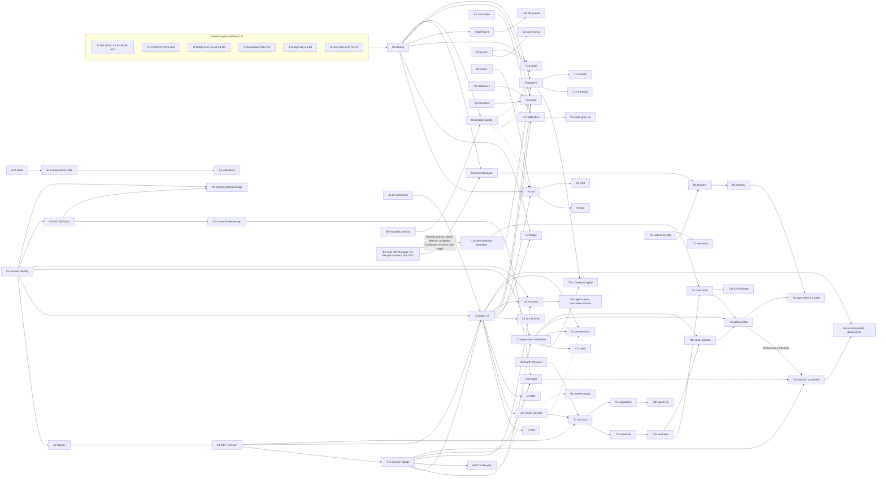

# The 0.5 plan: every increment, where it comes from, what it needs, and a proposed slicing

Plan note, 2026-09-27. Docs only; it rules nothing. It gathers every feature
increment that has been ruled or asked for 0.5, gives each one row with its
source, its state, what it depends on and its size, draws the dependency graph,
and proposes a slicing into 0.5.0 and 0.5.x for the owner's ruling and a Codex
review.

**Revision (b), 2026-09-27, after the Codex review** (verdict *adopt with
changes*, 15 findings). New: §2.C (contracts that must precede their consumers),
§2.I (inherited release gates, which are not 0.5 increments), §9 (source
coverage), §10 (the revision record, finding by finding). Rows were corrected in
place and keep their ids; rows that the review asked to split carry a letter
(V9a/V9b …). §3 gained rows; §4, §5 and §6 were rewritten. Where this header and
the text below disagree with revision (a), revision (b) rules.

**Revision (c), 2026-09-27, after Codex's scoped check of (b)** (*one more
pass*: 11 findings closed, 4 partly; six new findings, all adopted). C2 gains
two modes; C3a gains the shared web read boundary and T4 the comment read
endpoint; I3, I4, I5 and I7 were reconciled; 0.5.8 promises P2's design only;
§9's locators were finished. No slice moved. §10 records it.

**Revision (d), 2026-09-27, the owner's rulings.** The owner's sentence of
2026-09-27: *"go with your recommendations throughout; but if the browser can
get several tabs early, do that; and agent conversation recovery is in 0.5,
right?"* Q1, Q5 and Q10 are ruled (Q10 in direction); the browser's several
pages are pulled forward as a new row **B1a** (0.5.1), and B1's design note
moves to 0.5.0; S1 and S2 are confirmed as 0.5 scope where (c) put them; the
D-41 cells (A10, I7) are aligned to the ledger's own words; §3 gains rows 22
and 23. §10 records it cell by cell.

**Revision (e), 2026-09-27, after Codex's scoped check of (d)** (*merge with
edits*; findings 1–4 adopted, 5 and 6 pass, 7 is the ledger's and goes to main
separately). B1a keeps 0.5.1, but its prerequisite is now a page-set lifecycle
contract in B1's 0.5.0 note, which C3a consumes too; B1a is M, provisional, and
states its lifetime and link promises; §3 gains row 24 (DESIGN §7.12, and the
§7.9 ① and ⑧ assumptions, extended rather than repealed). §10 records it.

**Revision (f), 2026-09-27: the session domain façade and the reply ruling.**
A new row **A15**, the session domain façade (the remote-seam note's "SD",
`docs/plans/design/remote-seam-2026-09-27.md` at commit 7fd826f9), lands
after A3 and A4 and before L1, L3a, C2, T1, T2, S1, V10 and A9, first in
0.5.0's engineering line. The owner's ruling of 2026-09-27 on the reply
supersedes §3 row 21's paste-only: the reply follows its view: the conversation view sends to the agent; a terminal view sends keystrokes as typed, Enter included; no paste-without-Enter mode (C2, S2, V11, Q31). C1 names
the child-process generation and the agent epoch separately. §10 records it.

**Revision (g), 2026-09-28: background services.** The owner asked for a way
to start background services (dev servers, watchers, tunnels) without a
terminal pane standing in the foreground, and a panel to start and stop them;
he ruled the coordinator's proposal on 2026-09-28 (*"可以,照此做,UI 到时候要设计"*).
Two new rows in §2.S: **S5**, the primitives — a service **is** a session with
no bound view, sent to the background and brought forward by binding a view
(0.5.7, the version after V10's, where T5's tiers exist for its two tool verbs)
— and **S6**, the services panel and the declared list per project folder
(version unassigned, after S5). §3 gains row 25 (a session may
now outlive its last view in 0.5, for a service only); §4.2 gains the "no
second process model" contract. §10 records it.

The owner's ask (2026-09-27): *"Shouldn't all the feature increments 0.5 is to
implement be gathered up, with their dependencies worked out, and written into
one plan-and-schedule document?"* His leaning the same day: design once,
implement in small versions; 0.5.0 is the foundations plus the first visible
surfaces.

## 0. How to read this

- **Rows are cited, not invented.** Every row names its source and the date of
  the ruling or ask. Where a feature has no design note yet, the row says so and
  sizes the **design** work, not the feature.
- **States.** *ruled* — the owner decided it (structure or behaviour; the look is
  still decided at birth on a real window, per the workbench note §1).
  *asked* — the owner asked for it and nothing more is decided. *proposed* — the
  coordinator or a review proposed it and the owner has not ruled. *open* — an
  explicit question is pending. *in flight* — a ticket exists.
- **Later wins.** Where two dated sources disagree, the later one is taken and
  §3 lists the conflict, so nobody re-litigates it silently (the owner's rule of
  2026-09-20: rulings follow their premises and change with them).
- **Sizes** are the repository's ticket sizes: S, S–M, M, L. They are estimates
  unless the source gives one (then the source's size is used). An item marked
  *design* is sized as the design note.
- **No dates.** §7.

### 0.1 Sources and their short names

In the repository:

| short | file |
|---|---|
| WB | `docs/plans/design/agent-workbench-0.5-2026-09-20.md` (revisions 1–5; §11–§14 rule over §2–§10) |
| OC | `docs/plans/design/ownership-census-2026-09-25.md` (§5 `bt-workbench`, §6 and (b)8 tickets, (b)3 roles, owner rulings 2026-09-25) |
| SD | `docs/plans/structural-debt.md` (rows D-n) |
| AR | `docs/ARCHITECTURE.md` (§12: what 0.5 and 0.6 require of today's code) |
| TD | `docs/plans/design/thread-door-2026-09-26.md` |
| WTB | `docs/plans/design/window-thread-budget-2026-09-25.md` |
| SURVEY | `docs/plans/agents/agent-survey-2026-09-20.md` |

Outside the repository (the coordinator's records, read-only; named by file,
not by location):

| short | record |
|---|---|
| IDX | the 0.4.4–0.4.7 ticket index (`tickets-044/00-INDEX.md`) |
| PS n | the prototype's status file (`proto/STATUS.md`), owner review item *n* |
| TF | `design-agent-tool-face-2026-09-24.md` (the coordinator's records): the tool-face design note, its folded Codex review and the owner's rulings; the rulings at its end rule over its original §§1–6 |
| mem:*name* | the coordinator memory note whose file is exactly `name.md`, cited with the date of the line used |

`docs/handoff/HANDOFF-2026-08-21.md` was read and holds nothing about 0.5 later
than 2026-09-15. `CHANGELOG.md` *Unreleased* holds 0.4.6 work: the updater's
pieces, the ownership census (*Internal*), and fixes to web-engine recovery,
formula redraw and picture paste (*Fixed*); none of it is a 0.5 increment.
`docs/plans/release/plan.md` is the 0.1 release gate plan and has no 0.5
content. No `docs/plans/roadmap*.md` existed before this file.

## 1. Where 0.5 starts from

These are the preconditions the sources already set; none is a 0.5 increment.
Revision (b) turns them into named gates with closures (§2.I): 0.5.0's
implementation starts after I1–I6 close, and moving any of them into 0.5 needs a
dated owner ruling (§6 Q23). Revision (a)'s fallback ("whatever of A1–A5 0.4.7
did not finish" rides in 0.5.0) is withdrawn.

1. **The architecture ledger reads zero at the end of 0.4.7** (SD header,
   2026-09-23; versions ruled 2026-09-24). 0.4.7 carries the first slices the
   owner wanted before 0.5: D-1, D-9, D-12, D-15, D-17 (SD, "The versions").
   Only D-43, D-44 and D-59 stay deferred — and D-41, whose construction the
   owner deferred pending a measurement-based decision (WTB §R-E; gate I7,
   revision (c)). D-41 is not repaid; it is a conditional exception, not a
   prerequisite.
2. **`docs/design/UI-DEVIATIONS.md` is empty before 0.5 starts** (owner
   2026-09-22/23; IDX §0.4.5 exit criterion). "UI unification is finished in
   0.4; 0.5 only adds new things" (mem:ui-design-05-approach-0922, 2026-09-23).
3. **The 0.5 design is the mock0920 prototype**, not the style-ref sample, which
   is kept for the mobile app (mem:ui-05-design-pick-0926, 2026-09-26).
4. **New 0.5 subsystems are born outside `Runtime`** — the attention ledger, the
   notification model, the agent list, the outward CLI/MCP — as their own module
   or crate with a stated interface; every 0.5 design note carries a "where it
   lives, what its interface is" section (mem:dependency-direction-and-split-0921,
   2026-09-21; AR §12.3).
5. **0.5 is the agent workbench; remote is 0.6** (mem:ui-agent-workbench-scope,
   2026-09-18: *"I can live with RustDesk for remote for now"*); 0.5 leaves room
   for remote. The owner's words on the payoff, also the pitch: *the whole of
   Folio can be driven by an agent* (WB §2; mem:product-philosophy-extensibility,
   2026-09-20).

## 2. The inventory

Grouped by area. *Depends on* names rows of this table. Open decisions are
numbered into §6 where the owner must answer them.

### 2.I Inherited release gates (not 0.5 increments)

Each gate names the rows it covers and its closure. None is counted as a 0.5
feature.

| id | gate | rows and tickets it covers | source | state | named closure |
|---|---|---|---|---|---|
| I1 | The first slices the owner wanted before 0.5 | A3 (D-1), A4 (D-54), A5 (D-17), A6 (D-9), A12 (D-12, D-15); C1 is their note | SD "The versions" (owner, 2026-09-24) | ruled (0.4.7) | each row repaid on the ledger |
| I2 | `docs/design/UI-DEVIATIONS.md` at zero | 0.4.5 tickets 23–31 | IDX 0.4.5 exit criterion (owner, 2026-09-22/23) | ruled | the file's Totals line reads 0 |
| I3 | The rest of the architecture ledger | A1 (census-4: D-57, D-48), A2 (census-5a/5b: D-8), A8 (the other 0.4.7 rows), D3 (D-65, D-66) | SD header and table | ruled (0.4.6 / 0.4.7) | the ledger reads zero at the end of 0.4.7, except D-43, D-44 and D-59 (deferred with reasons) and D-41 (I7's conditional exception); **D-47's document half** — row 20's preserving save, which WTB §R-F leaves separately designed and which B8 does not repay — closes by its own reviewed design, on the version the ledger gives it |
| I4 | The thread door's remaining families and the lint | A11 = TD A2b–A2e | TD (i)1 | ruled 0.4.6; all four move together to 0.4.7 only if capacity requires, with the pending-lint statement kept | the lint established on both product jobs (A2e), the bare-site list empty and deleted. An empty list proves every listed effect goes through a door; it repays none of the effects the doors record. **The transport-authority residual** — `bt-pty`'s transport waits are fenced by owner and count, not by thread authority (TD (c)6 item 1, (i)5) — is carried as its own debt row, which TD's revision (k) opens, on the version (k) gives it |
| I5 | The window-thread budget's remaining tickets | engineering A4 (the earliest window's allowance) and B4–B9 (the marks record and the stores on the storage lane, PSReadLine observation, the macOS locale, the macOS watcher's lifecycle, device recovery on a worker); B10 (the window thread's file observation), whose brief and allocation TD's revision (k) writes | WTB §R-F; its §C-8 ("the rest of (b)'s §R-F is unchanged"); TD §11 (B4, B7, B9 need A1b's `WorkerCtx`); TD (j)9, (j)10 (revision (k) owns B10's brief and the transport debt row) | ruled (0.4.6) | **Work, not bookkeeping:** A4's `TurnAllowance`, taken from the earliest active window's `FrameClock`, is implemented and the search walk and the idle calls consult it, *and* the aggregate-scheduling row it opens is written; B4–B9 land, repaying D-34, D-35, D-36, D-39, D-40, D-42, D-77 and D-47's store-writes half (its document half is I3's); B10 lands per (k), and every registry row it owes is repaid or carries a written disposition. A written debt row is a record, never a repayment |
| I6 | The lane contract's declared failures | D-70…D-76 (they are declared failures, not closed by the contract's existence) | SD (A5, 2026-09-25) | ruled (0.4.6, with D-33) | `lane::EXPECTED_FAILURES` empty; D-33 repaid |
| I7 | The presentation-lane decision | A10 = D-41 | WTB §R-E ("D-41, the decision restated", which replaces WTB §4's paragraph): the owner deferred construction on 2026-09-24 until the self-inflicted waits were fixed and measured. **This is the newer ruling** (revision (c)). **The ledger's row, as it reads on main** (revision (d)): version "0.4.5 — presenting off the input thread is the typing-stability work"; status "open — since ticket 37 a presented picture is a pair (frame and metrics: `SeatSignature::metrics`, `LeafSession::presented_metrics`), and the lane must carry both". The ledger itself records the deferral elsewhere: its by-version note (2026-09-25, A5) says "the owner deferred the presentation lane, its second client", and its D-42 row reads "independent of D-41 (budget note R8, 2026-09-26)". The 0.4.5 tag exists and the ledger's 0.4.5 line counts two rows open, D-41 one of them (D-64 the other). The version cell is the ledger's to change, not this plan's | open (construction and its version) | the owner's measurement-based decision: a version on the row, or `deferred →` with a reason. The deferral does not repay D-41. A conditional exception to I3's ledger-zero; it does not block 0.5.0 |

### 2.C Contracts that must precede their consumers

New in revision (b) (review findings 1–3). Each is a design contract with its
own note; its consumers may not ship before it.

| id | contract | what it fixes | source | state | depends on | size | dependents |
|---|---|---|---|---|---|---|---|
| C1 | Session identity and lifecycle | Five distinct things: a stable **session id**; its **incarnation**, the **child-process generation** (a new child process, a new incarnation); its **`agent_epoch`**, one recognised agent run inside that child, named separately because an agent typed into a running shell starts and ends without a new child (revision (f); remote-seam note §4.1, §10); the **view address** (tab, seat, window); the **vendor conversation / resume id**. A move changes the view binding, not the session; a replacement invalidates credentials and stale operations; a resume never resurrects grants. The rail's "one live row per pane" stays a presentation rule | OC §5.1 step 3 and (b)6; AR §12.1; SD D-1, D-54; TF review items 1–3 (owner, 2026-09-24); WB §13.2 (the earlier view address) | ruled (direction); note owed | — | M (a Codex-reviewed note; implemented by A3/A4) | A3, A4, A15, L1, L3a, T1, T2, S1, S2, V10, R2 |
| C2 | Typed-input admission | One admission mechanism for every text Folio types into a pane for someone, with **two modes each operation declares** (revision (c)): **paste-only** — the text lands on the input line, no Enter, the agent's own draft preserved (WB §13.3.1) — **superseded for every reply by the owner's ruling of 2026-09-27** (revision (f), §3 row 21): the reply follows its view: the conversation view sends to the agent; a terminal view sends keystrokes as typed, Enter included; no paste-without-Enter mode; paste-only remains only where a tool verb declares it (TF's `send --no-enter`); **paste-and-submit** — paste and submission admitted as one ordered operation on the session's transport, Enter outside the bracketed payload, only when that operation asks for it (comment Send, TF R1; TF's `send --no-enter` is the typing verb's paste-only form); readiness is WB §11.7's full predicate (a turn boundary, no permission or quota wait, disarmed by a new event); `Queued` is not consumed; a refused batch stays pending with its reason; a failed send is never a person's answer; the draft is the composer's, the sent batch is immutable and the target session's, with a stated retention; the envelope and read schema (labelled fields, a line saying source fields are untrusted reference data, escaping, bounds). It does not require PTY birth/resize off the window thread, and a person pressing Send grants no agent a typing tier | TF review items 2–6 and the owner's rulings (2026-09-24); WB §11.7.3, §12.4.7, §13.3.1; AR §12.3 | ruled (the adopted review); note owed | C1, A3, A15 | M (note) + M (core) | T9a (paste-and-submit), V11 and S2's reply (sent to the agent, revision (f)), V10's input line (a terminal view: keystrokes as typed, Enter included; revision (f), Q31), T5 and T3b (per verb), V6's terminal-bound input |
| C3 | Web-page ownership and admission | Page identity and navigation revision; the owning pane versus a view; profile and grants; native thread affinity; rehost, close and crash; what happens to a late callback or DOM result. **C3a** is its narrow half — selection extraction and drawing above the native page, the search float's focus boundary, and (revision (c)) **the shared web read boundary**: page and navigation identity (revision (d), sharpened in (e): C3a consumes the page-set owner, lifetime and navigation-invalidation contract of B1's note, since B1a gives a pane several pages before C3a lands; its DOM-result revision checks stay C3a's own work, because an engine incarnation is not a document-navigation revision), access on the owning thread, and rejection of a stale DOM result — enough for adapters and readers over today's browser; **C3** whole precedes the browser's promotion | OC's census (`WindowRuntime.web`) and (b)3 (the download tool versus four failure states); SD D-54 (WebView2 generations); AR §5.2, §5.3 row 21; `webhost::WebSeat` (generation-checked asynchronous work, rehost, close/rebuild) | proposed by the review; note owed | C1 | S–M (C3a) + M (C3 note) | T8, T10, T11, T4's web readers (C3a); T12, B1, B2, B3 (C3) |

### 2.A Foundations: ownership and the domain crate

| id | title | what it is | source | state | depends on | size | open decisions |
|---|---|---|---|---|---|---|---|
| A1 | `bt-workbench` completes its birth | The reach rule and `Places` move into the crate (census-4); the crate already holds the ledger, `WaitClock` and the seen rule | OC §5.1, (b)6, (b)8; SD D-57, D-48; AR §12.1 ("born 2026-09-25") | in flight (0.4.6) | census-3 (on main) | S | — |
| A2 | The asking/telling table is one declaration | Roles (gate, dialog, tool, toast, notification, pane state, mark, hint, log line) each with a policy record; the keyboard rungs, mouse rungs and `menu_or_dialog` derive from it (census-5a note, 5b code) | OC (b)3, (b)8, owner rulings 2026-09-25; SD D-8 | ruled (0.4.6) | owner rulings (given); 0.4.5 ticket 57 | S + M | TF asks for three new rows (agent notification, grant request, comment receipt) — §6 Q8 |
| A3 | Session registry and a view-owned configuration boundary | D-1's first slice, on the existing thread (D-1's smallest change): the session registry implementing C1; `deliver_attention`'s routing moves beside it | SD D-1 (0.4.7); OC §5.1 step 3; AR §4.1, §12.1 | ruled (0.4.7; gate I1) | A1, C1 | L | changes an owner: a Codex-reviewed note first (CONVENTIONS rule 11) |
| A4 | A `Site` names a session; the ledger leaves `LeafSession` | D-54 (identity, admission, lifecycle, WebView2 generations included); the `bt-layout::SeatId` edge exception goes. Today `Site` is still `{ tab, seat }` and the ledger sits on `LeafSession` | SD D-54 (0.4.7); OC (b)6, (b)9 (Q5 settled by Codex) | ruled (0.4.7; gate I1) | A3, C1 | M | — |
| A5 | A document owner with a revisioned selection mapping | D-17's first slice: a selection taken at one revision cannot be applied at another; both preview faces consume one mapping | SD D-17 (0.4.7, with D-1) | ruled (0.4.7) | A3 | M | — |
| A6 | The fourth configuration entrance is designed | D-9: the tool face's row of the entrance table (TF §5 drafts it: domain queries and commands, never a preference); one preference, "allow external programs to control Folio" | SD D-9 (0.4.7); TF §5; WB §6 | ruled (0.4.7 design) | — | S (docs) | — |
| A7a | The three 0.6 decisions, as a decision record | Who controls PTY size and input order; what counts as *seen* and what *answers*; who may interrupt the desktop; written before any second interactive view | AR §12.2; WB §11.7.4 | ruled (as a requirement) | C1 | S | — |
| A7b | The second view's ownership design | Scroll, selection, IME composition, query responses, resize and the source pane closing, for a live second view of one pane (the list WB §13.3.3 leaves open) | WB §13.3.3 | ruled (drag-out is 0.5.x); no design | A7a | M (design) | §6 Q27 |
| A8 | The rest of 0.4.7's closure the 0.5 code stands on | D-6 chains, D-16 the enumeration lane, D-49 the resize chain, D-51/D-55 observation and projection classes, D-56 the emergency journal, D-65/D-66 (see D3), D-78…D-83 the `Drop` inventory and the non-portable suites | SD (each row, 0.4.7) | ruled (0.4.7) | — | S–M each | — |
| A9 | PTY birth and resize leave the window thread | D-43, D-44: "deferred → 0.5 toward 0.6 — needs D-1's session owner to keep input and resize order". Co-scheduled with the floats by preference, not by necessity (WB §11.7.4's float is one PTY, one size). Revision (f): a mechanical relocation behind A15 — the lane move changes no caller of the façade, and is not its prerequisite | SD D-43, D-44; WTB rows 11–12; remote-seam note §2.2 | ruled (0.5 toward 0.6) | A3, A4, A15 | M each | §6 Q11 |
| A10 | The presentation lane | D-41, in the ledger's words: "presentation on the window thread; the present mode has no owner"; acquire, submit, present off the window thread, and "since ticket 37 a presented picture is a pair (frame and metrics …), and the lane must carry both". The owner deferred building it on 2026-09-24 until the self-inflicted waits were fixed and measured (WTB §R-E); AR §5.4's migration order puts the presentation line in 0.5. The ledger's version cell still reads 0.4.5 (I7) | SD D-41 (the row on main, read for revision (d)); WTB §R-E (replaces §4's paragraph) | open (the owner's decision after measurement) | A8 | L | §6 Q11 |
| A11 | The thread door's remaining families and the lint | A2b–A2e: file doors, wait doors, `bt-pty` transport doors, then the lint | TD (i)1 | ruled 0.4.6, or all four move to 0.4.7 ("the owner's call, flagged") | A2a (done) | M, M, S–M, M | §6 Q12 |
| A12 | `bt-platform`'s first extraction; `bt-term → bt-math`'s first slice | D-12 (the read ledger, file primitives, process doors into one systems crate); D-15 "ahead of the 0.5 composition layer" | SD D-12, D-15 (0.4.7); mem:dependency-direction-and-split-0921 (2026-09-21) | ruled (0.4.7) | the `bt-app` move's end (D-32, 0.4.6) | M each | — |
| A13 | The composition layer becomes a library crate | Grid plus formula compositing leaves `bt-app` (the split's Step 3); its hard acceptance is that the web demo (X2) can link it; the first `Runtime` block extracted in 0.5 | mem:dependency-direction-and-split-0921 (the 2026-09-21 "decoupling in two halves" entry the owner agreed to: existing `Runtime` blocks are extracted in 0.5, composition first); mem:bt-app-split-freshness-0918 (2026-09-20) | ruled (direction, 0.5); ticket scope and slice proposed | A12 | L | §6 Q19 |
| A14 | Extension seams stay internal but recorded | Registries for preview renderers, link/path recognition, the agent adapter table, commands with stable ids; one DESIGN page naming the seams and what is not done (no dynamic loading, no public API promise) | mem:product-philosophy-extensibility (owner, 2026-09-20: "leave a path"); WB §6 | ruled | — | S (docs), seams built as touched | — |
| A15 | The session domain façade (the remote-seam note's "SD") | One semantic owner, on today's window thread, behind one API whose callers never touch `LeafSession` fields: session lifecycle (create, view bind and unbind, child exit, explicit close, retirement), every `DualPlaneSession` read and write, the PTY drain, exit detection and close, one admission queue for typed input (C2's) and one ordered resize, and a window-thread adapter. Driven through the existing doors only — `PtyBirth` (WTB row 11), `PtyResize` (row 12), `PaneRetirementWait` (row 15, only in `Exiting`), row 19's bounded ring residue, `PtySession::try_wait` as the only exit probe, the pinned `shutdown` drop exception under SD D-81, and `SessionStore`'s door for desired state; it introduces no door, and `window_waits.tsv`'s `minted at` and the bare-site inventory move with their owners. In 0.5 a domain boundary, not a windowless host | `docs/plans/design/remote-seam-2026-09-27.md` §2.2, §9 (commit 7fd826f9); AR §12; WTB rows 11, 12, 15, 19 | proposed (revision (f)); its own Codex-reviewed note owed (CONVENTIONS rule 11) | C1, A3, A4 | M (note) + L | — |

### 2.L The attention ledger as data

| id | title | what it is | source | state | depends on | size | open decisions |
|---|---|---|---|---|---|---|---|
| L1 | Ledger v2: facts owned, the word derived | Five independent facts (agent lifetime, turn phase, outstanding waits, the acknowledgement watermark, account quota, plus the last outcome), each with one owner and one expiry; the row's word and the pane's dot computed every frame and stored nowhere; keyed by C1's session identity, with WB §13.2's `{TabId, SeatId, incarnation}` as the view address (§3 row 13); unknown quota facts are valid until Q1/Q2 arrive | WB §13.2, §13.1, §11.3.2, §13.6 row 2; OC §5.1, (b)6; AR §12.1 | ruled | A1, C1, A4, A15 | M | — |
| L2 | The append-only action log | Agents only; one line per action (when · pane · agent · verb · outcome); no payload, no typed text, no output; size-bounded; removed by `--uninstall-cleanup --purge`; the interruption counts are queries over it | WB §11.9, §12.4.7 (ruled 2026-09-20), §13.6 row 2 | ruled | L1 | S–M | — |
| L3a | The ledger's model contract | The domain's observations and commands (AR §12.1's in/out columns) with revision, ordering, stale-target and retry semantics; explicit seen, answered and client-presence inputs; states as A2A `TaskState` with `x-folio/idle` and `x-folio/limited`; never `AppEvent`, `Runtime`, a window handle or `Instant`. Event subscription, debouncing and graceful fallback are a design question here (proposed, mem:oxide-borrowable-ideas item 6) | AR §12.1, §12.3; WB §3.1; mem:mobile-app-is-not-a-projection (2026-09-21: structured events and a reply channel); mem:dinotty-reference (2026-09-18) | ruled (direction) | L1, C1 | M | — |
| L3b | The ledger's outward serializer and transport | The versioned snapshot and delta on the wire, built for the first external consumer | AR §12.3 | ruled (direction) | L3a, T1 | S–M | — |
| L4 | The recognition floor | A row exists only on a hook credential from the pane or an OSC row from its tty; nothing else lists an agent; agents inside WSL, ssh or tmux are invisible in 0.5 and a forwarding lane is reserved for 0.6 | WB §11.8, §13.1 | ruled | L1 | S | — |
| L5 | *Turn finished* notifications default to on | Waiting and Failed always notify; Done follows the switch, which defaults to on in 0.5. `bt-persist`'s `turn_end_notification` already defaults to true, so a migration is needed only if a shipped default differs | WB §13.3.2 (owner, 2026-09-20); `crates/bt-persist/src/settings.rs` | ruled | L1 | S | — |
| L6 | The interruption numbers are shown | Waits, wait durations, the person's response delay — "the only way to know whether any of this helped" | WB §2.5, §11.9 | proposed (no surface designed) | L2 | S (design) | — |

### 2.V The workbench surfaces

| id | title | what it is | source | state | depends on | size | open decisions |
|---|---|---|---|---|---|---|---|
| V1 | The Agent rail | One list for the whole application: this window's rows, a rule, the other windows' rows; gone when no agent runs; at the sidebar's foot and the card column's foot, foldable by its whole header; a row click takes the tab, focuses the pane and rings it | WB §11.3; PS second round (2026-09-23: a row click rings the pane), 13, 25, 26, 39; mem:ui-agent-workbench-scope (2026-09-20, 2026-09-23) | ruled (structure) | L1, D1, D5 | M | V7 |
| V2 | The agent row | Mark · title · context ring and % · this turn's clock or the sub-agent count · state word; creation order; no `⌄`; the sub-agent glyph is Codex's G2 | WB §11.3.3, §12.3; PS 18, 27, 36, 54, 55 | ruled, except one line or two | V1 | S–M | §6 Q2 |
| V3 | The detail card (the agent row's glance card) | On a rail row: a **250 ms** rest peeks the card and moving into it keeps it; a click **inside the card** pins it; Esc or a click outside closes a pinned card; a click on the row goes to the pane. One card at a time, its row keeps the hover fill; fields only, clamped lines, placed by one shared function. **The attention list's rows have no card.** The tab glance card keeps 350 ms | WB §4.3, §11.3.5, §13.3.5; PS 18, 19, 29, 75 | ruled, except its actions | V1 | S–M | §6 Q3 |
| V4 | The attention badge and its list | One dot and one number: the number is the total of every window's dots, the colour the most urgent class; the list is the same component as the notification; it stays in every tab mode | WB §4.4, §11.6, §13.3.7; PS first round (2026-09-23), 76 | ruled | L1, D1 | M | — |
| V5 | The notification | Appears for every agent that needs the person (the focused pane included), expands to the latest reply, a click goes there. **Mute per agent silences the notification only — never the dot, and never Failed.** Where it appears: the focused Folio window, else a system notification, else every window; one notification is one object, handled anywhere and gone everywhere. The reply text comes from Claude Code's transcript path the Stop hook hands over (a bounded tail read, as `attention_words` does today), else the pane's own screen tail; S2 extends this domain model rather than replacing it | WB §11.7.2, §12.1, §13.3.6, §13.3.7; PS 45 | ruled | L1, A2 | M | §6 Q17 |
| V6 | The notification card grows up | The owner's target for 0.5: it can become a small window, stay, be clicked, offer several choices, take input (generic input may ship with V6; any input that goes to a terminal depends on C2's core, 0.5.2); queue rather than evict; anchor to terminal panes; the pane strips and the preview pills migrate into it; the PowerShell invitation becomes a notification. Its migration scope is distinct from V5's first agent notification | mem:workbench-05-notification-model (owner, 2026-09-21); OC owner ruling 3 (2026-09-25) | asked (the invitation's move is ruled) | A2, V5 | M (design) + M–L | §6 Q17, Q26 |
| V7 | A waiting row sticks to the rail's top | Optional. Its original necessity — a wait scrolled out of view while the badge was hidden (WB §11.6) — was withdrawn when the badge stayed in every tab mode; creation order remains ruled | WB §11.11 Q1, §12.4; PS first round (2026-09-23) | open (an optional owner choice) | V1 | S | §6 Q4 |
| V8 | Agent facts on pane heads and tabs | The pane head's meta (state word, ring, sub-agent count, a drop order); tab status dots and the tab glance card listing its panes; the owner's 2026-09-18 ask that a tab with agents shows more | WB §4.6; PS 68b, 68c (owner-approved exploration, not ruled); mem:ui-agent-workbench-scope item 6 (2026-09-18) | proposed | L1, D1 | M | — |
| V9a | Settings ▸ Agents: detected agents, accounts, notices | Detected agents (read-only: mark, name, how found, sessions), accounts, quota notices | PS 68a, 70 | proposed (an owner-approved exploration) | Q2, L1 | M | — |
| V9b | Settings ▸ Agents: registration and grants | Add or remove Folio per agent; the live grants with Revoke | TF §3, §4 (owner R4, 2026-09-24) | ruled | V9a, T3a, T6 | S–M | — |
| V10 | The agent float | The tear-out float (a row dragged out becomes a live second view of that pane, expanded by default); one PTY, one size, never reflowed; the local rehearsal of 0.6. **In the window first** (§6 Q5(a), ruled 2026-09-27: WB §12.4 Q2's recommendation). **The zoom float** (the tab's agent stays reachable over a zoomed pane, compact by default; PS 35) **stays an exploration outside 0.5** (§6 Q5(b), 2026-09-27: the coordinator's recommendation, taken under the owner's blanket "as recommended"; the owner did not speak to it by name) | WB §11.7.4, §12.4 Q2, §13.3.3 (drag-out: 0.5.x); PS 28b, 35, 37, 40, 50, 56; mem:workbench-05-notification-model (2026-09-23); the owner's sentence of 2026-09-27 | ruled for 0.5.x (drag-out, in the window); the zoom float out of 0.5 | A7a, A7b, A15, L1, C2 (its input line: a terminal view, keystrokes as typed, Enter included — revision (f)) | L | — (§6 Q5 ruled) |
| V11 | Reply in the notification and the list | One mechanism in C2; **the reply follows its view: the conversation view sends to the agent; a terminal view sends keystrokes as typed, Enter included; no paste-without-Enter mode** (owner, 2026-09-27; supersedes §3 row 21's paste-only — revision (f)); offered only when the agent verifiably waits for free text; never for a permission prompt | WB §11.7.3, §13.3.1 (0.5.x); PS 28a | ruled (0.5.x) | V5, C2, A7a | M | — |
| V12 | The work-in-progress hint | When a new agent is opened, "N waiting on you" is visible; it never blocks | mem:attention-bottleneck-idea (point 6, 2026-09-20) | proposed | V4 | S | §6 Q20 |
| V13 | Pre-authorised answers | "Read-only commands always allowed", answered by Folio with a trace | WB §2.4; mem:attention-bottleneck-idea (point 4) | open: the delivery path was withdrawn (no hook can return a decision, WB §11.1–§11.2) | L2 | S (design) | §6 Q20 |

### 2.Q Quota and accounts

| id | title | what it is | source | state | depends on | size | open decisions |
|---|---|---|---|---|---|---|---|
| Q1 | The statusLine lane | Wrap or refuse, byte-identical on uninstall; a user's own statusLine is left alone and the data it would carry is absent | WB §7, §11.8, §13.6 row 6a; mem:quota-strip-probe (2026-09-20) | ruled | — | M | — |
| Q2 | The provider adapter table | Per vendor: billing form, mechanism, fields, whether the user configures anything; Codex app-server, Kimi's own local server and the bearer it prints (ruled acceptable), Anthropic's statusLine, DeepSeek balance opt-in, GLM none; a second probe for Grok, MiniMax, Gemini, Qwen | mem:quota-strip-probe (2026-09-20 night); WB §7 | ruled (the table); the second probe pending | — | M + S (probe) | — |
| Q3 | Chip, panel and toasts | Buckets read available / exhausted / unknown; toasts read what is left and the next reset; the panel groups company → account, subscriptions first, then API accounts with a balance, unreadable vendors last; used up is amber and static; vendor marks on the group heads; two time columns | WB §4.5, §13.3.8, §13.6 row 6b; PS first and second rounds (2026-09-23), 15, 51, 57, 61, 77, 78, 82 | ruled (structure); the control's form open | Q1, Q2, L1, D1 | M–L | §6 Q6, Q7 |
| Q4 | Accounts as bookkeeping | An account is attributed from the hook's or statusLine child's environment; a label appears only when one vendor has more than one account; no switching and no "reopen with another account"; the least-used account sorts first in the new-agent menu | WB §4.7, §11.8; mem:quota-strip-probe (owner, 2026-09-20) | ruled | Q2 | S–M | — |
| Q5a | "This turn" | Model, context bar, turn tokens, cache hits, output, tokens per second, from the conversation-view model | mem:ui-agent-workbench-scope (owner, 2026-09-26) | ruled, no design | S2, Q3 | S (design) + M | — |
| Q5b | "Resources" | The system's CPU and memory, and this session's: the second needs process attribution, which does not exist (the pane's root is the shell and there is no agent process walker, WB §13.1) — a measurement and design decision first | mem:ui-agent-workbench-scope (owner, 2026-09-26); WB §13.1 | ruled (ask); attribution undesigned | Q3 | S (design) | §6 Q24 |
| Q6 | The gauge follows the current tab's account | The chip shows the active tab's agent account, falling back to the worst in-use account | PS 58 | open (owner exploration) | Q3 | S | §6 Q6 |

### 2.O Opening things, menus and tabs

| id | title | what it is | source | state | depends on | size | open decisions |
|---|---|---|---|---|---|---|---|
| O1a | The where × what panel, first cut | One component for the tab `⌄`, the tab column's `+ New tab ⌄` and the pane's `Split with ▸` (with the split picker, `Auto` by default): folders on the left select, kinds on the right open; Browser on its own strip; `Preview… ▸` lists recent files. The owner's rule: *typing is an accelerator, never the only way*. **Without** the agent sublevels and **without** the resumable Recent section at its foot | WB §14; mem:workbench-05-where-what-panel (2026-09-20); PS 14, 20–24, 30, 31, 38, 44, 47 | ruled (structure; visual rounds 2026-09-23) | D1, D4a, D5 | M | — |
| O1b | The panel's agent levels and resumable Recent | An agent row's `▸` (New session, the sessions Folio observed, `All…` = the agent's own picker) and the Recent section's resumable sessions | WB §14.2–§14.4; PS 14 | ruled | O1a, S1 | S–M | — |
| O2 | The pane `⌄` menu, six items | Zoom/Restore · Split with ▸ · Duplicate · Move to tab ▸ · Move to window ▸ · Close, wearing the picked glyphs; the tab `⌄` is the panel; a hidden quick-terminal window is never a destination | PS 41, 43, 46, 49; mem:chevron-menu-ruling (2026-09-23); WB §14.5.4 | ruled | D4a | S–M | — |
| O3a | The Recent view: paths and the person's own opens | A third view of the files column, per tab, with its own bounded per-tab activity model: paths recognised in terminal output ("mentioned", never labelled as edited) and the person's own opens; a click opens the preview; read/unread owned by that model. Needs no ledger and no protocol | WB §4.8, §11.10 row 1 | ruled | D1 | S–M | — |
| O3b | The Recent view: agent file events | An explicit file-event adapter (today the wire discards hook payloads beyond the declared id and lede fields, and `PostToolUse` is mapped as a clear receipt, not a file write), "who" as a small mono agent mark, created / edited / mentioned, the unread dot, and the optional follow-the-agent's-latest-file | WB §4.8; `attention_wire`, `attention_map` | ruled (scope); the adapter undesigned | O3a, L1, G1 | M | — |
| O4 | Merging tabs | A tab can join another tab as panes (a tab-menu verb); cards mode gets drag-in with the card redo | mem:ui-agent-workbench-scope (2026-09-20) | proposed (the menu half was proposed for 0.4.4; not verified here) | O2 | S–M | — |
| O5 | Tab groups | A group is a project, optionally bound to a folder | WB §9; mem:ui-agent-workbench-scope (owner, 2026-09-20: "no groups for now" — deferred, not refused) | deferred | — | M (design) | — |

### 2.S Sessions: agent recovery and the conversation view

| id | title | what it is | source | state | depends on | size | open decisions |
|---|---|---|---|---|---|---|---|
| S1 | Agent recovery | "Agent recovery" (owner, 2026-09-27): agent sessions as first-class objects; a pane remembers program + folder + session id; pinned tabs resume their agent after a restart and a Recent row resumes on a click; auto-resume **on by default**, with a switch (2026-09-18); Folio starts the agent and never sends anything; session lists in two layers (sessions Folio observed through hooks, then `All…` = the agent's own picker), empty sessions hidden, a resume chain one row. **No design note exists**: the pieces are rulings in three places | mem:ui-agent-workbench-scope item 4 (2026-09-18); WB §14.4; mem:workbench-05-where-what-panel (2026-09-20) | ruled in parts; no design | C1, A3, A15, L1 (observed session ids only); per vendor, that vendor's verified resume facts (G1) — recovery lands vendor by vendor | M (design), then M–L | §6 Q13 |
| S2 | The conversation view | A pane toggles between conversation and terminal; the data comes from the agent's own local transcripts (Claude Code's JSONL, Codex's sessions), not from the screen; turns, actions, files and waits form one model that is also the mobile app's API; version one is read-only plus a reply at a wait, **sent to the agent directly** (owner, 2026-09-27; supersedes §3 row 21's paste-only — revision (f)); a research ticket first (both formats and how often they change, guard tests on samples). It extends V5's domain model; by default it reads the known session's transcript path an agent handed over, with bounded parsing — broader discovery is a question for the owner only if research shows it is needed (Q22) | mem:ui-agent-workbench-scope (owner, 2026-09-26; VelaTerm reference) | ruled; no design | C1, L1, V5, C2 (reply); L3a by schema coordination | S (research) + M (design), then L | §6 Q14, Q22 |
| S3a | `[Image #N]` links in an agent's input line | Learn a pane's `[Image #k]` → file mapping from the OSC 8 links Claude Code prints; the mapping's lifetime across agent replacement and resume; recognise the same text in the input area; the file-exists verdict off the input path (today's hit path reads only `frame.hyperlink_at`) | IDX (0.4.7 small, owner ask 2026-09-27); mem:ui-agent-workbench-scope (2026-09-27) | asked (0.4.7 small or 0.5) | — | M (pending a demonstrated reuse path) | §6 Q21 |
| S3b | `[Image #N]` as a thumbnail in the conversation view | The placeholder shown as the picture | mem:ui-design-05-approach-0922 (2026-09-27) | asked | S2, S3a | with S2 | — |
| S4 | A finished turn in three lines | What it did, what it says it did not verify, CI | WB §2.3; mem:attention-bottleneck-idea (point 3) | proposed (the notification's expand shows the latest reply, ruled) | S2 | S (design) | — |
| S5 | Background services: the primitives | Revision (g). **Send a pane to the background** = unbind its view; the session lives on as A15's session with no bound view (the remote-seam note's §4.2 "bind"/"unbind" transitions, and its §7 Q3 model of a session held with no window drawing it, brought into 0.5 for a service only — §3 row 25). **Bring a service forward** = bind a pane to it (V10's view binding). The session's scrollback and state are the ordinary session's: nothing is copied, replayed or kept apart. The tool face gains the same two verbs (`folio` and MCP, one domain API, T1), so an agent can send its own dev server to the background and bring it back; they are acting verbs under T5's tiers. **Hard contract: no second process model** (§4.2) — a service **is** a `LeafSession` with no view, not a new kind of process or supervisor; stopping it is the session's ordinary close. That close must end the **whole process tree**, not only the child Folio started (a dev server's workers, a watcher's children): a Windows Job object, a macOS process group — **the one new obligation on the PTY layer**, checked when A15 lands. Until 0.6's tray host (note §7 Q3), Folio quitting ends every service as it ends every session | the owner's ruling of 2026-09-28 in conversation (on the coordinator's proposal: *"可以,照此做,UI 到时候要设计"*); `docs/plans/design/remote-seam-2026-09-27.md` §4.2, §7 Q3 (commit 7fd826f9); A15; precedents: JetBrains' Services tool window, VS Code tasks (`isBackground`), Procfile / overmind, tmux detach | ruled (2026-09-28); no design | A15, V10; T5 (the two tool verbs only) | M | — |
| S6 | Background services: the panel and the declared list | Revision (g). **One row per service** — name, state (running, or exited with its code), uptime, the last output line — with **start / stop / restart / show** (show = S5's bring forward). **A declared list per project folder** — name, command, cwd, env — stored beside the profiles (`profiles.json`). A service's exit or error becomes a notice through L1. The phone sees and restarts a service under the capability-parity ruling (remote-seam note §7 Q12). **Not in scope:** start at boot or daemon management (the operating system's job); dependencies between services; restart policies beyond one toggle; VS Code-style readiness matchers (the first version reads the exit code and, optionally, one line match). **UI: to be designed in the prototype** (a prototype round runs in parallel); **where it sits — a sidebar view or the where × what panel (O1a) — is the owner's call** | the owner's ruling of 2026-09-28 in conversation; remote-seam note §7 Q12 (commit 7fd826f9); precedents: JetBrains' Services tool window, VS Code tasks (`isBackground`), Procfile / overmind, tmux detach | ruled (2026-09-28); no design; the placement open | S5, L1 | M (design) + M | the placement (owner) |

### 2.T The tool face and comments

| id | title | what it is | source | state | depends on | size | open decisions |
|---|---|---|---|---|---|---|---|
| T1 | The tool face | `folio <verb>` from the agent's shell and `folio mcp` over stdio, both adapters of one domain API; public-protocol discipline from day one (version, capability discovery, structured errors, stable verbs); a third endpoint with bounded ingress, operation identity and reserved replies; event subscription and backpressure designed with L3a | WB §6; TF §2 and review items 3, 5; AR §12.3 | ruled (direction); no ticket yet | A1, A3, A4, C1, A6, L3a | L | — |
| T2 | A distinct tool credential | One per tool-enabled session incarnation (e.g. `FOLIO_TOOL_CAP`); `FOLIO_ATTENTION` stays attention-only; grants are central in-memory records, revalidated at admission | TF review item 1; owner 2026-09-24 (supersedes WB §11.9's "extend the same token") | ruled | T1 | M | — |
| T3a | Permission tiers: read, read other, notify | Read its own tab (default) · read other tabs (asked once per agent per session) · notify; not a sandbox, and no string may imply one | TF §3; WB §6 | ruled | T2, A2 (the grant ask is an asking surface) | M | — |
| T3b | Permission tiers: send and operate Folio | Send (per target pane, shown on that pane, non-persistent) · **operate Folio** (the top tier, per agent, explicit, revocable in Settings ▸ Agents) | TF §3; owner 2026-09-24 | ruled | T3a, C2 | M | §6 Q15 |
| T4 | Read verbs first | What the person is looking at (focused pane, file and line, selection, working folder), pane list and text, the ledger; every read returns a revision; an agent reads the live buffer, not the disk; web page text and web selections through C3a's read boundary; **the comment read endpoint** (`folio comment <id>`, revision (c)): it reads an immutable sent batch, says whether its context is captured or live, and keeps TF review item 5's bounds and screenshot-access rules | WB §13.6 row 8, §12.4.7; mem:oxide-borrowable-ideas (2026-09-18, points 2–3); mem:dinotty-reference (point 3) | ruled | T1, T3a, A5, C3a | M | — |
| T5 | Acting verbs and the typing tier | Open a file at a line (with a brief highlight), split, open or navigate a page, type into another pane (agent-to-agent), complete enough to drive Folio; a write names the revision it read and a stale write is refused | WB §13.6 (0.5.x), §12.4.7; AR §12.3; TF owner ruling 2026-09-24; mem:workbench-05-tab-scope-and-handoff (2026-09-24) | ruled (0.5.x) | T4, C2, T3b | M–L | — |
| T6 | Registration | Settings ▸ Agents adds and removes Folio from each agent (the vendor's own `mcp add`/`remove` only where it proves a byte-preserving round trip; one uninstall mark each); registration does **not** add allow rules to the agent's permission list (TF Q4); first a release-pinned MCP/CLI survey per agent (stdio support, add/remove grammar and scope, environment forwarding, reload, behaviour outside Folio) — G1's hook survey does not cover MCP | TF §4, Q4, review item 7; owner R4 | ruled | T1 | S (documentary inventory) or M / per-vendor (a verified matrix) + M | — |
| T7 | Instruction snippets for agents | Folio ships the lines that tell an agent when to use its tools; appended, never overwriting, and only with consent | mem:oxide-borrowable-ideas (point 5) | proposed | T4 | S | — |
| T8 | The selection popover | Comment · Translate · Search on every selection, in previews, web pages and terminal panes (an agent's own pane included); copy stays Ctrl/Cmd+C | PS 60, 67, 71, 83 (rulings 2026-09-26); mem:workbench-05-tab-scope-and-handoff (2026-09-23…26) | ruled | D1, C3a | M | — |
| T9a | Comment batches, typed | Enter adds to the current tab agent's batch; a pending strip on the float and on the agent's docked pane; quoted ranges keep a wash; Send types one line per comment and then Enter, through C2; without bracketed paste the batch stays pending with a reason (TF Q1); this slice promises no `folio comment` pull | TF R1, §1, §5, Q1, review items 2, 4, 5 (owner 2026-09-24); PS 62, 65, 66, 72 | ruled (supersedes WB §8's "never auto-submitted") | T8, C2, A3, A5 | M | — |
| T9b | Comment batches, the full envelope | The labelled envelope with its untrusted-source line and escaping; the 80-character excerpt as the domain's own policy; an absolute, quoted executable path on its last line (TF Q2), and `folio comment <id>` to fetch more | TF §1, Q2, review items 5, 8 | ruled | T9a, T4 | S–M | §6 Q25 |
| T10 | Translate | Terms from an offline dictionary looked up **in context** (the longest entry covering the selection within its block); a dictionary **miss shows "Not found" and never falls through to the AI**; sentences and paragraphs through the user's own AI API key; never through the agent; the card is marked with its source; Settings ▸ Translation. A mock lookup table is not an implementation source: dictionary data, language and packaging, contextual extraction, and provider and key storage need a research/design subtask | PS 83 (rulings 2026-09-26, corrections 2026-09-26 late); mem:workbench-05-tab-scope-and-handoff (2026-09-26) | ruled | T8, C3a | S (research) + M | §6 Q16a |
| T11 | Search | The selection opens in a floating web window, **one per tab**: a later search in that tab loads the new query in it as a navigation (‹ › walk the queries); Escape and focus go back to the source pane; the engine is a setting. S–M only when limited to reusing the existing web-float chassis | PS 83 (2026-09-26, and its late corrections) | ruled | T8, C3a | S–M | — |
| T12 | Page elements and screenshots | Alt+click picks a page element; a comment carries its element description and a screenshot (C3's element and screenshot extension) | mem:workbench-05-tab-scope-and-handoff (2026-09-20, 2026-09-23); WB §8 row 6 | ruled (gesture) | T9b, C3 | M | — |

### 2.B The browser

| id | title | what it is | source | state | depends on | size | open decisions |
|---|---|---|---|---|---|---|---|
| B1a | Several pages in the web pane | The owner, 2026-09-27: *"if the browser can get several tabs early, do that"*. A visible strip of pages in the **existing** web pane class: open a page in a new page, switch, close; a link from a page in use opens beside it, never over it. **No** promotion to a class of its own, **no** agent verbs, **no** profile change. **What it promises about lifetime** (revision (e)): a hidden page of the strip stays a live page for the session (its engine and document kept, sized but not shown, as hidden seats are today); after a restart the ordered list of open pages and the active one come back, each loaded at its last committed URL — document state (scroll, form input, script state) does not survive a restart. **The link promise** (revision (e)) covers ordinary same-frame user-link navigation on both platforms as well as `target=_blank` and user-initiated new-window requests; deliberate address entry, back/forward, reload, redirects and script navigation without a gesture stay navigations in the same page, classified so none becomes a new page; a request routed to a new page keeps the source page's navigation and mint admission (`webnav`), not only the destination's address-bar gate; request forms an engine cannot attribute to a user gesture are named in the note as unsupported. B1's note defines "page in use". **Prerequisite:** the page-set lifecycle contract in B1's Codex-reviewed note, due at 0.5.0 (§4.2) — not C3a's selection and DOM readers | the owner's sentence of 2026-09-27; Q10 (ruled in direction, 2026-09-27); `webhost::WebSeat`, `WindowRuntime.web` (OC census row 130), `bt_platform::PageVisual`, `webnav::Origin`; DESIGN §7.9 ①②③⑦⑧, §7.12; the Codex check of (d), findings 1–4 | ruled (the owner, 2026-09-27); no design yet (B1's note) | B1's design note (its page-set lifecycle contract), D1 | **M, provisional** — decomposed and re-estimated after B1's 0.5.0 note, in two parts. (i) **The owner and lifecycle migration:** a live-page key distinct from the pane (`WindowRuntime.web` is keyed by `LeafId` and `bt_platform::PageVisual` is `{tab, seat}`, so two pages in one pane need distinct native visual keys); the census row's 22 functions in 9 modules, many of them all-page or addressed lifecycle work — retirement, cross-window transfer, DPI, capture, docking and pane moves, local-file refresh, blank-page withdrawal, window shutdown, placement, event draining, scheme propagation — not reads of the shown page; outcome, commit and focus routing by page rather than by pane; the pool and current-buffer projection; restart restoration of the page list (a session schema addition). (ii) **The strip and the navigation entrances:** the link classification above on both platform arms (Windows `NavigationStarting` and `NewWindowRequested`, handled and dropped today; WebKit's main-frame policy and `targetFrame == nil`, cancelled today) and their validation on both platforms | — |
| B1 | The browser pane's promotion | "Browser upgrade" (owner, 2026-09-27): the browser becomes its own class beside shell, files and preview, *"closer to a real browser"*, callable by agents; the 2026-08-19 web-preview rulings need re-ruling because their premise changed (§3 rows 11, 22–24). **Several pages with a visible strip, and a link never replacing a page in use, are ruled (Q10, 2026-09-27) and arrive first as B1a**; B1 promotes the pane with its pages rather than rebuilding them. **B1's note carries the page-set lifecycle contract B1a and C3a both consume** (revision (e); §4.2). Designed together with B2, on C3. **No design note exists; it is due at 0.5.0** (revision (d)), so B1a is built to it | mem:ui-agent-workbench-scope item 2 (2026-09-18) and 2026-09-20 night; WB §9, §10 Q10; mem:rulings-evolve (2026-09-20); mem:preview-line-numbers-deferred (2026-09-18); the owner's sentence of 2026-09-27 | asked (the promotion); pages and links ruled; no design | B1a, C3, D1, O1a | M–L (design), then L | §6 Q10 (the rest of the note's scope) |
| B2 | The browser's security model | A separate profile by default without the person's cookies; an agent reaches local addresses by default; sites granted one by one | mem:ui-agent-workbench-scope (2026-09-18, accepted by the owner); WB §8 row 7; mem:workbench-05-tab-scope-and-handoff (point 3) | ruled (direction) | B1, C3 | in B1's design | — |
| B3 | Watching an agent drive a page | Its own visible cursor with the vendor's mark; the person's touch takes over; closing the pane sends it to the background with a row "driving a web page · domain" and Stop, never invisible (a change of close from retirement to background, which C3 must allow); WebView2 has CDP, WKWebView needs a second implementation | WB §8 row 7, §13.6 (0.5.x, last) | ruled (last) | B1, B2, T5, T3b, C3 | L | — |
| B4 | Room for 0.6 in the browser | How a remote machine's dev server would be addressed in the local browser pane: a recorded design seam, not a reverse proxy built in 0.5 | mem:dinotty-reference (point 5, 2026-09-18) | proposed | B1 | S (a design section) | — |

### 2.P Preview and documents

| id | title | what it is | source | state | depends on | size | open decisions |
|---|---|---|---|---|---|---|---|
| P1 | Preview beauty and line numbers | Highlighting where there is none (`.ps1`) and readability where there is; line numbers for code, plain text and diffs (two columns), the Markdown source face only; a click on a number selects the line; "copy as reference" (`path:324-329`) for agents; the prototype's first round (a 42 em measure, growing margins, the type ladder, a Line numbers menu row) | mem:ui-agent-workbench-scope item 7 (2026-09-18); mem:preview-line-numbers-deferred (2026-09-18); PS 53, 59 | asked; explored, not ruled | D1 | M–L | — |
| P2 | Markdown editing conveniences | "Markdown editing conveniences, the preview's completion and the UI restyle go together in 0.5" | mem:ui-design-05-approach-0922 (owner, 2026-09-23) | asked; unspecified | A5, D1 | S–M (design); the build is sized and scheduled only after the note (revision (c)) | — |
| P3 | The formula renderer as a separate process | A render has no time or memory ceiling today (worst measured ~5.4 s); "the correct answer is a separate process that can be killed, in 0.5" | mem:roadmap-2026-09-15 (2026-09-17) | proposed | — | M–L | §6 Q19 |

### 2.D The design system

| id | title | what it is | source | state | depends on | size | open decisions |
|---|---|---|---|---|---|---|---|
| D1 | The tokens, specified | Colours (light: Apple's macOS system colours for marks and coloured text at every size; dark: today's; two blues — the identity accent keeps #3059d8 / #7a99ff for folders, links, focus, primary button and ticks, Apple blue is for state and graphs), spacing 4/8/12/16/24/32, the type scale, control heights, state rules (a control keeps its plate, a readout changes tone only; the light hover/open tone of a coloured glyph is the hue "pressed", 87 % of its HSL lightness, replacing round 23's value), ✓ for selection; the colour toggles are final; **rounded panels are a trial (an exploration)**, and the sidebar stays a plain column; pages are not covered | IDX (D05-1, dispatched 2026-09-27); mem:ui-05-design-pick-0926 (2026-09-26, 2026-09-27); PS rounds 20–26 | in flight (docs) | — | S–M | its own open table; §6 Q28 |
| D2 | The tokens land in the product | A generated palette table from the tokens file; the looser density as the chrome's default; the terminal grid, its font sizes and the title-band slots keep their measured values | D05-1 ("so a later ticket can generate the product's palette table"); mem:ui-design-05-approach-0922 (2026-09-22: "more modern = a new system, not a new identity") | ruled (direction) | D1, D3, precondition 2 (§1) | M–L | — |
| D3 | Overlay translucency in encoded space | D-65's L variant and D-66: a fading surface stops showing text before its plate, and translucent inks match the CSS mock; "before the 0.5 restyle" | SD D-65, D-66 (0.4.7) | ruled (0.4.7) | — | M | — |
| D4a | The icon picks 0.5.0 uses | Zoom Z1, Restore R1, Split with S9, Duplicate D3, Move to M1 and the Move submenus' glyphs; the sub-agent glyph G2; the outline folder derived from the filled folder's silhouette, hollowed (round 25) | PS 36, 42, 43, 49, round 25 (2026-09-27) | ruled | D1 | S–M | — |
| D4b | The rest of the icon catalogue | The remaining rows of the picking sheet and the gear eventually redrawn on the house grid, each dressed with its surface; what the owner asked: *"simple and clean, and clearly descriptive"* | PS 34; WB §4.5, §4.9; mem:ui-agent-workbench-scope (2026-09-18) | asked | D4a | M (spread over surfaces) | — |
| D5 | Marks and the trademark review | Official vendor marks except Claude's, which is the own-drawn eight-ray burst (2026-09-23); **a monochrome vendor mark wears the primary ink wherever it sits, whatever the text beside it; coloured marks keep their own fills** (PS 81, the standing states-and-glyphs rule); one replaceable slot per vendor; each vendor's brand guide read before shipping | WB §4.9, §13.4; PS first round (2026-09-23), 81; mem:agent-coverage-systematic (2026-09-20) | ruled (see §3 row 1) | — | S–M | — |
| D6 | Whole-window drafts and "always light" | A full-window style draft in both themes beside the mock; a static edge highlight on tabs and controls (the static layer of macOS 26's material), not an animation | mem:ui-design-05-approach-0922 (2026-09-27) | asked (exploration, not ruled) | D1 | M (design) | — |
| D7 | Fewer words | No string explains the interface: a string names a thing, states a fact, or is the person's or the agent's own words; a state is one word | WB §11.4 (owner, 2026-09-20); mem:fewer-words-in-ui | ruled (a house rule) | — | — | — |

### 2.G Agent coverage

| id | title | what it is | source | state | depends on | size | open decisions |
|---|---|---|---|---|---|---|---|
| G1 | The coverage survey lands and orders the work | The owner, 2026-09-20: *"shouldn't we build a table of the mainstream ones — what you have now is still all from me telling you"*; the 2026-09-22 fifteen-vendor table (adoption, permission hooks, turn-end hooks, screen text, notification protocol) replaces the 2026-09-20 survey in the repo and sets the adapter order | mem:agent-coverage-systematic (2026-09-20, 2026-09-22); SURVEY; WB §13.5 | asked | — | S | — |
| G2 | One Claude-shaped hook reader | Parameterised (config root, file path, event aliases) so about seven vendors that rebuilt Claude Code's event layer cost rows and a config template, not code; Gemini, Qwen and Kimi rows first | WB §13.5; mem:agent-coverage-systematic (2026-09-22) | proposed | G1, L1 | M | — |
| G3 | Gemini CLI | Its own ticket after the first 0.5 (its hook is a shell string with no `args[]` form) | WB §13.5, §13.6 (0.5.x) | ruled (0.5.x) | G2 | M | — |
| G4 | The generic lane | Parse OSC 99; set `OPENTUI_NOTIFICATION_PROTOCOL=osc777` in pane environments; never claim to be another terminal; ask vendors to add Folio to their allowlists only "once we have a few hundred stars" (owner, 2026-09-23) | mem:agent-coverage-systematic (2026-09-22, 2026-09-23) | proposed; the allowlist timing ruled | L4 | S–M | — |
| G5 | Several models side by side | Comparing models on the same task | mem:ui-agent-workbench-scope (2026-09-18, a coordinator addition the owner accepted in general) | proposed; no design | — | — | §6 Q20 |

### 2.K The desk assistant

| id | title | what it is | source | state | depends on | size | open decisions |
|---|---|---|---|---|---|---|---|
| K1 | "Where did I leave it" | A low-presence helper: a desk card per agent pane (what you last said, the start of its last answer, how long ago) with no model; plans kept outside agent memory in a `DESK.md`; an optional model with the user's own key to extract decisions, each with its source. Its place in 0.5 was named on 2026-09-18 | mem:desk-assistant-plan (2026-08-30); mem:ui-agent-workbench-scope (2026-09-18) | asked; three decisions open | L1, S2 | S–M (design) | §6 Q20 |

### 2.M Platform

| id | title | what it is | source | state | depends on | size | open decisions |
|---|---|---|---|---|---|---|---|
| M1 | The Mac's full menu bar | "If it is done, do the whole menu bar"; single-pane zoom belongs there, not as a lone row | mem:pane-zoom-design-0923 (owner, 2026-09-24: its own 0.5 Mac-polish item) | ruled (0.5) | — | M | — |
| M2 | The Mac gear's hover without a plate | The owner's 2026-09-23 ruling differs from the build (a pill wash since 2026-09-14): a product change | PS decisions of 2026-09-23 | ruled | D1 | S | — |

### 2.R Remote and mobile groundwork (laid in 0.5)

| id | title | what it is | source | state | depends on | size | open decisions |
|---|---|---|---|---|---|---|---|
| R1 | The mobile app's design project | A separate project for the mobile design (created 2026-09-27, ticket M-0); the style-ref sample is its starting point; the app presents messages and information, it is not a projection of the desktop; it will consume the ledger. Independent of L3 shipping; its schema is coordinated with L3a and S2 | IDX (M-0, 2026-09-27); mem:mobile-app-is-not-a-projection (2026-09-21); mem:ui-05-design-pick-0926 (2026-09-26) | in flight (design only, outside this repository) | — | S–M | — |
| R2 | The remote protocol, designed only | In 0.5 remote gets its protocol design, not code, against §5.1's contracts (a)–(e) while they are being implemented; the 2026-09-10 research was written when remote was 0.4 and is its starting point | the coordinator's 0.5 order (2026-09-27, the owner agreed to the parallel list); `docs/plans/remote/research-2026-09-10.md` | proposed | C1, A7a, L3a | M (design) | — |

### 2.X Other

| id | title | what it is | source | state | depends on | size | open decisions |
|---|---|---|---|---|---|---|---|
| X1 | The Chinese copy of 0.5's strings | New strings ship in English and are listed in `CHINESE_PENDING`; the Chinese copywriter writes them later. No source rules when | standing rules §Copy | open | — | S per batch | §6 Q16b |
| X2 | The web demo | Real rendering in the browser (wasm) with a fake shell of five or six preset commands; replaces the website's hand-drawn demo; "the 0.5 stage" | mem:bt-app-split-freshness-0918 (2026-09-20); mem:publicity-plan (2026-09-20) | asked | A13 | M–L | §6 Q19 |
| X3 | The adversarial audit | Once per minor version such as 0.5 (not per 0.5.x), strictly triaged | mem:pace-and-split-priority-0921 (the coordinator's answer of 2026-09-21, recorded as pending the owner's acceptance) | proposed (acceptance not found) | — | M | §6 Q30 |
| X4 | Domestic promotion at the 0.5 release | Xiaohongshu and the like wait for 0.5. The claim *"the whole of Folio can be driven by an agent"* waits for the acting verbs (T5); until then the pitch is attention routing | mem:publicity-plan (owner, 2026-09-20); mem:product-philosophy-extensibility (2026-09-20) | ruled (timing) | — | — | — |

## 3. Where a later ruling replaced an earlier one

| # | earlier | later (taken) | where |
|---|---|---|---|
| 1 | Claude's glyph is U+2733, drawn geometric, in Claude's orange (2026-09-20 evening) | Claude wears the own-drawn eight-ray burst `claude-a` (2026-09-23); every other vendor keeps its official mark | WB §13.4 → PS first round (2026-09-23) |
| 2 | Comments are never auto-submitted (WB §8 row 6; §13.3.4 "sends no Enter") | Send types the batch and then Enter (2026-09-24) | TF R1 |
| 3 | The badge is not drawn while the rail is on screen (WB §4.4, §11.3) | The badge stays in every tab mode (2026-09-23) | PS first round (2026-09-23) |
| 4 | Used-up quota turns the chip red when every in-use account is exhausted (WB §11.9) | Used up is amber and static; red is only a failed agent (2026-09-24) | PS 78 |
| 5 | The quota strip comes after 0.5 (2026-09-15) | Quota is part of 0.5 (2026-09-18) | mem:roadmap-2026-09-15 → mem:ui-agent-workbench-scope |
| 6 | The pane `⌄` menu: five items with one `Move to ▸` (2026-09-23, item 41) | Six items, `Move to tab ▸` and `Move to window ▸` (2026-09-23, item 46) | PS 41 → 46 |
| 7 | Search opens a web pane beside the selection (the prototype's first build, 2026-09-25) | Search opens a floating window (2026-09-26) | PS 83 |
| 8 | The translation card is the tab's agent's (the prototype's first build, 2026-09-25) | Offline dictionary plus the user's own key; never the agent (2026-09-26) | PS 83 |
| 9 | The tool token extends `FOLIO_ATTENTION` (WB §11.9) | A distinct tool credential (2026-09-24) | TF review item 1 |
| 10 | Allow / Deny on rows and in the list (the mock, WB rev 1) | None anywhere (2026-09-20, confirmed 2026-09-23) | WB §11.2; PS second round (2026-09-23) |
| 11 | The web preview is one page per pane, no tabs (2026-08-19) | The browser becomes its own class, closer to a real browser (2026-09-18) — the pages and links were ruled on 2026-09-27 (rows 22–24); the rest is unruled (B1) | WB §9 |
| 12 | Crawling a vendor's session directory by a guessed layout is not done; a transcript path an agent handed over may be read (WB §14.4, 2026-09-20) | **Not a replacement — a boundary to reconcile** (revision (b)): the 2026-09-26 ruling chooses the agents' local transcripts over the screen and orders format research; it does not authorise broad discovery. Both hold until research says otherwise: render the known session's handed-over transcript, and use the vendor's own picker for other sessions (S2, Q22) | mem:ui-agent-workbench-scope (2026-09-26) |
| 13 | The ledger is keyed by pane: `{TabId, SeatId, incarnation}` plus an agent-lifetime epoch (WB §13.2, 2026-09-20) | A stable session identity separate from the view address; `Site` names a session; routing sits beside the session registry (2026-09-25) — C1. The rail keeps one live row per pane as a presentation rule | OC §5.1 step 3, (b)6; AR §12.1 |
| 14 | The agent card peeks after 350 ms, the `⌄` pins it, and the attention list's rows are the same component (WB §4.3, §4.4) | A 250 ms rest peeks it, a click inside the card pins it, a row click navigates; the attention list's rows carry no card (2026-09-23). The tab glance card keeps 350 ms | PS 18, 19 |
| 15 | Monochrome marks follow the theme's text colour (WB §4.9) | A monochrome vendor mark wears the primary ink wherever it sits, even beside muted text; coloured marks keep their fills (2026-09-24) | PS 81, states-and-glyphs rule |
| 16 | The light hover/open tone of a coloured glyph is the darkened value at 4.5:1 (round 23, 2026-09-26) | The hue "pressed", 87 % of its HSL lightness (round 24, 2026-09-27); the sidebar stays plain and rounded panels are a trial (round 25); the identity accent is kept beside Apple blue (round 26) | PS rounds 24–26 |
| 17 | `folio` resolves on the pane's `PATH` (the tool-face note's first draft, Q2) | An absolute, quoted executable path on the envelope's last line for the first release (2026-09-24) | TF owner rulings |
| 18 | A dictionary miss falls through to the AI (item 83's first build) | A miss shows "Not found" with no AI call; lookup is contextual (2026-09-26 late) | PS 83 corrections |
| 19 | Search: one pane per tab (item 83, 2026-09-25) | One floating window per tab, reused, with query history and focus return (2026-09-26) | PS 83 |
| 20 | The waiting row sticks to the rail's top because the badge is hidden while the rail shows (WB §11.6, §11.11 Q1) | The badge is shown in every mode, so the sticky row is optional, not a remedy (2026-09-23) | PS first round |
| 21 | Comment Send submits with Enter (TF R1, 2026-09-24), read in revision (b) as covering every typed input | R1 covers comment Send only; the notification reply stays paste-only with the agent's draft preserved (WB §13.3.1). C2 carries both modes (revision (c)). **Superseded by the owner's ruling of 2026-09-27** (revision (f)): the reply follows its view: the conversation view sends to the agent; a terminal view sends keystrokes as typed, Enter included; no paste-without-Enter mode | TF R1, review item 4; WB §13.3.1; the owner's ruling of 2026-09-27 (remote-seam note §7 Q8) |
| 22 | The web-preview form of 2026-08-19 (`docs/plans/web-preview/plan.md` §0, the line that makes the web page a preview pane's content): **no several pages inside the preview — several pages come from terminal-less tabs**; and its built form, DESIGN §7.9 ⑦, one page per tab (2026-08-22): a tab that already has a page takes a second address **as a navigation in that seat**, not a second pane or a second controller | Several pages with a visible strip in one web pane (Q10 ruled in direction, 2026-09-27), built first as B1a in the existing web pane class. What does **not** fall: the web page stays a preview buffer (§7.7 ①, §7.9) until B1's promotion (row 11), the preview-pane-per-tab singleton stays a rule about panes, and "history = the preview switcher" (2026-08-19) stays until B1's note scopes history | the owner's sentence of 2026-09-27; Q10; B1a |
| 23 | `window.open` / `target=_blank` in the same form (plan §0's line on the external profile, a review-round addition to the 2026-08-19 form): **only a user-initiated new-window request becomes a navigation in the same pane**, a popup without a gesture is cancelled; as built (DESIGN §13.38 row ⑳), neither opens anything | A link from a page in use opens **beside it, never over it**, as a new page on the strip (Q10 ruled in direction, 2026-09-27; B1a). What does **not** fall: a popup without a gesture is still cancelled, and the target still passes `webnav`'s gate — together with the source page's navigation and mint admission (revision (e)). The promise also covers ordinary same-frame user links, which take neither new-window door (B1a) | the owner's sentence of 2026-09-27; Q10; B1a |
| 24 | One engine, one thumbnail and one visual per pane: DESIGN §7.12 (2026-08-23, the correction to §7.9 ②), whose three window tables — `WindowRuntime::web`, `WindowRuntime::web_thumbs` and the compositor's visual table — are keyed by `LeafId{tab,seat}`, with `bt_platform::PageVisual{tab,seat}` as the native name | **Extended, not repealed** (revision (e), Codex's check of (d), finding 4): for B1a a pane holds an ordered set of live pages, so each table is keyed by a live-page identity and the native visual name gains the page; §7.12's rule that two pages alive in one window never share a name stays, now per page. Two further assumptions are extended the same way: **§7.9 ①'s committed-URL key** (`switcher_key`) stays the pool, switcher and history identity, but it is not a live-page identity — two open pages on the same URL are two pages; **§7.9 ⑧'s restored pool rows** are history, not an ordered set of open pages — B1a adds that set (and its restoration, B1a's lifetime promise) beside the pool. The pool, the switcher as history, the preview-buffer classification (§7.9) and the one-preview-pane-per-tab policy stay | the owner's sentence of 2026-09-27; Q10; B1a; B1's note |
| 25 | Unbinding a session's last view ends it in 0.5 (today's behaviour); a session outlives its views only in 0.6, behind the tray (remote-seam note §4.2's last-view row and §7 Q3, "0.5 as today", ruled 2026-09-27) | **Narrowed, not repealed** (revision (g)): a session the person or an agent **sends to the background** (S5) lives on with no bound view in 0.5.x; every other last-view unbind still ends its session as today. What does **not** fall: Folio quitting ends every session, services included, until 0.6's tray host; the tray itself stays 0.6. The note's §4.2 row and Q3 are the note's to amend, not this plan's | the owner's ruling of 2026-09-28 in conversation; S5 |

## 4. Dependencies (revised in (b))

Two kinds of edge, never mixed. **A hard contract** (solid arrow): the dependent
cannot ship truthfully or safely before the prerequisite. **A preferred
sequence** (dashed arrow): an order this plan proposes for cost or coherence,
which the owner may change without breaking anything. Revision (a) mixed the
two; the review's finding 8 lists the edges that were preferences.

### 4.1 The graph

### 4.2 The same, as a list with the reasons

**Hard contracts.**
- **C1 before A3, A4, L1's public keys, L3a, T1, T2, S1, S2, V10 and R2.** Every
  outward identity and every recovery needs one session identity that a move,
  a replacement and a resume each treat differently (OC §5.1, (b)6; AR §12.1;
  TF review items 1–3). Today `Site` is still `{ tab, seat }`.
- **A15 (the session domain façade) after A3 and A4, before L1, L3a, C2, T1,
  T2, S1, V10 and A9** (revision (f)): every consumer of session lifecycle is
  written once, against the session rather than a view (remote-seam note
  §2.2). T1, T2 and L3b inherit it through L3a; A9 becomes a mechanical
  relocation behind it.
- **A1 before L1** (the ledger v2 is `bt-workbench`'s), **A4 before L1 and T1**
  (the key the ledger and the tools publish is the session, not the seat).
- **L1 before every surface that shows an agent's state** (V1–V5, Q3's "in use",
  S1's observed sessions): one fact, one owner (WB §3.2, §13.2).
- **C2 before T9a, V11, S2's reply, T5, T3b and V10's input line.** Readiness
  before any reply or send (TF review items 2–6; WB §11.7.3).
- **C3a before T8, T10, T11 and T4's web readers; C3 before T12, B1, B2, B3.** Web ownership before
  selection adapters, and before the promotion and **background pages in B3's
  sense** — agent-controlled pages that survive their pane's closure (revision
  (e)); ordinary hidden members of B1a's page set arrive earlier, under B1's
  note (OC's census; SD D-54; AR §5.2). Several pages in today's pane class are
  B1a, below (revision (d)).
- **B1's note, with its page-set lifecycle contract, before B1a and before C3a;
  D1 before B1a; B1a before B1** (revision (d), rewritten in (e) after Codex's
  check of (d), finding 1). B1a changes an owner — `WindowRuntime.web` goes from
  one page per pane to an ordered set (OC census row 130) — so it waits for a
  Codex-reviewed note (CONVENTIONS rule 11): B1's, due at 0.5.0. Today's
  `webhost::WebSeat` is reusable machinery (its own engine, mint, `WebMachine`
  generations, hidden-seat sizing apart from presence, rehost outcomes), **not**
  a many-pages-per-pane owner: the map is keyed by `LeafId`,
  `bt_platform::PageVisual` is `{tab, seat}`, and outcomes, commits, `Gone` and
  focus receipts are routed by pane — choosing another element of a list cannot
  make a late commit, close or focus event name the right page. So the note
  brings forward the necessary part of C3's lifecycle design and settles: a
  stable **live-page identity**, distinct from the pane and view address and
  from the URL and history identity (§3 row 24); ownership of the ordered set
  and the active page; callback, commit and focus routing across switches;
  hidden-page sizing and presence; closing one page versus the pane or the
  window; move, rehost and crash. Agent grants, the promotion and DOM readers
  stay in their later cuts. **C3a consumes the same owner, lifetime and
  navigation-invalidation contract**, not merely a page id's spelling; its
  DOM-result revision checks stay its own. That is a hard shared-contract edge
  from the note to both consumers, and no edge from B1a's build to C3a's — so
  B1a lands in 0.5.1, before C3a (0.5.2). The strip is a new surface dressed at
  birth (D1); B1 promotes the pane with the pages B1a gave it.
- **T1 → T2 → T3a → T4 → T5; T3b before T5; T4 before T9b** (the full envelope
  promises `folio comment`). **T1 before T6** and the release-pinned MCP survey
  before registration (TF review item 7).
- **S1 before O1b**: recovery before its resume entrances.
- **A7a and A7b before V10** (the second view's owners), **A7a before R2**
  (AR §12.2: before the second client).
- **No second process model for background services** (revision (g), the
  owner's ruling of 2026-09-28): **A15 and V10 before S5, S5 and L1 before S6.**
  A service is a `LeafSession` with no bound view, owned by A15 like every
  session; sending it to the background unbinds its view and bringing it
  forward binds one (V10's binding), so S5 adds no process kind, supervisor or
  store of its own. Stopping a service is the session's ordinary close, which
  must end the whole process tree — a Windows Job object, a macOS process group:
  the one new obligation on the PTY layer, checked when A15 lands. S5's two
  tool verbs follow T5's tiers. S6's exit and error notices are L1 facts.
- **Q1 and Q2 before Q3**: the chip shows only what an honest source gives
  (WB §7).
- **D1 (the tokens and components a surface actually uses) before that
  surface**; **D3 before the translucent restyle it affects**; **D4a before O2
  and O1a**; **D5 before V1** (the rail wears vendor marks).
- **A12 → A13 → X2**: the web demo links the composition layer.

**Preferred sequences** (the owner may reorder them).
- **D2's whole-product landing** before the other surfaces is a release policy,
  not a technical dependency (WB §1 dresses a surface at birth).
- **A9 with V10**: co-scheduled by preference; WB §11.7.4's float is one PTY, one
  size, and needs no asynchronous PTY birth or resize.
- **L3a with S2 and R1**: shared schema coordination, not a prerequisite; the
  mobile design project already exists (M-0) and S2 reads transcripts, not
  attention deltas. The consumable contract is required before a real external
  client, not before design.
- **The inherited gates before D1's product work**: the tokens spec may land
  while the gates close; the product palette waits for I2.
- **The version order in §5**: quota before comments, comments before recovery,
  Gemini in 0.5.1 — preferences, not deductions.

## 5. A proposed slicing (revised in (b))

The owner's leaning (2026-09-27): design once, implement in small versions;
0.5.0 is the foundations plus the first visible surfaces. This is a proposal.
**Moving quota and the read tools out of the first release departs from WB
§13.6's first-0.5 order and needs the owner's approval (Q1)** — it is a proposed
reslicing, not something the dependencies force. **Approved (revision (d)):**
the owner ruled Q1 on 2026-09-27 — the slices as written, the departure from WB
§13.6, V6's release and the "awaiting" dispositions of §5.1 — and in the same
sentence pulled the browser's several pages forward (B1a, 0.5.1).

**Agent recovery is 0.5 scope** (revision (d)): asked *"agent conversation
recovery is in 0.5, right?"*, the owner confirmed on 2026-09-27 that S1 (agents
come back after a restart, 0.5.4) and S2 (the conversation view, "this turn",
reply from a notification, 0.5.5) are both 0.5. Nothing moved.

**The gate.** 0.5 implementation starts when I1–I6 have closed (§2.I). A gate
moved into 0.5 needs a dated owner ruling (Q23). I7 does not block.

| version | what a user sees | what the engineering line gets | rows landing (a design row lands as its note) | design notes due here for later rows |
|---|---|---|---|---|
| **0.5.0** | The new look on the surfaces it ships; the six-item pane menu and the where × what panel; the Recent view of paths and opens; the Agent rail, rows and detail cards; the badge and its list; notifications that appear, expand and take you there | **The session domain façade (A15), first**; the ledger v2 with its log sink and its model contract; the tokens as a generated palette | A15, D1, D2, D4a, D5, M2, O2, O1a, O3a, L1, L2, L3a, L4, L5, V1, V2, V3, V4, V5, G1 | C2, C3a, V6, O3b's adapter, S1, T10's research, **B1 with B2 and B4** (moved from 0.5.3 in revision (d), so B1a is built to it; revision (e): it carries the page-set lifecycle contract B1a and C3a both consume) |
| **0.5.1** | The quota chip, panel and toasts; Settings ▸ Agents (detected agents, accounts, notices); more agents recognised, Gemini CLI among them; agent facts on pane heads and tabs; notification cards that stay, queue, anchor and take input; Recent shows what agents wrote; **several pages in the web pane, a link opening beside the page in use** | The statusLine lane; the provider table; the Claude-shaped hook reader; the generic lane; the file-event adapter; the web pane's page set | Q1, Q2, Q3, Q4, V9a, V8, V6, O3b, G2, G3, G4, A7a, B1a | the tool face's note refreshed against C1/C2 (T1, T2, L3a), C3 |
| **0.5.2** | Select any text and Comment, Translate or Search; comments batched and typed to the agent | Typed-input admission; the web selection boundary | C3a, C2, T8, T10, T11, T9a, A7b | S2's research and note |
| **0.5.3** | Agents can read what you are looking at through `folio` and MCP; Folio registers itself with them; comments carry a `folio comment` link | The tool endpoint, the tool credential, the read tiers; the outward serializer | L3b, T1, T2, T3a, T4, T6, V9b, T9b, R2 | — (B1's note moved to 0.5.0, revision (d)) |
| **0.5.4** | Agents come back after a restart, vendor by vendor; the panel's agent levels and resumable Recent (0.5 scope, confirmed by the owner on 2026-09-27) | Session recovery on C1 | S1, O1b, S3a (if Q21 puts it in 0.5) | — |
| **0.5.5** | The conversation view; "this turn"; reply from a notification (0.5 scope, confirmed by the owner on 2026-09-27) | The transcript model, extending V5's | S2, S3b, Q5a, V11 | — |
| **0.5.6** | The tear-out float, in the window (§6 Q5(a), 2026-09-27); the zoom float is not in 0.5 (§6 Q5(b)) | PTY birth and resize under the session owner (co-scheduled) | V10, A9 | S5 (the no-view session and the process-tree close, against A15's note; revision (g)) |
| **0.5.7** | The browser as its own class, keeping B1a's pages (Q10 ruled in direction, 2026-09-27); agents that open, split, navigate and type; an agent driving a page you can watch; **a pane sent to the background keeps running as a service and comes back when a pane is bound to it — by the person or by an agent's own verb** (revision (g)) | Web ownership in full; acting verbs; the send and operate-Folio tiers; **the no-view session and the process-tree close** (S5) | C3, B1, B2, B4, T5, T3b, T12, B3, S5 | S6 (UI from the prototype round; placement the owner's call) |
| **0.5.8** | Preview beauty and line numbers; the Mac's menu bar; the web demo | The composition crate; **the Markdown-conveniences design note (P2) — its build is deferred until the note scopes and sizes it** | P1, P2 (the note), M1, A13, X2 | — |

0.5.7 is the largest; it may split into "browser" and "an agent drives it" at the
owner's choice.

**0.5.0's acceptance, in the user's terms** (review finding 6). Only recognised
local agents are listed (a hook credential or an OSC row, L4); a row shows only
evidence-backed facts — state, title, the latest reply — and context, account,
to-do and sub-agent fields are **absent** until their sources exist (Q1, S2);
there are no permission-answer buttons and no reply inputs; focusing a pane
acknowledges without resolving a wait; Failed always notifies; every window
shares one notification identity; the panel's resumable Recent and agent levels
are absent until S1 (0.5.4); the icon catalogue, the optional whole-window
exploration (D6) and the full opening panel stay beyond the subset 0.5.0 uses.
That is a truthful, releasable improvement: launch shells and agents, browse
Recent, see every recognised agent across windows, receive and expand a
notification, jump to the exact pane, and answer in the agent's own terminal.

### 5.1 Coverage: every row, exactly once

| disposition | rows |
|---|---|
| inherited gate, before 0.5 (§2.I) | I1, I2, I3, I4, I5, I6, C1, A1, A2, A3, A4, A5, A6, A8, A11, A12, D3 |
| conditional on a measurement ruling | I7, A10 |
| 0.5.0 | A15, D1, D2, D4a, D5, M2, O2, O1a, O3a, L1, L2, L3a, L4, L5, V1, V2, V3, V4, V5, G1 |
| 0.5.1 | Q1, Q2, Q3, Q4, V9a, V8, V6, O3b, G2, G3, G4, A7a, B1a |
| 0.5.2 | C3a, C2, T8, T10, T11, T9a, A7b |
| 0.5.3 | L3b, T1, T2, T3a, T4, T6, V9b, T9b, R2 |
| 0.5.4 | S1, O1b, S3a |
| 0.5.5 | S2, S3b, Q5a, V11 |
| 0.5.6 | V10, A9 |
| 0.5.7 | C3, B1, B2, B4, T5, T3b, T12, B3, S5 |
| 0.5.8 | P1, P2 (design note only; build unscheduled), M1, A13, X2 |
| standing acceptance rule (applies to every version) | A14, D7, D4b, X4 |
| awaiting the owner's scope ruling (proposals and asks not scheduled) | V7, V12, V13, G5, K1, O4, L6, S4, T7, P3, Q5b, Q6, D6, X1, X3 |
| ruled, version unassigned: after its prerequisite, the 0.5 second half or 0.6 (revision (g)) | S6 |
| deliberately deferred out of 0.5 | O5 |
| in flight outside this repository | R1 |

C3a is C3's narrow half (one row in §2.C) and lands in 0.5.2; C3 whole lands in 0.5.7.

B1a is B1's first cut (its own row in §2.B, revision (d)) and lands in 0.5.1;
B1, the promotion, lands in 0.5.7 with B2, B3 and B4.

A design row (A7a, A7b, R2, B4) lands as its note in the version shown; B4 is built only as a seam.

### 5.2 What stays out of 0.5, and the minimum 0.5 lays for it

The minimum 0.5 obligation toward remote and mobile (review finding 14; AR
§12.1–§12.3; mem:mobile-app-is-not-a-projection):

- **(a)** stable session/view separation and lifetime — C1, A3, A4;
- **(b)** domain observations plus commands and results, with revision,
  ordering, stale-target and retry semantics — L3a, T1's operation identity;
- **(c)** one authority for seen, answered and interruptions, with explicit
  client presence before a second interactive view — L1, A7a;
- **(d)** a shared conversation and attention identity, and a reply boundary
  another front end can use — S2's model on V5's, C2;
- **(e)** recorded extension points for forwarding and for addressing a remote
  dev server — L4's reserved lane, B4's seam.

A9 and V10 stay separately justified 0.5 work, not prerequisites for 0.6. The
backend transport, reconnection and forwarding stay in 0.6. R2's design may
proceed against (a)–(e) while they are built.

| out of 0.5 | where it goes | what 0.5 lays |
|---|---|---|
| Remote: a backend owns session state and clients are views | 0.6 (owner, 2026-09-18) | (a)–(e) above |
| Agents inside WSL, ssh or tmux | 0.6's forwarding lane | the lane named and reserved; `WIRE_VERSION` versions the grammar, not the transport (WB §11.8) |
| The mobile app's implementation | after the remote protocol exists | R1's design project (already created); L3a; S2's model |
| An OS-window float | 0.6: §6 Q5(a) ruled the in-window float first on 2026-09-27 (WB §12.4 Q2's recommendation) | — |
| The zoom float (PS 35) | an exploration outside 0.5 (§6 Q5(b), 2026-09-27: the coordinator's recommendation, taken under the owner's blanket "as recommended") | V10's in-window float |
| Folio as an ACP client | 0.6/0.7 | the ACP registry's per-agent icons (WB §13.5) |
| An orchestrator, a built-in controller agent, a task board | refused (WB §2) | — |
| VS Code extension compatibility, in-process plugins, dynamic loading | refused (WB §2, §6) | A14's recorded seams |
| Account switching or rotation | refused (WB §4.3, §4.7) | Q4's bookkeeping |
| Tab groups as projects (O5) | deferred, not refused (WB §9) | — |
| Games in the quick terminal | deferred to "0.5+" on 2026-09-07 (mem:roadmap-2026-09-07); unscheduled | — |

## 6. Open questions for the owner (triaged in (b))

Each question is marked **answered by source** (with the citation; nothing to
ask), **owner** (a genuine product decision), **research first** (a fact to
measure before anything is asked), or **release owner** (scheduling).

1. **Ruled (the owner, 2026-09-27: "go with your recommendations throughout").**
   The slices of §5 as written, including the departure from WB §13.6's
   first-0.5 list (quota and read tools later), V6's release and the coverage
   table's "awaiting" dispositions. The same sentence added B1a (Q10).
2. **Owner, on the real surface** (not an architecture blocker). The agent row's
   density: WB §11.3.3 (2026-09-20) ruled one line; the 1:1 port and PS 54 give a
   later two-line baseline. Decided at birth on a real window (WB §1).
3. **Narrow conflict, owner.** The detail card's actions: WB §13.3.5 removed Stop
   and "go there"; PS 16 renamed Go to in the reproduced card without re-ruling
   the policy. Recommendation: keep WB §13.3.5's no-action card unless the owner
   says otherwise. The trigger (250 ms, pin inside the card) is **answered by
   source** (PS 18).
4. **Owner, optional.** A sticky waiting row: its old necessity is gone (§3 row
   20); creation order stays ruled.
5. **Ruled (2026-09-27), in two halves of different standing.** (a) **An
   in-window float first** — WB §12.4 Q2's recommendation, which the owner's
   "go with your recommendations throughout" adopts. (b) **The zoom float (PS 35)
   stays an exploration outside 0.5** — this half was the coordinator's
   recommendation, taken under the owner's blanket "as recommended"; the owner
   did not speak to the zoom float by name, so a later reader may reopen (b)
   without reversing anything the owner said.
6. **Owner, two questions.** (a) The quota control's form: the Q8 dial (the last
   explicit pick, PS 61), the number with a small ring (PS 77, a
   recommendation) or the gauge mark (PS 82, a variant). (b) Whether it follows
   the current tab's account (PS 58, an exploration). Used up = amber, static is
   **answered by source** (PS 78).
7. **Owner, narrowed.** WB §13.3.8 settles toasts and panel text as *left*; the
   prototype's gauges sweep the *used* share (PS 51, 61) and PS 77/78 show used
   numbers. Is the panel's text being re-ruled to *used*, or does only the sweep
   read *used*? The adapter data is normalised once either way.
8. **Partly answered by source.** Roles plus per-surface policies are ruled (OC
   owner ruling 1); TF §5 supplies the fourth entrance's semantics. What remains
   is a focused design review of the concrete policy records for the three new
   states (agent notification, grant request, comment receipt): focus,
   dismissal, queue.
9. **Answered by source.** The Recent view is the files column's third view, per
   tab (WB §4.8, §11.10). PS 14 left it as a switch for want of a ruling it did
   not find; the prototype's record is to be corrected.
10. **Ruled in direction (2026-09-27).** Several pages with a visible strip, and
    a link never replacing a page in use, are the ruling, no longer a
    recommendation (WB §10 Q10; §3 rows 22–24); the owner asked for them early,
    so they arrive first as B1a (0.5.1) in the existing web pane class. B1's
    design proposal, now due at 0.5.0, still scopes history, downloads and
    developer tools against existing code, and page lifetime, profile and close
    semantics (C3); it also carries the page-set lifecycle contract (live-page
    identity, the ordered set and active page, routing, hidden pages, close,
    move, rehost and crash) that B1a builds on and C3a consumes (revision (e)).
11. **Split.** A9: **answered by source** — "0.5 toward 0.6" (SD D-43, D-44);
    choosing its slice is scheduling (0.5.6 proposed), moving it to 0.6 would be
    a change. A10: **owner**, after the measurements (I7).
12. **Answered by source, conditionally.** TD (i)1: 0.4.6; all four move together
    to 0.4.7 only if capacity requires, keeping the pending-lint statement. No
    new decision needed now.
13. **Owner plus research.** Auto-resume default on and "start, never send" are
    **answered by source**. Lazy or immediate resume is the owner's (WB §14.4).
    Whether a vendor mints a new id on resume is a per-vendor fact to measure.
    S1's design specifies restore, pins and session-id migration.
14. **Research first.** The 2026-09-26 ruling already orders format research and
    sample guards. The owner is asked only about reach beyond handed-over
    transcripts (Q22).
15. **Owner.** May an "operate Folio" grant persist per program? TF leaves it
    open; per-pane sends stay non-persistent (not reopened).
16. **Two topics.** (a) **Research first, then owner**: the dictionary's data,
    languages and packaging, contextual extraction, and where the user's own AI
    key is stored — a concrete design first; the owner rules any privacy
    trade-off. (b) **Release owner**: whether each 0.5.x ships its Chinese
    strings or they come in batches.
17. **Owner, framed by role.** Where notifications, toasts, persistent document
    warnings and pane anchors sit are different surfaces (OC (b)3; mem:
    workbench-05-notification-model, 2026-09-21). Ask for one proposal that keeps
    the input line visible, not one position for every kind.
18. **Answered by source.** Claude wears `claude-a` (PS first round,
    2026-09-23); monochrome marks wear the primary ink (PS 81). The pre-ship
    brand review stays.
19. **Mixed.** A13's composition-first direction in 0.5 is **answered by
    source** (mem:dependency-direction-and-split-0921); its slice and X2's
    release are **release owner** (0.5.8 proposed). P3 is a proposal: **owner**,
    scope.
20. **Owner, four separate scope decisions**: V12 (the WIP hint), V13
    (pre-authorised answers — no decision-return path exists, WB §11.1–§11.2, so
    a desire alone cannot schedule it), G5 (models side by side), K1 (the desk
    assistant; its three choices open in mem:desk-assistant-plan; its no-model
    note layer need not wait for S2).
21. **Release owner, after decomposition.** S3a's release (IDX asks for the
    input-line link, 0.4.7 small or 0.5) once its mapping and lifetime work is
    bounded; S3b is separate and goes with S2.

Added in revision (b):

22. **Owner, only if research needs it.** The transcript discovery boundary
    (§3 row 12), and what the conversation view shows for a stale or missing
    transcript.
23. **Owner.** Moving any inherited gate (I1–I6) into 0.5 needs a dated ruling;
    none is proposed.
24. **Research first.** Process attribution for Q5b's per-session CPU and memory
    (no agent process walker exists, WB §13.1).
25. **Engineering proposal, then owner.** The draft-versus-sent batch lifetime:
    agent replacement, a blocked Send, a storage or log failure (TF review items
    2, 4, 8) — in C2's note.
26. **Engineering proposal, then owner.** Notification queue overflow and
    multi-window dismissal identity — in V6's note.
27. **Engineering proposal, then owner.** The second view's scroll, selection,
    IME, query-response and source-pane-close owners (WB §13.3.3) — A7b.
28. **Engineering proposal.** Which of D1's own open token decisions blocks which
    surface.
29. **Owner, with recommendations recorded.** WB §12.4's still-open items: an
    OSC-only row gets a generic mark (recommended), disarmed reply text is kept
    (recommended), minimised or other-desktop windows' rows are listed
    (recommended) — unless a later ruling is cited.
30. **Missing fact.** Was the "one audit per minor version such as 0.5" proposal
    (X3) accepted? Revision (a)'s question about what "minor" means is withdrawn:
    the source says 0.5, not each 0.5.x.

Added in revision (c):

31. **Owner, when S2's and A7b's designs propose it.** Which C2 mode the
    conversation view's reply and the float's input line use. WB §13.3.1 rules
    the notification reply paste-only; the prototype's tear-out float sends its
    line with Enter (PS 28b, an exploration). Recommendation recorded: none.
    **Ruled 2026-09-27** (revision (f)): the reply follows its view: the conversation view sends to the agent; a terminal view sends keystrokes as typed, Enter included; no paste-without-Enter mode.

## 7. What this plan does not decide

**Dates.** It gives sizes and order only; the release cadence is the owner's. It
also does not decide any surface's look (WB §1: decided at birth, on a real
window), nor move any fact's owner (each such ticket carries its own
Codex-reviewed note).

## 8. This note's own architecture impact

(a) Facts touched: none — a document. (b) Doors: none. (c) Debt: none added or
repaid; it cites D-1, D-6, D-8, D-9, D-12, D-15, D-16, D-17, D-41, D-43, D-44,
D-48, D-49, D-51, D-54, D-55, D-56, D-57, D-65, D-66, D-78…D-83 by their current
versions. (c′) None. (d) No.

## 9. Source coverage (added in (b))

Each source, the rows drawn from it, and what was read and **not** adopted, with
the reason. A row count alone does not show completeness; this table is the
reviewable manifest (review finding 15). Coordinator records outside the
repository are named by file, never by location.

| source (locator) | rows drawn from it | read, not adopted — and why |
|---|---|---|
| WB, revisions 1–5 (§11–§14 rule) | A7a, A7b, A14, L1, L2, L3a, L4, L5, L6, V1–V7, V10, V11, V13, Q1, Q3, Q4, O1a, O1b, O3a, O3b, S1, S4, T1, T3a, T4, T5, B3, D5, D7, G3, §3 rows 3, 10–15, 20 | revision 1's Allow/Deny, ask strip and row `⌄` (superseded in its own §11); the context ring leaving the row (§11.9, superseded by §12.3) |
| OC, §5, §6, (b)3, (b)6, (b)8, owner rulings 2026-09-25 | A1, A2, A3, A4, C1, C3, V5, V6, §6 Q8 | census-6 and census-7 (0.4.6 tickets inside gate I3, not 0.5 increments) |
| SD, header, "The versions", rows D-1…D-83 | I1, I3, I5, I6, I7, A3–A6, A8–A12, A5, D3 | rows at 0.4.5/0.4.6 not named above: gate I3's closure covers them; none is a 0.5 increment |
| AR §12.1–§12.3 | C1, L3a, L3b, T1, A7a, §5.2 (a)–(e) | — |
| TD (i)1, §11 | I4, I5, A11 | the lint's internal mechanics (0.4.6) |
| WTB §R-F, §C-8, §4, open-rows table | I5, I7, A9, A10 | — |
| SURVEY (`docs/plans/agents/agent-survey-2026-09-20.md`) and its replacement `agent-coverage-survey-2026-09-22.md` (the coordinator's records; the whole file: fifteen vendors — adoption, permission hooks, turn-end hooks, screen text and notification protocols, each with a source and a date) | G1–G4, WB §13.5 rows | an upstream allowlist PR now (owner 2026-09-23: "once we have a few hundred stars") |
| `docs/plans/remote/research-2026-09-10.md` | R2 (starting point only) | its version framing (remote was then 0.4) |
| `CHANGELOG.md` *Unreleased* | — | 0.4.6 updater pieces, the ownership census and three fixes: not 0.5 |
| `docs/plans/release/plan.md`, `docs/handoff/HANDOFF-2026-08-21.md` | — | the 0.1 release gates; handoff text last updated 2026-09-15 |
| IDX (`tickets-044/00-INDEX.md`) | I2, D1 (D05-1), R1 (M-0), S3a, D1's Apple palette | 0.4.6 small tickets (spare replenishment, font lists, D2-2c, swash issue), ticket 71's CJK autolink (owner: left as is) |
| PS (`proto/STATUS.md`), rounds 1–26 and the states-and-glyphs rules | V1–V3, V8, V9a, V10, Q3, Q6, O1a, O1b, O2, O3a, T8–T12, P1, D1, D4a, D4b, D5, M2, §3 rows 1, 3, 4, 6–8, 14–20 | pixel values (the plan cites rulings, not measurements); the style-full and "always light" drafts are D6 (an exploration) |
| TF (`design-agent-tool-face-2026-09-24.md`, 2026-09-24: §§1–6, the folded Codex review, and the owner's rulings, which rule over §§1–6) | C1, C2, T1–T3b, T6, T9a, T9b, V9b, §3 rows 2, 9, 17 | Q3 "no persistent per-pane grants" is kept, not reopened |
| D05-1 and M-0 briefs (`tickets-046`) | D1, R1 | — |
| The Codex review of this plan (`tickets-046/P05-0-review-codex-2026-09-27.md`) | revision (b) throughout (§10) | — |
| The owner's rulings of 2026-09-27 (one sentence, recorded in the revision (d) brief, `tickets-046/P05-0d-plan-revision-d.md`, the coordinator's records) | Q1, Q5, Q10 (ruled), B1a, the S1/S2 confirmation, §3 rows 22, 23 | — |
| `docs/plans/web-preview/plan.md` §0; DESIGN §7.7 ①, §7.9 ②③⑦, §13.38 row ⑳ (read for revision (d)) | §3 rows 22, 23; B1a's size | the preview switcher as history and the pin as bookmark (2026-08-19): not touched by the 2026-09-27 rulings; B1's note scopes history |
| The owner's ruling of 2026-09-28 in conversation (background services, on the coordinator's proposal; recorded in the revision (g) brief, `tickets-046/P05-services-row.md`, the coordinator's records), with the remote-seam note's §4.2 and §7 Q3, Q12 (commit 7fd826f9) | S5, S6, §3 row 25, §4.2's no-second-process-model bullet | boot-time start, daemon management, dependencies between services, restart policies beyond one toggle and readiness matchers (out of scope by the ruling; S6 says so) |
| Code read for B1a's size and prerequisite: `webhost::{WebSeat, WebMachine}`, `WindowRuntime.web` (OC census row 130), `bt-platform`'s `NewWindowRequested` handler and WebKit `createWebViewWithConfiguration:` | B1a; §4.2's B1a bullet | — |
| Codex's scoped check of (d) (`tickets-046/P05-0d-review-codex-2026-09-27.md`, the coordinator's records), with its code trace (`bt_platform::PageVisual`, `apply_web_outcomes`' routing by pane, the census row's call sites, `webnav::Origin`) and DESIGN §7.9 ①⑧, §7.12 | revision (e): B1a, C3a, B1, §4.1, §4.2, §3 rows 23, 24, §6 Q10 | finding 7 (the D-41 version cell): the ledger's, changed on main by the coordinator, not in this plan |
| mem:ui-agent-workbench-scope | B1, B2, O4, O5, P1, Q5a, Q5b, S1, S2, S3a, D4b, G5, V8, §1.5 | the herdr/Orca notes (unverified references); the "Agent group by company" sketch (withdrawn by the coordinator 2026-09-20) |
| mem:workbench-05-notification-model | V5, V6, V10, V11 | "every notification appears" vs "the foreground one does not" — the owner's version was taken (WB §12.1) |
| mem:workbench-05-where-what-panel | O1a, O1b, S1 | the two-word filter's visibility (a rough edge, WB §14.6) |
| mem:workbench-05-tab-scope-and-handoff | T3a, T3b, T5, T8–T12, B2, O3a | — |
| mem:attention-bottleneck-idea | V12, V13, S4, L6 | the kanban's bulk approve (refused, WB §2) |
| mem:agent-coverage-systematic | G1–G4, D5 | a permission email to Anthropic (owner: not sent) |
| mem:desk-assistant-plan | K1 | — |
| mem:mobile-app-is-not-a-projection | R1, L3a, §5.2 (d) | desktop touch gestures (handed to the OS, not a 0.5 row) |
| mem:velaterm-reference | S2 (its origin), Q5a | Plan/Execute sub-sessions and the vkb knowledge base (an orchestrator; refused, WB §2); Tauri/tmux |
| mem:oxide-borrowable-ideas | T4, T7, L3a's event-subscription question | line-level blame (too heavy for a terminal; only its session-log layer, which L2 is); no-auth fixed port, full trust, VS Code host, tmux (refused) |
| mem:dinotty-reference | L3a, B4, §5.2 | the JS plugin system and web UI (refused) |
| mem:ui-05-design-pick-0926 | D1, R1 | — |
| mem:ui-design-05-approach-0922 | D1, D2, D6, P2, S3b, §1.2 | the offscreen screenshot tool (`shot_tests.rs`) is a verification tool for 0.5's pixel acceptance, not an increment; its ticket belongs to the engineering line — flagged to the coordinator |
| mem:preview-line-numbers-deferred | P1, B1 | — |
| mem:product-philosophy-extensibility | A14, X4 | VS Code compatibility and in-process plugins (refused) |
| mem:roadmap-044-and-updater | — | the updater and its trial rules are 0.4.6 |
| mem:publicity-plan | X4 | README, Discussions, the Rust-community post (not 0.5 increments) |
| mem:quota-strip-probe | Q1, Q2, Q4 | account switching and rotation (refused by the owner) |
| mem:issue-4-is-three-asks | — | all three asks were 0.4.4 |
| mem:architecture-review-0921 | C1, A3, A7a (the three 0.6 decisions) | — |
| mem:agent-readable-codebase-principle | — | a working principle (measure a ticket's must-read set), not an increment; it governs the tickets |
| mem:rulings-evolve | §0 "later wins", §3 | — |
| mem:roadmap-2026-09-15, mem:bt-app-split-freshness-0918, mem:dependency-direction-and-split-0921, mem:pace-and-split-priority-0921, mem:pane-zoom-design-0923, mem:chevron-menu-ruling, mem:roadmap-2026-09-07 (read beyond the brief's list because the named notes point to them) | P3, A13, X2, X3, M1, O2, §5.2's games row | — |

## 10. Revision (b), after the Codex review (2026-09-27)

Review: `tickets-046/P05-0-review-codex-2026-09-27.md` (the coordinator's
records), against `55853088`; verdict *adopt with changes*; 15 findings (5 High,
9 Medium, 1 Low). Every finding is adopted; no source contradicted one. Each
line: finding → what changed.

1. **High, session identity.** Adopted. New contract **C1** (§2.C): session id,
   incarnation, view address and vendor resume id as four things, with move,
   replacement and resume semantics. A3, A4, L1, T1 depend on it; L1 depends on
   A4 as a hard edge; S1 and S2 carry it. §3 row 13 records the supersession of
   WB §13.2's key. Source: OC §5.1, (b)6; AR §12.1; TF review items 1–3.
2. **High, typed-input admission.** Adopted. New contract **C2**; T9 split into
   **T9a** (typed, no pull promise) and **T9b** (the full envelope, after T4);
   V11, S2's reply, T5, T3b and V10 depend on C2; T6 records registration without
   allow rules, T9b the absolute quoted path (§3 row 17); T5 regains stale-write
   refusal. Source: TF review items 2–6 and owner rulings; WB §11.7, §12.4.7;
   AR §12.3.
3. **High, browser ownership.** Adopted. New contract **C3**, with its narrow half
   **C3a** for T8/T10/T11 over today's browser; B1, B2, B3, T12 depend on C3;
   B1's row says O1 is not its architecture. Source: OC census and (b)3; SD D-54;
   AR §5.2, §5.3 row 21; `webhost::WebSeat`.
4. **High, inherited gates.** Adopted. New §2.I with **I1–I7**, each with a named
   closure, covering the 0.4.7 first slices, UI-DEVIATIONS, the ledger's other
   rows, TD A2b–A2e, WTB engineering A4 and B4–B9, and D-70…D-76; revision (a)'s
   fallback is withdrawn (§1; Q23). I7 reports the D-41 inconsistency between SD
   and WTB instead of resolving it. Source: SD "The versions"; IDX; TD (i)1, §11;
   WTB §R-F, §C-8.
5. **High, vanished obligations.** Adopted. §5.1 maps every id exactly once
   (version, gate, standing rule, awaiting ruling, deferred, in flight). V6 gets
   0.5.1 with its own migration scope; V9, T3, O1 and S3 are split (V9a/V9b,
   T3a/T3b, O1a/O1b, S3a/S3b), as are L3, O3, Q5, A7, D4 and T9 where the review's
   other findings required it. Open proposals sit under "awaiting the owner's
   scope ruling".
6. **Medium, the honest 0.5.0.** Adopted. §5 states 0.5.0's acceptance in user
   terms; O1a excludes the resumable Recent section, which moves with S1 as O1b;
   V5 names its reply-text provider and bounded fallback and S2 extends that
   model; L1 says unknown quota facts are valid until Q1/Q2. Source: WB §11.1,
   §11.8, §13.1, §14.2–§14.4; PS 14.
7. **Medium, Recent's data.** Adopted. O3 split into **O3a** (paths and own opens,
   own per-tab model, "mentioned" never labelled edited; S–M) and **O3b** (the
   file-event adapter, who/what/unread; M). Source: WB §4.8; `attention_wire`,
   `attention_map`, `FilesView`.
8. **Medium, hard versus preferred edges.** Adopted. §4 draws the two kinds
   differently and lists them apart: A9 → V10, L3a → S2 and R1, and D2's
   whole-product landing are preferences; D1's used tokens are the hard visual
   prerequisite. Mechanical fixes: V1 depended on D6 (now D5); O2 named D5 (now
   D4a). Source: SD D-1; WB §1, §11.7.4, §13.3.3; IDX M-0.
9. **Medium, rows against their sources.** Adopted. V3: 250 ms, pin inside the
   card, no card on attention-list rows (PS 18, 19; §3 row 14). D5: monochrome
   vendor marks wear the primary ink (PS 81; §3 row 15). V5: mute never silences
   Failed (WB §13.3.6). V7: optional, old necessity withdrawn (§3 row 20).
10. **Medium, later prototype rulings.** Adopted. T10: contextual lookup, "Not
    found" without an AI call, a research subtask (§3 row 18). T11: one search
    float per tab, reuse, query history, focus return; S–M only on the existing
    chassis after C3a (§3 row 19). D1 cites rounds 24–26 (the pressed hover
    tone, final colour toggles, rounded panels as a trial, the plain sidebar,
    two blues; §3 row 16). D4a includes round 25's derived outline folder.
11. **Medium, the discovery boundary.** Adopted. §3 row 12 now reads "a boundary
    to reconcile", not a replacement; S2 defaults to handed-over transcripts;
    Q14 is research first, and Q22 asks the owner only about broader reach.
    Source: WB §14.4; mem:ui-agent-workbench-scope (2026-09-26).
12. **Medium, labels.** Adopted. A13: direction ruled (the 2026-09-21
    "decoupling in two halves" entry the owner agreed to), slice proposed. X3:
    proposed, acceptance not found (Q30), meaning 0.5 once. B1's several pages and
    V10's float kind are conditional on Q10 and Q5 in §5 and §5.2.
13. **Medium, sizes.** Adopted. S3a is M pending a demonstrated reuse path; S3b
    goes with S2. T6's survey is S only as a documentary inventory, M or
    per-vendor as a verified matrix. Q5 split into Q5a (turn fields) and Q5b
    (resources, needing attribution; Q24). A7 split into A7a (S, a decision
    record) and A7b (M, the second view's ownership design; Q27). A1 and L5 stay
    S; L5's migration is conditional (`turn_end_notification` already defaults to
    true).
14. **Medium, remote and mobile groundwork.** Adopted. §5.2 lists the minimum
    (a)–(e); A9 and V10 are not remote prerequisites; R1 is already in flight and
    not blocked on L3; B4 is a design seam, not a proxy. Source: AR §12.1–§12.3;
    mem:mobile-app-is-not-a-projection; TF review; IDX M-0.
15. **Low, source coverage.** Adopted. §9 is the manifest; memory citations now
    name exact files (`-0918`, `-0921`, `-0922`, `-0923`, `-0926` suffixes);
    §0.1's CHANGELOG description is corrected; oxide's item 6 is attached to
    L3a/T1 as a proposed design question.

**The review's paragraph on the slicing** is adopted: §5 budgets the design
notes into named versions, splits the old 0.5.3 into single themes (0.5.3 tool
face, 0.5.4 recovery, 0.5.5 conversation view, 0.5.6 floats), marks quota before
comments, recovery after comments and Gemini's version as preferences, keeps
browser driving last, and delays X4's "driven by an agent" claim until T5. L2's
sink stays in 0.5.0 (WB §13.6's first-ledger acceptance); L3b waits for the first
CLI/MCP consumer.

**The open-questions triage** is adopted: §6 marks each of the 21 as answered by
source, owner, research first or release owner; Q16 and Q20 are split into
their separate topics; Q22–Q30 are the missing questions the review listed; the
revision (a) audit-frequency ambiguity is withdrawn (Q30 asks only whether the
proposal was accepted).

### Revision (c), after Codex's scoped check of (b) (2026-09-27)

Check: `tickets-046/P05-0-review-codex-2026-09-27-b.md` (the coordinator's
records), against `4fbb7e3d`; verdict *one more pass*. Its closure table: 11 of
revision (b)'s fifteen findings closed, findings 2, 3, 4 and 15 partly. Its six
new findings are adopted; no source contradicts them. No slice moved.

1. **High, C2's two modes.** C2 now has a paste-only mode (no Enter, the draft
   preserved; V11, per WB §13.3.1) and a paste-and-submit mode (only when the
   operation asks; comment Send, TF R1). T9a, V11, T5 and T3b name their mode;
   S2's reply and V10's input line declare theirs in their designs (new Q31). V6's
   "take input" is qualified: terminal-bound input waits for C2's core (0.5.2).
   New §3 row 21 records that TF R1 did not reverse WB §13.3.1.
2. **Medium, early web readers and the comment endpoint.** C3a gains the shared
   web read boundary (page and navigation identity, owning-thread access,
   stale DOM-result rejection); T4 depends on C3a and T3a (it named the split
   T3); T4's acceptance gains the comment read endpoint (immutable sent batch,
   captured versus live context, TF review item 5's bounds and screenshot
   rules); C3's dependents list T4 and T10; the graph adds C3a → T4. C3a lands
   in 0.5.2, before T4 in 0.5.3, so no slice moves.
3. **Medium, D-41.** I7 now names WTB §R-E's deferral as the newer ruling and
   flags SD's 0.4.5 cell as stale scheduling for the coordinator; §1 item 1 and
   I3 carry D-41 as a conditional exception to ledger-zero, not repaid and not
   a prerequisite; its eventual construction and version stay open.
4. **Medium, I5 and the thread-door residue.** I5's closure requires A4's
   `TurnAllowance` implemented and consulted, not only its row written; D-47's
   document half moves to I3 with its own design and closure; B10 follows TD
   (j)9/(j)10 (revision (k) writes its brief and allocation) and its owed
   registry rows need repayment or a disposition; I4 carries TD (c)6 item 1's
   transport-authority residual as the debt row (k) opens. An empty bare-site
   list and a written debt row are stated not to be repayments.
5. **Medium, P2.** 0.5.8 promises P2's design note only; its build is deferred
   until the note scopes and sizes it (the P2 row, §5 and §5.1 say so).
6. **Low, locators.** §0.1 and §9 name TF as `design-agent-tool-face-2026-09-24.md`
   (its closing rulings rule over §§1–6) and the replacement survey as
   `agent-coverage-survey-2026-09-22.md`, both in the coordinator's records.

### Revision (d) — the owner's rulings of 2026-09-27

Source for items 1–5: the owner's sentence of 2026-09-27, *"go with your
recommendations throughout; but if the browser can get several tabs early, do
that; and agent conversation recovery is in 0.5, right?"* (recorded in the
revision (d) brief, the coordinator's records). Revisions (a)–(c) above stand as
written; (d) edits only the live tables. Each item: ruling → the cells changed.

1. **Q1 ruled** (the slices of §5 as written, the departure from WB §13.6's
   first-0.5 list, V6's release, the "awaiting" dispositions). → §5's opening
   paragraph (approved); §6 Q1. No row moved.
2. **Q5 ruled, in two halves of different standing.** (a) In-window float first
   (WB §12.4 Q2's recommendation). (b) The zoom float (PS 35) stays an
   exploration outside 0.5 — the coordinator's recommendation, taken under the
   owner's blanket "as recommended"; the owner did not name it. → V10's row
   (title, text, state, open decisions); §5's 0.5.6 row; §5.2's OS-window row
   and a new zoom-float row; §6 Q5.
3. **Q10 ruled in direction** (several pages with a visible strip; a link never
   replacing a page in use). B1's design proposal still scopes history,
   downloads, developer tools, page lifetime, profile and close semantics (C3).
   → B1's row; §5's 0.5.7 row; §6 Q10; §3 rows 11, 22, 23.
4. **New row B1a, several pages in the web pane**, in the existing web pane
   class, no promotion, no agent verbs, no profile change. → §2.B (new row; B1
   now depends on B1a); §2.C C3a's page identity; §4.1 (B1's note → B1a → B1,
   D1 → B1a, the note to C3a, dashed); §4.2 (a new bullet, and the C3 bullet no longer
   claims "several pages"); §5 (B1a in 0.5.1; **B1's note, with B2 and B4, moved
   from 0.5.3's design column to 0.5.0's**); §5.1 (B1a once, in 0.5.1, and a
   line under the table); §6 Q10. **The prerequisite decision:** B1a stands on
   today's web pane ownership, not on C3a. It reads nothing from a page, and each
   page is an existing `webhost::WebSeat` with its own generation, named visual
   and recovery, on the owning thread; D-54's WebView2 generations close in gate
   I1. It does change an owner (`WindowRuntime.web`, one seat per pane → a page
   set), so it waits for B1's Codex-reviewed note, now due at 0.5.0. The only
   thing it shares with C3a is page identity, which B1's note defines and C3a's
   note adopts. So B1a lands in **0.5.1**, not 0.5.2. **Size S–M**, reasoned in
   the row against `webhost`, `WindowRuntime.web` (census row 130) and the two
   platforms' new-window doors; M if hidden pages must persist as live pages.
5. **Agent recovery confirmed in 0.5.** S1 stays at 0.5.4 and S2 at 0.5.5. →
   one paragraph in §5 and a parenthesis in the 0.5.4 and 0.5.5 rows. Nothing
   moved.
6. **The D-41 cells aligned to the ledger on main.** Source:
   `docs/plans/structural-debt.md` on main after the rebase, row D-41 unchanged
   since before revision (c): version "0.4.5 — presenting off the input thread
   is the typing-stability work"; status "open — since ticket 37 a presented
   picture is a pair (frame and metrics: `SeatSignature::metrics`,
   `LeafSession::presented_metrics`), and the lane must carry both"; the
   ledger's by-version note (2026-09-25) "the owner deferred the presentation
   lane, its second client"; D-42 "independent of D-41 (budget note R8,
   2026-09-26)". → A10 now quotes the row, carries the frame-and-metrics pair as
   scope and cites WTB §R-E (it cited §4, whose paragraph §R-E replaced); I7
   quotes the row and records that the 0.4.5 tag exists with D-41 one of the
   ledger's two open 0.4.5 rows. The plan does not change the ledger; its
   version cell is the ledger's to realign.
7. **§3 rows for rulings 3 and 4.** Row 22: the 2026-08-19 web-preview form's
   "no several pages inside the preview — several pages come from terminal-less
   tabs" (plan §0) and its built form, DESIGN §7.9 ⑦ (a second address navigates
   the tab's one seat). Row 23: "only a user-initiated new-window request becomes
   a navigation in the same pane" (plan §0) and the built refusal (DESIGN §13.38
   row ⑳). Each row names what does not fall. Row 11 now says the pages and links
   are ruled.

### Revision (e) — after Codex's scoped check of (d)

Check: `tickets-046/P05-0d-review-codex-2026-09-27.md` (the coordinator's
records), against `7417cfbe`; verdict *merge with edits*. Findings 1–4 are
adopted; 5 (Q5(b)'s attribution) and 6 (§5.1 covers every row exactly once:
109 rows in §2, 110 entries in §5.1, the extra one C3a) pass; 7 is the D-41
version cell in `docs/plans/structural-debt.md`, which the coordinator changes
on main — this plan still quotes the row as it reads today. No slice moved:
B1a stays in 0.5.1, B1 in 0.5.7, B1's note in 0.5.0.

1. **Medium, the prerequisite is a page-set lifecycle contract, not only page
   identity.** Today's `WebSeat` is reusable machinery, not a many-pages-per-pane
   owner: `WindowRuntime.web` is keyed by `LeafId`, `bt_platform::PageVisual` is
   `{tab, seat}`, and outcomes, commits, `Gone` and focus receipts route by
   pane. → B1a's prerequisite is the page-set lifecycle contract in B1's
   Codex-reviewed 0.5.0 note (live-page identity distinct from the pane and view
   address and from URL and history identity; the ordered set and active page;
   callback, commit and focus routing across switches; hidden-page sizing and
   presence; one page versus pane or window close; move, rehost, crash). C3a
   consumes the same owner, lifetime and navigation-invalidation contract, and
   keeps its DOM-result revision checks. Cells: B1a (text, source, depends on);
   B1 (a sentence); C3a in §2.C; §4.1 (the note's edge to C3a is now a hard
   shared-contract edge, labelled as having no B1a build edge); §4.2 (the C3
   bullet's "background pages" now means B3's agent-controlled pages that
   survive pane closure; the B1a bullet rewritten); §5's 0.5.0 note cell;
   §6 Q10. 0.5.1 stays.
2. **Medium, the size.** → B1a is **M, provisional**, decomposed and
   re-estimated after the 0.5.0 note into (i) the owner and lifecycle migration
   (distinct native visual keys, the census row's all-page and addressed
   lifecycle sites, routing by page, the pool and current-buffer projection,
   restart restoration) and (ii) the strip and navigation entrances on both
   platform arms with their validation. The S case and the "most ask for the
   shown page" rationale are gone. B1a now says which lifetime it promises: a
   hidden page stays live for the session; after a restart the ordered page list
   and the active page return, each at its last committed URL, without document
   state.
3. **Medium, the link promise.** → B1a covers ordinary same-frame user links on
   both platforms as well as `target=_blank` and user-initiated new-window
   requests; address entry, back/forward, reload, redirects and gesture-less
   script navigation stay same-page and are classified so; a routed request keeps
   the source page's navigation and mint admission; unsupported forms are named
   in the note; B1's note defines "page in use". Also §3 row 23.
4. **Medium, §3's missing supersession.** → New §3 row 24: DESIGN §7.12's one
   engine, one thumbnail and one visual per pane is **extended** to a set of
   live pages per pane; §7.9 ①'s committed-URL key stays the pool and history
   identity and is not a live-page identity; §7.9 ⑧'s restored pool rows are
   history, not an ordered set of open pages, which B1a adds beside them. The
   pool, the switcher as history, the preview-buffer classification and the
   one-preview-pane-per-tab policy stay. Rows 11, 22 and 23 and the B1 row
   point to it.

### Revision (f) — the session domain façade and the reply ruling (2026-09-27)

From the remote-seam design note (`docs/plans/design/remote-seam-2026-09-27.md`,
commit 7fd826f9: §2.2's proposed row text, §9, §10) and the owner's ruling of
2026-09-27 on the reply (that note's §7 Q8).

1. **The session domain façade.** New row **A15** in §2.A (the note calls it
   "SD"; this plan's short name SD is the structural-debt ledger, so the row
   takes the next A number). Hard edges `C1 → A3 → A4 → A15 → L1 → L3a` (A1 → L1
   unchanged) and `A15 → C2`, `A15 → A9`; S1 and V10 name A15; A9 becomes a
   mechanical relocation behind it. Cells: A15 (new); A9 (text, source, depends
   on); C1, C2, L1, S1, V10 (depends on or dependents); §4.1's graph; §4.2's
   hard contracts; §5's 0.5.0 row (first in the engineering line); §5.1's 0.5.0
   row.
2. **The reply** (owner, 2026-09-27): the reply follows its view: the conversation view sends to the agent; a terminal view sends keystrokes as typed, Enter included; no paste-without-Enter mode. It supersedes §3
   row 21's paste-only. Cells: §3 row 21; C2 (the paste-only mode and its
   dependents); S2; V11; V10's input line; §6 Q31 (ruled).
3. **C1's wording.** `incarnation` is the child-process generation, and
   `agent_epoch` is named separately (the note's §10).

### Revision (g) — background services (2026-09-28)

From the owner's ruling of 2026-09-28 in conversation: he asked for a way to
start background services (dev servers, watchers, tunnels) without a terminal
pane standing in the foreground, with a panel to start and stop them, and ruled
the coordinator's proposal: *"可以,照此做,UI 到时候要设计"*. Industry
precedents named in both rows: JetBrains' Services tool window, VS Code tasks
(`isBackground`), Procfile / overmind, tmux detach.

1. **The primitives.** New row **S5** in §2.S: send a pane to the background =
   unbind its view, the session lives on (A15's session with no bound view, the
   remote-seam note's §7 Q3 model brought into 0.5 for a service only); bring a
   service forward = bind a pane to it; scrollback and state are the ordinary
   session's; the tool face gains the same two verbs. Hard edges `A15 → S5`,
   `V10 → S5`, and `T5 → S5` for the two tool verbs only (the verbs are acting
   verbs; T5 lands in 0.5.7). Placed in **0.5.7**, the version after V10's, so
   the whole row lands at once with T5's tiers rather than splitting its verbs
   off; its design note is due at 0.5.6.
2. **The panel and the declared list.** New row **S6** in §2.S: one row per
   service with start / stop / restart / show; a declared list per project
   folder stored beside the profiles; exit and error as L1 notices; the phone
   under the capability-parity ruling (note §7 Q12); the out-of-scope list; UI
   from the prototype round, placement (sidebar view or the where × what panel)
   the owner's call. Hard edges `S5 → S6`, `L1 → S6`. Version **unassigned,
   after S5** (the 0.5 second half or 0.6): §5.1 gains that disposition line;
   its design is listed as due at 0.5.7.
3. **The contract.** §4.2 gains "no second process model": a service is a
   `LeafSession` with no view; stopping it is the session's ordinary close,
   which must end the whole process tree (a Windows Job object, a macOS process
   group) — the one new obligation on the PTY layer, checked when A15 lands.
4. **The supersession.** §3 row 25: the note's §4.2 last-view row and §7 Q3
   ("0.5 as today") are **narrowed** for a session sent to the background, not
   repealed; Folio quitting still ends every session until 0.6's tray. **For the
   coordinator:** the remote-seam note's §4.2 row and §7 Q3 need the matching
   edit; this revision touches only this plan.

Cells: header paragraph (g); §2.S (S5, S6 new); §3 row 25; §4.1's graph;
§4.2's hard contracts; §5's 0.5.6 row (S5's note due) and 0.5.7 row (S5
landing, S6's design due); §5.1's 0.5.7 row and the new "version unassigned"
line; §9 (the ruling's row).
