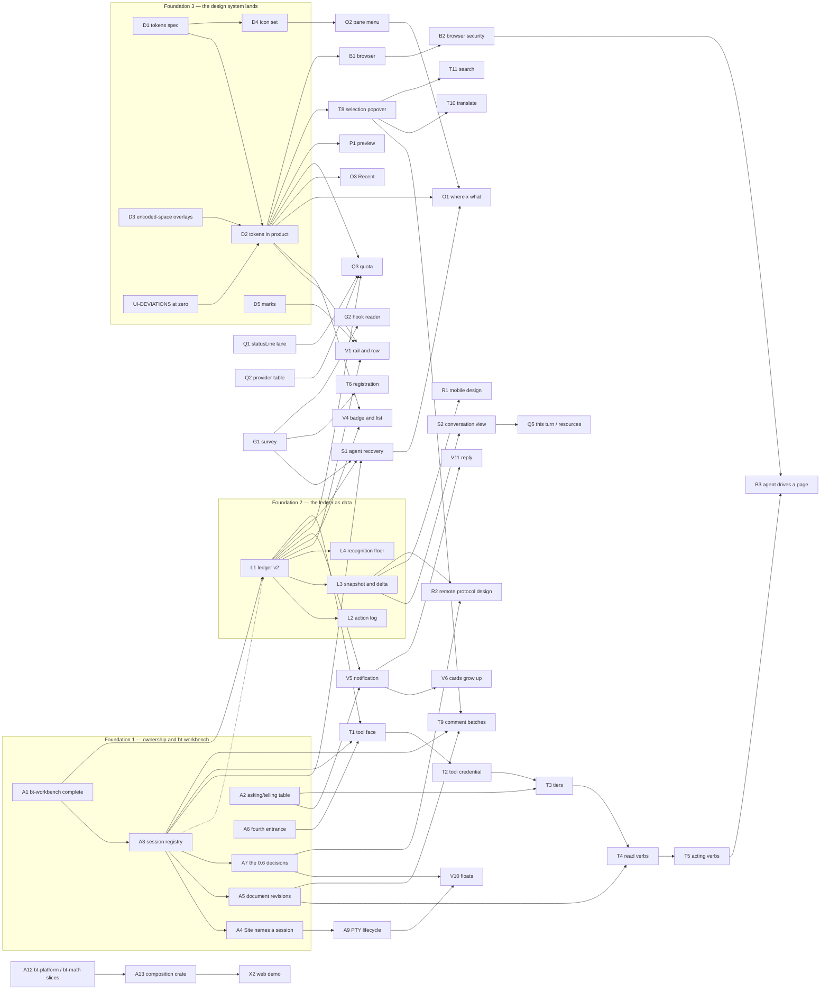

# The 0.5 plan: every increment, where it comes from, what it needs, and a proposed slicing

Plan note, 2026-09-27. Docs only; it rules nothing. It gathers every feature
increment that has been ruled or asked for 0.5, gives each one row with its
source, its state, what it depends on and its size, draws the dependency graph,
and proposes a slicing into 0.5.0 and 0.5.x for the owner's ruling and a Codex
review.

The owner's ask (2026-09-27): *"Shouldn't all the feature increments 0.5 is to
implement be gathered up, with their dependencies worked out, and written into
one plan-and-schedule document?"* His leaning the same day: design once,
implement in small versions; 0.5.0 is the foundations plus the first visible
surfaces.

## 0. How to read this

- **Rows are cited, not invented.** Every row names its source and the date of
  the ruling or ask. Where a feature has no design note yet, the row says so and
  sizes the **design** work, not the feature.
- **States.** *ruled* — the owner decided it (structure or behaviour; the look is
  still decided at birth on a real window, per the workbench note §1).
  *asked* — the owner asked for it and nothing more is decided. *proposed* — the
  coordinator or a review proposed it and the owner has not ruled. *open* — an
  explicit question is pending. *in flight* — a ticket exists.
- **Later wins.** Where two dated sources disagree, the later one is taken and
  §3 lists the conflict, so nobody re-litigates it silently (the owner's rule of
  2026-09-20: rulings follow their premises and change with them).
- **Sizes** are the repository's ticket sizes: S, S–M, M, L. They are estimates
  unless the source gives one (then the source's size is used). An item marked
  *design* is sized as the design note.
- **No dates.** §7.

### 0.1 Sources and their short names

In the repository:

| short | file |
|---|---|
| WB | `docs/plans/design/agent-workbench-0.5-2026-09-20.md` (revisions 1–5; §11–§14 rule over §2–§10) |
| OC | `docs/plans/design/ownership-census-2026-09-25.md` (§5 `bt-workbench`, §6 and (b)8 tickets, (b)3 roles, owner rulings 2026-09-25) |
| SD | `docs/plans/structural-debt.md` (rows D-n) |
| AR | `docs/ARCHITECTURE.md` (§12: what 0.5 and 0.6 require of today's code) |
| TD | `docs/plans/design/thread-door-2026-09-26.md` |
| WTB | `docs/plans/design/window-thread-budget-2026-09-25.md` |
| SURVEY | `docs/plans/agents/agent-survey-2026-09-20.md` |

Outside the repository (the coordinator's records, read-only; named by file,
not by location):

| short | record |
|---|---|
| IDX | the 0.4.4–0.4.7 ticket index (`tickets-044/00-INDEX.md`) |
| PS n | the prototype's status file (`proto/STATUS.md`), owner review item *n* |
| TF | the agent tool-face design note, 2026-09-24, with its Codex review and the owner's rulings |
| mem:*name* | a coordinator memory note, cited with the date of the line used |

`docs/handoff/HANDOFF-2026-08-21.md` was read and holds nothing about 0.5 later
than 2026-09-15. `CHANGELOG.md` *Unreleased* is 0.4.6 updater work only.
`docs/plans/release/plan.md` is the 0.1 release gate plan and has no 0.5
content. No `docs/plans/roadmap*.md` existed before this file.

## 1. Where 0.5 starts from

These are the preconditions the sources already set; none is a 0.5 increment.

1. **The architecture ledger reads zero at the end of 0.4.7** (SD header,
   2026-09-23; versions ruled 2026-09-24). 0.4.7 carries the first slices the
   owner wanted before 0.5: D-1, D-9, D-12, D-15, D-17 (SD, "The versions").
   Only D-43, D-44 and D-59 stay deferred.
2. **`docs/design/UI-DEVIATIONS.md` is empty before 0.5 starts** (owner
   2026-09-22/23; IDX §0.4.5 exit criterion). "UI unification is finished in
   0.4; 0.5 only adds new things" (mem:ui-design-05-approach, 2026-09-23).
3. **The 0.5 design is the mock0920 prototype**, not the style-ref sample, which
   is kept for the mobile app (mem:ui-05-design-pick, 2026-09-26).
4. **New 0.5 subsystems are born outside `Runtime`** — the attention ledger, the
   notification model, the agent list, the outward CLI/MCP — as their own module
   or crate with a stated interface; every 0.5 design note carries a "where it
   lives, what its interface is" section (mem:dependency-direction-and-split,
   2026-09-21; AR §12.3).
5. **0.5 is the agent workbench; remote is 0.6** (mem:ui-agent-workbench-scope,
   2026-09-18: *"I can live with RustDesk for remote for now"*); 0.5 leaves room
   for remote. The owner's words on the payoff, also the pitch: *the whole of
   Folio can be driven by an agent* (WB §2; mem:product-philosophy-extensibility,
   2026-09-20).

## 2. The inventory

Grouped by area. *Depends on* names rows of this table. Open decisions are
numbered into §6 where the owner must answer them.

### 2.A Foundations: ownership and the domain crate

| id | title | what it is | source | state | depends on | size | open decisions |
|---|---|---|---|---|---|---|---|
| A1 | `bt-workbench` completes its birth | The reach rule and `Places` move into the crate (census-4); the crate already holds the ledger, `WaitClock` and the seen rule | OC §5.1, (b)6, (b)8; SD D-57, D-48; AR §12.1 ("born 2026-09-25") | in flight (0.4.6) | census-3 (on main) | S | — |
| A2 | The asking/telling table is one declaration | Roles (gate, dialog, tool, toast, notification, pane state, mark, hint, log line) each with a policy record; the keyboard rungs, mouse rungs and `menu_or_dialog` derive from it (census-5a note, 5b code) | OC (b)3, (b)8, owner rulings 2026-09-25; SD D-8 | ruled (0.4.6) | owner rulings (given); 0.4.5 ticket 57 | S + M | TF asks for three new rows (agent notification, grant request, comment receipt) — §6 Q8 |
| A3 | Session registry and a view-owned configuration boundary | D-1's first slice: session identity independent of the window; `deliver_attention`'s routing moves beside the registry | SD D-1 (0.4.7); OC §5.1 step 3; AR §4.1, §12.1 | ruled (0.4.7) | A1 | L | changes an owner: a Codex-reviewed note first (CONVENTIONS rule 11 (architecture changes)) |
| A4 | A `Site` names a session; the ledger leaves `LeafSession` | D-54 (identity, admission, lifecycle); the `bt-layout::SeatId` edge exception goes | SD D-54 (0.4.7); OC (b)9 (Q5 settled by Codex) | ruled (0.4.7) | A3 | M | — |
| A5 | A document owner with a revisioned selection mapping | D-17's first slice: a selection taken at one revision cannot be applied at another; both preview faces consume one mapping | SD D-17 (0.4.7, with D-1) | ruled (0.4.7) | A3 | M | — |
| A6 | The fourth configuration entrance is designed | D-9: the tool face's row of the entrance table (TF §5 drafts it: domain queries and commands, never a preference); one preference, "allow external programs to control Folio" | SD D-9 (0.4.7); TF §5; WB §6 | ruled (0.4.7 design) | — | S (docs) | — |
| A7 | The three 0.6 decisions, written before a second view exists | Who controls PTY size and input order; what counts as *seen* and what *answers*; who may interrupt the desktop | AR §12.2; WB §11.7.4 | ruled (as a requirement) | A3 | S (design) | — |
| A8 | The rest of 0.4.7's closure the 0.5 code stands on | D-6 chains, D-16 the enumeration lane, D-49 the resize chain, D-51/D-55 observation and projection classes, D-56 the emergency journal, D-65/D-66 (see D3), D-78…D-83 the `Drop` inventory and the non-portable suites | SD (each row, 0.4.7) | ruled (0.4.7) | — | S–M each | — |
| A9 | PTY birth and resize leave the window thread | D-43, D-44: "deferred → 0.5 toward 0.6 — needs D-1's session owner to keep input and resize order" | SD D-43, D-44; WTB rows 11–12 | ruled (deferred to 0.5 toward 0.6) | A3, A4 | M each | whether 0.5 or 0.6 — §6 Q11 |
| A10 | The presentation lane | D-41: acquire, submit, present off the window thread; the owner deferred building it on 2026-09-24 until the self-inflicted waits were fixed and measured; AR §5.4's migration order puts the presentation line in 0.5 | SD D-41; WTB §4 | open (the owner's decision after measurement) | A8 | L | §6 Q11 |
| A11 | The thread door's remaining families and the lint | A2b–A2e: file doors, wait doors, `bt-pty` transport doors, then the lint | TD (i)1 | ruled 0.4.6, or all four move to 0.4.7 ("the owner's call, flagged") | A2a (done) | M, M, S–M, M | §6 Q12 |
| A12 | `bt-platform`'s first extraction; `bt-term → bt-math`'s first slice | D-12 (the read ledger, file primitives, process doors into one systems crate); D-15 "ahead of the 0.5 composition layer" | SD D-12, D-15 (0.4.7); mem:dependency-direction-and-split (2026-09-21) | ruled (0.4.7) | the `bt-app` move's end (D-32, 0.4.6) | M each | — |
| A13 | The composition layer becomes a library crate | Grid plus formula compositing leaves `bt-app` (the split's Step 3); its hard acceptance is that the web demo (X2) can link it; the first `Runtime` block extracted in 0.5 | mem:bt-app-split-freshness (2026-09-20); mem:dependency-direction-and-split (2026-09-21) | proposed (0.5 stage) | A12 | L | §6 Q19 |
| A14 | Extension seams stay internal but recorded | Registries for preview renderers, link/path recognition, the agent adapter table, commands with stable ids; one DESIGN page naming the seams and what is not done (no dynamic loading, no public API promise) | mem:product-philosophy-extensibility (owner, 2026-09-20: "leave a path"); WB §6 | ruled | — | S (docs), seams built as touched | — |

### 2.L The attention ledger as data

| id | title | what it is | source | state | depends on | size | open decisions |
|---|---|---|---|---|---|---|---|
| L1 | Ledger v2: facts owned, the word derived | Five independent facts (agent lifetime, turn phase, outstanding waits, the acknowledgement watermark, account quota, plus the last outcome), each with one owner and one expiry; the row's word and the pane's dot computed every frame and stored nowhere; keyed by pane `{TabId, SeatId, incarnation}` plus an agent-lifetime epoch | WB §13.2, §13.1, §11.3.2; §13.6 row 2 | ruled | A1 (hard), A3 (the address) | M | — |
| L2 | The append-only action log | Agents only; one line per action (when · pane · agent · verb · outcome); no payload, no typed text, no output; size-bounded; removed by `--uninstall-cleanup --purge`; the interruption counts are queries over it | WB §11.9, §12.4.7 (ruled 2026-09-20), §13.6 row 2 | ruled | L1 | S–M | — |
| L3 | The ledger is consumable by another front end | Versioned snapshot and delta out of the domain (AR §12.1's "out" column); states on the wire as A2A `TaskState` with `x-folio/idle` and `x-folio/limited`; no `AppEvent`, `Runtime`, window handle or `Instant` as protocol | AR §12.1, §12.3; WB §3.1; mem:mobile-app-is-not-a-projection (2026-09-21); mem:dinotty-reference (2026-09-18: a backend-authoritative ledger) | ruled (direction) | L1 | M | — |
| L4 | The recognition floor | A row exists only on a hook credential from the pane or an OSC row from its tty; nothing else lists an agent; agents inside WSL, ssh or tmux are invisible in 0.5 and a forwarding lane is reserved for 0.6 | WB §11.8, §13.1 | ruled | L1 | S | — |
| L5 | *Turn finished* notifications default to on | Waiting and Failed always notify; Done follows the switch, which defaults to on in 0.5 (migration plus a release note if today's default differs) | WB §13.3.2 (owner, 2026-09-20) | ruled | L1 | S | — |
| L6 | The interruption numbers are shown | Waits, wait durations, the person's response delay — "the only way to know whether any of this helped" | WB §2.5, §11.9 | proposed (no surface designed) | L2 | S (design) | — |

### 2.V The workbench surfaces

| id | title | what it is | source | state | depends on | size | open decisions |
|---|---|---|---|---|---|---|---|
| V1 | The Agent rail | One list for the whole application: this window's rows, a rule, the other windows' rows; gone when no agent runs; at the sidebar's foot and the card column's foot, foldable by its whole header; a row click takes the tab, focuses the pane and rings it | WB §11.3; PS second round (2026-09-23: a row click rings the pane), 13, 25, 26, 39; mem:ui-agent-workbench-scope (2026-09-20, 2026-09-23) | ruled (structure) | L1, D2, D6 | M | V7 |
| V2 | The agent row | Mark · title · context ring and % · this turn's clock or the sub-agent count · state word; creation order; no `⌄`; the sub-agent glyph is Codex's G2 | WB §11.3.3, §12.3; PS 18, 27, 36, 54, 55 | ruled, except one line or two | V1 | S–M | §6 Q2 |
| V3 | The glance card | Peek after 350 ms, a click pins, one card at a time, fields only, clamped lines, placed by one shared function | WB §4.3, §11.3.5, §13.3.5; PS 18, 29, 75 | ruled, except its actions | V1 | S–M | §6 Q3 |
| V4 | The attention badge and its list | One dot and one number: the number is the total of every window's dots, the colour the most urgent class; the list is the same component as the notification; it stays in every tab mode | WB §4.4, §11.6, §13.3.7; PS first round (2026-09-23), 76 | ruled | L1, D2 | M | — |
| V5 | The notification | Appears for every agent that needs the person (the focused pane included), expands to the latest reply, a click goes there; mute per agent silences the notification only; where it appears: the focused Folio window, else a system notification, else every window | WB §12.1, §13.3; PS 45 | ruled | L1, A2 | M | §6 Q17 (position) |
| V6 | The notification card grows up | The owner's target for 0.5: it can become a small window, stay, be clicked, offer several choices, take input; queue rather than evict; anchor to terminal panes; the pane strips and the preview pills fold into it; the PowerShell invitation becomes a notification | mem:workbench-05-notification-model (owner, 2026-09-21); OC owner ruling 3 (2026-09-25) | asked | A2, V5 | M (design) + M–L | §6 Q17 |
| V7 | A waiting row sticks to the rail's top | So a stable order never hides a wait below the fold | WB §11.11 Q1, §12.4 | open (recommended yes) | V1 | S | §6 Q4 |
| V8 | Agent facts on pane heads and tabs | The pane head's meta (state word, ring, sub-agent count, a drop order); tab status dots and the tab glance card listing its panes; the owner's 2026-09-18 ask that a tab with agents shows more | WB §4.6; PS 68b, 68c (owner-approved exploration, not ruled); mem:ui-agent-workbench-scope item 6 (2026-09-18) | proposed | L1, D2 | M | — |
| V9 | Settings ▸ Agents | Detected agents (read-only: mark, name, how found, sessions), accounts, quota notices, registration add/remove, live grants with Revoke | PS 68a, 70; TF §3, §4 (owner R4, 2026-09-24) | proposed (page), ruled (registration) | Q2, T3, T6 | M | — |
| V10 | The agent floats | The zoom float (the tab's agent stays reachable over a zoomed pane, compact by default) and the tear-out float (a row dragged out becomes a live second view of that pane, expanded by default); one PTY, one size, never reflowed; the local rehearsal of 0.6 | WB §11.7.4, §13.3.3 (drag-out: 0.5.x); PS 28b, 35, 37, 40, 50, 56; mem:workbench-05-notification-model (2026-09-23) | ruled for 0.5.x (drag-out); the zoom float is an owner exploration | A7, L1; A9 | L | §6 Q5 |
| V11 | Reply in the notification and the list | One paste-only mechanism, offered only when the agent verifiably waits for free text; never for a permission prompt | WB §11.7.3, §13.3.1 (0.5.x); PS 28a | ruled (0.5.x) | V5, A7 | M | — |
| V12 | The work-in-progress hint | When a new agent is opened, "N waiting on you" is visible; it never blocks | mem:attention-bottleneck-idea (point 6, 2026-09-20) | proposed | V4 | S | §6 Q20 |
| V13 | Pre-authorised answers | "Read-only commands always allowed", answered by Folio with a trace | WB §2.4; mem:attention-bottleneck-idea (point 4) | open: the delivery path was withdrawn (no hook can return a decision, WB §11.1–§11.2) | L2 | S (design) | §6 Q20 |

### 2.Q Quota and accounts

| id | title | what it is | source | state | depends on | size | open decisions |
|---|---|---|---|---|---|---|---|
| Q1 | The statusLine lane | Wrap or refuse, byte-identical on uninstall; a user's own statusLine is left alone and the data it would carry is absent | WB §7, §11.8, §13.6 row 6a; mem:quota-strip-probe (2026-09-20) | ruled | — | M | — |
| Q2 | The provider adapter table | Per vendor: billing form, mechanism, fields, whether the user configures anything; Codex app-server, Kimi's own local server and the bearer it prints (ruled acceptable), Anthropic's statusLine, DeepSeek balance opt-in, GLM none; a second probe for Grok, MiniMax, Gemini, Qwen | mem:quota-strip-probe (2026-09-20 night); WB §7 | ruled (the table); the second probe pending | — | M + S (probe) | — |
| Q3 | Chip, panel and toasts | Buckets read available / exhausted / unknown; toasts read what is left and the next reset; the panel groups company → account, subscriptions first, then API accounts with a balance, unreadable vendors last; used up is amber and static; vendor marks on the group heads; two time columns | WB §4.5, §13.3.8, §13.6 row 6b; PS first and second rounds (2026-09-23), 15, 51, 57, 61, 77, 78, 82 | ruled (structure); the control's form open | Q1, Q2, L1, D2 | M–L | §6 Q6, Q7 |
| Q4 | Accounts as bookkeeping | An account is attributed from the hook's or statusLine child's environment; a label appears only when one vendor has more than one account; no switching and no "reopen with another account"; the least-used account sorts first in the new-agent menu | WB §4.7, §11.8; mem:quota-strip-probe (owner, 2026-09-20) | ruled | Q2 | S–M | — |
| Q5 | "This turn" and "Resources" | This turn: model, context bar, turn tokens, cache hits, output, tokens per second (from the conversation-view data model); resources: this session's and the system's CPU and memory | mem:ui-agent-workbench-scope (owner, 2026-09-26) | ruled, no design | S2, Q3 | S (design) + M | — |
| Q6 | The gauge follows the current tab's account | The chip shows the active tab's agent account, falling back to the worst in-use account | PS 58 | open (owner exploration) | Q3 | S | §6 Q6 |

### 2.O Opening things, menus and tabs

| id | title | what it is | source | state | depends on | size | open decisions |
|---|---|---|---|---|---|---|---|
| O1 | The where × what panel | One component for the tab `⌄`, the tab column's `+ New tab ⌄` and the pane's `Split with ▸` (with the split picker, `Auto` by default): folders on the left select, kinds on the right open; Browser on its own strip; Recent at the foot; `▸` levels list the recent things of that kind in the selected folder. The owner's rule: *typing is an accelerator, never the only way* | WB §14; mem:workbench-05-where-what-panel (2026-09-20); PS 14, 20–24, 30, 31, 38, 44, 47 | ruled (structure; visual rounds 2026-09-23) | D2, D5; S1 for the agent levels | M–L | — |
| O2 | The pane `⌄` menu, six items | Zoom/Restore · Split with ▸ · Duplicate · Move to tab ▸ · Move to window ▸ · Close, wearing the picked glyphs; the tab `⌄` is the panel; a hidden quick-terminal window is never a destination | PS 41, 43, 46, 49; mem:chevron-menu-ruling (2026-09-23); WB §14.5.4 | ruled | D5 | S–M | — |
| O3 | The Recent view | A third view of the files column, per tab: paths seen in output, files agents wrote (hooks), the person's own opens; a small mono agent mark says who; the preview may follow the agent's latest file; needs no ledger and no protocol | WB §4.8, §11.10 row 1; mem:workbench-05-tab-scope-and-handoff (2026-09-20) | ruled 2026-09-20; the prototype kept it as a switch (2026-09-23) | D2 | S–M | §6 Q9 |
| O4 | Merging tabs | A tab can join another tab as panes (a tab-menu verb); cards mode gets drag-in with the card redo | mem:ui-agent-workbench-scope (2026-09-20) | proposed (the menu half was proposed for 0.4.4; not verified here) | O2 | S–M | — |
| O5 | Tab groups | A group is a project, optionally bound to a folder | WB §9; mem:ui-agent-workbench-scope (owner, 2026-09-20: "no groups for now" — deferred, not refused) | deferred | — | M (design) | — |

### 2.S Sessions: agent recovery and the conversation view

| id | title | what it is | source | state | depends on | size | open decisions |
|---|---|---|---|---|---|---|---|
| S1 | Agent recovery | "Agent recovery" (owner, 2026-09-27): agent sessions as first-class objects; a pane remembers program + folder + session id; pinned tabs resume their agent after a restart and a Recent row resumes on a click; auto-resume **on by default**, with a switch (2026-09-18); Folio starts the agent and never sends anything; session lists in two layers (sessions Folio observed through hooks, then `All…` = the agent's own picker), empty sessions hidden, a resume chain one row. **No design note exists**: the pieces are rulings in three places | mem:ui-agent-workbench-scope item 4 (2026-09-18); WB §14.4; mem:workbench-05-where-what-panel (2026-09-20) | ruled in parts; no design | A3, L1, G1 (per-vendor resume ids) | M (design), then M–L | §6 Q13 |
| S2 | The conversation view | A pane toggles between conversation and terminal; the data comes from the agent's own local transcripts (Claude Code's JSONL, Codex's sessions), not from the screen; turns, actions, files and waits form one model that is also the mobile app's API; version one is read-only plus a reply at a wait, sent through the pane's terminal; a research ticket first (both formats and how often they change, guard tests on samples) | mem:ui-agent-workbench-scope (owner, 2026-09-26; VelaTerm reference) | ruled; no design | L3, A3 | S (research) + M (design), then L | §6 Q14 |
| S3 | `[Image #N]` in an agent's input line | Folio learns a pane's `[Image #k]` → `<session images>/k.png` mapping from the OSC 8 links Claude Code prints, and treats the same text in the input area as a link when the file exists; in the conversation view it becomes a thumbnail | IDX (0.4.7 small, owner ask 2026-09-27); mem:ui-agent-workbench-scope (2026-09-27); mem:ui-design-05-approach (2026-09-27) | asked (0.4.7 small or 0.5) | — (link half); S2 (thumbnail half) | S | §6 Q21 |
| S4 | A finished turn in three lines | What it did, what it says it did not verify, CI | WB §2.3; mem:attention-bottleneck-idea (point 3) | proposed (the notification's expand shows the latest reply, ruled) | S2 | S (design) | — |

### 2.T The tool face and comments

| id | title | what it is | source | state | depends on | size | open decisions |
|---|---|---|---|---|---|---|---|
| T1 | The tool face | `folio <verb>` from the agent's shell and `folio mcp` over stdio, both adapters of one domain API; public-protocol discipline from day one (version, capability discovery, structured errors, stable verbs); a third endpoint with bounded ingress, operation identity and reserved replies | WB §6; TF §2 and review items 3, 5; AR §12.3 | ruled (direction); no ticket yet | A1, A3, A6, L1 | L | — |
| T2 | A distinct tool credential | One per tool-enabled session incarnation (e.g. `FOLIO_TOOL_CAP`); `FOLIO_ATTENTION` stays attention-only; grants are central in-memory records, revalidated at admission | TF review item 1; owner 2026-09-24 (supersedes WB §11.9's "extend the same token") | ruled | T1 | M | — |
| T3 | Permission tiers | Read its own tab (default) · read other tabs (asked once per agent per session) · notify · send (per target pane, shown on that pane) · **operate Folio** (the top tier, per agent, explicit, revocable in Settings ▸ Agents); not a sandbox, and no string may imply one | TF §3; owner 2026-09-24; WB §6 | ruled | T2, A2 (the grant ask is an asking surface) | M | §6 Q15 |
| T4 | Read verbs first | What the person is looking at (focused pane, file and line, selection, working folder), pane list and text, the ledger; every read returns a revision; an agent reads the live buffer, not the disk | WB §13.6 row 8, §12.4.7; mem:oxide-borrowable-ideas (2026-09-18, points 2–3); mem:dinotty-reference (point 3) | ruled | T1, T3, A5 | M | — |
| T5 | Acting verbs and the typing tier | Open a file at a line (with a brief highlight), split, open or navigate a page, type into another pane (agent-to-agent), complete enough to drive Folio | WB §13.6 (0.5.x); TF owner ruling 2026-09-24; mem:workbench-05-tab-scope-and-handoff (2026-09-24) | ruled (0.5.x) | T4 | M–L | — |
| T6 | Registration | Settings ▸ Agents adds and removes Folio from each agent (the vendor's own `mcp add`/`remove`, byte-preserving; an uninstall mark each); a release-pinned MCP/CLI survey per agent comes first | TF §4, review item 7; owner R4 | ruled | T1, G1 | S (survey) + M | — |
| T7 | Instruction snippets for agents | Folio ships the lines that tell an agent when to use its tools; appended, never overwriting, and only with consent | mem:oxide-borrowable-ideas (point 5) | proposed | T4 | S | — |
| T8 | The selection popover | Comment · Translate · Search on every selection, in previews, web pages and terminal panes (an agent's own pane included); copy stays Ctrl/Cmd+C | PS 60, 67, 71, 83 (rulings 2026-09-26); mem:workbench-05-tab-scope-and-handoff (2026-09-23…26) | ruled | D2 | M | — |
| T9 | Comment batches | Enter adds to the current tab agent's batch; a pending strip on the float and on the agent's docked pane; quoted ranges keep a wash; Send types one line per comment and then Enter; without bracketed paste the batch stays pending with a reason; the batch belongs to the target session | TF R1, §1, §5, Q1 (owner 2026-09-24); PS 62, 65, 66, 72 | ruled (supersedes WB §8's "never auto-submitted") | T8, A3, A5 | M–L | — |
| T10 | Translate | Terms from an offline dictionary, sentences through the user's own AI API key; never through the agent; the card is marked with its source; Settings ▸ Translation | PS 83 (owner rulings 2026-09-26); mem:workbench-05-tab-scope-and-handoff (2026-09-26) | ruled | T8 | M | §6 Q16 |
| T11 | Search | The selection opens in a floating web window; the engine is a setting | PS 83 (2026-09-26) | ruled | T8 | S–M | — |
| T12 | Page elements and screenshots | Alt+click picks a page element; a comment carries its element description and a screenshot | mem:workbench-05-tab-scope-and-handoff (2026-09-20, 2026-09-23); WB §8 row 6 | ruled (gesture) | T9, B1 | M | — |

### 2.B The browser

| id | title | what it is | source | state | depends on | size | open decisions |
|---|---|---|---|---|---|---|---|
| B1 | The browser pane's promotion | "Browser upgrade" (owner, 2026-09-27): the browser becomes its own class beside shell, files and preview, *"closer to a real browser"*, callable by agents; the 2026-08-19 web-preview rulings (one page per pane, no tabs inside, heavy browsing to the system browser) need re-ruling because their premise changed. The coordinator's recommendation: several pages with a visible strip; opening a link never replaces a page in use. **No design note exists** | mem:ui-agent-workbench-scope item 2 (2026-09-18) and 2026-09-20 night; WB §9, §10 Q10; mem:rulings-evolve (2026-09-20); mem:preview-line-numbers-deferred (2026-09-18) | asked; no design | D2, O1 | M–L (design), then L | §6 Q10 |
| B2 | The browser's security model | A separate profile by default without the person's cookies; an agent reaches local addresses by default; sites granted one by one | mem:ui-agent-workbench-scope (2026-09-18, accepted by the owner); WB §8 row 7; mem:workbench-05-tab-scope-and-handoff (point 3) | ruled (direction) | B1 | in B1's design | — |
| B3 | Watching an agent drive a page | Its own visible cursor with the vendor's mark; the person's touch takes over; closing the pane sends it to the background with a row "driving a web page · domain" and Stop, never invisible; WebView2 has CDP, WKWebView needs a second implementation | WB §8 row 7, §13.6 (0.5.x, last) | ruled (last) | B1, B2, T5 | L | — |
| B4 | Room for 0.6 in the browser | How a remote machine's dev server is seen in the local browser pane | mem:dinotty-reference (point 5, 2026-09-18) | proposed | B1 | S (a design section) | — |

### 2.P Preview and documents

| id | title | what it is | source | state | depends on | size | open decisions |
|---|---|---|---|---|---|---|---|
| P1 | Preview beauty and line numbers | Highlighting where there is none (`.ps1`) and readability where there is; line numbers for code, plain text and diffs (two columns), the Markdown source face only; a click on a number selects the line; "copy as reference" (`path:324-329`) for agents; the prototype's first round (a 42 em measure, growing margins, the type ladder, a Line numbers menu row) | mem:ui-agent-workbench-scope item 7 (2026-09-18); mem:preview-line-numbers-deferred (2026-09-18); PS 53, 59 | asked; explored, not ruled | D2 | M–L | — |
| P2 | Markdown editing conveniences | "Markdown editing conveniences, the preview's completion and the UI restyle go together in 0.5" | mem:ui-design-05-approach (owner, 2026-09-23) | asked; unspecified | A5, D2 | S–M (design) | — |
| P3 | The formula renderer as a separate process | A render has no time or memory ceiling today (worst measured ~5.4 s); "the correct answer is a separate process that can be killed, in 0.5" | mem:roadmap-2026-09-15 (2026-09-17) | proposed | — | M–L | §6 Q19 |

### 2.D The design system

| id | title | what it is | source | state | depends on | size | open decisions |
|---|---|---|---|---|---|---|---|
| D1 | The tokens, specified | Colours (light: Apple's macOS system colours for marks and coloured text at every size; dark: today's), spacing 4/8/12/16/24/32, the type scale, control heights, state rules (a control keeps its plate, a readout changes tone only), ✓ for selection; pages are not covered | IDX (D05-1, dispatched 2026-09-27); mem:ui-05-design-pick (2026-09-26, 2026-09-27); PS rounds 20–23 | in flight (docs) | — | S–M | its own open table |
| D2 | The tokens land in the product | A generated palette table from the tokens file; the looser density as the chrome's default; the terminal grid, its font sizes and the title-band slots keep their measured values | D05-1 ("so a later ticket can generate the product's palette table"); mem:ui-design-05-approach (2026-09-22: "more modern = a new system, not a new identity") | ruled (direction) | D1, D3, precondition 2 (§1) | M–L | — |
| D3 | Overlay translucency in encoded space | D-65's L variant and D-66: a fading surface stops showing text before its plate, and translucent inks match the CSS mock; "before the 0.5 restyle" | SD D-65, D-66 (0.4.7) | ruled (0.4.7) | — | M | — |
| D4 | The icon set | The owner's picks by id (Zoom Z1, Restore R1, Split with S9, Duplicate D3, Move to M1; the Move submenus), then the remaining rows; the gear eventually redrawn on the house grid; what the owner asked: *"simple and clean, and clearly descriptive"* | PS 34, 42, 43, 49; WB §4.5, §4.9; mem:ui-agent-workbench-scope (2026-09-18) | ruled (the first rows) | D1 | M | — |
| D5 | Marks and the trademark review | Official vendor marks except Claude's, which is the own-drawn eight-ray burst (2026-09-23); monochrome marks follow the ink; vendor marks wear the primary ink; one replaceable slot per vendor; each vendor's brand guide read before shipping | WB §4.9, §13.4; PS first round (2026-09-23), 81; mem:agent-coverage-systematic (2026-09-20) | ruled (see §3 row 1) | — | S–M | §6 Q18 |
| D6 | Whole-window drafts and "always light" | A full-window style draft in both themes beside the mock; a static edge highlight on tabs and controls (the static layer of macOS 26's material), not an animation | mem:ui-design-05-approach (2026-09-27) | asked (exploration, not ruled) | D1 | M (design) | — |
| D7 | Fewer words | No string explains the interface: a string names a thing, states a fact, or is the person's or the agent's own words; a state is one word | WB §11.4 (owner, 2026-09-20); mem:fewer-words-in-ui | ruled (a house rule) | — | — | — |

### 2.G Agent coverage

| id | title | what it is | source | state | depends on | size | open decisions |
|---|---|---|---|---|---|---|---|
| G1 | The coverage survey lands and orders the work | The owner, 2026-09-20: *"shouldn't we build a table of the mainstream ones — what you have now is still all from me telling you"*; the 2026-09-22 fifteen-vendor table (adoption, permission hooks, turn-end hooks, screen text, notification protocol) replaces the 2026-09-20 survey in the repo and sets the adapter order | mem:agent-coverage-systematic (2026-09-20, 2026-09-22); SURVEY; WB §13.5 | asked | — | S | — |
| G2 | One Claude-shaped hook reader | Parameterised (config root, file path, event aliases) so about seven vendors that rebuilt Claude Code's event layer cost rows and a config template, not code; Gemini, Qwen and Kimi rows first | WB §13.5; mem:agent-coverage-systematic (2026-09-22) | proposed | G1, L1 | M | — |
| G3 | Gemini CLI | Its own ticket after the first 0.5 (its hook is a shell string with no `args[]` form) | WB §13.5, §13.6 (0.5.x) | ruled (0.5.x) | G2 | M | — |
| G4 | The generic lane | Parse OSC 99; set `OPENTUI_NOTIFICATION_PROTOCOL=osc777` in pane environments; never claim to be another terminal; ask vendors to add Folio to their allowlists only "once we have a few hundred stars" (owner, 2026-09-23) | mem:agent-coverage-systematic (2026-09-22, 2026-09-23) | proposed; the allowlist timing ruled | L4 | S–M | — |
| G5 | Several models side by side | Comparing models on the same task | mem:ui-agent-workbench-scope (2026-09-18, a coordinator addition the owner accepted in general) | proposed; no design | — | — | §6 Q20 |

### 2.K The desk assistant

| id | title | what it is | source | state | depends on | size | open decisions |
|---|---|---|---|---|---|---|---|
| K1 | "Where did I leave it" | A low-presence helper: a desk card per agent pane (what you last said, the start of its last answer, how long ago) with no model; plans kept outside agent memory in a `DESK.md`; an optional model with the user's own key to extract decisions, each with its source. Its place in 0.5 was named on 2026-09-18 | mem:desk-assistant-plan (2026-08-30); mem:ui-agent-workbench-scope (2026-09-18) | asked; three decisions open | L1, S2 | S–M (design) | §6 Q20 |

### 2.M Platform

| id | title | what it is | source | state | depends on | size | open decisions |
|---|---|---|---|---|---|---|---|
| M1 | The Mac's full menu bar | "If it is done, do the whole menu bar"; single-pane zoom belongs there, not as a lone row | mem:pane-zoom-design (owner, 2026-09-24: its own 0.5 Mac-polish item) | ruled (0.5) | — | M | — |
| M2 | The Mac gear's hover without a plate | The owner's 2026-09-23 ruling differs from the build (a pill wash since 2026-09-14): a product change | PS decisions of 2026-09-23 | ruled | D2 | S | — |

### 2.R Remote and mobile groundwork (laid in 0.5)

| id | title | what it is | source | state | depends on | size | open decisions |
|---|---|---|---|---|---|---|---|
| R1 | The mobile app's design project | A separate project for the mobile design; the style-ref sample is its starting point; the app presents messages and information, it is not a projection of the desktop; it consumes the ledger | IDX (M-0, 2026-09-27); mem:mobile-app-is-not-a-projection (2026-09-21); mem:ui-05-design-pick (2026-09-26) | asked (design only) | L3 | S–M | — |
| R2 | The remote protocol, designed only | In 0.5 remote gets its protocol design, not code; the 2026-09-10 research was written when remote was 0.4 and is its starting point | the coordinator's 0.5 order (2026-09-27, the owner agreed to the parallel list); `docs/plans/remote/research-2026-09-10.md` | proposed | A7, L3 | M (design) | — |

### 2.X Other

| id | title | what it is | source | state | depends on | size | open decisions |
|---|---|---|---|---|---|---|---|
| X1 | The Chinese copy of 0.5's strings | New strings ship in English and are listed in `CHINESE_PENDING`; the Chinese copywriter writes them later. No source rules when | standing rules §Copy | open | — | S per batch | §6 Q16 |
| X2 | The web demo | Real rendering in the browser (wasm) with a fake shell of five or six preset commands; replaces the website's hand-drawn demo; "the 0.5 stage" | mem:bt-app-split-freshness (2026-09-20); mem:publicity-plan (2026-09-20) | asked | A13 | M–L | §6 Q19 |
| X3 | The adversarial audit | One per minor version, strictly triaged | mem:pace-and-split-priority (2026-09-21) | ruled | — | M | — |
| X4 | Domestic promotion at the 0.5 release | Xiaohongshu and the like wait for 0.5; "Folio can be driven by an agent" is a selling point | mem:publicity-plan (owner, 2026-09-20); mem:product-philosophy-extensibility (2026-09-20) | ruled (timing) | — | — | — |

## 3. Where a later ruling replaced an earlier one

| # | earlier | later (taken) | where |
|---|---|---|---|
| 1 | Claude's glyph is U+2733, drawn geometric, in Claude's orange (2026-09-20 evening) | Claude wears the own-drawn eight-ray burst `claude-a` (2026-09-23); every other vendor keeps its official mark | WB §13.4 → PS first round (2026-09-23) |
| 2 | Comments are never auto-submitted (WB §8 row 6; §13.3.4 "sends no Enter") | Send types the batch and then Enter (2026-09-24) | TF R1 |
| 3 | The badge is not drawn while the rail is on screen (WB §4.4, §11.3) | The badge stays in every tab mode (2026-09-23) | PS first round (2026-09-23) |
| 4 | Used-up quota turns the chip red when every in-use account is exhausted (WB §11.9) | Used up is amber and static; red is only a failed agent (2026-09-24) | PS 78 |
| 5 | The quota strip comes after 0.5 (2026-09-15) | Quota is part of 0.5 (2026-09-18) | mem:roadmap-2026-09-15 → mem:ui-agent-workbench-scope |
| 6 | The pane `⌄` menu: five items with one `Move to ▸` (2026-09-23, item 41) | Six items, `Move to tab ▸` and `Move to window ▸` (2026-09-23, item 46) | PS 41 → 46 |
| 7 | Search opens a web pane beside the selection (the prototype's first build, 2026-09-25) | Search opens a floating window (2026-09-26) | PS 83 |
| 8 | The translation card is the tab's agent's (the prototype's first build, 2026-09-25) | Offline dictionary plus the user's own key; never the agent (2026-09-26) | PS 83 |
| 9 | The tool token extends `FOLIO_ATTENTION` (WB §11.9) | A distinct tool credential (2026-09-24) | TF review item 1 |
| 10 | Allow / Deny on rows and in the list (the mock, WB rev 1) | None anywhere (2026-09-20, confirmed 2026-09-23) | WB §11.2; PS second round (2026-09-23) |
| 11 | The web preview is one page per pane, no tabs (2026-08-19) | The browser becomes its own class, closer to a real browser (2026-09-18) — the details are unruled (B1) | WB §9 |
| 12 | Crawling a vendor's session directory by a guessed layout is not done (WB §14.4, 2026-09-20) | The conversation view reads the agents' local transcripts (2026-09-26) — how far this goes is §6 Q14 | mem:ui-agent-workbench-scope |

## 4. Dependencies

### 4.1 The graph

### 4.2 The same, as a list with the reasons

**Foundation 1 — ownership contracts and `bt-workbench`** (A1 → A3 → A4, A5, A7;
A2; A6).
- A1 before A3: the session registry is where `deliver_attention`'s routing
  moves (AR §12.1), and the ledger it routes to must already be out of `bt-app`.
- A3 before T1, S1, T9: the outward interface must answer from narrow session,
  document and view objects; answering by traversing `Runtime` is D-1's "if left"
  case verbatim (TF §5). Agent recovery needs a session identity that survives
  the window. A comment batch is owned by the target session, not by a view.
- A5 before T4 and T9: a comment carries `file:line` taken at one revision and an
  agent must read the live buffer; both need D-17's revisioned mapping.
- A2 before V5, V6 and T3: a notification is a role of the asking/telling table,
  and the grant ask is a new asking surface that "takes a row in the §8 table
  first" (TF §3). AR §12 makes the table and the configuration map (A6) the
  precondition of an outward interface.
- A6 before T1: an outward interface is a new configuration entrance (AR §12;
  SD D-9).
- A7 before V10, V11 and R2: a second view of one PTY is the first instance of
  0.6's shape (WB §11.7.4); the three decisions must precede the second client
  (AR §12.2).
- **What it unlocks:** the tool face, agent recovery, comments, the floats, and
  the remote design.

**Foundation 2 — the attention ledger as data** (L1 → L2, L3, L4).
- L1 before every surface that shows an agent's state (V1, V4, V5, V8, Q3 "in
  use"): one fact, one owner; every surface is a projection (WB §3.2, §13.2).
- L3 before S2, R1, R2: the conversation view's model is the mobile API, and the
  mobile app and remote consume the ledger as data, not the desktop's drawing
  (mem:mobile-app-is-not-a-projection).
- L2 before L6 and V13: the metrics and any pre-authorised answer are queries
  over, or entries in, the one log.
- **What it unlocks:** the rail, badge, notification, quota "in use", agent
  recovery's observed sessions, the tool face's ledger reads, mobile, remote.

**Foundation 3 — the design system lands** (D1, D3, UI-DEVIATIONS zero → D2; D1 →
D4; D5).
- D2 before every visible 0.5 surface: a new surface is dressed at birth
  (WB §1), and the 2026-09-22 approach is "a new system, not a new identity"
  (mem:ui-design-05-approach). A surface built before the tokens land is built
  twice.
- D3 before D2: otherwise a fading surface shows its text before its plate and
  the translucent inks differ from the mock (SD D-65/D-66, "before the 0.5
  restyle").
- D4 before O2 and O1: the menus wear the picked glyphs.
- **What it unlocks:** every surface in V, O, Q, T8, P1, B1.

**Other edges.**
- Q1 and Q2 before Q3: the chip may show only what an honest source gives
  (WB §7).
- G1 before S1, T6, G2: resume ids, MCP registration and the hook reader are per
  vendor; the survey is their source.
- A4 → A9 → V10: a live second view needs the session owner to keep input and
  resize order (SD D-43).
- B1 → B2 → B3, and T5 → B3: an agent drives a page only after the browser class,
  its profile and grants, and the acting verbs exist; it is last by ruling.
- A12 → A13 → X2: the web demo links the composition layer, which is a library
  crate only after Step 3.
- **Independent of the three foundations:** O3 (the Recent view needs no ledger
  and no protocol, WB §11.10) — though it is still dressed by D2; P3; M1; X3.

## 5. A proposed slicing

The owner's leaning (2026-09-27): design once, implement in small versions;
0.5.0 is the foundations plus the first visible surfaces. This section is a
proposal for that ruling. It orders by dependency and gives sizes only.

| version | what a user sees | what the engineering line gets | rows |
|---|---|---|---|
| **0.5.0** | The new look (tokens, density, palette, the picked icons); the six-item pane menu and the where × what panel for opening anything anywhere; the Recent view; the Agent rail with its rows and glance cards; the attention badge and its list; notifications that appear, expand and take you there, with *Turn finished* on by default | The ledger v2 with its log sink and the snapshot/delta shape; whatever of A1–A5 0.4.7 did not finish; the asking/telling table enforced | D2, D4, D5, O2, O1 (without agent levels), O3, L1, L2, L3, L4, L5, V1, V2, V3, V4, V5, M2 |
| **0.5.1** | The quota chip, panel and toasts; Settings ▸ Agents (detected agents, accounts, notices); more agents recognised; agent facts on pane heads and tabs | The statusLine lane; the provider table; the hook reader; the generic lane | Q1, Q2, Q3, Q4, V9 (without registration and grants), V8, G1, G2, G4, V7 |
| **0.5.2** | Select anything and Comment, Translate or Search; comments batched and sent to the agent; agents can read what you are looking at through `folio` and MCP | The tool face with its credential, tiers and read verbs; the fourth entrance; registration | A6 (if not done), T1, T2, T3 (read, notify), T4, T6, T7, T8, T9, T10, T11, V9 (registration, grants) |
| **0.5.3** | Agents come back after a restart; the conversation view; "this turn" and "resources"; reply from a notification; the zoom and tear-out floats; the where × what agent levels | Session identity carries recovery; PTY birth and resize under the session owner (toward 0.6); the three 0.6 decisions written | S1, O1 (agent levels), S2, S3 (thumbnail half), Q5, V11, V10, A7, A9, L6, S4 |
| **0.5.4** | The browser as its own pane class with several pages; agents that open, split and navigate, and drive a page you can watch; Gemini CLI | The acting verbs and the typing and "operate Folio" tiers; the browser's profile and grants | B1, B2, B4, T5, T3 (send, operate Folio), T12, B3, G3 |
| **any 0.5.x** | Preview beauty and line numbers, then Markdown editing conveniences; the Mac's menu bar | The formula renderer as a process; the composition crate and the web demo; the presentation lane if measurement says so | P1, P2, P3, M1, A13, X2, A10 |

Every 0.5.x also carries X1 (its strings' Chinese, if ruled per version) and X3
(the audit once per minor version, if "minor version" means 0.5 rather than each
0.5.x — §6 Q16 covers the first; the second is the owner's reading).

**Design before build, per slice.** Items with no design note — S1, S2, B1, P2,
V6, K1 — get their note (and, where an owner changes, its Codex review) in the
slice before the one that builds them, so a slice never waits on its own design.

### 5.1 What stays out of 0.5, and what 0.5 must lay for it

| out of 0.5 | where it goes | what 0.5 must lay |
|---|---|---|
| Remote: a backend owns session state and clients are views | 0.6 (owner, 2026-09-18) | A3/A4 session identity; A7 the three decisions; L3 the ledger as versioned data; A9 PTY lifecycle under the session owner; V10's in-window second view as the rehearsal; R2 the protocol design; B4 the browser's room for a remote dev server |
| Agents inside WSL, ssh or tmux | 0.6 forwarding lane | the lane named and reserved; `WIRE_VERSION` versions the grammar, not the transport (WB §11.8) |
| The mobile app | after the remote protocol exists | R1 its design project; L3 the ledger as data; S2's model as its API |
| The floats as OS windows | 0.6 | the in-window float first (WB §12.4 Q2 recommendation) |
| Folio as an ACP client ("answer on the tab" through ACP) | 0.6/0.7 | nothing beyond using the ACP registry's per-agent icons (WB §13.5) |
| An orchestrator, a built-in controller agent, a task board | refused (WB §2) | — |
| VS Code extension compatibility, in-process plugins, dynamic loading | refused (WB §2, §6) | A14's recorded seams |
| Account switching or automatic rotation | refused (WB §4.3, §4.7) | Q4's bookkeeping |
| Tab groups as projects | deferred, not refused (WB §9) | nothing |
| Games in the quick terminal | deferred to "0.5+" on 2026-09-07 (mem:roadmap-2026-09-07); unscheduled since | nothing |
| Several models side by side (G5) | unscheduled | nothing |

## 6. Open questions for the owner

Each gives the coordinator's recommendation where a source records one;
otherwise it says none is recorded.

1. **The slicing of §5.** Recommendation: this plan's proposal — the three
   foundations and the first surfaces in 0.5.0, then quota, tool face and
   comments, sessions, browser, one theme per version.
2. **The agent row: one line or two?** WB §11.3.3 (2026-09-20) ruled one line;
   the 2026-09-23 instruction to reproduce the 0920 mock 1:1 brought back its two
   lines, "to be tuned afterwards". No recommendation recorded after 2026-09-23;
   WB §1's rule is to decide it on a real window.
3. **The glance card's actions.** WB §13.3.5 (2026-09-20 evening): no Stop and no
   "go there" button — a click on the row is going there. The mock's card still
   draws Go to / Stop / Resume (PS 16 renamed the first). Recommendation: WB
   §13.3.5.
4. **Does a waiting row stick to the top of the rail while it waits?**
   Recommendation: yes (WB §11.11 Q1, §12.4).
5. **The dragged-out view: a float inside the window or an OS window?**
   Recommendation: inside the window first; the OS window comes with 0.6 (WB
   §12.4 Q2). And is the zoom float (PS 35, an exploration) in 0.5?
6. **The quota control's form, and whose account it follows.** A number with a
   small ring (PS 77, the coordinator's recommendation), the Q8 dial (picked
   2026-09-23) or the gauge mark (PS 82); and whether it follows the current
   tab's account (PS 58).
7. **The quota panel reads "used" or "left"?** WB §7 made *used* the unit
   everywhere; WB §13.3.8 (2026-09-20) made the toasts read *left* and says "the
   panel reads left as well"; the prototype's bars sweep the used share.
   Recommendation: none recorded after the prototype.
8. **The three new rows of the asking/telling table** (an agent notification, a
   grant request, a comment receipt) and the fourth entrance's row. TF §5 asks
   for them before implementation; no recommendation recorded beyond TF's
   drafts.
9. **The Recent view stays the files column's third view, per tab?** Ruled
   2026-09-20 (WB §4.8, §11.10); the prototype left it as a switch on 2026-09-23
   because the notes "left that view undecided". Recommendation: WB §11.10.
10. **The browser pane.** Several pages with a visible strip, and a link never
    replaces a page in use (the coordinator's 2026-09-20 recommendation); and
    whether it gets history, downloads and developer tools. A design note first
    (B1).
11. **Which deferred engineering rows enter 0.5.** D-43/D-44 (A9) are "0.5 toward
    0.6"; the recommendation implied by their row is to do them with the floats
    (0.5.3). D-41 (A10) waits for the measurement the owner asked for.
12. **A2b–A2e: 0.4.6 or 0.4.7?** TD (i)1 flags it as the owner's call.
13. **Agent recovery.** Resume lazily on first focus or at once (left open by the
    owner, WB §14.4); what the restore card says about agents; which vendors mint
    a new session id on resume (to be measured per vendor, WB §14.4). No
    recommendation recorded; the design note (S1) proposes.
14. **How far the conversation view reads.** The 2026-09-26 ruling reads the
    agents' local transcripts; WB §14.4 had refused crawling a vendor's directory
    by a guessed layout. Recommendation (the 2026-09-26 ruling's own terms): a
    research ticket on both formats and how often they change, with guard tests
    on samples, before anything depends on them.
15. **May an "operate Folio" grant persist per program?** Left for a later ruling
    (TF, 2026-09-24); per-pane sends do not persist in 0.5.
16. **Translate's key and 0.5's Chinese copy.** Where the user's own AI API key is
    kept (no source says; WB §7's "never touches an API key" is about the agent
    vendors' credentials); and whether each 0.5.x ships with its Chinese strings
    or the Chinese copy comes in batches. No recommendation recorded for either.
17. **Where notifications and toasts sit.** The mock and WB §4.5 rule 7 put the
    host top-right under the title bar; today's toasts sit bottom-right; the
    owner's 2026-09-21 leaning was toward bottom-right notification cards. No
    recommendation recorded.
18. **Claude's mark.** The 2026-09-23 ruling (the own-drawn burst) overrides the
    2026-09-20 one (U+2733, geometric). The survey's trademark advice (no
    lookalikes of a vendor's drawing) and WB §4.9's "replace the hand-drawn
    burst" predate it; the ruling stands unless the owner reopens it, and the
    brand review before shipping still applies.
19. **Which of the proposals from other lines enter 0.5**: the composition crate
    and the web demo (A13, X2), the formula renderer as a process (P3). No
    recommendation recorded beyond "0.5 stage" for the first two.
20. **The smaller asks**: the work-in-progress hint (V12), pre-authorised answers
    (V13, which has no delivery path today), several models side by side (G5),
    the desk assistant and its three decisions (K1: where `DESK.md` lives, its
    name, which model first). No recommendation recorded after 2026-09-20.
21. **`[Image #N]`: 0.4.7 or 0.5?** The link half is S and independent; the
    thumbnail half belongs to the conversation view.

## 7. What this plan does not decide

**Dates.** It gives sizes and order only; the release cadence is the owner's. It
also does not decide any surface's look (WB §1: decided at birth, on a real
window), nor move any fact's owner (each such ticket carries its own
Codex-reviewed note).

## 8. This note's own architecture impact

(a) Facts touched: none — a document. (b) Doors: none. (c) Debt: none added or
repaid; it cites D-1, D-6, D-8, D-9, D-12, D-15, D-16, D-17, D-41, D-43, D-44,
D-48, D-49, D-51, D-54, D-55, D-56, D-57, D-65, D-66, D-78…D-83 by their current
versions. (c′) None. (d) No.
