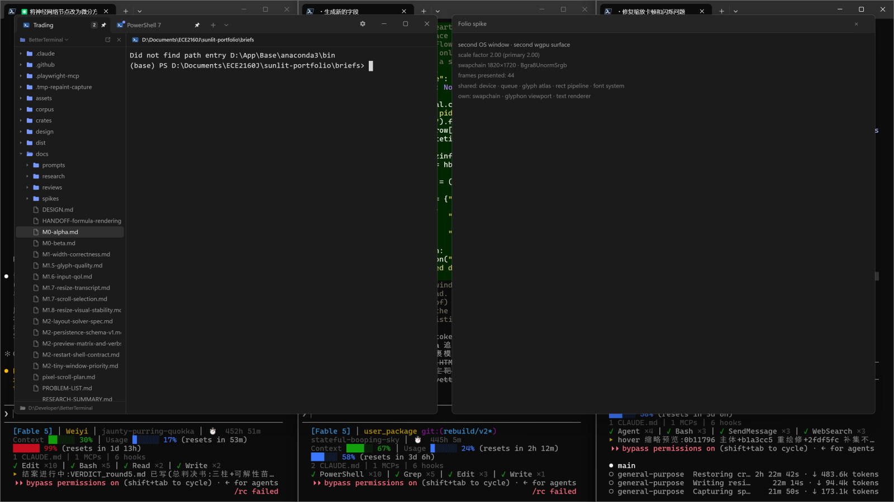
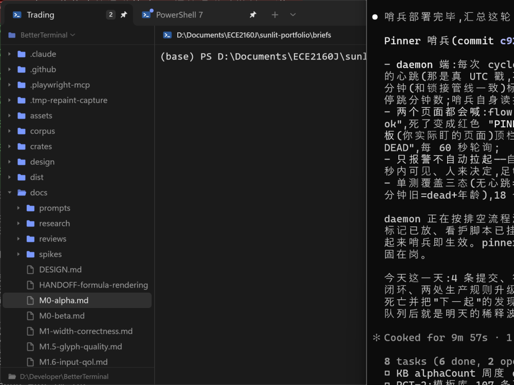
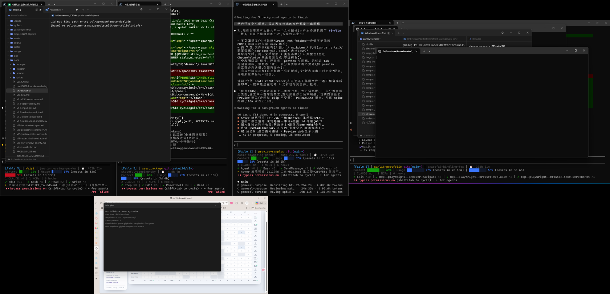
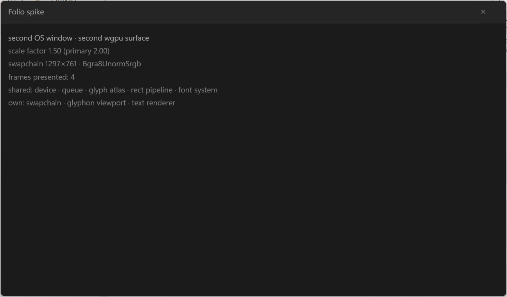

# Spike：第二个 OS 窗口 + 第二个 wgpu 渲染表面

日期：2026-08-12
结论：**go** —— 五个问题全部有实机答案，没有发现阻碍。

## 结论

一个 winit event loop 可以同时驱动两个 OS 窗口，两个窗口各自持有独立的 `wgpu::Surface`，共享同一个 `Device`/`Queue`/glyph atlas/pipeline/`FontSystem`。实机上两窗同时可见、各自 resize、各自 present，并且在两块缩放不同的显示器上**同时**持有 1.5 和 2.0 两个 scale factor。自绘标题栏（`bt_platform::CustomWindowFrame`）对第二个 HWND 是一行 `install(hwnd)`，无需任何参数化改造。关掉第二窗只关第二窗，主窗和进程继续跑。

代价集中在三处，都不是"能不能"而是"要动哪里"：

1. `Renderer::new` 原本把 `wgpu::Instance` 和 `Adapter` 当局部变量丢掉（`crates/bt-render/src/lib.rs:2893`、`:2898`）。第二个 Surface 必须从**同一个 Instance** 建、用**同一个 Adapter** 问格式，所以这两个字段必须留下来。这是本 spike 对生产代码唯一的实质改动。
2. 两窗的 swapchain 格式必须相等。`TextAtlas::new(…, config.format)` 和 `create_rect_pipeline(&device, config.format)` 把格式烤进了 atlas 和两条 pipeline；格式不等就不是"再配一个 swapchain"，而是"再造一个渲染器"。实机 DX12 上两窗都拿到 `Bgra8UnormSrgb`，共享成立。
3. 主题是**进程级**的（`bt-render/src/theme.rs` 的 `static THEME: OnceLock<ThemeState>`），窗口类背景刷是**窗口类级**的（`bt-platform` 的 `WINDOW_CLASS_BACKGROUND`，winit 所有窗共用一个类）。两窗各自深浅色目前做不到，这是一条要么立项要么裁决掉的产品问题。

## 交付物

| 东西 | 位置 |
|---|---|
| 第二 surface 的渲染 API | `crates/bt-render/src/spike_multiwindow.rs` |
| `Renderer` 保留 instance/adapter | `crates/bt-render/src/lib.rs:1930` 起（两个新字段） |
| 第二窗的窗口/输入/绘制 | `crates/bt-app/src/spike_multiwindow.rs` |
| 接线（模块声明、两个字段、`resumed` 钩子、`spike_window_event`） | `crates/bt-app/src/main.rs` |
| 多窗探针（`ui-probe` 看不见第二个窗） | `scripts/dev/mw-probe.ps1` |
| 截图 | `docs/spikes/artifacts/multiwindow/` |

跑法：

```
cargo run -p bt-app -- --spike-second-window
scripts/dev/mw-probe.ps1 list -ProcId <pid>          # 每个 HWND 的 rect / DPI / scale
scripts/dev/mw-probe.ps1 move -Hwnd 0x… -X … -Y …    # 拖到另一块显示器
scripts/dev/mw-probe.ps1 capture -Out shot.png       # 整个虚拟桌面，两窗都在一张里
```

隐藏 flag，无帮助文本、无设置项。不传就完全不存在。

`ui-probe.ps1` 的 `capture`/`click` 都从 `Process.MainWindowHandle` 解析窗口，一个进程两个窗时那个 API 只会给出其中一个，且不保证是哪个。`mw-probe.ps1` 改用 `EnumWindows` + PID 过滤 + 无 owner 判定，这是多窗工单继续做验收时必须先有的工具。

## 五问

### Q1 一个 winit event loop 能否同时驱动两个窗口 —— **能**

winit 0.30 的 `ApplicationHandler::window_event` 本来就带 `WindowId`（`main.rs:22307`），`ActiveEventLoop::create_window` 在任何回调里都能再开窗。今天的 app 把这个 id 扔掉了：

```rust
if runtime.window.id() != window_id {
    return;
}
```

—— `main.rs:22319`。不是"winit 没告诉我们"，是"只有一个 `Runtime` 可选"。

实机：一进程两个 top-level HWND，各自 rect、各自 resize、各自 present。

```
hwnd=0x731202  title='Folio spike'  rect=49,49,1515,960     outer=1466x911   dpi=192 scale=2
hwnd=0x1250F74 title='Trading'      rect=-3780,-160,-1960,1560 outer=1820x1720 dpi=192 scale=2
```



wgpu 侧的硬约束只有一条，但它是硬的：**第二个 Surface 必须由创建了当前 Device 的那个 `Instance` 建出来**，并且 `Surface::get_default_config` / `get_capabilities` 都要那个 `Adapter`。`Renderer::new` 现在两个都不留。spike 给 `Renderer` 加了 `instance` 和 `adapter` 两个字段，此外没动它。

present 节奏各自独立：各窗自己的 `RedrawRequested` → 自己的 `configure_surface_if_needed` → 自己的 `get_current_texture` → 共享的 `queue.submit` → 自己的 `queue.present`。第二窗画的 "frames presented" 计数在静止时不涨（截图里是 4 和 28），证明两边确实是按需重绘、互不牵动。

关窗：第二窗的 `CloseRequested` 只销毁第二窗；Surface 在 Device 还活着的时候被 drop，主窗此后照常渲染。



### Q2 共享资源的边界

| 可跨 surface 共享 | 必须 per-surface |
|---|---|
| `wgpu::Instance`、`Adapter`、`Device`、`Queue` | `wgpu::Surface`、`SurfaceConfiguration`、`configured_size` |
| glyphon `Cache`（`Cache::new(&device)`，与格式无关） | glyphon `Viewport`（是一个装着**一个**分辨率的 uniform） |
| `TextAtlas`（与格式**有关**，见下） | `TextRenderer`（只装得下**一批** prepare 好的批次） |
| `FontSystem`、`SwashCache`、`chrome_cap_height_ratio` | `CellMetrics`（随 scale factor 变，见 Q3） |
| `rect_pipeline`、`math_pipeline`（与格式**有关**） | `composed_row_cache`、`narrow/wide_shaping_cache`（按像素字号 key，见 Q3） |
| `math_bind_group_layout`、`math_sampler`、`math_textures` | 那一窗的 chrome/overlay/seat 状态 |

没有深度缓冲要操心：两条 pipeline 都是 `depth_stencil: None`，帧里只有一个 color attachment。

**格式是铰链。** `TextAtlas::new(&device, &queue, &cache, config.format)`（`lib.rs:2945`）和 `create_rect_pipeline(&device, config.format)`（`lib.rs:2973`）都把 surface 的 `TextureFormat` 烤了进去。两个 surface 格式不等，atlas 和两条 pipeline 都得再来一份 —— 那已经是第二个渲染器，不是第二个 swapchain。spike 因此在 `create_secondary_window` 里显式比较格式，不等就报错返回，而不是悄悄退化。实机 DX12 上两窗都选到 `Bgra8UnormSrgb`（两边都走同一条"第一个 sRGB 格式"的挑法），共享成立。

**atlas 共享是被画出来的，不是被声称的。** 第二窗的文本走的是主 renderer 的 `&mut self.atlas`、`&mut self.font_system`、`&mut self.swash_cache`，只有 `TextRenderer` 和 `Viewport` 是它自己的。截图里那几行字如果 atlas 没共享就一个像素都不会有。矩形同理，走的是主 renderer 的 `rect_pipeline`。

**由此掉出一条不变量：** atlas 共享意味着一次 `prepare` 可能触发 atlas 增长/重排，让**别的** `TextRenderer` 已经 prepare 好的坐标失效。今天两窗各自在自己的 `RedrawRequested` 里成对完成 prepare→render，天然安全。工单要把这条写死：**不许把多个窗口的 prepare 提前批处理到一起再统一 render。** glyphon 0.12 不导出 atlas 占用/变更计数（`RenderProbeSample` 里那几个 `Option` 常年是 `None`），所以这条不变量破了不会有指标告诉你，只会看见另一个窗的字花掉。

**共享 `FontSystem` 是最实在的收益，而且不在 GPU 上。** `terminal_font_system()`（`lib.rs:6158`）每次调用都从磁盘重新加载整条 fallback 链 —— 13 个字体文件（Consolas 四体、微软雅黑 UI 三体、等线三体、宋体、Segoe UI Emoji/Symbol），外加 `load_chrome_sans_family` 的 Segoe UI Variable 和编进可执行文件的 Noto Color Emoji。每窗一个 `Renderer` 就是每开一个窗把这件事再做一遍。共享 Device 顺带把这个也共享了。

**两处进程级状态是共享的上限，不是收益：**

- `bt-render/src/theme.rs` 的 `static THEME: OnceLock<ThemeState>`（`theme.rs:1867`）和 `CURSOR_STYLE`（`theme.rs:1756`）。所有窗读同一个主题、同一个光标样式。
- `bt-platform` 的 `WINDOW_CLASS_BACKGROUND`（`lib.rs:168`）—— `install_window_class_background` 改的是 `GCLP_HBRBACKGROUND`，即 **window class** 的背景刷，而 winit 的所有窗共用一个类。真要 per-window 主题，得给每个窗注册一个自己的窗口类，那是比"多开一个窗"大得多的改动。

### Q3 第二窗的 DPI 独立性 —— **正确，且是 Win32 权威值**

把 spike 窗从 192 DPI 的显示器拖到 144 DPI 的显示器上，主窗留在原处：

```
BT_SPIKE_MW dpi window=2 winit_scale=1.5 win32_scale=1.5 inner=1700x940 primary_scale=2

hwnd=0xC1396  title='Folio spike'  rect=-2700,2010,-1403,2771  dpi=144 scale=1.5
hwnd=0xB214D4 title='Trading'      rect=-3780,-160,-1960,1560  dpi=192 scale=2
```

同一个进程、同一个 event loop、同一个 Device，同时持有 1.5 和 2.0。



第二窗自己算出来的字号和标题栏几何都按它自己的 1.5 走：



几点值得记：

- **winit 报的 scale 和 `GetDpiForWindow` 完全一致**（两边都是 1.5）。所以主窗那条"以 Win32 为权威、winit 只是提醒"的规矩可以原样搬到第二窗，不需要新规则。spike 的 `scale_factor_changed` 就是照抄这条路。
- **PER_MONITOR_AWARE_V2 是进程级、设一次。** `bt-platform` 全 crate 没有 `SetProcessDpiAwarenessContext` 调用，仓库里也没有声明 dpiAware 的 manifest；实测两窗拿到的是 192 和 144 而不是统一的 96，说明 winit 在 `EventLoop` 初始化时已经设好了，并且一次覆盖整个进程。第二窗不需要为 DPI 做任何进程级的事。
- **但 `CellMetrics` 是 per-scale 的，而 `Renderer` 只有一份。** `CellMetrics::measure(font_system, scale_factor)` 的结果存在 `Renderer.metrics`，`update_scale_factor`（`lib.rs:3375`）会连带清空 `composed_row_cache` 和两个 shaping cache 并 bump `font_revision`。这三个缓存都按**像素字号**做 key。共享一个 `Renderer` 而让两个窗跑在不同 DPI 上，等于让两套像素字号共用一套缓存 —— 要么互相驱逐、要么互相污染。**这是 Q2/Q3 交界处最容易漏的一条**：`metrics`、`composed_row_cache`、`narrow_shaping_cache`、`wide_shaping_cache`、`font_revision` 必须跟着 surface 走，不能跟着 device 走。
  spike 的第二窗只画 chrome 文本、字号自己按自己的 scale 现算，绕开了这一整块，所以它**没有**证明网格文本可以跨 DPI 共享缓存 —— 它证明的是"不共享那几个缓存的话，共享 atlas 是安全的"。
- `chrome_cap_height_ratio` 是字面的属性（一个比值），DPI 无关，可以放心共享。

### Q4 输入路由：主循环里"假设只有一个窗"的清单

winit 已经把 `WindowId` 送到手上了，整条链上**唯一**丢掉它的地方是一个 `if`。清单按"改这里"的粒度列：

**收口点（改动从这两处开始）**

| # | 位置 | 内容 |
|---|---|---|
| 1 | `main.rs:22133` | `BetterTerminalApp { runtime: Option<Runtime>, … }` —— `Option` 本身就是"最多一个窗"的类型级上限 |
| 2 | `main.rs:22319` | `if runtime.window.id() != window_id { return; }` —— 整张路由表就是这一个 `if`；非本窗的事件被静默丢弃 |
| 3 | `main.rs:22238` | `resumed` 里 `if self.runtime.is_some() { return; }` —— 第二次 `resumed` 是静默 no-op，不是第二个窗 |
| 4 | `main.rs:22274` `user_event` / `main.rs:22398` `about_to_wait` | 都拿不到 `WindowId`，无条件作用于唯一的 `self.runtime`；一长串 `advance_*`/`finish_*` 的动画与定时器推进全是单目标 |

**`Runtime` 里天生 per-window 的字段**（`main.rs:1866` 起；这些是"必须跟着窗走"的）

- 表面与句柄：`renderer`（内含 `wgpu::Surface`）、`window: Arc<Window>`、`custom_window_frame`、`math_context_menu`、`folder_picker`、`ime_system_caret`
- 输入现场：`modifiers`、`pointer_position`、`mouse_route`、`click_tracker`、四个 wheel 余量（`line_` / `pixel_` / `notch_` / `local_wheel_subpixel_remainder`）、`preedit`、`ime_active`、`ime_cursor_throttle`
- 焦点与闪烁：`window_focused`、`cursor_blink`、`rename_blink`
- 悬停（注释自己写了"One window, one pointer, and therefore at most one pane wearing these"，`main.rs:4674`）：`hover_pane`、`hyperlink_hover`、`peek_hover`、`math_hover_anchor`、`underlined_image_reference`、`tooltip`
- 手势：`tab_press`、`pane_press`、`drag`、`drop_preview`、`divider_drag`、`resizing_card_transition` / `resizing_card_split`、`float_drag`、`float_head_press`
- 窗级 UI：`float`（注释已经写明"It is window-level and *not* on a tab"，`main.rs:2312`）、`rename`、`rail` / `rail_scroll` / `rail_open` / `rail_text` / `rail_fold` / `rail_chrome`、`pane_motion`、`tab_scroll`、各菜单与面板
- 几何：`seat_viewport`、`work_area`、`window_min_inner_size`、`size_policy`、`lawful_client_size`
- 内容：`tabs`、`active_tab`、`next_tab_id`

**`Runtime` 里其实是 per-app 的字段**（这些必须**升**上去，否则 N 个窗会分叉出 N 份互相不同意的副本）

| 字段 | 问题 |
|---|---|
| `recent: seed::SeedVault`（`main.rs:2404`） | pin / Recent / 撤销关闭都从它取；语义上全应用一份 |
| `profile_programs`（`main.rs:2088`） | 纯文件系统探测，每窗一份就是每开一个窗重跑一遍 |
| `session_store`（`main.rs:2399`） | 见 Q4 末尾的持久化条 |
| `settings_store`（`main.rs:2400`） | 单个 `settings.json`，本来就该共享，保持即可 |
| `theme_mode`（`main.rs:2425`） | 要和 `bt-render` 的进程级 `THEME` 对账（Q2） |
| `math_worker`（`main.rs:1872`）/ `files_worker`（`:1880`）/ `preview_worker`（`:1889`） | `math_worker` 的注释写的是"is one for the window"（`main.rs:1878`）；N 窗时是"每窗一套线程"还是"全应用一个池"要裁决 |

**输入进入点**（都在 `window_event` 那个 `if` 之后，所以"改 `if`"之后它们自动就位）

`keyboard_input`（`21198`）、`ime_input`（`21553`）、`pointer_moved`（`18194`）、`pointer_left`（`17764`）、`mouse_input`（`20158`）、`mouse_wheel`（`20899`）。键盘的焦点链是 `Runtime → active_tab → focused_leaf(SeatId)`，`SeatId` 本来就只在 tab 内唯一；这条链上没有窗身份，因为 `Runtime` 自己就**是**那个窗。所以路由修好之后，下面的处理逻辑基本不用动。

**`self.window` 的用法**（35 处，按用途归类，都是"对这个窗做点什么"、不带窗身份）

`window_hwnd(&self.window)` 桥到 Win32 ×9、`request_redraw` ×6、`set_title` ×4、`inner_size` ×3、`Arc::clone` 交给闭包/worker ×3、`is_maximized` ×2、`write_terminal_clipboard_text` ×2、`set_maximized` / `set_minimized` / `theme()` / `set_ime_cursor_area` / `install_theme_class_background` / `dpi_snapshot` 各 ×1。

**生命周期**（`main.rs:22323`）

```rust
WindowEvent::CloseRequested => {
    let result = runtime.shutdown();
    self.runtime = None;
    event_loop.exit();      // ← 无条件
    result
}
```

任何一个窗的 `CloseRequested` 都会结束整个进程。要改成"最后一个窗关掉才 exit"。两条上游也已经是按 hwnd 寻址的（关掉最后一个 tab：`main.rs:9757`；标题栏的 ×：`main.rs:20150`，都走 `bt_platform::request_window_close(hwnd)`），所以它们不用动。`shutdown()`（`main.rs:22110`）本身混了两件事：flush `session_store`（应用级）和关掉**本窗所有 tab** 的 PTY（窗级），要拆开。

spike 里第二窗的 `CloseRequested` 只把自己置空，实测进程与主窗照常（见 Q1 截图）。

**持久化**（`bt-persist` / `bt-app/src/persist.rs`）

`SessionV1` 只有一个 `window: WindowStateV1`，字段名单数是**故意**的 —— schema 自己写着 `// 多窗口落地时用 schema_version bump 把 window 升格为 windows[]`（`bt-persist/src/session.rs:133`，字段本身在 `:73`）。`TabV1`（`session.rs:177`）没有窗归属字段，每个 tab 隐含"在那个窗里"。除了 schema，存储层本身也是单实例：`SessionStore::open()`（`bt-app/src/persist.rs:49`）固定打开同一个 `session.json` + 单个 `session.lock` 哨兵（`persist.rs:52`）。两个 `Runtime` 各自 `open()` 会在同一个文件上互相踩 —— 这是**独立于 schema 的**第二个问题。

### Q5 自绘标题栏在第二窗的复用成本 —— **几乎为零**

`bt-platform` 是按 HWND 参数化的，不是按"那个窗"写的。第二窗要做的就是：

```rust
let frame = bt_platform::CustomWindowFrame::install(hwnd)?;
```

一行，和主窗完全一样的构造器，没有多出来的参数。

- subclass 用 `SetWindowSubclass(hwnd, cb, SUBCLASS_ID, reference_data)`（`bt-platform/src/lib.rs:213`），comctl32 按 **(HWND, 子类 ID)** 建表，同一个数字 ID 复用到不同 HWND 是文档保证的做法。per-window 状态在 `Box<CustomFrameState>` 里，回调通过 reference data 拿到自己那份。
- `WM_NCCALCSIZE`（`:354`）、`WM_GETMINMAXINFO`（`:371`）、`WM_NCHITTEST`（`:395`）三个都从 reference data 读本窗自己的 `tab_strip_right_px` / `min_client_logical_*`，并且**每次都现查** `GetDpiForWindow(hwnd)`，没有缓存。完全 per-HWND。
- `MathContextMenu::new(hwnd)`、`FolderPicker::new(hwnd)`、`ImeSystemCaret::new(hwnd)` 同理，都在构造时收 HWND。

实测第二窗：`client == outer`（1466x911 == 1466x911，说明 `WM_NCCALCSIZE` 生效了），DWM 圆角保留（`DWMWCP_ROUND` 是 install 里设的），拖标题栏能移窗，四边能 resize，右上角 caption 区落在 `Client` 上所以应用可以自己画自己的按钮 —— 截图里那个 `×` 就是。

三笔要记的账：

1. **唯一真正全局的是 `install_window_class_background`**（`lib.rs:1484`）+ `WINDOW_CLASS_BACKGROUND`（`lib.rs:168`）。它改的是窗口**类**的背景刷，winit 所有窗共用一个类。spike 的第二窗没调它（类刷已经被主窗装好了），所以没暴露；per-window 主题会在这里撞墙。见 Q2。
2. **标题栏几何有两份副本。** `bt-platform` 私有的 `TITLE_BAR_LOGICAL_PX = 40` / `CAPTION_BUTTON_LOGICAL_PX = 46`（`lib.rs:182`）用于命中测试；`bt-render` 导出的 `WINDOW_TITLE_BAR_LOGICAL_PX` / `WINDOW_CAPTION_BUTTON_LOGICAL_PX`（`theme.rs:1149`）用于绘制。多窗不会让它更糟，但工单里值得顺手收成一处 —— 画的和点的必须是同一个数。
3. **开窗尺寸要重述一次。** 第二窗请求的是 720×420 逻辑，装帧后拿到的 client 是 1466×911 而不是 1440×840 —— 多出来的 26×71（192 DPI）正是这个窗**不穿**的原生边框：winit 按 client 定尺寸，而 `WM_NCCALCSIZE` 之后 client 就是整个 outer。主窗在 `Runtime::create` 里用 `set_window_outer_rect` 把几何重述成一个矩形解决了（`main.rs:9065`，注释也写明了"左右不管就会被存下来、重启再膨胀一次"）。第二窗必须走同一条路。**spike 故意没修，留作证据。**

## 契约与证据

| 断言 | 证据 |
|---|---|
| 一个 event loop 两个 OS 窗口 | `mw-probe list` 同一 PID 下两个无 owner 的可见 top-level HWND |
| 两个独立 swapchain，共享一个 Device | 第二窗用主 renderer 的 `device`/`queue`/`atlas`/`rect_pipeline` 出图；不共享则一个像素都画不出 |
| 第二 Surface 必须同 Instance / 同 Adapter | `Renderer` 必须新增 `instance` + `adapter` 两个字段才编译得过第二个 surface 的创建 |
| 两窗格式一致 | 两窗都 `Bgra8UnormSrgb`；`create_secondary_window` 里显式比较，不等直接报错 |
| 各自 resize | 1820×1720 与 1297×761 同时成立，各自的 swapchain 尺寸画在各自窗里 |
| 各自 present 节奏 | 第二窗 "frames presented" 静止不涨（4 / 28），与主窗无关 |
| DPI 各自正确 | `dpi=192 scale=2` 与 `dpi=144 scale=1.5` 同时成立；winit scale 与 `GetDpiForWindow` 一致 |
| 自绘标题栏 per-HWND | 第二窗 `client == outer`、圆角在、能拖能 resize，只调了 `install(hwnd)` |
| 关第二窗不杀进程 | `BT_SPIKE_MW closing window=2; the primary keeps running`，随后主窗仍能 resize + 重绘 |

## 没测到的（工单要自己补的风险）

- **两窗同时高频重绘的互相影响**。共享一条 `Queue`，两个 swapchain 都是 `desired_maximum_frame_latency = 1`。spike 的第二窗是按需重绘的静态页面，没有构成压力。
- **第二窗落到另一块 GPU 驱动的显示器上**。`create_secondary_window` 里的 `adapter.is_surface_supported` 检查写了但从没被触发过。混合显卡笔记本上这条可能真会返回 false，那时就不是"再配一个 swapchain"而是"第二个 Device"。
- **IME**。`ImeSystemCaret` 包的是 Win32 的**线程级** caret（`CreateCaret`/`DestroyCaret` 不按 HWND 隔离），两个窗在同一条 UI 线程上时，同一时刻只能有一个活的 caret。Rust 这一层是 per-instance 的，Win32 那一层不是。
- **持久化并发**。两个 `SessionStore` 抢同一个 `session.json` + `session.lock`，见 Q4 末尾。
- **网格文本跨 DPI 共享缓存**。spike 的第二窗不画网格，见 Q3 第三条。

## 给多窗块的工单切法建议

顺序理由：A、B 是纯重构，可以独立验收、不改任何用户可见行为；C 是唯一改行为的小片；D、E 是数据与全局状态；F 才是用户看得见的那件事。把 F 排在最后不是保守，是因为前面五片每一片都能独立回归，而 F 之前的任何一片出错都会在 F 里表现成"拖出来的窗行为诡异"。

**片 A —— 渲染器切成 device 层和 window 层**（最大的一片，也是唯一必须先做的）

`Renderer` 拆成两个东西：`GpuContext { instance, adapter, device, queue, glyphon_cache, atlas, font_system, swash_cache, rect_pipeline, math_pipeline, math_bind_group_layout, math_sampler, math_textures, chrome_cap_height_ratio }`，和 `WindowRenderer { surface, config, configured_size, viewport(s), text_renderer(s), metrics, composed_row_cache, narrow/wide_shaping_cache, font_revision, seat, chrome/overlay 状态 }`。

三条硬约束写进这一片的验收：格式相等才可共享（不等就是错误，不是退化）；prepare→render 必须在同一个窗的同一帧内成对完成；按像素字号 key 的缓存跟着 window 走。

`HeadlessRenderProbe`（`lib.rs:2535`）已经是"没有 surface 的 device 层"的现成样板 —— 它用 `compatible_surface: None` 建 adapter，把格式当成一个显式参数而不是从 surface 上问出来。这一片本质上就是让 `Renderer` 长成 `HeadlessRenderProbe` 的形状，再把 surface 挂回去。

单窗行为不变，测试全绿。

**片 B —— `Runtime` 切成 App 层和 Window 层**

`App { session_store, settings_store, recent, profile_programs, 主题/光标样式, workers(裁决后) }` + `WindowRuntime { window, renderer(WindowRenderer), custom_window_frame, math_context_menu, folder_picker, ime_system_caret, tabs, active_tab, 输入现场, 悬停, 手势, 窗级 UI, 几何 }`。

同样是纯重构：此时仍然只有一个 `WindowRuntime`。分界线用 Q4 那两张表。

**片 C —— 路由与生命周期**（唯一改行为的一片，很小）

`Option<Runtime>` → `HashMap<WindowId, WindowRuntime>`；`window_event` 按 id 查表；`user_event` / `about_to_wait` 遍历；`CloseRequested` 改成"移除这个窗，空了才 `event_loop.exit()`"；`shutdown()` 拆成窗级（关本窗 PTY）和应用级（flush session）。

做完这一片，"第二个窗"就从 spike 变成了产品能力 —— 只是还没有 UI 能开出第二个窗。

**片 D —— 持久化**

`schema_version` bump，`window` → `windows: []`，`TabV1` 加窗归属；`SessionStore` 收归 App 层一份（存储层的并发问题和 schema 是两件事，都要修）。恢复时按窗重建。

**片 E —— 进程级全局**

主题与光标样式从 `bt-render` 的进程 static 变成 App 层一份（如果裁决"全进程一个主题"，那这一片就只是把 static 换成字段，很小）；`install_window_class_background` 的 per-window 问题单独裁决 —— 要 per-window 主题就得给每个窗注册自己的窗口类，那是一片自己的工单。

**片 F —— 拖出（tear-out）**

把一个 tab 从 A 窗移到新开的 B 窗。只有前五片落地后才有意义。这一片自己的难点（拖拽手势跨窗、落点判定、动画）和上面五片一个都不重叠。

**顺带修的两笔小账**（可以挂在 A 或 E 上，不值得单独立片）

- 标题栏几何的两份副本收成一处（Q5 第 2 条）。
- 新窗开出来必须走 `set_window_outer_rect` 重述几何，否则每开一次大一圈（Q5 第 3 条）。

## 撤销

spike 代码全部集中在两个新文件和四处接线，删起来是一条直线：

1. 删 `crates/bt-render/src/spike_multiwindow.rs` 和 `crates/bt-app/src/spike_multiwindow.rs`
2. `lib.rs` 去掉 `pub mod spike_multiwindow;`；`main.rs` 去掉 `mod spike_multiwindow;`
3. `main.rs` 去掉 `BetterTerminalApp` 的两个字段、`resumed` 里的开窗块、`window_event` 开头那三行、`spike_window_event` 方法
4. `Renderer` 的 `instance` / `adapter` 两个字段 —— **这两个建议留着**。片 A 一定会用到，而且留着它们不改变任何行为。
