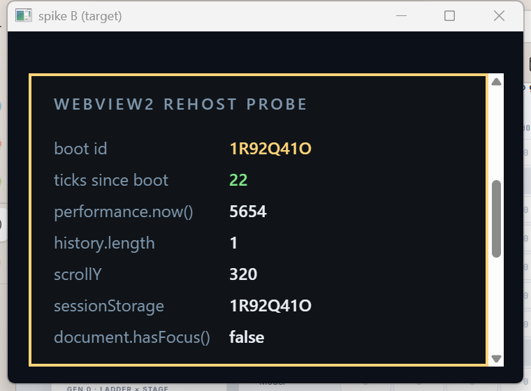
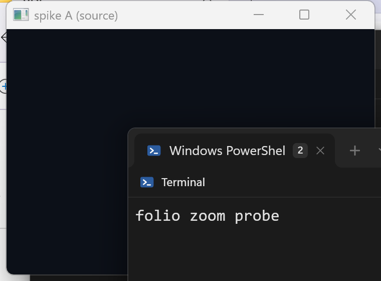

# Spike：WebView2 跨窗重挂（F1a）

日期：2026-08-23
机器：Windows 11 Pro 26200，WebView2 Runtime **151.0.4129.101**，三屏（主屏 2880×1800 @192dpi、副屏 1920×1080 @144dpi、第三屏 3840×2160 @192dpi）
结论：**go —— 重挂是正路**。一张活网页在两扇真窗之间搬家，`boot id` 不变、`performance.now()` 不重置、`scrollY`/`sessionStorage`/`history.length` 全在，**握手期间零 navigation**；引擎自己那个收键的隐藏子窗跟着换父，句柄不变；源窗不留洞。降级重建仍然保留，但降为**降级**。

> 方案：`docs/plans/multiwindow-ef/plan.md` 的 F1a 与「v3 增补 · F1a 重挂合同」七条；复审确认见 `docs/plans/multiwindow-ef/codex-final.md` 第 1 节（其中「spike 出档必须把 DPI 归属写成明确二选一」由本档 §3 作答）。

---

## 交付物

| 东西 | 位置 |
|---|---|
| 探针主程序（两扇窗、注错、证据） | `spikes/08-webview-rehost/src/main.rs` |
| 探针用的 Win32（窗、泵、截屏、子窗枚举、显示器 DPI） | `spikes/08-webview-rehost/src/win.rs` |
| 测试页（boot id / tick / scrollY / sessionStorage） | `spikes/08-webview-rehost/assets/page.html` |
| **产品侧合同**：顺序、补偿表、执行器 | `crates/bt-platform/src/webview.rs`（`RehostStep`、`REHOST_SEQUENCE`、`rehost_compensation`、`WebHost::rehost`） |
| **产品侧窄合同**：座位地址 | `crates/bt-app/src/webhost.rs`（`SeatAddress`、`WebSeat::rehost`） |
| 截图 | `docs/spikes/artifacts/webview-rehost/` |

跑法（UDF 与 `APPDATA`/`LOCALAPPDATA` 必须隔离，收尾清理）：

```powershell
$env:APPDATA='…\scratch\wv2-appdata'; $env:LOCALAPPDATA='…\scratch\wv2-local'
cd spikes\08-webview-rehost
cargo run -- --out ..\..\docs\spikes\artifacts\webview-rehost --udf '…\scratch\wv2-udf'
```

探针是**独立 workspace**，不进主 members，但它 `path` 依赖 `crates/bt-platform`：量的是**要发的那份代码**，不是这里另写一遍 `put_ParentWindow`。

## 探针为什么这样设计

一张重新加载到同一地址的网页，**长得和没动过一模一样**。所以本 spike 不拿「看起来一样」当证据。测试页在解析时铸一个 `boot id`，此后每 250ms 把 `boot=<id> tick=<n>` 写进 `document.title`；宿主通过 `DocumentTitleChanged` 读它。于是「有没有导航」「文档有没有换过」这两问，答案直接落在宿主自己的事件日志里，与截图无关：

- **同一个 boot id 跨越握手** = 没换文档；
- **tick 仍在涨** = 同一个 JS 堆里的 timer 还在跑；
- **握手区间内 `NavigationStarting` 计数为 0** = 引擎压根没导航。

---

## 1. 重挂本身：**成立**

握手按 v3 增补钉死的顺序走（`REHOST_SEQUENCE`）：
隐藏 → `SetRootVisualTarget(nullptr)` → 源 commit → `put_ParentWindow` → 设目标 target → 目标 commit → bounds → presence → `NotifyParentWindowPositionChanged`。

```
BT_SPIKE_REHOST in A: boot/tick = Some(("1R92Q41O", 6)) · browser pid = 53340
BT_SPIKE_REHOST REHOST A -> B: Moved
BT_SPIKE_REHOST in B: boot/tick = Some(("1R92Q41O", 21)) · navigations during the handoff = 0
BT_SPIKE_REHOST VERDICT moved=true · boot id before=Some("1R92Q41O") after=Some("1R92Q41O") · navigations during handoff=0
BT_SPIKE_REHOST TICKS before=Some(6) after=Some(21) (climbing across the handoff means the same document kept running)
```

页面自己在目标窗里报的账（`05-window-b-live.png`，窗 B 在 **144dpi** 副屏上）：



| 事实 | 重挂前（窗 A） | 重挂后（窗 B） |
|---|---|---|
| boot id | `1R92Q41O` | `1R92Q41O` |
| ticks | 6 | 21（仍在涨） |
| `performance.now()` | — | 5654（**没有归零**） |
| `scrollY` | 320 | 320 |
| `sessionStorage` | `1R92Q41O` | `1R92Q41O` |
| `history.length` | 1 | 1 |
| navigation 事件 | — | **0** |

对照组在同一次运行里：杀掉浏览器进程后按最后成功 URL 重建，boot id 变成 `IHVV1002`——**重建就是换文档**，这正是把重建降为降级路径的理由，也是「降级丢页内状态、不是闪一次」这句话的实测形状。

**源窗不留洞**：重挂后窗 A 只剩窗口类背景，没有黑洞、没有半张旧图（`06-window-a-empty.png`）。



## 2. 输入、焦点、IME、accessibility：**跟着走，而且是同一个窗口对象跟着走**

composition 模式下 WebView2 仍在父窗下面挂一个 **0×0、不可见的 `Chrome_WidgetWin_0`**（07 spike 的老发现），键盘、IME 候选窗与 UIA 树都挂在它上面。本 spike 直接枚举两扇窗的子窗：

```
BT_SPIKE_REHOST children of A before: [Child { class: "Chrome_WidgetWin_0", handle: 15272252 }]
BT_SPIKE_REHOST children of B before: []
BT_SPIKE_REHOST children of A after:  []
BT_SPIKE_REHOST children of B after:  [Child { class: "Chrome_WidgetWin_0", handle: 15272252 }]
```

**句柄一模一样（15272252），父窗从 A 变成 B。** 这一行同时回答了四件事：

- **键盘**：收键的窗口本身换了父，没有重建；
- **IME**：候选窗定位跟着那个 HWND 与 `NotifyParentWindowPositionChanged` 走，没有第二套坐标；
- **accessibility**：UIA provider 挂在同一个 HWND 上，重挂不产生新的 provider，屏幕阅读器不会看到「一个控件消失、另一个出现」；
- **引擎自带 context menu / tooltip**：同上，它们是这个 HWND 的 owned popup。

焦点与鼠标（重挂后向新窗坐标发的一次 move/down/up + `MoveFocus`）：

```
BT_SPIKE_REHOST event GotFocus
BT_SPIKE_REHOST focus events after the move: got=1 lost=0
```

`07-input-in-window-b.png` 是页面自己记的日志行（`mousemove` / `mousedown 0` / `mouseup 0`），即输入到了新宿主。

**按钮态 / capture / leave 的结清**是产品侧的事，不是引擎的事：`WebSeat::rehost` 在换父之前，把每个还按着的键补一个 up、再把指针移到页面外（本产品唯一能用的 leave 拼法——`SendMouseInput(LEAVE)` 被引擎在三种拼法下全部拒绝，`w0p-evidence.md` §1 gate 3），并清掉 `last_left_press`。红测 `the_old_window_is_paid_its_buttons_before_the_parent_changes` 钉这条。

## 3. DPI 归属：**二选一的答案 = WebView2 是 owner，Folio 不写 `RasterizationScale`**

方案要求出档写死。实测（同一次运行，窗 A 在 192dpi 主屏、窗 B 在 144dpi 副屏）：

```
BT_SPIKE_REHOST window A dpi=192 · window B dpi=144 · different scales: true
BT_SPIKE_REHOST DPI OWNER PROBE in A: ShouldDetectMonitorScaleChanges=true RasterizationScale=2   BoundsMode=RAW_PIXELS:true
BT_SPIKE_REHOST DPI OWNER PROBE in B: ShouldDetectMonitorScaleChanges=true RasterizationScale=1.5 BoundsMode=RAW_PIXELS:true
```

- `ShouldDetectMonitorScaleChanges` 读回来是 **true**（`WebHost::configure` 设的）；
- `RasterizationScale` 在换父之后**自己**从 `2` 变成 `1.5`——**全仓没有一处调用 `SetRasterizationScale`**，这个值只可能是引擎按新父窗所在显示器自己算的；
- `BoundsMode` 是 `USE_RAW_PIXELS`，所以 bounds 是物理像素、缩放只是 raster 的事，两件事不打架。

**裁决（写死）：自动侦测为真，WebView2 是 DPI 的唯一 owner。Folio 永不写 `RasterizationScale`。** Folio 在重挂里只负责两件事：把 bounds 按目标窗的物理像素重新设一遍，以及调 `NotifyParentWindowPositionChanged`（引擎自带 UI 的定位需要它，而它不是缩放）。若将来某个 runtime 版本把 `ShouldDetectMonitorScaleChanges` 读回 false，那才轮到 Folio 写 `RasterizationScale`——那是另一条分支，今天不成立，不实现。

## 4. 失败与补偿：一处真注错 + 表本身可测

### 真注错：`put_ParentWindow` 拿到一个不是窗口的句柄

本机唯一能**真**制造出的握手中途失败：先建一扇窗、销毁它、把它的句柄当目标父窗。

```
BT_SPIKE_REHOST INJECT dead parent HWND -> KeptSource {
  failed_at: ParentWindow,
  error: "put_ParentWindow failed: Invalid window handle. (0x80070578)",
  compensation: RehostCompensation { parent_window: false, root_visual_target: true, bounds: false, presence: true } }
BT_SPIKE_REHOST after the refused handoff: boot/tick = Some(("1R92Q41O", 13)) · navigations so far = 2
```

补偿把旧 target 与可见性放了回去，页面**在源窗继续跑**（boot id 没变、tick 从 6 涨到 13、navigation 计数仍是最初那两条）。`03-window-a-after-refusal.png` 是同一时刻的窗 A。这一条实测了 v3 增补要的「中途失败回旧 HWND/target/bounds 补偿」的活体形状，也证明 `KeptSource` 分支下调用方**不该**移动自己的模型。

### 另外三个注错点：**没有在活机上伪造，理由写在这里**

方案验收门要「断旧 target / 换 parent / 设新 target / 目标 commit 各自补偿或显式降级」。其中：

- **换 parent** 已如上真注错；
- **断旧 target**（`SetRootVisualTarget(nullptr)`）、**目标 commit**（`IDCompositionDevice::Commit`）在本机没有能可靠触发的合法失败输入——能想到的造法都要么是往接口里塞非法指针（那是在测 COM 参数校验，不是测这条握手），要么是拔显卡；
- **设新 target** 可以塞一个别的 device 的 visual，但引擎会**接受**它并把画面渲到错地方，那是一次静默的错误而不是一次可观察的失败，拿它当注错点会把「补偿跑对了」证成假的。

所以这三点用**纯值**守：顺序是 `REHOST_SEQUENCE` 这个常量，补偿由 `rehost_compensation` 从「每一步改了什么」折叠出来而不是抄成一张表，执行器 `WebHost::rehost` 只会走这个序列、只会照这张折叠结果补偿。守它们的是 `crates/bt-platform/src/webview.rs::rehost_contract_tests` 六条（顺序一条、补偿分档四条、单调性一条），红证是「常量与函数都还不存在」的编译错误：

```
error[E0425]: cannot find value `REHOST_SEQUENCE` in this scope
    --> crates\bt-platform\src\webview.rs:1518:13
error[E0422]: cannot find struct, variant or union type `RehostCompensation` in this scope
    --> crates\bt-platform\src\webview.rs:1580:17
```

**补偿也失败的分支**（`RehostOutcome::Lost`）没有活体样本，按同一条理由：制造不出「换父成功、补偿失败」的真实输入。它是写出来的、被类型逼着处理的分支——关掉 controller、说明是有损重建、**不声称源窗原样**——由 `bt-app` 的 `a_handoff_that_could_not_be_undone_rebuilds_in_the_target_window` 钉住它把地址留在**目标**窗。

## 5. 单一 environment：写成前提断言

`WebHost::rehost` 开工前先问「我手上的 environment 是不是进程缓存的那一个」，不是则一步不动地拒绝。本仓 environment 是进程级共享（`webview.rs` 的 `ENVIRONMENT` thread_local，`plan.md` §0「一个进程一个 environment」），所以**跨 environment 搬迁不存在**，这条断言是把一个「整个程序层面的事实、而这个函数看不见」钉在它依赖它的地方。

## 6. 缩略图（§7.11 最后一帧）

按 v3 增补写死的规则，本 spike 只提供支撑事实、不改规则：live 重挂后页面与 viewport 未变，`CapturePreview` 拍回来的图在两窗一致（`01-in-window-a.png` / `04-in-window-b.png`，同一 boot id），所以「最后一帧随座位重址」是有依据的；重挂到**不同 DPI** 的窗时 `RasterizationScale` 会变（§3），所以「目标 DPI 变则旧帧作占位并当场欠一张」这半条同样有依据，不是保守写法。

## 7. 遗留 / 欠账

1. **F1b 才有调用方**。`WebSeat::rehost`、`SeatAddress`、`RehostReport`、`WebMachine::on_rehost_lost` 目前带 `#[allow(dead_code)]`（`git.rs` 的成例：某个指名的后续切片会按它），本片交付的是合同与红测。
2. **`Lost` 分支与三个注错点无活体证据**，理由在 §4，将来若发现可靠触发法应补。
3. **IME 的候选窗位置未在双 DPI 下逐帧目视**：本 spike 证的是收键/候选窗所挂的 HWND 换了父且句柄不变，以及 `NotifyParentWindowPositionChanged` 在序列里被调用；真人打一段中文的确认属于 F1b 的实机验收。
4. **窗口截图会被别的置顶窗遮挡**。探针拍照前会 `SetWindowPos(HWND_TOPMOST, SWP_NOACTIVATE)` 再等一帧，但本机同时跑着别的并发线的窗口，`02-window-a-live.png` 就被一扇终端压了一角。页面状态的权威证据是事件日志与 `CapturePreview`，窗口截图只用来回答「它composite 在哪扇窗里」。
