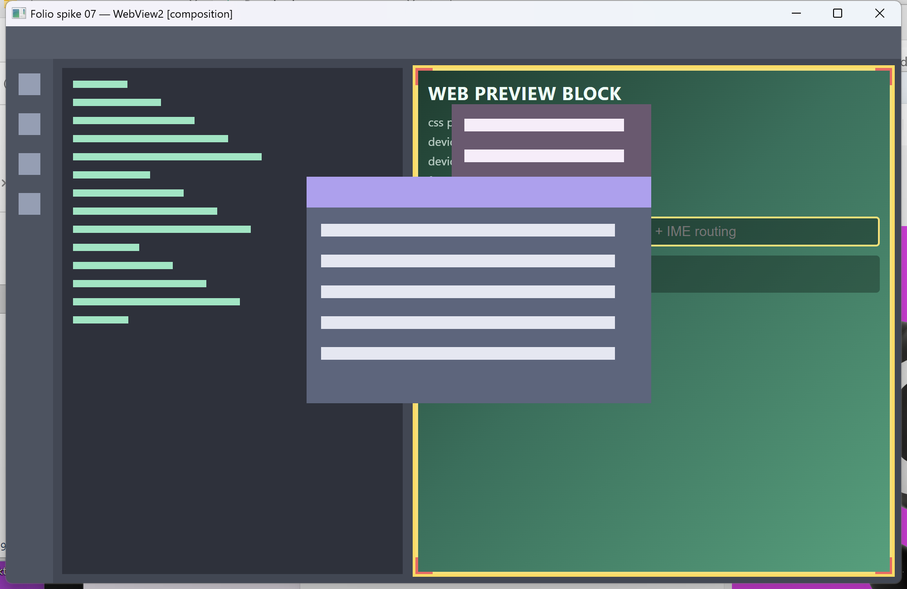
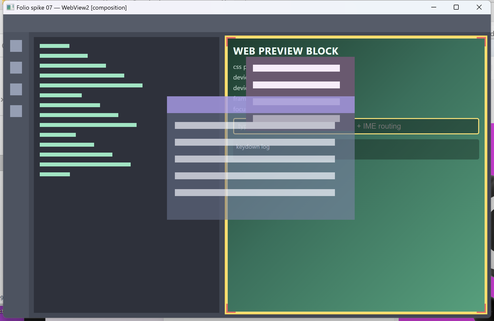
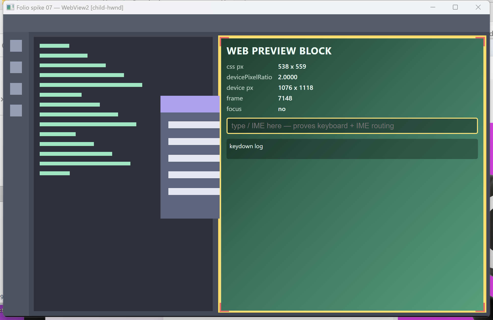
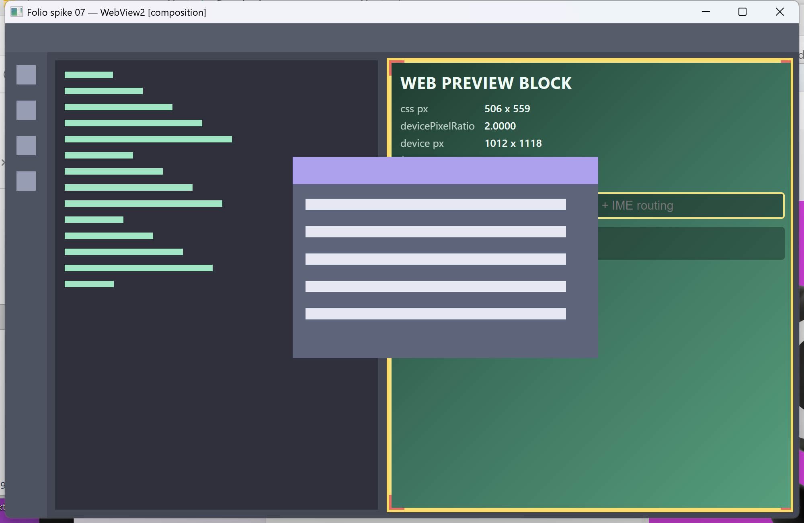
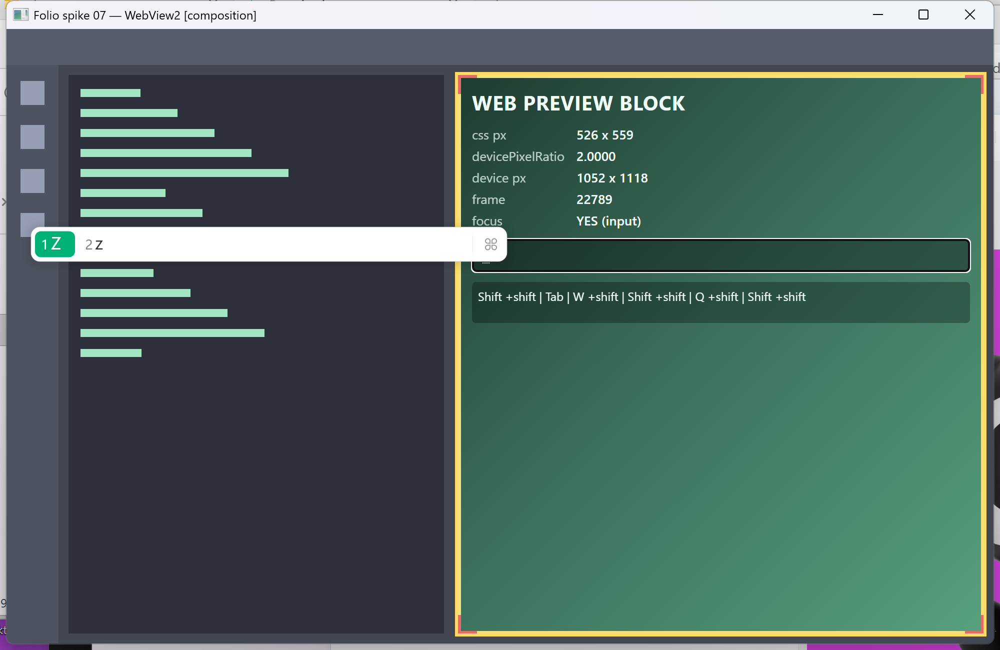
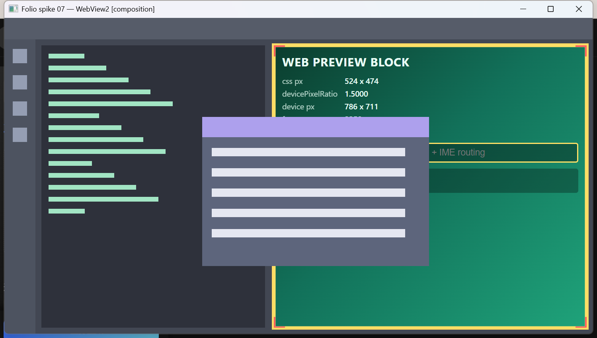

# Spike：WebView2 嵌入 wgpu 自绘窗口

日期：2026-08-13
结论：**go（走 composition 模式）** —— 五个问题全部有实机答案。airspace 不是无解的，composition（visual hosting）模式下我们的浮窗、菜单、半透明遮罩都能**真正画在网页之上**，几何跟随零延迟。子窗模式则复现了教科书式的 airspace 失败，只能作为 B 计划。

## 结论

`ICoreWebView2CompositionController` + `SetRootVisualTarget` 把 WebView2 渲染进**我们自己持有的 DirectComposition visual**；我们的 wgpu swapchain 挂在同一棵树上、位置在它**之上**，并以 `CompositeAlphaMode::PreMultiplied` 配置。座位矩形处一笔不画（alpha 保持 0），网页就从那个洞里透上来；洞之上再画的任何东西——不透明面板、半透明遮罩——都盖在网页上。这不是"避让"，是**真合成**。

这条路成立的硬前提只有一条，而且已经实测通过：**wgpu 的 dx12 后端只对 visual 目标提供 `PreMultiplied`，对 HWND 目标只提供 `Opaque`**。

```
BT_SPIKE_WV2 alpha offered    : [Auto, Inherit, Opaque, PostMultiplied, PreMultiplied]   # visual 目标
BT_SPIKE_WV2 alpha chosen     : PreMultiplied
```

—— 对照 wgpu 源码 `wgpu-hal-30.0.0/src/dx12/adapter.rs:1364`：`SurfaceTarget::WndHandle(_) => vec![Opaque]`，其余（`Visual` / `VisualFromWndHandle` / `SurfaceHandle` / `SwapChainPanel`）才给全套。**今天 bt-render 走的正是 `WndHandle` 那一支**，所以这不是"配一个参数"，而是要改渲染器拿 surface 的方式。

代价集中在三处，都是"要动哪里"而不是"能不能"：

1. **`Renderer::new` 必须能从 `IDCompositionVisual` 建 surface**。今天是 `instance.create_surface(target)`（`crates/bt-render/src/lib.rs:2935`），需要多一条 `create_surface_unsafe(SurfaceTargetUnsafe::CompositionVisual(ptr))` 的路径，且 `alpha_mode` 要跟着变。这会改变**每一个窗口**的呈现方式，不只是有预览块的那个。
2. **wgpu 对我们自己的 visual 只调 `SetContent`，不调 `Commit`**（`wgpu-hal-30.0.0/src/dx12/mod.rs:1619`，与它自建的 `VisualFromWndHandle` 分支形成对照——那一支它是 commit 的）。谁持有 DComp device 谁负责每帧 commit，漏掉就是画面完全不动。
3. **composition 模式下鼠标必须手工转发**（`SendMouseInput` / `SendPointerInput`）。键盘和 IME **不用**——WebView2 在 visual hosting 下仍然建了一个 0×0 的隐藏子窗替我们收键，这是本 spike 最反直觉的一条发现。

## 交付物

| 东西 | 位置 |
|---|---|
| spike 主程序（两种模式） | `spikes/07-webview2/src/main.rs` |
| DirectComposition 视觉树 | `spikes/07-webview2/src/dcomp.rs` |
| WebView2 托管（child / composition） | `spikes/07-webview2/src/host.rs` |
| 预乘 alpha 矩形渲染器 | `spikes/07-webview2/src/gfx.rs` |
| Runtime 存在性检测（两法对照） | `spikes/07-webview2/src/detect.rs` |
| 体积探针 A/B | `spikes/07-webview2/src/bin/size-with.rs`、`size-without.rs` |
| 测试页（自带内嵌环、角标、按键日志） | `spikes/07-webview2/assets/preview.html` |
| 窗口裁剪截图 | `spikes/07-webview2/shot.ps1` |
| **接缝像素扫描**（Q2 的量化工具） | `spikes/07-webview2/edge-scan.ps1` |
| 截图 | `docs/spikes/artifacts/webview2/` |

跑法：

```
cd spikes/07-webview2
cargo run -- --mode composition          # 推荐路线
cargo run -- --mode child                # B 计划，复现 airspace
cargo run -- --mode composition --animate   # 座位矩形正弦扫动，用于测跟随

# 键位：O 浮窗 · T 浮窗透明度 · M 座内菜单 · A 动画 · F 焦点进网页
#       H 焦点抢回 · D 谁管 DPI · 方向键移浮窗 · P 诊断 · Esc 退出

.\shot.ps1 -Out shot.png -Key 'm'                    # 截当前窗口（非整个虚拟桌面）
.\edge-scan.ps1 -Png shot.png                        # 量座位边框与网页之间的缝
```

这是独立 workspace，不进主 workspace 的 members，也不动 `bt-app`。

`Cargo.toml` 里 `unsafe_code = "allow"`——DComp 与 WebView2 只有裸 COM 接口，这个 spike 若守 `deny` 就根本做不成实验。真做进产品时，按既有惯例应落在 **`crates/bt-platform`**（全树唯一不继承 workspace `unsafe_code = "deny"` 的 crate，其 `Cargo.toml` 明说自己是"刻意收窄的 unsafe 边界"）。

---

## 五问

### Q1 层叠（airspace）：我们的 overlay 能不能画在 WebView2 之上 —— **composition 能，子窗不能**

两种模式跑的是同一份布局、同一个浮窗、同一个座内菜单，差别只在 surface 从哪来。

**composition 模式：能。** 浮窗横跨座位左边界，右半边压在网页上；座内菜单整块盖住网页。



而且不止是"盖住"——是**逐像素合成**。把浮窗切成 62% 不透明，网页的 `frame` 计数、`focus` 行、输入框、keydown 日志全部从面板底下透出来，还在继续动：



这意味着遮罩层、渐隐、毛玻璃这类东西对预览块**照常可用**，不需要为"有网页的座位"另开一套视觉规则。

**子窗模式：不能，且失败得很干净利落。** 同样的浮窗被**精确裁在座位左边界**，越界的部分整块消失；座内菜单则完全看不见——它整个落在子 HWND 的地盘里。



底层证据是子窗数量。同一个诊断命令（`P`）：

```
# composition
BT_SPIKE_WV2 child HWNDs: 1
BT_SPIKE_WV2   0xe1516 class=Chrome_WidgetWin_0   rect=(209,254)-(209,254) visible=false

# child
BT_SPIKE_WV2 child HWNDs: 3
BT_SPIKE_WV2   0x201280 class=Chrome_WidgetWin_0           rect=(1457,444)-(2847,1932) visible=false
BT_SPIKE_WV2   0x5906f2 class=Chrome_WidgetWin_1           rect=(1457,444)-(2847,1932) visible=false
BT_SPIKE_WV2   0x1c1172 class=Chrome_RenderWidgetHostHWND  rect=(1457,444)-(2847,1932) visible=false
```

子窗模式有三个**占满座位矩形**的真子窗，OS 合成器把它们盖在我们的 swapchain 之上——这就是 airspace，没有任何 z-order 调用能翻过来。composition 模式只剩一个 **0×0、不可见**的窗口（下面 Q3 会说明它是干什么的），座位区域没有任何子 HWND，所以没有 airspace 可言。

视觉树是这样搭的（`dcomp.rs`）：

```
root  (IDCompositionTarget::SetRoot，CreateTargetForHwnd(hwnd, topmost = true))
 ├─ web      ← SetRootVisualTarget(web)
 └─ content  ← wgpu swapchain，PreMultiplied，座位矩形处不落笔
```

`topmost = true` 有实际作用：整棵树画在窗口自身绘制之上，于是两个 visual 都没覆盖到的地方露出的是**窗口类背景**，而不是桌面。

### Q2 几何随动：resize / 分窗动画时矩形跟不跟得上 —— **composition 零缝，子窗 14 帧里 3 帧撕**

肉眼比对不算数，所以测试页在自己的四边画了 3px 内嵌黄环、四角画了红角标，主程序则在座位矩形**外侧**贴一圈黄边框、座位内部一笔不画。于是扫描线上的像素段必然是：

```
背景(暗) → 主程序边框(黄) → 网页内容
```

中间只要再冒出一段背景色，那段的宽度就是 WebView2 矩形**落后于布局的像素数**。`edge-scan.ps1` 干的就是这件事。

开 `--animate`（座位左边缘按正弦来回扫），composition 模式三帧、左边缘走了约 570px：

```
comp-04-resize-anim-1.png  row=1105  SEAMLESS (border ends x=1221, web starts immediately)
comp-04-resize-anim-2.png  row=1105  SEAMLESS (border ends x=974,  web starts immediately)
comp-04-resize-anim-3.png  row=1105  SEAMLESS (border ends x=650,  web starts immediately)
```

子窗模式，同样的动画，连采 14 帧：

```
child-…-8.png   GAP of 6 px  (border) between border and web
child-…-9.png   GAP of 4 px  (bg)     between border and web
child-…-14.png  GAP of 10 px (bg)     between border and web
其余 11 帧 SEAMLESS
```

**3/14 帧出现 4–10px 的缝**，其中一帧还同时出现了两条黄边框（一条是我们这帧画的、一条是子窗还停在上一帧位置的），这就是撕裂本身。

原因是结构性的，不是调参能修的：composition 模式下"座位挪了"= 改 visual 的 offset，它和我们的 swapchain present **在同一次 DComp commit 里生效**，原子；子窗模式下"座位挪了"= `SetBounds` → `SetWindowPos`，那是另一条与我们 present 无关的时间线，两者只能碰运气对齐。



### Q3 输入路由：焦点、Tab、快捷键、IME —— **网页一拿到焦点，宿主就彻底聋了；Ctrl 类和弦可以捞回来，Tab 捞不回来**

这是本 spike 结论最硬、也最需要产品决策的一问。逐条实测：

**① 焦点进入网页后，宿主收不到任何按键。** `MoveFocus` 之后再发 Q / W / Tab / Z，宿主的 winit 事件流一条不剩，全部出现在网页自己的 keydown 日志里：

```
BT_SPIKE_WV2 host saw key KeyF
BT_SPIKE_WV2 moved focus into the web view
        （此后宿主一条按键日志都没有）
```



网页日志里那行 `Shift +shift | Tab | W +shift | Shift +shift | Q +shift` 就是证据。**Tab 被网页吃掉了**，宿主的 20 行和弦表（`crates/bt-app/src/shortcuts.rs:147` 的 `BINDINGS`）在这个状态下形同虚设。

**② `AcceleratorKeyPressed` 能把 Ctrl 类和弦捞回来。** 挂上 `add_AcceleratorKeyPressed` 后，同样在网页持有焦点时发 Ctrl+K：

```
BT_SPIKE_WV2 AcceleratorKeyPressed vk=0x11 ctrl=true (host still gets this)
BT_SPIKE_WV2 AcceleratorKeyPressed vk=0x4b ctrl=true (host still gets this)
```

这个回调在**网页看到按键之前**在宿主线程上触发，`SetHandled(true)` 就能让网页永远看不到它。spike 里对所有 Ctrl 组合都这么干了。

**③ 但 Tab 不触发这个回调。** 同一次会话里，`MoveFocus` **之前**发 Tab，宿主正常收到（`host saw key Tab`）；**之后**再发 Tab，宿主没收到、`AcceleratorKeyPressed` 也没触发。也就是说 Tab 是**纯粹丢失**的一类：既不走 winit，也不走加速键回调。若将来要让 Tab 在预览块内也归宿主管（比如"Tab 切座位"），只能靠 `SetRootVisualTarget` 之外的路子（页面内注入脚本回传，或干脆裁定 Tab 在预览块内归网页）。

**④ 宿主抢回焦点靠 `SetFocus` / `SetForegroundWindow`，不会自动回来。** 实测里对宿主 HWND 调一次 `SetForegroundWindow`，下一个 Escape 就正常走到宿主并退出了程序。反过来，**点击宿主自绘区域不会自动交还焦点**——因为那只是发到我们 HWND 的 `WM_LBUTTONDOWN`，窗口本来就是活动的，Win32 不会替我们改 focus。产品里必须在"点到非预览座位"的分支上显式 `SetFocus`。

**⑤ IME 在 WebView2 内部自理，而且是 composition 模式下也自理。** 焦点在网页输入框时打字，**系统输入法候选窗自己弹了出来**（上图左上角的 `1 Z / 2 Z`），我们没写一行 IME 代码。这正是那个 0×0 隐藏子窗的用途：visual hosting 只把**渲染**搬进 visual，**键盘与 IME 仍然走一个真 HWND**。

含义很直接：`ImeOwner`（`crates/bt-app/src/main.rs:4171`）需要一个新变体，但它的语义是"**交出去，不要管**"——不是我们去驱动 IME，而是我们要保证自己的 `ImeSystemCaret` 那套东西在预览块持有焦点时**不插手**。

### Q4 DPI：PER_MONITOR_AWARE_V2 下跨屏缩放 —— **完全自理，且逐像素正确**

本机有 192 DPI（2.0×）与 144 DPI（1.5×）两块屏。把窗口整个搬过去：

```
BT_SPIKE_WV2 scale factor changed: winit 1.5000, GetDpiForWindow 144
```

网页侧 `devicePixelRatio` 自己从 `2.0000` 变成 `1.5000`，且报出的 device px 与我们算出的座位矩形**对得上（差值只来自 CSS 侧的取整）**：

| 模式 | 客户区 | 我们算的座位 | 网页报的 device px |
|---|---|---|---|
| composition @1.5× | 1478×794 | 786×710 | 786×711 |
| child @1.5× | 1331×697 | 701×613 | 702×614 |



这是默认行为（`ShouldDetectMonitorScaleChanges = true`）下拿到的，我们**一行 DPI 代码都没写**。两点要记住：

- 我们只需要保证 `BoundsMode = USE_RAW_PIXELS`，然后把 `bt-layout` 算出的 `DeviceRect`（本来就是物理像素）原样交过去，**不要再乘一次 scale**。
- composition 模式下 DComp visual 的 offset 也是**物理像素**，1.5× 屏上实测对齐无误。
- 如果哪天要让宿主接管（比如为了和我们的 `authoritative_scale` 严格同步），把 `ShouldDetectMonitorScaleChanges` 关掉、自己喂 `SetRasterizationScale` 即可；spike 里 `D` 键就是切这个开关的。

### Q5 依赖与分发 —— **检测靠 API 不靠注册表；体积 +50 KB；无附带 DLL**

**存在性检测有两条路，而且它们会不一致。** spike 同时跑两法：

```
BT_SPIKE_WV2 runtime api      : Ok("151.0.4129.78")
BT_SPIKE_WV2 runtime registry : [("HKLM\\WOW6432Node", "151.0.4129.78")]
```

把 `WEBVIEW2_BROWSER_EXECUTABLE_FOLDER` 指向不存在的目录来模拟"没装 Runtime"：

```
BT_SPIKE_WV2 runtime api      : Err("The system cannot find the file specified. (0x80070002)")
BT_SPIKE_WV2 runtime registry : [("HKLM\\WOW6432Node", "151.0.4129.78")]     ← 仍然说装了
```

**注册表会撒谎，API 不会。** 结论：`GetAvailableCoreWebView2BrowserVersionString` 是唯一权威判据，注册表只配当安装器里的提示。

**失败是同步的、干净的。** 缺 Runtime 时 `CreateCoreWebView2EnvironmentWithOptions` **当场返回** `0x80070002`，不是异步回调里给错——所以降级判定不需要等，也不会留下半成品状态：

```
BT_SPIKE_WV2 boot failed: start webview host: CreateCoreWebView2EnvironmentWithOptions: The system cannot find the file specified. (0x80070002)
```

降级话术的位置因此很明确：预览座位照常存在、照常参与布局，只是内容换成一块"此处需要 Microsoft Edge WebView2 运行时"的自绘说明 + 一个跳转按钮。Win11 自带，Win10 可能缺；这条路径实际只会打给一小撮 Win10 用户。

**crate 选型：`webview2-com`，不要 `wry`。** `wry` 是跨平台 webview 抽象，它替你建窗口、替你决定托管方式，而我们要的恰恰是**自己持有 visual 树**——`wry` 的抽象层在这里是负资产。`webview2-com 0.39.1` 就是 WebView2 COM 的薄绑定，配 `windows 0.62`，**与本仓库 `bt-platform` 已在用的 `windows 0.62.2` 同一大版本**，不引入第二套 Win32 绑定。

**体积：+50 KB。** 两个只差"引不引 WebView2"的 release 探针：

| 探针 | 大小 |
|---|---|
| `size-without.exe`（只用 `windows`） | 132,608 B |
| `size-with.exe`（+ 完整 host API 面） | 184,320 B |
| **差值** | **51,712 B ≈ 50 KB** |

`webview2-com-sys` 静态链 `WebView2LoaderStatic.lib`（磁盘上 10 MB，但经 DCE 只剩上面这 50 KB）。成品 exe 里**搜不到 `WebView2Loader.dll` 字样**——不需要随包分发任何 DLL。Runtime 本体（~150 MB）是 OS 共享组件，不由我们分发。

---

## Web 预览块切片建议

按"能独立验收"切，从下往上：

1. **渲染器改造（最大的一刀，且影响全局）**：`Renderer::new` 增加"从 `IDCompositionVisual` 建 surface"的路径，`alpha_mode` 随之可变；`bt-platform` 增加 `Compositor`（DComp device / target / 视觉树 / 每帧 commit）。验收：不带任何网页，主窗改走 DComp 路径后一切照旧、颜色无变化、resize 无回归。**这一步不碰 WebView2**，是纯地基。

   **状态：已落地（2026-08-17，与多窗块 片 A2 同一片）。** `bt_platform::Compositor`（device / `CreateTargetForHwnd(hwnd, topmost=true)` / root + gpu 两个 visual / `set_gpu_offset` / `commit`）、`bt_render::WindowTarget::{Hwnd, CompositionVisual}` 与纯函数 `choose_alpha_mode`（visual 必须 `PreMultiplied`，给不出是 `RenderError::AlphaModeUnavailable`，不允许替代）、app 侧唯一的呈现漏斗 `Runtime::present_seats_and_commit`（present 的下一条语句就是 commit）。实机 `BT_STARTUP_TRACE` 复现了本 spike 的两行：`offered=[Auto, Inherit, Opaque, PostMultiplied, PreMultiplied]` / `chosen=PreMultiplied`。逐像素验收：六个画面窗口内部差异 0 像素、最大通道差 0；resize 二十步无黑带无撕裂。设计记于 `docs/DESIGN.md` §2.3。
2. **座位挖洞**：让渲染路径知道"某个座位是外部内容，不落笔"。验收：预览座位处透出窗口类背景，浮窗/菜单/模态照常盖上去。这一步就能把 Q1 的结论在产品代码里复现。
3. **WebView2 托管**：`bt-platform` 里加 `WebPreview`（环境 → composition controller → `SetRootVisualTarget` → `SetBounds` + visual offset，跟 `preview_body_rect`（`crates/bt-app/src/seats.rs:10045`）逐帧走）。验收：网页出现在座位内，动画中 `edge-scan.ps1` 零缝。
4. **输入接线**：`KeyboardOwner`（`main.rs:4137`）加预览变体；`AcceleratorKeyPressed` 里查 `shortcuts::BINDINGS` 并对命中项 `SetHandled(true)`；鼠标在"预览座位且未被 overlay 遮挡"时转发 `SendMouseInput`（spike 里已有这个 hit-test）；点到别处时显式 `SetFocus` 抢回。验收：全局和弦在网页持有焦点时仍然生效；IME 在网页内可用且宿主 caret 不插手。
5. **降级与设置**：`GetAvailableCoreWebView2BrowserVersionString` 判存在性，缺失时座位画说明块。

要补的洞（spike 没做，但产品必须做）：**滚轮、右键、指针/触摸、`CursorChanged` 事件驱动的光标形状、拖放**——composition 模式下这些统统要手工转发，spike 只实现了移动与左键。这是 composition 模式相对子窗模式**唯一实打实的额外工作量**，建议在切片 4 里一次做完，别零敲碎打。

## B 计划：如果 composition 模式走不通

若切片 1 因为某种原因被否（例如发现改全局呈现方式的风险不可接受），退回子窗矩形托管，约束清单如下——这些不是"缺点"，是**产品必须提前裁定的规则**：

1. **任何 UI 都不许越过预览座位的边界。** 浮窗、下拉菜单、tooltip、拖拽幽灵、设置模态一旦压到座位上就会被裁断（见 `child-01`）。`OverlayStack`（`main.rs:7509`）的 z-order 对子 HWND **完全无效**——它只管进同一个 swapchain 的东西。
2. **全屏模态必须先把预览藏起来。** 设置面板这类覆盖全窗的东西，只能在打开时 `SetIsVisible(false)`、关闭时恢复；否则模态会被网页戳个洞。这会带来可见的闪烁，得认。
3. **座内菜单要另开顶层窗口。** 预览块自己的右键菜单不能画进 swapchain，只能是一个真正的弹出 HWND，于是它的样式、圆角、阴影、主题都要单独实现一遍。
4. **动画期接受 4–10px 的撕裂**，或者禁止预览座位参与动画（分窗动画开始时先 `SetIsVisible(false)`，落定后再显示）。后者更稳，但代价是动画期间预览是空的。
5. **半透明遮罩、毛玻璃、渐隐在预览块上一律不可用**，需要为"含网页的座位"单列一套视觉规则。
6. 好处只有一条：**鼠标不用转发**，滚轮/右键/触摸/光标/拖放全由 OS 免费路由。Q3（键盘/焦点/IME/Tab）与 Q4（DPI）两模式**结论完全一致**，B 计划在这两块上一分钱都不省。

一句话：B 计划省掉的是切片 1 和切片 4 的鼠标转发，换来的是把 airspace 变成一条永久的产品设计禁令。不建议。
