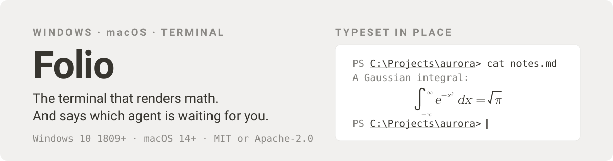
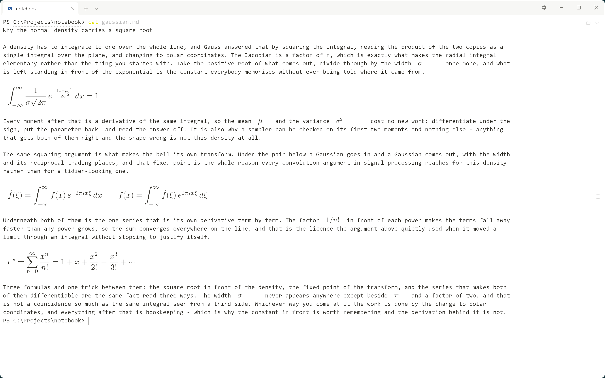
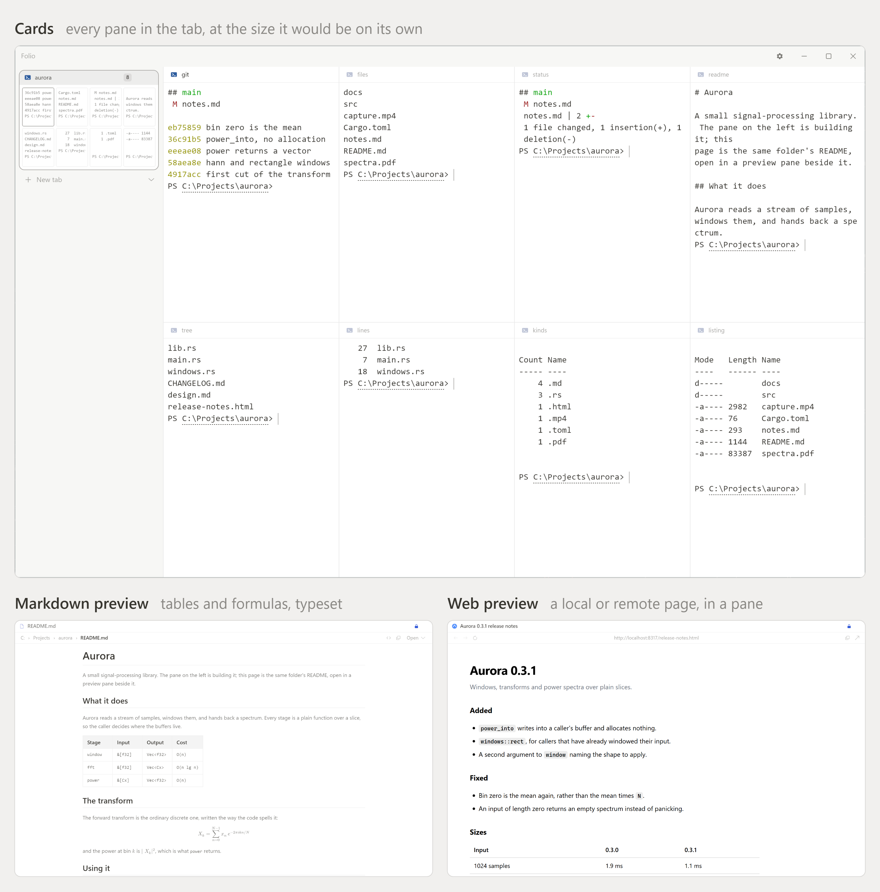

# Pictures in a markdown page

The acceptance corpus for `docs/DESIGN.md` §7.1.3k. Every section below is a
shape the preview has to answer, and the answer is written under it.

## 1. ``, relative to this file

The path is relative to `test-assets/`, so it climbs one level.



## 2. A title beside the destination

The title is parsed off; what reaches the disk is a path.



## 3. `<picture>`, one file per theme

Dark page draws the dark file, light page draws the light one.

<picture>
  <source media="(prefers-color-scheme: dark)"
          srcset="../assets/readme/hero-dark.svg">
  
</picture>

## 4. A bare ``



## 5. A remote picture is never fetched

Folio has no network client, so this one is the alt text and a link.


## 6. A picture that is not there


## 7. An empty alt is still a picture


## 8. Not a picture, and printed as it stands

<div align="center">
  <b>Every other tag is text.</b>
</div>

## 9. A picture written inside a code span

`` and a fence:

```markdown


```
